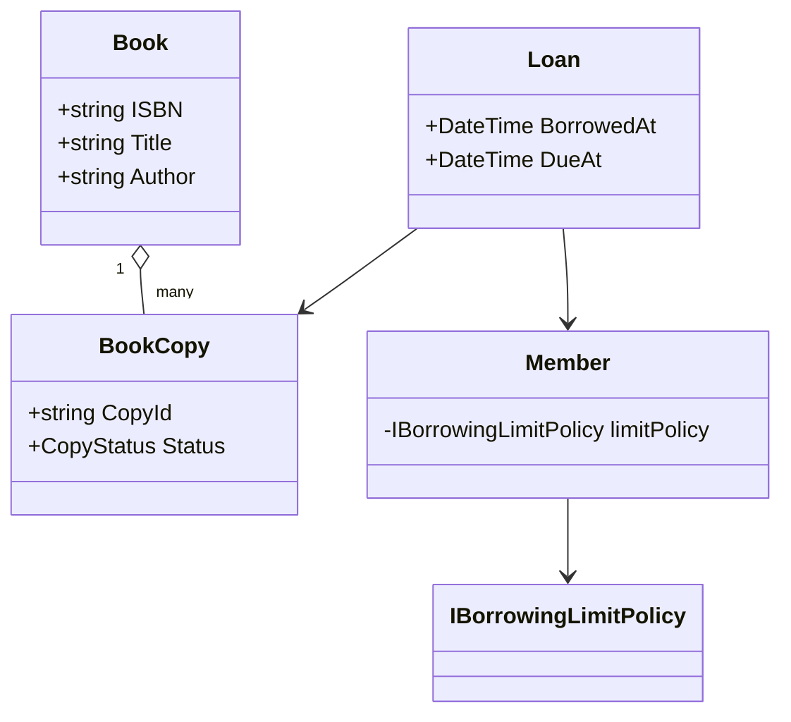
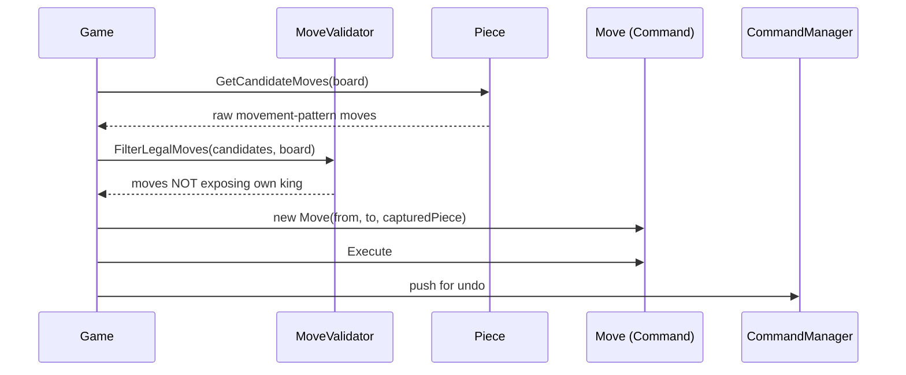
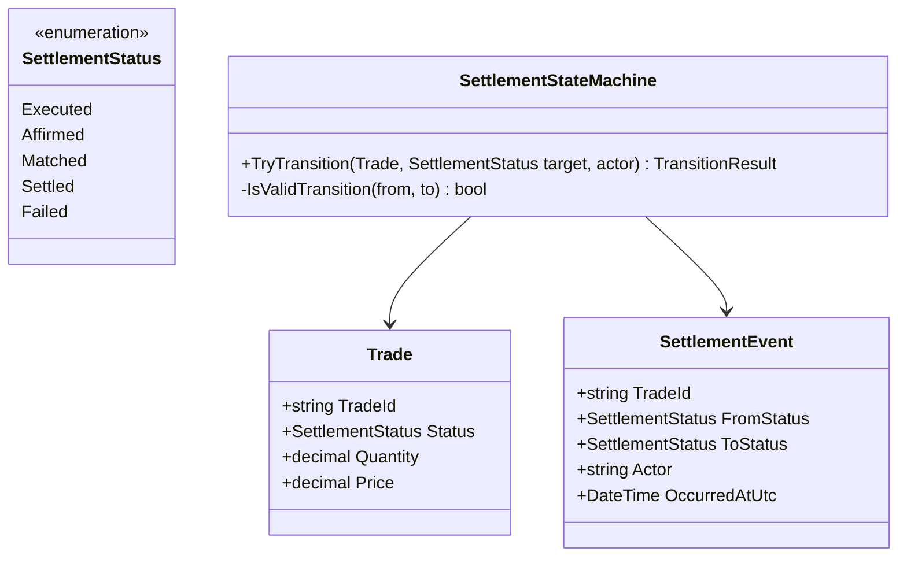
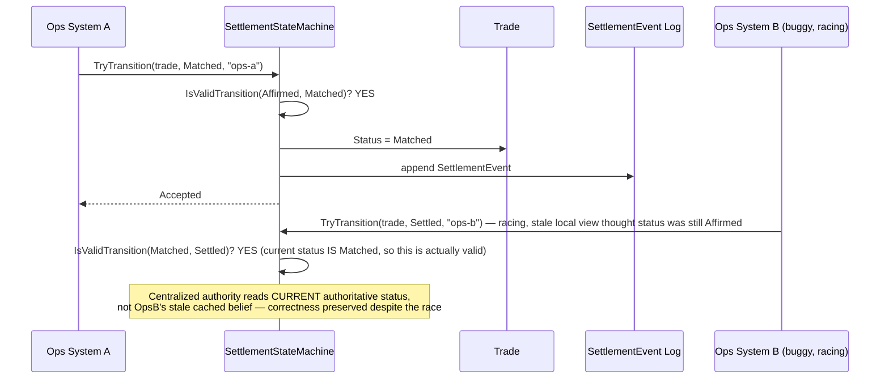

# Module 46 — Low-Level Design: Library Management System & Chess Game Engine

> Domain: Low-Level Design | Level: Beginner → Expert | Prerequisite: [[01-LLD-Fundamentals-Parking-Elevator]], [[../11-Design-Patterns/02-Behavioral-Patterns]] (Command pattern for move history/undo)

---

## 1. Fundamentals

### What do Library Management and Chess add beyond the Parking Lot/Elevator patterns?
Library Management introduces a genuinely new LLD concern: **multi-entity relationship modeling with real-world business rules** (a book has multiple physical copies, a member has borrowing limits and holds, a reservation queue has fairness rules) — testing whether a candidate can model a **richer domain** correctly, not just apply one or two design patterns. Chess introduces a different new concern entirely: **complex, rule-heavy behavior per entity type** (each piece type moves differently) combined with a requirement for **move history/undo** (directly the Command pattern, now in its most natural, textbook-fit application across this entire course) and **game-state validation** (is a move legal, is the king in check) — a domain where correctly identifying *where* validation logic belongs is the central design challenge.

### Why does this matter?
Because these two problems, together with the Parking Lot/Elevator, cover the four most common archetypal LLD interview shapes: **resource-allocation-with-policy** (Parking Lot), **state-machine-with-scheduling** (Elevator), **rich-entity-relationships-with-business-rules** (Library), and **rule-heavy-behavior-per-type-with-history** (Chess) — a candidate comfortable deriving a correct design across all four archetypes has genuinely internalized the underlying design judgment (§Advanced Q10's distinguishing signal) rather than memorized four unrelated solutions.

### When does this matter?
Any LLD interview or real system requiring rich domain modeling (Library) or complex per-type behavior with auditable history (Chess, but also any workflow/document-editing system needing undo/redo, directly the undo/redo stack, now reapplied here).

### How does it work (30,000-ft view)?
```
Library: Book (catalog entry) -- distinct from BookCopy (physical item) -- distinct from
 Loan (a specific borrowing transaction) -- Member has borrowing rules/limits
Chess: Board (8x8 grid of Square) -- Piece (abstract, one subclass per type OR a
 strategy-composed behavior) -- Move (a Command object, supporting undo) --
 Game (orchestrates turns, checks for check/checkmate)
```

---

## 2. Deep Dive

### 2.1 Library Management — the Book/BookCopy/Loan Distinction, the Central Modeling Insight
The single most important, most commonly-missed modeling decision in this problem: **`Book` (the catalog entry — title, author, ISBN) is distinct from `BookCopy` (a specific physical item on a specific shelf, which can be borrowed/returned/lost)** — a library owns multiple physical copies of the same book, and a `Loan` is associated with a specific `BookCopy`, not the abstract `Book` — a candidate who conflates these two (treating "Book" as both the catalog entry and the borrowable unit) cannot correctly model "this specific copy is damaged and withdrawn from circulation while 4 other copies of the same title remain available," a genuinely common real-world library requirement. This is directly analogous to the product-catalog-vs.-specific-inventory-unit distinction (a product listing vs. a specific unit's stock count) — recognizing this as the same underlying "catalog entry vs. concrete instance" modeling pattern recurring across different domains is exactly the cross-problem synthesis this course's LLD modules aim to build.

### 2.2 Library — Borrowing Rules as a Composable Policy, Not Hardcoded Conditionals
A member's borrowing limit (how many books at once), loan duration, and hold/reservation-queue fairness rules are genuine, independently-varying business policies — directly the Strategy pattern again, but here composed as **multiple, independent policies** checked together (an `IBorrowingLimitPolicy`, a `ILoanDurationPolicy`, a `IHoldQueuePolicy`) rather than a single monolithic policy object, directly mirroring the multi-tier rate-limiting design ("AND across independent, individually-swappable policy checks") — recognizing this exact "multiple independent, composable policy checks, each individually swappable" shape recurring from API rate-limiting to library borrowing rules (this module) is a strong demonstration of transferable design-pattern literacy.

### 2.3 Chess — Piece Behavior: Inheritance vs Strategy, a Genuine, Debatable Trade-off
Unlike the vehicle-type trap (where inheritance was clearly the wrong choice), chess pieces present a genuinely **more debatable** case: each piece type (`Pawn`, `Rook`, `Knight`, `Bishop`, `Queen`, `King`) has **genuinely distinct movement behavior** (not just different data), satisfying the "is this a genuine is-a relationship with distinct behavior" test far more convincingly than the vehicle-type case did — an inheritance hierarchy (`Piece` abstract base, one subclass per type, each overriding `GetValidMoves(Board)`) is a legitimate, common, defensible choice here. An equally legitimate alternative: composition via an injected `IMovementStrategy` per piece instance (allowing, e.g., a chess-variant rule change — "this custom variant's Bishop moves like a Knight" — without a new class) — the "right" answer genuinely depends on whether the design needs to support such variant/rule-customization extensibility (favoring Strategy) or whether the piece-type set is fixed and unlikely to need runtime-swappable movement behavior (favoring the simpler inheritance approach) — a valuable, explicit trade-off discussion demonstrating that not every "different types with different behavior" scenario has one universally correct answer, contrasting instructively with the clearer vehicle-type case.

### 2.4 Chess — Move as a Command Object, Enabling Undo/Redo Natively
A chess move is precisely the Command pattern's ideal, textbook use case: encapsulating "move piece X from square A to square B" (plus any special-case state — a captured piece, castling rights, en passant eligibility) as an object with `Execute` and `Undo` methods, directly reusing the `CommandManager`/undo-redo-stack implementation **without modification** — this is precisely why chess is a valuable LLD teaching example: it's a domain where the Command pattern isn't merely applicable but is close to the *only* sensible way to implement undo/redo correctly, given how much incidental state a move can affect beyond the two squares directly involved (a captured piece must be restored on undo; castling affects two pieces; en passant captures a piece not on the destination square at all).

### 2.5 Chess — Where Does Move-Legality Validation Belong? A Genuine SRP Question
A recurring design question candidates often get wrong: should `Piece.GetValidMoves` return only moves legal *for that piece in isolation* (ignoring whether the move would leave the mover's own king in check), or should it return only **fully legal** moves (already filtering out any move that would expose the king)? The cleaner, SRP-compliant answer: `Piece` should only know about its **own movement pattern** (a rook moves in straight lines) — checking whether a candidate move would leave the king in check is a **board-wide, game-state concern** (requiring knowledge of every other piece's position and threats), architecturally belonging to a separate `MoveValidator`/`Game` component that takes `Piece`'s candidate moves and filters them against the full board state — conflating these two responsibilities into `Piece` itself (having each piece type reason about check-safety) violates SRP and, worse, requires duplicating check-detection logic across every piece subclass.

## 3. Visual Architecture

### Library Management

```mermaid
classDiagram
 class Book {
 +string ISBN
 +string Title
 +string Author
 }
 class BookCopy {
 +string CopyId
 +CopyStatus Status
 }
 class Loan {
 +DateTime BorrowedAt
 +DateTime DueAt
 }
 class Member {
 -IBorrowingLimitPolicy limitPolicy
 }
 Book "1" o-- "many" BookCopy
 Loan --> BookCopy
 Loan --> Member
 Member --> IBorrowingLimitPolicy
```

### Chess — Move as Command

```mermaid
sequenceDiagram
 participant Game
 participant Validator as MoveValidator
 participant Piece
 participant Move as Move (Command)
 participant History as CommandManager

 Game->>Piece: GetCandidateMoves(board)
 Piece-->>Game: raw movement-pattern moves
 Game->>Validator: FilterLegalMoves(candidates, board)
 Validator-->>Game: moves NOT exposing own king
 Game->>Move: new Move(from, to, capturedPiece)
 Game->>Move: Execute
 Game->>History: push for undo
```

## 4. Production Example
**Scenario**: A team building an internal library-catalog tool initially modeled `Book` as the single, directly-borrowable entity (no separate `BookCopy` concept) — this worked for the initial requirement ("track which books are checked out") but broke down completely once the library needed to track **multiple physical copies of the same title**: the system had no way to express "3 of our 5 copies of this title are currently on loan, 2 are available" — the single-`Book`-entity model could only represent a book as globally "available" or "checked out," an entirely inadequate representation once multi-copy tracking became a stated requirement. **Investigation**: recognized this as exactly the catalog-entry-vs-physical-instance conflation, discovered only once a requirement explicitly exposed the missing distinction — the original design had implicitly assumed (without ever stating it as a decision) that each book title had exactly one copy, an assumption that happened to hold during initial, small-scale testing but was never actually a stated, verified requirement. **Fix**: introduced `BookCopy` as a distinct entity (referencing its parent `Book` catalog entry), with `Loan` associating to a specific `BookCopy`, not the abstract `Book` — requiring a genuine schema/model migration, more disruptive than getting this distinction right during initial design. **Lesson**: this is precisely the "requirements must account for all actual dimensions" lesson recurring in a new domain — an implicit, never-explicitly-verified assumption ("one book = one borrowable unit") baked into the initial entity model became a costly retrofit once a real, foreseeable requirement (multi-copy tracking) exposed it; the specific, generalizable lesson: for any "catalog/inventory"-shaped domain (library books, e-commerce products, parking spots), always explicitly ask "is there a one-to-many relationship between the conceptual/catalog entity and the concrete, individually-trackable instances of it" during requirements clarification, since this distinction is easy to overlook when a domain's small-scale examples happen not to expose it.

## 5. Best Practices
- For any catalog/inventory-shaped domain, explicitly clarify and model the catalog-entry-vs-concrete-instance distinction (Book vs. BookCopy) during requirements gathering, not after a requirement exposes its absence (the incident).
- Compose multiple independent business-policy checks (borrowing limits, loan duration, hold-queue fairness) as separately-swappable Strategy implementations, directly mirroring the multi-tier rate-limiting design.
- Use the Command pattern for any domain requiring move/action history with undo/redo (chess moves, document edits, any transactional workflow needing reversibility).
- Keep per-entity-type behavior (a piece's movement pattern) separate from board/game-wide validation concerns (check-detection) — a clean SRP boundary, not conflated into one class.

## 6. Anti-patterns
- Conflating a catalog/conceptual entity with its concrete, individually-trackable instances (treating "Book" as both the title and the borrowable unit) — the incident.
- Hardcoding multiple independent borrowing-policy checks as inline conditionals in a single `Member`/`Library` method instead of composable, individually-swappable Strategy implementations.
- Having each `Piece` subclass independently implement check-detection logic, duplicating board-wide validation logic across every piece type and violating SRP.
- Implementing chess move execution without a Command-pattern-based undo mechanism, then needing to bolt on ad-hoc "remember what changed" logic reactively once undo is required.

---

## 7. Performance Engineering

**Object allocation cost of the class designs.** `BookCopy`, `Loan`, and each chess `Move`/`Command` object are all short-lived, identity-bearing reference types created at high frequency in a busy system (a large university library processing thousands of loans/day; an online chess platform running thousands of concurrent games) — the allocation pattern that matters most here is **not** any single object's size but the *rate* of small, short-lived allocations landing in Gen0. A `StandardMove`'s three fields (`_from`, `_to`, `_capturedPiece`) are cheap individually, but a single game can generate 40–80 `Move` objects, and at 10,000 concurrent games on a chess platform, that's 400,000–800,000 short-lived allocations/game-batch — well within what Gen0 handles cheaply, but it's exactly the kind of volume where a naive `GetValidMoves` implementation allocating a fresh `List<Square>` per candidate-move-generation call (rather than reusing a pooled buffer) starts to matter, mirroring Module 45 §7's LINQ-allocation lesson in a new domain.

**Concurrency-control overhead.** A `Loan`'s creation (§2.2's composed borrowing-policy check) must be atomic against the same `BookCopy` being borrowed twice concurrently — the same check-then-act shape as Module 45's parking-spot race, and the same fix applies: an atomic, database-backed check-and-transition on `BookCopy.Status` (`Available → OnLoan`), not a lock spanning the entire `LibraryService.BorrowAsync` call, which would unnecessarily serialize borrow requests for *different, unrelated* copies. For Chess, the `MoveValidator`'s `IsKingInCheck` check (§2.5) is read-heavy and computed against a single game's own board state — since one game is inherently single-writer (only the current player may move), no cross-request concurrency control is needed *within* a game at all; the actual concurrency concern is entirely at the platform level (many concurrent games, each independently single-threaded), a materially simpler concurrency profile than the Library's shared-resource contention.

**Move-generation and check-detection cost.** §2.5 established that `MoveValidator.GetLegalMoves` must simulate each candidate move and re-check for exposed-king status — a naive implementation recomputing the opposing side's *entire* attack surface from scratch for every one of a piece's candidate moves (as the Coding Exercises Hard-tier `IsKingInCheck` does) costs O(candidate moves × opposing pieces × opposing piece's own move generation) per legality check, which is acceptable for a single human-paced game but becomes the actual bottleneck for a chess engine evaluating millions of positions/sec — §10 Advanced Q3's incrementally-updated attacked-squares map is the concrete answer, trading upfront bookkeeping (updated on every `Execute`/`Undo`) for O(1) legality lookups instead of full recomputation, directly the same "maintain a derived, incrementally-updated structure" principle Module 45 §7 applies to elevator dispatch indexing.

## 8. Security

**Authorization boundaries within the class model.** A `Member`'s own `RequestLoan`/`RequestHold` operations must verify the requesting caller's identity matches the `Member` instance being acted on (§10 Intermediate Q6's resource-based-authorization point) — but the class model must also separate this from administrative operations (`Library.WithdrawCopy`, `Library.OverrideBorrowingLimit`), which belong on a distinct, role-gated `ILibraryAdministration` interface, directly mirroring Module 45 §8's `IParkingOperations`/`IParkingAdministration` split. For Chess, an online multiplayer platform must verify that a submitted `Move` command originates from the player whose turn it currently is — `Game.SubmitMove(playerId, move)` must reject a move attempt from the *non-active* player's connection, a check belonging to `Game`'s own turn-orchestration state (§10 Advanced Q7's Clock-integration point), not merely to a network-layer session check, since a compromised or buggy client could otherwise submit a syntactically valid move object out of turn.

**Input validation at object-construction boundaries.** `BookCopy`'s `CopyId`/ISBN association must be validated at construction (never accepting a copy referencing a `Book` that doesn't exist in the catalog); a chess `Move`'s `from`/`to` squares must be validated as on-board coordinates before being handed to `Piece.GetCandidateMoves` — passing an out-of-range square from an untrusted client input (an online platform's move-submission API) directly into board-indexing logic without validation is a concrete out-of-bounds-access risk, not merely a correctness nicety.

**Never trust client-supplied board/game state.** §10 Basic Q7 already establishes this at the conceptual level; concretely, an online chess platform's server must independently recompute move legality via its own authoritative `MoveValidator` against its own authoritative `Board` state on every submitted move — a client claiming "this move is legal" (e.g., a modified client bypassing local validation to submit an illegal move directly to the API) must be rejected by the same validation logic the legitimate client path uses, never granted a shortcut, exactly the "server is the single source of truth for any financially- or competitively-relevant state" principle applied to a game's move legality instead of a payment amount.

## 9. Scalability

**Single-process design extending to a distributed, multi-branch library or multiplayer chess platform.** A single `LibraryService` instance, as designed, coordinates one branch's `BookCopy`/`Loan` state — extending to a multi-branch library system (shared catalog, branch-local physical copies) requires the same catalog-vs-instance distinction (§2.1) applied one level higher: `Book` (the catalog entry) is genuinely shared/global across branches and can live in a centrally-replicated, read-heavy store, while each `BookCopy`'s `Status` and its owning `Loan` remain branch-local, authoritative state — directly Module 45 §9's facility-local-authority pattern, reapplied: no legitimate operation needs cross-branch atomicity over a single physical copy's loan status, only eventually-consistent, cross-branch *visibility* into which branches hold available copies of a given title.

**Chess platform scaling.** Unlike the Library's shared-resource contention, a single chess game has no natural sharding tension at all — each game is already a fully independent, single-writer unit of state (§7), so horizontal scaling is simply routing each game to any available game-server instance and never needing cross-game coordination; the actual scaling design question is entirely about **matchmaking and game-server assignment** (a separate concern from the LLD's own class design) and about durable game-state persistence so a game-server crash doesn't lose an in-progress game's move history — the Command-pattern move log (§2.4) is precisely what makes this recovery cheap: a crashed server's replacement can rebuild the current board state by replaying the persisted move history from the last checkpoint, rather than needing the exact in-memory object graph to have survived.

**High availability.** A `Loan`'s hold-queue claim (§10 Advanced Q6's atomic-claim fix) must be backed by durable, branch-local storage exactly as the Parking Lot's ticket state must be (Module 45 §9) — a `LibraryService` process restart must be able to reconstruct which holds are claimed versus still pending without losing or double-granting a claim, the same durable-state-behind-a-coordinator pattern recurring a third time in this course.

---

## 10. Interview Questions

### Basic (10)
1. **Q: Why is `Book` distinct from `BookCopy` in a well-designed Library Management system?** **A:** A library owns multiple physical copies of the same title; `Book` is the catalog entry (title, author, ISBN), `BookCopy` is a specific, individually-trackable physical item.
2. **Q: What does a `Loan` associate with — a `Book` or a `BookCopy`?** **A:** A specific `BookCopy` — the actual physical item being borrowed, not the abstract catalog entry.
3. **Q: What design pattern is Chess's "move" operation a textbook fit for?** **A:** The Command pattern, enabling undo/redo via `Execute`/`Undo`.
4. **Q: Should a chess piece's class know how to detect if its own king is in check?** **A:** No — that's a board-wide, game-state concern belonging to a separate validator/game component, not individual piece classes (an SRP distinction).
5. **Q: Is modeling chess pieces as an inheritance hierarchy a clearly wrong choice, unlike the Parking Lot's vehicle types?** **A:** No — it's a genuinely more debatable, legitimate choice, since pieces have real behavioral differences (unlike vehicle types, which differed mainly in data).
6. **Q: What are examples of independent, composable borrowing policies in a Library system?** **A:** Borrowing limit, loan duration, and hold-queue fairness rules.
7. **Q: Why shouldn't a client-submitted chess board state be trusted directly in an online multiplayer chess platform?** **A:** It must be validated against the authoritative server-side board state — never trust client-supplied state for move legality.
8. **Q: What's a common requirement that exposes the Book/BookCopy modeling mistake if missed initially?** **A:** Tracking multiple physical copies of the same title independently (some available, some checked out, some withdrawn).
9. **Q: Is scaling a Library/Chess LLD to millions of books/games an LLD or System Design concern?** **A:** System Design — it's a different discipline's altitude, layering on top of the LLD.
10. **Q: What should `Piece.GetValidMoves` return, precisely?** **A:** Candidate moves following that piece's own movement pattern — full legality filtering (check-safety) is a separate concern.

### Intermediate (10)
1. **Q: Why is the Book/BookCopy distinction directly analogous to the product-catalog-vs-inventory-unit distinction?** **A:** Both are the same underlying "conceptual/catalog entity vs. concrete, individually-trackable instance" modeling pattern — a product listing vs. a specific unit's stock count, a book title vs. a specific physical copy — recurring across genuinely different domains.
2. **Q: Why is composing multiple independent Strategy policies (for borrowing rules) preferable to one monolithic policy object?** **A:** Each policy (limit, duration, hold-queue fairness) varies independently and may need to change/be swapped separately — a single monolithic policy object would require modification for any one policy's change, violating OCP for the others.
3. **Q: Why does the "should Piece know about check-detection" question matter beyond just code organization?** **A:** Conflating it into `Piece` would require duplicating board-wide check-detection logic across every piece subclass (since every piece type's moves could potentially expose the king) — a genuine, avoidable violation of both SRP and DRY.
4. **Q: Why is the inheritance-vs-Strategy choice for chess pieces described as "genuinely more debatable" than the Parking Lot's vehicle-type case?** **A:** Chess pieces have real, distinct behavioral differences (satisfying the is-a/behavioral-distinctness test), unlike vehicle types (which differed mainly in data) — making inheritance a legitimate, defensible choice here, not a clear mistake.
5. **Q: Why does castling make the Command pattern's value for chess moves particularly clear?** **A:** Castling affects two pieces (king and rook) simultaneously in one logical move — a Command object can encapsulate this compound effect and its exact reversal, something a simpler "just record the from/to squares" approach would struggle to express and undo correctly.
6. **Q: Why should a Library system's hold/loan operations verify the requesting member's identity matches the operation's target member?** **A:** To prevent one member from viewing/modifying another member's loan history or holds — directly the resource-based authorization applied to this domain.
7. **Q: Why is "how would this scale to millions of books/games" best answered by recognizing it as a different discipline's question, rather than attempting to answer it within the LLD class diagram?** **A:** Scaling to that volume involves infrastructure/service-level concerns (sharding, distributed game-server routing) that the System Design tools address — forcing this into the LLD's class-relationship framing would conflate two genuinely different levels of design reasoning.
8. **Q: Why might a chess variant (a custom rule set) favor the Strategy-based piece-movement design over inheritance?** **A:** If movement behavior needs to be swappable per-instance at runtime (a custom variant's rule change) without introducing new classes, an injected `IMovementStrategy` accommodates this more directly than a fixed inheritance hierarchy would.
9. **Q: Why is en passant a particularly good test case for whether a chess Move's Command design is genuinely correct?** **A:** It captures a piece that is NOT on the move's destination square — a naive "restore whatever was at the destination square" undo implementation would fail to correctly restore this specific captured piece, exposing whether the Command object's captured state is genuinely complete and correct.
10. **Q: Why does the Book/BookCopy incident demonstrate the same underlying lesson as the vehicle-type incident, despite being a different specific mistake?** **A:** Both stem from an implicit, never-explicitly-verified assumption about the domain's actual entity structure (one dimension per vehicle vs. one copy per book) that happened to hold during small-scale initial testing but broke once a real, foreseeable requirement exposed the missing distinction.

### Advanced (10)
1. **Q: Diagnose the Book/BookCopy modeling incident from first principles, and design the specific requirements-clarification checklist item that generalizes beyond just "libraries," applicable to any catalog/inventory-shaped LLD problem.**
 **A:** Root cause: an implicit assumption (one copy per title) never explicitly surfaced or verified during requirements gathering. Generalized checklist item: for any domain involving a "thing that can be listed/cataloged" and "instances of that thing that can be individually acted upon" (borrowed, purchased, parked, assigned), explicitly ask: "can there be more than one concrete instance of a given catalog entry, and if so, do instances need independent state (available/damaged/reserved)?" — directly generalizing the product-vs-inventory-unit distinction and the spot-vs-vehicle distinction into one reusable, cross-domain LLD requirements-clarification question.
2. **Q: Design the full `Move` Command implementation handling castling's compound, two-piece effect, demonstrating the Command pattern's value concretely (Intermediate Q5).**
 **A:**
 ```csharp
public class CastlingMove: IMove
{
    private readonly Piece _king, _rook;
    private readonly Square _kingFrom, _kingTo, _rookFrom, _rookTo;

    public void Execute
    {
        _board.MovePiece(_king, _kingFrom, _kingTo);
        _board.MovePiece(_rook, _rookFrom, _rookTo);
        _king.HasMoved = true; _rook.HasMoved = true; // castling rights consumed
    }

    public void Undo
    {
        _board.MovePiece(_king, _kingTo, _kingFrom);
        _board.MovePiece(_rook, _rookTo, _rookFrom);
        _king.HasMoved = false; _rook.HasMoved = false; // restore castling-rights state too, not just position
    }
}
 ```
 Note `Undo` restores **both** position and the `HasMoved` flags — a naive undo restoring only board position but forgetting the castling-rights side effect would produce an incorrect game state (allowing castling again after undo, when the original position, before the move, may have already had castling rights available) — precisely the kind of "the Command must capture and reverse ALL side effects, not just the obvious ones" rigor establishes.
3. **Q: Explain how you would design the `MoveValidator` to efficiently determine "is my king in check after this candidate move" without recomputing every opposing piece's full move set from scratch for every single candidate move being evaluated.**
 **A:** A common optimization: maintain an incrementally-updated "attacked squares" map (which squares are currently under attack by which opposing pieces, updated incrementally as moves are made/undone via the Command pattern's `Execute`/`Undo`, rather than fully recomputed from scratch every time) — checking "would this candidate move leave my king in check" becomes checking whether the king's resulting square appears in this maintained attacked-squares map, rather than re-deriving the entire opposing side's attack surface for every single candidate move under evaluation — directly the same "maintain a derived, incrementally-updated structure rather than recomputing from scratch every time" principle as the batched view-count aggregation, here applied to chess attack-surface tracking instead of counters.
4. **Q: Design the composable borrowing-policy check precisely, demonstrating the "AND across independent policies" pattern concretely with actual code.**
 **A:**
 ```csharp
public interface IBorrowingPolicy { PolicyResult CanBorrow(Member member, BookCopy copy); }

public class BorrowingLimitPolicy: IBorrowingPolicy
{
    public PolicyResult CanBorrow(Member member, BookCopy copy) =>
        member.CurrentLoans.Count < member.MaxBorrowLimit
    ? PolicyResult.Allowed: PolicyResult.Denied("Borrowing limit reached.");
}

public class LibraryService
{
    private readonly IEnumerable<IBorrowingPolicy> _policies; // ALL must pass, directly the pattern

    public async Task<Loan> BorrowAsync(Member member, BookCopy copy)
    {
        foreach (var policy in _policies)
        {
            var result = policy.CanBorrow(member, copy);
            if (!result.IsAllowed) throw new PolicyViolationException(result.Reason);
        }
        return await CreateLoanAsync(member, copy);
    }
}
 ```
 Adding a new policy (e.g., "no more than 2 overdue books") requires only a new `IBorrowingPolicy` implementation and a registration entry — zero modification to `LibraryService.BorrowAsync`, directly demonstrating OCP compliance concretely, exactly mirroring the multi-tier rate-limit configuration structure.
5. **Q: How would you extend the Chess LLD to support a "game replay/analysis" feature (stepping forward and backward through an entire completed game's move history), and explain why the Command pattern makes this straightforward.**
 **A:** Since every move is already a Command object stored in an ordered history (the `CommandManager`), replay is simply repeatedly calling `Undo` (stepping backward) or re-`Execute`-ing from the stored sequence (stepping forward) — a feature that would require substantial additional design work if moves had been implemented as direct, un-encapsulated board mutations instead of Command objects, directly demonstrating the Command pattern's value extends beyond the immediate "support undo" requirement to any future feature needing to traverse action history.
6. **Q: Explain a scenario where the Library Management system's hold-queue (reservation waitlist for a currently-checked-out book) fairness policy could have a subtle correctness bug if not carefully designed, and how you'd fix it.**
 **A:** A naive "first member in the queue gets notified when a copy becomes available" design has a race-condition-adjacent correctness risk if two copies of the same title become available in quick succession (two returns) while the notification/claim process for the first available copy is still in progress — without an atomic "claim this specific copy for this specific queued member" operation (directly the optimistic-concurrency discipline, applied to hold-queue claiming instead of inventory decrementing), a second queued member could incorrectly be offered the same copy already claimed by the first, or two members could both believe they've successfully claimed available copies when only one copy was actually available.
7. **Q: Design how you would extend the Chess LLD to support time controls (each player has a limited total thinking time, decremented as they take their turn), and identify which existing component this integrates with.**
 **A:** A `Clock` component tracks each player's remaining time, decrementing while it's their turn (started/stopped by the `Game` orchestrator at the same points where it currently manages turn-switching) — critically, this integrates with the **existing** turn-management logic in `Game` (which already tracks whose turn it is) rather than requiring piece/move logic to be aware of timing at all, directly demonstrating that a well-decomposed LLD (with validation, movement, and turn-orchestration cleanly separated) accommodates a genuinely new requirement (time controls) by extending the orchestration layer specifically, without touching `Piece` or `Move` classes at all.
8. **Q: A candidate's Library Management design has `Member` directly querying the database for "is this book available" inside its own `RequestLoan` method. Evaluate this design choice.**
 **A:** This conflates `Member` (which should represent a person's borrowing state/policies) with data-access/coordination responsibility that belongs to a service-layer component (`LibraryService`, directly the SRP applied to entity-vs-service-layer separation) — `Member` reaching into a data store directly is both an SRP violation and makes `Member` harder to test in isolation (requiring a real or mocked data store just to test borrowing-limit logic) — recommend `Member` remain a plain domain entity holding its own state/policies, with a separate `LibraryService` orchestrating the actual borrow operation (checking availability, applying policies, creating the loan), directly the same entity-vs-orchestrator separation the `ParkingLot`-as-coordinator design already established.
9. **Q: Explain how you would design the Chess LLD's `Board` representation to balance simplicity (an 8x8 array of nullable `Piece` references) against a production chess engine's typical bitboard-based representation, and when each is appropriate.**
 **A:** A simple 2D array (or `Dictionary<Square, Piece>`) is entirely appropriate and expected for an LLD interview answer — clear, directly reflects the domain, and sufficient for correctness; a bitboard representation (each piece type/color represented as a 64-bit integer with bits marking occupied squares, enabling extremely fast bitwise move-generation) is a specialized optimization appropriate specifically for a genuine, performance-critical chess engine (evaluating millions of positions per second for AI move search) — explicitly naming this as "the simple representation is correct for this exercise; a real engine would use bitboards specifically for the move-generation performance this scale demands" demonstrates the same "acknowledge the trade-off, know when you'd revisit it" judgment as §Advanced Q4.
10. **Q: As a Principal Engineer, how would you use the Library Management and Chess LLD exercises together, alongside the Parking Lot and Elevator, to calibrate a consistent LLD interview bar across an interviewing team?**
 **A:** Establish a shared rubric explicitly keyed to the cross-cutting judgment signals these four exercises collectively probe (not each exercise's specific "correct" class diagram, since multiple reasonable designs exist for each): does the candidate clarify requirements before designing (surfacing the catalog-vs-instance distinction, Advanced Q1's generalized checklist)? Do they justify pattern choices from the problem's actual variability (§Advanced Q10's derivation-vs-recitation signal)? Do they correctly place responsibilities (SRP, the Piece-vs-Validator boundary)? Do they walk through concrete, tricky scenarios (castling/en passant, concurrent hold-queue claims)? — training interviewers to evaluate against these transferable, cross-exercise signals (rather than a rigid, single "correct" answer per problem) produces far more consistent, meaningful interview calibration than grading each problem's class diagram against one memorized template.

### Expert (10)
1. **Q: Design the atomic `BookCopy.Status` check-and-transition precisely (§7), and explain why a lock spanning the entirety of `LibraryService.BorrowAsync` is the wrong-granularity mistake, mirroring Module 45's parking-spot lesson.**
 **A:**
 ```csharp
public async Task<Loan> BorrowAsync(Member member, string copyId)
{
    // atomic, narrowly-scoped: touches only THIS copy's row, not the whole service
    var claimed = await _copyStore.TryTransitionStatusAsync(copyId, from: CopyStatus.Available, to: CopyStatus.OnLoan);
    if (!claimed) throw new InvalidOperationException("Copy is no longer available.");

    foreach (var policy in _policies) // §2.2's composed policy check, evaluated AFTER the claim
    {
        var result = policy.CanBorrow(member, copyId);
        if (!result.IsAllowed)
        {
            await _copyStore.TryTransitionStatusAsync(copyId, from: CopyStatus.OnLoan, to: CopyStatus.Available); // release on policy failure
            throw new PolicyViolationException(result.Reason);
        }
    }
    return await CreateLoanAsync(member, copyId);
}
 ```
 A single lock around the entire method would serialize *every* borrow request system-wide, even for entirely unrelated copies of unrelated titles — exactly Module 45 §7's over-broad-lock mistake, reapplied. The narrowly-scoped, per-copy atomic transition lets unrelated borrows proceed fully in parallel, with contention only possible between two callers racing for the *same specific copy*, which is both rare and correctly resolved by the atomic transition's own failure branch.
 **Why this answer is correct:** Scopes atomicity to exactly the resource in contention (one copy row) and explicitly shows the compensating release-on-policy-failure path, a detail a lock-based design would need equally but is easy to omit.
 **Common mistakes:** Locking the entire `BorrowAsync` call "to be safe," which is correct but needlessly serializes unrelated operations; forgetting to release the claimed copy if a downstream policy check subsequently fails.
 **Follow-ups:** "What happens if the process crashes between the claim and the policy check?" (The copy remains stuck in `OnLoan` with no `Loan` record — requiring a reconciliation sweep for orphaned claims, the same durable-state-recovery concern §9 raises for hold-queue claims.)

2. **Q: Design the `Game.SubmitMove` turn-authorization check from §8 as actual code, and explain the specific attack it prevents that a network-layer session check alone would miss.**
 **A:**
 ```csharp
public MoveResult SubmitMove(string requestingPlayerId, IMove move)
{
    if (requestingPlayerId != _currentTurnPlayerId) // the turn-state check belongs to Game, not the transport layer
        return MoveResult.Rejected("It is not your turn.");

    var legalMoves = _validator.GetLegalMoves(_board.PieceAt(move.From), move.From, _board);
    if (!legalMoves.Contains(move.To))
        return MoveResult.Rejected("Illegal move.");

    move.Execute();
    _history.Push(move);
    _currentTurnPlayerId = OpponentOf(requestingPlayerId);
    return MoveResult.Accepted;
}
 ```
 A network-layer session check alone verifies "this authenticated connection belongs to player X" but says nothing about *whether it's player X's turn* — a compromised or modified client (or a race between two rapid submissions from the same legitimately-authenticated player) could submit two moves in a row, or one player could submit both sides' moves if the client, not the server, were trusted to enforce turn order. The turn check must live in `Game`'s own authoritative state, evaluated on every submission, independent of and in addition to transport-layer authentication.
 **Why this answer is correct:** Distinguishes authentication (who is this connection) from this specific authorization check (is it this identity's turn), showing why the latter cannot be delegated to the transport layer.
 **Common mistakes:** Assuming a valid, authenticated session is sufficient proof a submitted move is legitimate, missing the separate turn-order authorization dimension.
 **Follow-ups:** "How would you defend against a legitimate player submitting two rapid, concurrent move requests before the first is processed?" (Serialize move submission per-game via a single-writer queue or lock scoped to that one game instance — cheap and correct, since §9 establishes each game is already an inherently single-writer unit.)

3. **Q: Design the incrementally-updated attacked-squares map from §7/§10 Advanced Q3 precisely, showing how it is maintained across `Execute`/`Undo`.**
 **A:**
 ```csharp
public class AttackSurfaceTracker
{
    private readonly Dictionary<Square, HashSet<Square>> _attacksBySquare = new(); // attacker square -> squares it attacks

    public void OnPieceMoved(Piece piece, Square from, Square to, Board board)
    {
        _attacksBySquare.Remove(from); // this piece's old attack set is stale
        _attacksBySquare[to] = piece.GetCandidateMoves(board, to).ToHashSet(); // recompute ONLY this piece's new set
        // any piece whose attacks were blocked/unblocked by this move (a discovered check/pin) must also be
        // recomputed -- bounded to pieces sharing a rank/file/diagonal with `to`, not the whole board
    }

    public bool IsSquareAttacked(Square target, Color byColor, Board board) =>
        _attacksBySquare
            .Where(kv => board.PieceAt(kv.Key)?.Color == byColor)
            .Any(kv => kv.Value.Contains(target)); // O(pieces of one color), not O(pieces × full move regeneration)
}
 ```
 The key correctness detail: moving one piece can change *other* pieces' attack sets too (a discovered check, a piece whose line of attack was blocked and is now open) — the update must recompute not just the moved piece's own attacks but also any piece sharing a rank/file/diagonal with the vacated or newly-occupied square, bounded to a small, geometrically-determined set rather than the entire board, preserving the O(1)-amortized-update property Module 45 §7's zone-partitioned elevator index establishes in a different domain.
 **Why this answer is correct:** Correctly identifies and handles the discovered-check edge case, which a naive "only update the moved piece's own attack set" implementation would silently miss.
 **Common mistakes:** Updating only the moved piece's attack set, missing that other pieces' attack sets can change as a side effect of a move that blocks or unblocks their line of sight.
 **Follow-ups:** "How would you test this specifically for correctness?" (A property-based test comparing the incrementally-updated tracker's output against a full from-scratch recomputation after a large number of random legal move sequences — the incremental structure must always agree with the ground-truth full recomputation.)

4. **Q: Design the `ILibraryAdministration`/`ILibraryOperations` authorization split from §8 precisely, and explain what specific incident class it prevents relative to a single fat interface.**
 **A:**
 ```csharp
public interface ILibraryOperations // any authenticated member, scoped to their own identity
{
    Task<Loan> BorrowAsync(Member requestingMember, string copyId);
    Task RequestHoldAsync(Member requestingMember, string isbn);
}

public interface ILibraryAdministration // Librarian/Admin role only
{
    Task WithdrawCopyAsync(string copyId, string reason);
    Task OverrideBorrowingLimitAsync(string memberId, int newLimit);
}
 ```
 Splitting these prevents the same privilege-escalation risk class Module 45 §10 Expert Q5 identifies: without the split, a single `LibraryService.WithdrawCopyAsync` method reachable from the same object a member-facing handler holds is one missing `if (user.IsLibrarian)` check away from letting any authenticated member withdraw an arbitrary copy — the interface split makes this structurally unreachable from member-facing code paths rather than merely discouraged by convention.
 **Why this answer is correct:** Names the concrete privilege-escalation risk the split prevents and mirrors the established cross-module pattern precisely.
 **Common mistakes:** Treating this as a stylistic preference rather than a structural security control with a specific, nameable failure mode it closes.
 **Follow-ups:** "Should `RequestHoldAsync` validate that `requestingMember` matches the caller's authenticated identity?" (Yes — §8's resource-based-authorization point requires this even within `ILibraryOperations`, since the interface split alone doesn't prevent one member from passing a *different* member's ID as the argument.)

5. **Q: Design a durable-recovery mechanism for the orphaned-claim scenario from Expert Q1's follow-up (process crash between copy-claim and policy check).**
 **A:** A background reconciliation sweep runs periodically (e.g., every 60 seconds), querying for any `BookCopy` in `OnLoan` status with no corresponding `Loan` record older than a short grace window (long enough to tolerate normal in-flight processing latency, short enough to bound how long a copy can be incorrectly unavailable) — any such orphan is atomically reverted to `Available`, using the same `TryTransitionStatusAsync` primitive as the original claim, so the reconciliation sweep itself cannot race incorrectly against a genuinely-still-in-flight, non-crashed request.
 **Why this answer is correct:** Uses the same atomic primitive for both the original operation and its recovery path, avoiding introducing a second, differently-reasoned concurrency mechanism just for cleanup.
 **Common mistakes:** Reverting orphaned claims via a raw, unsynchronized status write rather than the same atomic transition primitive, which could race against a legitimately-still-processing (not actually crashed) request.
 **Follow-ups:** "How would you distinguish a genuinely orphaned claim from one that's merely slow?" (The grace-window threshold, calibrated against the system's own measured p99 policy-check latency — flagging only claims that exceed several multiples of that, not merely the median.)

6. **Q: A chess platform's `Move` Command objects are persisted for replay/recovery (§9). Design the checkpoint strategy that avoids requiring a full replay from move 1 for a long-running game's crash recovery.**
 **A:** Periodically (e.g., every 20 moves, or every N minutes of game time) persist a full, materialized snapshot of the current board state alongside the move history — on recovery, the server loads the most recent snapshot and replays only the moves recorded *after* that snapshot, rather than the entire game's history from move 1, bounding recovery cost by the checkpoint interval rather than total game length. Critically, the snapshot is a **derived, rebuildable cache** of the move-history's replay result, never the authoritative source of truth — the move history remains authoritative, and the snapshot exists purely as a recovery-time optimization, so a corrupted or lost snapshot degrades recovery cost (falling back to full replay) but never correctness.
 **Why this answer is correct:** Correctly preserves the move history as the single source of truth while using the snapshot purely as a bounded-cost optimization, explicitly stating what happens if the optimization itself is unavailable.
 **Common mistakes:** Treating the periodic snapshot as authoritative state in its own right (rather than a derived, rebuildable cache), which risks the snapshot and the move history silently diverging if any code path updates one without the other.
 **Follow-ups:** "Why is this the same underlying pattern as event sourcing with snapshotting?" (Because it is exactly that pattern, applied here specifically because §2.4 already modeled every move as an immutable Command object in an ordered history — the natural event-sourced structure making snapshotting a straightforward, low-risk addition rather than a architectural change.)

7. **Q: Critique a proposed Library design where `BookCopy.Status` transitions are validated only by application-level `if` checks scattered across `LibraryService`'s methods, with no centralized state-machine definition.**
 **A:** Scattered `if` checks risk exactly the kind of drift §14's incident (below) would expose — two different methods independently re-implementing "is this a valid transition from X to Y," which can silently diverge as the codebase evolves (one method updated to allow a new transition, a parallel check elsewhere not updated to match). The fix: centralize valid transitions in a single, explicit state-machine definition (`CopyStatus` transition table, or an enum-driven `IsValidTransition(from, to)` method every mutation path calls) — the same "chess Piece knows only its own pattern, MoveValidator owns the shared, single validation authority" separation (§2.5), reapplied to guarantee there is exactly one place status-transition legality is decided, not several that must independently stay in sync.
 **Why this answer is correct:** Identifies the specific drift risk of scattered validation logic and proposes the same centralized-authority pattern this module already establishes for a structurally analogous problem.
 **Common mistakes:** Adding an `if` check at each new call site as the codebase grows, rather than recognizing the recurring need for one centralized, single-source-of-truth transition authority.
 **Follow-ups:** "Would this centralization also help the orphaned-claim reconciliation sweep from Expert Q5?" (Yes — the sweep's revert operation should call the same centralized transition-validation authority as every other mutation, guaranteeing it can never perform an implicitly-invalid transition even during exceptional-path cleanup.)

8. **Q: Design a load-testing strategy specifically targeting the hold-queue atomic-claim logic (§10 Advanced Q6) to verify it under realistic concurrent-return conditions, not just a single pairwise test.**
 **A:** Simulate N concurrent "copy returned" events for the same title with M queued members waiting, asserting exactly `min(N, M)` successful claims occur and no claim is granted twice — critically, the test must include a scenario where returns and claim-attempts are deliberately interleaved with random delays (not perfectly synchronized), since a naive test issuing all events simultaneously may not exercise the specific narrow race window a slightly-staggered, more realistic arrival pattern would expose, directly the same "property-based, randomized-ordering test, not only hand-picked pairwise scenarios" discipline Module 47's CRDT-testing material establishes for merge-function correctness.
 **Why this answer is correct:** Specifies the precise invariant to assert (`min(N,M)` successful claims, no double-grant) and explicitly calls out why randomized timing, not only simultaneous or hand-picked timing, is necessary to reliably exercise the race.
 **Common mistakes:** Testing only the simplest two-concurrent-returns case, missing that a subtler bug might only manifest under a specific, less obvious interleaving of three or more concurrent operations.
 **Follow-ups:** "How would you determine the test has run long enough / with enough iterations to have real confidence?" (Run many randomized-seed iterations and require zero invariant violations across all of them, treating even one violation as a genuine failure requiring investigation, not a flaky test to be re-run and ignored.)

9. **Q: As a Principal Engineer, a team proposes eliminating the `MoveValidator`/`Piece` separation (§2.5) to "simplify" by letting each `Piece` subclass directly check for exposed-king status inline. Evaluate, connecting to this module's central SRP theme and to the incident pattern this course has repeatedly identified.**
 **A:** Reject this — it reproduces, in a new domain, the exact SRP-violation shape Module 45's monolithic-`ParkingSystemManager` proposal represents (§10 Advanced Q9 there): check-detection logic duplicated across every `Piece` subclass, each independently re-implementing board-wide reasoning that belongs in exactly one place, with the attendant risk that a future bug-fix or optimization (like Expert Q3's incremental attack-surface tracker) would need to be replicated correctly across every subclass rather than updated once in a single, focused component. The "simplification" is illusory — it trades one, well-isolated component's complexity for the same total complexity duplicated N times across N piece types, strictly worse for both correctness-risk and maintainability.
 **Why this answer is correct:** Names the specific duplicated-logic risk and connects it to an explicitly analogous, previously-established incident pattern from the sibling module, demonstrating the cross-module synthesis this course's Principal Engineer sections are meant to exercise.
 **Common mistakes:** Evaluating the proposal only on its stated merit ("fewer classes") without tracing through what duplicating check-detection logic across every piece subclass actually costs in future-maintenance risk.
 **Follow-ups:** "Is there ever a legitimate reason to move some board-wide logic into `Piece`?" (Only if a specific piece type's behavior is genuinely piece-intrinsic and not board-wide — e.g., a variant chess ruleset where a custom piece's *own* movement pattern is unusual — never for check-detection, which is irreducibly a property of the whole board, not any one piece.)

10. **Q: Synthesize the governance model a Principal Engineer would establish across the Library and Chess LLD domains, given the recurring atomic-state-transition, authorization-boundary, and centralized-validation-authority patterns identified throughout this module.**
 **A:** (1) Every financially- or state-integrity-relevant mutation (a copy's borrow/return, a move's execution) goes through a single, atomic check-and-transition primitive — never a lock spanning unrelated operations (Expert Q1), and never scattered, duplicated `if`-based validation across multiple call sites (Expert Q7). (2) Every public API surface is split into caller-scoped and admin-scoped interfaces at the DI/type-system level, not merely convention-enforced at the method-body level (Expert Q4). (3) Any exceptional-path recovery/reconciliation logic (orphaned claims, crash recovery) reuses the same atomic/centralized-authority primitives as the primary path, rather than introducing a second, independently-reasoned mechanism (Expert Q5). (4) Concurrency-sensitive logic is load-tested with randomized, realistic interleavings, not only simultaneous or hand-picked pairwise scenarios (Expert Q8). (5) A proposed "simplification" that duplicates board-wide/system-wide logic across multiple entity types is rejected on sight as a known-costly SRP-violation shape, not evaluated fresh each time it recurs (Expert Q9).
 **Why this answer is correct:** Names five distinct, individually necessary governance controls, each directly traceable to a specific risk this module's incidents and worked examples surfaced.
 **Common mistakes:** Governing the "obvious" concurrency risk (the atomic transition) thoroughly while leaving the less-obvious risks (scattered validation drift, exceptional-path divergence from the primary path) ungoverned, which is exactly where the subtler incidents in this module's worked examples occur.
 **Follow-ups:** "Which single control, if it alone had existed from the start, would have prevented the most incident classes across both this module and Module 45?" (The atomic, single-authority state-transition primitive (points 1 and 3 combined) — nearly every incident traced through this module and its sibling (the double-exit ticket race, the orphaned hold-queue claim, the double-charge production incident) is a variant of the same root failure: a financially- or integrity-relevant state change that wasn't made through one, single, atomically-enforced transition path.)

---

## 11. Coding Exercises

*(LLD interviews use worked class-design exercises with actual, compilable code, consistent with this domain's practical nature.)*

### Easy — Book/BookCopy distinction (the fix)
```csharp
public class Book // catalog entry
{
    public string Isbn { get; init; } = "";
    public string Title { get; init; } = "";
    public string Author { get; init; } = "";
}

public class BookCopy // a SPECIFIC, individually-trackable physical item
{
    public string CopyId { get; init; } = "";
    public Book Book { get; init; } = null!;
    public CopyStatus Status { get; set; } // Available, OnLoan, Withdrawn, Lost
}

public enum CopyStatus { Available, OnLoan, Withdrawn, Lost }
```

### Medium — Chess piece movement (inheritance-based, the legitimate choice)
```csharp
public abstract class Piece
{
    public Color Color { get; init; }
    public bool HasMoved { get; set; }
    public abstract IEnumerable<Square> GetCandidateMoves(Board board, Square currentPosition);
    // Deliberately does NOT check for check-safety here -- that's MoveValidator's job.
}

public class Rook: Piece
{
    public override IEnumerable<Square> GetCandidateMoves(Board board, Square currentPosition) =>
        board.GetSquaresAlongRanksAndFiles(currentPosition)
    .TakeWhile(sq => board.IsEmptyOrCapturable(sq, Color));
}

public class Knight: Piece
{
    public override IEnumerable<Square> GetCandidateMoves(Board board, Square currentPosition) =>
        Board.KnightOffsets
    .Select(offset => currentPosition + offset)
    .Where(sq => board.IsValidSquare(sq) && board.IsEmptyOrCapturable(sq, Color));
}
```

### Hard — MoveValidator, separating check-detection from piece movement
```csharp
public class MoveValidator
{
    public IEnumerable<Square> GetLegalMoves(Piece piece, Square currentPosition, Board board)
    {
        var candidates = piece.GetCandidateMoves(board, currentPosition); // piece knows ONLY its own pattern

        foreach (var candidate in candidates)
        {
            var simulatedBoard = board.SimulateMove(currentPosition, candidate); // hypothetical, non-mutating
            if (!IsKingInCheck(simulatedBoard, piece.Color)) // board-wide concern, NOT the piece's responsibility
                yield return candidate;
        }
    }

    private bool IsKingInCheck(Board board, Color kingColor)
    {
        var kingSquare = board.FindKing(kingColor);
        return board.GetAllPieces(kingColor.Opponent)
        .Any(p => p.GetCandidateMoves(board, board.PositionOf(p)).Contains(kingSquare));
    }
}
```

### Expert — Full Move Command with castling/en passant support (Advanced Q2's pattern, generalized)
```csharp
public interface IMove
{
    void Execute;
    void Undo;
}

public class StandardMove: IMove
{
    private readonly Board _board;
    private readonly Square _from, _to;
    private Piece? _capturedPiece;

    public StandardMove(Board board, Square from, Square to) { _board = board; _from = from; _to = to; }

    public void Execute
    {
        _capturedPiece = _board.GetPieceAt(_to); // remember what was captured, for undo
        _board.MovePiece(_from, _to);
    }

    public void Undo
    {
        _board.MovePiece(_to, _from);
        if (_capturedPiece is not null) _board.PlacePiece(_capturedPiece, _to); // restore the capture
    }
}

public class EnPassantMove: IMove
{
    private readonly Board _board;
    private readonly Square _from, _to, _capturedPawnSquare; // NOTE: capturedPawnSquare!= _to
    private Piece? _capturedPawn;

    public EnPassantMove(Board board, Square from, Square to, Square capturedPawnSquare)
    {
        _board = board; _from = from; _to = to; _capturedPawnSquare = capturedPawnSquare;
    }

    public void Execute
    {
        _capturedPawn = _board.GetPieceAt(_capturedPawnSquare);
        _board.RemovePiece(_capturedPawnSquare); // captured pawn is NOT at the destination square
        _board.MovePiece(_from, _to);
    }

    public void Undo
    {
        _board.MovePiece(_to, _from);
        if (_capturedPawn is not null) _board.PlacePiece(_capturedPawn, _capturedPawnSquare); // restore at its OWN square
    }
}
```
**Discussion**: `EnPassantMove` as a **distinct** `IMove` implementation (rather than trying to force it into `StandardMove`'s "captured piece is always at the destination square" assumption) directly demonstrates Intermediate Q9's point — en passant genuinely needs different undo logic (restoring the captured pawn at *its own* square, not the move's destination), exactly the kind of edge case that validates (or breaks) whether a Command-pattern design is genuinely complete, not just superficially pattern-compliant.

---

## 12. System Design

**Functional requirements**
- Support a multi-branch library network (shared catalog, branch-local physical copies and loans) or a multiplayer chess platform (independent, concurrently-running games with matchmaking, persistence, and replay).
- For the library: cross-branch title-availability search without requiring cross-branch atomicity on any single copy's loan status.
- For chess: durable, crash-recoverable game state and a spectator/replay feature built directly on the persisted Command history (§2.4).

**Non-functional requirements**
- A single copy's borrow/return must never be lost or double-granted, even under concurrent requests or a mid-operation process crash (§7, §10 Expert Q1/Q5).
- A chess move's turn-authorization and legality check must be enforced authoritatively server-side on every submission, never trusted from client state (§8).
- Cross-branch catalog visibility may lag by minutes (eventually consistent); a single branch's own loan state must be immediately, strongly consistent for its own operations.

**Back-of-the-envelope estimation**
A regional library network: 40 branches × ~25,000 physical copies average = 1,000,000 copies system-wide; assume 2 borrow/return cycles per copy per year → 2,000,000 loan events/year ≈ 5,500/day ≈ 0.06/sec sustained — trivially low aggregate volume. **What this tells us:** unlike Module 45's parking network, where local burst concurrency was the hard problem, the library network's genuine hard problem is **correctness under rare-but-real concurrent access to the same specific copy** (two members racing for the last available copy) and **cross-branch catalog consistency semantics**, not throughput — directly the same conclusion-from-the-numbers move this course's payment-system template requires: state explicitly what the arithmetic tells you the actual hard problem is, and here it is correctness/consistency design, not scale.

For chess: a large platform running 50,000 concurrent games, each generating roughly 1 move every 15–30 seconds on average → roughly 1,700–3,300 move-submissions/sec system-wide, but each individual game's own submission rate is trivial (well under 1/sec) — meaning the scaling unit is **breadth** (many independent, cheap games), not per-game throughput, directly justifying §9's "route each game to any available server, no cross-game coordination" architecture.

**Architecture (Library):** each branch runs its own `LibraryService` instance with branch-local durable storage for `BookCopy`/`Loan` state (§9); `Book` catalog entries are centrally maintained and replicated read-only to branches; a cross-branch search service queries a periodically-refreshed, eventually-consistent aggregate view (never the branch's own live loan state) for "which branches currently show an available copy of this title."

**Architecture (Chess):** stateless game-server instances, each hosting some number of independent, in-memory `Game` instances; a matchmaking service assigns new games to any available server; each `Game`'s move history is persisted incrementally (§10 Expert Q6's checkpoint strategy) to a durable store, enabling crash recovery and post-game replay/spectating without requiring the original server instance to still be alive.

**Components:** `LibraryService`/`Game` orchestrators; branch-local or per-game durable stores; `ILibraryAdministration`/turn-authorization-gated APIs (§8); cross-branch catalog aggregator; chess move-history persistence and checkpoint/snapshot service (§10 Expert Q6).

**Database selection:** branch-local `Loan`/`BookCopy` state in a relational store (ACID-appropriate for the atomic claim-and-transition requirement, §7); the cross-branch catalog aggregate in a read-optimized, denormalized store tolerant of staleness; chess move history as an append-only event log (naturally fitting the Command-object structure, §2.4) with periodic materialized-board-state snapshots.

**Caching:** a cached, eventually-consistent "approximate available copies by branch" view for search UX, always re-verified against the branch's own authoritative, atomic claim logic at actual borrow time — the cache may be stale, but the claim itself is never granted based on stale data.

**Messaging:** branch-local loan events published to a shared stream for the cross-branch aggregator to consume, exactly mirroring Module 45 §12's Kafka, `FacilityId`-partitioned analytics pattern, here partitioned by `BranchId`.

**Scaling:** library — horizontal by branch, each fully autonomous (§9); chess — horizontal by game, with matchmaking as the only component requiring any cross-game awareness at all.

**Failure handling:** a branch process crash triggers Expert Q5's orphaned-claim reconciliation sweep on restart; a chess game-server crash triggers recovery from the last checkpoint plus replay of subsequent persisted moves (§10 Expert Q6), never a lost or ambiguous game state.

**Monitoring:** per-branch claim-contention rate and orphaned-claim sweep frequency (a rising rate signals a genuine hot-title contention problem, not merely noise); chess move-submission latency and turn-authorization-rejection rate (a rising rejection rate could indicate a misbehaving or compromised client, §8's threat model).

**Trade-offs:** both domains trade a small amount of cross-shard (cross-branch, or cross-game) consistency freshness for eliminating an entire class of cross-shard coordination failure and latency at the point that actually matters (a single branch's own loan integrity; a single game's own move legality) — the same trade-off shape as Module 45 §12, now shown recurring in two structurally different domains, reinforcing that it is a general pattern for sharding correctly around genuinely local authority, not a coincidence specific to parking facilities.

---

## 13. Low-Level Design — New Case Study: Trade Settlement State Machine

A deliberately new, FinTech-native LLD case study, distinct from the Library and Chess material above — testing whether this module's core judgment (centralized state-transition authority, SRP between an entity's own state and system-wide validation, atomic claim-and-transition under concurrency, Command-pattern auditability) transfers cleanly to a domain this module has not directly modeled.

**Requirements:** model the lifecycle of a single trade from execution through settlement (simplified T+1 equities settlement): a trade is executed, then must be affirmed by both counterparties, matched against the counterparty's own record, and settled (cash and securities exchanged) — or, if any step fails, moved to a **fails/exception** state requiring manual investigation. Every state transition must be auditable (who/what triggered it, when) — a hard regulatory requirement, not a nice-to-have, directly the reason this is a strong echo of Chess's Command-pattern-for-auditability requirement (§2.4) in a domain where the audit trail has actual legal weight.

**Core entities:** `Trade` (instrument, quantity, price, counterparty, current `SettlementStatus`), `SettlementStatus` (an explicit, closed state enum: `Executed → Affirmed → Matched → Settled`, with a parallel `Failed` state reachable from `Affirmed` or `Matched`), `SettlementEvent` (an immutable, append-only record of every transition — the audit trail, directly the Command-object-as-history pattern), `SettlementStateMachine` (the single, centralized authority deciding which transitions are valid — directly Module 46 §10 Expert Q7's "centralize transition validation in exactly one place" lesson, now load-bearing for a regulatory requirement rather than a data-integrity nicety).

**Why this is the correct new case study to pair with this module's lessons:** a `Trade`'s status must never be mutated by an ad hoc `if` check scattered across multiple services (the exact anti-pattern Expert Q7 warns against) — with real money and real regulatory audit obligations riding on correctness, "which transitions are valid, and who validated this specific one" cannot be allowed to drift between two independently-maintained code paths the way §14's incident (below) shows it can.

**Class diagram:**

```mermaid
classDiagram
 class Trade {
 +string TradeId
 +SettlementStatus Status
 +decimal Quantity
 +decimal Price
 }
 class SettlementStatus {
 <<enumeration>>
 Executed
 Affirmed
 Matched
 Settled
 Failed
 }
 class SettlementStateMachine {
 +TryTransition(Trade, SettlementStatus target, actor) TransitionResult
 -IsValidTransition(from, to) bool
 }
 class SettlementEvent {
 +string TradeId
 +SettlementStatus FromStatus
 +SettlementStatus ToStatus
 +string Actor
 +DateTime OccurredAtUtc
 }
 SettlementStateMachine --> Trade
 SettlementStateMachine --> SettlementEvent
```

**Sequence diagram — a trade progressing to Settled, and a competing, invalid transition attempt rejected:**

```mermaid
sequenceDiagram
 participant OpsA as Ops System A
 participant Machine as SettlementStateMachine
 participant Trade
 participant Audit as SettlementEvent Log
 participant OpsB as Ops System B (buggy, racing)

 OpsA->>Machine: TryTransition(trade, Matched, "ops-a")
 Machine->>Machine: IsValidTransition(Affirmed, Matched)? YES
 Machine->>Trade: Status = Matched
 Machine->>Audit: append SettlementEvent
 Machine-->>OpsA: Accepted

 OpsB->>Machine: TryTransition(trade, Settled, "ops-b") — racing, stale local view thought status was still Affirmed
 Machine->>Machine: IsValidTransition(Matched, Settled)? YES (current status IS Matched, so this is actually valid)
 Note over Machine: Centralized authority reads CURRENT authoritative status,<br/>not OpsB's stale cached belief — correctness preserved despite the race
```

**Design patterns used:** the State pattern, in its classic, explicit form (§2.3's records-based-vs-classic-State discussion resolved here in favor of an explicit, closed enum with a single validating authority, since settlement states are a small, fixed, regulator-defined set — directly the same reasoning §2.3 applies to elevator states). The Command pattern for `SettlementEvent` as an immutable, appended audit record — never mutated or deleted, satisfying the regulatory audit-trail requirement the same way Chess's move history satisfies replay/undo. Strategy is deliberately **not** applied to the transition-validity rules themselves (they are regulator-defined and fixed, not a variable business policy) — the same "don't reach for Strategy without genuine variability" discipline §10 Intermediate Q9 establishes, correctly reapplied here in the negative.

**SOLID mapping:** SRP — `SettlementStateMachine` is the *only* component authorized to decide transition validity and to mutate `Trade.Status`; no other service may write to it directly, directly generalizing the centralized-authority lesson from both Chess's `MoveValidator` and Expert Q7's Library-transition-drift warning into a third domain. OCP — a new terminal state (e.g., a `PartiallySettled` state for split settlement) extends `SettlementStatus` and the transition table without modifying the core `TryTransition` orchestration logic itself.

**Extensibility:** adding a new pre-settlement step (e.g., a sanctions/compliance screening gate between `Matched` and `Settled`) is accommodated by inserting a new intermediate state and updating only the transition table — the same additive, OCP-compliant extension shape §10 Advanced Q3's VIP-parking-spot extension and Module 46's time-controls extension both demonstrate, now in a regulated domain where getting this wrong has compliance consequences, not merely a maintainability cost.

**Concurrency/thread safety:** exactly like Chess's turn-authorization check (§8, Expert Q2), the *authority* deciding whether a transition is valid must always read the trade's **current, authoritative** status at decision time — not a caller's possibly-stale, locally-cached belief about what the status is (the sequence diagram above shows why this matters: `OpsB`'s transition request is validated against the trade's actual current state, not against what `OpsB` assumed it was, so a race between two systems attempting different next-steps is resolved correctly by the single, centralized state machine rather than by hoping the two systems' local views never diverge). This requires the same atomic check-and-transition primitive Expert Q1 establishes for `BookCopy.Status`, now applied to a domain where an incorrect transition has direct financial and regulatory consequences rather than merely a double-booked library copy.

---

## 14. Production Debugging

**Incident:** A bank's post-trade operations platform began showing a small but persistent rate of trades stuck in `Matched` status well past their expected same-day settlement window, discovered when end-of-day settlement reconciliation (the same detection layer this course repeatedly identifies as the actual backstop) flagged a growing backlog of unsettled trades that internal systems showed as "on track."

**Root cause:** two independently-deployed downstream systems — the primary settlement-instruction generator and a newer, recently-added real-time settlement-status dashboard — had each implemented their **own** copy of the `Matched → Settled` transition-validation logic (the exact anti-pattern §10 Expert Q7 and this module's §13 both warn against), rather than routing every transition request through the single, centralized `SettlementStateMachine`. The dashboard's copy of the validation logic had been written against an earlier version of the settlement workflow and had never been updated when a new intermediate compliance-screening step was added between `Matched` and `Settled` — the primary generator correctly waited for compliance screening to clear before transitioning a trade to `Settled`, but the dashboard's separate, stale validation logic would independently mark a trade as "ready to settle" in its own local cache the moment it saw `Matched`, causing operations staff monitoring the dashboard to believe settlement was proceeding normally while the actual, authoritative trade record was correctly still waiting on compliance screening — a genuine dashboard/authoritative-state divergence, not a data-corruption bug.

**Investigation:** the on-call engineer initially suspected the compliance-screening service itself (the most recently deployed component) but found it was operating correctly and rejecting/clearing trades exactly as designed — tracing individual stuck `TradeId`s through the audit `SettlementEvent` log (the Command-pattern history, exactly as designed to support this kind of investigation) showed the authoritative state machine had never received a transition request past `Matched` for these trades at all, while the dashboard's own logs showed it had displayed "Settled — pending confirmation" for the same trades days earlier — exposing that the dashboard was never actually driving or gating any real transition; it was an independent, silently-diverged read path with its own stale copy of business logic that was never supposed to exist as a second authority in the first place.

**Tools:** the append-only `SettlementEvent` audit log, queried directly per `TradeId` to establish ground truth; a diff between the dashboard's displayed status and the authoritative state machine's actual status across the full trade population, which quickly surfaced the systematic (not random) nature of the divergence, correlating precisely with trades executed after the compliance-screening step's rollout date.

**Fix:** the dashboard was rearchitected to be a **pure read replica** of the authoritative `SettlementEvent` log — subscribing to the same event stream the state machine itself appends to, rather than maintaining any independent transition-validity logic of its own; this is a structural fix, not a patch, since it makes a second, independently-drifting authority architecturally impossible rather than merely re-synchronizing the dashboard's logic once and hoping it's kept in sync manually going forward.

**Prevention:** a standing architectural rule was adopted: **no component other than the designated single state-transition authority may independently implement or duplicate transition-validity logic, ever** — any component needing to display or react to settlement status must consume the authoritative event stream as a read-only subscriber, never maintain its own parallel decision logic; this rule was retroactively audited against every other downstream consumer of trade status in the platform, surfacing two additional components with the same latent risk before they produced a second incident.

---

## 15. Architecture Decision

**Context:** how should downstream consumers (a dashboard, a reporting service, an operations tool) obtain and display a trade's settlement status, given §14's incident.

**Option A — Each consumer independently re-implements transition-validity logic against its own periodically-polled snapshot of `Trade.Status`.**
Advantages: no architectural coupling to a shared event stream; simplest to build a first version of any one consumer in isolation.
Disadvantages: this is precisely §14's incident — every independent implementation is a latent drift risk the moment the authoritative transition rules change and any one consumer's copy isn't updated in lockstep; catastrophically poor at scale (N consumers means N independent chances to drift).
Cost/complexity: low upfront, but the true cost is the *ongoing*, compounding risk of undetected drift, which is a cost this option systematically hides until an incident like §14's surfaces it.
Recommended for: never, for any state whose correctness has real financial or regulatory weight — this option is presented as the anti-pattern baseline, not a genuine candidate.

**Option B — Consumers poll the authoritative `SettlementStateMachine`'s current status directly, on demand, with no independent validity logic of their own.**
Advantages: eliminates the drift risk entirely — there is exactly one place transition validity is decided, and every consumer reads its output rather than re-deriving it.
Disadvantages: polling at a frequency sufficient for a "real-time" dashboard either creates significant read load on the authoritative system or accepts meaningful display latency; doesn't naturally provide the full historical audit trail a reporting/compliance consumer might also need.
Cost/complexity: moderate. Maintainability: high — there's exactly one component to update when transition rules change.
Recommended for: consumers needing only current-status lookups with modest freshness requirements and no need for historical event detail.

**Option C — Consumers subscribe as read-only replicas of the authoritative `SettlementEvent` stream (the actual fix adopted in §14).**
Advantages: eliminates drift risk exactly as Option B does, while additionally providing the full historical audit trail for free (each consumer naturally builds its own read-optimized projection of the same append-only event history, directly the same Command-object-as-history reasoning §2.4 establishes for Chess move replay); scales read load away from the authoritative system, since consumers read from the stream, not from synchronous calls into the state machine itself.
Disadvantages: highest upfront architectural investment (requires a durable, subscribable event stream, not merely a queryable current-state API); consumers' projections are eventually consistent with the authoritative state by the stream's own propagation delay, which must be explicitly bounded and monitored.
Cost/complexity: highest upfront, lowest ongoing. Maintainability: highest — every consumer's correctness is structurally guaranteed to track the authoritative source, not dependent on each team remembering to keep their own copy in sync.
Recommended for: any downstream consumer of financially- or regulatorily-significant state, especially where multiple independent consumers exist or are expected to grow over time.

**Recommendation:** Option C, exactly as §14's fix adopted — the marginal upfront cost of building a proper event-stream subscription model, relative to Option B's simpler polling approach, is justified specifically because §14 demonstrates the alternative's failure mode is not hypothetical but has already occurred, and because the audit-trail requirement (a hard regulatory need, not optional) is a natural byproduct of Option C's design rather than a separate feature that would need to be built again on top of Option B. Option A is retained in this comparison only as the explicit anti-pattern baseline every new downstream-consumer proposal should be checked against and rejected on sight, per §10 Expert Q9's "reject known-costly shapes on sight" discipline.

---

## 17. Principal Engineer Perspective

**Business impact:** §14's incident — trades silently drifting from their authoritative status in a widely-trusted operations dashboard — is a direct settlement-risk and regulatory-reporting-accuracy issue, not merely a display bug; operations staff making real decisions (escalation, client communication, capital allocation against expected settlement timing) based on a dashboard that was systematically, silently wrong for a specific, non-random population of trades is exactly the kind of "declared state ≠ actual state" failure this entire program treats as maximally serious, regardless of the specific domain it occurs in.

**Engineering trade-offs:** Option C's higher upfront cost (§15) versus Option A/B's lower upfront cost is the central trade-off a Principal Engineer must make explicit and defensible to stakeholders who see only "the dashboard works today" and don't yet see the latent drift risk — the discipline required is treating a currently-working-but-structurally-unsound design as a real, quantifiable risk (not a hypothetical), the same posture this course applies uniformly to every "it happened to work so far" pattern it has surfaced.

**Technical leadership:** the retroactive audit that found two additional at-risk components (§14's prevention) is the concrete, high-leverage action a Principal Engineer takes after any incident of this shape: not merely fixing the one instance that broke, but treating the discovered failure *pattern* (independent, undeclared duplication of authoritative logic) as a signal to actively search for its other occurrences before they separately produce their own incidents.

**Cross-team communication:** the dashboard team and the settlement-instruction-generator team had no shared awareness that their two implementations needed to stay in lockstep — this is fundamentally a communication and ownership-boundary failure as much as a technical one; a Principal Engineer's remediation includes establishing clear, documented ownership ("the `SettlementStateMachine` team owns the *only* valid transition logic; every other team is a consumer, never an independent implementer") as an organizational, not merely architectural, artifact.

**Architecture governance:** the standing rule adopted in §14's prevention — no component may independently implement transition-validity logic — is exactly the kind of governance rule that must be enforceable structurally (via the read-only-subscriber architecture itself, Option C) rather than relying purely on a written policy document that a future, unaware team could simply not know about or forget; architecture governance that depends on universal awareness of a rule is weaker than governance that makes violating the rule structurally difficult to do by accident.

**Cost optimization:** Option C's higher build cost is justified here specifically because the domain (regulated settlement state) has actual, bounded, nameable financial and compliance downside from Option A/B's drift risk — the same cost-optimization judgment applied to Module 45's Option B-vs-C locking-strategy decision (§15 there), where the *opposite* conclusion (don't over-invest speculatively) was correct for a domain with genuinely lower stakes; a Principal Engineer's cost-optimization judgment is never a fixed rule ("always build the more robust option" or "always start simple") but a calibration to the actual, demonstrated or reasonably-foreseeable cost of the failure mode each option is protecting against.

**Risk analysis:** the core, transferable risk-analysis lesson across both this module's Library/Chess material and its new Settlement case study: any system with more than one component capable of independently deciding or asserting a piece of authoritative state is a latent drift risk, whether or not it has caused a visible incident yet — a Principal Engineer's risk register should track "number of independent implementations of the same authoritative logic" as a first-class, proactively-audited metric, not merely react to an incident once the drift becomes visible.

**Long-term maintainability:** the centralized-authority, single-source-of-truth pattern recurring across this module's `MoveValidator`, the Library's transition-table lesson, and the new Settlement `SettlementStateMachine` case study is not a coincidence of these three specific domains — it is the general shape any domain with a regulated, auditable, or safety-relevant state lifecycle should adopt by default, and a Principal Engineer's lasting contribution is institutionalizing this as a default architectural posture new teams inherit automatically, rather than a lesson each new system must independently rediscover the hard way, as §14's incident shows the settlement platform did.

---

## 18. Revision
**Key takeaways**: The catalog-entry-vs-concrete-instance distinction (Book vs. BookCopy) is a recurring, cross-domain LLD modeling pattern (directly paralleling the product-vs-inventory-unit and the spot-vs-vehicle distinctions) — always explicitly clarify whether this dimension exists during requirements gathering. Compose multiple independent business policies (borrowing rules) as separately-swappable Strategy implementations, directly mirroring the multi-tier rate-limiting "AND across independent checks" pattern. Chess pieces are a genuinely more debatable inheritance-vs-Strategy case than the vehicle types, since pieces have real behavioral differences — the right choice depends on whether runtime-swappable movement behavior (variant support) is a genuine requirement. The Command pattern is chess moves' textbook-ideal application, and edge cases (castling's two-piece effect, en passant's off-destination-square capture) are the correct test for whether a Command implementation is genuinely complete. Keep per-entity-type behavior (a piece's movement pattern) cleanly separated from board-wide validation concerns (check-detection) — an SRP boundary this course has repeatedly emphasized across every domain.

---

**Next**: This completes the `15-Low-Level-Design` domain (Modules 45–46). Continuing autonomously to `16-Distributed-Systems`.
