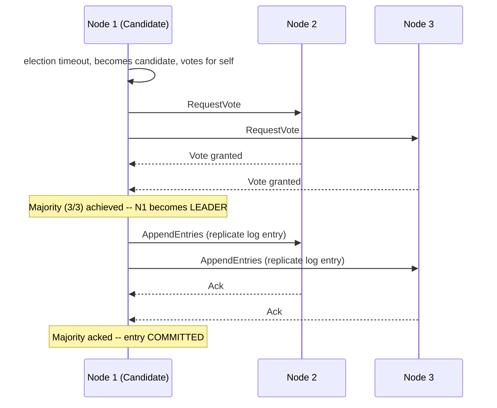
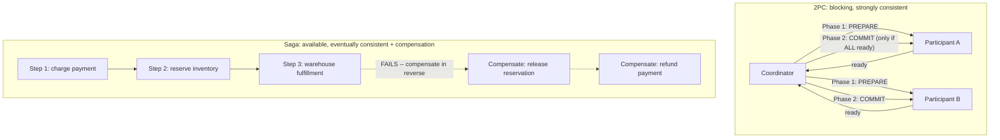

# Module 47 — Distributed Systems: Consensus, Consistency Models & Distributed Transactions

> Domain: Distributed Systems | Level: Beginner → Expert | Prerequisite: [[../14-System-Design/01-System-Design-Fundamentals]] §2.5 (CAP theorem), [[../04-SQL-Server/02-Transactions-Isolation-Locking]], [[../06-MongoDB/02-Consistency-ReplicaSets-Transactions]], [[../14-System-Design/07-Designing-Amazon-Ecommerce]] §2.4 (Saga, introduced there)

---

## 1. Fundamentals

### What is distributed-systems theory, and why does this module exist after so much prior, engine-specific consistency content?
This module makes **explicit and formal** the theoretical foundation that Modules 19, 22, 24, 26, and 28 each applied *implicitly*, engine-by-engine, to SQL Server, PostgreSQL, MongoDB, Redis, and DynamoDB's specific consistency knobs — **consensus algorithms** (how multiple nodes agree on a single value/decision despite failures) and **distributed transactions** (coordinating an atomic operation across multiple independent systems, directly the problem Module 43 §2.4 introduced via the Saga pattern) are the two foundational mechanisms underlying every one of those earlier, engine-specific discussions.

### Why does this matter?
Because recognizing that Module 19's SQL Server replication, Module 24's MongoDB write concern, Module 26's Redis replication, and Module 28's DynamoDB consistency parameter are all **the same underlying distributed-consensus problem**, solved slightly differently by each engine, is precisely the kind of unifying, cross-module synthesis this course has built toward — a Staff/Principal engineer should be able to explain *why* every one of those engine-specific mechanisms exists from these first principles, not merely operate each one correctly in isolation.

### When does this matter?
Any system spanning multiple nodes/services where coordinated agreement or atomicity is required; the depth matters for correctly choosing between two-phase commit, Saga, and consensus-based approaches for a given distributed-coordination problem, and for precisely understanding what a consensus algorithm (Raft/Paxos) actually guarantees versus what it doesn't.

### How does it work (30,000-ft view)?
```
Consensus: multiple nodes must agree on ONE value/decision (who is the leader? what is the next
           log entry?) despite node failures and network unreliability -- Raft/Paxos solve this.
Distributed transaction: an operation spanning multiple independent systems must either fully
           succeed or fully fail -- Two-Phase Commit (strict, blocking) or Saga (eventual,
           compensating) solve this, each with different trade-offs.
```

---

## 2. Deep Dive

### 2.1 The Consensus Problem, Precisely Defined
Consensus requires a set of nodes to agree on a single value despite some nodes failing or messages being delayed/lost, satisfying: **agreement** (all correct nodes decide the same value), **validity** (the decided value was actually proposed by some node, not fabricated), and **termination** (all correct nodes eventually decide, assuming the system isn't permanently, completely partitioned). This is a **provably hard** problem in fully asynchronous systems with even one faulty node (the FLP impossibility result) — practical consensus algorithms (Raft, Paxos) work around this by making reasonable, real-world assumptions (partial synchrony — messages usually arrive within a bounded time, even if this bound isn't guaranteed) rather than solving the theoretically-impossible general case.

### 2.2 Raft — Leader Election and Log Replication, the Modern, Understandable Consensus Algorithm
Raft (deliberately designed to be more understandable than the earlier Paxos) works via: **leader election** (nodes hold randomized-timeout-triggered elections; a candidate becomes leader upon receiving votes from a **majority** of nodes — the same majority-quorum reasoning as Module 26 §Advanced Q9's Sentinel-failover discussion and Module 22 §Advanced Q3's synchronous-replication-quorum discussion, now the general, formal mechanism underlying both), and **log replication** (the leader appends entries to its own log and replicates them to followers, only considering an entry **committed** once a majority of nodes have durably stored it — directly the same majority-based durability guarantee as MongoDB's `w: "majority"` write concern, Module 24 §2.1, now revealed as a direct application of Raft-style majority-commit reasoning, not a MongoDB-specific invention). Raft is the actual algorithm underlying etcd, Consul, and (in a Paxos-variant form) many production consensus systems.

### 2.3 Quorum-Based Systems — the Read/Write Quorum Trade-off, Generalized
A quorum-based system requires **W** (write quorum) nodes to acknowledge a write and **R** (read quorum) nodes to be consulted for a read, with the guarantee that **W + R > N** (total node count) ensures every read quorum overlaps with every prior write quorum by at least one node, guaranteeing a read will observe the most recent write — this single formula **is** the theoretical foundation behind every engine-specific read/write-consistency knob covered across Modules 19-28: DynamoDB's tunable consistency (Module 28 §2.1) is literally this quorum formula exposed as a parameter; MongoDB's `w`/read-concern settings (Module 24 §2.1-§2.2) are this same formula applied with MongoDB's specific replica-set semantics; Cassandra (a system this course hasn't covered directly, but whose consistency model is a direct, well-known application of this exact quorum formula) makes it an even more explicit, first-class per-query parameter.

### 2.4 Two-Phase Commit (2PC) vs Saga — Revisiting Module 43's Introduction with Formal Precision
**Two-Phase Commit** provides genuine atomicity across multiple resource managers: a coordinator asks every participant to **prepare** (lock resources, confirm readiness, but not yet commit) in phase one, then, only if **all** participants confirm readiness, tells everyone to **commit** in phase two (or, if any participant fails to confirm, tells everyone to **abort**) — this provides strong consistency but is **blocking** (a participant that has prepared but not yet heard the final commit/abort decision must hold its locks, potentially indefinitely, if the coordinator crashes at exactly the wrong moment — a genuine, well-documented 2PC failure mode) and requires all participants to be available and responsive throughout both phases, a poor fit for the loosely-coupled, independently-deployed/independently-available microservices architecture Module 43's order-fulfillment scenario assumed. **Saga** (Module 43 §2.4) sacrifices 2PC's blocking-atomicity guarantee for **availability** (each step commits independently and immediately; a later failure triggers compensating actions rather than blocking earlier participants) — directly a CAP-theorem-informed (Module 37 §2.5) choice of AP-leaning eventual consistency-with-compensation over CP-leaning blocking atomicity, precisely the trade-off Module 37 §Advanced Q8 introduced conceptually and Module 43 implemented concretely.

### 2.5 Vector Clocks and Logical Time — Ordering Events Without Synchronized Clocks
Directly extending Module 39 §2.4's "wall-clock timestamps are insufficient for cross-server ordering" lesson to its full theoretical generalization: **Lamport timestamps** provide a simple logical clock (each node increments a counter on every event, and includes its current counter value on every message sent, with the receiver adopting the max of its own and the received counter, plus one) giving a **partial** ordering sufficient to establish "happened-before" relationships without synchronized physical clocks. **Vector clocks** extend this (one counter per node, not a single scalar) to additionally detect **genuinely concurrent** (neither happened-before the other) events — directly the mechanism DynamoDB's original paper (and several NoSQL systems' conflict-detection logic) uses to distinguish "this write genuinely conflicts with that one" from "this write happened after that one, no conflict" during eventual-consistency reconciliation.

## 3. Visual Architecture

### Raft Leader Election and Log Replication


### 2PC vs Saga


## 4. Production Example
**Scenario**: A team building a cross-service inventory-and-order system initially implemented order placement using a hand-rolled, ad-hoc two-phase-commit-like protocol across the order service and inventory service (a coordinator calling "prepare" on both, then "commit" on both) — during a production incident where the coordinator process crashed **between** sending "prepare" to both services and sending the final "commit"/"abort" decision, the inventory service was left holding a **prepared-but-undecided** reservation indefinitely, blocking that specific inventory item from being sold to anyone else (since it was neither committed as sold nor rolled back as available) until an on-call engineer manually intervened, hours later, once the stuck reservation was noticed via a customer complaint about an item showing as unavailable despite apparent stock. **Investigation**: confirmed this was exactly 2PC's well-documented, textbook blocking failure mode (§2.4) — a coordinator crash between phases leaves participants in an indefinite, locked "prepared" limbo with no way to independently resolve the situation, since only the coordinator (now crashed) knows the actual final decision. **Fix**: migrated order fulfillment to the Saga pattern (directly Module 43 §2.4/§11 Expert exercise's design) — each step (payment, inventory reservation, warehouse notification) commits independently and immediately, with compensating actions defined for the failure case, eliminating the "indefinitely blocked, waiting for a crashed coordinator's decision" failure mode entirely, since no step ever holds an indefinite, coordinator-dependent lock. **Lesson**: 2PC's blocking failure mode isn't a rare, theoretical edge case — a coordinator crash at precisely the vulnerable moment (between phases) is a realistic, eventually-occurring production event for any long-running system, and the resulting indefinite resource-blocking is a severe, hard-to-automatically-recover-from failure mode — this is precisely *why* Saga (accepting eventual consistency and explicit compensation) is generally preferred over 2PC for real, independently-deployed microservices architectures, not merely a stylistic preference but a direct, demonstrated response to 2PC's specific, well-known failure characteristics.

## 5. Best Practices
- Recognize that engine-specific consistency mechanisms (MongoDB's write concern, DynamoDB's read consistency, Redis Sentinel's quorum) are all applications of the same underlying quorum/consensus theory (§2.2-§2.3) — use this unified understanding to reason about novel systems, not just memorized per-engine behavior.
- Prefer Saga over 2PC for coordination spanning independently-deployed, independently-available services — reserve 2PC (or avoid distributed transactions entirely, preferring a single-database transaction where genuinely possible) for tightly-coupled systems that can tolerate 2PC's blocking behavior.
- Use majority-quorum-based replication (Raft/Paxos-based systems, or the equivalent quorum settings in MongoDB/DynamoDB) for any genuinely critical, must-not-lose-committed-data requirement.
- Use logical/vector clocks, not wall-clock timestamps, for establishing event ordering across distributed nodes whenever genuine ordering (not just approximate recency) matters.

## 6. Anti-patterns
- Hand-rolling an ad-hoc two-phase-commit-like protocol without accounting for its well-documented blocking failure mode (§4's incident) — either use a mature, battle-tested distributed-transaction coordinator, or prefer Saga.
- Assuming a consensus algorithm (Raft/Paxos) can always make progress regardless of network conditions — genuine progress requires a majority of nodes to be reachable; a system split such that no partition has a majority cannot elect a leader or commit new entries, a correct, intentional behavior (favoring consistency over availability during a genuine partition), not a bug.
- Using wall-clock timestamps for distributed event ordering, vulnerable to clock skew (directly Module 39 §2.4's specific incident, now understood as a special case of this module's general logical-clock theory).
- Treating "eventually consistent" as synonymous with "no consistency guarantee at all" — quorum-based eventual consistency still provides precise, well-defined guarantees (a read quorum will observe a prior write quorum's data) that a genuinely undefined, unstructured system would not.

---

## 10. Interview Questions

### Basic (10)
1. **Q: What is the consensus problem?** **A:** Getting multiple nodes to agree on a single value/decision despite failures and unreliable networks, satisfying agreement, validity, and termination.
2. **Q: What is Raft?** **A:** A modern, designed-for-understandability consensus algorithm based on leader election and log replication.
3. **Q: What does a "majority quorum" mean?** **A:** More than half of the total nodes — used to guarantee overlap between different quorums (e.g., a write quorum and a read quorum).
4. **Q: What is Two-Phase Commit?** **A:** A distributed-transaction protocol with a prepare phase and a commit/abort phase, providing strong atomicity across multiple participants.
5. **Q: What is 2PC's well-known failure mode?** **A:** Blocking — if the coordinator crashes between phases, a prepared participant can be left holding locks indefinitely.
6. **Q: What does the Saga pattern trade away, compared to 2PC?** **A:** Strict, blocking atomicity, in exchange for availability — each step commits immediately, with compensating actions for failure.
7. **Q: Why are wall-clock timestamps insufficient for distributed event ordering?** **A:** Clock skew between nodes means timestamps don't reliably reflect true relative order.
8. **Q: What is a logical clock (Lamport timestamp)?** **A:** A simple counter-based mechanism establishing a "happened-before" partial ordering without synchronized physical clocks.
9. **Q: Do consensus algorithms scale throughput simply by adding more nodes?** **A:** No — every write must be acknowledged by a majority, so more nodes doesn't improve (and can degrade) throughput.
10. **Q: What formula ensures a read quorum will observe a prior write quorum's data?** **A:** W + R > N (write quorum plus read quorum exceeds total node count).

### Intermediate (10)
1. **Q: Why is MongoDB's `w: "majority"` write concern (Module 24) an application of the same theory as Raft's majority-commit rule?** **A:** Both require acknowledgment from more than half the nodes before considering a write durable, guaranteeing any future majority (including a newly-elected leader/primary) will include at least one node that has the write.
2. **Q: Why does 2PC require all participants to be available throughout both phases, and why is this a poor fit for microservices?** **A:** Any participant unavailable during either phase blocks the entire transaction's progress — independently-deployed microservices, each with their own availability characteristics, make this an unacceptably fragile dependency compared to Saga's per-step independence.
3. **Q: Why does DynamoDB's tunable read/write consistency (Module 28) directly reflect the W+R>N quorum formula?** **A:** Choosing strongly-consistent reads versus eventually-consistent reads is effectively choosing a larger or smaller R relative to the system's fixed W and N, directly the same trade-off this formula describes generally.
4. **Q: Why is Saga described as an AP-leaning (not CP-leaning) choice, connecting to Module 37's CAP framing?** **A:** It prioritizes availability (each step proceeds independently and immediately) over the strict consistency 2PC's blocking atomicity would provide, accepting a temporarily-inconsistent intermediate state as the cost.
5. **Q: Why can't a consensus cluster make progress if no partition after a network split has a majority?** **A:** Without a majority, no leader can be legitimately elected and no new log entry can be committed — this is the correct, intentional behavior (favoring consistency over availability) rather than a bug, directly the CP side of the CAP trade-off.
6. **Q: Why do vector clocks improve on simple Lamport timestamps for conflict detection?** **A:** Lamport timestamps only give a total ordering that doesn't distinguish genuinely concurrent events from causally-ordered ones; vector clocks (one counter per node) can detect true concurrency, needed to correctly identify genuine write conflicts during eventual-consistency reconciliation.
7. **Q: Why does the §4 incident's coordinator crash specifically expose 2PC's blocking failure mode rather than some other kind of bug?** **A:** The crash occurred at exactly the vulnerable window (after "prepare" succeeded, before the final decision was communicated) — precisely the scenario 2PC is documented to handle poorly, since only the (now-crashed) coordinator knows the actual final decision, leaving participants unable to independently resolve their prepared state.
8. **Q: Why is mutual TLS authentication between consensus-cluster nodes particularly important, beyond ordinary internal-traffic encryption?** **A:** An unauthorized node participating in leader election/log replication could disrupt the cluster's ability to reach consensus at all, or in a compromised scenario, attempt to influence the agreed-upon state — the stakes of an unauthenticated node joining a consensus cluster are particularly high given consensus's role in coordinating the entire cluster's state.
9. **Q: Why do large distributed systems typically use consensus only for a small coordination layer, sharding the actual data volume separately?** **A:** Consensus's majority-acknowledgment requirement doesn't scale throughput with added nodes the way sharded, independent partitions do — using consensus only for cluster metadata/coordination (a small, low-volume concern) while sharding high-volume data across many independent groups avoids consensus's inherent scaling ceiling for the actual bulk of the system's workload.
10. **Q: Why is "eventually consistent" not the same as "no guarantee at all," specifically in a quorum-based system?** **A:** A quorum-based eventually-consistent system still provides the precise, well-defined guarantee that a read quorum will eventually overlap with and observe a prior write quorum's data — a structured, quantifiable guarantee, not an absence of any guarantee.

### Advanced (10)
1. **Q: Diagnose the ad-hoc 2PC coordinator-crash production incident (§4) from first principles, and explain precisely why Saga's design structurally eliminates this specific failure mode, not merely reduces its likelihood.**
   **A:** 2PC's blocking failure mode is structural — it exists specifically because the protocol design requires participants to wait for a centralized coordinator's final decision after entering an uncertain "prepared" state, with no mechanism for a participant to independently resolve that uncertainty if the coordinator becomes unavailable. Saga structurally eliminates this because **no step ever enters an "uncertain, waiting for a central decision" state at all** — each step commits its own local effect immediately and independently; a later failure triggers compensating actions as **new**, forward-moving operations (not a rollback of an uncommitted, pending state) — there is no analogous "prepared but undecided" limbo state in Saga's design for a coordinator crash to strand a participant within, since the pattern was specifically designed without a blocking, multi-phase-commit-style coordination point.
2. **Q: Explain how you would implement a genuine, production-grade distributed lock using a Raft-based consensus system (like etcd), and why this is more robust than the Redis-based Redlock approach from Module 25 §Advanced Q3.**
   **A:** etcd (and similar Raft-based coordination services) provide a lease/lock primitive built directly on their underlying consensus guarantee — a lock acquisition is itself a consensus-agreed, replicated log entry, meaning the "who currently holds the lock" state is genuinely, consistently agreed upon by a majority of the underlying Raft cluster, rather than relying on Redlock's multiple-independent-Redis-instances-with-a-timing-budget approach (which Module 25 §Advanced Q3 noted has documented, real correctness edge cases under clock drift/process pauses) — a Raft-based lock's correctness rests on the same rigorously-proven consensus guarantees underlying the entire coordination service, a stronger theoretical foundation than Redlock's more ad-hoc, multi-independent-instance quorum approach.
3. **Q: Design a hybrid approach combining 2PC-like strong consistency for a small, tightly-coupled subset of an order-fulfillment workflow with Saga-based coordination for the broader, more loosely-coupled workflow.**
   **A:** If payment processing and inventory reservation happen to share the same database (a legitimate architectural choice for two tightly-related, co-located services), use a single, genuine ACID database transaction (Module 19/24) for **just those two steps** — avoiding any distributed-transaction protocol entirely for this tightly-coupled subset — while treating the broader workflow (warehouse notification, shipping, which are more plausibly separate, independently-deployed systems) via Saga's compensating-action pattern for the remaining, genuinely-distributed steps — recognizing that not every step in a workflow needs the same coordination mechanism, and using the strongest, simplest mechanism (a plain database transaction) wherever the actual system boundaries allow it, reserving Saga specifically for genuinely cross-system coordination.
4. **Q: Explain precisely how Raft's randomized election timeout prevents a "split vote" scenario where multiple nodes simultaneously become candidates and no one achieves a majority.**
   **A:** Each node's election timeout is randomized within a range (e.g., 150-300ms) specifically so that, in the common case, one node's timeout expires meaningfully before others', letting it become a candidate and request votes before any other node's own timeout triggers a competing candidacy — if a split vote does occur (two nodes' timeouts happen to expire nearly simultaneously, splitting the vote with no majority), Raft simply lets both candidacies time out and retries with a **new**, independently-randomized timeout for each node, making a repeated split-vote scenario increasingly statistically unlikely across successive retries — a simple, probabilistic (not deterministic) mechanism that's part of why Raft is considered more understandable than Paxos's more complex handling of the analogous scenario.
5. **Q: How would you design monitoring specifically for a consensus cluster's health, distinguishing "temporarily can't reach a majority due to a transient network blip" from "a genuine, sustained partition requiring operational intervention"?**
   **A:** Track leader-election frequency (a healthy cluster has a stable leader for extended periods; frequent re-elections indicate instability) and the proportion of time the cluster has **any** elected leader at all (versus being leaderless, unable to make progress) as standing metrics — a brief, single leadership change is normal and self-resolving; a sustained period with no stable leader (repeated elections failing to achieve majority) is the signature of a genuine, ongoing partition or a majority of nodes being unreachable, warranting active operational investigation rather than passive monitoring alone.
6. **Q: Explain a scenario where choosing Saga over 2PC introduces a genuine business risk that must be explicitly communicated to stakeholders, generalizing beyond Module 43's specific example.**
   **A:** Saga's temporarily-inconsistent intermediate state (Advanced Q1) means that, for the brief window between a forward step succeeding and a later step's failure triggering compensation, the system is in a state that, if observed directly (a customer checking their order status, a downstream reporting system querying live data), could show a **temporarily incorrect** picture (e.g., "payment charged" visible before the eventual compensation/refund completes) — for domains where even a brief, eventually-corrected inconsistency is unacceptable (certain regulated financial reporting contexts), this trade-off must be explicitly surfaced to business/compliance stakeholders as a genuine, deliberate choice, not silently assumed to be acceptable by the engineering team alone.
7. **Q: Design a strategy for testing a Saga-based workflow's compensating-action correctness specifically, beyond testing the happy-path forward flow.**
   **A:** Directly Module 40 §Advanced Q5's "test the specific failure mode, not just the general feature" discipline — deliberately inject a failure at **every possible step** of the Saga (not just the final step) in an integration test environment, asserting that the correct, complete set of compensating actions executes in the correct reverse order for each specific failure point, and that the compensations themselves are correctly idempotent/retryable (Module 43 §11 Expert exercise's discussion) — a Saga with N steps requires testing N distinct failure scenarios (failure at step 1, step 2, ..., step N), not just one "does the happy path work" test.
8. **Q: A team proposes using a single, globally-distributed Raft cluster (nodes spread across multiple continents) for a system requiring low-latency writes from users worldwide. Evaluate this design as a Principal Engineer.**
   **A:** Push back — a single Raft cluster's majority-commit requirement means every write must round-trip to a majority of geographically-distributed nodes, incurring the cross-continental network latency floor (directly Module 37 §9's "speed of light imposes a hard latency floor on synchronous cross-region consensus" point) on **every single write**, regardless of which region initiated it — recommend either regional consensus clusters (each region has its own, low-latency-for-local-writes cluster, accepting Module 37 §Advanced Q4's regional-affinity/eventual-cross-region-consistency trade-off) or, if genuine global strong consistency is truly required, explicitly communicating that the resulting write latency will be dominated by cross-continental round-trip time as an unavoidable, physics-based consequence, not an engineering limitation to be optimized away.
9. **Q: Explain how you would decide whether a new distributed-coordination requirement should use an existing, general-purpose consensus service (etcd, Consul, ZooKeeper) versus building custom coordination logic on top of an existing database's own consistency mechanisms (a MongoDB majority-write-concern-based lock, for instance).**
   **A:** Prefer an existing, purpose-built, extensively-battle-tested consensus service (directly this course's recurring "don't hand-roll what a mature solution already provides" discipline, Module 33 §Advanced Q9, Module 44 §Advanced Q6, now applied to distributed coordination specifically) if the team already operates one or the requirement is substantial/critical enough to justify introducing one; building custom coordination logic on top of an existing database's consistency primitives (Advanced Q2's Redlock-vs-etcd comparison) is a reasonable, simpler choice specifically when the coordination need is narrow, the team doesn't already operate a dedicated consensus service, and the correctness stakes tolerate the somewhat-weaker guarantees a database-primitive-based approach (versus a genuine, formally-verified consensus algorithm) provides.
10. **Q: As a Principal Engineer, how would you build organizational understanding that "we use eventual consistency here" and "we use strong consistency there" are not arbitrary per-team style preferences, but specific, theoretically-grounded trade-offs each deserving explicit justification, generalizing this module's unifying theme?**
    **A:** Require any new system's design document to explicitly state which consistency model (and, if applicable, which specific quorum/consensus parameters) it uses for each major data type, with the justification framed in terms of this module's actual, formal trade-off vocabulary (the W+R>N quorum formula, the CAP-theorem-informed AP-vs-CP choice, the 2PC-vs-Saga blocking-vs-compensating trade-off) rather than informal, ad-hoc reasoning — directly connecting every engine-specific consistency decision covered across Modules 19-28 back to this module's unifying theoretical foundation, converting what could otherwise remain a collection of disconnected, engine-specific "best practices" into a single, coherent, transferable body of understanding a Staff/Principal engineer can apply to any future system, including ones using technologies this course hasn't directly covered.

---

## 11. Coding Exercises

*(Distributed-systems concepts are typically demonstrated via design/protocol exercises rather than pure unit-testable code, consistent with this domain's theoretical-but-applied nature.)*

### Easy — Lamport timestamp implementation
```csharp
public class LamportClock
{
    private long _counter = 0;
    private readonly object _lock = new();

    public long Tick() // local event
    {
        lock (_lock) { return ++_counter; }
    }

    public long ReceiveMessage(long receivedTimestamp) // synchronizing on a received message
    {
        lock (_lock)
        {
            _counter = Math.Max(_counter, receivedTimestamp) + 1;
            return _counter;
        }
    }
}
```

### Medium — Simplified Raft leader-election vote-counting logic
```csharp
public class RaftNode
{
    private readonly int _totalNodes;
    private int _votesReceived = 1; // votes for self

    public RaftNode(int totalNodes) => _totalNodes = totalNodes;

    public bool ReceiveVote()
    {
        _votesReceived++;
        return HasMajority();
    }

    private bool HasMajority() => _votesReceived > _totalNodes / 2; // the core quorum check, §2.2/§2.3
}
```

### Hard — Saga orchestrator with per-step failure injection testing (Advanced Q7)
```csharp
[Theory]
[InlineData(1)] [InlineData(2)] [InlineData(3)] // fail at EACH step, not just the happy path
public async Task Saga_Should_Correctly_Compensate_Regardless_Of_Which_Step_Fails(int failAtStep)
{
    var testGateway = new FailingAtStepPaymentService(failAtStep == 1);
    var testInventory = new FailingAtStepInventoryService(failAtStep == 2);
    var testWarehouse = new FailingAtStepWarehouseService(failAtStep == 3);

    var saga = new OrderFulfillmentSaga(testGateway, testInventory, testWarehouse); // Module 43 §11 Expert exercise
    var order = CreateTestOrder();

    await saga.ExecuteAsync(order);

    // Assert ONLY the steps that actually completed before the failure were compensated,
    // and in the CORRECT reverse order (Module 43 Advanced Q2's discipline).
    var expectedCompensations = failAtStep switch
    {
        1 => new string[] { }, // nothing completed yet, nothing to compensate
        2 => new[] { "RefundPayment" },
        3 => new[] { "ReleaseInventoryReservation", "RefundPayment" }, // reverse order
        _ => throw new ArgumentOutOfRangeException()
    };
    Assert.Equal(expectedCompensations, testGateway.CompensationLog.Concat(testInventory.CompensationLog));
}
```

### Expert — Quorum-based read/write with configurable W/R (§2.3's formula, made concrete)
```csharp
public class QuorumStore
{
    private readonly List<IDatabase> _nodes; // N total nodes
    private readonly int _writeQuorum, _readQuorum; // W, R -- caller-configured per the W+R>N guarantee

    public async Task<bool> WriteAsync(string key, string value)
    {
        var tasks = _nodes.Select(n => n.StringSetAsync(key, value));
        var results = await Task.WhenAll(tasks.Select(async t => { try { await t; return true; } catch { return false; } }));
        return results.Count(success => success) >= _writeQuorum; // W acknowledgments required
    }

    public async Task<string?> ReadAsync(string key)
    {
        var tasks = _nodes.Take(_readQuorum).Select(n => n.StringGetAsync(key)); // consult R nodes
        var results = await Task.WhenAll(tasks);
        // Return the value with the HIGHEST logical/vector-clock timestamp among the R responses --
        // guaranteed (by W+R>N) to include at least one node reflecting the most recent write.
        return results.OrderByDescending(r => r.Timestamp).FirstOrDefault()?.Value;
    }
}
```
**Discussion**: This directly makes concrete §2.3's W+R>N formula — the `ReadAsync` method's guarantee of observing the most recent write depends entirely on the caller having configured `_writeQuorum + _readQuorum > _nodes.Count`, exactly the same underlying mathematical guarantee that DynamoDB's (Module 28), MongoDB's (Module 24), and Cassandra's tunable consistency parameters all rest upon, now implemented directly and explicitly rather than hidden behind an engine-specific configuration setting.

---

## 12–17. System Design / LLD / Debugging / Decision / Case Study / Principal

*(This entire module IS the deep-dive case study — §4's incident, §11's four worked exercises, and the extensive Advanced-tier Q&A collectively constitute this section's typical content, explicitly unifying Modules 19-28's engine-specific consistency discussions under one formal theoretical foundation.)*

## 18. Revision
**Key takeaways**: Consensus (agreement + validity + termination, Raft's leader-election/log-replication mechanism) and the majority-quorum principle (W+R>N) are the formal, unifying theory underlying every engine-specific consistency knob covered across Modules 19-28 (SQL Server replication, MongoDB write concern, Redis Sentinel quorum, DynamoDB tunable consistency). 2PC provides strong, blocking atomicity across distributed participants but has a well-documented, structural coordinator-crash blocking failure mode (§4); Saga trades this for availability via independent, immediately-committing steps plus compensating actions — a direct, CAP-theorem-informed AP-vs-CP choice, not an arbitrary stylistic preference. Vector/logical clocks solve distributed event-ordering without relying on synchronized physical clocks, generalizing Module 39's specific timestamp-ordering lesson. Consensus systems have an inherent node-count scaling ceiling, motivating "consensus for coordination metadata, sharding for data volume" as the standard large-scale-system architecture pattern.

---

**Next**: Continuing autonomously to Module 48 — Distributed Systems: Failure Detection, Idempotency & the Outbox Pattern, completing the `16-Distributed-Systems` domain before advancing to `17-Microservices`.
