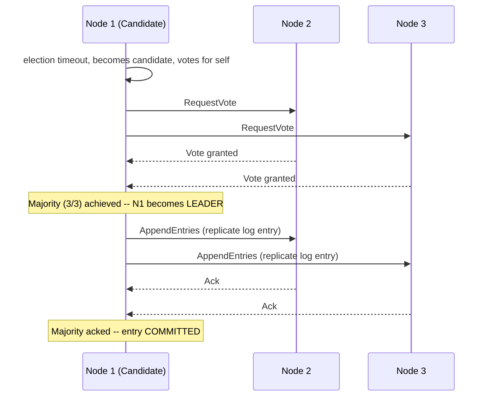
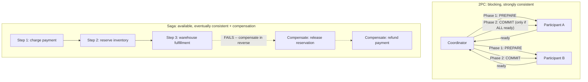
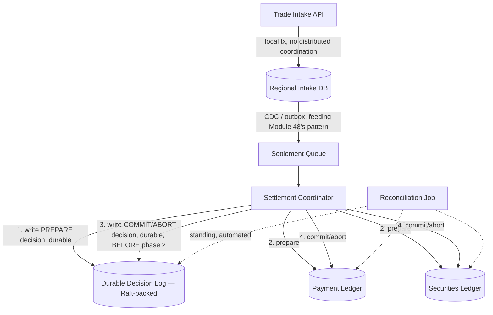
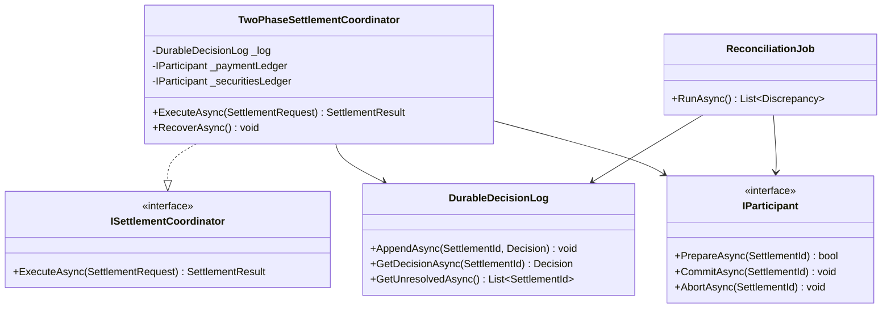

# Module 47 — Distributed Systems: Consensus, Consistency Models & Distributed Transactions

> Domain: Distributed Systems | Level: Beginner → Expert | Prerequisite: [[../14-System-Design/01-System-Design-Fundamentals]] (CAP theorem), [[../04-SQL-Server/02-Transactions-Isolation-Locking]], [[../06-MongoDB/02-Consistency-ReplicaSets-Transactions]], [[../14-System-Design/07-Designing-Amazon-Ecommerce]] (Saga, introduced there)

---

## 1. Fundamentals

### What is distributed-systems theory, and why does this module exist after so much prior, engine-specific consistency content?
This module makes **explicit and formal** the theoretical foundation that Modules 19, 22, 24, 26, and 28 each applied *implicitly*, engine-by-engine, to SQL Server, PostgreSQL, MongoDB, Redis, and DynamoDB's specific consistency knobs — **consensus algorithms** (how multiple nodes agree on a single value/decision despite failures) and **distributed transactions** (coordinating an atomic operation across multiple independent systems, directly the problem introduced via the Saga pattern) are the two foundational mechanisms underlying every one of those earlier, engine-specific discussions.

### Why does this matter?
Because recognizing that the SQL Server replication, the MongoDB write concern, the Redis replication, and the DynamoDB consistency parameter are all **the same underlying distributed-consensus problem**, solved slightly differently by each engine, is precisely the kind of unifying, cross-module synthesis this course has built toward — a Staff/Principal engineer should be able to explain *why* every one of those engine-specific mechanisms exists from these first principles, not merely operate each one correctly in isolation.

### When does this matter?
Any system spanning multiple nodes/services where coordinated agreement or atomicity is required; the depth matters for correctly choosing between two-phase commit, Saga, and consensus-based approaches for a given distributed-coordination problem, and for precisely understanding what a consensus algorithm (Raft/Paxos) actually guarantees versus what it doesn't.

### How does it work (30,000-ft view)?
```
Consensus: multiple nodes must agree on ONE value/decision (who is the leader? what is the next
 log entry?) despite node failures and network unreliability -- Raft/Paxos solve this.
Distributed transaction: an operation spanning multiple independent systems must either fully
 succeed or fully fail -- Two-Phase Commit (strict, blocking) or Saga (eventual,
 compensating) solve this, each with different trade-offs.
```

---

## 2. Deep Dive

### 2.1 The Consensus Problem, Precisely Defined
Consensus requires a set of nodes to agree on a single value despite some nodes failing or messages being delayed/lost, satisfying: **agreement** (all correct nodes decide the same value), **validity** (the decided value was actually proposed by some node, not fabricated), and **termination** (all correct nodes eventually decide, assuming the system isn't permanently, completely partitioned). This is a **provably hard** problem in fully asynchronous systems with even one faulty node (the FLP impossibility result) — practical consensus algorithms (Raft, Paxos) work around this by making reasonable, real-world assumptions (partial synchrony — messages usually arrive within a bounded time, even if this bound isn't guaranteed) rather than solving the theoretically-impossible general case.

### 2.2 Raft — Leader Election and Log Replication, the Modern, Understandable Consensus Algorithm
Raft (deliberately designed to be more understandable than the earlier Paxos) works via: **leader election** (nodes hold randomized-timeout-triggered elections; a candidate becomes leader upon receiving votes from a **majority** of nodes — the same majority-quorum reasoning as §Advanced Q9's Sentinel-failover discussion and §Advanced Q3's synchronous-replication-quorum discussion, now the general, formal mechanism underlying both), and **log replication** (the leader appends entries to its own log and replicates them to followers, only considering an entry **committed** once a majority of nodes have durably stored it — directly the same majority-based durability guarantee as MongoDB's `w: "majority"` write concern,, now revealed as a direct application of Raft-style majority-commit reasoning, not a MongoDB-specific invention). Raft is the actual algorithm underlying etcd, Consul, and (in a Paxos-variant form) many production consensus systems.

### 2.3 Quorum-Based Systems — the Read/Write Quorum Trade-off, Generalized
A quorum-based system requires **W** (write quorum) nodes to acknowledge a write and **R** (read quorum) nodes to be consulted for a read, with the guarantee that **W + R > N** (total node count) ensures every read quorum overlaps with every prior write quorum by at least one node, guaranteeing a read will observe the most recent write — this single formula **is** the theoretical foundation behind every engine-specific read/write-consistency knob covered across Modules 19-28: DynamoDB's tunable consistency is literally this quorum formula exposed as a parameter; MongoDB's `w`/read-concern settings are this same formula applied with MongoDB's specific replica-set semantics; Cassandra (a system this course hasn't covered directly, but whose consistency model is a direct, well-known application of this exact quorum formula) makes it an even more explicit, first-class per-query parameter.

### 2.4 Two-Phase Commit (2PC) vs Saga — Revisiting the Introduction with Formal Precision
**Two-Phase Commit** provides genuine atomicity across multiple resource managers: a coordinator asks every participant to **prepare** (lock resources, confirm readiness, but not yet commit) in phase one, then, only if **all** participants confirm readiness, tells everyone to **commit** in phase two (or, if any participant fails to confirm, tells everyone to **abort**) — this provides strong consistency but is **blocking** (a participant that has prepared but not yet heard the final commit/abort decision must hold its locks, potentially indefinitely, if the coordinator crashes at exactly the wrong moment — a genuine, well-documented 2PC failure mode) and requires all participants to be available and responsive throughout both phases, a poor fit for the loosely-coupled, independently-deployed/independently-available microservices architecture the order-fulfillment scenario assumed. **Saga** sacrifices 2PC's blocking-atomicity guarantee for **availability** (each step commits independently and immediately; a later failure triggers compensating actions rather than blocking earlier participants) — directly a CAP-theorem-informed choice of AP-leaning eventual consistency-with-compensation over CP-leaning blocking atomicity, precisely the trade-off §Advanced Q8 introduced conceptually and implemented concretely.

### 2.5 Vector Clocks and Logical Time — Ordering Events Without Synchronized Clocks
Directly extending the "wall-clock timestamps are insufficient for cross-server ordering" lesson to its full theoretical generalization: **Lamport timestamps** provide a simple logical clock (each node increments a counter on every event, and includes its current counter value on every message sent, with the receiver adopting the max of its own and the received counter, plus one) giving a **partial** ordering sufficient to establish "happened-before" relationships without synchronized physical clocks. **Vector clocks** extend this (one counter per node, not a single scalar) to additionally detect **genuinely concurrent** (neither happened-before the other) events — directly the mechanism DynamoDB's original paper (and several NoSQL systems' conflict-detection logic) uses to distinguish "this write genuinely conflicts with that one" from "this write happened after that one, no conflict" during eventual-consistency reconciliation.

## 3. Visual Architecture

### Raft Leader Election and Log Replication

```mermaid
sequenceDiagram
 participant N1 as Node 1 (Candidate)
 participant N2 as Node 2
 participant N3 as Node 3

 N1->>N1: election timeout, becomes candidate, votes for self
 N1->>N2: RequestVote
 N1->>N3: RequestVote
 N2-->>N1: Vote granted
 N3-->>N1: Vote granted
 Note over N1: Majority (3/3) achieved -- N1 becomes LEADER
 N1->>N2: AppendEntries (replicate log entry)
 N1->>N3: AppendEntries (replicate log entry)
 N2-->>N1: Ack
 N3-->>N1: Ack
 Note over N1: Majority acked -- entry COMMITTED
```

### 2PC vs Saga

```mermaid
graph TB
 subgraph "2PC: blocking, strongly consistent"
 Coord[Coordinator] -->|"Phase 1: PREPARE"| P1[Participant A]
 Coord -->|"Phase 1: PREPARE"| P2[Participant B]
 P1 -->|"ready"| Coord
 P2 -->|"ready"| Coord
 Coord -->|"Phase 2: COMMIT (only if ALL ready)"| P1
 Coord -->|"Phase 2: COMMIT"| P2
 end
 subgraph "Saga: available, eventually consistent + compensation"
 S1[Step 1: charge payment] --> S2[Step 2: reserve inventory]
 S2 --> S3[Step 3: warehouse fulfillment]
 S3 -.->|"FAILS -- compensate in reverse"| S2Comp[Compensate: release reservation]
 S2Comp -.-> S1Comp[Compensate: refund payment]
 end
```

## 4. Production Example
**Scenario**: A team building a cross-service inventory-and-order system initially implemented order placement using a hand-rolled, ad-hoc two-phase-commit-like protocol across the order service and inventory service (a coordinator calling "prepare" on both, then "commit" on both) — during a production incident where the coordinator process crashed **between** sending "prepare" to both services and sending the final "commit"/"abort" decision, the inventory service was left holding a **prepared-but-undecided** reservation indefinitely, blocking that specific inventory item from being sold to anyone else (since it was neither committed as sold nor rolled back as available) until an on-call engineer manually intervened, hours later, once the stuck reservation was noticed via a customer complaint about an item showing as unavailable despite apparent stock. **Investigation**: confirmed this was exactly 2PC's well-documented, textbook blocking failure mode — a coordinator crash between phases leaves participants in an indefinite, locked "prepared" limbo with no way to independently resolve the situation, since only the coordinator (now crashed) knows the actual final decision. **Fix**: migrated order fulfillment to the Saga pattern (directly/the design) — each step (payment, inventory reservation, warehouse notification) commits independently and immediately, with compensating actions defined for the failure case, eliminating the "indefinitely blocked, waiting for a crashed coordinator's decision" failure mode entirely, since no step ever holds an indefinite, coordinator-dependent lock. **Lesson**: 2PC's blocking failure mode isn't a rare, theoretical edge case — a coordinator crash at precisely the vulnerable moment (between phases) is a realistic, eventually-occurring production event for any long-running system, and the resulting indefinite resource-blocking is a severe, hard-to-automatically-recover-from failure mode — this is precisely *why* Saga (accepting eventual consistency and explicit compensation) is generally preferred over 2PC for real, independently-deployed microservices architectures, not merely a stylistic preference but a direct, demonstrated response to 2PC's specific, well-known failure characteristics.
## 10. Interview Questions

### Basic (10)
1. **Q: What is the consensus problem?** **A:** Getting multiple nodes to agree on a single value/decision despite failures and unreliable networks, satisfying agreement, validity, and termination.
2. **Q: What is Raft?** **A:** A modern, designed-for-understandability consensus algorithm based on leader election and log replication.
3. **Q: What does a "majority quorum" mean?** **A:** More than half of the total nodes — used to guarantee overlap between different quorums (e.g., a write quorum and a read quorum).
4. **Q: What is Two-Phase Commit?** **A:** A distributed-transaction protocol with a prepare phase and a commit/abort phase, providing strong atomicity across multiple participants.
5. **Q: What is 2PC's well-known failure mode?** **A:** Blocking — if the coordinator crashes between phases, a prepared participant can be left holding locks indefinitely.
6. **Q: What does the Saga pattern trade away, compared to 2PC?** **A:** Strict, blocking atomicity, in exchange for availability — each step commits immediately, with compensating actions for failure.
7. **Q: Why are wall-clock timestamps insufficient for distributed event ordering?** **A:** Clock skew between nodes means timestamps don't reliably reflect true relative order.
8. **Q: What is a logical clock (Lamport timestamp)?** **A:** A simple counter-based mechanism establishing a "happened-before" partial ordering without synchronized physical clocks.
9. **Q: Do consensus algorithms scale throughput simply by adding more nodes?** **A:** No — every write must be acknowledged by a majority, so more nodes doesn't improve (and can degrade) throughput.
10. **Q: What formula ensures a read quorum will observe a prior write quorum's data?** **A:** W + R > N (write quorum plus read quorum exceeds total node count).

### Intermediate (10)
1. **Q: Why is MongoDB's `w: "majority"` write concern an application of the same theory as Raft's majority-commit rule?** **A:** Both require acknowledgment from more than half the nodes before considering a write durable, guaranteeing any future majority (including a newly-elected leader/primary) will include at least one node that has the write.
2. **Q: Why does 2PC require all participants to be available throughout both phases, and why is this a poor fit for microservices?** **A:** Any participant unavailable during either phase blocks the entire transaction's progress — independently-deployed microservices, each with their own availability characteristics, make this an unacceptably fragile dependency compared to Saga's per-step independence.
3. **Q: Why does DynamoDB's tunable read/write consistency directly reflect the W+R>N quorum formula?** **A:** Choosing strongly-consistent reads versus eventually-consistent reads is effectively choosing a larger or smaller R relative to the system's fixed W and N, directly the same trade-off this formula describes generally.
4. **Q: Why is Saga described as an AP-leaning (not CP-leaning) choice, connecting to the CAP framing?** **A:** It prioritizes availability (each step proceeds independently and immediately) over the strict consistency 2PC's blocking atomicity would provide, accepting a temporarily-inconsistent intermediate state as the cost.
5. **Q: Why can't a consensus cluster make progress if no partition after a network split has a majority?** **A:** Without a majority, no leader can be legitimately elected and no new log entry can be committed — this is the correct, intentional behavior (favoring consistency over availability) rather than a bug, directly the CP side of the CAP trade-off.
6. **Q: Why do vector clocks improve on simple Lamport timestamps for conflict detection?** **A:** Lamport timestamps only give a total ordering that doesn't distinguish genuinely concurrent events from causally-ordered ones; vector clocks (one counter per node) can detect true concurrency, needed to correctly identify genuine write conflicts during eventual-consistency reconciliation.
7. **Q: Why does the incident's coordinator crash specifically expose 2PC's blocking failure mode rather than some other kind of bug?** **A:** The crash occurred at exactly the vulnerable window (after "prepare" succeeded, before the final decision was communicated) — precisely the scenario 2PC is documented to handle poorly, since only the (now-crashed) coordinator knows the actual final decision, leaving participants unable to independently resolve their prepared state.
8. **Q: Why is mutual TLS authentication between consensus-cluster nodes particularly important, beyond ordinary internal-traffic encryption?** **A:** An unauthorized node participating in leader election/log replication could disrupt the cluster's ability to reach consensus at all, or in a compromised scenario, attempt to influence the agreed-upon state — the stakes of an unauthenticated node joining a consensus cluster are particularly high given consensus's role in coordinating the entire cluster's state.
9. **Q: Why do large distributed systems typically use consensus only for a small coordination layer, sharding the actual data volume separately?** **A:** Consensus's majority-acknowledgment requirement doesn't scale throughput with added nodes the way sharded, independent partitions do — using consensus only for cluster metadata/coordination (a small, low-volume concern) while sharding high-volume data across many independent groups avoids consensus's inherent scaling ceiling for the actual bulk of the system's workload.
10. **Q: Why is "eventually consistent" not the same as "no guarantee at all," specifically in a quorum-based system?** **A:** A quorum-based eventually-consistent system still provides the precise, well-defined guarantee that a read quorum will eventually overlap with and observe a prior write quorum's data — a structured, quantifiable guarantee, not an absence of any guarantee.

### Advanced (10)
1. **Q: Diagnose the ad-hoc 2PC coordinator-crash production incident from first principles, and explain precisely why Saga's design structurally eliminates this specific failure mode, not merely reduces its likelihood.**
 **A:** 2PC's blocking failure mode is structural — it exists specifically because the protocol design requires participants to wait for a centralized coordinator's final decision after entering an uncertain "prepared" state, with no mechanism for a participant to independently resolve that uncertainty if the coordinator becomes unavailable. Saga structurally eliminates this because **no step ever enters an "uncertain, waiting for a central decision" state at all** — each step commits its own local effect immediately and independently; a later failure triggers compensating actions as **new**, forward-moving operations (not a rollback of an uncommitted, pending state) — there is no analogous "prepared but undecided" limbo state in Saga's design for a coordinator crash to strand a participant within, since the pattern was specifically designed without a blocking, multi-phase-commit-style coordination point.
2. **Q: Explain how you would implement a genuine, production-grade distributed lock using a Raft-based consensus system (like etcd), and why this is more robust than the Redis-based Redlock approach §Advanced Q3.**
 **A:** etcd (and similar Raft-based coordination services) provide a lease/lock primitive built directly on their underlying consensus guarantee — a lock acquisition is itself a consensus-agreed, replicated log entry, meaning the "who currently holds the lock" state is genuinely, consistently agreed upon by a majority of the underlying Raft cluster, rather than relying on Redlock's multiple-independent-Redis-instances-with-a-timing-budget approach (which §Advanced Q3 noted has documented, real correctness edge cases under clock drift/process pauses) — a Raft-based lock's correctness rests on the same rigorously-proven consensus guarantees underlying the entire coordination service, a stronger theoretical foundation than Redlock's more ad-hoc, multi-independent-instance quorum approach.
3. **Q: Design a hybrid approach combining 2PC-like strong consistency for a small, tightly-coupled subset of an order-fulfillment workflow with Saga-based coordination for the broader, more loosely-coupled workflow.**
 **A:** If payment processing and inventory reservation happen to share the same database (a legitimate architectural choice for two tightly-related, co-located services), use a single, genuine ACID database transaction (/24) for **just those two steps** — avoiding any distributed-transaction protocol entirely for this tightly-coupled subset — while treating the broader workflow (warehouse notification, shipping, which are more plausibly separate, independently-deployed systems) via Saga's compensating-action pattern for the remaining, genuinely-distributed steps — recognizing that not every step in a workflow needs the same coordination mechanism, and using the strongest, simplest mechanism (a plain database transaction) wherever the actual system boundaries allow it, reserving Saga specifically for genuinely cross-system coordination.
4. **Q: Explain precisely how Raft's randomized election timeout prevents a "split vote" scenario where multiple nodes simultaneously become candidates and no one achieves a majority.**
 **A:** Each node's election timeout is randomized within a range (e.g., 150-300ms) specifically so that, in the common case, one node's timeout expires meaningfully before others', letting it become a candidate and request votes before any other node's own timeout triggers a competing candidacy — if a split vote does occur (two nodes' timeouts happen to expire nearly simultaneously, splitting the vote with no majority), Raft simply lets both candidacies time out and retries with a **new**, independently-randomized timeout for each node, making a repeated split-vote scenario increasingly statistically unlikely across successive retries — a simple, probabilistic (not deterministic) mechanism that's part of why Raft is considered more understandable than Paxos's more complex handling of the analogous scenario.
5. **Q: How would you design monitoring specifically for a consensus cluster's health, distinguishing "temporarily can't reach a majority due to a transient network blip" from "a genuine, sustained partition requiring operational intervention"?**
 **A:** Track leader-election frequency (a healthy cluster has a stable leader for extended periods; frequent re-elections indicate instability) and the proportion of time the cluster has **any** elected leader at all (versus being leaderless, unable to make progress) as standing metrics — a brief, single leadership change is normal and self-resolving; a sustained period with no stable leader (repeated elections failing to achieve majority) is the signature of a genuine, ongoing partition or a majority of nodes being unreachable, warranting active operational investigation rather than passive monitoring alone.
6. **Q: Explain a scenario where choosing Saga over 2PC introduces a genuine business risk that must be explicitly communicated to stakeholders, generalizing beyond the specific example.**
 **A:** Saga's temporarily-inconsistent intermediate state (Advanced Q1) means that, for the brief window between a forward step succeeding and a later step's failure triggering compensation, the system is in a state that, if observed directly (a customer checking their order status, a downstream reporting system querying live data), could show a **temporarily incorrect** picture (e.g., "payment charged" visible before the eventual compensation/refund completes) — for domains where even a brief, eventually-corrected inconsistency is unacceptable (certain regulated financial reporting contexts), this trade-off must be explicitly surfaced to business/compliance stakeholders as a genuine, deliberate choice, not silently assumed to be acceptable by the engineering team alone.
7. **Q: Design a strategy for testing a Saga-based workflow's compensating-action correctness specifically, beyond testing the happy-path forward flow.**
 **A:** Directly §Advanced Q5's "test the specific failure mode, not just the general feature" discipline — deliberately inject a failure at **every possible step** of the Saga (not just the final step) in an integration test environment, asserting that the correct, complete set of compensating actions executes in the correct reverse order for each specific failure point, and that the compensations themselves are correctly idempotent/retryable (the discussion) — a Saga with N steps requires testing N distinct failure scenarios (failure at step 1, step 2,..., step N), not just one "does the happy path work" test.
8. **Q: A team proposes using a single, globally-distributed Raft cluster (nodes spread across multiple continents) for a system requiring low-latency writes from users worldwide. Evaluate this design as a Principal Engineer.**
 **A:** Push back — a single Raft cluster's majority-commit requirement means every write must round-trip to a majority of geographically-distributed nodes, incurring the cross-continental network latency floor (directly the "speed of light imposes a hard latency floor on synchronous cross-region consensus" point) on **every single write**, regardless of which region initiated it — recommend either regional consensus clusters (each region has its own, low-latency-for-local-writes cluster, accepting §Advanced Q4's regional-affinity/eventual-cross-region-consistency trade-off) or, if genuine global strong consistency is truly required, explicitly communicating that the resulting write latency will be dominated by cross-continental round-trip time as an unavoidable, physics-based consequence, not an engineering limitation to be optimized away.
9. **Q: Explain how you would decide whether a new distributed-coordination requirement should use an existing, general-purpose consensus service (etcd, Consul, ZooKeeper) versus building custom coordination logic on top of an existing database's own consistency mechanisms (a MongoDB majority-write-concern-based lock, for instance).**
 **A:** Prefer an existing, purpose-built, extensively-battle-tested consensus service (directly this course's recurring "don't hand-roll what a mature solution already provides" discipline, §Advanced Q9, §Advanced Q6, now applied to distributed coordination specifically) if the team already operates one or the requirement is substantial/critical enough to justify introducing one; building custom coordination logic on top of an existing database's consistency primitives (Advanced Q2's Redlock-vs-etcd comparison) is a reasonable, simpler choice specifically when the coordination need is narrow, the team doesn't already operate a dedicated consensus service, and the correctness stakes tolerate the somewhat-weaker guarantees a database-primitive-based approach (versus a genuine, formally-verified consensus algorithm) provides.
10. **Q: As a Principal Engineer, how would you build organizational understanding that "we use eventual consistency here" and "we use strong consistency there" are not arbitrary per-team style preferences, but specific, theoretically-grounded trade-offs each deserving explicit justification, generalizing this module's unifying theme?**
 **A:** Require any new system's design document to explicitly state which consistency model (and, if applicable, which specific quorum/consensus parameters) it uses for each major data type, with the justification framed in terms of this module's actual, formal trade-off vocabulary (the W+R>N quorum formula, the CAP-theorem-informed AP-vs-CP choice, the 2PC-vs-Saga blocking-vs-compensating trade-off) rather than informal, ad-hoc reasoning — directly connecting every engine-specific consistency decision covered across Modules 19-28 back to this module's unifying theoretical foundation, converting what could otherwise remain a collection of disconnected, engine-specific "best practices" into a single, coherent, transferable body of understanding a Staff/Principal engineer can apply to any future system, including ones using technologies this course hasn't directly covered.

### Expert (10)
1. **Q: A settlement-instruction service must decide, for its cross-border leg, between a Raft-backed distributed lock and a database-row-level advisory lock scoped to a single regional primary. Walk through the full decision, including what changes if the service later needs to expand to active-active across regions.**
 **A:** For a single-region-primary deployment, a database-row-level advisory lock is the simpler, lower-overhead choice — it inherits the primary database's own durability and requires no additional infrastructure, and the correctness stakes are fully covered since only one writer (the primary) ever exists. If the service later expands to active-active across regions, the advisory lock stops being sufficient, since two regional primaries could each independently believe they hold "the" lock — at that point a Raft-backed distributed lock (§Advanced Q2) becomes necessary specifically because its correctness is anchored in a single, cluster-wide agreed state rather than any one region's local view. The decision isn't "always use the stronger mechanism" — it's choosing the mechanism whose guarantee matches the actual deployment topology, upgrading only when the topology itself changes to require it, directly reusing this module's recurring "match the mechanism to the actual coordination requirement, not the strongest available one" discipline.
 **Why this answer is correct:** Ties the lock choice to deployment topology rather than treating "strongest guarantee" as an unconditional default, and correctly identifies the specific trigger (active-active expansion) that changes the requirement.
 **Common mistakes:** Defaulting to the Raft-backed lock everywhere "to be safe," incurring unnecessary consensus-cluster operational overhead for a single-primary deployment that never needed it.
 **Follow-up questions:** "What happens during the migration window when the service is neither purely single-primary nor fully active-active?" "How would you validate the advisory lock is genuinely sufficient before committing to it?"

2. **Q: A trade-settlement platform runs a 2PC-like coordinator across a payment ledger and a securities ledger for delivery-versus-payment (DvP) settlement. Regulators require proof that a specific settlement either fully completed or fully did not happen — never partially. Design the audit mechanism.**
 **A:** The coordinator's own decision log (durably written before phase two is ever communicated to either participant) is the authoritative record — every settlement's final state must be derivable from a single, durably-persisted "COMMIT" or "ABORT" entry in this log, written and fsynced *before* the coordinator sends the corresponding instruction to either ledger, so that even a coordinator crash immediately after writing this entry leaves a recoverable, unambiguous record of the intended final state (the coordinator can replay this log on restart and re-drive any not-yet-acknowledged participants toward the already-decided outcome, rather than making a fresh, potentially-inconsistent decision). For regulatory proof, reconcile this decision log against both ledgers' actual committed state as a standing, automated job — any settlement whose ledger state doesn't match its decision-log entry is flagged for immediate investigation, directly reusing this course's "measure the actual invariant, don't just trust the mechanism" discipline, now applied to prove DvP atomicity to an external regulator rather than merely to internal confidence.
 **Why this answer is correct:** Identifies the durable decision log as the actual atomicity guarantee (not the two network round trips themselves) and adds the independent reconciliation check regulators would actually require as evidence.
 **Common mistakes:** Treating "we implemented 2PC" as sufficient proof of atomicity on its own, without a durable, independently-auditable decision record and a standing reconciliation check against it.
 **Follow-up questions:** "What happens if the coordinator crashes after writing COMMIT but before either participant acknowledges?" "How would you extend this to a three-way DvP involving a custodian as a third participant?"

3. **Q: Compare Raft and Multi-Paxos for a new coordination service from a Principal Engineer's build-vs-adopt perspective, given both provide equivalent theoretical guarantees.**
 **A:** Since both solve the same problem with equivalent formal guarantees, the decision is almost entirely about operational and organizational factors, not algorithmic superiority: Raft's explicit design goal of understandability translates directly into a wider pool of engineers who can correctly reason about, debug, and safely modify a Raft-based implementation, and a larger ecosystem of mature, battle-tested open-source implementations (etcd, HashiCorp's raft library) to adopt rather than build; Multi-Paxos variants, while used in some large-scale production systems (Google's Chubby, Spanner's underlying layer), are generally harder to correctly implement and reason about, and mostly appear as an internal component of an already-adopted, larger system rather than something a team builds fresh today. Recommend Raft (via an existing, mature library) as the default for a new coordination service, reserving a from-scratch Paxos-family implementation for the rare case where an already-adopted larger platform's internals require it.
 **Why this answer is correct:** Correctly identifies that the decision is operational/organizational, not a matter of one algorithm being theoretically stronger, and gives a clear, justified default.
 **Common mistakes:** Debating Raft vs. Paxos as if one provides materially stronger consistency guarantees, when both are provably equivalent in what they guarantee.
 **Follow-up questions:** "Under what circumstance would you still choose to build a custom Paxos-family implementation today?" "How would you validate a chosen library's correctness before trusting it with production coordination?"

4. **Q: Design a chaos-engineering test plan specifically validating that your production Raft-based coordination service correctly refuses to make progress during a genuine, majority-losing network partition, rather than silently continuing with stale or inconsistent state.**
 **A:** Deliberately partition the cluster in a controlled test/staging environment such that no resulting partition contains a majority of nodes, then assert two things: (a) no partition elects a new leader and no new log entries are committed anywhere during the partition (confirming the CP, not silently-available, behavior §6 describes as correct, not a bug), and (b) client-facing requests during this window fail fast with an explicit "no leader / unavailable" error rather than hanging indefinitely or silently returning stale data — then heal the partition and assert the cluster correctly re-elects a single leader and resumes normal operation without manual intervention. This test should run as a recurring, scheduled chaos exercise (not a one-time validation), since a library upgrade or configuration change could silently regress this behavior without a standing test catching it.
 **Why this answer is correct:** Tests the actually load-bearing correctness property (refusing progress without a majority) rather than only the happy path, and insists on recurring, not one-time, validation.
 **Common mistakes:** Testing only that the cluster recovers after a partition heals, without also verifying it correctly refuses to make progress during the partition itself — the more consequential, easier-to-silently-regress property.
 **Follow-up questions:** "How would you distinguish 'correctly refusing to make progress' from 'the cluster is simply broken' in an alert?" "What client-side behavior should accompany this — retry, fail fast, or degrade to a read-only mode?"

5. **Q: A junior engineer argues that since Saga already handles the order-fulfillment workflow correctly, the team should also migrate the payment-authorization step itself (currently a single, local ACID transaction against the payment ledger) to a Saga step "for consistency of approach across the codebase." Evaluate this as a Principal Engineer.**
 **A:** Push back — Saga's compensating-action model exists specifically to coordinate across genuinely separate, independently-committing systems; a single local ACID transaction against one database already provides a strictly stronger, simpler guarantee (true atomicity, not eventual-consistency-with-compensation) for anything that fits within one database's transactional boundary. Migrating an already-atomic, single-database operation to Saga would trade a stronger guarantee for a weaker one purely for stylistic uniformity — directly the "use the strongest, simplest mechanism the actual system boundaries allow" principle (§Advanced Q3) being violated in the wrong direction. "Consistency of approach" is a reasonable secondary concern but should never override matching the mechanism to what the actual system boundary requires.
 **Why this answer is correct:** Recognizes that architectural uniformity is a weaker goal than correctness-per-boundary, and correctly identifies the proposal as downgrading a stronger guarantee unnecessarily.
 **Common mistakes:** Accepting "consistency of approach" as sufficient justification for choosing a weaker coordination mechanism than the actual system boundary requires.
 **Follow-up questions:** "Is there a legitimate reason to eventually split the payment-authorization step into its own service?" "If so, what would need to be true first before this migration becomes genuinely justified?"

6. **Q: Explain precisely why a client-generated idempotency key combined with Saga's per-step commits is not, by itself, sufficient to guarantee "exactly-once" business effect for the overall Saga, even though every individual step is idempotent.**
 **A:** Per-step idempotency guarantees that *retrying a single step* doesn't produce a duplicate effect for that step — but it says nothing about whether the *Saga orchestrator itself* correctly tracks which steps have already run when recovering from its own crash mid-workflow. If the orchestrator's own "which step am I on" state isn't itself durably persisted and correctly restored on restart, a crash mid-Saga could cause the orchestrator to re-run an already-completed step's *forward* logic under a new, different idempotency key (a bug in key generation, not step execution) — producing a genuine duplicate business effect despite every individual step technically being "idempotent" in isolation. The orchestrator's own state machine must itself be durably persisted (typically in the same database as the steps it coordinates) and must reuse the same idempotency key across a resumed execution, not regenerate one — a distinct requirement from step-level idempotency alone.
 **Why this answer is correct:** Correctly separates step-level idempotency from orchestrator-level state durability, identifying a genuine, easy-to-miss gap between "each step is idempotent" and "the overall Saga produces exactly-once effect."
 **Common mistakes:** Assuming step-level idempotency alone is sufficient, without considering whether the orchestrator's own coordination state survives a crash correctly.
 **Follow-up questions:** "How would you test this specific gap?" "Where should the orchestrator's state live relative to the steps it coordinates?"

7. **Q: How would you extend this module's quorum-based reasoning to design a cross-region disaster-recovery strategy for a Raft-backed coordination service, given that a naive 3-region, 1-node-per-region deployment cannot survive a full regional outage while maintaining a majority?**
 **A:** A 3-node, 1-per-region deployment loses majority (drops to 2 of 3, still a majority — actually survives one region loss) but a 5-node, non-uniform deployment (e.g., 2-2-1 across three regions) can lose its 1-node region and retain a 4-of-5 majority, or lose a 2-node region and retain a 3-of-5 majority — the specific node-count-per-region layout must be deliberately designed against the exact failure scenario being defended against (single-region loss), not assumed safe by node count alone. For genuine protection against losing an entire region *including* its ability to contribute to any future majority, a 5-node cluster spread 2-2-1 (or larger, 3-2-2 for tolerating a 2-node region loss) is the standard pattern — explicitly modeling "which regions can be lost together and still retain a majority" as a first-class design input, not an afterthought discovered during an actual regional outage.
 **Why this answer is correct:** Moves beyond "add more nodes" to the actually load-bearing question — the specific per-region distribution relative to the specific failure scenario being defended against.
 **Common mistakes:** Assuming any odd-numbered, multi-region cluster automatically survives a single-region outage, without checking the specific per-region node distribution against the specific failure being planned for.
 **Follow-up questions:** "What operational procedure handles the case where the surviving regions genuinely cannot reach majority?" "How would you test this DR posture without causing a real regional outage?"

8. **Q: A Principal Engineer is asked to justify, to a non-technical audit committee, why the firm's core ledger uses 2PC-avoidant Saga-based coordination rather than "the strongest possible consistency guarantee available." Draft the explanation.**
 **A:** Frame it around risk, not technical mechanism: "the strongest possible guarantee" (2PC-style blocking atomicity) creates a different, and for our actual failure patterns a worse, risk — a coordinator failure during a blocking transaction can freeze a customer-facing resource indefinitely until manual intervention, an availability failure with direct customer and reputational impact, demonstrated by real production, incidents at other institutions using similar patterns. Our chosen approach (Saga, eventual-consistency-with-compensation) trades a theoretically stronger point-in-time guarantee for materially better availability and self-healing behavior under the failure modes we actually observe in production, with the brief, precisely-bounded inconsistency window explicitly monitored, reconciled, and — where regulatory-sensitive — separately disclosed as a deliberate, understood trade-off (§Advanced Q6) rather than an overlooked gap. This is the honest, defensible answer: not "we chose a weaker guarantee," but "we chose the guarantee whose failure mode matches our actual operational risk tolerance."
 **Why this answer is correct:** Translates a technical trade-off into risk language an audit committee can evaluate, and is honest about the trade-off rather than overselling either option.
 **Common mistakes:** Either overselling Saga as having "no downside," or being unable to explain the choice in terms the audience can actually evaluate and hold the team accountable to.
 **Follow-up questions:** "What evidence would you present that the reconciliation process actually catches every inconsistency window?" "How would this answer change for a genuinely real-time, sub-second settlement requirement?"

9. **Q: Design a monitoring dashboard a Principal Engineer would actually use to assess the health of a production consensus-backed coordination layer at a glance, distinct from the individual node-level metrics an SRE would watch.**
 **A:** A Principal-level view should surface: (1) leader stability (time since last election, and election frequency over the past 24h — a proxy for underlying network/node health without requiring per-node drill-down), (2) commit latency distribution (p50/p99/p99.9, since the majority-acknowledgment cost is sensitive to the single slowest node in the required majority, making tail latency the more informative signal than average), (3) quorum headroom (how many additional node failures the cluster could currently absorb before losing majority — a forward-looking risk metric, not merely current health), and (4) cross-cluster consistency of decisions where multiple sharded consensus groups exist (§9), flagging any group whose behavior diverges materially from its peers. This is deliberately a smaller, risk-and-trend-oriented view than the full node-level metrics dashboard, designed to answer "is this coordination layer currently healthy and how much margin do we have" in one glance, not to replace detailed operational telemetry.
 **Why this answer is correct:** Distinguishes a leadership-level risk/trend view from operational node-level metrics, and includes the forward-looking "headroom" metric a purely reactive dashboard would miss.
 **Common mistakes:** Building a Principal-level dashboard that's simply a smaller version of the SRE dashboard, without the forward-looking risk framing (quorum headroom) that's actually distinctive to this altitude of review.
 **Follow-up questions:** "What would trigger an escalation from this dashboard versus a routine SRE alert?" "How would you present quorum headroom to someone without distributed-systems background?"

10. **Q: Synthesize this entire module's governance implications: what standing organizational practice would most reduce the recurrence of the specific 2PC-blocking-incident class across a growing microservices estate, beyond "know the theory"?**
 **A:** A mandatory architecture-review gate for any new cross-service coordination requirement, requiring the design document to explicitly name which of this module's mechanisms (single-database transaction, Saga, consensus-backed lock, or — flagged for extra scrutiny — a custom-built 2PC-like protocol) is being used and why, with any custom-built distributed-transaction protocol requiring explicit sign-off from an engineer who can demonstrate first-principles understanding of its blocking-failure-mode risk before it's approved for production — directly converting this module's theoretical vocabulary (§10 Intermediate Q10's "formal trade-off vocabulary" requirement) from a personal understanding into an enforced organizational gate, so that a team unfamiliar with 2PC's well-documented failure mode cannot silently reintroduce the same incident class the way the original team did before this course's lessons were formalized.
 **Why this answer is correct:** Converts individual understanding into an enforced, structural organizational practice — the standard "make the correct default the path of least resistance" governance pattern applied specifically to this module's central risk.
 **Common mistakes:** Relying on documentation or training alone ("everyone should know this") without an enforced review gate that catches the case where a team doesn't.
 **Follow-up questions:** "How would you handle a team that already has a production 2PC-like protocol deployed before this gate existed?" "What's the minimum bar for 'first-principles understanding' the sign-off should actually verify?"

---

## 11. Coding Exercises

*(Distributed-systems concepts are typically demonstrated via design/protocol exercises rather than pure unit-testable code, consistent with this domain's theoretical-but-applied nature.)*

### Easy — Lamport timestamp implementation
```csharp
public class LamportClock
{
    private long _counter = 0;
    private readonly object _lock = new;

    public long Tick // local event
    {
        lock (_lock) { return ++_counter; }
    }

    public long ReceiveMessage(long receivedTimestamp) // synchronizing on a received message
    {
        lock (_lock)
        {
            _counter = Math.Max(_counter, receivedTimestamp) + 1;
            return _counter;
        }
    }
}
```

### Medium — Simplified Raft leader-election vote-counting logic
```csharp
public class RaftNode
{
    private readonly int _totalNodes;
    private int _votesReceived = 1; // votes for self

    public RaftNode(int totalNodes) => _totalNodes = totalNodes;

    public bool ReceiveVote
    {
        _votesReceived++;
        return HasMajority;
    }

    private bool HasMajority => _votesReceived > _totalNodes / 2; // the core quorum check,/
}
```

### Hard — Saga orchestrator with per-step failure injection testing (Advanced Q7)
```csharp
[Theory]
[InlineData(1)] [InlineData(2)] [InlineData(3)] // fail at EACH step, not just the happy path
public async Task Saga_Should_Correctly_Compensate_Regardless_Of_Which_Step_Fails(int failAtStep)
{
    var testGateway = new FailingAtStepPaymentService(failAtStep == 1);
    var testInventory = new FailingAtStepInventoryService(failAtStep == 2);
    var testWarehouse = new FailingAtStepWarehouseService(failAtStep == 3);

    var saga = new OrderFulfillmentSaga(testGateway, testInventory, testWarehouse); //
    var order = CreateTestOrder;

    await saga.ExecuteAsync(order);

    // Assert ONLY the steps that actually completed before the failure were compensated
    // and in the CORRECT reverse order (the discipline).
    var expectedCompensations = failAtStep switch
    {
        1 => new string[] { }, // nothing completed yet, nothing to compensate
            2 => new[] { "RefundPayment" },
            3 => new[] { "ReleaseInventoryReservation", "RefundPayment" }, // reverse order
            _ => throw new ArgumentOutOfRangeException
    };
    Assert.Equal(expectedCompensations, testGateway.CompensationLog.Concat(testInventory.CompensationLog));
}
```

### Expert — Quorum-based read/write with configurable W/R (the formula, made concrete)
```csharp
public class QuorumStore
{
    private readonly List<IDatabase> _nodes; // N total nodes
    private readonly int _writeQuorum, _readQuorum; // W, R -- caller-configured per the W+R>N guarantee

    public async Task<bool> WriteAsync(string key, string value)
    {
        var tasks = _nodes.Select(n => n.StringSetAsync(key, value));
        var results = await Task.WhenAll(tasks.Select(async t => { try { await t; return true; } catch { return false; } }));
        return results.Count(success => success) >= _writeQuorum; // W acknowledgments required
    }

    public async Task<string?> ReadAsync(string key)
    {
        var tasks = _nodes.Take(_readQuorum).Select(n => n.StringGetAsync(key)); // consult R nodes
        var results = await Task.WhenAll(tasks);
        // Return the value with the HIGHEST logical/vector-clock timestamp among the R responses --
        // guaranteed (by W+R>N) to include at least one node reflecting the most recent write.
        return results.OrderByDescending(r => r.Timestamp).FirstOrDefault?.Value;
    }
}
```
**Discussion**: This directly makes concrete the W+R>N formula — the `ReadAsync` method's guarantee of observing the most recent write depends entirely on the caller having configured `_writeQuorum + _readQuorum > _nodes.Count`, exactly the same underlying mathematical guarantee that DynamoDB's, MongoDB's, and Cassandra's tunable consistency parameters all rest upon, now implemented directly and explicitly rather than hidden behind an engine-specific configuration setting.

---

## 12. System Design

**Scenario:** Design the coordination layer for a multi-currency, cross-border trade-settlement platform that must guarantee a trade's payment leg and securities leg either both settle or neither does (delivery-versus-payment, DvP), while remaining available for new trade submissions even during a transient regional network issue.

**Functional requirements:**
- Every settlement instruction's payment and securities legs settle atomically (both or neither) — genuine, auditable DvP.
- New trade submission (order intake, not settlement) must remain available even during a partial regional network partition.
- A durable, replayable record of every coordination decision (settle / abort) for regulatory audit.

**Non-functional requirements:**
- No indefinite blocking of held resources under any single coordinator/participant failure.
- Cross-region write latency for trade intake must stay under ~50ms p99 within a region; settlement coordination latency (lower volume, higher-stakes) may tolerate 200-500ms.
- Every coordination decision must be independently reconstructible from a durable log, not only from in-memory coordinator state.

**Back-of-the-envelope estimation:** A mid-size settlement platform processes roughly 200,000 trades/day → ~2.3 TPS average, with peak bursts around market close reaching perhaps 50-100 TPS. At these volumes, the actual engineering challenge is **not raw throughput** (any of the mechanisms this module covers handle 100 TPS trivially) — it is **correctness under partial failure**, exactly the same conclusion this course's system-design work reaches whenever transaction volume is moderate but the cost of a single incorrect settlement is high (a wrong DvP outcome is a regulatory incident, not a performance metric).

**Architecture:** Two distinct coordination mechanisms for two distinct problems, deliberately not one mechanism forced to cover both:
- **Trade intake** (high-availability requirement, no cross-system atomicity needed at this stage): a single, regionally-local database transaction records the trade request; no distributed coordination at all — availability is achieved simply by not introducing a distributed dependency where none is needed yet.
- **Settlement (DvP)** (the genuine cross-system atomicity requirement): a durable, consensus-backed transaction coordinator — modeled after §4's fix and §Expert Q2's audit design — orchestrating the payment ledger and securities ledger via a **durable decision log written before either participant is instructed**, not a naive, undurable, in-memory 2PC coordinator.


```mermaid
graph TB
    Client[Trade Intake API] -->|local tx, no distributed coordination| IntakeDB[(Regional Intake DB)]
    IntakeDB -->|CDC / outbox, feeding Module 48's pattern| SettlementQueue[Settlement Queue]
    SettlementQueue --> Coordinator[Settlement Coordinator]
    Coordinator -->|1. write PREPARE decision, durable| DecisionLog[(Durable Decision Log — Raft-backed)]
    Coordinator -->|2. prepare| PaymentLedger[(Payment Ledger)]
    Coordinator -->|2. prepare| SecuritiesLedger[(Securities Ledger)]
    Coordinator -->|3. write COMMIT/ABORT decision, durable, BEFORE phase 2| DecisionLog
    Coordinator -->|4. commit/abort| PaymentLedger
    Coordinator -->|4. commit/abort| SecuritiesLedger
    ReconJob[Reconciliation Job] -.->|standing, automated| DecisionLog
    ReconJob -.-> PaymentLedger
    ReconJob -.-> SecuritiesLedger
```

**Components:** Trade Intake API (regionally-local, no cross-region coordination); Settlement Queue (buffers settlement requests, decoupling intake availability from settlement coordination latency); Settlement Coordinator (durable-decision-log-backed, per §Expert Q2); Raft-backed Decision Log (the durable audit trail, independently replayable); Reconciliation Job (standing, automated, per §Expert Q2's regulatory-proof mechanism).

**Database selection:** Regionally-local relational database for intake (ordinary ACID, no distributed transaction needed); the Decision Log itself backed by a small, dedicated Raft group (etcd or equivalent) rather than a general-purpose database, since its correctness properties (durable, ordered, majority-committed) are exactly what a consensus service is purpose-built for, not an incidental fit.

**Caching:** Not applicable to the coordination path itself — correctness-critical state must never be served from a cache; the trade-intake read path (order status queries) may use a bounded-staleness cache.

**Messaging:** Settlement Queue as an at-least-once, durable message channel (directly Module 48's territory) between intake and the coordinator — decoupling intake's write rate from settlement's coordination latency, so a settlement-side slowdown never backpressures trade intake.

**Scaling:** Trade intake scales horizontally and trivially (no coordination dependency); settlement coordination scales via §9's sharding pattern — multiple coordinator instances, each owning a disjoint partition of in-flight settlements (sharded by settlement ID), each backed by its own small decision-log partition rather than one global consensus group serializing all settlements.

**Failure handling:** A coordinator crash between phases is recoverable by design — on restart, the coordinator replays its durable decision log and re-drives any settlement whose decision was written but not yet fully communicated to both participants, eliminating §4's indefinite-block failure mode structurally rather than relying on manual intervention.

**Monitoring:** Settlement-coordination p99 latency; decision-log commit latency (the majority-acknowledgment cost, §7); count of settlements in a "decided but not yet fully communicated" state and their age (a growing, aging count is the leading indicator of a coordinator or participant problem); reconciliation-job discrepancy rate (should be zero; any non-zero rate pages immediately).

**Trade-offs:** Deliberately two different coordination mechanisms for two different problems (availability-first for intake, correctness-first for settlement) rather than one uniform mechanism — accepting the added complexity of maintaining two distinct code paths in exchange for never forcing settlement's strict-correctness requirement onto intake's high-availability requirement, or vice versa.

---

## 13. Low-Level Design

**Requirements:** A settlement coordinator whose decision (commit/abort) is durably recorded before being communicated to any participant; recoverable from a crash at any point without requiring manual intervention; independently auditable against actual ledger state.

**Class diagram:**

```mermaid
classDiagram
    class ISettlementCoordinator {
        <<interface>>
        +ExecuteAsync(SettlementRequest) SettlementResult
    }
    class DurableDecisionLog {
        +AppendAsync(SettlementId, Decision) void
        +GetDecisionAsync(SettlementId) Decision
        +GetUnresolvedAsync() List~SettlementId~
    }
    class TwoPhaseSettlementCoordinator {
        -DurableDecisionLog _log
        -IParticipant _paymentLedger
        -IParticipant _securitiesLedger
        +ExecuteAsync(SettlementRequest) SettlementResult
        +RecoverAsync() void
    }
    class IParticipant {
        <<interface>>
        +PrepareAsync(SettlementId) bool
        +CommitAsync(SettlementId) void
        +AbortAsync(SettlementId) void
    }
    class ReconciliationJob {
        +RunAsync() List~Discrepancy~
    }

    TwoPhaseSettlementCoordinator ..|> ISettlementCoordinator
    TwoPhaseSettlementCoordinator --> DurableDecisionLog
    TwoPhaseSettlementCoordinator --> IParticipant
    ReconciliationJob --> DurableDecisionLog
    ReconciliationJob --> IParticipant
```

**Sequence diagram:** the §12 architecture diagram's numbered flow (PREPARE decision write → prepare both participants → COMMIT/ABORT decision write, durable, before phase two → commit/abort both participants) is the coordinator's core sequence; on restart, `RecoverAsync` replays `GetUnresolvedAsync` and re-drives each entry to completion using the same, already-durable decision, never re-deciding.

**Design patterns used:** Template Method (the fixed prepare → decide → commit/abort skeleton, with participant-specific prepare/commit/abort logic supplied by each `IParticipant` implementation); Strategy (payment vs. securities ledger participants are interchangeable `IParticipant` implementations); Memento-like recovery (the durable decision log lets the coordinator reconstruct its exact in-flight state after a crash, rather than losing it).

**SOLID mapping:** Single Responsibility (the decision log's only job is durable decision recording; the coordinator's only job is orchestration; each participant's only job is its own prepare/commit/abort); Open/Closed (a third participant, e.g., a custodian for a three-way DvP, per §Expert Q2's follow-up, implements `IParticipant` without modifying the coordinator); Liskov (every `IParticipant` implementation must genuinely honor "once PrepareAsync returns true, CommitAsync must succeed" — a violating implementation silently reintroduces §4's blocking risk); Dependency Inversion (the coordinator depends on `IParticipant` and `DurableDecisionLog` abstractions, not concrete ledger clients).

**Extensibility:** A new settlement type (e.g., a three-way DvP with a custodian) adds a third `IParticipant` without touching the coordinator's core prepare/decide/commit skeleton.

**Concurrency/thread safety:** Each settlement's coordination is single-threaded per settlement ID (no concurrent coordinators may act on the same settlement — enforced via the sharding scheme in §12, where each coordinator instance owns a disjoint partition of settlement IDs) but many settlements are coordinated concurrently across the sharded coordinator fleet; the decision log's own writes are serialized per settlement ID and rely on the underlying Raft group's own concurrency control for cross-settlement parallelism.

---

## 14. Production Debugging

**Incident:** A settlement coordinator, running the design above, began showing a slowly-growing count of settlements stuck in "decided but not yet fully communicated" state during a maintenance window — the count was noticed only because the monitoring metric from §12 had been added following an earlier, unrelated incident, not because of any user-facing symptom yet.

**Root cause:** A recent deployment had introduced a change to the securities-ledger participant's `CommitAsync` implementation, adding a new validation check that, for a specific, rare settlement-instrument-type combination, threw an unhandled exception instead of committing — this meant every settlement matching that combination reached the "COMMIT decision durably written" step successfully, then failed on the actual commit call to the securities ledger, leaving the coordinator retrying `CommitAsync` indefinitely (correct behavior, since the decision was already durably made and must eventually be honored) without ever succeeding, since the underlying bug made every retry fail identically.

**Investigation:** The stuck-settlement age metric (§12) correctly flagged the growing count; correlating stuck settlements against their instrument-type metadata revealed all of them shared the specific rare instrument-type combination, narrowing the search immediately to the recent securities-ledger participant deployment rather than a broad, undirected investigation; reviewing that deployment's diff surfaced the new, incompletely-tested validation check.

**Tools:** The stuck-settlement-age monitoring metric (the actual detection mechanism); structured logs correlating settlement ID to instrument-type metadata, enabling the pattern-matching step; the deployment history/changelog, narrowing the root-cause search to a specific, recent change rather than requiring a from-scratch investigation.

**Fix:** Rolled back the securities-ledger participant's validation change; manually re-drove the stuck settlements (whose decisions were already durably COMMIT, so re-driving simply retried the now-fixed `CommitAsync` call, requiring no re-decision); added the specific rare instrument-type combination to the deployment's regression test suite.

**Prevention:** The core prevention lesson is structural, not just "add a test for this specific case": any change to a participant's `CommitAsync`/`AbortAsync` implementation is uniquely dangerous because a bug there manifests *after* the coordinator has already durably committed to an outcome — unlike a `PrepareAsync` bug (which merely causes a safe, clean abort), a post-decision bug leaves the coordinator correctly, indefinitely retrying an operation that will never succeed until a human fixes the underlying code. Any deployment touching commit/abort logic for a settlement participant should therefore require an explicit, elevated review tier (more scrutiny than an ordinary code change) precisely because of this asymmetry — a lesson worth generalizing to any coordinator-pattern implementation, not just this specific settlement platform.

---

## 15. Architecture Decision

**Context:** Choosing the coordination mechanism for the DvP settlement leg described in §12.

**Option A — Ad-hoc, in-memory 2PC coordinator (the original, incident-prone pattern from §4):**
*Advantages:* Simplest to initially build; no additional infrastructure beyond the participants themselves.
*Disadvantages:* No recovery path from a coordinator crash between phases — §4's indefinite-blocking failure mode is structural, not a rare edge case.
*Cost:* Lowest upfront engineering cost.
*Complexity:* Low upfront, but high hidden operational risk.
*Maintainability:* Poor — every operator must understand and manually resolve stuck settlements.
*Scalability:* Fine for throughput; fails on correctness under failure.

**Option B — Durable-decision-log-backed coordinator (the §12/§13 design):**
*Advantages:* Structurally eliminates the indefinite-blocking failure mode (recoverable via decision-log replay); independently auditable for regulatory proof (§Expert Q2).
*Disadvantages:* Requires operating a small, dedicated consensus-backed log; more upfront design and testing effort.
*Cost:* Moderate — a small Raft group (etcd or equivalent) plus the coordinator logic.
*Complexity:* Moderate, concentrated in the coordinator and decision-log integration, not spread across every participant.
*Maintainability:* Good — recovery is automatic and auditable, not a manual, tribal-knowledge-dependent procedure.
*Scalability:* Shardable per §9, scales with settlement volume.

**Option C — Saga-based settlement (compensating actions instead of blocking prepare/commit):**
*Advantages:* No blocking window at all; each leg commits independently and immediately.
*Disadvantages:* For DvP specifically, a "compensating" reversal of an already-settled securities transfer or payment is often not a clean, symmetric undo in regulated financial settlement — reversing a completed securities transfer may itself require a new, separately-reportable transaction, not a simple rollback, making Saga a structurally awkward fit for genuine DvP compared to workflows (like §4's order fulfillment) where compensation is a natural, symmetric business operation.
*Cost:* Comparable to Option B for the coordination logic itself, but with added complexity in designing genuinely correct, regulator-acceptable compensating actions for settlement reversal.
*Risk:* The brief, Saga-inherent inconsistency window is a materially harder sell for a regulated DvP settlement than for an e-commerce order — directly §Advanced Q6's concern, sharply relevant here.

**Recommendation: Option B**, specifically because DvP's "both or neither, with no partial or compensatable intermediate state" requirement is precisely the strong-atomicity case this module's mechanisms exist for — Option A is rejected because its failure mode is exactly the demonstrated incident; Option C is rejected because settlement reversal is not genuinely a clean, symmetric compensating action in this domain, unlike the order-fulfillment case where Saga was correctly recommended. This is the same discipline as §Advanced Q3's hybrid approach, applied at the level of choosing the mechanism per actual system boundary and business-reversibility characteristics, not a uniform, one-size-fits-all default.

---

## 17. Principal Engineer Perspective

**Business impact:** A DvP settlement mechanism failure is not merely a technical incident — an incorrect or indefinitely-stuck settlement is a regulatory-reportable event with direct client and counterparty impact, and (per §Expert Q2) the audit trail proving correct atomicity is itself a deliverable regulators may require on demand, not an optional internal nicety.

**Engineering trade-offs:** The central trade-off this module teaches — strong, blocking atomicity (2PC-family) versus available, compensating atomicity (Saga) versus formally-agreed, majority-based coordination (consensus) — recurs at every altitude from a single microservice's order-fulfillment workflow to a firm's core settlement platform; the mechanism changes with the domain's actual reversibility and availability requirements, but the underlying theoretical vocabulary (§10 Intermediate Q10) doesn't.

**Technical leadership:** A Principal Engineer's distinctive contribution here isn't implementing any single mechanism correctly (each is well-documented, solved engineering) — it's correctly diagnosing which mechanism's failure mode is acceptable for a given business boundary, and building the organizational discipline (§Expert Q10's review gate) ensuring that diagnosis happens deliberately, every time, rather than defaulting to whichever mechanism a given team happens to be most familiar with.

**Cross-team communication:** The settlement coordinator sits at a genuine organizational seam — owned by neither the payment-ledger team nor the securities-ledger team alone — making its decision-log schema and recovery semantics a shared contract that must be documented and reviewed jointly, not unilaterally changed by either participant team (directly the root cause of §14's incident: a participant-side change made without full visibility into how a post-decision failure would be handled by the coordinator).

**Architecture governance:** Every new cross-service coordination requirement in the settlement domain should be required to explicitly answer "which of this module's mechanisms, and why" before implementation begins (§Expert Q10) — with any custom-built distributed-transaction logic requiring elevated review specifically because of §14's demonstrated asymmetric risk (commit-phase bugs are categorically more dangerous than prepare-phase bugs).

**Cost optimization:** The dedicated Raft-backed decision log (Option B) is a genuine, ongoing infrastructure cost beyond Option A's zero-additional-infrastructure baseline — justified here specifically because the cost of an incorrect or indefinitely-stuck settlement (regulatory exposure, manual remediation effort, client trust) is disproportionately larger than the infrastructure cost, a calculation that would come out differently for a lower-stakes, internal-only coordination requirement.

**Risk analysis:** The dominant risk pattern is the same one recurring throughout this module: individually correct-looking components (a coordinator that correctly writes durable decisions, a participant that correctly implements prepare) failing specifically at an under-scrutinized transition point (§14's post-decision commit-phase bug) — risk reviews should specifically probe this transition, not only each component's own isolated correctness.

**Long-term maintainability:** What decays over time is institutional memory of *why* the durable-decision-log design was chosen over the simpler Option A — new engineers joining the team, absent this module's explicit reasoning, may reasonably ask "why not just call both ledgers directly," and the ADR (§15) exists specifically to answer that question durably, preventing a well-intentioned future simplification from silently reintroducing §4's original incident.

## 18. Revision
**Key takeaways**: Consensus (agreement + validity + termination, Raft's leader-election/log-replication mechanism) and the majority-quorum principle (W+R>N) are the formal, unifying theory underlying every engine-specific consistency knob covered across Modules 19-28 (SQL Server replication, MongoDB write concern, Redis Sentinel quorum, DynamoDB tunable consistency). 2PC provides strong, blocking atomicity across distributed participants but has a well-documented, structural coordinator-crash blocking failure mode; Saga trades this for availability via independent, immediately-committing steps plus compensating actions — a direct, CAP-theorem-informed AP-vs-CP choice, not an arbitrary stylistic preference. Vector/logical clocks solve distributed event-ordering without relying on synchronized physical clocks, generalizing the specific timestamp-ordering lesson. Consensus systems have an inherent node-count scaling ceiling, motivating "consensus for coordination metadata, sharding for data volume" as the standard large-scale-system architecture pattern.

---

**Next**: Continuing autonomously to Module 48 — Distributed Systems: Failure Detection, Idempotency & the Outbox Pattern, completing the `16-Distributed-Systems` domain before advancing to `17-Microservices`.
