# Distributed Systems — Complete Interview Prep (All Topics, One File)

> Domain: Distributed Systems | Level: Beginner → Expert | Prerequisite: [[../14-System-Design/01-System-Design-Fundamentals]] (CAP intro), [[../04-SQL-Server/01-SQL-Server-Interview-Prep]], [[../06-MongoDB/01-MongoDB-Interview-Prep]], [[../14-System-Design/07-Designing-Amazon-Ecommerce]] (Saga intro)
> **Quick-prep edition** (consolidated 2026-10-03). This one file replaces Modules 47, 48, 146, 147, 148, 149. Originals: `git show ebb2d5c:16-Distributed-Systems/<file>.md`
> Each topic has: **Key concepts → code/diagram → Most common interview questions with answers.**

| # | Topic | # | Topic |
|---|---|---|---|
| 1 | Why distributed systems are hard (failure models, fallacies) | 10 | Idempotency & exactly-once (effectively-once) |
| 2 | CAP & PACELC | 11 | Dual writes & the transactional outbox |
| 3 | Consistency models spectrum | 12 | Split brain, leases & fencing tokens |
| 4 | Replication: leader, multi-leader, leaderless, quorums | 13 | CRDTs & conflict resolution |
| 5 | Partitioning & consistent hashing | 14 | Storage engines: B-trees vs LSM-trees, Bloom filters |
| 6 | Consensus: Raft (and Paxos), leader election | 15 | Tail latency & hedged requests |
| 7 | Time & ordering: Lamport, vector clocks, HLC | 16 | Retries, backoff, timeouts & circuit breakers |
| 8 | Distributed transactions: 2PC vs Saga | 17 | Top 35 rapid-fire + Principal questions |
| 9 | Failure detection & timeouts | 18 | Mistakes checklist |

---

## 1. Why Distributed Systems Are Hard

**Key concepts**
- **Partial failure:** some components fail while others work; you often **can't tell** a slow node from a dead one or a lost message.
- **Fallacies of distributed computing:** the network is reliable; latency is zero; bandwidth is infinite; the network is secure; topology doesn't change; there's one administrator; transport cost is zero; the network is homogeneous.
- **Failure models:** crash-stop, crash-recovery, omission (lost messages), timing (slow), **Byzantine** (arbitrary/malicious — blockchains; most enterprise systems assume non-Byzantine).
- **Clocks aren't synchronized** (NTP drift, leap seconds, VM pauses) → don't order events by wall-clock across nodes.
- **Process pauses** (GC, VM migration) can last seconds → a "leader" may not know it was replaced.
- The core trade-offs: **consistency vs availability vs latency**, and **correctness under failure**.

**Common interview questions**

**Q1. What makes distributed systems fundamentally harder than single-node systems?**
Partial failures and uncertainty: messages can be lost, delayed or duplicated; nodes can pause or crash; clocks disagree; and a timeout tells you nothing about whether the remote operation happened. Every design must handle "I don't know what happened" explicitly.

**Q2. Why can't you rely on timestamps to order events across services?**
Clocks drift and jump (NTP corrections), so a later event can carry an earlier timestamp. Use logical clocks, sequence numbers from a single writer, a database's commit order, or hybrid logical clocks — and treat wall-clock time as approximate.

---

## 2. CAP & PACELC

**Key concepts**
- **CAP:** during a **network partition (P)**, a system must choose **Consistency (C)** — reject or block some requests to stay linearizable — or **Availability (A)** — answer everything, possibly with stale or conflicting data. Partitions are not optional, so the real choice is C or A *during a partition*.
- CAP's "consistency" means **linearizability**, and "availability" means every non-failed node answers. It says nothing about normal operation or latency.
- **PACELC:** if **P**artition → choose **A** or **C**; **E**lse (normal operation) → choose **L**atency or **C**onsistency. This captures the everyday trade-off (synchronous replication = consistent but slower).

| System | PACELC | Notes |
|---|---|---|
| DynamoDB (default), Cassandra, Riak | PA/EL | tunable; eventual by default |
| MongoDB (majority concerns) | PC/EC | primary-based |
| Spanner, CockroachDB, etcd, ZooKeeper | PC/EC | consensus-based, linearizable |
| SQL Server/PostgreSQL + async replicas | PC/EL-ish for replicas | the primary is consistent; replicas lag |
| Redis (async replication) | PA/EL | may lose writes on failover |

- **Choose per operation, not per system:** payments/ledger → consistency; product catalog, likes, recommendations → availability and low latency.

**Common interview questions**

**Q1. Explain CAP correctly.**
When the network partitions, a node that can't reach the others must either refuse requests that need fresh coordination (staying consistent) or serve them from local state (staying available but possibly stale or divergent). You can't have both during the partition. Without a partition, you can have both — which is what PACELC adds.

**Q2. Is "CA" a valid choice?**
Only if partitions never happen — i.e., a single node or a single rack you treat as one failure unit. For real distributed systems, partitions happen, so CA isn't a real option.

**Q3. Which would you choose for a payment ledger vs a product catalog?**
Ledger: CP — reject or queue writes rather than risk double spending or divergent balances. Catalog: AP — serve slightly stale data rather than fail. Many systems mix both per operation.

**Q4. How do you explain eventual consistency to the business?**
"After an update, everyone will see it — usually within a second — but for a short window some screens may show old data." Then quantify the window, say which operations stay strongly consistent (balances, payments), and explain what the user sees (e.g., "pending").

---

## 3. Consistency Models Spectrum

From strongest to weakest:

| Model | Guarantee | Example |
|---|---|---|
| **Strict serializability** | transactions appear in a real-time order | Spanner, CockroachDB |
| **Linearizability** | single-object operations appear instantaneous, in real-time order | etcd, ZooKeeper writes, single-leader reads from the leader |
| **Serializability** | transactions appear in *some* serial order (not necessarily real-time) | SQL SERIALIZABLE |
| **Snapshot isolation** | each transaction sees a consistent snapshot; write skew possible | PostgreSQL REPEATABLE READ, SQL Server SNAPSHOT |
| **Causal consistency** | causally related operations are seen in order by everyone | MongoDB causal sessions |
| **Read-your-writes / monotonic reads / monotonic writes** | session guarantees | sticky sessions, causal sessions |
| **Bounded staleness** | reads lag by at most T seconds or K versions | Cosmos DB bounded staleness |
| **Eventual consistency** | replicas converge if writes stop | DNS, Cassandra ONE, DynamoDB default reads |

- "Eventually consistent" alone is an **insufficient** claim → state the convergence time, conflict resolution, and which session guarantees hold.
- **Write skew** (snapshot isolation anomaly): two doctors both go off-call because each saw the other on call → needs serializable isolation or explicit locking.

**Common interview questions**

**Q1. Linearizability vs serializability?**
Linearizability is about single objects and real-time order (once a write completes, every later read sees it). Serializability is about multi-object transactions appearing in some serial order, not necessarily matching real time. Strict serializability = both.

**Q2. Users don't see their own update after saving. Which guarantee is missing and how do you fix it?**
Read-your-writes. Fixes: read from the leader or primary after a write, sticky sessions, causal sessions/tokens (wait until the replica has the write's version or LSN), or return the written data directly to the UI.

**Q3. What is write skew?**
Two transactions read overlapping data, each makes a decision based on what it read, and they write *different* rows, so snapshot isolation doesn't detect a conflict — the combined result violates an invariant. Prevent it with SERIALIZABLE, `SELECT ... FOR UPDATE` on the rows that matter, or a constraint that materializes the conflict.

---

## 4. Replication: Leader, Multi-Leader, Leaderless, Quorums

**Key concepts**
- **Single-leader** (primary/replica): all writes go to the leader; replicas follow (sync or async). Simple, consistent on the leader; failover is risky (data loss with async, split brain).
- **Multi-leader:** writes accepted in several regions/data centres → low latency, offline-capable, but **write conflicts** must be resolved (last-writer-wins, merge, CRDTs, home-region routing).
- **Leaderless** (Dynamo-style: Cassandra, Riak, DynamoDB internals): writes go to N replicas; success after W acknowledgements; reads query R replicas.
- **Quorum rule: W + R > N** → read and write sets overlap → a read sees the latest acknowledged write (with caveats: sloppy quorums, concurrent writes, failed partial writes). Typical N=3, W=2, R=2.
- **Read repair** and **anti-entropy** (Merkle trees) fix divergent replicas; **hinted handoff** stores writes for down nodes.
- **Replication lag** → stale reads, read-your-writes problems, non-monotonic reads.
- Synchronous replication = durability (RPO 0) but latency and availability cost; asynchronous = fast but loses recent writes on failover. **Semi-sync**: one sync replica, the rest async.

```text
N = 3 replicas, W = 2, R = 2  → W + R = 4 > 3 → every read quorum overlaps the latest write quorum
N = 3, W = 1, R = 1           → fast, but reads can be stale (eventual)
N = 3, W = 3, R = 1           → durable writes, fast reads, but any one node down blocks writes
```

**Common interview questions**

**Q1. Explain W + R > N.**
If every write is acknowledged by W replicas and every read consults R replicas, and W + R > N, then any read set shares at least one replica with the latest successful write set — so the read can find the newest version (by version number). Tuning W and R trades write latency/availability against read latency/availability.

**Q2. Single-leader vs leaderless?**
Single-leader is simpler, gives strong consistency on the leader, and suits most OLTP; failover is the weak point. Leaderless offers high write availability and no failover step, but needs version vectors, conflict handling and repair, and its consistency is tunable but subtle.

**Q3. Multi-region writes — how do you handle conflicts?**
Avoid them where possible by routing each entity's writes to a home region; otherwise use CRDTs for mergeable data, application-level merge with version vectors, or last-writer-wins only where losing an update is acceptable (it silently drops data).

---

## 5. Partitioning (Sharding) & Consistent Hashing

**Key concepts**
- Split data across nodes by a **partition key**: **range** (good range scans, risk of hotspots on sequential keys), **hash** (even spread, no range scans), **directory/lookup** (flexible, the directory is critical).
- **Hotspots** from skewed keys (a celebrity, today's date) → salting/write sharding, splitting hot partitions, caching.
- **Consistent hashing:** nodes and keys on a hash ring; a key goes to the next node clockwise; adding or removing a node moves only ~1/N of keys. **Virtual nodes** smooth the distribution and the load when nodes differ in capacity.
- **Rebalancing:** fixed number of partitions (Kafka, Elasticsearch, Redis Cluster's 16,384 slots) assigned to nodes vs dynamic splitting (DynamoDB, HBase).
- Secondary indexes on partitioned data: local (scatter-gather reads) vs global (cross-partition writes).
- Cross-partition transactions and joins are expensive → choose keys so most operations stay in one partition.

```csharp
// Consistent hash ring with virtual nodes
public sealed class HashRing(int virtualNodes = 100)
{
    private readonly SortedDictionary<uint, string> _ring = new();
    private static uint Hash(string s) => BitConverter.ToUInt32(System.Security.Cryptography.MD5.HashData(Encoding.UTF8.GetBytes(s)), 0);
    public void Add(string node) { for (int i = 0; i < virtualNodes; i++) _ring[Hash($"{node}#{i}")] = node; }
    public void Remove(string node) { for (int i = 0; i < virtualNodes; i++) _ring.Remove(Hash($"{node}#{i}")); }
    public string NodeFor(string key)
    {
        var h = Hash(key);
        foreach (var (pos, node) in _ring) if (pos >= h) return node;   // first clockwise (use binary search in production)
        return _ring.First().Value;                                    // wrap around
    }
}
```

**Common interview questions**

**Q1. Why consistent hashing instead of `hash(key) % N`?**
With modulo, changing N remaps almost every key (a cache stampede or massive data movement). With consistent hashing, adding or removing a node only moves the keys in the affected ring segments (~1/N).

**Q2. What are virtual nodes for?**
Each physical node owns many small ring segments, so load spreads evenly, removal spreads that node's keys across many nodes (not just one neighbour), and more powerful nodes can take more virtual nodes.

**Q3. How do you choose a partition key?**
High cardinality, even access distribution, and alignment with the dominant access pattern so most queries and transactions hit a single partition (tenant ID, account ID, user ID). Avoid monotonically increasing keys with range partitioning.

---

## 6. Consensus: Raft (and Paxos), Leader Election

**Key concepts**
- **Consensus:** nodes agree on a value or an ordered log despite failures — the basis of leader election, distributed locks, configuration stores and replicated state machines.
- **Raft** (understandable consensus):
  - Roles: **follower → candidate → leader**; time is divided into **terms**.
  - **Leader election:** a follower that misses heartbeats for a **randomized election timeout** becomes a candidate, increments the term and requests votes; a **majority** of votes makes it leader (randomization avoids split votes).
  - **Log replication:** the leader appends entries and replicates them; an entry is **committed** once stored on a majority; then it's applied to each state machine.
  - **Safety:** voters only vote for candidates whose log is at least as up to date; at most one leader per term.
- **Quorum = majority**: a cluster of 2f+1 nodes tolerates f failures (3 nodes → 1, 5 nodes → 2). Even sizes add no tolerance.
- **Paxos/Multi-Paxos:** older and harder to understand; equivalent guarantees. **ZAB** (ZooKeeper).
- **Where it's used:** etcd (Kubernetes), Consul, ZooKeeper, Kafka KRaft, CockroachDB/Spanner (per range), MongoDB elections (Raft-like).
- **FLP impossibility:** in a fully asynchronous system with even one crash failure, no deterministic algorithm can guarantee consensus terminates → real systems use timeouts (partial synchrony).
- Consensus is slow-ish (a majority round trip per write) → use it for **coordination metadata**, not bulk data (or shard it per range).

```text
Term 3: Leader A ──append(x=5)──► B ✔  C ✔  D ✗  E ✗   → stored on 3/5 = majority → COMMITTED
A crashes → B's election timeout fires first → B: term 4, RequestVote → C ✔, D ✔ (+ itself) → 3/5 → B is leader
Old leader A returns with term 3 → sees term 4 → steps down to follower
```

**Common interview questions**

**Q1. How does Raft elect a leader?**
Followers expect heartbeats; when one times out (randomized timeout), it becomes a candidate for a new term, votes for itself and asks the others. Nodes grant one vote per term to candidates with an up-to-date log. A majority wins; split votes time out and retry with new random timeouts.

**Q2. Why do consensus clusters have odd sizes?**
Tolerance depends on a majority: 3 nodes tolerate 1 failure, 4 nodes still tolerate only 1 (majority = 3), and 5 tolerate 2. Even sizes add cost without adding fault tolerance, and they risk ties.

**Q3. When do you need consensus in your own architecture?**
Rarely directly — use systems that embed it (etcd, ZooKeeper, Consul, a SQL database, Kafka) for leader election, distributed locks with fencing, configuration and membership. Don't implement Raft yourself unless building infrastructure.

---

## 7. Time & Ordering: Lamport Clocks, Vector Clocks, HLC

**Key concepts**
- **Happens-before (→):** A → B if A precedes B in one process, or A is a send and B the matching receive (transitive). Otherwise the events are **concurrent**.
- **Lamport clock:** a counter; increment on each event; on receive, `max(local, received) + 1`. If A → B then L(A) < L(B) — **but not the converse** (it can't detect concurrency). Gives a consistent total order (break ties by node ID).
- **Vector clock:** one counter per node; compare element-wise → can tell "before", "after" or "**concurrent**" (a conflict). Used for conflict detection (Dynamo, Riak). Grows with the number of nodes.
- **Hybrid Logical Clock (HLC):** physical time + a logical counter → close to wall-clock time while preserving causality (CockroachDB, MongoDB cluster time).
- **TrueTime** (Spanner): GPS/atomic clocks with an uncertainty interval; commits wait out the uncertainty to give external consistency.

```csharp
public sealed class LamportClock
{
    private long _time;
    public long Tick() => Interlocked.Increment(ref _time);                       // local event / send
    public long OnReceive(long remote)
    {
        long current, next;
        do { current = Volatile.Read(ref _time); next = Math.Max(current, remote) + 1; }
        while (Interlocked.CompareExchange(ref _time, next, current) != current);
        return next;
    }
}

// Vector clock comparison
static string Compare(int[] a, int[] b)
{
    bool aLess = false, bLess = false;
    for (int i = 0; i < a.Length; i++) { if (a[i] < b[i]) aLess = true; if (b[i] < a[i]) bLess = true; }
    return aLess && bLess ? "concurrent" : aLess ? "a happened-before b" : bLess ? "b happened-before a" : "equal";
}
```

**Common interview questions**

**Q1. Lamport clock vs vector clock?**
Lamport clocks give a total order consistent with causality but can't tell whether two events were concurrent. Vector clocks can detect concurrency (conflicting updates) at the cost of size proportional to the number of nodes.

**Q2. How do you order events from many services?**
Prefer a single sequencer per key (a partitioned log like Kafka gives order per partition), database commit order, or per-entity version numbers. For causality across services, propagate logical timestamps or HLCs; for global ordering at scale, use systems like Spanner/CockroachDB.

---

## 8. Distributed Transactions: 2PC vs Saga

**Key concepts**
- **Two-phase commit (2PC):** a coordinator asks all participants to **prepare** (vote yes/no, holding locks), then sends **commit** (or abort). Atomic across resources, but **blocking**: if the coordinator dies after prepare, participants hold locks in doubt. Latency = multiple round trips; availability = product of all participants'. Used inside databases and XA; avoided across microservices.
- **3PC** reduces blocking in theory but isn't used much in practice.
- **Saga:** a sequence of **local transactions**, each publishing an event or calling the next step; on failure, run **compensating transactions** in reverse order. **No isolation** (intermediate states are visible) → semantic locks (`PENDING` states), commutative updates, re-reading values, and careful ordering (do the non-compensatable step last — the "pivot").
  - **Choreography:** services react to each other's events (decoupled, harder to trace).
  - **Orchestration:** a coordinator (state machine) tells each service what to do (clear, testable; e.g., Temporal, MassTransit sagas, Step Functions).
- **Compensation ≠ undo:** you can't un-send an email; you issue a refund, not a delete — **compensate forward**.

```text
Order saga (orchestrated):
  1. CreateOrder (PENDING)          ↔ compensate: CancelOrder
  2. ReserveInventory               ↔ compensate: ReleaseInventory
  3. AuthorizePayment               ↔ compensate: VoidAuthorization
  4. ConfirmOrder (pivot)           — after this, only forward recovery (retry until success)
  5. ShipOrder                      — retryable
Failure at 3 → run 2's and 1's compensations → order CANCELLED
```

```csharp
// Minimal orchestrator sketch with compensation in reverse
public sealed class SagaOrchestrator
{
    private readonly Stack<Func<Task>> _compensations = new();
    public async Task RunAsync(params (Func<Task> Do, Func<Task> Undo)[] steps)
    {
        try
        {
            foreach (var (doStep, undo) in steps) { await doStep(); _compensations.Push(undo); }
        }
        catch
        {
            while (_compensations.TryPop(out var undo)) await undo();   // compensations must be idempotent + retried
            throw;
        }
    }
}
// Production: persist saga state (each step + status) so it survives crashes; use a workflow engine.
```

**Common interview questions**

**Q1. Why not 2PC across microservices?**
It's blocking (locks held while waiting on the slowest participant or a dead coordinator), couples availability (any participant down = no commits), adds latency, and many brokers and cloud databases don't support XA. Sagas trade isolation for availability and autonomy.

**Q2. Choreography or orchestration?**
Choreography for simple flows with few steps and loosely coupled teams. Orchestration for complex flows (many steps, branching, timeouts, compensations) — easier to understand, monitor and change; the orchestrator must be durable (Temporal, Durable Functions, a DB-backed state machine).

**Q3. What about a step that can't be compensated?**
Order steps so non-compensatable actions (sending money out, shipping) happen after everything that might fail (the pivot); after the pivot, use only retryable forward steps; for real-world irreversible effects, compensate semantically (a refund, an apology, manual review) rather than "undo".

**Q4. How do you handle the lack of isolation in sagas?**
Semantic locks (PENDING states that other operations respect), commutative updates (increments instead of overwrites), versioned re-reads before acting, and designing UI and business rules to tolerate intermediate states.

---

## 9. Failure Detection & Timeouts

**Key concepts**
- You can't distinguish a crashed node from a slow node or a partition → failure detection is a **guess** based on timeouts and heartbeats.
- **Timeout tuning = precision vs recall:** short timeouts detect failures quickly but cause false positives (unnecessary failovers, duplicate work); long timeouts are safe but slow to react.
- Base timeouts on observed latency distributions (e.g., p99.9 + margin), not guesses; use **adaptive detectors** (phi-accrual in Cassandra/Akka) that output a suspicion level.
- **Gossip protocols** (SWIM) spread membership and failure info scalably.
- A timeout means "**unknown outcome**", not "failed" → the operation may have succeeded → idempotency + reconciliation.
- Health checks: liveness (restart) vs readiness (take out of rotation); avoid cascading restarts.

**Common interview questions**

**Q1. Why is failure detection fundamentally ambiguous?**
Silence can mean a crash, a pause, an overloaded node, or a network problem in either direction — and the remote may have processed the request before going silent. A detector can only suspect, so systems must tolerate false suspicion (fencing, idempotency) and slow detection.

**Q2. How do you set a timeout?**
From measured latency (e.g., the downstream's p99.9 plus margin), constrained by the caller's overall budget (deadline propagation), with retries only if budget remains. Revisit with metrics; adaptive detectors help in clusters.

---

## 10. Idempotency & Exactly-Once (Effectively-Once)

**Key concepts**
- **Exactly-once delivery** over an unreliable network is impossible in general: the sender can't know whether a lost acknowledgement means the message was processed.
- **Exactly-once = at-least-once delivery + idempotent processing** (deduplication) → an **effectively-once business effect**.
- Idempotency techniques:
  - **Idempotency keys / message IDs** stored with a unique constraint, **in the same transaction** as the side effect (the inbox pattern).
  - **Natural idempotency:** `SET status = 'PAID'` (vs `balance += 10`), upserts keyed by the business ID, conditional updates (`WHERE version = n`).
  - **Deduplication windows** (keys retained for N days).
- Kafka's "exactly-once semantics" covers Kafka-to-Kafka read-process-write (idempotent producer + transactions); side effects in external systems still need idempotency.

```sql
-- Inbox pattern: dedupe + side effect atomically
BEGIN TRAN;
INSERT INTO ProcessedMessages (MessageId, Consumer) VALUES (@msgId, 'billing');   -- PK → duplicate fails here
UPDATE Invoices SET Status = 'PAID', PaidAt = SYSUTCDATETIME() WHERE InvoiceId = @id AND Status = 'OPEN';
COMMIT;
```

**Common interview questions**

**Q1. Why is exactly-once delivery impossible?**
If the acknowledgement is lost, the sender must choose between resending (risking a duplicate → at-least-once) or not (risking loss → at-most-once). No protocol over an unreliable channel removes that uncertainty — so make processing idempotent and get an effectively-once effect.

**Q2. How do you make a consumer idempotent?**
Record each message ID in a processed-messages table with a unique key in the same transaction as the business change (duplicates fail and are skipped), use conditional or absolute updates instead of relative ones, and give external calls idempotency keys.

**Q3. What does Kafka exactly-once actually guarantee?**
Within Kafka: an idempotent producer (no duplicates from retries per partition) and transactions that atomically write outputs and commit consumer offsets, with `read_committed` consumers. It doesn't make external side effects (emails, DB writes outside Kafka, payments) exactly-once.

---

## 11. Dual Writes & the Transactional Outbox

**Key concepts**
- **Dual-write problem:** writing to a DB **and** publishing to a broker can't be atomic → crash between them = state saved but no event (or event published but state rolled back).
- **Transactional outbox:** write the business change **and** an outbox row in the **same local transaction**; a **relay** (polling or CDC like Debezium) publishes outbox rows to the broker and marks them sent → **at-least-once** publishing, so consumers must be idempotent.
- **Ordering:** publish in outbox order per aggregate (partition by aggregate ID).
- **Alternatives:** CDC on the business tables (couples consumers to the schema), event sourcing (the event store *is* the source of truth), listen-to-yourself (publish first, update state from your own event).
- **Inbox** on the consumer side for deduplication.

```text
App transaction:  INSERT Order ... ; INSERT Outbox(eventId, aggregateId, type, payload) ; COMMIT
Relay loop:       SELECT unpublished FROM Outbox ORDER BY id (FOR UPDATE SKIP LOCKED / READPAST)
                  → publish to Kafka (key = aggregateId) → mark published
Consumer:         INSERT Inbox(eventId) + business change in one transaction (duplicate → skip)
```

**Common interview questions**

**Q1. A message was published but the database write wasn't saved (or vice versa). Why, and how do you fix it?**
A dual write: the process crashed or the transaction rolled back between the two operations. Fix with the transactional outbox (or CDC) so the event is committed atomically with the state, publish asynchronously, and make consumers idempotent.

**Q2. Polling relay vs CDC?**
Polling is simple and database-agnostic but adds load and latency (poll interval). CDC (Debezium reading the transaction log) has low latency and no polling load, but more infrastructure and operations (connectors, slots).

---

## 12. Split Brain, Leases & Fencing Tokens

**Key concepts**
- **Split brain:** two nodes both believe they're the leader (after a partition or a long GC pause) and both accept writes → divergent data, double processing.
- **Leases:** leadership or locks granted for a limited time; must be renewed. A paused node may still *believe* its lease is valid → leases alone aren't safe.
- **Fencing tokens:** each lease grant comes with a **monotonically increasing token**; the protected resource (database, storage) **rejects requests with a token lower than the highest it has seen** → a zombie leader's writes are refused.
- **Quorum-based leadership** (a majority must agree) prevents two leaders in the same term; `min-replicas-to-write`-style checks stop an isolated primary from accepting writes.
- **STONITH** ("shoot the other node in the head") in clusters: forcibly fence the old primary.

```csharp
// Storage-side fencing check
public sealed class FencedStore
{
    private long _highestToken;
    private readonly object _sync = new();
    public void Write(long fencingToken, string key, string value)
    {
        lock (_sync)
        {
            if (fencingToken < _highestToken) throw new InvalidOperationException($"Stale token {fencingToken} < {_highestToken}");
            _highestToken = fencingToken;
            // perform the write
        }
    }
}
```

```sql
-- Same idea in SQL: conditional update on the epoch/token
UPDATE JobLeases SET Owner = @me, Epoch = @newEpoch WHERE JobName = @job AND Epoch < @newEpoch;
UPDATE Results SET Value = @v, WriterEpoch = @epoch WHERE Id = @id AND WriterEpoch <= @epoch;
```

**Common interview questions**

**Q1. How does split brain happen and how do you prevent it?**
A partition or pause makes the cluster elect a new leader while the old one still thinks it leads. Prevent it with majority quorums for leadership, leases that expire, fencing tokens enforced by the resource, and fencing or STONITH of the old leader.

**Q2. Why aren't distributed locks (e.g., Redis `SET NX PX`) enough on their own?**
The lock holder can pause past the lease expiry and keep writing after someone else acquired the lock. Only the resource can reliably reject stale writers — via fencing tokens or conditional writes.

---

## 13. CRDTs & Conflict Resolution

**Key concepts**
- **CRDTs** (Conflict-free Replicated Data Types): data types whose concurrent updates **merge deterministically** without coordination — the merge is commutative, associative and idempotent (a join-semilattice) → strong eventual consistency.
- **State-based (CvRDT):** ship the whole state and merge; **operation-based (CmRDT):** ship operations (needs causal delivery).
- Catalogue: **G-Counter** (grow-only), **PN-Counter** (increment/decrement), **G-Set**, **2P-Set**, **OR-Set** (observed-remove; add wins), **LWW-Register** (last-writer-wins), **MV-Register** (keep concurrent values), sequence CRDTs (collaborative text: RGA, Yjs, Automerge).
- **What CRDTs can't do:** enforce global invariants like "balance ≥ 0" or uniqueness — those need coordination (consensus or a single writer). Tombstones and metadata can grow (garbage collection needs causal stability).
- Uses: collaborative editing, shopping carts (Dynamo), counters and likes, presence, multi-region active-active caches (Redis Enterprise CRDB).
- **Alternatives:** single-writer routing (home region per entity), application-level merge, LWW (simple but loses updates).

```csharp
// G-Counter: each replica increments its own slot; merge = element-wise max
public sealed class GCounter(string replicaId)
{
    private readonly Dictionary<string, long> _counts = new();
    public void Increment(long by = 1) => _counts[replicaId] = _counts.GetValueOrDefault(replicaId) + by;
    public long Value => _counts.Values.Sum();
    public void Merge(GCounter other) { foreach (var (r, c) in other._counts) _counts[r] = Math.Max(_counts.GetValueOrDefault(r), c); }
}
// PN-Counter = two G-Counters (increments P, decrements N); value = P − N
```

**Common interview questions**

**Q1. What makes a data type a CRDT?**
Its merge function is commutative, associative and idempotent, so replicas that have received the same set of updates converge to the same state regardless of order or duplication — no coordination needed.

**Q2. Can you build a bank balance with CRDTs?**
You can count deposits and withdrawals (a PN-counter), but you can't enforce "never below zero" without coordination — two replicas could each approve a withdrawal concurrently. Invariants like that need a single writer or consensus (or escrow: pre-allocated budgets per replica).

**Q3. CRDT vs last-writer-wins vs single-writer?**
LWW is simple but silently drops concurrent updates. CRDTs merge everything correctly for data that fits their semantics. Single-writer routing avoids conflicts entirely but adds latency for remote writers and needs failover handling.

---

## 14. Storage Engines: B-Trees vs LSM-Trees, Bloom Filters

**Key concepts**
- **B-tree** (SQL Server, PostgreSQL, MySQL InnoDB): pages updated **in place**; a write-ahead log for durability; balanced, so reads are O(log n) with few page reads; random-write I/O; fragmentation.
- **LSM-tree** (Cassandra, RocksDB, LevelDB, ScyllaDB, HBase; DynamoDB-like systems): writes go to a WAL + in-memory **memtable** → flushed to immutable sorted **SSTables** → background **compaction** merges files and removes overwritten and deleted data (tombstones). Excellent write throughput (sequential I/O); reads may check several files.
- **Amplification triangle:** write amplification, read amplification, space amplification — you can't minimize all three.
- **Compaction strategies:** **size-tiered** (write-friendly, more space and read amplification) vs **leveled** (read- and space-friendly, more write amplification). **Compaction debt** builds up under sustained writes → read latency and disk usage grow.
- **Bloom filters** per SSTable let reads skip files that definitely don't contain the key.
- **Tombstones:** deletes are markers until compaction; many tombstones slow reads (Cassandra's tombstone warnings).

| | B-tree | LSM-tree |
|---|---|---|
| Writes | random in-place, slower | sequential append, very fast |
| Reads | fast, predictable | may touch several levels (Bloom filters help) |
| Space | fragmentation | old versions until compaction |
| Best for | read-heavy OLTP, range queries | write-heavy ingest, time series, logs |

**Common interview questions**

**Q1. Why are LSM-trees faster for writes?**
Writes are appended to a log and an in-memory structure, then flushed sequentially as immutable files — no random in-place page updates. The cost moves to background compaction and to reads that may check several files.

**Q2. What is compaction debt and why does it matter?**
When writes arrive faster than compaction can merge files, the number of SSTables grows: reads slow down (more files to check), disk usage grows, and eventually write stalls hit. Monitor pending compactions and provision I/O for peak write rates, not averages.

**Q3. How do Bloom filters help LSM reads?**
Each SSTable has a Bloom filter; a read checks the filters first and only reads files that might contain the key — skipping most files for absent or older keys.

---

## 15. Tail Latency & Hedged Requests

**Key concepts**
- Averages hide pain: users feel **p99/p99.9**. In fan-out architectures, a request that calls 100 backends is as slow as the slowest: **P(at least one slow) = 1 − (1 − p)^n** → with a 1% slow rate and 100 calls, **63%** of requests hit a slow backend ("the tail at scale").
- Sources: GC pauses, queueing, noisy neighbours, compaction, cache misses, retries, network hiccups, lock contention.
- **Hedged requests:** if no response arrives by ~the p95 latency, send a second request to another replica and use the first answer, cancelling the other. Costs a few percent extra load and cuts the tail dramatically. **Only for idempotent reads** (hedging writes = duplicate side effects).
- **Tied requests:** send to two servers that cancel each other when one starts processing.
- Budget hedges (like retries) so they don't amplify load during overload; disable them when the system is saturated.
- Other mitigations: timeouts with deadlines, load shedding, request coalescing, reducing fan-out, micro-partitioning, priority queues.

```csharp
// Hedged read: fire a backup after a delay, take the first success, cancel the other
public static async Task<T> HedgedAsync<T>(Func<CancellationToken, Task<T>> call, TimeSpan hedgeDelay, CancellationToken ct)
{
    using var cts = CancellationTokenSource.CreateLinkedTokenSource(ct);
    var first = call(cts.Token);
    var winner = await Task.WhenAny(first, Task.Delay(hedgeDelay, cts.Token));
    if (winner == first) return await first;                         // fast path: no hedge
    var second = call(cts.Token);
    var done = await Task.WhenAny(first, second);
    cts.Cancel();                                                     // cancel the loser
    return await done;
}
// Microsoft.Extensions.Http.Resilience also offers AddStandardHedgingHandler() for HttpClient.
```

**Common interview questions**

**Q1. Why do p99s matter more in microservices?**
Fan-out multiplies the chance of hitting a slow component: with many downstream calls per request, the user-facing latency is dominated by the slowest call, so a 1% tail per service becomes a majority of slow requests overall.

**Q2. When are hedged requests safe?**
For idempotent reads (or writes protected by idempotency keys), with a delay around the p95 so only a few percent of requests are duplicated, cancellation of the loser, and a budget that turns hedging off under overload.

---

## 16. Retries, Backoff, Timeouts & Circuit Breakers

**Key concepts**
- **Retry only transient failures** (timeouts, 503, connection resets), only **idempotent** operations (or with idempotency keys), with **exponential backoff + jitter**, a maximum number of attempts, and a total deadline.
- **Retry amplification:** retries at each of 3 layers × 3 attempts = 27× load on the bottom service during an incident → retry at one layer, use **retry budgets** (e.g., ≤ 10% extra traffic).
- **Timeouts** on every remote call; propagate **deadlines** across hops.
- **Circuit breaker:** closed → open after a failure threshold (fail fast, protect the dependency) → half-open probes → closed.
- **Bulkheads:** isolate resources per dependency (separate pools or concurrency limits) so one slow dependency can't exhaust everything.
- **Load shedding & backpressure:** reject early (429/503) when overloaded; bounded queues.

```csharp
// Polly v8 resilience pipeline
var pipeline = new ResiliencePipelineBuilder<HttpResponseMessage>()
    .AddTimeout(TimeSpan.FromSeconds(10))                                     // total budget
    .AddRetry(new() { MaxRetryAttempts = 3, BackoffType = DelayBackoffType.Exponential, UseJitter = true,
                      ShouldHandle = args => ValueTask.FromResult(args.Outcome.Result?.StatusCode is HttpStatusCode.ServiceUnavailable || args.Outcome.Exception is HttpRequestException) })
    .AddCircuitBreaker(new() { FailureRatio = 0.5, MinimumThroughput = 20, BreakDuration = TimeSpan.FromSeconds(30) })
    .AddTimeout(TimeSpan.FromSeconds(2))                                      // per attempt
    .Build();
```

**Common interview questions**

**Q1. A 30-second blip caused a 40-minute outage. What happened?**
Retry amplification and synchronized retries: clients retried immediately at several layers, multiplying load on the recovering service, which kept it overloaded (a metastable failure). Fix: one retry layer, exponential backoff with jitter, retry budgets, circuit breakers, load shedding, and capacity headroom.

**Q2. How does a circuit breaker help?**
After repeated failures it stops calling the dependency for a while, failing fast. That frees caller resources (threads, connections), gives the dependency time to recover, and lets the caller serve a fallback. Half-open probes detect recovery.

---

## 17. Top 35 Rapid-Fire Questions + Principal Questions

1. **CAP?** During a partition, choose consistency or availability.
2. **PACELC?** Else, choose latency or consistency.
3. **Linearizable?** Real-time, single-object, appears instantaneous.
4. **Serializable?** Transactions in some serial order.
5. **Snapshot isolation anomaly?** Write skew.
6. **Read-your-writes fix?** Leader reads, sticky or causal sessions.
7. **Quorum condition?** W + R > N.
8. **Replication modes?** Single-leader, multi-leader, leaderless.
9. **Async replication risk?** Losing writes on failover.
10. **Consistent hashing benefit?** ~1/N keys move on resize.
11. **Virtual nodes?** Even load, smooth rebalancing.
12. **Raft roles?** Follower, candidate, leader; terms.
13. **Raft commit?** Stored on a majority.
14. **Cluster size?** Odd: 2f+1 tolerates f.
15. **FLP?** No guaranteed consensus in fully asynchronous systems.
16. **Lamport clock limit?** Can't detect concurrency.
17. **Vector clock?** Detects concurrent updates.
18. **2PC problem?** Blocking, availability coupling.
19. **Saga?** Local transactions + compensations.
20. **Choreography vs orchestration?** Events vs a coordinator.
21. **Pivot transaction?** The point of no return; then only forward steps.
22. **Timeout meaning?** Unknown outcome.
23. **Exactly-once delivery?** Impossible; effectively-once via idempotency.
24. **Inbox?** Dedupe table in the same transaction.
25. **Dual write?** DB + broker not atomic → outbox.
26. **Outbox delivery?** At-least-once.
27. **Split brain?** Two leaders → quorum + fencing.
28. **Fencing token?** Monotonic token checked by the resource.
29. **CRDT property?** Commutative, associative, idempotent merge.
30. **CRDT limit?** Can't enforce global invariants.
31. **LSM strength?** Write throughput.
32. **B-tree strength?** Predictable reads, in-place updates.
33. **Bloom filter in LSM?** Skip SSTables.
34. **Tail at scale?** 1 − (1 − p)^n.
35. **Hedging rule?** Idempotent reads only, delayed, budgeted.

**Principal-level questions**

**P1. How do you decide where strong consistency is required?**
Map invariants to operations: money movement, inventory reservation, uniqueness and authorization changes need linearizable or serializable handling (a single writer, a DB transaction, consensus). Counters, feeds, analytics and catalogs tolerate eventual consistency with defined bounds. Document the decision per operation and the user-visible behaviour during anomalies.

**P2. How do you explain a distributed-systems incident to executives?**
Plain language: what users saw, how long, what the root cause class was (e.g., "retry storm amplified a brief network blip"), what made it worse, what we're changing (structural fixes, not "be more careful"), and how we'll know it's fixed (a metric or chaos test).

**P3. What can't your design detect?**
Always name it: e.g., silent data divergence between services without reconciliation, a stale leader writing to a resource without fencing, replication lag hidden by averages, or a poisoned message stuck in a DLQ nobody monitors — then propose the detector (reconciliation jobs, fencing checks, lag SLOs, DLQ alerts).

**P4. How do you test distributed failure modes before production?**
Chaos experiments (kill leaders, partition networks, inject latency and clock skew, pause processes), Jepsen-style consistency checks for critical stores, game days with runbooks, and contract tests for idempotency (replay every message twice in CI).

---

## 18. Mistakes Checklist (say why each is wrong)
- [ ] Claiming "CA" systems · treating CAP as a per-system label instead of per operation
- [ ] "Eventually consistent" without bounds, conflict resolution or session guarantees
- [ ] Ordering events by wall-clock across nodes
- [ ] 2PC across microservices · sagas without idempotent, retried compensations · irreversible steps before the pivot
- [ ] Treating a timeout as a failure (retrying non-idempotent calls)
- [ ] Claiming exactly-once delivery · consumers without deduplication
- [ ] Dual writes to DB and broker · CDC on internal tables as a public contract
- [ ] Locks or leases without fencing · even-sized consensus clusters
- [ ] LWW for data where lost updates matter · CRDTs for invariants that need coordination
- [ ] Ignoring compaction debt and tombstones in LSM stores
- [ ] Averages instead of p99 · hedging writes · unbudgeted retries at every layer

---

## Architecture Diagrams (preserved from the original modules)

> All 27 Mermaid/ASCII diagrams from the original `16-Distributed-Systems/` files, kept verbatim and grouped by source module. Originals: `git show ebb2d5c:16-Distributed-Systems/<file>.md`.

### Module 47 — Distributed Systems: Consensus, Consistency Models & Distributed Transactions
*Source: `01-Consensus-Consistency-Distributed-Transactions.md`*

**Raft Leader Election and Log Replication**

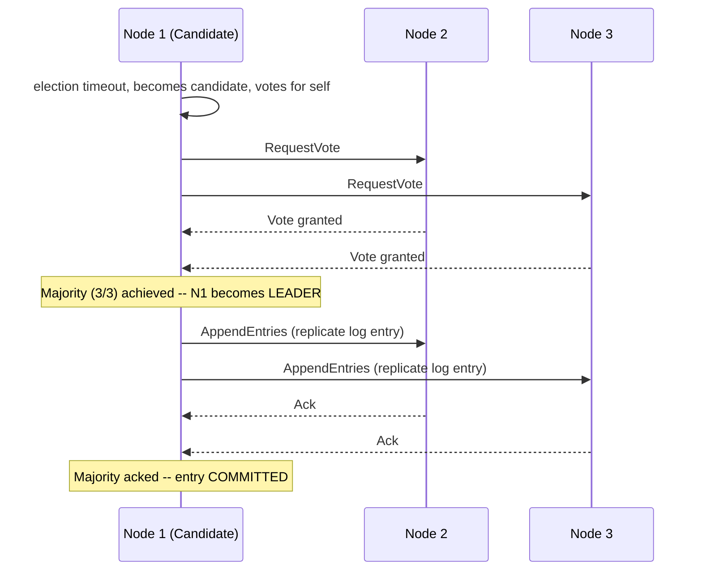

**2PC vs Saga**

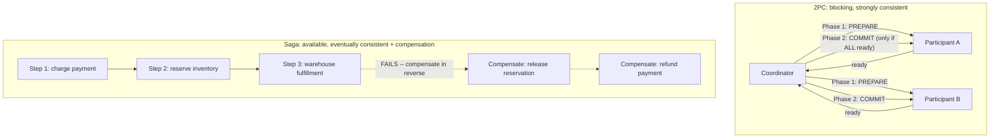

**12. System Design**

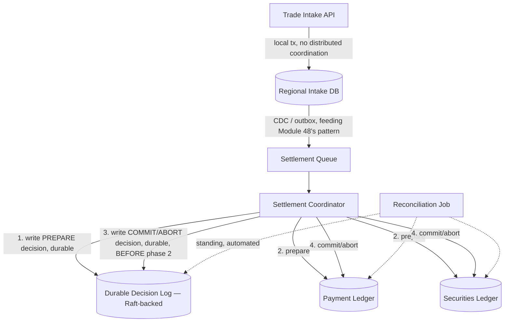

**13. Low-Level Design**

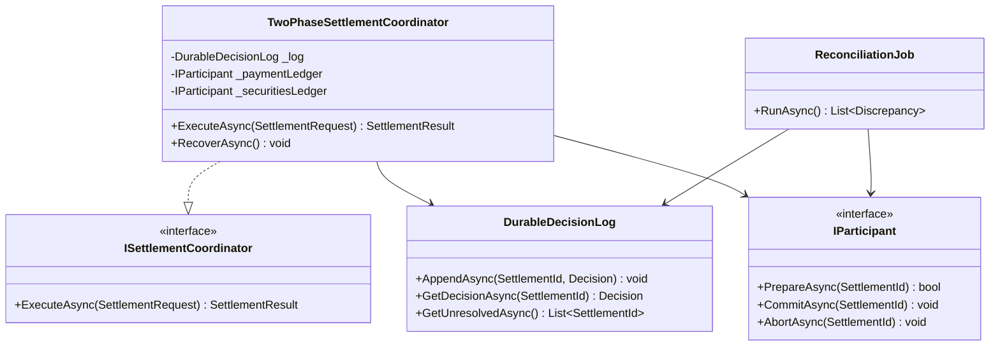

### Module 48 — Distributed Systems: Failure Detection, Idempotency & the Outbox Pattern
*Source: `02-Failure-Detection-Idempotency-Outbox.md`*

**The Dual-Write Problem and the Outbox Fix**

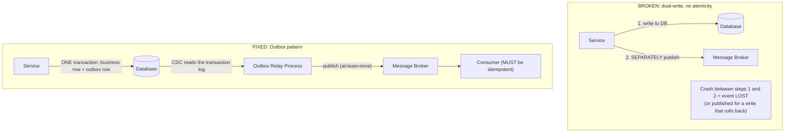

**12. System Design**

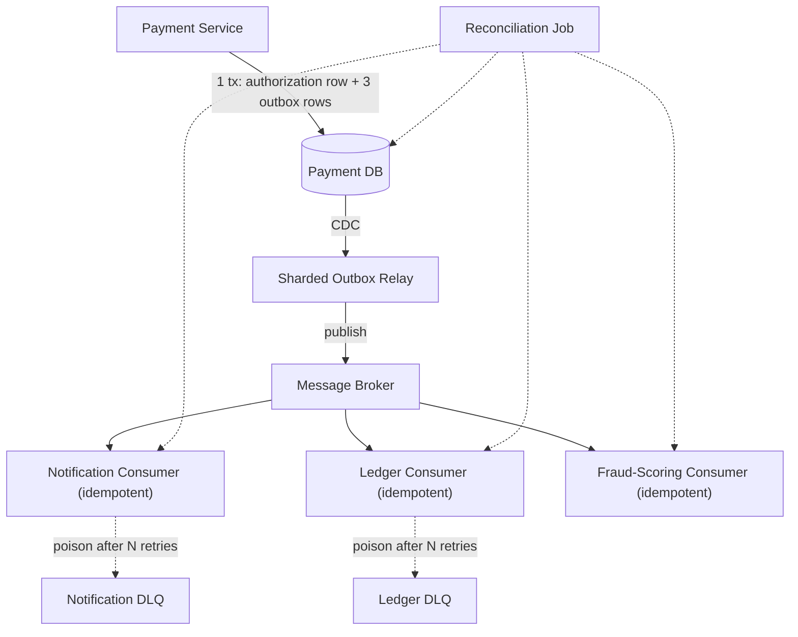

**13. Low-Level Design**

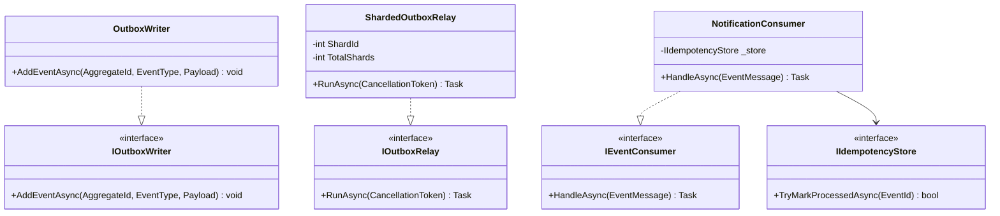

### Module 146 — Distributed Systems: Advanced Consistency Models, PACELC & Split-Brain
*Source: `03-PACELC-Consistency-Models-SplitBrain.md`*

**1. Fundamentals**

```text
 Is the network partitioned right now?
 │ │
 YES NO (the common case)
 │ │
 Choose: Availability Choose: Latency
 or Consistency (CAP) or Consistency (the "ELC" PACELC adds)
 │ │
 Availability-favoring Latency-favoring
 choice implemented choice implemented
 WITHOUT fencing ==> WITHOUT staleness bounds
 │ │
 SPLIT-BRAIN STALE READS treated as current

```

**3. Visual Architecture**

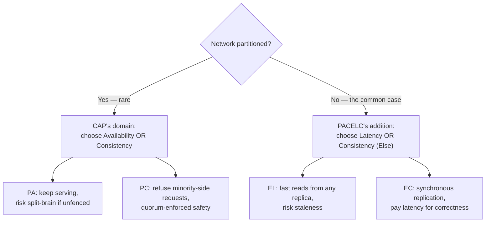

**3. Visual Architecture**

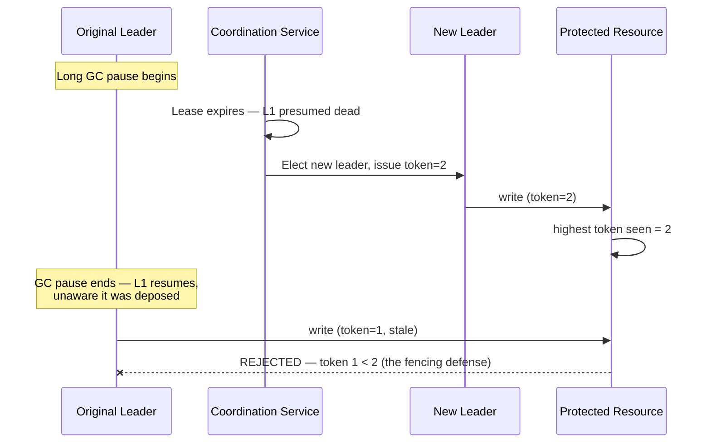

**3. Visual Architecture**

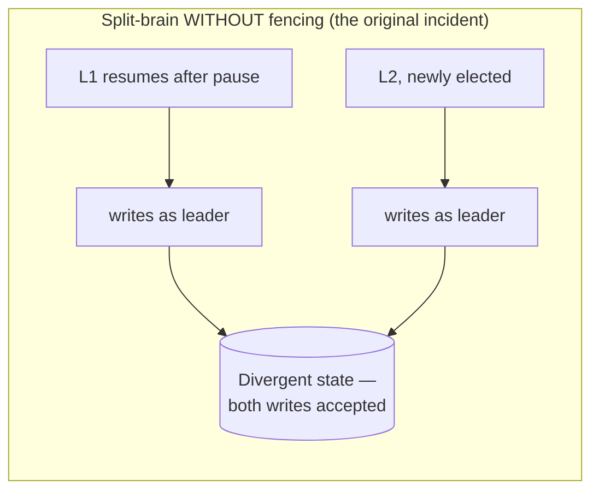

**13. Low-Level Design**

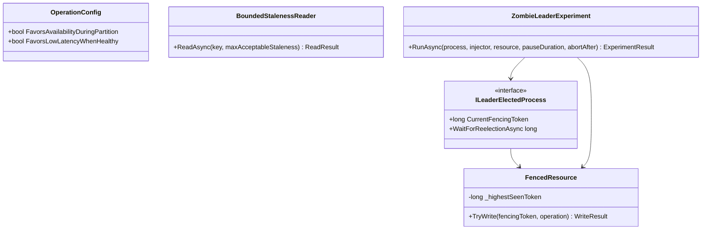

### Module 147 — Distributed Systems: CRDTs (Conflict-Free Replicated Data Types)
*Source: `04-CRDTs-Conflict-Free-Replicated-Data-Types.md`*

**1. Fundamentals**

```text
Replica A: state_A ──update──► state_A'
Replica B: state_B ──update──► state_B'

 merge(state_A', state_B') ── mathematically guaranteed to:
 - not depend on merge order (commutative)
 - not depend on grouping (associative)
 - be safe to re-apply (idempotent)
 │
 ▼
 IDENTICAL result on every replica,
 with zero coordination required
```

**3. Visual Architecture**

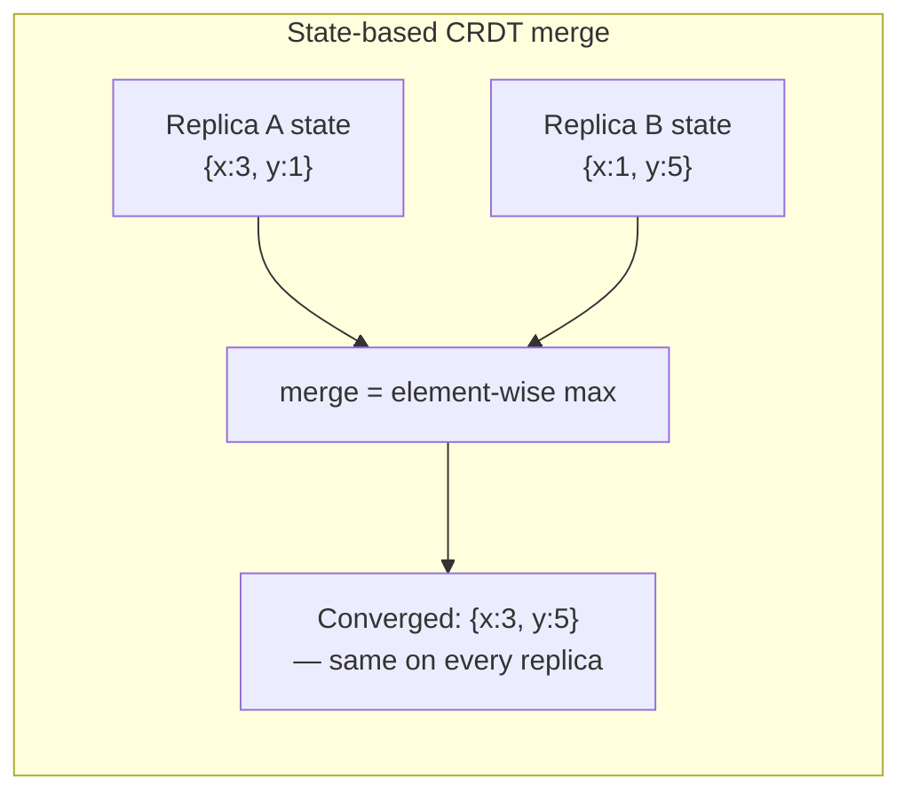

**3. Visual Architecture**

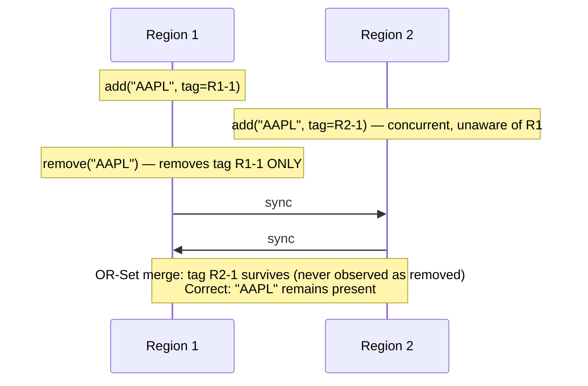

**3. Visual Architecture**

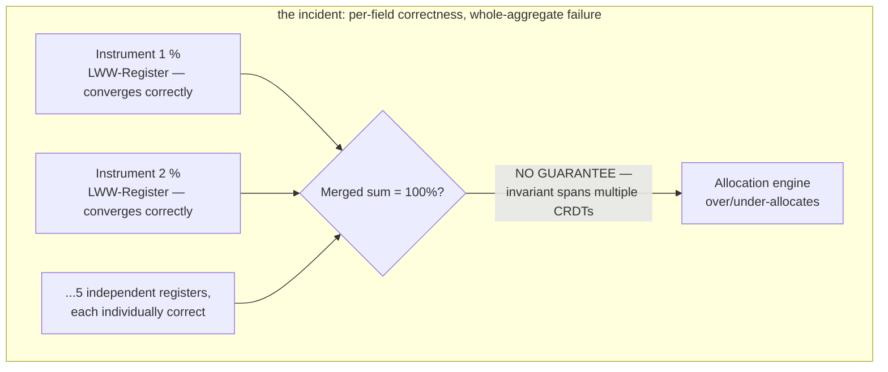

**13. Low-Level Design**

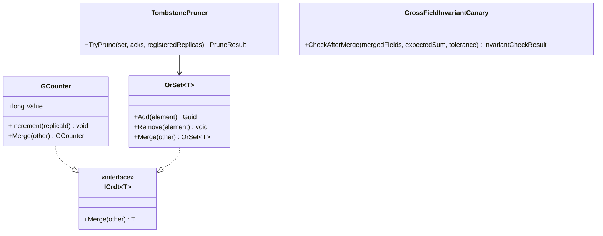

### Module 148 — Distributed Systems: Storage Engine Internals — LSM-Trees vs. B-Trees & Bloom Filters
*Source: `05-LSM-Trees-BTrees-BloomFilters-StorageEngines.md`*

**1. Fundamentals**

```text
WRITE-HEAVY, sequential-append-friendly workload READ-HEAVY, point-lookup/range-scan workload
 │ │
 ▼ ▼
 LSM-Tree B-Tree
 (memtable → WAL → SSTables → compaction) (balanced tree, in-place page updates)
 │ │
 High write throughput, but read cost Direct O(log n) reads, but random-I/O
 grows with un-compacted file count — writes and page-split cost under
 mitigated by Bloom filters heavy write volume
```

**3. Visual Architecture**

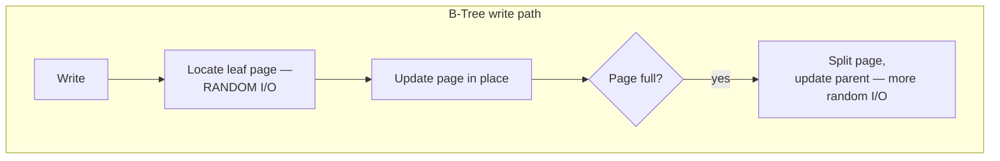

**3. Visual Architecture**

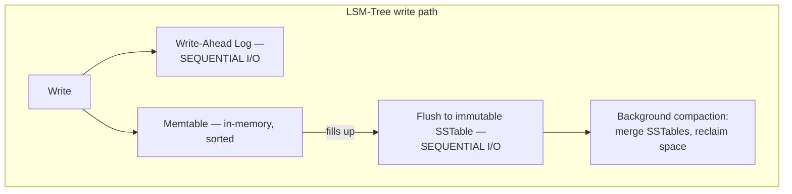

**3. Visual Architecture**

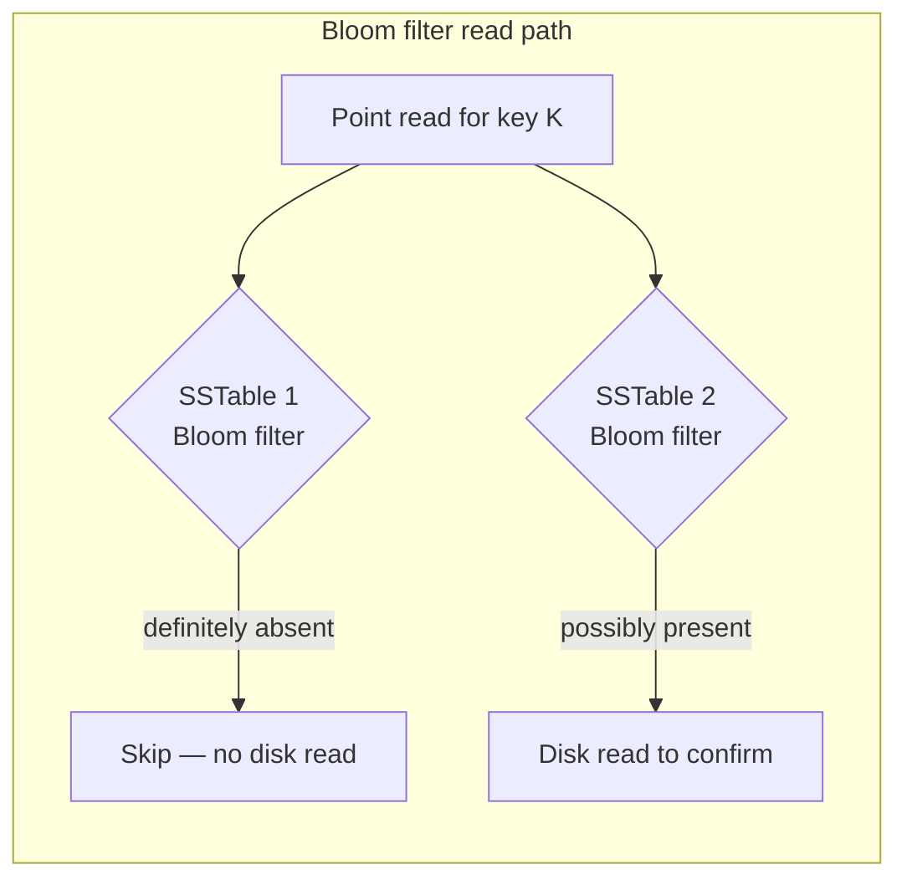

**13. Low-Level Design**

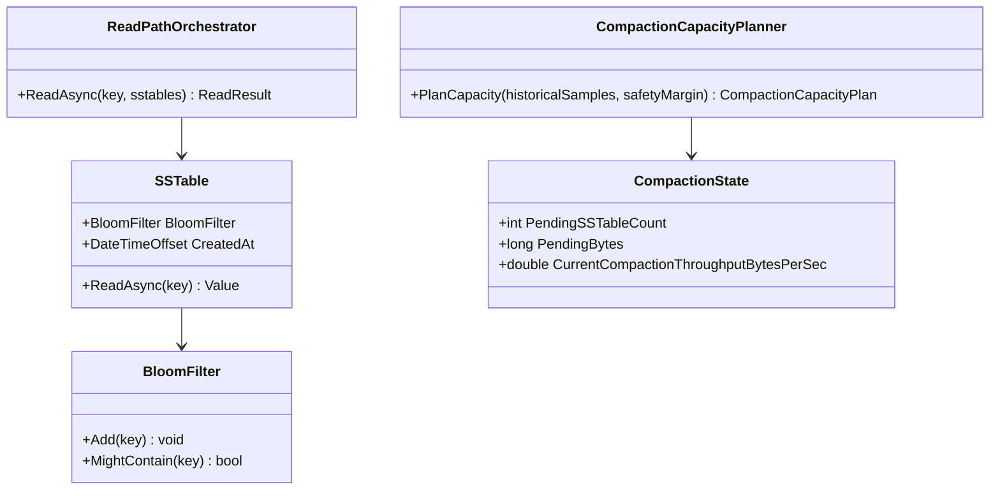

### Module 149 — Distributed Systems: Tail Latency, Hedged Requests & the Tail-at-Scale Problem
*Source: `06-TailLatency-HedgedRequests-TailAtScale.md`*

**1. Fundamentals**

```text
Single backend call: p(tail) = 1% ── low individual risk
Fan-out to 50 calls: p(at least one tail) = 1 - (1-0.01)^50 ≈ 39% ── high AGGREGATE risk
Fan-out to 100 calls: p(at least one tail) = 1 - (1-0.01)^100 ≈ 63% ── now the COMMON case, not the rare one
```

**3. Visual Architecture**

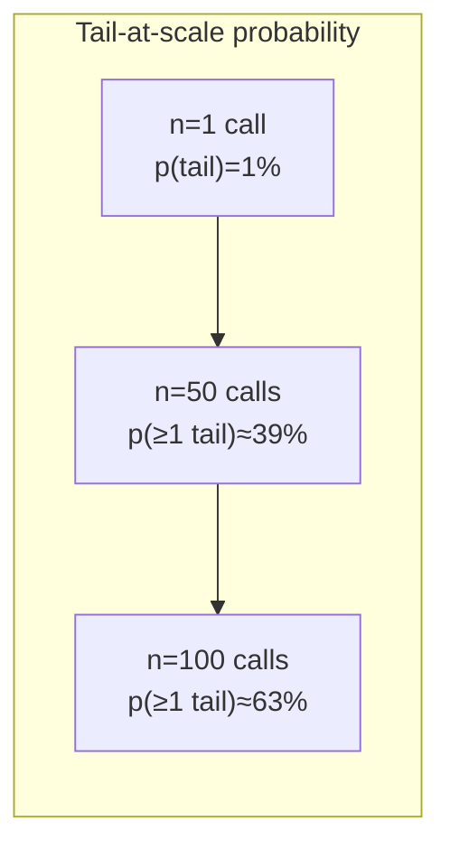

**3. Visual Architecture**

```mermaid
sequenceDiagram
 participant C as Client
 participant P as Primary Replica
 participant B as Backup Replica

 C->>P: request
 Note over C: wait until p95 threshold elapses (DELAYED, not immediate)
 C->>B: hedge request (only NOW, since P is trending into the tail)
 P--xC: (still pending)
 B-->>C: response arrives first
 C->>P: cancel (no longer needed)
```

**3. Visual Architecture**

```mermaid
graph TB
 subgraph "the hedging-storm feedback loop"
 Load[Elevated load] --> Tail[More calls land in tail]
 Tail --> Hedge[More hedges fire]
 Hedge --> MoreLoad[Hedges ADD to total load]
 MoreLoad --> Load
 end
 style MoreLoad fill:#f66,color:#fff
```

**13. Low-Level Design**

```mermaid
classDiagram
 class ILatencyPercentileTracker {
 <<interface>>
 +TimeSpan CurrentP95
 }
 class HedgeBudget {
 +TryReserveHedge bool
 }
 class LoadAwareHedgeGate {
 +ShouldHedge bool
 +RunDisablingCanaryAsync(injector) CanaryResult
 }
 class HedgedRequestExecutor~T~ {
 +ExecuteWithHedgeAsync(primary, hedge, tracker) T
 }
 class TailAtScaleCalculator {
 +AggregateTailProbability(p, n) double
 }

 HedgedRequestExecutor~T~ --> ILatencyPercentileTracker
 HedgedRequestExecutor~T~ --> HedgeBudget
 HedgedRequestExecutor~T~ --> LoadAwareHedgeGate
```
