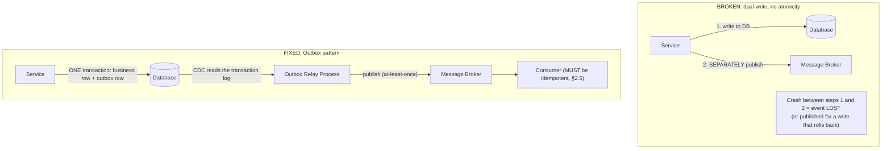

# Module 48 — Distributed Systems: Failure Detection, Idempotency & the Outbox Pattern

> Domain: Distributed Systems | Level: Beginner → Expert | Prerequisite: [[01-Consensus-Consistency-Distributed-Transactions]], [[../03-REST-APIs/01-REST-Design-Fundamentals]] §2.2 (idempotency, revisited here at full distributed-systems generality), [[../05-PostgreSQL/02-Partitioning-Replication-Logical-Decoding]] §2.4 (CDC, directly reused for Outbox)

---

## 1. Fundamentals

### What is failure detection, and why does the Outbox pattern complete this course's distributed-transactions arc?
**Failure detection** in a distributed system is the problem of determining whether a remote node/service has genuinely failed or is merely slow/temporarily unreachable — a **fundamentally ambiguous** distinction over an asynchronous network (you cannot distinguish "the server crashed" from "the server is fine but the network is currently dropping our packets" from the client side alone), directly underlying every timeout/retry/circuit-breaker decision this course has made throughout (Module 2's retry-with-backoff, Module 40's circuit breaker). The **Outbox pattern** solves the specific, recurring problem of **atomically updating a database and reliably publishing an event about that update** — directly closing the gap Module 43 §Advanced Q6 first identified (a business write and its corresponding event-to-be-published must be atomic, or a crash between them either loses the event or publishes it for a write that never actually committed).

### Why does this matter?
Because idempotency (Module 15 §2.2, reused extensively across Modules 26, 39, 41, 43) and the Outbox pattern are the two most practically-essential techniques for building *correct* distributed systems on top of the *theoretically* honest understanding Module 47 established — every distributed system must tolerate ambiguous failures (you cannot know for certain whether your last request succeeded) and must reliably notify other systems of state changes, and these two techniques are the concrete, universally-applicable answers.

### When does this matter?
Any distributed system where a service both writes to its own database and needs to communicate that write to other systems (nearly every non-trivial microservices architecture); the depth matters for correctly implementing the Outbox pattern (a genuinely subtle design, easy to get subtly wrong) and for understanding precisely why "at-least-once delivery plus idempotent processing" (not true exactly-once) is the honest, achievable target this course has repeatedly arrived at (Module 26 §2.3, Module 39 §2.3).

### How does it work (30,000-ft view)?
```
1. Failure detection: use heartbeats/timeouts (never certain), erring toward "assume failure after
   timeout X" with retry/idempotency to handle the case where the original request actually succeeded
2. Outbox: write the business change AND an "event to publish" row in the SAME local database
   transaction -- a separate process reads unpublished outbox rows and publishes them, guaranteeing
   the event is never lost even if the publish step crashes immediately after the transaction commits
```

---

## 2. Deep Dive

### 2.1 The Fundamental Ambiguity of Distributed Failure Detection
When a request times out, exactly **three** things could have happened: (a) the request never reached the server at all (network failure before delivery), (b) the request reached the server, was processed, but the response was lost on the way back (network failure after processing), or (c) the server is still processing and simply hasn't responded yet. **The client cannot distinguish these three cases** from a timeout alone — this single, unavoidable ambiguity is *why* idempotency (§2.3) is not an optional nicety but a structural necessity for any system that retries on timeout (which is to say, any system with retry logic at all, i.e., nearly every distributed system this course has covered). Failure detectors (heartbeat-based liveness checks, Module 14's health checks generalized to inter-service failure detection) can only ever provide a **probabilistic**, timeout-tuned guess ("probably failed, given no heartbeat for N seconds"), never a certain answer, in a genuinely asynchronous network.

### 2.2 Timeout Tuning as a Precision-Recall Trade-off
Choosing a failure-detection timeout is a direct precision/recall trade-off: a **short** timeout detects genuine failures quickly (good for fast failover) but risks **false positives** (declaring a merely-slow-but-healthy node "failed," triggering unnecessary failover/retry — directly Module 26 §Advanced Q9's Sentinel-quorum discussion, where an overly aggressive timeout could trigger unnecessary failover during a brief network blip); a **long** timeout reduces false positives but delays genuine failure detection, extending the window during which requests are sent to an actually-dead node. Production systems typically use **adaptive** timeouts (based on observed, historical response-time distributions, tightening or loosening automatically) rather than a single, hand-tuned fixed value, directly the same "adaptive, not static" principle as Module 16 §Advanced Q5's adaptive rate limiting.

### 2.3 Idempotency, Generalized Beyond HTTP APIs
Module 15 §2.2 introduced idempotency for HTTP APIs specifically (a client-generated idempotency key); this generalizes to **every** distributed-system boundary where retries occur: a message-queue consumer processing the same message twice (Module 26 §2.2's consumer-group at-least-once delivery) must be idempotent; a Saga's compensating action (Module 43 §Advanced Q2) must be idempotent since it too can be retried; an inter-service RPC call retried after a timeout (§2.1's ambiguous-failure scenario) must be idempotent at the receiving service. The **general** idempotency mechanism (a unique operation identifier, checked-and-recorded atomically before the operation's actual effect is applied) recurs identically across every one of these contexts — recognizing idempotency as a **universal distributed-systems requirement**, not an HTTP-API-specific pattern, is the generalization this module completes.

### 2.4 The Outbox Pattern — Precise Mechanics and the Dual-Write Problem It Solves
The **dual-write problem**: a service that both (a) updates its own database and (b) separately publishes a message to a message broker cannot make these two operations atomic using ordinary means — a crash between the database commit and the message publish either loses the event entirely (if the crash happens before publish) or, if using a naive "publish first, then commit" ordering, could publish an event for a database write that then fails to commit. The **Outbox pattern** solves this by writing the "event to be published" as a **row in the same database, within the same local transaction** as the business change — since both writes are now part of one, ordinary ACID database transaction (Module 19/24), they succeed or fail together, atomically, using nothing more exotic than the database's own, already-understood transactional guarantee. A **separate process** (a polling job, or — the more efficient, modern approach — a Change-Data-Capture consumer reading the database's own replication log, directly Module 22 §2.4/Module 27 §Advanced Q6's CDC pattern) then reads unpublished outbox rows and publishes them to the actual message broker, marking them published (or simply relying on CDC's inherent "read the change log once" semantics) once done.

### 2.5 Outbox Delivery Guarantees — At-Least-Once, Requiring Consumer Idempotency
The Outbox pattern guarantees the event is **never lost** (it's durably recorded in the same transaction as the business change) but does **not**, by itself, guarantee **exactly-once delivery** to downstream consumers — the publishing process could crash after successfully publishing but before marking the outbox row as published, causing a redundant republish on restart — meaning downstream consumers of Outbox-published events **must** be idempotent (§2.3), exactly the same "at-least-once delivery plus idempotent processing = the honest, achievable target" conclusion this course has reached repeatedly (Module 26 §2.3, Module 39 §2.3), now understood as a direct, unavoidable consequence of the Outbox pattern's own mechanics, not a separate, additional requirement layered on top.

## 3. Visual Architecture

### The Dual-Write Problem and the Outbox Fix


## 4. Production Example
**Scenario**: A team implementing an order-confirmation-email feature used the naive dual-write approach: after committing an order to the database, the order service directly, separately called the email-notification service's API — during a production incident where the order service crashed (an unrelated OOM event) immediately after committing the order but before the email-notification call completed, a percentage of successfully-placed orders **never received a confirmation email**, with no error logged anywhere (the crash simply terminated the process mid-way, before the notification call's own error-handling logic could even execute) — the gap was only discovered via customer support tickets ("I placed an order but got no confirmation") accumulating over several days before someone correlated them with the specific deployment window when the OOM issue was occurring. **Investigation**: confirmed the order-commit and email-notification-call were two entirely separate, non-atomic operations with no recovery mechanism for a crash between them — exactly §2.4's dual-write problem, manifesting as silently missing notifications rather than a loud, immediately-diagnosable error. **Fix**: implemented the Outbox pattern — order commits now include an "OrderConfirmationEmailRequested" outbox row in the same transaction, with a separate, CDC-based relay process (Module 22 §2.4) publishing these events to the notification service reliably, guaranteeing every committed order generates exactly one (or, under at-least-once semantics, at least one, with the notification service's own idempotent processing — Module 15 §2.2's pattern — preventing a duplicate email) confirmation-email event, with **no possibility** of the crash-between-steps scenario silently losing the notification, since the notification request is now durably recorded as part of the order's own atomic commit. **Lesson**: this is precisely the dual-write problem Module 43 §Advanced Q6 first flagged as a design consideration, now demonstrated as a real, customer-impacting incident when left unaddressed — "write to the database, then separately call another service" is a deceptively simple-looking pattern that silently, structurally cannot guarantee reliability under the entirely realistic failure mode of "the process crashes between the two steps," and the Outbox pattern's core insight (piggyback the notification on the same, already-atomic database transaction) is the standard, correct fix, not an exotic or over-engineered solution to a rare edge case.

## 5. Best Practices
- Always use the Outbox pattern (not a direct, separate API call/message publish) whenever a database write must be reliably communicated to another system — never assume "the crash window is too small to matter" (§4's incident demonstrates it isn't).
- Prefer a CDC-based Outbox relay (reading the database's own transaction/replication log) over a polling-based relay for lower latency and reduced database load, directly reusing Module 22/27's CDC patterns.
- Design every message-queue consumer, every retried RPC call, and every Saga compensating action to be idempotent by default — treat this as a universal distributed-systems requirement, not a case-by-case decision.
- Use adaptive, historically-informed timeouts for failure detection rather than a single, hand-tuned static value.

## 6. Anti-patterns
- The naive dual-write pattern (database write, then a separate, non-transactional call to another service/broker) for any operation requiring reliable cross-system notification (§4's incident).
- Assuming a message will only ever be delivered/processed once, building consumer logic that isn't idempotent and would produce incorrect results (duplicate charges, duplicate emails) under at-least-once redelivery.
- Using an aggressively short, fixed failure-detection timeout without considering the false-positive risk during normal, brief network/processing variance.
- Treating "the crash window between two operations is very small, so it's an acceptable risk" as sufficient justification — a small-probability, high-impact failure mode still eventually occurs at sufficient scale/time (Module 22 §4, Module 25 §4, and this module's §4 all demonstrate exactly this).

## 7. Performance Engineering
The Outbox pattern's relay process adds a small, bounded latency between a database commit and the corresponding event actually being published/delivered (the relay's own polling interval, or CDC's typically-sub-second propagation delay) — this latency should be explicitly measured and communicated as part of the system's overall event-delivery-latency budget (Module 37 §7), distinct from and in addition to the message broker's own delivery latency once the event is actually published. A CDC-based relay (versus polling) directly reduces both this latency and the database load a polling-based relay would otherwise impose (repeated "any new unpublished rows?" queries) — precisely why CDC is the modern, preferred Outbox-relay mechanism over a simpler-to-initially-implement polling loop.

## 8. Security
Outbox-relayed events, since they're derived from the database's own transaction log (when using CDC), inherit whatever access-control is already applied to that log — but the relay process itself, and the message broker it publishes to, need their own appropriate authentication/authorization (directly Module 40 §8's gateway-adjacent internal-trust-propagation discussion) to prevent an unauthorized party from either reading sensitive outbox-relayed event content or, worse, injecting fraudulent events directly into the broker, bypassing the legitimate outbox-and-relay path entirely. Idempotency-key-based deduplication (§2.3) also has a security dimension directly connecting to Module 15 §8: idempotency keys must be scoped per-caller/per-tenant to prevent one party from guessing/reusing another's key to interfere with or read the result of an unrelated operation.

## 9. Scalability
The Outbox relay process, since it processes every business transaction's associated events, must scale with the system's overall write throughput — directly Module 38/41's asynchronous, queue-driven worker-fleet scaling pattern applies here too, with the relay's own throughput (and its lag behind the database's actual commit rate) as a standing, monitorable metric (directly Module 26 §Advanced Q2's consumer-lag-monitoring discipline, applied to the Outbox relay specifically). At very high write-volume scale, the outbox table itself needs the same bounding/archival discipline as any other high-churn table (Module 21's vacuum/bloat discipline for PostgreSQL, or an explicit archival/deletion policy for already-relayed rows) to avoid unbounded growth — directly Module 22/23's recurring "bound and clean up derived/transient state" lesson, applied here to the outbox table specifically.

---

## 10. Interview Questions

### Basic (10)
1. **Q: Why can't a client reliably distinguish "the server crashed" from "the network is slow" after a timeout?** **A:** Both produce the identical observable symptom (no response received) from the client's perspective in an asynchronous network — this is a fundamental, unavoidable ambiguity.
2. **Q: What is the dual-write problem?** **A:** A service updating its own database and separately publishing a message/calling another service cannot make these two operations atomic using ordinary means, risking a lost or incorrectly-published event if a crash occurs between them.
3. **Q: What is the Outbox pattern?** **A:** Writing the business change and an "event to publish" row within the same local database transaction, guaranteeing they succeed or fail together atomically.
4. **Q: Does the Outbox pattern guarantee exactly-once delivery to downstream consumers?** **A:** No — it guarantees the event is never lost (at-least-once), requiring consumers to be idempotent to handle possible redelivery.
5. **Q: What are the two mechanisms for an Outbox relay process to read unpublished events?** **A:** Polling the outbox table, or Change-Data-Capture reading the database's own transaction log.
6. **Q: Why is idempotency described as a universal distributed-systems requirement rather than an HTTP-API-specific pattern?** **A:** Because retries occur at every distributed-system boundary (message consumers, RPC calls, Saga compensations), and idempotency is the general mechanism making any of these safely retryable.
7. **Q: What's the trade-off in choosing a short versus long failure-detection timeout?** **A:** Short timeouts detect genuine failures faster but risk false positives (declaring a healthy-but-slow node "failed"); long timeouts reduce false positives but delay genuine failure detection.
8. **Q: What is an adaptive timeout?** **A:** A failure-detection timeout that adjusts automatically based on observed, historical response-time patterns, rather than a single fixed value.
9. **Q: Why must a Saga's compensating action itself be idempotent?** **A:** Because it too can be retried (e.g., after a transient failure during compensation), requiring the same safe-to-repeat guarantee as any other retryable operation.
10. **Q: Why is CDC generally preferred over polling for an Outbox relay?** **A:** Lower latency and reduced database load compared to a polling loop repeatedly querying for new unpublished rows.

### Intermediate (10)
1. **Q: Why does the fundamental ambiguity of failure detection (§2.1) mean idempotency isn't optional for any system with retry logic?** **A:** Since a client can never be certain whether a timed-out request actually succeeded or failed, a retry might duplicate an already-successful operation — idempotency is what makes this duplication safe rather than causing a double-charge, duplicate order, or similar incorrect outcome.
2. **Q: Why does writing the outbox row in the same transaction as the business change solve the dual-write problem specifically?** **A:** Both writes now share the same, already-understood ACID transactional guarantee (Module 19/24) — they succeed or fail together as one atomic unit, eliminating the possibility of a crash leaving one committed without the other.
3. **Q: Why does the Outbox pattern still require idempotent consumers despite guaranteeing the event is never lost?** **A:** The relay process itself can crash after publishing but before marking the row as published, causing a redundant republish on restart — the "never lost" guarantee doesn't extend to "never duplicated," requiring consumer-side idempotency to handle this specific redelivery scenario.
4. **Q: Why might an aggressively short failure-detection timeout in a message-queue consumer-group setting (Module 26) cause unnecessary work redistribution?** **A:** A consumer that's merely slow (processing a genuinely large/complex message) but not actually failed could be incorrectly declared dead, triggering its in-progress work to be reassigned to another consumer unnecessarily, potentially causing duplicate processing of the same message.
5. **Q: Why does the §4 production incident's "no error logged anywhere" symptom specifically demonstrate the dual-write problem's danger, beyond just "sometimes things fail"?** **A:** The crash occurred mid-way through the process, before any error-handling/logging code for the second operation (the notification call) could even execute — there was structurally no code path available to log the failure, since the failure was the process itself terminating, not a caught, logged exception.
6. **Q: Why is scoping idempotency keys per-caller/per-tenant a security concern, not just a correctness one?** **A:** Without this scoping, one caller could guess or reuse another caller's idempotency key to read the cached result of an operation they didn't actually perform, or interfere with another tenant's in-flight operation — directly Module 15 §8's concern, now understood as part of this module's general idempotency discussion.
7. **Q: Why does the Outbox relay's own lag (how far behind the database's commit rate it's running) need standing monitoring?** **A:** A growing lag means events are being published later and later after their corresponding business transactions commit, potentially violating downstream consumers' freshness expectations — directly the same consumer-lag-monitoring discipline from Module 26 applied to this specific relay process.
8. **Q: Why does the outbox table itself need bounding/archival, similar to other high-churn tables covered earlier in this course?** **A:** Every business transaction generates a new outbox row — without archival/deletion of already-relayed rows, this table grows unboundedly, exactly the same "derived/transient state needs a bounding discipline" lesson from Module 21 (vacuum/bloat) and Module 23 (unbounded embedded arrays).
9. **Q: Why would a team choose polling over CDC for an Outbox relay despite CDC's latency/load advantages?** **A:** Polling is simpler to initially implement and doesn't require setting up/operating CDC infrastructure (replication-log access, a CDC tool like Debezium) — a reasonable starting choice for a system not yet needing CDC's lower latency, with migration to CDC as a later optimization once the polling interval's latency becomes a genuinely demonstrated limitation.
10. **Q: Why is "the crash window between two operations is very small" an insufficient justification for skipping the Outbox pattern?** **A:** A small-probability event still eventually occurs given enough attempts/time at production scale and duration — exactly the same "rare, low-probability failure modes still eventually manifest as real incidents" lesson demonstrated repeatedly across this course's production examples (Module 22's orphaned replication slot, Module 25's misapplied eviction policy, this module's §4).

### Advanced (10)
1. **Q: Diagnose the missing-confirmation-email production incident (§4) from first principles, and design the specific monitoring/alerting that would have caught it faster than several days of accumulating customer complaints.**
   **A:** Root cause: the naive dual-write pattern with no recovery mechanism for a crash between the two operations, combined with no monitoring specifically comparing "orders committed" against "confirmation emails sent" as a reconciliation check. Safeguard: a standing, automated reconciliation job comparing the count of committed orders against the count of successfully-processed confirmation-email events over the same time window, alerting on any sustained, non-trivial discrepancy — directly generalizing this course's recurring "measure the actual invariant the design depends on, don't just trust the mechanism is working" discipline (Module 22 §Advanced Q1, Module 42 §Advanced Q1) to this specific dual-write/notification-reliability concern, converting a multi-day, customer-complaint-driven discovery into a same-day, automated one.
2. **Q: Design the exact database schema and relay-process logic for an Outbox implementation, addressing both the polling and CDC-based approaches.**
   **A:**
   ```sql
   CREATE TABLE OutboxEvents (
       Id BIGINT IDENTITY PRIMARY KEY,
       AggregateId VARCHAR(50) NOT NULL,
       EventType VARCHAR(100) NOT NULL,
       Payload NVARCHAR(MAX) NOT NULL,
       CreatedAt DATETIME2 NOT NULL DEFAULT SYSUTCDATETIME(),
       PublishedAt DATETIME2 NULL -- NULL = not yet published
   );
   ```
   Polling relay: `SELECT TOP 100 * FROM OutboxEvents WHERE PublishedAt IS NULL ORDER BY Id`, publish each, then `UPDATE ... SET PublishedAt = SYSUTCDATETIME() WHERE Id = @Id` — simple, but polling interval directly bounds latency and adds recurring query load. CDC relay: a Debezium-style connector (Module 22 §2.4) reads the database's own transaction log for INSERT operations against `OutboxEvents` specifically, publishing each detected insert directly to the message broker — lower latency (near-real-time, bounded only by replication-log propagation delay) and no additional query load on the primary database at all, since CDC reads the replication stream, not the live table.
3. **Q: Explain how you would design a failure detector that adapts its timeout based on observed latency, addressing Advanced Q4/§2.2's precision-recall trade-off concretely.**
   **A:** Maintain a rolling window of recent successful response-time observations for a given dependency, computing a timeout dynamically as a statistical outlier threshold (e.g., the 99.9th percentile of recent observed latencies, plus a safety margin) rather than a single, hand-picked fixed value — as the dependency's actual performance characteristics shift (a genuinely slower period due to increased load, or a recovery to normal performance), the adaptive timeout shifts correspondingly, reducing false positives during a legitimate, if unusual, slow period while still detecting genuine unresponsiveness (no response at all, far exceeding even the adapted, widened threshold) — directly the "phi accrual failure detector" concept from distributed-systems literature, a more sophisticated alternative to a simple fixed timeout.
4. **Q: A team's Outbox relay process is falling increasingly behind the database's commit rate during peak traffic, causing downstream event-delivery latency to grow unacceptably. Diagnose and design the fix.**
   **A:** Directly Module 26 §Advanced Q2's consumer-lag-monitoring-and-scaling pattern — if the relay is a single-instance process, it has a fixed maximum throughput ceiling; the fix is horizontally scaling the relay (multiple relay instances, each responsible for a partition/shard of the outbox table by `AggregateId` hash, directly Module 27's partition-key-design discipline applied to outbox-relay parallelization) so aggregate relay throughput scales with instance count, closing the growing-lag gap during peak traffic rather than a single instance's fixed capacity becoming an increasingly severe bottleneck.
5. **Q: Explain how you would handle a scenario where the message broker itself is temporarily unavailable, and the Outbox relay cannot publish for an extended period — what happens to the growing backlog of unpublished outbox rows?**
   **A:** The relay should implement retry-with-backoff (Module 2's pattern) specifically for the publish step, continuing to accumulate a backlog of unpublished rows during the broker's outage (the outbox table itself serves as the durable buffer, exactly its intended purpose) — once the broker recovers, the relay resumes and drains the accumulated backlog; monitoring should track both the backlog **size** (how many unpublished rows) and its **age** (how long the oldest unpublished row has been waiting), alerting distinctly on each, since a large-but-recent backlog (a brief traffic spike) is a different concern than a smaller-but-very-old backlog (indicating the relay itself, not just traffic volume, has a sustained problem).
6. **Q: Design a strategy for handling "poison" outbox events — a specific event that repeatedly fails to publish (perhaps due to a malformed payload) and blocks the relay from progressing past it if processing is strictly sequential.**
   **A:** Directly Module 26 §Advanced Q7's dead-letter-queue pattern, applied here — after a configured maximum retry count for a specific outbox row, move it to a separate "failed outbox events" table/queue for manual investigation, and **skip past it** to continue relaying subsequent, healthy events rather than allowing one poison event to block the entire relay's progress indefinitely — critically, this requires the relay to process events in a way that doesn't strictly require in-order delivery to downstream consumers (or, if strict ordering genuinely matters, requires an explicit design decision about whether skipping a poison event is even acceptable, versus needing to halt entirely until it's manually resolved, since skipping might violate an ordering guarantee the downstream consumer depends on).
7. **Q: Explain why "idempotent by default" is a stronger organizational principle than "idempotent where we remember to add it," connecting to this course's recurring governance pattern.**
   **A:** Requiring idempotency to be an explicit, deliberate, case-by-case decision means it's easy to forget for a new message consumer/RPC handler added later by an engineer unfamiliar with this requirement — directly the same "make the correct default the path of least resistance, don't rely on every engineer independently remembering a hard-won lesson" governance principle recurring throughout this course (Module 9's shared pipeline template, Module 30's SOLID design-review checklist) — a shared, reusable idempotency-key-checking helper/base class (directly Module 15 §11 Expert exercise's `IIdempotencyStore` pattern) that new consumers are expected to use by convention, with code review specifically flagging any new retryable operation lacking it, converts this from "remember to think about it" into "the default, expected pattern."
8. **Q: A team proposes eliminating the Outbox pattern's relay-process complexity by having the application code call the message broker directly within the same database transaction (treating the broker as a genuine, transactional participant alongside the database). Evaluate this as a Principal Engineer.**
   **A:** This reintroduces exactly the distributed-transaction complexity (and, likely, 2PC-style blocking risk, Module 47 §2.4) the Outbox pattern was specifically designed to avoid — most message brokers don't participate in ordinary ACID database transactions as a genuine resource manager (and even those with some transactional support typically impose meaningful constraints/complexity to achieve it), meaning this proposal either doesn't actually achieve genuine atomicity (silently reintroducing the dual-write problem in a more complex disguise) or requires a heavyweight, 2PC-based coordination mechanism carrying exactly the blocking-failure-mode risk Module 47 §4 demonstrated — recommend the standard Outbox pattern (a plain database transaction plus an eventually-consistent relay) as the simpler, more robust, industry-standard solution, rather than attempting to force broker participation into the database's own transactional boundary.
9. **Q: How would you design a testing strategy specifically verifying the Outbox pattern's core atomicity guarantee — that a crash between the business-row and outbox-row writes genuinely cannot occur, given they're in the same transaction?**
   **A:** Since both writes are part of one ordinary database transaction, the correctness guarantee rests entirely on the database engine's own, already-extensively-tested ACID transaction implementation (Module 19/24) — the actual testing focus should instead verify (a) that the application code genuinely writes both rows within one transaction scope (a code-review/static-analysis check, or an integration test deliberately forcing a mid-transaction exception and asserting **neither** row persists, confirming true atomicity rather than an accidental two-separate-transactions implementation bug) and (b) the relay process's own correctness (Advanced Q2's schema, correctly identifying and publishing unpublished rows exactly once under normal operation, and at-least-once under the relay's own crash scenarios) — the atomicity guarantee itself is "free," inherited from the database; the engineering risk is in correctly implementing the surrounding application and relay logic, not in re-verifying the database's own transactional correctness.
10. **Q: As a Principal Engineer, how would you build organizational capability ensuring every new microservice correctly implements the Outbox pattern (and idempotent consumption) by default, rather than each team rediscovering the dual-write problem reactively via their own incident, as in §4?**
    **A:** Provide a shared, reusable Outbox-pattern library/framework component (directly this course's recurring shared-infrastructure governance pattern, Module 9 §15/§17, Module 40 §Advanced Q10) that new services adopt by convention — abstracting the outbox-table schema, the transactional-write helper (ensuring business writes and outbox writes are correctly co-transacted), and the relay-process implementation (CDC-based by default, per Advanced Q2's preferred approach) into a well-tested, centrally-maintained component, rather than requiring every team to correctly re-derive and re-implement this genuinely subtle pattern from first principles independently — directly preventing the specific, demonstrated incident class from §4 (and Module 43 §Advanced Q6's original conceptual introduction of this exact risk) from recurring across a growing service estate, converting a hard-won distributed-systems lesson into reusable, low-friction infrastructure.

---

## 11. Coding Exercises

### Easy — Basic Outbox pattern: co-transacted business write and event row
```csharp
public async Task PlaceOrderAsync(Order order)
{
    using var transaction = await _dbContext.Database.BeginTransactionAsync();

    _dbContext.Orders.Add(order); // business write

    _dbContext.OutboxEvents.Add(new OutboxEvent // event write -- SAME transaction, §4's fix
    {
        AggregateId = order.Id,
        EventType = "OrderConfirmationEmailRequested",
        Payload = JsonSerializer.Serialize(new { order.Id, order.CustomerEmail }),
        CreatedAt = DateTimeOffset.UtcNow
    });

    await _dbContext.SaveChangesAsync(); // ONE atomic commit -- both succeed or both roll back
    await transaction.CommitAsync();
}
```

### Medium — Polling-based Outbox relay with retry and dead-letter handling (Advanced Q6)
```csharp
public class OutboxRelayWorker : BackgroundService
{
    protected override async Task ExecuteAsync(CancellationToken stoppingToken)
    {
        while (!stoppingToken.IsCancellationRequested)
        {
            var unpublished = await _dbContext.OutboxEvents
                .Where(e => e.PublishedAt == null && e.RetryCount < 5)
                .OrderBy(e => e.Id)
                .Take(100)
                .ToListAsync(stoppingToken);

            foreach (var evt in unpublished)
            {
                try
                {
                    await _messageBroker.PublishAsync(evt.EventType, evt.Payload);
                    evt.PublishedAt = DateTimeOffset.UtcNow;
                }
                catch (Exception ex)
                {
                    evt.RetryCount++;
                    if (evt.RetryCount >= 5)
                        await _deadLetterStore.MoveAsync(evt); // Advanced Q6's poison-event handling
                    _logger.LogWarning(ex, "Failed to publish outbox event {Id}, attempt {Count}", evt.Id, evt.RetryCount);
                }
            }
            await _dbContext.SaveChangesAsync(stoppingToken);
            await Task.Delay(TimeSpan.FromSeconds(1), stoppingToken); // polling interval
        }
    }
}
```

### Hard — Idempotent event consumer (§2.5's requirement, made concrete)
```csharp
public async Task HandleOrderConfirmationEmailRequestedAsync(OutboxEventMessage message)
{
    // Idempotency check FIRST -- directly Module 15 §11 Expert exercise's IIdempotencyStore pattern,
    // now applied to message-consumption instead of HTTP API requests.
    if (await _processedEventStore.HasBeenProcessedAsync(message.EventId))
    {
        _logger.LogInformation("Event {EventId} already processed, skipping (at-least-once redelivery).", message.EventId);
        return;
    }

    await _emailService.SendOrderConfirmationAsync(message.OrderId, message.CustomerEmail);
    await _processedEventStore.MarkProcessedAsync(message.EventId); // record AFTER successful processing
}
```

### Expert — Sharded, horizontally-scaled Outbox relay (Advanced Q4)
```csharp
public class ShardedOutboxRelay
{
    private readonly int _shardId, _totalShards;

    public async Task RunAsync(CancellationToken ct)
    {
        while (!ct.IsCancellationRequested)
        {
            // Each relay INSTANCE handles only rows whose AggregateId hashes to ITS shard --
            // directly Module 27's partition-key-based parallelization, applied to relay scaling.
            var unpublished = await _dbContext.OutboxEvents
                .Where(e => e.PublishedAt == null)
                .Where(e => EF.Functions.DataLength(e.AggregateId) > 0) // conceptual filter placeholder
                .AsEnumerable() // hash computation happens client-side in this illustrative example
                .Where(e => Math.Abs(e.AggregateId.GetHashCode()) % _totalShards == _shardId)
                .Take(100)
                .ToList();

            foreach (var evt in unpublished)
            {
                await _messageBroker.PublishAsync(evt.EventType, evt.Payload);
                evt.PublishedAt = DateTimeOffset.UtcNow;
            }
            await _dbContext.SaveChangesAsync(ct);
            await Task.Delay(TimeSpan.FromMilliseconds(500), ct);
        }
    }
}
// Deploying N instances (each with a distinct _shardId, 0..N-1) scales aggregate relay
// throughput roughly linearly with N, directly addressing Advanced Q4's growing-lag scenario.
```

---

## 12–17. System Design / LLD / Debugging / Decision / Case Study / Principal

*(This entire module IS the deep-dive case study — §4's incident, §11's four worked exercises, and the extensive Advanced-tier Q&A collectively constitute this section's typical content.)*

## 18. Revision
**Key takeaways**: Distributed failure detection is fundamentally ambiguous (can't distinguish "crashed" from "slow" over an asynchronous network) — this is precisely why idempotency is a universal, non-optional requirement for any system with retry logic, not an HTTP-API-specific nicety. The dual-write problem (database write + separate message publish, non-atomic) causes silent, hard-to-diagnose failures under the entirely realistic "crash between the two steps" scenario (§4) — the Outbox pattern solves it by co-transacting the business write and the event-to-publish row, inheriting the database's own ACID guarantee for free. The Outbox pattern guarantees at-least-once (never-lost) delivery, not exactly-once — downstream consumers must be idempotent to handle possible redelivery, the same conclusion this course has reached repeatedly (Modules 26, 39, 43) now understood as a direct, unavoidable consequence of the pattern's own mechanics. CDC-based relays (reusing Module 22/27's change-data-capture pattern) are the modern, preferred Outbox-relay mechanism over polling, for both latency and database-load reasons.

---

**Next**: This completes the `16-Distributed-Systems` domain (Modules 47–48). Continuing autonomously to `17-Microservices`.
