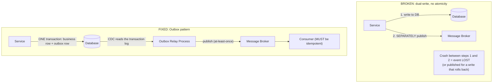
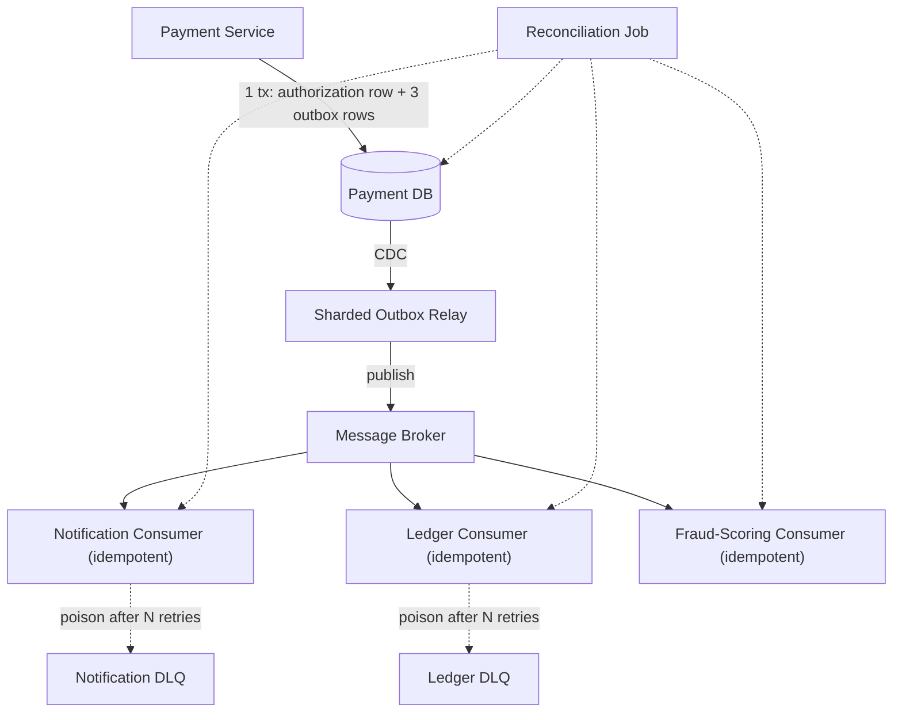
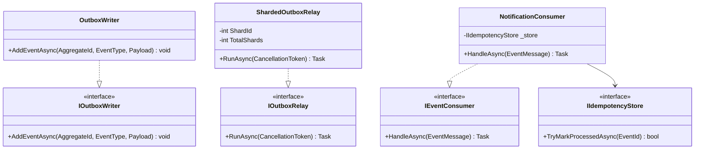

# Module 48 — Distributed Systems: Failure Detection, Idempotency & the Outbox Pattern

> Domain: Distributed Systems | Level: Beginner → Expert | Prerequisite: [[01-Consensus-Consistency-Distributed-Transactions]], [[../03-REST-APIs/01-REST-Design-Fundamentals]] (idempotency, revisited here at full distributed-systems generality), [[../05-PostgreSQL/02-Partitioning-Replication-Logical-Decoding]] (CDC, directly reused for Outbox)

---

## 1. Fundamentals

### What is failure detection, and why does the Outbox pattern complete this course's distributed-transactions arc?
**Failure detection** in a distributed system is the problem of determining whether a remote node/service has genuinely failed or is merely slow/temporarily unreachable — a **fundamentally ambiguous** distinction over an asynchronous network (you cannot distinguish "the server crashed" from "the server is fine but the network is currently dropping our packets" from the client side alone), directly underlying every timeout/retry/circuit-breaker decision this course has made throughout. The **Outbox pattern** solves the specific, recurring problem of **atomically updating a database and reliably publishing an event about that update** — directly closing the gap §Advanced Q6 first identified (a business write and its corresponding event-to-be-published must be atomic, or a crash between them either loses the event or publishes it for a write that never actually committed).

### Why does this matter?
Because idempotency (reused extensively across Modules 26, 39, 41, 43) and the Outbox pattern are the two most practically-essential techniques for building *correct* distributed systems on top of the *theoretically* honest understanding established — every distributed system must tolerate ambiguous failures (you cannot know for certain whether your last request succeeded) and must reliably notify other systems of state changes, and these two techniques are the concrete, universally-applicable answers.

### When does this matter?
Any distributed system where a service both writes to its own database and needs to communicate that write to other systems (nearly every non-trivial microservices architecture); the depth matters for correctly implementing the Outbox pattern (a genuinely subtle design, easy to get subtly wrong) and for understanding precisely why "at-least-once delivery plus idempotent processing" (not true exactly-once) is the honest, achievable target this course has repeatedly arrived at.

### How does it work (30,000-ft view)?
```
1. Failure detection: use heartbeats/timeouts (never certain), erring toward "assume failure after
 timeout X" with retry/idempotency to handle the case where the original request actually succeeded
2. Outbox: write the business change AND an "event to publish" row in the SAME local database
 transaction -- a separate process reads unpublished outbox rows and publishes them, guaranteeing
 the event is never lost even if the publish step crashes immediately after the transaction commits
```

---

## 2. Deep Dive

### 2.1 The Fundamental Ambiguity of Distributed Failure Detection
When a request times out, exactly **three** things could have happened: (a) the request never reached the server at all (network failure before delivery), (b) the request reached the server, was processed, but the response was lost on the way back (network failure after processing), or (c) the server is still processing and simply hasn't responded yet. **The client cannot distinguish these three cases** from a timeout alone — this single, unavoidable ambiguity is *why* idempotency is not an optional nicety but a structural necessity for any system that retries on timeout (which is to say, any system with retry logic at all, i.e., nearly every distributed system this course has covered). Failure detectors (heartbeat-based liveness checks, the health checks generalized to inter-service failure detection) can only ever provide a **probabilistic**, timeout-tuned guess ("probably failed, given no heartbeat for N seconds"), never a certain answer, in a genuinely asynchronous network.

### 2.2 Timeout Tuning as a Precision-Recall Trade-off
Choosing a failure-detection timeout is a direct precision/recall trade-off: a **short** timeout detects genuine failures quickly (good for fast failover) but risks **false positives** (declaring a merely-slow-but-healthy node "failed," triggering unnecessary failover/retry — directly §Advanced Q9's Sentinel-quorum discussion, where an overly aggressive timeout could trigger unnecessary failover during a brief network blip); a **long** timeout reduces false positives but delays genuine failure detection, extending the window during which requests are sent to an actually-dead node. Production systems typically use **adaptive** timeouts (based on observed, historical response-time distributions, tightening or loosening automatically) rather than a single, hand-tuned fixed value, directly the same "adaptive, not static" principle as §Advanced Q5's adaptive rate limiting.

### 2.3 Idempotency, Generalized Beyond HTTP APIs
Earlier analysis introduced idempotency for HTTP APIs specifically (a client-generated idempotency key); this generalizes to **every** distributed-system boundary where retries occur: a message-queue consumer processing the same message twice (the consumer-group at-least-once delivery) must be idempotent; a Saga's compensating action (§Advanced Q2) must be idempotent since it too can be retried; an inter-service RPC call retried after a timeout (the ambiguous-failure scenario) must be idempotent at the receiving service. The **general** idempotency mechanism (a unique operation identifier, checked-and-recorded atomically before the operation's actual effect is applied) recurs identically across every one of these contexts — recognizing idempotency as a **universal distributed-systems requirement**, not an HTTP-API-specific pattern, is the generalization this module completes.

### 2.4 The Outbox Pattern — Precise Mechanics and the Dual-Write Problem It Solves
The **dual-write problem**: a service that both (a) updates its own database and (b) separately publishes a message to a message broker cannot make these two operations atomic using ordinary means — a crash between the database commit and the message publish either loses the event entirely (if the crash happens before publish) or, if using a naive "publish first, then commit" ordering, could publish an event for a database write that then fails to commit. The **Outbox pattern** solves this by writing the "event to be published" as a **row in the same database, within the same local transaction** as the business change — since both writes are now part of one, ordinary ACID database transaction (/24), they succeed or fail together, atomically, using nothing more exotic than the database's own, already-understood transactional guarantee. A **separate process** (a polling job, or — the more efficient, modern approach — a Change-Data-Capture consumer reading the database's own replication log, directly/ §Advanced Q6's CDC pattern) then reads unpublished outbox rows and publishes them to the actual message broker, marking them published (or simply relying on CDC's inherent "read the change log once" semantics) once done.

### 2.5 Outbox Delivery Guarantees — At-Least-Once, Requiring Consumer Idempotency
The Outbox pattern guarantees the event is **never lost** (it's durably recorded in the same transaction as the business change) but does **not**, by itself, guarantee **exactly-once delivery** to downstream consumers — the publishing process could crash after successfully publishing but before marking the outbox row as published, causing a redundant republish on restart — meaning downstream consumers of Outbox-published events **must** be idempotent, exactly the same "at-least-once delivery plus idempotent processing = the honest, achievable target" conclusion this course has reached repeatedly, now understood as a direct, unavoidable consequence of the Outbox pattern's own mechanics, not a separate, additional requirement layered on top.

## 3. Visual Architecture

### The Dual-Write Problem and the Outbox Fix

```mermaid
graph TB
 subgraph "BROKEN: dual-write, no atomicity"
 Service1[Service] -->|"1. write to DB"| DB1[(Database)]
 Service1 -->|"2. SEPARATELY publish"| Broker1[Message Broker]
 Note1["Crash between steps 1 and 2 = event LOST<br/>(or published for a write that rolls back)"]
 end
 subgraph "FIXED: Outbox pattern"
 Service2[Service] -->|"ONE transaction: business row + outbox row"| DB2[(Database)]
 DB2 -->|"CDC reads the transaction log"| Relay[Outbox Relay Process]
 Relay -->|"publish (at-least-once)"| Broker2[Message Broker]
 Broker2 --> Consumer["Consumer (MUST be idempotent)"]
 end
```

## 4. Production Example
**Scenario**: A team implementing an order-confirmation-email feature used the naive dual-write approach: after committing an order to the database, the order service directly, separately called the email-notification service's API — during a production incident where the order service crashed (an unrelated OOM event) immediately after committing the order but before the email-notification call completed, a percentage of successfully-placed orders **never received a confirmation email**, with no error logged anywhere (the crash simply terminated the process mid-way, before the notification call's own error-handling logic could even execute) — the gap was only discovered via customer support tickets ("I placed an order but got no confirmation") accumulating over several days before someone correlated them with the specific deployment window when the OOM issue was occurring. **Investigation**: confirmed the order-commit and email-notification-call were two entirely separate, non-atomic operations with no recovery mechanism for a crash between them — exactly the dual-write problem, manifesting as silently missing notifications rather than a loud, immediately-diagnosable error. **Fix**: implemented the Outbox pattern — order commits now include an "OrderConfirmationEmailRequested" outbox row in the same transaction, with a separate, CDC-based relay process publishing these events to the notification service reliably, guaranteeing every committed order generates exactly one (or, under at-least-once semantics, at least one, with the notification service's own idempotent processing — the pattern — preventing a duplicate email) confirmation-email event, with **no possibility** of the crash-between-steps scenario silently losing the notification, since the notification request is now durably recorded as part of the order's own atomic commit. **Lesson**: this is precisely the dual-write problem §Advanced Q6 first flagged as a design consideration, now demonstrated as a real, customer-impacting incident when left unaddressed — "write to the database, then separately call another service" is a deceptively simple-looking pattern that silently, structurally cannot guarantee reliability under the entirely realistic failure mode of "the process crashes between the two steps," and the Outbox pattern's core insight (piggyback the notification on the same, already-atomic database transaction) is the standard, correct fix, not an exotic or over-engineered solution to a rare edge case.
## 10. Interview Questions

### Basic (10)
1. **Q: Why can't a client reliably distinguish "the server crashed" from "the network is slow" after a timeout?** **A:** Both produce the identical observable symptom (no response received) from the client's perspective in an asynchronous network — this is a fundamental, unavoidable ambiguity.
2. **Q: What is the dual-write problem?** **A:** A service updating its own database and separately publishing a message/calling another service cannot make these two operations atomic using ordinary means, risking a lost or incorrectly-published event if a crash occurs between them.
3. **Q: What is the Outbox pattern?** **A:** Writing the business change and an "event to publish" row within the same local database transaction, guaranteeing they succeed or fail together atomically.
4. **Q: Does the Outbox pattern guarantee exactly-once delivery to downstream consumers?** **A:** No — it guarantees the event is never lost (at-least-once), requiring consumers to be idempotent to handle possible redelivery.
5. **Q: What are the two mechanisms for an Outbox relay process to read unpublished events?** **A:** Polling the outbox table, or Change-Data-Capture reading the database's own transaction log.
6. **Q: Why is idempotency described as a universal distributed-systems requirement rather than an HTTP-API-specific pattern?** **A:** Because retries occur at every distributed-system boundary (message consumers, RPC calls, Saga compensations), and idempotency is the general mechanism making any of these safely retryable.
7. **Q: What's the trade-off in choosing a short versus long failure-detection timeout?** **A:** Short timeouts detect genuine failures faster but risk false positives (declaring a healthy-but-slow node "failed"); long timeouts reduce false positives but delay genuine failure detection.
8. **Q: What is an adaptive timeout?** **A:** A failure-detection timeout that adjusts automatically based on observed, historical response-time patterns, rather than a single fixed value.
9. **Q: Why must a Saga's compensating action itself be idempotent?** **A:** Because it too can be retried (e.g., after a transient failure during compensation), requiring the same safe-to-repeat guarantee as any other retryable operation.
10. **Q: Why is CDC generally preferred over polling for an Outbox relay?** **A:** Lower latency and reduced database load compared to a polling loop repeatedly querying for new unpublished rows.

### Intermediate (10)
1. **Q: Why does the fundamental ambiguity of failure detection mean idempotency isn't optional for any system with retry logic?** **A:** Since a client can never be certain whether a timed-out request actually succeeded or failed, a retry might duplicate an already-successful operation — idempotency is what makes this duplication safe rather than causing a double-charge, duplicate order, or similar incorrect outcome.
2. **Q: Why does writing the outbox row in the same transaction as the business change solve the dual-write problem specifically?** **A:** Both writes now share the same, already-understood ACID transactional guarantee (/24) — they succeed or fail together as one atomic unit, eliminating the possibility of a crash leaving one committed without the other.
3. **Q: Why does the Outbox pattern still require idempotent consumers despite guaranteeing the event is never lost?** **A:** The relay process itself can crash after publishing but before marking the row as published, causing a redundant republish on restart — the "never lost" guarantee doesn't extend to "never duplicated," requiring consumer-side idempotency to handle this specific redelivery scenario.
4. **Q: Why might an aggressively short failure-detection timeout in a message-queue consumer-group setting cause unnecessary work redistribution?** **A:** A consumer that's merely slow (processing a genuinely large/complex message) but not actually failed could be incorrectly declared dead, triggering its in-progress work to be reassigned to another consumer unnecessarily, potentially causing duplicate processing of the same message.
5. **Q: Why does the production incident's "no error logged anywhere" symptom specifically demonstrate the dual-write problem's danger, beyond just "sometimes things fail"?** **A:** The crash occurred mid-way through the process, before any error-handling/logging code for the second operation (the notification call) could even execute — there was structurally no code path available to log the failure, since the failure was the process itself terminating, not a caught, logged exception.
6. **Q: Why is scoping idempotency keys per-caller/per-tenant a security concern, not just a correctness one?** **A:** Without this scoping, one caller could guess or reuse another caller's idempotency key to read the cached result of an operation they didn't actually perform, or interfere with another tenant's in-flight operation — directly the concern, now understood as part of this module's general idempotency discussion.
7. **Q: Why does the Outbox relay's own lag (how far behind the database's commit rate it's running) need standing monitoring?** **A:** A growing lag means events are being published later and later after their corresponding business transactions commit, potentially violating downstream consumers' freshness expectations — directly the same consumer-lag-monitoring discipline applied to this specific relay process.
8. **Q: Why does the outbox table itself need bounding/archival, similar to other high-churn tables covered earlier in this course?** **A:** Every business transaction generates a new outbox row — without archival/deletion of already-relayed rows, this table grows unboundedly, exactly the same "derived/transient state needs a bounding discipline" lesson (vacuum/bloat) and (unbounded embedded arrays).
9. **Q: Why would a team choose polling over CDC for an Outbox relay despite CDC's latency/load advantages?** **A:** Polling is simpler to initially implement and doesn't require setting up/operating CDC infrastructure (replication-log access, a CDC tool like Debezium) — a reasonable starting choice for a system not yet needing CDC's lower latency, with migration to CDC as a later optimization once the polling interval's latency becomes a genuinely demonstrated limitation.
10. **Q: Why is "the crash window between two operations is very small" an insufficient justification for skipping the Outbox pattern?** **A:** A small-probability event still eventually occurs given enough attempts/time at production scale and duration — exactly the same "rare, low-probability failure modes still eventually manifest as real incidents" lesson demonstrated repeatedly across this course's production examples (the orphaned replication slot, the misapplied eviction policy, this module's).

### Advanced (10)
1. **Q: Diagnose the missing-confirmation-email production incident from first principles, and design the specific monitoring/alerting that would have caught it faster than several days of accumulating customer complaints.**
 **A:** Root cause: the naive dual-write pattern with no recovery mechanism for a crash between the two operations, combined with no monitoring specifically comparing "orders committed" against "confirmation emails sent" as a reconciliation check. Safeguard: a standing, automated reconciliation job comparing the count of committed orders against the count of successfully-processed confirmation-email events over the same time window, alerting on any sustained, non-trivial discrepancy — directly generalizing this course's recurring "measure the actual invariant the design depends on, don't just trust the mechanism is working" discipline to this specific dual-write/notification-reliability concern, converting a multi-day, customer-complaint-driven discovery into a same-day, automated one.
2. **Q: Design the exact database schema and relay-process logic for an Outbox implementation, addressing both the polling and CDC-based approaches.**
 **A:**
 ```sql
 CREATE TABLE OutboxEvents (
 Id BIGINT IDENTITY PRIMARY KEY,
 AggregateId VARCHAR(50) NOT NULL,
 EventType VARCHAR(100) NOT NULL,
 Payload NVARCHAR(MAX) NOT NULL,
 CreatedAt DATETIME2 NOT NULL DEFAULT SYSUTCDATETIME,
 PublishedAt DATETIME2 NULL -- NULL = not yet published
);
 ```
 Polling relay: `SELECT TOP 100 * FROM OutboxEvents WHERE PublishedAt IS NULL ORDER BY Id`, publish each, then `UPDATE... SET PublishedAt = SYSUTCDATETIME WHERE Id = @Id` — simple, but polling interval directly bounds latency and adds recurring query load. CDC relay: a Debezium-style connector reads the database's own transaction log for INSERT operations against `OutboxEvents` specifically, publishing each detected insert directly to the message broker — lower latency (near-real-time, bounded only by replication-log propagation delay) and no additional query load on the primary database at all, since CDC reads the replication stream, not the live table.
3. **Q: Explain how you would design a failure detector that adapts its timeout based on observed latency, addressing Advanced Q4/the precision-recall trade-off concretely.**
 **A:** Maintain a rolling window of recent successful response-time observations for a given dependency, computing a timeout dynamically as a statistical outlier threshold (e.g., the 99.9th percentile of recent observed latencies, plus a safety margin) rather than a single, hand-picked fixed value — as the dependency's actual performance characteristics shift (a genuinely slower period due to increased load, or a recovery to normal performance), the adaptive timeout shifts correspondingly, reducing false positives during a legitimate, if unusual, slow period while still detecting genuine unresponsiveness (no response at all, far exceeding even the adapted, widened threshold) — directly the "phi accrual failure detector" concept from distributed-systems literature, a more sophisticated alternative to a simple fixed timeout.
4. **Q: A team's Outbox relay process is falling increasingly behind the database's commit rate during peak traffic, causing downstream event-delivery latency to grow unacceptably. Diagnose and design the fix.**
 **A:** Directly §Advanced Q2's consumer-lag-monitoring-and-scaling pattern — if the relay is a single-instance process, it has a fixed maximum throughput ceiling; the fix is horizontally scaling the relay (multiple relay instances, each responsible for a partition/shard of the outbox table by `AggregateId` hash, directly the partition-key-design discipline applied to outbox-relay parallelization) so aggregate relay throughput scales with instance count, closing the growing-lag gap during peak traffic rather than a single instance's fixed capacity becoming an increasingly severe bottleneck.
5. **Q: Explain how you would handle a scenario where the message broker itself is temporarily unavailable, and the Outbox relay cannot publish for an extended period — what happens to the growing backlog of unpublished outbox rows?**
 **A:** The relay should implement retry-with-backoff (the pattern) specifically for the publish step, continuing to accumulate a backlog of unpublished rows during the broker's outage (the outbox table itself serves as the durable buffer, exactly its intended purpose) — once the broker recovers, the relay resumes and drains the accumulated backlog; monitoring should track both the backlog **size** (how many unpublished rows) and its **age** (how long the oldest unpublished row has been waiting), alerting distinctly on each, since a large-but-recent backlog (a brief traffic spike) is a different concern than a smaller-but-very-old backlog (indicating the relay itself, not just traffic volume, has a sustained problem).
6. **Q: Design a strategy for handling "poison" outbox events — a specific event that repeatedly fails to publish (perhaps due to a malformed payload) and blocks the relay from progressing past it if processing is strictly sequential.**
 **A:** Directly §Advanced Q7's dead-letter-queue pattern, applied here — after a configured maximum retry count for a specific outbox row, move it to a separate "failed outbox events" table/queue for manual investigation, and **skip past it** to continue relaying subsequent, healthy events rather than allowing one poison event to block the entire relay's progress indefinitely — critically, this requires the relay to process events in a way that doesn't strictly require in-order delivery to downstream consumers (or, if strict ordering genuinely matters, requires an explicit design decision about whether skipping a poison event is even acceptable, versus needing to halt entirely until it's manually resolved, since skipping might violate an ordering guarantee the downstream consumer depends on).
7. **Q: Explain why "idempotent by default" is a stronger organizational principle than "idempotent where we remember to add it," connecting to this course's recurring governance pattern.**
 **A:** Requiring idempotency to be an explicit, deliberate, case-by-case decision means it's easy to forget for a new message consumer/RPC handler added later by an engineer unfamiliar with this requirement — directly the same "make the correct default the path of least resistance, don't rely on every engineer independently remembering a hard-won lesson" governance principle recurring throughout this course — a shared, reusable idempotency-key-checking helper/base class (directly the `IIdempotencyStore` pattern) that new consumers are expected to use by convention, with code review specifically flagging any new retryable operation lacking it, converts this from "remember to think about it" into "the default, expected pattern."
8. **Q: A team proposes eliminating the Outbox pattern's relay-process complexity by having the application code call the message broker directly within the same database transaction (treating the broker as a genuine, transactional participant alongside the database). Evaluate this as a Principal Engineer.**
 **A:** This reintroduces exactly the distributed-transaction complexity (and, likely, 2PC-style blocking risk) the Outbox pattern was specifically designed to avoid — most message brokers don't participate in ordinary ACID database transactions as a genuine resource manager (and even those with some transactional support typically impose meaningful constraints/complexity to achieve it), meaning this proposal either doesn't actually achieve genuine atomicity (silently reintroducing the dual-write problem in a more complex disguise) or requires a heavyweight, 2PC-based coordination mechanism carrying exactly the blocking-failure-mode risk demonstrated — recommend the standard Outbox pattern (a plain database transaction plus an eventually-consistent relay) as the simpler, more robust, industry-standard solution, rather than attempting to force broker participation into the database's own transactional boundary.
9. **Q: How would you design a testing strategy specifically verifying the Outbox pattern's core atomicity guarantee — that a crash between the business-row and outbox-row writes genuinely cannot occur, given they're in the same transaction?**
 **A:** Since both writes are part of one ordinary database transaction, the correctness guarantee rests entirely on the database engine's own, already-extensively-tested ACID transaction implementation (/24) — the actual testing focus should instead verify (a) that the application code genuinely writes both rows within one transaction scope (a code-review/static-analysis check, or an integration test deliberately forcing a mid-transaction exception and asserting **neither** row persists, confirming true atomicity rather than an accidental two-separate-transactions implementation bug) and (b) the relay process's own correctness (Advanced Q2's schema, correctly identifying and publishing unpublished rows exactly once under normal operation, and at-least-once under the relay's own crash scenarios) — the atomicity guarantee itself is "free," inherited from the database; the engineering risk is in correctly implementing the surrounding application and relay logic, not in re-verifying the database's own transactional correctness.
10. **Q: As a Principal Engineer, how would you build organizational capability ensuring every new microservice correctly implements the Outbox pattern (and idempotent consumption) by default, rather than each team rediscovering the dual-write problem reactively via their own incident, as?**
 **A:** Provide a shared, reusable Outbox-pattern library/framework component (directly this course's recurring shared-infrastructure governance pattern,/, §Advanced Q10) that new services adopt by convention — abstracting the outbox-table schema, the transactional-write helper (ensuring business writes and outbox writes are correctly co-transacted), and the relay-process implementation (CDC-based by default, per Advanced Q2's preferred approach) into a well-tested, centrally-maintained component, rather than requiring every team to correctly re-derive and re-implement this genuinely subtle pattern from first principles independently — directly preventing the specific, demonstrated incident class (and §Advanced Q6's original conceptual introduction of this exact risk) from recurring across a growing service estate, converting a hard-won distributed-systems lesson into reusable, low-friction infrastructure.

### Expert (10)
1. **Q: A payment-processing service uses the Outbox pattern to publish "PaymentAuthorized" events, and a downstream fraud-scoring consumer processes them idempotently by event ID. A retry storm from a transient broker issue causes the same event to be redelivered 40 times over 10 minutes. Walk through exactly what should and shouldn't happen, end to end.**
 **A:** Each of the 40 deliveries should reach the consumer's idempotency check (`HasBeenProcessedAsync(eventId)`); the first delivery processes normally and marks the event ID processed; the remaining 39 deliveries should each be recognized as already-processed and skipped, with **zero** additional fraud-scoring side effects and zero duplicate downstream actions — the redelivery storm should be visible in logs/metrics (a spike in "already processed, skipping" log lines) but should produce **no observable business-level effect** beyond that logging. If any of the 40 deliveries instead produced a duplicate fraud score or duplicate downstream action, this indicates either the idempotency check has a race condition (§Expert Q3) or the "mark processed" write isn't itself durable/atomic with the processing effect — either way, a genuine bug requiring investigation, not "an acceptable rare edge case."
 **Why this answer is correct:** Traces the exact expected behavior at each of the 40 deliveries and correctly identifies what an actual bug (versus expected, harmless redelivery noise) would look like.
 **Common mistakes:** Assuming any redelivery is inherently a problem requiring broker-side deduplication, rather than recognizing consumer-side idempotency as the correct, expected mechanism for absorbing this exact scenario harmlessly.
 **Follow-up questions:** "How would you distinguish this scenario's log signature from a genuine, first-time processing bug in monitoring?" "What if the fraud-scoring consumer's processing itself is non-deterministic (e.g., calls a third-party API whose answer could differ between calls)?"

2. **Q: Design the idempotency check so that two concurrent deliveries of the *same* event (a genuine race, not sequential redelivery) cannot both pass the "not yet processed" check and both execute the business effect.**
 **A:** The check-and-record must be a single atomic operation, not a separate read-then-write (`HasBeenProcessedAsync` followed later by `MarkProcessedAsync`) — the naive two-step version has a genuine race window where two concurrent deliveries can both read "not processed" before either writes "processed," both proceeding to execute the business effect. The fix is an atomic conditional insert (`INSERT... WHERE NOT EXISTS`, a SQL unique-constraint violation used as the race-detection signal, or Redis's atomic `SET key value NX`) performed *before* the business effect runs — only the delivery that wins the atomic insert proceeds; the loser treats the resulting constraint-violation/NX-failure as "already being processed by someone else" and skips (or, for a stronger guarantee, waits and re-checks for the effect's completion).
 **Why this answer is correct:** Identifies the specific race window in the naive check-then-write pattern and proposes the correct fix — an atomic conditional write, not a logically-separate check followed by a write.
 **Common mistakes:** Implementing the idempotency check as a plain read followed by a separate write, which is idempotent against *sequential* redelivery but not against *genuinely concurrent* delivery — a subtler, easy-to-miss gap.
 **Follow-up questions:** "What should the 'losing' concurrent delivery do if it needs to know the business effect's result, not just that it lost the race?" "How does this change if the idempotency store and the business-effect execution aren't in the same transactional scope?"

3. **Q: A team's phi-accrual-style adaptive failure detector (§Advanced Q3) begins producing false positives specifically during a legitimate, once-daily batch-reporting job that temporarily increases load on a monitored dependency. Diagnose and fix.**
 **A:** The adaptive detector's rolling window of "recent" observations likely doesn't span long enough to include the prior day's batch-job-induced latency pattern, meaning each day's batch job looks like a novel, sudden latency spike relative to the detector's short-term baseline rather than a recognized, cyclical pattern. The fix is either widening the rolling window to span multiple days (capturing the batch job as part of the learned baseline) or, more robustly, making the detector aware of known scheduled-load windows (a simple allowlist of "batch job runs 02:00-02:30 UTC daily, widen the threshold during this window specifically") — trading a purely statistical, context-free adaptive model for one that incorporates known, deterministic load patterns the statistics alone can't distinguish from a genuine anomaly.
 **Why this answer is correct:** Correctly diagnoses the specific interaction between rolling-window length and cyclical-but-infrequent load patterns, and proposes both a purely statistical and a context-aware fix.
 **Common mistakes:** Widening the detector's threshold globally (reducing false positives during the batch job) at the cost of also slowing genuine-failure detection the rest of the day — failing to account for why a context-aware, time-window-specific fix is preferable to a blanket threshold change.
 **Follow-up questions:** "What happens when the batch job's schedule changes without the failure-detector configuration being updated?" "How would you validate the fix without waiting a full day-cycle to observe the next batch-job run?"

4. **Q: A regulatory audit requires proof that every payment authorization that debited a customer's account also produced exactly one corresponding ledger-credit event, with no lost or duplicated events, across a full calendar year. Design the audit mechanism using this module's Outbox infrastructure.**
 **A:** The audit's ground truth is the Outbox table itself (or its durable archive, per §Intermediate Q8) — not the message broker's delivery logs, which only prove *attempted* delivery, not correct, singular business effect. Build a standing reconciliation job (directly §Advanced Q1's pattern) comparing three counts over the audit period: (a) payment-authorization business rows, (b) corresponding outbox rows generated in the same transaction (should be 1:1 by construction, §2.4), and (c) downstream ledger-credit records the consuming service produced (should also be 1:1, given consumer idempotency, §Expert Q1). Any year-over-year archival/deletion policy on the outbox table (§Intermediate Q8) must retain enough historical detail to support this specific audit window — an outbox archival policy designed only for operational table-size management, without an explicit regulatory-retention requirement folded in, risks deleting exactly the evidence an audit like this needs.
 **Why this answer is correct:** Identifies the outbox table (not broker delivery logs) as the correct ground truth, specifies the three-way reconciliation, and flags the retention-policy interaction an audit-focused design must account for.
 **Common mistakes:** Treating message-broker delivery confirmation as sufficient audit evidence, missing that delivery confirmation proves attempted transmission, not correct, singular, idempotent business-side processing.
 **Follow-up questions:** "How would you handle a discrepancy discovered during the audit for an event now outside the archival retention window?" "What would you add to the outbox schema itself to make this audit easier to run?"

5. **Q: Compare "the Outbox pattern with a CDC relay" against "a transactional message broker that participates directly in the database transaction" (some brokers offer XA/2PC-style integration). Is the latter ever the better choice?**
 **A:** A transactional-broker integration, where it genuinely exists and is mature, removes the separate relay process entirely — the business write and the message publish share one distributed transaction directly. This is occasionally the better choice specifically when the team already operates infrastructure with mature, well-tested XA support and the added 2PC-style coordination overhead (§Module 47's blocking-risk analysis, now directly relevant since XA is itself a 2PC variant) is acceptable for the specific throughput/latency profile — but for most teams, this reintroduces exactly the blocking-failure-mode risk §Module 47 documents, now at the message-broker boundary instead of the original database-coordinator boundary, while the Outbox-plus-CDC-relay approach avoids any 2PC-style coordination entirely by relying only on the local database's already-solved ACID guarantee. The Outbox pattern's real advantage isn't merely "avoiding one architecture," it's specifically avoiding *any* distributed-transaction protocol for this use case, which XA-based broker integration reintroduces by a different name.
 **Why this answer is correct:** Correctly identifies XA-based broker transactions as reintroducing 2PC-style blocking risk under a different name, connecting this module's central lesson back to Module 01's, and gives a calibrated (not absolute) answer about when the trade-off might still be acceptable.
 **Common mistakes:** Treating "the broker supports transactions" as an unqualified improvement over the Outbox pattern, without recognizing it reintroduces the specific blocking-coordinator risk the Outbox pattern was designed to avoid.
 **Follow-up questions:** "What operational maturity would you want to see before accepting XA-based broker integration for a new service?" "How would you migrate an existing XA-based integration to the Outbox pattern with minimal risk?"

6. **Q: Design a chaos-engineering test specifically validating that a production Outbox relay correctly resumes, without event loss or unbounded duplication, after being killed at every possible point in its publish-then-mark-published cycle.**
 **A:** Deliberately kill the relay process at three distinct injection points across repeated test runs: (a) before calling `PublishAsync` (the event remains unpublished — correct recovery: republish on restart, zero data loss), (b) after `PublishAsync` succeeds but before `SaveChangesAsync` marks it published (the event was actually delivered to the broker, but the relay doesn't know it — correct, expected behavior: a redundant republish occurs on restart, which is why consumer idempotency, not relay-side perfection, is what actually prevents a duplicate business effect), and (c) after `SaveChangesAsync` commits (fully resolved, no redelivery). Assert that scenario (a) never loses an event, and that scenario (b)'s redundant republish is correctly absorbed harmlessly by the downstream consumer's idempotency check (§Expert Q1) — explicitly testing that the *combination* of relay-side at-least-once delivery and consumer-side idempotency together produce zero net duplicate business effect, not testing either mechanism in isolation.
 **Why this answer is correct:** Identifies the three genuinely distinct crash-injection points and specifies that the correct assertion targets the combined relay-plus-consumer behavior, not either component tested in isolation.
 **Common mistakes:** Testing only that the relay eventually publishes every event (ignoring scenario (b)'s expected, harmless redelivery), without also testing that the downstream consumer correctly absorbs that redelivery without a duplicate effect.
 **Follow-up questions:** "How would this test change for a CDC-based relay instead of a polling-based one?" "What's the minimum set of injection points needed to have genuine confidence, versus an exhaustive but impractically large test matrix?"

7. **Q: A Principal Engineer reviewing a new service's design finds the team has correctly implemented the Outbox pattern for the business-write/event-durability guarantee, but has made the relay process itself a single, unreplicated instance with no monitoring on relay-process liveness (only on outbox-table backlog age). Evaluate the gap.**
 **A:** The backlog-age monitoring (§Advanced Q1's discipline) will eventually alert if the relay stops functioning — but only *after* a backlog has accumulated and aged past the alert threshold, meaning detection is delayed by however long that threshold is tuned to, and during that entire window every downstream consumer of this service's events is silently starved of updates with no direct signal pointing at "the relay process itself died" as the specific, immediately-actionable root cause. The gap: liveness monitoring on the relay process itself (a heartbeat, or a process-supervision mechanism restarting it automatically) is a distinct, faster, more specific safeguard than backlog-age monitoring alone — the two are complementary, not substitutes; backlog-age monitoring catches "the relay is running but not keeping up or is stuck," while liveness monitoring catches "the relay process itself is not running at all," a different failure mode requiring a different, faster response.
 **Why this answer is correct:** Distinguishes two genuinely different failure modes (relay slow/stuck vs. relay process dead) that require two different, complementary monitoring mechanisms, rather than treating backlog-age monitoring as sufficient coverage for both.
 **Common mistakes:** Treating backlog-age monitoring as comprehensive coverage for "the relay isn't working," missing that it detects the symptom with a built-in delay rather than the root cause immediately.
 **Follow-up questions:** "What's the right alerting threshold trade-off between backlog-age sensitivity and false-positive noise during expected traffic spikes?" "How would you design relay-process auto-restart without risking a restart loop masking a genuine, persistent bug?"

8. **Q: Design an idempotency-key strategy for a multi-step, client-retried checkout flow (create order → authorize payment → confirm order) where the client may retry any individual step independently after a timeout, and steps must not be allowed to execute out of order or be duplicated across retries.**
 **A:** Each step needs its own, distinctly-scoped idempotency key — not one key shared across the whole flow, since a shared key can't distinguish "retry step 2" from "erroneously re-attempt step 1 after step 2 already succeeded." The client generates a single flow-level correlation ID at flow start, and each step's idempotency key is derived deterministically from `(correlationId, stepName)` — allowing the server to safely allow retries of a given step (recognized via its specific key) while independently detecting and rejecting an out-of-order attempt (e.g., a "confirm order" call arriving with a correlation ID whose "authorize payment" step hasn't yet recorded success, which the server should treat as a client-side ordering bug, not silently proceed with). This makes each step's idempotency independently verifiable while the flow-level correlation ID ties them together for ordering validation.
 **Why this answer is correct:** Correctly identifies that per-step (not per-flow) idempotency keys are needed, while a shared correlation ID provides the ordering context individual step-level keys alone wouldn't.
 **Common mistakes:** Using a single idempotency key for the entire multi-step flow, which conflates "retry the same step" with "the flow overall has been attempted before," losing the ability to distinguish legitimate step-retries from illegitimate step-skipping or reordering.
 **Follow-up questions:** "How would you handle a client that loses its correlation ID and needs to resume an in-progress flow from a new session?" "What HTTP status/response should the server return for a detected out-of-order step attempt?"

9. **Q: Evaluate the claim: "Since the Outbox pattern guarantees the event is never lost, and our consumer is idempotent, our end-to-end pipeline is exactly-once." Is this claim accurate?**
 **A:** Not quite, and the imprecision matters: the pipeline achieves **at-least-once delivery plus idempotent processing**, which produces an **effectively-once observable business outcome** — not a genuine "exactly-once delivery" guarantee at the transport/delivery level (redelivery still happens, as §Expert Q1/Q6 demonstrate; it's merely rendered harmless). The distinction matters operationally: monitoring and capacity planning must still account for the real redelivery rate (which "exactly-once" language would incorrectly suggest is zero), and any component in the pipeline that isn't itself idempotent (a poorly-designed downstream side effect, a non-idempotent third-party API call made from within the "idempotent" consumer) breaks the effectively-once property despite every other component being correctly implemented — the claim "exactly-once" invites exactly the kind of scope over-extension this course has repeatedly flagged elsewhere (a narrow, true guarantee silently generalized into a broader, false one).
 **Why this answer is correct:** Precisely distinguishes the true, narrower claim (effectively-once business outcome via at-least-once-plus-idempotency) from the imprecise, broader claim ("exactly-once"), and identifies a concrete way the broader claim can silently fail even when every named component is correctly implemented.
 **Common mistakes:** Accepting "exactly-once" as an accurate summary once idempotency is in place, without distinguishing delivery-level guarantees from the effectively-once business outcome idempotency actually produces.
 **Follow-up questions:** "Give a concrete example where every component is idempotent, yet the end-to-end outcome still isn't effectively-once." (A consumer that's idempotent for its own database writes but calls a non-idempotent third-party payment API without its own separate idempotency-key forwarding — the third-party side effect duplicates even though the consumer's own state doesn't.) "How would you word this precisely in a design document?"

10. **Q: As a Principal Engineer, design the minimum standing organizational review that would catch both this module's failure classes (the dual-write incident and a hypothetical future idempotency-race incident) before either reaches production, without slowing every team down with a heavyweight process.**
 **A:** A short, mandatory design-review checklist (not a full architecture review) triggered specifically whenever a service's design includes (a) a database write that must be communicated to another system, or (b) any operation exposed to client- or consumer-side retries — requiring the design to explicitly name which pattern from this module governs each case (Outbox for (a); atomic conditional-write idempotency, §Expert Q2, for (b)) and explicitly state the specific test (§Expert Q6's chaos-injection points, or §Expert Q2's concurrency test) that will validate it before launch. This is deliberately narrow and fast (a checklist, not a multi-week review), triggered only by the two specific structural conditions this module's incidents both trace back to, keeping the process proportional to genuinely elevated risk rather than applying heavyweight review to every design uniformly.
 **Why this answer is correct:** Proposes a narrowly-scoped, structurally-triggered review (not a blanket heavyweight process) that specifically targets the two conditions this module's incidents share, keeping organizational cost proportional to actual risk.
 **Common mistakes:** Proposing either no standing process (relying on individual engineer awareness, which the original incidents demonstrate is insufficient) or an overly broad, slow review process applied to every design regardless of whether it actually involves either risk condition.
 **Follow-up questions:** "How would you retrofit this checklist against already-deployed services without re-reviewing everything at once?" "What's the escalation path when a team's design doesn't cleanly map to either named pattern?"

---

## 11. Coding Exercises

### Easy — Basic Outbox pattern: co-transacted business write and event row
```csharp
public async Task PlaceOrderAsync(Order order)
{
    using var transaction = await _dbContext.Database.BeginTransactionAsync;

    _dbContext.Orders.Add(order); // business write

    _dbContext.OutboxEvents.Add(new OutboxEvent // event write -- SAME transaction, the fix
        {
            AggregateId = order.Id,
                EventType = "OrderConfirmationEmailRequested",
                Payload = JsonSerializer.Serialize(new { order.Id, order.CustomerEmail }),
                CreatedAt = DateTimeOffset.UtcNow
    });

    await _dbContext.SaveChangesAsync; // ONE atomic commit -- both succeed or both roll back
    await transaction.CommitAsync;
}
```

### Medium — Polling-based Outbox relay with retry and dead-letter handling (Advanced Q6)
```csharp
public class OutboxRelayWorker: BackgroundService
{
    protected override async Task ExecuteAsync(CancellationToken stoppingToken)
    {
        while (!stoppingToken.IsCancellationRequested)
        {
            var unpublished = await _dbContext.OutboxEvents
            .Where(e => e.PublishedAt == null && e.RetryCount < 5)
            .OrderBy(e => e.Id)
            .Take(100)
            .ToListAsync(stoppingToken);

            foreach (var evt in unpublished)
            {
                try
                {
                    await _messageBroker.PublishAsync(evt.EventType, evt.Payload);
                    evt.PublishedAt = DateTimeOffset.UtcNow;
                }
                catch (Exception ex)
                {
                    evt.RetryCount++;
                    if (evt.RetryCount >= 5)
                        await _deadLetterStore.MoveAsync(evt); // Advanced Q6's poison-event handling
                    _logger.LogWarning(ex, "Failed to publish outbox event {Id}, attempt {Count}", evt.Id, evt.RetryCount);
                }
            }
            await _dbContext.SaveChangesAsync(stoppingToken);
            await Task.Delay(TimeSpan.FromSeconds(1), stoppingToken); // polling interval
        }
    }
}
```

### Hard — Idempotent event consumer (the requirement, made concrete)
```csharp
public async Task HandleOrderConfirmationEmailRequestedAsync(OutboxEventMessage message)
{
    // Idempotency check FIRST -- directly the IIdempotencyStore pattern
    // now applied to message-consumption instead of HTTP API requests.
    if (await _processedEventStore.HasBeenProcessedAsync(message.EventId))
    {
        _logger.LogInformation("Event {EventId} already processed, skipping (at-least-once redelivery).", message.EventId);
        return;
    }

    await _emailService.SendOrderConfirmationAsync(message.OrderId, message.CustomerEmail);
    await _processedEventStore.MarkProcessedAsync(message.EventId); // record AFTER successful processing
}
```

### Expert — Sharded, horizontally-scaled Outbox relay (Advanced Q4)
```csharp
public class ShardedOutboxRelay
{
    private readonly int _shardId, _totalShards;

    public async Task RunAsync(CancellationToken ct)
    {
        while (!ct.IsCancellationRequested)
        {
            // Each relay INSTANCE handles only rows whose AggregateId hashes to ITS shard --
            // directly the partition-key-based parallelization, applied to relay scaling.
            var unpublished = await _dbContext.OutboxEvents
            .Where(e => e.PublishedAt == null)
            .Where(e => EF.Functions.DataLength(e.AggregateId) > 0) // conceptual filter placeholder
            .AsEnumerable // hash computation happens client-side in this illustrative example
            .Where(e => Math.Abs(e.AggregateId.GetHashCode) % _totalShards == _shardId)
            .Take(100)
            .ToList;

            foreach (var evt in unpublished)
            {
                await _messageBroker.PublishAsync(evt.EventType, evt.Payload);
                evt.PublishedAt = DateTimeOffset.UtcNow;
            }
            await _dbContext.SaveChangesAsync(ct);
            await Task.Delay(TimeSpan.FromMilliseconds(500), ct);
        }
    }
}
// Deploying N instances (each with a distinct _shardId, 0..N-1) scales aggregate relay
// throughput roughly linearly with N, directly addressing Advanced Q4's growing-lag scenario.
```

---

## 12. System Design

**Scenario:** Design the reliable-notification backbone for a payments platform: every completed payment authorization must reliably trigger (a) a customer-facing confirmation notification, (b) a downstream ledger-credit event, and (c) a fraud-scoring evaluation — with no lost events, bounded duplicate-processing risk, and full recoverability from any single component's crash, directly generalizing §4's missing-confirmation-email incident to a multi-consumer, higher-stakes payments context.

**Functional requirements:**
- Every committed payment authorization produces exactly one outbox event per downstream concern (notification, ledger, fraud), atomically with the authorization itself.
- Every consumer processes each event's business effect at most once, despite at-least-once delivery.
- A poison event (malformed payload, or a downstream service rejecting it repeatedly) must not block delivery of subsequent, healthy events.

**Non-functional requirements:**
- Relay-to-broker latency under 2 seconds p99 during normal operation (customer confirmation is a UX-sensitive path).
- Zero event loss under any single-component crash (relay, broker, or consumer).
- Full recoverability from a broker outage of up to several hours without manual intervention.

**Back-of-the-envelope estimation:** 500,000 payment authorizations/day → ~5.8 TPS average, peaking at perhaps 150 TPS during high-volume windows. At three downstream events per authorization, peak outbox-write and relay-publish volume is ~450 events/sec — well within a single, well-indexed outbox table and a modestly-sharded relay's capacity (§9). As in Module 47's estimation, **the actual hard problem here isn't throughput** — it's guaranteeing zero silent event loss and bounding duplicate-processing risk, exactly the correctness-over-throughput conclusion this course reaches whenever transaction volume is moderate and per-event correctness stakes are high.

**Architecture:**

```mermaid
graph TB
    PaymentSvc[Payment Service] -->|1 tx: authorization row + 3 outbox rows| DB[(Payment DB)]
    DB -->|CDC| Relay[Sharded Outbox Relay]
    Relay -->|publish| Broker[Message Broker]
    Broker --> NotifyConsumer["Notification Consumer (idempotent)"]
    Broker --> LedgerConsumer["Ledger Consumer (idempotent)"]
    Broker --> FraudConsumer["Fraud-Scoring Consumer (idempotent)"]
    NotifyConsumer -.->|poison after N retries| DLQ1[Notification DLQ]
    LedgerConsumer -.->|poison after N retries| DLQ2[Ledger DLQ]
    Recon[Reconciliation Job] -.-> DB
    Recon -.-> NotifyConsumer
    Recon -.-> LedgerConsumer
    Recon -.-> FraudConsumer
```

**REST API design:** Internal event contract (broker payload), not a public REST API — the payment authorization itself is created via `POST /v1/payments/authorizations`; the events this design covers are the *side effects* of that write, not separate API calls.

| Field | Type | Description |
|---|---|---|
| `EventId` | GUID | Unique per outbox row — the idempotency key downstream consumers check against. |
| `AggregateId` | string | The payment authorization ID — the sharding/partition key for both the relay (§9) and any per-payment ordering requirement. |
| `EventType` | string | `PaymentConfirmationRequested` \| `LedgerCreditRequested` \| `FraudScoringRequested`. |
| `Payload` | JSON | Event-specific data (customer email, ledger amount, transaction metadata). |
| `CreatedAt` | timestamp | Set at outbox-row insert time, part of the same transaction as the authorization. |

**Data model — Outbox table (the schema, extended):**
| Column | Type | Description |
|---|---|---|
| `Id` | BIGINT IDENTITY | Internal ordering key for the polling/CDC cursor. |
| `EventId` | GUID | The externally-visible idempotency key (distinct from `Id` so internal row identity and external idempotency identity can evolve independently). |
| `AggregateId` | VARCHAR(50) | Sharding key (§9), also used for per-aggregate ordering guarantees. |
| `EventType` | VARCHAR(100) | Discriminator for consumer routing. |
| `Payload` | NVARCHAR(MAX) | Serialized event body. |
| `CreatedAt` | DATETIME2 | Set within the originating transaction. |
| `PublishedAt` | DATETIME2 NULL | NULL = unpublished; the relay's core filter predicate. |
| `RetryCount` | INT | Drives the dead-letter threshold (Advanced Q6). |

**Status lifecycle:** `UNPUBLISHED (PublishedAt IS NULL) → PUBLISHED (PublishedAt set)`, with a parallel, per-consumer lifecycle tracked in each consumer's own idempotency store: `NOT_PROCESSED → PROCESSED`, and, on repeated consumer-side failure, `NOT_PROCESSED → DEAD_LETTERED` (moved to a DLQ per Advanced Q6, out of the primary processing path).

**Caching:** Not applicable to the outbox/relay path (correctness-critical); notification-consumer templates may be cached, but the idempotency check itself must never be served from a cache that could return stale "not yet processed" state.

**Messaging:** Broker topic-per-event-type (three logical topics: confirmation, ledger, fraud), each with its own consumer group and independent DLQ, so a poison event or an outage affecting one downstream concern doesn't block the other two.

**Scaling:** §9's sharded-relay pattern, partitioned by `AggregateId` hash; each consumer group scales independently based on its own processing cost (fraud-scoring, calling an external model, is likely the slowest and most heavily-scaled consumer).

**Failure handling:** Relay crash mid-cycle — §Expert Q6's three injection points, all recoverable via at-least-once redelivery plus consumer idempotency. Broker outage — outbox table serves as the durable buffer (Advanced Q5); backlog age and size both monitored distinctly. Poison event — DLQ after a bounded retry count (Advanced Q6), never blocking the relay's forward progress.

**Monitoring:** Per-consumer-group processing lag and DLQ depth; outbox-relay backlog age/size (Advanced Q5); idempotency-store hit rate (a high, sustained rate of "already processed, skipping" outside a known redelivery-storm window would indicate a broker or relay misbehaving); reconciliation-job discrepancy count (Advanced Q1), the standing proof this pipeline is actually working, not merely believed to be.

**Trade-offs:** Three separate topics/consumer-groups (rather than one shared topic with consumer-side filtering) chosen specifically so that a fraud-scoring-consumer outage cannot delay customer-facing notification delivery — accepting the added operational surface of three independent consumer groups in exchange for this fault isolation.

---

## 13. Low-Level Design

**Requirements:** Atomically co-transacted business write and multi-event outbox insert; a relay that never loses an event and tolerates redelivery; consumers that are idempotent by construction, not by convention.

**Class diagram:**

```mermaid
classDiagram
    class IOutboxWriter {
        <<interface>>
        +AddEventAsync(AggregateId, EventType, Payload) void
    }
    class OutboxWriter {
        +AddEventAsync(AggregateId, EventType, Payload) void
    }
    class IOutboxRelay {
        <<interface>>
        +RunAsync(CancellationToken) Task
    }
    class ShardedOutboxRelay {
        -int ShardId
        -int TotalShards
        +RunAsync(CancellationToken) Task
    }
    class IIdempotencyStore {
        <<interface>>
        +TryMarkProcessedAsync(EventId) bool
    }
    class IEventConsumer {
        <<interface>>
        +HandleAsync(EventMessage) Task
    }
    class NotificationConsumer {
        -IIdempotencyStore _store
        +HandleAsync(EventMessage) Task
    }

    OutboxWriter ..|> IOutboxWriter
    ShardedOutboxRelay ..|> IOutboxRelay
    NotificationConsumer ..|> IEventConsumer
    NotificationConsumer --> IIdempotencyStore
```

**Sequence diagram:** the §3 dual-write-vs-outbox diagram for the write path; §Expert Q6's three-injection-point crash-recovery sequence for the relay; §Expert Q2's atomic-conditional-insert sequence for consumer-side idempotency under concurrent redelivery.

**Design patterns used:** Template Method (`IEventConsumer.HandleAsync`'s fixed idempotency-check-then-process skeleton, shared across all three consumer types); Strategy (each consumer type is an interchangeable `IEventConsumer` implementation); Repository (`IOutboxWriter`/`IIdempotencyStore` abstracting persistence); Circuit Breaker (implicit in the DLQ threshold — after `RetryCount` exceeds a bound, the consumer stops attempting a poison event, structurally identical to breaker-open behavior).

**SOLID mapping:** Single Responsibility (writer, relay, and each consumer each own exactly one concern); Open/Closed (a new event type/consumer implements `IEventConsumer` without modifying the relay or other consumers); Liskov (every `IEventConsumer` implementation must genuinely check idempotency *before* any side effect — a violating implementation silently reintroduces duplicate-processing risk for every caller relying on the interface's implied at-most-once-effect contract); Interface Segregation (`IOutboxWriter`, `IOutboxRelay`, `IIdempotencyStore` are independent, narrowly-scoped interfaces); Dependency Inversion (consumers depend on `IIdempotencyStore` abstraction, not a concrete Redis/SQL implementation).

**Extensibility:** A new downstream concern (e.g., a regulatory-reporting consumer) adds a new `EventType`, a new topic, and a new `IEventConsumer` implementation without touching the outbox writer, relay, or any existing consumer.

**Concurrency/thread safety:** The idempotency check-and-mark must be atomic (§Expert Q2) to remain correct under genuinely concurrent redelivery, not merely sequential retries; the sharded relay's per-shard `AggregateId`-hash partitioning (§9) ensures no two relay instances ever contend over the same outbox rows, avoiding both duplicate publishing and lock contention across instances.

---

## 14. Production Debugging

**Incident:** The fraud-scoring consumer group's processing lag grew from its normal ~2 seconds to over 45 minutes over a single trading day, with no corresponding growth in the notification or ledger consumer groups' lag, and no alert fired because the only configured lag alert was a single, shared threshold applied uniformly across all three consumer groups, tuned against the (much higher-volume) ledger consumer's normal operating range.

**Root cause:** A third-party fraud-scoring API the consumer called synchronously had begun silently rate-limiting the service's requests during a promotional traffic spike unrelated to payments (a shared API-gateway tier with another internal consumer of the same third party), causing a growing fraction of fraud-scoring calls to block on retry-with-backoff — each blocked call held a consumer-group worker thread, so throughput degraded specifically for this consumer group while the other two, calling entirely different downstream systems, were unaffected.

**Investigation:** Once discovered (via a customer complaint about a delayed fraud-hold notification, not proactive monitoring — the detection gap itself), correlating the fraud consumer's processing-time distribution against the third-party API's own reported latency/error metrics showed a clear, simultaneous onset; the shared-tenancy API gateway's own request logs confirmed the rate-limiting was triggered by the unrelated internal consumer's traffic, not the payments platform's own request volume.

**Tools:** Per-consumer-group lag metrics (existed, but without a per-group-appropriate alert threshold — the actual gap); the third-party API's own status/metrics dashboard; API-gateway request logs, correlating the rate-limiting trigger to the unrelated internal consumer.

**Fix:** Configured per-consumer-group lag alert thresholds (each group's own normal operating range, not one shared threshold tuned to the highest-volume group) — directly closing the detection gap. Negotiated a dedicated, isolated rate-limit tier for the fraud-scoring consumer's third-party API access, decoupling it from the unrelated internal consumer's traffic. Added a circuit breaker around the third-party fraud API call specifically, so a sustained downstream slowdown degrades gracefully (failing fast to a manual-review queue) rather than silently accumulating consumer-group lag.

**Prevention:** The core, generalizable lesson: a single, shared alert threshold across multiple structurally-different consumer groups (different downstream dependencies, different normal latency profiles, different business criticality) will always be miscalibrated for at least one of them — either too sensitive for the naturally-slower group (alert fatigue) or, as here, too insensitive for a group whose normal range is much smaller than the group the threshold was actually tuned against. Every consumer group in a multi-consumer outbox architecture (§12) needs its own, independently-calibrated lag/health thresholds, not a single shared one inherited from whichever group happened to be configured first.

---

## 15. Architecture Decision

**Context:** Choosing the outbox-relay implementation strategy for the payments platform in §12.

**Option A — Polling-based relay, single instance:**
*Advantages:* Simplest to build and reason about; no CDC infrastructure to operate.
*Disadvantages:* Polling-interval-bounded latency (§7); single-instance throughput ceiling; single point of failure for the relay process itself (§Expert Q7).
*Cost:* Lowest.
*Complexity:* Lowest.
*Maintainability:* High initially, but requires a later migration once volume or latency requirements outgrow it.
*Scalability:* Poor beyond moderate volume without adding sharding (Option B).

**Option B — Sharded polling-based relay, multiple instances:**
*Advantages:* Removes the single-instance throughput ceiling and single-point-of-failure risk; still avoids CDC infrastructure.
*Disadvantages:* Still polling-interval-bounded latency per shard; added operational complexity of coordinating shard assignment across instances.
*Cost:* Moderate.
*Complexity:* Moderate.
*Maintainability:* Good — a well-understood, incrementally-scalable evolution of Option A.
*Scalability:* Good, scales roughly linearly with shard/instance count (§9).

**Option C — CDC-based relay (Debezium or equivalent), sharded:**
*Advantages:* Near-real-time latency (no polling-interval floor); no additional query load on the primary database; combines cleanly with sharding for both latency and throughput.
*Disadvantages:* Requires operating and monitoring genuinely new infrastructure (a CDC connector reading the database's replication log) — a real, ongoing operational cost and a new failure mode to understand (connector lag, replication-slot management).
*Cost:* Highest upfront (new infrastructure), but lowest marginal cost per additional event at scale.
*Complexity:* Highest, concentrated in CDC connector operation rather than application code.
*Maintainability:* Good once the team has genuine CDC operational maturity; a liability without it.

**Recommendation: Option B initially, with an explicit, pre-planned migration path to Option C once either (a) polling-interval latency genuinely becomes customer-visible (the confirmation-notification path's 2-second p99 requirement, §12, is the concrete trigger) or (b) database query load from polling becomes measurable.** This mirrors §Intermediate Q9's general guidance (polling as a reasonable starting choice, migrating to CDC as a demonstrated-need-driven optimization, not a day-one requirement) — recommending against jumping straight to Option C's added operational complexity before the specific, measurable trigger that justifies it actually materializes, while explicitly pre-committing to the migration path so it isn't perpetually deferred once the trigger does arrive.

---

## 17. Principal Engineer Perspective

**Business impact:** The §14 fraud-consumer-lag incident delayed a fraud-hold notification by 45 minutes — in a payments context, this is a direct customer-trust and potential-loss-exposure issue (a fraudulent transaction that should have been held/reviewed within seconds instead had a much longer window), making per-consumer-group monitoring calibration a genuine business-risk control, not merely an operational nicety.

**Engineering trade-offs:** The central trade this module teaches — at-least-once delivery plus idempotent processing as the honest, achievable target, rather than pursuing a genuinely unachievable "true exactly-once" — recurs as the correct framing at every layer from a single HTTP API's idempotency key to this module's full multi-consumer payments pipeline; a Principal Engineer's job is ensuring every new component in the pipeline is built against this same, explicit target rather than each team independently, and sometimes incorrectly, assuming a stronger guarantee exists.

**Technical leadership:** The dual-write incident (§4) and the fraud-consumer-lag incident (§14) share a root shape worth teaching explicitly: both are cases where a *structurally sound* overall design (the Outbox pattern, correctly implemented) still failed at an under-scrutinized seam — the crash-window between two operations in the first case, a shared, miscalibrated monitoring threshold in the second — reinforcing that correct component design and correct operational calibration are both necessary, and a gap in either produces a real incident regardless of how sound the other is.

**Cross-team communication:** A shared Outbox/relay infrastructure component, used by many teams' services (§Advanced Q10's recommended governance), concentrates both benefit and risk — a single well-tested implementation benefits every adopting team, but a single miscalibrated default (§14's shared-threshold problem, generalized) can silently propagate across every team using it, making the shared component's own defaults and documentation a genuine cross-team responsibility, not merely an implementation detail of whichever team built it first.

**Architecture governance:** §Expert Q10's narrowly-scoped, structurally-triggered design-review checklist (triggered specifically by "a write must be reliably communicated" or "an operation is exposed to retries") is the concrete governance mechanism this module recommends — proportional to risk, not a blanket heavyweight process, and specifically designed to catch both this module's demonstrated incident classes before they reach production rather than relying on individual engineer memory of these lessons.

**Cost optimization:** Option B → Option C's staged migration path (§15) is itself a cost-optimization discipline — deferring CDC infrastructure's genuine but real operational cost until a specific, measurable trigger justifies it, rather than either prematurely over-engineering (Option C from day one) or indefinitely under-investing (staying on Option A past the point its limitations become customer-visible).

**Risk analysis:** The recurring risk pattern across both this module's incidents is a *correctly-designed mechanism failing at an unmonitored or under-differentiated boundary* — not a flaw in the Outbox pattern or in idempotency itself, both of which performed exactly as designed in both incidents, but a gap in the surrounding operational discipline (crash-window awareness in §4, per-group monitoring calibration in §14) that no amount of correct core-pattern implementation alone would have caught.

**Long-term maintainability:** As the payments platform in §12 grows to add new consumer groups over time, each new consumer inherits the shared Outbox/relay infrastructure's correctness by construction — but each new consumer's *own* operational calibration (its lag thresholds, its retry/DLQ tuning, its specific downstream-dependency failure modes) must be independently established, never inherited by default from an earlier, structurally-different consumer group, precisely the gap §14 demonstrates and the standing lesson this module leaves for every future consumer added to the pipeline.

## 18. Revision
**Key takeaways**: Distributed failure detection is fundamentally ambiguous (can't distinguish "crashed" from "slow" over an asynchronous network) — this is precisely why idempotency is a universal, non-optional requirement for any system with retry logic, not an HTTP-API-specific nicety. The dual-write problem (database write + separate message publish, non-atomic) causes silent, hard-to-diagnose failures under the entirely realistic "crash between the two steps" scenario — the Outbox pattern solves it by co-transacting the business write and the event-to-publish row, inheriting the database's own ACID guarantee for free. The Outbox pattern guarantees at-least-once (never-lost) delivery, not exactly-once — downstream consumers must be idempotent to handle possible redelivery, the same conclusion this course has reached repeatedly (Modules 26, 39, 43) now understood as a direct, unavoidable consequence of the pattern's own mechanics. CDC-based relays (reusing/27's change-data-capture pattern) are the modern, preferred Outbox-relay mechanism over polling, for both latency and database-load reasons.

---

**Next**: This completes the `16-Distributed-Systems` domain (Modules 47–48). Continuing autonomously to `17-Microservices`.
