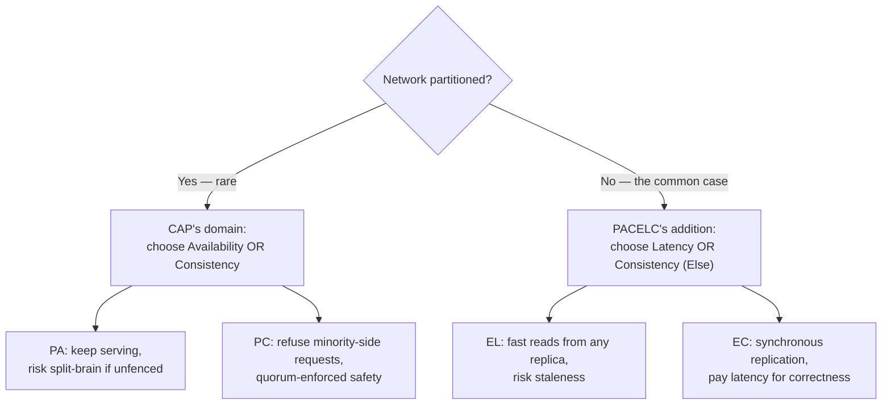
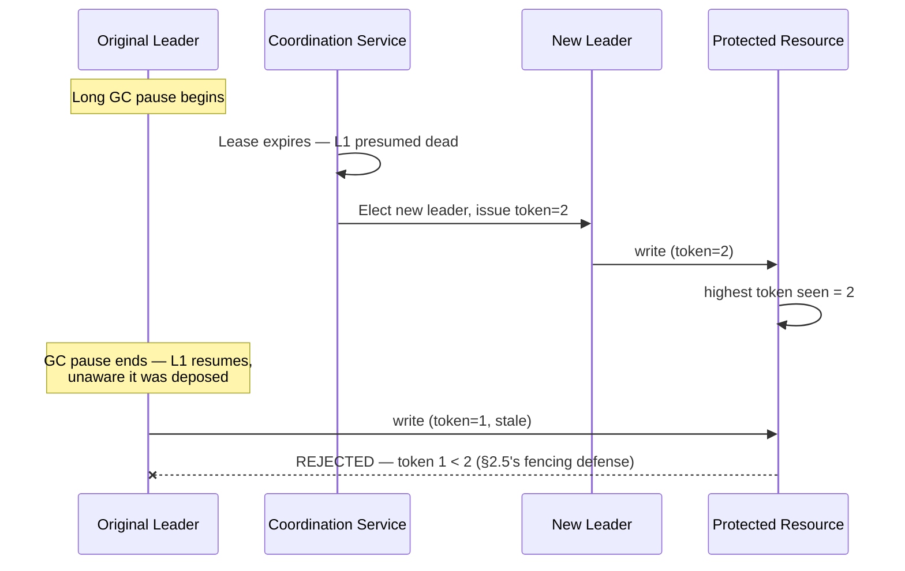
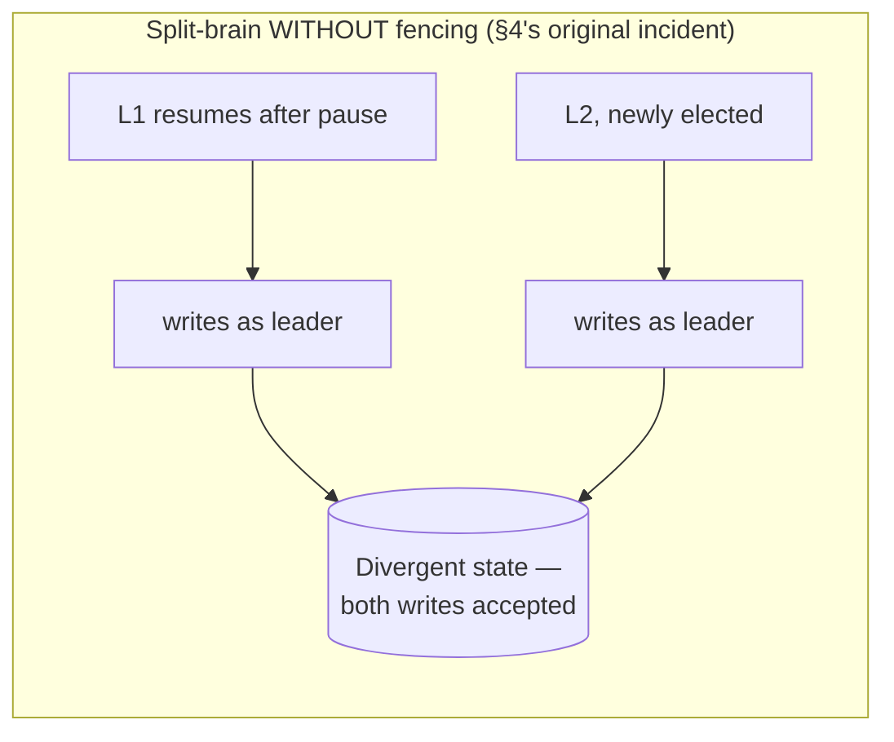
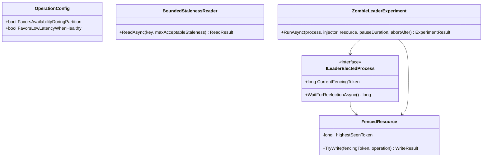

# Module 146 — Distributed Systems: Advanced Consistency Models, PACELC & Split-Brain

> Domain: Distributed Systems | Level: Beginner → Expert | Prerequisite: [[01-Consensus-Consistency-Distributed-Transactions]] (CAP theorem referenced there via Module 37 §2.5; Raft leader election, quorum reads/writes — this module asks what happens when leader election itself goes wrong), [[../18-Event-Driven-Architecture/05-CrossRegion-MultiCluster-Event-Distribution]] §2.5 (active-active conflict resolution — this module supplies the formal consistency-model vocabulary that discussion assumed)

>
> **Scope note:** First of four modules extending `16-Distributed-Systems` toward a 6-module scope, closing the gap the 2026-07-19 curriculum audit identified (PACELC, CRDTs, Bloom filters, LSM-trees, split-brain, hedged requests, tail-latency amplification all previously absent). Full 16-section template; Elite FinTech Interview Panel lens.

---

## 1. Fundamentals

**What:** PACELC — an extension of the CAP theorem answering the question CAP is silent on: what trade-off does a distributed system make when there is *no* partition, which is the overwhelming majority of its operating time — plus the precise spectrum of consistency models (linearizable through eventual) that give that trade-off actual technical content, and split-brain, the concrete failure mode that results when a system's partition-time choice (favoring Availability) is implemented incorrectly.

**Why:** CAP theorem, as most engineers learn it, states that under a network Partition a system must choose Availability or Consistency. This is true and also incomplete: it says nothing about the system's behavior the rest of the time, when the network is healthy and the system is still, constantly, trading latency against consistency for entirely separate reasons — replication takes time, and waiting for it costs latency. Module 01 §2.3's quorum-based reads and writes are exactly this trade-off, made concrete. PACELC names it explicitly, and this module develops the consequences: a precise consistency-model vocabulary, and split-brain as what happens when the availability-favoring choice is implemented without the safeguards it requires.

**When:** Any system with more than one node holding a copy of the same data — which, per this course's entire distributed-systems arc, is nearly every production system at scale.

**How (30,000-ft view):**
```
                    Is the network partitioned right now?
                           │                    │
                          YES                   NO  (the common case)
                           │                    │
              Choose: Availability          Choose: Latency
              or Consistency (CAP)          or Consistency (the "ELC" PACELC adds)
                           │                    │
                    Availability-favoring   Latency-favoring
                    choice implemented      choice implemented
                    WITHOUT fencing    ==>  WITHOUT staleness bounds
                           │                    │
                       SPLIT-BRAIN          STALE READS treated as current
                       (§2.4, §4)           (§2.6, §14)
```

---

## 2. Deep Dive

### 2.1 CAP's Incompleteness — What It Doesn't Say
CAP theorem's actual content, precisely stated, is narrow: **given a network partition, a system must sacrifice either availability or consistency; it cannot have both.** This is a true, useful, and frequently over-generalized statement. What it does not say: anything about the system's behavior when there is no partition — which, for a well-run production network, is the vast majority of operating time. A system can be perfectly CAP-compliant (correctly choosing C or A during the rare partition) and still make a consequential, continuous latency-versus-consistency trade-off during ordinary operation, because synchronous replication to guarantee consistency costs latency regardless of whether a partition is present. CAP is a statement about a rare event; PACELC completes it with a statement about the common case.

### 2.2 PACELC, Formally
**P**artition: **A**vailability or **C**onsistency; **E**lse (no partition): **L**atency or **C**onsistency. A system's PACELC classification names both choices:
- **PA/EL** — favors availability during a partition, favors low latency otherwise (accepting weaker consistency in both cases). Cassandra and DynamoDB in their default configurations; Module 44 and Module 142's active-active topologies throughout this course's EDA content are architecturally PA/EL.
- **PC/EC** — favors consistency during a partition (refusing to serve some requests rather than risk inconsistency), and favors consistency over latency otherwise (synchronous replication, accepting the latency cost). Traditional RDBMS synchronous replication (SQL Server Always On synchronous-commit mode, Module 118's CP-favoring risk-check precedent) is PC/EC.
- **PA/EC** and **PC/EL** — theoretically possible but architecturally unusual combinations, since a system built to sacrifice consistency for availability during a partition rarely also pays a latency cost for consistency when healthy, and vice versa; most real systems' two choices are correlated in the PA/EL or PC/EC direction because the same underlying replication strategy (synchronous vs. asynchronous) drives both.

Critically, **PACELC classification is frequently tunable per-operation, not fixed per-system** — DynamoDB defaults to eventually-consistent reads (PA/EL) but offers a strongly-consistent read option (behaving as PC/EC for that specific call); this per-operation tunability is where §15's architecture decision lives.

### 2.3 The Consistency Spectrum, Precisely
Four models, in decreasing strength, each with a precise technical definition:
- **Linearizability** — the strongest model. Every operation appears to take effect atomically at some point between its invocation and its response, and this point respects real-time ordering: if operation A completes before operation B begins (in real, wall-clock time), every observer sees A's effect before B's. This is what "strongly consistent" should mean precisely, and is what Module 01's Raft-based leader election and quorum writes (with W+R > N) provide.
- **Sequential consistency** — every observer agrees on a single total order of all operations, but that order need not respect real-time — a operation that completed before another began, in wall-clock terms, could still be ordered *after* it in the agreed sequence, as long as every observer sees the *same* order. Weaker than linearizability specifically by dropping the real-time constraint.
- **Causal consistency** — operations that are causally related (one reads a value the other wrote, or they occur in a single client's session) are seen in the same order by everyone; operations with no causal relationship (concurrent, independent) may be observed in different orders by different observers. This is the weakest model that still prevents the "reply visible before the message it replies to" class of confusion.
- **Eventual consistency** — the weakest model with any guarantee at all: if no new writes occur, all replicas will *eventually* converge to the same value. It makes no promise about ordering, no promise about how long convergence takes, and no promise about what any given read returns in the meantime.

The gap between these models is not academic: Module 142 §14's split-brain incident was a causal-consistency violation (two regions applied genuinely concurrent, causally-unrelated writes and merged them by arrival order, not causal order) that the system's documentation had never made an explicit claim about, in either direction.

### 2.4 Split-Brain — The Concrete Failure of an Unsafely-Implemented Availability Choice
Split-brain occurs when a network partition (or, critically, a *process pause* that mimics one — §4) causes two nodes to each independently and simultaneously believe they are the sole authoritative leader or primary, both accepting writes that diverge. This is the literal mechanism behind Module 142 §14's incident, generalized: **any system whose partition-time choice favors availability (PA) is structurally exposed to split-brain unless it has an explicit, separate mechanism preventing a deposed leader from continuing to act as one.** Quorum-based systems (Module 01 §2.3) prevent split-brain structurally — a minority partition cannot achieve a write quorum, so it cannot proceed, converting the availability sacrifice CAP predicts into an enforced, correct unavailability rather than an unsafe, silent divergence.

### 2.5 Fencing Tokens — The Mechanical Defense
A fencing token is a monotonically increasing number issued by the coordination service (or leader-election mechanism) every time leadership changes, attached to every subsequent write a leader performs. The downstream resource being protected — a database, a storage system, an external API — is required to **reject any write carrying a token lower than the highest it has already seen.** This defeats the specific and famously subtle failure mode Kleppmann's "How to do distributed locking" analysis made well-known: a leader that pauses long enough (GC pause, OS scheduling delay, VM migration) for its lease to expire and a new leader to be elected, then *resumes* and, unaware anything has changed, continues writing as if still leader — a zombie leader is not a network partition at all, and no partition-focused defense catches it; only a monotonic token the downstream resource itself enforces does, because the zombie's writes carry a stale token the resource can mechanically reject.

### 2.6 "Eventually Consistent" Is a Necessary but Insufficient Claim
Stating a system is "eventually consistent" specifies *that* convergence happens, never *when* — and Module 141's entire lag discussion is precisely the mechanism by which that "eventually" can, in a real failure, stretch far beyond what any consumer assumed. A precise claim states a **bounded staleness window** ("reads reflect writes no more than N seconds old, 99.9% of the time, under normal operating conditions") rather than the unqualified word "eventual," which — exactly like this course's recurring "declared ≠ actual" theme — sounds like a completed guarantee and is actually an open-ended one.

---

## 3. Visual Architecture







---

## 4. Production Example

**Problem:** A distributed batch-scheduling service used leader election (via a coordination service, Raft-based per Module 01 §2.2) to ensure exactly one instance processed each night's settlement-batch job, writing results to a downstream ledger-staging table with no fencing mechanism, because the team's threat model had focused on network partitions specifically and judged leader election itself sufficiently reliable.

**Architecture:** A single elected leader held a time-bounded lease, renewed via periodic heartbeat; losing the lease triggered automatic re-election among standby instances.

**Implementation:** The leader instance, mid-batch, experienced a 45-second full garbage-collection pause — no network partition occurred at any point; the network was entirely healthy throughout.

**Trade-offs:** The lease renewal interval (30 seconds) had been chosen to balance fast failover against false-positive re-elections from transient network blips — a reasonable trade-off for the failure mode it was designed against.

**Lessons learned:** The 45-second GC pause exceeded the 30-second lease, so the coordination service correctly judged the leader dead and elected a standby, which correctly began reprocessing the batch from the last checkpoint. When the original leader's GC pause ended, it resumed execution with no awareness that time had passed or that leadership had changed — from its own process's perspective, no pause had occurred at all, since a stop-the-world GC pause is, by definition, invisible to the paused process itself. It continued writing settlement results to the staging table exactly where it had left off, now running concurrently with the newly-elected leader doing the same work independently.

Both leaders' writes were individually well-formed and individually correct in isolation. The staging table received two overlapping, partially-conflicting sets of settlement entries for the same batch window, with no error from either writer and no rejection from the staging table, since nothing in the write path checked whether the writer was still the legitimate leader at the moment of writing — leader election had been trusted as a complete safety mechanism, when it only guarantees *at most one node believes it is leader at a time*, not that a deposed former leader has actually stopped acting as one.

Detection came from the downstream reconciliation job comparing staged settlement totals against the source trade blotter, flagging a volume roughly double the expected figure for the affected batch window — the same class of detection, arriving via the same route, as several of this course's other incidents.

The fix had two parts. **First**, fencing tokens (§2.5) were introduced: the coordination service issues a monotonically increasing token on every leadership change, and the staging table's write path was modified to require and check this token, rejecting any write bearing a token lower than the highest previously accepted — converting the zombie leader's writes from silently-accepted duplicates into mechanically-rejected stale operations. **Second**, the team's threat model was explicitly broadened to name process pauses (GC, OS scheduling, VM live-migration) as a distinct failure class from network partitions, since the original design had implicitly assumed "leader believes it's alive and reachable" was equivalent to "leader is actually still the current leader" — true only in the absence of pauses, which is not a safe assumption for any managed-runtime process under real production load.

The generalizable lesson: **leader election alone answers "who is the leader" at the moment of election; it does not answer "who might still believe, incorrectly, that they are the leader" at some later moment** — and closing that gap requires the downstream resource itself to enforce recency, via a fencing token, rather than trusting the leader-election mechanism's output to remain valid indefinitely once obtained.

---

## 5. Best Practices
- State consistency guarantees precisely, using the four-model spectrum (§2.3), never the unqualified word "eventual" without a bounded-staleness figure attached (§2.6).
- Enforce fencing tokens at every downstream resource a leader-elected process writes to, not only within the coordination service itself (§2.5, §4).
- Treat process pauses (GC, scheduling delay, VM migration) as a distinct threat class from network partitions when designing leader-election-dependent systems (§4).
- Classify PACELC behavior per-operation where the underlying store supports it, rather than accepting one system-wide default for every access pattern (§2.2, §15).
- Use quorum-based writes (Module 01 §2.3) as the structural defense against split-brain wherever synchronous coordination is affordable, rather than relying solely on lease-based leader election.
- Name the specific consistency model (linearizable, sequential, causal, eventual) a given data path requires, and verify the chosen store actually provides it for that access pattern — not merely "the database" in general.

## 6. Anti-patterns
- Leader election with no fencing mechanism at the downstream resource, trusting the coordination service's leadership decision to remain perpetually valid (§4's incident).
- Treating "eventually consistent" as a complete specification rather than an incomplete one requiring a staleness bound (§2.6).
- Applying one system-wide consistency default to every operation regardless of whether that specific operation's correctness depends on stronger guarantees (§2.2).
- Designing leader-election safety solely against network partitions, ignoring process-pause-induced zombie leaders (§4).
- Conflating sequential consistency with linearizability, assuming "everyone agrees on the order" implies "the order respects real time" (§2.3).
- Assuming CAP theorem alone describes a system's behavior, missing that the overwhelming majority of operating time is spent in CAP's unaddressed, partition-free case (§2.1).

---

## 7. Performance Engineering

**CPU/Memory:** Linearizable operations typically require consensus-protocol round trips (Module 01 §2.2's Raft log replication) with real CPU and network cost per operation; eventual-consistency reads from a local replica avoid this cost entirely, which is precisely PACELC's latency-versus-consistency trade made concrete.

**Latency:** The dominant lever this module addresses — EC operations pay a synchronous-replication latency tax proportional to quorum round-trip time; EL operations pay none, at the cost of staleness risk (§2.2, §15).

**Throughput:** PC/EC systems' throughput ceiling is set by consensus round-trip time under load; PA/EL systems scale throughput more freely since reads and often writes don't require cross-node coordination per operation.

**Scalability:** Fencing-token enforcement (§2.5) adds negligible per-write overhead (a single integer comparison) for a substantial correctness guarantee, making it one of the highest safety-per-cost mechanisms in this domain.

**Benchmarking:** Benchmark the specific failure condition §4 demonstrates — inject an artificial process pause (not merely a network partition) against a leader-elected component, and verify fencing rejects the resumed zombie's writes, mirroring Module 144's "inject the condition, not the symptom" principle applied to this domain.

**Caching:** Reads served from a local, possibly-stale replica (the EL choice) are effectively a caching strategy at the consistency-model level; the same stampede and staleness considerations from Module 103's caching module apply directly.

---

## 8. Security

**Threats:** A zombie leader continuing to write after being deposed is a security-adjacent integrity failure even without malicious intent (§4); an attacker who can induce a target process to pause (resource exhaustion causing GC pressure) can potentially exploit an unfenced system's split-brain window deliberately.

**Mitigations:** Fencing tokens as the structural defense (§2.5), independent of whether the pause was benign or adversarially induced; rate-limiting and resource isolation to reduce the likelihood of an attacker inducing the specific pause condition that triggers failover.

**OWASP mapping:** Broken access control if a fencing check is present at the coordination layer but not enforced at every downstream resource a leader can write to — exactly §4's original gap.

**AuthN/AuthZ:** Fencing tokens are themselves an authorization mechanism at the write level — "this specific write is authorized only if its token is current" — distinct from and complementary to conventional principal-based authorization.

**Secrets:** Not directly implicated; standard handling for coordination-service credentials per Module 86.

**Encryption:** Standard in-transit/at-rest requirements for the coordination service's leadership state, which is itself sensitive operational data worth protecting from tampering.

---

## 9. Scalability

**Horizontal scaling:** PA/EL systems scale read throughput horizontally with minimal coordination cost; PC/EC systems' write throughput is bounded by quorum size and round-trip time, which does not improve simply by adding more replicas beyond the quorum requirement.

**Vertical scaling:** Reduces per-node consensus-round latency somewhat but does not change the fundamental PACELC trade-off, which is structural, not a resource constraint.

**Caching:** §7 — EL reads are architecturally a caching strategy; staleness bounds should be treated with the same rigor as any cache-freshness guarantee (Module 103).

**Replication/Partitioning:** Quorum sizing (Module 01 §2.3) directly determines both the PACELC classification and the split-brain resistance of a given deployment — a larger, majority-requiring quorum favors consistency and split-brain safety at a throughput cost.

**Load balancing:** EL systems can route reads to any replica for load distribution; EC systems must route consistency-sensitive reads to the current leader or a synchronously-replicated node specifically, constraining load-balancing freedom.

**High Availability:** PA choices favor availability explicitly during partition (§2.2); this must be paired with fencing (§2.5) to avoid trading availability for silent correctness loss instead of an honest, visible trade-off.

**Disaster Recovery:** A quorum-based system's DR posture depends on whether the DR region can itself participate in quorum (synchronous, consistency-preserving but latency-costly) or only receive asynchronous replication (Module 142's RPO framing applies directly, since asynchronous replication to a DR region is architecturally an EL choice for that specific replication path).

**CAP theorem:** This module's entire subject is CAP's completion via PACELC — every CAP discussion elsewhere in this course (Module 118, Module 142 §9) should be read as addressing only the partition-time half of the full picture this module provides.

---

## 10. Interview Questions

### Basic (10)

1. **Q: What does PACELC add to CAP theorem?**
   **A:** CAP only describes the trade-off during a network partition (Availability vs. Consistency); PACELC adds the "Else" case — even without a partition, a system trades Latency vs. Consistency, since synchronous replication for consistency costs latency regardless of whether a partition is present (§2.1, §2.2).
   **Why correct:** States precisely what CAP omits and what PACELC supplies.
   **Common mistakes:** Believing CAP fully describes a distributed system's consistency behavior at all times, missing that partitions are rare and the "Else" case is the common one.
   **Follow-ups:** "Give an example of a PA/EL system." (Cassandra or DynamoDB in default configuration — favors availability during partition and low latency otherwise, §2.2.)

2. **Q: Define linearizability precisely.**
   **A:** Every operation appears to take effect atomically at some point between its invocation and response, and this point respects real-time ordering — if A completes before B begins in wall-clock time, every observer sees A's effect before B's (§2.3).
   **Why correct:** States both the atomicity and the real-time-ordering components precisely.
   **Common mistakes:** Conflating linearizability with sequential consistency, which drops the real-time-ordering requirement.
   **Follow-ups:** "What's the weaker model that drops just the real-time constraint?" (Sequential consistency — a single agreed total order, not necessarily matching wall-clock time, §2.3.)

3. **Q: What is split-brain?**
   **A:** A failure where two or more nodes each independently believe they are the sole authoritative leader, both accepting writes that diverge — typically caused by a network partition or a process pause mimicking one (§2.4).
   **Why correct:** States the mechanism and its typical triggers.
   **Common mistakes:** Assuming split-brain can only be caused by a genuine network partition, missing the process-pause trigger §4 demonstrates.
   **Follow-ups:** "What structurally prevents it?" (Quorum-based writes, where a minority partition cannot achieve write quorum, §2.4.)

4. **Q: What is a fencing token?**
   **A:** A monotonically increasing number issued on every leadership change, attached to subsequent writes; the downstream resource rejects any write bearing a token lower than the highest it has already seen, preventing a deposed leader from continuing to act as one (§2.5).
   **Why correct:** States the mechanism and what it prevents.
   **Common mistakes:** Assuming leader election alone (without downstream enforcement) is sufficient protection against a zombie leader.
   **Follow-ups:** "Where must the token be enforced?" (At every downstream resource the leader writes to, not only within the coordination service itself, §4's original gap.)

5. **Q: Why is "eventually consistent" an incomplete claim?**
   **A:** It states that convergence eventually happens but specifies neither when nor what a read returns in the meantime — a precise claim needs a bounded staleness window, not just the word "eventual" (§2.6).
   **Why correct:** Identifies the missing bound as the specific gap.
   **Common mistakes:** Treating "eventually consistent" as a complete, sufficient specification for reasoning about correctness.
   **Follow-ups:** "What should replace it?" (A statement like "reads reflect writes no more than N seconds old, 99.9% of the time," §2.6.)

6. **Q: What caused §4's split-brain incident, given the network was healthy throughout?**
   **A:** A 45-second garbage-collection pause on the leader exceeded its 30-second lease, triggering correct re-election; the original leader resumed after the pause with no awareness time had passed, and continued writing as if still leader, with no fencing mechanism to reject its now-stale writes (§4).
   **Why correct:** States the pause-not-partition mechanism precisely.
   **Common mistakes:** Assuming this incident required a network partition, missing that a process pause produces an identical failure shape.
   **Follow-ups:** "What was the fix?" (Fencing tokens enforced at the downstream staging table, §4's fix.)

7. **Q: What is causal consistency?**
   **A:** Operations that are causally related (one reads a value the other wrote, or occur in one client's session) are seen in the same order by everyone; causally-unrelated (concurrent) operations may be observed in different orders by different observers (§2.3).
   **Why correct:** States the causal-versus-concurrent distinction precisely.
   **Common mistakes:** Assuming causal consistency orders all operations, when it only orders causally-related ones.
   **Follow-ups:** "Where in this course does violating this show up as an incident?" (Module 142 §14's split-brain — two regions merged causally-unrelated concurrent writes by arrival order, not causally, producing divergent values.)

8. **Q: Why can PACELC classification differ per-operation within the same database?**
   **A:** Many stores offer a tunable consistency level per request — e.g., DynamoDB defaults to eventually-consistent reads (PA/EL) but offers a strongly-consistent read option, behaving as PC/EC for that specific call (§2.2).
   **Why correct:** States the per-operation tunability and gives a concrete example.
   **Common mistakes:** Assuming a database has one fixed PACELC classification applying to every operation uniformly.
   **Follow-ups:** "What determines which option to use for a given operation?" (Whether that specific operation's correctness depends on read-your-writes or stronger guarantees, §15.)

9. **Q: Why does quorum-based writing (W+R > N) structurally prevent split-brain?**
   **A:** A minority-side partition cannot muster enough nodes to satisfy the write quorum, so it cannot proceed at all — converting the availability sacrifice CAP predicts into an enforced, correct unavailability rather than a silent, unsafe divergence (§2.4).
   **Why correct:** States the mechanism by which quorum requirements make split-brain structurally impossible on the minority side.
   **Common mistakes:** Assuming quorum systems avoid CAP's trade-off entirely, rather than making the trade-off safely (favoring consistency by refusing minority-side writes).
   **Follow-ups:** "What's the cost of this safety?" (Reduced availability during a partition — the minority side simply cannot write, which is the C-over-A choice CAP predicts, made safe rather than avoided.)

10. **Q: Why is stating a data path's specific consistency model important, beyond just "the database is fine"?**
    **A:** "The database" may support multiple consistency levels for different operations; a specific access pattern's correctness depends on which level it actually uses, and an unqualified claim hides which guarantee, if any, actually applies (§2.3, §5).
    **Why correct:** Connects the general principle to why vague claims are insufficient.
    **Common mistakes:** Treating database technology choice as sufficient specification of consistency behavior, without naming the actual per-operation guarantee in use.
    **Follow-ups:** "Give an example where this specifically mattered." (Module 142 §14 — the entity's dedup/conflict-resolution scope was never explicitly declared, exactly this gap.)

### Intermediate (10)

1. **Q: Walk through why §4's fencing-token fix closes the specific gap without requiring the lease-renewal mechanism itself to be redesigned.**
   **A:** The lease-renewal mechanism (30-second timeout) functioned correctly by its own definition — it correctly detected the leader was unresponsive and correctly elected a replacement. The gap was never in leadership *detection*; it was in the absence of any mechanism preventing a *resumed* former leader from writing as if nothing had changed. Fencing tokens address exactly that gap, at the point where the actual damage occurs (the write to the downstream resource), without needing the lease timeout itself to be shortened, lengthened, or otherwise redesigned.
   **Why correct:** Precisely locates the gap as downstream-enforcement, not detection-timing, and explains why the fix targets that specific point.
   **Common mistakes:** Proposing to shorten the lease timeout as the fix, which reduces but does not eliminate the pause-duration window and doesn't address the structural absence of downstream enforcement at all.
   **Follow-ups:** "Would shortening the lease timeout help at all?" (Marginally — it reduces the probability of a pause exceeding it, but any nonzero timeout can theoretically be exceeded by a sufficiently long pause, so it's not a structural fix the way fencing is.)

2. **Q: Design the fencing-token check for a downstream resource that must support high write throughput.**
   **A:** Store only the single highest-seen token per protected resource (or per partition/shard of it), compared via a simple integer comparison on each write — O(1) overhead per write, no need to store token history. Reject writes with a token below the stored maximum; accept and update the stored maximum for writes at or above it. This keeps the check's cost negligible relative to the write itself, preserving throughput while closing the correctness gap.
   **Why correct:** Specifies an O(1), throughput-preserving implementation.
   **Common mistakes:** Storing every token ever seen for auditability, which is unnecessary for the correctness guarantee itself and adds needless overhead — auditability, if needed, can be a separate log, not part of the hot-path check.
   **Follow-ups:** "What if the resource is sharded?" (Track the highest token per shard independently, since different shards may be written by different leaders during a transition, and a global single-token check would incorrectly reject valid concurrent writes to unrelated shards.)

3. **Q: A team argues that using a well-known coordination service (e.g., a Raft-based lock service) makes fencing tokens unnecessary, since "the lock service already prevents two leaders." Evaluate.**
   **A:** The lock service correctly prevents two nodes from *simultaneously holding a valid lease* — but §4's failure isn't two nodes holding valid leases simultaneously; it's one node whose lease has *expired* continuing to act as if it hadn't, entirely unaware. The lock service's guarantee is about its own internal state (who currently holds the lease); it has no visibility into or control over what a since-deposed process does afterward unless that process's *writes* are themselves checked against the lock service's current state at write time — which fencing tokens do and simple lease-holding alone does not.
   **Why correct:** Precisely distinguishes what the lock service guarantees (internal lease-state correctness) from what fencing additionally guarantees (downstream-write correctness against a lease that may have since expired).
   **Common mistakes:** Conflating "the lock service is correct" with "every consequence of losing the lock is automatically also correct," which requires the separate, explicit fencing mechanism.
   **Follow-ups:** "Is there any coordination-service design that would make fencing unnecessary?" (Only if the coordination service itself was in the write path for every operation — which reintroduces the latency/throughput cost PACELC's EL choice exists to avoid; fencing is precisely the way to keep the coordination service out of the hot path while still closing the gap.)

4. **Q: How does the PACELC classification of a system change during a genuine network partition versus a process pause, if at all?**
   **A:** It doesn't change — PACELC's "P" branch and its associated safety mechanisms (quorum requirements, fencing) must hold regardless of *why* a node becomes unreachable or unresponsive, whether by network partition or process pause. This is precisely why §4's incident, despite having no partition at all, is correctly analyzed using this module's partition-time vocabulary: from the coordination service's perspective, an unresponsive leader is unresponsive, and the safety mechanisms designed for "leader unreachable" must be equally robust to every cause of unreachability, not only the network-partition case that inspired CAP's original framing.
   **Why correct:** Identifies that the safety mechanism's scope must cover every cause of unreachability, not just the network-specific one CAP originally described.
   **Common mistakes:** Treating process-pause-induced split-brain as a fundamentally different problem requiring different handling than network-partition-induced split-brain, when the correct handling (fencing) is identical because the observable symptom (a leader that might resume unexpectedly) is identical.
   **Follow-ups:** "What other causes of apparent unreachability exist beyond GC pauses and network partitions?" (VM live-migration pauses, OS scheduling delays under CPU pressure, disk I/O stalls blocking a heartbeat thread — all indistinguishable from the coordination service's perspective, §4's broadened threat model.)

5. **Q: Critique choosing PA/EL uniformly for an entire trading platform's data layer to maximize throughput.**
   **A:** Uniform PA/EL trades away read-your-writes and stronger guarantees for every operation, including ones where staleness has real financial consequence — a risk-limit check reading a stale position (Module 118's CP-favoring precedent exists precisely because this specific operation cannot tolerate EL's staleness risk). The correct approach classifies operations individually: risk checks and balance-affecting writes need EC-equivalent guarantees even at latency cost, while high-volume, staleness-tolerant reads (a historical trade-history view) can safely use EL. Uniform application in either direction — all EC or all EL — is a mismatch for at least some fraction of a system's actual operations.
   **Why correct:** Identifies the specific operation classes where uniform EL is unsafe and recommends per-operation classification instead.
   **Common mistakes:** Optimizing for aggregate throughput without checking whether the operations most sensitive to staleness are the ones paying the aggregate cost of a wrong uniform choice.
   **Follow-ups:** "How would you identify which operations need EC treatment?" (Any operation whose incorrect result has a direct financial, regulatory, or safety consequence if it reads stale data — the same criterion Module 118 applied to risk-limit checks specifically.)

6. **Q: How does sequential consistency's real-time-ordering gap manifest as a concrete bug, if at all?**
   **A:** Consider two clients: client A writes a value and then, moments later by wall-clock time, tells client B (out-of-band, e.g. by phone) that the write happened; client B then reads and, under sequential consistency alone (without linearizability), could still observe the *old* value, since sequential consistency only guarantees all observers see *some* single agreed order — not that this order respects the real-time fact that A's write genuinely preceded B's read. This is a real, if subtle, bug class specifically when external, out-of-band communication implies an ordering the consistency model itself doesn't enforce.
   **Why correct:** Gives a concrete scenario where the real-time gap has an observable consequence.
   **Common mistakes:** Assuming sequential consistency is "basically as good as" linearizability for practical purposes, missing that out-of-band coordination is common in real systems (a phone call, a Slack message) and specifically exposes this gap.
   **Follow-ups:** "What guarantees this scenario correctly?" (Only linearizability, or an explicit causal-consistency mechanism that treats the out-of-band communication itself as establishing a causal link the system can enforce.)

7. **Q: Apply this course's "declared ≠ actual" theme to a system whose documentation states "we use leader election for high availability."**
   **A:** The claim is narrower than it sounds: leader election provides "at most one node believes it is leader at a time" — it does not, by itself, provide "at most one node is actually acting as leader at a time," which is the property actually needed for correctness, and which §4 shows can diverge from the first claim during a process pause. The documentation's true, narrow claim (leadership election is correct) is easily mistaken for the broader, false-in-this-incident claim (no two nodes will ever act as leader concurrently) unless fencing is explicitly also documented and implemented.
   **Why correct:** Precisely separates the two distinct claims and identifies which one leader election alone actually supports.
   **Common mistakes:** Treating "we use leader election" as a complete answer to "how do you prevent split-brain," when it answers a narrower question than that.
   **Follow-ups:** "What would make the documentation's claim accurate?" (Explicitly stating both leader election AND fencing-token enforcement at every downstream write path, naming the specific property each provides.)

8. **Q: How should a DR region's replication strategy be classified under PACELC, and what does that classification imply?**
   **A:** A DR region receiving asynchronous replication (Module 142's standard pattern) is architecturally an EL choice for that specific replication path — favoring low primary-region write latency over guaranteed DR-region consistency, which is exactly why Module 142 §2.4 established that RPO is nonzero and must be measured under correlated failure, not assumed from steady-state lag. A synchronous DR replication scheme would instead be an EC choice, paying real primary-region write latency for a stronger DR consistency guarantee — the trade this module names explicitly is the same one Module 142's entire RPO discussion was built on, without naming it in PACELC terms.
   **Why correct:** Connects Module 142's RPO framing directly to this module's PACELC vocabulary, showing they're the same underlying trade-off described in two different modules.
   **Common mistakes:** Treating DR replication strategy and PACELC classification as unrelated concerns, missing that DR replication choice IS a PACELC classification for that specific replication path.
   **Follow-ups:** "Which choice would eliminate Module 142 §4's incident?" (A synchronous, EC-favoring DR replication scheme — which Module 142 §15 explicitly considered and rejected for this specific stage due to its latency cost, accepting the RPO risk instead and mitigating it via the fixes in that module's §4.)

9. **Q: How does this module's split-brain treatment relate to Module 142 §14's active-active split-brain incident specifically?**
   **A:** Module 142 §14 is a concrete instance of exactly this module's §2.4 mechanism, occurring at a different layer — a brief network partition (not a process pause) let two regions each believe they were free to independently write the same shared key, with no quorum requirement (the topology was active-active with no ownership routing) and no fencing-equivalent mechanism preventing the eventual, causally-incorrect merge. This module supplies the formal vocabulary — PACELC's PA choice, causal-versus-eventual consistency, split-brain, fencing — that Module 142's own treatment used informally (ownership routing, conflict resolution) without naming.
   **Why correct:** Explicitly maps Module 142's informal treatment onto this module's formal vocabulary, showing the two modules describe the same phenomenon at different levels of abstraction.
   **Common mistakes:** Treating Module 142's incident and this module's split-brain treatment as unrelated topics rather than recognizing the former as a specific instance of the latter's general mechanism.
   **Follow-ups:** "Would a fencing-token-style mechanism have prevented Module 142 §14's incident?" (Not directly — fencing prevents a deposed *single* leader from writing; Module 142's problem was the absence of a single-writer model at all. The correct parallel fix there was ownership routing, Module 142 §11 Hard — establishing a single writer per key, which is the *quorum-equivalent* structural prevention this module's §2.4 names, not fencing specifically.)

10. **Q: Synthesize how this module completes Module 01's CAP-theorem reference and Module 142's informal split-brain treatment.**
    **A:** Module 01 referenced CAP theorem in passing (via a System Design cross-reference) without developing PACELC's completion of it; this module supplies that completion explicitly (§2.1–§2.2), plus the precise four-model consistency spectrum (§2.3) that gives "consistency" in CAP/PACELC actual technical content rather than a single undifferentiated word. Module 142 encountered split-brain as a concrete production incident without naming the general mechanism or its structural defenses (quorum, fencing); this module supplies that general treatment (§2.4–§2.5), of which Module 142's incident is one instance among several this course has now documented.
    **Why correct:** Names exactly what each prior module left implicit and states what this module makes explicit.
    **Common mistakes:** Treating this module as introducing entirely new territory unrelated to prior modules, rather than recognizing it as the formal completion of vocabulary those modules used informally.
    **Follow-ups:** "Where else in this course does an informal split-brain-shaped incident appear, now recognizable via this module's vocabulary?" (Module 131 §4's per-session-scoped ExecID — a different failure category, but sharing the same root pattern of a system's actual operational scope diverging from its assumed one.)

### Advanced (10)

1. **Q: Diagnose §4's incident and design the complete structural fix.**
   **A:** Root cause: leader election correctly detected an unresponsive leader and correctly elected a replacement, but no mechanism prevented the original leader, upon resuming from an invisible-to-itself GC pause, from continuing to write as if still current — a zombie-leader failure with no network partition involved at all. Fix: (1) fencing tokens issued on every leadership change and enforced at the downstream staging table, rejecting any write bearing a stale token (§2.5); (2) the threat model explicitly broadened to name process pauses as a distinct cause of apparent unreachability, equally covered by the same fencing defense as network-partition-caused unreachability (§4); (3) a chaos experiment (per Module 144's discipline) specifically injecting an artificial process pause against a leader-elected component, verifying fencing rejects the resumed zombie's writes.
   **Why correct:** Addresses the specific enforcement gap, the underlying threat-model gap, and adds ongoing verification.
   **Common mistakes:** Fixing only the fencing mechanism (point 1) without broadening the threat model (point 2), leaving the team likely to under-scope fencing coverage for the *next* downstream resource a leader-elected component writes to, since the original design's blind spot (partition-only threat modeling) would still be in place.
   **Follow-ups:** "Why is point 3 necessary given points 1 and 2?" (Because a fencing implementation can itself have a bug or an uncovered write path — Module 144's entire premise is that a mechanism's correctness must be actively verified, not assumed from its existence, and this class of gap is exactly what a targeted chaos experiment is designed to surface before production does.)

2. **Q: A team proposes eliminating leader election entirely in favor of having every node process every batch independently, with idempotent writes de-duplicating any resulting overlap. Evaluate.**
   **A:** This trades the split-brain risk for a different, and in some ways harder, problem: every node doing full redundant work continuously multiplies compute cost by node count, and "idempotent writes de-duplicating overlap" reintroduces exactly Module 143's entire idempotency discipline as a *mandatory*, always-active mechanism rather than a safety net for the rare failure case — meaning every one of Module 143's idempotency-scope failure modes (event-level versus aggregate-level identity, external non-cooperating effects) is now a live, continuously-exercised risk rather than an edge case. For most workloads, leader election plus fencing (Advanced Q1) is the better trade: rare, well-defended correctness risk against continuous, multiplied resource cost.
   **Why correct:** Identifies the specific cost this alternative reintroduces and connects it to a previously-established module's own risk surface, rather than treating it as a clean alternative.
   **Common mistakes:** Treating "just make everything idempotent and let every node work" as a simpler alternative, without recognizing it makes Module 143's hardest problems (aggregate-level and external-effect idempotency) load-bearing continuously rather than only under rare failure.
   **Follow-ups:** "When would this alternative actually be preferable?" (Very low per-unit compute cost combined with an operation that's naturally, cheaply idempotent by construction — Module 143 Basic Q8's "set" rather than "add" case — where the multiplied-cost concern is negligible and the idempotency risk is structurally eliminated rather than merely managed.)

3. **Q: Design a monitoring signal that would have caught §4's incident *before* the downstream reconciliation job did.**
   **A:** Monitor the fencing-token comparison itself (once implemented) for rejected-write events specifically — a rejected write is direct, immediate evidence that a stale writer attempted to act, and alerting on any occurrence (rather than only on the aggregate financial discrepancy reconciliation eventually caught) would have surfaced the zombie leader within seconds of its first rejected write, rather than after a full batch cycle plus reconciliation lag. This converts the fencing mechanism from a purely preventive control into a preventive-and-detective one simultaneously.
   **Why correct:** Identifies that the fencing check itself, once added, is a rich detection signal that shouldn't be discarded after enforcement.
   **Common mistakes:** Treating fencing purely as a prevention mechanism and missing its equally valuable role as an early-warning detector for a genuinely rare, otherwise hard-to-observe failure class.
   **Follow-ups:** "What would a rejected-write alert's response runbook include?" (Immediate check of the rejected writer's health and pause history — a rejected write is direct evidence a process believed itself leader incorrectly, worth investigating even if the fencing mechanism itself successfully prevented any damage.)

4. **Q: Critique a system that offers per-operation consistency tunability (like DynamoDB's strongly-consistent-read option) but where every engineer defaults to the weaker, faster option out of habit.**
   **A:** Tunability is necessary but not sufficient — if the default is EL and choosing EC requires a deliberate, easy-to-forget opt-in, the system's actual behavior converges toward uniform PA/EL regardless of the technology's theoretical flexibility, reproducing Intermediate Q5's uniform-PA/EL critique through a different mechanism (habit and defaults, not architecture). The fix is not technical but organizational: a checklist or review gate (mirroring Module 144's contract-registration discipline) requiring an explicit, justified consistency-level choice for any new data-access path touching financially or regulatorily consequential data, rather than silently inheriting the platform default.
   **Why correct:** Identifies that technical tunability doesn't guarantee correct usage without an organizational forcing function, and proposes one modeled on an established prior pattern.
   **Common mistakes:** Assuming that because the stronger option exists and is documented, engineers will correctly choose it for the operations that need it, without any process ensuring that choice is actually made deliberately.
   **Follow-ups:** "Who should own this review gate?" (Whoever owns the specific data domain's correctness requirements — a risk or settlement team for financially consequential paths — mirroring Module 144 Advanced Q3's cross-cutting review ownership pattern.)

5. **Q: How would you determine the correct fencing-token grain (global, per-resource, per-shard) for a large, multi-tenant, multi-resource system?**
   **A:** The grain should match the actual concurrency boundary — a global token across every resource in a multi-tenant system would incorrectly reject legitimate concurrent writes from different, unrelated leaders each responsible for a different tenant or shard (over-fencing, a correctness-safe but availability-costly mistake); a token scoped too narrowly (per-individual-record) adds unnecessary bookkeeping overhead without additional safety benefit, since the actual leadership-change event occurs at a coarser grain (per-shard or per-partition) than any individual record. The correct grain is the same boundary at which leadership itself is elected and can change independently — Intermediate Q2's "per-shard" answer generalizes to "per whatever the actual unit of leadership is."
   **Why correct:** Ties the fencing grain to the actual leadership-election boundary rather than an arbitrary choice, correctly distinguishing over-fencing (availability cost) from under-fencing (safety gap).
   **Common mistakes:** Choosing a single global token for administrative simplicity, incurring unnecessary availability cost by rejecting legitimate, unrelated concurrent writes from independently-elected leaders of different shards.
   **Follow-ups:** "What happens if the leadership-election boundary and the fencing boundary are accidentally mismatched?" (Either safety gaps (fencing grain coarser than election grain — a stale write from one shard's zombie leader isn't rejected because the token only tracks a different, coincidentally-current shard) or unnecessary rejections (fencing grain finer than needed) — this mismatch is itself a class of bug worth explicitly testing for.)

6. **Q: A regulator asks how the firm prevents a deposed process from continuing to affect settlement records after failover. Answer.**
   **A:** Describe the layered chain: leader election with a bounded lease correctly detecting unresponsiveness and triggering failover (Module 01 §2.2's Raft mechanism); fencing tokens enforced at every downstream resource a leader writes to, mechanically rejecting any write from a process no longer holding current leadership regardless of why it became unresponsive — network partition or process pause alike (§2.5, §4); and monitoring on rejected-write events as an active detection signal, not merely a passive safety net (Advanced Q3). State the residual honestly: fencing must be verified present on *every* write path a leader-elected process touches, which is a coverage question requiring the same explicit inventory discipline Module 142's derived-artifact RPO audit established for replication — an unfenced write path is a residual gap until explicitly audited and closed.
   **Why correct:** Gives the full chain, names the active detection layer, and states the honest residual with its governing audit discipline, consistent with this course's established answer pattern for "how do you guarantee X" questions.
   **Common mistakes:** Claiming leader election alone prevents this class of failure, omitting the downstream fencing enforcement that actually closes the gap.
   **Follow-ups:** "How would you audit fencing coverage across the estate?" (An inventory of every write path any leader-elected component can reach, each checked for token enforcement — directly reusing Module 142 Advanced Q1 point 2's derived-artifact audit pattern, applied to fencing coverage instead of RPO.)

7. **Q: Apply this course's "verify the verifier" theme to the fencing mechanism itself.**
   **A:** A fencing check that always accepts (a bug silently disabling the comparison, or a deployment that forgot to enable it on a new resource) provides zero actual protection while looking, from every external signal, identical to a correctly-functioning one — no error, no rejected write, nothing to distinguish "fencing is working and no stale writes have occurred" from "fencing is silently broken and no stale writes have occurred *yet*." This requires the same meta-verification Module 144 Expert Q7 established for testing infrastructure generally: a deliberately-injected stale-token test case that must be rejected, run periodically as a synthetic canary, proving the mechanism actually discriminates rather than merely existing.
   **Why correct:** Applies the specific silent-failure risk this course has repeatedly identified in verification mechanisms to fencing specifically, and proposes the concrete meta-verification that closes it.
   **Common mistakes:** Treating fencing as inherently self-evidently working once implemented and code-reviewed, without periodic, active verification that it actually rejects what it should.
   **Follow-ups:** "How would this canary be structured concretely?" (Periodically issue a deliberately stale token against a non-production-critical resource and assert the write is rejected — mirroring Module 144 §11 Expert's structure for a different mechanism, applied here.)

8. **Q: How does the choice between PA/EL and PC/EC interact with Module 141's backpressure and lag discussion?**
   **A:** A PC/EC choice's latency cost (§2.2) is paid synchronously, on the write's own critical path, and is bounded and predictable under normal conditions; a PA/EL choice defers the cost to *replication catching up asynchronously*, which is precisely Module 141's consumer-lag and Module 142's replication-lag territory — meaning "choosing EL for lower latency" doesn't eliminate the consistency cost, it relocates it from the write's critical path into an asynchronous lag that must then be separately monitored, bounded, and reasoned about using exactly the tools those two modules established. PACELC's EL choice and Module 141/142's entire lag-monitoring apparatus are two views of the identical underlying trade-off.
   **Why correct:** Identifies that EL doesn't eliminate consistency cost but relocates it into a form (lag) this course has already built extensive tooling to manage.
   **Common mistakes:** Treating "choose EL for speed" as a cost-free win, missing that the deferred consistency cost still exists and must be actively managed via the lag-monitoring discipline those other modules establish.
   **Follow-ups:** "Does this mean EL is never actually 'free'?" (Correct — EL trades a bounded, visible latency cost for an unbounded-until-monitored staleness risk; §2.6's bounded-staleness-window discipline is what makes that risk explicit and manageable rather than silently deferred.)

9. **Q: How would this module's split-brain and fencing discipline apply to a Kubernetes-based leader-elected controller, connecting to Module 73/78's coverage?**
   **A:** Kubernetes' own leader-election primitive (used by controllers and Operators, Module 78 §2's territory) provides exactly the same guarantee this module's coordination service provides — at most one replica holds the lease at a time — and is subject to the identical zombie-leader risk from a paused controller process resuming after its lease expired. Any Kubernetes controller performing external, non-Kubernetes-API side effects (writing to an external database, calling an external API) needs its own fencing mechanism at that external boundary, since the Kubernetes API server's own optimistic-concurrency (resourceVersion) mechanism only protects writes *back to the Kubernetes API itself*, not to any external system the controller might also touch — a gap Module 78's original treatment didn't need to surface because it focused on Kubernetes-native reconciliation, not external side effects.
   **Why correct:** Correctly identifies that Kubernetes' own optimistic-concurrency protection is scoped to the Kubernetes API specifically and doesn't automatically extend to external side effects, requiring this module's fencing discipline separately.
   **Common mistakes:** Assuming Kubernetes' leader-election and resourceVersion mechanisms together provide complete split-brain protection for any controller, without checking whether the controller's actual side effects reach beyond the Kubernetes API's own protected boundary.
   **Follow-ups:** "What Kubernetes-native mechanism most resembles a fencing token?" (`resourceVersion`-based optimistic concurrency on a Custom Resource — genuinely analogous, but again, only for writes back to the Kubernetes API itself, not for any downstream external effect the controller triggers as a consequence.)

10. **Q: Synthesize the governance for consistency-model and split-brain risk across the organization.**
    **A:** (1) Every consequential data-access path has an explicit, documented consistency-model classification (linearizable/sequential/causal/eventual) rather than an implicit, technology-inherited default (§2.3, Advanced Q4). (2) Every leader-elected component has fencing enforced at every downstream write path it touches, verified via an explicit coverage audit, not assumed complete (Advanced Q6). (3) Threat models for leader-election-dependent systems explicitly name process pauses as equal in risk to network partitions, not a secondary or overlooked concern (§4, Advanced Q1). (4) Fencing mechanisms are actively, periodically verified via a synthetic canary, not trusted from a one-time implementation and code review (Advanced Q7). (5) PACELC classification is made per-operation, with an organizational review gate for any new access path touching financially or regulatorily consequential data (Advanced Q4). (6) Asynchronous replication paths (including DR) are explicitly recognized as EL choices requiring the same bounded-staleness and RPO-under-correlated-failure discipline Module 142 established (Intermediate Q8).
    **Why correct:** Covers classification, fencing coverage, threat-model scope, ongoing verification, organizational process, and the DR-specific application as six distinct, individually necessary controls.
    **Common mistakes:** Governing consistency-model choice thoroughly while treating fencing as a one-time implementation detail rather than an ongoing, audited, and actively-verified control.
    **Follow-ups:** "Which is most often skipped in practice?" (Point 4 — the synthetic fencing canary — since fencing, once implemented, looks trustworthy by its mere presence, exactly the silent-failure risk this module's Advanced Q7 names.)

### Expert (10)

1. **Q: Evaluate whether "we use consensus, so split-brain is impossible" is ever a defensible unqualified claim.**
   **A:** No — consensus (Raft, Paxos) correctly guarantees that the consensus protocol *itself* never allows two nodes to simultaneously believe they hold a valid, current lease according to the protocol's own internal state. It says nothing about what a process does with stale, prior knowledge of holding that lease after the protocol has moved on without it noticing — §4's entire incident occurred with a perfectly correct Raft-based consensus mechanism in place. The defensible claim is narrower and two-part: "consensus prevents the coordination service's internal state from ever showing two current leaders" plus "fencing prevents any downstream effect of a leader no longer reflected in that internal state" — consensus alone provides only the first half.
   **Why correct:** Precisely separates what consensus guarantees (internal coordination-state correctness) from what's additionally required (downstream-effect correctness), naming §4 as direct evidence the first half is insufficient alone.
   **Common mistakes:** Treating "we use a proven consensus algorithm" as a complete answer to split-brain risk, when consensus's guarantee, however genuinely strong, is scoped to a boundary that doesn't automatically extend to every downstream effect.
   **Follow-ups:** "Does this mean consensus algorithms are somehow flawed?" (No — Raft and Paxos are correct for exactly what they claim to guarantee; the gap is a scope-mismatch between what they guarantee and what engineers sometimes assume they guarantee, this course's recurring pattern.)

2. **Q: How does this module's consistency-model spectrum (§2.3) relate to Module 143's idempotency discipline — are they solving the same problem from different angles?**
   **A:** Related but distinct: idempotency (Module 143) makes *repeated delivery* of the same logical operation safe; consistency models (this module) govern the *ordering and visibility* of genuinely distinct operations across observers. A system can be perfectly idempotent (Module 143's discipline) and still provide only eventual consistency (this module's weakest guarantee) — meaning repeated delivery of the same write is safely deduplicated, while two genuinely different, concurrent writes from different clients might still be observed in different orders by different readers. The two disciplines compose: idempotency handles the "same operation, multiple times" axis; consistency models handle the "different operations, what order and visibility" axis, and a genuinely correct system needs both addressed explicitly, not conflated into one undifferentiated "consistency" concern.
   **Why correct:** Precisely distinguishes the two axes (repetition-safety versus ordering/visibility) and explains why both are independently necessary.
   **Common mistakes:** Treating "the consumer is idempotent" as implying "the system is strongly consistent," when the two properties are orthogonal — a system can have either without the other.
   **Follow-ups:** "Give a concrete example where both matter simultaneously." (Module 143 §4's backfill incident — idempotency's dedup-retention gap and this module's causal-ordering concerns would both need to hold for the replayed events to be processed correctly at both the repetition-safety and the ordering-visibility level.)

3. **Q: Design the split-brain defense for a system where fencing is architecturally impossible — the downstream resource is a third-party API with no concept of a monotonic token.**
   **A:** Absent native fencing support, the defense must move to a different layer: either (a) a synchronous check-before-write against the coordination service's *current* leadership state on every downstream call, accepting the resulting latency and the small residual race window between the check and the write (weaker than true fencing, but far better than no check at all), or (b) restructure the downstream operation to be safely idempotent-and-reconcilable regardless of writer identity (Module 143 §2.6's discipline for non-cooperating external effects), paired with permanent reconciliation as the detection backstop — the same honest, layered answer this course gives whenever structural prevention is unavailable (Module 143 Advanced Q3's precedent, applied here to fencing instead of idempotency specifically).
   **Why correct:** Correctly identifies that native fencing's absence requires either a weaker synchronous-check substitute or a shift to detection-based compensating control, rather than claiming the risk is simply unaddressable.
   **Common mistakes:** Concluding that without native fencing support, nothing can be done, rather than identifying the layered, honestly-weaker alternatives that still meaningfully reduce and bound the risk.
   **Follow-ups:** "Which option is preferable, and when?" (Option (a) where the latency cost is acceptable and the residual race window is small relative to the operation's risk tolerance; option (b) — reconciliation — as the mandatory backstop regardless, exactly mirroring Module 143 §15's recommendation for non-cooperating external effects generally.)

4. **Q: A post-mortem on a different incident finds that a system correctly implemented fencing tokens, yet still processed a duplicate settlement batch after a leader-pause event. Explain how this is possible.**
   **A:** Fencing prevents a *stale writer* from succeeding at the *protected write path*, but if the batch's actual business effect involves multiple steps — reading source data, computing results, then writing — and only the final write is fenced, the zombie leader may have already triggered other, unfenced side effects (an external notification, a call to a payment gateway, Module 143 §2.6's exact non-cooperating-external-effect gap) before reaching the fenced write, which then correctly rejects only the final database write while the earlier side effect has already, irreversibly, occurred. Fencing must cover *every* consequential side effect in the leader's execution path, not only its final persistent write, or partial protection creates a false sense of complete safety.
   **Why correct:** Identifies that fencing's protection is scoped to whatever specific write path enforces it, and any unfenced side effect earlier in the same execution remains exposed regardless.
   **Common mistakes:** Assuming fencing at the final, most-obvious write path is sufficient, without auditing every side effect a leader-elected process might trigger during a single execution.
   **Follow-ups:** "How would you defend against this more completely?" (Fence the *earliest* possible point — ideally, a leadership-currency check immediately before *any* side effect begins, not only before the final database write — reducing but, per Advanced Q3's discussion of non-fenceable external effects, not always fully eliminating the exposure window.)

5. **Q: How should PACELC classification and its associated risk be communicated to a non-technical business stakeholder deciding between two vendor database options?**
   **A:** Translate away from "PA/EL vs PC/EC" jargon into the stakeholder's actual decision variables: "Option A responds faster and stays available during network problems, but a very recent update might not be visible to every reader for a short, usually-sub-second window even under normal conditions — is that acceptable for this specific use case? Option B guarantees every reader sees the very latest update immediately, but during a network problem it may briefly refuse some requests rather than risk showing stale data — which matters more for this feature, always-fast-and-available, or always-exactly-current?" This mirrors Module 141 Expert Q8's freshness-framing precedent, translating a technical trade-off into the business decision it actually represents.
   **Why correct:** Translates PACELC's technical vocabulary into the specific, answerable business question it represents, reusing an established translation pattern from elsewhere in this course.
   **Common mistakes:** Presenting the PACELC acronym and classification directly to a non-technical stakeholder, who cannot evaluate a trade-off framed in vocabulary they don't have context for.
   **Follow-ups:** "What if the stakeholder says both properties are equally critical?" (That's frequently a sign the operation should be split — some parts of the feature genuinely need EC-equivalent guarantees while others can tolerate EL, per Advanced Q4's per-operation classification, rather than accepting an unresolvable uniform requirement.)

6. **Q: How does hedged/backup requesting (previewed here, developed fully in Module 149) interact with the fencing and consistency discipline this module establishes?**
   **A:** A hedged request — sending the same read to multiple replicas and taking the first response — is safe under any consistency model for *reads*, since reading twice from possibly-different, possibly-stale replicas doesn't itself cause split-brain (no write occurs). Hedging *writes*, however, is a materially different and more dangerous proposition: a hedged write sent to multiple potential leaders risks exactly this module's split-brain mechanism if more than one recipient believes itself current, unless each write carries the same fencing-token protection this module establishes — meaning hedged writes are safe only in systems where every write path is already correctly fenced, making this module's discipline a prerequisite for safely extending Module 149's latency-optimization technique to the write path at all.
   **Why correct:** Correctly distinguishes hedged reads (safe under any consistency model) from hedged writes (requiring this module's fencing discipline as a prerequisite), previewing the connection to the later module.
   **Common mistakes:** Assuming hedging is uniformly safe for both reads and writes, missing that write-hedging specifically reintroduces this module's split-brain risk unless fencing is already in place.
   **Follow-ups:** "Is hedged writing ever advisable even with fencing in place?" (Rarely — even with correct fencing preventing incorrect outcomes, hedged writes waste resources on redundant write attempts; hedging is overwhelmingly a read-latency technique in practice, per Module 149's own treatment.)

7. **Q: A cost-optimization review proposes removing the fencing-token check from §4's fix, citing its (correctly identified) O(1) negligible per-write overhead as "clearly not the actual cost driver, so why maintain the extra code path." Evaluate the reasoning.**
   **A:** The reasoning correctly identifies fencing's runtime cost as negligible but draws the wrong conclusion from it — the actual cost being weighed is not fencing's runtime overhead but the *maintenance and cognitive cost* of an "extra code path," compared against the specific, demonstrated (§4) consequence of its absence: silent, undetected financial-record duplication. This is a materially asymmetric trade — a negligible, ongoing cost against a rare but severe, already-demonstrated failure — and mirrors Module 142 Expert Q8's structural-uniqueness-constraint cost critique precisely: evaluating a safety mechanism on its own resource footprint while ignoring what it structurally prevents.
   **Why correct:** Identifies the specific reasoning error (correct premise, wrong conclusion) and connects it to an established prior pattern of the same mistake in a different context.
   **Common mistakes:** Accepting "the cost is negligible, so is the benefit" as valid reasoning, when a negligible-cost, high-value control is exactly the kind of investment that should be easiest to justify keeping, not a candidate for removal.
   **Follow-ups:** "What would be a legitimate reason to reconsider this specific fencing implementation?" (Only if the underlying leader-election or write-path architecture changed such that the specific failure mode fencing addresses became structurally impossible by other means — not a resource-cost argument against a mechanism whose resource cost was never the actual concern.)

8. **Q: How should an organization's incident-classification taxonomy treat §4's incident relative to Module 142 §14's incident — same category, or genuinely different?**
   **A:** Both are instances of the general split-brain category this module names (§2.4), but their *triggers* differ in a way worth distinguishing for prevention purposes: §4 was triggered by a process pause with no network involvement at all, while Module 142 §14 was triggered by a genuine, if brief, network partition in an active-active topology with no single-writer model. Classifying both simply as "split-brain incidents" risks the prevention effort concentrating only on one trigger class (network partitions, the historically more famous cause) while process-pause-triggered instances continue to occur undefended — the taxonomy should preserve the trigger distinction specifically so prevention investment (fencing for pause-triggered, ownership-routing for partition-triggered-active-active) is correctly targeted at both, not conflated into one generic "add more resilience" response.
   **Why correct:** Argues for preserving trigger-level distinction within the shared general category specifically to keep prevention investment correctly targeted.
   **Common mistakes:** Merging both into one generic "split-brain" bucket without preserving the trigger distinction, risking under-investment in whichever trigger class is currently less top-of-mind.
   **Follow-ups:** "What third trigger class should this taxonomy anticipate, even without a documented incident yet?" (Clock skew or drift causing two nodes to independently, incorrectly believe a lease has or hasn't expired based on disagreeing local clocks — a real, distinct trigger this course hasn't yet produced a concrete incident for, worth naming proactively per Module 144's taxonomy-before-incident discipline.)

9. **Q: How does this module's central finding — that CAP alone is an incomplete description of a system's actual behavior — relate to the "declared ≠ actual" theme running through this entire course?**
   **A:** It is a particularly foundational instance: CAP theorem is frequently taught and cited as if it were a complete characterization of a distributed system's consistency behavior, when its actual, precise scope (the rare partition case) leaves the common, everyday case — where PACELC's Else branch operates continuously — entirely unaddressed by the theorem most engineers cite. This means "our system satisfies CAP's trade-off correctly" can be a true and simultaneously insufficient claim, exactly this course's recurring pattern, here occurring at the level of a foundational theoretical framework itself, not merely a specific implementation's undeclared scope.
   **Why correct:** Identifies this module's finding as an instance of the theme occurring at the level of a widely-cited theoretical framework, distinguishing it from the more implementation-specific instances found elsewhere in this course.
   **Common mistakes:** Treating CAP theorem's incompleteness as a minor academic footnote rather than as a directly consequential gap — an engineer who reasons only in CAP terms has no vocabulary at all for the majority of their system's actual, everyday consistency behavior.
   **Follow-ups:** "Why does this matter for an actual interview context?" (An answer that cites CAP theorem alone, without PACELC's completion, demonstrates textbook recall; naming PACELC and the everyday latency/consistency trade specifically is what distinguishes Principal-level depth from a memorized definition — exactly the bar this course's Elite FinTech Interview Panel lens targets.)

10. **Q: Deliver the closing synthesis: what makes consistency-model and split-brain risk distinctively hard to reason about, beyond "choose the right consistency level"?**
    **A:** Three properties compound. First, **the theoretical framework most engineers learn (CAP alone) is incomplete for the majority of a system's actual operating time**, leaving a vocabulary gap for the everyday latency/consistency trade that PACELC, not CAP, actually describes (Expert Q9). Second, **the mechanisms that provide strong guarantees (consensus, leader election) are correct for a narrower claim than they're often assumed to support** — consensus guarantees its own internal state's correctness, not every downstream consequence of a leadership change, and §4's incident occurred with a technically-flawless consensus implementation in place (Expert Q1). Third, **the specific triggers of split-brain are more numerous and less obvious than the canonical "network partition" framing suggests** — process pauses, clock skew, and VM migration all produce the identical zombie-leader symptom by entirely different mechanisms, meaning a defense scoped only to network partitions leaves a real, demonstrated (§4) gap. The Principal-level conclusion: reasoning correctly about this domain requires treating "consistent" and "available" as claims with a *specific, statable scope* (which model, which operations, under which triggers) exactly as this course has required for every other correctness claim — never as a single word describing a system's behavior comprehensively and permanently.
    **Why correct:** Names three genuinely distinct compounding difficulties — an incomplete standard framework, narrower-than-assumed mechanism guarantees, and under-appreciated trigger diversity — and states the actionable framing conclusion.
    **Common mistakes:** Treating "pick the right consistency level" as a solvable, one-time design decision, missing that the framework for even asking the question correctly (PACELC over CAP) and the mechanisms' actual scope (consensus versus fencing) are themselves easy to get subtly, consequentially wrong.
    **Follow-ups:** "How does this connect forward to Module 147's CRDTs?" (CRDTs are one structural answer to the causal-versus-eventual consistency gap this module names — a mathematical guarantee of convergence for a specific, narrow class of operations, which Module 147 develops in full and which this module's Expert Q6 already flagged as inapplicable to most financially meaningful state.)

---

## 11. Coding Exercises

### Easy — PACELC Classifier for a Given Operation (§2.2)
**Problem:** Given a store's configuration, classify an operation's PACELC behavior.
**Solution:**
```csharp
public enum PacelcClass { PA_EL, PC_EC, PA_EC, PC_EL }

public PacelcClass Classify(OperationConfig config)
{
    var partitionChoice = config.FavorsAvailabilityDuringPartition;
    var elseChoice = config.FavorsLowLatencyWhenHealthy;

    return (partitionChoice, elseChoice) switch
    {
        (true, true)   => PacelcClass.PA_EL,
        (false, false) => PacelcClass.PC_EC,
        (false, true)  => PacelcClass.PC_EL,   // unusual combination (§2.2)
        (true, false)  => PacelcClass.PA_EC,   // unusual combination (§2.2)
    };
}
```
**Time complexity:** O(1).
**Space complexity:** O(1).
**Optimized solution:** Attach the classification to each operation's contract (Module 144 §2.2's contract-registration discipline, reused here), so a review can flag any consequential operation left on an unclassified or default configuration.

### Medium — Fencing Token Enforcement (§2.5, §4's core fix)
**Problem:** Reject writes carrying a stale leadership token.
**Solution:**
```csharp
public class FencedResource
{
    private long _highestSeenToken = 0;
    private readonly object _lock = new();

    public WriteResult TryWrite(long fencingToken, WriteOperation operation)
    {
        lock (_lock)
        {
            if (fencingToken < _highestSeenToken)
                return WriteResult.RejectedStaleToken(fencingToken, _highestSeenToken);   // §4's exact defense

            _highestSeenToken = fencingToken;
            operation.Apply();
            return WriteResult.Accepted(fencingToken);
        }
    }
}
```
**Time complexity:** O(1) per write.
**Space complexity:** O(1) — only the single highest token is retained (Intermediate Q2).
**Optimized solution:** Scope `_highestSeenToken` per-shard rather than globally (Advanced Q5), matching the actual leadership-election boundary rather than over-fencing unrelated concurrent shards.

### Hard — Bounded-Staleness Read with Explicit Freshness Contract (§2.6)
**Problem:** Serve an eventually-consistent read while making its staleness bound explicit and verifiable.
**Solution:**
```csharp
public class BoundedStalenessReader
{
    public async Task<ReadResult> ReadAsync(string key, TimeSpan maxAcceptableStaleness)
    {
        var replica = await _replicaSelector.SelectAsync(key);
        var value = await replica.ReadAsync(key);
        var staleness = DateTimeOffset.UtcNow - value.LastReplicatedAt;

        if (staleness > maxAcceptableStaleness)
            return ReadResult.StalenessViolation(staleness, maxAcceptableStaleness);   // never silently serve unbounded staleness

        return ReadResult.Success(value, staleness);
    }
}
```
**Time complexity:** O(1) plus the underlying replica read.
**Space complexity:** O(1).
**Optimized solution:** On a staleness violation, fall back to a strongly-consistent read from the current leader rather than simply failing — degrading gracefully to the EC path only when the EL path's bound is actually violated, preserving low latency for the common case while never silently returning data outside the stated contract (§2.6).

### Expert — Zombie-Leader Chaos Experiment (Advanced Q1 point 3, Module 144's discipline reused)
**Problem:** Verify fencing rejects writes from an artificially-paused, then-resumed leader.
**Solution:**
```csharp
public class ZombieLeaderExperiment
{
    public async Task<ExperimentResult> RunAsync(
        ILeaderElectedProcess process, IPauseInjector pauseInjector,
        FencedResource protectedResource, TimeSpan pauseDuration, TimeSpan abortAfter)
    {
        using var cts = new CancellationTokenSource(abortAfter);          // bounded blast radius (Module 144 §8)

        var originalToken = process.CurrentFencingToken;
        await pauseInjector.InjectPauseAsync(process, pauseDuration, cts.Token);   // real condition: a genuine pause, not a fabricated error

        // While paused, leadership legitimately changes:
        var newLeaderToken = await process.WaitForReelectionAsync(cts.Token);

        await pauseInjector.ResumeAsync(process, cts.Token);
        var zombieWriteResult = await process.AttemptWriteWithTokenAsync(originalToken, protectedResource);

        return new ExperimentResult(
            ZombieWriteRejected: zombieWriteResult.WasRejected,           // must be TRUE — §4's exact failure signature, now defended
            NewLeaderTokenHigher: newLeaderToken > originalToken,
            Passed: zombieWriteResult.WasRejected && newLeaderToken > originalToken);
    }
}
```
**Time complexity:** O(1) orchestration overhead; dominated by the injected pause duration.
**Space complexity:** O(1).
**Optimized solution:** Run this experiment periodically, not once, against every leader-elected component in the estate (mirroring Module 144 Advanced Q5's chaos-experiment currency-tracking discipline), since a future refactor could silently reintroduce an unfenced write path even after this specific instance is fixed.

---

## 12. System Design

**Functional requirements**
- Elect exactly one active leader per coordination unit (shard, partition) at a time.
- Provide per-operation-tunable consistency, from linearizable through eventual.
- Prevent a deposed leader's writes from taking effect after leadership has changed, regardless of trigger (partition or pause).

**Non-functional requirements**
- Fencing enforced at every downstream write path a leader touches, audited explicitly (Advanced Q6).
- Consistency-model choice explicit per operation, not an inherited platform default (Advanced Q4).
- Bounded-staleness contract stated and enforced for any EL-classified read path (§2.6, §11 Hard).

**Capacity estimation**
- Leadership changes: rare in steady state, but must be handled correctly under both network-partition and process-pause triggers, which occur at different, uncorrelated rates.
- Fencing check overhead: O(1) per write, negligible relative to the write itself (§7) — never a legitimate reason to omit it (Expert Q7).
- **The sensitivity that matters:** not the fencing check's own cost, but the *coverage* of every downstream write path a leader-elected process can reach — a single unfenced path reintroduces §4's full risk regardless of how well every other path is defended.

**Architecture:** §3 — leader election with bounded lease, fencing-token issuance and enforcement at every downstream write, per-operation PACELC classification, bounded-staleness EL reads.

**Components:** PACELC classifier (§11 Easy); fenced-resource write gate (§11 Medium); bounded-staleness reader with graceful EC fallback (§11 Hard); zombie-leader chaos experiment (§11 Expert).

**Database selection:** Quorum-capable store for any operation requiring PC/EC guarantees; tunable-consistency store (DynamoDB-style) for operations needing per-request flexibility.

**Caching:** EL reads are architecturally a cache (§7); staleness-bound enforcement applies identically to genuine cache layers and to EL-classified primary-store reads.

**Messaging:** Not the primary concern of this module, though replication lag (Module 141/142) is the mechanism by which an EL choice's deferred consistency cost actually manifests (Advanced Q8).

**Scaling:** PA/EL paths scale reads freely; PC/EC paths are bounded by quorum round-trip time regardless of node count (§9).

**Failure handling:** Fencing as the mandatory defense against zombie-leader writes (§4); quorum requirements as the structural defense against split-brain during genuine minority partitions (§2.4).

**Monitoring:** Rejected-fencing-write events as an active detection signal (Advanced Q3); staleness-bound violations on EL reads (§11 Hard); fencing-canary results tracked for currency (Advanced Q7).

**Trade-offs:** Per-operation PACELC tunability accepted as added design complexity in exchange for avoiding both uniform-EL's staleness risk and uniform-EC's unnecessary latency cost (Intermediate Q5, Advanced Q4).

---

## 13. Low-Level Design

**Requirements:** Leadership changes issue monotonic tokens; every downstream write enforces them; consistency-model choice is explicit and auditable per operation.

**Class diagram:**


**Sequence diagram:** §3's second diagram — the zombie-leader-rejected-by-fencing flow, and §3's third diagram showing the unfenced failure mode it corrects.

**Design patterns used:** Fencing/Generation-Counter (the core mechanism); Strategy (per-operation PACELC/consistency-level selection); Circuit Breaker-adjacent graceful degradation (bounded-staleness reader falling back to EC on violation, §11 Hard).

**SOLID mapping:** Single Responsibility (leader election, fencing enforcement, and consistency classification remain separate components); Open/Closed (a new downstream resource adopts fencing via the same `FencedResource` contract without modifying the leader-election mechanism); Liskov (every `ILeaderElectedProcess` implementation must genuinely expose a monotonically-increasing token — one that could regress would silently defeat every consumer's fencing check, §4's exact risk reintroduced); Interface Segregation (leadership, fencing, and staleness-bound concerns are distinct interfaces); Dependency Inversion (downstream resources depend on the fencing-token abstraction, not on the specific coordination-service implementation issuing it).

**Extensibility:** A new downstream resource adopts fencing by implementing the same `TryWrite(token, operation)` contract; a new consistency level (should one emerge) extends `PacelcClass` without changing existing classifications.

**Concurrency/thread safety:** The fencing check and token update must be atomic relative to each other (the `lock` in §11 Medium) — a race between the comparison and the update would itself reintroduce a narrow window for exactly the class of bug fencing exists to prevent.

---

## 14. Production Debugging

**Incident:** Six months after §4's remediation, a different leader-elected component — a real-time risk-limit enforcement service, correctly fenced per the post-§4 audit — began intermittently rejecting *legitimate* current-leader writes as stale, roughly once a week, each time briefly halting risk-limit updates for several minutes before self-resolving.

**Root cause:** The fencing tokens were issued by the coordination service using its own monotonic counter, correctly incrementing on every leadership change — but the protected resource's `_highestSeenToken` (§11 Medium) was itself replicated across two redundant instances of the resource for its own availability, using asynchronous, eventually-consistent replication between those two instances. During failover of the *protected resource itself* (unrelated to the leader-elected process's own failover), a request briefly landed on the resource replica whose `_highestSeenToken` had not yet caught up to the value the other replica had already accepted — causing the current, legitimate leader's next write, bearing a token the lagging replica hadn't yet seen, to appear artificially "not stale" relative to that replica's own understanding, and, in the reverse case a week later, a legitimate write to be rejected because it arrived at a replica whose locally-stored `_highestSeenToken` was, due to replication lag, ahead of what should have been visible yet.

**Investigation:** The intermittent, self-resolving nature (distinct from §4's persistent duplication) pointed away from a zombie-leader scenario and toward the fencing mechanism's own state management; comparing the two protected-resource replicas' `_highestSeenToken` values during an occurrence confirmed a lag-driven divergence between them, not any actual leadership-change event.

**Tools:** Fencing-rejection alert (Advanced Q3's detection layer, now catching a different failure class than the one it was built for); replica-level `_highestSeenToken` comparison; correlation against the protected resource's own internal failover timeline, not the leader-elected process's.

**Fix:** The protected resource's `_highestSeenToken` was moved to a strongly-consistent, quorum-backed store rather than an eventually-consistent replicated one — recognizing that the fencing token comparison itself is exactly the kind of operation this module's §2.3 spectrum says needs linearizable, not eventual, consistency, since a stale read of the comparison state defeats the entire mechanism's purpose.

**Prevention:** (1) The specific fix, moving fencing-state storage to a linearizable store. (2) A new, explicit design principle documented and reviewed for any future fencing implementation: **the fencing mechanism's own state must be held to at least as strong a consistency guarantee as the operation it protects, never weaker** — an eventually-consistent fencing check is a contradiction in terms, since fencing's entire purpose depends on every check seeing the single, true, current token, not a possibly-stale local view. (3) This principle was generalized into the fencing coverage audit (Advanced Q6) to also check *the fencing mechanism's own storage consistency level*, not only whether fencing is present.

---

## 15. Architecture Decision

**Context:** Choosing a consistency-model default for a new data-access layer serving a mix of financially consequential and merely-informational reads.

**Option A — Uniform strong consistency (linearizable) for every operation:**
*Advantages:* Simplest to reason about; no per-operation classification burden; no staleness-related bugs possible.
*Disadvantages:* Pays consensus round-trip latency for every read and write, including ones with no correctness need for it — a direct, continuous throughput and latency cost for no corresponding benefit on the majority of low-stakes operations.
*Cost:* Highest ongoing latency/throughput cost. *Risk:* Low correctness risk, high performance-cost risk.

**Option B — Uniform eventual consistency for every operation:**
*Advantages:* Lowest latency and highest throughput; simplest replication architecture.
*Disadvantages:* Intermediate Q5's exact critique — financially consequential operations inherit staleness risk they cannot safely tolerate, with no per-operation override.
*Cost:* Lowest infrastructure cost. *Risk:* Concentrated precisely in the operations where an incorrect read has the most consequence.

**Option C — Per-operation, explicitly classified consistency level, defaulting to the store's native EL option with a mandatory review gate for EC opt-in (recommended):**
*Advantages:* Pays the EC latency cost only where genuinely needed (Advanced Q4); makes every consequential operation's classification an explicit, reviewed, auditable decision rather than an inherited default.
*Disadvantages:* Requires organizational discipline (the review gate) to function as intended — Advanced Q4 shows this discipline can erode into a de facto uniform-EL outcome if the gate isn't actively enforced.
*Cost:* Moderate — the review process itself, plus per-operation engineering to correctly implement each classification. *Risk:* Low, contingent on the review gate's actual, ongoing enforcement, not merely its documented existence.

**Recommendation: Option C, with the review gate's enforcement itself subject to periodic audit** — mirroring this module's own Expert Q7 finding that a verification mechanism (here, the review gate) can silently stop functioning exactly like any other. The generalizable principle: **consistency-model choice should never be a single, system-wide default silently inherited by every operation — it should be a deliberate, per-operation, reviewed classification, with the review process itself treated as a control requiring ongoing verification, not a one-time process improvement.**

---

## 17. Principal Engineer Perspective

**Business impact:** §4's incident cost a duplicated settlement batch, caught by reconciliation before it reached any external party — the business case for fencing is precisely this: a negligible, ongoing engineering cost against a rare but financially consequential and, absent the fix, silent failure mode.

**Engineering trade-offs:** The central trade this module develops — latency versus consistency, in both CAP's rare partition case and PACELC's common everyday case — recurs at every layer this course has covered, from Module 118's CP-favoring risk checks through Module 142's replication RPO; this module's contribution is naming the trade explicitly and precisely enough to reason about it consistently across those contexts rather than re-deriving it informally each time.

**Technical leadership:** §4 and §14 (this module's own debugging incident) share a lesson worth teaching explicitly: a safety mechanism's own internal state must be held to a consistency standard at least as strong as what it protects — a fencing check built on eventually-consistent storage is not a weaker version of fencing, it is not actually fencing at all, for exactly the windows where it matters.

**Cross-team communication:** PACELC classification decisions (Option C, §15) affect every team consuming a given data-access path; Advanced Q4's review-gate proposal requires cross-team visibility into which operations have been explicitly classified and which have silently inherited a default, exactly the kind of shared, auditable record Module 106's ADR discipline exists to provide.

**Architecture governance:** Every leader-elected component's fencing coverage, every consequential operation's consistency classification, and the review gate's own enforcement history should be recorded and periodically audited (Module 106) — this module's own debugging incident shows that even a well-intentioned control (fencing) can have an unaudited internal assumption (its own storage consistency) that silently undermines it.

**Cost optimization:** Expert Q7's fencing-removal proposal is this module's representative case — a negligible per-operation cost weighed incorrectly against a demonstrated, severe failure mode, exactly the reasoning error this course has flagged in structurally identical form across several other modules' cost-optimization reviews.

**Risk analysis:** The dominant risk pattern across this module's incidents is a correctness mechanism whose guarantee is narrower than commonly assumed — consensus guarantees its own state, not every downstream consequence (Expert Q1); fencing guarantees correctness only if its own storage is itself sufficiently consistent (§14). Risk registers should record each mechanism's actual, specific scope, not a generic "we have split-brain protection" line item.

**Long-term maintainability:** What decays is the correspondence between a system's original consistency-model classification and its current, evolved reality — a new downstream write path added to a leader-elected component, or a fencing mechanism's storage layer migrated without re-evaluating its consistency requirements (§14), can each silently reopen a risk this module's disciplines were built to close. The audit and review-gate mechanisms (Advanced Q6, §15) exist specifically to catch this drift on an ongoing basis, not as a one-time implementation checklist.

---

**Next in this run:** Module 147 — CRDTs (Conflict-Free Replicated Data Types): the mathematical, structural answer to a narrow but genuine class of the consistency problem this module names — operations whose commutative, associative structure lets concurrent, causally-unrelated updates converge correctly without coordination at all, and precisely where that structure does, and does not, apply to financially meaningful state.
