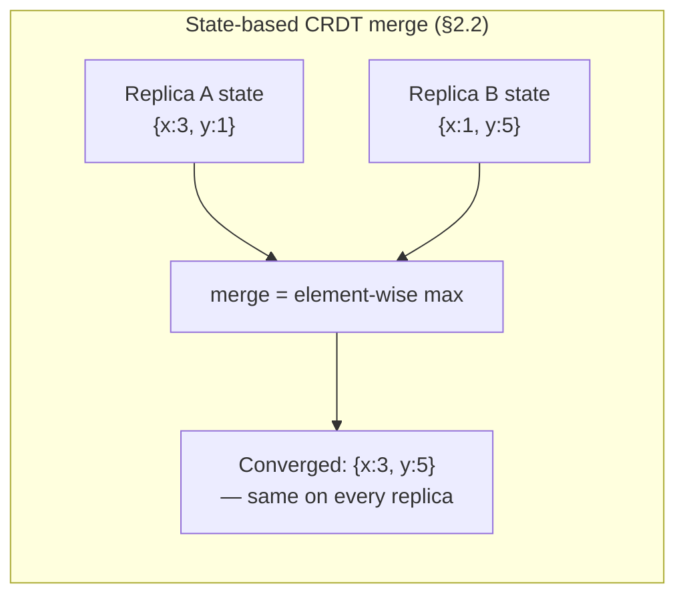
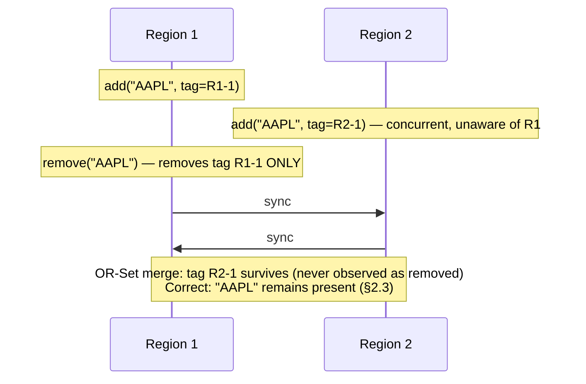
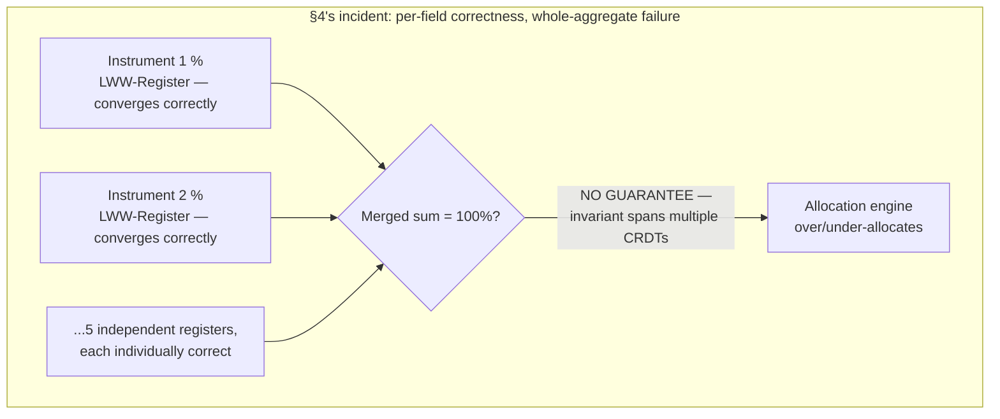
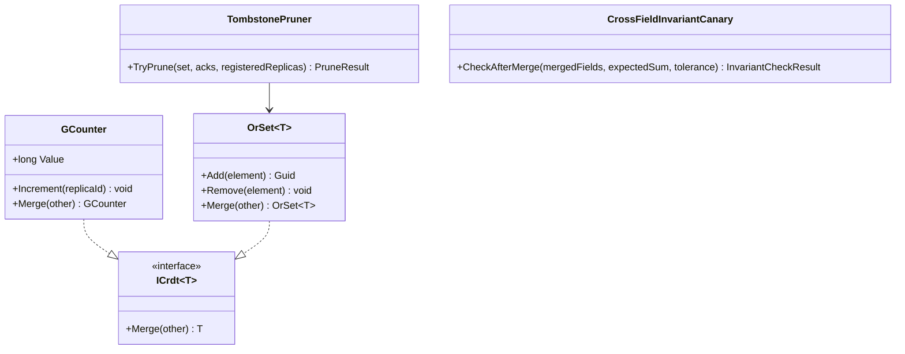

# Module 147 — Distributed Systems: CRDTs (Conflict-Free Replicated Data Types)

> Domain: Distributed Systems | Level: Beginner → Expert | Prerequisite: [[03-PACELC-Consistency-Models-SplitBrain]] §2.3 (causal vs. eventual consistency — CRDTs are a structural, mathematical answer to a narrow slice of this gap) and Expert Q6 (which named CRDTs' scope limit — most financial state isn't commutative — as a preview this module now develops in full), [[../18-Event-Driven-Architecture/05-CrossRegion-MultiCluster-Event-Distribution]] Expert Q6 (the watchlist/set-union example this module formalizes)

>
> **Scope note:** Second of four modules extending `16-Distributed-Systems` toward a 6-module scope. Full 16-section template; Elite FinTech Interview Panel lens.

---

## 1. Fundamentals

**What:** Conflict-Free Replicated Data Types — data structures with a mathematically-guaranteed property: any two replicas, having received any set of updates in any order, any number of times, will converge to the identical state once they've seen the same updates — with **no coordination, no conflict-resolution logic, and no possibility of a merge failure**, because the guarantee is structural, built into the data type's own merge operation, not enforced by a runtime check.

**Why:** Module 146 §2.5 established that most active-active conflict resolution requires an explicit strategy (single-writer routing, last-write-wins, or genuine commutative merge) and Module 146 Expert Q6 previewed CRDTs as the third option, narrowly scoped to genuinely commutative operations. This module develops that preview into its full mechanics — and, just as importantly, into a precise account of where the structure breaks down, since a CRDT's guarantee is real and mathematically airtight *for what it actually models*, and the recurring, expensive mistake is applying that guarantee to state whose true business semantics don't fit the mathematical shape the CRDT assumes.

**When:** Multi-writer, low-latency, active-active replication scenarios where the underlying operation is genuinely commutative and associative — set membership, counters, and similar structurally-independent updates. Not a general substitute for single-writer ownership (Module 142 §11 Hard) wherever an operation is not naturally of this shape.

**How (30,000-ft view):**
```
Replica A: state_A ──update──► state_A'
Replica B: state_B ──update──► state_B'

              merge(state_A', state_B')  ── mathematically guaranteed to:
                                              - not depend on merge order (commutative)
                                              - not depend on grouping (associative)
                                              - be safe to re-apply (idempotent)
                              │
                              ▼
                   IDENTICAL result on every replica,
                   with zero coordination required
```

---

## 2. Deep Dive

### 2.1 The Mathematical Requirement — Join-Semilattices
A CRDT's state forms a **join-semilattice**: a set of possible states with a `merge` (join, ⊔) operation satisfying three properties, each independently necessary for the convergence guarantee to hold:
- **Commutative** — `merge(A, B) == merge(B, A)`. The order two replicas' states are merged in doesn't matter.
- **Associative** — `merge(merge(A, B), C) == merge(A, merge(B, C))`. The grouping of a multi-way merge doesn't matter, which is what allows CRDTs to converge correctly across any number of replicas receiving updates in any topology, not just pairwise.
- **Idempotent** — `merge(A, A) == A`. Re-applying or re-delivering the same state (or, for operation-based variants, the same operation) causes no harm — a direct structural connection to Module 143's idempotency discipline, except here the property is guaranteed by the data type's own mathematics rather than requiring a separately-engineered dedup mechanism.

Any data type whose updates and merge function satisfy these three properties will converge, provably, regardless of network delay, message reordering, or duplicate delivery — which is why CRDTs are frequently described as solving conflict resolution "by construction" rather than "by policy."

### 2.2 State-Based (CvRDT) vs. Operation-Based (CmRDT)
Two implementation families, both correct under the same mathematics, with different operational trade-offs:
- **State-based (Convergent, CvRDT)** — each replica periodically ships its *entire current state* to others, and receiving replicas merge it with their own via the join operation. Simple to implement and tolerant of any delivery pattern (out-of-order, duplicated, even lost-and-later-resent messages cause no harm, since merge is idempotent) — but bandwidth cost grows with state size, since the full state, not just the delta, is transmitted.
- **Operation-based (Commutative, CmRDT)** — each replica ships individual *operations* (e.g., "add element X"), and every replica applies every operation exactly once, in a causally-consistent order (though not necessarily the same total order — only causally-related operations need ordering, directly reusing Module 146 §2.3's causal-consistency definition). More bandwidth-efficient, but requires a reliable, exactly-once, causally-ordered delivery channel underneath it — meaning CmRDTs *depend on* Module 143's idempotency and Module 146's causal-delivery guarantees, rather than providing their own equivalent, whereas CvRDTs' idempotent merge makes them naturally robust to delivery imperfections without needing that additional infrastructure.

### 2.3 The Common CRDT Catalog
- **G-Counter (Grow-only Counter)** — each replica maintains its own increment-only counter; the logical value is the sum across all replicas' counters. Merge takes the element-wise maximum per replica — commutative, associative, idempotent by construction.
- **PN-Counter (Positive-Negative Counter)** — two G-Counters, one for increments and one for decrements, with the logical value being their difference. Supports both increment and decrement while retaining every convergence guarantee.
- **G-Set / 2P-Set** — a grow-only set (G-Set) supports only additions; a two-phase set (2P-Set) adds a second, remove-tracking set, but once removed, an element can never be re-added — a real limitation for many practical use cases.
- **OR-Set (Observed-Remove Set)** — the practically important set CRDT: each *add* is tagged with a unique identifier (a replica ID plus a counter, not just the element's value), and a *remove* removes only the specific tags observed at the time of removal. This correctly allows an element to be removed and later re-added — resolving the classic "concurrent add and remove of the same element" ambiguity by tracking *which specific add* a remove is removing, rather than the bare element value.
- **LWW-Register (Last-Write-Wins Register)** — for a single value (not a collection), keep the value with the highest attached timestamp (or Lamport clock, Module 01 §2.5) on merge. This is the weakest member of the catalog in terms of preserving intent — a concurrent write's content is simply discarded, not merged, which is a deliberate simplification with real consequences (§2.4).

### 2.4 What CRDTs Cannot Do — the Scope Limit That Matters Most
A CRDT's convergence guarantee is airtight for the *specific data type it models* — a G-Counter genuinely, provably converges to the correct sum. What it does not, and structurally cannot, guarantee is that **an invariant spanning multiple, independently-merged CRDTs is preserved by merging each one independently.** This is the single most consequential limit in practice: if a business rule requires "allocation percentages across five instruments must sum to 100%," and each instrument's percentage is stored as its own independent LWW-Register CRDT, merging each register independently — each individually, correctly converging to *some* value — provides no guarantee whatsoever that the *merged set* of five values still sums to 100%, because the join-semilattice mathematics applies per-CRDT, not across an aggregate invariant spanning several of them. This is §4's incident, and it is the direct, concrete instantiation of Module 145's capstone finding — composition risk, distinct from and additional to component risk — occurring specifically within CRDT-based state.

### 2.5 CRDTs vs. Application-Level Conflict Resolution vs. Single-Writer Routing
Module 142 §11 Hard's ownership-router (single-writer-per-key) and Module 146's fencing-token discipline both *prevent* concurrent writes to the same logical entity from occurring at all. CRDTs take the opposite approach: they *allow* concurrent writes and guarantee the merge is always safe, provided the operation is genuinely of a CRDT-compatible shape. Neither is universally superior — single-writer routing adds a routing/ownership-directory dependency (Module 142 §13) but handles arbitrary, non-commutative business logic correctly; CRDTs add no such dependency and permit true multi-region write latency, but only for the narrow slice of operations whose semantics are actually commutative. §15 develops the selection criterion in full.

### 2.6 The Tombstone Growth Problem — Retention, Recurring at the CRDT-Metadata Layer
An OR-Set's removes don't delete data; they add tombstone markers recording which specific tagged adds have been observed-and-removed, so a late-arriving, causally-prior add for an already-removed tag can be correctly recognized as stale rather than incorrectly resurrecting a deleted element. These tombstones accumulate indefinitely unless actively pruned — and pruning is only safe once every replica has *causally stabilized* past the tombstone (i.e., every replica is provably guaranteed to have already seen it, so no future merge could need it for correctness). This is precisely Module 125 §4's outbox-table-growth pattern and Module 143 §2.4's dedup-retention-boundary pattern, recurring a third time at the CRDT tombstone-metadata layer — and §14's incident shows the identical failure shape: a retention boundary sized against an assumption (every replica stabilizes within a bounded window) that a specific, real operational condition (a decommissioned-but-not-fully-removed replica) silently violated.

---

## 3. Visual Architecture







---

## 4. Production Example

**Problem:** A firm's client-entitlement service, active-active across two regions for latency, used an OR-Set CRDT (§2.3) to track which product features each client account was entitled to — additions and removals of entitlement flags, a genuinely commutative, set-membership operation that mapped cleanly onto the OR-Set's guarantees, directly realizing Module 142 Expert Q6's watchlist example in production.

**Architecture:** The same CRDT infrastructure — state-based merge, per-field independent convergence — was later reused by a different team for a new feature: per-instrument trade-allocation percentages for a multi-instrument block order, where each instrument's allocation percentage was stored as its own independent LWW-Register, chosen because the existing CRDT library made adding a new field trivially easy and the team's mental model was "CRDTs mean we don't have to think about conflicts here."

**Implementation:** Each region could independently adjust allocation percentages during the brief window before a block order's execution, with the CRDT layer handling replication and merge with no explicit coordination — exactly the same infrastructure, and exactly the same underlying convergence mathematics, that had worked correctly for the entitlement flags.

**Trade-offs:** Reusing the existing CRDT infrastructure for the new feature was a deliberate choice to avoid building a second, bespoke conflict-resolution mechanism — a reasonable-looking application of an already-proven pattern.

**Lessons learned:** The business invariant for a valid allocation was that the five instruments' percentages summed to exactly 100% — a joint constraint spanning all five fields, never expressed to or enforced by any individual CRDT, each of which only knew about, and only guaranteed convergence for, its own single value. During a brief window, Region 1 adjusted Instrument A from 20% to 25% (compensating by reducing Instrument B from 30% to 25%, correctly summing to 100% *within Region 1's own view*), while Region 2, concurrently and independently, adjusted Instrument C from 15% to 20% (compensating by reducing Instrument D, also correctly summing to 100% *within Region 2's own view*). Each region's local state was internally valid throughout.

When the regions synchronized, each of the five independent LWW-Registers converged correctly and individually — exactly as CRDT mathematics guarantees. The *merged combination* of the five converged values, however, summed to 105%, since the two regions' independent, individually-locally-valid adjustments were never reconciled against each other as a joint constraint — the CRDT layer had no mechanism to know, or check, that these five specific registers were supposed to jointly sum to a fixed total, because that invariant was never expressed as part of any CRDT's own definition; it existed only as an implicit, application-level business rule the original entitlement-flags use case had never needed.

The downstream allocation engine consumed the merged, individually-converged-but-jointly-invalid percentages and over-allocated shares to the block order's participants by 5% in aggregate, an error not caught until end-of-day trade reconciliation flagged the block order's total allocated shares exceeding its total executed shares — again, the same detection layer, arriving via the same route, that has caught the majority of this course's most consequential silent failures.

The fix had three parts. **First**, the allocation-percentage feature was migrated off independent per-field LWW-Registers entirely, onto single-writer-region routing (Module 142 §11 Hard) for the *entire allocation set as one unit* — since the joint invariant meant the five percentages were never independently meaningful, only jointly meaningful, which is exactly the signal (§2.4, §15) that CRDTs are the wrong tool. **Second**, a review checklist was introduced, gating any new use of the existing CRDT infrastructure on an explicit question: "does this field's correctness depend only on itself, or does it participate in an invariant spanning other fields?" — directly generalizing the specific failure into a reusable classification test. **Third**, the entitlement-flags use case itself was re-audited against this new question and confirmed genuinely, structurally safe — each entitlement flag's presence or absence has no joint invariant with any other flag, correctly validating the original design retroactively rather than assuming its correctness had been coincidental.

The generalizable lesson: **a CRDT's guarantee is real and provable for the specific data type it models — it says nothing about any business invariant the application layer imposes across multiple CRDTs, and mistaking "each field converges correctly" for "the aggregate remains valid" is a direct instance of Module 145's composition-risk finding, occurring here at the mathematical-guarantee layer rather than the infrastructure layer.**

---

## 5. Best Practices
- Verify an operation is genuinely commutative and associative before choosing a CRDT — not merely that a CRDT library makes it easy to add the field (§2.4, §4).
- Explicitly check whether a field participates in a cross-field invariant before storing it as an independent CRDT; if so, treat the whole invariant-bound group as a single unit requiring single-writer routing, not independent per-field convergence (§4's fix).
- Choose OR-Set over G-Set/2P-Set for any set requiring re-addition after removal (§2.3).
- Prefer state-based (CvRDT) CRDTs when delivery reliability can't be guaranteed, and operation-based (CmRDT) only when a reliable, causally-ordered delivery channel is already in place (§2.2).
- Prune CRDT tombstones only once causal stability is provably established across every current, active replica — explicitly accounting for decommissioned-but-not-fully-removed replicas (§2.6, §14).
- Reserve LWW-Register for fields where discarding a concurrent write's content entirely is an acceptable business outcome, since it resolves conflict by loss, not by merge (§2.3).

## 6. Anti-patterns
- Applying a CRDT to a field that participates in a cross-field, application-level invariant, assuming per-field convergence implies aggregate correctness (§4's incident).
- Reusing CRDT infrastructure for a new feature purely because it's available, without re-verifying the new use case's operations are genuinely commutative (§4).
- Using LWW-Register where a genuine merge (not last-write-wins discard) is what the business actually needs.
- Allowing OR-Set tombstones to accumulate without a causal-stability-gated pruning strategy (§2.6, §14).
- Treating "we use CRDTs" as a blanket claim that eliminates all conflict-resolution risk for a data store, rather than a claim scoped to the specific fields actually modeled as CRDTs.
- Choosing operation-based CRDTs without also building the exactly-once, causally-ordered delivery infrastructure they depend on (§2.2).

---

## 7. Performance Engineering

**CPU/Memory:** State-based CRDTs' full-state transmission cost grows with state size; large sets (many OR-Set elements) benefit from delta-state variants that transmit only recent changes while retaining the same convergence guarantee.

**Latency:** CRDTs' entire value proposition is avoiding coordination-round-trip latency (Module 146 §2.2's EC cost) for the specific operations they model — a genuine, structural latency win where applicable.

**Throughput:** No coordination bottleneck for CRDT-modeled writes, since merges happen locally and asynchronously; throughput scales with local write capacity rather than consensus round-trip time.

**Scalability:** Tombstone accumulation (§2.6) is the primary long-term scalability risk for set-based CRDTs; unpruned tombstones eventually dominate both storage and merge-computation cost, exactly mirroring unbounded-retention patterns elsewhere in this course.

**Benchmarking:** Benchmark merge cost under realistic tombstone/state volume, not an empty or freshly-initialized CRDT, since §14 shows the failure mode specifically manifests under accumulated, aged state.

**Caching:** Not directly applicable; CRDTs are themselves a replication and convergence mechanism rather than a caching layer, though a locally-cached, not-yet-merged view is architecturally similar to Module 146's bounded-staleness EL read.

---

## 8. Security

**Threats:** An attacker who can inject a large number of adds into an OR-Set (without corresponding removes) can inflate tombstone growth as a denial-of-service vector against the CRDT's own storage and merge cost.

**Mitigations:** Rate-limiting and authorization on CRDT mutation operations exactly as for any other write path; tombstone-growth monitoring as both a correctness and an availability signal.

**OWASP mapping:** Denial of service via unbounded tombstone growth if mutation operations aren't rate-limited or authorized; broken access control if a CRDT's merge accepts updates from unauthorized replicas without verifying their origin.

**AuthN/AuthZ:** Each replica contributing to a CRDT's merge should be an authenticated, authorized participant — an unauthenticated replica able to inject state directly undermines every downstream convergence guarantee, since the mathematics assumes well-formed inputs, not adversarial ones.

**Secrets:** Not directly implicated; standard handling for inter-replica synchronization credentials.

**Encryption:** Standard in-transit/at-rest requirements for CRDT state and tombstone metadata, which may itself carry sensitive information about historical membership or values.

---

## 9. Scalability

**Horizontal scaling:** CRDTs scale writes horizontally with zero coordination cost for genuinely commutative operations — their core structural advantage over quorum-based or single-writer approaches for this narrow operation class.

**Vertical scaling:** Helps local merge-computation cost, which grows with accumulated state and tombstone volume (§7).

**Caching:** Not the primary mechanism; see §7.

**Replication/Partitioning:** CRDTs are inherently a replication strategy — every replica is a full, independently-writable copy, converging via merge rather than via a single-writer/quorum model (Module 146 §2.4's contrast).

**Load balancing:** Writes can be routed to the nearest replica with no ownership-directory lookup (Module 142 §11 Hard's routing cost), since any replica can accept any CRDT-modeled write safely — a genuine simplification where applicable.

**High Availability:** CRDTs provide availability during a partition by design (they are architecturally PA/EL under Module 146's classification) — every replica remains fully writable regardless of connectivity to any other replica.

**Disaster Recovery:** A CRDT-modeled field's DR posture is structurally simple — a recovering replica merges its last-known state with current peers and converges automatically, with no reconciliation logic required beyond the CRDT's own merge.

**CAP theorem:** CRDTs are the clearest practical embodiment of the PA choice from Module 146 §2.2 — genuinely available during a partition, with consistency achieved *eventually* through mathematically-guaranteed convergence rather than through coordination.

---

## 10. Interview Questions

### Basic (10)

1. **Q: What guarantee does a CRDT provide?**
   **A:** Any two replicas, having received any set of updates in any order, any number of times, converge to the identical state with no coordination and no possibility of a merge failure — a structural, mathematical guarantee built into the data type's own merge operation (§1).
   **Why correct:** States the convergence guarantee and its structural (not policy-based) nature.
   **Common mistakes:** Believing CRDTs prevent conflicting updates from occurring, when they actually allow concurrent updates and guarantee the *merge* is always safe.
   **Follow-ups:** "What three mathematical properties make this guarantee hold?" (Commutativity, associativity, idempotence — §2.1.)

2. **Q: What is a join-semilattice, in the context of CRDTs?**
   **A:** The mathematical structure a CRDT's state and merge function must form — a merge operation that is commutative, associative, and idempotent, guaranteeing convergence regardless of delivery order, duplication, or grouping (§2.1).
   **Why correct:** Names the structure and its three defining properties.
   **Common mistakes:** Treating "join-semilattice" as unnecessary jargon rather than the precise mathematical basis for why CRDTs actually work.
   **Follow-ups:** "Which property connects directly to Module 143's idempotency discipline?" (Idempotence — merge(A, A) == A, meaning re-applying the same update causes no harm, §2.1.)

3. **Q: What's the difference between a state-based (CvRDT) and operation-based (CmRDT) CRDT?**
   **A:** State-based CRDTs ship and merge full current state, tolerant of any delivery pattern including duplicates or reordering; operation-based CRDTs ship individual operations that must be delivered exactly once in causal order, more bandwidth-efficient but dependent on reliable, causally-ordered delivery underneath (§2.2).
   **Why correct:** States both variants and their respective trade-offs.
   **Common mistakes:** Assuming operation-based CRDTs provide the same delivery-agnostic robustness as state-based ones, when they instead depend on a delivery guarantee CvRDTs don't need.
   **Follow-ups:** "What does a CmRDT depend on that a CvRDT doesn't?" (An exactly-once, causally-ordered delivery channel — Module 143's and Module 146's guarantees, respectively, §2.2.)

4. **Q: What problem does an OR-Set solve that a simple 2P-Set doesn't?**
   **A:** A 2P-Set, once an element is removed, can never allow that element to be re-added; an OR-Set tags each individual add with a unique identifier and removes only the specific observed tags, correctly allowing an element to be removed and later re-added (§2.3).
   **Why correct:** States the specific limitation OR-Set overcomes.
   **Common mistakes:** Assuming any set CRDT automatically supports full add/remove/re-add semantics without checking which specific variant is in use.
   **Follow-ups:** "What does the OR-Set's unique tag actually distinguish?" (Which specific *add operation* a remove is removing, not merely the bare element value, §2.3.)

5. **Q: What is the core limitation of CRDTs this module identifies as most consequential?**
   **A:** A CRDT's convergence guarantee applies to the specific data type it models; it provides no guarantee that a business invariant spanning multiple, independently-merged CRDTs is preserved when each is merged independently (§2.4).
   **Why correct:** States the scope limit precisely.
   **Common mistakes:** Assuming "we use CRDTs" eliminates all conflict-resolution risk for a data store, rather than only for the specific, individually-modeled fields.
   **Follow-ups:** "Give a concrete example." (§4's allocation-percentage incident — five individually-converging LWW-Registers whose merged sum no longer equals the required 100%.)

6. **Q: What happened in §4's incident, at a high level?**
   **A:** Five per-instrument allocation percentages, each stored as an independent LWW-Register CRDT, each individually and correctly converged after two regions' concurrent, locally-valid adjustments — but the merged combination summed to 105%, since the joint 100% invariant was never expressed to or enforced by any individual CRDT (§4).
   **Why correct:** States the mechanism and why no individual CRDT's correctness prevented it.
   **Common mistakes:** Attributing this to a bug in the CRDT implementation, when every individual CRDT converged exactly as its mathematics guarantees.
   **Follow-ups:** "What was the fix?" (Migrating the allocation set to single-writer-region routing as one joint unit, since the fields were never independently meaningful, §4's fix.)

7. **Q: What is the tombstone growth problem?**
   **A:** An OR-Set's removes don't delete data — they add tombstone markers preventing a late, causally-prior add from incorrectly resurrecting a removed element — and these tombstones accumulate indefinitely unless pruned once every replica has provably, causally stabilized past them (§2.6).
   **Why correct:** States the mechanism and the pruning precondition.
   **Common mistakes:** Assuming CRDT storage is inherently bounded, missing that unpruned tombstones grow exactly like any other unbounded-retention structure this course has covered.
   **Follow-ups:** "What prior module's pattern does this recur?" (Module 125 §4's outbox-table growth and Module 143 §2.4's dedup-retention boundary, §2.6.)

8. **Q: Why is LWW-Register considered the "weakest" member of the common CRDT catalog?**
   **A:** On a conflict, it discards the losing concurrent write's content entirely rather than merging it — resolving conflict by loss, not by genuine combination, which is a real limitation for use cases where the concurrent write's intent matters (§2.3).
   **Why correct:** States the discard behavior and why it's a meaningful limitation.
   **Common mistakes:** Assuming "last write wins" is a neutral, harmless default, without considering what business meaning the discarded write carried.
   **Follow-ups:** "When is LWW-Register still an acceptable choice?" (Where discarding a concurrent write's content genuinely reflects correct business behavior — e.g., a user's own most-recent preference setting, where only the latest genuinely matters.)

9. **Q: How do CRDTs classify under Module 146's PACELC framework?**
   **A:** Architecturally PA/EL — every replica remains fully available and writable during a partition, and low latency is preserved by avoiding coordination, with consistency achieved eventually through guaranteed mathematical convergence rather than through synchronous agreement (§9).
   **Why correct:** Correctly places CRDTs within the established PACELC vocabulary.
   **Common mistakes:** Assuming CRDTs somehow escape the PACELC trade-off entirely, when they are a specific, structurally-strong implementation of the PA/EL choice for a narrow operation class.
   **Follow-ups:** "Why is 'eventually consistent' a stronger claim for a CRDT than for an arbitrary eventually-consistent store?" (Because convergence is mathematically guaranteed and provable, not merely expected — though the *timing* of convergence is still unbounded exactly as Module 146 §2.6 describes for eventual consistency generally.)

10. **Q: What review question does §4's incident lead to, for any new use of existing CRDT infrastructure?**
    **A:** "Does this field's correctness depend only on itself, or does it participate in an invariant spanning other fields?" — if the latter, CRDTs are structurally the wrong tool regardless of how easy the infrastructure makes adding the field (§4's fix).
    **Why correct:** States the generalized classification test derived directly from the incident.
    **Common mistakes:** Evaluating a new CRDT use case only on implementation convenience, without checking for cross-field invariants.
    **Follow-ups:** "What's the correct tool when the answer is 'yes, it participates in an invariant'?" (Single-writer-region routing for the entire invariant-bound group as one unit, Module 142 §11 Hard, §4's fix.)

### Intermediate (10)

1. **Q: Walk through why the original entitlement-flags use case in §4 was genuinely safe, while the later allocation-percentage use case was not.**
   **A:** Each entitlement flag's presence or absence has no joint invariant with any other flag — a client having "premium reporting" and lacking "algo trading" are entirely independent facts, so each flag's OR-Set convergence is both individually and jointly correct. Allocation percentages, by contrast, are jointly constrained to sum to 100% — a fact no individual LWW-Register's convergence has any awareness of, so five individually-correct convergences can jointly violate the constraint that was never expressed to any of them.
   **Why correct:** Precisely distinguishes the two cases by whether a cross-field invariant exists, not by any difference in CRDT implementation quality.
   **Common mistakes:** Concluding CRDTs are unsafe in general from this incident, rather than recognizing the entitlement-flags case as a genuinely correct application of the same technology.
   **Follow-ups:** "Could the entitlement-flags case ever develop a cross-field invariant later?" (Yes — e.g., if a business rule later required "premium reporting requires algo trading," this would introduce exactly the same risk class, requiring the same review question to be re-asked as the system evolves, not answered once and assumed permanent.)

2. **Q: Design an alternative to §4's original failure that preserves CRDT-based, low-coordination replication for the allocation use case, if genuinely required.**
   **A:** Model the entire five-instrument allocation set as a single CRDT unit whose merge function is defined jointly — e.g., a custom CRDT type whose state is the full percentage vector and whose merge explicitly renormalizes to sum to 100% after combining, rather than five independent registers. This requires defining a genuinely new, invariant-aware merge function (verified against §2.1's three properties) rather than reusing an off-the-shelf per-field CRDT — meaningfully more engineering effort than the original approach, but capable of preserving the joint invariant if the renormalization logic is itself correct.
   **Why correct:** Proposes a technically valid path (a custom, invariant-aware CRDT) while being explicit about its added engineering cost relative to simply adopting single-writer routing.
   **Common mistakes:** Assuming no CRDT-based solution is possible for invariant-bound data, when a custom, jointly-defined CRDT is a real, if more complex, option worth naming even if usually not the pragmatic choice.
   **Follow-ups:** "Why did §4's actual fix choose single-writer routing over this custom-CRDT alternative?" (Lower engineering risk and complexity for a use case with no genuine multi-region write-latency requirement — the custom-CRDT path is justified only where CRDTs' core benefit, true multi-writer low latency, is actually needed for this specific invariant-bound data.)

3. **Q: Why does an operation-based CRDT (CmRDT) depend on Module 143's idempotency discipline specifically?**
   **A:** A CmRDT requires each operation to be applied exactly once; if the underlying delivery mechanism can duplicate messages (the at-least-once default this entire course assumes, Module 143 §2.1), the CmRDT needs its own idempotent-application guarantee — precisely Module 143's discipline — layered underneath it, whereas a CvRDT's state-based merge is idempotent by its own mathematics and needs no separate deduplication mechanism at all.
   **Why correct:** Connects CmRDT's operational requirement directly to Module 143's established idempotency discipline, and contrasts with CvRDT's structural immunity to the same concern.
   **Common mistakes:** Assuming all CRDTs are equally robust to duplicate delivery, missing that this robustness is a CvRDT-specific property, not a universal CRDT property.
   **Follow-ups:** "Does this make CvRDTs strictly preferable to CmRDTs?" (Not strictly — CmRDTs' bandwidth efficiency can matter significantly at scale; the trade is bandwidth against the added infrastructure requirement, §2.2.)

4. **Q: How would you design tombstone pruning that correctly handles §14's decommissioned-replica scenario?**
   **A:** Pruning must require an explicit, positive acknowledgment from every currently-registered active replica that it has observed a given tombstone, rather than assuming causal stability from elapsed time alone; a replica being decommissioned must be explicitly deregistered from the causal-stability tracking, with pruning logic treating "replica presumed gone but never explicitly deregistered" as a blocking condition requiring investigation, not a silently-ignored edge case.
   **Why correct:** Identifies the need for explicit deregistration and treats an unexplained blocked pruning condition as something requiring active attention rather than passive tolerance.
   **Common mistakes:** Pruning based on elapsed time alone (assuming all replicas eventually catch up), which is exactly the assumption §14's decommissioned replica violated.
   **Follow-ups:** "What would alert on this condition before it caused unbounded growth?" (Monitoring tombstone-pruning progress and time-since-last-successful-prune per tombstone cohort, alerting if pruning stalls beyond an expected window — the same "sustained lack of progress" alerting shape Module 141 established for consumer lag.)

5. **Q: Critique choosing CRDTs purely because they avoid the ownership-directory dependency Module 142 §11 Hard's single-writer routing requires.**
   **A:** Avoiding the ownership-directory dependency is a real, genuine benefit — but it's only a valid reason to choose CRDTs if the underlying operation is actually commutative; choosing CRDTs to avoid infrastructure complexity, without first verifying commutativity, inverts the correct decision order and is exactly the reasoning error §4's incident represents (the team's stated mental model was "CRDTs mean we don't have to think about conflicts here," treating infrastructure convenience as the primary criterion rather than a secondary one following from a correctly-verified operation shape).
   **Why correct:** Identifies the correct decision order (verify commutativity first, then weigh infrastructure trade-offs) and names the inverted reasoning §4 actually exhibited.
   **Common mistakes:** Treating "avoids ownership-directory complexity" as sufficient justification on its own, without first establishing the operation is genuinely commutative.
   **Follow-ups:** "What's the correct decision order?" (First: is this operation genuinely commutative and free of cross-field invariants? Only if yes: then compare CRDT infrastructure cost against single-writer-routing infrastructure cost as a secondary consideration, §15.)

6. **Q: How does this module's join-semilattice mathematics relate to Module 146's causal consistency?**
   **A:** A CRDT's commutativity guarantee means causally-*unrelated* (concurrent) operations can be applied in any order with an identical result — which is a strictly stronger guarantee than causal consistency alone provides, since causal consistency only orders causally-*related* operations and says nothing about concurrent ones' final merged effect, while a CRDT mathematically guarantees the concurrent case converges correctly regardless of order. CRDTs can be understood as one concrete mechanism for achieving strong, predictable behavior specifically in the gap causal consistency deliberately leaves open.
   **Why correct:** Precisely locates CRDTs' guarantee within Module 146's consistency spectrum, as addressing exactly the concurrent-operations gap causal consistency leaves unspecified.
   **Common mistakes:** Treating CRDTs and causal consistency as unrelated concepts, missing that CRDTs are a specific, mathematically-strong answer to the exact ambiguity causal consistency alone leaves open.
   **Follow-ups:** "Does using a CRDT mean causal consistency no longer needs to be reasoned about?" (No — for a CmRDT specifically, causal ordering of operations still matters for operations that ARE causally related, e.g., an add must be delivered before a remove that targets it, §2.2.)

7. **Q: Apply this course's "declared ≠ actual" theme to §4's incident.**
   **A:** The declared claim was "this data is CRDT-protected, so conflicts are handled." The claim was true, narrowly and precisely, for each individual LWW-Register — each one genuinely, correctly converged. It was false for the actual property that mattered to the business: that the *set* of five values remained valid. This is a particularly clean instance of the theme because the narrower, true claim and the broader, false claim are so easy to conflate — "CRDT-protected" sounds like a comprehensive correctness guarantee, and is actually a claim scoped precisely to each individual data type's own mathematics, no wider.
   **Why correct:** Precisely separates the true, narrow claim from the false, broader one, and explains why they're easy to conflate in this specific case.
   **Common mistakes:** Treating "we use CRDTs" as an unqualified correctness guarantee for an entire feature, rather than a claim scoped to each individually-modeled field.
   **Follow-ups:** "How should the claim be stated precisely, going forward?" (Per-field, with explicit note of any cross-field invariant and how it's separately enforced — mirroring Module 143 Expert Q1's insistence that "idempotent" always be a scoped, not unqualified, claim.)

8. **Q: How should a CRDT-based system's testing strategy differ from Module 144's general event-driven testing pyramid?**
   **A:** In addition to Module 144's standard layers, CRDT-specific testing should include a **property-based test verifying the three join-semilattice properties directly** (commutativity, associativity, idempotence, §2.1) for any custom CRDT implementation, and — critically, per §4's lesson — an **explicit cross-field invariant test** that merges two independently-valid, concurrently-modified states and asserts any joint business invariant still holds, specifically designed to catch the exact failure class §4 represents, which no per-field correctness test would ever surface.
   **Why correct:** Extends Module 144's general pyramid with two CRDT-specific test types, one targeting the mathematical properties directly and one targeting exactly the composition gap §4 exposed.
   **Common mistakes:** Testing only that each individual CRDT field converges correctly (which §4's per-field tests presumably already did, and which didn't catch the incident), without a distinct test for cross-field invariants.
   **Follow-ups:** "Would a replay-based test (Module 144 §2.3) have caught §4's incident?" (Only if the replay fixture specifically included a concurrent, cross-field-invariant-violating scenario — reinforcing Module 144's own point that fixture curation must be deliberately informed by known failure categories, not merely historical volume.)

9. **Q: How does §14's tombstone-growth incident relate to Module 142's derived-artifact RPO audit?**
   **A:** Both are instances of the same general pattern: a piece of state a component independently maintains (a stream-processing snapshot in Module 142 §4, a set of tombstones here) evolves on its own cadence and assumptions, silently diverging from what the rest of the system assumes about it, until a specific operational condition (a regional failover, a decommissioned replica) exposes the divergence. The generalized fix in both cases is the same: an explicit inventory of every independently-evolving piece of derived state a component maintains, each with its own validated assumptions, rather than treating the component's "primary" data path as the only thing requiring scrutiny.
   **Why correct:** Identifies the shared structural pattern (independently-evolving derived state with unvalidated assumptions) across two modules' incidents, applying Module 142's audit discipline by analogy.
   **Common mistakes:** Treating tombstone growth as a CRDT-specific concern unrelated to Module 142's replication-lag findings, missing the shared underlying pattern.
   **Follow-ups:** "What would the CRDT-specific version of Module 142's audit check?" (Every CRDT's tombstone-pruning precondition, explicitly verified against the current, actual set of registered replicas — including proper deregistration handling for decommissioned ones, Intermediate Q4.)

10. **Q: Synthesize how this module extends Module 146's split-brain and consistency-model treatment.**
    **A:** Module 146 established that PA choices risk split-brain unless a structural defense (quorum, fencing) prevents divergent writes from being silently accepted. CRDTs offer a third structural defense distinct from both: rather than *preventing* concurrent writes (quorum) or *rejecting stale ones after the fact* (fencing), CRDTs make concurrent writes *always safe to merge* by construction — but only for the narrow class of genuinely commutative operations, and this module's central addition is the precise boundary of that class (§2.4) plus the concrete failure (§4) that results from misjudging it.
    **Why correct:** Positions CRDTs as a third, distinct structural defense against split-brain-adjacent risk, precisely scoped relative to Module 146's other two defenses.
    **Common mistakes:** Treating CRDTs as a strictly better alternative to quorum/fencing rather than a differently-scoped tool applicable only to a specific operation class.
    **Follow-ups:** "Which of the three defenses (quorum, fencing, CRDT) is appropriate for genuinely non-commutative, single-entity state like a settlement instruction?" (Neither quorum nor CRDT alone — a single-writer model (Module 142 §11 Hard) combined with fencing (Module 146 §2.5) for the leader-election path, since the operation is neither safely mergeable nor tolerant of being unavailable during a partition for long.)

### Advanced (10)

1. **Q: Diagnose §4's incident and design the complete structural fix.**
   **A:** Root cause: five per-instrument allocation percentages, each modeled as an independent LWW-Register CRDT, each individually and correctly converging, while the joint 100%-sum business invariant spanning all five was never expressed to or enforced by any individual CRDT's own mathematics — a direct instance of Module 145's composition-risk finding. Fix: (1) the allocation set migrated to single-writer-region routing as one joint unit, since the fields were never independently meaningful (Intermediate Q1); (2) a review checklist gating any new CRDT use on an explicit cross-field-invariant question (Basic Q10); (3) the original entitlement-flags use case explicitly re-audited and confirmed safe under the new question, converting an assumed-correct design into a verified one (§4); (4) a cross-field-invariant test added to the CRDT testing strategy generally, targeting exactly this failure class going forward (Intermediate Q8).
   **Why correct:** Addresses the specific data-modeling error, the missing review process, the retroactive verification of the still-valid original use case, and ongoing test coverage.
   **Common mistakes:** Fixing only the allocation-percentage feature (point 1) without adding the general review question (point 2), leaving the *next* new CRDT use case equally exposed to the same reasoning error.
   **Follow-ups:** "Why was re-auditing the original entitlement-flags use case (point 3) necessary, given it was never implicated in the incident?" (Because the incident revealed the team's mental model — "CRDTs mean we don't have to think about conflicts" — had been silently, if coincidentally, correct for that use case; converting an assumption that happened to be right into an explicitly verified fact closes the gap between "worked so far" and "known to be correct.")

2. **Q: A team proposes using CRDTs for a distributed rate-limiter's request counter, reasoning that a G-Counter naturally fits "count of requests." Evaluate.**
   **A:** A G-Counter genuinely, correctly sums request counts across replicas — the counting itself is safe. The risk is in what the counter is *used for*: if the rate limit's enforcement logic checks "is the current sum below threshold X" at each replica *before* that replica's own increments have been merged with others', each replica may independently believe it's below threshold while the true, eventually-converged sum has already exceeded it — a specific instance of Module 146 §2.6's "eventual consistency window" risk, here manifesting as rate-limit overshoot during the convergence delay, not a flaw in the G-Counter's own mathematics.
   **Why correct:** Correctly separates the G-Counter's genuine correctness (the sum converges accurately) from the separate, real risk in how a threshold check against that sum behaves during the convergence window.
   **Common mistakes:** Treating a G-Counter's mathematical correctness as sufficient for any downstream use, without separately considering the staleness risk of a threshold check performed before convergence completes.
   **Follow-ups:** "How would you bound the overshoot risk?" (Set the enforced threshold conservatively below the true desired limit, by an amount calibrated to the maximum realistic convergence delay under load — directly reusing Module 146 §2.6's bounded-staleness discipline, applied to a rate-limiter's specific tolerance.)

3. **Q: Design a monitoring signal that would have caught §4's incident before end-of-day reconciliation did.**
   **A:** A continuous, automated check — run immediately after every merge, not on a batch cadence — asserting any registered cross-field invariant (once explicitly declared, per the review checklist) still holds against the merged state, alerting immediately on violation rather than waiting for a downstream consumer's own business-logic check to eventually surface the discrepancy. This converts the invariant from an implicit, undeclared assumption (§4's original gap) into an explicit, continuously-verified property — directly mirroring Module 142 Expert Q4's consistency-canary pattern, applied here to cross-CRDT invariants specifically.
   **Why correct:** Proposes a continuous, merge-time check rather than relying on downstream, batch-cadence detection, and connects it to an established prior pattern.
   **Common mistakes:** Relying solely on downstream reconciliation (which did catch it, but late) as sufficient, without adding an earlier, merge-time detection layer specifically for declared invariants.
   **Follow-ups:** "What would this check need as a prerequisite?" (The invariant must first be explicitly declared and registered — Basic Q10's review question is what surfaces which invariants exist to check in the first place; an undeclared invariant remains undetectable by this mechanism, exactly as it was in the original incident.)

4. **Q: Critique using CRDTs for financial balance state generally, given PN-Counter's apparent fit for increment/decrement operations.**
   **A:** A PN-Counter correctly, mathematically sums increments and decrements — but most financial balance operations carry conditional business logic beyond the raw arithmetic (an overdraft check that must see the *current, authoritative* balance before permitting a debit, not an eventually-converging one) — exactly Module 146 Expert Q6's original warning that most financially meaningful state isn't genuinely commutative once its *full* business semantics, not just its arithmetic shape, are considered. A PN-Counter is safe for a balance display that tolerates eventual consistency; it is unsafe as the authoritative gate for an operation whose correctness depends on the balance's exact, current value at decision time.
   **Why correct:** Distinguishes the raw arithmetic (genuinely commutative) from the full business operation it's embedded in (frequently not commutative once conditional logic is included).
   **Common mistakes:** Concluding a PN-Counter is safe for balance state generally because the increment/decrement arithmetic is provably commutative, without separately checking whether any conditional logic built on top of that balance is itself commutative.
   **Follow-ups:** "Is there a safe way to use a PN-Counter for balance-adjacent state?" (Yes — for a purely informational or eventually-consistent display value, explicitly not used as the authoritative gate for any conditional decision, mirroring Module 146 Advanced Q4's per-operation classification discipline.)

5. **Q: How should CRDT tombstone pruning interact with Module 142's cross-region DR posture?**
   **A:** A DR region that has been offline and is later restored must be treated, for tombstone-pruning purposes, identically to any other currently-registered active replica whose causal position needs to be re-established before pruning can safely proceed past what it might still need — pruning that occurred *during* the DR region's absence, assuming it would never return, risks exactly §14's failure in reverse: a returning DR replica whose stale state references already-pruned tombstones could incorrectly resurrect removed elements the pruning had assumed were safely gone. The DR restoration process must explicitly reconcile the returning replica's causal position against current tombstone state before resuming normal merge operation.
   **Why correct:** Identifies the specific bidirectional risk (pruning ignoring a temporarily-absent-but-returning replica) as a variant of §14's failure, and specifies the required reconciliation step.
   **Common mistakes:** Treating a DR region's restoration as a simple resumption of normal replication, without explicitly checking whether tombstone pruning occurred during its absence that its returning state might now conflict with.
   **Follow-ups:** "What would this reconciliation check concretely verify?" (That every element the returning replica believes is present, but whose corresponding tombstone was pruned during its absence, is correctly and explicitly resolved — likely requiring the returning replica to defer to the current merged state for any such element rather than reasserting its own stale view.)

6. **Q: A regulator asks how the firm ensures allocation percentages remain valid across regions. Answer, given §4's incident.**
   **A:** Describe the corrected architecture: the allocation set is managed as a single, jointly-owned unit under single-writer-region routing (Module 142 §11 Hard), not independent per-field CRDTs, eliminating the specific composition gap that caused the incident structurally rather than through a detection-only control. State the layered verification alongside it: a continuous merge-time invariant check (Advanced Q3) for any remaining CRDT-modeled data with declared cross-field invariants, and permanent end-of-day reconciliation (§4) retained as the independent backstop regardless, per this course's standing principle that structural fixes reduce but never eliminate the value of permanent, independent verification.
   **Why correct:** States the structural fix precisely and retains the honest, permanent verification layer rather than claiming the structural fix alone is sufficient.
   **Common mistakes:** Describing only the original CRDT-based architecture's theoretical convergence guarantee without acknowledging the specific, real incident it produced and the structural change made in response.
   **Follow-ups:** "Why not simply add the invariant check without changing the underlying architecture?" (Because a merge-time check is a detection layer, not a prevention one — it would have caught §4's incident faster, but the underlying architecture would still permit the invalid state to be *momentarily* merged and detected after the fact, whereas single-writer routing prevents the invalid combination from ever being constructible at all — a stronger, structural guarantee Advanced Q1's fix correctly prioritizes.)

7. **Q: Apply this course's "verify the verifier" theme to a custom CRDT implementation's own merge function.**
   **A:** A custom merge function with a subtle bug violating one of the three required properties (§2.1) — say, an implementation that is commutative and idempotent but, under a specific edge case, not truly associative — would produce inconsistent results only under specific, multi-way merge orderings that a simple two-replica test might never exercise, giving false confidence from passing tests that don't actually probe the property that's broken. This requires the same meta-verification this course has applied elsewhere: a property-based test (Intermediate Q8) that generates many random operation sequences and merge orderings specifically to probe commutativity, associativity, and idempotence directly, rather than testing only a handful of hand-picked scenarios.
   **Why correct:** Identifies the specific, subtle failure mode (a property violated only under certain merge orderings) and the specific testing technique (property-based testing) that actually probes for it.
   **Common mistakes:** Testing a custom CRDT's merge function only against a small number of hand-picked, pairwise scenarios, which can pass while a rarer multi-way ordering issue remains undetected.
   **Follow-ups:** "Why is this risk specific to custom CRDTs rather than the well-known catalog (§2.3)?" (The catalog's implementations are widely used, reviewed, and mathematically proven in published literature; a custom CRDT — like §4's hypothetical joint-invariant-aware allocation CRDT from Intermediate Q2 — carries genuine, unproven implementation risk that the standard catalog does not.)

8. **Q: How should engineering leadership decide between CRDT-based and single-writer-routed architectures when a new active-active use case is proposed, synthesizing this module's findings?**
   **A:** First, classify the operation: is it genuinely commutative and free of cross-field invariants at the level it will actually be used (not just its raw arithmetic, per Advanced Q4)? If yes, and if true multi-region write latency is a genuine, demonstrated requirement (not merely "it would be nice"), CRDTs are the structurally simpler, coordination-free choice. If the operation carries any conditional business logic, cross-field invariant, or non-commutative semantics, single-writer-region routing (Module 142 §11 Hard) is the correct default, accepting its ownership-directory infrastructure cost as the price of correctness for operations CRDTs cannot structurally guarantee. The decision is per-operation, not a single organization-wide technology choice — precisely mirroring Module 146 §15's per-operation PACELC classification recommendation, applied here to conflict-resolution-strategy choice specifically.
   **Why correct:** Gives a precise, ordered decision procedure and explicitly connects it to an established prior module's identical per-operation classification discipline.
   **Common mistakes:** Treating CRDT-versus-single-writer as a one-time, system-wide architectural choice rather than a per-operation classification decision.
   **Follow-ups:** "What organizational mechanism keeps this classification current as operations evolve?" (The same review checklist from Basic Q10/Advanced Q1, re-triggered whenever an existing field's business semantics change — since §4's own hypothetical Intermediate Q1 follow-up shows even a genuinely-safe use case can later acquire a cross-field invariant that invalidates its original classification.)

9. **Q: How does this module's finding connect to Module 145's capstone conclusion about composition risk being distinct from component risk?**
   **A:** §4's incident is a direct, concrete instantiation of that exact finding, occurring at the mathematical-guarantee layer rather than the infrastructure-composition layer Module 145's capstone incident occurred at: each individual CRDT (a component) was correct by its own, provable mathematics; the failure lived entirely in the *composition* of five such components against a joint invariant none of them individually modeled — the identical structural shape as Module 145 §4's stream-processing-snapshot-plus-cross-region-replication incident, now shown to recur even in a domain (CRDTs) whose entire premise is a *stronger-than-usual* individual-component correctness guarantee. This is meaningful evidence that composition risk is not merely a property of imperfectly-specified infrastructure mechanisms — it recurs even when every individual component's correctness is mathematically airtight.
   **Why correct:** Explicitly connects this module's incident to Module 145's named finding and argues its occurrence here is especially strong evidence for that finding's generality, since CRDTs' individual-component guarantees are unusually strong.
   **Common mistakes:** Treating this module's incident as an isolated CRDT-specific lesson, missing its status as further, particularly compelling evidence for Module 145's broader, course-spanning finding.
   **Follow-ups:** "Does this mean composition risk is literally unavoidable, even with perfect individual components?" (Yes, structurally — Module 145 Expert Q1 already established this; a joint invariant spanning multiple independently-correct components is, by definition, a property no single component's own correctness can guarantee, regardless of how strong that individual guarantee is.)

10. **Q: Synthesize the governance for CRDT adoption across the organization.**
    **A:** (1) A mandatory review question gating any new CRDT use case: does this operation's full business semantics (not merely its raw arithmetic) remain genuinely commutative, and does it participate in any cross-field invariant (Basic Q10, Advanced Q4)? (2) Cross-field invariants, once identified, are either eliminated by modeling the invariant-bound group as a single unit under single-writer routing, or explicitly, continuously verified via a merge-time check if a custom joint-CRDT approach is chosen instead (Advanced Q3, Intermediate Q2). (3) Tombstone pruning requires explicit, positive causal-stability confirmation from every currently-registered replica, with decommissioning handled as an explicit deregistration step, not an assumed timeout (Intermediate Q4, §14). (4) Custom CRDT merge functions are verified via property-based testing directly probing commutativity, associativity, and idempotence, not only hand-picked scenario tests (Advanced Q7). (5) Permanent, independent reconciliation retained regardless of CRDT correctness guarantees, per this course's standing principle (Advanced Q6).
    **Why correct:** Covers adoption classification, invariant handling, tombstone lifecycle, custom-implementation verification, and permanent detection as five distinct, individually necessary controls.
    **Common mistakes:** Governing CRDT correctness at the individual-data-type level thoroughly while leaving cross-field composition entirely ungoverned, which is exactly where §4's incident occurred.
    **Follow-ups:** "Which single control would have most changed §4's outcome if it alone had existed beforehand?" (Point 1 — the mandatory review question — since it would have surfaced the cross-field invariant at design time, before any code was written, rather than requiring the incident and its detection to surface it retroactively.)

### Expert (10)

1. **Q: Evaluate whether "we use mathematically-proven CRDTs" should ever be presented as a stronger correctness claim than "we use a well-tested application-level conflict-resolution strategy."**
   **A:** For the *specific, narrow property* a CRDT's mathematics actually covers — convergence of that individual data type — the claim is genuinely, provably stronger than any application-level strategy's empirically-tested-but-not-proven correctness. But §4 shows this stronger claim is easily, and consequentially, over-extended to cover a broader scope (whole-aggregate, cross-field correctness) the mathematics never addressed. The honest, calibrated position: CRDTs provide a *stronger guarantee for a narrower scope* than typical application-level conflict resolution, and the discipline required is keeping that scope explicit and never silently widening it in communication or in engineering assumption — precisely the discipline §4's incident shows was absent.
   **Why correct:** Correctly credits CRDTs' genuinely stronger guarantee while insisting on precise scope communication as the actual discipline required, rather than treating "mathematically proven" as inherently safer in an unqualified sense.
   **Common mistakes:** Either dismissing CRDTs' guarantee as no stronger than any other approach (underselling a genuine strength) or treating "mathematically proven" as automatically extending to cover the whole feature it's embedded in (§4's actual mistake).
   **Follow-ups:** "How would you communicate this nuance to a non-technical stakeholder?" (Directly reusing Module 146 Expert Q5's translation pattern: "this specific value is guaranteed to always resolve correctly on its own; whether the *combination* of several such values stays valid is a separate question we handle separately," naming the scope explicitly rather than making a single undifferentiated safety claim.)

2. **Q: Design a formal verification approach for confirming a proposed data model has no hidden cross-field invariants before adopting per-field CRDTs, beyond relying on a manual review checklist.**
   **A:** Cross-reference every proposed CRDT-modeled field against the domain's own invariant catalog — if the organization maintains DDD-style Aggregate boundaries (Module 110's synchronous-invariant test) or documented business rules (Module 106's ADRs), any field whose value is checked or constrained by a documented rule alongside another field is a candidate cross-field invariant, surfaced by cross-referencing the CRDT-adoption proposal against those existing documents rather than relying solely on a reviewer's manual judgment, which — as a checklist question alone — is fallible to the same "it looked safe" reasoning that produced §4's incident in the first place.
   **Why correct:** Proposes grounding the invariant check in existing, independently-maintained documentation (Aggregate boundaries, ADRs) rather than relying purely on a reviewer's in-the-moment judgment, adding a structural cross-reference to the manual checklist.
   **Common mistakes:** Treating a manual review checklist (Advanced Q1 point 2) as sufficient on its own, without also grounding it in a structural, independently-verifiable source of truth about which invariants actually exist.
   **Follow-ups:** "What if the domain has no formally documented Aggregate boundaries or invariant catalog?" (Then the review question (Basic Q10) is the fallback, best-effort mechanism — which is precisely why establishing DDD-style Aggregate boundaries (Module 110) earlier in a system's life pays off later here, one more instance of this course's cross-domain synthesis principle.)

3. **Q: How does §4's incident change the calculus for adopting CRDTs specifically within the settlement-and-ledger domain this course has used as its running case study since Module 116?**
   **A:** The settlement-instruction Aggregate (Module 116's central case study, carried through Event Sourcing, Saga, and Outbox) is, by Module 110's own synchronous-invariant test, precisely the kind of entity whose fields are jointly, synchronously constrained — the entire reason it was modeled as a single Aggregate with a single consistency boundary rather than as independent fields in the first place. This makes it a poor candidate for per-field CRDT decomposition almost by definition: the Aggregate boundary Module 110 established *is* the joint-invariant boundary this module's §2.4 warns against splitting across independent CRDTs. CRDTs remain a legitimate tool for genuinely independent, cross-cutting metadata about a settlement instruction (e.g., which regional support teams have flagged it for review, a genuinely commutative, invariant-free set) but not for the instruction's own core financial fields.
   **Why correct:** Connects this module's CRDT-scope limit directly to Module 110's Aggregate-boundary discipline, showing they identify the same joint-invariant boundary from two different theoretical directions.
   **Common mistakes:** Evaluating CRDT-adoption suitability without reference to the domain's own already-established Aggregate boundaries, missing that Module 110's work already answered the "does this participate in a joint invariant" question for this specific entity.
   **Follow-ups:** "Does this mean Aggregate-internal fields can never use CRDTs?" (In principle, yes for fields the Aggregate's own invariants jointly constrain; genuinely independent, invariant-free metadata attached to the same entity remains a legitimate candidate, illustrating that the CRDT-suitability question is per-field, not per-entity.)

4. **Q: A post-mortem on a hypothetical future incident finds a correctly-designed, invariant-free CRDT nonetheless produced an incorrect merged result due to a clock-skew-dependent LWW-Register tie-break. Diagnose.**
   **A:** LWW-Register's "last write wins" requires a total order over writes, typically via wall-clock timestamps or Lamport clocks (Module 01 §2.5); if two genuinely concurrent writes carry identical or skew-affected timestamps, the tie-break behavior (commonly, an arbitrary but deterministic rule like highest replica ID) may not reflect the business's actual intended precedence, silently discarding the "wrong" write from a business perspective even though the CRDT mathematics still technically converges correctly — this is not a violation of §2.1's three properties (the merge remains commutative, associative, idempotent regardless of clock skew) but a case where the *deterministic tie-break itself* doesn't encode the business meaning stakeholders assumed it would.
   **Why correct:** Distinguishes between a genuine CRDT mathematical-property violation (which this isn't) and a case where the deterministic-but-arbitrary tie-break rule doesn't match business intent (which this is) — a subtler, distinct failure mode from §4's cross-field invariant gap.
   **Common mistakes:** Concluding this represents a CRDT correctness failure, when the convergence guarantee holds exactly as designed — the gap is between the tie-break rule's determinism and its alignment with actual business intent.
   **Follow-ups:** "How would this be prevented?" (Use a tie-break rule with explicit business meaning — e.g., "highest-priority region wins," documented and agreed — rather than an arbitrary-but-deterministic default like replica ID, which happens to be mathematically sufficient but not necessarily what stakeholders assumed "last write wins" meant.)

5. **Q: How should CRDT adoption be evaluated against Module 142's active-active topology governance, given both address multi-region write concurrency?**
   **A:** They operate at different layers and are not competing choices but complementary ones: Module 142 §15's Option A/B/C framework decides the *replication topology* (active-passive versus active-active, and if active-active, how conflicts are resolved), while this module's CRDT-versus-single-writer decision operates *within* an active-active topology's "how are conflicts resolved" choice specifically — CRDTs are one valid answer to Module 142 §2.5's "conflict resolution strategy" requirement for genuinely commutative fields, with single-writer-per-key routing (Module 142 §11 Hard) as the answer for everything else. A system's overall multi-region governance should reference both modules jointly: Module 142 for the topology decision, this module for the per-field conflict-resolution mechanism within an active-active topology once chosen.
   **Why correct:** Correctly positions the two modules' decisions as operating at different, complementary layers rather than as alternative, competing frameworks.
   **Common mistakes:** Treating Module 142's and this module's guidance as two independent, potentially conflicting sources of architectural advice, rather than recognizing this module supplies the detailed mechanism for one specific option Module 142's framework already named.
   **Follow-ups:** "Where exactly does this module's §2.5 comparison map onto Module 142's own vocabulary?" (Module 142 §2.5 named "CRDT-style commutative merge" as one of three conflict-resolution options alongside single-writer-region assignment and last-write-wins-by-clock — this module is the full development of that one option, previously only named in passing.)

6. **Q: Evaluate whether a firm should build a general-purpose, reusable CRDT infrastructure layer (as §4's team did) versus adopting CRDTs narrowly, case-by-case, with less shared tooling.**
   **A:** A shared infrastructure layer genuinely reduces per-use-case implementation cost and is valuable — but §4's incident shows the specific risk it introduces: making CRDT adoption *easy* removes the friction that might otherwise have prompted a more careful, first-principles evaluation of whether a new use case's operations are genuinely commutative, exactly Advanced Q8's "convenience preceding correct classification" failure mode. The resolution is not to avoid shared infrastructure (which would be a costly overcorrection) but to attach the mandatory review gate (Basic Q10) *to the infrastructure's own onboarding process* specifically — making the classification question a required, structural step of adopting the shared tooling, not a separate, easily-skipped best practice.
   **Why correct:** Credits the genuine value of shared infrastructure while precisely identifying the specific risk it introduces (reduced friction bypassing necessary evaluation) and proposing a fix that preserves the infrastructure's benefit while closing the gap.
   **Common mistakes:** Concluding shared CRDT infrastructure is itself the problem and should be avoided, rather than recognizing the problem is an unenforced classification step that the infrastructure's own onboarding flow can and should enforce structurally.
   **Follow-ups:** "Where else in this course has 'making the right thing convenient' been the effective governance mechanism, rather than pure documentation or willpower?" (Module 139's platform-engineering paved-path principle — the identical insight, applied here specifically to CRDT-adoption friction rather than general platform capability adoption.)

7. **Q: Apply this course's "verify the verifier" theme to the merge-time invariant check proposed in Advanced Q3.**
   **A:** The invariant check itself is a new piece of verification infrastructure, and per this course's repeated finding (Module 125 §14, Module 144 Expert Q7, Module 146 Advanced Q7), it can itself silently stop functioning — a check that's never actually triggered because the invariant it monitors was declared but the monitoring hook was never correctly wired to the actual merge path, or a check whose alert routes to an unmonitored channel (Module 125 §14's exact precedent). This requires the identical meta-verification pattern: a deliberately-injected, known-invalid merge scenario run periodically as a synthetic canary, confirming the check actually fires and actually alerts the intended recipient, not merely that the check's code exists and passed code review.
   **Why correct:** Applies the specific, now-repeatedly-demonstrated silent-failure risk of verification infrastructure to this module's own proposed fix, and specifies the concrete canary needed to close it.
   **Common mistakes:** Treating the addition of an invariant check as itself a complete, self-evidently-functioning fix, without the same ongoing verification this course has required of every other detection mechanism it has introduced.
   **Follow-ups:** "How would this canary differ from Advanced Q7's property-based merge-function test?" (Advanced Q7 verifies the CRDT's own merge mathematics are correctly implemented; this canary verifies the separate, downstream invariant-monitoring infrastructure is correctly wired and alerting — two different components, each needing its own independent verification.)

8. **Q: How should a Principal Engineer weigh CRDT adoption's genuine latency benefit against the composition-risk cost this module has extensively documented, when advising a team early in a new system's design?**
   **A:** The genuine latency benefit is real and, for the narrow class of truly-independent, commutative, invariant-free operations, essentially free — no ongoing cost beyond initial correct classification. The composition-risk cost is not inherent to CRDTs' use *per se*, but to their *misapplication* to operations that don't actually fit the required shape — meaning the correct advice is not "avoid CRDTs to avoid this risk class" (which forfeits a genuine, low-cost benefit for the cases where it legitimately applies) but "invest proportionally in the classification discipline (Basic Q10, Expert Q2) commensurate with how much latency benefit is actually being sought," since a system with only one or two genuinely-independent CRDT-modeled fields carries much lower composition risk than one, like §4's, that has scaled CRDT adoption broadly via shared, low-friction infrastructure without matching investment in classification rigor.
   **Why correct:** Gives calibrated advice — proportional investment in classification discipline relative to the scale of CRDT adoption — rather than either extreme (avoid CRDTs entirely, or adopt freely without added rigor).
   **Common mistakes:** Advising categorically for or against CRDT adoption, rather than tying the appropriate level of classification rigor to the actual scale and criticality of the intended adoption.
   **Follow-ups:** "What would 'low-scale, low-risk' CRDT adoption look like concretely?" (A single, clearly-independent field like a presence indicator or a simple boolean flag set, evaluated once by a senior engineer with domain knowledge, versus §4's shared-infrastructure-driven, many-teams-many-fields adoption pattern that genuinely warranted the fuller checklist-and-audit governance this module's Advanced Q10 specifies.)

9. **Q: How does this module's finding relate to the CALM theorem (Consistency As Logical Monotonicity), and is it worth invoking in a Principal-level interview answer?**
   **A:** CALM theorem formalizes precisely the boundary this module has developed informally throughout: a program's logic can be evaluated without coordination if and only if it is *monotonic* — its output only grows/refines with more input, never retracts or reconsiders a prior conclusion — which is exactly the property CRDT-compatible operations (grow-only sets, counters) have and non-commutative, invariant-checking operations (a threshold check, a joint-sum constraint) lack. Invoking CALM by name in an interview, correctly connected to this module's concrete examples (§2.4's invariant gap being a *non-monotonic* requirement — "the sum must not exceed 100%" is fundamentally a retraction-capable, non-monotonic check), demonstrates the kind of first-principles theoretical grounding the Elite FinTech Interview Panel lens rewards, well beyond a purely pattern-matched "use CRDTs for sets and counters" answer.
   **Why correct:** Correctly connects CALM theorem's formal monotonicity criterion to this module's concrete examples, and appropriately calibrates when invoking such theory adds genuine interview value versus mere name-dropping.
   **Common mistakes:** Either omitting any theoretical grounding (missing an opportunity to demonstrate depth) or invoking CALM theorem by name without connecting it concretely to the actual failure this module documents, which reads as recitation rather than understanding.
   **Follow-ups:** "Is §4's five-instrument sum-to-100% invariant monotonic or non-monotonic, precisely?" (Non-monotonic — a valid state (summing to 100%) can become invalid (summing to 105%) as more input (independent updates) arrives, which is exactly what CALM theorem predicts cannot be safely evaluated without coordination, confirming single-writer routing, not a coordination-free CRDT, was the theoretically-correct choice all along.)

10. **Q: Deliver the closing synthesis: what makes CRDT-based design distinctively hard, beyond "pick the right data structure"?**
    **A:** Three properties compound. First, **the guarantee is genuinely, provably stronger than most engineers' intuition expects**, which paradoxically makes over-extension of its scope more likely, not less — a mathematically-proven mechanism invites more, not less, trust than an empirically-tested one, exactly the trust §4's team extended past the mathematics' actual boundary. Second, **the scope boundary (commutativity, and freedom from cross-field invariants) is a property of the full business operation, not merely its surface-level arithmetic**, meaning a superficially-fitting data type (a counter for a "count," a register for a "value") can still be the wrong choice once the complete conditional business logic built on top of it is considered (Advanced Q4). Third, **this module's central finding is itself a particularly sharp instance of Module 145's composition-risk theme** — occurring specifically at the layer where individual-component correctness is at its mathematical strongest, demonstrating that no amount of individual-component rigor, however provably strong, substitutes for explicitly reasoning about what a *composition* of correct components jointly guarantees. The Principal-level conclusion: CRDTs are a genuinely valuable, structurally strong tool for a real and useful — but narrower than intuition suggests — class of problems, and the discipline that makes them safe is not implementing them correctly (which their own mathematics, and this course's established testing techniques, can verify) but **correctly and continuously judging where their boundary actually lies**, which is a business-semantics question no amount of mathematical proof about the data structure itself can answer.
    **Why correct:** Names three genuinely distinct compounding difficulties — over-trust from mathematical strength, the business-semantics-not-arithmetic scope boundary, and this module's status as sharp evidence for Module 145's broader finding — and states the actionable, business-semantics-focused framing conclusion.
    **Common mistakes:** Treating CRDT mastery as primarily a matter of correctly implementing the data structures (a solved, well-documented problem) rather than correctly judging where their applicability boundary lies for a given, evolving business domain.
    **Follow-ups:** "How does this connect forward to Module 148's storage-engine internals?" (A shift in altitude — from this module's application-level data-modeling question (which operations are commutative) to Module 148's infrastructure-level question (how does the underlying storage engine itself physically organize and merge data), both ultimately in service of the same course-wide throughline: understanding a system's actual, structural guarantees precisely enough to reason correctly about where they hold and where they don't.)

---

## 11. Coding Exercises

### Easy — G-Counter and PN-Counter (§2.3)
**Problem:** Implement a distributed counter supporting both increment and decrement with guaranteed convergence.
**Solution:**
```csharp
public class GCounter
{
    private readonly Dictionary<string, long> _perReplicaCounts = new();

    public void Increment(string replicaId) =>
        _perReplicaCounts[replicaId] = _perReplicaCounts.GetValueOrDefault(replicaId) + 1;

    public long Value => _perReplicaCounts.Values.Sum();

    public GCounter Merge(GCounter other)
    {
        var merged = new GCounter();
        foreach (var replicaId in _perReplicaCounts.Keys.Union(other._perReplicaCounts.Keys))
            merged._perReplicaCounts[replicaId] = Math.Max(
                _perReplicaCounts.GetValueOrDefault(replicaId),
                other._perReplicaCounts.GetValueOrDefault(replicaId));   // element-wise max: commutative, associative, idempotent
        return merged;
    }
}

public class PNCounter
{
    private readonly GCounter _increments = new();
    private readonly GCounter _decrements = new();

    public void Increment(string replicaId) => _increments.Increment(replicaId);
    public void Decrement(string replicaId) => _decrements.Increment(replicaId);
    public long Value => _increments.Value - _decrements.Value;

    public PNCounter Merge(PNCounter other) => new PNCounter
    {
        // merge each underlying G-Counter independently (§2.3)
    };
}
```
**Time complexity:** O(r) for r known replicas, per merge.
**Space complexity:** O(r).
**Optimized solution:** Prune per-replica entries for replicas confirmed permanently decommissioned (mirroring §2.6's tombstone-pruning discipline), with the same causal-stability-gated caution §14 shows is required.

### Medium — OR-Set with Tagged Adds (§2.3)
**Problem:** Implement a set CRDT correctly supporting remove-then-re-add.
**Solution:**
```csharp
public class OrSet<T>
{
    private readonly HashSet<(T Element, Guid Tag)> _adds = new();
    private readonly HashSet<(T Element, Guid Tag)> _removes = new();

    public Guid Add(T element)
    {
        var tag = Guid.NewGuid();          // unique per-add tag — the key OR-Set insight (§2.3)
        _adds.Add((element, tag));
        return tag;
    }

    public void Remove(T element)
    {
        foreach (var (e, tag) in _adds.Where(a => Equals(a.Element, element)))
            _removes.Add((e, tag));        // removes only the OBSERVED tags, not the bare element value
    }

    public IEnumerable<T> Elements =>
        _adds.Except(_removes).Select(a => a.Element).Distinct();

    public OrSet<T> Merge(OrSet<T> other)
    {
        var merged = new OrSet<T>();
        merged._adds.UnionWith(_adds); merged._adds.UnionWith(other._adds);
        merged._removes.UnionWith(_removes); merged._removes.UnionWith(other._removes);
        return merged;                     // union is commutative, associative, idempotent
    }
}
```
**Time complexity:** O(n) for n adds/removes per merge.
**Space complexity:** O(n), growing with tombstones (§2.6) — requires pruning per §11 Hard.
**Optimized solution:** Batch tombstone pruning on a schedule gated by explicit, positive causal-stability confirmation from every registered replica (Intermediate Q4), never on elapsed time alone.

### Hard — Causal-Stability-Gated Tombstone Pruning (§2.6, §14's fix)
**Problem:** Safely prune OR-Set tombstones without risking §14's decommissioned-replica failure.
**Solution:**
```csharp
public class TombstonePruner
{
    public PruneResult TryPrune(OrSet<string> set, IReadOnlyList<ReplicaAcknowledgment> acks, IReadOnlySet<string> currentlyRegisteredReplicas)
    {
        // §14's fix: require EXPLICIT, POSITIVE ack from every CURRENTLY REGISTERED replica —
        // never assume stability from elapsed time, and never silently ignore a missing/decommissioned replica
        var missingAcks = currentlyRegisteredReplicas
            .Except(acks.Select(a => a.ReplicaId))
            .ToList();

        if (missingAcks.Count > 0)
            return PruneResult.Blocked(
                reason: $"Replicas {string.Join(",", missingAcks)} have not confirmed causal stability — " +
                        "explicitly deregister decommissioned replicas rather than pruning blindly");

        return PruneResult.Safe(tombstonesEligibleForRemoval: set.Removes.Count);
    }
}
```
**Time complexity:** O(r) for r registered replicas.
**Space complexity:** O(r).
**Optimized solution:** Alert (not just block) on `PruneResult.Blocked` persisting beyond an expected window, per Intermediate Q4's "sustained lack of progress" monitoring — a permanently-blocked prune is itself the leading indicator of §14's exact failure class, worth surfacing proactively rather than only discovering via eventual unbounded growth.

### Expert — Cross-Field Invariant Canary (Advanced Q3, §4's structural gap)
**Problem:** Continuously verify a declared cross-field invariant holds after every merge, catching §4's exact failure class in real time.
**Solution:**
```csharp
public class CrossFieldInvariantCanary
{
    public InvariantCheckResult CheckAfterMerge(
        IReadOnlyDictionary<string, decimal> mergedAllocationPercentages,
        decimal expectedSum, decimal tolerance = 0.001m)
    {
        var actualSum = mergedAllocationPercentages.Values.Sum();
        var deviation = Math.Abs(actualSum - expectedSum);

        if (deviation > tolerance)
            return InvariantCheckResult.Violated(               // §4's EXACT failure signature, now caught at merge time
                actualSum, expectedSum, deviation,
                affectedFields: mergedAllocationPercentages.Keys.ToList());

        return InvariantCheckResult.Satisfied(actualSum);
    }
}
```
**Time complexity:** O(f) for f fields participating in the invariant.
**Space complexity:** O(f).
**Optimized solution:** Run this check as a mandatory, blocking gate immediately after every merge on invariant-declared field groups — not as a periodic batch audit — and periodically inject a deliberately-invalid synthetic merge (Expert Q7's canary discipline) to verify the check itself is genuinely wired to fire, not merely present in code.

---

## 12. System Design

**Functional requirements**
- Support genuinely independent, commutative multi-region fields (entitlement flags, watchlists) with zero-coordination writes.
- Prevent cross-field invariant violations for any field group where CRDT independence is inappropriate.
- Safely prune CRDT tombstone metadata without risking premature or indefinitely-blocked pruning.

**Non-functional requirements**
- Every CRDT adoption gated by an explicit commutativity-and-invariant classification review (Advanced Q1).
- Custom CRDT merge functions verified via property-based testing against the three join-semilattice properties (Advanced Q7).
- Cross-field invariants, where they exist, continuously verified at merge time, not only via downstream batch reconciliation (Advanced Q3).

**Capacity estimation**
- Entitlement-flag OR-Set: bounded by client count × feature count, tombstone growth bounded by causal-stability-gated pruning cadence (§2.6).
- **The sensitivity that matters:** not raw CRDT storage volume, but the *classification accuracy* of which fields are modeled independently versus jointly — §4's incident cost was driven entirely by a misclassification, not by any storage or performance limit.

**Architecture:** §3 — state-based CRDTs for genuinely independent fields, single-writer-region routing (Module 142 §11 Hard) for invariant-bound field groups, continuous merge-time invariant verification, causal-stability-gated tombstone pruning.

**Components:** G-Counter/PN-Counter (§11 Easy); OR-Set with tagged adds (§11 Medium); causal-stability-gated tombstone pruner (§11 Hard); cross-field invariant canary (§11 Expert).

**Database selection:** CRDT-native or CRDT-library-supporting store for independent fields; standard single-writer-routed store (Module 142's pattern) for invariant-bound groups.

**Caching:** Not the primary mechanism; CRDT state itself functions similarly to a continuously-merging cache.

**Messaging:** State-based CRDT sync over any transport tolerant of duplication/reordering; operation-based CRDT sync requires the exactly-once, causally-ordered channel Module 143/146 establish.

**Scaling:** CRDT-modeled fields scale writes with zero coordination cost; invariant-bound groups scale to single-writer-routing's ownership-directory-lookup cost (Module 142 §7).

**Failure handling:** Tombstone pruning blocks (not silently proceeds) on any unconfirmed replica (§11 Hard); cross-field invariant violations alert immediately at merge time (§11 Expert).

**Monitoring:** Tombstone-pruning progress and block duration (§11 Hard); cross-field invariant check pass/fail rate (§11 Expert); property-based test results for any custom CRDT merge function (Advanced Q7).

**Trade-offs:** CRDT adoption accepted only where the classification review (Advanced Q1) confirms genuine commutativity and invariant-freedom, trading broader, easier-seeming applicability for a narrower, correctly-scoped one (Expert Q8).

---

## 13. Low-Level Design

**Requirements:** CRDT merges satisfy commutativity/associativity/idempotence; cross-field invariants are explicitly declared and continuously verified; tombstone pruning is causal-stability-gated.

**Class diagram:**


**Sequence diagram:** §3's second diagram — OR-Set concurrent add/remove correctly resolving via unique tags, and §3's third diagram — the cross-field composition failure §4 demonstrates.

**Design patterns used:** Strategy (per-field CRDT type selection); Observer (the invariant canary reacting to every merge); Template Method (the tombstone-pruning lifecycle — collect acks, verify completeness, prune or block).

**SOLID mapping:** Single Responsibility (each CRDT type, the pruner, and the invariant canary are independent components); Open/Closed (a new CRDT type implements `ICrdt<T>` without modifying existing types); Liskov (every `ICrdt<T>` implementation must genuinely satisfy commutativity/associativity/idempotence — a violating implementation would silently break every consumer relying on the interface's implied convergence contract, Advanced Q7); Interface Segregation (CRDT merge, pruning, and invariant-checking are distinct interfaces); Dependency Inversion (the invariant canary depends on an abstraction over merged field state, not on any specific CRDT implementation).

**Extensibility:** A new CRDT type implements `ICrdt<T>`; a new cross-field invariant registers with the canary without modifying the underlying CRDTs it monitors.

**Concurrency/thread safety:** Merge operations must be safe under concurrent local mutation — typically achieved by treating each merge as producing a new, immutable state rather than mutating in place, avoiding races between a local write and an incoming merge.

---

## 14. Production Debugging

**Incident:** Roughly two years after the entitlement-flags OR-Set (§4) was deployed, tombstone-pruning for that CRDT was found, via the monitoring added post-§4-fix (Advanced Q3's discipline, retroactively also applied to tombstone-pruning progress), to have been continuously blocked for the preceding eight months, with tombstone volume growing to the point of measurably degrading merge performance.

**Root cause:** A regional read-replica instance, originally provisioned as an additional, non-authoritative CRDT participant for a since-cancelled reporting feature, had been decommissioned by simply terminating its infrastructure — its entry in the replica registry was never explicitly removed, since the decommissioning process (a standard infrastructure teardown runbook) had no step addressing CRDT-participant deregistration specifically, this being a genuinely new kind of participant type the runbook predated. The tombstone pruner, correctly and conservatively requiring positive acknowledgment from every *registered* replica before pruning (§11 Hard's fix, precisely as designed), correctly and indefinitely blocked, waiting for an acknowledgment from a replica that no longer existed and never would arrive.

**Investigation:** The blocked-pruning alert (added as part of §4's remediation) had been firing continuously for eight months — but had been misclassified during initial triage as low-priority, informational noise, since the alert's original design (a simple "pruning blocked" notification) didn't distinguish between a transient, expected block (a replica temporarily behind, expected to catch up shortly) and a persistent, structural one (a replica that would never acknowledge again) — precisely the "sustained, not momentary" distinction Module 141's lag-alerting discipline had already established as necessary elsewhere, not yet applied to this specific alert.

**Tools:** Tombstone-pruning block-duration metric (once actually investigated rather than dismissed); replica-registry audit against actual currently-running infrastructure; the decommissioning runbook's own change history, confirming no CRDT-deregistration step existed at the time of the relevant teardown.

**Fix:** The stale replica-registry entry was explicitly removed, unblocking pruning immediately. The decommissioning runbook was updated to include explicit CRDT-participant deregistration as a mandatory step for any infrastructure teardown. The blocked-pruning alert was redesigned to distinguish sustained (multi-day) blocks from transient ones, escalating sustained blocks with a distinct, non-dismissible severity rather than the original single, easily-deprioritized notification type.

**Prevention:** (1) The runbook fix, closing the specific process gap this incident traced to. (2) The alert-severity redesign, applying Module 141's established sustained-versus-transient distinction to this specific, previously-undifferentiated alert. (3) A broader, explicit observation added to the team's operational documentation: **any monitoring alert added in direct response to a specific incident (as this alert was, following §4) must itself be reviewed for whether it correctly distinguishes the specific failure shape it was built to catch from routine, expected noise** — an alert that fires appropriately but is then triaged as noise provides no more real protection than no alert at all, a variant of this course's "verify the verifier" theme applied specifically to alert *triage*, not merely alert *existence*.

---

## 15. Architecture Decision

**Context:** Choosing between CRDTs and single-writer-region routing for a new active-active, multi-region data field.

**Option A — CRDT (state-based or operation-based, per §2.2):**
*Advantages:* Zero-coordination writes, genuine multi-region latency benefit, mathematically-proven convergence for genuinely commutative operations, no ownership-directory dependency.
*Disadvantages:* Structurally inapplicable to any operation with cross-field invariants or non-commutative business semantics (§2.4, §4); introduces its own long-term operational burden (tombstone-lifecycle management, §2.6, §14).
*Cost:* Low ongoing infrastructure cost for genuinely-fitting use cases; classification-review cost upfront (Advanced Q1).
*Risk:* Low if genuinely commutative and invariant-free; severe and silent if misclassified (§4).

**Option B — Single-writer-region routing (Module 142 §11 Hard):**
*Advantages:* Handles arbitrary, non-commutative business logic correctly by construction, since only one writer ever exists per key at a time; no risk of the cross-field composition failure this module documents.
*Disadvantages:* Requires and depends on ownership-directory infrastructure; no multi-region write-latency benefit for the routed entity, since all writes funnel to a single owning region.
*Cost:* Moderate — ownership-directory infrastructure and lookup cost.
*Risk:* Low, contingent on the ownership-directory itself being correctly and consistently maintained (Module 142 §13's fail-closed discipline).

**Recommendation: Option A only after passing the explicit classification review (Advanced Q1) confirming genuine commutativity and invariant-freedom at the full business-operation level, not merely the raw arithmetic level (Advanced Q4); Option B as the correct default for anything else, including any field later found to acquire a cross-field invariant it didn't originally have.** The generalizable principle, closing this module: **CRDTs earn their coordination-free benefit only for the specific, narrower-than-intuitive class of operations whose full business semantics are genuinely commutative — the discipline that keeps this choice safe is not implementing the chosen CRDT correctly, which is a solved, well-documented problem, but continuously, explicitly verifying which side of that boundary a given field actually falls on, as both the field's own use and the surrounding business logic evolve.**

---

## 17. Principal Engineer Perspective

**Business impact:** §4's incident cost a 5% over-allocation on a block order, caught before settlement completed but after the allocation had already been communicated to participants — the business case for the classification-review discipline this module establishes is precisely avoiding this class of financially consequential, silent, per-field-technically-correct-but-jointly-wrong outcome.

**Engineering trade-offs:** The central trade this module develops — coordination-free, low-latency writes (CRDTs) against structural correctness for non-commutative, invariant-bound operations (single-writer routing) — is a sharper, more mathematically-grounded instance of the same latency-versus-consistency trade Module 146 established generally, now with a precise, checkable classification criterion (commutativity and invariant-freedom) rather than a purely operational judgment call.

**Technical leadership:** §4 and §14 together teach a durable lesson: even a mathematically-proven mechanism (CRDTs) can fail at its actual point of use, either through scope over-extension (§4, a business-semantics failure) or through an unaudited operational assumption in its supporting infrastructure (§14, a lifecycle-management failure) — mathematical proof addresses one failure axis completely and leaves the other entirely open, a distinction worth teaching explicitly to any team newly excited about CRDTs' genuine strengths.

**Cross-team communication:** §4's incident arose specifically because a second team reused shared infrastructure built by a first team for a different purpose, without the classification question being re-asked for the new context — Advanced Q6's fix (attaching the review gate to the infrastructure's own onboarding flow) is fundamentally a cross-team communication mechanism as much as a technical one, ensuring the original team's implicit domain knowledge (why entitlement flags were safe) doesn't silently fail to transfer to the second team's different use case.

**Architecture governance:** Every CRDT-modeled field's classification (commutative and invariant-free, confirmed by explicit review) and every declared cross-field invariant's continuous-verification status should be recorded and auditable (Module 106) — §14 shows that even a well-designed safety mechanism (causal-stability-gated pruning) can have an unaudited operational assumption (replica deregistration) that silently undermines it years after initial deployment.

**Cost optimization:** The tombstone-growth-driven merge-performance degradation in §14 is a cost that accrued silently for eight months before being addressed — a reminder that CRDT adoption's genuine latency and coordination-cost savings must be weighed against the ongoing, easy-to-underestimate lifecycle-management cost (tombstone pruning, replica-registry hygiene) that doesn't appear in an initial adoption cost estimate but compounds over the data type's real operational lifetime.

**Risk analysis:** The dominant risk pattern across this module's incidents is identical in shape to, and further evidence for, Module 145's capstone finding: individually, provably-correct components (each CRDT, the pruning mechanism, the alerting infrastructure) failing specifically at their composition or their unaudited operational assumptions, never at their own core, individually-verified correctness. Risk registers should record CRDT adoptions with their explicit classification scope and their tombstone-lifecycle governance status, not merely "uses a CRDT" as an unqualified, presumed-safe line item.

**Long-term maintainability:** What decays, across both this module's incidents, is the correspondence between a field's original, correctly-assessed classification (or a pruning mechanism's original, correctly-designed precondition) and the system's current, evolved reality — a field that was genuinely invariant-free at adoption can acquire a joint invariant as business rules evolve (Intermediate Q1's own follow-up), and a replica-registry that was accurate at deployment can silently drift as infrastructure changes (§14). The practice that has kept this course's other domains from repeating this pattern indefinitely — periodic, structural re-audit rather than one-time classification — is exactly what this module's closing governance (§10 Advanced Q10) recommends here as well.

---

**Next in this run:** Module 148 — Storage Engine Internals: LSM-Trees vs. B-Trees & Bloom Filters: shifting from this module's application-level data-modeling question — which operations are safely commutative — to the infrastructure layer beneath every store this course has discussed, asking how the underlying storage engine itself physically organizes writes, reads, and space, and why that choice quietly determines much of what a "database" can and cannot do efficiently.
