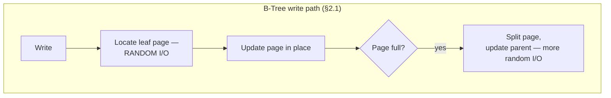
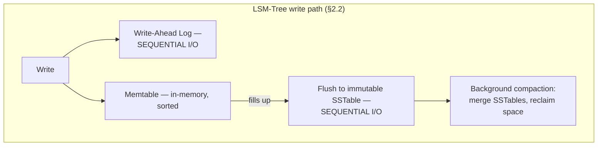
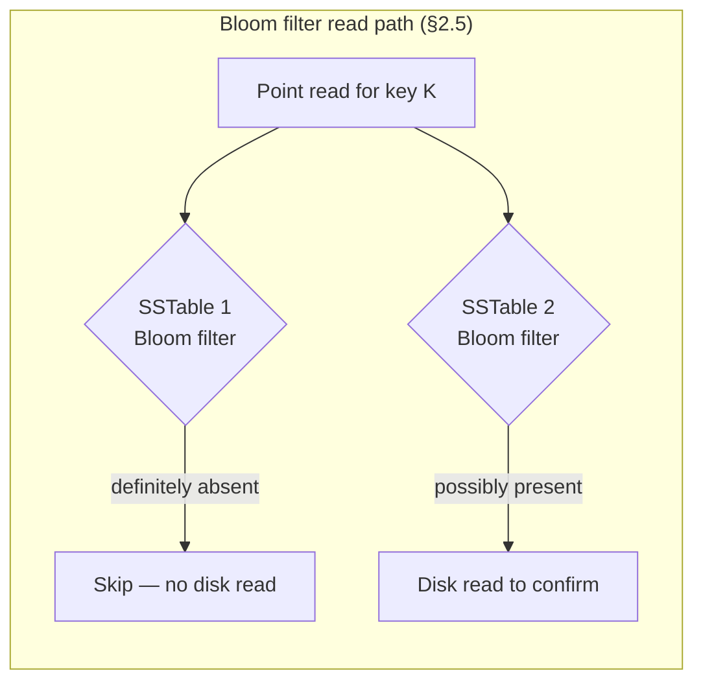
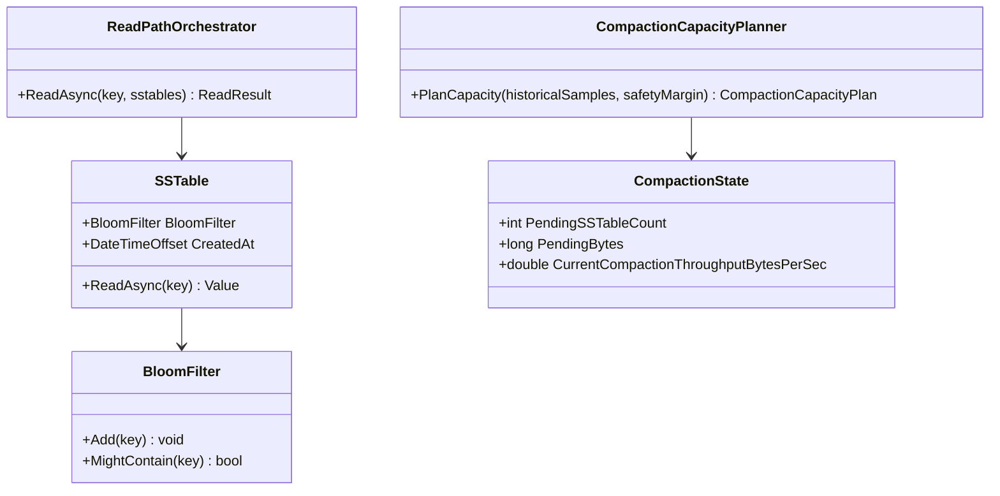

# Module 148 — Distributed Systems: Storage Engine Internals — LSM-Trees vs. B-Trees & Bloom Filters

> Domain: Distributed Systems | Level: Beginner → Expert | Prerequisite: [[../04-SQL-Server/01-Indexing-Query-Optimization]] (B-tree indexes as SQL Server's on-disk structure — this module makes that structure's trade-offs explicit and compares it against the alternative), [[../14-System-Design/10-Designing-Market-Data-Distribution-Platform]] (the high-volume tick-ingestion workload this module's incident extends), [[03-PACELC-Consistency-Models-SplitBrain]] (the consistency-model vocabulary this module's read-path discussion assumes)

>
> **Scope note:** Third of four modules extending `16-Distributed-Systems` toward a 6-module scope. Full 16-section template; Elite FinTech Interview Panel lens.

---

## 1. Fundamentals

**What:** The two dominant on-disk data structures underlying nearly every database this course has discussed — B-trees (SQL Server, PostgreSQL, most traditional RDBMS indexes) and LSM-trees, Log-Structured Merge-Trees (Cassandra, RocksDB, LevelDB, and the storage layer beneath many high-write-throughput NoSQL and time-series stores) — plus Bloom filters, the specific mechanism that makes LSM-tree reads tractable despite the structural cost their write-optimized design otherwise imposes.

**Why:** Every database this course has covered inherits its actual performance characteristics — not from its query language or its consistency model, but from which of these two structures it stores data in. A B-tree and an LSM-tree make fundamentally different, physically-grounded trade-offs between write cost, read cost, and space cost, and no configuration or tuning eliminates the trade-off — it only shifts where its cost lands. Understanding this is what separates "this database is slow" from a precise, actionable diagnosis of which specific cost the workload is paying and why.

**When:** Whenever choosing a database for a new workload, diagnosing a performance problem in an existing one, or explaining *why* a given store behaves the way it does under a specific access pattern — not merely reciting that "Cassandra uses LSM-trees" as an isolated fact.

**How (30,000-ft view):**
```
WRITE-HEAVY, sequential-append-friendly workload         READ-HEAVY, point-lookup/range-scan workload
                    │                                                    │
                    ▼                                                    ▼
              LSM-Tree                                              B-Tree
      (memtable → WAL → SSTables → compaction)              (balanced tree, in-place page updates)
                    │                                                    │
        High write throughput, but read cost              Direct O(log n) reads, but random-I/O
        grows with un-compacted file count —               writes and page-split cost under
        mitigated by Bloom filters (§2.5)                  heavy write volume
```

---

## 2. Deep Dive

### 2.1 B-Trees — In-Place, Balanced, Directly Read-Optimized
A B-tree is a balanced, sorted tree of fixed-size pages, where every read follows a direct path from root to leaf in O(log n) page accesses — the structure this course's SQL Server and PostgreSQL modules assumed throughout. Writes modify pages **in place**: an update locates the relevant leaf page and rewrites it directly; an insert that overflows a page triggers a page split, redistributing entries across two pages and updating the parent — a structural, random-access operation. This makes B-trees excellent for read-heavy, point-lookup and range-scan workloads with moderate write volume, and imposes a real cost under heavy, sustained write load: every write is, at the physical disk level, a random-access operation, and random I/O is dramatically more expensive than sequential I/O — even on SSDs, which still incur write amplification within their own flash-translation layer for small, scattered writes.

### 2.2 LSM-Trees — Sequential Writes, Deferred Organization
A Log-Structured Merge-Tree takes the opposite approach: writes are first appended to an in-memory, sorted structure (the **memtable**) and, for durability, to an on-disk **write-ahead log (WAL)** — both purely sequential operations, no random I/O at write time at all. When the memtable fills, it's flushed to disk as an immutable, sorted file (an **SSTable** — Sorted String Table). Over time, many SSTables accumulate, and a background process called **compaction** merges them, discarding obsolete/overwritten versions and reducing the total file count. The consequence: **writes are always cheap, sequential appends**, dramatically outperforming B-trees under heavy write load — but a read for a given key may need to check the memtable *and potentially several SSTables*, since the most recent version of a key could reside in any of them, until compaction has merged them down.

### 2.3 The Amplification Triangle — You Cannot Minimize All Three
Every storage engine's design is a trade-off among three costs, and no configuration eliminates the trade-off, only relocates it (the informal shape of the RUM conjecture — Read, Update, Memory/space amplification cannot all be simultaneously minimized):
- **Write amplification** — the ratio of bytes physically written to disk versus bytes logically written by the application. LSM-trees can have *high* write amplification (10–30x is common) because compaction repeatedly rewrites the same logical data as it merges SSTables across levels; B-trees have comparatively low write amplification (closer to 1x) since updates modify existing pages in place, at the cost of that modification being random rather than sequential I/O.
- **Read amplification** — the number of disk reads needed to answer one logical read. B-trees provide direct, bounded O(log n) read amplification; LSM-trees' read amplification is variable and grows with the number of un-compacted SSTables a read must check, which is exactly what Bloom filters (§2.5) exist to reduce.
- **Space amplification** — the ratio of on-disk size to logical data size. LSM-trees temporarily retain obsolete versions until compaction reclaims them, inflating space usage between compaction cycles; B-trees suffer space amplification from page fragmentation — partially-full pages left behind by deletions and splits.

A system tuned to minimize write amplification (favoring fewer, larger compactions) tends to increase read and space amplification, and vice versa — this is not a bug to be engineered away but the fundamental physical trade-off this module's entire subject exists within.

### 2.4 Compaction Strategy — Size-Tiered vs. Leveled, and Compaction Debt
Two dominant compaction strategies make this trade-off concrete:
- **Size-tiered compaction** — SSTables of similar size are merged together as they accumulate, producing progressively larger tables. Lower write amplification (fewer total rewrite passes), but higher read and space amplification, since a read may need to check many similarly-sized tables before a large merge consolidates them.
- **Leveled compaction** — SSTables are organized into levels of exponentially increasing size, with each level fully compacted before data moves to the next; a read typically needs to check at most one table per level. Higher write amplification (data is rewritten more times as it moves through levels), but bounded, more predictable read amplification.

**Compaction debt** — the backlog of un-compacted SSTables awaiting merge — is the operational failure mode specific to LSM-trees: if the write rate sustained exceeds what background compaction can keep pace with, the SSTable count (and therefore read amplification) grows without bound, and unlike most failure modes this course has covered, it does so **with no error at any stage** — writes continue succeeding, reads continue returning correct results, only progressively slower, exactly this domain's recurring silent-failure shape.

### 2.5 Bloom Filters — Making LSM-Tree Reads Tractable
A Bloom filter is a probabilistic, space-efficient set-membership structure, one maintained per SSTable, that lets a read **skip files that provably do not contain the sought key** — without needing to touch disk at all for those files. Mechanically: `k` independent hash functions map a key into positions in an `m`-bit array; on insert, all `k` positions are set to 1; on a membership check, if *any* of the `k` positions is 0, the key is **definitely absent** (no false negatives, ever); if all `k` positions are 1, the key is **possibly present** (a false positive is possible — the bits could have been set by other keys' hashes colliding) requiring an actual disk read to confirm. The false-positive rate is tunable via the ratio of bits to expected entries and the number of hash functions, and — critically, §14's incident — **degrades non-linearly, not gracefully, as bits-per-key decreases below the range the filter was actually sized for**, meaning a seemingly-modest memory-saving reduction in filter size can produce a much larger-than-expected increase in disk reads.

### 2.6 Matching Storage Engine to Workload — Where Each Course Module's Store Actually Falls
SQL Server and PostgreSQL's clustered/nonclustered indexes (Module 04) are B-tree-based, matching their design for transactional, read-heavy, strongly-ordered OLTP workloads with moderate write volume. Cassandra, RocksDB (embedded in many systems this course has referenced), and much of DynamoDB's underlying storage layer are LSM-tree-based, matching them to the high-volume, write-heavy ingestion workloads this course's Event-Driven Architecture and market-data modules assume — a tick-data ingestion pipeline (Module 130) is architecturally the textbook LSM-tree use case, and §4's incident is precisely what happens when that match is made correctly at the architectural level but the operational discipline LSM-trees specifically require (compaction capacity planning) is not.

---

## 3. Visual Architecture







---

## 4. Production Example

**Problem:** A tick-data ingestion pipeline (directly extending Module 130's market-data distribution platform) migrated its instrument-quote storage from a B-tree-backed relational store to Cassandra's LSM-tree engine, correctly reasoning that sustained high-volume writes — the defining characteristic of tick data — were exactly the workload LSM-trees are architecturally optimized for.

**Architecture:** Leveled compaction, sized and load-tested against measured *steady-state average* write throughput, with background compaction thread pool capacity provisioned to comfortably keep pace under that average load.

**Implementation:** The system performed correctly and comfortably for months under normal trading-hours volume, with compaction keeping SSTable counts low and read latency for "latest quote" point-lookups consistently in the single-digit-millisecond range.

**Trade-offs:** Provisioning compaction capacity against average rather than peak throughput was a deliberate cost decision — provisioning for a rare peak's full multiplicative surge, mirroring Module 129's own revaluation-workload framing, was judged unnecessarily expensive against the observed steady-state pattern.

**Lessons learned:** At market open, tick volume surged roughly 15x baseline for approximately twenty minutes — a well-understood, entirely expected pattern for this domain, but one the compaction-capacity provisioning decision had implicitly assumed away. Memtable flushes correspondingly spiked, producing SSTables far faster than the leveled-compaction background threads — provisioned for average, not surge, load — could merge. SSTable count for the most actively-traded instruments grew rapidly during the surge window, and read amplification grew directly with it: a point-lookup for "latest quote" that normally checked one or two SSTables now needed to check a dozen or more.

Bloom filters (§2.5) correctly, efficiently skipped files that provably didn't contain a given instrument's data — but for the highest-volume instruments, generating the most writes and therefore the most SSTables during the surge, the filters correctly indicated "possibly present" for many of those same files, since the instrument genuinely *did* have recent data in most of them, requiring an actual disk read to retrieve the correct, most-current version from among several candidates. The Bloom filters were functioning exactly as designed; the underlying SSTable proliferation itself, driven by unmatched compaction capacity, was the actual problem they could not solve.

Read latency for "latest quote" queries against the highest-volume instruments — precisely the instruments most actively traded and therefore most consequential to get right — grew from single-digit milliseconds to several hundred milliseconds during the surge window, with no error at any layer: writes succeeded, reads returned correct data, only progressively slower. A downstream risk-calculation service, configured with a fixed read timeout tuned against normal-condition latency, began timing out specifically on the highest-volume instruments and falling back to its last successfully-cached price — a designed, intentional fallback behavior, not a failure — silently understating exposure specifically for the instruments generating the most trading activity, exactly during the twenty-minute window of highest genuine risk.

The generalizable pattern, directly echoing Module 140 §4's finding: **degradation concentrated exactly where correctness mattered most**, because the instruments driving the write surge (and therefore the read-amplification spike) were the same instruments the risk system most needed current data for — a directional bias, not a random one.

The fix had three parts. **First**, compaction capacity was re-provisioned against measured *peak* surge throughput rather than steady-state average, applying Module 129's multiplicative-workload lesson directly to storage-engine capacity planning. **Second**, the highest-write-volume instruments' table was switched from leveled to a hybrid strategy accepting higher write amplification specifically to bound read amplification more predictably during surge windows, since read latency — not write cost — was the metric with real downstream consequence for this specific workload. **Third**, compaction debt (pending-SSTable count, bytes awaiting compaction) was added as a first-class, three-boundary-alerted metric (Module 141's established pattern, applied here) — a sustained-rise alert on compaction debt would have flagged the surge's effect *before* read latency itself became customer-visible, exactly the leading-indicator principle this course has established repeatedly.

---

## 5. Best Practices
- Provision compaction capacity against measured peak/surge throughput, not steady-state average, for any write-heavy workload with known volume spikes (§4).
- Monitor compaction debt (pending SSTable count/bytes) as a first-class, three-boundary-alerted leading indicator, not only resulting read latency after the fact (§4's fix).
- Choose leveled compaction for workloads where predictable, bounded read latency matters more than minimizing write amplification, and size-tiered where the reverse holds (§2.4).
- Size Bloom filters against measured false-positive-rate requirements directly, never purely against a memory budget without checking the resulting rate (§2.5, §14).
- Match storage engine (B-tree vs. LSM-tree) to the workload's actual read/write ratio and volume pattern, not to a general preference for either technology (§2.6).
- Canary any Bloom filter or compaction-strategy configuration change against a limited blast radius before full rollout, given how non-linearly these parameters can affect production latency (§14).

## 6. Anti-patterns
- Provisioning LSM-tree compaction capacity against average rather than peak write throughput for a workload with known, predictable surges (§4's incident).
- Reducing Bloom filter bits-per-key purely for memory savings without verifying the resulting false-positive rate against the actual, non-linear degradation curve (§14).
- Monitoring only resulting read latency, missing compaction debt as the earlier, more actionable leading indicator (§4).
- Assuming LSM-tree migration alone solves a write-throughput problem without also budgeting for the compaction operational discipline it specifically requires (§2.4, §4).
- Treating B-trees and LSM-trees as interchangeable "just a database," missing that the underlying structure determines fundamentally different cost trade-offs for a given workload.
- Rolling out a storage-engine configuration change (compaction strategy, Bloom filter sizing) to full production without a canary stage, given the demonstrated non-linear latency sensitivity to these parameters (§14).

---

## 7. Performance Engineering

**CPU/Memory:** Compaction is CPU- and I/O-bandwidth-intensive; under-provisioning it relative to write volume is precisely §4's failure mechanism. Bloom filters trade memory for reduced disk I/O — the central, tunable trade-off §14's incident got wrong.

**Latency:** LSM-tree read latency is a direct function of read amplification, which itself is a function of compaction debt (§2.4) — making compaction health the actual leading indicator for read-latency risk, not read latency itself.

**Throughput:** LSM-trees provide dramatically higher sustained write throughput than B-trees for the same hardware, precisely because writes are sequential rather than random — the entire architectural rationale for choosing them for high-volume ingestion.

**Scalability:** Compaction capacity must scale with peak, not average, write throughput for any workload with meaningful volume variance (§4) — a capacity-planning lesson directly reusing Module 129's multiplicative-workload framing at the storage-engine layer.

**Benchmarking:** Benchmark read latency under *sustained peak write load with realistic compaction backlog*, not against an idle or freshly-compacted table, since §4 shows the failure specifically manifests under exactly that combined condition.

**Caching:** A row-cache or key-cache layered above the storage engine can absorb read pressure for hot keys during a compaction-debt episode, providing a complementary mitigation distinct from and additional to compaction capacity itself.

---

## 8. Security

**Threats:** Compaction-debt-driven latency degradation can itself function as an unintentional denial-of-service vector if an attacker can induce a sustained write surge deliberately targeting compaction capacity; Bloom filter false-positive-rate misconfiguration is not itself a security risk but a performance one, since false positives never produce incorrect data, only extra disk reads.

**Mitigations:** Write-rate limiting and per-client quotas (Module 141 §2.4's producer-quota discipline) as a defense against both legitimate surges and adversarially-induced ones; compaction-debt monitoring doubling as an early indicator of either condition.

**OWASP mapping:** Denial of service via write-volume flooding specifically targeting an under-provisioned compaction pipeline.

**AuthN/AuthZ:** Standard write-path authorization; not specifically implicated by this module's storage-engine-internal concerns.

**Secrets:** Not directly implicated.

**Encryption:** Standard at-rest encryption for SSTables and WAL files; compaction processes must correctly re-encrypt merged output, a detail worth explicitly verifying in any encrypted-at-rest LSM-tree deployment.

---

## 9. Scalability

**Horizontal scaling:** LSM-tree-based stores (Cassandra, DynamoDB) typically scale write throughput horizontally by partitioning across nodes, each independently managing its own compaction — meaning compaction-capacity planning must be done per-partition/per-node, not only in aggregate, since a hot partition can locally exhaust compaction capacity even while the cluster's aggregate capacity looks healthy.

**Vertical scaling:** Adding CPU/IO bandwidth to a single node's compaction process helps directly, up to the node's own hardware ceiling.

**Caching:** §7 — a row/key cache absorbing hot-key read pressure during compaction-debt episodes.

**Replication/Partitioning:** Partition skew (Module 141 §2.3's established concept) manifests specifically as compaction-debt skew in an LSM-tree-based store — a hot partition accumulates SSTables and read amplification independently of the cluster's overall health, exactly the "some partitions overloaded while others idle" pattern this course has repeatedly identified.

**Load balancing:** Read routing that's unaware of per-partition compaction-debt state can route reads to a degraded partition without any load-balancer-visible signal that partition is currently slow, since nothing about the partition is "down" — only progressively slower, this domain's recurring silent-degradation shape.

**High Availability:** A node experiencing severe compaction debt remains fully available by every conventional health check (Module 142 Expert Q4's local-health-versus-actual-performance gap, recurring here) while its actual read performance has substantially degraded.

**Disaster Recovery:** Compaction state itself (which SSTables exist, their level assignments) is part of a node's recoverable state; a DR failover to a node that hasn't compacted as aggressively inherits that node's current compaction debt, worth including in Module 142's derived-artifact RPO audit discipline.

**CAP theorem:** Orthogonal to this module's subject — LSM-tree versus B-tree is a storage-engine choice independent of a system's CAP/PACELC classification, though LSM-tree-based stores are frequently paired with PA/EL-classified systems (Cassandra) since both independently favor high write throughput and availability.

---

## 10. Interview Questions

### Basic (10)

1. **Q: What is the fundamental structural difference between a B-tree and an LSM-tree's write path?**
   **A:** A B-tree updates pages in place, requiring random I/O; an LSM-tree appends writes sequentially to an in-memory memtable and a write-ahead log, deferring on-disk organization to background compaction (§2.1, §2.2).
   **Why correct:** States the core mechanical difference driving every downstream trade-off.
   **Common mistakes:** Describing the difference only in terms of "SQL vs. NoSQL," missing that the actual distinction is the physical write path, independent of query language.
   **Follow-ups:** "Which is better for high write-volume ingestion, and why?" (LSM-trees — sequential I/O is dramatically cheaper than the random I/O B-tree writes require, §2.2.)

2. **Q: What is an SSTable?**
   **A:** An immutable, sorted, on-disk file produced when an LSM-tree's memtable is flushed — Sorted String Table (§2.2).
   **Why correct:** States the definition and its role in the LSM-tree write path.
   **Common mistakes:** Assuming SSTables are mutable or updated in place, when their immutability is precisely what makes background compaction (rather than in-place modification) necessary.
   **Follow-ups:** "What merges multiple SSTables back down?" (Compaction — a background process reducing SSTable count and reclaiming space from obsolete versions, §2.2, §2.4.)

3. **Q: What is compaction debt?**
   **A:** The backlog of un-compacted SSTables awaiting merge, growing when sustained write rate exceeds background compaction's capacity to keep pace — the specific LSM-tree operational failure mode, with no error at any stage, only progressively growing read amplification (§2.4).
   **Why correct:** States the mechanism and its silent-failure characteristic.
   **Common mistakes:** Assuming an overloaded LSM-tree store would error or reject writes, when writes continue succeeding throughout — only reads slow down.
   **Follow-ups:** "What's the leading indicator that should be monitored before read latency itself degrades?" (Compaction debt (pending SSTable count/bytes) directly, per §4's fix.)

4. **Q: What guarantee does a Bloom filter make about false negatives?**
   **A:** None are possible — if a Bloom filter says a key is absent, it is definitely, provably absent; only false positives ("possibly present" when actually absent) are possible (§2.5).
   **Why correct:** States the asymmetric guarantee precisely.
   **Common mistakes:** Assuming Bloom filters can produce incorrect "absent" results, which would make them unsafe to use for the specific purpose (skipping SSTable reads) they're designed for.
   **Follow-ups:** "What happens on a false positive?" (An unnecessary disk read occurs to confirm the key is actually absent — a performance cost, never a correctness error, §2.5.)

5. **Q: Name the three components of the amplification triangle.**
   **A:** Write amplification (bytes physically written versus logically written), read amplification (disk reads needed per logical read), and space amplification (on-disk size versus logical data size) — no configuration minimizes all three simultaneously (§2.3).
   **Why correct:** Names all three and states the fundamental trade-off between them.
   **Common mistakes:** Believing a sufficiently well-tuned system can minimize all three at once, rather than recognizing this as a structural, physical trade-off.
   **Follow-ups:** "Which does size-tiered compaction favor, and which does it cost?" (Favors lower write amplification; costs higher read and space amplification, §2.4.)

6. **Q: What went wrong in §4's incident, at a high level?**
   **A:** Compaction capacity was provisioned against steady-state average write throughput; a 15x market-open volume surge caused SSTables to accumulate faster than compaction could merge them, growing read amplification and latency specifically for the highest-volume instruments — with no error anywhere until downstream timeouts and stale-fallback reads silently understated risk exposure (§4).
   **Why correct:** States the provisioning mismatch and its consequence.
   **Common mistakes:** Attributing this to a Bloom filter failure, when the filters functioned correctly throughout — the underlying SSTable proliferation itself was the problem.
   **Follow-ups:** "What was the fix?" (Provisioning compaction capacity against peak, not average, throughput, plus first-class compaction-debt alerting, §4's fix.)

7. **Q: Why are B-tree indexes a good fit for SQL Server and PostgreSQL's typical OLTP workloads?**
   **A:** These workloads are typically read-heavy and moderate-write, with strong requirements for direct, bounded O(log n) reads and in-order range scans — exactly what B-trees provide, at an acceptable random-I/O write cost given the moderate write volume (§2.1, §2.6).
   **Why correct:** Connects the workload shape to the structural advantage B-trees provide for it.
   **Common mistakes:** Assuming B-trees are simply "the older, worse technology," rather than recognizing they're well-matched to a specific, common workload shape.
   **Follow-ups:** "When would this same workload be poorly served by a B-tree?" (Under sustained, very heavy write volume, where random-I/O write cost becomes the dominant bottleneck — the LSM-tree's actual advantage case, §2.6.)

8. **Q: What is leveled compaction, and what does it optimize for relative to size-tiered compaction?**
   **A:** SSTables are organized into levels of exponentially increasing size, each level fully compacted before data moves to the next, bounding a read to roughly one table check per level — optimizing for predictable, lower read amplification at the cost of higher write amplification, the opposite trade-off from size-tiered compaction (§2.4).
   **Why correct:** States the mechanism and the specific trade-off direction.
   **Common mistakes:** Assuming one compaction strategy is universally better, rather than recognizing each favors a different point on the amplification triangle.
   **Follow-ups:** "Which strategy did §4's fix choose for the high-write-volume table, and why?" (A hybrid favoring bounded read amplification, since read latency — not write cost — was the metric with real downstream consequence for that specific workload, §4.)

9. **Q: What happened in §14's incident?**
   **A:** Bloom filter bits-per-key were reduced to save memory, reasoning that false positives only cause extra, harmless disk reads — but the false-positive rate degrades non-linearly below a certain bits-per-key threshold, so the change produced a much larger-than-expected increase in disk reads, effectively negating most of the filter's benefit (§14).
   **Why correct:** States the mechanism — non-linear degradation — and why the reasoning that motivated the change was locally plausible but globally wrong.
   **Common mistakes:** Assuming any Bloom filter size reduction produces a proportionally small, predictable increase in false positives, missing the non-linear relationship.
   **Follow-ups:** "How was this caught before full rollout?" (A canary rollout limiting blast radius, catching the latency degradation before it affected the full production estate, §14.)

10. **Q: Why did §4's read-amplification problem concentrate specifically on the highest-volume, most actively-traded instruments?**
    **A:** The instruments generating the most writes were also the ones generating the most SSTables during the surge, and therefore the ones whose reads needed to check the most files — a directional bias where degradation concentrated exactly where correctness mattered most, echoing Module 140 §4's finding (§4).
    **Why correct:** Connects the mechanism (more writes → more SSTables → more read amplification) to why it specifically affected the highest-stakes instruments.
    **Common mistakes:** Assuming degradation under load is uniformly distributed across all data, missing that write-volume-driven degradation specifically concentrates on the highest-write-volume keys.
    **Follow-ups:** "Where else in this course does this same directional-bias pattern appear?" (Module 140 §4's dropped-late-data incident — missing data was directionally biased toward normality, understating exactly the volume spike that should have triggered an alert.)

### Intermediate (10)

1. **Q: Walk through why §4's incident occurred despite the LSM-tree migration being architecturally the correct choice for this workload.**
   **A:** The migration correctly matched the storage engine (LSM-tree) to the workload's defining characteristic (high write volume) — that part of the decision was sound. The failure was in a *separate*, subsequent decision: capacity-provisioning compaction against average rather than peak throughput, which is an operational/capacity-planning choice independent of whether LSM-trees were the right architectural fit in the first place. Choosing the right storage engine and correctly provisioning its operational requirements are two distinct decisions, and getting the first right doesn't guarantee the second is also handled correctly.
   **Why correct:** Separates the architecture-choice decision from the capacity-provisioning decision, showing the incident is specifically about the latter.
   **Common mistakes:** Concluding the LSM-tree migration itself was a mistake, when the actual gap was a downstream provisioning decision that could equally have been made incorrectly for a workload on any storage engine.
   **Follow-ups:** "What would a correctly-provisioned equivalent B-tree-based system have looked like under the same 15x surge?" (Write latency, not read latency, would have degraded — B-tree writes are the random-I/O-bound operation, so a surge would manifest as write-path contention rather than LSM-tree's specific compaction-debt/read-amplification pattern — the same underlying capacity-mismatch problem, manifesting through a structurally different symptom.)

2. **Q: Design the compaction-debt alerting §4's fix requires, following Module 141's three-boundary pattern.**
   **A:** Three distinct alerts: sustained rise in pending-SSTable count or bytes regardless of magnitude (earliest signal, indicating compaction is persistently falling behind write rate); pending-compaction volume exceeding a threshold correlated with measurably elevated read amplification (a read-latency-risk alert, since this is where downstream consequence begins); and a catch-up-capacity alert analogous to Module 141's third boundary, estimating whether current compaction throughput, sustained, would ever actually clear the backlog before it grows further.
   **Why correct:** Directly maps Module 141's three-boundary lag-alerting structure onto compaction debt, which is structurally the same "position, not error" signal this course has established for consumer lag and replication lag.
   **Common mistakes:** Alerting only on a single, absolute pending-SSTable-count threshold, missing the sustained-rise and catch-up-capacity distinctions that give earlier, more actionable warning.
   **Follow-ups:** "Why is compaction debt structurally the same kind of signal as consumer lag?" (Both are a growing backlog with no error state at any point — the underlying mechanism differs, but the monitoring discipline that correctly catches problems early is identical, Module 141 §2.1's "position, not error" framing.)

3. **Q: Critique reducing Bloom filter bits-per-key purely to save memory, evaluating the reasoning §14's team used.**
   **A:** The reasoning ("false positives only cause extra disk reads, never incorrect results") is true and simultaneously insufficient — it correctly establishes that the change is *safe* (no correctness risk) but says nothing about *how much* extra disk-read cost results, which is precisely where the non-linear degradation curve matters. A safe-but-unbounded-cost change is not automatically a low-risk change; the missing step was quantifying the expected false-positive-rate increase against the specific bits-per-key reduction being proposed, not merely confirming the change category (memory-for-reads trade-off) was theoretically sound.
   **Why correct:** Distinguishes "correctness-safe" from "cost-bounded," identifying the specific missing quantification step.
   **Common mistakes:** Concluding the team's reasoning was simply wrong, when it was correct as far as it went — the gap was incompleteness, not incorrectness.
   **Follow-ups:** "What quantification step would have caught this before rollout?" (Computing or measuring the actual expected false-positive rate at the proposed bits-per-key value against the standard formula/curve, then load-testing the resulting read-amplification impact before any production rollout — exactly what the eventual canary stage did, but earlier and more cheaply.)

4. **Q: How does compaction-debt skew (§9) manifest differently from the read-amplification pattern in §4's incident?**
   **A:** §4's incident was a *global*, cluster-wide surge affecting the write-heaviest instruments broadly during a known, time-bound event (market open); compaction-debt skew is a *per-partition* phenomenon where one hot key or hot partition accumulates disproportionate SSTables and read amplification independent of the cluster's aggregate health — meaning aggregate compaction-capacity metrics could look entirely healthy while one specific partition is severely degraded, a distinction requiring per-partition, not only aggregate, monitoring to detect.
   **Why correct:** Distinguishes the global-surge case from the partition-skew case, both producing similar symptoms through different mechanisms requiring different monitoring granularity.
   **Common mistakes:** Assuming cluster-aggregate compaction-debt monitoring is sufficient, missing that a single hot partition's debt can be invisible in an averaged, cluster-wide metric.
   **Follow-ups:** "What would surface partition-level compaction debt specifically?" (Per-partition (or per-node, depending on the store's architecture) compaction-debt metrics, not only a cluster-wide aggregate — directly reusing Module 141 §2.3's per-partition-lag diagnostic principle.)

5. **Q: How should a team decide between size-tiered and leveled compaction for a new high-write-volume table, synthesizing §2.4 and §4?**
   **A:** The decision should be driven by which amplification cost the specific downstream consumer is most sensitive to: if read latency has direct, consequential downstream impact (§4's risk-calculation service, needing current data quickly), leveled compaction's bounded read amplification is worth its higher write-amplification cost; if the table is write-heavy with read patterns tolerant of higher, more variable latency (an archival or batch-consumed table), size-tiered compaction's lower write amplification is the better trade. The decision is workload-specific, not a universal default in either direction.
   **Why correct:** Ties the compaction-strategy decision to the specific downstream consequence of each amplification type, rather than treating one strategy as generally superior.
   **Common mistakes:** Choosing a default compaction strategy uniformly across all tables regardless of each table's specific read-latency sensitivity.
   **Follow-ups:** "Could a table's correct choice change over its lifetime?" (Yes — §4's own fix involved switching an existing table's strategy once its actual read-latency sensitivity became clear under real production load, suggesting compaction-strategy choice should be periodically re-evaluated, not fixed permanently at initial design time.)

6. **Q: Apply this course's "declared ≠ actual" theme to §4's incident.**
   **A:** The declared claim was "this store provides fast reads" — validated and true under the tested condition (steady-state load, freshly-compacted tables). The actual, narrower truth was "fast reads, provided compaction has kept pace with write volume" — a precondition the declared claim never stated explicitly, and which held throughout normal testing but silently failed during exactly the surge condition the claim needed to be true for.
   **Why correct:** Identifies the implicit, untested precondition (compaction having kept pace) hidden inside the broader, unqualified "fast reads" claim.
   **Common mistakes:** Treating "we benchmarked this store and it's fast" as a complete, condition-independent claim, rather than one implicitly scoped to whatever load condition the benchmark actually exercised.
   **Follow-ups:** "What would make the claim precise?" (Stating the specific load condition and compaction-health assumption the latency figure was measured under — "sub-10ms reads under steady-state average load with compaction current" — rather than an unqualified "fast reads" claim.)

7. **Q: How does this module's compaction-debt finding relate to Module 141's consumer-lag discipline structurally?**
   **A:** Both are a growing backlog behind a background process (compaction; consumer catch-up) that produces no error at any stage while progressively degrading a downstream-visible metric (read latency; freshness) — the same underlying shape, occurring at the storage-engine layer here rather than the message-consumption layer. Module 141's entire monitoring philosophy (measure the backlog directly and in time/volume terms, alert on sustained rise before the downstream symptom appears, provision recovery capacity against peak not steady-state) transfers directly, as Intermediate Q2 makes concrete.
   **Why correct:** Explicitly names the structural parallel between two backlogs at different architectural layers, both exhibiting this domain's recurring silent-degradation shape.
   **Common mistakes:** Treating compaction debt as an unrelated, storage-engine-specific concern rather than recognizing it as the identical underlying pattern this course has already extensively developed for message-consumption lag.
   **Follow-ups:** "Is there a 'catch-up burst' equivalent for compaction debt, mirroring Module 141 §4's thundering-herd finding?" (Yes — aggressive catch-up compaction, once capacity is restored, can itself consume disproportionate CPU/IO bandwidth, competing with ongoing foreground reads/writes — worth throttling similarly to Module 141's rate-limited catch-up discipline.)

8. **Q: How would you determine whether a given production read-latency problem is caused by compaction debt versus some other cause (network, application logic, downstream dependency)?**
   **A:** Check compaction-debt metrics (pending SSTable count/bytes) directly and correlate their trend against the read-latency degradation's timeline — a genuine compaction-debt-driven slowdown shows both metrics rising together, with read latency for the specific keys/partitions experiencing the highest recent write volume disproportionately affected (§4's directional-bias signature), distinguishing it from a network or downstream-dependency issue, which would typically affect reads more uniformly regardless of which keys were recently written.
   **Why correct:** Gives a specific, discriminating diagnostic signature (correlated compaction-debt rise, plus write-volume-correlated read-latency distribution) rather than a generic "check the metrics" answer.
   **Common mistakes:** Diagnosing read-latency problems only by looking at read-latency metrics themselves, without cross-referencing the compaction-specific leading indicator that would have distinguished this cause from others.
   **Follow-ups:** "What tooling would make this correlation easy to perform quickly during an incident?" (A dashboard plotting per-partition compaction debt alongside per-partition read latency on the same timeline, making the correlation visually immediate rather than requiring manual cross-referencing during time-pressured incident response.)

9. **Q: How does §14's Bloom filter incident relate to Module 144's chaos-engineering and canary-testing discipline?**
   **A:** §14's incident was specifically caught by a canary rollout limiting blast radius before full production deployment — a direct application of Module 128's canary-gate pattern and Module 144's "inject the condition, not the symptom" discipline, applied here to a storage-engine configuration change rather than an application code deployment. This reinforces Module 144's broader point that testing discipline must extend to infrastructure and configuration changes, not only application logic — a Bloom filter bits-per-key change is exactly the kind of "looks like a safe tuning parameter" change that a canary stage exists to validate against real production load before full exposure.
   **Why correct:** Connects the specific detection mechanism (canary rollout) to established prior modules' governance patterns, extending them to storage-engine configuration specifically.
   **Common mistakes:** Treating storage-engine tuning parameters as exempt from the canary/chaos-testing discipline this course has established for application-level changes, when §14 shows the same non-linear, hard-to-predict-analytically risk applies equally here.
   **Follow-ups:** "What would a chaos experiment (rather than just a canary) specifically targeting this risk class look like?" (Deliberately reducing Bloom filter bits-per-key in a controlled, non-production-critical environment and measuring the actual resulting false-positive rate and read-amplification impact directly, building an empirical curve rather than relying on formula-based estimation alone.)

10. **Q: Synthesize how this module extends Module 04's SQL Server indexing content.**
    **A:** Module 04 established B-tree indexes as SQL Server's on-disk structure and their read/write performance characteristics within that specific product; this module generalizes the underlying trade-off (in-place, random-I/O writes versus direct, bounded reads) into the broader amplification-triangle framework (§2.3) and contrasts it explicitly against the LSM-tree alternative most NoSQL and high-write-throughput stores in this course's other domains (Cassandra, DynamoDB's underlying engine) actually use — giving a single, unified vocabulary for reasoning about storage-engine trade-offs across every database this course has covered, rather than learning each product's characteristics as an independent, unconnected fact.
    **Why correct:** States precisely what Module 04 covered within one product and what this module adds as a cross-product, structural generalization.
    **Common mistakes:** Treating B-tree performance characteristics as a SQL-Server-specific fact rather than recognizing them as one instance of a general structural trade-off applicable to understanding any B-tree-based system.
    **Follow-ups:** "Which other course modules' storage choices does this module's framework now let you explain more precisely?" (Module 08's DynamoDB (LSM-tree-based underlying storage), Module 130's market-data platform's own storage-tier choices, and Module 19's future Kafka content's log-structured, append-only design — all instances of the same sequential-write-optimized family this module formalizes.)

### Advanced (10)

1. **Q: Diagnose §4's incident and design the complete structural fix.**
   **A:** Root cause: compaction capacity provisioned against steady-state average write throughput, insufficient for a well-understood, predictable 15x market-open surge, causing SSTable accumulation and read-amplification growth concentrated on the highest-write-volume (and most consequential) instruments, with no error anywhere until downstream timeout-driven stale fallbacks silently understated risk exposure. Fix: (1) compaction capacity re-provisioned against measured peak, not average, throughput (Module 129's multiplicative-workload lesson applied here, §4); (2) the highest-write-volume table's compaction strategy shifted to bound read amplification specifically, accepting higher write amplification as the acceptable trade given this workload's actual consequence profile (Intermediate Q5); (3) compaction debt added as a first-class, three-boundary-alerted leading indicator (Intermediate Q2), giving warning before read latency itself becomes customer-visible.
   **Why correct:** Addresses the capacity-provisioning gap, the compaction-strategy mismatch, and the missing leading-indicator monitoring as three distinct, individually necessary fixes.
   **Common mistakes:** Fixing only the compaction-capacity provisioning (point 1) without also adding leading-indicator monitoring (point 3), leaving the team blind to the *next* unanticipated surge pattern until it, too, becomes customer-visible.
   **Follow-ups:** "Why is point 2 necessary given point 1 already addresses the capacity shortfall?" (Point 1 addresses this specific, known surge pattern; point 2 provides a structural, workload-shape-appropriate hedge against future, less-predictable surges that even generous peak-capacity provisioning might not fully anticipate.)

2. **Q: A team proposes eliminating compaction-debt risk entirely by over-provisioning compaction capacity to several multiples of any conceivable peak. Evaluate.**
   **A:** This trades away the LSM-tree's core cost advantage — its high write throughput at low resource cost relative to B-trees — for a much larger, mostly-idle compaction capacity footprint, incurring substantial ongoing infrastructure cost for protection against a risk that correctly-calibrated peak-based provisioning (Advanced Q1) already addresses at a fraction of the cost. This mirrors Module 141 Advanced Q3's retention-reduction critique in reverse: just as under-provisioning against steady-state alone is dangerous, wildly over-provisioning "to be safe" without calibrating against an actual, measured worst case is its own form of poor capacity-planning discipline, trading a quantifiable, addressable risk for an unquantified, likely excessive cost.
   **Why correct:** Identifies the specific cost this alternative incurs and connects the reasoning error (uncalibrated over-provisioning) to an established prior pattern in this course.
   **Common mistakes:** Treating "provision generously" as an unambiguously safer choice than precisely-calibrated peak provisioning, without weighing the real, ongoing cost of the excess capacity against the marginal risk reduction it provides beyond correctly-calibrated peak sizing.
   **Follow-ups:** "What would correctly-calibrated (rather than uncalibrated-excessive) provisioning look like?" (Peak throughput measured under realistic, worst-observed-case load — including correlated conditions, mirroring Module 142 §2.4's correlated-failure RPO framing — with a reasonable, quantified safety margin, not an arbitrary multiple chosen without measurement.)

3. **Q: Design a monitoring signal that would distinguish §4's global-surge scenario from §9's per-partition compaction-debt-skew scenario, in real time during an incident.**
   **A:** Compare the *distribution* of per-partition compaction debt during the incident: a global surge (§4) shows compaction debt rising broadly and roughly proportionally across most/all partitions, correlated with a cluster-wide write-rate increase; partition skew (§9) shows compaction debt concentrated on one or a small number of partitions while the remainder stay near-baseline, with no corresponding cluster-wide write-rate spike. A dashboard displaying per-partition compaction debt as a distribution (not just an aggregate sum or average) makes this distinction immediately visible rather than requiring separate investigation to determine which scenario is occurring.
   **Why correct:** Proposes a specific, discriminating signal (per-partition distribution shape) and explains how each scenario's signature differs.
   **Common mistakes:** Relying on an aggregate, cluster-wide compaction-debt metric alone, which cannot distinguish a broad, proportional surge from a concentrated, single-partition skew — exactly the same limitation Module 141 §2.3 identified for aggregate consumer-lag metrics.
   **Follow-ups:** "Which scenario's fix differs most from the other's?" (Partition skew's fix is typically re-partitioning or key-design change to spread load more evenly (Module 141 §2.3's partition-skew remedy), fundamentally different from §4's capacity-provisioning fix — reinforcing why correct diagnosis, not just detection, matters.)

4. **Q: Critique a team's decision to benchmark a new LSM-tree-backed store's read latency only against a freshly-loaded, immediately-compacted dataset before approving it for production.**
   **A:** This benchmark validates read latency under the *best-case* compaction state — exactly the condition §4's incident shows does not persist under sustained real-world write load. A meaningful benchmark must specifically include a sustained-write-load phase followed by a measurement phase *without* an intervening full manual compaction, simulating the realistic, continuously-evolving compaction state a production system actually experiences, including deliberately testing under a simulated peak-surge condition if the workload has one (§4's exact gap).
   **Why correct:** Identifies the specific unrealistic condition (freshly-compacted state) the benchmark tested under and specifies what a realistic benchmark needs to include instead.
   **Common mistakes:** Treating a passing benchmark under ideal, freshly-compacted conditions as representative of sustained production behavior, missing that compaction state itself is a variable the benchmark needs to deliberately stress.
   **Follow-ups:** "How does this relate to Module 144's replay-based testing discipline?" (Directly — a realistic compaction-state benchmark is this domain's specific instance of Module 144 §2.3's principle that testing must reflect real, not idealized, operating conditions; a freshly-compacted benchmark is architecturally the same category of error as Module 144 §2.1's mocked-integration-test blind spot, applied to storage-engine state instead of network/delivery behavior.)

5. **Q: How should Bloom filter sizing be governed to prevent recurrence of §14's incident class?**
   **A:** Any change to Bloom filter bits-per-key (or equivalent sizing parameter) should require: (1) computing the expected resulting false-positive rate against the standard formula, explicitly comparing it to the current rate rather than assuming a "small" configuration change produces a proportionally small effect; (2) a canary rollout measuring actual read-amplification and latency impact under realistic production load before full deployment (§14's actual detection mechanism); (3) treating the change with the same rigor as any other storage-engine capacity or compaction-strategy change, per Advanced Q4's benchmark-realism principle, rather than as a "just a memory optimization" low-risk tuning tweak.
   **Why correct:** Specifies concrete governance steps derived directly from what would have prevented §14's incident, generalized into a repeatable process.
   **Common mistakes:** Treating Bloom filter sizing as a purely local, low-risk tuning parameter exempt from the change-governance rigor applied to other storage-engine decisions, when §14 shows its non-linear behavior makes it exactly as risky as any other capacity-adjacent change.
   **Follow-ups:** "Why is the non-linearity specifically dangerous for this kind of governance?" (Because a reviewer's intuition, calibrated to expect proportional cause-and-effect, will systematically underestimate the risk of a seemingly-modest bits-per-key reduction — making explicit, formula-based or empirically-measured verification more important here than for parameters with more intuitively-linear behavior.)

6. **Q: A regulator asks how the firm ensures market-data read latency remains bounded during high-volume trading events. Answer, given §4's incident.**
   **A:** Describe the corrected architecture: compaction capacity provisioned against measured peak surge throughput specifically, not steady-state average (Advanced Q1); a compaction strategy chosen to bound read amplification for the specific tables where downstream read-latency consequence is highest (Intermediate Q5); and compaction debt monitored as a first-class, three-boundary-alerted leading indicator, providing warning before customer-visible latency degradation occurs (Intermediate Q2). State the residual honestly: any storage engine's read-latency guarantee under load is conditional on compaction keeping pace with write volume, which is why compaction health is now monitored explicitly and continuously, rather than assumed from a point-in-time benchmark.
   **Why correct:** Gives the full corrected chain and states the honest, conditional nature of the underlying guarantee, consistent with this course's established answer pattern.
   **Common mistakes:** Claiming the corrected system's read latency is now unconditionally bounded, omitting that the guarantee remains conditional on compaction capacity actually being sufficient for whatever load materializes.
   **Follow-ups:** "What would indicate the current peak-based provisioning has itself become insufficient?" (A future surge exceeding the currently-provisioned peak assumption — which the three-boundary compaction-debt alerting (Advanced Q1 point 3) is specifically designed to surface as a leading indicator, before it becomes a repeat of §4.)

7. **Q: Apply this course's "verify the verifier" theme to Bloom filters themselves.**
   **A:** A Bloom filter whose hash functions are poorly distributed (clustering bit-position selections rather than spreading them uniformly) would produce a much higher actual false-positive rate than the standard formula predicts, silently degrading read performance in a way that looks, from the outside, identical to §14's bits-per-key misconfiguration but originates from an entirely different, implementation-level cause. This requires periodically, empirically measuring the *actual* false-positive rate against production data — not merely trusting the theoretical formula's prediction — exactly the same meta-verification discipline this course has applied to every other verification mechanism it has covered.
   **Why correct:** Identifies a distinct, implementation-level failure mode (poor hash distribution) that would produce symptoms similar to §14's but requires different diagnosis, and specifies the empirical verification needed to catch it.
   **Common mistakes:** Assuming the standard Bloom filter false-positive-rate formula is always an accurate predictor of real-world behavior, without empirically validating it against actual measured performance.
   **Follow-ups:** "How would you distinguish a hash-distribution problem from a bits-per-key sizing problem in practice?" (Measure actual false-positive rate against the formula's prediction for the *current* bits-per-key configuration — a significant gap between predicted and measured rate points to a hash-distribution or implementation issue, while a rate matching the formula's prediction but still too high for acceptable performance points to a sizing issue, §14's actual case.)

8. **Q: How should engineering leadership decide storage-engine capacity-planning cadence — how often should peak-throughput assumptions be re-validated?**
   **A:** Tied to the workload's own volatility: a market-data ingestion pipeline (§4) with known, recurring, but potentially-evolving peak events (market open, specific news-driven volume spikes) warrants re-validation on a cadence matched to how often the *underlying business activity* (traded volume, instrument count, client onboarding) meaningfully changes — not a fixed, arbitrary calendar interval, and explicitly re-triggered whenever a new category of surge event is anticipated (a new market opening, a new high-volume client onboarding) rather than only on a routine schedule.
   **Why correct:** Ties re-validation cadence to actual business-activity change rather than an arbitrary fixed schedule, and specifies event-triggered re-validation for foreseeable step changes.
   **Common mistakes:** Setting a fixed, infrequent re-validation calendar (e.g., annually) disconnected from the actual rate at which the underlying business volume and its peak characteristics evolve.
   **Follow-ups:** "What signal would indicate re-validation is overdue before an incident forces it?" (Compaction-debt alerting (Advanced Q1 point 3) itself, observed trending toward its boundary during genuine, organically-growing peak events even without a discrete triggering business change — a gradual signal that current peak-capacity assumptions are becoming stale relative to gradually-growing actual volume.)

9. **Q: How does this module's amplification-triangle framework relate to Module 145's capstone finding about composition risk?**
   **A:** The amplification triangle is itself a single-component (one storage engine's own internal) trade-off, not a composition-risk instance in Module 145's specific sense — but §4's incident *is* a composition-risk instance once the storage engine is considered alongside its surrounding system: the storage engine's own read-latency guarantee (correct, given compaction keeps pace) composed with a downstream consumer's fixed-timeout assumption (correct, given typical latency) produced a silent, consequential failure at their *interaction*, neither component being individually incorrect. This is a further, specific instance of Module 145's general finding, occurring at the interface between a storage engine's own honest, conditional guarantee and a downstream system's implicit assumption about that guarantee's unconditional validity.
   **Why correct:** Distinguishes the amplification triangle itself (a single-component, not composition, concern) from §4's actual incident (a composition-risk instance at the storage-engine/downstream-consumer boundary), correctly locating where Module 145's finding applies.
   **Common mistakes:** Conflating the amplification triangle's internal trade-offs with Module 145's composition-risk framework, when the two are related but analytically distinct — one is a single system's internal physics, the other is about interactions between systems.
   **Follow-ups:** "What would the Module 144-style composed test for this specific interaction look like?" (A test deliberately inducing compaction debt (via sustained write load) and verifying the downstream consumer's timeout-and-fallback behavior produces an acceptable, correctly-flagged outcome — not merely testing the storage engine's read latency or the consumer's timeout logic independently, mirroring Module 145 §11 Expert's composed-chaos-experiment structure.)

10. **Q: Synthesize the governance for storage-engine capacity planning and configuration across the organization.**
    **A:** (1) Compaction capacity provisioned against measured peak, not steady-state average, throughput for every write-heavy LSM-tree-backed table, re-validated on a cadence matched to actual business-volume evolution (Advanced Q1, Q8). (2) Compaction debt monitored as a first-class, three-boundary-alerted, per-partition (not only aggregate) leading indicator (Intermediate Q2, Advanced Q3). (3) Compaction strategy chosen per-table based on that table's specific read-latency-sensitivity profile, not a uniform organizational default (Intermediate Q5). (4) Any Bloom filter or compaction-strategy configuration change subject to explicit false-positive-rate/read-amplification quantification plus canary rollout before full deployment (Advanced Q5). (5) Benchmarks for any new storage-engine adoption explicitly include sustained-write-load and realistic (not freshly-compacted) compaction-state conditions (Advanced Q4). (6) Downstream consumers' timeout and fallback assumptions explicitly tested against induced storage-engine degradation, not only against the storage engine's and the consumer's individually-tested behavior (Advanced Q9).
    **Why correct:** Covers capacity provisioning, leading-indicator monitoring, per-table strategy selection, configuration-change governance, realistic benchmarking, and composed-interaction testing as six distinct, individually necessary controls.
    **Common mistakes:** Governing storage-engine internal tuning thoroughly while leaving the downstream-consumer composition risk (point 6) unaddressed, which is exactly where §4's actual customer-visible consequence occurred.
    **Follow-ups:** "Which single control would have most changed §4's outcome if it alone had existed beforehand?" (Point 2 — compaction-debt leading-indicator alerting — since it would have surfaced the developing problem during the surge itself, well before the downstream timeout-driven silent fallback occurred.)

### Expert (10)

1. **Q: Evaluate whether "we use an LSM-tree-based store, so write throughput is not a concern" should ever be an unqualified architectural claim.**
   **A:** No — the claim is true for the storage engine's *structural capability* (LSM-trees genuinely, architecturally support high write throughput far better than B-trees) and false as an unqualified operational guarantee, since that structural capability is realized only if compaction capacity is correctly, continuously provisioned to match actual write volume, exactly §4's gap. The precise, defensible claim is two-part: "this storage engine is structurally well-suited to high write throughput" plus "provided compaction capacity is provisioned and monitored against actual peak load" — the first half alone, though true, invites exactly the operational complacency §4's incident demonstrates.
   **Why correct:** Separates the structural-capability claim (true, unconditionally) from the operational-guarantee claim (true only conditionally), naming the specific condition that must hold.
   **Common mistakes:** Treating "LSM-tree" as itself a complete solution to a write-throughput requirement, rather than a structural enabler that still requires correct, ongoing operational capacity management to deliver on.
   **Follow-ups:** "Does an equivalent unqualified claim risk exist for B-trees?" (Yes, structurally symmetric — "B-trees provide fast, bounded reads" is unconditionally true of the structure, but degrades under page fragmentation and requires its own operational discipline (index maintenance, page-fill-factor tuning) to realize in practice, a B-tree-specific analog to this module's LSM-tree-specific finding.)

2. **Q: How does this module's compaction-debt finding change the answer to "how would you design a market-data ingestion pipeline's storage tier," building on Module 130's own treatment?**
   **A:** Module 130 established that market data separates into structurally different products (streaming, snapshots, archival) requiring different treatment; this module adds that the *streaming/ingestion* tier specifically, being the highest-write-volume component, needs its storage-engine capacity planning done against Module 129's multiplicative peak-workload framing rather than the steady-state assumptions that might be adequate for the lower-write-volume snapshot or archival tiers. This is a direct, concrete answer to a gap Module 130's own treatment didn't need to descend to this level of storage-engine-internal detail to address, since Module 130 was scoped at the system-design level rather than the physical-storage-layer level this module operates at.
   **Why correct:** Precisely locates what this module adds beyond Module 130's system-design-level treatment — the storage-engine-internal capacity-planning detail Module 130 didn't need to descend to.
   **Common mistakes:** Treating this module's findings as redundant with Module 130's, rather than recognizing them as operating at a different, complementary level of abstraction (physical storage-engine internals versus system-level architecture).
   **Follow-ups:** "Would Module 130's other two data products (snapshots, archival) benefit from this module's LSM-tree/compaction discipline equally?" (Less directly — snapshots need Module 130's own sequence-barrier consistency mechanism regardless of underlying storage engine, and archival's access pattern (infrequent, bulk, range-scan-heavy) is arguably closer to a B-tree or specialized columnar structure's sweet spot than an LSM-tree's write-optimized design, illustrating this module's own §2.6 workload-matching principle applied across Module 130's three distinct data products.)

3. **Q: Design a storage-tier architecture combining both B-tree and LSM-tree engines for a workload requiring both high-volume ingestion and complex, read-heavy downstream queries.**
   **A:** A hybrid, tiered design directly mirroring Module 34's CQRS write/read separation, applied at the storage-engine layer: an LSM-tree-based store as the ingestion/write path, optimized for the high-volume, sequential-write-friendly workload (§2.2), with a periodic ETL or streaming projection (Module 34/35's established mechanisms) populating a separate, B-tree-based store optimized for the complex, read-heavy, strongly-ordered query patterns downstream consumers actually need — cleanly separating the write-optimized and read-optimized concerns onto the storage engine each is actually suited for, rather than forcing one engine to serve both poorly.
   **Why correct:** Proposes a concrete architecture directly reusing an established prior pattern (CQRS) at a new layer (storage-engine choice rather than logical read/write model separation).
   **Common mistakes:** Assuming a single storage engine must serve both the ingestion and query workloads, when Module 34's entire premise — separating write and read concerns — applies equally well to storage-engine selection as it does to logical data-model design.
   **Follow-ups:** "What risk does this hybrid architecture reintroduce, per Module 34's own findings?" (Projection lag between the LSM-tree ingestion tier and the B-tree query tier — exactly Module 34's own established consumer-lag and reconciliation-cadence discipline, now required at the storage-engine-tier boundary as well as the logical CQRS boundary.)

4. **Q: A post-mortem on a hypothetical incident finds that a correctly-provisioned, correctly-monitored LSM-tree store still experienced a read-latency spike because compaction itself was CPU-starved by an unrelated co-located process during a specific window. Diagnose.**
   **A:** This is a resource-contention failure distinct from §4's capacity-provisioning failure — the compaction *capacity* was correctly sized for peak load, but its *actual availability* during the incident window was reduced by an unrelated, co-located process competing for the same CPU resources, a variant of Module 79/83's noisy-neighbor and CPU-throttling findings (Module 141 §14's CPU-throttled-container incident is the structurally closest prior example), now recurring specifically as a compaction-capacity-starvation mechanism rather than a message-consumption one.
   **Why correct:** Correctly distinguishes resource-contention-driven capacity starvation from capacity-provisioning insufficiency, and connects it to a structurally similar prior incident in a different domain.
   **Common mistakes:** Assuming correctly-provisioned compaction capacity guarantees compaction actually receives that capacity at runtime, missing that co-located resource contention can silently reduce *effective* available capacity below the *provisioned* capacity.
   **Follow-ups:** "What would prevent this specific failure mode?" (Dedicated, isolated resource allocation (CPU/IO reservation, Module 83's cgroups-based isolation) for compaction processes specifically, rather than best-effort shared scheduling alongside other workloads — the same noisy-neighbor mitigation Module 126 §4 applied to Outbox relay workers, now applied to compaction threads.)

5. **Q: How should Bloom filter false-positive-rate tuning interact with Module 146's PACELC/consistency-model framework?**
   **A:** They're largely orthogonal — Bloom filter tuning affects read *latency/cost*, not read *consistency*; a false positive results in an extra, unnecessary disk read that still returns a correct, current answer once the actual data is checked, never a stale or incorrect one. The two concerns intersect only indirectly: severe compaction-debt-driven read-amplification (§4) could push a system's effective latency high enough that an application-level timeout, configured for normal conditions, triggers a fallback to a cached (and therefore, per Module 146 §2.6, potentially stale) value — meaning storage-engine-internal latency degradation can indirectly *cause* a consistency-adjacent symptom (staleness) even though the storage engine's own read path never actually returned incorrect data itself.
   **Why correct:** Correctly identifies the two frameworks as largely orthogonal at the mechanism level, while precisely locating the specific, indirect pathway (timeout-triggered fallback) through which one can produce a symptom resembling the other's domain.
   **Common mistakes:** Conflating storage-engine read-latency degradation with a consistency-model violation, when the storage engine itself never returns stale or incorrect data — only slower, correct data — with staleness entering only via a separate, downstream timeout-and-fallback mechanism.
   **Follow-ups:** "Does this mean §4's incident was 'really' a consistency problem?" (No — it was a latency problem whose downstream handling (a fallback to cached data) happened to produce a consistency-adjacent symptom; correctly attributing root cause to the latency/compaction layer, not miscategorizing it as a consistency-model failure, is itself the diagnostic discipline this question is testing.)

6. **Q: A cost-optimization review proposes reducing compaction-capacity provisioning back toward steady-state average, citing eighteen months of clean results since §4's fix as evidence the peak-capacity buffer is now "clearly excessive." Evaluate.**
   **A:** Eighteen months of clean results reflects the peak-capacity provisioning successfully absorbing every surge that has actually occurred in that window — it is evidence the fix is working, not evidence the underlying peak-surge risk has disappeared or was overestimated. This is structurally identical to Module 142 Expert Q5's chaos-program-removal critique and Module 146 Expert Q7's fencing-removal critique: a clean track record from a preventive control is evidence of the control's success, not grounds for its removal, since removing it reintroduces exactly the risk the clean record demonstrates it has been successfully suppressing.
   **Why correct:** Applies the identical, now-repeatedly-established reasoning pattern (clean results from a working preventive control are not evidence the control is unnecessary) to this specific storage-engine-capacity case.
   **Common mistakes:** Treating an absence of incidents as evidence the underlying risk was overestimated, rather than as evidence the current mitigation is correctly sized and functioning.
   **Follow-ups:** "What would legitimately justify reducing this provisioning?" (Evidence the underlying peak-surge magnitude has genuinely, structurally decreased — e.g., a change in trading-venue behavior reducing market-open volume concentration — not merely the absence of incidents under the current, correctly-sized provisioning.)

7. **Q: Apply this course's "verify the verifier" theme to the compaction-debt alerting itself, given Module 147 §14's precedent of a similar alert being misclassified as noise.**
   **A:** The compaction-debt alert added in §4's remediation carries the identical risk Module 147 §14 demonstrated for a structurally similar alert (blocked tombstone pruning): it could fire correctly and still be triaged as low-priority, informational noise if its severity classification doesn't clearly distinguish a transient, self-resolving rise (normal, expected during any genuine but bounded surge) from a sustained, structural one indicating the current peak-capacity provisioning has become insufficient. The alert's own design must explicitly encode this distinction — mirroring Module 147 §14's fix directly — rather than relying on whoever triages it to correctly infer severity from a single, undifferentiated signal.
   **Why correct:** Explicitly connects to a specific, structurally similar prior incident in this same module run, and applies its exact lesson (alert-severity differentiation, not just alert existence) proactively rather than waiting for a repeat incident to force it.
   **Common mistakes:** Assuming this module's own compaction-debt alert, having been thoughtfully designed as part of §4's remediation, is automatically immune to the triage-classification risk Module 147 §14 demonstrated for a different, sibling alert in the same course run.
   **Follow-ups:** "Why is this connection worth making explicitly, rather than treating each incident's fix independently?" (Because this course's own recurring finding — a fix derived from one incident closes exactly that incident's category and no wider (Module 144 §14, Module 145's capstone) — means the compaction-debt alert, built without deliberately incorporating Module 147 §14's specific lesson, is a live candidate for repeating it, unless that connection is made proactively rather than reactively.)

8. **Q: How should a Principal Engineer weigh adopting a novel, less-mature LSM-tree implementation offering theoretically superior amplification-triangle trade-offs against a mature, widely-used one with more conservative but well-understood characteristics?**
   **A:** The theoretical trade-off improvement must be weighed against the operational-maturity cost this module's incidents illustrate throughout: §4 and §14 both occurred with a mature, widely-documented technology (implying comparable or worse surprises are plausible with a less-battle-tested implementation), and the actual failures in both cases traced to *operational and capacity-planning discipline* around the storage engine, not to the storage engine's own core algorithm being deficient — meaning a novel implementation's theoretical advantage is only realized if the *same* operational discipline (peak-based capacity planning, compaction-debt monitoring, canaried configuration changes) is also correctly built around it, which is genuinely harder to get right for an implementation with less community-accumulated operational knowledge to draw from.
   **Why correct:** Weighs the theoretical technology advantage against the demonstrated, dominant real-world risk (operational discipline gaps), which a novel implementation makes *harder*, not easier, to close.
   **Common mistakes:** Evaluating storage-engine choice purely on published amplification-triangle benchmarks, without weighing the operational-maturity cost this module's own incidents show is where the actual, dominant risk concentrates regardless of the underlying algorithm's theoretical quality.
   **Follow-ups:** "Under what condition would the novel implementation's advantage clearly justify the added operational-maturity risk?" (Where the theoretical improvement addresses a demonstrated, currently-unsolved bottleneck the mature technology genuinely cannot address at any provisioning level — not a marginal, incremental improvement on a dimension the mature technology already handles adequately once correctly operated.)

9. **Q: How does this module's central finding — that storage-engine physics determine a system's actual behavior more than its query language or product category — connect to the "declared ≠ actual" theme running through this course?**
   **A:** It is a foundational instance operating one layer below where this theme usually appears in this course: most instances involve a *claimed guarantee* diverging from *actual behavior under a specific condition* (an idempotency claim, a consistency claim); this module's instance is that the *product category itself* ("a NoSQL database," "a relational database") is frequently treated as sufficient information to predict behavior, when the actual, physically-grounded determinant — B-tree versus LSM-tree, and that engine's specific operational health at any given moment — is one layer beneath the category label, invisible to anyone reasoning only at the product-category level of abstraction.
   **Why correct:** Identifies this module's instance of the theme as occurring at the level of *category-based reasoning* itself, one layer more foundational than the claim-versus-behavior instances found elsewhere in this course.
   **Common mistakes:** Treating "SQL vs. NoSQL" or specific product names as sufficient vocabulary for reasoning about a system's actual performance characteristics, missing that the physically-grounded storage-engine structure underneath is the actual determinant.
   **Follow-ups:** "Why does this matter specifically for an Elite FinTech Interview Panel-caliber answer?" (An answer citing only "we use Cassandra because it's fast for writes" demonstrates product-level recall; naming the LSM-tree structure, the amplification-triangle trade-off it implies, and the specific operational discipline (compaction-capacity planning) it requires demonstrates the physically-grounded, first-principles depth this course's target interview bar requires.)

10. **Q: Deliver the closing synthesis: what makes storage-engine internals distinctively important to understand precisely, beyond "know your database"?**
    **A:** Three properties compound. First, **the storage engine's own physical structure, not the database product's marketing category, is the actual determinant of a workload's real performance behavior** — "NoSQL" and "SQL" are far less informative than "B-tree" versus "LSM-tree," and reasoning at the category level, as Expert Q9 shows, misses the physically-grounded mechanism entirely. Second, **LSM-trees' central operational risk (compaction debt) exhibits this domain's now-thoroughly-established silent-degradation shape** — no error at any stage, only a growing backlog whose downstream consequence (read latency) is a lagging, not leading, indicator — meaning the monitoring discipline this course built for consumer lag (Module 141) and replication lag (Module 142) transfers directly and is equally necessary here, yet is frequently the first thing overlooked when adopting a new storage technology for its headline write-throughput benefit alone. Third, **seemingly-local, low-risk-looking tuning parameters (Bloom filter sizing, compaction strategy) can have non-linear, difficult-to-intuit production consequences**, requiring the same explicit quantification, canaried rollout, and change-governance rigor this course has applied to every other consequential production change, not an exemption for "just a configuration tweak." The Principal-level conclusion: choosing and operating a storage engine correctly requires reasoning about its actual, physical write and read paths — not its marketing category — and extending this course's established leading-indicator monitoring and change-governance disciplines down to the storage-engine-internal layer, which is where a surprising number of this course's silent-degradation failure patterns turn out to recur in a new, physically-specific form.
    **Why correct:** Names three genuinely distinct compounding difficulties — category-level reasoning obscuring physical mechanism, silent-degradation recurrence at a new layer, and non-linear tuning-parameter risk — and states the actionable, physically-grounded framing conclusion.
    **Common mistakes:** Treating storage-engine internals as a narrow, specialist concern separate from the broader distributed-systems and observability disciplines this course has built, missing that the same patterns (silent degradation, leading-versus-lagging indicators, non-linear configuration risk) recur here in a new, physically-grounded form.
    **Follow-ups:** "How does this connect forward to Module 149's tail-latency and hedged-requests treatment?" (Compaction-debt-driven read-amplification is a concrete, mechanistic *cause* of exactly the kind of tail-latency degradation Module 149 addresses at the request-handling layer — this module explains one specific, storage-engine-internal reason a request's latency might land in the tail, which Module 149 then addresses from the request-handling side once such tail latency exists, regardless of its underlying cause.)

---

## 11. Coding Exercises

### Easy — Bloom Filter Implementation with Configurable Sizing (§2.5)
**Problem:** Implement a Bloom filter and expose its false-positive-rate sensitivity to sizing.
**Solution:**
```csharp
public class BloomFilter
{
    private readonly BitArray _bits;
    private readonly int _hashCount;
    private readonly int _size;

    public BloomFilter(int expectedEntries, double targetFalsePositiveRate)
    {
        _size = (int)Math.Ceiling(-expectedEntries * Math.Log(targetFalsePositiveRate) / Math.Pow(Math.Log(2), 2));
        _hashCount = (int)Math.Round((_size / (double)expectedEntries) * Math.Log(2));
        _bits = new BitArray(_size);
    }

    public void Add(string key)
    {
        foreach (var position in HashPositions(key))
            _bits[position] = true;                      // set ALL k positions (§2.5)
    }

    public bool MightContain(string key) =>
        HashPositions(key).All(p => _bits[p]);            // ANY zero bit => definitely absent

    private IEnumerable<int> HashPositions(string key)
    {
        for (int i = 0; i < _hashCount; i++)
            yield return Math.Abs((key.GetHashCode() ^ (i * 0x9E3779B9)) % _size);   // k independent-ish hash positions
    }
}
```
**Time complexity:** O(k) per add/check for k hash functions.
**Space complexity:** O(m) for m bits — independent of key size, only entry count.
**Optimized solution:** Compute and log the *actual* resulting false-positive rate at construction time against the configured `expectedEntries`, so a caller reducing `targetFalsePositiveRate` sees the resulting bit-array size grow correspondingly rather than silently accepting an under-sized filter (§14's exact gap).

### Medium — Compaction-Debt Three-Boundary Alerting (Intermediate Q2, Module 141's pattern reused)
**Problem:** Alert on compaction debt using the same three-boundary structure Module 141 established for consumer lag.
**Solution:**
```csharp
public IReadOnlyList<CompactionAlert> EvaluateCompactionHealth(CompactionState state, CompactionPolicy policy)
{
    var alerts = new List<CompactionAlert>();

    if (state.SustainedRiseMinutes > policy.RiseWindow)
        alerts.Add(CompactionAlert.FallingBehind("Pending SSTables rising and not draining"));

    if (state.PendingBytes > policy.ReadLatencyRiskThresholdBytes)
        alerts.Add(CompactionAlert.ReadLatencyRisk($"Pending {state.PendingBytes} bytes — read amplification elevated"));

    var timeToClear = state.PendingBytes / Math.Max(state.CurrentCompactionThroughputBytesPerSec, 1);
    if (timeToClear > policy.MaxAcceptableCatchUpSeconds)
        alerts.Add(CompactionAlert.WontCatchUp(                 // mirrors Module 141's third boundary
            $"At current compaction rate, backlog clears in {timeToClear}s — exceeds acceptable window"));

    return alerts;
}
```
**Time complexity:** O(1).
**Space complexity:** O(1).
**Optimized solution:** Evaluate per-partition, not only cluster-aggregate (Advanced Q3), so partition skew is distinguishable from a global surge — routing each alert type to the team best positioned to act on it.

### Hard — Peak-Calibrated Compaction Capacity Planner (Advanced Q1, Module 129's multiplicative-workload reuse)
**Problem:** Size compaction capacity against measured peak, not average, throughput.
**Solution:**
```csharp
public CompactionCapacityPlan PlanCapacity(IReadOnlyList<WriteThroughputSample> historicalSamples, double safetyMargin = 1.3)
{
    var peakThroughput = historicalSamples.Max(s => s.BytesPerSecond);      // NOT average — §4's exact gap corrected
    var requiredCompactionThroughput = peakThroughput * safetyMargin;       // headroom, quantified not arbitrary

    return new CompactionCapacityPlan(
        ProvisionedThroughputBytesPerSec: requiredCompactionThroughput,
        BasedOnPeakSample: historicalSamples.First(s => s.BytesPerSecond == peakThroughput),
        SafetyMargin: safetyMargin);
}
```
**Time complexity:** O(n) for n historical samples.
**Space complexity:** O(1).
**Optimized solution:** Re-run this planner on a cadence matched to actual business-volume evolution (Advanced Q8), and explicitly re-trigger it whenever a new category of foreseeable surge event (a new market, a large client onboarding) is anticipated, rather than relying solely on a fixed calendar schedule.

### Expert — Compacted-State-Aware Read Path with Bloom Filter Skip (§2.5, §11 Easy combined)
**Problem:** Correctly implement a multi-SSTable read path leveraging Bloom filters, demonstrating exactly where §4's read-amplification cost concentrates.
**Solution:**
```csharp
public async Task<ReadResult> ReadAsync(string key, IReadOnlyList<SSTable> sstables)
{
    int filesSkippedByBloom = 0, filesActuallyRead = 0;

    // check memtable first (§2.2) — most recent data
    if (_memtable.TryGet(key, out var memValue)) return ReadResult.Found(memValue, filesActuallyRead);

    // check SSTables newest-to-oldest — must check ALL non-skipped tables since any could hold the latest version
    foreach (var table in sstables.OrderByDescending(t => t.CreatedAt))
    {
        if (!table.BloomFilter.MightContain(key))
        {
            filesSkippedByBloom++;
            continue;                                     // provably absent — zero disk cost (§2.5)
        }

        filesActuallyRead++;                               // §4's incident: this count grows with SSTable proliferation
        var value = await table.ReadAsync(key);
        if (value is not null) return ReadResult.Found(value, filesActuallyRead);
    }

    return ReadResult.NotFound(filesActuallyRead);
}
```
**Time complexity:** O(n) Bloom-filter checks plus O(m) actual disk reads, where m ≤ n grows directly with SSTable proliferation under compaction debt — the exact mechanism §4 demonstrates.
**Space complexity:** O(1) beyond the SSTable list itself.
**Optimized solution:** Emit `filesActuallyRead` as a per-read metric, aggregated into the compaction-debt-correlated read-amplification dashboard (Advanced Q3) — making the exact mechanism this exercise demonstrates directly observable in production, not just understandable in the abstract.

---

## 12. System Design

**Functional requirements**
- Support high-volume, sequential-write-friendly ingestion for tick/event-stream data.
- Provide bounded, predictable read latency for the highest-value, most-frequently-queried keys.
- Support space-efficient, probabilistic read-path optimization via Bloom filters.

**Non-functional requirements**
- Compaction capacity provisioned and monitored against measured peak, not steady-state average, throughput (Advanced Q1).
- Compaction debt monitored per-partition with the same three-boundary discipline as consumer lag (Intermediate Q2, Advanced Q3).
- Any Bloom filter or compaction-strategy configuration change quantified and canaried before full rollout (Advanced Q5).

**Capacity estimation**
- Tick ingestion: baseline throughput plus a measured, multiplicative peak factor (15x at market open, §4) — compaction capacity sized against the peak figure with a quantified safety margin (§11 Hard).
- **The sensitivity that matters:** the ratio of provisioned compaction throughput to actual sustained peak write throughput, not either figure in isolation — a peak-provisioned system with a subsequently-larger, unanticipated surge reproduces §4's failure shape regardless of how generously the original peak was estimated.

**Architecture:** §3 — LSM-tree ingestion tier with peak-calibrated compaction capacity and Bloom-filter-accelerated reads; optionally paired with a B-tree-backed downstream query tier per Expert Q3's CQRS-inspired hybrid.

**Components:** Bloom filter with sizing-aware construction (§11 Easy); three-boundary compaction-debt alerting (§11 Medium); peak-calibrated capacity planner (§11 Hard); multi-SSTable read path with per-read amplification tracking (§11 Expert).

**Database selection:** LSM-tree-based store (Cassandra, RocksDB-backed) for the ingestion tier; B-tree-based store (SQL Server, PostgreSQL) for any downstream, read-heavy, strongly-ordered query tier.

**Caching:** A row/key cache above the storage engine absorbing hot-key read pressure specifically during compaction-debt episodes (§7).

**Messaging:** Not the primary concern; the storage engine sits downstream of whatever event-delivery mechanism (Kafka, Module 44's substrate) feeds it.

**Scaling:** Compaction capacity scales per-partition/per-node; partition-level skew must be monitored independently of cluster-aggregate health (Advanced Q3).

**Failure handling:** Compaction-debt-driven read-latency degradation produces no error, only growing latency — downstream consumers' timeout-and-fallback behavior must be explicitly tested against this specific failure shape, not assumed safe by default (Advanced Q9).

**Monitoring:** Per-partition compaction debt (pending SSTables/bytes) with three-boundary alerting; actual measured Bloom filter false-positive rate against its theoretical prediction (Advanced Q7); read-amplification (files actually read per logical read) as a direct, per-read metric (§11 Expert).

**Trade-offs:** Peak-calibrated compaction provisioning accepts higher steady-state resource cost in exchange for bounded read-latency risk during known, foreseeable surge events (§4, §15).

---

## 13. Low-Level Design

**Requirements:** Bloom filters correctly skip provably-absent SSTables; compaction debt is monitored and alerted with the same rigor as consumer lag; capacity is provisioned against peak, not average, throughput.

**Class diagram:**


**Sequence diagram:** §3's second diagram — the LSM-tree write path (memtable, WAL, flush, compaction) whose provisioning gap §4 exposes, and §3's third diagram — the Bloom-filter-mediated read path §14's misconfiguration degraded.

**Design patterns used:** Log-Structured Merge (the core architectural pattern); Probabilistic Filter (Bloom filter as a read-path optimization); Strategy (per-table compaction-strategy selection, size-tiered versus leveled).

**SOLID mapping:** Single Responsibility (Bloom filter, compaction-capacity planning, and the read-path orchestrator are independent components); Open/Closed (a new compaction strategy plugs in without modifying the read-path orchestrator, which only depends on SSTables exposing a consistent read interface); Liskov (every `SSTable` implementation must genuinely expose a correctly-functioning `BloomFilter` satisfying the no-false-negative guarantee — one that could produce a false negative would silently and incorrectly skip a file containing the sought key, a correctness violation far more severe than §14's mere performance degradation); Interface Segregation (Bloom filter, read-path, and capacity-planning concerns are distinct interfaces); Dependency Inversion (the read-path orchestrator depends on the `SSTable` abstraction, not a specific storage-engine implementation).

**Extensibility:** A new compaction strategy or Bloom filter variant (e.g., a Cuckoo filter, supporting deletion unlike a standard Bloom filter) can be substituted without changing the read-path orchestrator's own logic.

**Concurrency/thread safety:** Compaction runs as a background process concurrent with ongoing reads and writes; reads must correctly handle SSTables appearing, disappearing (post-compaction), or being replaced mid-read without producing incorrect or duplicate results — typically achieved via immutable SSTable files and atomic manifest updates marking which files are currently authoritative.

---

## 14. Production Debugging

**Incident:** Following §4's remediation, a separate table within the same cluster — correctly peak-provisioned and correctly monitored per the new compaction-debt alerting — nonetheless experienced a read-latency spike during a routine, non-peak trading afternoon, with compaction debt metrics showing only a modest, sub-alerting-threshold rise.

**Root cause:** The table's data model included a small number of extremely high-cardinality, frequently-updated keys (a handful of the most actively-traded instruments, updated far more frequently than the table's typical key), causing those specific keys' data to be scattered across a disproportionately large number of SSTables even under otherwise-healthy, non-surge compaction conditions — a form of *logical* hot-key skew distinct from both §4's global-surge and §9's partition-level skew, manifesting *within* a single partition at the individual-key level, invisible to both cluster-aggregate and partition-level compaction-debt metrics, since the *overall* SSTable count and compaction throughput for the partition remained within normal bounds.

**Investigation:** The discrepancy between healthy aggregate compaction metrics and genuinely elevated read latency for specific keys pointed away from a capacity or partition-skew explanation and toward a key-level phenomenon; per-key read-amplification tracking (§11 Expert's `filesActuallyRead` metric, added as part of §4's broader remediation) confirmed the specific handful of hot keys were each individually touching an unusually high SSTable count, disproportionate to the partition's overall, healthy-looking compaction state.

**Tools:** Per-key read-amplification metrics (§11 Expert); SSTable-level key-distribution analysis, confirming the hot keys' updates were indeed scattered across an unusually wide span of SSTables relative to the partition's typical key.

**Fix:** For this specific table, a size-tiered-with-leveled-hybrid strategy targeting these specific high-cardinality keys was introduced — effectively a more aggressive, key-aware compaction policy applied selectively, rather than uniformly across the entire table, avoiding the cost of leveled compaction's higher write amplification for the table's many low-update-frequency keys while still bounding read amplification for the small number of genuinely hot ones.

**Prevention:** (1) The selective, key-aware compaction policy for this specific table. (2) Per-key (not only per-partition or cluster-aggregate) read-amplification monitoring generalized into a standing metric across every write-heavy table, since this incident showed aggregate-level health metrics can mask a genuinely severe, key-concentrated problem. (3) A new, explicitly-documented distinction added to the team's operational runbook: **compaction-debt and read-amplification risk can manifest at three independent granularities — cluster-wide (§4), per-partition (§9), and per-key (this incident) — and monitoring at only one or two of these granularities leaves the remainder invisible**, generalizing Module 141 §2.3's per-partition-lag diagnostic principle one level further than that module itself needed to.

---

## 15. Architecture Decision

**Context:** Choosing a storage engine for a new, high-write-volume, latency-sensitive workload.

**Option A — B-tree-based store (SQL Server, PostgreSQL):**
*Advantages:* Direct, bounded O(log n) reads with no compaction-debt-style operational risk; strong transactional and ordering semantics.
*Disadvantages:* Random-I/O write cost becomes the dominant bottleneck under sustained high write volume, the exact workload shape this module's incidents concern.
*Cost:* Higher hardware cost to sustain equivalent write throughput to an LSM-tree-based alternative. *Risk:* Write-path contention under load, rather than LSM-trees' read-amplification risk — a different, not absent, risk category.

**Option B — LSM-tree-based store (Cassandra, RocksDB-backed) (recommended for genuinely write-heavy ingestion, with mandatory operational discipline):**
*Advantages:* Dramatically higher sustained write throughput via sequential-only writes; Bloom filters make point reads tractable despite the multi-SSTable read path.
*Disadvantages:* Introduces compaction-debt operational risk requiring active, peak-calibrated capacity planning and dedicated leading-indicator monitoring — exactly this module's §4 and §14's demonstrated failure modes when this discipline is absent or under-scoped.
*Cost:* Lower hardware cost for equivalent write throughput; added operational-discipline cost (capacity planning, monitoring, governed configuration changes).
*Risk:* Low, contingent entirely on the operational discipline (Advanced Q10's governance list) actually being applied and maintained — the risk is not in the technology itself but in whether its specific, well-understood operational requirements are met.

**Option C — Hybrid, tiered architecture (LSM-tree ingestion, B-tree downstream query tier), per Expert Q3:**
*Advantages:* Matches each tier's storage engine to its actual workload shape, avoiding forcing one engine to serve both high-volume ingestion and complex, read-heavy querying.
*Disadvantages:* Introduces projection-lag risk between tiers, requiring the same reconciliation discipline Module 34's CQRS treatment established.
*Cost:* Highest — two storage engines, plus the ETL/projection infrastructure connecting them. *Risk:* Low for each tier's own concern, contingent on projection-lag monitoring being correctly implemented.

**Recommendation: Option B for the ingestion tier specifically, with the full operational-discipline governance this module establishes (Advanced Q10) treated as a mandatory, non-optional component of the adoption decision, not an afterthought; Option C where downstream query complexity genuinely warrants a separate, purpose-built read tier.** The generalizable principle, closing this module: **choosing an LSM-tree-based store for a write-heavy workload is very likely the architecturally correct decision — the risk this module documents is never in that choice itself, but in treating the storage engine's headline write-throughput benefit as a complete answer, without budgeting equal, ongoing attention for the specific, well-understood operational discipline (peak-calibrated compaction capacity, leading-indicator monitoring, governed configuration changes) that benefit depends on.**

---

## 17. Principal Engineer Perspective

**Business impact:** §4's incident cost twenty minutes of understated risk exposure for the firm's most actively-traded instruments during the highest-value trading window of the day — the business case for this module's entire operational discipline is precisely avoiding this class of silent, directionally-biased degradation concentrating exactly where correctness matters most.

**Engineering trade-offs:** The central trade this module develops — write throughput (LSM-trees) against read predictability (B-trees), and within LSM-trees, write amplification against read amplification (compaction-strategy choice) — is a physically-grounded instance of the same latency-versus-consistency and cost-versus-risk trades this course has developed at every other layer, now made concrete at the storage-engine's own physical structure.

**Technical leadership:** §4 and §14 (and this module's own debugging incident) share this domain's now-thoroughly-established shape: every component behaved correctly by its own local, individually-tested measure, and the failure lived in an interaction (compaction capacity versus surge volume; Bloom filter sizing versus actual false-positive-rate curve; aggregate health metrics versus key-level concentration) no single component's own correctness check surfaced. Teaching engineers to ask "correct and healthy according to which specific metric, at which specific granularity?" is the transferable skill this module's three incidents jointly illustrate.

**Cross-team communication:** The downstream risk-calculation team in §4 had no visibility into the storage-engine team's compaction-capacity assumptions, and vice versa — the fixed-timeout-and-fallback design was individually reasonable from the consumer's perspective and individually reasonable from the storage-engine's own performance-benchmark perspective, with the gap living entirely in the absence of a shared, explicit conversation about what latency the storage engine could actually guarantee under what conditions.

**Architecture governance:** Every write-heavy table's compaction-capacity assumptions, chosen compaction strategy and its rationale, and Bloom filter sizing parameters should be recorded and periodically re-validated (Module 106) — this module's incidents each trace to an assumption (steady-state-sufficient capacity; a "small," locally-reasoned-about sizing tweak) that was never made explicit enough to be reviewed before it became a production incident.

**Cost optimization:** Expert Q6's capacity-reduction proposal is this module's representative case — a clean multi-month track record from a correctly-sized preventive control (peak-calibrated compaction capacity) being misread as evidence the control is now excessive, precisely the reasoning error this course has flagged in structurally identical form for chaos-testing programs (Module 142) and fencing mechanisms (Module 146).

**Risk analysis:** The dominant risk pattern across this module's three incidents is a silent, no-error degradation whose leading indicator (compaction debt) exists and is measurable well before its lagging, customer-visible symptom (read latency) appears — risk registers for any LSM-tree-backed system should track compaction health as a first-class, continuously-monitored data-integrity-adjacent control, not a secondary operational metric checked only reactively during an incident.

**Long-term maintainability:** What decays, across all three of this module's incidents, is the correspondence between a storage engine's originally-validated capacity assumptions and its current, evolved reality — traded volume grows, key-access patterns shift, and a peak-calibration or sizing decision correct at initial deployment can silently become insufficient as the underlying workload evolves, exactly the drift this course has repeatedly found requires ongoing, not one-time, re-validation to catch (Advanced Q8's business-volume-triggered re-validation cadence being this module's specific instance of that broader, course-wide practice).

---

**Next in this run:** Module 149 — Tail Latency, Hedged Requests & the Tail-at-Scale Problem: the closing module of this Distributed Systems extension, addressing what happens at the request-handling layer once *some* underlying cause — a compaction-debt spike this module explains, a GC pause Module 146 explains, or any of a dozen other sources — has already pushed an individual request's latency into the tail, and why, at sufficient fan-out scale, "rare" tail latency becomes an near-certain, everyday event.
