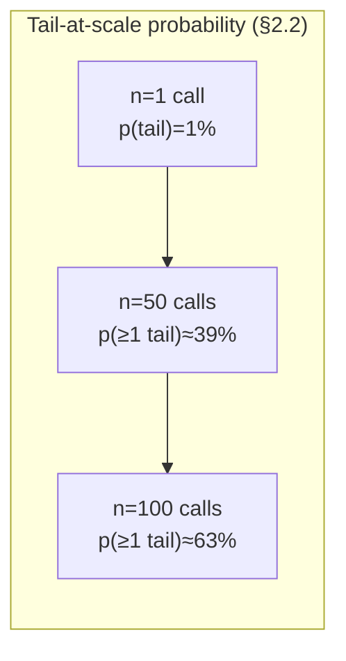
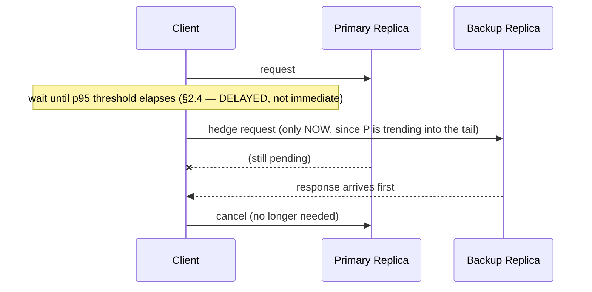
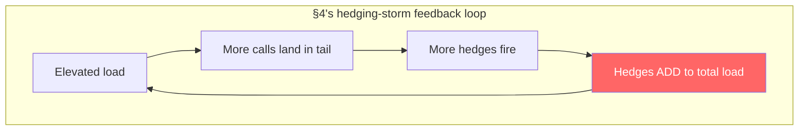
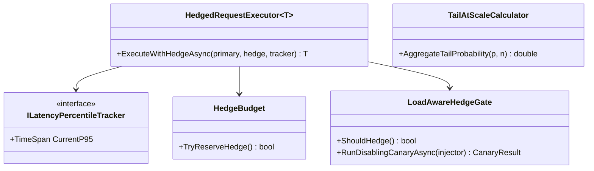

# Module 149 — Distributed Systems: Tail Latency, Hedged Requests & the Tail-at-Scale Problem

> Domain: Distributed Systems | Level: Beginner → Expert | Prerequisite: [[05-LSM-Trees-BTrees-BloomFilters-StorageEngines]] (compaction debt as one concrete source of the tail latency this module addresses at the request-handling layer), [[../17-Microservices/05-Service-Discovery-Communication-Infrastructure-Backpressure]] §2.4 (retry amplification — hedging is a deliberate, controlled form of the same pattern, requiring the same budget discipline), [[03-PACELC-Consistency-Models-SplitBrain]] Expert Q6 (which previewed hedged writes' split-brain risk — this module's closing incident)

>
> **Scope note:** Fourth and closing module of the four-module `16-Distributed-Systems` extension (Modules 146–149, alongside the original Modules 47–48), bringing the domain to its full 6-module scope and closing the gap the 2026-07-19 curriculum audit identified. Full 16-section template; Elite FinTech Interview Panel lens.

---

## 1. Fundamentals

**What:** Tail latency — the latency experienced by the slowest fraction of requests (p95, p99, p99.9) rather than the average or median — and why it, not the average, determines actual user-experienced performance in any system with meaningful request fan-out; plus hedged (backup) requests, the primary technique for reducing it, and the precise conditions under which that technique helps versus actively makes things worse.

**Why:** Every prior module in this course's Distributed Systems arc has, at some point, produced a source of tail latency — Module 146's GC-pause-induced leader failover, Module 148's compaction-debt-driven read amplification, Module 79/83's noisy-neighbor CPU throttling. This module addresses the layer above all of them: once *some* cause has pushed an individual request into the tail, what happens to a system that fans a single logical request out across many such individually-tail-prone calls — and the answer, formalized by Google's well-known "Tail at Scale" analysis, is that **the probability at least one fan-out call lands in the tail approaches certainty as fan-out grows, even when each individual call's own tail probability is small.**

**When:** Any system where a single user-facing request triggers multiple downstream calls — which, given this course's entire microservices, EDA, and system-design arc, describes nearly every production system this course has discussed.

**How (30,000-ft view):**
```
Single backend call:  p(tail) = 1%           ── low individual risk
Fan-out to 50 calls:  p(at least one tail) = 1 - (1-0.01)^50 ≈ 39%   ── high AGGREGATE risk
Fan-out to 100 calls: p(at least one tail) = 1 - (1-0.01)^100 ≈ 63%  ── now the COMMON case, not the rare one
```

---

## 2. Deep Dive

### 2.1 Why Average and Median Hide the Experience That Actually Matters
A system's average or median latency describes a typical *individual* call. A user-facing request that fans out to many backend calls, however, experiences the **maximum** of all those calls' latencies (if it must wait for all of them) — and the maximum of many samples is systematically, disproportionately pulled toward the tail, not the average, of the underlying distribution. This is why a system whose every individual component reports an excellent p99 can still deliver a poor overall p99 to its actual users — the aggregate statistic that matters is not any single component's own distribution, but the distribution of the *maximum* across however many components a given request touches.

### 2.2 The Tail-at-Scale Mathematics, Precisely
For `n` independent backend calls, each with probability `p` of individually falling into the tail (exceeding some latency threshold), the probability that the *overall* request is affected by at least one tail-latency call is:

`P(at least one tail call) = 1 - (1 - p)^n`

This grows rapidly and non-intuitively with `n`. At `p = 1%` (a genuinely excellent individual p99) and `n = 50` fan-out calls, the aggregate probability is `1 - 0.99^50 ≈ 39%` — meaning nearly two in five aggregate requests are affected by at least one slow component call, despite every individual component looking excellent in isolation. At `n = 100`, this rises to roughly 63%. **The rare becomes the common precisely because of fan-out, not because any individual component degraded.**

### 2.3 Sources of Tail Latency — A Catalog Assembled From This Course's Own Prior Findings
Tail latency rarely has one cause; it is the union of every source of occasional, individually-rare slowness a request's dependencies might encounter:
- **GC pauses** (Module 146 §4) — a process momentarily stops entirely, producing an occasional but severe latency spike for whatever request happened to be in flight.
- **Compaction debt** (Module 148 §2.4) — an LSM-tree-backed dependency's read amplification growing under write pressure, producing latency that is occasional at low compaction debt and increasingly common as debt grows.
- **Resource contention / noisy neighbors** (Module 79/83) — a co-located process consuming CPU or I/O bandwidth unpredictably.
- **Lock contention** — a request occasionally waiting behind another holding a shared resource.
- **Cache misses** — an occasional cold lookup taking materially longer than the typical cache-hit path.
- **Queueing effects under bursty load** (Module 102's Little's Law) — even a system with adequate *average* capacity experiences queueing delay during a burst exceeding instantaneous capacity, producing a latency spike that resolves once the burst passes.

Each of these is individually rare for any given component — and §2.2's mathematics is precisely why "individually rare" does not mean "aggregately rare" once fan-out enters the picture.

### 2.4 Hedged (Backup) Requests — The Primary Mitigation, and Its Critical Timing Nuance
A hedged (or backup) request sends the same logical request to a second, independent replica or backend instance, taking whichever response arrives first and discarding the other — directly trading extra load for reduced tail latency. The critical, easy-to-get-wrong design decision is **timing**: sending the hedge *immediately*, in parallel with the primary request, roughly doubles backend load for a comparatively modest latency benefit, since most requests were never going to be slow in the first place and the hedge was unnecessary extra work for them. The correct approach — the specific recommendation from Google's original analysis — is **delayed hedging**: wait until a request has already exceeded some percentile of the expected latency distribution (commonly the p95 or p98) before firing the backup, so hedging activates *specifically and only* for the requests already trending into the tail, capturing the great majority of the latency benefit at a small fraction of the load cost immediate hedging would impose.

### 2.5 Hedging Is a Controlled Form of Retry — and Needs Retry's Exact Discipline
A hedged request is, structurally, a deliberate, latency-triggered retry sent *before* the original has failed, rather than *after*. This means it inherits every risk Module 136 §2.4 established for retries generally — most critically, **retry amplification composing uncontrolled across layers**, exactly Module 136 §14's 3×3=9 incident, now recurring as a hedging-specific variant if hedging is introduced at one layer without accounting for retry or hedging logic already present at another. A hedge budget, analogous to Module 136's retry budget, is required: a cap on what fraction of a service's total outbound request volume may be consumed by hedges, with hedging throttled or disabled entirely once that budget is exhausted.

### 2.6 Hedging Is Structurally Safe for Reads and Structurally Dangerous for Writes
A hedged **read** is safe under any consistency model (Module 146 §2.3) — reading the same data twice from two replicas and taking the faster response causes no correctness issue, since no state changes as a result. A hedged **write**, by contrast, sends the *same logical write* to two backends, and unless every downstream write path is already protected by exactly the mechanisms Module 146 established — fencing tokens, single-writer routing, or genuine idempotency (Module 143) — a hedged write risks producing precisely Module 146 §4's zombie-write and split-brain failure shape, now triggered by a deliberate hedging decision rather than an accidental process pause. This is the single most consequential distinction this module establishes, and §14's incident is its concrete demonstration.

---

## 3. Visual Architecture







---

## 4. Production Example

**Problem:** A portfolio-risk aggregation service — directly extending Module 129's real-time portfolio risk engine — fanned a single consolidated-exposure request out to roughly 50 independent, per-asset-class microservices, waiting for every response before returning an aggregated figure. Each individual microservice reported an excellent p99 of approximately 50ms under its own isolated benchmarking.

**Architecture:** Synchronous fan-out with no hedging initially, aggregating all 50 responses before returning.

**Implementation:** Despite every individual service's excellent p99, the aggregate request's own p99 measured closer to 400ms — exactly Module 129's own §2.1 "multiplicative, not additive" workload framing recurring at the latency-distribution level rather than the compute-cost level, and a direct, textbook instance of §2.2's tail-at-scale mathematics (at n≈50 and even a modest 1-2% individual tail probability, the aggregate probability of at least one slow call easily exceeds a third).

**Trade-offs:** The team, correctly diagnosing fan-out as the cause, adopted hedged requests as the fix — a reasonable, well-known mitigation for exactly this problem.

**Lessons learned:** The team implemented hedging with **immediate**, parallel dispatch — every fan-out call to every one of the 50 services was hedged to a secondary replica from the moment the request began, not delayed until any percentile threshold had elapsed, since the immediate approach was simpler to implement and the team's mental model was "more redundancy is straightforwardly better." This instantly, roughly doubled backend request volume across the entire 50-service estate, every time, for every aggregate request — a cost accepted because initial testing, conducted under normal, non-peak load, showed the aggregate p99 improve substantially with headroom to spare.

The hidden cost surfaced during a genuine, unrelated high-volatility trading day, when overall request volume across the estate rose meaningfully above normal levels for reasons unrelated to hedging. The already-doubled hedging load compounded directly with this organic volume increase, pushing several of the 50 downstream services past their own individual capacity thresholds — services that, under the *same* elevated organic volume without hedging's 2x multiplier, would have remained comfortably within capacity. As those services' own latency began to degrade under the combined load, *more* fan-out calls began exceeding the tail threshold that (in a properly delayed design) would trigger additional hedges — but since hedging was already firing immediately and universally, there was no further headroom for hedging to "kick in more," and instead the constant, doubled baseline load itself became the dominant contributor to the very capacity exhaustion degrading latency in the first place. The result was a feedback dynamic where genuine, organic load growth interacted with hedging's constant load multiplier to push multiple services into sustained overload, and the aggregate p99 — which hedging had been introduced specifically to improve — became measurably *worse* than it had been before hedging was deployed at all, right during the trading day when accurate, timely risk figures mattered most.

No component errored at any stage; every downstream service continued accepting and processing requests, simply at increasingly degraded latency, this domain's now-thoroughly-familiar silent-degradation shape. Detection came from the aggregate p99 dashboard itself crossing an alerting threshold, with the on-call engineer initially suspecting a genuine capacity shortfall rather than recognizing hedging's own load contribution as a primary factor, since the doubled baseline load from hedging had been present and accepted as "normal" since its original rollout, making it easy to overlook as a candidate cause during the incident's early investigation.

The fix had three parts. **First**, hedging was redesigned to fire only after a delayed threshold — specifically, only once an individual fan-out call had already exceeded its own service's measured, steady-state p95 latency — activating hedging specifically and only for calls already trending into the tail, per §2.4's established recommendation, reducing hedging's baseline load contribution from a constant 2x multiplier to a small, load-proportional fraction. **Second**, a hedge budget was introduced, capping the fraction of total outbound request volume any consumer could dedicate to hedges, directly reusing Module 136 §2.4's retry-budget discipline, with hedging throttled automatically as the budget approached exhaustion under genuinely elevated system-wide load — precisely the condition under which naive, unbudgeted hedging is most dangerous and least helpful. **Third**, hedging was made load-aware: a circuit-breaker-style mechanism monitoring aggregate downstream capacity utilization and **disabling hedging entirely** once utilization crossed a defined threshold, recognizing the counterintuitive but critical finding that hedging is a technique suited to a healthy system experiencing normal statistical tail variance, and becomes actively counterproductive precisely during genuine, system-wide overload — the exact condition an engineer's instinct might otherwise suggest hedging would help most.

The generalizable lesson: **hedging trades extra, unconditional load for reduced tail latency, and that trade is favorable only when the extra load is small relative to available capacity — which is precisely the condition that stops holding during a genuine load spike, meaning naive hedging's benefit and its cost are inversely correlated with exactly the conditions under which tail-latency reduction matters most.**

---

## 5. Best Practices
- Delay hedge dispatch until a measured percentile threshold (typically p95–p98) has elapsed, never fire hedges immediately in parallel with the primary request (§2.4, §4).
- Enforce a hedge budget capping the fraction of outbound request volume any consumer may dedicate to hedges, directly reusing Module 136's retry-budget discipline (§2.5, §4).
- Make hedging load-aware — disable or throttle it automatically once aggregate downstream capacity utilization crosses a defined threshold, since hedging is most dangerous precisely when the system is under genuine load (§4's third fix).
- Restrict hedging to genuinely idempotent, read-only operations by default; treat any hedged write as requiring the full fencing/single-writer/idempotency discipline Module 146 and Module 143 establish, verified explicitly before hedging is enabled for that path (§2.6, §14).
- Reason about aggregate, fan-out-level latency (the maximum across all calls a request touches) as the metric that determines actual user experience, not any individual component's own percentile figures in isolation (§2.1, §2.2).
- Coordinate hedging configuration across every layer of a request's call chain, since uncoordinated hedging or retry logic at multiple layers composes multiplicatively, exactly Module 136 §14's amplification pattern.

## 6. Anti-patterns
- Immediate, non-delayed hedge dispatch, unconditionally multiplying baseline load for a comparatively small tail-latency benefit (§4's incident).
- Hedging with no budget cap, allowing hedge volume to grow unboundedly under exactly the load conditions where it's most harmful.
- Hedging writes without first verifying the downstream write path has fencing, single-writer routing, or genuine idempotency protection (§2.6, §14).
- Treating hedging as a technique that helps uniformly regardless of system load, missing that its cost-benefit trade inverts precisely under genuine overload (§4's third fix).
- Introducing hedging at one layer of a multi-layer call chain without auditing whether retry or hedging logic already exists at another layer, risking uncoordinated, multiplicative amplification (§2.5, Module 136 §14).
- Diagnosing a fan-out system's poor aggregate p99 by looking only at individual component p99s, missing that the aggregate is a function of the maximum across all fan-out calls, not any single component's distribution (§2.1).

---

## 7. Performance Engineering

**CPU/Memory:** Hedging directly increases backend CPU/resource consumption proportional to hedge rate; delayed, budgeted hedging (§2.4, §2.5) is specifically designed to minimize this cost while retaining most of the latency benefit.

**Latency:** This module's central subject — the aggregate p99 a user experiences is the maximum across fan-out calls, and hedging is the primary lever for reducing that maximum without requiring every individual component's own tail to improve.

**Throughput:** Unbudgeted hedging directly reduces effective system throughput by consuming capacity on redundant, ultimately-discarded work — exactly §4's mechanism.

**Scalability:** Tail-at-scale mathematics (§2.2) means that as a system's fan-out grows (more microservices, more shards, more dependencies per request), its aggregate tail latency degrades even if no individual component's own performance changes at all — a scaling dimension distinct from and additional to conventional throughput/capacity scaling concerns.

**Benchmarking:** Benchmark aggregate, end-to-end p99 latency under realistic fan-out and realistic load, not any individual component's isolated p99 — exactly the gap §4's original benchmarking (each service tested independently) missed.

**Caching:** Reducing the *number* of tail-latency-prone calls a request must make (via caching, batching, or reducing fan-out width) is a complementary strategy to hedging, addressing §2.2's `n` term directly rather than mitigating its consequence after the fact.

---

## 8. Security

**Threats:** Unbudgeted hedging is a self-inflicted denial-of-service vector, as §4 demonstrates — the system's own hedging logic, not an external attacker, doubled load and contributed to capacity exhaustion. An external attacker aware of a hedging policy could potentially induce artificial tail latency (deliberately slow but valid requests) to trigger hedge amplification as an actual denial-of-service technique.

**Mitigations:** Hedge budgets and load-aware throttling (§4's fixes) serve a dual purpose — protecting against both the self-inflicted and the adversarially-induced versions of this risk.

**OWASP mapping:** Denial of service via resource exhaustion, here self-inflicted through uncoordinated internal amplification logic rather than external attack traffic — a variant this course has now documented in several forms (Module 136's retry storms, this module's hedging storms).

**AuthN/AuthZ:** Not directly implicated by hedging itself; standard authorization applies identically to a hedge request as to its primary counterpart.

**Secrets:** Not directly implicated.

**Encryption:** Standard in-transit requirements for both primary and hedge requests identically.

---

## 9. Scalability

**Horizontal scaling:** Adding more replicas increases the pool available for hedging but does not, by itself, address the tail-at-scale mathematics (§2.2) driving the underlying problem — more fan-out width (`n`) still increases aggregate tail-latency risk regardless of per-replica capacity.

**Vertical scaling:** Reduces individual component tail probability (`p` in §2.2's formula) somewhat but does not change the fundamentally multiplicative relationship between fan-out width and aggregate risk.

**Caching:** §7 — reducing fan-out width or call frequency addresses `n` directly, a complementary lever to hedging's mitigation-after-the-fact approach.

**Replication/Partitioning:** Hedge targets are typically read replicas of the same underlying data; hedging against a replica with materially different (stale) data risks the hedged response itself being incorrect under a PA/EL-classified store (Module 146 §2.2) — hedge-target selection should account for the replica's own consistency guarantees, not only its availability.

**Load balancing:** Load-aware hedging (§4's third fix) is itself a form of adaptive load balancing — dynamically adjusting hedge rate based on observed aggregate capacity utilization.

**High Availability:** Hedging provides a secondary benefit beyond latency — a hedge request implicitly provides failover if the primary replica is entirely unavailable, not merely slow, blurring the line between a pure latency optimization and an availability mechanism.

**Disaster Recovery:** Not directly implicated, though a hedge target residing in a different region (Module 142) introduces the identical cross-region latency and consistency considerations that module establishes.

**CAP theorem:** Orthogonal to hedging directly, though hedged reads are safe under any PACELC classification (§2.6) while hedged writes require the same PC/EC-adjacent structural protections (fencing, single-writer routing) Module 146 establishes for any concurrent-write scenario.

---

## 10. Interview Questions

### Basic (10)

1. **Q: What is tail latency, and why does it matter more than average latency for user experience?**
   **A:** The latency experienced by the slowest fraction of requests (p95, p99); it matters more than average because a request fanning out to multiple backend calls experiences the *maximum* of those calls' latencies, and the maximum is disproportionately pulled toward the tail of the underlying distribution, not the average (§2.1).
   **Why correct:** Defines tail latency and explains why fan-out makes it the operative metric.
   **Common mistakes:** Optimizing for average latency while the actual user-facing metric (the maximum across fan-out calls) continues to degrade.
   **Follow-ups:** "What统计 property causes the maximum to skew toward the tail?" (With more independent samples, the probability that at least one is a tail-latency outlier increases — §2.2's mathematics.)

2. **Q: State the tail-at-scale formula and explain what it shows.**
   **A:** `P(at least one tail call) = 1 - (1-p)^n` for n independent calls each with individual tail probability p — it shows that even a small individual tail probability becomes a near-certainty at sufficient fan-out width, since the probability grows rapidly, not linearly, with n (§2.2).
   **Why correct:** States the formula and its key non-intuitive implication.
   **Common mistakes:** Assuming aggregate tail risk grows linearly with fan-out width, missing the actual, faster-than-linear growth.
   **Follow-ups:** "At p=1% and n=100, roughly what's the aggregate probability?" (Approximately 63% — §2.2's worked example.)

3. **Q: What is a hedged (backup) request?**
   **A:** Sending the same logical request to a second, independent replica, taking whichever response arrives first and discarding the other — trading extra load for reduced tail latency (§2.4).
   **Why correct:** States the mechanism and its core trade-off.
   **Common mistakes:** Assuming hedging is free — it always costs extra load, and the design question is how to minimize that cost while retaining the benefit.
   **Follow-ups:** "What's the critical timing decision in implementing hedging?" (Delayed versus immediate dispatch — §2.4.)

4. **Q: Why is immediate hedge dispatch generally worse than delayed hedge dispatch?**
   **A:** Immediate dispatch roughly doubles baseline load unconditionally, for every request, even the majority that were never going to be slow; delayed dispatch (waiting until a percentile threshold has elapsed) fires hedges specifically and only for requests already trending into the tail, capturing most of the benefit at a small fraction of the load cost (§2.4).
   **Why correct:** States the load-cost difference and why delayed dispatch is more efficient.
   **Common mistakes:** Assuming more redundancy (immediate hedging) is straightforwardly safer, missing the unconditional load cost it imposes.
   **Follow-ups:** "What percentile threshold is typically used?" (Commonly the measured p95 or p98 of the specific call's own latency distribution, §2.4.)

5. **Q: Why is hedging structurally safe for reads and dangerous for writes?**
   **A:** A hedged read causes no correctness issue regardless of which replica responds first, since no state changes as a result; a hedged write sends the same logical write to two backends, risking a duplicate or divergent write unless fencing, single-writer routing, or genuine idempotency already protects that write path (§2.6).
   **Why correct:** States the read/write asymmetry and its underlying reason.
   **Common mistakes:** Assuming hedging is a uniformly safe latency optimization applicable to any request type without checking whether it's a read or a write.
   **Follow-ups:** "What prior module's mechanisms would need to be verified before hedging a write?" (Module 146's fencing tokens/single-writer routing and Module 143's idempotency discipline, §2.6.)

6. **Q: What went wrong in §4's incident, at a high level?**
   **A:** Immediate, unbudgeted hedging doubled baseline backend load across a 50-service fan-out; during a genuine, unrelated volume spike, this doubled load compounded with organic growth, pushing several services into sustained overload and making the aggregate p99 measurably worse than before hedging was introduced (§4).
   **Why correct:** States the compounding mechanism and its ironic outcome.
   **Common mistakes:** Attributing the incident purely to the volume spike, missing that hedging's own constant load multiplier was a primary contributing factor.
   **Follow-ups:** "What was the fix?" (Delayed, budgeted, load-aware hedging — §4's three-part fix.)

7. **Q: Why is hedging most dangerous precisely during genuine system-wide overload?**
   **A:** Hedging's cost-benefit trade is favorable only when the extra load it imposes is small relative to available capacity — a condition that stops holding during genuine overload, meaning hedging's cost grows exactly when the system can least absorb it, while an engineer's instinct might otherwise suggest hedging would help most during a slowdown (§4's third fix).
   **Why correct:** States the inverse relationship between hedging's helpfulness and system load.
   **Common mistakes:** Assuming hedging helps uniformly or increasingly as system load rises, when the opposite is closer to true beyond a certain load threshold.
   **Follow-ups:** "What mechanism addresses this?" (Load-aware hedging that disables or throttles itself once aggregate capacity utilization crosses a defined threshold, §4.)

8. **Q: What is a hedge budget, and what established course pattern does it directly reuse?**
   **A:** A cap on what fraction of a service's total outbound request volume may be consumed by hedges; it directly reuses Module 136 §2.4's retry-budget discipline, since a hedge is structurally a controlled, latency-triggered retry (§2.5).
   **Why correct:** Defines the mechanism and names its direct precedent.
   **Common mistakes:** Treating hedging as an unrelated technique from retries, missing that they share the identical amplification risk and require the identical budget discipline.
   **Follow-ups:** "What specific prior incident does uncoordinated hedging risk reproducing?" (Module 136 §14's 3×3=9 retry-amplification incident, if hedging composes uncoordinated with existing retry logic at another layer.)

9. **Q: Why can a system with every individual component reporting excellent p99 latency still deliver poor aggregate p99 to users?**
   **A:** The aggregate request experiences the maximum latency across every fan-out call it makes, and per §2.2's mathematics, the probability that at least one of many calls lands in even a small individual tail grows rapidly with fan-out width — meaning excellent individual component performance does not imply excellent aggregate performance once fan-out is significant (§2.1, §2.2, §4).
   **Why correct:** Connects individual-component excellence to aggregate degradation via the tail-at-scale mechanism.
   **Common mistakes:** Assuming aggregate performance is simply the average of individual component performances, rather than a function of their maximum under fan-out.
   **Follow-ups:** "What complementary strategy addresses this beyond hedging?" (Reducing fan-out width itself, or caching/batching to reduce the number of tail-latency-prone calls a request makes, §7.)

10. **Q: Why does hedging provide an availability benefit beyond its primary latency benefit?**
    **A:** A hedge request implicitly provides failover if the primary replica is entirely unavailable rather than merely slow, since the hedge target, being independent, would still respond — blurring the line between a pure latency optimization and an availability mechanism (§9).
    **Why correct:** States the secondary benefit and why it arises naturally from hedging's mechanism.
    **Common mistakes:** Viewing hedging purely as a latency technique, missing its incidental availability benefit.
    **Follow-ups:** "Does this availability benefit apply equally to hedged writes?" (No — Module 146's split-brain risk means a hedged write to an unavailable-vs-slow primary carries the same danger regardless of which specific condition triggered the hedge, §2.6.)

### Intermediate (10)

1. **Q: Walk through why §4's team's initial choice of immediate hedging was a reasonable-looking, if ultimately incorrect, decision.**
   **A:** Immediate hedging is simpler to implement (no percentile-threshold calibration needed) and, under the normal-load conditions the team initially tested against, genuinely and substantially improved the aggregate p99 with headroom to spare — the decision looked validated by its own testing. The flaw was specifically in what that testing didn't exercise: genuine, organically elevated system-wide load, which is precisely the condition under which hedging's constant load multiplier compounds dangerously with existing demand, a condition normal-load testing structurally cannot surface.
   **Why correct:** Identifies that the testing gap (no elevated-load condition exercised), not a naive implementation error, was the actual source of the incident.
   **Common mistakes:** Concluding the team's choice was simply careless, when it was a reasonable engineering trade-off given the testing conditions actually available to them at the time.
   **Follow-ups:** "What testing discipline would have caught this before production?" (A chaos experiment, per Module 144's discipline, deliberately combining elevated background load with hedging's load contribution — testing the composed condition, not either factor in isolation.)

2. **Q: Design the delayed-hedging threshold calculation for a service with a known, measured latency distribution.**
   **A:** Continuously track the service's own rolling p95 (or p98) latency, and fire a hedge for any individual call only once it has already exceeded that currently-measured threshold — making the threshold adaptive to the service's actual, current performance rather than a fixed, potentially-stale constant, so hedging's activation rate self-adjusts as the service's baseline performance genuinely shifts over time (e.g., during a legitimate capacity change).
   **Why correct:** Specifies an adaptive, continuously-measured threshold rather than a fixed constant, avoiding staleness as conditions change.
   **Common mistakes:** Hard-coding a fixed millisecond threshold at initial implementation time, which becomes miscalibrated as the service's actual latency distribution shifts with load, capacity, or workload composition over time.
   **Follow-ups:** "What risk does a fixed, stale threshold introduce?" (If the service's baseline latency degrades broadly — e.g., during genuine overload — a fixed threshold set for the old, better baseline would trigger hedging far more aggressively than intended, exactly compounding §4's original problem rather than mitigating it.)

3. **Q: Why does a hedge budget need to be coordinated across every layer of a multi-layer call chain, not set independently per layer?**
   **A:** If hedging is introduced independently at multiple layers (a client hedging its call to a gateway, which itself hedges its call to a backend), the effective amplification compounds multiplicatively across layers exactly as Module 136 §14's retry-policy composition did (3×3=9) — each layer's locally-reasonable hedge budget can combine into an aggregate amplification far exceeding what any single layer's own budget intended or accounted for.
   **Why correct:** Connects the multi-layer composition risk directly to Module 136's precedent, explaining why per-layer-independent budgeting is insufficient.
   **Common mistakes:** Setting a hedge budget at one layer without auditing whether hedging or retry logic already exists at adjacent layers in the same call chain.
   **Follow-ups:** "What governance would prevent this?" (A single, coordinated hedge/retry-budget policy owned centrally for a given call chain, or Module 136 §14's own fix — remove redundant layer-level policies before enabling any single layer's, verified one at a time.)

4. **Q: Critique measuring the success of a hedging rollout purely by observing improved aggregate p99 under normal testing conditions.**
   **A:** This is exactly the measurement gap that let §4's incident occur — normal-condition testing validates hedging's benefit under the load regime where its cost (extra load) is genuinely small relative to capacity, but says nothing about its behavior under the load regime where that relationship inverts. A complete evaluation must include an explicit, deliberately-elevated-load test condition (Intermediate Q1's chaos-experiment answer), measuring not just latency improvement but total load contribution and downstream capacity headroom under both normal and elevated conditions.
   **Why correct:** Identifies the specific missing test condition and what a complete evaluation needs to additionally measure.
   **Common mistakes:** Treating "aggregate p99 improved" as sufficient validation, without also measuring the load cost incurred to achieve that improvement and how that cost behaves under stress.
   **Follow-ups:** "What single additional metric would have been most diagnostic here?" (Total downstream request volume attributable to hedges specifically, tracked as its own metric — making hedging's load contribution directly visible rather than implicitly folded into overall traffic figures.)

5. **Q: How does §2.2's tail-at-scale mathematics change the calculus for architectural fan-out width decisions, beyond just motivating hedging?**
   **A:** It provides a quantitative basis for evaluating whether a proposed fan-out width is architecturally acceptable *before* any hedging mitigation is even considered — a design with `n=200` dependencies, even with individually-excellent components, has near-certain aggregate tail exposure per the formula, which should inform decisions about consolidating dependencies, batching calls, or introducing an aggregation tier that itself absorbs some fan-out, rather than treating hedging as the only available lever once a wide fan-out design is already committed to.
   **Why correct:** Extends the mathematics from justifying hedging to informing upstream architectural fan-out decisions directly.
   **Common mistakes:** Treating hedging as the sole available response to tail-at-scale risk, rather than recognizing fan-out width itself as a design variable worth minimizing independently.
   **Follow-ups:** "How does this relate to Module 129's own risk-engine architecture?" (Module 129's task-granularity discussion is directly relevant — coarser task granularity reduces the effective `n` in this module's formula, trading some parallelism benefit for reduced aggregate tail exposure, a trade-off this module's mathematics makes explicit and quantifiable.)

6. **Q: Apply this course's "declared ≠ actual" theme to §4's incident.**
   **A:** The declared claim, following hedging's initial rollout, was "hedging improves our aggregate latency" — true, and validated, under the tested condition (normal load). The claim's actual, narrower scope was "hedging improves aggregate latency *when its own load contribution is small relative to available capacity*" — a precondition never stated explicitly and which silently stopped holding during genuine, elevated load, exactly the condition the incident occurred under.
   **Why correct:** Identifies the implicit, untested precondition hidden inside the broader, validated-sounding claim.
   **Common mistakes:** Treating "we tested hedging and it improved latency" as a complete, condition-independent claim rather than one implicitly scoped to the load condition actually tested.
   **Follow-ups:** "How would you state the claim precisely, post-fix?" (Something like: "delayed, budgeted hedging improves aggregate p99 under normal-to-moderate load, and is automatically disabled above a measured capacity-utilization threshold where its cost would exceed its benefit" — a scoped, conditionally-true claim rather than an unqualified one.)

7. **Q: How does this module's hedging discipline interact with Module 148's compaction-debt finding specifically?**
   **A:** Compaction debt (Module 148 §2.4) is one of several concrete, storage-engine-internal *causes* of the individual-call tail latency this module's fan-out mathematics amplifies — a downstream LSM-tree-backed dependency experiencing compaction debt directly raises that specific call's `p` (individual tail probability) in §2.2's formula, which then propagates, amplified by fan-out width, into the aggregate p99 this module addresses. Hedging mitigates the *symptom* (aggregate tail latency) without addressing the *cause* (compaction debt); Module 148's own remediation (peak-calibrated compaction capacity) addresses the cause directly, and the two are complementary, not substitutable — a well-hedged system with an unaddressed compaction-debt problem still pays hedging's load cost while the underlying `p` remains elevated, providing less benefit than a system where the underlying cause is also addressed.
   **Why correct:** Precisely distinguishes cause (compaction debt raising individual-call tail probability) from symptom (aggregate tail latency this module addresses), and explains why addressing only the symptom is a weaker response than addressing both.
   **Common mistakes:** Treating hedging as a complete substitute for addressing underlying causes of individual-call tail latency, rather than a complementary, symptom-level mitigation.
   **Follow-ups:** "Which should be prioritized first, hedging or addressing a known underlying cause like compaction debt?" (The underlying cause — reducing `p` directly benefits every request, including ones fan-out mathematics wouldn't otherwise flag, while hedging only mitigates the aggregate consequence for requests that already fan out widely, per Advanced Q10's synthesis.)

8. **Q: How should a hedge budget interact with Module 141's producer-quota discipline for the downstream services receiving hedge traffic?**
   **A:** From a downstream service's perspective, hedge traffic is indistinguishable from any other incoming request volume, and Module 141 §2.4's producer-quota mechanism (capping produce rate per client) applies identically — a downstream service should account for the fact that its actual received traffic includes both primary and hedge requests from upstream callers, sizing its own capacity and quota policies against that combined figure rather than against primary-request volume alone, which would systematically under-provision relative to actual load.
   **Why correct:** Identifies that hedge traffic is ordinary traffic from the downstream service's perspective and must be accounted for in that service's own capacity planning, not treated as a separate, negligible category.
   **Common mistakes:** Capacity-planning a downstream service against expected primary-request volume alone, missing that hedge traffic from upstream callers adds directly to its actual received load.
   **Follow-ups:** "Should a downstream service be able to distinguish hedge requests from primary requests?" (Useful but not required for correctness — tagging hedge requests explicitly (e.g., a header) lets a downstream service prioritize or deprioritize them under its own load pressure, an additional refinement beyond the basic capacity-accounting requirement.)

9. **Q: How does the tail-at-scale mathematics change if the fan-out calls are not independent — e.g., they share a common downstream dependency?**
   **A:** §2.2's formula assumes independence; if multiple fan-out calls share a common downstream dependency (a shared database, a shared cache), their tail-latency events become *correlated* rather than independent — a single shared-dependency slowdown can push many or all fan-out calls into the tail simultaneously, which the independence-assuming formula underestimates. This is structurally the same correlated-failure caution Module 137 §4 and Module 142 §2.4 established for shared dependencies defeating cell-based or regional isolation — recurring here as correlated *tail-latency* risk rather than correlated *outage* risk.
   **Why correct:** Identifies the independence assumption's limit and connects the correlated-dependency risk to an established prior pattern in a different but structurally similar context.
   **Common mistakes:** Applying §2.2's formula uncritically to any fan-out scenario without checking whether the underlying calls are genuinely independent or share common dependencies that would correlate their tail-latency events.
   **Follow-ups:** "How would you detect this kind of correlation in practice?" (Statistical analysis of whether tail-latency events across different fan-out calls co-occur more often than independence would predict — a direct empirical test of the assumption, analogous to Module 142 Expert Q4's consistency-canary discipline applied to latency correlation instead of state divergence.)

10. **Q: Synthesize how this module completes the causal chain Module 146 and Module 148 each began.**
    **A:** Module 146 established one specific cause of tail latency (GC-pause-induced leader failover) alongside its own distinct concern (split-brain risk); Module 148 established a second specific cause (compaction-debt-driven read amplification). This module addresses the layer above both: given that *some* mix of causes (these two, plus others named in §2.3) will inevitably produce occasional individual-call tail latency, what happens to a system that fans a single request out across many such calls, and what can be done about the aggregate consequence — completing the chain from "why does an individual call occasionally slow down" (Modules 146, 148) to "why does this make the aggregate system slow far more often than any individual component's own statistics would suggest" (this module).
    **Why correct:** Precisely locates this module's contribution as the layer above the two specific-cause modules that preceded it in this same extension run.
    **Common mistakes:** Treating this module's tail-latency content as unrelated to Modules 146/148's specific incidents, rather than recognizing it as the generalized, aggregate-level consequence those modules' specific causes each feed into.
    **Follow-ups:** "What other, not-yet-named cause from earlier in this course could analogously feed into this module's fan-out mathematics?" (Module 141's consumer lag, if a fan-out call's backend is itself waiting on a lagging, asynchronously-consumed upstream event — yet another concrete source of individual-call latency variance this module's aggregate framework would amplify identically.)

### Advanced (10)

1. **Q: Diagnose §4's incident and design the complete structural fix.**
   **A:** Root cause: immediate, unbudgeted hedging doubled baseline load across a 50-service fan-out unconditionally, and this constant multiplier compounded with a genuine, unrelated organic volume spike, pushing multiple downstream services into sustained overload and making the aggregate p99 worse than pre-hedging — with no error at any stage. Fix: (1) delayed hedge dispatch triggered only once a call exceeds its own service's adaptively-measured p95/p98 threshold (Intermediate Q2); (2) a coordinated hedge budget across the full call chain, reusing Module 136's retry-budget discipline (Intermediate Q3); (3) load-aware hedging that automatically disables itself once aggregate downstream capacity utilization crosses a defined threshold, addressing the counterintuitive finding that hedging is most dangerous precisely when the system is under genuine load (§4's third fix).
   **Why correct:** Addresses the timing mechanism, the cross-layer coordination gap, and the load-awareness gap as three distinct, individually necessary fixes.
   **Common mistakes:** Fixing only the timing mechanism (point 1) without also adding load-awareness (point 3), leaving the system exposed to the identical compounding dynamic during any future load spike large enough to overwhelm even delayed hedging's more modest baseline load contribution.
   **Follow-ups:** "Why is point 3 necessary given point 1 already substantially reduces hedging's baseline load?" (Delayed hedging reduces but doesn't eliminate load-proportional hedge volume — under sufficiently severe organic load, even a reduced hedge rate can still compound dangerously, which is exactly the condition point 3's explicit load-based circuit breaker exists to catch regardless of how well-tuned the timing threshold is.)

2. **Q: A team proposes hedging every fan-out call to three replicas instead of two, reasoning that more redundancy further reduces tail latency. Evaluate.**
   **A:** Per §2.2's mathematics applied to hedge targets themselves, adding a third replica does reduce the probability that *all* targeted replicas simultaneously experience tail latency — but each additional hedge target adds proportional load cost, and the marginal latency benefit diminishes rapidly (going from one primary to a two-way hedge captures the large majority of the achievable benefit; a third target captures comparatively little additional benefit for its added cost, since the probability all three land in the tail simultaneously is already very low with just two). This is a direct application of diminishing returns, and the additional load cost should be weighed explicitly against the genuinely small marginal latency improvement, not assumed automatically worthwhile because "more redundancy is better."
   **Why correct:** Applies §2.2's own mathematics to evaluate the marginal benefit of additional hedge targets, correctly identifying diminishing returns.
   **Common mistakes:** Assuming redundancy benefits scale linearly with the number of hedge targets, missing that the marginal benefit shrinks rapidly while the marginal cost remains roughly constant per additional target.
   **Follow-ups:** "Is there a workload shape where a third hedge target would be clearly justified?" (An extremely latency-sensitive, low-volume operation where the marginal cost of a third target is genuinely negligible relative to the value of further latency reduction — a narrow case, not a general default.)

3. **Q: Design a monitoring signal that would have caught §4's incident before the aggregate p99 dashboard did.**
   **A:** Track hedge-attributable load as its own explicit, first-class metric — the fraction of total downstream request volume originating from hedges rather than primary requests — alerted on a sustained-rise basis analogous to Module 141's lag-alerting pattern. A sustained rise in this specific metric, correlated against declining downstream capacity headroom, would have surfaced the compounding dynamic directly and early, rather than requiring the aggregate p99 symptom itself to cross an alerting threshold after the compounding had already progressed substantially.
   **Why correct:** Proposes a leading-indicator metric (hedge-attributable load fraction) distinct from the lagging symptom (aggregate p99) that actually caught the incident, mirroring this course's repeated finding that leading indicators catch problems earlier than their downstream symptoms.
   **Common mistakes:** Relying solely on aggregate p99 monitoring, which is a lagging indicator only surfacing the problem after it has already substantially developed.
   **Follow-ups:** "How does this metric relate to Module 148's compaction-debt leading-indicator discipline?" (Structurally identical in role — both are a measurable, upstream quantity (hedge load fraction; compaction debt) that precedes and causally contributes to a downstream, customer-visible symptom (aggregate p99; read latency), and both benefit from the identical three-boundary alerting discipline Module 141 originally established.)

4. **Q: Critique a hedging implementation that hedges at a fixed rate (e.g., "hedge 10% of all requests randomly") rather than based on observed latency.**
   **A:** A fixed-rate, latency-blind hedging policy hedges requests indiscriminately, including the large majority that were never trending into the tail at all — providing essentially none of delayed hedging's efficiency advantage (§2.4) while still incurring meaningful, unconditional load cost, effectively reproducing much of immediate hedging's cost profile under a different implementation mechanism. The entire value of delayed, threshold-based hedging comes specifically from *conditioning* the hedge decision on the individual request's own observed latency trajectory, which a fixed random rate discards entirely.
   **Why correct:** Identifies that a fixed-rate policy forfeits the specific efficiency mechanism (conditioning on observed latency) that makes delayed hedging effective, reproducing much of immediate hedging's cost without its simplicity advantage either.
   **Common mistakes:** Assuming any hedging rate below 100% is inherently more efficient than immediate, universal hedging, without recognizing that the efficiency specifically comes from *which* requests get hedged (the ones actually trending into the tail), not merely *how many*.
   **Follow-ups:** "Is there ever a legitimate use for fixed-rate hedging?" (Where per-request latency tracking is genuinely infeasible to implement and a crude, bounded-cost approximation is preferred to no mitigation at all — a fallback, not a preferred design, given latency-conditioned hedging's clear efficiency advantage where implementable.)

5. **Q: How should hedge-target selection account for Module 146's consistency-model classification of the underlying store?**
   **A:** For a PA/EL-classified store (Module 146 §2.2), a hedge target replica may hold staler data than the primary, risking the hedge response itself being incorrect (not merely slower) if it wins the race — meaning hedge-target selection for such stores should either restrict hedging to genuinely staleness-tolerant read paths, or verify the hedge target's own staleness bound (Module 146 §2.6) falls within the calling operation's acceptable tolerance before treating its response as equally valid to the primary's. For a PC/EC-classified store, any responding replica is guaranteed current, making this concern moot.
   **Why correct:** Connects hedge-target validity directly to Module 146's consistency-model classification, identifying the specific risk for PA/EL stores that doesn't exist for PC/EC ones.
   **Common mistakes:** Assuming any replica's response is equally valid to hedge against, without checking whether the underlying store's consistency model permits meaningfully stale reads from a non-primary replica.
   **Follow-ups:** "How would you detect this risk in practice?" (Compare hedge-response content against primary-response content (when both eventually arrive) for a sample of requests, flagging any systematic divergence as evidence the hedge target's staleness is affecting correctness, not just latency.)

6. **Q: A regulator asks how the firm ensures its portfolio-risk aggregation figures remain both fast and correct given the fan-out and hedging architecture. Answer.**
   **A:** Describe the layered approach: delayed, budgeted, load-aware hedging reducing aggregate tail latency without unconditional load cost (§4's fix); hedging restricted to genuinely idempotent read paths only, with any write path explicitly verified against Module 146's fencing/single-writer protections before ever being considered for hedging (§2.6); and — critically — state that hedging is a latency optimization layered on top of, and never a substitute for, the correctness guarantees (idempotency, consistency-model classification) established independently at each underlying data path. State the residual honestly: hedging's own load-awareness circuit breaker means aggregate latency during genuine, severe system-wide overload reverts to unmitigated tail-at-scale behavior, a known, deliberate, and monitored trade-off rather than an unaddressed gap.
   **Why correct:** Gives the full layered answer, correctly scopes hedging as a latency-only optimization with correctness handled independently, and states the honest residual trade-off.
   **Common mistakes:** Describing hedging as if it were itself a correctness mechanism, rather than precisely scoping it as a latency optimization dependent on correctness being separately established.
   **Follow-ups:** "Why is disabling hedging under severe overload the correct trade-off, rather than some alternative?" (Because §4 demonstrates that continuing to hedge under severe overload actively worsens the situation — reverting to unmitigated tail-at-scale behavior, while worse than the ideal case, is strictly better than hedging's compounding feedback dynamic under that specific condition.)

7. **Q: Apply this course's "verify the verifier" theme to the load-aware hedging circuit breaker itself.**
   **A:** The circuit breaker's own capacity-utilization measurement could itself be stale, incorrectly calibrated, or silently fail to fire — precisely mirroring every other verification mechanism this course has repeatedly shown can fail silently (Module 125 §14's misrouted alert, Module 147 §14's misclassified alert). A circuit breaker that never actually trips, due to a threshold set too high or a measurement pipeline that's quietly broken, would provide the same false confidence any other silently-non-functioning safety mechanism has provided throughout this course, requiring the identical periodic, synthetic-test verification (deliberately inducing elevated load in a controlled setting and confirming the circuit breaker actually engages) rather than trusting its presence alone.
   **Why correct:** Applies the specific, now-repeatedly-demonstrated silent-failure risk of verification/safety infrastructure to this module's own proposed fix.
   **Common mistakes:** Treating the addition of a load-aware circuit breaker as itself a complete, self-evidently-functioning solution, without the same ongoing verification this course has required of every other safety mechanism it has introduced.
   **Follow-ups:** "What would this synthetic verification look like concretely?" (A scheduled, scoped chaos experiment (Module 144's discipline) deliberately driving downstream capacity utilization to the circuit breaker's threshold in a controlled environment, confirming hedging is actually disabled as a result — not merely that the threshold value exists in configuration.)

8. **Q: How should engineering leadership decide the acceptable trade-off between fan-out width and aggregate tail latency risk when designing a new, wide-fan-out system, synthesizing this module's findings with Module 129's?**
   **A:** Use §2.2's formula explicitly at design time to quantify aggregate tail-latency risk for a proposed fan-out width and each dependency's individually-measured or estimated tail probability, treating this as a first-class design input alongside Module 129's own multiplicative-compute-cost framing — both are instances of the same underlying principle (fan-out multiplies risk/cost, not merely aggregates it) applied to two different dimensions (latency here, compute cost there). A design exceeding an acceptable aggregate-tail-risk threshold should trigger explicit consideration of fan-out-reduction strategies (Advanced Q5's approach, batching, consolidation) before hedging is treated as the primary mitigation, since hedging addresses the symptom while fan-out-width reduction addresses the underlying multiplier directly.
   **Why correct:** Connects this module's quantitative framework to Module 129's parallel finding at design time, and correctly orders fan-out-reduction ahead of hedging as the more fundamental lever.
   **Common mistakes:** Treating hedging as sufficient mitigation for any fan-out width chosen for other reasons, without first evaluating whether the fan-out width itself is the more fundamental design lever to address.
   **Follow-ups:** "What's the risk of over-applying fan-out-width reduction?" (Excessive consolidation can reintroduce the coarse-task-granularity straggler risk Module 129 §14 identified — the two levers (fan-out width, task granularity) are themselves in tension, requiring the same kind of calibrated, workload-specific balance this course has established for nearly every other trade-off it has covered.)

9. **Q: How does this module's finding relate to Module 145's capstone conclusion about composition risk?**
   **A:** §4's incident is a further, distinct instance of that same finding: hedging (individually a well-understood, correctly-implemented latency optimization) composed with organic load growth (an entirely independent, individually normal system condition) to produce an outcome — worse aggregate latency than no hedging at all — that neither factor alone would predict, and that no single component's own testing or monitoring surfaced until the aggregate, composed symptom appeared. This extends Module 145's finding to yet another layer — request-handling latency optimization — beyond the event-driven-architecture and CRDT-specific instances this course has already documented it in.
   **Why correct:** Explicitly connects this module's incident to Module 145's named finding, extending it to a new architectural layer.
   **Common mistakes:** Treating this module's incident as an isolated, hedging-specific lesson rather than recognizing it as further evidence for a course-spanning, recurring architectural pattern.
   **Follow-ups:** "What does the recurrence of this exact finding across Modules 145, 147, and now 149 suggest about how it should be taught or tested for going forward?" (That composition risk warrants its own standing category in any organization's chaos-testing and architecture-review taxonomy — Module 144's own established discipline — rather than being rediscovered independently, module by module, each time a new pair of individually-correct mechanisms happens to interact badly.)

10. **Q: Synthesize the governance for tail-latency mitigation and hedging across the organization.**
    **A:** (1) Aggregate, fan-out-level p99 latency tracked and evaluated using §2.2's mathematics at design time, not only measured reactively after deployment (Advanced Q8). (2) Hedging restricted by default to genuinely idempotent read paths, with any write-path hedging requiring explicit, verified sign-off against Module 146/143's fencing and idempotency disciplines (§2.6, §14). (3) Hedge dispatch delayed and threshold-adaptive, never immediate/unconditional (Intermediate Q2). (4) A coordinated, cross-layer hedge/retry budget, auditing for uncoordinated composition across a full call chain before enabling hedging at any single layer (Intermediate Q3). (5) Load-aware, automatically self-disabling hedging under measured aggregate capacity pressure, with the disabling mechanism itself periodically, synthetically verified (Advanced Q7). (6) Hedge-attributable load tracked as a first-class, leading-indicator metric distinct from the lagging aggregate-p99 symptom (Advanced Q3).
    **Why correct:** Covers design-time risk quantification, read/write scope restriction, dispatch timing, cross-layer coordination, load-awareness with meta-verification, and leading-indicator monitoring as six distinct, individually necessary controls.
    **Common mistakes:** Governing hedging's timing mechanism thoroughly while leaving its read/write scope restriction (point 2) or load-awareness meta-verification (point 5) unaddressed, which are exactly where the class of risk this module's §14 incident and Expert-level analysis concentrate.
    **Follow-ups:** "Which single control would have most changed §4's outcome if it alone had existed beforehand?" (Point 5 — load-aware, automatically self-disabling hedging — since it directly addresses the specific compounding dynamic (constant load multiplier meeting genuine load growth) that drove the incident, regardless of how well-tuned the delay threshold in point 3 was independently.)

### Expert (10)

1. **Q: Evaluate whether "we use hedged requests, so our tail latency is well-controlled" should ever be an unqualified architectural claim.**
   **A:** No — per §4, hedging's benefit is conditional on its own load cost remaining small relative to available capacity, a condition that inverts precisely during genuine system-wide overload. The precise, defensible claim is two-part: "hedging reduces aggregate tail latency under normal-to-moderate load" plus "load-aware circuit-breaking prevents hedging from actively worsening latency during genuine overload, at the cost of reverting to unmitigated tail-at-scale behavior during exactly that condition" — the unqualified version invites exactly the false confidence §4's team held before their incident occurred.
   **Why correct:** Separates the conditional, true claim from the unqualified, misleading one, and states the residual, load-dependent trade-off explicitly.
   **Common mistakes:** Treating "we hedge" as a complete answer to tail-latency risk, without acknowledging hedging's own conditional cost-benefit structure and its explicit disabling behavior under severe load.
   **Follow-ups:** "Why is this a particularly sharp instance of this course's 'declared ≠ actual' theme?" (Because the claim's true scope and its apparent scope diverge specifically and only under the load condition where the claim's truth matters most — under normal load, both the narrow and broad readings of the claim happen to coincide, making the gap invisible until precisely the moment it's consequential, §4's exact timeline.)

2. **Q: How does this module's tail-at-scale mathematics change the answer to "how would you design a portfolio-risk aggregation service's fan-out architecture," extending Module 129's own treatment?**
   **A:** Module 129 established compute-cost multiplicativity as the central capacity-planning concern for a revaluation grid; this module adds that the *same* fan-out structure, independent of its compute-cost implications, separately and multiplicatively amplifies aggregate tail-latency risk per §2.2's formula — meaning a fan-out-width decision made purely on Module 129's compute-cost grounds (e.g., choosing finer task granularity to reduce straggler risk, per Module 129 §14) could inadvertently *increase* `n` in this module's formula, worsening aggregate tail latency even while correctly addressing Module 129's own concern. The two modules' findings must be jointly optimized, not addressed independently, since a fan-out-width choice optimal for one dimension can be actively suboptimal for the other.
   **Why correct:** Identifies the specific tension between Module 129's own fan-out-width recommendation and this module's, requiring joint rather than independent optimization.
   **Common mistakes:** Treating Module 129's and this module's fan-out-width guidance as independently applicable, missing that a change optimizing one dimension can directly worsen the other.
   **Follow-ups:** "How would you resolve this tension concretely?" (Model both cost curves (compute-cost-per-straggler-risk from Module 129, and aggregate-tail-latency-risk from this module's §2.2 formula) as functions of fan-out width, and choose the width minimizing a weighted combination reflecting the business's actual relative sensitivity to compute cost versus latency — an explicit, quantified trade-off rather than optimizing either dimension in isolation.)

3. **Q: Design the approach for a fan-out system that must guarantee a hard latency SLA (not merely a statistically-improved p99) for a regulatory reporting deadline.**
   **A:** A hard deadline requirement changes the calculus fundamentally from "reduce the probability of exceeding a threshold" (hedging's actual mechanism) to "guarantee completion within a bound regardless of any individual call's behavior" — which requires either (a) a timeout-and-partial-result strategy, proceeding with whatever fan-out responses have arrived by the deadline and explicitly flagging any missing ones (directly reusing Module 133's partial-submission-policy precedent), or (b) redundant, pre-warmed, dedicated capacity for the specific fan-out calls on the critical path, sized to make their individual tail probability negligible enough that even unmitigated tail-at-scale risk falls comfortably within the deadline's tolerance. Hedging alone, being probabilistic rather than a hard guarantee, is insufficient by itself for a genuine hard-deadline requirement.
   **Why correct:** Correctly identifies that a probabilistic mitigation (hedging) is structurally insufficient for a hard-deadline requirement, and proposes two concrete alternatives, one directly reusing an established prior module's precedent.
   **Common mistakes:** Assuming sufficiently aggressive hedging can approximate a hard guarantee, when hedging only ever reduces probability, never eliminates the possibility of exceeding any given threshold.
   **Follow-ups:** "Which of the two options is preferable, and when?" (Option (a) — partial-result-with-flagging — where completeness has a defined, honest fallback (per Module 133's precedent); option (b) — dedicated capacity — where partial results are genuinely unacceptable and the cost of near-eliminating individual-call tail risk on the specific critical path is justified by the regulatory consequence of missing the deadline entirely.)

4. **Q: A post-mortem finds that a correctly-implemented, delayed, budgeted, load-aware hedging system nonetheless failed to prevent a severe aggregate-latency incident because the load spike that triggered it was itself caused by the hedging traffic of a *different*, unrelated service sharing the same downstream dependency. Diagnose.**
   **A:** This is Intermediate Q9's correlated-dependency risk, now manifesting specifically through a second service's own hedging traffic as the correlating mechanism — each service's own hedging was correctly budgeted and load-aware *from its own local perspective*, but neither service's local capacity-utilization measurement accounted for the *other* service's hedge traffic landing on the same shared downstream dependency, meaning the shared dependency's true aggregate load (primary plus both services' hedges) exceeded what either service's own, siloed load-awareness calculation could detect.
   **Why correct:** Identifies that even individually-correct, load-aware hedging implementations can fail to prevent a shared-dependency-driven incident if their load-awareness measurement is scoped too narrowly (per-service) relative to where the actual risk concentrates (the shared dependency).
   **Common mistakes:** Assuming each service's own correctly-implemented load-awareness is sufficient in isolation, without considering whether multiple services' hedge traffic could compound on a shared downstream dependency neither service individually has full visibility into.
   **Follow-ups:** "How would you fix this specific gap?" (The shared downstream dependency's own capacity-utilization measurement, not each upstream caller's local view, should be the authoritative signal load-aware hedging decisions key off — requiring the dependency itself to expose a load signal every caller's hedging logic consults, rather than each caller independently estimating load from its own, necessarily partial vantage point.)

5. **Q: How should hedge-budget policy be governed differently for a genuinely stateless, horizontally-scaled read replica versus a scarce, expensive-to-scale downstream dependency (e.g., a specialized compute-intensive risk calculation)?**
   **A:** For a stateless, horizontally-scaled replica, hedge load is comparatively cheap to absorb — additional replicas can be added straightforwardly, and a more generous hedge budget is reasonable. For a scarce, expensive-to-scale dependency (Module 129's exotic-position compute-intensive tasks are the canonical example from this course), hedge load directly competes with primary-request capacity on a resource that cannot be trivially scaled, meaning hedge budget for calls to such a dependency should be set far more conservatively, or hedging avoided entirely for that specific call, favoring Advanced Q3's dedicated-capacity approach instead where latency guarantees for that call genuinely matter.
   **Why correct:** Ties hedge-budget policy to the specific scarcity and elasticity characteristics of the downstream dependency being hedged against, rather than a uniform, dependency-agnostic policy.
   **Common mistakes:** Applying one uniform hedge-budget percentage across every downstream dependency regardless of how easily each one's capacity actually scales.
   **Follow-ups:** "How would you classify a dependency's hedge-appropriateness systematically?" (By its marginal capacity-scaling cost and its own individual tail-latency profile — a cheap-to-scale, moderate-tail-probability dependency is a strong hedging candidate; an expensive-to-scale, high-tail-probability dependency is a weak one, better served by addressing its underlying tail-latency cause directly, per Intermediate Q7's cause-versus-symptom distinction.)

6. **Q: Evaluate whether a firm should build a general-purpose, shared hedging infrastructure library, given this module's demonstrated composition risks.**
   **A:** A shared library genuinely reduces per-team implementation risk for the delayed-dispatch, budget-enforcement, and load-awareness mechanics this module establishes as individually necessary — but, per Module 147 Expert Q6's identical finding for shared CRDT infrastructure, making hedging *easy* to adopt via shared tooling risks removing the friction that might otherwise prompt careful, per-call-chain evaluation of cross-layer budget coordination (Intermediate Q3) and shared-dependency correlation (Expert Q4) — both risks that are specific to *how* hedging is composed across an organization's actual call topology, not solvable by the library's own internal correctness alone. The resolution, directly reusing Module 147's own answer: attach the cross-layer coordination and shared-dependency-awareness checks to the shared library's own onboarding process structurally, rather than relying on each adopting team's independent diligence.
   **Why correct:** Directly and explicitly reuses an established, structurally identical prior finding (Module 147 Expert Q6) rather than re-deriving the reasoning from scratch, correctly recognizing the pattern's recurrence.
   **Common mistakes:** Treating this as a novel question requiring fresh analysis, rather than recognizing it as the same underlying "convenient shared infrastructure removes necessary friction" pattern this course has already established and solved once, in a different but structurally identical context.
   **Follow-ups:** "What specific onboarding check would this shared library need, beyond Module 147's own list?" (An explicit declaration, at hedging-adoption time, of every shared downstream dependency the hedged call chain touches, cross-referenced against other services' own declared hedging targets — directly operationalizing Expert Q4's fix as a structural, library-enforced step rather than a hoped-for manual diligence practice.)

7. **Q: Apply this course's "verify the verifier" theme one final time, to the hedge-attributable-load leading-indicator metric proposed in Advanced Q3.**
   **A:** This metric, like every other detection mechanism this course has repeatedly shown can silently fail, requires its own verification: a deliberately-injected, synthetic hedge event (in a controlled, non-production-critical context) confirming the metric correctly attributes and reports the resulting load increase, rather than trusting its presence in a dashboard as sufficient evidence it's functioning correctly — precisely the same discipline this course has now applied, in this identical form, to fencing tokens (Module 146), invariant canaries (Module 147), tombstone-pruning alerts (Module 147), and load-aware circuit breakers (this module's own Advanced Q7) — a pattern repeated deliberately enough across this entire extension run that it should now be recognized as a standing, general principle rather than a fresh insight requiring independent derivation each time.
   **Why correct:** Explicitly names the metric's own silent-failure risk and, notably, recognizes and states that this specific verification pattern has now recurred often enough within this course to constitute a standing, generalizable principle rather than a case-by-case rediscovery.
   **Common mistakes:** Treating the addition of any new monitoring metric as self-evidently reliable once implemented, rather than recognizing — as this course's own repeated pattern across this entire module run demonstrates — that every detection mechanism requires the identical, ongoing meta-verification discipline.
   **Follow-ups:** "What would a Principal Engineer take as the single, transferable lesson from this pattern recurring across Modules 146, 147, 148, and 149 in immediate succession?" (That "verify the verifier" is not a mechanism-specific best practice to be independently rediscovered for fencing, CRDTs, compaction alerts, and hedging circuit breakers separately — it is a single, general property of *any* verification or safety mechanism in a distributed system, and should be applied as a standing checklist item for *every* new control an organization introduces, rather than learned reactively, incident by incident, mechanism by mechanism.)

8. **Q: How should a Principal Engineer weigh hedging's genuine latency benefit against its demonstrated composition risks when advising a team early in a new, wide-fan-out system's design?**
   **A:** The genuine benefit (per §2.2's mathematics, substantial and often necessary at meaningful fan-out width) should be pursued, but the advice should insist on the full governance stack this module establishes — delayed dispatch, coordinated cross-layer budgeting, load-awareness with its own meta-verification, read-only scope by default — as a single, integrated adoption package, not an incremental rollout where timing gets addressed first and load-awareness "later, if needed." §4's incident occurred specifically because the team addressed the most obviously-necessary piece (some form of mitigation for the observed aggregate p99 problem) without simultaneously addressing the less-obviously-necessary but equally critical pieces (budgeting, load-awareness) that only become visibly necessary once a specific, hard-to-anticipate load condition actually occurs — precisely the kind of gap advance governance, not reactive incident response, is meant to close.
   **Why correct:** Advocates for adopting hedging's full governance stack as an integrated package from the outset, directly citing why §4's incremental, reactive approach specifically failed.
   **Common mistakes:** Advising a team to adopt hedging's simplest, most immediately-motivated piece first and defer the less obviously-necessary governance elements, reproducing §4's actual incident trajectory.
   **Follow-ups:** "Is there ever a legitimate reason to adopt hedging incrementally, timing-mechanism first?" (Only with an explicit, time-bounded commitment to complete the remaining governance elements before genuine production load exposure — treating the interim state as a known, temporary, and actively-tracked gap, not an accepted permanent state, mirroring this course's established pattern for any deliberately-incomplete interim architecture.)

9. **Q: This module closes `16-Distributed-Systems`'s six-module run (47-48, 146-149). What is the single finding that would most change how a Principal Engineer approaches the domain's subject matter as a whole?**
   **A:** That every mechanism this domain has covered — consensus (47), the Outbox pattern and idempotency (48), consistency models and fencing (146), CRDTs (147), storage-engine internals (148), and hedging (149) — individually solves a real, well-defined problem correctly and provably, and that **the domain's actual, recurring hard problem is not any single mechanism's correctness but the composition of several such individually-correct mechanisms**, a finding this specific four-module extension (146-149) demonstrated concretely and repeatedly (Module 146's fencing-storage-consistency gap, Module 147's cross-CRDT invariant gap, Module 148's storage-engine/downstream-timeout composition, this module's hedging/organic-load composition) — extending and reinforcing Module 145's course-wide capstone finding with four additional, domain-specific instances in immediate succession.
   **Why correct:** Names the single, unifying, cross-module finding this specific four-module run demonstrated repeatedly, explicitly connecting it to and reinforcing Module 145's broader, course-spanning conclusion.
   **Common mistakes:** Summarizing the domain as a list of six independent technical topics rather than identifying the one structural pattern — composition risk between individually-correct mechanisms — that recurred across nearly every one of this specific extension's incidents.
   **Follow-ups:** "Does this mean individual-mechanism mastery (understanding Raft, understanding CRDTs, understanding LSM-trees) is less valuable than this finding suggests?" (No — individual-mechanism mastery is the necessary prerequisite for recognizing composition risk at all; a Principal Engineer cannot reason about how fencing and eventually-consistent storage interact (Module 146 §14) without first, precisely understanding each independently — the finding is not that individual mastery is unimportant, but that it is insufficient alone, and must be paired with the explicit, deliberate practice of reasoning about composition this domain's incidents have repeatedly demonstrated is where the real risk concentrates.)

10. **Q: Deliver the closing synthesis for `16-Distributed-Systems`'s full six-module arc: what is the domain's one recurring finding, stated at its most general?**
    **A:** Across all six modules — Raft/quorums/idempotency/Outbox (47-48) through PACELC/split-brain (146), CRDTs (147), storage-engine internals (148), and tail latency/hedging (149) — the domain's single most consequential, most repeated finding is that **distributed systems fail not primarily at the level of any individual, well-understood mechanism, but at the boundaries between mechanisms that are each, independently, correctly designed and correctly implemented.** A zombie leader defeated a provably-correct consensus algorithm by exploiting the gap between "the algorithm's internal state is correct" and "every downstream consequence of that state is correct" (146). Five provably-convergent CRDTs produced an invalid joint result because no single CRDT's mathematics extended to the invariant spanning them (147). A storage engine's honest, conditional latency guarantee met a downstream consumer's unconditional timeout assumption at a boundary neither side's own testing exercised (148). A correctly-implemented hedging mechanism met genuine, unrelated organic load growth and produced an outcome worse than no hedging at all (149). The Principal-level takeaway, true across every one of this domain's six modules and echoing Module 145's own course-wide capstone conclusion at this domain's specific layer: **the question that matters most in distributed-systems design is never "is this mechanism correct" — it typically is — but "what does this mechanism assume about its neighbors, and who verifies that assumption continues to hold as the system, and everything composed alongside it, evolves?"**
    **Why correct:** Names the domain's single unifying structural property — composition risk at mechanism boundaries — traces it through all six modules' own incidents, explicitly echoes Module 145's course-wide finding at this domain's specific scope, and states the actionable, transferable question that generalizes across all of them.
    **Common mistakes:** Summarizing the domain as a checklist of important distributed-systems topics (consensus, CRDTs, storage engines, hedging) rather than identifying the one structural failure pattern that explains why each topic's own specific incident took the shape it did.
    **Follow-ups:** "How does this connect to the course's next domain in this extension run — the transition to Service Mesh and beyond?" (Every subsequent domain this course addresses will introduce its own new mechanisms, each individually well-designed — and this domain's closing lesson is the standing question a Principal Engineer should bring to each of them: not merely "does this new mechanism work," but "what does it silently assume about everything already in place around it, and has that composition actually been tested, not merely each piece in isolation?")

---

## 11. Coding Exercises

### Easy — Tail-at-Scale Probability Calculator (§2.2)
**Problem:** Compute the aggregate probability that a fan-out request is affected by at least one tail-latency call.
**Solution:**
```csharp
public double AggregateTailProbability(double individualTailProbability, int fanOutWidth)
{
    return 1 - Math.Pow(1 - individualTailProbability, fanOutWidth);   // §2.2's formula, directly
}
```
**Time complexity:** O(1).
**Space complexity:** O(1).
**Optimized solution:** Extend to account for correlated (non-independent) fan-out calls per Intermediate Q9, requiring an empirically-measured correlation coefficient rather than assuming independence — the formula above is a lower bound when correlation is present.

### Medium — Delayed, Adaptive-Threshold Hedged Request (§2.4, Intermediate Q2)
**Problem:** Fire a hedge request only once a call has exceeded its own adaptively-measured p95 latency.
**Solution:**
```csharp
public async Task<TResponse> ExecuteWithHedgeAsync<TResponse>(
    Func<CancellationToken, Task<TResponse>> primaryCall,
    Func<CancellationToken, Task<TResponse>> hedgeCall,
    ILatencyPercentileTracker tracker)
{
    using var cts = new CancellationTokenSource();
    var primaryTask = primaryCall(cts.Token);

    var delay = tracker.CurrentP95;                          // ADAPTIVE, not a fixed constant (Intermediate Q2)
    var completedFirst = await Task.WhenAny(primaryTask, Task.Delay(delay, cts.Token));

    if (completedFirst == primaryTask)
        return await primaryTask;                            // fast path — no hedge needed at all

    // primary is trending into the tail — NOW fire the hedge (§2.4's delayed dispatch)
    var hedgeTask = hedgeCall(cts.Token);
    var winner = await Task.WhenAny(primaryTask, hedgeTask);
    cts.Cancel();                                             // cancel whichever loses
    return await winner;
}
```
**Time complexity:** O(1) orchestration overhead beyond the underlying calls.
**Space complexity:** O(1).
**Optimized solution:** Gate hedge dispatch behind a hedge-budget check (§11 Hard) and a load-awareness check (§11 Expert) before firing, rather than unconditionally hedging every call exceeding the threshold.

### Hard — Coordinated Hedge Budget Across a Call Chain (Intermediate Q3, Module 136's retry-budget reuse)
**Problem:** Cap the fraction of outbound requests any consumer may hedge, coordinated across layers.
**Solution:**
```csharp
public class HedgeBudget
{
    private readonly double _maxHedgeFraction;
    private int _totalRequests, _hedgedRequests;
    private readonly object _lock = new();

    public bool TryReserveHedge()
    {
        lock (_lock)
        {
            _totalRequests++;
            var currentFraction = _totalRequests == 0 ? 0 : (double)_hedgedRequests / _totalRequests;
            if (currentFraction >= _maxHedgeFraction)
                return false;                                 // budget exhausted — do NOT hedge (§4's fix)

            _hedgedRequests++;
            return true;
        }
    }
}
```
**Time complexity:** O(1) per request.
**Space complexity:** O(1).
**Optimized solution:** Share a single `HedgeBudget` instance across every layer of a given call chain (Intermediate Q3), rather than instantiating one independently per layer, which would reintroduce Module 136 §14's exact multiplicative-composition risk.

### Expert — Load-Aware Hedging Circuit Breaker with Meta-Verification (§4's third fix, Advanced Q7)
**Problem:** Disable hedging automatically under elevated aggregate load, with periodic verification the disabling mechanism itself works.
**Solution:**
```csharp
public class LoadAwareHedgeGate
{
    private readonly ICapacityMonitor _capacityMonitor;
    private readonly double _disableThreshold;

    public bool ShouldHedge()
    {
        var utilization = _capacityMonitor.CurrentAggregateUtilization();
        return utilization < _disableThreshold;                // hedging OFF precisely when it's most dangerous (§4)
    }

    // Meta-verification (Advanced Q7): periodically confirm this gate ACTUALLY trips, not just that it exists
    public async Task<CanaryResult> RunDisablingCanaryAsync(ISyntheticLoadInjector injector)
    {
        await injector.InjectLoadToAsync(_disableThreshold + 0.05, TimeSpan.FromSeconds(30));
        var gateTrippedCorrectly = !ShouldHedge();
        return new CanaryResult(gateTrippedCorrectly, measuredAt: DateTimeOffset.UtcNow);
    }
}
```
**Time complexity:** O(1) per hedge decision.
**Space complexity:** O(1).
**Optimized solution:** Route the capacity signal from the *shared downstream dependency itself* (Expert Q4) rather than each caller's own local view, so multiple independent callers' hedging decisions correctly account for each other's combined load on that shared resource.

---

## 12. System Design

**Functional requirements**
- Reduce aggregate, fan-out-level p99 latency for a wide-fan-out portfolio-risk aggregation request.
- Provide implicit failover via hedging without introducing correctness risk for any write path.
- Prevent hedging's own load contribution from compounding dangerously under genuine organic load growth.

**Non-functional requirements**
- Hedge dispatch delayed and adaptively thresholded, never immediate (§2.4).
- Hedge budget coordinated across every layer of a call chain (Intermediate Q3).
- Hedging automatically, verifiably disabled under measured aggregate capacity pressure (§4, Advanced Q7).
- Hedging restricted to idempotent reads by default, writes requiring explicit Module 146/143 verification (§2.6).

**Capacity estimation**
- 50-way fan-out, each dependency individually ~1-2% tail probability — aggregate tail-affected-request rate of roughly 39-63% absent mitigation, per §2.2's formula.
- Delayed, budgeted hedging reduces baseline load multiplier from immediate hedging's unconditional 2x to a small, load-proportional fraction (§4's fix).
- **The sensitivity that matters:** the ratio of hedge-attributable load to available downstream capacity headroom, tracked continuously — not the aggregate p99 figure alone, which is a lagging, not leading, indicator of this ratio's health (Advanced Q3).

**Architecture:** §3 — delayed, budgeted, load-aware hedging layered on top of a wide fan-out, with the underlying individual-call tail-latency causes (Module 146's GC pauses, Module 148's compaction debt) addressed independently and complementarily, not substituted for.

**Components:** Tail-at-scale probability calculator (§11 Easy); delayed adaptive-threshold hedge executor (§11 Medium); coordinated cross-layer hedge budget (§11 Hard); load-aware, meta-verified hedging circuit breaker (§11 Expert).

**Database selection:** Not the primary concern; hedge targets are read replicas of whatever underlying store each fan-out call reaches, with staleness-tolerance verified per Advanced Q5 for PA/EL-classified stores.

**Caching:** Reducing fan-out width via caching or batching (§7, Advanced Q8) as a complementary, cause-level lever alongside hedging's symptom-level mitigation.

**Messaging:** Not directly implicated; hedging operates at the synchronous request-handling layer this module addresses.

**Scaling:** Hedge-budget policy differentiated by downstream dependency scarcity and elasticity (Expert Q5), not applied uniformly.

**Failure handling:** Load-aware circuit-breaking reverting to unmitigated (but not compounded) tail-at-scale behavior under severe overload, a deliberate, monitored trade-off (§4, Advanced Q6).

**Monitoring:** Hedge-attributable load as a first-class leading indicator (Advanced Q3); aggregate fan-out p99 as the lagging, user-facing symptom; periodic synthetic verification of the load-aware circuit breaker itself (Advanced Q7, §11 Expert).

**Trade-offs:** Delayed, budgeted, load-aware hedging accepts implementation complexity and ongoing governance overhead in exchange for avoiding §4's demonstrated compounding-feedback failure mode (§15).

---

## 13. Low-Level Design

**Requirements:** Hedges dispatch only after an adaptive delay threshold; hedge budget is coordinated, not per-layer-independent; hedging disables itself under measured load pressure, verifiably.

**Class diagram:**


**Sequence diagram:** §3's second diagram — delayed hedge dispatch, and §3's third diagram — the compounding feedback loop §4's fix specifically breaks via load-awareness.

**Design patterns used:** Circuit Breaker (the load-aware hedging gate); Strategy (per-dependency hedge-budget policy, Expert Q5); Template Method (the hedge-execution lifecycle — try primary, wait, conditionally hedge, take first, cancel loser).

**SOLID mapping:** Single Responsibility (latency tracking, budget enforcement, load-awareness, and execution orchestration are independent components); Open/Closed (a new hedge-target-selection strategy, e.g. accounting for Module 146's consistency-model classification, plugs in without modifying the core executor); Liskov (every `ILatencyPercentileTracker` implementation must genuinely reflect current, adaptive latency — a stale or fixed-constant implementation would silently reproduce §4's compounding risk under conditions the original threshold wasn't calibrated for, Intermediate Q2); Interface Segregation (tracking, budgeting, and load-awareness are distinct interfaces, independently testable); Dependency Inversion (the executor depends on these abstractions, allowing the underlying capacity-monitoring or budget-enforcement implementation to evolve independently).

**Extensibility:** A new downstream dependency adopts hedging by implementing `ILatencyPercentileTracker` for its own call and registering with the shared `HedgeBudget` and `LoadAwareHedgeGate` instances for its call chain.

**Concurrency/thread safety:** `HedgeBudget`'s counter updates must be atomic under concurrent requests (the `lock` in §11 Hard); the `LoadAwareHedgeGate`'s capacity read should be a fast, non-blocking check against a periodically-refreshed cached value, not a synchronous, per-request call to the capacity-monitoring system itself, which would add its own latency to every hedge decision.

---

## 14. Production Debugging

**Incident:** Following §4's remediation, the load-aware hedging circuit breaker (§11 Expert) — correctly implemented and passing its initial synthetic-canary verification — failed to trip during a second, smaller elevated-load event several months later, and hedging's continued operation during that event again measurably worsened aggregate latency, though far less severely than §4's original incident.

**Root cause:** The circuit breaker's capacity-utilization threshold had been calibrated against the downstream services' capacity as measured *at the time of §4's remediation*. In the intervening months, several downstream services had been *individually, legitimately* scaled up (more replicas, more per-replica capacity) as part of ordinary, unrelated capacity-planning work — meaning the *absolute* utilization figure the circuit breaker's threshold was calibrated against no longer corresponded to the same *relative* danger point, since the services' actual capacity ceiling had moved without the circuit breaker's threshold being re-calibrated to match.

**Investigation:** The synthetic canary (Advanced Q7) had last been run at deployment time and periodically since, always against the *original* capacity assumptions baked into its own test parameters — meaning the canary itself had been silently testing an increasingly stale scenario, correctly confirming the circuit breaker *would* trip at the originally-calibrated threshold, without ever re-validating that the originally-calibrated threshold still corresponded to genuine danger given the services' current, larger capacity.

**Tools:** Post-incident comparison of the circuit breaker's configured threshold against current, actual downstream capacity figures; canary-test parameter history, confirming the canary's own test load had never been updated to reflect the services' intervening capacity growth.

**Fix:** The circuit breaker's threshold was changed from an absolute utilization figure to one computed relative to *current, continuously-measured* capacity, removing its dependence on a point-in-time calibration that could drift as underlying capacity changed. The synthetic canary was likewise updated to derive its test load dynamically from current capacity figures rather than a fixed historical baseline.

**Prevention:** (1) The specific fix, moving both the threshold and its canary to relative, continuously-recalculated figures rather than static, point-in-time-calibrated ones. (2) A new, explicit, and — by this point in the course — thoroughly-earned principle documented for the team: **any safety threshold calibrated against a measured system property (capacity, latency, volume) must be re-derived from that property continuously or on a defined cadence, never treated as a permanently-valid constant established once at deployment time**, since the underlying property this course has shown, repeatedly and across every one of this domain's six modules, tends to drift as the system it describes legitimately and independently evolves.

---

## 15. Architecture Decision

**Context:** Deciding an organization's default policy for hedged-request adoption across new, wide-fan-out services.

**Option A — No hedging, accept tail-at-scale latency as an inherent cost of fan-out width:**
*Advantages:* Simplest; zero composition risk of the kind this module's incidents document.
*Disadvantages:* Leaves substantial, addressable aggregate p99 degradation unmitigated for any meaningfully wide fan-out design, per §2.2's mathematics.
*Cost:* None to implement. *Risk:* Purely a latency-user-experience cost, with no correctness or availability risk.

**Option B — Immediate, unbudgeted hedging:**
*Advantages:* Simple to implement; substantial latency improvement under normal load.
*Disadvantages:* §4's exact failure mode — unconditional load doubling that compounds dangerously under genuine load growth, potentially making aggregate latency worse than Option A during exactly the conditions latency matters most.
*Cost:* Doubled baseline downstream load, always. *Risk:* High and specifically concentrated during genuine load spikes — the worst possible timing for a latency-degrading side effect.

**Option C — Delayed, budgeted, load-aware hedging restricted to verified-idempotent reads, with periodic meta-verification of the load-awareness mechanism itself (recommended):**
*Advantages:* Captures the great majority of hedging's latency benefit at a small fraction of Option B's load cost; explicitly, safely degrades to Option A's behavior (rather than Option B's compounding failure) under genuine severe load; structurally excludes the write-path split-brain risk §14 demonstrates.
*Disadvantages:* Materially higher implementation and ongoing governance complexity than either alternative; requires the full governance stack (§10 Advanced Q10) to actually deliver its intended safety, not merely its timing mechanism alone.
*Cost:* Moderate — adaptive threshold tracking, cross-layer budget coordination, load-awareness infrastructure, and its own periodic re-calibration and meta-verification (§14's debugging incident). *Risk:* Low, contingent on the full governance stack being genuinely, continuously maintained — not merely implemented once at initial rollout.

**Recommendation: Option C as the standing default for any genuinely wide-fan-out, latency-sensitive service, with Option A as the honest, lower-complexity fallback for narrower-fan-out or less latency-sensitive services where Option C's governance overhead isn't justified by the marginal benefit, and Option B explicitly disqualified as a standing default given §4's demonstrated failure mode.** The generalizable principle, closing both this module and `16-Distributed-Systems`'s full six-module arc: **hedging, like every mechanism this domain has covered, is not a technique to be adopted once and trusted indefinitely — its correctness depends on an assumption (available capacity headroom exceeds hedging's load cost) that is not permanently true by construction, and the discipline that keeps it safe is the same discipline this entire domain has repeatedly required: continuous, explicit verification that the conditions a mechanism's safety was originally calibrated against still hold, as everything around it — capacity, load, topology — inevitably continues to evolve.**

---

## 17. Principal Engineer Perspective

**Business impact:** §4's incident produced degraded, not improved, risk-figure latency during a genuine high-volatility trading day — precisely the day accurate, timely risk figures matter most — making the business case for this module's full governance stack self-evident: hedging's cost, correctly governed, is worth paying specifically because the alternative (§4's uncoordinated version) actively works against the business need during exactly the conditions that need matters most.

**Engineering trade-offs:** The central trade this module develops — extra, unconditional load (immediate hedging) against calibrated, conditional load (delayed, budgeted, load-aware hedging) — is a sharper, more mechanically-precise instance of the general "simplicity versus correctly-scoped complexity" trade this entire course has repeatedly favored resolving toward correctly-scoped complexity, once a mechanism's naive version has a demonstrated, consequential failure mode.

**Technical leadership:** This module's own debugging incident (§14) — a correctly-implemented circuit breaker whose calibration silently drifted as legitimate, unrelated capacity changes occurred — is perhaps this entire six-module extension's cleanest illustration of its own closing lesson: individual-mechanism correctness at deployment time is necessary and insufficient, and the discipline that closes the gap is ongoing, not one-time, verification against a continuously-evolving reality.

**Cross-team communication:** Hedge-budget coordination (Intermediate Q3) and shared-dependency-awareness (Expert Q4) both require visibility across team boundaries that no single team's own service-level view provides — exactly the kind of cross-cutting concern Module 139's platform-engineering and Module 144's shared-infrastructure-with-structural-onboarding-checks patterns exist to address, now applied to hedging governance specifically.

**Architecture governance:** Every hedged call path's read/write classification, budget allocation, and load-awareness calibration should be recorded and periodically re-validated (Module 106) — this module's own §14 incident traces directly to a calibration that was correct at one point in time and never explicitly scheduled for re-validation as the system around it legitimately evolved.

**Cost optimization:** This module's Advanced Q6 (shared hedging infrastructure) and Expert Q6 findings both illustrate the now-familiar tension between convenient, low-friction shared tooling and the necessary friction that prompts careful, per-context evaluation — the correct resolution, established repeatedly across this extension run, is building the necessary checks *into* the convenient tooling's own onboarding flow, not choosing between convenience and rigor as though they were mutually exclusive.

**Risk analysis:** The dominant risk pattern across this entire six-module `16-Distributed-Systems` arc, most concentrated in this closing module's own two incidents, is a mechanism whose safety depends on a continuously-valid assumption about its environment (available capacity, in this module's case) being treated as a permanently-established fact rather than a continuously-monitored condition. Risk registers for any hedging (or, by this domain's own closing generalization, any comparable safety mechanism) should record not just its existence but the specific, current-as-of-date evidence its calibrating assumptions still hold.

**Long-term maintainability:** What decays, across every one of this module's and this domain's incidents, is the correspondence between a mechanism's original, correctly-calibrated safety threshold and the system's current, legitimately-evolved reality — capacity grows, workloads shift, and a threshold correct at deployment silently becomes miscalibrated as everything around it changes for entirely unrelated, individually-reasonable business reasons. The practice this course has now established, repeatedly and explicitly, as what actually closes this gap — continuous re-derivation from current measurements rather than static, point-in-time constants, paired with periodic, synthetic meta-verification that the mechanism still fires when it should — is this domain's final, load-bearing, and most broadly transferable lesson.

---

**`16-Distributed-Systems` domain complete at its extended 6-module scope (Modules 47–48 plus 146–149), closing the shortfall the 2026-07-19 curriculum audit identified — PACELC, CRDTs, Bloom filters, LSM-trees, split-brain, hedged requests, and tail-latency amplification are now all covered. Recurring finding across the full six-module arc: distributed systems fail not primarily at the level of any individual, well-understood mechanism — consensus, idempotency, fencing, CRDTs, storage engines, hedging — but at the boundaries between mechanisms that are each, independently, correctly designed and correctly implemented, echoing and extending Module 145's course-wide capstone finding at this domain's specific layer. The Principal-level question this domain leaves standing for every subsequent module in this course: not "is this mechanism correct," but "what does it assume about its neighbors, and who verifies that assumption keeps holding as the system continues to evolve?"**
