# Microservices Interview Master Guide — .NET Technical Lead / Architect

> Domain: Microservices | Audience: 14+ yrs, C#/.NET, interviewing for **Technical Lead / Solutions Architect / Application Architect**
> Source: distilled from `17-Microservices/` Modules 49, 50, 51, 135, 136, 137, 138, 139, 173
> Companion: [[../11-Design-Patterns/00-Design-Patterns-Interview-Master-Guide-DotNet-TechLead]] — the in-process GoF patterns
> Prerequisite context: [[../16-Distributed-Systems/01-Distributed-Systems-Interview-Prep]], [[../36-Saga/01-Saga-Interview-Prep]], [[../37-Outbox/01-Outbox-Interview-Prep]], [[../31-Domain-Driven-Design/01-DDD-Interview-Prep]]

---

## Contents

**Part 0 — How to use this**
[§1 Scope](#1-scope--what-this-guide-keeps-and-what-it-removes) · [§2 The spine](#2-the-spine--twelve-questions-this-guide-makes-you-answerable-on) · [§3 How to answer a pattern question](#3-how-to-answer-a-pattern-question)

**Part I — Foundations** *(how the estate is shaped)*
[§4 Boundaries & decomposition](#4-boundaries-and-decomposition) · [§5 Communication](#5-communication) · [§6 Data across service boundaries](#6-data-across-service-boundaries)

**Part II — The Patterns** *(answered as Problem → Pattern → Why → Implementation → Trade-off → Failure scenario → Real project example)*
[§7 The pattern map](#7-the-pattern-map) · [§8 Saga](#8-saga-) · [§9 Outbox](#9-transactional-outbox-) · [§10 Idempotency](#10-idempotency-) · [§11 CQRS](#11-cqrs-) · [§12 Kafka](#12-kafka--the-log-) · [§13 Event-Driven Architecture](#13-event-driven-architecture-) · [§14 Resilience](#14-resilience--the-umbrella-) · [§15 Circuit Breaker](#15-circuit-breaker-) · [§16 Retry](#16-retry-) · [§17 Bulkhead](#17-bulkhead-) · [§18 API Gateway](#18-api-gateway-) · [§19 Service Discovery](#19-service-discovery-) · [§20 Strangler Fig](#20-strangler-fig-) · [§21 Sidecar](#21-sidecar-)

**Part III — Delivery & Operations** *(how it ships and stays up)*
[§22 Observability](#22-observability) · [§23 Contracts, versioning & testing](#23-contracts-versioning-and-testing) · [§24 Deployment & release](#24-deployment-and-release) · [§25 Load balancing & the Kestrel seam](#25-load-balancing-and-the-kestrel-seam-aws) · [§26 Blast radius](#26-blast-radius) · [§27 Leading it](#27-leading-it--the-tech-lead-half)

**Part IV — Interview preparation**
[§28 Forty questions](#28-forty-questions-calibrated-to-this-role) · [§29 Stories](#29-seven-stories-to-have-ready) · [§30 Design drill](#30-the-45-minute-system-design-drill) · [§31 Red flags](#31-red-flags--answers-that-lose-the-room) · [§32 .NET reference card](#32-net-reference-card) · [§33 Revision plan](#33-two-week-revision-plan)

**Part V — Lead & Principal Depth** *(added 2026-10-03)*
§34 Service-to-service security & zero trust · §35 Identity propagation & token exchange · §36 Multi-tenancy · §37 Workflow engines vs hand-rolled sagas · §38 BFF, API composition & GraphQL federation · §39 Modular monolith vs microservices · §40 Shared libraries, platforms & cross-service reporting · §41 DORA & SLOs · §42 Chaos engineering · §43 FinOps & capacity planning · §44 Regulated environments · §45 Technical strategy & governance · §46 Org design & Team Topologies · §47 Incident leadership · §48 Principal answer framework + 25 extra questions

**Appendix** — Architecture diagrams preserved from the original Modules 49–51, 135–139, 173

---

# Part 0 — How to use this

## 1. Scope — what this guide keeps, and what it removes

The source folder was written to a Principal/Distinguished-Engineer bar across a hyperscale estate. A **14-year .NET Technical Lead / Architect** interview is a different exam: you are hired to own a bounded estate (typically 5–40 services, 3–8 teams), make the technology choices, write and review the code, and defend the design to an architecture board. You are *not* hired to design a 19-team platform organisation or an eight-cell tenant-sharded control plane.

### Kept — because you will be asked, and expected to have done it

| Area | Why it belongs in this interview |
|---|---|
| Service boundaries, bounded contexts, distributed-monolith diagnosis | The most-asked architect question, in every round |
| Sync vs async, availability multiplication, gRPC vs REST vs messaging | You choose this per integration, weekly |
| The distributed patterns — Saga, Outbox, Idempotency, CQRS, EDA | The core of any microservices interview at this level |
| Resilience in .NET: Polly v8, `IHttpClientFactory`, timeouts, bulkheads, deadlines, backpressure | Code-level; you will be asked to write or critique it |
| Cross-boundary data: composition, read models, EF Core reality | Where .NET architects are actually tested for depth |
| Observability: OpenTelemetry .NET, `Activity`, correlation, W3C trace context | Table stakes now |
| API versioning, contract testing, the testing pyramid | You own the contract discipline |
| Blue-green, canary, feature flags, graceful shutdown | You sign off releases |
| Health checks, discovery, load balancing, the Kestrel↔ALB timeout contract | The .NET-specific production seam that separates operators from readers |
| Blast-radius containment at AZ/region/tenant granularity | Architect-level, without the hyperscale machinery |
| Strangler Fig migration off a .NET Framework monolith | The single most likely real assignment behind the job spec |
| Conway's Law, team topologies, golden path, boundary governance | The Tech Lead half of the role |

### Removed — and the reason, so you can say why if pressed

| Removed | Reason it does not fit this role |
|---|---|
| Cell sizing arithmetic, per-customer cell migration, cell rebalancing, control-plane/data-plane split at AWS scale (Module 137 §2.2–2.6) | Hyperscale multi-tenant SaaS platform engineering. Compressed here to the blast-radius *principles* an architect must hold (§26) |
| Platform-as-a-product org design: 19 teams, 1,120 platform installs, 280 upgrade PRs/month, showback vs chargeback, service-catalog governance forums (Module 139 §2.4–2.6, §17) | Head-of-Platform / Engineering Director material. Compressed to the golden-path and library-drift problem a Tech Lead genuinely owns (§27) |
| LCU/NLCU billing dimensions, Gateway Load Balancer + GENEVE, PrivateLink endpoint services, Route 53 ARC safety rules (Module 173 §2.1 tail, §2.9) | Cloud/network-specialist depth. Reduced to the ALB-vs-NLB decision and one cost lever (§25) |
| Istio/Envoy internals, sidecar CPU tuning, mesh migration runbooks (Module 50 §2.6, Module 136 incident) | Platform/SRE ownership. Kept only as the "library vs sidecar vs managed" decision you must be able to argue (§21) |
| Academic coupling metrics beyond co-change; nano-service taxonomy | Low interview yield; co-change alone wins the argument (§4.4) |
| Retired course sections §5 Best Practices, §6 Anti-Patterns, §7 Performance, §8 Security, §9 Scalability, §18 Revision | Already retired repo-wide on 2026-08-31; their content is woven into the sections below |
| Language-agnostic pseudocode exercises | Replaced throughout with idiomatic .NET 8/9 you can actually be asked to whiteboard |

**Added, because the source folder was thin on it and this role is not:** concrete .NET 8/9 implementations — Polly v8 pipelines, `Microsoft.Extensions.Http.Resilience`, `System.Threading.Channels` backpressure, `CancellationToken` deadline flow, MassTransit saga/outbox/inbox, ASP.NET Core health-check tagging, graceful-shutdown ordering, YARP strangler routing, `Asp.Versioning`, thread-pool starvation.

---

## 2. The spine — twelve questions this guide makes you answerable on

Interviews at this level are not a quiz; they are twelve recurring questions asked in different costumes. If you can answer these in two minutes each with a real story, you pass.

1. How do you decide where a service boundary goes — and how do you *prove* an existing one is wrong?
2. When do you choose synchronous over asynchronous, and what does each hop cost you?
3. How do you answer a query whose data spans three services?
4. How do you keep two services' data consistent without a distributed transaction?
5. What exactly happens in your .NET service when a downstream dependency gets slow — not down, *slow*?
6. How does a request stay traceable across eight services?
7. How do you change a contract that four teams consume?
8. How do you ship on Friday afternoon and still sleep?
9. When a request fails, how do you know whether it was the load balancer, the platform, or your code?
10. How much of the estate does one failure take down — and who decided that number?
11. How do you get off a ten-year-old .NET Framework monolith without a big-bang rewrite?
12. How do you make thirty engineers do all of the above consistently without becoming a bottleneck?

---

## 3. How to answer a pattern question

At Architect level, "what is the Saga pattern?" is not a definition question. The panel is testing whether you have **operated** one. Every pattern in Part II is answered in this order, and you should answer in this order too:

```
1. Problem            ← what breaks without it (concrete, not abstract)
2. Pattern            ← the mechanism, in one or two sentences
3. Why                ← why THIS over the alternatives
4. Implementation     ← real .NET code, not pseudocode
5. Trade-off          ← what it costs. Never skip this
6. Failure scenario   ← how it fails in production, and how you detect it
7. Real project example ← where you used it, and the number that proves it
```

> **Steps 5 and 6 are what separate Architect from Senior.** Anyone can recite a mechanism. Only someone who has run one in production can tell you how it fails at 3 a.m. and which metric fires first.

**Running domain:** a payment platform, the same one used in the design-patterns companion guide, so the two compose.

---

# Part I — Foundations

## 4. Boundaries and decomposition

### 4.1 The only decomposition rule that survives contact with production

Split along **business capability**, never along technical layer or processing stage.

The failure that keeps recurring — and the one you should be able to narrate — is decomposition by *stage*: a Validation Service, an Enrichment Service, a Persistence Service, a Notification Service. Each is individually coherent. Each passed architecture review. And every single business change — a new order type, a new instrument class, a new regulatory field — touches all four, because a business capability spans validation, enrichment, persistence and notification *by nature*.

> **The diagnostic question no review process asks:** *what does a typical change touch?* Architecture reviews assess each service's internal quality, which is usually genuinely high, and never ask the only question that predicts delivery velocity.

### 4.2 Database-per-service, and why the escape hatch keeps reopening

Each service owns its store exclusively. No other service connects to it — not read-only, not "just a replica", not "just for reporting".

The read-only replica argument is the one you must be ready to defeat, because it *sounds* safe: no writes, so no consistency problem. The coupling it creates is not about writes. It is that a schema neither team owns has silently become an interface. The owning team can no longer rename a column, and discovers this by breaking a consumer they did not know existed.

The reason it recurs despite everyone knowing it is wrong: **the cost arrives later and lands on another team.** Say that sentence in an interview; it is the answer that shows you have lived it.

**Enforcement that actually works in .NET/SQL Server:** per-service SQL logins with grants only on their own schema. A cross-schema read then fails at the database, not at code review. Structural impossibility beats policy every time.

### 4.3 Distributed monolith — diagnosis by symptom

In rough order of diagnostic reliability:

- **Lockstep releases.** Changing A requires releasing B and C simultaneously. *This is the defining symptom* — if deployments must be coordinated, the services are one system wearing several uniforms.
- **A shared release train.** A weekly "deploy everything together" cadence is usually lockstep coupling normalised into process.
- **Cascading test failures.** A change in A breaks B's tests: the contract between them is not a contract.
- **Chatty synchronous chains.** One user request touching six services synchronously means the work was split along a *path*, not at a *boundary*.

The line to deliver: **a distributed monolith is strictly worse than the monolith it replaced** — it has the monolith's coupling *plus* network latency, partial failure, and N deployment pipelines.

### 4.4 Winning the boundary argument with data, not seniority

Boundary debates are decided by whoever is more senior unless you bring evidence. The evidence already exists in git.

**Co-change frequency** — how often two services appear in the same release — is the strongest available signal, because it directly measures the thing boundaries are supposed to prevent. It needs no instrumentation and no measurement project; you can produce it this afternoon.

```bash
# Services co-changed per commit, ranked. Run at the repo or org level.
git log --since=1.year --name-only --pretty=format:'%H' \
  | awk '/^[0-9a-f]{40}$/{c=$0; next} NF{split($0,p,"/"); print c, p[1]}' \
  | sort -u \
  | awk '{a[$1]=a[$1]" "$2} END{for(k in a) print a[k]}' \
  | sort | uniq -c | sort -rn | head -20
```

Calibration from the source incident: four stage-services co-changed in **71%** of releases. After re-decomposition into three capability services, co-change fell to **12%** and feature lead time roughly halved.

> A boundary crossed by 71% of changes is not providing isolation. It is providing overhead.

Supporting metrics, in descending usefulness: synchronous call depth per user request; count of operations requiring a Saga (each is one invariant split across a boundary — see §8); deployment-coordination frequency.

### 4.5 Right-sizing: the team is the unit, not the domain

The most reliable sizing heuristic is organisational: **a service should be ownable by one team, and a team should own a small number of services.** This follows directly from Conway's Law — a boundary not aligned to team structure gets crossed constantly, and every crossing becomes a cross-team negotiation.

The corollary teams resist: *if two services are always changed by the same team together, the boundary provides no organisational benefit and charges full technical cost.* That is a merge candidate regardless of how clean the domain separation looks on the diagram.

### 4.6 Merging services — the correction nobody proposes

Merging is treated as an admission of failure, so it is avoided, so wrong boundaries persist for years. It should be routine. It is also usually *easier* than splitting, because it removes a network boundary rather than introducing one: bring both codebases into one deployable, replace `HttpClient` calls with method calls, co-locate the stores, retire the pipeline.

The hard part is the data merge if both own state. The *harder* part is organisational, and framing solves it: **"we learned the boundary was wrong" beats "we are retreating."**

A Technical Lead who visibly merges one service unblocks every subsequent correction in the estate. That is a genuinely high-leverage act and worth claiming in an interview.

### 4.7 Boundaries drift even when initially correct

Correct boundaries do not stay correct. New concerns get placed wherever is easiest to change rather than wherever should own them; the business reorganises and Conway's Law pulls the architecture toward the new shape.

The real drift mechanism, from the source incident: eighteen months after a successful re-decomposition, co-change between Order Capture and Order Publication rose from 12% to 44% with **no boundary change made**. A regulatory transaction-reporting requirement needed both the captured order and its publication outcome, so the implementing team put the logic in Order Capture and had it call Order Publication synchronously — a new invariant spanning two services, and a synchronous dependency in the *reverse* direction of the original flow. Neither service changed its stated responsibility. The coupling arrived through a **third concern being placed in one of them**.

Two durable controls:
- **Alert on the co-change trend**, not the snapshot. The signal appeared months before delivery pain was felt.
- **Boundary ADRs record what a service does *not* own.** That is what made the drift assessable against written intent rather than against recollection.

---

## 5. Communication

### 5.1 The availability arithmetic you must be able to do out loud

Every synchronous hop multiplies availability. Four dependencies at 99.9% compose to ≈99.6% — from 43 minutes of monthly downtime to about three hours. Say the number; do not gesture at "it compounds".

Choose synchronous **only when the caller genuinely cannot proceed without the answer.** Everything else goes asynchronous, and the honest cost of that is the eventual-consistency window, which you state explicitly to the business rather than hiding.

### 5.2 The .NET decision table

| Need | Choice | .NET specifics |
|---|---|---|
| External/public API, browser and partner consumers | REST/JSON over HTTP/1.1 | Minimal APIs or MVC; `Asp.Versioning.Http`; OpenAPI |
| Internal request/response, high volume, strong contracts | **gRPC** | `Grpc.AspNetCore`, `Grpc.Net.ClientFactory`, HTTP/2, contract-first `.proto` |
| Streaming reads, server push | gRPC server streaming, or SSE | `IAsyncEnumerable<T>` end to end |
| Work distribution, one logical consumer | **Queue** (SQS, RabbitMQ) | MassTransit / Rebus / raw SDK |
| Fact broadcast, many independent consumers, replay | **Log** (Kafka, Kinesis, EventBridge) | `Confluent.Kafka`; consumer groups — §12 |
| Fire-and-forget within a request | Never — use the Outbox (§9) | `Channel<T>` + `BackgroundService` is *not* durable |

**The distinction interviewers probe:** a queue is single-receiver — one consumer takes each message and it is gone. A log is multi-receiver and replayable — every consumer group reads every message at its own offset, and a new consumer can be added later and backfill from the beginning. Choosing a queue when you will later want a second consumer is a rewrite; choosing a log when you needed competing consumers is unnecessary partition management.

### 5.3 gRPC in .NET — the three things that actually come up

1. **Contract-first `.proto`**, versioned in a shared repo or NuGet package. Field numbers are the contract; never reuse a retired one — mark it `reserved`.
2. **Channel reuse.** A `GrpcChannel` is expensive and thread-safe. Create once (`AddGrpcClient<T>()`); never per request.
3. **Load balancing is the trap.** See §25.5 — one long-lived HTTP/2 connection multiplexing thousands of calls means an L4 balancer pins every call from a client to one target, forever.

### 5.4 Event schema evolution

Same rule as APIs: additive and optional is free; anything else is a new version with both live during a deprecation window. Publish events with an explicit `schemaVersion`, use a schema registry where you have one, and — the control that matters most —

> **make an unhandled event type throw, not fall through.** An unknown event is a defect, not a no-op.

This is the fix from a real incident (told in full at §11's failure scenario): a projector's `switch` silently ignored a legacy event type, leaving sold holdings visible on client reports for months. Lag was healthy the entire time, because the events *were* consumed — they were simply ignored. Add a test asserting every event type present on the subscribed topic has a handler, so a producer adding a type breaks the consumer's build rather than being silently dropped.

---

## 6. Data across service boundaries

This is where .NET architects are separated from .NET seniors. Budget your preparation here. The *patterns* that solve these problems — Saga, Outbox, CQRS — are in Part II; this section is the reasoning that tells you which one you need.

### 6.1 API composition — and its correctness ceiling

An aggregator fans out to owning services and joins in memory. No new infrastructure, strongly consistent, easy to reason about. Three structural limits:

1. **Fan-out cost** — the aggregator's latency is the slowest dependency's, and its availability is the *product* of theirs.
2. **Partial failure** — you must decide, per field, between failing the request and returning a degraded response. Decide deliberately and document it.
3. **It cannot filter, sort or paginate across services.** This is a *correctness* ceiling, not a performance one — and it is the highest-value thing in this section.

> **The rule:** a sort or filter whose predicate spans services cannot be correctly paginated in a composition layer. The only options are full materialisation or a read model (§11) — there is no third. And because the failure is silent, it must be **prevented by design, not caught by testing.**

Practical heuristic to state: **list views tend to need read models; detail views tend not to** — sorting and filtering are what list views do.

The incident that proves it is told in full at §11.7, and it is worth having ready.

### 6.2 Deliberate duplication is not a normalisation violation

Copying another service's data is correct when — and only when — all four hold:

1. It is **read-only** in the holder. Two writers means two authorities for one fact.
2. It has **one owner**, and the copy is derived.
3. It is **updated by events**, not by polling or a nightly ETL nobody monitors.
4. It is **shaped for the consumer**, not a mirror of the producer's schema.

Single-database normalisation instincts do not transfer across service boundaries. The right question is not *"does this data exist twice?"* but *"is the duplicate owned and derived?"*

### 6.3 Consistency boundaries — the test to apply

**The synchronous-invariant test:** *must this hold at every instant to prevent an incorrect outcome, or is brief inconsistency correctable and harmless?*

Most cross-service relationships fail this test — meaning they do **not** need coordination, and reaching for a Saga or (worse) 2PC where a read model and three seconds of lag would suffice is the more common error. Genuine synchronous invariants are rare and usually financial: never dispense cash twice, never allocate the same seat twice, never breach a regulatory position limit.

**Ladder of mechanisms, cheapest first:**

| # | Mechanism | When |
|---|---|---|
| 1 | **Eventual consistency + compensation** | Default |
| 2 | **Outbox** (§9) | Atomic local commit plus reliable publication |
| 3 | **Saga** (§8) | A sequence of local transactions with explicit compensations |
| 4 | **Move the boundary** | If two things must be atomic, the strongest signal is that they belong in one service |
| 5 | **Distributed transaction** | Effectively never — be able to explain 2PC's coordinator-failure blocking window and why it is disqualifying |

> Option 4 is the answer interviewers most want to hear and candidates least often give.

### 6.4 Composition makes your screen someone else's load

An aggregator turns one UI page into N calls on services owned by other teams, invisibly. The producing team gets paged for traffic they cannot explain and did not know existed.

Controls: attribute the caller on every batch endpoint (`X-Caller-Service` or the propagated auth subject), publish per-caller volumes to the owning team, and treat a new composition as a capacity conversation, not a client-side change.

### 6.5 Authorisation in a composition layer

The aggregator must **propagate the caller's identity**, not use its own service credentials. With service credentials, downstream services authorise *the aggregator* — which by definition can see everything — and every per-record check the user should be subject to is skipped. This is Broken Object-Level Authorisation in a composition-specific costume, and it is a favourite follow-up.

In .NET: forward the bearer token (or exchange it via OAuth2 token exchange / on-behalf-of), and let each service authorise the end subject. Note the division of labour with the gateway (§18): **authN at the gateway, authZ in the service.**

---

# Part II — The Patterns

## 7. The pattern map

Everything in Part II hangs off one structure. **Saga sits at the top because it is the problem statement**: once a business transaction spans services, you cannot use a database transaction, and every pattern below exists to make that survivable.

```
                    Microservices Patterns

                         ┌──────────┐
                         │  Saga    │
                         └────┬─────┘
                              |
                 ┌────────────┼────────────┐
                 ↓            ↓            ↓
             Outbox      Idempotency   CQRS
                 |
               Kafka
                 |
        Event-Driven Architecture

        + Resilience
        + Circuit Breaker
        + Retry
        + Bulkhead
        + API Gateway
        + Service Discovery
        + Strangler Fig
        + Sidecar
```

**How to read the tree — say this if asked to whiteboard it:**

| Edge | Why it exists |
|---|---|
| **Saga → Outbox** | A saga step must change local state *and* tell the next service. Two writes, one crash window. The Outbox makes them one atomic write |
| **Saga → Idempotency** | Every saga step is retried. Without idempotency, retry means double-charging |
| **Saga → CQRS** | A saga leaves data spread across services. Answering "show me this order" needs a read model |
| **Outbox → Kafka** | The Outbox produces *messages*; Kafka is what durably carries and replays them |
| **Kafka → EDA** | Once services communicate by durable events rather than calls, you have Event-Driven Architecture — and its consequences (eventual consistency, ordering, replay) |
| **The `+` list** | Cross-cutting concerns. They apply to *every* service regardless of whether a saga is involved |

| # | Pattern | Rating | One line |
|---|---|---|---|
| 8 | [Saga](#8-saga-) | ⭐⭐⭐⭐⭐ | A distributed transaction as local transactions + compensations |
| 9 | [Outbox](#9-transactional-outbox-) | ⭐⭐⭐⭐⭐ | State change and message publish, atomically |
| 10 | [Idempotency](#10-idempotency-) | ⭐⭐⭐⭐⭐ | Same request twice, one effect |
| 11 | [CQRS](#11-cqrs-) | ⭐⭐⭐⭐ | Separate the write model from the read model |
| 12 | [Kafka](#12-kafka--the-log-) | ⭐⭐⭐⭐⭐ | The durable, replayable log underneath it all |
| 13 | [EDA](#13-event-driven-architecture-) | ⭐⭐⭐⭐⭐ | Services communicate by facts, not calls |
| 14 | [Resilience](#14-resilience--the-umbrella-) | ⭐⭐⭐⭐⭐ | Timeout, retry, breaker, bulkhead as one policy |
| 15 | [Circuit Breaker](#15-circuit-breaker-) | ⭐⭐⭐⭐⭐ | Fail fast instead of piling up doomed calls |
| 16 | [Retry](#16-retry-) | ⭐⭐⭐⭐⭐ | Transient failures only, jittered, budgeted |
| 17 | [Bulkhead](#17-bulkhead-) | ⭐⭐⭐⭐ | One sick dependency must not sink the ship |
| 18 | [API Gateway](#18-api-gateway-) | ⭐⭐⭐⭐ | One edge for auth, routing, rate limiting |
| 19 | [Service Discovery](#19-service-discovery-) | ⭐⭐⭐⭐ | Find healthy instances without hard-coded addresses |
| 20 | [Strangler Fig](#20-strangler-fig-) | ⭐⭐⭐⭐⭐ | Replace a monolith incrementally, never big-bang |
| 21 | [Sidecar](#21-sidecar-) | ⭐⭐⭐ | Move cross-cutting concerns out of the app process |

---

## 8. Saga ⭐⭐⭐⭐⭐

### 1. Problem

Placing an order must reserve inventory, charge the card, and create a shipment. Three services, three databases. There is no distributed transaction available — and you shouldn't want one: 2PC blocks every participant while the coordinator decides, and if the coordinator dies mid-decision, locks are held indefinitely across services you don't own.

Without a pattern, you get the failure everyone has seen: **the card is charged and the inventory reservation fails.** Money taken, nothing shipped.

### 2. Pattern

Model the business transaction as a **sequence of local transactions**, each in one service, each publishing an event that triggers the next. If step N fails, run **compensating transactions** for steps N-1 … 1, in reverse.

```
Choreography                          Orchestration
────────────                          ─────────────
Order ──OrderPlaced──→ Inventory      OrderSaga (orchestrator)
                          |             ├─1→ Inventory.Reserve()
                    Reserved            ├─2→ Payment.Charge()
                          |             └─3→ Shipping.Create()
                          ↓                    ↓ on failure, reverse
                       Payment            compensate 2, then 1

No central component.                 The flow exists as readable code.
Flow exists nowhere.                  One more thing to run.
```

### 3. Why

- **vs 2PC** — no distributed locks, no blocking coordinator, works across services and vendors you don't control.
- **vs "just make it one service"** — sometimes correct, and you should say so. If three steps are always changed together and must be atomic, that's evidence the boundary is wrong (§6.3, option 4). A saga is the answer when the services genuinely belong apart.
- **vs eventual consistency with no compensation** — a saga is what makes eventual consistency *safe*; without compensations you just have inconsistency.

**Choreography or orchestration?** Choreography up to about three steps — no central component, but the flow exists nowhere as readable code. **Orchestration beyond that**, because a saga you cannot read is a saga you cannot debug during an incident. The orchestrator holds coordination, never business logic.

### 4. Implementation

```csharp
// MassTransit state machine — the orchestration form, .NET's most common answer.
public class OrderSaga : MassTransitStateMachine<OrderSagaState>
{
    public State AwaitingInventory { get; private set; }
    public State AwaitingPayment   { get; private set; }

    public Event<OrderPlaced>        OrderPlaced        { get; private set; }
    public Event<InventoryReserved>  InventoryReserved  { get; private set; }
    public Event<PaymentFailed>      PaymentFailed      { get; private set; }

    public OrderSaga()
    {
        InstanceState(x => x.CurrentState);
        Event(() => OrderPlaced,       x => x.CorrelateById(m => m.Message.OrderId));
        Event(() => InventoryReserved, x => x.CorrelateById(m => m.Message.OrderId));
        Event(() => PaymentFailed,     x => x.CorrelateById(m => m.Message.OrderId));

        Initially(
            When(OrderPlaced)
                .Then(ctx => ctx.Saga.Amount = ctx.Message.Amount)
                .Publish(ctx => new ReserveInventory(ctx.Saga.CorrelationId, ctx.Message.Items))
                .TransitionTo(AwaitingInventory));

        During(AwaitingInventory,
            When(InventoryReserved)
                .Then(ctx => ctx.Saga.ReservationId = ctx.Message.ReservationId)
                .Publish(ctx => new ChargePayment(ctx.Saga.CorrelationId, ctx.Saga.Amount))
                .TransitionTo(AwaitingPayment));

        During(AwaitingPayment,
            When(PaymentFailed)
                // COMPENSATE — reverse what step 1 did. Not a rollback; a new transaction.
                .Publish(ctx => new ReleaseInventory(ctx.Saga.CorrelationId, ctx.Saga.ReservationId))
                .TransitionTo(Final));
    }
}

public class OrderSagaState : SagaStateMachineInstance
{
    public Guid CorrelationId { get; set; }
    public string CurrentState { get; set; }
    public decimal Amount { get; set; }
    public string ReservationId { get; set; }
    public byte[] RowVersion { get; set; }        // optimistic concurrency on the saga row
}
```

### 5. Trade-off

| You gain | You pay |
|---|---|
| No distributed locks; services stay autonomous | **No isolation.** Intermediate states are visible — an order can be seen "paid but not shipped" |
| Works across vendor boundaries | Every step needs a compensation, and **some cannot be compensated** — an email sent is sent |
| Each step is retryable independently | Debugging spans services; you need a correlation id and distributed tracing (§22) or you are blind |
| Failure handling is explicit and testable | Roughly 2× the code of the happy path, and the compensations are the least-tested half |

> **The line to say:** *"A saga trades isolation for availability. The business must accept that an order can be observed mid-flight, and the UI has to be honest about it — 'payment processing', not a silent gap."*

### 6. Failure scenario

**The compensation itself fails.** Payment fails, so you publish `ReleaseInventory` — and the inventory service is down. Now inventory is reserved forever, silently, and the stock is invisible to every other customer.

**How you detect it:** a `saga_stuck` metric — count of saga instances whose `CurrentState` hasn't changed in longer than the expected duration, alerted per state. Not "is the service up." Sagas fail by *stopping*, not by erroring.

**How you handle it:** compensations must be retried indefinitely with backoff and land in a DLQ that a human works, because an uncompensated saga is a real-world inconsistency — money or stock held incorrectly. Make the compensation queue's DLQ depth a paged alert, not a dashboard tile.

**The second, subtler failure: the pivot step.** Some steps cannot be compensated (a payout that reached the bank, an email). Order the saga so every non-compensatable step comes **last** — everything before the pivot is reversible, everything after is retry-until-success. Naming the pivot unprompted is a strong Architect signal.

### 7. Real project example

A card-issuing platform ran order fulfilment as a 5-step choreographed saga across order, inventory, payment, fraud and shipping. At 34 services and three years in, no one could say what the flow was — the sequence existed only as event subscriptions scattered across five repos, and a new joiner needed two days to trace one order.

We converted it to a MassTransit orchestration. The flow became **one 180-line state machine** that a new engineer could read in ten minutes, and stuck sagas became visible (`saga_stuck` by state) instead of surfacing as customer complaints days later. Mean time to diagnose a stuck order went from ~4 hours to under 15 minutes.

The honest cost: one more deployable, and the saga table became a hot row under load until we added optimistic concurrency (`RowVersion`) and partitioned by correlation id.

---

## 9. Transactional Outbox ⭐⭐⭐⭐⭐

### 1. Problem

Your saga step must do two things: **write local state** and **publish an event**. They are in different systems — your database and your broker — so they cannot be one transaction.

```
db.SaveChanges();              ← committed
await bus.Publish(evt);        ← ☠ process crashes HERE
```

The payment is captured in your database and **the ledger service is never told**. That is a reconciliation break: real money moved, no downstream record. Reverse the order and you get the mirror failure — an event published for a state change that rolled back, so the ledger records a capture that never happened.

This is the **dual-write problem**, and it is unavoidable without a pattern.

### 2. Pattern

Write the event **into the same database, in the same transaction**, as a row in an `outbox_messages` table. A separate relay process reads unpublished rows, publishes them to the broker, and marks them dispatched.

```
┌──────────── ONE local transaction ────────────┐
│  UPDATE payments SET status='Captured' ...    │
│  INSERT INTO outbox_messages (...)            │
└───────────────────────────────────────────────┘
                     ↓
            Relay (polling or CDC)
                     ↓
                  Kafka
                     ↓
              Ledger Service
```

### 3. Why

- **vs publishing then saving** — publishes an event for state that may roll back. Worse than the alternative, because you cannot un-publish.
- **vs saving then publishing** — the crash window in the snippet above. Loses events silently.
- **vs 2PC across DB and broker** — technically possible with MSDTC and never worth it: it couples availability of your database to your broker and is unsupported on most modern brokers.
- **vs "the event bus is reliable"** — reliability of the *broker* is irrelevant. The gap is between your commit and your publish call.

### 4. Implementation

```csharp
// The atomic write — this is the whole pattern.
await using var tx = await db.Database.BeginTransactionAsync(ct);
try
{
    payment.Capture(amount);                       // domain state change

    db.OutboxMessages.Add(new OutboxMessage
    {
        Id            = Guid.CreateVersion7(),     // time-ordered: good clustered-index behaviour
        Type          = nameof(PaymentCaptured),
        Payload       = JsonSerializer.Serialize(new PaymentCaptured(payment.Id, amount)),
        OccurredUtc   = TimeProvider.System.GetUtcNow(),
        DispatchedUtc = null
    });

    await db.SaveChangesAsync(ct);                 // BOTH rows commit together, or neither
    await tx.CommitAsync(ct);
}
catch { await tx.RollbackAsync(ct); throw; }
```

```csharp
// The relay — a BackgroundService. Note the claim-and-lock, not a naive SELECT.
public class OutboxRelay(IServiceScopeFactory scopes, IPublishEndpoint bus) : BackgroundService
{
    protected override async Task ExecuteAsync(CancellationToken ct)
    {
        while (!ct.IsCancellationRequested)
        {
            using var scope = scopes.CreateScope();
            var db = scope.ServiceProvider.GetRequiredService<PaymentDbContext>();

            // UPDLOCK/READPAST lets multiple relay instances run without stealing each other's rows.
            var batch = await db.OutboxMessages
                .FromSqlRaw(@"SELECT TOP (100) * FROM outbox_messages WITH (UPDLOCK, READPAST)
                              WHERE dispatched_utc IS NULL ORDER BY occurred_utc")
                .ToListAsync(ct);

            foreach (var msg in batch)
            {
                await bus.Publish(Deserialize(msg), ct);   // at-least-once
                msg.DispatchedUtc = TimeProvider.System.GetUtcNow();
            }

            await db.SaveChangesAsync(ct);
            if (batch.Count == 0) await Task.Delay(TimeSpan.FromMilliseconds(200), ct);
        }
    }
}
```

**In practice, don't hand-roll it:** MassTransit gives you `AddEntityFrameworkOutbox<PaymentDbContext>()` plus an inbox for consumer-side dedup. Know the mechanism cold anyway — the interview asks how it works, not which package you installed. (Note MassTransit's licensing changed for v9; Rebus, Wolverine or a hand-rolled relay are the alternatives, and the pattern itself is thirty lines of code, not a framework.)

### 5. Trade-off

| You gain | You pay |
|---|---|
| No lost events, ever — the guarantee is the database's | **At-least-once, never exactly-once.** Consumers must be idempotent (§10) |
| No 2PC, no broker coupling on the write path | Added publish latency — polling interval, typically 100–500 ms |
| Events survive broker outages | An extra table that grows fast and **must be pruned**, or it becomes your largest table |
| Replayable — the rows are an audit trail | The relay is a new moving part with its own monitoring and its own failure modes |

> **Say this:** *"The Outbox buys you at-least-once delivery. It does not buy exactly-once — that doesn't exist. Exactly-once is at-least-once **plus** idempotency at the consumer, and the Outbox is only the first half."*

### 6. Failure scenario

**The relay dies and nobody notices.** Payments keep committing, outbox rows keep accumulating, and *nothing downstream happens*. Your service is 100% healthy by every conventional metric — error rate zero, latency normal — while the ledger silently falls hours behind.

**How you detect it:** alert on **outbox lag** — `MAX(now - occurred_utc) WHERE dispatched_utc IS NULL` — not on relay uptime. A relay can be running and stuck on one poison message.

**The poison message.** One event fails to deserialise, the relay throws, and because rows publish in order, *everything behind it stops*. The fix is a per-message try/catch with a failure counter, moving a message to a dead-letter column after N attempts so the queue drains past it — and accepting that you've now broken ordering for that stream, which must be a deliberate decision.

**Table growth.** At 4,000 TPS a payment platform writes ~350 M outbox rows a day. Without a pruning job the table outgrows the payments table within a week and the `WHERE dispatched_utc IS NULL` scan degrades. Prune dispatched rows older than the replay window (typically 7 days), and index on `(dispatched_utc, occurred_utc)`.

### 7. Real project example

An issuer had exactly the reconciliation break above: ~40 payments a day captured with no ledger entry, discovered by the finance team's daily reconciliation rather than by any system alert. The cause was the naive `SaveChanges(); await Publish();` sequence and a pod being recycled by a rolling deploy in between — so it correlated with deployment frequency, which is why it got worse after we moved to continuous delivery.

We introduced the Outbox with MassTransit's EF Core integration. Lost events went to zero. The two things we got wrong first time and would do differently: we didn't prune (the table hit 400 GB in three weeks), and we alerted on relay liveness rather than outbox lag, so the first poison-message stall ran for 90 minutes before anyone noticed.

---

## 10. Idempotency ⭐⭐⭐⭐⭐

### 1. Problem

The Outbox gives at-least-once delivery. Retries (§16) re-send. Kafka rebalances re-deliver. A customer double-clicks Pay. The payment network retries a request whose response was lost.

**Every one of these means the same operation arrives twice.** In payments, that is a double charge — the single most damaging bug this class of system can ship, because it is customer-visible, it costs real money, and it generates chargebacks and regulatory attention.

```
Client ──charge $100──→ [SUCCEEDS] ──response──X  (network drops the response)
Client ──retry────────→ [SUCCEEDS AGAIN]           ☠ customer charged twice
```

### 2. Pattern

Every mutating operation carries a caller-supplied **idempotency key**. The receiver records the key with the result. A second arrival with the same key returns the **stored result** without re-executing.

> **The identity to state:** **exactly-once = at-least-once AND at-most-once.** Retries give you the first half; idempotency keys give you the second. There is no third mechanism, and nothing delivers exactly-once on its own.

### 3. Why

- **vs "we'll just not retry"** — you don't control retries. The client retries, the network retries, the broker redelivers.
- **vs deduplicating on message id** — works for broker redelivery, not for a customer double-click or an upstream retry with a new message id. The key must be *business*-scoped and caller-supplied.
- **vs a natural unique constraint** — a unique index on `(customer, amount, timestamp)` looks clever and rejects legitimate repeat purchases. An explicit key is honest.

### 4. Implementation

Three layers, and a strong answer names all three.

```csharp
// Layer 1 — the API surface. The key is the caller's, not yours.
app.MapPost("/payments", async (
    [FromHeader(Name = "Idempotency-Key")] string idempotencyKey,
    PaymentRequest request,
    IPaymentService svc,
    CancellationToken ct) =>
{
    if (string.IsNullOrWhiteSpace(idempotencyKey))
        return Results.BadRequest("Idempotency-Key header is required.");

    return Results.Ok(await svc.PayAsync(request, idempotencyKey, ct));
});
```

```csharp
// Layer 2 — the store. The UNIQUE INDEX is what actually enforces it under concurrency.
public async Task<PaymentResult> PayAsync(PaymentRequest r, string key, CancellationToken ct)
{
    var existing = await _db.IdempotencyRecords
        .AsNoTracking()
        .FirstOrDefaultAsync(x => x.Key == key, ct);

    if (existing is not null)
        return JsonSerializer.Deserialize<PaymentResult>(existing.Response);   // replay the result

    var result = await _gateway.AuthorizeAsync(r, ct);

    _db.IdempotencyRecords.Add(new IdempotencyRecord
    {
        Key        = key,                                 // UNIQUE INDEX on this column
        Response   = JsonSerializer.Serialize(result),
        ExpiresUtc = TimeProvider.System.GetUtcNow().AddHours(24)
    });

    try { await _db.SaveChangesAsync(ct); }
    catch (DbUpdateException e) when (e.IsUniqueViolation())
    {
        // Two concurrent requests with the same key. The other one won — return its result.
        var winner = await _db.IdempotencyRecords.FirstAsync(x => x.Key == key, ct);
        return JsonSerializer.Deserialize<PaymentResult>(winner.Response);
    }

    return result;
}
```

```csharp
// Layer 3 — the consumer side. MassTransit's inbox does this for message handlers.
services.AddMassTransit(x =>
    x.AddEntityFrameworkOutbox<PaymentDbContext>(o =>
    {
        o.UseSqlServer();
        o.UseBusOutbox();                                        // outbox for publishing
        o.DuplicateDetectionWindow = TimeSpan.FromMinutes(30);   // inbox for consuming
    }));
```

### 5. Trade-off

| You gain | You pay |
|---|---|
| Safe retries everywhere, which unlocks §16 | An extra store, an extra write on every mutating request |
| Correct behaviour under double-submit and lost responses | A **key lifetime decision** — too short and a late retry double-charges; too long and the table grows unbounded |
| The client controls the boundary of "same operation" | Clients must generate and reuse keys correctly — a real integration burden you must document |
| A natural audit trail of request → result | Concurrent same-key requests need the unique-violation path above, which people forget |

> **The subtle one:** what if the same key arrives with a *different body*? Returning the stored result silently is wrong — the caller thinks their new request succeeded. Return **422** with "this key was used for a different request." Almost nobody mentions this; it's a strong differentiator.

### 6. Failure scenario

**The in-flight window.** Two concurrent requests with the same key, and the first hasn't committed its record yet. Both check, both find nothing, both call the acquirer. **Double charge.**

The read-then-write above is not sufficient on its own — the unique index and the `DbUpdateException` catch are what make it correct, because the database is the only thing that serialises the two. If you only show the read-then-write in an interview, expect exactly this follow-up.

For the stricter version, insert the key row **first** in a `Processing` state, let the unique index reject the loser, and have the loser poll for the winner's result.

**Key expiry vs network retry.** A 24-hour key TTL and a payment network that retries unmatched transactions after 48 hours means the retry is treated as new. Your TTL must exceed the longest retry window of every upstream caller — which means *asking them*, not guessing.

**How you detect a breach:** alert on duplicate charges directly — count of `(customer, amount)` pairs within a short window across distinct payment ids. It is one query and it catches every variant of this bug, including ones your idempotency layer never saw.

### 7. Real project example

A payment API took an `Idempotency-Key` header and did the read-then-write above with **no unique index** — the developer reasoned that the read made the index redundant. It worked for eighteen months.

Then a mobile client shipped a change that fired the request twice within ~40 ms on a flaky connection. Roughly 200 customers were charged twice in one day. The read-then-write raced; both requests saw no record.

Fix: a unique index on the key column plus the `DbUpdateException` path, and a standing detection query on duplicate `(customer, amount)` within 60 seconds. That detector has since caught two unrelated bugs, which is the argument for building it even when you believe idempotency is correct.

> The lesson: **idempotency is enforced by a database constraint, not by a code path.** Application logic cannot serialise concurrent requests.

---

## 11. CQRS ⭐⭐⭐⭐

### 1. Problem

A saga leaves the data for one business concept spread across services. "Show me this customer's payment history with merchant names and refund status" needs three services. Composing it live means fan-out — the latency is the slowest dependency and the availability is the **product** of theirs (§6.1).

Worse, there is the correctness ceiling of §6.1: **you cannot sort or paginate across services.** Sorting a page returns the top of *that page*, not the top of the set — and that failure is silent, because the result is internally consistent and looks right.

### 2. Pattern

Separate the **write model** (normalised, transactional, aggregate-shaped) from the **read model** (denormalised, query-shaped, built by projecting events).

```
WRITE SIDE                          READ SIDE
──────────                          ─────────
PaymentAggregate                    PaymentHistoryView
  ├─ invariants                       ├─ merchant name (denormalised)
  ├─ Payment + Transactions           ├─ refund status
  └─ SaveChanges → Outbox             └─ ONE indexed local query
        |                                    ↑
        └──── PaymentCaptured ──→ Projector ─┘
```

### 3. Why

- **vs API composition** — composition cannot sort/filter/paginate across services at all. That's a correctness ceiling, not a performance one.
- **vs a shared read replica** — couples every team to a schema nobody owns as an interface (§4.2). The owning team can't rename a column and finds out by breaking you.
- **vs one model for both** — the shape that enforces invariants (normalised aggregate) is exactly the wrong shape for a list view, and vice versa.

> **CQRS does not require event sourcing.** Saying so unprompted is a good signal — most candidates conflate them. You can project into a read model from plain domain events with a normal relational write side.

### 4. Implementation

```csharp
// WRITE side — aggregate-shaped, invariant-enforcing.
public async Task CaptureAsync(PaymentId id, Money amount, CancellationToken ct)
{
    var payment = await _repo.GetAsync(id, ct);   // loads Payment + Transactions
    payment.Capture(amount);                       // invariant: cannot exceed authorised
    _db.OutboxMessages.Add(OutboxMessage.For(new PaymentCaptured(id, amount)));
    await _db.SaveChangesAsync(ct);                // §9
}
```

```csharp
// READ side — the projector. Idempotent, because delivery is at-least-once (§10).
public class PaymentHistoryProjector : IConsumer<PaymentCaptured>, IConsumer<RefundIssued>
{
    private readonly ReadDbContext _read;
    public PaymentHistoryProjector(ReadDbContext read) => _read = read;

    public async Task Consume(ConsumeContext<PaymentCaptured> ctx)
    {
        var e = ctx.Message;
        // Version guard makes a replay a no-op rather than a duplicate.
        await _read.PaymentHistory
            .Where(p => p.PaymentId == e.PaymentId && p.Version < e.Version)
            .ExecuteUpdateAsync(s => s
                .SetProperty(p => p.Status,  PaymentStatus.Captured)
                .SetProperty(p => p.Amount,  e.Amount)
                .SetProperty(p => p.Version, e.Version), ctx.CancellationToken);
    }

    public Task Consume(ConsumeContext<RefundIssued> ctx) => /* ... */;

    // Anything NOT handled must throw, not fall through — see the failure scenario.
}
```

```csharp
// The query — one indexed local read, correctly sortable and pageable.
public Task<IReadOnlyList<PaymentHistoryView>> GetHistoryAsync(CustomerId id, int page, CancellationToken ct)
    => _read.PaymentHistory
            .AsNoTracking()
            .Where(p => p.CustomerId == id)
            .OrderByDescending(p => p.CapturedOn)     // sortable — the key is LOCAL now
            .Skip(page * 50).Take(50)
            .ToListAsync(ct);
```

**A read model is not a cache.** It is a first-class dataset with four non-negotiable obligations, and naming all four is the senior half of the answer:

1. **Idempotent application** — events arrive at least once. Upsert by key, or track processed message ids (the `Version` guard above; MassTransit's inbox does it for you).
2. **Ordering** — partition by the entity key so one entity's events are ordered; never assume global order.
3. **Lag monitoring** — publish projection lag as a first-class SLI, alert on it, and surface it in the UI when it exceeds threshold rather than lying by omission.
4. **Reconciliation** — periodically compare against the owning service's authoritative counts. This is the control most often skipped as redundant, and it is the *only* detector for silent scope error.

### 5. Trade-off

| You gain | You pay |
|---|---|
| Correct sorting, filtering, pagination — the whole point | **Eventual consistency.** The user may not see their payment for a second or two |
| Read scaling independent of the write side | Another store, another consumer, another deployable |
| Available during source-service outages (stale but serving) | Projection lag must be an SLI, monitored and alerted |
| Read shape optimised per query | **Reconciliation is mandatory** — projections drift, and you need to know |

> **Say this to the business, in their units:** *"For up to about three seconds after a payment, the history screen may not show it. The ledger is always correct."* Give the number, say where it's visible, and surface lag in the UI when it exceeds threshold. Hiding it is how you lose credibility the first time someone notices.

### 6. Failure scenario

**The silent projector gap.** The producer adds a new event type — `PaymentPartiallyRefunded` — and the projector's `switch` has no case for it. It falls through. **No error, no lag, no metric moves** — the events *are* consumed, they're just ignored. The read model quietly diverges, and nobody finds out until a customer disputes a balance.

This is a real incident pattern: a projector ignored a legacy `PositionClosed` event type for months, leaving sold holdings visible on client reports. Lag was healthy the entire time.

**Three defences, and name all three:**
1. **Throw on unhandled event types.** An unknown event is a defect, not a no-op (§5.4).
2. **A test asserting every event type on the subscribed topic has a handler**, so a producer adding a type breaks the consumer's *build*.
3. **Scope reconciliation** — periodically compare read-model counts and sums against the authoritative service. This is the only detector for a projection that is internally consistent and wrong.

**Rebuild capability.** When a projection is found wrong, you must be able to drop and replay it. That requires the event log to still hold the history (§12) and the projector to be genuinely idempotent — which is why the `Version` guard matters.

### 7. Real project example

A wealth platform showed "largest 20 holdings by market value" by composing positions and valuations across two services, paginating the position fetch at 200 for safety. For retail clients holding fewer than 200 positions the answer was right. For institutional clients holding 2,000–15,000, it sorted **the first 200 in insertion order** and presented the top 20 of that as their largest holdings.

Wrong for every institutional client since launch. Two properties made it durable:

- **It produced no error and no anomaly.** Real positions, real values, correctly sorted among themselves. Nothing was internally inconsistent, so no invariant fired and no metric moved.
- **It tested clean.** Fixtures held tens of positions, so the page always covered the portfolio and the bug was *unreachable* in every environment below production scale.

It surfaced when a relationship manager noticed a client's largest known holding missing from their own report.

Fixed with a read model projected from `PositionChanged` and `ValuationUpdated`, making the sort a local indexed query over the complete set. The generalisable rule we adopted: **list views need read models; detail views usually don't** — sorting and filtering are what list views do.

---

## 12. Kafka — the log ⭐⭐⭐⭐⭐

### 1. Problem

The Outbox produces messages. Something must carry them — durably, in order, to multiple independent consumers, with the ability to **replay** when a projection is found wrong or a new consumer is added a year later.

A queue cannot do this. Once a consumer takes a message it's gone, so adding a second consumer means changing the producer.

### 2. Pattern

An append-only, partitioned, replicated **log**. Producers append; each consumer group tracks its own **offset** and reads independently. Messages are retained by policy, not by consumption — so a new consumer can start from the beginning.

```
Topic: payment-events   (partitioned by paymentId)

P0: [e1][e2][e5][e9] ...
P1: [e3][e4][e7]     ...        ← ordering guaranteed WITHIN a partition only
P2: [e6][e8]         ...

  ledger-group      offset → 
  analytics-group   offset →        each group reads independently
  fraud-group       offset →        a NEW group can start at 0 and backfill
```

### 3. Why

- **vs a queue (SQS/RabbitMQ)** — single-receiver. Choosing a queue when you'll later want a second consumer is a rewrite; that's the decision to get right up front (§5.2).
- **vs the queue's advantage** — a queue gives you per-message ack, dead-lettering and competing consumers with far less operational weight. **Use a queue for work distribution, a log for facts.** Say it that way.
- **vs a database as a bus** — no ordering guarantees, no consumer groups, no retention policy, and you've coupled everyone to your schema.

### 4. Implementation

```csharp
// Producer — the partition key IS the ordering decision. Get it right.
var config = new ProducerConfig
{
    BootstrapServers  = "broker:9092",
    EnableIdempotence = true,          // exactly-once PRODUCE: no duplicates on broker retry
    Acks              = Acks.All,      // wait for all in-sync replicas
    MaxInFlight       = 5              // safe with idempotence enabled
};

using var producer = new ProducerBuilder<string, string>(config).Build();

await producer.ProduceAsync("payment-events", new Message<string, string>
{
    Key   = payment.Id.ToString(),     // same payment → same partition → ordered
    Value = JsonSerializer.Serialize(evt)
});
```

```csharp
// Consumer — manual commit AFTER processing, or you lose messages on crash.
var config = new ConsumerConfig
{
    BootstrapServers = "broker:9092",
    GroupId          = "ledger-service",
    EnableAutoCommit = false,                        // ← the important one
    AutoOffsetReset  = AutoOffsetReset.Earliest
};

using var consumer = new ConsumerBuilder<string, string>(config).Build();
consumer.Subscribe("payment-events");

while (!ct.IsCancellationRequested)
{
    var result = consumer.Consume(ct);
    await _ledger.PostAsync(Deserialize(result.Message.Value), ct);   // must be idempotent (§10)
    consumer.Commit(result);                                          // commit only after success
}
```

### 5. Trade-off

| You gain | You pay |
|---|---|
| Durable, replayable history | **Ordering only within a partition** — the partition key is a permanent design decision |
| Many independent consumers, added later | Rebalances pause consumption and can redeliver → idempotency is mandatory |
| High throughput | Real operational weight — brokers, KRaft/ZK, topic config, consumer lag monitoring |
| Retention as an audit trail | Retention costs storage, and a replay of 30 days can overwhelm a downstream service |

> **The partition-key decision is the one to talk about.** Key by `paymentId` and all events for one payment are ordered — which is what you need. Key by `merchantId` and one large merchant creates a **hot partition** that limits throughput for everyone. Key randomly and you get even distribution and no ordering at all.

### 6. Failure scenario

**Consumer lag grows silently while the service looks healthy.** The ledger consumer is running, error rate zero, CPU fine — and it's processing events from 40 minutes ago because a downstream call got slower. Nothing alerts, because "up" and "caught up" are different properties.

**Detect on consumer-group lag per partition**, not aggregate. One stuck partition hides in an average across twelve.

**The poison message.** One malformed event throws; the consumer never commits; it re-reads the same offset forever and **all events behind it stop**. The whole partition halts. Fix: catch per message, retry a bounded number of times, then produce to a dead-letter topic and commit past it — accepting that you have deliberately broken ordering for that key, which must be logged loudly.

**The rebalance storm.** A consumer whose processing exceeds `max.poll.interval.ms` is considered dead and kicked, triggering a rebalance, which pauses everyone, which makes the next poll slower — a feedback loop. Either process faster, raise the interval, or move work off the poll thread.

**Replay overwhelming downstream.** Replaying 30 days into a projector at full speed can take down the database it writes to. Rate-limit the replay path; it is not the same code path as live consumption.

### 7. Real project example

A payments platform keyed `payment-events` by `merchantId` — it seemed natural, since consumers were merchant-scoped. Within a year one merchant was 30% of volume, and that partition's consumer ran permanently ~15 minutes behind while the other eleven sat idle. Adding partitions didn't help: the key still hashed to one.

Re-keying to `paymentId` fixed the distribution and *kept* the ordering guarantee that actually mattered (events for one payment), because nothing genuinely required cross-payment ordering per merchant. The migration was the expensive part — we dual-published to a new topic, backfilled, cut consumers over one at a time, then retired the old topic over six weeks.

> **The lesson worth carrying:** the partition key is chosen once and is very expensive to change. Choose it by *what must be ordered*, not by *what feels like the natural grouping*.

---

## 13. Event-Driven Architecture ⭐⭐⭐⭐⭐

### 1. Problem

Synchronous call chains couple availability multiplicatively (§5.1). Order → Inventory → Pricing → Tax, each at 99.9%, gives ~99.6% — three hours of monthly downtime instead of 43 minutes. And every consumer you add means changing the producer to call it.

### 2. Pattern

Services publish **facts about what happened** ("PaymentCaptured") rather than issuing **commands about what to do** ("PostToLedger"). Interested services subscribe. The producer neither knows nor cares who consumes.

```
       Payment Service
              |
      publishes PaymentCaptured
              ↓
  ┌───────────┼───────────┬──────────┐
Ledger    Notification  Analytics   Fraud
   (each independent; producer changes for none of them)
```

### 3. Why

- **vs synchronous calls** — decouples availability. The payment succeeds even if the ledger is down; the event waits.
- **vs commands over the bus** — a command names its receiver, which is coupling with extra latency. **Events describe the past; commands describe an intent.** Publish events between services, send commands within a bounded context.
- **The honest cost** — you trade immediate consistency for availability. Be explicit about the window.

**Event granularity — a favourite follow-up.** *Event-notification* ("payment 123 changed") is small but forces a callback, reintroducing coupling. *Event-carried state transfer* (the full payload) removes the callback but means versioning a contract. Prefer carried state with a `schemaVersion` (§5.4), and be able to explain why.

### 4. Implementation

```csharp
// The event — a FACT. Past tense, immutable, versioned.
public record PaymentCaptured(
    Guid PaymentId,
    Guid CustomerId,
    decimal Amount,
    string Currency,
    DateTimeOffset CapturedAt,
    int SchemaVersion = 1);
```

```csharp
// Consumers are independent. Adding one requires NO producer change.
public class LedgerConsumer : IConsumer<PaymentCaptured>
{
    public async Task Consume(ConsumeContext<PaymentCaptured> ctx)
        => await _ledger.PostDoubleEntryAsync(ctx.Message, ctx.CancellationToken);
}

public class ReceiptConsumer : IConsumer<PaymentCaptured>
{
    public async Task Consume(ConsumeContext<PaymentCaptured> ctx)
        => await _email.SendReceiptAsync(ctx.Message.CustomerId, ctx.Message.Amount, ctx.CancellationToken);
}
```

```csharp
services.AddMassTransit(x =>
{
    x.AddConsumer<LedgerConsumer>();
    x.AddConsumer<ReceiptConsumer>();
    x.UsingRabbitMq((ctx, cfg) =>
    {
        cfg.ReceiveEndpoint("ledger-service", e =>
        {
            e.UseMessageRetry(r => r.Exponential(3, TimeSpan.FromSeconds(1),
                                                    TimeSpan.FromSeconds(30),
                                                    TimeSpan.FromSeconds(2)));
            e.ConfigureConsumer<LedgerConsumer>(ctx);
        });
        cfg.ConfigureEndpoints(ctx);
    });
});
```

### 5. Trade-off

| You gain | You pay |
|---|---|
| Availability decoupling — producer survives consumer outages | **Eventual consistency**, with a window you must state and monitor |
| Add consumers without touching the producer | **Debugging is much harder** — no stack trace spans the boundary. Correlation ids and tracing (§22) are mandatory, not optional |
| Natural audit trail | Schema evolution becomes a cross-team contract problem |
| Independent scaling per consumer | You lose the ability to answer "what happens when I publish this?" by reading code |

> **The failure mode nobody mentions:** in a mature event-driven estate, **nobody knows who consumes what.** The dependency graph is invisible — it doesn't appear in API call graphs. Put event contracts and their consumers in the service catalog, or the blast radius of a schema change is discovered by breaking someone.

### 6. Failure scenario

**The schema change that breaks a consumer you didn't know existed.** You rename a field. Your tests pass. Three days later a team you've never met discovers their projection has been silently writing nulls.

**Defences:** additive-only by default; a schema registry with compatibility checks in CI; and a consumer inventory in the catalog. Treat a breaking event-schema change exactly like a breaking API change (§23) — new version, both live during a deprecation window.

**The event storm.** A retry loop republishes; consumers react by publishing more events; the bus saturates. Because everything is asynchronous, there is no natural backpressure — the system happily accepts work it cannot complete. Bound queues (§14.2), and alert on publish-rate *derivative*, not just absolute rate.

**Ordering assumptions that were never true.** A consumer assumes `PaymentCaptured` arrives before `RefundIssued`. Across partitions or after a retry, it doesn't. Consumers must handle out-of-order arrival — usually with a version/sequence guard, as in §11's projector.

### 7. Real project example

A settlement platform moved from synchronous ledger posting to events. Availability of the payment API went from 99.4% to 99.95% immediately, because a ledger deploy no longer failed payments — that was the whole business case and it landed.

What we underestimated: debugging. The first production issue took two days because no single log or trace spanned the flow. We had correlation ids in the HTTP layer but weren't propagating them into message headers, so the trace ended at the publish call.

Fixing that — propagating W3C `traceparent` through MassTransit headers so a payment's full journey appeared as one trace — took two weeks and was worth more than the availability gain. **Budget for observability at the same time as the migration, not after.**

---

## 14. Resilience — the umbrella ⭐⭐⭐⭐⭐

### 1. Problem

A downstream dependency doesn't fail — it gets **slow**. That is far more dangerous than being down. Without bounded timeouts, threads and connections pile up waiting, the caller exhausts its own pool, and it fails too — **with no bug in its own code.** That's how one slow service becomes a four-service outage.

### 2. Pattern

Four primitives, layered as one policy:

```
Request
   ↓
[ Bulkhead   ]  limit concurrent calls to THIS dependency
   ↓
[ Retry      ]  transient failures only, jittered
   ↓
[ Breaker    ]  stop calling a dependency that's clearly failing
   ↓
[ Timeout    ]  per attempt — bound every single call
   ↓
Dependency
```

### 3. Why

Each covers a failure the others don't: timeout bounds a slow call; retry handles a blip; the breaker stops hammering something that's genuinely down; the bulkhead stops one sick dependency starving calls to healthy ones. Any three without the fourth leaves a hole.

### 4. Implementation

```csharp
builder.Services.AddHttpClient<IPaymentGateway, StripeGatewayAdapter>(c =>
{
    c.BaseAddress = new Uri("https://api.stripe.com/");
    c.Timeout     = TimeSpan.FromSeconds(10);           // outer ceiling, not the strategy
})
.ConfigurePrimaryHttpMessageHandler(() => new SocketsHttpHandler
{
    PooledConnectionLifetime = TimeSpan.FromMinutes(2), // participate in DNS changes — §25.2
    ConnectTimeout           = TimeSpan.FromSeconds(2)  // default is INFINITE
})
.AddResilienceHandler("gateway", (pipeline, _) =>
{
    pipeline
        .AddConcurrencyLimiter(permitLimit: 50, queueLimit: 0)   // bulkhead: shed, don't queue
        .AddRetry(new HttpRetryStrategyOptions
        {
            MaxRetryAttempts = 2,
            BackoffType      = DelayBackoffType.Exponential,
            UseJitter        = true,
            Delay            = TimeSpan.FromMilliseconds(200)
        })
        .AddCircuitBreaker(new HttpCircuitBreakerStrategyOptions
        {
            FailureRatio      = 0.5,
            MinimumThroughput = 20,
            SamplingDuration  = TimeSpan.FromSeconds(30),
            BreakDuration     = TimeSpan.FromSeconds(15)
        })
        .AddTimeout(TimeSpan.FromSeconds(2));                    // PER ATTEMPT
});
```

> **Order matters and you will be asked why.** Outermost first: limiter → retry → breaker → per-attempt timeout. The timeout must be **innermost** so each retry gets its own budget; put it outside the retry and the first slow attempt consumes the whole allowance.
>
> `AddStandardResilienceHandler()` gives exactly this shape (rate limiter → total timeout → retry → breaker → attempt timeout) and is the right default when you have no reason to hand-build.

**Two .NET defaults that bite:** `HttpClient.Timeout` is **100 seconds** — nobody chose that. `SocketsHttpHandler.ConnectTimeout` is **infinite**, so a black-holed SYN hangs the call forever.

**Budget top-down.** A 500 ms user-facing SLO calling three dependencies does not get three 500 ms timeouts; it gets a total budget, allocated, with headroom for your own work.

### 5. Trade-off

| You gain | You pay |
|---|---|
| One slow dependency can't cascade | Every knob is a decision, and defaults are usually wrong for your SLO |
| Fast, clear failure instead of slow, invisible failure | Retries multiply load — the cure can worsen the disease (§16) |
| Bounded resource usage per dependency | Bulkhead limits set too low reject traffic you could have served |
| Predictable latency | More moving parts to reason about during an incident |

### 6. Failure scenario

**100% CPU, zero useful work, normal error rate.** A pricing service had an unbounded queue — a documented decision to absorb bursts. One instrument's pricing got 40× slower; requests queued; latency crossed callers' 2 s timeouts; callers retried. With no deadline propagation, the service kept computing **every abandoned request to completion**. Within four minutes it was working a queue whose oldest entries were nine minutes old — all long abandoned.

From its own perspective it was successfully computing valuations at maximum capacity. Every result was discarded on arrival.

> **An unbounded queue is not a buffer. It is a way of converting a fast failure into a slow one.**

**Detect it with a "useful throughput" metric** — work completed whose caller was still waiting. No conventional utilisation metric shows this. Full narrative at §29, story 2.

### 7. Real project example

We added `AddStandardResilienceHandler` across 40 services via a shared internal NuGet package. Cascading failures went to near zero.

Then we hit the opposite problem: a *transient* acquirer blip caused the breaker to open across every instance simultaneously (they all saw the same failures at the same time), and it stayed open for the full 15-second break duration — turning a 2-second blip into a 15-second outage. We tuned `MinimumThroughput` up and `BreakDuration` down, and added jitter to the break duration so instances didn't recover in lockstep.

> The lesson: **resilience settings are not fire-and-forget.** They need the same review cadence as any other production configuration, and they should be tuned against real observed failure durations, not guessed.

### 14.1 Deadline propagation — the highest-value, most-omitted companion

A caller with a 2 s timeout calling a service that calls three others at 2 s each can wait 6 s for work the original caller abandoned at 2 s. The downstream work completes successfully — and pointlessly — and shows up in metrics as **healthy throughput**. That is why its absence is invisible.

```csharp
app.MapGet("/portfolio/{id}", async (
    string id,
    IPricingClient pricing,
    HttpContext http,
    CancellationToken ct) =>          // bound to HttpContext.RequestAborted
{
    // Propagate the *remaining* budget, not a fresh one.
    var deadline = http.Request.Headers.TryGetValue("X-Deadline-Unix-Ms", out var h)
                   && long.TryParse(h, out var ms)
        ? DateTimeOffset.FromUnixTimeMilliseconds(ms)
        : TimeProvider.System.GetUtcNow().AddSeconds(2);

    using var budget = CancellationTokenSource.CreateLinkedTokenSource(ct);
    budget.CancelAfter(deadline - TimeProvider.System.GetUtcNow());

    return Results.Ok(await pricing.ValueAsync(id, budget.Token));
});
```

Three disciplines that make this real:

- **Every** `async` method takes a `CancellationToken` and passes it down — to `HttpClient`, to EF Core, to the message consumer. A method that ignores it is a hole in the budget.
- Propagate the deadline as an **absolute timestamp**, not a remaining duration — durations drift with each hop's clock and serialisation.
- **Check the deadline before starting expensive work**, not just during it. gRPC does this natively via its deadline; for HTTP you carry a header.

### 14.2 Backpressure — the missing half of resilience

Timeouts, retries and breakers protect the **caller** from a failing callee. Backpressure protects the **callee** from an overwhelming caller. They are not symmetric, and most estates implement only the first.

```csharp
// 1. Bounded queue that sheds rather than grows.
var channel = Channel.CreateBounded<PriceRequest>(new BoundedChannelOptions(1_000)
{
    FullMode     = BoundedChannelFullMode.DropWrite,   // reject; never wait
    SingleReader = false
});
if (!channel.Writer.TryWrite(req))
    return Results.StatusCode(StatusCodes.Status503ServiceUnavailable);
```

```csharp
// 2. Load shedding at the edge (.NET 8 rate limiting middleware).
builder.Services.AddRateLimiter(o =>
{
    o.AddConcurrencyLimiter("pricing", l => { l.PermitLimit = 200; l.QueueLimit = 0; });
    o.RejectionStatusCode = StatusCodes.Status429TooManyRequests;
    o.OnRejected = (ctx, _) =>
    {
        ctx.HttpContext.Response.Headers.RetryAfter = "1";
        return ValueTask.CompletedTask;
    };
});
```

3. **Explicit flow control** where the protocol carries it — HTTP/2 and gRPC window updates, `IAsyncEnumerable<T>` with `WithCancellation`, reactive `request(n)`. Here the producer genuinely slows rather than being rejected.

> **The persuasion task, and it is genuinely counter-intuitive:** rejecting a request you cannot fulfil is *better service* than accepting it. A 503 in 5 ms lets the caller fail over or degrade; a 30-second timeout does not. Teams instinctively prefer queueing because rejection feels like giving up.

### 14.3 The .NET-specific failure interviewers love: thread-pool starvation

Sync-over-async (`.Result`, `.Wait()`, `GetAwaiter().GetResult()`) on a request path blocks a pool thread. Under load, the pool injects threads at roughly one to two per second and cannot keep up; latency climbs, health checks time out, the instance is pulled from the load balancer, and its traffic lands on the remaining instances — which then do the same thing.

**Symptoms:** high latency with **low CPU**, `ThreadPool.ThreadCount` climbing, `ThreadPool.QueueLength` growing.

**Diagnosis:** `dotnet-counters monitor --counters System.Runtime`, then `dotnet-dump` + `clrstack -all` looking for blocked threads.

**Fix:** async all the way down; never block. `ThreadPool.SetMinThreads` is a mitigation for the incident, not the fix.

---

## 15. Circuit Breaker ⭐⭐⭐⭐⭐

### 1. Problem

A dependency is down. Every request still takes the full timeout before failing. At 500 rps with a 2-second timeout you have 1,000 threads parked waiting for something that will certainly fail — and your service dies of resource exhaustion caused entirely by *someone else's* outage.

### 2. Pattern

Track the recent failure rate. Past a threshold, **trip open**: fail immediately without attempting the call. After a cool-down, allow a few trial calls (**half-open**) to test recovery before closing.

```
   ┌────────┐  failures > threshold   ┌────────┐
   │ CLOSED │ ──────────────────────→ │  OPEN  │
   └────────┘                         └────────┘
        ↑                                  │ after breakDuration
        │ trial succeeds                   ↓
        │                            ┌───────────┐
        └─────────────────────────── │ HALF-OPEN │
                trial fails ────────→└───────────┘ (back to OPEN)
```

### 3. Why

- **vs retry alone** — retry *adds* load to something already failing. The breaker is the only primitive that reduces it.
- **vs a timeout alone** — a timeout bounds one call; it doesn't stop you making a thousand more doomed ones.
- **It protects both sides:** you stop wasting resources, and the struggling dependency gets room to recover instead of being hammered while it restarts.

### 4. Implementation

```csharp
.AddCircuitBreaker(new HttpCircuitBreakerStrategyOptions
{
    FailureRatio      = 0.5,                        // 50% of calls failing
    MinimumThroughput = 20,                         // ...over at least 20 calls — avoids
                                                    //    tripping on 1-of-2 during low traffic
    SamplingDuration  = TimeSpan.FromSeconds(30),
    BreakDuration     = TimeSpan.FromSeconds(15),

    // What counts as a failure is a DESIGN decision, not a default.
    ShouldHandle = args => ValueTask.FromResult(args.Outcome switch
    {
        { Result.StatusCode: HttpStatusCode.ServiceUnavailable } => true,
        { Result.StatusCode: HttpStatusCode.GatewayTimeout }     => true,
        { Exception: TimeoutRejectedException }                  => true,
        { Result.StatusCode: HttpStatusCode.PaymentRequired }    => false,  // a DECLINE is a
                                                                            // valid answer, not
                                                                            // a gateway failure
        _ => false
    }),

    OnOpened = args =>
    {
        _logger.LogCritical("Gateway circuit OPEN for {Duration}", args.BreakDuration);
        _metrics.CircuitState.Record(1);
        return default;
    }
});
```

> **The payment-specific trap, and it's a great answer:** a **card decline is not a gateway failure.** If you count declines toward the breaker, a legitimate spike in declines (a BIN range being blocked, a fraud rule firing) opens the circuit and takes down payments *for everyone* — including all the customers who would have succeeded. `ShouldHandle` must distinguish **transport failure** from **business rejection**.

### 5. Trade-off

| You gain | You pay |
|---|---|
| Fast failure instead of resource exhaustion | **You reject requests that might have succeeded** while open |
| The struggling dependency gets recovery room | Threshold tuning is genuinely hard and estate-specific |
| Bounded blast radius | An open breaker on a critical path is a customer-visible outage — you need a fallback |
| A clear signal that a dependency is unhealthy | Per-instance breakers trip independently and inconsistently across the fleet |

**You must decide what "open" means to the user.** Options: fail fast with a clear error; fall back to a secondary gateway (excellent in payments — route to a backup acquirer); or queue for later processing. "Return a 500" is a decision, not a default — make it deliberately.

### 6. Failure scenario

**The breaker that never closes.** Break duration expires, a trial call goes out, the dependency is still warming up and fails, and it re-opens. Repeat. The dependency recovered ten minutes ago but the breaker's trial keeps hitting the one slow endpoint. Mitigation: half-open should allow **several** trial calls and require a success ratio, not trip back on a single failure.

**Synchronised tripping.** All 40 instances observe the same failures at the same instant and open together, then all recover together and slam the dependency simultaneously. **Jitter the break duration** per instance.

**Breaker open with no fallback.** The breaker did its job and payments are down anyway. The pattern protects *your* service; it doesn't make the business work.

**Detection:** circuit state as a first-class gauge per dependency per instance, with an alert on *any* instance open for more than N seconds. Also alert on the ratio of instances open — 1 of 40 is a sick pod; 40 of 40 is a dependency outage. Different pages, different responders.

### 7. Real project example

Our payment gateway breaker was configured to treat any non-2xx as a failure. During a fraud-rule misconfiguration at the acquirer, declines jumped from 3% to 60%. The breaker opened — and blocked the 40% of transactions that would have been **approved**. We turned a partial degradation into a total payment outage lasting 11 minutes, and we did it to ourselves.

The fix was the `ShouldHandle` above: only transport-level failures count. Declines are a valid business answer.

> **The lesson:** a circuit breaker must break on *"I cannot reach this dependency,"* never on *"this dependency told me no."* Getting that distinction wrong is worse than having no breaker at all.

---

## 16. Retry ⭐⭐⭐⭐⭐

### 1. Problem

Networks drop packets. Pods restart mid-request. A gateway returns 503 for two seconds during a deploy. Failing the customer's payment for a blip that would have succeeded 200 ms later is unnecessary lost revenue.

### 2. Pattern

Re-attempt failed operations — but **only transient failures**, with **exponential backoff and jitter**, under a **retry budget**.

### 3. Why

- **vs failing immediately** — throws away recoverable transactions.
- **vs retrying everything** — retrying a genuinely overloaded dependency adds load at exactly the worst moment. Retry storms are how a degradation becomes an outage.
- **vs backoff without jitter** — every caller that failed at the same instant retries at the same instant, recreating the spike that caused the failure. **Jitter is not optional.**

**What to retry:** connection failures, 408, 429 (honour `Retry-After`), 502/503/504.
**What NOT to retry:** 400, 401, 403, 404, 409, 422 — and **any non-idempotent operation without an idempotency key** (§10).

### 4. Implementation

```csharp
.AddRetry(new HttpRetryStrategyOptions
{
    MaxRetryAttempts = 3,
    BackoffType      = DelayBackoffType.Exponential,   // 200ms → 400ms → 800ms
    UseJitter        = true,                           // ← MANDATORY. Prevents thundering herd
    Delay            = TimeSpan.FromMilliseconds(200),

    ShouldHandle = args => ValueTask.FromResult(args.Outcome switch
    {
        { Exception: HttpRequestException }                       => true,
        { Exception: TimeoutRejectedException }                   => true,
        { Result.StatusCode: HttpStatusCode.TooManyRequests }     => true,
        { Result.StatusCode: HttpStatusCode.ServiceUnavailable }  => true,
        { Result.StatusCode: HttpStatusCode.BadGateway }          => true,
        _ => false                                                 // 4xx: never retry
    }),

    OnRetry = args =>
    {
        _metrics.RetryCount.Add(1, new("dependency", "payment-gateway"));
        return default;
    }
});
```

**The retry budget — the single most effective control, and the one most people don't know:**

```csharp
// Cap retries at a % of total requests, so amplification is bounded STRUCTURALLY
// regardless of whether every layer's config happens to be individually correct.
public class RetryBudget
{
    private readonly SlidingWindowCounter _requests = new(TimeSpan.FromSeconds(10));
    private readonly SlidingWindowCounter _retries  = new(TimeSpan.FromSeconds(10));
    private const double MaxRetryRatio = 0.10;      // retries ≤ 10% of normal traffic

    public bool TryConsume()
    {
        if (_retries.Count > _requests.Count * MaxRetryRatio) return false;   // budget exhausted
        _retries.Increment();
        return true;
    }
}
```

### 5. Trade-off

| You gain | You pay |
|---|---|
| Transient failures become invisible to the customer | **Amplification.** 3 retries × 3 hops = up to 27 backend calls from one user request |
| Higher effective success rate | Latency — a request that retries twice takes 3× as long, and the user is waiting |
| Cheap to implement | **Duplicate side effects without idempotency** — the double charge |
| Works with the breaker to bound damage | Retrying the wrong things wastes capacity and hides real errors |

> **Never retry a payment without an idempotency key.** That combination is how you charge a customer twice. Retry and idempotency (§10) are one design, not two.

### 6. Failure scenario

**The retry storm.** A gateway slows down. Every caller retries. Load triples at the exact moment the gateway can least absorb it. It falls over completely. Now retries hit a dead service, and when it comes back the accumulated retries take it down again.

**Detect it:** monitor **amplification factor** — outbound calls emitted at the source vs inbound observed at the destination. Any unaccounted multiplier means duplicated retry policy.

**The duplicated-policy incident.** A service was migrated to a service mesh and **kept its application-level Polly retry** (3 attempts) while the mesh added its own (3 attempts). Total attempts became **9**. The retry budget lived in the application and counted only its own retries, so the mesh's were invisible and unbudgeted. Under a brief slowdown, the 9× amplification exhausted the downstream concurrency limit.

The clue that cracked it: errors correlated specifically with requests that had **previously succeeded after a retry**.

> **The rule:** retry at **one layer only**, chosen deliberately. When adopting an infrastructure layer, remove the application equivalent **before** enabling each policy, one at a time. The failure mode of adopting a new layer is *composition*, not replacement.

### 7. Real project example

Our checkout retried payment authorisation 3 times on timeout. It worked fine — until an acquirer had a slow period where requests took 8 seconds but **eventually succeeded**. Our 2-second timeout fired, we retried, and because the idempotency key was regenerated per attempt, each retry was a *new* payment.

Customers were charged up to 3× for one checkout. About 1,100 transactions over 40 minutes.

Three fixes: the idempotency key is generated **once per checkout** and reused across all retries; the timeout was raised above the acquirer's observed P99.9; and we added the duplicate-charge detector from §10 — count of same `(customer, amount)` within 60 seconds across distinct payment ids — which pages immediately.

> **The lesson:** the retry wasn't the bug. The **regenerated idempotency key** was. Retry is only safe on top of idempotency, and the key's lifetime must be the *business operation's* lifetime, not the HTTP attempt's.

---

## 17. Bulkhead ⭐⭐⭐⭐

### 1. Problem

Your service calls four dependencies from one shared HTTP connection pool and one shared thread pool. The **fraud-scoring** service — used on 5% of payments — becomes slow. Its calls pile up, consuming the entire shared pool. Now calls to the **card gateway**, which is perfectly healthy, cannot get a connection.

**One non-critical dependency has taken down your critical path.**

### 2. Pattern

Named after a ship's watertight compartments: partition resources **per dependency**, so exhausting one pool cannot starve another.

```
Without bulkheads              With bulkheads
─────────────────              ──────────────
   [ shared pool ]              [gateway: 50]  ← healthy, unaffected
    ↙   ↓   ↓   ↘               [fraud:   20]  ← saturated, contained
 GW  Fraud Ledger FX            [ledger:  20]
                                [fx:      10]
 Fraud slow ⇒ ALL fail          Fraud slow ⇒ only fraud fails
```

### 3. Why

- **vs a bigger shared pool** — just delays the same failure and wastes memory.
- **vs a timeout alone** — a timeout bounds each call; with enough concurrent slow calls the pool still exhausts.
- **vs separate services** — sometimes right, but far more expensive than a concurrency limiter.

### 4. Implementation

```csharp
// Per-dependency concurrency limits. The critical path gets the larger allocation.
builder.Services.AddHttpClient<IPaymentGateway, StripeGatewayAdapter>()
    .AddResilienceHandler("gw", p => p.AddConcurrencyLimiter(permitLimit: 50, queueLimit: 0));

builder.Services.AddHttpClient<IFraudScorer, FraudScorer>()
    .AddResilienceHandler("fraud", p => p.AddConcurrencyLimiter(permitLimit: 20, queueLimit: 0));
                                                              // ↑ queueLimit 0 = SHED, don't queue
```

```csharp
// The critical companion: a fallback for the non-critical dependency.
public async Task<PaymentResult> PayAsync(PaymentRequest r, CancellationToken ct)
{
    FraudScore score;
    try
    {
        score = await _fraud.ScoreAsync(r, ct);
    }
    catch (Exception ex) when (ex is RateLimiterRejectedException or TimeoutRejectedException)
    {
        // Fraud scoring is degraded. DON'T fail the payment — apply a conservative default
        // and flag for manual review. This is a business decision, made in advance.
        _log.LogWarning(ex, "Fraud scoring unavailable; applying conservative default");
        score = FraudScore.RequiresReview;
    }

    return await _gateway.AuthorizeAsync(r, ct);   // the critical path is unaffected
}
```

**Bulkheads at three levels — naming all three is the Architect answer:**

| Level | Mechanism |
|---|---|
| **Connection/thread** | Per-dependency concurrency limiter (above) |
| **Process** | Separate deployments per workload — settlement batch vs live authorisation |
| **Infrastructure** | Separate node pools, separate DB connection pools, separate Kafka consumer groups |

### 5. Trade-off

| You gain | You pay |
|---|---|
| One sick dependency can't sink the service | **Lower peak utilisation** — partitioned resources can't be shared under burst |
| Predictable, per-dependency degradation | Limits must be sized per dependency; too low rejects traffic you could serve |
| Forces you to classify critical vs non-critical | More configuration, and it drifts as traffic patterns change |
| Failures become attributable | Requires a fallback per non-critical dependency, or you've just moved the failure |

> **The sizing question you'll be asked:** start from `limit ≈ target throughput × P99 latency` (Little's Law), then load-test. A dependency doing 100 rps at 200 ms P99 needs ~20 permits. Setting it by intuition is how you get both problems at once.

### 6. Failure scenario

**Limits set too low.** During a legitimate Black Friday surge, the gateway bulkhead at 50 rejects traffic the acquirer could easily have handled. You've caused an outage to prevent one.

**Detect:** track rejection rate *per bulkhead* separately from dependency errors. Rejections rising while the dependency is healthy means your limit is wrong, not the dependency.

**The bulkhead with no fallback.** You correctly isolate fraud scoring, it saturates, and you throw — failing the payment anyway. **A bulkhead without a fallback just relocates the failure.**

**Shared resources behind the bulkheads.** Two "isolated" clients using the same `SocketsHttpHandler`, or the same DB connection pool, or the same thread pool for continuations. The isolation is nominal. Verify it — a load test that saturates one dependency and asserts the other's latency is unchanged.

### 7. Real project example

A settlement batch job and the live authorisation API shared a database connection pool of 100. Month-end settlement opened 90 connections for a long-running aggregation; live authorisations couldn't get a connection and P99 went from 80 ms to 9 seconds. **Payments were effectively down for 20 minutes, once a month, and it took three cycles to correlate it with the batch schedule** because nothing in the payment service was broken.

Fix at two levels: separate connection pools with explicit `Max Pool Size` per workload, and moving settlement to its own deployment reading from a replica. We also added a per-pool saturation metric, which is what would have made the correlation obvious on day one.

> **The lesson:** bulkheads aren't only about HTTP clients. **Any shared finite resource is a bulkhead boundary** — connection pools, thread pools, node capacity, consumer groups. Enumerate them; the one you haven't thought about is the one that will bite.

---

## 18. API Gateway ⭐⭐⭐⭐

### 1. Problem

Twelve microservices. Every client must know all twelve addresses. Auth is implemented twelve times — inconsistently. Rate limiting is per-service, so nobody can enforce a global quota. A mobile client makes nine calls to render one screen, over a high-latency connection. And exposing internal services directly means every one needs internet-grade hardening.

### 2. Pattern

A single entry point that handles cross-cutting edge concerns and routes to internal services.

```
   Mobile   Web   Partner API
      \      |      /
       ↓     ↓     ↓
   ┌─────────────────────┐
   │    API Gateway      │  TLS · authN · rate limit · routing · aggregation
   └─────────────────────┘
      ↓      ↓      ↓
  Payment Order  Customer   (internal, not internet-exposed)
```

### 3. Why

- **vs direct client-to-service** — clients coupled to topology; auth duplicated; no global rate limiting; every service internet-facing.
- **vs a load balancer alone** — an LB routes; a gateway *understands the request* — auth, per-route policy, transformation, aggregation. (The LB layer beneath it is §25.)
- **BFF variant** — one gateway per client type (mobile, web, partner) when their needs genuinely diverge. Better than one gateway accumulating every client's special cases.

### 4. Implementation

```csharp
// YARP — the .NET answer. Configuration-driven, and it's just ASP.NET Core underneath.
builder.Services.AddReverseProxy()
    .LoadFromConfig(builder.Configuration.GetSection("ReverseProxy"));

builder.Services.AddRateLimiter(o =>
{
    o.AddTokenBucketLimiter("per-merchant", l =>
    {
        l.TokenLimit          = 1000;
        l.TokensPerPeriod     = 100;
        l.ReplenishmentPeriod = TimeSpan.FromSeconds(1);
    });
    o.RejectionStatusCode = StatusCodes.Status429TooManyRequests;
});

builder.Services.AddAuthentication().AddJwtBearer();

var app = builder.Build();

app.UseAuthentication();      // authN ONCE, at the edge
app.UseAuthorization();
app.UseRateLimiter();
app.MapReverseProxy();
```

```jsonc
// appsettings.json — routing as configuration, not code.
"ReverseProxy": {
  "Routes": {
    "payments": {
      "ClusterId": "payment-cluster",
      "Match": { "Path": "/api/payments/{**catch-all}" },
      "RateLimiterPolicy": "per-merchant",
      "Transforms": [ { "PathRemovePrefix": "/api" } ]
    }
  },
  "Clusters": {
    "payment-cluster": {
      "LoadBalancingPolicy": "LeastRequests",
      "HealthCheck": { "Active": { "Enabled": true, "Path": "/healthz/ready" } },
      "Destinations": { "d1": { "Address": "http://payment-service:8080/" } }
    }
  }
}
```

### 5. Trade-off

| You gain | You pay |
|---|---|
| One place for authN, rate limiting, TLS, routing | **A single point of failure** — it must be HA, and its outage is total |
| Internal services stay off the internet | An extra network hop on every request |
| Clients decouple from topology | **It becomes a bottleneck team** if every route change needs the platform team |
| Aggregation reduces mobile round-trips | Aggregation logic in the gateway is business logic in the wrong place |

> **The line that shows judgment:** *"authN at the gateway, authZ in the service."* The gateway proves **who** you are; only the service knows whether this user may refund **this** payment. A gateway doing resource-level authorisation has taken on domain knowledge it can't maintain — and it's how you get Broken Object-Level Authorisation (§6.5).

### 6. Failure scenario

**The gateway becomes a distributed monolith's front door.** Teams add request transformation, then response shaping, then "just a little" aggregation logic. Two years later the gateway holds business rules for twelve services, every team needs a gateway deploy to ship, and the platform team is the bottleneck for the whole estate.

**Prevention:** the gateway does routing, authN, rate limiting and protocol translation. **Nothing else.** Aggregation that needs business rules goes in a BFF owned by the client team.

**Config error takes everything down.** A bad route regex 404s an entire service. Route config is production config — it needs staging, canary and instant rollback like any deployment.

**Shared-attribute coupling.** Consolidating services behind one gateway shares every attribute that is not per-route — most damagingly the idle timeout, which silently re-parameterises the backend-connection contract for every service behind it. That is the 502 incident told in full at **§25.7**, and it is the best story in this guide.

### 7. Real project example

See §25.7 — the shared-ALB idle-timeout incident is simultaneously a gateway-consolidation story and a Kestrel-timer story, and it is told once, there, because the mechanism is the timer seam rather than the gateway itself.

The gateway-side lesson to carry from it: **sharing a gateway shares every attribute that isn't per-route.** Enumerate that set and assign it an owner *before* the first service is co-located.

---

## 19. Service Discovery ⭐⭐⭐⭐

### 1. Problem

In Kubernetes, pods come and go constantly — deploys, scaling, node failures, spot interruptions. Their IPs change every time. You cannot put addresses in config, and even if you could, config would be stale within minutes. Worse: sending traffic to an instance that is *running but not ready* produces errors on every deploy.

### 2. Pattern

A registry of healthy instances that callers consult, kept current by health checks.

```
Server-side discovery              Client-side discovery
─────────────────────              ─────────────────────
Caller → [ LB / DNS ] → instances  Caller → [registry] → picks instance itself
                                       ↓
Simple caller, extra hop           No hop, better balancing,
LB has no caller context           discovery logic in every caller
                                   (→ this is what a Sidecar externalises, §21)
```

### 3. Why

- **vs hard-coded addresses** — unworkable with ephemeral IPs.
- **vs DNS alone** — DNS gives you names but caches aggressively and doesn't know about readiness. A .NET service holding a `SocketsHttpHandler` with no `PooledConnectionLifetime` **never re-resolves** and will happily send traffic to dead endpoints forever (§25.2).
- **Kubernetes gives you server-side discovery for free** (Service + kube-proxy). Say that first — most estates need nothing more.

### 4. Implementation

```csharp
// Health checks are what make discovery correct. Liveness ≠ readiness.
builder.Services.AddHealthChecks()
    .AddCheck("self", () => HealthCheckResult.Healthy(), tags: ["live"])
    .AddDbContextCheck<PaymentDbContext>(tags: ["ready"])
    .AddCheck<GatewayReachableCheck>("gateway", tags: ["ready"]);

var app = builder.Build();
app.MapHealthChecks("/healthz/live",  new() { Predicate = r => r.Tags.Contains("live")  });
app.MapHealthChecks("/healthz/ready", new() { Predicate = r => r.Tags.Contains("ready") });
```

```csharp
// Client-side discovery in .NET — Microsoft.Extensions.ServiceDiscovery (Aspire stack).
builder.Services.AddServiceDiscovery();
builder.Services.AddHttpClient<IPaymentGateway, StripeGatewayAdapter>(c =>
    c.BaseAddress = new Uri("https+http://payment-service"))   // logical name, resolved at call time
    .AddServiceDiscovery();
```

> **Liveness vs readiness is the distinction that gets probed.**
> **Liveness** = "should this be restarted?" — must depend on **nothing external**, or a dependency outage becomes a fleet-wide restart loop and turns a partial outage into a total one.
> **Readiness** = "should this receive traffic?" — reflects *this instance's* ability to serve, but **must not cascade a shared dependency's health**, or one blip removes the entire fleet from rotation simultaneously.
>
> The two subtler errors, both real: a readiness check testing only that the process is up reports ready while every request fails; and a readiness check depending on a shared downstream removes the whole fleet at once, which is worse than either.

### 5. Trade-off

| You gain | You pay |
|---|---|
| Instances come and go without config changes | The registry is critical infrastructure — its outage is estate-wide |
| Health-aware routing | Health-check tuning: too aggressive flaps, too slow sends traffic to dead pods |
| Enables autoscaling and rolling deploys | Detection lag — `interval × unhealthyThreshold` is real, and often ~60 s on defaults |
| Client-side discovery enables smarter balancing | Client-side means discovery logic in every service, per language |

> **Health-check math you should know cold:** detection ≈ `interval × unhealthyThreshold` (+ one `timeout`). Common defaults — 30 s interval, threshold 2 — mean **a dead instance keeps receiving traffic for ~60 seconds.** If your SLO says "no more than 15 seconds of elevated errors from one instance failure," that config cannot deliver it, and no amount of application resilience compensates. "We use the defaults" is not an answer at this level.

### 6. Failure scenario

**Readiness that depends on a shared downstream.** Someone adds the payment gateway to the readiness check — reasonable-sounding: "if we can't reach the gateway we can't serve." The gateway blips for 10 seconds. **Every instance reports unready simultaneously.** The entire fleet is removed from rotation, and now you have a total outage caused by a transient partial one.

**Graceful shutdown ordering.** On SIGTERM, the app exits — but the load balancer doesn't know about SIGTERM. It learns from deregistration, and keeps sending in-flight requests for the whole deregistration delay. If the container exits first, those become **502s on every single deploy**. The correct ordering and its .NET/ECS/Kubernetes code is in §24.3.

**The stale-DNS trap.** A .NET service without `PooledConnectionLifetime` keeps connections to instances resolved at startup. It never sees new capacity during a scale-out, and fails outright when those instances are replaced.

### 7. Real project example

Every deploy of the payment service produced a 15–30 second burst of 502s. It was normalised — "deploys are just a bit lumpy" — and consumed a meaningful slice of the error budget every week.

Root cause was shutdown ordering: pods received SIGTERM and stopped accepting connections immediately, while the load balancer kept routing to them for its full deregistration delay.

Fix: a `preStop` sleep of 15 seconds, `ShutdownTimeout` raised to 45 s, and readiness failing *before* the app stopped serving. Deploy-time 502s went to **zero**, and we recovered roughly 0.3% of monthly error budget — which turned out to be the difference between hitting and missing the quarterly SLO.

> **The lesson:** the 502s weren't a resilience problem or a capacity problem. They were an **ordering** problem at the seam between two systems, each individually configured correctly by people who didn't know the other's settings.

---

## 20. Strangler Fig ⭐⭐⭐⭐⭐

### 1. Problem

A ten-year-old .NET Framework monolith runs payments. It's slow to change, impossible to scale selectively, and the team that wrote it has left. A big-bang rewrite means 18 months with no business value delivered, a feature freeze nobody will accept, and a cutover weekend where **everything** either works or doesn't.

Big-bang rewrites of payment systems fail at a well-known rate, and you cannot roll one back.

### 2. Pattern

Named after a fig that grows around a host tree and gradually replaces it. Put a **facade in front of the monolith**, route one capability at a time to a new service, and repeat until the monolith is gone or reduced to genuinely stable functionality.

```
Phase 0            Phase 2                    Phase 5
───────            ───────                    ───────
Client             Client                     Client
  ↓                  ↓                          ↓
[Facade]           [Facade]                   [Facade]
  ↓                 ↙     ↘                   ↙  ↓  ↘
Monolith      Refunds   Monolith          Refunds Payments Payouts
(100%)        (new)     (the rest)            (monolith deleted)
```

### 3. Why

- **vs big-bang rewrite** — no feature freeze, value delivered continuously, and **every step is reversible**.
- **vs "just refactor in place"** — doesn't address deployment coupling or scaling, and never actually finishes.
- **vs running both and syncing** — that's this pattern done badly; without a routing facade you get two sources of truth.

It is the same philosophy as canary deployment (§24.1), applied at architectural scale.

### 4. Implementation

**Phase 0 — Facade, no behaviour change.** Put YARP in front, routing 100% to the monolith. Deploy it. Prove it's invisible. You now have a control point, and you've de-risked the scariest infrastructure change *before* touching any business logic.

```csharp
builder.Services.AddReverseProxy()
    .LoadFromConfig(builder.Configuration.GetSection("ReverseProxy"));
app.MapReverseProxy();
```

**Phase 1 — Pick the first capability.** One that is (a) genuinely loosely coupled in the data model, (b) changed often enough that independence pays back, and (c) **not** the payment path. The first one proves the mechanism, it doesn't maximise value.

**Phase 2 — Ramp with sticky routing. This is where people get it wrong.**

```csharp
// Route by a HASH OF A STABLE KEY, never by random percentage.
public class StranglerRouter
{
    public bool RouteToNewService(string customerId, int percentage)
    {
        var hash = BitConverter.ToUInt32(SHA256.HashData(Encoding.UTF8.GetBytes(customerId)));
        return hash % 100 < percentage;   // the SAME customer always gets the SAME implementation
    }
}
```

> **Why sticky matters, and it's the key insight:** with random per-request routing, a customer's retry lands on the *other* implementation — which has no knowledge of the first attempt's idempotency key. That is how a cutover produces **duplicate charges**. Hash-sticky routing on a stable key eliminates the entire class.

**Phase 3 — Shadow before you switch.**

```csharp
// Send a copy to the new service, compare, alert on divergence, DISCARD its response.
var monolithResult = await _monolith.ProcessAsync(request, ct);

_ = Task.Run(async () =>
{
    try
    {
        var newResult = await _newService.ProcessAsync(request, CancellationToken.None);
        if (!ResultsMatch(monolithResult, newResult))
            _log.LogWarning("Shadow divergence for {Id}: {Old} vs {New}",
                            request.Id, monolithResult, newResult);
    }
    catch (Exception ex) { _log.LogWarning(ex, "Shadow call failed"); }
}, CancellationToken.None);

return monolithResult;   // the customer ALWAYS gets the monolith's answer during shadow
```

**Phase 4 — Data.** The hard part, and where interviewers push. Three options, ascending independence:

| Option | Description | Honest assessment |
|---|---|---|
| 1 | New service reads/writes the monolith's DB via its stored procs or a narrow data API | Ugly, temporary — but it decouples **deployment** before **data**, which is the correct order |
| 2 | New service owns its tables in the same DB; monolith reads via a view | Contract established, physical separation deferred |
| 3 | New service owns its DB; CDC (Debezium / SQL Server CDC) syncs during transition | Full independence |

> Be explicit that **option 1 is a legitimate waypoint, not a failure** — and that it must have a **written expiry date**.

**Phase 5 — Retire.** Delete the monolith path. A migration that skips this pays for two implementations forever.

### 5. Trade-off

| You gain | You pay |
|---|---|
| Incremental, reversible, value delivered throughout | **Two systems to run** for the duration — often years |
| Blast radius bounded per capability | The facade is a new SPOF that must be HA from day one |
| Learn from each capability before the next | Data synchronisation during transition is genuinely hard |
| No feature freeze | Temporary complexity is higher than either end state, and morale dips in the middle |

### 6. Failure scenario

**Duplicate transaction postings during a cutover ramp.** Percentage routing that wasn't sticky: a client retry landed on the other implementation, which had no record of the first attempt's idempotency key. Real duplicate postings, in production, during what was supposed to be a safe 5% ramp.

Prevention: hash-sticky routing on a stable key, **plus a shared idempotency store consulted by both implementations** for the duration of the migration, plus idempotency keys that survive the boundary rather than being generated per-implementation.

**The migration that stalls at 80%.** The easy capabilities move; the hard ones (the 4,000-line settlement engine nobody understands) stay. Two years later you're running both forever, paying double, with the worst of each. **Prevention:** sequence by *risk retired*, not by ease, and make retirement of the old path an explicit, tracked deliverable per capability.

> **A percentage that has sat at 95% for a year is a failed migration wearing a success costume.**

**The facade accumulating logic.** Routing rules become business rules; the facade becomes a third system.

### 7. Real project example

An issuer migrated a .NET Framework 4.6 payment monolith to .NET 8 microservices over 14 months.

Sequencing: YARP facade first (2 weeks, zero behaviour change) → **refunds** first (low volume, well-bounded, and genuinely painful in the monolith, so it proved value) → then authorisation → then settlement last.

Data used option 1 initially — the new refund service called the monolith's stored procedures — with a written six-month expiry. It slipped to nine, which is worth admitting: waypoints slip, so put a date and an owner on them.

Shadow mode ran for three weeks on authorisation and caught **two genuine behaviour differences** nobody had documented: a rounding rule on multi-currency amounts, and a decline-code mapping that differed for one acquirer. Both would have been customer-visible incidents.

The one we got wrong: we started with percentage routing rather than hash-sticky, which produced the duplicate postings above during the first ramp. We fixed it in a day, but it cost real customer trust.

> **Sequencing, in one line: facade first, then one capability, then data, then delete. Never start with the data.**

---

## 21. Sidecar ⭐⭐⭐

### 1. Problem

Every service needs mTLS, retries, timeouts, distributed tracing, and metrics. Implementing all of that in every service means it's implemented inconsistently — and in a polyglot estate, reimplemented per language. Changing a retry policy means redeploying forty services.

### 2. Pattern

Deploy a proxy **alongside** each service instance (in Kubernetes, a second container in the same pod). It intercepts all inbound and outbound traffic and handles cross-cutting concerns transparently. A fleet of sidecars plus a control plane is a **service mesh**.

```
┌──────── Pod ────────┐
│  ┌───────────────┐  │
│  │ Payment       │  │
│  │ Service (.NET)│  │      app makes a PLAIN localhost call
│  └───────┬───────┘  │
│          ↓ localhost│
│  ┌───────────────┐  │
│  │   Sidecar     │──┼──→ mTLS, retry, timeout, tracing, metrics
│  │   (Envoy)     │  │
│  └───────────────┘  │
└─────────────────────┘
```

### 3. Why — where the policy should live

This is the decision you must defend, and the honest counter-argument comes first.

| Option | Advantages | Disadvantages | Choose when |
|---|---|---|---|
| **A. Shared .NET library** (Polly + `Microsoft.Extensions.Http.Resilience` in an internal NuGet) | No infrastructure layer; policy visible next to the logic it protects; no extra hop; testable in-process | Requires a redeploy to change policy; only consistent if everyone upgrades (§27.2) | **Single-language .NET estate — which is most of these roles.** This is the right default and you should say so |
| **B. Service mesh sidecar** (Istio/Linkerd) | Language-independent; central policy change without redeploy; mTLS and telemetry arrive with it | An infrastructure layer with its own failure modes; per-pod overhead; an extra hop; **the composition hazard below** | Genuinely polyglot estate (≈3+ languages), or a hard mTLS-everywhere mandate |
| **C. Managed** (VPC Lattice, Dapr) | Middle ground; less to operate than a mesh | Platform coupling; less expressive than a mesh | Small team, cloud-committed, no appetite to run Istio |

> **The decisive variable is language count, not scale.** Library drift is manageable at one or two languages and unmanageable at five. **Reaching for a mesh purely for retries and timeouts in a .NET-only shop is over-engineering, and saying that confidently is a strong signal.**

The genuine reasons to adopt one: a hard mTLS-everywhere mandate (common in regulated finance), a genuinely polyglot estate, or centrally-enforced traffic policy across teams you don't control.

### 4. Implementation

```yaml
# The application code does not change at all. That is the entire point.
apiVersion: apps/v1
kind: Deployment
metadata:
  name: payment-service
spec:
  template:
    metadata:
      annotations:
        sidecar.istio.io/inject: "true"      # sidecar injected automatically
    spec:
      containers:
        - name: payment-service
          image: payment-service:1.4.2
          resources:
            requests: { cpu: "500m", memory: "512Mi" }
---
# Policy lives in configuration, applied without redeploying the service.
apiVersion: networking.istio.io/v1beta1
kind: DestinationRule
metadata:
  name: payment-gateway
spec:
  host: payment-gateway
  trafficPolicy:
    connectionPool:
      http: { http2MaxRequests: 100 }        # bulkhead (§17)
    outlierDetection:                        # circuit breaker (§15)
      consecutive5xxErrors: 5
      interval: 30s
      baseEjectionTime: 30s
```

**Dapr** is the more .NET-idiomatic sidecar — it adds state management, pub/sub and bindings over HTTP/gRPC, and is a genuinely reasonable middle ground if you want sidecar benefits without running Istio.

### 5. Trade-off

| You gain | You pay |
|---|---|
| Language-independent, consistent policy | **An infrastructure layer with its own failure modes**, and it's in the request path |
| Policy changes without redeploying services | Per-pod CPU and memory overhead across the whole fleet |
| mTLS and telemetry arrive for free | An extra network hop on every call |
| Uniform observability | A steep operational learning curve, and debugging now spans app *and* mesh |

> **⚠ The composition hazard — the single most common way mesh adoptions go wrong.** Teams adopt the mesh **without removing what it replaces.** Application retries compose with mesh retries: 3 × 3 = **9 attempts**. The application's retry budget counts only its own, so the mesh's are invisible and unbudgeted (§16.6).
>
> **Remove the application-level equivalent *before* enabling each mesh policy, one at a time.** Never both active.

### 6. Failure scenario

**Sidecar CPU throttling misdiagnosed as an application problem.** P99 authorisation latency spiked. Every application metric looked fine — the service's own processing time was unchanged. The sidecar container was hitting its CPU limit under load and queuing, adding latency **outside** anything the application measured. It was initially blamed on the fraud-scoring service, and two days were spent there.

**Prevention:** monitor sidecar resource usage as a first-class signal, and set sidecar CPU limits from load testing, not from the default. Include the sidecar hop in your latency budget explicitly.

**Startup race.** The application starts before the sidecar is ready and its first outbound calls fail. Needs `holdApplicationUntilProxyStarts`, and the mirror problem at shutdown — the sidecar terminating before the app drains kills in-flight requests (§24.3).

**The mesh becomes a single point of failure.** A control-plane misconfiguration can break traffic estate-wide. Its blast radius is total.

### 7. Real project example

We evaluated Istio for a **.NET-only** estate of 22 services. The driver was a security mandate for mTLS everywhere, which was genuine and non-negotiable.

We ran a four-service pilot, and it worked — but the operational cost was higher than expected: two engineers spent roughly 30% of their time on mesh operations for six months, and the sidecar throttling incident above cost two days of misdirected debugging.

**We ultimately chose a narrower path:** mTLS terminated at the ingress and enforced between services via certificates managed by cert-manager, with resilience staying in a shared NuGet package built on `Microsoft.Extensions.Http.Resilience`. That met the security requirement without the full mesh.

> **The lesson:** we'd been solving for "consistent policy across services," which a shared library already gave us in a single-language estate. The mandate was **mTLS**, and there was a cheaper way to meet it. **Adopt a mesh for a problem a library genuinely cannot solve — polyglot, or centrally-enforced policy across teams you don't control — not for retries and timeouts.**

---

# Part III — Delivery and Operations

## 22. Observability

### 22.1 The three things a request needs

1. **A correlation/trace id** generated at the edge and propagated on every hop.
2. **Spans with parent-child relationships and timing**, so you can see which hop consumed the latency.
3. **Structured logs** carrying the trace id, so a log query and a trace view answer the same question.

Use **W3C Trace Context** (`traceparent` / `tracestate`). Do not invent an `X-Correlation-Id` scheme in 2026 — .NET propagates `traceparent` automatically through `HttpClient` and `Activity`, and every backend understands it.

> In an event-driven estate this is not optional (§13.5). Propagate `traceparent` into **message headers**, or every trace ends at the publish call — which is exactly the mistake that cost two days in §13.7.

### 22.2 OpenTelemetry in .NET — the actual wiring

```csharp
builder.Services.AddOpenTelemetry()
    .ConfigureResource(r => r.AddService("payment-api", serviceVersion: BuildInfo.Version))
    .WithTracing(t => t
        .AddAspNetCoreInstrumentation(o => o.RecordException = true)
        .AddHttpClientInstrumentation()
        .AddEntityFrameworkCoreInstrumentation()
        .AddSource(Telemetry.ActivitySourceName)
        .AddOtlpExporter())
    .WithMetrics(m => m
        .AddAspNetCoreInstrumentation()
        .AddHttpClientInstrumentation()
        .AddRuntimeInstrumentation()
        .AddMeter(Telemetry.MeterName)
        .AddOtlpExporter());

// Business spans, not just HTTP spans — this is what makes traces useful.
using var activity = Telemetry.Source.StartActivity("AuthorizePayment");
activity?.SetTag("payment.id", id);
activity?.SetTag("payment.method", method);
```

Log correlation is automatic: `ILogger` scopes carry `TraceId` and `SpanId` when `Activity.Current` is set, so a structured sink gives you trace-to-log navigation for free.

### 22.3 Sampling — the question behind the question

Head sampling at 1–10% is cheap but drops the traces you most want, because errors are rare. **Tail sampling** (decide after the trace completes) lets you keep 100% of errors and slow traces and 1% of the rest. The catch: it requires a collector that buffers whole traces, which is a real operational component. Say both halves.

### 22.4 The metrics that matter more than the obvious ones

Beyond RED/USE, five that the incidents in this guide show you need:

| Metric | Detects | Section |
|---|---|---|
| **Useful throughput** — work completed whose caller was still waiting | 100% CPU doing nothing (no utilisation metric shows this) | §14.6 |
| **Amplification factor** — outbound at source vs inbound at destination | Duplicated retry policy | §16.6 |
| **Outbox lag** — `MAX(now − occurred_utc) WHERE dispatched_utc IS NULL` | A dead or stalled relay while the service looks healthy | §9.6 |
| **Projection lag** per read model | A read model silently falling behind | §11.5 |
| **Saga stuck** — instances whose state hasn't changed in longer than expected | Sagas fail by *stopping*, not by erroring | §8.6 |

> The common shape: **every one of these fires while conventional health metrics are green.** That is why they exist.

---

## 23. Contracts, versioning and testing

### 23.1 Backward-compatible by default

Additive and optional requires no version bump and no coordination — that is the Open/Closed Principle at the contract level. Anything else is a new version with the old one fully operational for a defined deprecation window.

The subtle breaking changes candidates miss: tightening validation on an existing field; making an optional field required; **changing the meaning** of a field while keeping its name and type; adding a new enum value that old consumers will fail to parse; changing a default sort order a consumer depends on.

In .NET, `Asp.Versioning.Http` with URL-segment versioning (`/v1/payments`) is the boring, correct default. Header versioning is more "pure" and harder to debug from a browser or a curl during an incident; media-type versioning is elegant and nobody's tooling handles it well.

The same rules apply to **event** schemas (§5.4) — and there the consumer list is invisible, which makes the discipline matter more, not less.

### 23.2 The testing pyramid, for a service estate

Full-environment end-to-end tests do not scale: each additional service adds flakiness and minutes of startup, and at dozens of services the suite is too slow and unreliable to run on every commit.

| Layer | Volume | What it proves | .NET |
|---|---|---|---|
| Unit | Many, fast | Business logic in isolation | xUnit + NSubstitute / FakeItEasy |
| Component / in-process integration | Moderate | Your service including its own DB and HTTP surface | `WebApplicationFactory<T>` + **Testcontainers** |
| **Contract** | One per consumer-provider pair | The contract holds — *without running the other service* | **PactNet**, or Spectral / openapi-diff in CI |
| End-to-end | A handful, curated | The two or three business-critical journeys | Playwright / SpecFlow |

**Consumer-driven contract testing is the one to lead with.** The consumer expresses its expectations as an executable spec; the provider verifies against every registered consumer's contract independently, with neither service running. That is what lets you deploy a provider on Friday knowing which consumers you would break.

Pair it with an automated **breaking-change CI gate**: diff the OpenAPI / `.proto` / Avro schema against the deployed version and fail the build on an incompatible change, so the discipline does not depend on the reviewer being alert.

### 23.3 Testing what production actually does

Two gaps the incidents in this guide expose:

- **Fixtures hide scale-dependent bugs.** The holdings pagination bug (§11.7) was unreachable in every environment below production scale because fixtures held tens of positions. Where correctness depends on volume, your fixtures must include a volume case.
- **Mocks hide timing changes.** A platform library dropped a default timeout from 30 s to 5 s; every consuming service's test suite passed, because mocked dependencies respond instantly — *no test could exercise a call taking longer than 5 seconds.* Thirty services failed in production within two hours.

> **A green build on a suite that structurally cannot exercise the change is not evidence.** Be able to say which categories of change your tests can and cannot validate.

---

## 24. Deployment and release

### 24.1 The four mechanisms, and when each is right

| Mechanism | Blast radius | Rollback | Cost | Use when |
|---|---|---|---|---|
| Rolling | Grows through the rollout | Roll forward, or redeploy previous | Lowest | Low-risk, backward-compatible changes; the sane default |
| **Blue-green** | All-or-nothing at cutover | Instant — flip routing back | 2× infra during transition | Instant rollback is the priority; gradual routing not feasible |
| **Canary** | Bounded to the % routed | Stop the ramp | Moderate | Default for user-facing services; real production-traffic validation |
| **Feature flag** | Per-cohort, per-user | Instant — flip the flag | Lowest | Behavioural change; decouples deploy from release |

Canary is the deployment-level analogue of Strangler Fig (§20): gradual, monitored, reversible at every step.

### 24.2 Feature flags — and the failure mode

Flags decouple *deploying code* from *releasing behaviour*, which is the single biggest reduction in release anxiety available. They also introduce their own outage class.

The incident: during an incident-response rollback, a flag's **local cache staleness** produced a partial, inconsistent rollout — some instances had the new value, some the old, for the duration of the poll interval. In a payments flow that is not a cosmetic inconsistency.

Rules that follow:

- Evaluate flags **server-side** and enforce server-side. A client-side flag is a UI hint, not a control.
- Make the rollback path **push-based or short-polled**, and know the worst-case convergence time.
- **Validate before replacing cached state** (§26.3) — a malformed payload must never overwrite good configuration.
- Flags are inventory. Every flag gets an owner and a removal date, or you accumulate 2ⁿ untested code paths.

### 24.3 Graceful shutdown — the .NET/LB/Kubernetes ordering you must know

This is where .NET-specific knowledge shows, and it is the fix for the deploy-time 502s of §19.6.

The load balancer does not know about SIGTERM; it learns about your instance from **deregistration**, and it keeps sending in-flight requests for the whole deregistration delay. If the container exits first, those become 502s — **on every single deploy**.

**Correct ordering:**

1. Fail **readiness** (not liveness) so the LB stops sending *new* work.
2. **Keep serving** — the LB needs a health-check cycle to observe you.
3. Drain in-flight requests.
4. Exit.

```csharp
builder.Services.Configure<HostOptions>(o =>
    o.ShutdownTimeout = TimeSpan.FromSeconds(45));   // default is 30s

var ready = new ReadinessState();
builder.Services.AddSingleton(ready);
builder.Services.AddHealthChecks()
    .AddCheck("self",  () => HealthCheckResult.Healthy(),                   tags: ["live"])
    .AddCheck("ready", () => ready.IsReady ? HealthCheckResult.Healthy()
                                           : HealthCheckResult.Unhealthy(), tags: ["ready"])
    .AddDbContextCheck<PaymentDbContext>(tags: ["ready"]);

var app = builder.Build();
app.MapHealthChecks("/healthz/live",  new() { Predicate = r => r.Tags.Contains("live")  });
app.MapHealthChecks("/healthz/ready", new() { Predicate = r => r.Tags.Contains("ready") });

app.Lifetime.ApplicationStopping.Register(() => ready.IsReady = false);   // step 1
```

And the platform side, which is half the answer:

- **Kubernetes:** a `preStop` sleep (or pod readiness gates), because Kubernetes and the target group deregister *asynchronously*.
- **ECS:** `stopTimeout` (default **30 s**) must exceed deregistration delay plus drain time, or ECS sends SIGKILL mid-drain. A 300 s deregistration delay against a 30 s `stopTimeout` is a guaranteed error-budget burn on every deploy — **and both numbers are defaults.**
- **With a sidecar (§21):** the sidecar must not terminate before the app drains, or in-flight requests die anyway.

### 24.4 Database migrations alongside deployment

The expand/contract discipline, stated as three deploys:

1. **Expand** — add the new nullable column or table. Old and new code both work.
2. **Migrate** — deploy code that writes both and reads new-with-fallback; backfill.
3. **Contract** — once all instances are on the new code, drop the old column.

Never in one deploy, because during a rolling deploy both versions are live simultaneously. And run migrations as a **separate, gated pipeline step**, not from application startup — N instances racing to migrate is a real and unnecessary incident class. (EF Core: generate an idempotent SQL script in CI, apply it in a pipeline stage, and keep `Database.Migrate()` out of `Program.cs`.)

---

## 25. Load balancing and the Kestrel seam (AWS)

The gateway (§18) is the request-aware edge; this is the layer beneath it, and it is where the .NET-specific production knowledge lives.

### 25.1 ALB vs NLB — the decision rule, not the OSI trivia

"ALB is L7, NLB is L4" is true and nearly useless. The consequences that decide real designs:

| Concern | ALB (L7) | NLB (L4) |
|---|---|---|
| Connection model | Terminates the client connection, **re-originates** to the target | **Forwards the flow** — the target's TCP session is with the client |
| Client IP | Lost; supplied in `X-Forwarded-For` | **Preserved** natively |
| Routing inputs | Host, path, header, query, method, source IP; weighted target groups | 5-tuple hash only |
| Balancing granularity | **Per request** | **Per flow** — a connection is pinned for its life |
| Static IP | No — DNS name only | Yes, one per AZ (optionally your own EIP) |
| Latency added | Higher (full L7 parse, TLS terminate/re-originate) | Very low |

> **Choose ALB when the request must be a first-class object** — path/host routing, header-based canaries, WAF inspection of HTTP semantics, gRPC method awareness.
> **Choose NLB when the connection must be a first-class object** — source-IP preservation for fraud scoring or allow-lists, non-HTTP protocols (FIX, binary market data), extreme connection rates, or static IPs a counterparty firewall can allow-list.

"Our client's network team needs an IP allow-list" answered with "we'll give them the ALB's IPs" is a recognised wrong answer — those IPs change.

**One cost lever worth one sentence:** ALB capacity billing is charged on the *maximum* of several dimensions, one of which is new connections per second — so a chatty internal API without keep-alive can be billed an order of magnitude above a service moving far more data. Connection reuse is simultaneously a latency win and a billing lever.

### 25.2 Balancing algorithms, and the .NET DNS trap

Round-robin distributes by *count*, which is correct only if requests cost the same and instances are equally capable — neither holds. A slow instance (GC pause, cold cache, noisy neighbour) receives the same share and becomes the latency outlier your P99 inherits.

**Least-outstanding-requests** self-corrects: a slow instance accumulates in-flight calls and naturally receives fewer new ones. On an ALB this is `load_balancing.algorithm.type = least_outstanding_requests`, and leaving it at the round-robin default is a decision most estates make accidentally.

**The .NET trap.** An ALB is not a device with an address — it is a **fleet of nodes discovered by DNS**, with a 60-second record TTL, whose node IPs change as AWS scales or replaces them. A long-lived .NET service holding a `SocketsHttpHandler` with no `PooledConnectionLifetime` keeps using connections to the nodes it resolved at startup: it never sees new capacity, and it fails outright when a node is replaced.

> `PooledConnectionLifetime = TimeSpan.FromMinutes(2)` is not a micro-optimisation. It is what makes a long-lived .NET service participate in DNS-based scaling at all.

If you use `IHttpClientFactory` typed clients you get handler rotation every 2 minutes by default, which achieves the same thing — but a hand-rolled `static readonly HttpClient` does not.

### 25.3 Target-group timers — the settings that cause the incidents

Detection time for a failed target ≈ `interval × unhealthyThreshold` (+ up to one `timeout`). With the common ALB values — 30 s interval, threshold 2 — **a hard-failed target keeps receiving traffic for roughly 60 seconds.** If your SLO says "no more than 15 seconds of elevated errors from a single instance failure", that configuration cannot deliver it, and no amount of application resilience compensates, because the LB is still choosing that target.

Recovery is deliberately asymmetric — healthy threshold higher than unhealthy — so a flapping target is removed fast and readmitted slowly. Preserve that.

Three attributes cause more incidents than everything else combined:

- **`deregistration_delay.timeout_seconds`** (default **300 s**) — set it slightly above your P99.9 request duration. Too short kills in-flight work on every deploy; too long makes every deploy take five minutes per batch.
- **`slow_start.duration_seconds`** (default **0 — disabled**) — ramps traffic to a newly healthy target instead of hitting it with full share immediately. **This is the fix for the .NET cold-start problem**: a freshly started process that is *ready* but not yet *warm* (JIT, cold caches, empty connection pools) shows terrible P99 for its first seconds, and during a scale-out every new task does this simultaneously. Enabling it is one of the highest-value one-line changes available. Pair it with ReadyToRun and connection pre-warming on the .NET side.
- **`load_balancing.algorithm.type`** — see §25.2.

### 25.4 Cross-zone balancing and silent skew

- **ALB: cross-zone is always on** (disableable per target group). No separate cross-AZ charge.
- **NLB: cross-zone is off by default**, and enabling it incurs inter-AZ data transfer charges.

With cross-zone off, each zonal LB node distributes only among its *own* AZ's targets, while clients spread evenly across zonal IPs. Per-target load is therefore `(1 / numberOfAZs) / targetsInThatAZ`. With 2 targets in AZ-a and 6 in AZ-b: each AZ gets 50%, so AZ-a targets carry **25% each** and AZ-b targets **8.3% each** — a **3× skew, with fleet-average CPU looking entirely healthy.**

The imbalance usually arrives without anyone changing anything: an AZ capacity shortfall during scale-out, a Spot interruption concentrated in one AZ, an ASG reporting desired count met while unbalanced.

Corollary: keep target counts balanced across AZs, or enable cross-zone and pay for it.

### 25.5 gRPC and WebSockets behind an NLB — a trap you should name unprompted

NLB pins a flow to a target for the flow's lifetime. A gRPC client opens **one** long-lived HTTP/2 connection and multiplexes thousands of calls over it — so every call from that client reaches exactly one target, forever. Ten clients across eight targets gives a random, badly skewed assignment that never self-corrects, and a scale-out adds targets that receive zero traffic.

"We'll put the gRPC service behind an NLB" is a very common design-review answer that quietly produces a 5× hot-target skew.

Mitigations are all client- or platform-side, never LB-side:

- Put it behind an **ALB with target-group protocol version `GRPC`** so the balancer sees individual streams (this also gives you gRPC health checks and method-level routing) — the correct default on AWS.
- Force periodic re-establishment. .NET has no direct server-side `MaxConnectionAge` equivalent to grpc-go's; do it client-side with `SocketsHttpHandler.PooledConnectionLifetime` on the `GrpcChannel`.
- Or use client-side load balancing with a resolver that sees individual pods (§19).

### 25.6 Sticky sessions

The deliberate version of the same phenomenon: they defeat balancing and make a target's failure customer-visible as lost session state. The correct default is stateless services with session state in Redis or DynamoDB, reaching for stickiness only for genuinely session-affine legacy workloads — and then knowing you have reintroduced a failure mode you cannot balance away.

### 25.7 ★ The seam that matters most: LB timers vs Kestrel timers

**This is the single highest-yield thing in this guide for a .NET architect**, because it is the one production failure that is specifically about .NET and specifically invisible from inside the application.

> **Failures concentrate at seams between independently correct components.** The LB↔target boundary has at least four timer pairs, and each side's value was chosen by someone who did not know the other side's value.

**Pair 1 — LB idle timeout vs Kestrel `KeepAliveTimeout`.** The ALB keeps backend connections alive for reuse, governed by its idle timeout (default **60 s**). If the *target's* keep-alive is shorter, there is a window where the target has closed a connection the ALB still believes is usable — the ALB sends a request into a closing socket and returns **HTTP 502** to the client.

> **The rule: `target keep-alive > LB idle timeout`.** Kestrel's default `KeepAliveTimeout` is **130 s**, comfortably above 60 — which is exactly why .NET shops rarely hit this by accident. Until someone raises the ALB idle timeout.

**The incident, and it is the best story in this guide.** A card issuer ran ASP.NET Core on ECS Fargate behind an internal ALB at ~4,000 TPS. Eighteen months earlier, the platform team had consolidated 31 per-service ALBs onto four shared ALBs using host-based listener rules — driven by LB quota pressure and a defensible cost saving, documented and approved (§18).

Then the payment network's operations desk reported rising "no response" authorisation attempts. Internally everything looked healthy: **the service's own error rate was 0.00%**, P99 unchanged, no application log recorded a failure, no trace showed an error span. The only internal signal was a 0.4% rise in `HTTPCode_ELB_5XX_Count`, which on-call triaged as noise because `HTTPCode_Target_5XX_Count` was flat.

The business impact was not "0.4% of requests errored". The payment network **retried** each non-response, so cardholders got **two authorisation holds against one purchase**, some hit their available-balance limit and were declined on a legitimate transaction, and the reconciliation team's exception queue grew by hundreds of items a day. The harm presented in a completely different system from the one that was broken.

ALB access logs settled it in minutes once someone looked: `elb_status_code = 502`, `target_status_code = -`, `target_processing_time = -1`. **The request never reached a target.** Nine days earlier, a *different* team sharing the same ALB had raised `idle_timeout.timeout_seconds` from 60 to 300 to support a long-running report download. Correct for their endpoint. Reviewed. Approved. What nobody knew is that **idle timeout is a load-balancer-level attribute, not a listener-rule or target-group one** — so it re-parameterised the backend-connection contract for all thirteen services on that ALB. Kestrel's 130 s default was now *below* the LB's 300 s idle timeout, opening a 170-second window per pooled connection.

The team that broke had changed nothing. The team that changed something saw nothing.

**The fix, in four layers — and the layering is the part that impresses:**

1. **Immediate:** raise Kestrel `KeepAliveTimeout` to 350 s across every service on that ALB. 502s stopped within one deployment cycle.
2. **Structural:** move the reporting endpoint to its own ALB and restore the shared ALB to 60 s. A long-running-download requirement is precisely the case that justifies not sharing.
3. **Governance:** the shared-ALB Terraform module now derives a required minimum target keep-alive from the LB's idle timeout and **fails the plan** if any registered service declares a lower value.
4. **Detection:** alert on `HTTPCode_ELB_5XX_Count` and `TargetConnectionErrorCount` *independently of* target 5XX — the entire point is that these fire while the application is healthy.

> **The generalised finding, and the sentence to say:** sharing a load balancer shares every attribute that is not per-rule, and that set of attributes must be enumerated and owned before the first service is co-located. A resource-level attribute on a shared resource is a cross-team coupling whether or not anyone modelled it as one.

**Pair 2 — deregistration delay vs application shutdown.** See §24.3.

**Pair 3 — health-check detection vs ASG/ECS grace period.** A grace period shorter than genuine .NET startup time kills instances for failing checks they were never given time to pass — a scale-out that produces a kill loop under exactly the load that triggered it.

**Pair 4 — LB idle timeout vs client timeout.** If the client's timeout is *shorter* than the ALB's, the client gives up first and you see **460**s (ALB's code for "client closed the connection first") with no target error at all. Reading a 460 as a client bug rather than as a timeout-ordering mistake is a common misdiagnosis.

### 25.8 The diagnostic fork — memorise this

| Signal | Meaning |
|---|---|
| `HTTPCode_ELB_5XX_Count` | **The load balancer** generated the error. The target may never have been touched |
| `HTTPCode_Target_5XX_Count` | **Your application** returned the error |
| **502** | Target closed the connection, sent a malformed response, or TLS failed (Pair 1 lives here, alongside `TargetConnectionErrorCount`) |
| **503** | No healthy targets in the target group |
| **504** | Target too slow relative to idle timeout |
| **460** | Client hung up first |
| `target_status_code = -` in the access log | **Proof the request never reached a target** — the fastest disambiguation in this entire problem space |

### 25.9 Global tier — one page, decision-level

**DNS failover's recovery time is not your TTL.** It is health-check detection + record propagation + *client-side caching you do not control* — resolvers that ignore TTLs, runtimes with cached lookups, corporate middleboxes, browser caches. In practice a 60-second TTL yields minutes of residual traffic to a failed region and a non-trivial tail of clients that never move.

> If a regulator or an internal DR standard has been told the RTO is 60 seconds, **DNS failover cannot substantiate that claim**, and a DR exercise will expose it.

**Global Accelerator** removes DNS from the failover path: two static anycast IPs, failover as a routing decision inside AWS, typically sub-minute, no client cache involved — plus traffic dials that make a regional shift a controlled percentage rather than a DNS edit. It costs a fixed hourly charge and a data-transfer premium. For a payments or trading API with a hard, auditable RTO, this is usually the right answer and the fixed cost is trivially justified.

**CloudFront** is complementary, not a substitute: it terminates TLS at the edge (a genuine latency win even for uncacheable APIs) and offers origin failover groups.

### 25.10 East-west traffic and load-balancer cost (added 2026-10-03 from Module 173 §2.8–2.9)

**East-west options (service-to-service inside the VPC):**

| Option | Strengths | Costs / risks |
|---|---|---|
| **Internal ALB per service** | simple ownership, L7 routing, health checks, WAF possible | one LB per service = many LCU and hourly charges; an extra network hop |
| **Shared internal ALBs per bounded context** (host/path rules) | fewer LBs, cheaper | shared blast radius and rule limits; coordination between teams |
| **Service mesh (Istio/Linkerd) / EKS service discovery** | client-side L7 balancing, mTLS, retries, per-request balancing for gRPC | operational complexity, sidecar overhead |
| **VPC Lattice / Cloud Map** | managed service-to-service networking and discovery | AWS-specific, newer |

**Cost as a design input:** ALB is billed by hourly charge plus **LCUs** (the max of new connections, active connections, processed bytes and rule evaluations). Clients that don't reuse connections (new TLS handshakes per request — e.g., `new HttpClient()` per call) inflate the new-connection dimension and the bill; **connection reuse via `IHttpClientFactory`/`SocketsHttpHandler` pooling is a billing lever**, not only a latency one.

**Interview line:** "For east-west traffic I default to service discovery + client-side or mesh balancing for gRPC-heavy estates, internal ALBs for simple HTTP services, and I review LCU dimensions before adding per-service load balancers."

---

## 26. Blast radius

You will be asked "how much does one failure take down?" You are not being asked to design a cell-based control plane.

### 26.1 The partitioning ladder

| Level | Contains | Cost | Where a Tech Lead lands |
|---|---|---|---|
| Instance | One process's failure | Free | Always |
| **AZ** | A datacentre-level fault | Low (already paid in most designs) | **Always. Multi-AZ is table stakes** |
| Tenant / shard partition | One group of customers | Moderate | When contracts specify per-client availability |
| **Region** | A regional cloud event | High | When RTO/RPO or data residency demands it |
| Cell (full stack per partition) | Everything, per partition | Very high, ongoing | Rarely at this scale — know the concept, do not propose it unprompted |

**The framing that lands:** partitioning does *not* make failures less likely. It converts an unbounded impact into a bounded, known one. Claiming otherwise sets up a credibility problem the first time a partition fails. **5% of customers fully down is easier to communicate and remediate than 100% degraded** — that trade is the whole argument, and it is a business decision, not a technical one.

### 26.2 Active-passive vs active-active

- **Active-passive** is simpler with well-defined failover, but the passive side's readiness is *unverified until needed* — the classic failure being a failover never tested at production load.
- **Active-active** is continuously verified because both sides are always in use, but forces you to answer the data question.

> **The determining factor is almost always data, not compute.** Running .NET services in two regions is straightforward. The difficulty is whether a write in region A must be visible to a read in region B, and how fast. **Partitioning to avoid that question is usually better than solving it.**

### 26.3 The failure that defeats every partitioning scheme

A firm ran eight fully isolated partitions — own services, database, cache, queues, no shared data-path components. It had contained two prior incidents exactly as designed.

Each partition's services read feature-flag configuration from a **central flag service** at startup and polled every 30 seconds. Deliberate: managing flags in eight places invites drift, and a flag on in one partition and off in another produces client-visible inconsistency that is hard to diagnose.

The flag service then failed by returning **malformed responses rather than errors**. Every partition polled, received the malformed payload, and the parsing code — with no defensive handling for that case — threw during refresh. The refresh ran on a background thread whose exception handling terminated the polling loop, so flags froze. Survivable.

But the malformed response was **cached as an empty set**, so every flag evaluated to its default — which for several was *off*, disabling functionality across all eight partitions simultaneously. Impact identical to having no partitioning at all.

Three fixes, and they generalise to every configuration client you will ever write:

1. **Cache to local disk; on any refresh failure including a parse failure, retain last-known-good rather than replacing it.**
2. **Validate before replacing cached state** — a malformed payload must never overwrite good configuration.
3. **Maintain a standing inventory of every shared dependency**, reviewed on a cadence. The flag service had never been recognised as one.

A second incident in the same system proves the inventory must go further than the request path: a schema migration in partition 3 wrote its execution record to a **shared migration-tracking database** retained from before partitioning. The index build saturated that database's connection pool; partitions 1 and 2 were running their own migrations, their tracking writes queued and timed out, and their **deployment health checks — which verified migration state via that same tracking database** — failed, pulling their instances from rotation.

> **Partitions contain only the failures that respect partition boundaries.** Any shared dependency, however peripheral — a config service, a flag service, a migration tracker, an identity provider, a shared cache — is a channel through which one failure reaches every partition at once. The design's correctness was never in question; its *completeness* was, and completeness here means having enumerated **everything a partition contacts for any reason**, not just what is on the request path.

Note also that those readiness checks depended on a shared external system — exactly the cascading-readiness anti-pattern of §19.6 — and would have limited the impact had they not.

### 26.4 The control plane must not take down the data plane

Deployment, configuration and scaling are inherently shared and therefore inherently a correlated-failure risk. **The data plane must survive control-plane failure.** Concretely, in your .NET services: cache configuration locally, continue with last-known-good when the config service is unreachable, and never let a config-refresh failure fail a health check. This must be *deliberately built and deliberately tested* — a config-service outage is a first-class game-day scenario.

---

## 27. Leading it — the Tech Lead half

### 27.1 Conway's Law is a design input, not an observation

A system's architecture mirrors the communication structure of the organisation that builds it. The three-team, three-technical-layer split (§4.1) produced an architecture that required exactly the coordination the team structure already implied — it could not have produced anything else.

**The inverse Conway manoeuvre:** deliberately shape teams to match the *desired* service boundaries rather than accepting whatever architecture the existing team structure will produce. Team topology is a **causal input** to architecture, not a downstream consequence.

For a Tech Lead this is the most leveraged thing you do, and the least visible. Be ready to describe one time you changed a team boundary to fix an architecture problem.

### 27.2 The golden path, and the drift that defeats it

A **paved** path is enforced by convenience — it is so much easier than the alternative that teams choose it. A **mandated** path is enforced by policy, which makes you a bottleneck and an adversary, and produces exemption requests instead of feedback.

> **Teams leaving the paved path is feedback about the platform, not disobedience.** A team that goes off-path has found a need you do not serve.

**The drift failure, which you will absolutely encounter in a .NET estate.** A scaffolding template captures the correct approach at a moment in time; teams generate services from it; the template then improves — and services generated earlier never receive the improvements. After two years the estate contains services embodying every version of the template.

The concrete incident: a platform library added the resilience defaults (deadline propagation, retry budgets, bounded queues — §14). Adoption reached **94%** — measured as *services referencing the platform NuGet package*. The client-facing order-entry service, the most business-critical service in the estate, referenced it at a version predating the resilience work, and had never upgraded **because it was stable and nobody had reason to touch it.** It then suffered exactly the congestive collapse the defaults prevent.

> **Adoption measures whether teams started using the platform. Currency measures whether they are getting its value.** The two diverge most for exactly the services that matter most, because criticality discourages change.

What to do, and this is directly actionable in a .NET shop:

- **Live references, not copies.** Cross-cutting concerns go in a versioned internal NuGet package that can be upgraded, not in a template copied once. What genuinely cannot be a library — pipeline definitions, config structure — needs an explicit migration mechanism and version tracking.
- **Measure version currency, weighted by service criticality**, not adoption average.
- **Open the upgrade PR yourself, pre-tested.** This flips the default from "not yet" to "why not" while leaving the decision with the team. Dependabot/Renovate plus a CI run gets you most of the way.
- **One narrow exception to the paved-path principle:** security- and resilience-relevant updates get a mandatory window, because staying behind is a risk to others rather than a preference.

And the caveat that shows judgment — see §23.3: pre-testing creates false confidence for changes the tests structurally cannot exercise. Publish which categories of change your pre-testing can and cannot validate.

### 27.3 Governance that scales, in descending preference

1. **Structurally impossible.** Per-service database credentials mean a cross-schema read *cannot happen*, not that it is forbidden (§4.2).
2. **Default-correct.** The platform's `HttpClient` registration ships with deadline propagation and a retry budget, so a team gets them without knowing they exist.
3. **Automatically verified.** Fitness functions in every pipeline: architecture tests (NetArchTest / ArchUnitNET) asserting a service does not reference another's assemblies; the OpenAPI breaking-change gate (§23.2); the Terraform plan check of §25.7.
4. **Reviewed.** Reserved for genuinely novel decisions where judgment cannot be encoded.

> Most organisations invert this — reviewing what could be automated, and never reaching the automation because review consumes the capacity.

### 27.4 ADRs that stay useful

Record the decision, the options rejected, and **what the service does not own**. That last field is what makes future drift assessable against written intent rather than against recollection (§4.7). An ADR without rejected options is a press release.

---

# Part IV — Interview preparation

## 28. Forty questions, calibrated to this role

### 28.1 One-line answers for every pattern

Say these verbatim if you have thirty seconds. Each expands into the full §7–§21 treatment if pressed.

| Pattern | Say this |
|---|---|
| **Saga** | "Local transactions plus compensations. Trades **isolation** for availability. Choreography ≤3 steps, orchestration beyond. Order it so non-compensatable steps come last — that's the pivot." |
| **Outbox** | "Solves the dual-write problem. State and event in one transaction, relay publishes. Gives **at-least-once**, never exactly-once. Alert on outbox lag, not relay uptime. Prune it." |
| **Idempotency** | "**Exactly-once = at-least-once AND at-most-once.** Caller-supplied key, enforced by a **unique index** — application logic can't serialise concurrent requests." |
| **CQRS** | "Write model enforces invariants, read model answers queries. Doesn't require event sourcing. Projectors must **throw on unhandled event types**, or they drift silently." |
| **Kafka** | "Durable replayable log. Ordering **within a partition only** — the partition key is a permanent decision. Queue for work distribution, log for facts." |
| **EDA** | "Publish facts, not commands. Trades consistency for availability. The real cost is **debugging** — budget for tracing at migration time, not after." |
| **Resilience** | "Timeout, retry, breaker, bulkhead as one pipeline. Order: limiter → retry → breaker → **per-attempt** timeout. An unbounded queue converts a fast failure into a slow one." |
| **Circuit Breaker** | "Fail fast, give the dependency room. Break on **transport failure**, never on a business decline — that turns a partial degradation into a total outage." |
| **Retry** | "Transient only, exponential, **jittered**, budgeted. Never retry a payment without an idempotency key. Retry at **one layer only**." |
| **Bulkhead** | "Per-dependency resource partitioning. Size from Little's Law. **A bulkhead without a fallback just relocates the failure.**" |
| **API Gateway** | "One edge for authN, rate limiting, routing. **AuthN at the gateway, authZ in the service.** Sharing one shares every non-per-route attribute." |
| **Service Discovery** | "Registry plus health checks. **Liveness ≠ readiness**, and readiness must never cascade a shared dependency. Detection ≈ interval × threshold." |
| **Strangler Fig** | "Facade first, one capability, then data, then **delete**. Route by **hash of a stable key**, never random percentage, or retries double-charge." |
| **Sidecar** | "Cross-cutting concerns out of the process. **Language count decides it, not scale.** In a .NET-only shop a shared NuGet package is the right answer." |

### 28.2 Foundations (10)

**Q1. When would you tell a client *not* to use microservices?**
Small team, a single deployable that is not painful to release, no independent scaling need, no team-autonomy problem to solve. The monolith is the correct default; microservices solve organisational scaling problems and charge distributed-systems costs. A modular monolith with enforced internal boundaries gets most of the benefit at a fraction of the cost and leaves the option open.
*Excellent vs adequate:* an adequate answer lists trade-offs; an excellent one says "I would recommend a modular monolith, and here is the trigger that would change my mind" — usually two teams contending on one release train.

**Q2. Business capability or technical layer, and how do you know you got it wrong?**
Business capability. You know it is wrong when a typical change touches several services — measured, not felt, via co-change frequency from git (§4.4).
*Common mistake:* asserting the principle without offering a measurement. The measurement is the senior half.

**Q3. What is the database-per-service rule, and how do you enforce it?**
Exclusive ownership; cross-service access only via API or events. Enforce with per-service database credentials granting access only to that service's schema, so a violation fails at the database rather than at code review.
*Follow-up you will get:* "What about reporting?" — a read model, a warehouse fed by events, or CDC into an analytics store. Never a direct read of the operational store.

**Q4. Explain the availability cost of a synchronous chain.**
It multiplies: four dependencies at 99.9% compose to ≈99.6%, about three hours a month instead of 43 minutes.
*Excellent:* you state the number and then say what you do about it — make hops asynchronous, or add a fallback that degrades rather than fails.

**Q5. Queue or log — how do you choose?**
Queue for work distribution with a single logical consumer; log for facts many independent consumers need, with replay. Choosing a queue when you will later want a second consumer is a rewrite.

**Q6. Liveness vs readiness.**
Liveness = "restart me"; readiness = "route to me". Liveness must not depend on anything external, or a dependency outage becomes a fleet-wide restart loop. Readiness must reflect *this* instance and must not cascade a shared dependency's health.

**Q7. Why is `HttpClient.Timeout` alone insufficient?**
It is a single outer ceiling with no per-attempt semantics, no jitter, no breaker and no bulkhead — and its default is 100 seconds. You want a per-attempt timeout inside a retry inside a breaker inside a concurrency limiter.

**Q8. What does an outbox buy you, and what does it not?**
It makes the state change and the event publication atomic within one local transaction. It does not give exactly-once — it is at-least-once, so consumers must be idempotent.

**Q9. Additive vs breaking API change.**
Adding an optional field or endpoint is free. Removing a field, changing a type, tightening validation, or changing a field's *meaning* is breaking and needs a new version with the old kept live for a deprecation window.

**Q10. Blue-green vs canary.**
Blue-green is an all-or-nothing cutover with instant rollback, at 2× infrastructure. Canary is a gradual ramp that bounds blast radius to the routed percentage and validates against real production traffic. Canary is the better default for user-facing services; blue-green wins when gradual routing is not feasible.

### 28.3 Design and trade-offs (10)

**Q11. Design a query for "top 20 holdings by market value" where positions and valuations live in different services.**
Composition cannot do it correctly: the sort key lives outside the paginated set, so sorting a page yields the top of *that page*. The options are full materialisation of every position (unbounded) or a read model projecting position and valuation events into one indexed store. Choose the read model; accept eventual consistency; monitor projection lag; reconcile against authoritative counts.
*This is the highest-signal question in the set.* An adequate answer discusses performance. An excellent one identifies it as a **correctness** ceiling, notes the failure is silent so it must be prevented by design, and offers the heuristic: list views need read models, detail views usually do not.

**Q12. When is duplicating another service's data correct?**
Read-only in the holder, single owner, event-updated, shaped for the consumer. The question is not "does this exist twice" but "is the duplicate owned and derived".

**Q13. How do you decide whether two things need a distributed transaction?**
The synchronous-invariant test (§6.3). Most relationships fail it and need only eventual consistency plus compensation. If two things genuinely must be atomic, the strongest signal is that the boundary is in the wrong place.
*Excellent:* offering "move the boundary" as an option. Almost nobody does.

**Q14. Choreography or orchestration for a Saga?**
Choreography up to about three steps — no central component, but the flow exists nowhere as readable code. Orchestration beyond that, because a saga you cannot read is a saga you cannot debug at 3 a.m. The orchestrator is a coordination component, not a god service; it holds no business logic of its own.
*Follow-up to pre-empt:* order the saga so non-compensatable steps come last. That's the pivot, and naming it unprompted is a strong signal.

**Q15. Polly in every service, or a service mesh?**
Language count decides it, not scale. In a .NET-only estate, a shared NuGet package with `AddStandardResilienceHandler` is the right answer and a mesh is over-engineering. A mesh earns its keep at three-plus languages or under a hard mTLS-everywhere mandate — and its real cost is not the infrastructure but the composition hazard: teams adopt it without removing what it replaces and get 9× amplification with no code deployment to blame.

**Q16. ALB or NLB for an internal gRPC service?**
ALB, with the target group's protocol version set to `GRPC`. NLB pins a flow for its lifetime, and gRPC multiplexes everything over one long-lived HTTP/2 connection — so every call from a client hits one target forever, producing a skew that never self-corrects and a scale-out that adds idle targets.

**Q17. How do you contain the blast radius of one bad service?**
Timeouts and breakers at every caller; bulkheads so one dependency cannot exhaust a shared pool; backpressure so the callee sheds rather than queues; multi-AZ; and above that, partitioning by tenant or region if the business's impact tolerance requires it. State that partitioning does not reduce failure probability — it bounds impact, and that number is a business decision.

**Q18. You are asked for a 60-second RTO on regional failover. Can DNS deliver it?**
No. Actual recovery is health-check detection plus propagation plus client-side caching you do not control; a 60-second TTL yields minutes of residual traffic and a tail that never moves. Use Global Accelerator (anycast, failover inside AWS, sub-minute, no client cache) and accept its fixed cost — or renegotiate the RTO. A DR exercise will expose the claim otherwise.

**Q19. Thirty-four services, falling velocity, growing headcount. Diagnose.**
Almost certainly wrong boundaries. Get co-change from git; if a set of services co-change in a large fraction of releases, the boundary is charging cost without providing isolation. Re-decompose along business capability, keeping boundaries that measurably earn their cost. Do not "reduce coordination cost through better tooling" — that optimises the crossing of boundaries that should not be crossed.

**Q20. When would you merge two services?**
When they are always changed together by the same team; when a genuine invariant spans them; when one has no data and one caller. Merging is usually easier than splitting because it removes a network boundary. The obstacle is cultural, not technical.

### 28.4 Production and incidents (10)

**Q21. Your service's error rate is 0.00% and the client reports failures. Where do you look?**
The layer between them. On AWS: `HTTPCode_ELB_5XX_Count` with flat target 5XX, `TargetConnectionErrorCount`, and the access log's `target_status_code = -`, which proves the request never reached a target. Then the timeout-ordering seam — did anyone change the LB idle timeout?

**Q22. Explain the 502-on-a-healthy-service failure.**
The target's keep-alive is shorter than the LB's idle timeout, so the LB reuses a connection the target has already closed. Rule: target keep-alive must exceed LB idle timeout. Kestrel's default is 130 s against an ALB default of 60 s, which is why .NET rarely hits it — until someone raises the ALB idle timeout, which is a **load-balancer-level** attribute and therefore silently re-parameterises every service sharing that ALB.
*This is the answer that marks you as someone who has operated .NET on AWS rather than read about it.*

**Q23. High latency, low CPU, in an ASP.NET Core service. Diagnose.**
Thread-pool starvation from sync-over-async, or connection-pool exhaustion. Check `ThreadPool.ThreadCount` and `QueueLength` via `dotnet-counters`; take a dump and look for blocked threads. Fix by going async all the way down; `SetMinThreads` is incident mitigation, not a fix.

**Q24. A service sits at 100% CPU with a normal error rate and unhappy callers.**
It is doing work nobody is waiting for. Unbounded queue plus no deadline propagation plus retries: the queue absorbs the backlog, callers time out and retry, and the service computes abandoned requests to completion. Instrument **useful throughput**; bound the queue and reject when full; propagate deadlines and drop expired work; add a retry budget.

**Q25. After a mesh migration, callers see errors only on requests that previously succeeded after a retry.**
Duplicated retry policy — application retries composing with mesh retries, 3 × 3 = 9 attempts, exhausting the downstream concurrency limit. Compare outbound call counts at source against inbound at destination; the ratio is the multiplier. Remove the application-level policy before enabling each mesh policy, one at a time.

**Q26. A read model shows holdings sold days ago. Lag is healthy and there are no errors.**
The events are consumed and ignored — an unhandled event type falling through a `switch`. Fix the handler, backfill by replay, then make the real fix: throw on unhandled types, and add a test asserting every event type on the topic has a handler.

**Q27. Every deployment produces a burst of 502s.**
Shutdown ordering. The app exits before the LB stops sending in-flight requests. Fail readiness, keep serving through a health-check cycle, drain, then exit; on ECS ensure `stopTimeout` exceeds deregistration delay plus drain; on Kubernetes add a `preStop` sleep because deregistration is asynchronous.

**Q28. Fleet CPU looks healthy but a few instances are hot.**
Cross-zone balancing off with unequal targets per AZ. Traffic arrives evenly *per AZ* regardless of target count, so 2 targets in one AZ and 6 in another gives a 3× skew invisible in the fleet average. Balance target counts across AZs, or enable cross-zone and pay the inter-AZ transfer.

**Q29. Your partitions are fully isolated and an incident hit all of them anyway.**
A shared dependency nobody classified as one — a flag service, a config store, a migration tracker, an identity provider. Enumerate everything a partition contacts *for any reason*, not just what is on the request path; cache config locally with last-known-good on any refresh failure including parse failures; validate before replacing cached state; and never let readiness depend on a shared external system.

**Q30. Payments are committing but the ledger is hours behind, and every service is green.**
The outbox relay is dead or stalled on a poison message. Alert on **outbox lag**, not relay uptime — a relay can be running and stuck. Add per-message error handling with a dead-letter column so the queue drains past a bad row, and accept that you have deliberately broken ordering for that stream.

### 28.5 Leadership and judgment (10)

**Q31. How do you win a boundary argument?**
With co-change data from git, which converts an opinion contest into an evidence review. That is its most valuable property — more valuable than its analytical precision.

**Q32. A team wants read-only access to your service's database "just for a report".**
Decline, and explain why the read-only framing does not address the coupling: the schema becomes an interface neither team owns, you lose the ability to evolve your tables, and you discover this by breaking them. Offer the alternatives in the same breath — a query API, an event feed they project, or CDC into an analytics store. The reason it keeps being asked is that the cost arrives later and lands on someone else.

**Q33. How do you roll out a resilience standard across eight teams without becoming a bottleneck?**
Descending preference: make the wrong thing structurally impossible; ship the right thing as the default in a platform NuGet package; verify what defaults cannot guarantee with pipeline fitness functions; reserve human review for genuinely novel decisions. Then measure **version currency weighted by criticality**, not adoption, and open pre-tested upgrade PRs yourself.

**Q34. Your golden-path adoption is 94%. Why might that be misleading?**
Because adoption counts services referencing the library, not services on a current version — and currency correlates *inversely* with criticality, since stable critical services get touched least. The most important service in the estate is the most likely to be years behind.

**Q35. How do you communicate an eventual-consistency window to the business?**
In their units, not yours: "for up to about three seconds after a payment, the history screen may not show it; the ledger is always correct." Give the number, name where it is visible, say what happens if it is exceeded, and surface lag in the UI when it does. Hiding it is how you lose credibility the first time someone notices.

**Q36. Rejecting requests feels like giving up. Make the case.**
Accepting a request you cannot fulfil converts a fast, clear failure into a slow, invisible one, and consumes the capacity that would have served the requests you *could* have completed. A 503 in 5 ms lets the caller fail over or degrade; a 30-second timeout does not. Rejecting is better service.

**Q37. Would you propose cell-based architecture?**
Not unprompted at this scale. Multi-AZ always; tenant or regional partitioning when contractual availability or residency requires it. Full cells are justified by an impact tolerance you can state in business terms, and they cost roughly 15% capacity overhead plus substantial operational multiplication — and their benefit erodes continuously as shared dependencies accrete.
*Excellent:* knowing the concept thoroughly and declining to over-apply it is a stronger signal than proposing it.

**Q38. How do you plan a monolith migration for a board that wants a date?**
Facade first with no behaviour change, then one capability end to end to prove the mechanism, then data, then delete the old path. Commit to the first capability's date, not the whole migration's — and make retirement of each old path an explicit deliverable, because migrations that skip it pay for two implementations forever.

**Q39. What goes in an ADR?**
The decision, the options rejected and why, the consequences accepted, and **what the service does not own**. The last field is what lets you assess drift against written intent eighteen months later.

**Q40. What is the recurring lesson across everything above?**
Every one of these disciplines is individually straightforward, and they fail through **inconsistent application at scale** and at **seams between independently correct components**. That is why the leverage is in defaults, structural enforcement and measurement — not in knowing the patterns, which everyone does.

---

## 29. Ten stories to have ready

Interviews at this level are won on specifics. Each of these is a complete, defensible narrative — adapt them to your own experience, but keep the shape: **what looked healthy, what was actually happening, how you found it, what you changed at four levels.**

| # | Story | Section | The line that lands |
|---|---|---|---|
| 1 | **The 502s nobody owned** — a shared-ALB idle-timeout change by another team inverted the Kestrel keep-alive contract for thirteen services | §25.7 | "The team that broke had changed nothing. The team that changed something saw nothing." |
| 2 | **100% CPU, zero useful work** — unbounded queue + no deadline propagation + retries | §14.6 | "An unbounded queue is not a buffer. It converts a fast failure into a slow one." |
| 3 | **The report that was always wrong** — cross-service sort under pagination, silent for eleven months | §11.7 | "It produced no error, no anomaly, and it tested clean — because fixtures never reached the scale that made it reachable." |
| 4 | **71% co-change** — stage-based decomposition, re-decomposed to capability, lead time halved | §4.1, §4.4 | "A boundary crossed by 71% of changes is not providing isolation, it is providing overhead." |
| 5 | **Isolated partitions, universal outage** — a malformed config response cached as empty across every partition | §26.3 | "Partitions contain only the failures that respect partition boundaries." |
| 6 | **94% adoption, 0% where it mattered** — the most critical service was years behind on the resilience library | §27.2 | "Adoption measures whether teams started. Currency measures whether they are getting the value." |
| 7 | **The breaker that caused the outage** — declines counted as failures, so a 60% decline spike blocked the 40% that would have been approved | §15.7 | "A breaker must break on *I can't reach this*, never on *this told me no*." |
| 8 | **Charged three times for one checkout** — retry with a regenerated idempotency key | §16.7 | "The retry wasn't the bug. The regenerated key was." |
| 9 | **Payments down 20 minutes a month** — settlement batch and live auth sharing a connection pool | §17.7 | "Any shared finite resource is a bulkhead boundary." |
| 10 | **Duplicate postings during a cutover** — percentage routing that wasn't sticky | §20.6 | "Route by hash of a stable key, or a retry lands on the other implementation." |

For each, be ready with: the business impact **in the business's units** (duplicate authorisation holds and reconciliation exceptions, not "0.4% error rate"), how you found it, the immediate fix, the structural fix, the governance fix, and the detection you added so it cannot recur silently.

---

## 30. The 45-minute system-design drill

If you are asked to design anything, use this spine. It is the same four steps regardless of the domain.

**1. Scope it before you draw anything (5 min).** Ask until the problem is bounded: who uses it, which flows are in scope, what is explicitly out, single or multi region, single or multi currency, what is delegated to third parties. Then state functional requirements, non-functional requirements, and **do the arithmetic out loud**:

> 1,000,000 transactions/day ÷ 10⁵ s ≈ **10 TPS**, peak 5× ≈ 50 TPS.

Then say what the numbers imply: *"At 50 TPS, throughput is not the hard problem. Correctness, idempotency and auditability are."* **Never skip that sentence** — it is what separates architect-level framing from senior-level, and most candidates go straight to sharding a database that would fit on a laptop.

**2. High-level design, and get buy-in (10 min).** Name the flows and treat them separately. Then, in order: define every box in plain language *before* you draw it; draw it; walk one request end to end through every box, numbered; give concrete REST/gRPC endpoints with request and response fields; give the data model as real tables with real column types and an explicit status lifecycle (`NOT_STARTED → EXECUTING → SUCCESS | FAILED`). State the rationale for each non-obvious choice inline — *"amount as a decimal or minor-unit integer, never a double"*, *"a boring relational store here: stability, tooling and DBA availability beat benchmark numbers"*.

**3. Deep dive, happy path then failure (20 min).** This is the bulk. External provider integration; reconciliation against externally supplied truth; pending states and webhooks vs polling; internal communication (sync cost, queue vs log); failed-operation handling (retryable vs not, retry queue, DLQ); and then the identity that anchors the whole thing:

> **exactly-once = at-least-once AND at-most-once** — retries with backoff give you the first half, idempotency keys give you the second.

Work two concrete scenarios: a double submit, and a response lost after the external side already succeeded. Then consistency and security.

**4. Wrap up (5 min).** Say what you did not cover and would ask about next: monitoring, alerting, multi-currency, multi-region, the additional integrations. That is not weakness — it is scope control, and it is scored.

### The composed flow — one payment, every pattern

Useful as a closing summary when you're asked to tie it together:

```
 1. Client → API Gateway            (§18) authN, rate limit, route
 2. Gateway → Payment Service       (§19) discovery picks a READY instance
 3. Idempotency-Key checked         (§10) duplicate? return the stored result
 4. Resilience pipeline engages     (§14) bulkhead → retry → breaker → timeout
 5. Acquirer call                   (§15) breaker OPEN? → fall back to secondary acquirer
 6. State + event committed         (§9)  ONE transaction: payments row + outbox row
 7. Relay publishes                 (§12) → Kafka, partitioned by paymentId
 8. Consumers react                 (§13) ledger, receipt, analytics, fraud — independently
 9. Read model projected            (§11) payment history becomes one indexed local query
10. Saga advances                   (§8)  next step, or compensate in reverse on failure
```

| Question | Answer |
|---|---|
| *What if the process crashes after committing?* | Outbox (§9) — the event is already durably in the same transaction |
| *What if the same request arrives twice?* | Idempotency (§10) — enforced by a unique index, not a code path |
| *What if a downstream service is down?* | Resilience (§14–§17) — bounded, contained, with a fallback |
| *What if a step fails halfway through?* | Saga (§8) — compensate in reverse, up to the pivot |

---

## 31. Red flags — answers that lose the room

| Said | Heard |
|---|---|
| "We use the defaults" (health checks, timeouts, deregistration delay) | Has not operated this |
| "Microservices are more scalable" | Has read about it. They are *independently* scalable; a monolith scales fine horizontally |
| "We use 2PC across microservices" | Hasn't hit the coordinator-failure blocking window |
| "Exactly-once delivery" without qualification | Does not understand the two-part identity |
| "We publish the event after `SaveChanges`" | Will lose events; hasn't met the dual-write problem |
| "Retry handles it" — with no idempotency | Will ship a double charge |
| "The circuit breaker counts all non-2xx" | Will turn a decline spike into a total outage |
| "We'll use a service mesh" in a .NET-only shop, for retries | Over-engineering; has not costed the operational layer |
| "Just add a read replica other services can query" | Has not felt the schema-coupling bill, which lands on someone else |
| "We do end-to-end tests for everything" | Has not run a suite past a dozen services |
| "We'll fix it with better monitoring" for a silent correctness bug | Cannot distinguish detectable from undetectable failure |
| "Eventual consistency is fine" with no window and no business framing | Has not had the conversation with a business stakeholder |
| Cannot name a compensation that's impossible | Hasn't run a saga in production |
| Proposing cells / active-active multi-region unprompted for a 20-service estate | Cannot calibrate to context — a common way to fail an architect loop |
| Proposes a big-bang rewrite of a payment monolith | Hasn't survived one |
| "We split it into 34 services" with no co-change data | Confuses activity with architecture |
| No answer for "how do you detect it" | Has read about the pattern, not run it |
| Blaming a previous team for the boundaries | The single most damaging thing you can do in a leadership round |

---

## 32. .NET reference card

**Packages worth naming by name**

| Concern | Package |
|---|---|
| Resilience | `Polly` v8 · `Microsoft.Extensions.Http.Resilience` (`AddStandardResilienceHandler`) |
| HTTP clients | `Microsoft.Extensions.Http` (`IHttpClientFactory`, typed clients) |
| gRPC | `Grpc.AspNetCore` · `Grpc.Net.ClientFactory` |
| Messaging & sagas | `MassTransit` (state machines, EF Core outbox + inbox) · `Rebus` · `Wolverine` · `Confluent.Kafka` |
| Observability | `OpenTelemetry.Extensions.Hosting` + AspNetCore / HttpClient / EFCore / Runtime instrumentation |
| Health | `AspNetCore.HealthChecks.*`, tagged `live` / `ready` |
| API versioning | `Asp.Versioning.Http` / `.Mvc.ApiExplorer` |
| Contract testing | `PactNet` · Spectral / openapi-diff in CI |
| Integration testing | `Microsoft.AspNetCore.Mvc.Testing` + `Testcontainers` |
| Architecture tests | `NetArchTest.Rules` / `ArchUnitNET` |
| Gateway / strangler | **YARP** (`Yarp.ReverseProxy`) |
| Local orchestration & discovery | .NET Aspire · `Microsoft.Extensions.ServiceDiscovery` |
| Feature flags | `Microsoft.FeatureManagement` · OpenFeature / LaunchDarkly |

**Defaults you should know cold**

| Setting | Default | Why it matters |
|---|---|---|
| `HttpClient.Timeout` | 100 s | Nobody chose this; always override |
| `SocketsHttpHandler.ConnectTimeout` | Infinite | A black-holed SYN hangs the call |
| `SocketsHttpHandler.PooledConnectionLifetime` | Infinite | **Set to ~2 min** or you never see DNS changes (§25.2) |
| `IHttpClientFactory` handler lifetime | 2 min | The reason typed clients avoid the DNS trap |
| Kestrel `KeepAliveTimeout` | **130 s** | Must exceed the LB idle timeout (§25.7) |
| Kestrel `RequestHeadersTimeout` | 30 s | Slowloris-adjacent protection |
| `HostOptions.ShutdownTimeout` | 30 s | Must exceed drain time (§24.3) |
| ALB idle timeout | 60 s | **LB-level attribute — shared across every service on that ALB** |
| ALB health check | 30 s interval, unhealthy 2 | ⇒ ~60 s to eject a dead target |
| Target group `deregistration_delay` | 300 s | Set just above P99.9 request duration |
| Target group `slow_start` | 0 (off) | Turn on for JIT/cold-cache-sensitive .NET services |
| ALB `load_balancing.algorithm.type` | round robin | Prefer `least_outstanding_requests` |
| ECS `stopTimeout` | 30 s | Must exceed deregistration delay + drain |
| Kafka `enable.auto.commit` | true | **Set to false** and commit after processing, or you lose messages |

**Diagnostic commands**

```bash
dotnet-counters monitor --process-id <pid> --counters System.Runtime,Microsoft.AspNetCore.Hosting
dotnet-trace collect  --process-id <pid> --profile cpu-sampling
dotnet-dump collect   --process-id <pid>        # then: clrstack -all, dumpheap -stat
dotnet-stack report   --process-id <pid>
```

---

## 33. Two-week revision plan

| Day | Focus | Output |
|---|---|---|
| 1 | §4 boundaries; Q1–Q3, Q19–Q20 | Run the co-change script on a repo you know; have a real number |
| 2 | §5 communication, §6 data | Recite the consistency ladder and the synchronous-invariant test from memory |
| 3 | §8 Saga, §9 Outbox | Draw both; explain the pivot step and why the Outbox is only half of exactly-once |
| 4 | §10 Idempotency, §11 CQRS | Write the unique-index idempotency path; name a read model's four obligations |
| 5 | §12 Kafka, §13 EDA | Justify a partition key out loud; explain what breaks when you get it wrong |
| 6 | §14–§17 resilience family | Write the Polly pipeline from memory, in the correct order, and justify the order |
| 7 | §22 observability, §19 health | Wire OTel in a scratch project end to end, including message headers |
| 8 | §25 load balancing | Recite the diagnostic fork table |
| 9 | §25.7 the seam | Tell story 1 in three minutes, with the four-layer fix |
| 10 | §23 contracts, §24 deployment | Write the graceful-shutdown ordering from memory |
| 11 | §20 Strangler Fig | Draw the five phases; be specific about phase 4's three data options |
| 12 | §26 blast radius, §27 leadership | Have a real Conway's Law story |
| 13 | §30 design drill | Run a full 45-minute mock on a payments or trading domain |
| 14 | §29 stories, §31 red flags | Say all ten stories aloud, timed, with business-unit impact |

---

**Companion guide:** [[../11-Design-Patterns/00-Design-Patterns-Interview-Master-Guide-DotNet-TechLead]] — the fifteen in-process GoF patterns, on the same payment domain.

**Source modules:** `01`–`09` were consolidated into this guide on 2026-10-03 (their diagrams are preserved at the end). Full originals: `git show ebb2d5c:17-Microservices/<file>.md`.

---

# Part V — Lead & Principal Depth

> Added 2026-10-03 for **Lead / Principal Engineer / Architect** loops. Parts I–IV make you correct; Part V makes you *senior*: security across services, tenancy, workflow engines, API aggregation, the modular-monolith decision, shared code, cross-service data, delivery metrics, chaos, cost, regulated change, strategy, org design and incident leadership. Every section: **Key concepts → .NET/config example → interview questions with full answers → what a Principal adds.**

| § | Topic | § | Topic |
|---|---|---|---|
| 34 | Service-to-service security & zero trust | 41 | DORA, SLOs & engineering effectiveness |
| 35 | Identity propagation & token exchange | 42 | Chaos engineering & resilience verification |
| 36 | Multi-tenancy in microservices | 43 | FinOps, capacity planning & unit economics |
| 37 | Workflow engines vs hand-rolled sagas | 44 | Regulated environments: change, audit, DR evidence |
| 38 | BFF, API composition & GraphQL federation | 45 | Technical strategy, roadmaps & architecture governance |
| 39 | Modular monolith vs microservices — the decision | 46 | Org design: Conway, Team Topologies, ownership |
| 40 | Shared libraries, platforms & cross-service data/reporting | 47 | Incident leadership & post-incident learning |
| | | 48 | Principal answer framework + 25 extra Lead/Principal questions |

---

## 34. Service-to-Service Security & Zero Trust

**Key concepts**
- **Zero trust:** never trust the network location ("inside the VPC" ≠ trusted). Every call is **authenticated, authorized and encrypted**; least privilege; assume breach.
- **Transport:** **mTLS** between services (certificates per workload, rotated automatically) — usually via a **service mesh** (Istio, Linkerd) or platform (App Mesh, Consul) so apps don't manage certificates.
- **Workload identity:** SPIFFE/SPIRE IDs, Kubernetes service accounts + **IRSA/EKS Pod Identity** (AWS) or **Azure Workload Identity** — no long-lived secrets in pods.
- **Authorization layers:** (1) network policy (who can connect), (2) mesh authorization policy (which workload may call which service/path), (3) **application authorization** (which *user/tenant* may act on which *object* — BOLA lives here and no mesh can do it for you).
- **Secrets:** Key Vault / Secrets Manager via CSI driver or SDK with managed identity; automatic rotation; no secrets in config, images, env files in git, or logs.
- **Supply chain:** signed images (Cosign/Notation), SBOMs, admission control (Kyverno/Gatekeeper), dependency scanning.
- **Egress control:** allow-lists for outbound calls (SSRF and data-exfiltration defence).

```yaml
# Istio: require mTLS in the namespace, then allow only orders → payments on POST /payments
apiVersion: security.istio.io/v1beta1
kind: PeerAuthentication
metadata: { name: default, namespace: payments }
spec: { mtls: { mode: STRICT } }
---
apiVersion: security.istio.io/v1beta1
kind: AuthorizationPolicy
metadata: { name: payments-allow-orders, namespace: payments }
spec:
  selector: { matchLabels: { app: payments-api } }
  action: ALLOW
  rules:
  - from: [{ source: { principals: ["cluster.local/ns/orders/sa/orders-api"] } }]
    to:   [{ operation: { methods: ["POST"], paths: ["/payments*"] } }]
```

```csharp
// Secrets via managed identity — no connection-string secrets in config
builder.Configuration.AddAzureKeyVault(new Uri(builder.Configuration["KeyVaultUri"]!), new DefaultAzureCredential());
// AWS: AWSSDK.SecretsManager + IRSA; or the Secrets Store CSI driver mounting secrets as files
```

**Interview questions**

**Q1. "Our services are inside a private VPC, so we don't need auth between them." Respond.**
That's perimeter thinking; it fails the first time anything inside is compromised (a vulnerable dependency, an SSRF, a leaked kube credential) — lateral movement is then free. Zero trust means every call proves its identity (mTLS workload identity), is authorized against an explicit allow-list (mesh policy), and carries user context so the application can enforce object-level authorization. For PCI/SOX scope, segmentation and mutual authentication are also audit expectations.

**Q2. Does a service mesh solve authorization?**
It solves *service-level* authorization (orders may call payments' POST endpoint) and encryption. It can't decide whether *user 42 may refund payment 9* — that's domain authorization inside the service, using the propagated user/tenant identity. Principal answer: layer them, and be explicit about which layer enforces which rule.

**Q3. How do you manage secrets for 200 services?**
Workload identity to fetch from a central vault (or CSI-mounted, auto-rotated), no static credentials where the platform offers identity-based auth (RDS IAM auth, Azure AD auth for SQL, managed identities), rotation with dual-secret overlap, secret scanning in CI, and alerts on secret access anomalies.

**Principal adds:** a threat model per critical flow, a "security paved road" (template with mTLS, OTel, auth, scanning) so security is the default, and evidence for auditors generated automatically.

---

## 35. Identity Propagation & Token Exchange

**Key concepts**
- The edge (API gateway/BFF) authenticates the **user** (OIDC). Downstream services need **who the user is** and **which service is calling**.
- **Anti-pattern:** forwarding the user's original access token everywhere — wrong **audience**, over-broad scopes, a replayable token reaching services that shouldn't accept it.
- **Better options:**
  1. **OAuth 2.0 Token Exchange (RFC 8693) / On-Behalf-Of flow (Entra ID):** service A exchanges the user token for a new token scoped to service B (`aud = B`, narrow scopes, user claims preserved).
  2. **Internal signed context token:** the gateway mints a short-lived internal JWT (user, tenant, roles) signed by an internal key; services trust only that issuer.
  3. **Client credentials** for pure machine calls (no user), with the user ID passed as data only when auditing — never as an authorization claim.
- **Async messages:** put the *acting principal* and *tenant* in the message envelope (signed or from a trusted producer); consumers authorize based on the producer identity + envelope.
- Validate **audience** in every service; short token lifetimes; no tokens in logs.

```csharp
// On-Behalf-Of with Microsoft.Identity.Web: call PaymentsApi as the current user
builder.Services.AddAuthentication(JwtBearerDefaults.AuthenticationScheme)
    .AddMicrosoftIdentityWebApi(builder.Configuration.GetSection("AzureAd"))
    .EnableTokenAcquisitionToCallDownstreamApi()
    .AddDownstreamApi("PaymentsApi", builder.Configuration.GetSection("PaymentsApi"))   // scopes: api://payments/.default
    .AddInMemoryTokenCaches();

public class RefundsController(IDownstreamApi downstream) : ControllerBase
{
    [HttpPost("refunds")]
    public async Task<IActionResult> Refund(RefundRequest r) =>
        Ok(await downstream.PostForUserAsync<RefundRequest, RefundResult>("PaymentsApi", r));  // OBO token, aud = payments
}
```

**Interview questions**

**Q1. How do you propagate user identity across a chain of five services?**
Authenticate at the edge; for each hop use token exchange/OBO so each downstream gets a token with its own audience and minimal scopes but the same subject; or have the gateway mint a short-lived internal context token from a trusted internal issuer. Each service validates issuer, audience and expiry, and enforces object-level rules itself. For async hops, carry the principal in the envelope from an authenticated producer.

**Q2. Why not just pass the original token along?**
Audience confusion (a token for the gateway accepted by payments), excessive scope, longer exposure surface, and a breach of any downstream service yields a token valid against all the others. Token exchange limits blast radius per hop.

**Q3. How do you audit "who did this" in an async, multi-service flow?**
Every command/event carries actor, tenant, correlation and causation IDs; services write audit records with those fields; an immutable audit store lets you reconstruct the chain. Machine-initiated actions record the service identity plus the originating human where applicable.

---

## 36. Multi-Tenancy in Microservices

**Key concepts**
- **Isolation models (per service, not just per system):**

| Model | Isolation | Cost | Use for |
|---|---|---|---|
| **Pooled** (shared tables, `TenantId`) | logical | lowest | most SaaS tenants |
| **Bridge** (schema/DB per tenant, shared compute) | data-level | medium | regulated or large tenants |
| **Silo** (dedicated stack/cell per tenant) | full | highest | top-tier, data-residency, noisy tenants |

- **Tenant context** comes from the token (never the request body), flows through every call and message, and scopes every query (EF Core global filter + **database RLS** as defence in depth).
- **Noisy neighbour:** per-tenant rate limits, quotas, concurrency limits, fair queuing (per-tenant partitions or weighted scheduling), and moving heavy tenants to their own cell.
- **Tenant routing:** a tenant directory/catalog service maps tenant → cell/region/database; cached aggressively; a critical dependency.
- **Per-tenant operations:** onboarding automation, per-tenant config and feature flags, per-tenant backup/restore and data export/deletion (GDPR), per-tenant metrics and cost attribution.
- **Data residency:** tenant pinned to a region; no cross-region replication of their PII.

```csharp
// Tenant context resolved once per request from claims
public sealed class TenantContext(IHttpContextAccessor http)
{
    public string TenantId => http.HttpContext?.User.FindFirst("tenant_id")?.Value
        ?? throw new UnauthorizedAccessException("No tenant");
}
builder.Services.AddScoped<TenantContext>();

// EF Core global query filter (app-level isolation)
public sealed class AppDb(DbContextOptions<AppDb> o, TenantContext tenant) : DbContext(o)
{
    public DbSet<Invoice> Invoices => Set<Invoice>();
    protected override void OnModelCreating(ModelBuilder b) =>
        b.Entity<Invoice>().HasQueryFilter(i => i.TenantId == tenant.TenantId);
}
// + SQL Server RLS / PostgreSQL RLS as the database-level guarantee; + per-tenant rate limiting partition key = tenant_id

// Tenant → cell routing at the gateway (YARP)
// route by header/claim: tenant directory lookup → cluster "cell-eu-2"
```

**Interview questions**

**Q1. Design multi-tenancy for a B2B payments platform with 5,000 tenants, a few huge.**
Pooled model for the long tail with tenant-scoped queries + RLS; bridge or silo (dedicated cells) for the largest and the regulated tenants; a tenant directory for routing; per-tenant quotas and fair scheduling; tenant ID on every event and log; per-tenant cost metering; automation for onboarding and tenant moves between cells.

**Q2. How do you prevent one tenant's batch job from degrading everyone?**
Per-tenant rate limits and concurrency caps at the gateway and in workers, separate queues or partitions per tier, weighted fair queuing, bulkheads per tier, and the ability to move a noisy tenant to a dedicated cell without code change.

**Q3. How do you prove tenant isolation to an auditor?**
Show layered controls (token-derived tenant, global filters, RLS, per-tenant encryption keys where required), automated cross-tenant access tests in CI, penetration test results, and audit logs that record tenant on every access.

---

## 37. Workflow Engines vs Hand-Rolled Sagas

**Key concepts**
- Long-running, multi-step business processes need **durable state, timers, retries, compensations, versioning and visibility**. Hand-rolling these in tables + background services is a common source of subtle bugs.
- **Options:** **Temporal** (durable execution, code-as-workflow, .NET SDK), **Azure Durable Functions/Durable Task**, **AWS Step Functions** (JSON/ASL state machines), **MassTransit/NServiceBus sagas** (message-driven state machines), **Camunda/Zeebe** (BPMN, business-visible).
- **Durable execution model** (Temporal/Durable Functions): workflow code is **replayed deterministically** from history → no `DateTime.Now`, random, or direct I/O inside workflow code; side effects live in **activities** (retried, idempotent).
- **Versioning running workflows:** in-flight instances may run for days → patch/version APIs; never change workflow logic incompatibly without versioning.
- **When hand-rolled is fine:** short, few-step sagas inside one team with a message bus framework (MassTransit state machines).

```csharp
// Temporal .NET SDK — durable payment workflow with compensation
[Workflow]
public class PayoutWorkflow
{
    [WorkflowRun]
    public async Task<string> RunAsync(PayoutRequest req)
    {
        var opts = new ActivityOptions { StartToCloseTimeout = TimeSpan.FromMinutes(1),
            RetryPolicy = new() { MaximumAttempts = 5, BackoffCoefficient = 2 } };

        await Workflow.ExecuteActivityAsync((PayoutActivities a) => a.ReserveFundsAsync(req), opts);
        try
        {
            var reference = await Workflow.ExecuteActivityAsync((PayoutActivities a) => a.SendToBankAsync(req), opts); // pivot
            await Workflow.ExecuteActivityAsync((PayoutActivities a) => a.PostLedgerAsync(req, reference), opts);
            return reference;
        }
        catch (ActivityFailureException)
        {
            await Workflow.ExecuteActivityAsync((PayoutActivities a) => a.ReleaseFundsAsync(req), opts);   // compensate
            throw;
        }
    }
}
// Activities are normal, idempotent C# (DB/HTTP calls with idempotency keys). Workflow code must be deterministic.
```

**Interview questions**

**Q1. Would you build sagas yourself or adopt a workflow engine?**
For a few simple sagas, a message-bus state machine (MassTransit) is enough. Once flows are long-running (hours/days), have timers, human steps, many compensations, need visibility for operations and auditors, or exist across many teams, adopt a workflow engine — the durable-execution guarantees (retries, timers, state, history) are exactly the parts teams get wrong by hand. Weigh: operating it (or managed Temporal Cloud/Step Functions), lock-in, and the deterministic-code learning curve.

**Q2. What are the pitfalls of durable workflow engines?**
Non-deterministic workflow code (time, randomness, I/O) breaks replay; changing running workflows without versioning; huge histories (use continue-as-new); treating activities as non-idempotent; and putting business data in the workflow instead of your own stores.

**Q3. How do you version a workflow that has 50,000 instances in flight?**
Use the engine's versioning/patching API (branch on a version marker so old instances follow old logic and new ones new logic), or start new instances on a new workflow type and let old ones drain; test replay of recorded histories against the new code in CI.

---

## 38. BFF, API Composition & GraphQL Federation

**Key concepts**
- **API composition:** an aggregator calls several services and merges results — simple, but latency is the slowest call and availability multiplies; use parallel calls, timeouts, partial responses.
- **BFF (Backend for Frontend):** one backend per client type (web, mobile, partner) owned by the client team — shapes responses for that UI, handles auth flows (cookie ↔ token for SPAs), reduces chattiness. Risk: business logic creeping into BFFs, duplicated across them.
- **CQRS read model** when composition is too slow or too fragile: precompute the joined view from events.
- **GraphQL:** clients ask for exactly what they need; **federation** (Apollo Federation, Hot Chocolate Fusion in .NET) composes subgraphs owned by services into one supergraph. Costs: query complexity limits, N+1 resolvers (DataLoader), caching is harder, field-level authorization, schema governance.
- Choose: REST + BFF for a few well-known clients; GraphQL federation for many product teams and diverse UIs; read models for hot, complex views.

```csharp
// Aggregator/BFF endpoint: parallel calls, per-call timeouts, partial response on non-critical failure
app.MapGet("/bff/portfolio/{accountId}", async (string accountId, PositionsClient pos, PricingClient px, NewsClient news, CancellationToken ct) =>
{
    var positionsTask = pos.GetAsync(accountId, ct);                                   // critical
    var newsTask = news.GetHeadlinesAsync(accountId, ct).WaitAsync(TimeSpan.FromMilliseconds(300), ct); // optional
    var positions = await positionsTask;
    var prices = await px.GetPricesAsync(positions.Select(p => p.Isin), ct);           // dependent call
    string[]? headlines = null;
    try { headlines = await newsTask; } catch (Exception) { /* degrade: omit news */ }
    return Results.Ok(new { positions, prices, headlines, partial = headlines is null });
});

// Hot Chocolate subgraph with DataLoader to avoid N+1
public sealed class OrderType : ObjectType<Order> { }
public class Query { public Task<Order?> GetOrder(Guid id, OrderByIdDataLoader loader) => loader.LoadAsync(id); }
```

**Interview questions**

**Q1. A screen needs data from six services and is slow. Options?**
Parallelize and set per-call timeouts with partial results; move to a BFF so the client makes one call; cache stable data; and if it's still slow or fragile, build a CQRS read model updated by events so the screen reads one store. Pick based on freshness requirements per field.

**Q2. When would you introduce GraphQL federation?**
When many client teams need different shapes of data spanning many services, and REST endpoints/BFFs are multiplying. Only with: schema ownership per subgraph, complexity/depth limits, DataLoader discipline, persisted queries, field-level authorization, and a platform team to run the gateway. Not for simple, stable APIs or public partner APIs that benefit from HTTP caching.

**Q3. How do you keep BFFs from becoming a second monolith of business logic?**
BFFs only aggregate, shape and handle client-specific concerns (auth flow, pagination for that UI); domain rules live in domain services; code review rules and architecture tests flag domain logic in BFFs; the client team owns its BFF.

---

## 39. Modular Monolith vs Microservices — the Decision

**Key concepts**
- **Microservices buy independent deployability and scaling** at the price of distributed-system complexity (network failures, eventual consistency, operational load, observability, contract governance).
- **Modular monolith:** one deployable, strict internal module boundaries (separate projects, internal APIs, own schema per module, no cross-module table access) — gets most of the design benefit with none of the distribution cost; modules can be extracted later along proven seams.
- **Signals you need separate services:** different scaling or availability profiles, different release cadences blocked by coordination, team count growth (Conway), regulatory isolation (PCI scope reduction), different technology needs, fault isolation requirements.
- **Signals you over-split (distributed monolith):** lockstep deployments, chatty synchronous chains, shared databases, many services per developer, every feature touches 5 services.
- Enforce module boundaries in a monolith with **architecture tests** (NetArchTest/ArchUnitNET), `internal` visibility, and per-module DbContexts/schemas.

```csharp
// Architecture test: Billing module must not reference Orders internals
[Fact]
public void Billing_does_not_depend_on_Orders_internals()
{
    var result = Types.InAssembly(typeof(Billing.BillingModule).Assembly)
        .ShouldNot().HaveDependencyOn("Shop.Orders.Internal")
        .GetResult();
    Assert.True(result.IsSuccessful, string.Join(", ", result.FailingTypeNames ?? []));
}

// Per-module DbContext with its own schema
public sealed class BillingDb(DbContextOptions<BillingDb> o) : DbContext(o)
{
    protected override void OnModelCreating(ModelBuilder b) => b.HasDefaultSchema("billing");
}
```

**Interview questions**

**Q1. A startup of 8 engineers wants microservices from day one. Advice?**
Start with a modular monolith: clear bounded contexts as modules, separate schemas, an internal event bus, architecture tests. Deploy one unit, move fast, and extract a service only when a concrete driver appears (scaling, team autonomy, compliance). Early microservices mostly buy operational cost and premature boundaries.

**Q2. We have 60 microservices and velocity is falling. Would you merge some?**
Yes, where evidence shows a distributed monolith: services that always change and deploy together (git co-change analysis), chatty synchronous coupling, shared data. Merge them into one service with internal modules; keep separate those with genuinely independent scaling, ownership or compliance needs. Measure lead time and incident rate before and after.

**Q3. How do you extract a service from a modular monolith safely?**
Pick a module with a clean boundary (its own schema, events already used internally); put the module's API behind an interface used by callers; stand up the new service; switch calls via feature flag (Strangler Fig); migrate data (CDC or dual write then cutover); keep the old code path until the new one is proven; remove it.

---

## 40. Shared Libraries, Platforms & Cross-Service Data/Reporting

**Key concepts — shared code**
- **Shared libraries couple deployments** if they contain domain logic or force synchronized upgrades. Share **infrastructure plumbing** (logging, OTel, auth, resilience defaults) — not **domain models**.
- Version with SemVer, keep them small, avoid transitive dependency hell, provide a support window, and automate upgrades (Renovate/Dependabot).
- Prefer **platform capabilities** (sidecar/mesh, service templates, `.NET Aspire ServiceDefaults`-style packages, Dapr building blocks) over fat SDKs.
- Contracts are shared as **schemas** (OpenAPI/Protobuf/Avro) and generated clients — not shared DTO assemblies that couple releases.

**Key concepts — cross-service data and reporting**
- Don't let reporting query service databases (that's a shared-database backdoor).
- **Options:** events → analytics store/warehouse/lakehouse (Kafka → Snowflake/BigQuery/Databricks/Fabric), CDC from each service into a lake, **data products** owned by domains (**data mesh**) with published schemas and SLAs, operational read models for near-real-time views.
- Reconciliation between operational truth and analytics is required for finance/regulatory numbers.

```csharp
// "Service defaults" package: shared plumbing, no domain logic (Aspire-style)
public static class ServiceDefaults
{
    public static IHostApplicationBuilder AddServiceDefaults(this IHostApplicationBuilder b)
    {
        b.Services.AddOpenTelemetry().WithTracing(t => t.AddAspNetCoreInstrumentation().AddHttpClientInstrumentation().AddOtlpExporter())
                                    .WithMetrics(m => m.AddAspNetCoreInstrumentation().AddRuntimeInstrumentation().AddOtlpExporter());
        b.Services.AddHealthChecks();
        b.Services.ConfigureHttpClientDefaults(h => h.AddStandardResilienceHandler());
        b.Services.AddProblemDetails();
        return b;
    }
}
```

**Interview questions**

**Q1. Who owns the shared library, and how do you stop it becoming a coupling point?**
A platform/enablement team owns it with SemVer, a changelog, deprecation windows and automated upgrade PRs. It contains only cross-cutting plumbing; domain types never go in. Breaking changes are rare and batched; services can lag a version within the support window. If upgrades require coordination across teams, the library is too big.

**Q2. Finance wants a daily report joining data from 12 services. How?**
Each service publishes domain events (or CDC via outbox) into an analytics platform; data engineering builds governed models in the warehouse/lakehouse; the report runs there with lineage. For regulatory figures, add reconciliation against each service's system of record. Never grant the reporting tool read access to service databases.

**Q3. What is data mesh and when is it worth it?**
Domain teams own and publish analytical data products (schema, quality, SLAs, discoverability) on a self-serve platform, with federated governance. Worth it for large organizations where a central data team is the bottleneck; overkill for small estates where a central warehouse fed by events works.

---

## 41. DORA, SLOs & Engineering Effectiveness

**Key concepts**
- **DORA four keys:** **deployment frequency**, **lead time for changes**, **change failure rate**, **time to restore (MTTR)** — plus reliability. Elite teams deploy on demand with lead time < 1 day, low failure rate and fast recovery. They measure the *system*, not individuals.
- **SLI/SLO/error budget:** SLI = measured (e.g., % of payment API requests < 300 ms and successful); SLO = target (99.9% over 28 days); **error budget** = 1 − SLO (≈ 40 min/month) → spend it on change; when exhausted, prioritize reliability.
- **Burn-rate alerts** (multi-window: e.g., 2% budget in 1 h and 5% in 6 h) instead of static thresholds.
- Microservices-specific: per-service SLOs composed along critical user journeys; dependency SLOs; avoid alerting on every service's internal metrics.
- **SPACE/DevEx** metrics for developer experience; avoid Goodhart's law (metrics as targets for individuals).

```promql
# Error-budget burn rate for a 99.9% SLO (fast-burn window)
(
  sum(rate(http_server_request_duration_seconds_count{service="payments",http_response_status_code=~"5.."}[1h]))
/ sum(rate(http_server_request_duration_seconds_count{service="payments"}[1h]))
) / (1 - 0.999) > 14.4
```

**Interview questions**

**Q1. How do you measure whether the microservices migration is working?**
DORA metrics per team before/after (deployment frequency, lead time, change failure rate, MTTR), SLO attainment on key user journeys, cost per transaction, incident counts by cause, and developer-experience surveys — reviewed as trends, not targets for individuals.

**Q2. How do you set SLOs for a chain of services?**
Start from user journeys (e.g., "checkout completes"), set a journey SLO, then derive service SLOs considering dependencies (a chain of 99.9% services can't deliver 99.9% end-to-end without retries/redundancy); give critical-path services tighter SLOs and add fallbacks for optional ones.

**Q3. What happens when a team exhausts its error budget?**
Feature work slows (or a freeze for risky changes), reliability work is prioritized until the budget recovers, and the post-incident actions are tracked. The policy is agreed in advance with product, so it's a data-driven trade-off, not a fight.

---

## 42. Chaos Engineering & Resilience Verification

**Key concepts**
- Resilience patterns are **untested hypotheses** until verified under failure. Chaos engineering: define steady state → hypothesize → inject failure in a controlled scope → observe → learn.
- **Faults to inject:** dependency latency/errors, instance/pod kills, AZ/zone loss, network partitions, DNS failures, clock skew, broker outages, disk full, certificate expiry, throttling from cloud APIs.
- **Tools:** AWS FIS, Azure Chaos Studio, Chaos Mesh/Litmus (Kubernetes), Gremlin, **Polly Chaos strategies** (`AddChaosLatency`, `AddChaosFault`) in .NET, Toxiproxy for tests.
- **Blast radius control:** start in staging, then a small % of production with automatic abort on SLO breach; game days with runbooks; verify alerts fire and humans respond correctly.
- Verify **business invariants**, not just uptime (no duplicate payments when the gateway times out).

```csharp
// Polly chaos (Microsoft.Extensions.Resilience / Polly.Core) — inject faults in non-prod or a % of prod traffic
builder.Services.AddHttpClient<PricingClient>()
    .AddResilienceHandler("pricing-chaos", (pipeline, ctx) =>
    {
        pipeline.AddChaosLatency(injectionRate: 0.05, latency: TimeSpan.FromSeconds(2));   // 5% slow calls
        pipeline.AddChaosFault(injectionRate: 0.02, () => new HttpRequestException("chaos"));
    });
```

**Interview questions**

**Q1. How do you know your circuit breakers and timeouts actually work?**
Inject the failures they're meant to handle (latency, errors, outages) in controlled experiments and observe: does the breaker open, do fallbacks serve, do retries stay within budget, do SLO alerts fire, does the system recover without manual steps? Then make the experiments recurring (CI or scheduled) so regressions are caught.

**Q2. How do you introduce chaos engineering in a risk-averse bank?**
Start with game days in non-production with business sign-off, document hypotheses and abort criteria, progress to tightly scoped production experiments during staffed hours with automated rollback, align with DR testing requirements (it produces the evidence auditors ask for), and report findings as risk reduction.

---

## 43. FinOps, Capacity Planning & Unit Economics

**Key concepts**
- **Unit economics:** cost per transaction / per tenant / per payment — the metric executives understand. Tag every resource (service, team, environment, tenant tier) for **cost allocation**.
- **Big levers:** right-sizing requests/limits (Kubernetes over-provisioning is common), autoscaling (HPA/KEDA on real signals, scale to zero for async workers), Spot/Savings Plans/Reserved Instances, Graviton/ARM, storage tiering and log retention, **data transfer** (cross-AZ chatter, NAT gateway costs, egress), managed-service pricing models (LCUs, RCU/WCU), observability bills (cardinality, log volume).
- **Microservices tax:** per-service baseline (pods, sidecars, load balancers, databases, monitoring) → consolidating tiny services or sharing clusters can cut cost significantly.
- **Capacity planning:** model from business drivers (TPS at peak, growth), load-test to find saturation points per service, keep headroom (e.g., 30–50% for failover of one AZ/cell), plan for peaks (month-end, market open, Black Friday).

**Interview questions**

**Q1. The cloud bill grew 40% while traffic grew 10%. How do you approach it?**
Break the bill down by service/team/resource type via tags and cost explorer; compute cost per transaction trend; find the drivers (over-provisioned pods, idle environments, cross-AZ traffic, log/metric explosion, a new managed service); fix the top items (right-size, autoscale, commitments, retention); then institutionalize: budgets and anomaly alerts per team, cost in architecture reviews, showback/chargeback.

**Q2. How do you capacity-plan for a market-open spike?**
Derive peak TPS from historical data and growth, load-test each service on the critical path to its saturation point, find the weakest link (often DB connections or a downstream API), pre-scale before the known spike (scheduled scaling), keep N+1 cell/AZ headroom, and protect with load shedding and priority queues for critical flows.

**Q3. When does consolidating services save money without hurting the architecture?**
When services share an owner, a release cadence and a scaling profile and are tiny (their baseline costs dominate) — merging them (or running them as modules in one host) cuts pods, sidecars, LBs and DBs while keeping logical boundaries.

---

## 44. Regulated Environments: Change Management, Audit & DR Evidence

**Key concepts**
- Banks/payments firms (SOX, PCI-DSS, DORA (EU Digital Operational Resilience Act), PRA/FCA operational resilience, MAS TRM) require: **segregation of duties**, **change approval and traceability**, **audit trails**, **tested DR/BCP with evidence**, third-party risk management, incident reporting timelines.
- **Continuous delivery is compatible with compliance** when controls are automated: every change is a PR (peer review = approval), pipeline enforces tests/scans/policies, deployments are logged with who/what/when, production access is just-in-time and audited, artifacts are immutable and signed.
- **PCI scope reduction:** isolate card data into a minimal set of services (tokenization vault), so the rest of the estate is out of scope.
- **Impact tolerances / important business services** (UK/EU operational resilience): define max tolerable disruption per business service and test against severe-but-plausible scenarios.
- **Evidence as code:** pipelines export change records, test results, SBOMs and approvals to the GRC system automatically.

**Interview questions**

**Q1. Auditors say continuous deployment violates change management. Respond.**
Change management's goals — reviewed, tested, authorized, traceable, reversible changes with segregation of duties — can be met more reliably by automation than by CAB meetings: mandatory peer review (approver ≠ author), automated test and security gates, immutable signed artifacts, deployment records linked to tickets, automated rollback, and audited production access. Offer evidence samples and map each control to the pipeline step.

**Q2. How do you reduce PCI-DSS scope in a microservices estate?**
Tokenize card data at the edge (hosted fields/PSP tokenization or an internal vault service), keep PANs only inside a small, segmented cardholder-data environment, ensure no other service, log or event contains card data (DLP scanning), and enforce network segmentation and mTLS around the CDE.

**Q3. What does "DR tested" mean to a regulator?**
Regular, documented failover exercises against defined RTO/RPO with measured results, issues found and remediated, covering severe scenarios (region loss, ransomware, key third-party outage), including data restore tests — not just "we have replicas".

---

## 45. Technical Strategy, Roadmaps & Architecture Governance

**Key concepts**
- A **technical strategy** answers: where are we, where must we be (business drivers), what are the few big bets, what won't we do, and how will we know it's working.
- **Roadmaps** in outcome terms (e.g., "lead time < 1 day for 80% of teams", "PCI scope reduced to 6 services") with milestones that deliver value incrementally; no big-bang rewrites.
- **Governance that scales:** principles + **paved roads** (templates that make the right thing easy) + **ADRs** for significant decisions + lightweight **architecture review** for high-risk changes + **fitness functions** (automated checks: dependency rules, latency budgets, no shared DBs) instead of approval gates.
- **Tech radar** (adopt/trial/assess/hold) to manage technology sprawl.
- **Build vs buy:** buy commodity capabilities (identity, observability, workflow engine, API gateway), build differentiating domain logic; consider total cost (integration, ops, exit cost).

```markdown
# ADR-042: Adopt Temporal for long-running payment workflows
Status: Accepted (2026-09-15)
Context: 7 hand-rolled sagas, 3 incidents from lost timers and stuck states in 6 months; audit asks for process history.
Decision: Temporal Cloud for workflows > 1 minute or with timers/human steps; MassTransit sagas remain for short flows.
Consequences: + durable timers, retries, history for audit; − new skill set, vendor dependency, determinism rules.
Alternatives: Step Functions (AWS-only, JSON DSL), keep hand-rolled (incident trend), Durable Functions (Azure-only).
Review: after 2 workflows migrated; exit plan documented.
```

**Interview questions**

**Q1. How do you set technical direction for 15 teams without being a bottleneck?**
Publish a short strategy tied to business outcomes, codify the defaults as paved roads and templates, use ADRs for decisions with broad impact, automate guardrails as fitness functions in CI, run a lightweight architecture forum for cross-cutting decisions, and measure adoption and outcomes rather than approving every design.

**Q2. How do you stop architecture from decaying over years?**
Fitness functions in CI (dependency rules, no cross-service DB access, latency budgets, contract checks), regular architecture reviews of hotspots (churn × complexity), budgeted tech-debt work tied to measurable pain, ADRs revisited when context changes, and ownership for every service.

**Q3. Build vs buy for an API gateway / identity / workflow engine?**
Buy (or use managed/open-source) — they're commodity capabilities with security and reliability risk if built in-house. Build only what differentiates your business. Evaluate on total cost of ownership, integration fit, operability, compliance, lock-in and exit cost; record it in an ADR.

---

## 46. Org Design: Conway's Law, Team Topologies & Ownership

**Key concepts**
- **Conway's Law:** systems mirror the communication structure of the organizations that build them. **Inverse Conway manoeuvre:** shape teams to get the architecture you want.
- **Team Topologies:** **stream-aligned** teams (own a business capability end to end), **platform** teams (internal products: CI/CD, Kubernetes, observability), **enabling** teams (coach/temporary help), **complicated-subsystem** teams (deep specialist areas, e.g., pricing engine). Interaction modes: collaboration, X-as-a-service, facilitating.
- **Cognitive load** limits how much a team can own → service boundaries sized to what a team can understand and operate.
- **You build it, you run it:** ownership includes on-call, SLOs, cost.
- **Service ownership registry** (Backstage catalog): owner, on-call, SLO, dependencies, runbooks, data classification.

**Interview questions**

**Q1. How do you align team structure with service boundaries?**
One stream-aligned team owns a cohesive set of services for a business capability (no shared ownership of a service); boundaries that need constant cross-team coordination are moved; platform teams provide self-service capabilities; changes to team structure and boundaries are planned together.

**Q2. Twenty services are owned by "everyone". What do you do?**
Assign each to a single team based on business capability and change history; publish ownership in the catalog with on-call and SLOs; retire or merge orphaned services; make ownership a prerequisite for production deployment.

**Q3. How does team cognitive load affect architecture?**
If a team owns more services or technologies than it can understand, quality and incident response suffer. Reduce load with a platform (paved roads), fewer, larger services per team, consistent tech choices, and clear interfaces between teams.

---

## 47. Incident Leadership & Post-Incident Learning

**Key concepts**
- **Roles:** incident commander (coordinates, decides), communications lead (stakeholders, status page, regulators), operations/subject leads (investigate and fix), scribe. The IC doesn't debug.
- **Priorities:** mitigate first (roll back, fail over, shed load, feature-flag off), diagnose later; communicate on a cadence; declare severity early (it's cheap to downgrade).
- **Microservices specifics:** find the first failing dependency via traces and dependency dashboards; watch for retry storms and cascading failures; use kill switches and load shedding.
- **Blameless post-incident reviews:** timeline, contributing factors (not a single "root cause"), what went well, detection gaps, action items with owners and dates; track completion.
- **Regulatory reporting:** many regimes require notifying regulators within hours for major incidents → the communications lead knows the thresholds.

**Interview questions**

**Q1. Tell me about a production incident you led.** *(structure)*
Context and impact in business terms (e.g., "card authorizations failed for 22 minutes, ~18k transactions"), your role (IC), how you mitigated (rolled back the config, shed non-critical traffic), how you communicated, the contributing factors (missing timeout + retry storm + alert on the wrong signal), the systemic fixes (resilience defaults in the template, burn-rate alerts, chaos test), and the measurable result afterwards.

**Q2. How do you prevent the same class of incident across all teams, not just the one that had it?**
Turn the learning into a platform default or guardrail (template change, policy-as-code, fitness function), share the review widely, add a detection (alert/chaos test), and check other services for the same pattern proactively.

**Q3. Mitigate or find root cause first?**
Mitigate first — restoring service is the priority, and rollback/failover/flags are usually faster than diagnosis. Preserve evidence (logs, dumps, traces) during mitigation so root-cause analysis can follow.

---

## 48. Principal Answer Framework + 25 Extra Lead/Principal Questions

**The answer framework (use on every design or judgment question)**
1. **Clarify the business goal and constraints** (SLAs, regulation, team size, timeline, budget).
2. **State the decision and the main alternatives** with trade-offs (cost, complexity, risk, time to value).
3. **Explain how it fails and how you'd detect it** (failure modes, observability, what has no detector).
4. **Explain how you'd roll it out** (incremental, reversible, measured).
5. **Ownership and long-term cost** (who runs it, what it costs over years, exit strategy) — the Principal layer.

**25 extra questions with short model answers**

1. **How do you decide service boundaries in a domain you don't know yet?** Event storming with domain experts, start coarse (modular monolith or few services), split along observed change patterns and team ownership; boundaries are hypotheses revisited with co-change data.
2. **What's your migration plan from a monolith with a shared Oracle/SQL DB?** Strangler Fig at the edge, extract by business capability, move data ownership with CDC → dual-write → cutover per table group, anti-corruption layers, measure each step, keep rollback paths.
3. **How do you handle a cross-service invariant like "credit limit"?** Make one service own it (the authority checks and reserves synchronously or via a reservation saga); never enforce it from replicated copies.
4. **How would you reduce a 9-hop synchronous call chain?** Collapse services that change together, cache or replicate reference data locally, switch non-critical hops to async events, and use read models for queries.
5. **Sync or async for a payment authorization?** Sync for the user-facing authorize (the user waits), async for post-processing (ledger, notifications, analytics) via outbox events; idempotency keys throughout.
6. **How do you version APIs for 40 internal consumers?** Additive changes only, consumer-driven contract tests with can-i-deploy, deprecation telemetry, and a parallel-run window for breaking changes.
7. **How do you choose a message broker for the firm?** Workload-driven: Kafka for event streams and replay, a queue (SQS/Service Bus/RabbitMQ) for tasks; managed where possible; one default of each with justified exceptions.
8. **What's your position on service mesh?** Adopt when you need mTLS everywhere, uniform traffic policy and telemetry across many services/languages and have a platform team to run it; otherwise libraries + platform defaults are cheaper.
9. **How do you ensure observability is useful during incidents?** Standard OTel instrumentation via templates, journey dashboards, SLO burn alerts, exemplars linking metrics to traces, runbooks linked from alerts, and regular incident drills.
10. **How do you handle data residency (EU/US) in microservices?** Region-pinned tenants, regional deployments/cells, residency-aware event routing, encryption keys per region, and global services only for non-personal data.
11. **What's the role of an API gateway vs a BFF?** Gateway: cross-cutting edge concerns (auth, rate limits, routing, TLS). BFF: client-specific aggregation and shaping. Don't put business logic in either.
12. **How do you prevent a "god orchestrator"?** One orchestrator per business process owned by the process's team; domain rules stay in domain services; keep workflows thin (coordinate, don't compute).
13. **How do you choose between Kubernetes and serverless for new services?** Steady, long-running, latency-sensitive → containers on Kubernetes/ECS; spiky, event-driven, low-ops → serverless; consider team skills, cold starts, cost at scale and portability.
14. **How do you manage configuration and feature flags across services?** Centralized config with environment layering, secrets in a vault, feature flags with owners and expiry, and flag changes audited like deployments.
15. **How do you test microservices without a huge E2E suite?** Testing pyramid: unit + component tests with Testcontainers, contract tests, a few critical E2E journeys, and production verification (synthetics, canaries).
16. **What's your approach to database migrations in independent services?** Expand–contract per service, backward-compatible schema changes deployed before code, automated migrations in the pipeline with rollback plans.
17. **How do you handle a dependency that's frequently down (a third-party bank API)?** Anti-corruption layer, timeouts + circuit breaker + bulkhead, queue requests for later processing, idempotent retries, status monitoring, and reconciliation against their reports.
18. **How do you evaluate a team's architecture proposal?** Problem fit, simplicity, failure modes and detection, operability, security/compliance, cost, migration path, and reversibility — ask questions rather than dictate, and record the decision.
19. **How do you justify a reliability investment to the business?** Quantify incident cost (revenue, penalties, customer churn, regulatory exposure) vs the investment; tie it to SLOs and risk appetite; show a phased plan with measurable risk reduction.
20. **What's your strategy for legacy integration (mainframe, SOAP)?** Anti-corruption layer, async integration via MQ/CDC where possible, caching for read-heavy calls, and gradual strangling of capabilities.
21. **How do you make cross-team decisions stick?** Involve affected teams early, write the ADR with alternatives, get explicit buy-in from leads, encode the decision in templates/fitness functions, and review it on a schedule.
22. **What would you do in your first 90 days as Principal?** Listen (teams, incidents, metrics), map the system and pain points, pick 1–2 high-leverage problems with visible outcomes, build relationships with product and ops, then publish a short strategy.
23. **How do you handle disagreement with another Principal?** Clarify the shared goal, separate facts from preferences, run a small experiment or spike for data, escalate with a joint options paper if needed, and then disagree-and-commit.
24. **How do you grow senior engineers into staff-level leaders?** Give them ownership of cross-team problems, coach on writing (ADRs, strategy), sponsor them in forums, and give feedback on influence, not just code.
25. **What's the biggest microservices mistake you've seen, and what did you learn?** (Have a real story.) Example: splitting by technical layer created a distributed monolith; we merged services along business capabilities, cut deployment coordination by 70%, and introduced co-change analysis as a standing boundary check.

---

## Architecture Diagrams (preserved from the original modules)

> All 40 Mermaid/ASCII diagrams from the 9 original `17-Microservices/` module files (the guide's own diagrams stay inline above), kept verbatim and grouped by source module. Originals: `git show ebb2d5c:17-Microservices/<file>.md`.

### Module 49 — Microservices: Decomposition, Communication Patterns & the Strangler Fig Migration
*Source: `01-Decomposition-Communication-Strangler-Fig.md`*

**3.1 AWS Microservices Reference Architecture**

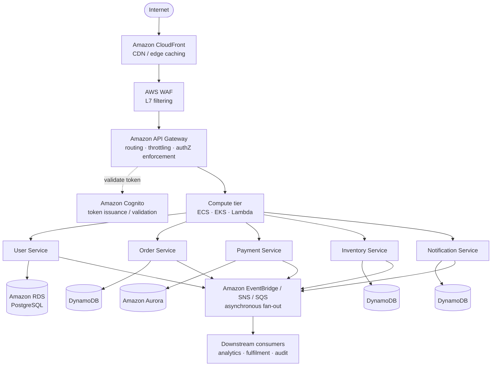

**Business-Capability vs Technical-Layer Decomposition**

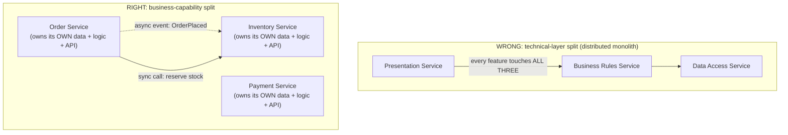

**Strangler Fig Migration**

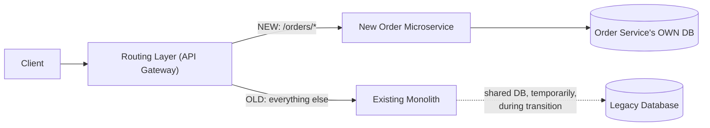

**Class design — the Strangler Fig Routing Gateway with hash-sticky cutover**

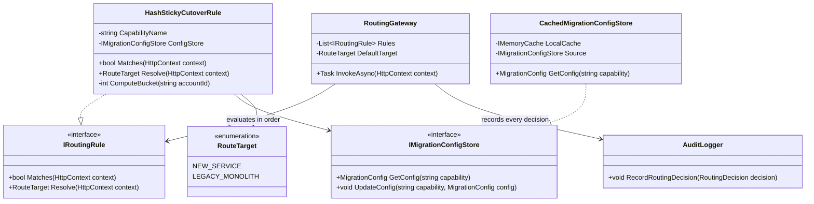

**Sequence diagram — a request during a ramping cutover**

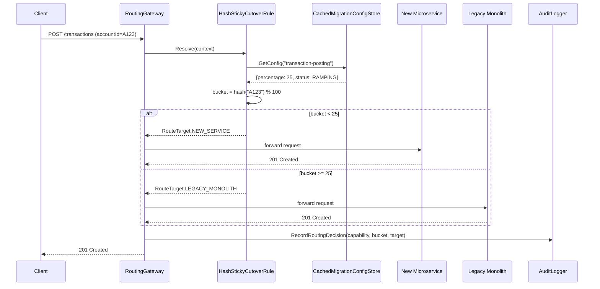

### Module 50 — Microservices: Resilience Patterns, Distributed Observability & the Sidecar Model
*Source: `02-Resilience-Observability-Sidecar-Patterns.md`*

**Resilience Layering (a Single Outbound Call)**

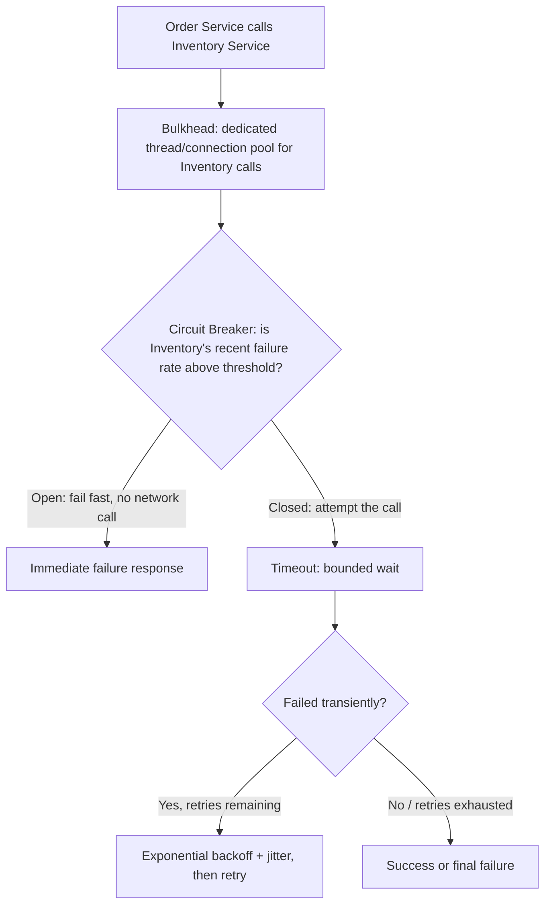

**Distributed Tracing Across a Call Chain**

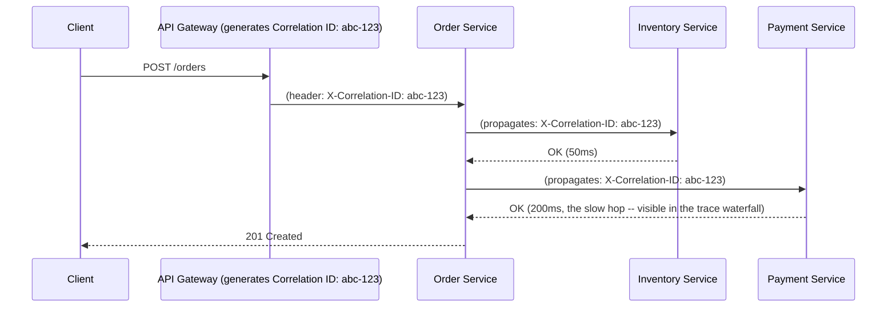

**Sidecar / Service-Mesh Architecture (Preview)**

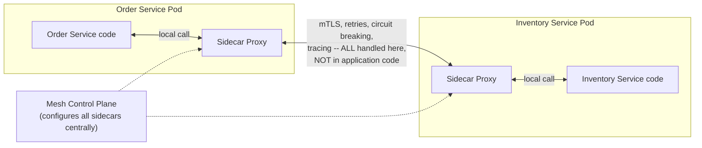

**Class design — per-dependency resilience wrapper with tiered fallback**

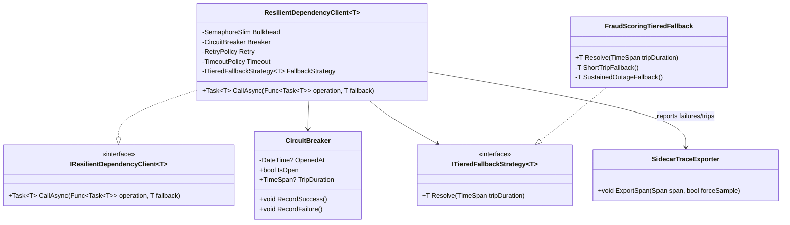

**Sequence diagram — sustained-outage fallback escalation**

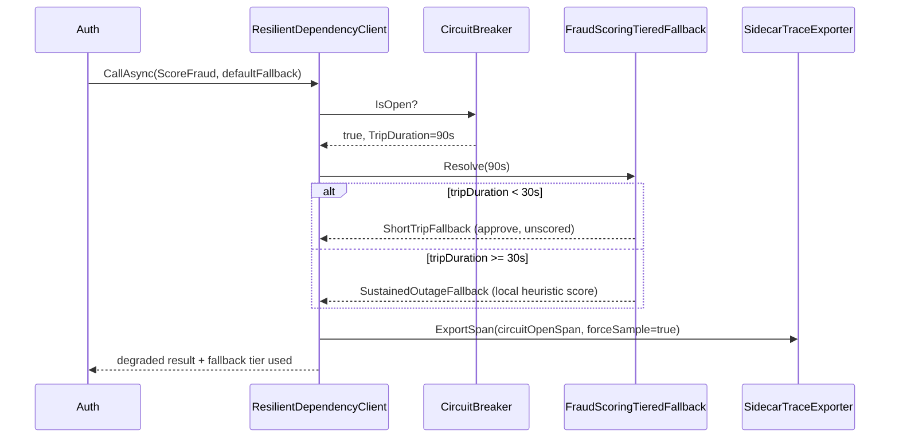

### Module 51 — Microservices: Versioning & Schema Evolution, Testing Strategies, Deployment Patterns & Team Topologies
*Source: `03-Versioning-Testing-Deployment-TeamTopologies.md`*

**Testing Pyramid for Microservices**

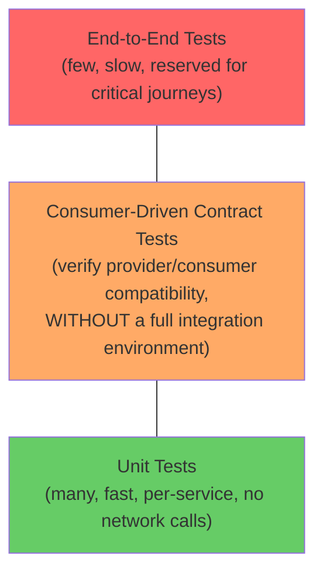

**Blue-Green vs Canary**

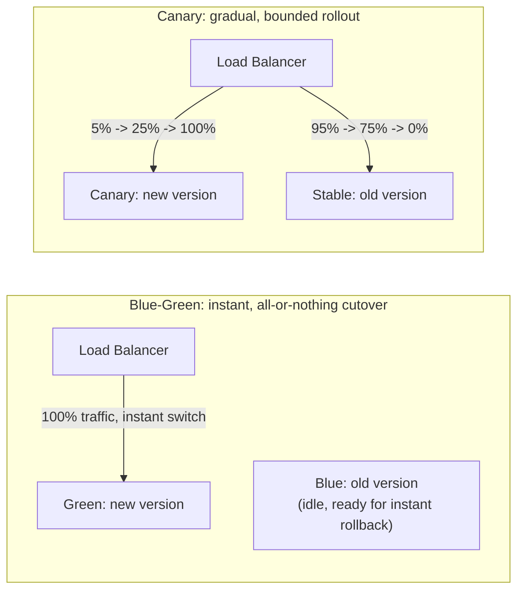

**Inverse Conway Maneuver**

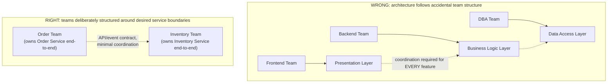

**Class design — the deployment-governance pipeline orchestrator**

```mermaid
classDiagram
    class IDeploymentGate {
        <<interface>>
        +GateResult Evaluate(DeploymentContext context)
    }
    class BreakingChangeGate {
        -SchemaCompatibilityChecker Checker
        +GateResult Evaluate(DeploymentContext context)
    }
    class ContractVerificationGate {
        -IContractRegistry Registry
        +GateResult Evaluate(DeploymentContext context)
    }
    class CanaryAnalysisGate {
        -ICanaryAnalysisService Analyzer
        +GateResult Evaluate(DeploymentContext context)
    }
    class DeploymentPipeline {
        -List~IDeploymentGate~ Gates
        -IMigrationProgressTracker Tracker
        +Task~PipelineResult~ RunAsync(DeploymentContext context)
    }
    class ICanaryAnalysisService {
        <<interface>>
        +Task~CanaryVerdict~ Analyze(string service, CohortMetrics canary, CohortMetrics stable)
    }
    class SequentialStatisticalCanaryAnalyzer {
        +Task~CanaryVerdict~ Analyze(string service, CohortMetrics canary, CohortMetrics stable)
        -bool MeetsMinimumSampleSize(CohortMetrics m)
        -bool RegressedVsOwnBaseline(CohortMetrics canary)
    }

    DeploymentPipeline --> IDeploymentGate : evaluates in sequence
    BreakingChangeGate ..|> IDeploymentGate
    ContractVerificationGate ..|> IDeploymentGate
    CanaryAnalysisGate ..|> IDeploymentGate
    CanaryAnalysisGate --> ICanaryAnalysisService
    SequentialStatisticalCanaryAnalyzer ..|> ICanaryAnalysisService
```

**Sequence diagram — a deployment passing through all four gates**

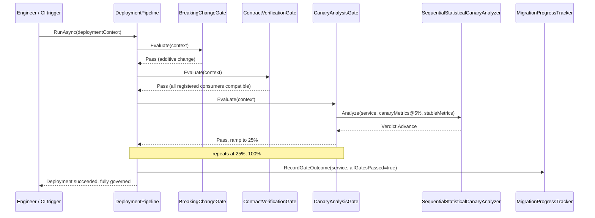

### Module 135 — Microservices: Data Consistency & Query Patterns Across Service Boundaries
*Source: `04-Data-Consistency-Query-Patterns-Across-Service-Boundaries.md`*

**3. Visual Architecture**

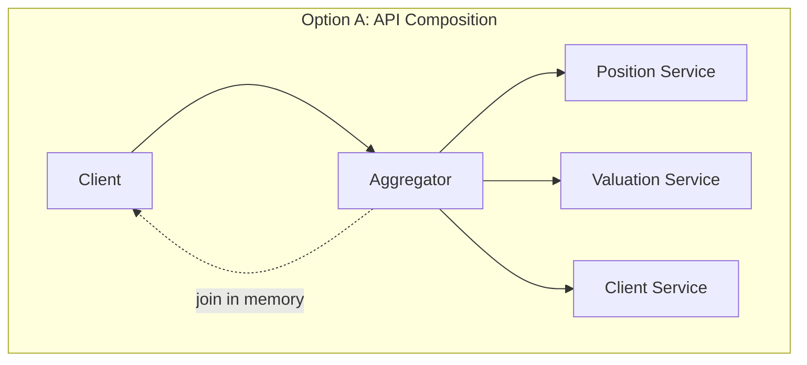

**3. Visual Architecture**

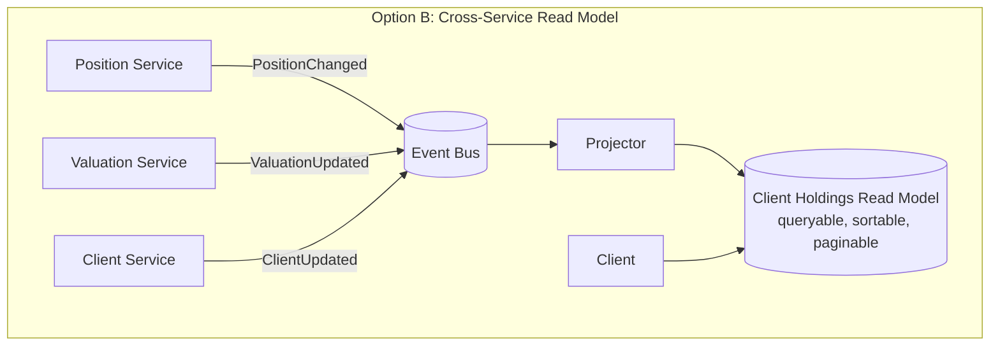

**3. Visual Architecture**

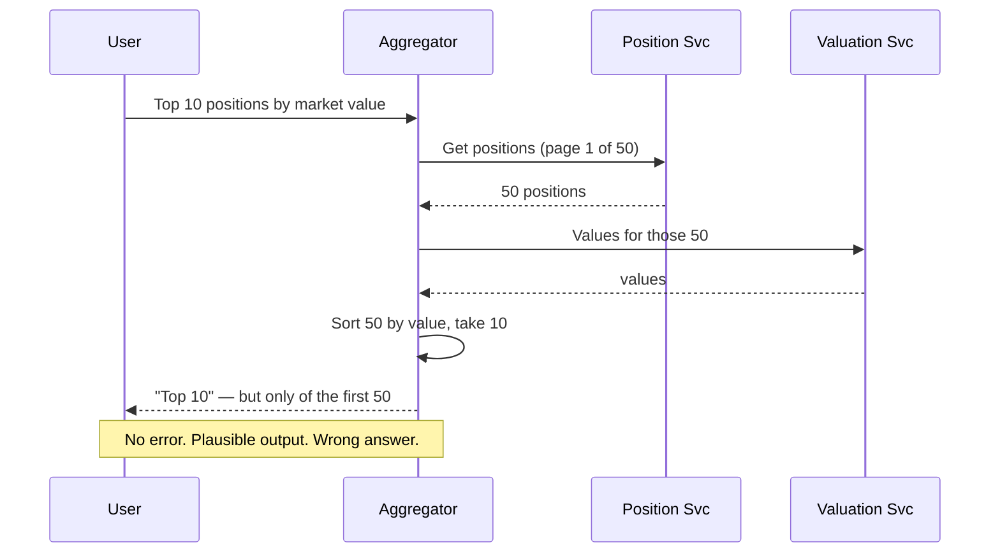

**13. Low-Level Design**

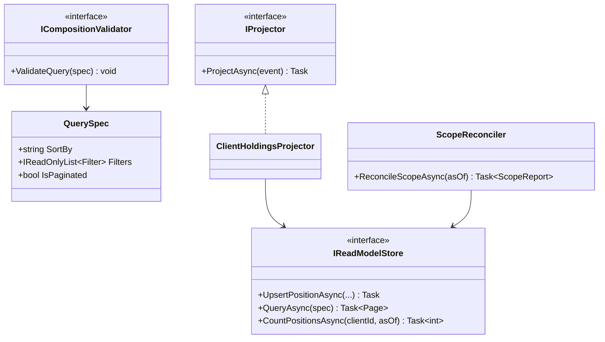

### Module 136 — Microservices: Service Discovery, Communication Infrastructure & Backpressure
*Source: `05-Service-Discovery-Communication-Infrastructure-Backpressure.md`*

**3. Visual Architecture**

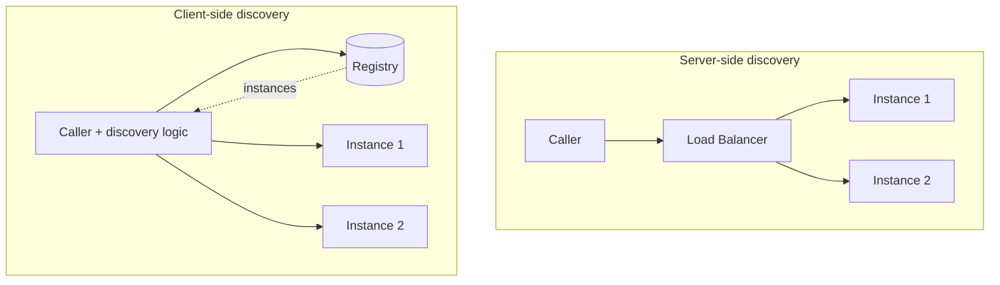

**3. Visual Architecture**

```mermaid
sequenceDiagram
 participant C as Caller (deadline 2s)
 participant A as Service A
 participant B as Service B

 C->>A: Request (deadline: 2000ms)
 Note over A: elapsed 800ms
 A->>B: Request (deadline: 1200ms) ← remaining budget propagated
 Note over B: at 1200ms, B abandons
 B-->>A: DeadlineExceeded
 A-->>C: DeadlineExceeded
 Note over C,B: Without propagation, B works 2000ms more<br/>for a response nobody reads
```

**3. Visual Architecture**

```mermaid
graph LR
 subgraph "Congestive collapse without backpressure"
 L[Load ↑] --> Q[Queue grows]
 Q --> LAT[Latency ↑]
 LAT --> TO[Callers time out]
 TO --> R[Retries]
 R --> L
 end
 Note1["Throughput DECREASES as offered load increases"]
```

**13. Low-Level Design**

```mermaid
classDiagram
 class IServiceResolver {
 <<interface>>
 +ResolveAsync(serviceName) Task~IReadOnlyList~Endpoint~~
 }
 class CachingResolver {
 -lastKnownGood
 +ResolveAsync(name) Task
 }
 class ILoadBalancer {
 <<interface>>
 +Choose(endpoints) Endpoint
 }
 class LeastOutstandingBalancer
 class DeadlineMiddleware {
 +HandleAsync(req, ct) Task~Result~
 }
 class BoundedWorkQueue {
 +TryEnqueue(item) bool
 }
 class RetryBudget {
 +TryConsumeRetry bool
 }

 IServiceResolver <|.. CachingResolver
 ILoadBalancer <|.. LeastOutstandingBalancer
 DeadlineMiddleware --> BoundedWorkQueue
```

### Module 137 — Microservices: Multi-Region & Cell-Based Architecture — Containing Blast Radius
*Source: `06-MultiRegion-Cell-Based-Architecture-Blast-Radius.md`*

**3. Visual Architecture**

```mermaid
graph TB
 U[Users] --> R{Cell Router<br/>simple, highly available}
 R -->|customers A-F| C1[Cell 1]
 R -->|customers G-M| C2[Cell 2]
 R -->|customers N-Z| C3[Cell 3]

 subgraph C1[Cell 1 — complete stack]
 S1[Services] --> D1[(Database)]
 S1 --> Q1[Queue]
 S1 --> K1[Cache]
 end
```

**3. Visual Architecture**

```mermaid
graph TB
 subgraph "Region A"
 RA[Router A] --> A1[Cell A1]
 RA --> A2[Cell A2]
 end
 subgraph "Region B"
 RB[Router B] --> B1[Cell B1]
 RB --> B2[Cell B2]
 end
 GLB[Global Routing] --> RA
 GLB --> RB
 CP[(Control Plane<br/>shared — must not be on the request path)] -.config, deploy.-> A1
 CP -.-> B1
```

**3. Visual Architecture**

```mermaid
graph LR
 subgraph "Blast radius comparison"
 M["Monolithic: 1 failure = 100% impact"]
 C["5 cells: 1 failure = 20% impact"]
 C50["50 cells: 1 failure = 2% impact"]
 end
 Note["Smaller cells contain more, cost more to operate"]
```

**13. Low-Level Design**

```mermaid
classDiagram
 class CellRouter {
 +Route(customer) CellId
 +ApplyRefresh(assignments) void
 }
 class IConfigurationCache {
 <<interface>>
 +Current Configuration
 +TryRefresh(payload) bool
 }
 class ValidatedConfigCache {
 -lastGood
 -diskCache
 }
 class CorrelationDetector {
 +Evaluate(cellHealth) CorrelationVerdict
 }
 class MigrationOrchestrator {
 +MigrateAsync(customer, from, to) Task
 }
 class ICellHealthSource {
 <<interface>>
 +CurrentWindows IReadOnlyDictionary~CellId,HealthWindow~
 }

 IConfigurationCache <|.. ValidatedConfigCache
 CorrelationDetector --> ICellHealthSource
 MigrationOrchestrator --> CellRouter
```

### Module 138 — Microservices: Decomposition Failures & Service Right-Sizing
*Source: `07-Decomposition-Failures-Service-Right-Sizing.md`*

**3. Visual Architecture**

```mermaid
graph TB
 subgraph "Distributed monolith — separately deployed, not independently deployable"
 A[Service A] -->|sync| B[Service B]
 B -->|sync| C[Service C]
 C -->|sync| D[Service D]
 A -.must release together.-> B
 B -.must release together.-> C
 end
```

**3. Visual Architecture**

```mermaid
graph LR
 subgraph "Co-change heatmap"
 M["Position ↔ Valuation: 68% co-change → merge candidate"]
 M2["Position ↔ Client: 4% co-change → boundary healthy"]
 M3["Reporting ↔ Valuation: 11% co-change → boundary healthy"]
 end
```

**3. Visual Architecture**

```mermaid
graph TB
 subgraph "Correction options"
 S[Symptom observed] --> D{Diagnosis}
 D -->|invariant split| MOVE[Move capability<br/>to the owning service]
 D -->|always changed together| MERGE[Merge services]
 D -->|service does two things| SPLIT[Split service]
 D -->|too small to justify overhead| MERGE
 end
```

**13. Low-Level Design**

```mermaid
classDiagram
 class CoChangeAnalyzer {
 +Analyze(releases) IReadOnlyList~CoChangePair~
 }
 class IndependenceMeasurer {
 +Measure(releases) IndependenceReport
 }
 class SplitInvariantDetector {
 +Detect(sagas) IReadOnlyList~SplitInvariant~
 }
 class MergeAssessor {
 +Assess(a, b) MergeAssessment
 }
 class IOwnershipRegistry {
 <<interface>>
 +Owner(service) TeamId
 }
 class IRoadmapSource {
 <<interface>>
 +PlannedChangesTouching(a, b) int
 }

 MergeAssessor --> CoChangeAnalyzer
 MergeAssessor --> IOwnershipRegistry
 MergeAssessor --> IRoadmapSource
 MergeAssessor --> SplitInvariantDetector
```

### Module 139 — Microservices: Capstone — Platform Engineering at Scale
*Source: `08-Capstone-Microservices-Platform-Engineering-At-Scale.md`*

**1. Fundamentals**

```text
Without a platform: 19 teams × (pipeline + observability + resilience + deployment) = 19 divergent implementations
With a platform: platform team builds paved paths → teams consume → consistency without gatekeeping
 ↑ ↓
 └────────── feedback: what teams actually need ──────┘
```

**3. Visual Architecture**

```mermaid
graph TB
 subgraph "Platform (paved path)"
 SCAF[Service Scaffolding] --> LIB[Versioned Platform Libraries]
 LIB --> RES[Resilience defaults:<br/>deadlines, retry budgets, bounded queues]
 LIB --> OBS[Observability instrumentation]
 PIPE[CI/CD Templates] --> FIT[Fitness functions]
 CAT[(Service Catalog<br/>authoritative)] --> DEP[Deployment]
 CAT --> ALERT[Alert routing]
 CAT --> ANALYSIS[Co-change / dependency analysis]
 end
 T1[Team 1] -.self-service.-> SCAF
 T2[Team 2] -.self-service.-> SCAF
 T19[Team 19] -.self-service.-> SCAF
 T2 -.off-path: feedback.-> PLATFORM_TEAM[Platform team]
```

**3. Visual Architecture**

```mermaid
graph LR
 subgraph "Golden path drift"
 TPL_V1[Template v1] -->|copy| S1[Services 1-40<br/>frozen at v1]
 TPL_V2[Template v2] -->|copy| S2[Services 41-90<br/>frozen at v2]
 TPL_V3[Template v3] -->|copy| S3[Services 91-140<br/>current]
 end
 Note["Oldest services = most critical = least platform capability"]
```

**3. Visual Architecture**

```mermaid
graph TB
 subgraph "Governance mechanisms, descending preference"
 A[Structurally impossible] --> B[Default-correct]
 B --> C[Automatically verified]
 C --> D[Reviewed — novel decisions only]
 end
```

**13. Low-Level Design**

```mermaid
classDiagram
 class ServiceRecord {
 +string Name
 +Criticality Criticality
 +Version PlatformVersion
 +IReadOnlySet~CapabilityId~ ConsumedCapabilities
 }
 class CurrencyReporter {
 +Report(services, current) CurrencyReport
 }
 class OffPathDetector {
 +Detect(services) IReadOnlyList~OffPathFinding~
 }
 class UpgradeProposer {
 +ProposeUpgradeAsync(service, target) Task~UpgradeResult~
 }
 class IncidentPatternAnalyzer {
 +AnalyzePatterns(incidents, window) IReadOnlyList~PlatformGap~
 }
 class IServiceCatalog {
 <<interface>>
 +AllAsync Task~IReadOnlyList~ServiceRecord~~
 }

 CurrencyReporter --> IServiceCatalog
 OffPathDetector --> IServiceCatalog
 UpgradeProposer --> IServiceCatalog
```

### Module 173 — Microservices: Load Balancing on AWS — ALB, NLB, Target Groups, Route 53 & Global Accelerator
*Source: `09-LoadBalancing-AWS-ALB-NLB-TargetGroups-Route53-GlobalAccelerator.md`*

**Regional topology: north-south and east-west**

```mermaid
graph TB
    C[Clients / Acquirer networks]
    GA[Global Accelerator<br/>2 static anycast IPs]
    C --> GA

    subgraph REGION["Region: eu-west-1"]
        WAF[AWS WAF]
        ALB["Public ALB<br/>idle_timeout=60s<br/>SG attached"]
        GA --> WAF --> ALB

        subgraph AZA["AZ a"]
            NA[ALB node]
            TA1[Task a1]
            TA2[Task a2]
        end
        subgraph AZB["AZ b"]
            NB[ALB node]
            TB1[Task b1]
            TB2[Task b2]
        end

        ALB --> NA
        ALB --> NB
        NA --> TA1
        NA --> TA2
        NA -.cross-zone.-> TB1
        NB --> TB1
        NB --> TB2
        NB -.cross-zone.-> TA1

        IALB["Internal ALB / mesh<br/>east-west"]
        TA1 --> IALB
        TB1 --> IALB
        IALB --> LEDGER[Ledger service TG]
        IALB --> FRAUD[Fraud service TG]
    end
```

**The 502 keep-alive race (Pair 1 in §2.4)**

```mermaid
sequenceDiagram
    participant Cl as Client
    participant LB as ALB node
    participant T as Target (keep-alive 130s)
    Note over LB,T: LB idle_timeout raised to 300s for a reporting endpoint
    Cl->>LB: POST /authorize
    LB->>T: forward on pooled connection
    T-->>LB: 200 OK
    Note over LB,T: connection pooled; LB will reuse for up to 300s
    Note over T: at t=130s target closes the idle connection
    T-->>LB: FIN
    Cl->>LB: POST /authorize (new request)
    LB->>T: forward on the (now closing) pooled connection
    T--xLB: RST / no response
    LB-->>Cl: HTTP 502 (TargetConnectionErrorCount++)
    Note over Cl,T: application logs show nothing — the request never arrived
```

**Class diagram**

```mermaid
classDiagram
    class IReadinessGate {
        <<interface>>
        +bool IsReady
        +void Close(string reason)
    }
    class ReadinessGate {
        -volatile bool _ready
        -string _reason
        +bool IsReady
        +void Close(string reason)
    }
    class IInFlightTracker {
        <<interface>>
        +int Count
        +IDisposable Enter()
        +Task WaitForDrainAsync(TimeSpan, CancellationToken)
    }
    class InFlightTracker {
        -int _count
        -TaskCompletionSource _drained
    }
    class DrainOptions {
        +TimeSpan LbObservationDelay
        +TimeSpan MaxDrainDuration
    }
    class DrainCoordinator {
        -IReadinessGate _gate
        -IInFlightTracker _tracker
        -DrainOptions _options
        +Task DrainAsync(CancellationToken)
    }
    class InFlightTrackingMiddleware
    class ReadinessEndpoint
    class LivenessEndpoint

    IReadinessGate <|.. ReadinessGate
    IInFlightTracker <|.. InFlightTracker
    DrainCoordinator --> IReadinessGate
    DrainCoordinator --> IInFlightTracker
    DrainCoordinator --> DrainOptions
    InFlightTrackingMiddleware --> IInFlightTracker
    ReadinessEndpoint --> IReadinessGate
```

**Sequence diagram**

```mermaid
sequenceDiagram
    participant O as Orchestrator (ECS/K8s)
    participant A as App
    participant G as ReadinessGate
    participant LB as ALB target group
    O->>A: SIGTERM
    A->>G: Close("shutdown")
    Note over LB: next readiness probe fails
    LB-->>LB: unhealthyThreshold reached -> draining
    Note over A,LB: app KEEPS SERVING throughout
    A->>A: wait LbObservationDelay
    LB->>A: in-flight requests only
    A->>A: WaitForDrainAsync(MaxDrainDuration)
    A-->>O: exit 0 (before stopTimeout SIGKILL)
```
