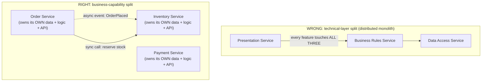
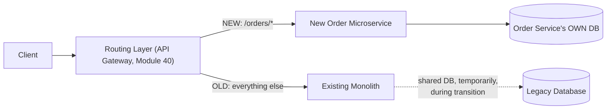

# Module 49 — Microservices: Decomposition, Communication Patterns & the Strangler Fig Migration

> Domain: Microservices | Level: Beginner → Expert | Prerequisite: [[../16-Distributed-Systems/02-Failure-Detection-Idempotency-Outbox]], [[../14-System-Design/07-Designing-Amazon-Ecommerce]] (the order-fulfillment Saga, a direct microservices example), [[../10-SOLID/01-SOLID-Principles-Deep-Dive]] §2.1 (SRP, the actual theoretical basis for service decomposition)

---

## 1. Fundamentals

### What are microservices, and why does correct decomposition matter more than the technology itself?
Microservices is an architectural style structuring an application as a collection of small, **independently deployable** services, each owning its own data and communicating over the network (not in-process method calls). The single most consequential decision in any microservices architecture is **where to draw the service boundaries** — get this right, and services can evolve, scale, and fail independently; get it wrong (a poorly-decomposed "distributed monolith"), and you inherit every one of Module 47-48's distributed-systems complexity costs (network latency, partial failure, eventual consistency) **without** gaining any of microservices' actual benefits (independent deployability, fault isolation, team autonomy).

### Why does this matter?
Because Module 30 §2.1's Single Responsibility Principle ("one reason to change," tied to independently-varying stakeholders) is the **actual theoretical basis** for correct service decomposition, just applied at the service-boundary level instead of the class level — a service boundary drawn along genuinely independently-varying business capabilities (directly Domain-Driven Design's "bounded context" concept, a later dedicated module) succeeds; one drawn along a technical or organizational convenience that doesn't reflect genuine independent variability produces the distributed-monolith anti-pattern.

### When does this matter?
Any organization considering or operating a microservices architecture; the depth matters for correctly choosing between synchronous (REST/gRPC) and asynchronous (message-queue-based) inter-service communication for a given interaction, and for executing a safe, incremental migration from an existing monolith (the Strangler Fig pattern) rather than a risky "rewrite everything" big-bang approach.

### How does it work (30,000-ft view)?
```
Decomposition: split along business capabilities (Order Service, Inventory Service, Payment Service),
                NOT along technical layers (a "Database Service," a "Business Logic Service") --
                each service owns its OWN data, no shared database across service boundaries
Communication: synchronous (REST/gRPC, for request/response needs) vs asynchronous
                (message queue/event, for fire-and-forget or eventual-consistency-tolerant needs)
Migration: Strangler Fig -- incrementally route specific functionality from the old monolith
                to new microservices, one capability at a time, never a risky big-bang rewrite
```

---

## 2. Deep Dive

### 2.1 Decomposition — Business Capability, Not Technical Layer
The single most common, most damaging microservices decomposition mistake: splitting services along **technical layers** (a "Data Access Service," a "Business Rules Service," a "Presentation Service") rather than **business capabilities** (an "Order Service," an "Inventory Service," a "Payment Service") — the layer-based split means nearly every genuine business feature (placing an order) requires **coordinated changes across multiple services simultaneously** (the data-access service, the business-rules service, and the presentation service all need to change together to add one new order field), producing exactly the "distributed monolith" anti-pattern: all the network-call overhead and deployment complexity of microservices, with **none** of the independent-deployability benefit, since nothing can actually be deployed independently when every feature touches every "service." Business-capability decomposition (directly Module 30 §2.1's SRP, applied at this altitude) ensures each service can evolve and deploy independently because its boundary aligns with an actual, independently-varying unit of business change.

### 2.2 Database-per-Service — the Non-Negotiable Data-Ownership Rule
Each microservice must own its **own** database, with **no other service accessing it directly** — a shared database across service boundaries is the second-most-common distributed-monolith cause: it recreates tight coupling (any schema change requires coordinating across every service touching that shared database, exactly negating independent deployability) and reintroduces the exact dual-write/distributed-transaction problems Module 47-48 addressed, since multiple services writing to overlapping tables in one shared database can no longer cleanly reason about transactional boundaries per-service. Cross-service data access happens **only** through each service's own API (synchronous request, §2.3) or via events it publishes (asynchronous, §2.4/Module 48's Outbox pattern) — never via a backdoor, direct database connection to another service's tables.

### 2.3 Synchronous Communication (REST/gRPC) — When the Caller Needs an Immediate Answer
Synchronous, request/response communication (REST, Module 15, or gRPC — a binary, contract-first RPC protocol offering better performance and stronger typing than REST for internal service-to-service calls specifically) is appropriate when the calling service **genuinely needs the response before it can proceed** (checking current inventory availability before confirming an order can be placed) — but every synchronous call introduces a **direct availability dependency**: if the called service is down/slow, the calling service is directly, immediately affected (Module 40's circuit-breaker/timeout discipline becomes mandatory for every synchronous inter-service call, not optional), and a chain of synchronous calls (Service A calls B calls C) means A's availability is now bounded by the **product** of B's and C's availability, a compounding reliability cost that grows with every additional synchronous hop in a call chain.

### 2.4 Asynchronous Communication (Events/Message Queues) — Decoupling Availability
Asynchronous, event-based communication (a service publishes "OrderPlaced," and any interested service — Inventory, Shipping, Analytics — subscribes and reacts independently, directly Module 48's Outbox-pattern-published-events) **decouples the publisher's availability from the subscriber's** — the Order service can successfully complete and respond to its caller even if the Shipping service happens to be temporarily down, since the event simply waits in the queue/topic until Shipping recovers and processes it — this is precisely why event-driven, asynchronous communication is generally preferred over synchronous call chains **wherever the interaction doesn't genuinely require an immediate response**, directly reducing the compounding-availability-dependency risk §2.3 describes; the cost is the eventual-consistency window (directly Module 47 §Advanced Q6's business-risk-communication discipline) between the event being published and every subscriber having processed it.

### 2.5 The Strangler Fig Pattern — Incremental Migration Without a Big-Bang Rewrite
Named after a fig species that gradually envelops and eventually replaces a host tree, the Strangler Fig migration pattern routes traffic for a **specific, narrow piece of functionality** to a new microservice (via a routing/proxy layer sitting in front of the existing monolith, directly Module 40's API-Gateway pattern applied specifically to migration routing) while the **remaining** functionality continues being served by the monolith unchanged — incrementally, one capability at a time, more functionality is "strangled" out of the monolith into new services, until eventually the monolith either shrinks to nothing or remains only for genuinely stable, rarely-changing functionality not worth migrating — directly this course's recurring "expand, don't break; migrate incrementally with a rollback path at every step" principle (Module 6 §Advanced Q9, Module 23 §Advanced Q6, Module 27 §Advanced Q3), now applied at the largest possible scale: an entire application's architectural transformation.

## 3. Visual Architecture

### Business-Capability vs Technical-Layer Decomposition


### Strangler Fig Migration


## 4. Production Example
**Scenario**: An organization migrating from a monolith to microservices initially decomposed along **technical layers** (a shared "Data Service" exposing generic CRUD operations over the legacy database, a "Business Logic Service" calling it, and a "Web API Service" calling that) — six months in, the team discovered that adding a single new business feature (a discount-code system touching order data, pricing logic, and the API surface) required **coordinated, simultaneous deployment** of all three "services," since the feature's logic was scattered across all three layers — the team had built exactly the distributed-monolith anti-pattern: network-call overhead and operational complexity (three services to deploy, monitor, and version) with zero independent-deployability benefit, since nothing could actually ship independently. **Investigation**: a retrospective architecture review (prompted by the coordinated-deployment pain becoming increasingly costly and frequent) identified the root cause as decomposing along technical layers rather than business capabilities — every genuine business change cut across all three "services" simultaneously by construction, since the layers were never independently-varying units in the first place. **Fix**: re-decomposed around business capabilities (an Order Service owning order data/logic/API end-to-end, a Pricing Service similarly self-contained) — each capability-aligned service could now genuinely deploy independently, since a pricing-logic change only touched the Pricing Service, not three coordinated layers. **Lesson**: this is precisely Module 30 §2.1's SRP applied incorrectly at the service-boundary altitude — the team correctly recognized "we should split into multiple services" but split along the **wrong** dimension (technical layers, which don't actually vary independently for any real business feature) rather than the dimension that genuinely does vary independently (business capabilities) — a costly, months-long lesson that a correct requirements-clarification question ("which of these proposed service boundaries would let a single business feature ship without touching any other service?") would have surfaced during the original design discussion.

## 5. Best Practices
- Decompose services along business capabilities (aligned with independently-varying stakeholders/features, Module 30 §2.1's SRP), never along technical layers.
- Enforce database-per-service strictly — no service ever directly accesses another service's database tables.
- Use synchronous communication (with mandatory timeouts/circuit breakers) only when the caller genuinely needs an immediate response; default to asynchronous, event-based communication wherever eventual consistency is acceptable.
- Use the Strangler Fig pattern for any monolith-to-microservices migration — incremental, capability-by-capability, with a routing layer and rollback path at every step, never a big-bang rewrite.

## 6. Anti-patterns
- Decomposing along technical layers instead of business capabilities, producing the distributed-monolith anti-pattern (§4's incident) — all the complexity cost of microservices, none of the independent-deployability benefit.
- Sharing a database across service boundaries, reintroducing tight coupling and dual-write risks (Module 48) that database-per-service exists to prevent.
- Defaulting to synchronous call chains for interactions that don't genuinely require an immediate response, compounding availability risk unnecessarily across every additional hop.
- Attempting a big-bang monolith-to-microservices rewrite instead of the Strangler Fig's incremental, capability-by-capability migration with a rollback path at every step.

---

## 10. Interview Questions

### Basic (10)
1. **Q: What is the single most consequential decision in a microservices architecture?** **A:** Where to draw service boundaries — correct decomposition.
2. **Q: Should services be decomposed along technical layers or business capabilities?** **A:** Business capabilities — technical-layer decomposition produces the distributed-monolith anti-pattern.
3. **Q: What is the database-per-service rule?** **A:** Each microservice owns its own database exclusively; no other service accesses it directly.
4. **Q: When is synchronous (REST/gRPC) communication appropriate between services?** **A:** When the calling service genuinely needs an immediate response before it can proceed.
5. **Q: When is asynchronous (event-based) communication preferred?** **A:** Whenever the interaction can tolerate eventual consistency, decoupling the publisher's availability from subscribers'.
6. **Q: What is the distributed-monolith anti-pattern?** **A:** A microservices architecture with all the network/operational complexity of separate services but none of the independent-deployability benefit, typically from incorrect decomposition.
7. **Q: What is the Strangler Fig pattern?** **A:** An incremental migration approach routing specific functionality to new microservices one capability at a time, rather than a risky big-bang rewrite.
8. **Q: What theoretical principle underlies correct service decomposition?** **A:** The Single Responsibility Principle (Module 30), applied at the service-boundary level.
9. **Q: Why does a chain of synchronous calls compound availability risk?** **A:** The calling service's effective availability becomes bounded by the product of every downstream service's availability in the chain.
10. **Q: What role does a routing/gateway layer play in a Strangler Fig migration?** **A:** Directing specific, migrated functionality to new microservices while the remaining, not-yet-migrated functionality continues being served by the monolith.

### Intermediate (10)
1. **Q: Why does technical-layer decomposition mean nearly every feature requires coordinated multi-service deployment?** **A:** Because a real business feature's logic is scattered across the layers by construction (data access, business rules, presentation) — any feature touching all three requires all three "services" to change and deploy together, eliminating independent deployability.
2. **Q: Why is a shared database across service boundaries considered a severe anti-pattern, not just a minor inefficiency?** **A:** It reintroduces tight coupling (schema changes require cross-service coordination) and the exact dual-write/transactional-boundary problems (Module 48) database-per-service exists specifically to avoid.
3. **Q: Why does gRPC often outperform REST/JSON for internal service-to-service calls specifically?** **A:** Its binary protocol and HTTP/2 multiplexing reduce serialization overhead and connection overhead compared to REST/JSON, particularly valuable for high-frequency internal communication.
4. **Q: Why should "it's internal traffic" never be treated as sufficient justification for skipping authentication/authorization between services?** **A:** A compromised service or misconfigured network could allow unauthorized lateral access — each service's API must independently verify caller authorization regardless of the traffic's apparent origin.
5. **Q: Why does asynchronous communication's eventual-consistency window need explicit business-stakeholder communication, not just engineering awareness?** **A:** Directly Module 47 §Advanced Q6's point — a temporarily-stale view resulting from asynchronous processing could be unacceptable for certain business/compliance contexts, requiring the trade-off to be a deliberate, communicated decision, not an assumed-acceptable engineering default.
6. **Q: Why is the Strangler Fig pattern preferred over a big-bang rewrite, beyond just "it's safer"?** **A:** It allows continuous validation and rollback at each incremental step, directly this course's recurring "expand, don't break" migration discipline — a big-bang rewrite defers all risk to one large, hard-to-partially-roll-back cutover event.
7. **Q: Why might a service's own independent scaling need be forfeited under the distributed-monolith anti-pattern?** **A:** If every "service" must deploy and scale together (due to coordinated-feature-deployment coupling), each one can't be scaled according to its own, independent load characteristics — exactly the scalability benefit microservices are meant to provide, lost.
8. **Q: Why does the §4 incident's "coordinated deployment pain becoming increasingly costly and frequent" specifically indicate a decomposition problem, not just normal microservices operational overhead?** **A:** Normal, correctly-decomposed microservices should rarely require coordinated multi-service deployment for a single feature — persistent, frequent coordination need is the specific symptom indicating the service boundaries don't align with actual, independently-varying business capabilities.
9. **Q: Why does database-per-service limit security blast radius, beyond just architectural cleanliness?** **A:** A compromised service cannot directly read/write another service's data without shared database access — the boundary that enables independent deployability also happens to limit how far a single service's compromise can directly propagate.
10. **Q: Why would a team choose to route a Strangler Fig migration's new-service traffic via a dedicated routing layer rather than modifying the monolith's own routing logic directly?** **A:** A dedicated, external routing layer (directly Module 40's gateway pattern) keeps the migration's routing logic decoupled from the monolith's own code, letting migration decisions (which capability goes where) be managed independently of the monolith's ongoing, unrelated development, and providing a natural, centralized point for gradual traffic-percentage cutover and quick rollback.

### Advanced (10)
1. **Q: Diagnose the technical-layer-decomposition production incident (§4) from first principles, and design the specific requirements-clarification question during initial architecture design that would have caught this mistake before six months of accumulated pain.**
   **A:** Root cause: decomposing along a dimension (technical layers) that doesn't correspond to how business features/changes actually distribute across the codebase. Safeguard question: for each proposed service boundary, explicitly ask "if we needed to ship [a specific, concrete, representative business feature] tomorrow, which of these services would need to change, and could they deploy independently of each other for this specific feature?" — applying this test against several representative, realistic features **during design**, before implementation, would have revealed that nearly every feature touched all three proposed "services" simultaneously, surfacing the decomposition flaw immediately rather than after months of live, painful, repeated coordinated-deployment friction.
2. **Q: Explain how you would design the transition period during a Strangler Fig migration where the new Order microservice and the legacy monolith temporarily need to share some underlying data, without permanently violating database-per-service.**
   **A:** Use a **temporary**, explicitly time-boxed data-synchronization mechanism (a CDC pipeline, directly Module 48's Outbox/CDC pattern, replicating relevant data changes bidirectionally or one-directionally between the legacy database and the new service's own database during the transition) rather than direct, ongoing shared-database access — critically, this sync mechanism should be treated as **migration scaffolding with an explicit removal date**, not a permanent architectural feature, directly Module 31 §Advanced Q6's "a migration-motivated Adapter needs a tracked removal date, not indefinite retention" discipline, now applied to a temporary data-sync bridge instead of a code-level adapter.
3. **Q: Design a strategy for deciding, service-by-service, whether a given inter-service interaction in a Strangler Fig migration should be synchronous or asynchronous, using a concrete example from the order-fulfillment domain (Module 43).**
   **A:** "Check current inventory availability before confirming an order" genuinely needs an immediate answer (the customer is waiting to know if their order can proceed) — synchronous, with a circuit breaker and sensible timeout. "Notify the warehouse to begin fulfillment" and "update analytics dashboards" don't need to block the order-confirmation response at all — asynchronous, via published events (directly Module 43's Saga-based fulfillment workflow, itself already correctly using this synchronous-vs-asynchronous distinction) — the deciding question, applied per interaction: "does the caller's own response to *its* caller need to wait for this specific downstream result, or can it proceed and let the downstream effect happen eventually?"
4. **Q: Explain how you would test a proposed service decomposition for the distributed-monolith anti-pattern before committing significant implementation effort, generalizing Advanced Q1's design-time question into a more rigorous validation technique.**
   **A:** Conduct a **feature-mapping exercise**: enumerate a representative sample of 10-20 realistic, planned business features/changes, and for each, explicitly trace which proposed services would need to change — compute the resulting "average number of services touched per feature" metric; a healthy, business-capability-aligned decomposition should show most features touching **one**, occasionally two, services; a decomposition where most features touch three or more services (as in §4's incident) is a strong, quantifiable, pre-implementation signal of the distributed-monolith risk, converting an intuitive design-review judgment call into a more rigorous, numeric validation exercise.
5. **Q: A team's Strangler Fig migration has been running for over a year, with the routing layer's configuration growing increasingly complex (dozens of narrow, capability-specific routing rules) and itself becoming hard to reason about and modify safely. Evaluate this situation and recommend a course of action.**
   **A:** This is a realistic, common Strangler Fig migration-maturity symptom — the routing layer, originally a simple, temporary scaffolding mechanism, has itself accumulated the complexity of a genuine, permanent architectural component (directly analogous to Advanced Q2's "migration scaffolding needs an explicit lifecycle," now applied to the routing layer itself) — recommend periodically consolidating/simplifying routing rules as migration progresses (rather than purely, indefinitely accumulating new rules), and explicitly tracking migration completion percentage as a standing metric with a target end-state (either full monolith retirement, or an explicitly-decided, permanent hybrid architecture) rather than allowing the migration to become an indefinite, ever-growing, never-concluding state.
6. **Q: Explain the trade-off between choosing gRPC and REST for a new microservice's API, addressing both internal service-to-service calls and any external-facing API needs.**
   **A:** gRPC's performance/typing benefits (Intermediate Q3) are most valuable for internal, high-frequency service-to-service communication where both caller and callee are under the same organization's control (able to share/generate client code from `.proto` contract definitions); REST/JSON remains generally preferable for any externally-facing API (third-party integrations, public API consumers, Module 17's REST-domain content) given its universal tooling support, human-readability, and lack of a requirement for generated client stubs — many organizations use gRPC internally between their own services while exposing a REST/JSON API at the system's public edge (directly Module 40's gateway potentially handling the translation between the two protocols).
7. **Q: How would you design monitoring specifically to detect a distributed-monolith anti-pattern emerging gradually in an already-operating microservices architecture, rather than only catching it via a retrospective like §4's?**
   **A:** Track, as a standing metric, the **correlation between services' deployment events** — if two or more services' deployments are statistically, repeatedly correlated (frequently deployed together, within a short time window of each other, across many independent feature releases), this is a strong, ongoing signal that these services' boundaries don't actually reflect independent variability, regardless of how the architecture was originally intended — proactively surfacing this pattern as it emerges (rather than only via the accumulated pain a team eventually notices and investigates, as in §4) allows for course-correction before months of friction accumulate.
8. **Q: A team proposes decomposing a new system by having every service technically deployable independently, but with a strict, enforced convention that most features are always developed and deployed as a coordinated set across 3-4 "related" services simultaneously, arguing this gives "the flexibility of independent deployability when we need it." Evaluate this as a Principal Engineer.**
   **A:** Push back — if most features **routinely** require coordinated deployment across the same group of services, the actual, practical decomposition is effectively the distributed monolith (§4), regardless of the *theoretical* independent-deployability capability existing but going unused in practice; the "flexibility for when we need it" framing doesn't offset the *ongoing, routine* cost of the coordination this pattern's normal operation requires — recommend re-evaluating whether these "related" services should genuinely be one, more coarsely-grained service instead (a legitimate, common outcome of a decomposition review — sometimes the correct fix for a distributed-monolith symptom is *consolidating* over-eagerly-split services, not further splitting them), directly connecting to this course's broader "match the granularity of decomposition to genuine, demonstrated independent-variability, not a default assumption that more/smaller services is inherently better."
9. **Q: Explain how you would decide the appropriate granularity for a new microservice — neither too coarse (reproducing monolith-like coupling within one service) nor too fine (excessive network overhead and operational complexity for genuinely tightly-coupled functionality).**
   **A:** Apply Module 30 §2.1's SRP "one reason to change" test directly: does this proposed service boundary correspond to a genuinely distinct, independently-varying business capability/stakeholder, or does it split a single, cohesive capability into artificially-separated pieces that will almost always need to change together (over-fine decomposition, reintroducing coordination costs at the network-call level instead of avoiding them) — the goal is matching service granularity to the domain's actual "natural seams" (directly Domain-Driven Design's bounded-context concept, a later dedicated module), neither forcing artificial splits within a genuinely cohesive capability nor lumping genuinely independent capabilities together into an over-broad service.
10. **Q: As a Principal Engineer, how would you lead an organization-wide architecture review specifically to identify and remediate distributed-monolith symptoms across an existing microservices estate, generalizing §4's single-team lesson to a fleet-wide governance initiative?**
    **A:** Apply Advanced Q4's feature-mapping exercise and Advanced Q7's deployment-correlation metric **across every service team** in the organization, identifying which service clusters exhibit distributed-monolith symptoms (high touched-services-per-feature counts, frequent correlated deployments) as a data-driven, prioritized remediation backlog — rather than treating this as a one-time, single-team retrospective lesson (as §4 was), institutionalize it as a **recurring, organization-wide architecture-health metric** (directly this course's recurring "convert a hard-won, incident-driven lesson into standing, automated governance" pattern, Module 9 §17, Module 40 §Advanced Q10), specifically because decomposition mistakes are easy to make independently across many different teams, each discovering the same underlying lesson (business-capability, not technical-layer, decomposition) the hard way unless a shared, proactive, fleet-wide detection mechanism exists.

---

## 11. Coding Exercises

*(Microservices-domain exercises are primarily architectural/design in nature, consistent with prior System-Design and Distributed-Systems domains — this module includes representative code demonstrating the key patterns.)*

### Easy — Business-capability-aligned service boundary (§4's fix)
```csharp
// Order Service: owns ALL order-related concerns end-to-end (data, logic, API) --
// NOT split across separate "data," "logic," and "API" layers as separate deployables.
namespace OrderService;

public class OrderController : ControllerBase
{
    private readonly IOrderRepository _repository; // Order Service's OWN database, exclusively
    private readonly IPricingCalculator _pricing;   // in-process business logic, same service

    [HttpPost]
    public async Task<IActionResult> PlaceOrder(PlaceOrderRequest request)
    {
        var order = new Order(request.CustomerId, request.Items);
        order.Total = _pricing.Calculate(order); // business logic lives HERE, in the same service
        await _repository.SaveAsync(order);       // persisted to THIS service's own database
        return Created($"/orders/{order.Id}", order);
    }
}
```

### Medium — Synchronous call with mandatory timeout and circuit breaker (§2.3)
```csharp
public class OrderService
{
    private readonly HttpClient _inventoryClient; // configured with Polly resilience policies
    private readonly IAsyncPolicy _resiliencePolicy;

    public async Task<bool> CanFulfillAsync(string sku, int quantity)
    {
        return await _resiliencePolicy.ExecuteAsync(async () =>
        {
            var response = await _inventoryClient.GetAsync($"/inventory/{sku}/available?qty={quantity}",
                new CancellationTokenSource(TimeSpan.FromSeconds(2)).Token); // MANDATORY timeout, never unbounded
            return response.IsSuccessStatusCode;
        });
        // _resiliencePolicy wraps a circuit breaker (Module 40 §11 Hard exercise's pattern) --
        // repeated Inventory-service failures trip the breaker, failing fast instead of
        // piling up slow, doomed-to-fail synchronous calls.
    }
}
```

### Hard — Asynchronous, event-driven decoupling (§2.4)
```csharp
public class OrderService
{
    public async Task<Order> PlaceOrderAsync(PlaceOrderRequest request)
    {
        var order = await CreateAndSaveOrderAsync(request); // Module 48's Outbox pattern, co-transacted
        // Publishing "OrderPlaced" does NOT block on Shipping/Analytics/Inventory-notification
        // services being available -- their eventual processing is DECOUPLED from this response.
        return order; // caller gets an immediate response, regardless of downstream subscriber health
    }
}

public class ShippingServiceEventHandler // a SEPARATE service, subscribing independently
{
    public async Task HandleOrderPlacedAsync(OrderPlacedEvent evt)
    {
        await _shippingScheduler.ScheduleAsync(evt.OrderId); // processed whenever Shipping is ready,
                                                                // NEVER blocking the original order-placement call
    }
}
```

### Expert — Strangler Fig routing layer with gradual traffic cutover
```csharp
public class StranglerFigRoutingMiddleware
{
    private readonly RequestDelegate _next;
    private readonly IMigrationConfig _migrationConfig; // tracks WHICH capabilities have been migrated

    public async Task InvokeAsync(HttpContext context)
    {
        string path = context.Request.Path;

        if (_migrationConfig.IsCapabilityMigrated("orders", path))
        {
            // Route to the NEW microservice
            await _newOrderServiceProxy.ForwardAsync(context);
        }
        else
        {
            // NOT yet migrated -- continue routing to the legacy monolith, UNCHANGED
            await _legacyMonolithProxy.ForwardAsync(context);
        }
    }
}

public interface IMigrationConfig
{
    bool IsCapabilityMigrated(string capability, string path); // externally configurable,
                                                                  // enabling gradual, monitored cutover
                                                                  // and INSTANT rollback (flip the config back)
                                                                  // without a code deployment
}
```
**Discussion**: `IMigrationConfig` being externally, dynamically configurable (rather than hardcoded routing logic requiring a code deployment to change) is the key design detail enabling Advanced Q5's gradual, monitored, instantly-rollback-capable migration cutover — directly Module 13's `IOptionsMonitor`-based live-reload pattern applied specifically to migration-routing decisions, letting the team adjust which capabilities route to the new service in real time based on observed error rates/performance, without needing a new deployment for every incremental cutover step.

---

## 12–17. System Design / LLD / Debugging / Decision / Case Study / Principal

*(This entire module IS the deep-dive case study — §4's incident, §11's four worked exercises, and the extensive Advanced-tier Q&A collectively constitute this section's typical content.)*

## 18. Revision
**Key takeaways**: Correct service decomposition (business capability, not technical layer) is the single most consequential microservices decision — Module 30 §2.1's SRP is the actual theoretical basis, now applied at the service-boundary altitude. Technical-layer decomposition produces the distributed-monolith anti-pattern (§4): all the complexity of microservices, none of the independent-deployability benefit. Database-per-service is non-negotiable, preventing both tight coupling and the dual-write problems Module 48 addressed. Synchronous communication compounds availability risk across call-chain depth and requires mandatory circuit breakers/timeouts; asynchronous, event-driven communication decouples publisher and subscriber availability, at the cost of an eventual-consistency window requiring explicit business-stakeholder communication. The Strangler Fig pattern enables safe, incremental, capability-by-capability migration with a rollback path at every step — the correct alternative to a risky big-bang rewrite.

---

**Next**: Continuing autonomously to Module 50 — Microservices: Service Mesh, Observability & Resilience Patterns, completing the `17-Microservices` domain before advancing to `18-Event-Driven-Architecture`.
