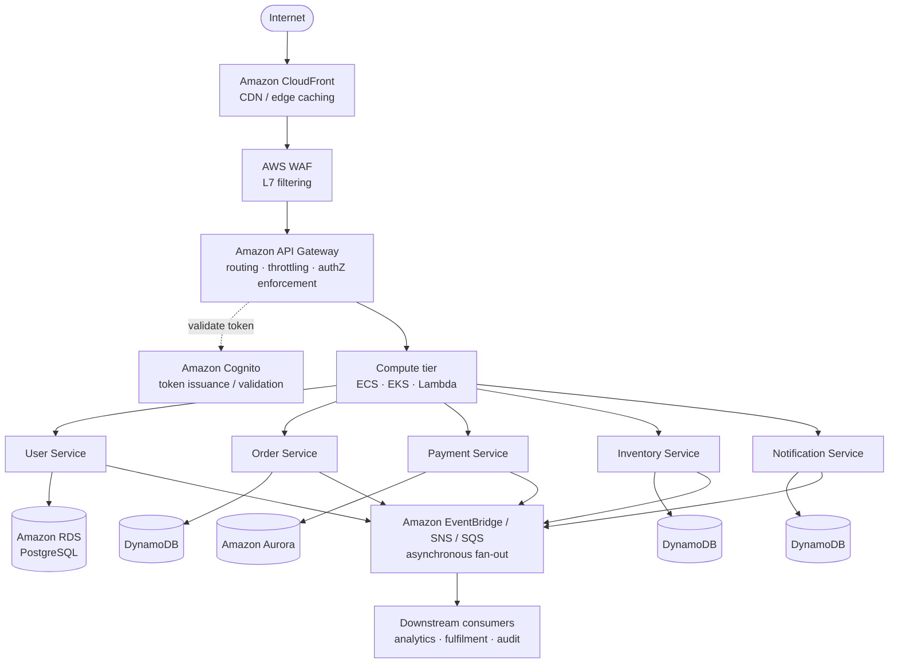
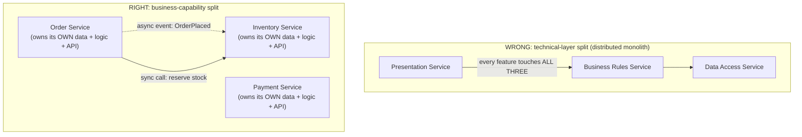
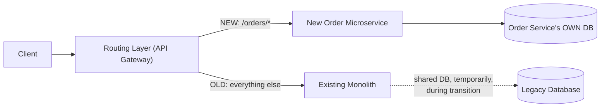
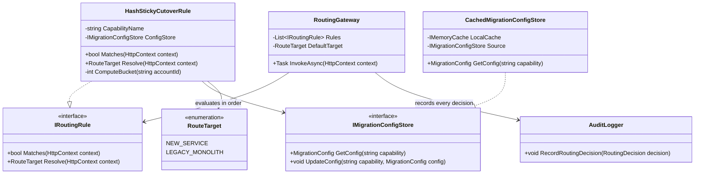
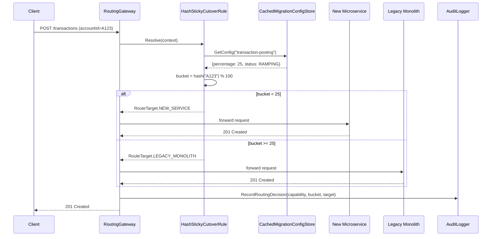

# Module 49 — Microservices: Decomposition, Communication Patterns & the Strangler Fig Migration

> Domain: Microservices | Level: Beginner → Expert | Prerequisite: [[../16-Distributed-Systems/02-Failure-Detection-Idempotency-Outbox]], [[../14-System-Design/07-Designing-Amazon-Ecommerce]] (the order-fulfillment Saga, a direct microservices example), [[../10-SOLID/01-SOLID-Principles-Deep-Dive]] (SRP, the actual theoretical basis for service decomposition)

---

## 1. Fundamentals

### What are microservices, and why does correct decomposition matter more than the technology itself?
Microservices is an architectural style structuring an application as a collection of small, **independently deployable** services, each owning its own data and communicating over the network (not in-process method calls). The single most consequential decision in any microservices architecture is **where to draw the service boundaries** — get this right, and services can evolve, scale, and fail independently; get it wrong (a poorly-decomposed "distributed monolith"), and you inherit every one -48's distributed-systems complexity costs (network latency, partial failure, eventual consistency) **without** gaining any of microservices' actual benefits (independent deployability, fault isolation, team autonomy).

### Why does this matter?
Because the Single Responsibility Principle ("one reason to change," tied to independently-varying stakeholders) is the **actual theoretical basis** for correct service decomposition, just applied at the service-boundary level instead of the class level — a service boundary drawn along genuinely independently-varying business capabilities (directly Domain-Driven Design's "bounded context" concept, a later dedicated module) succeeds; one drawn along a technical or organizational convenience that doesn't reflect genuine independent variability produces the distributed-monolith anti-pattern.

### When does this matter?
Any organization considering or operating a microservices architecture; the depth matters for correctly choosing between synchronous (REST/gRPC) and asynchronous (message-queue-based) inter-service communication for a given interaction, and for executing a safe, incremental migration from an existing monolith (the Strangler Fig pattern) rather than a risky "rewrite everything" big-bang approach.

### How does it work (30,000-ft view)?
```
Decomposition: split along business capabilities (Order Service, Inventory Service, Payment Service),
 NOT along technical layers (a "Database Service," a "Business Logic Service") --
 each service owns its OWN data, no shared database across service boundaries
Communication: synchronous (REST/gRPC, for request/response needs) vs asynchronous
 (message queue/event, for fire-and-forget or eventual-consistency-tolerant needs)
Migration: Strangler Fig -- incrementally route specific functionality from the old monolith
 to new microservices, one capability at a time, never a risky big-bang rewrite
```

---

## 2. Deep Dive

### 2.1 Decomposition — Business Capability, Not Technical Layer
The single most common, most damaging microservices decomposition mistake: splitting services along **technical layers** (a "Data Access Service," a "Business Rules Service," a "Presentation Service") rather than **business capabilities** (an "Order Service," an "Inventory Service," a "Payment Service") — the layer-based split means nearly every genuine business feature (placing an order) requires **coordinated changes across multiple services simultaneously** (the data-access service, the business-rules service, and the presentation service all need to change together to add one new order field), producing exactly the "distributed monolith" anti-pattern: all the network-call overhead and deployment complexity of microservices, with **none** of the independent-deployability benefit, since nothing can actually be deployed independently when every feature touches every "service." Business-capability decomposition (directly the SRP, applied at this altitude) ensures each service can evolve and deploy independently because its boundary aligns with an actual, independently-varying unit of business change.

### 2.2 Database-per-Service — the Non-Negotiable Data-Ownership Rule
Each microservice must own its **own** database, with **no other service accessing it directly** — a shared database across service boundaries is the second-most-common distributed-monolith cause: it recreates tight coupling (any schema change requires coordinating across every service touching that shared database, exactly negating independent deployability) and reintroduces the exact dual-write/distributed-transaction problems-48 addressed, since multiple services writing to overlapping tables in one shared database can no longer cleanly reason about transactional boundaries per-service. Cross-service data access happens **only** through each service's own API (synchronous request) or via events it publishes (asynchronous,/the Outbox pattern) — never via a backdoor, direct database connection to another service's tables.

### 2.3 Synchronous Communication (REST/gRPC) — When the Caller Needs an Immediate Answer
Synchronous, request/response communication (REST,, or gRPC — a binary, contract-first RPC protocol offering better performance and stronger typing than REST for internal service-to-service calls specifically) is appropriate when the calling service **genuinely needs the response before it can proceed** (checking current inventory availability before confirming an order can be placed) — but every synchronous call introduces a **direct availability dependency**: if the called service is down/slow, the calling service is directly, immediately affected (the circuit-breaker/timeout discipline becomes mandatory for every synchronous inter-service call, not optional), and a chain of synchronous calls (Service A calls B calls C) means A's availability is now bounded by the **product** of B's and C's availability, a compounding reliability cost that grows with every additional synchronous hop in a call chain.

### 2.4 Asynchronous Communication (Events/Message Queues) — Decoupling Availability
Asynchronous, event-based communication (a service publishes "OrderPlaced," and any interested service — Inventory, Shipping, Analytics — subscribes and reacts independently, directly the Outbox-pattern-published-events) **decouples the publisher's availability from the subscriber's** — the Order service can successfully complete and respond to its caller even if the Shipping service happens to be temporarily down, since the event simply waits in the queue/topic until Shipping recovers and processes it — this is precisely why event-driven, asynchronous communication is generally preferred over synchronous call chains **wherever the interaction doesn't genuinely require an immediate response**, directly reducing the compounding-availability-dependency risk describes; the cost is the eventual-consistency window (directly §Advanced Q6's business-risk-communication discipline) between the event being published and every subscriber having processed it.

### 2.5 The Strangler Fig Pattern — Incremental Migration Without a Big-Bang Rewrite
Named after a fig species that gradually envelops and eventually replaces a host tree, the Strangler Fig migration pattern routes traffic for a **specific, narrow piece of functionality** to a new microservice (via a routing/proxy layer sitting in front of the existing monolith, directly the API-Gateway pattern applied specifically to migration routing) while the **remaining** functionality continues being served by the monolith unchanged — incrementally, one capability at a time, more functionality is "strangled" out of the monolith into new services, until eventually the monolith either shrinks to nothing or remains only for genuinely stable, rarely-changing functionality not worth migrating — directly this course's recurring "expand, don't break; migrate incrementally with a rollback path at every step" principle, now applied at the largest possible scale: an entire application's architectural transformation.

## 3. Visual Architecture

### 3.1 AWS Microservices Reference Architecture


```mermaid
flowchart TB
    Internet([Internet])
    CF[Amazon CloudFront<br/>CDN / edge caching]
    WAF[AWS WAF<br/>L7 filtering]
    APIGW[Amazon API Gateway<br/>routing · throttling · authZ enforcement]
    Cognito[Amazon Cognito<br/>token issuance / validation]
    Compute[Compute tier<br/>ECS · EKS · Lambda]

    Internet --> CF --> WAF --> APIGW
    APIGW -. validate token .-> Cognito
    APIGW --> Compute

    Compute --> USvc[User Service]
    Compute --> OSvc[Order Service]
    Compute --> PSvc[Payment Service]
    Compute --> ISvc[Inventory Service]
    Compute --> NSvc[Notification Service]

    USvc --> UDB[("Amazon RDS<br/>PostgreSQL")]
    OSvc --> ODB[("DynamoDB")]
    PSvc --> PDB[("Amazon Aurora")]
    ISvc --> IDB[("DynamoDB")]
    NSvc --> NDB[("DynamoDB")]

    USvc --> Bus
    OSvc --> Bus
    PSvc --> Bus
    ISvc --> Bus
    NSvc --> Bus
    Bus[Amazon EventBridge / SNS / SQS<br/>asynchronous fan-out]
    Bus --> Other[Downstream consumers<br/>analytics · fulfilment · audit]
```

**Reading the diagram against §2.2's rule:** each service owns its own datastore — no service reads another's database directly, which is what makes the boundaries real rather than nominal. The synchronous path (solid arrows, left to right through the gateway) is deliberately shallow: one hop from the gateway into a service, because every additional synchronous hop multiplies the availability terms as §2.3 describes. Everything that does not need an immediate answer leaves via the event bus instead.

---

### Architecture Principles Followed

- API Gateway Pattern
- Database per Service
- Event-Driven Architecture
- Loose Coupling
- High Cohesion
- Independent Deployment
- Independent Scaling
- Security by Design
- Asynchronous Communication
- Domain-Driven Design (DDD)
- Microservice Autonomy

### Business-Capability vs Technical-Layer Decomposition

```mermaid
graph TB
 subgraph "WRONG: technical-layer split (distributed monolith)"
 UI[Presentation Service] -->|"every feature touches ALL THREE"| BL[Business Rules Service]
 BL --> DA[Data Access Service]
 end
 subgraph "RIGHT: business-capability split"
 OrderSvc["Order Service<br/>(owns its OWN data + logic + API)"]
 InventorySvc["Inventory Service<br/>(owns its OWN data + logic + API)"]
 PaymentSvc["Payment Service<br/>(owns its OWN data + logic + API)"]
 OrderSvc -.->|"async event: OrderPlaced"| InventorySvc
 OrderSvc -->|"sync call: reserve stock"| InventorySvc
 end
```

### Strangler Fig Migration

```mermaid
graph LR
 Client --> Router["Routing Layer (API Gateway)"]
 Router -->|"NEW: /orders/*"| OrderMicroservice[New Order Microservice]
 Router -->|"OLD: everything else"| Monolith[Existing Monolith]
 Monolith -.->|"shared DB, temporarily,<br/>during transition"| SharedDB[(Legacy Database)]
 OrderMicroservice --> OwnDB[(Order Service's OWN DB)]
```

## 4. Production Example
**Scenario**: An organization migrating from a monolith to microservices initially decomposed along **technical layers** (a shared "Data Service" exposing generic CRUD operations over the legacy database, a "Business Logic Service" calling it, and a "Web API Service" calling that) — six months in, the team discovered that adding a single new business feature (a discount-code system touching order data, pricing logic, and the API surface) required **coordinated, simultaneous deployment** of all three "services," since the feature's logic was scattered across all three layers — the team had built exactly the distributed-monolith anti-pattern: network-call overhead and operational complexity (three services to deploy, monitor, and version) with zero independent-deployability benefit, since nothing could actually ship independently. **Investigation**: a retrospective architecture review (prompted by the coordinated-deployment pain becoming increasingly costly and frequent) identified the root cause as decomposing along technical layers rather than business capabilities — every genuine business change cut across all three "services" simultaneously by construction, since the layers were never independently-varying units in the first place. **Fix**: re-decomposed around business capabilities (an Order Service owning order data/logic/API end-to-end, a Pricing Service similarly self-contained) — each capability-aligned service could now genuinely deploy independently, since a pricing-logic change only touched the Pricing Service, not three coordinated layers. **Lesson**: this is precisely the SRP applied incorrectly at the service-boundary altitude — the team correctly recognized "we should split into multiple services" but split along the **wrong** dimension (technical layers, which don't actually vary independently for any real business feature) rather than the dimension that genuinely does vary independently (business capabilities) — a costly, months-long lesson that a correct requirements-clarification question ("which of these proposed service boundaries would let a single business feature ship without touching any other service?") would have surfaced during the original design discussion.
## 10. Interview Questions

### Basic (10)
1. **Q: What is the single most consequential decision in a microservices architecture?** **A:** Where to draw service boundaries — correct decomposition.
2. **Q: Should services be decomposed along technical layers or business capabilities?** **A:** Business capabilities — technical-layer decomposition produces the distributed-monolith anti-pattern.
3. **Q: What is the database-per-service rule?** **A:** Each microservice owns its own database exclusively; no other service accesses it directly.
4. **Q: When is synchronous (REST/gRPC) communication appropriate between services?** **A:** When the calling service genuinely needs an immediate response before it can proceed.
5. **Q: When is asynchronous (event-based) communication preferred?** **A:** Whenever the interaction can tolerate eventual consistency, decoupling the publisher's availability from subscribers'.
6. **Q: What is the distributed-monolith anti-pattern?** **A:** A microservices architecture with all the network/operational complexity of separate services but none of the independent-deployability benefit, typically from incorrect decomposition.
7. **Q: What is the Strangler Fig pattern?** **A:** An incremental migration approach routing specific functionality to new microservices one capability at a time, rather than a risky big-bang rewrite.
8. **Q: What theoretical principle underlies correct service decomposition?** **A:** The Single Responsibility Principle, applied at the service-boundary level.
9. **Q: Why does a chain of synchronous calls compound availability risk?** **A:** The calling service's effective availability becomes bounded by the product of every downstream service's availability in the chain.
10. **Q: What role does a routing/gateway layer play in a Strangler Fig migration?** **A:** Directing specific, migrated functionality to new microservices while the remaining, not-yet-migrated functionality continues being served by the monolith.

### Intermediate (10)
1. **Q: Why does technical-layer decomposition mean nearly every feature requires coordinated multi-service deployment?** **A:** Because a real business feature's logic is scattered across the layers by construction (data access, business rules, presentation) — any feature touching all three requires all three "services" to change and deploy together, eliminating independent deployability.
2. **Q: Why is a shared database across service boundaries considered a severe anti-pattern, not just a minor inefficiency?** **A:** It reintroduces tight coupling (schema changes require cross-service coordination) and the exact dual-write/transactional-boundary problems database-per-service exists specifically to avoid.
3. **Q: Why does gRPC often outperform REST/JSON for internal service-to-service calls specifically?** **A:** Its binary protocol and HTTP/2 multiplexing reduce serialization overhead and connection overhead compared to REST/JSON, particularly valuable for high-frequency internal communication.
4. **Q: Why should "it's internal traffic" never be treated as sufficient justification for skipping authentication/authorization between services?** **A:** A compromised service or misconfigured network could allow unauthorized lateral access — each service's API must independently verify caller authorization regardless of the traffic's apparent origin.
5. **Q: Why does asynchronous communication's eventual-consistency window need explicit business-stakeholder communication, not just engineering awareness?** **A:** Directly §Advanced Q6's point — a temporarily-stale view resulting from asynchronous processing could be unacceptable for certain business/compliance contexts, requiring the trade-off to be a deliberate, communicated decision, not an assumed-acceptable engineering default.
6. **Q: Why is the Strangler Fig pattern preferred over a big-bang rewrite, beyond just "it's safer"?** **A:** It allows continuous validation and rollback at each incremental step, directly this course's recurring "expand, don't break" migration discipline — a big-bang rewrite defers all risk to one large, hard-to-partially-roll-back cutover event.
7. **Q: Why might a service's own independent scaling need be forfeited under the distributed-monolith anti-pattern?** **A:** If every "service" must deploy and scale together (due to coordinated-feature-deployment coupling), each one can't be scaled according to its own, independent load characteristics — exactly the scalability benefit microservices are meant to provide, lost.
8. **Q: Why does the incident's "coordinated deployment pain becoming increasingly costly and frequent" specifically indicate a decomposition problem, not just normal microservices operational overhead?** **A:** Normal, correctly-decomposed microservices should rarely require coordinated multi-service deployment for a single feature — persistent, frequent coordination need is the specific symptom indicating the service boundaries don't align with actual, independently-varying business capabilities.
9. **Q: Why does database-per-service limit security blast radius, beyond just architectural cleanliness?** **A:** A compromised service cannot directly read/write another service's data without shared database access — the boundary that enables independent deployability also happens to limit how far a single service's compromise can directly propagate.
10. **Q: Why would a team choose to route a Strangler Fig migration's new-service traffic via a dedicated routing layer rather than modifying the monolith's own routing logic directly?** **A:** A dedicated, external routing layer (directly the gateway pattern) keeps the migration's routing logic decoupled from the monolith's own code, letting migration decisions (which capability goes where) be managed independently of the monolith's ongoing, unrelated development, and providing a natural, centralized point for gradual traffic-percentage cutover and quick rollback.

### Advanced (10)
1. **Q: Diagnose the technical-layer-decomposition production incident from first principles, and design the specific requirements-clarification question during initial architecture design that would have caught this mistake before six months of accumulated pain.**
 **A:** Root cause: decomposing along a dimension (technical layers) that doesn't correspond to how business features/changes actually distribute across the codebase. Safeguard question: for each proposed service boundary, explicitly ask "if we needed to ship [a specific, concrete, representative business feature] tomorrow, which of these services would need to change, and could they deploy independently of each other for this specific feature?" — applying this test against several representative, realistic features **during design**, before implementation, would have revealed that nearly every feature touched all three proposed "services" simultaneously, surfacing the decomposition flaw immediately rather than after months of live, painful, repeated coordinated-deployment friction.
2. **Q: Explain how you would design the transition period during a Strangler Fig migration where the new Order microservice and the legacy monolith temporarily need to share some underlying data, without permanently violating database-per-service.**
 **A:** Use a **temporary**, explicitly time-boxed data-synchronization mechanism (a CDC pipeline, directly the Outbox/CDC pattern, replicating relevant data changes bidirectionally or one-directionally between the legacy database and the new service's own database during the transition) rather than direct, ongoing shared-database access — critically, this sync mechanism should be treated as **migration scaffolding with an explicit removal date**, not a permanent architectural feature, directly §Advanced Q6's "a migration-motivated Adapter needs a tracked removal date, not indefinite retention" discipline, now applied to a temporary data-sync bridge instead of a code-level adapter.
3. **Q: Design a strategy for deciding, service-by-service, whether a given inter-service interaction in a Strangler Fig migration should be synchronous or asynchronous, using a concrete example from the order-fulfillment domain.**
 **A:** "Check current inventory availability before confirming an order" genuinely needs an immediate answer (the customer is waiting to know if their order can proceed) — synchronous, with a circuit breaker and sensible timeout. "Notify the warehouse to begin fulfillment" and "update analytics dashboards" don't need to block the order-confirmation response at all — asynchronous, via published events (directly the Saga-based fulfillment workflow, itself already correctly using this synchronous-vs-asynchronous distinction) — the deciding question, applied per interaction: "does the caller's own response to *its* caller need to wait for this specific downstream result, or can it proceed and let the downstream effect happen eventually?"
4. **Q: Explain how you would test a proposed service decomposition for the distributed-monolith anti-pattern before committing significant implementation effort, generalizing Advanced Q1's design-time question into a more rigorous validation technique.**
 **A:** Conduct a **feature-mapping exercise**: enumerate a representative sample of 10-20 realistic, planned business features/changes, and for each, explicitly trace which proposed services would need to change — compute the resulting "average number of services touched per feature" metric; a healthy, business-capability-aligned decomposition should show most features touching **one**, occasionally two, services; a decomposition where most features touch three or more services (as in the incident) is a strong, quantifiable, pre-implementation signal of the distributed-monolith risk, converting an intuitive design-review judgment call into a more rigorous, numeric validation exercise.
5. **Q: A team's Strangler Fig migration has been running for over a year, with the routing layer's configuration growing increasingly complex (dozens of narrow, capability-specific routing rules) and itself becoming hard to reason about and modify safely. Evaluate this situation and recommend a course of action.**
 **A:** This is a realistic, common Strangler Fig migration-maturity symptom — the routing layer, originally a simple, temporary scaffolding mechanism, has itself accumulated the complexity of a genuine, permanent architectural component (directly analogous to Advanced Q2's "migration scaffolding needs an explicit lifecycle," now applied to the routing layer itself) — recommend periodically consolidating/simplifying routing rules as migration progresses (rather than purely, indefinitely accumulating new rules), and explicitly tracking migration completion percentage as a standing metric with a target end-state (either full monolith retirement, or an explicitly-decided, permanent hybrid architecture) rather than allowing the migration to become an indefinite, ever-growing, never-concluding state.
6. **Q: Explain the trade-off between choosing gRPC and REST for a new microservice's API, addressing both internal service-to-service calls and any external-facing API needs.**
 **A:** gRPC's performance/typing benefits (Intermediate Q3) are most valuable for internal, high-frequency service-to-service communication where both caller and callee are under the same organization's control (able to share/generate client code from `.proto` contract definitions); REST/JSON remains generally preferable for any externally-facing API (third-party integrations, public API consumers, the REST-domain content) given its universal tooling support, human-readability, and lack of a requirement for generated client stubs — many organizations use gRPC internally between their own services while exposing a REST/JSON API at the system's public edge (directly the gateway potentially handling the translation between the two protocols).
7. **Q: How would you design monitoring specifically to detect a distributed-monolith anti-pattern emerging gradually in an already-operating microservices architecture, rather than only catching it via a retrospective like's?**
 **A:** Track, as a standing metric, the **correlation between services' deployment events** — if two or more services' deployments are statistically, repeatedly correlated (frequently deployed together, within a short time window of each other, across many independent feature releases), this is a strong, ongoing signal that these services' boundaries don't actually reflect independent variability, regardless of how the architecture was originally intended — proactively surfacing this pattern as it emerges (rather than only via the accumulated pain a team eventually notices and investigates, as) allows for course-correction before months of friction accumulate.
8. **Q: A team proposes decomposing a new system by having every service technically deployable independently, but with a strict, enforced convention that most features are always developed and deployed as a coordinated set across 3-4 "related" services simultaneously, arguing this gives "the flexibility of independent deployability when we need it." Evaluate this as a Principal Engineer.**
 **A:** Push back — if most features **routinely** require coordinated deployment across the same group of services, the actual, practical decomposition is effectively the distributed monolith, regardless of the *theoretical* independent-deployability capability existing but going unused in practice; the "flexibility for when we need it" framing doesn't offset the *ongoing, routine* cost of the coordination this pattern's normal operation requires — recommend re-evaluating whether these "related" services should genuinely be one, more coarsely-grained service instead (a legitimate, common outcome of a decomposition review — sometimes the correct fix for a distributed-monolith symptom is *consolidating* over-eagerly-split services, not further splitting them), directly connecting to this course's broader "match the granularity of decomposition to genuine, demonstrated independent-variability, not a default assumption that more/smaller services is inherently better."
9. **Q: Explain how you would decide the appropriate granularity for a new microservice — neither too coarse (reproducing monolith-like coupling within one service) nor too fine (excessive network overhead and operational complexity for genuinely tightly-coupled functionality).**
 **A:** Apply the SRP "one reason to change" test directly: does this proposed service boundary correspond to a genuinely distinct, independently-varying business capability/stakeholder, or does it split a single, cohesive capability into artificially-separated pieces that will almost always need to change together (over-fine decomposition, reintroducing coordination costs at the network-call level instead of avoiding them) — the goal is matching service granularity to the domain's actual "natural seams" (directly Domain-Driven Design's bounded-context concept, a later dedicated module), neither forcing artificial splits within a genuinely cohesive capability nor lumping genuinely independent capabilities together into an over-broad service.
10. **Q: As a Principal Engineer, how would you lead an organization-wide architecture review specifically to identify and remediate distributed-monolith symptoms across an existing microservices estate, generalizing the single-team lesson to a fleet-wide governance initiative?**
 **A:** Apply Advanced Q4's feature-mapping exercise and Advanced Q7's deployment-correlation metric **across every service team** in the organization, identifying which service clusters exhibit distributed-monolith symptoms (high touched-services-per-feature counts, frequent correlated deployments) as a data-driven, prioritized remediation backlog — rather than treating this as a one-time, single-team retrospective lesson (as was), institutionalize it as a **recurring, organization-wide architecture-health metric** (directly this course's recurring "convert a hard-won, incident-driven lesson into standing, automated governance" pattern,, §Advanced Q10), specifically because decomposition mistakes are easy to make independently across many different teams, each discovering the same underlying lesson (business-capability, not technical-layer, decomposition) the hard way unless a shared, proactive, fleet-wide detection mechanism exists.

### Expert (10)
1. **Q: A payments platform is decomposing a monolithic Settlement module. One faction argues for a single "Settlement Service" owning the entire settlement lifecycle (matching, netting, ledger posting, regulatory reporting); another argues for four separate services (Matching, Netting, Ledger-Posting, Regulatory-Reporting) each independently deployable. Adjudicate using first principles, not preference.**
 **A:** Apply the SRP/independent-variability test (Advanced Q9) to each candidate boundary specifically: matching and netting logic changes in lockstep with evolving trading-desk rules and typically ship together; ledger-posting changes on an entirely different cadence (driven by accounting-standard changes, far rarer) and has a much stricter correctness/auditability bar justifying its own change-control process; regulatory reporting changes on yet another independent cadence (driven by external regulator rule changes, entirely decoupled from either trading logic or ledger mechanics) and often has distinct compliance ownership. The evidence favors three services, not one and not four: Matching+Netting merged (they demonstrably co-vary), Ledger-Posting separate (distinct change cadence and correctness bar), Regulatory-Reporting separate (distinct external trigger and ownership) — a decision reached by tracing actual, demonstrated change-coupling patterns from the existing monolith's commit history, not by abstract preference for "one big service" or "maximum decomposition."
2. **Q: Design the synchronous-vs-asynchronous decision for a trade-settlement workflow where a downstream Ledger service must be updated after a Matching service confirms a trade match, and a regulator requires proof that every matched trade is *eventually, provably* reflected in the ledger within a bounded SLA (e.g., T+1).**
 **A:** Use asynchronous, event-based communication (Matching publishes "TradeMatched," Ledger subscribes) for the throughput/availability-decoupling benefits (§2.4) — but the regulator's bounded-SLA requirement means "eventually consistent" cannot mean "consistent whenever it happens to get there": pair the asynchronous flow with an explicit, monitored **reconciliation/proof-of-delivery mechanism** (a scheduled job verifying every "TradeMatched" event has a corresponding ledger entry within the T+1 window, alerting on any gap) — directly this course's recurring lesson that asynchronous decoupling's eventual-consistency window must be a *bounded, monitored* window with an explicit verification mechanism when a hard external SLA applies, not an open-ended "it'll get there eventually" assumption resting on the message broker's delivery guarantees alone.
3. **Q: A Strangler Fig migration's new microservice and the legacy monolith must both be able to correctly compute the same derived value (e.g., a customer's available credit limit) during the transition period, since some requests route to the new service and some still route to the monolith. Design an approach that avoids two independently-maintained, potentially-diverging calculation implementations.**
 **A:** Extract the calculation logic itself into a shared, versioned library/package consumed by *both* the legacy monolith and the new microservice during the transition (not reimplemented independently in each) — critically, this shared library is itself migration scaffolding (Advanced Q2's discipline) with a tracked removal date: once the monolith's calling code is itself strangled away, the new microservice keeps its own, now-independent copy of the logic (having fully "graduated" into owning it), and the shared-library dependency is retired. The alternative (independently reimplementing the calculation twice) risks exactly the kind of silent, hard-to-detect divergence that is especially dangerous for a customer-facing financial calculation like available credit — a discrepancy here isn't a UI inconsistency, it's a wrong lending decision.
4. **Q: Critique the following claim from a VP of Engineering: "We've fully adopted microservices — we have 40 independently-deployable services." What follow-up questions would a Principal Engineer ask before accepting this as evidence of a healthy architecture?**
 **A:** "Independently deployable" (a technical capability) is necessary but not sufficient (directly Advanced Q8's distinction between theoretical and *routine, practiced* independence) — follow-ups: "What fraction of shipped features in the last quarter touched only one service?" (the feature-mapping metric, Advanced Q4); "What's the deployment-correlation rate across these 40 services?" (Advanced Q7); "Does each service have its own database, with zero direct cross-service database access?" (§2.2's non-negotiable rule, easy to violate silently); "Are service boundaries aligned with team boundaries, or does one team own pieces of many of these 40 services?" (Conway's Law, a later module's deeper treatment, but the seed of the question belongs here) — the count of services says nothing about whether the *decomposition* is correct; a VP citing service count as the success metric is optimizing a proxy metric rather than the actual goal (independently-shippable business capability), a common and important Principal-Engineer-level correction to make diplomatically but firmly.
5. **Q: A newly-decomposed Fraud-Detection service needs near-real-time transaction data from the Payments service to score transactions before they complete. Design the communication pattern, explicitly weighing the synchronous-call-chain risk (§2.3) against the business requirement that fraud scoring cannot simply happen "eventually."**
 **A:** This is a case where the interaction genuinely does need bounded-latency responsiveness (the payment cannot complete until a fraud score is available) but a full synchronous call chain into Fraud-Detection's own potentially-slow scoring logic risks exactly the cascading-availability problem — the resolution is a synchronous call with an aggressively tight timeout and a **defined, safe fallback decision** (not merely "fail the whole payment") if Fraud-Detection is unavailable or too slow: depending on the organization's risk appetite, this might be "fail closed" (decline/hold the transaction for manual review, in a fraud-sensitive context where a false negative is costlier than a false positive) rather than "fail open" (approve by default) — the key design point is that the timeout/circuit-breaker's fallback behavior for a *fraud-relevant* dependency is itself a business-risk decision requiring explicit sign-off from risk/compliance stakeholders, not a default engineering choice made unilaterally, directly extending Intermediate Q5's "eventual-consistency trade-offs need business-stakeholder communication" to "failure-fallback behavior needs business-stakeholder sign-off" for risk-relevant synchronous calls specifically.
6. **Q: A team argues that since their Strangler Fig migration will "obviously" be complete within three months, it's not worth investing in the automated deployment-correlation/feature-mapping tooling (Advanced Q4, Q7) — "we'll just manually track it for three months." Eighteen months later, the migration is still 60% complete. Diagnose the organizational pattern and design a safeguard against it recurring.**
 **A:** This is a well-documented planning-fallacy pattern specific to migrations: the *manual-tracking-is-fine-because-it's-short* argument is precisely wrong when it's most confidently made, since migrations that are genuinely short don't need much tracking investment either way — the ones that need it are exactly the ones initially, confidently mis-estimated as short. Safeguard: treat "when should we invest in migration-tracking tooling" as a decision that shouldn't depend on the *initial* time estimate at all — instead, set an explicit, date-based tripwire at project kickoff (e.g., "if this migration is not X% complete by [initial estimate's midpoint], automated tracking tooling investment becomes mandatory, regardless of how confident the team remains") — converting an easy-to-rationalize-away judgment call made under initial optimism into a pre-committed, date-triggered organizational policy immune to the same optimism bias re-asserting itself at the point the tripwire would fire.
7. **Q: Design a rollback strategy for a Strangler Fig migration step where the new microservice has already begun writing data that the legacy monolith's schema doesn't have a place for (e.g., the new Order service tracks a new "fulfillment priority" field the legacy schema never had), and a critical bug forces rollback to the legacy path.**
 **A:** This is the sharpest edge case in Strangler Fig migrations — routing rollback (flip `IMigrationConfig` back) is trivial and instantaneous, but **data written under the new schema/semantics doesn't automatically become interpretable by the legacy monolith**, which never had a "fulfillment priority" concept. The design must anticipate this *before* the cutover, not discover it during a rollback crisis: either (a) the legacy schema is defensively extended (even if unused by legacy code) to at least store the new field losslessly, so a rollback doesn't require data loss or transformation, or (b) an explicit, tested backward-migration/backfill script exists, ready to run, that can reconcile new-schema data into a legacy-compatible form before or during rollback — "can we roll back" must be evaluated and rehearsed for data compatibility specifically, not just routing, since routing rollback with silently incompatible underlying data produces a worse failure (silent data corruption/loss) than not rolling back at all.
8. **Q: A Principal Engineer is asked to estimate, for a board-level migration-investment decision, the actual cost of the distributed-monolith anti-pattern the incident describes — not qualitatively ("it's bad") but as a defensible order-of-magnitude number. Design an estimation approach.**
 **A:** Anchor on the concrete, observable symptom the feature-mapping/deployment-correlation metrics (Advanced Q4, Q7) already surface: measure the average calendar time and headcount-hours a coordinated, multi-service feature currently takes to ship, compare against the equivalent for a correctly-isolated, single-service feature of similar complexity (a same-organization, different-team baseline, if one exists, or an industry-typical estimate stated explicitly as an assumption per this course's standing accuracy discipline) — multiply the delta by the organization's actual feature-shipping cadence to produce an annualized engineering-hours cost estimate, explicitly labeled as an estimate with stated assumptions rather than presented as a precise figure; this converts "the architecture is bad" into a board-legible number a migration-investment decision can actually be weighed against, directly the same estimation discipline (assumptions stated explicitly, order-of-magnitude not false precision) this course applies to capacity-planning estimation elsewhere.
9. **Q: Compare, as a Principal Engineer, the risk profile of a Strangler Fig migration executed capability-by-capability (this module's standard recommendation) against an alternative "parallel-run" strategy where the new microservice runs alongside the monolith processing the *same* live traffic simultaneously, with results compared before fully cutting over. When would you choose the latter despite its added complexity?**
 **A:** Capability-by-capability Strangler Fig (route X to new, route everything-else to old) is simpler to reason about and is the correct default — but it provides no direct evidence that the new service's *behavior* matches the old one beyond "it didn't error," which is insufficient when the capability being migrated has subtle, business-critical correctness requirements (a settlement calculation, a regulatory computation) where a silent behavioral divergence — not an outright failure — is the actual risk. Parallel-run (shadow traffic: both systems process the same request, only the monolith's result is actually used/returned, the new service's result is logged and diffed) directly surfaces exactly this class of silent divergence before any customer-facing cutover risk is taken at all — choose it specifically for capabilities where correctness-equivalence, not just availability, is the dominant migration risk, accepting the added engineering cost of running and comparing two live implementations as justified by that specific risk profile, and reserve the simpler standard approach for capabilities where a functional smoke test is sufficient confidence.
10. **Q: A newly-hired Principal Engineer inherits an organization mid-migration with three *simultaneous, independently-run* Strangler Fig migrations underway (different teams, different legacy modules, no shared coordination). Identify the specific new risk this introduces beyond the risks already discussed for a single migration, and design a governance response.**
 **A:** The new, specific risk is **routing-layer contention and conflicting assumptions about shared infrastructure**: three independently-run migrations each modifying/extending what may be the same shared routing/gateway layer (§9.2's scalability discussion, now viewed as a coordination risk rather than a pure throughput one) risk conflicting routing rules, inconsistent conventions for how `IMigrationConfig`-style flags are named/scoped, and — most dangerously — no single person or team with visibility into the *combined* blast radius if two migrations' rollback needs collide (one team's emergency rollback inadvertently affecting another team's in-flight migration routing, if they share underlying infrastructure without realizing it). Governance response: establish a lightweight, cross-team **migration registry** (a single, shared source of truth listing every in-flight migration, its routing-layer footprint, its rollback procedure, and an owner) reviewed briefly at a regular cross-team sync — not to control or slow down each team's individual migration decisions, but specifically to make the *combined* blast radius and shared-infrastructure dependencies visible to all three teams simultaneously, directly extending this module's single-team "convert tribal knowledge into a queryable system of record" pattern to the case where the tribal knowledge gap is *between* teams rather than within one.

---

## 11. Coding Exercises

*(Microservices-domain exercises are primarily architectural/design in nature, consistent with prior System-Design and Distributed-Systems domains — this module includes representative code demonstrating the key patterns.)*

### Easy — Business-capability-aligned service boundary (the fix)
```csharp
// Order Service: owns ALL order-related concerns end-to-end (data, logic, API) --
// NOT split across separate "data," "logic," and "API" layers as separate deployables.
namespace OrderService;

public class OrderController: ControllerBase
{
    private readonly IOrderRepository _repository; // Order Service's OWN database, exclusively
    private readonly IPricingCalculator _pricing; // in-process business logic, same service

    [HttpPost]
    public async Task<IActionResult> PlaceOrder(PlaceOrderRequest request)
    {
        var order = new Order(request.CustomerId, request.Items);
        order.Total = _pricing.Calculate(order); // business logic lives HERE, in the same service
        await _repository.SaveAsync(order); // persisted to THIS service's own database
        return Created($"/orders/{order.Id}", order);
    }
}
```

### Medium — Synchronous call with mandatory timeout and circuit breaker
```csharp
public class OrderService
{
    private readonly HttpClient _inventoryClient; // configured with Polly resilience policies
    private readonly IAsyncPolicy _resiliencePolicy;

    public async Task<bool> CanFulfillAsync(string sku, int quantity)
    {
        return await _resiliencePolicy.ExecuteAsync(async =>
            {
                var response = await _inventoryClient.GetAsync($"/inventory/{sku}/available?qty={quantity}",
                    new CancellationTokenSource(TimeSpan.FromSeconds(2)).Token); // MANDATORY timeout, never unbounded
                return response.IsSuccessStatusCode;
        });
        // _resiliencePolicy wraps a circuit breaker (the pattern) --
        // repeated Inventory-service failures trip the breaker, failing fast instead of
        // piling up slow, doomed-to-fail synchronous calls.
    }
}
```

### Hard — Asynchronous, event-driven decoupling
```csharp
public class OrderService
{
    public async Task<Order> PlaceOrderAsync(PlaceOrderRequest request)
    {
        var order = await CreateAndSaveOrderAsync(request); // the Outbox pattern, co-transacted
        // Publishing "OrderPlaced" does NOT block on Shipping/Analytics/Inventory-notification
        // services being available -- their eventual processing is DECOUPLED from this response.
        return order; // caller gets an immediate response, regardless of downstream subscriber health
    }
}

public class ShippingServiceEventHandler // a SEPARATE service, subscribing independently
{
    public async Task HandleOrderPlacedAsync(OrderPlacedEvent evt)
    {
        await _shippingScheduler.ScheduleAsync(evt.OrderId); // processed whenever Shipping is ready
        // NEVER blocking the original order-placement call
    }
}
```

### Expert — Strangler Fig routing layer with gradual traffic cutover
```csharp
public class StranglerFigRoutingMiddleware
{
    private readonly RequestDelegate _next;
    private readonly IMigrationConfig _migrationConfig; // tracks WHICH capabilities have been migrated

    public async Task InvokeAsync(HttpContext context)
    {
        string path = context.Request.Path;

        if (_migrationConfig.IsCapabilityMigrated("orders", path))
        {
            // Route to the NEW microservice
            await _newOrderServiceProxy.ForwardAsync(context);
        }
        else
        {
            // NOT yet migrated -- continue routing to the legacy monolith, UNCHANGED
            await _legacyMonolithProxy.ForwardAsync(context);
        }
    }
}

public interface IMigrationConfig
{
    bool IsCapabilityMigrated(string capability, string path); // externally configurable
    // enabling gradual, monitored cutover
    // and INSTANT rollback (flip the config back)
    // without a code deployment
}
```
**Discussion**: `IMigrationConfig` being externally, dynamically configurable (rather than hardcoded routing logic requiring a code deployment to change) is the key design detail enabling Advanced Q5's gradual, monitored, instantly-rollback-capable migration cutover — directly the `IOptionsMonitor`-based live-reload pattern applied specifically to migration-routing decisions, letting the team adjust which capabilities route to the new service in real time based on observed error rates/performance, without needing a new deployment for every incremental cutover step.

---

## 12. System Design

### Design a Strangler Fig migration platform for a card-issuing bank's legacy Core Banking monolith

**Scope:** the bank runs a 20-year-old Core Banking monolith (account opening, balance management, transaction posting, statement generation) and needs to migrate it to microservices over 18-24 months without a single production outage, while the monolith continues processing live customer transactions throughout.

**Functional requirements:**
- Route specific, migrated capabilities (starting with Account-Opening, then Balance-Inquiry, then Transaction-Posting) to new microservices while everything else continues through the monolith.
- Support instant, per-capability rollback to the monolith if a migrated capability misbehaves.
- Give every team (Core Banking, and each new capability's owning team) real-time visibility into which capabilities are migrated and at what traffic percentage.
- Guarantee no double-processing of a financial transaction during a cutover (a transaction must be processed by exactly one of {monolith, new service}, never both, never neither).

**Non-functional requirements:**
- The routing layer's added latency budget must not exceed 10ms P99 (§7.1) against the monolith's existing SLA.
- Routing configuration changes must take effect within 5 seconds, without a deployment, to support fast rollback.
- The platform must be auditable — every routing decision and every routing-configuration change must be logged with who/when/why, given the regulatory environment.

**Back-of-the-envelope estimation:** Core Banking processes ~800 TPS peak (transaction posting + balance inquiries combined). At 800 TPS, a routing-layer decision budget of 10ms P99 means the routing layer itself must handle 800 req/s with headroom for burst (design for 3x, ~2,400 req/s) while keeping its own added-hop latency (§7.1) within budget — this is a modest throughput requirement for a purpose-built routing layer; the harder constraint is not raw throughput but the **correctness-under-cutover** requirement (no double/no-processing), which is a data-consistency problem, not a scaling problem — this is the module's decisive framing: the hard part of this design is not moving enough traffic through a router, it's guaranteeing exactly-once semantics across a routing boundary during an in-flight capability cutover.

**Component glossary:**
- **Routing Gateway** — the Strangler Fig routing layer (§2.5); inspects each request's path/capability, consults `IMigrationConfig`, forwards to monolith or new microservice.
- **Migration Config Service** — externally, dynamically configurable store (§11 Expert exercise) of which capabilities are migrated and at what traffic percentage; the single source of truth the Routing Gateway consults.
- **Cutover Coordinator** — a component specifically responsible for the no-double-processing guarantee during an in-flight capability's traffic-percentage ramp (5% → 25% → 100%), using a deterministic, sticky routing key (e.g., hash of account ID) so a given account's requests consistently land on the same side (monolith or new service) during the ramp, never split mid-transaction-sequence.
- **Legacy Core Banking Monolith** — unchanged except for the new external routing boundary in front of it.
- **New Capability Microservices** — Account-Opening, Balance-Inquiry, Transaction-Posting, each owning its own database (§2.2), consuming a temporary CDC-based data-sync bridge (Advanced Q2) from the legacy database during the transition.
- **Migration Audit Log** — append-only, immutable record of every routing decision and every configuration change, satisfying the auditability NFR.

**Operational walkthrough (a Transaction-Posting request during a 25%-cutover):**
1. Client submits a transaction-posting request to the Routing Gateway.
2. Gateway extracts the account ID and computes `hash(accountId) % 100`.
3. Gateway queries Migration Config Service (cached locally, §9.2-style, refreshed every 5s): Transaction-Posting is at 25% cutover.
4. If `hash(accountId) % 100 < 25`, route to the new Transaction-Posting microservice; otherwise route to the legacy monolith. This hash-based stickiness (not per-request random routing) ensures a given account's transaction *sequence* stays on one side, preventing an interleaved partial-migration state for any single account's ledger.
5. The receiving side (new service or monolith) processes the transaction, using an idempotency key (the transaction's own unique ID, generated client-side or at the Gateway) to guard against retries.
6. The Cutover Coordinator records, in the Migration Audit Log, which side processed this transaction and the routing decision's inputs (capability, percentage, hash result) — auditable proof of exactly which system was authoritative for this transaction.
7. Response returns to the client via the Gateway, tagged with a correlation ID for tracing (§02's mechanism, reused here).

**Data model (Migration Config Service):**

| Column | Type | Description |
|---|---|---|
| `capability_name` | varchar(100) PK | e.g., "transaction-posting" |
| `cutover_percentage` | int | 0-100, current traffic percentage routed to new service |
| `status` | enum | `NOT_STARTED`, `RAMPING`, `FULLY_MIGRATED`, `ROLLED_BACK` |
| `routing_strategy` | enum | `HASH_STICKY`, `FULL_CUTOVER`, `LEGACY_ONLY` |
| `updated_by` | varchar(100) | operator identity, for audit |
| `updated_at` | datetime2 | |

**Why store `cutover_percentage` as an integer with a hash-sticky strategy, not a random per-request coin flip:** a random per-request routing decision would let a single account's sequential transactions bounce between monolith and new service mid-sequence, risking exactly the double/no-processing correctness violation the NFRs forbid — hash-based stickiness on account ID is a deliberate modeling choice trading routing-percentage precision (the actual split may deviate slightly from the configured percentage, since accounts hash unevenly) for the much more important correctness guarantee that one account's transactions never split across both systems mid-migration.

**Why a CDC-based sync bridge (Advanced Q2) rather than dual-writes from the new microservice back to the legacy schema:** dual-writes from application code are exactly the distributed-transaction problem this course's distributed-systems modules already ruled out (no atomic guarantee across two independently-writable stores without a two-phase-commit-style protocol, itself operationally fragile) — CDC, reading the legacy database's transaction log and replaying changes into the new service's store (or vice versa, depending on migration direction), is the standard, lower-risk mechanism, explicitly time-boxed and removed once the capability's cutover reaches 100% and stabilizes.

---

## 13. Low-Level Design

### Class design — the Strangler Fig Routing Gateway with hash-sticky cutover


```mermaid
classDiagram
    class IRoutingRule {
        <<interface>>
        +bool Matches(HttpContext context)
        +RouteTarget Resolve(HttpContext context)
    }
    class HashStickyCutoverRule {
        -string CapabilityName
        -IMigrationConfigStore ConfigStore
        +bool Matches(HttpContext context)
        +RouteTarget Resolve(HttpContext context)
        -int ComputeBucket(string accountId)
    }
    class IMigrationConfigStore {
        <<interface>>
        +MigrationConfig GetConfig(string capability)
        +void UpdateConfig(string capability, MigrationConfig config)
    }
    class CachedMigrationConfigStore {
        -IMemoryCache LocalCache
        -IMigrationConfigStore Source
        +MigrationConfig GetConfig(string capability)
    }
    class RoutingGateway {
        -List~IRoutingRule~ Rules
        -RouteTarget DefaultTarget
        +Task InvokeAsync(HttpContext context)
    }
    class AuditLogger {
        +void RecordRoutingDecision(RoutingDecision decision)
    }
    class RouteTarget {
        <<enumeration>>
        NEW_SERVICE
        LEGACY_MONOLITH
    }

    RoutingGateway --> IRoutingRule : evaluates in order
    HashStickyCutoverRule ..|> IRoutingRule
    HashStickyCutoverRule --> IMigrationConfigStore
    CachedMigrationConfigStore ..|> IMigrationConfigStore
    RoutingGateway --> AuditLogger : records every decision
    HashStickyCutoverRule --> RouteTarget
```

### Sequence diagram — a request during a ramping cutover


```mermaid
sequenceDiagram
    participant Client
    participant Gateway as RoutingGateway
    participant Rule as HashStickyCutoverRule
    participant Cache as CachedMigrationConfigStore
    participant New as New Microservice
    participant Legacy as Legacy Monolith
    participant Audit as AuditLogger

    Client->>Gateway: POST /transactions (accountId=A123)
    Gateway->>Rule: Resolve(context)
    Rule->>Cache: GetConfig("transaction-posting")
    Cache-->>Rule: {percentage: 25, status: RAMPING}
    Rule->>Rule: bucket = hash("A123") % 100
    alt bucket < 25
        Rule-->>Gateway: RouteTarget.NEW_SERVICE
        Gateway->>New: forward request
        New-->>Gateway: 201 Created
    else bucket >= 25
        Rule-->>Gateway: RouteTarget.LEGACY_MONOLITH
        Gateway->>Legacy: forward request
        Legacy-->>Gateway: 201 Created
    end
    Gateway->>Audit: RecordRoutingDecision(capability, bucket, target)
    Gateway-->>Client: 201 Created
```

**Design patterns used:**
- **Strategy pattern** (`IRoutingRule`) — each migrated capability's routing logic is a swappable strategy; new capabilities add a new rule implementation without modifying the Gateway's own dispatch logic (directly OCP).
- **Chain of Responsibility** (`RoutingGateway.Rules` evaluated in order, first match wins, falling through to a default legacy target) — lets multiple capabilities' rules coexist independently, each owning only its own capability's routing decision.
- **Decorator/Proxy** (`CachedMigrationConfigStore` wrapping the real config source) — adds local caching transparently, without `HashStickyCutoverRule` needing to know whether it's talking to a cache or the source directly (directly the sidecar-adjacent "cache locally, degrade gracefully" pattern from §02, reused here at the application layer).

**SOLID mapping:**
- **SRP:** `HashStickyCutoverRule` owns only routing-decision logic for its capability; `AuditLogger` owns only audit recording; `CachedMigrationConfigStore` owns only caching — each has exactly one reason to change.
- **OCP:** adding a new migrated capability means adding a new `IRoutingRule` implementation and registering it — the `RoutingGateway` class itself never changes.
- **LSP:** any `IRoutingRule` implementation can be substituted into `RoutingGateway.Rules` without the Gateway needing to know the concrete type.
- **ISP:** `IMigrationConfigStore`'s two-method interface is minimal — a rule needing only reads never depends on the update capability.
- **DIP:** `RoutingGateway` depends on the `IRoutingRule` and `AuditLogger` abstractions, not concrete rule implementations, enabling the Easy/Medium/Hard exercises' patterns to compose without the Gateway coupling to any one migration's specifics.

**Extensibility:** a new capability migration requires zero changes to `RoutingGateway`, `AuditLogger`, or `CachedMigrationConfigStore` — only a new `IRoutingRule` implementation and a config-store entry, directly the OCP guarantee this design is built around, and the reason a growing, hundreds-of-rule migration platform (§9.2) doesn't require touching a shared, increasingly-risky central class for every new migration step.

**Concurrency/thread safety:** `CachedMigrationConfigStore`'s local cache must be safe for concurrent reads (many requests reading the same capability's config simultaneously) with occasional writes (the 5-second refresh cycle) — an `IMemoryCache`-backed implementation handles this natively; the refresh itself should atomically swap in a new config snapshot (never mutate a config object in place while requests may be reading it) to avoid a request observing a torn, partially-updated config mid-read. `AuditLogger.RecordRoutingDecision` must be safe under high concurrent call volume without becoming a serialization bottleneck — an append-only, asynchronous, buffered write (batched flush to the audit store) avoids making every request's critical path wait on audit-log durability, while still guaranteeing eventual, complete audit coverage.

---

## 14. Production Debugging

### Incident: intermittent duplicate transaction postings during a Strangler Fig cutover ramp

**Scenario:** during the Transaction-Posting capability's cutover from 25% to 50%, a reconciliation job flagged 340 transactions over six hours that appeared to have been posted **twice** — once by the legacy monolith and once by the new Transaction-Posting microservice — each with a distinct ledger entry, causing incorrect account balances for affected customers.

**Root cause:** the routing rule's hash-sticky bucketing (§13) was computed correctly and consistently per request — the actual bug was in how the **cutover-percentage change itself** was rolled out: the `cutover_percentage` value was updated from 25 to 50 in the Migration Config Service, but the Gateway's local cache (`CachedMigrationConfigStore`, refreshed every 5 seconds, per design) meant different Gateway instances (running behind a load balancer, several instances for availability) picked up the new percentage at slightly different times — for a window of up to 5 seconds, some Gateway instances were routing a given account (whose hash bucket fell between 25 and 50) to the new service while other Gateway instances, still on the stale cached 25% value, routed the same account to the legacy monolith. A client that retried a request (a legitimate, correct retry after a client-side timeout, itself using an idempotency key) could have its retry land on a *different* Gateway instance than the original attempt, and that different instance's stale-vs-fresh cache state caused the retry to be routed to the *other* system — bypassing the idempotency key entirely, since the idempotency key was only being checked/deduplicated **within** each system (new service and legacy monolith each deduplicated their own idempotency keys independently, but neither knew about the other having already processed the same key).

**Investigation:** the reconciliation job's flagged transactions all showed timestamps clustered tightly around known cutover-percentage-change events (correlated by cross-referencing the Migration Audit Log's `updated_at` timestamps against the duplicate transactions' timestamps) — this pointed directly at the cache-propagation-delay window rather than a routing-logic bug per se, since the hash computation itself was verified correct and deterministic in isolation. `TargetConnectionErrorCount`-equivalent Gateway metrics showed nothing unusual (both routing decisions individually succeeded; the problem was two independently-successful routing decisions for the same logical transaction, not a failure).

**Tools:** the Migration Audit Log (§12) was the decisive tool — being able to query "which Gateway instance, with which cached config value, routed this specific idempotency key to which target, at what timestamp" directly reconstructed the race. Without the audit log's per-decision granularity, this would have looked like an unexplained, intermittent ledger-integrity bug with no clear reproduction path.

**Fix:**
1. Immediate: paused the cutover ramp (froze `cutover_percentage`, halting further changes) to stop new occurrences while the fix was developed — the routing itself wasn't broken at any fixed percentage, only during a percentage *change's* propagation window.
2. Structural: made idempotency-key deduplication **cross-system**, not per-system — the idempotency key is now checked against a single, shared, low-latency store (a Redis-backed idempotency registry, consulted by *both* the new service and the legacy monolith before processing) before either system processes a transaction, so a retry landing on the "other" system due to a cache-propagation race is detected and rejected as a duplicate regardless of which system's local view of the cutover percentage routed it there.
3. Structural: reduced the Gateway's config-cache refresh interval from 5 seconds to 1 second for `cutover_percentage` changes specifically (accepting a slightly higher config-read load, well within the platform's throughput headroom per §12's estimation) to shrink the propagation-race window, while treating the cross-system idempotency fix as the actual, correctness-guaranteeing fix rather than relying on a merely-shorter race window.

**Prevention:** any design with multiple, independently-cached readers of a value that determines a *routing* decision affecting a **cross-system correctness invariant** (no double-processing) must not rely on cache-refresh timing alone to prevent races during the value's transition — either eliminate the race by making the invariant checkable independently of routing (the cross-system idempotency fix, the durable solution here), or, if that's infeasible, make percentage changes atomic and instantaneously-propagated (a push-based config update rather than a poll-based cache refresh) rather than accepting an unbounded-in-practice propagation-delay window.

---

## 15. Architecture Decision

### Choosing the Strangler Fig routing-layer implementation

**Option A — hand-rolled ASP.NET Core middleware (as in §11's Expert exercise).**
- *Advantages:* full control, no new infrastructure dependency, trivial to unit-test, fastest to stand up for a small number of capabilities.
- *Disadvantages:* every cross-cutting concern (audit logging, caching, cross-system idempotency) must be built and maintained in-house; doesn't scale well past dozens of routing rules (§9.2) without dedicated engineering investment; no built-in support for canary-style gradual rollout beyond what's custom-built.
- *Cost:* low upfront infrastructure cost, but rising engineering-maintenance cost as rule count and cross-cutting requirements grow.
- *Complexity:* low initially, moderate-to-high as the platform in §12 matures.
- *Best for:* early-stage migrations with a small, well-understood set of capabilities and a team comfortable owning custom routing infrastructure.

**Option B — a managed/purpose-built API Gateway product (AWS API Gateway, Kong, or the later, dedicated `38-API-Gateway` module's subject) fronting both monolith and new services.**
- *Advantages:* built-in support for weighted/percentage-based routing, rate limiting, authentication enforcement, and observability out of the box; scales to hundreds of rules without custom engineering; offloads the "is the routing layer itself well-built" risk to a vendor/well-tested open-source project.
- *Disadvantages:* the hash-sticky, account-ID-aware routing logic (§13's core correctness mechanism) is *not* a standard API Gateway feature — most gateways route on path/header/weighted-random, not on a custom hash of a request body field; achieving account-sticky routing typically requires a custom plugin/Lambda-authorizer-style extension, partially eroding the "just use the managed product" simplicity. Vendor lock-in and cost at scale.
- *Cost:* ongoing licensing/usage cost, offset by reduced engineering-maintenance cost.
- *Complexity:* moderate — less code to own, but a new operational dependency and a learning curve for gateway-specific configuration/extension mechanisms.
- *Best for:* larger, longer-running migrations (this module's Core Banking scenario, at 18-24 months and dozens of eventual capabilities) where the routing platform's own reliability and scale need to be someone else's already-solved problem.

**Option C — a service mesh's sidecar layer (§02, `39-Service-Mesh`) handling routing via traffic-splitting rules.**
- *Advantages:* if the organization already operates a service mesh for its resilience/observability needs (§02), reusing its traffic-splitting capability (canary-style weighted routing between "old" and "new" backend versions) avoids introducing a *third* piece of routing infrastructure (beyond the mesh already used for resilience).
- *Disadvantages:* mesh traffic-splitting is designed for service-version canaries, not monolith-to-microservice migration specifically — the "monolith" side isn't naturally mesh-aware (it wasn't built with a sidecar in mind, though one can be attached), and the same custom-hash-routing gap as Option B applies.
- *Cost:* near-zero incremental cost if the mesh is already operated for other reasons; substantial cost (standing up a mesh specifically for this) if not.
- *Complexity:* low incremental complexity if mesh already exists; high if it doesn't.
- *Best for:* an organization already running a mature service mesh (per §02's sidecar discussion) for unrelated resilience/observability reasons, opportunistically reusing it rather than introducing new infrastructure.

**Recommendation:** for the Core Banking scenario in §12 — a multi-year, dozens-of-capabilities migration with a hard regulatory-auditability requirement and a correctness-critical no-double-processing constraint — **Option B**, a managed API Gateway extended with a custom routing plugin implementing the hash-sticky logic, is recommended. The reasoning: Option A's maintenance burden becomes untenable at the scale and duration this migration requires (§9.2's scaling-ceiling argument), and Option C requires standing up mesh infrastructure this scenario has no other stated need for, making its cost unjustified purely to solve routing. Option B accepts a real "custom plugin" gap but concentrates the platform's baseline reliability, observability, and audit-logging capabilities on a vendor/open-source product with far more operational maturity than an in-house build could reach in the same timeframe — the custom hash-sticky logic is a small, well-isolated, thoroughly-testable extension on top of that foundation, not the platform's entire surface area.

---

## 17. Principal Engineer Perspective

**Business impact.** A Strangler Fig migration is, from the business's perspective, a multi-year investment with no new customer-facing feature to show for it at completion — the entire value proposition is *reduced future cost and risk* (faster feature delivery once decomposition is correct, reduced blast radius of failures, ability to scale teams independently), which is a genuinely harder sell to non-technical stakeholders than a feature with a visible demo. A Principal Engineer's job includes translating the incident's cost (§Expert Q8's estimation approach) and the migration's projected payoff into business language stakeholders can actually weigh — "we will ship features 30% faster once this specific coordination bottleneck is removed" is a defensible, business-legible claim; "the architecture will be cleaner" is not.

**Engineering trade-offs.** Every decision in this module trades a form of short-term complexity/cost for long-term flexibility: the routing layer (§2.5) adds latency (§7.1) and new attack surface (§8.1) in exchange for incremental, reversible migration; the temporary data-sync bridge (Advanced Q2) adds transitional coupling in exchange for avoiding a risky big-bang cutover; cross-system idempotency (§14's fix) adds a new shared dependency in exchange for closing a correctness gap no amount of per-system correctness could close alone. A Principal Engineer's role is making these trade-offs *explicit and reviewed*, not implicit and discovered — the incident in §14 is precisely a case where an implicit assumption (per-system idempotency is sufficient) went unexamined until production proved it wrong.

**Technical leadership and cross-team communication.** A multi-year, multi-team migration (Expert Q10's scenario) fails organizationally as often as it fails technically — a Principal Engineer must establish and maintain shared visibility (the Migration Registry, Expert Q10; the Migration Audit Log, §12) not as bureaucratic overhead but as the specific mechanism preventing the kind of cross-team blast-radius surprise Expert Q10 describes. This requires recurring, lightweight (not heavyweight-process) cross-team touchpoints, and — critically — a leader who can hold the line on migration discipline (the deprecation-window/rollback-readiness requirements) even when individual teams face schedule pressure to cut corners on a specific step.

**Architecture governance.** The recurring pattern across this entire module — convert a hard-won, incident-driven lesson into automated, enforced tooling rather than relying on individual vigilance (feature-mapping metrics, deployment-correlation tracking, the automated breaking-change gate referenced in Module 51) — is itself the Principal-Engineer-level governance philosophy this module teaches: architecture correctness at fleet scale is not sustained by any individual engineer's diligence, however skilled, but by systems that make the *wrong* thing hard to do accidentally and the *right* thing the default, low-friction path.

**Cost optimization.** The double-infrastructure cost of running both monolith and new microservices simultaneously throughout a migration (Expert Q8) is real and must be budgeted, not treated as a rounding error absorbed into "engineering costs" — a Principal Engineer sizing a migration's business case should explicitly separate this transitional infrastructure cost from the eventual steady-state cost (which may well be lower, given independent scaling per §9.3), so the business case isn't presented as cheaper than it actually is during the transition period.

**Risk analysis and long-term maintainability.** The single highest-leverage risk-management practice this module surfaces is treating every piece of migration scaffolding (the routing layer, the data-sync bridge, the shared calculation library, Expert Q3) as **temporary infrastructure with an explicit, tracked removal date** — the recurring failure mode across nearly every incident and Expert-tier scenario in this module is scaffolding that quietly became permanent because no one owned its removal. A Principal Engineer designing migration governance should make "does this piece of scaffolding have an owner and a removal date" a standing, non-negotiable checklist item for every migration step, precisely because it is the single cheapest safeguard against the module's most common and costly failure pattern.

## 18. Revision
**Key takeaways**: Correct service decomposition (business capability, not technical layer) is the single most consequential microservices decision — the SRP is the actual theoretical basis, now applied at the service-boundary altitude. Technical-layer decomposition produces the distributed-monolith anti-pattern: all the complexity of microservices, none of the independent-deployability benefit. Database-per-service is non-negotiable, preventing both tight coupling and the dual-write problems addressed. Synchronous communication compounds availability risk across call-chain depth and requires mandatory circuit breakers/timeouts; asynchronous, event-driven communication decouples publisher and subscriber availability, at the cost of an eventual-consistency window requiring explicit business-stakeholder communication. The Strangler Fig pattern enables safe, incremental, capability-by-capability migration with a rollback path at every step — the correct alternative to a risky big-bang rewrite.

---

**Next**: Continuing autonomously to Module 50 — Microservices: Service Mesh, Observability & Resilience Patterns, completing the `17-Microservices` domain before advancing to `18-Event-Driven-Architecture`.
