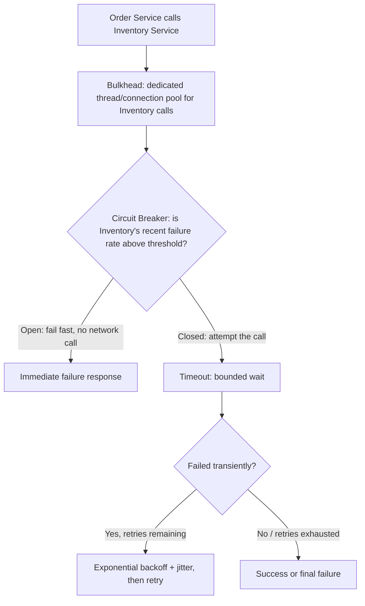
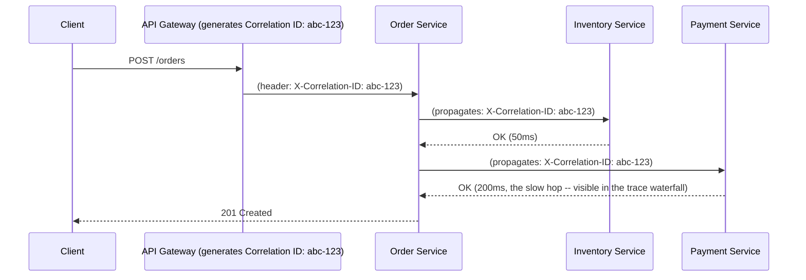
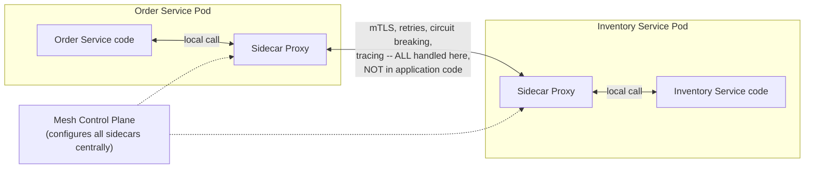

# Module 50 — Microservices: Resilience Patterns, Distributed Observability & the Sidecar Model

> Domain: Microservices | Level: Intermediate → Expert | Prerequisite: [[01-Decomposition-Communication-Strangler-Fig]], [[../16-Distributed-Systems/02-Failure-Detection-Idempotency-Outbox]], [[../02-DotNet-AspNetCore/06-HealthChecks-Observability]]
> Forward reference: [[../39-Service-Mesh/01-Service-Mesh-Fundamentals]] (a later dedicated module covers Istio/Linkerd-specific sidecar-proxy implementations in depth — this module covers the resilience/observability *patterns* a service mesh implements, conceptually, before that dedicated treatment)

---

## 1. Fundamentals

### Why does a correctly-decomposed microservices architecture (Module 49) still fail in production without dedicated resilience and observability investment?
Module 49 established that correct service decomposition avoids the distributed-monolith anti-pattern, but even a *correctly*-decomposed microservices architecture introduces two new categories of operational risk that a monolith never faced: **partial, cascading failure** (one service's slowness or outage propagating, uncontrolled, through synchronous call chains to affect otherwise-healthy services) and **diagnostic opacity** (a single user-facing request may now traverse a dozen independently-deployed services, making "which service actually caused this error/slowness?" a genuinely hard question without dedicated tooling). Resilience patterns (circuit breaker, retry, bulkhead, timeout — collectively, "the four horsemen of distributed-system defense") directly address the first; distributed tracing and correlation IDs directly address the second.

### Why does this matter?
Because these two risk categories are the direct, practical cost of the network boundary Module 49 introduced between what used to be in-process method calls — a monolith's internal method call either succeeds or throws synchronously and instantaneously, and a stack trace unambiguously shows the call path; a microservices call across the network can fail in ambiguous ways (Module 48's partial-failure ambiguity) and its call path spans multiple independently-logged services with no inherent linkage between their log entries unless the architecture deliberately provides one.

### When does this matter?
Any team operating (not just designing) a microservices architecture in production — these patterns are what separate a microservices architecture that degrades gracefully under partial failure and remains debuggable in production, from one that cascades into full outages from a single slow downstream service and takes hours to diagnose because no one can trace a failing request across service boundaries.

### How does it work (30,000-ft view)?
```
Resilience: Timeout (bound how long you'll wait) -> Retry (with backoff, for transient failures)
            -> Circuit Breaker (stop calling a service that's clearly failing) -> Bulkhead
            (isolate resource pools so one dependency's failure can't exhaust shared resources)
Observability: Correlation ID (one ID threading through every service touched by one request)
            -> Distributed Tracing (visualize the full, cross-service call path and timing)
            -> the Four Golden Signals, PER SERVICE (latency, traffic, errors, saturation)
Sidecar: a proxy process deployed alongside each service instance, transparently handling
            resilience + observability + security concerns WITHOUT the service's own code
            needing to implement them directly (the architectural basis of a service mesh)
```

---

## 2. Deep Dive

### 2.1 Timeout — the Foundational, Non-Negotiable Resilience Primitive
Every synchronous inter-service call (Module 49 §2.3) **must** have an explicit, bounded timeout — without one, a slow-but-not-fully-failed downstream service causes the calling service's threads/connections to pile up waiting indefinitely, eventually exhausting the caller's own resource pool (thread pool, connection pool) and causing the caller to fail too, **even though the caller's own code has no bug** — this is precisely how a single slow service cascades into a multi-service outage. The correct timeout value is workload-specific (Module 37 §7's latency-budgeting discipline: if a request has an overall SLA of 500ms and must call three downstream services, each downstream call's timeout budget must be a fraction of that total, leaving headroom for the caller's own processing).

### 2.2 Retry with Backoff — for Transient Failures Only
A retry re-attempts a failed call, appropriate specifically for **transient** failures (a momentary network blip, a downstream service's brief GC pause) but actively harmful for **non-transient** failures (the downstream service is genuinely overloaded — blindly retrying adds *more* load to an already-struggling service, worsening the very problem causing the failures, a well-documented "retry storm" failure mode). Retries must use **exponential backoff with jitter** (each retry waits longer than the last, with randomized variance) — without jitter, many callers retrying in lockstep (all having failed at the same moment due to a shared downstream blip) will collectively retry at the same instant, recreating the same overload spike that caused the original failures.

### 2.3 Circuit Breaker — Failing Fast Instead of Piling Up Doomed Calls
A circuit breaker (Module 49 §11 Medium exercise introduced this) tracks a downstream service's recent failure rate and, once it crosses a threshold, "trips open" — subsequent calls fail **immediately**, without even attempting the network call, for a cool-down period, after which the breaker allows a small number of trial calls through ("half-open" state) to test whether the downstream service has recovered before fully "closing" the circuit again. This directly prevents the retry-storm failure mode (§2.2) and the resource-exhaustion cascade (§2.1) by refusing to keep hammering a service that's clearly failing, giving it room to recover rather than compounding its overload with continued traffic.

### 2.4 Bulkhead — Isolating Resource Pools Per Dependency
Named after a ship's watertight compartments (a hull breach in one compartment doesn't sink the whole ship), the bulkhead pattern isolates the resource pool (typically a thread pool or connection pool) used for calls to **each** downstream dependency, so that one dependency's failure/slowness exhausting its own dedicated pool **cannot** starve calls to other, healthy dependencies that would otherwise share the same pool — without bulkheads, a single misbehaving downstream service can exhaust a **shared** connection pool used for all outbound calls, causing calls to entirely unrelated, healthy services to fail too, purely due to pool exhaustion rather than any problem with those other services.

### 2.5 Correlation IDs and Distributed Tracing — Restoring Debuggability Across the Network Boundary
A correlation ID (a unique identifier generated at the system's edge — Module 40's gateway — and propagated through every header of every subsequent inter-service call for that request) is the minimal mechanism restoring the ability to answer "show me everything that happened for this one request" across a call chain spanning multiple independently-logged services — without it, correlating log entries across services for a single request requires error-prone, approximate matching on timestamps. Distributed tracing (OpenTelemetry being the current industry-standard instrumentation framework) builds on correlation IDs by additionally capturing **timing and parent-child call relationships** for every hop, producing a visual waterfall/flame-graph view of exactly which service in a multi-hop chain consumed how much of the total request latency — directly the tool that answers "why was this specific request slow?" when the answer isn't obvious from any single service's own logs.

### 2.6 The Sidecar Pattern — Extracting Cross-Cutting Concerns Out of Application Code
A sidecar is a separate proxy process deployed alongside each service instance (in Kubernetes, Module 23, typically as a second container in the same Pod) that intercepts all inbound/outbound network traffic for that service, transparently handling resilience (§2.1-2.4), observability (§2.5), and security (mTLS between services) concerns **without the service's own application code needing to implement them directly** — the service code makes a plain, local call to its sidecar, and the sidecar handles the actual network complexity. This is the architectural foundation of a **service mesh** (a fleet of sidecars plus a central control plane managing their configuration, the subject of the later dedicated Module in `39-Service-Mesh`) — the key insight this module establishes, ahead of that deeper treatment: extracting these cross-cutting resilience/observability concerns out of every individual service's own codebase (where they'd otherwise need to be reimplemented, consistently, in every service, in every language a polyglot organization uses) into a shared, uniform infrastructure layer is what makes resilience/observability practices consistently enforceable across a large microservices fleet rather than dependent on every individual team remembering to implement them correctly.

## 3. Visual Architecture

### Resilience Layering (a Single Outbound Call)


### Distributed Tracing Across a Call Chain


### Sidecar / Service-Mesh Architecture (Preview)


## 4. Production Example
**Scenario**: An e-commerce platform's Order service synchronously called a Recommendations service (to fetch "customers also bought" suggestions) as part of every order-confirmation page render — this call had no timeout configured (defaulting to the HTTP client's implicit, very long default) and used a connection pool **shared** with all of the Order service's other outbound calls (no bulkhead isolation). One day, the Recommendations service began experiencing severe GC pauses (unrelated to Order or Payment) causing its response times to balloon to 30+ seconds. **Investigation**: within minutes, the Order service's shared connection pool became entirely saturated with connections waiting on the slow Recommendations calls, and — because the pool was shared — the **Payment** service calls (a completely unrelated, entirely healthy dependency) began failing too, since no connections remained available in the shared pool to make those calls at all. The on-call engineer initially suspected a Payment service outage (since that's what alerted first and most visibly, as order-confirmation failures), and spent 40 minutes investigating Payment's own health (which was, confusingly, perfectly normal) before a correlation-ID-based trace search revealed that every failing request's trace showed a slow Recommendations hop consuming the bulk of the request's time, with Payment calls failing only due to pool-exhaustion timing out afterward. **Fix**: added an explicit, tight timeout to the Recommendations call (500ms, since recommendations are a non-critical enhancement, not core checkout functionality) with a circuit breaker and graceful degradation (simply omit recommendations from the confirmation page if the call fails/times out, rather than failing the entire order confirmation) — and, critically, moved Recommendations calls to their **own, dedicated, bulkheaded connection pool**, isolated from Payment's pool. **Lesson**: this is precisely §2.4's bulkhead pattern's justification, learned the costly way — a non-critical dependency (Recommendations) sharing a resource pool with a critical dependency (Payment) meant the non-critical dependency's failure directly caused a critical dependency's calls to fail too, despite Payment itself being entirely healthy; and the 40-minute misdiagnosis delay is precisely §2.5's distributed-tracing justification — without a correlation-ID-based trace showing the actual slow hop, the on-call engineer's instinct (chase the service that's alerting) pointed at the wrong service entirely.

## 5. Best Practices
- Configure an explicit, workload-appropriate timeout on every synchronous inter-service call — never rely on an HTTP client's implicit default.
- Use exponential backoff with jitter for any retry logic, and retry only for genuinely transient failure classes.
- Deploy a circuit breaker on every synchronous inter-service call to fail fast once a downstream dependency's failure rate crosses a threshold.
- Use bulkheads (dedicated resource pools) to isolate each downstream dependency, especially separating non-critical from critical dependencies, so one dependency's failure can never starve another's resource pool (§4's incident).
- Propagate a correlation ID through every hop of every inter-service call chain, and invest in distributed tracing (OpenTelemetry) as a first-class operational tool, not an afterthought.
- Consider a sidecar/service-mesh model once the number of services and languages in use makes consistently reimplementing these patterns in every service's own code impractical.

## 6. Anti-patterns
- Unbounded/default timeouts on synchronous inter-service calls, allowing a single slow dependency to exhaust the caller's resources and cascade into a multi-service outage (§4).
- Retrying without backoff/jitter, causing synchronized retry storms that amplify an already-struggling downstream service's overload.
- Sharing a single resource pool across all outbound dependencies, letting one dependency's failure starve calls to entirely unrelated, healthy dependencies (§4's root cause).
- Operating a multi-service architecture without correlation IDs/distributed tracing, forcing costly, error-prone, timestamp-based manual log correlation during incidents (§4's 40-minute misdiagnosis).
- Reimplementing resilience/observability logic inconsistently, ad hoc, in every individual service's own code (rather than centralizing via a sidecar/service mesh) once the fleet grows large enough that consistency can no longer be achieved by convention alone.

---

## 10. Interview Questions

### Basic (10)
1. **Q: Why does even a correctly-decomposed microservices architecture need dedicated resilience patterns?** **A:** The network boundary between services introduces partial-failure risk (Module 48) that in-process monolith calls never faced.
2. **Q: What does a timeout do, and why is it non-negotiable for synchronous inter-service calls?** **A:** Bounds how long a caller waits for a response; without one, a slow dependency can exhaust the caller's own resources indefinitely.
3. **Q: When is a retry appropriate?** **A:** Only for genuinely transient failures — retrying non-transient (overload) failures worsens the problem.
4. **Q: What is exponential backoff with jitter, and why does it need jitter specifically?** **A:** Progressively longer waits between retries, randomized; jitter prevents many callers retrying in lockstep and recreating an overload spike.
5. **Q: What does a circuit breaker do?** **A:** Tracks a downstream's failure rate and fails fast (without attempting the call) once a threshold is crossed, giving the downstream room to recover.
6. **Q: What is the bulkhead pattern?** **A:** Isolating each downstream dependency's resource pool so one dependency's failure can't starve calls to other, healthy dependencies.
7. **Q: What is a correlation ID?** **A:** A unique identifier generated at the request's entry point and propagated through every subsequent inter-service call, enabling cross-service log correlation.
8. **Q: What does distributed tracing add beyond a correlation ID?** **A:** Timing and parent-child call relationships for every hop, visualized as a waterfall/flame graph.
9. **Q: What is a sidecar?** **A:** A proxy process deployed alongside each service instance that transparently handles resilience/observability/security concerns outside the service's own application code.
10. **Q: What is the relationship between sidecars and a service mesh?** **A:** A service mesh is a fleet of sidecars plus a central control plane managing their configuration uniformly.

### Intermediate (10)
1. **Q: Why does an unbounded timeout on one synchronous call risk cascading into a multi-service outage, even when the caller's own code has no bug?** **A:** Piled-up waiting threads/connections eventually exhaust the caller's own resource pool, causing the caller to fail too — purely from resource exhaustion, not any defect in the caller's logic.
2. **Q: Why is a "retry storm" a realistic, damaging failure mode rather than a theoretical concern?** **A:** Many callers retrying an already-overloaded downstream service, especially without jitter causing synchronized retry timing, adds more load to the exact service already struggling, worsening rather than resolving the underlying overload.
3. **Q: Why does a circuit breaker's "half-open" state exist, rather than simply staying open until manually reset?** **A:** It allows automatic, gradual recovery testing — a small number of trial calls verify the downstream has actually recovered before fully resuming traffic, without requiring manual intervention for every transient outage.
4. **Q: Why did sharing a connection pool across Recommendations and Payment calls (§4) cause Payment failures despite Payment being entirely healthy?** **A:** The shared pool's connections were all consumed waiting on the slow Recommendations calls, leaving none available for Payment calls to use at all — a resource-exhaustion cascade unrelated to Payment's own health.
5. **Q: Why did the on-call engineer in §4 initially misdiagnose the incident as a Payment outage?** **A:** Payment's calls were the ones visibly failing/alerting, and without a correlation-ID-based trace revealing the actual slow hop (Recommendations), the natural instinct was to investigate the visibly-alerting service first.
6. **Q: Why should a 100%-trace-sampling strategy usually be reserved for error traces rather than applied uniformly to all traffic?** **A:** Full sampling captures complete diagnostic detail but at nontrivial storage/processing cost at high request volume; erring toward full capture of error traces (the ones most valuable for debugging) while sampling successful traces balances diagnostic completeness against cost.
7. **Q: Why does the sidecar model make resilience/observability practices more consistently enforceable across a large, polyglot microservices fleet than relying on each service team's own implementation?** **A:** Reimplementing timeout/retry/circuit-breaker/tracing logic correctly in every service's own code, across every language a polyglot organization uses, is error-prone and inconsistent; extracting these concerns into a shared sidecar infrastructure layer enforces them uniformly regardless of each service's implementation language or team's diligence.
8. **Q: Why must bulkhead pool sizes be chosen per-dependency rather than using one default size for every downstream call?** **A:** Each dependency has its own expected call volume/latency profile; an undersized bulkhead becomes an artificial bottleneck even when the downstream dependency itself is healthy and could handle more concurrent load.
9. **Q: Why does mTLS enforcement via a sidecar represent a stronger security guarantee than expecting each service team to implement certificate handling correctly on their own?** **A:** Uniform, infrastructure-level enforcement removes the risk of an individual team forgetting or misconfiguring encryption/authentication for their service's inter-service calls — directly extending Module 49 §8's "never assume internal traffic is trusted" from a policy into an automatically-guaranteed property.
10. **Q: Why should trace data be subject to the same data-classification/access-control discipline as any other system holding customer data?** **A:** Trace metadata (request parameters, headers) can embed sensitive information like customer IDs; treating trace storage as exempt from standard data-governance discipline would create an ungoverned copy of potentially sensitive data.

### Advanced (10)
1. **Q: Diagnose the §4 incident from first principles, and design the specific pre-production review question that would have caught the missing bulkhead isolation before the incident occurred.**
   **A:** Root cause: a non-critical dependency (Recommendations) sharing a resource pool with a critical one (Payment), so the non-critical one's failure could starve the critical one. Safeguard question during design/code review: "for each outbound dependency this service calls, is its resource pool isolated from every other dependency's pool, and if not, what happens to calls to Dependency B if Dependency A becomes slow/unavailable?" — explicitly tracing through this failure scenario for every dependency pairing during review would have surfaced the shared-pool risk before production traffic exposed it.
2. **Q: Explain how you would decide the appropriate circuit-breaker failure-rate threshold and cool-down duration for a given dependency, rather than using a single default value for every inter-service call.**
   **A:** Base the threshold on the dependency's baseline, healthy error rate (a critical payment-processing dependency with a near-zero healthy baseline should trip on a much lower failure-rate threshold than a best-effort recommendations service with a naturally higher tolerance for occasional errors) and set cool-down duration based on the dependency's typical recovery time from transient issues (a service that typically recovers from GC-pause-induced slowness within seconds needs a much shorter cool-down than one recovering from, say, a database failover taking tens of seconds) — a single, uniform default threshold/cool-down across all dependencies, as a "one size fits all" policy, will be miscalibrated for at least some dependencies' actual failure/recovery characteristics.
3. **Q: Design a strategy for gracefully degrading a user-facing feature (like the order-confirmation page in §4) when a non-critical dependency's circuit breaker trips, without simply failing the entire request.**
   **A:** Explicitly classify each dependency as critical (checkout cannot proceed without it — Payment, Inventory) vs. non-critical/enhancement (Recommendations, personalized banners) at design time; for non-critical dependencies, wrap the call in a try/circuit-breaker pattern that, on failure, returns a sensible default/empty result (omit recommendations from the page) rather than propagating the failure to fail the entire request — this graceful-degradation design decision must be made explicitly per dependency during initial design, since defaulting to "any dependency failure fails the whole request" (the easiest but often wrong default) needlessly couples the user-facing request's success to every dependency's health, including non-critical ones.
4. **Q: A team's distributed tracing shows a request's total latency is 800ms, with the trace waterfall showing five sequential 150ms hops. Diagnose the likely underlying architectural issue and recommend two independent remediation directions.**
   **A:** Five *sequential* (not parallelized) synchronous hops directly reproduces Module 49 §2.3's compounding-availability/latency-chain risk — remediation direction one: identify which of these five hops could be made **asynchronous** instead (per Module 49 §2.4's synchronous-vs-asynchronous decision criterion — does the caller's own response genuinely need to wait for each result), removing them from the critical path entirely; remediation direction two: identify which of the sequential hops have no data dependency on each other's results and could be executed **in parallel** rather than sequentially (a straightforward refactor when hop 3 doesn't actually need hop 2's result to proceed), reducing the critical path's total latency without eliminating any hop.
5. **Q: Explain why a service mesh's centralized control plane, managing resilience/observability configuration for every sidecar uniformly, could itself become a scalability or reliability risk, and how you would mitigate it.**
   **A:** If every sidecar's operation depends on live, synchronous communication with the control plane for every decision, the control plane itself becomes a single point of failure/bottleneck for the entire mesh — the standard mitigation (used by mature service mesh implementations) is for each sidecar to cache its configuration locally and operate independently using the last-known-good configuration if the control plane becomes temporarily unreachable, applying the same "each component should degrade gracefully under a dependency's unavailability" principle this entire module teaches, now applied reflexively to the mesh infrastructure's own control plane.
6. **Q: A team implements circuit breakers correctly per Module 49's medium exercise, but reports that during a real partial outage, many *different, unrelated* services all began failing simultaneously, more broadly than the actual outage's scope should have caused. Investigate the likely cause.**
   **A:** Likely cause: a shared, common piece of infrastructure sitting in the call path of many otherwise-unrelated services' calls (a shared connection pool, a shared underlying network resource, or even a shared circuit-breaker library instance misconfigured to track failures in aggregate across all downstream calls rather than per-dependency) — directly generalizing §4's shared-pool root cause: correct *per-call* resilience patterns (timeout, retry, circuit breaker) don't help if the *isolation* layer beneath them (bulkheads, §2.4) is itself shared across otherwise-independent dependencies, allowing one failure to masquerade as a much broader one.
7. **Q: Design an approach for validating that your resilience patterns (timeout, retry, circuit breaker, bulkhead) actually work as intended, before relying on them during a genuine production incident.**
   **A:** Chaos engineering — deliberately, intentionally injecting controlled failures (artificially slowing or failing a specific dependency in a controlled environment, or even carefully in production with safeguards) and verifying the expected resilience behavior actually triggers (the circuit breaker trips at the expected threshold, the bulkhead prevents the injected failure from affecting unrelated calls, the timeout fires at the configured duration) — directly extending this course's recurring "test failure-handling logic deliberately, don't just implement it and hope" principle (Module 47's Advanced-tier partial-failure-testing discussion) specifically to resilience-pattern configuration, which is otherwise easy to implement subtly incorrectly (wrong threshold, missing bulkhead isolation as in §4) and never notice until a real incident exposes the gap.
8. **Q: How would you decide which resilience/observability concerns to keep in each service's own application code versus extracting into a sidecar/service mesh, rather than treating "sidecar for everything" as an automatic default?**
   **A:** Extract concerns that are genuinely uniform and cross-cutting across every service regardless of its specific business logic (mTLS, basic retry/timeout/circuit-breaking for standard HTTP/gRPC calls, trace-header propagation) into the sidecar layer; keep business-logic-aware resilience decisions (§Advanced Q3's critical-vs-non-critical-dependency graceful-degradation logic, which requires domain knowledge about what a sensible default response looks like for a given feature) in the service's own application code, since a generic sidecar proxy cannot know that "omit recommendations" is an acceptable degraded response for this specific request but "omit payment confirmation" is not — the sidecar handles the network-level retry/circuit-breaking mechanics, while the service's own code decides what to do once a call's ultimate success/failure is known.
9. **Q: A team observes that adding distributed tracing has itself introduced a measurable latency overhead on their highest-throughput service, and considers disabling tracing on that service entirely. Evaluate this as a Principal Engineer.**
   **A:** Disabling tracing entirely on the highest-throughput (likely also highest business-criticality) service is exactly the wrong service to sacrifice observability on — recommend instead tuning the **sampling rate** (§7's cost-vs-completeness trade-off) specifically for that service (capture all error traces, a much smaller percentage of successful high-volume traces) rather than an all-or-nothing choice, preserving the ability to diagnose failures on the most important service while controlling overhead — directly analogous to Module 33 §7's structured-logging-volume trade-off, now correctly applied here as "tune the sampling rate," not "disable the safety mechanism entirely because it has a cost."
10. **Q: As a Principal Engineer designing resilience/observability standards for a 50+ microservice fleet, how would you ensure teams don't independently, inconsistently reimplement these patterns (with the attendant risk of subtle misconfigurations like §4's), while still allowing legitimate per-service customization (Advanced Q2's per-dependency threshold tuning)?**
    **A:** Provide default, uniform resilience/observability behavior via shared infrastructure (a sidecar/service mesh, §2.6, or at minimum a shared, well-tested internal library wrapping the resilience-pattern implementation) as the **default**, requiring no per-service reimplementation — while exposing clearly-documented, per-dependency **configuration** (thresholds, timeouts, cool-downs, sampling rates) as the sanctioned customization mechanism, so teams tune parameters for their specific dependencies' characteristics (Advanced Q2) without needing to reimplement the underlying mechanism itself, directly generalizing this course's recurring "convert a hard-won lesson into shared, enforced tooling rather than tribal knowledge" governance pattern (Module 49 §Advanced Q10) specifically to resilience-pattern implementation at fleet scale.

---

## 11. Coding Exercises

### Easy — Explicit, workload-appropriate timeout (§2.1, §4's root fix)
```csharp
var httpClient = new HttpClient { Timeout = TimeSpan.FromMilliseconds(500) };
// Recommendations is non-critical -- a TIGHT timeout is appropriate; NEVER rely on
// HttpClient's implicit, much longer default (100 seconds), which is what caused §4's incident.
```

### Medium — Retry with exponential backoff and jitter (§2.2)
```csharp
public async Task<HttpResponseMessage> CallWithRetryAsync(Func<Task<HttpResponseMessage>> call)
{
    var random = new Random();
    for (int attempt = 0; attempt < 3; attempt++)
    {
        try
        {
            var response = await call();
            if (response.IsSuccessStatusCode) return response;
            if (!IsTransient(response.StatusCode)) return response; // NEVER retry non-transient failures
        }
        catch (HttpRequestException) when (attempt < 2) { /* fall through to backoff */ }

        int baseDelayMs = (int)Math.Pow(2, attempt) * 100;      // exponential: 100ms, 200ms, 400ms
        int jitterMs = random.Next(0, baseDelayMs / 2);           // jitter: prevents synchronized retry storms
        await Task.Delay(baseDelayMs + jitterMs);
    }
    throw new InvalidOperationException("Retries exhausted");
}
```

### Hard — Bulkhead-isolated, circuit-breaker-protected dependency call (§2.3, §2.4, §4's actual fix)
```csharp
public class DependencyClient
{
    private readonly SemaphoreSlim _bulkhead; // DEDICATED pool per dependency -- NOT shared (§4's root cause, fixed)
    private readonly CircuitBreaker _circuitBreaker;
    private readonly HttpClient _httpClient;

    public DependencyClient(int maxConcurrentCalls, CircuitBreakerConfig cbConfig)
    {
        _bulkhead = new SemaphoreSlim(maxConcurrentCalls, maxConcurrentCalls); // e.g., Payment: 50; Recommendations: 10
        _circuitBreaker = new CircuitBreaker(cbConfig);
    }

    public async Task<T?> CallAsync<T>(Func<HttpClient, Task<T>> operation, T? fallback = default)
    {
        if (_circuitBreaker.IsOpen) return fallback; // fail fast, no network call, no bulkhead slot consumed

        if (!await _bulkhead.WaitAsync(TimeSpan.FromMilliseconds(50)))
            return fallback; // pool exhausted for THIS dependency specifically -- isolated, doesn't affect others

        try
        {
            var result = await operation(_httpClient);
            _circuitBreaker.RecordSuccess();
            return result;
        }
        catch (Exception)
        {
            _circuitBreaker.RecordFailure();
            return fallback; // graceful degradation (Advanced Q3) for non-critical dependencies
        }
        finally { _bulkhead.Release(); }
    }
}
// Order Service now instantiates SEPARATE DependencyClient instances for Payment and Recommendations,
// each with its OWN bulkhead sizing and circuit breaker -- exactly §4's fix.
```

### Expert — Correlation ID propagation and trace-context middleware
```csharp
public class CorrelationIdMiddleware
{
    private readonly RequestDelegate _next;
    private const string HeaderName = "X-Correlation-ID";

    public async Task InvokeAsync(HttpContext context)
    {
        string correlationId = context.Request.Headers.TryGetValue(HeaderName, out var existing)
            ? existing.ToString()          // propagated from an upstream caller -- preserve it
            : Guid.NewGuid().ToString();    // this service is the entry point -- generate a new one

        context.Items["CorrelationId"] = correlationId;
        using (LogContext.PushProperty("CorrelationId", correlationId)) // every log line in this request now tagged
        {
            await _next(context);
        }
    }
}

public class OutboundCallHandler : DelegatingHandler // attached to every HttpClient used for inter-service calls
{
    private readonly IHttpContextAccessor _contextAccessor;

    protected override Task<HttpResponseMessage> SendAsync(HttpRequestMessage request, CancellationToken ct)
    {
        if (_contextAccessor.HttpContext?.Items["CorrelationId"] is string correlationId)
        {
            request.Headers.Add("X-Correlation-ID", correlationId); // PROPAGATE to the next hop, unconditionally
        }
        return base.SendAsync(request, ct);
    }
}
```
**Discussion**: this pair of middleware/handler is the minimal mechanism implementing §2.5's correlation-ID propagation — every service in the chain both reads an inbound correlation ID (preserving it if present) and writes it to every outbound call, ensuring the same ID threads through the entire multi-hop chain regardless of how many services the request ultimately traverses, directly enabling the trace-based diagnosis that would have cut §4's 40-minute misdiagnosis down to minutes.

---

## 12–17. System Design / LLD / Debugging / Decision / Case Study / Principal

*(This module's §4 incident, §11's four worked exercises, and the Advanced-tier Q&A collectively constitute this section's typical content — the debugging methodology in Advanced Q4 and Q6, and the fleet-wide governance design in Advanced Q10, are directly reusable production-debugging and architecture-decision frameworks.)*

## 18. Revision
**Key takeaways**: Even correctly-decomposed microservices (Module 49) need dedicated resilience patterns — timeout (bound the wait), retry with backoff+jitter (only for transient failures), circuit breaker (fail fast once a dependency is clearly failing), and bulkhead (isolate each dependency's resource pool so one failure can't starve others) — layered together as defense against cascading failure (§4's incident: a shared pool let a non-critical dependency's slowness take down calls to an unrelated, healthy critical dependency). Correlation IDs and distributed tracing restore cross-service debuggability that a monolith's single stack trace provided for free. The sidecar pattern extracts these cross-cutting concerns out of application code into shared, uniformly-enforced infrastructure — the architectural basis of a service mesh, covered in full implementation depth in the later, dedicated `39-Service-Mesh` module.

---

**`17-Microservices` domain complete (Modules 49–50).** Next: continuing autonomously to `18-Event-Driven-Architecture`, Module 51 — Event-Driven Architecture Fundamentals: Event Notification, Event-Carried State Transfer & Choreography vs Orchestration.
