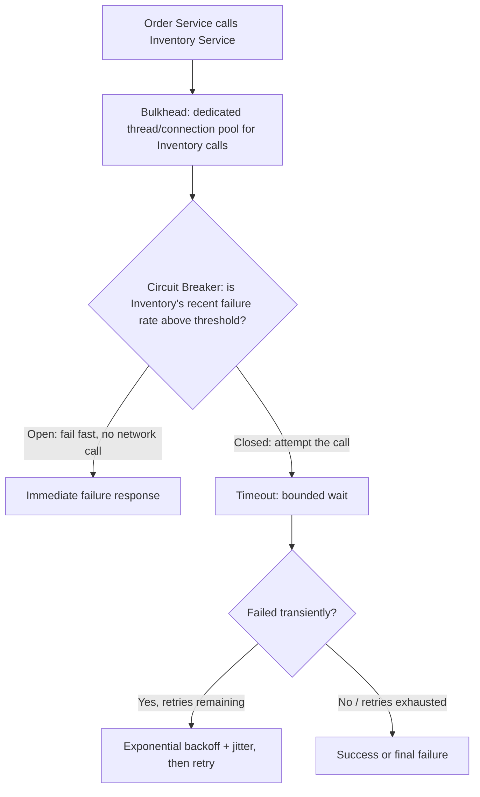
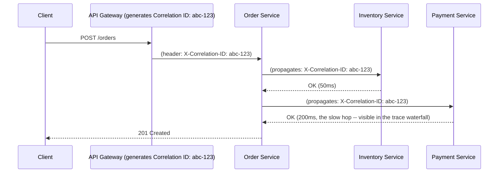
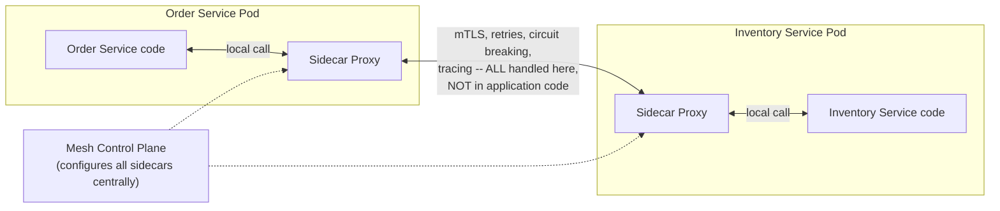
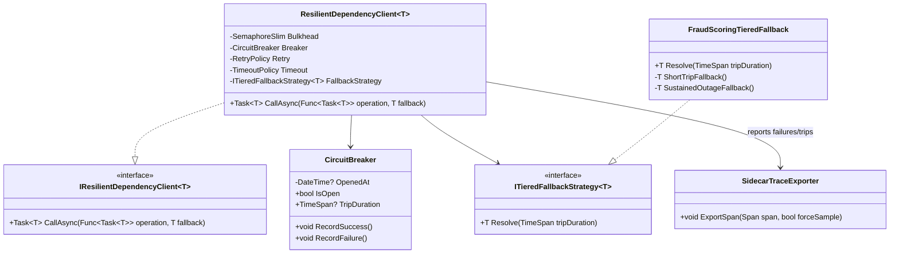
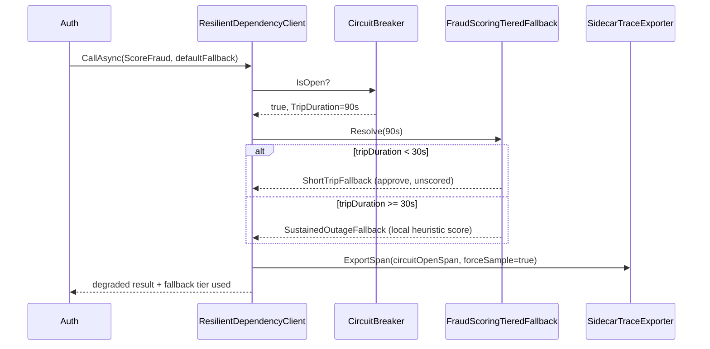

# Module 50 — Microservices: Resilience Patterns, Distributed Observability & the Sidecar Model

> Domain: Microservices | Level: Intermediate → Expert | Prerequisite: [[01-Decomposition-Communication-Strangler-Fig]], [[../16-Distributed-Systems/02-Failure-Detection-Idempotency-Outbox]], [[../02-DotNet-AspNetCore/06-HealthChecks-Observability]]
> Forward reference: [[../39-Service-Mesh/01-Service-Mesh-Fundamentals]] (a later dedicated module covers Istio/Linkerd-specific sidecar-proxy implementations in depth — this module covers the resilience/observability *patterns* a service mesh implements, conceptually, before that dedicated treatment)

---

## 1. Fundamentals

### Why does a correctly-decomposed microservices architecture still fail in production without dedicated resilience and observability investment?
Earlier analysis established that correct service decomposition avoids the distributed-monolith anti-pattern, but even a *correctly*-decomposed microservices architecture introduces two new categories of operational risk that a monolith never faced: **partial, cascading failure** (one service's slowness or outage propagating, uncontrolled, through synchronous call chains to affect otherwise-healthy services) and **diagnostic opacity** (a single user-facing request may now traverse a dozen independently-deployed services, making "which service actually caused this error/slowness?" a genuinely hard question without dedicated tooling). Resilience patterns (circuit breaker, retry, bulkhead, timeout — collectively, "the four horsemen of distributed-system defense") directly address the first; distributed tracing and correlation IDs directly address the second.

### Why does this matter?
Because these two risk categories are the direct, practical cost of the network boundary introduced between what used to be in-process method calls — a monolith's internal method call either succeeds or throws synchronously and instantaneously, and a stack trace unambiguously shows the call path; a microservices call across the network can fail in ambiguous ways (the partial-failure ambiguity) and its call path spans multiple independently-logged services with no inherent linkage between their log entries unless the architecture deliberately provides one.

### When does this matter?
Any team operating (not just designing) a microservices architecture in production — these patterns are what separate a microservices architecture that degrades gracefully under partial failure and remains debuggable in production, from one that cascades into full outages from a single slow downstream service and takes hours to diagnose because no one can trace a failing request across service boundaries.

### How does it work (30,000-ft view)?
```
Resilience: Timeout (bound how long you'll wait) -> Retry (with backoff, for transient failures)
 -> Circuit Breaker (stop calling a service that's clearly failing) -> Bulkhead
 (isolate resource pools so one dependency's failure can't exhaust shared resources)
Observability: Correlation ID (one ID threading through every service touched by one request)
 -> Distributed Tracing (visualize the full, cross-service call path and timing)
 -> the Four Golden Signals, PER SERVICE (latency, traffic, errors, saturation)
Sidecar: a proxy process deployed alongside each service instance, transparently handling
 resilience + observability + security concerns WITHOUT the service's own code
 needing to implement them directly (the architectural basis of a service mesh)
```

---

## 2. Deep Dive

### 2.1 Timeout — the Foundational, Non-Negotiable Resilience Primitive
Every synchronous inter-service call **must** have an explicit, bounded timeout — without one, a slow-but-not-fully-failed downstream service causes the calling service's threads/connections to pile up waiting indefinitely, eventually exhausting the caller's own resource pool (thread pool, connection pool) and causing the caller to fail too, **even though the caller's own code has no bug** — this is precisely how a single slow service cascades into a multi-service outage. The correct timeout value is workload-specific (the latency-budgeting discipline: if a request has an overall SLA of 500ms and must call three downstream services, each downstream call's timeout budget must be a fraction of that total, leaving headroom for the caller's own processing).

### 2.2 Retry with Backoff — for Transient Failures Only
A retry re-attempts a failed call, appropriate specifically for **transient** failures (a momentary network blip, a downstream service's brief GC pause) but actively harmful for **non-transient** failures (the downstream service is genuinely overloaded — blindly retrying adds *more* load to an already-struggling service, worsening the very problem causing the failures, a well-documented "retry storm" failure mode). Retries must use **exponential backoff with jitter** (each retry waits longer than the last, with randomized variance) — without jitter, many callers retrying in lockstep (all having failed at the same moment due to a shared downstream blip) will collectively retry at the same instant, recreating the same overload spike that caused the original failures.

### 2.3 Circuit Breaker — Failing Fast Instead of Piling Up Doomed Calls
A circuit breaker (introduced this) tracks a downstream service's recent failure rate and, once it crosses a threshold, "trips open" — subsequent calls fail **immediately**, without even attempting the network call, for a cool-down period, after which the breaker allows a small number of trial calls through ("half-open" state) to test whether the downstream service has recovered before fully "closing" the circuit again. This directly prevents the retry-storm failure mode and the resource-exhaustion cascade by refusing to keep hammering a service that's clearly failing, giving it room to recover rather than compounding its overload with continued traffic.

### 2.4 Bulkhead — Isolating Resource Pools Per Dependency
Named after a ship's watertight compartments (a hull breach in one compartment doesn't sink the whole ship), the bulkhead pattern isolates the resource pool (typically a thread pool or connection pool) used for calls to **each** downstream dependency, so that one dependency's failure/slowness exhausting its own dedicated pool **cannot** starve calls to other, healthy dependencies that would otherwise share the same pool — without bulkheads, a single misbehaving downstream service can exhaust a **shared** connection pool used for all outbound calls, causing calls to entirely unrelated, healthy services to fail too, purely due to pool exhaustion rather than any problem with those other services.

### 2.5 Correlation IDs and Distributed Tracing — Restoring Debuggability Across the Network Boundary
A correlation ID (a unique identifier generated at the system's edge — the gateway — and propagated through every header of every subsequent inter-service call for that request) is the minimal mechanism restoring the ability to answer "show me everything that happened for this one request" across a call chain spanning multiple independently-logged services — without it, correlating log entries across services for a single request requires error-prone, approximate matching on timestamps. Distributed tracing (OpenTelemetry being the current industry-standard instrumentation framework) builds on correlation IDs by additionally capturing **timing and parent-child call relationships** for every hop, producing a visual waterfall/flame-graph view of exactly which service in a multi-hop chain consumed how much of the total request latency — directly the tool that answers "why was this specific request slow?" when the answer isn't obvious from any single service's own logs.

### 2.6 The Sidecar Pattern — Extracting Cross-Cutting Concerns Out of Application Code
A sidecar is a separate proxy process deployed alongside each service instance (in Kubernetes,, typically as a second container in the same Pod) that intercepts all inbound/outbound network traffic for that service, transparently handling resilience (2.4), observability, and security (mTLS between services) concerns **without the service's own application code needing to implement them directly** — the service code makes a plain, local call to its sidecar, and the sidecar handles the actual network complexity. This is the architectural foundation of a **service mesh** (a fleet of sidecars plus a central control plane managing their configuration, the subject of the later dedicated Module in `39-Service-Mesh`) — the key insight this module establishes, ahead of that deeper treatment: extracting these cross-cutting resilience/observability concerns out of every individual service's own codebase (where they'd otherwise need to be reimplemented, consistently, in every service, in every language a polyglot organization uses) into a shared, uniform infrastructure layer is what makes resilience/observability practices consistently enforceable across a large microservices fleet rather than dependent on every individual team remembering to implement them correctly.

## 3. Visual Architecture

### Resilience Layering (a Single Outbound Call)

```mermaid
graph TB
 Call["Order Service calls Inventory Service"] --> BH["Bulkhead: dedicated thread/connection pool for Inventory calls"]
 BH --> CB{"Circuit Breaker: is Inventory's recent failure rate above threshold?"}
 CB -->|"Open: fail fast, no network call"| FastFail["Immediate failure response"]
 CB -->|"Closed: attempt the call"| TO["Timeout: bounded wait"]
 TO --> Retry{"Failed transiently?"}
 Retry -->|"Yes, retries remaining"| Backoff["Exponential backoff + jitter, then retry"]
 Retry -->|"No / retries exhausted"| Result["Success or final failure"]
```

### Distributed Tracing Across a Call Chain

```mermaid
sequenceDiagram
 participant Client
 participant Gateway as API Gateway (generates Correlation ID: abc-123)
 participant Order as Order Service
 participant Inventory as Inventory Service
 participant Payment as Payment Service
 Client->>Gateway: POST /orders
 Gateway->>Order: (header: X-Correlation-ID: abc-123)
 Order->>Inventory: (propagates: X-Correlation-ID: abc-123)
 Inventory-->>Order: OK (50ms)
 Order->>Payment: (propagates: X-Correlation-ID: abc-123)
 Payment-->>Order: OK (200ms, the slow hop -- visible in the trace waterfall)
 Order-->>Client: 201 Created
```

### Sidecar / Service-Mesh Architecture (Preview)

```mermaid
graph LR
 subgraph "Order Service Pod"
 OrderApp[Order Service code] <-->|"local call"| Sidecar1[Sidecar Proxy]
 end
 subgraph "Inventory Service Pod"
 Sidecar2[Sidecar Proxy] <-->|"local call"| InvApp[Inventory Service code]
 end
 Sidecar1 <-->|"mTLS, retries, circuit breaking,<br/>tracing -- ALL handled here,<br/>NOT in application code"| Sidecar2
 ControlPlane["Mesh Control Plane<br/>(configures all sidecars centrally)"] -.-> Sidecar1
 ControlPlane -.-> Sidecar2
```

## 4. Production Example
**Scenario**: An e-commerce platform's Order service synchronously called a Recommendations service (to fetch "customers also bought" suggestions) as part of every order-confirmation page render — this call had no timeout configured (defaulting to the HTTP client's implicit, very long default) and used a connection pool **shared** with all of the Order service's other outbound calls (no bulkhead isolation). One day, the Recommendations service began experiencing severe GC pauses (unrelated to Order or Payment) causing its response times to balloon to 30+ seconds. **Investigation**: within minutes, the Order service's shared connection pool became entirely saturated with connections waiting on the slow Recommendations calls, and — because the pool was shared — the **Payment** service calls (a completely unrelated, entirely healthy dependency) began failing too, since no connections remained available in the shared pool to make those calls at all. The on-call engineer initially suspected a Payment service outage (since that's what alerted first and most visibly, as order-confirmation failures), and spent 40 minutes investigating Payment's own health (which was, confusingly, perfectly normal) before a correlation-ID-based trace search revealed that every failing request's trace showed a slow Recommendations hop consuming the bulk of the request's time, with Payment calls failing only due to pool-exhaustion timing out afterward. **Fix**: added an explicit, tight timeout to the Recommendations call (500ms, since recommendations are a non-critical enhancement, not core checkout functionality) with a circuit breaker and graceful degradation (simply omit recommendations from the confirmation page if the call fails/times out, rather than failing the entire order confirmation) — and, critically, moved Recommendations calls to their **own, dedicated, bulkheaded connection pool**, isolated from Payment's pool. **Lesson**: this is precisely the bulkhead pattern's justification, learned the costly way — a non-critical dependency (Recommendations) sharing a resource pool with a critical dependency (Payment) meant the non-critical dependency's failure directly caused a critical dependency's calls to fail too, despite Payment itself being entirely healthy; and the 40-minute misdiagnosis delay is precisely the distributed-tracing justification — without a correlation-ID-based trace showing the actual slow hop, the on-call engineer's instinct (chase the service that's alerting) pointed at the wrong service entirely.

## 5. Best Practices
- Configure an explicit, workload-appropriate timeout on every synchronous inter-service call — never rely on an HTTP client's implicit default.
- Use exponential backoff with jitter for any retry logic, and retry only for genuinely transient failure classes.
- Deploy a circuit breaker on every synchronous inter-service call to fail fast once a downstream dependency's failure rate crosses a threshold.
- Use bulkheads (dedicated resource pools) to isolate each downstream dependency, especially separating non-critical from critical dependencies, so one dependency's failure can never starve another's resource pool (the incident).
- Propagate a correlation ID through every hop of every inter-service call chain, and invest in distributed tracing (OpenTelemetry) as a first-class operational tool, not an afterthought.
- Consider a sidecar/service-mesh model once the number of services and languages in use makes consistently reimplementing these patterns in every service's own code impractical.

## 6. Anti-patterns
- Unbounded/default timeouts on synchronous inter-service calls, allowing a single slow dependency to exhaust the caller's resources and cascade into a multi-service outage.
- Retrying without backoff/jitter, causing synchronized retry storms that amplify an already-struggling downstream service's overload.
- Sharing a single resource pool across all outbound dependencies, letting one dependency's failure starve calls to entirely unrelated, healthy dependencies (the root cause).
- Operating a multi-service architecture without correlation IDs/distributed tracing, forcing costly, error-prone, timestamp-based manual log correlation during incidents (the 40-minute misdiagnosis).
- Reimplementing resilience/observability logic inconsistently, ad hoc, in every individual service's own code (rather than centralizing via a sidecar/service mesh) once the fleet grows large enough that consistency can no longer be achieved by convention alone.

---

## 7. Performance Engineering

### 7.1 The sidecar proxy's per-hop latency tax
Every inter-service call routed through a sidecar (§2.6) pays a latency tax the sidecar's interception introduces — a request now traverses caller-app → caller-sidecar → network → callee-sidecar → callee-app, doubling the network hops compared to a direct call, since traffic exits and re-enters through a local proxy on both sides. In practice this typically adds low-single-digit milliseconds per hop at P50 (the sidecar's local, same-pod/same-host proxying is fast — no real network path, just a loopback hop) but the tail matters more than the median: at P99, sidecar CPU contention (the sidecar shares the pod's CPU allocation with the application container, and both are doing real work under load) can push the added latency into double-digit milliseconds, and a request traversing five sidecar-mediated hops (a realistic depth for a moderately complex checkout flow) compounds this tax five times over. This is a real, budgetable cost, not a rounding error, and must be accounted for explicitly against the request's overall SLA (directly the latency-budgeting discipline from Module 49 §2.3, now applied to infrastructure overhead rather than business-logic hops).

### 7.2 mTLS handshake and encryption overhead at the sidecar layer
Sidecar-enforced mTLS (§8.1) adds cryptographic handshake cost on connection establishment and ongoing encryption/decryption CPU cost on every byte transferred — the handshake cost is amortized away by connection reuse (the same discipline as Module 49's `PooledConnectionLifetime` guidance: a sidecar that re-establishes a fresh mTLS connection per request, rather than reusing a pooled one, pays the full handshake cost — often several times the actual request-processing time — on every single call), while the per-byte encryption cost is generally negligible for typical JSON/gRPC payload sizes on modern hardware (AES-NI-accelerated encryption runs at multi-GB/s) but becomes measurable for large payload transfers (bulk data exports, file-like transfers between services), where it should be accounted for in capacity planning rather than assumed free.

### 7.3 Circuit breaker and retry overhead — the cost of the safety net itself
The resilience patterns (§2.1-2.4) that prevent cascading failure are not themselves free: a circuit breaker's state tracking (recording every call's success/failure to compute a rolling failure rate) adds a small, constant per-call bookkeeping cost, and — more significantly — a **retry** that succeeds only on its second or third attempt multiplies that call's total latency by the number of attempts plus the backoff delay between them (§2.2's exponential-backoff-with-jitter, which by design adds deliberate delay). This means a service's *tail* latency (P99, P99.9) is disproportionately affected by retry behavior even when the *median* looks fine — a retry policy tuned purely by looking at median latency will systematically underestimate its own tail-latency cost, and a Principal-level performance review should always examine retry-attempt-count distributions specifically, not just end-to-end latency percentiles, to understand how much of the tail is retry-induced versus genuinely slow first attempts.

### 7.4 Distributed tracing's sampling-rate cost/completeness trade-off
Full (100%) trace sampling captures complete diagnostic detail but adds real, cumulative overhead: span creation, context propagation on every hop, and exporting trace data to a collector all cost CPU and network bandwidth proportional to request volume — at high-throughput services (thousands of requests per second), 100% sampling can become a measurable fraction of total request-processing cost and collector infrastructure spend. Intermediate Q6 already established the standard mitigation (sample errors at 100%, successful traffic at a much lower rate) — the performance-engineering framing of the same point is that sampling rate is a genuine, tunable dial trading diagnostic completeness against both application-level overhead and downstream trace-storage/processing cost, and it should be revisited per-service as traffic volume changes, not set once and forgotten.

---

## 8. Security

### 8.1 mTLS at the sidecar layer — the concrete inter-service authentication mechanism
§2.6 established that a sidecar can transparently handle security concerns without application code changes — the concrete, most consequential instance of this is **mutual TLS (mTLS)** enforced at the sidecar: each service is issued a short-lived, automatically-rotated certificate (typically via a mesh control plane acting as a certificate authority), and every sidecar-to-sidecar connection requires both sides to present and validate a certificate, not just the traditional one-way TLS (client validates server) used for typical browser-to-server traffic. This gives every inter-service call **cryptographic proof of caller identity** (the calling service's certificate, not just its network origin, which can be spoofed on a compromised network) — directly closing the gap Intermediate Q4 identified ("internal traffic" being wrongly treated as inherently trustworthy): with sidecar-enforced mTLS, a service literally cannot receive traffic from an unauthenticated caller, regardless of network position, because the TLS handshake itself fails without a valid, trusted certificate.

### 8.2 Certificate rotation as an availability-affecting security operation
mTLS certificates are deliberately short-lived (often hours, not the year-plus lifetimes typical of traditional server certificates) specifically to limit the blast radius of a compromised certificate — but this means certificate rotation is a **continuous, automated, must-not-fail** operation, not an occasional manual task: if the mesh control plane's certificate-issuance mechanism fails or lags, services' certificates can expire before renewal, and every mTLS-enforced connection using an expired certificate fails closed (the connection is refused), which is the secure-by-default behavior but also means a certificate-rotation outage is an availability incident, not just a security concern. This is a direct instance of §2.5 Advanced Q5's "the control plane itself must not become a single point of failure" principle, now applied specifically to certificate issuance: sidecars should cache valid certificates and tolerate a control-plane rotation outage gracefully for some bounded grace period (using the still-valid, not-yet-expired certificate) rather than failing immediately the moment the control plane becomes briefly unreachable.

### 8.3 Canary/blue-green deployment's secret-rotation exposure window
A canary or blue-green deployment (the subject of Module 51's deeper treatment, previewed here because it interacts directly with this module's resilience infrastructure) runs **two versions of a service simultaneously** for the rollout's duration — if a secret rotation (an API key, a database credential, a certificate) happens to occur during that window, both the old and new version must be able to authenticate successfully using whichever secret is currently valid, or the deployment produces authentication failures that look like a application bug but are actually a rollout/secret-rotation timing collision. The safe pattern is the same dual-validity window used for any breaking-change rollout (Module 51 §2.1's additive-by-default discipline, applied here to secrets specifically): a rotated secret should have a brief overlap period where **both the old and new secret validate successfully**, so that whichever service version (old canary remnant or new) happens to authenticate during the rotation window succeeds regardless of which secret it was configured with — never a hard, instantaneous cutover of a credential while two service versions are simultaneously live.

### 8.4 Trace and metric data as a security-governance surface
Intermediate Q10 already flagged that trace metadata can embed sensitive information (customer IDs, potentially account numbers or other PII passed as request parameters/headers) — the security implication deepens once tracing is deployed uniformly via the sidecar (§2.6): because every service's traffic is now automatically traced without individual application-team opt-in, a service team may not realize their previously-uninstrumented service is now emitting potentially-sensitive span data to a shared trace-storage backend. This makes trace-data governance (redaction of known-sensitive header/parameter names at the sidecar/collector layer, access controls on trace-storage equivalent to any other system holding customer data, per Intermediate Q10) a **platform-team responsibility**, not something each application team can be expected to individually remember, precisely because the sidecar model's uniform, automatic instrumentation removes the natural checkpoint (an application team deliberately adding tracing code) where a data-sensitivity review might otherwise have happened.

---

## 9. Scalability

### 9.1 Sidecar/mesh scaling to hundreds of services
A sidecar deployed per service instance means mesh-wide resource consumption (CPU/memory for every sidecar proxy) scales linearly with total instance count across the entire fleet — at hundreds of services with multiple replicas each, the aggregate sidecar resource footprint becomes a first-class capacity-planning line item, not a rounding error, and (per 7.1-7.2) the aggregate added latency across a multi-hop call chain grows with call-chain depth regardless of fleet size. The mesh control plane (§2.6, §2.5 Advanced Q5) must itself scale to push configuration to every one of those sidecars in reasonable time — a control plane that takes minutes to propagate a configuration change to thousands of sidecars materially weakens the "instant rollback" property resilience configuration changes are meant to provide, making control-plane push-latency a tracked, scaling-sensitive metric in its own right at large fleet sizes.

### 9.2 Correlation-ID and tracing infrastructure at scale
At small scale, a single trace-storage backend easily absorbs a fleet's trace volume; at hundreds of services and full production traffic, trace **ingestion throughput** and **storage retention cost** both become genuine scaling constraints requiring the same sampling-rate tuning (7.4) applied fleet-wide rather than per-service in isolation — a fleet-wide sampling policy (rather than each team independently choosing their own service's rate) is necessary once trace-storage cost becomes a shared, centrally-owned budget line item, directly paralleling the fleet-wide governance pattern Module 49's Advanced Q10 established for architectural health metrics, now applied to observability infrastructure cost.

### 9.3 Bulkhead sizing as an organization scales its dependency graph
§2.4's bulkhead pattern requires per-dependency resource-pool sizing — at small scale, with a handful of dependencies per service, this is a manageable, one-time configuration task; at fleet scale, with services routinely depending on dozens of other services (a realistic dependency-graph density at hundreds of services), manually right-sizing every bulkhead for every dependency pairing becomes impractical, and under-provisioned bulkheads (defaulting to a conservative, possibly too-small pool "to be safe") become an artificial, self-inflicted throughput ceiling across the fleet. At this scale, bulkhead sizing should be derived from **observed traffic patterns** (auto-tuning pool sizes from historical call-volume/latency data, revisited periodically) rather than a one-time manual estimate per pairing, treating bulkhead configuration itself as something that must scale with the dependency graph's growth, not just with individual service traffic growth.

### 9.4 Cascading-failure blast radius as fleet density increases
As a microservices fleet grows denser (more services, more inter-service dependencies per service), the *number of possible cascading-failure paths* grows faster than the number of services itself — a service with five dependencies has five potential cascade sources; a service with twenty has a combinatorially larger set of possible failure-propagation paths to defend against, especially where dependencies share deeper, transitive dependencies (a failure two hops away that both of a service's direct dependencies happen to rely on). This is the scalability argument for chaos engineering (Advanced Q7) becoming **mandatory, not optional**, at fleet scale — manually reasoning about every possible cascade path in a dense, hundreds-of-services dependency graph exceeds what design review alone can reliably catch, making deliberate, ongoing failure injection the only practical way to validate that resilience patterns actually contain cascades at the density modern fleets reach.

---

## 10. Interview Questions

### Basic (10)
1. **Q: Why does even a correctly-decomposed microservices architecture need dedicated resilience patterns?** **A:** The network boundary between services introduces partial-failure risk that in-process monolith calls never faced.
2. **Q: What does a timeout do, and why is it non-negotiable for synchronous inter-service calls?** **A:** Bounds how long a caller waits for a response; without one, a slow dependency can exhaust the caller's own resources indefinitely.
3. **Q: When is a retry appropriate?** **A:** Only for genuinely transient failures — retrying non-transient (overload) failures worsens the problem.
4. **Q: What is exponential backoff with jitter, and why does it need jitter specifically?** **A:** Progressively longer waits between retries, randomized; jitter prevents many callers retrying in lockstep and recreating an overload spike.
5. **Q: What does a circuit breaker do?** **A:** Tracks a downstream's failure rate and fails fast (without attempting the call) once a threshold is crossed, giving the downstream room to recover.
6. **Q: What is the bulkhead pattern?** **A:** Isolating each downstream dependency's resource pool so one dependency's failure can't starve calls to other, healthy dependencies.
7. **Q: What is a correlation ID?** **A:** A unique identifier generated at the request's entry point and propagated through every subsequent inter-service call, enabling cross-service log correlation.
8. **Q: What does distributed tracing add beyond a correlation ID?** **A:** Timing and parent-child call relationships for every hop, visualized as a waterfall/flame graph.
9. **Q: What is a sidecar?** **A:** A proxy process deployed alongside each service instance that transparently handles resilience/observability/security concerns outside the service's own application code.
10. **Q: What is the relationship between sidecars and a service mesh?** **A:** A service mesh is a fleet of sidecars plus a central control plane managing their configuration uniformly.

### Intermediate (10)
1. **Q: Why does an unbounded timeout on one synchronous call risk cascading into a multi-service outage, even when the caller's own code has no bug?** **A:** Piled-up waiting threads/connections eventually exhaust the caller's own resource pool, causing the caller to fail too — purely from resource exhaustion, not any defect in the caller's logic.
2. **Q: Why is a "retry storm" a realistic, damaging failure mode rather than a theoretical concern?** **A:** Many callers retrying an already-overloaded downstream service, especially without jitter causing synchronized retry timing, adds more load to the exact service already struggling, worsening rather than resolving the underlying overload.
3. **Q: Why does a circuit breaker's "half-open" state exist, rather than simply staying open until manually reset?** **A:** It allows automatic, gradual recovery testing — a small number of trial calls verify the downstream has actually recovered before fully resuming traffic, without requiring manual intervention for every transient outage.
4. **Q: Why did sharing a connection pool across Recommendations and Payment calls cause Payment failures despite Payment being entirely healthy?** **A:** The shared pool's connections were all consumed waiting on the slow Recommendations calls, leaving none available for Payment calls to use at all — a resource-exhaustion cascade unrelated to Payment's own health.
5. **Q: Why did the on-call engineer initially misdiagnose the incident as a Payment outage?** **A:** Payment's calls were the ones visibly failing/alerting, and without a correlation-ID-based trace revealing the actual slow hop (Recommendations), the natural instinct was to investigate the visibly-alerting service first.
6. **Q: Why should a 100%-trace-sampling strategy usually be reserved for error traces rather than applied uniformly to all traffic?** **A:** Full sampling captures complete diagnostic detail but at nontrivial storage/processing cost at high request volume; erring toward full capture of error traces (the ones most valuable for debugging) while sampling successful traces balances diagnostic completeness against cost.
7. **Q: Why does the sidecar model make resilience/observability practices more consistently enforceable across a large, polyglot microservices fleet than relying on each service team's own implementation?** **A:** Reimplementing timeout/retry/circuit-breaker/tracing logic correctly in every service's own code, across every language a polyglot organization uses, is error-prone and inconsistent; extracting these concerns into a shared sidecar infrastructure layer enforces them uniformly regardless of each service's implementation language or team's diligence.
8. **Q: Why must bulkhead pool sizes be chosen per-dependency rather than using one default size for every downstream call?** **A:** Each dependency has its own expected call volume/latency profile; an undersized bulkhead becomes an artificial bottleneck even when the downstream dependency itself is healthy and could handle more concurrent load.
9. **Q: Why does mTLS enforcement via a sidecar represent a stronger security guarantee than expecting each service team to implement certificate handling correctly on their own?** **A:** Uniform, infrastructure-level enforcement removes the risk of an individual team forgetting or misconfiguring encryption/authentication for their service's inter-service calls — directly extending the "never assume internal traffic is trusted" from a policy into an automatically-guaranteed property.
10. **Q: Why should trace data be subject to the same data-classification/access-control discipline as any other system holding customer data?** **A:** Trace metadata (request parameters, headers) can embed sensitive information like customer IDs; treating trace storage as exempt from standard data-governance discipline would create an ungoverned copy of potentially sensitive data.

### Advanced (10)
1. **Q: Diagnose the incident from first principles, and design the specific pre-production review question that would have caught the missing bulkhead isolation before the incident occurred.**
 **A:** Root cause: a non-critical dependency (Recommendations) sharing a resource pool with a critical one (Payment), so the non-critical one's failure could starve the critical one. Safeguard question during design/code review: "for each outbound dependency this service calls, is its resource pool isolated from every other dependency's pool, and if not, what happens to calls to Dependency B if Dependency A becomes slow/unavailable?" — explicitly tracing through this failure scenario for every dependency pairing during review would have surfaced the shared-pool risk before production traffic exposed it.
2. **Q: Explain how you would decide the appropriate circuit-breaker failure-rate threshold and cool-down duration for a given dependency, rather than using a single default value for every inter-service call.**
 **A:** Base the threshold on the dependency's baseline, healthy error rate (a critical payment-processing dependency with a near-zero healthy baseline should trip on a much lower failure-rate threshold than a best-effort recommendations service with a naturally higher tolerance for occasional errors) and set cool-down duration based on the dependency's typical recovery time from transient issues (a service that typically recovers from GC-pause-induced slowness within seconds needs a much shorter cool-down than one recovering from, say, a database failover taking tens of seconds) — a single, uniform default threshold/cool-down across all dependencies, as a "one size fits all" policy, will be miscalibrated for at least some dependencies' actual failure/recovery characteristics.
3. **Q: Design a strategy for gracefully degrading a user-facing feature (like the order-confirmation page) when a non-critical dependency's circuit breaker trips, without simply failing the entire request.**
 **A:** Explicitly classify each dependency as critical (checkout cannot proceed without it — Payment, Inventory) vs. non-critical/enhancement (Recommendations, personalized banners) at design time; for non-critical dependencies, wrap the call in a try/circuit-breaker pattern that, on failure, returns a sensible default/empty result (omit recommendations from the page) rather than propagating the failure to fail the entire request — this graceful-degradation design decision must be made explicitly per dependency during initial design, since defaulting to "any dependency failure fails the whole request" (the easiest but often wrong default) needlessly couples the user-facing request's success to every dependency's health, including non-critical ones.
4. **Q: A team's distributed tracing shows a request's total latency is 800ms, with the trace waterfall showing five sequential 150ms hops. Diagnose the likely underlying architectural issue and recommend two independent remediation directions.**
 **A:** Five *sequential* (not parallelized) synchronous hops directly reproduces the compounding-availability/latency-chain risk — remediation direction one: identify which of these five hops could be made **asynchronous** instead (per the synchronous-vs-asynchronous decision criterion — does the caller's own response genuinely need to wait for each result), removing them from the critical path entirely; remediation direction two: identify which of the sequential hops have no data dependency on each other's results and could be executed **in parallel** rather than sequentially (a straightforward refactor when hop 3 doesn't actually need hop 2's result to proceed), reducing the critical path's total latency without eliminating any hop.
5. **Q: Explain why a service mesh's centralized control plane, managing resilience/observability configuration for every sidecar uniformly, could itself become a scalability or reliability risk, and how you would mitigate it.**
 **A:** If every sidecar's operation depends on live, synchronous communication with the control plane for every decision, the control plane itself becomes a single point of failure/bottleneck for the entire mesh — the standard mitigation (used by mature service mesh implementations) is for each sidecar to cache its configuration locally and operate independently using the last-known-good configuration if the control plane becomes temporarily unreachable, applying the same "each component should degrade gracefully under a dependency's unavailability" principle this entire module teaches, now applied reflexively to the mesh infrastructure's own control plane.
6. **Q: A team implements circuit breakers correctly per the medium exercise, but reports that during a real partial outage, many *different, unrelated* services all began failing simultaneously, more broadly than the actual outage's scope should have caused. Investigate the likely cause.**
 **A:** Likely cause: a shared, common piece of infrastructure sitting in the call path of many otherwise-unrelated services' calls (a shared connection pool, a shared underlying network resource, or even a shared circuit-breaker library instance misconfigured to track failures in aggregate across all downstream calls rather than per-dependency) — directly generalizing the shared-pool root cause: correct *per-call* resilience patterns (timeout, retry, circuit breaker) don't help if the *isolation* layer beneath them (bulkheads) is itself shared across otherwise-independent dependencies, allowing one failure to masquerade as a much broader one.
7. **Q: Design an approach for validating that your resilience patterns (timeout, retry, circuit breaker, bulkhead) actually work as intended, before relying on them during a genuine production incident.**
 **A:** Chaos engineering — deliberately, intentionally injecting controlled failures (artificially slowing or failing a specific dependency in a controlled environment, or even carefully in production with safeguards) and verifying the expected resilience behavior actually triggers (the circuit breaker trips at the expected threshold, the bulkhead prevents the injected failure from affecting unrelated calls, the timeout fires at the configured duration) — directly extending this course's recurring "test failure-handling logic deliberately, don't just implement it and hope" principle (the Advanced-tier partial-failure-testing discussion) specifically to resilience-pattern configuration, which is otherwise easy to implement subtly incorrectly (wrong threshold, missing bulkhead isolation as) and never notice until a real incident exposes the gap.
8. **Q: How would you decide which resilience/observability concerns to keep in each service's own application code versus extracting into a sidecar/service mesh, rather than treating "sidecar for everything" as an automatic default?**
 **A:** Extract concerns that are genuinely uniform and cross-cutting across every service regardless of its specific business logic (mTLS, basic retry/timeout/circuit-breaking for standard HTTP/gRPC calls, trace-header propagation) into the sidecar layer; keep business-logic-aware resilience decisions (§Advanced Q3's critical-vs-non-critical-dependency graceful-degradation logic, which requires domain knowledge about what a sensible default response looks like for a given feature) in the service's own application code, since a generic sidecar proxy cannot know that "omit recommendations" is an acceptable degraded response for this specific request but "omit payment confirmation" is not — the sidecar handles the network-level retry/circuit-breaking mechanics, while the service's own code decides what to do once a call's ultimate success/failure is known.
9. **Q: A team observes that adding distributed tracing has itself introduced a measurable latency overhead on their highest-throughput service, and considers disabling tracing on that service entirely. Evaluate this as a Principal Engineer.**
 **A:** Disabling tracing entirely on the highest-throughput (likely also highest business-criticality) service is exactly the wrong service to sacrifice observability on — recommend instead tuning the **sampling rate** (the cost-vs-completeness trade-off) specifically for that service (capture all error traces, a much smaller percentage of successful high-volume traces) rather than an all-or-nothing choice, preserving the ability to diagnose failures on the most important service while controlling overhead — directly analogous to the structured-logging-volume trade-off, now correctly applied here as "tune the sampling rate," not "disable the safety mechanism entirely because it has a cost."
10. **Q: As a Principal Engineer designing resilience/observability standards for a 50+ microservice fleet, how would you ensure teams don't independently, inconsistently reimplement these patterns (with the attendant risk of subtle misconfigurations like's), while still allowing legitimate per-service customization (Advanced Q2's per-dependency threshold tuning)?**
 **A:** Provide default, uniform resilience/observability behavior via shared infrastructure (a sidecar/service mesh,, or at minimum a shared, well-tested internal library wrapping the resilience-pattern implementation) as the **default**, requiring no per-service reimplementation — while exposing clearly-documented, per-dependency **configuration** (thresholds, timeouts, cool-downs, sampling rates) as the sanctioned customization mechanism, so teams tune parameters for their specific dependencies' characteristics (Advanced Q2) without needing to reimplement the underlying mechanism itself, directly generalizing this course's recurring "convert a hard-won lesson into shared, enforced tooling rather than tribal knowledge" governance pattern (§Advanced Q10) specifically to resilience-pattern implementation at fleet scale.

### Expert (10)
1. **Q: A payments-authorization service sits behind a sidecar-enforced circuit breaker calling a Fraud-Scoring dependency. During a genuine regional AWS outage, the circuit breaker correctly trips open, and the service's configured fallback is "approve the transaction without a fraud score" (fail-open, chosen originally to avoid blocking legitimate payments during a fraud-service blip). Evaluate this fallback choice and redesign it.**
 **A:** A blanket fail-open fallback for a fraud-relevant dependency conflates two very different failure scenarios that deserve different responses: a brief, likely-transient blip (where fail-open's "don't block legitimate payments over a few seconds of noise" reasoning has some merit) versus a sustained, region-wide outage (where fail-open for the outage's *entire duration* exposes the business to systematically unscored, and therefore materially riskier, transaction volume for as long as the outage lasts). Redesign: tier the fallback by trip duration and transaction risk profile — for the first short window (tens of seconds), fail-open as before; if the circuit remains open past a configured threshold (signaling a sustained outage, not a blip), escalate to a **stricter fallback** (route to a lightweight, locally-cached or rules-based fraud heuristic as a degraded-but-nonzero check, or apply tighter risk-based transaction limits) rather than indefinitely defaulting to no fraud check at all — directly extending Module 49's Expert Q5 "failure-fallback behavior for risk-relevant dependencies is a business-risk decision requiring explicit sign-off" to the specific case where the *same* fallback's acceptability changes as outage duration grows, which a static, one-size-fits-all fallback configuration cannot express.
2. **Q: Design the interaction between a service's sidecar-enforced mTLS certificate rotation (§8.2) and its own circuit breaker's failure tracking, specifically addressing the scenario where a rotation glitch causes a brief spike in connection failures that the circuit breaker misinterprets as the downstream dependency being unhealthy.**
 **A:** This is a case where two independently-correct resilience mechanisms interact badly: the circuit breaker's failure-rate tracking (§2.3) doesn't distinguish *why* a call failed — a burst of mTLS handshake failures during a certificate-rotation glitch looks identical, from the circuit breaker's perspective, to the downstream service genuinely failing, and can trip the breaker open even though the downstream service itself is perfectly healthy. The fix is **failure-cause classification** before feeding a failure into the circuit breaker's rate calculation: connection/TLS-establishment failures should be tracked and alerted on separately from application-level failures (HTTP 5xx, timeouts after a successful connection), so that a certificate-rotation-driven handshake-failure spike triggers its own, distinct alert (pointing operators at the actual root cause — certificate infrastructure, not the downstream dependency) rather than either being silently absorbed into the same bucket as genuine downstream failures or unnecessarily tripping a circuit breaker that's protecting against the wrong problem.
3. **Q: A Principal Engineer is asked to justify, to a cost-conscious CFO, why the organization should invest in a service mesh (with its associated sidecar CPU/memory overhead, per §9.1) rather than continuing to rely on each team's own in-application resilience-library usage. Build the quantified argument.**
 **A:** Frame it as a comparison of two costs, both real: the sidecar's infrastructure overhead (quantifiable — CPU/memory per sidecar instance times fleet size, plus mesh control-plane cost) against the **cost of inconsistent resilience implementation** across teams, which is harder to quantify directly but can be anchored to concrete, already-observed evidence: the incident in this module's §4 (a shared-pool misconfiguration causing an unrelated dependency's calls to fail) and the broader pattern Advanced Q6 describes (subtle misconfigurations recurring because every team reimplements the pattern slightly differently) — estimate the annualized incident-response and lost-availability cost of these recurring, resilience-implementation-inconsistency-driven incidents (using Module 49 Expert Q8's estimation discipline: stated assumptions, order-of-magnitude, not false precision) and compare it against the sidecar overhead's infrastructure cost. In most fleets past a few dozen services, the incident-avoidance value dominates the infrastructure cost by a wide margin — the CFO-legible argument is "we are currently paying for this inconsistency in outages; the mesh converts an unpredictable, incident-driven cost into a predictable, budgeted infrastructure line item."
4. **Q: Design a bulkhead-sizing strategy for a dependency whose call volume is highly seasonal (a tax-filing-adjacent financial service with 20x normal traffic during a two-week filing-deadline window), avoiding both year-round over-provisioning and deadline-window resource exhaustion.**
 **A:** A single, static bulkhead size (§9.3) is wrong at both extremes here — sized for peak, it wastes resources for 50 weeks a year; sized for typical, it fails exactly during the highest-stakes two weeks. The correct design decouples bulkhead sizing from a fixed constant: bulkhead capacity should be a **percentage of currently-provisioned instance capacity** (scaling automatically as the service itself scales out for the seasonal peak, per standard autoscaling) rather than an absolute connection/thread count chosen once — combined with a pre-announced, calendar-driven capacity-planning review ahead of the known seasonal window (this traffic pattern is predictable, unlike Module 49's chaos-engineering-motivated unpredictable-failure scenarios) that explicitly re-validates bulkhead-to-instance-capacity ratios before the deadline window arrives, rather than relying purely on reactive autoscaling to get the ratio right under live, first-time-this-year peak load.
5. **Q: A team's OpenTelemetry-instrumented trace data reveals that a specific inter-service call chain has a P50 of 45ms but a P99.9 of 4 seconds — a nearly 100x gap between typical and worst-case. Diagnose the likely cause classes and design an investigation approach that distinguishes them.**
 **A:** A gap this large (not the more common 3-5x P50-to-P99 spread) points to a small number of qualitatively different failure classes rather than ordinary variance: (a) a retry storm on a subset of requests (§7.3 — a request hitting max retries with full exponential backoff can easily add seconds), (b) GC pauses or thread-pool starvation on a subset of target instances specifically (not the whole fleet — explaining why P50 looks fine), or (c) the cross-zone-skew-style hot-target problem (a subset of instances receiving disproportionate load due to an infrastructure imbalance, not a code issue). Investigation approach: don't start from the aggregate P99.9 — instead, pull the trace waterfalls for the *specific* slow requests (not a random sample; the 0.1% that are actually slow) and check for a common target-instance ID (points to (b) or (c)) or a common retry-attempt-count in the trace's span attributes (points to (a)) — the diagnostic principle being that a bimodal latency distribution (most requests fast, a small tail catastrophically slow) is a different debugging problem than a smoothly-degrading one, and averaging or median-based analysis actively hides the distinction.
6. **Q: Critique the following resilience-configuration policy proposed by a platform team: "every service must configure identical circuit-breaker thresholds (50% failure rate, 30-second cooldown) for every one of its dependencies, for consistency and to simplify platform tooling." Evaluate as a Principal Engineer, building on Advanced Q2's per-dependency-tuning argument.**
 **A:** This "consistency" argument confuses two different things that should be handled differently: **implementation** consistency (every service should use the *same underlying mechanism* — a shared library or sidecar-level enforcement, so behavior is predictable and centrally upgradable) versus **configuration-value** uniformity (every dependency getting the *same threshold number*), and the policy wrongly conflates them. Advanced Q2 already established that a payment-critical dependency's healthy baseline failure rate differs meaningfully from a best-effort recommendations service's — a single 50%-threshold-for-everything policy will be badly miscalibrated for at least some dependencies in any realistic, heterogeneous fleet. The correct policy: mandate implementation consistency (everyone uses the platform's shared circuit-breaker mechanism) while requiring each service team to justify their per-dependency threshold values against that dependency's *observed*, empirical healthy-baseline failure rate (a data-driven default suggested by the platform, overridable with justification) — "simplicity for the tooling" is a real but secondary concern that shouldn't override correctness for a safety-critical configuration parameter.
7. **Q: A newly-adopted service mesh's default mTLS configuration silently allowed plaintext (non-mTLS) connections to continue succeeding for services that hadn't yet been onboarded to the mesh, as a migration-compatibility accommodation. Six months after full mesh rollout was believed complete, a security audit discovers three legacy services still communicating in plaintext, undetected the entire time. Diagnose the governance failure and design a fix.**
 **A:** The governance failure is a classic "permissive-by-default migration accommodation that was never converted to strict-by-default once migration completed" pattern (directly Module 49's recurring "migration scaffolding needs a tracked removal date" lesson, now applied to a security posture rather than a routing/data-sync mechanism) — the mTLS-optional mode was a reasonable, necessary accommodation *during* migration, but nothing enforced its removal once migration was declared complete, and "we believe migration is complete" was never verified against an authoritative, queryable signal. Fix: the mesh's mTLS enforcement mode should be flipped to **strict** (reject plaintext) as an explicit, tracked migration-completion gate with its own verification step (querying the mesh control plane for "which services are still receiving/sending plaintext traffic," a directly answerable question the control plane can provide, rather than relying on a team's belief that migration finished) — and, going forward, any permissive/compatibility mode enabled for a migration should have the same removal-date discipline as any other piece of migration scaffolding, security-relevant or not.
8. **Q: Design an approach for a Principal Engineer to determine whether a proposed new inter-service dependency (Service A calling newly-built Service B synchronously) should be added to A's existing bulkhead-per-dependency configuration immediately at design time, or whether it's acceptable to launch first and add proper bulkhead isolation once real traffic patterns are known.**
 **A:** This is a real, common trade-off between shipping velocity and resilience-by-construction, and the answer should hinge on **B's blast-radius classification**, not on convenience: if B is a critical dependency (A's own critical-path functionality depends on B succeeding) or if B shares infrastructure with any of A's other critical dependencies without isolation, bulkhead configuration must exist *before* launch — this is exactly the class of gap the incident exploited, and "we'll add it once we understand traffic patterns" is precisely the reasoning that produced that incident. If B is unambiguously non-critical (a new, clearly-optional enhancement, closely analogous to Module 49's Recommendations service) and its blast radius is already provably bounded by an *existing* dedicated pool (not newly shared with anything critical), deferring precise sizing tuning until real traffic data exists is a reasonable, lower-risk trade-off — the deciding question is never "do we have time to tune this precisely," it's "could this dependency's failure, unbounded, reach something critical," and only a "no, provably" answer justifies deferring bulkhead work past launch.
9. **Q: A distributed trace shows a request's total latency dominated not by any single slow hop, but by many small, sequential "gaps" between spans — time where no service appears to be doing anything, and no span accounts for the elapsed time. Diagnose the likely cause and the specific instrumentation gap this reveals.**
 **A:** Unaccounted gaps between spans, rather than a slow span itself, typically indicate work happening **outside** of instrumented code paths — most commonly: connection-pool exhaustion causing a caller to *queue*, waiting for an available connection before a span even begins (the queueing time itself isn't captured as a span, because tracing typically instruments the call itself, not the wait-for-a-connection-slot beforehand); or asynchronous work-queue/thread-pool-scheduling delay (a request handed to a thread pool that's saturated, sitting queued before actual processing begins, again outside the traced span's boundaries). This is a genuine, common instrumentation gap: standard distributed tracing instruments *the call*, not *the wait to make the call*, and diagnosing it requires supplementing trace data with connection-pool/thread-pool queue-depth metrics correlated by timestamp against the gap — the fix isn't more tracing granularity on the calls themselves, it's adding instrumentation for the resource-acquisition wait time that precedes them, a distinct and commonly-missing observability dimension.
10. **Q: As a Principal Engineer, you inherit a fleet where every service independently decided its own trace-sampling rate (ranging from 1% to 100%), its own retry-count defaults (ranging from 0 to 5), and its own circuit-breaker library (three different libraries in use across different teams). Design a consolidation roadmap that improves consistency without a disruptive, all-at-once migration.**
 **A:** Apply the same incremental, capability-by-capability discipline Module 49 established for architectural migrations, now to resilience-tooling consolidation: (1) first, standardize *observability* of the current inconsistent state — instrument a fleet-wide dashboard showing each service's current sampling rate, retry config, and circuit-breaker library, making the inconsistency visible and quantifiable rather than anecdotal; (2) establish the platform-recommended default configuration (informed by Advanced Q6's data-driven-per-dependency-threshold principle) and require only **new** services to adopt it, avoiding a disruptive rip-and-replace of working, if inconsistent, existing services; (3) prioritize migrating existing services by risk (services with the most divergent, least-defensible current configuration, or those with a recent resilience-related incident, migrate first); (4) retire the non-standard circuit-breaker libraries last, once enough of the fleet has moved that maintaining multi-library platform tooling support is no longer justified — directly the same phased, evidence-prioritized migration philosophy this domain applies recurrently, here to internal tooling consolidation rather than a monolith-to-microservices migration.

---

## 11. Coding Exercises

### Easy — Explicit, workload-appropriate timeout
```csharp
var httpClient = new HttpClient { Timeout = TimeSpan.FromMilliseconds(500) };
// Recommendations is non-critical -- a TIGHT timeout is appropriate; NEVER rely on
// HttpClient's implicit, much longer default (100 seconds), which is what caused the incident.
```

### Medium — Retry with exponential backoff and jitter
```csharp
public async Task<HttpResponseMessage> CallWithRetryAsync(Func<Task<HttpResponseMessage>> call)
{
    var random = new Random;
    for (int attempt = 0; attempt < 3; attempt++)
    {
        try
        {
            var response = await call;
            if (response.IsSuccessStatusCode) return response;
            if (!IsTransient(response.StatusCode)) return response; // NEVER retry non-transient failures
        }
        catch (HttpRequestException) when (attempt < 2) { /* fall through to backoff */ }

        int baseDelayMs = (int)Math.Pow(2, attempt) * 100; // exponential: 100ms, 200ms, 400ms
        int jitterMs = random.Next(0, baseDelayMs / 2); // jitter: prevents synchronized retry storms
        await Task.Delay(baseDelayMs + jitterMs);
    }
    throw new InvalidOperationException("Retries exhausted");
}
```

### Hard — Bulkhead-isolated, circuit-breaker-protected dependency call
```csharp
public class DependencyClient
{
    private readonly SemaphoreSlim _bulkhead; // DEDICATED pool per dependency -- NOT shared (the root cause, fixed)
    private readonly CircuitBreaker _circuitBreaker;
    private readonly HttpClient _httpClient;

    public DependencyClient(int maxConcurrentCalls, CircuitBreakerConfig cbConfig)
    {
        _bulkhead = new SemaphoreSlim(maxConcurrentCalls, maxConcurrentCalls); // e.g., Payment: 50; Recommendations: 10
        _circuitBreaker = new CircuitBreaker(cbConfig);
    }

    public async Task<T?> CallAsync<T>(Func<HttpClient, Task<T>> operation, T? fallback = default)
    {
        if (_circuitBreaker.IsOpen) return fallback; // fail fast, no network call, no bulkhead slot consumed

        if (!await _bulkhead.WaitAsync(TimeSpan.FromMilliseconds(50)))
            return fallback; // pool exhausted for THIS dependency specifically -- isolated, doesn't affect others

        try
        {
            var result = await operation(_httpClient);
            _circuitBreaker.RecordSuccess;
            return result;
        }
        catch (Exception)
        {
            _circuitBreaker.RecordFailure;
            return fallback; // graceful degradation (Advanced Q3) for non-critical dependencies
        }
        finally { _bulkhead.Release; }
    }
}
// Order Service now instantiates SEPARATE DependencyClient instances for Payment and Recommendations
// each with its OWN bulkhead sizing and circuit breaker -- exactly the fix.
```

### Expert — Correlation ID propagation and trace-context middleware
```csharp
public class CorrelationIdMiddleware
{
    private readonly RequestDelegate _next;
    private const string HeaderName = "X-Correlation-ID";

    public async Task InvokeAsync(HttpContext context)
    {
        string correlationId = context.Request.Headers.TryGetValue(HeaderName, out var existing)
        ? existing.ToString // propagated from an upstream caller -- preserve it
        : Guid.NewGuid.ToString; // this service is the entry point -- generate a new one

        context.Items["CorrelationId"] = correlationId;
        using (LogContext.PushProperty("CorrelationId", correlationId)) // every log line in this request now tagged
        {
            await _next(context);
        }
    }
}

public class OutboundCallHandler: DelegatingHandler // attached to every HttpClient used for inter-service calls
{
    private readonly IHttpContextAccessor _contextAccessor;

    protected override Task<HttpResponseMessage> SendAsync(HttpRequestMessage request, CancellationToken ct)
    {
        if (_contextAccessor.HttpContext?.Items["CorrelationId"] is string correlationId)
        {
            request.Headers.Add("X-Correlation-ID", correlationId); // PROPAGATE to the next hop, unconditionally
        }
        return base.SendAsync(request, ct);
    }
}
```
**Discussion**: this pair of middleware/handler is the minimal mechanism implementing the correlation-ID propagation — every service in the chain both reads an inbound correlation ID (preserving it if present) and writes it to every outbound call, ensuring the same ID threads through the entire multi-hop chain regardless of how many services the request ultimately traverses, directly enabling the trace-based diagnosis that would have cut the 40-minute misdiagnosis down to minutes.

---

## 12. System Design

### Design a resilience and observability platform for a real-time payments-authorization mesh

**Scope:** a card-issuer's authorization estate — an Auth service (accepts ISO-8583-derived requests), a Fraud-Scoring service, a Ledger/Balance service, and a Notification service — needs a uniform resilience/observability layer so that Fraud-Scoring's degradation never takes down Auth, and any authorization request's full cross-service path is traceable within seconds during an incident.

**Functional requirements:**
- Every synchronous inter-service call enforces a timeout, retry (transient-only), circuit breaker, and dedicated bulkhead per dependency (§2.1-2.4).
- Every request carries a correlation ID from ingress through every downstream hop, queryable end-to-end within 5 seconds of the request completing.
- mTLS enforced on every inter-service connection (§8.1), with automated, zero-downtime certificate rotation (§8.2).
- Fraud-Scoring's fallback behavior on circuit-open must be tiered by outage duration (Expert Q1), not a single static fallback.

**Non-functional requirements:**
- The resilience/observability layer's own added latency budget: no more than 8ms P99 per hop (§7.1).
- 100% trace sampling on error paths; tunable, cost-aware sampling on success paths (§7.4, §9.2).
- The platform must survive a control-plane (mesh) outage without services losing their last-known-good resilience configuration (§2.5 Advanced Q5, §8.2).

**Back-of-the-envelope estimation:** the Auth service processes ~4,000 TPS peak (a realistic card-issuer authorization volume). At 4,000 TPS with a typical 3-hop chain (Auth → Fraud-Scoring → Ledger), that's ~12,000 sidecar-mediated hops/second at peak, each carrying the §7.1 per-hop latency tax — at even 2ms P50 per hop, three sequential hops add 6ms to every authorization's latency floor before any real business-logic time, which must be explicitly subtracted from the authorization network's overall response-time SLA (card networks commonly require sub-second, often sub-2-second, authorization response). The numbers tell us the actual hard constraint isn't sidecar throughput (12,000 hops/second is comfortably within a modern sidecar's capacity) — it's the **tail-latency budget**, since a card network's authorization SLA is a hard timeout with a decline-on-timeout consequence, making P99.9 tail behavior, not median throughput, this design's binding constraint.

**Component glossary:**
- **Auth Service** — accepts the authorization request; the critical-path orchestrator calling Fraud-Scoring (synchronous, tight timeout) and, on approval, Ledger (synchronous, for balance-hold) and Notification (asynchronous, fire-and-forget).
- **Fraud-Scoring Service** — a critical-but-tiered-fallback dependency (Expert Q1); its own resilience configuration must express the tiered-fallback design.
- **Sidecar (per service instance)** — enforces mTLS, timeout/retry/circuit-breaker/bulkhead policy, and emits trace spans, uniformly, without Auth/Fraud-Scoring/Ledger application code implementing any of this directly (§2.6).
- **Mesh Control Plane** — issues mTLS certificates, pushes resilience-policy configuration to sidecars, degrades gracefully (cached last-known-good) on its own unavailability.
- **Trace Collector** — ingests spans from every sidecar, tagged with correlation ID, at a tunable sampling rate (100% for error traces).
- **Bulkhead Pools** — per-dependency, sized per §9.3's observed-traffic-derived approach, with Fraud-Scoring and Ledger explicitly isolated from each other's pools (directly preventing Module 49 §4's incident pattern).

**Operational walkthrough (an authorization request, Fraud-Scoring circuit open for 90 seconds — past the "sustained outage" threshold):**
1. Client (acquirer network, via the edge gateway) submits an authorization request to Auth; sidecar assigns/propagates correlation ID.
2. Auth's sidecar attempts the call to Fraud-Scoring's sidecar (mTLS-authenticated); circuit breaker is open (tripped 90 seconds ago) — call fails fast, no network attempt made, consuming no bulkhead slot.
3. Auth's fallback logic checks trip duration (tracked via the circuit breaker's own state, exposed to the application layer): past the sustained-outage threshold, escalate to the tiered fallback — apply the lightweight, locally-cached risk-heuristic check (Expert Q1) instead of a blanket approve.
4. Auth proceeds to Ledger (separate bulkhead, unaffected by Fraud-Scoring's outage) to place the balance hold.
5. Auth responds to the acquirer within the SLA window, tagged with a `fraud-check: degraded-heuristic` flag in its internal audit trail (not a customer-visible field), for downstream reconciliation/risk review.
6. Auth publishes (asynchronously) a Notification event; Notification service processes independently, not on Auth's critical path.
7. All spans (Auth, the failed-fast Fraud-Scoring call, Ledger) are exported to the Trace Collector tagged with the correlation ID — because this path included a circuit-breaker trip (an error-adjacent condition), it's captured at 100% sampling regardless of the success-path sampling rate.

**Data model (per-dependency resilience configuration, pushed by the Mesh Control Plane):**

| Column | Type | Description |
|---|---|---|
| `caller_service` | varchar(100) | e.g., "auth-service" |
| `dependency_service` | varchar(100) | e.g., "fraud-scoring-service" |
| `timeout_ms` | int | mandatory, never null |
| `retry_max_attempts` | int | 0 for non-idempotent/non-retryable calls |
| `circuit_breaker_threshold_pct` | decimal | dependency-specific, per Advanced Q2/Expert Q6's empirical-baseline discipline |
| `circuit_breaker_cooldown_s` | int | |
| `bulkhead_pool_size` | int | derived from observed traffic, §9.3 |
| `fallback_tier_1` | varchar | short-trip fallback behavior |
| `fallback_tier_2` | varchar | sustained-outage fallback behavior (Expert Q1) |
| `fallback_tier_2_threshold_s` | int | trip duration triggering escalation to tier 2 |

**Why fallback is modeled as two explicit tiers in the schema, not a single field:** Expert Q1 established that a static fallback is wrong for a fraud-relevant dependency because the acceptable response changes with outage duration — encoding this directly in the data model (rather than leaving it as undocumented application logic) makes the tiered-fallback policy itself auditable and centrally reviewable by risk/compliance stakeholders, not buried in a service's source code where a risk reviewer would never think to look for it.

---

## 13. Low-Level Design

### Class design — per-dependency resilience wrapper with tiered fallback


```mermaid
classDiagram
    class IResilientDependencyClient~T~ {
        <<interface>>
        +Task~T~ CallAsync(Func~Task~T~~ operation, T fallback)
    }
    class ResilientDependencyClient~T~ {
        -SemaphoreSlim Bulkhead
        -CircuitBreaker Breaker
        -RetryPolicy Retry
        -TimeoutPolicy Timeout
        -ITieredFallbackStrategy~T~ FallbackStrategy
        +Task~T~ CallAsync(Func~Task~T~~ operation, T fallback)
    }
    class ITieredFallbackStrategy~T~ {
        <<interface>>
        +T Resolve(TimeSpan tripDuration)
    }
    class FraudScoringTieredFallback {
        +T Resolve(TimeSpan tripDuration)
        -T ShortTripFallback()
        -T SustainedOutageFallback()
    }
    class CircuitBreaker {
        -DateTime? OpenedAt
        +bool IsOpen
        +TimeSpan? TripDuration
        +void RecordSuccess()
        +void RecordFailure()
    }
    class SidecarTraceExporter {
        +void ExportSpan(Span span, bool forceSample)
    }

    ResilientDependencyClient ..|> IResilientDependencyClient
    ResilientDependencyClient --> CircuitBreaker
    ResilientDependencyClient --> ITieredFallbackStrategy
    FraudScoringTieredFallback ..|> ITieredFallbackStrategy
    ResilientDependencyClient --> SidecarTraceExporter : reports failures/trips
```

### Sequence diagram — sustained-outage fallback escalation


```mermaid
sequenceDiagram
    participant Auth
    participant Client as ResilientDependencyClient
    participant CB as CircuitBreaker
    participant Fallback as FraudScoringTieredFallback
    participant Trace as SidecarTraceExporter

    Auth->>Client: CallAsync(ScoreFraud, defaultFallback)
    Client->>CB: IsOpen?
    CB-->>Client: true, TripDuration=90s
    Client->>Fallback: Resolve(90s)
    alt tripDuration < 30s
        Fallback-->>Client: ShortTripFallback (approve, unscored)
    else tripDuration >= 30s
        Fallback-->>Client: SustainedOutageFallback (local heuristic score)
    end
    Client->>Trace: ExportSpan(circuitOpenSpan, forceSample=true)
    Client-->>Auth: degraded result + fallback tier used
```

**Design patterns used:**
- **Strategy** (`ITieredFallbackStrategy`) — each dependency's fallback behavior is a swappable strategy, letting Fraud-Scoring's tiered logic differ from, say, Recommendations' simple omit-on-failure fallback (Module 49 §4) without a shared class needing to encode both.
- **Decorator** (`ResilientDependencyClient` wrapping the raw dependency call) — layers timeout, retry, circuit breaker, and bulkhead transparently around the underlying call, matching the sidecar's own transparent-interception philosophy at the application-library level for teams not yet on a full mesh.
- **Observer** (`SidecarTraceExporter` receiving span/trip events) — decouples trace emission from the resilience logic itself, so tracing can be added, removed, or reconfigured (sampling rate) without touching `ResilientDependencyClient`'s core logic.

**SOLID mapping:**
- **SRP:** `CircuitBreaker` tracks state only; `FraudScoringTieredFallback` decides fallback value only; `SidecarTraceExporter` exports spans only — each has one reason to change.
- **OCP:** a new dependency with its own tiered-fallback logic requires a new `ITieredFallbackStrategy` implementation, not a modification to `ResilientDependencyClient`.
- **LSP:** any `ITieredFallbackStrategy<T>` substitutes cleanly; `ResilientDependencyClient` never inspects the concrete fallback type.
- **ISP:** the fallback interface exposes exactly one method (`Resolve`), so a simple, non-tiered dependency's fallback implementation isn't forced to implement tiering logic it doesn't need.
- **DIP:** `ResilientDependencyClient` depends on `ITieredFallbackStrategy` and `CircuitBreaker`'s abstraction, not on Fraud-Scoring-specific fallback logic directly.

**Extensibility:** adding a new critical, tiered-fallback dependency (say, a new AML-screening service) requires only a new `ITieredFallbackStrategy` implementation and a configuration row (§12's data model) — no change to `ResilientDependencyClient`, `CircuitBreaker`, or the trace-export mechanism, directly the same OCP payoff Module 49 §13 established for the routing layer, now applied to the resilience-wrapper layer.

**Concurrency/thread safety:** `CircuitBreaker`'s failure-rate tracking must be safe under high concurrent call volume (thousands of concurrent authorization requests hitting the same breaker instance) — a lock-free, sliding-window counter (using `Interlocked` operations on bucketed counters, rather than a single lock guarding the entire rate calculation) avoids the breaker itself becoming a contention bottleneck under exactly the high-load conditions where it matters most. `SemaphoreSlim`-backed bulkheads are natively thread-safe for concurrent acquire/release. The tiered-fallback resolution (`Resolve`) must be a pure, side-effect-free function of trip duration — never mutating shared state — so that concurrent calls during an open-circuit window can each independently and safely compute their fallback without needing to coordinate with each other.

---

## 14. Production Debugging

### Incident: sidecar CPU throttling causes P99 authorization latency spike under load, misdiagnosed as a Fraud-Scoring slowdown

**Scenario:** during a Black-Friday-adjacent traffic peak, the Auth service's P99 authorization latency rose from a normal ~180ms to over 900ms, while P50 remained largely normal (~60ms). On-call initially suspected Fraud-Scoring (the highest-latency downstream dependency in the normal-case trace waterfall) and paged that team, who found their own service's internal processing time unchanged.

**Root cause:** the sidecar containers were deployed with a **fixed CPU limit** (a Kubernetes resource limit set months earlier, based on typical, non-peak traffic) that had never been revisited as traffic grew — under peak load, sidecars (doing real, non-trivial work: mTLS encryption/decryption per §7.2, trace-span generation and export per §7.4, and the resilience-pattern bookkeeping per §7.3) began hitting their CPU limit and being **throttled** by the container runtime, adding queuing delay *inside the sidecar itself*, before a request ever reached the application container or the network. This queuing delay was invisible to application-level tracing (§Expert Q9's "gaps between spans" pattern) because the sidecar's own internal queuing isn't instrumented as an application span — it appeared, from the trace waterfall, as unexplained time between the Auth application's outbound call and the trace showing the call actually reaching Fraud-Scoring.

**Investigation:** the "unexplained gap" pattern (Expert Q9) was the key diagnostic clue — the trace showed elapsed time between spans that no span accounted for. Correlating the incident's timing against Kubernetes-level `container_cpu_cfs_throttled_periods_total` metrics for the sidecar containers specifically (not the application containers, which were not throttled) showed a near-perfect correlation: sidecar throttling events spiked in lockstep with the P99 latency degradation, while the application containers' own CPU usage remained well within their limits the entire time.

**Tools:** Kubernetes cgroup CPU-throttling metrics (`container_cpu_cfs_throttled_periods_total`, scraped alongside standard application metrics) were the decisive tool — without container-runtime-level visibility into the sidecar's own resource constraints, this incident's actual root cause (infrastructure sizing, not application or downstream-service behavior) would have remained hidden behind an application-level trace that showed nothing obviously wrong.

**Fix:**
1. Immediate: raised the sidecar CPU limit (and request) across the Auth deployment, restoring normal P99 latency within one rollout.
2. Structural: established a standing capacity-planning practice specifically for sidecar resource allocation, sized as a function of *request volume and mTLS/tracing overhead* (§7.1-§7.4's cost model), reviewed alongside — not as an afterthought to — application-container capacity planning, since the incident showed sidecar resourcing had been treated as a fixed, "set once" configuration rather than something that scales with the same traffic the application itself scales for.
3. Detection: added sidecar-specific CPU-throttling alerts, separate from application-container resource alerts, directly closing the observability gap that caused the initial misdiagnosis.

**Prevention:** any component that transparently intercepts traffic (a sidecar, per §2.6) does real, load-proportional work of its own, and its resource provisioning must scale with the same traffic drivers as the application it fronts — treating sidecar resourcing as a one-time, low-priority configuration detail (as opposed to a first-class capacity-planning input, per §9.1's aggregate-fleet framing) reproduces exactly this incident's root cause at whatever scale a fleet eventually reaches its original, unrevisited sidecar sizing assumptions.

---

## 15. Architecture Decision

### Choosing how to enforce resilience patterns fleet-wide

**Option A — shared, in-application resilience library (e.g., a Polly-based internal NuGet package).**
- *Advantages:* no additional infrastructure component, no added network hop (§7.1's tax doesn't apply), works identically regardless of deployment platform (containers, VMs, serverless), simplest to reason about for a smaller fleet.
- *Disadvantages:* every service must actually adopt and correctly configure the library — a team skipping it, or misconfiguring it, is invisible to any central enforcement mechanism; language-specific (a polyglot fleet needs an equivalent library per language, multiplying maintenance).
- *Cost:* low infrastructure cost; ongoing library-maintenance and multi-language-parity cost.
- *Complexity:* low to moderate; scales poorly past a handful of languages/teams (Advanced Q10's inherited-inconsistency scenario).
- *Best for:* a smaller, single-language fleet where centralized enforcement infrastructure isn't yet justified.

**Option B — sidecar/service mesh (this module's primary treatment).**
- *Advantages:* uniform enforcement regardless of application language, centrally, dynamically configurable (mesh control plane), transparent mTLS/tracing/resilience without per-service code, the strongest answer to Advanced Q10's inconsistency problem.
- *Disadvantages:* real added latency (§7.1) and resource cost (§9.1, §14's incident) that must be actively capacity-planned, not assumed free; a genuinely new operational dependency (the mesh itself) with its own failure modes (§8.2's certificate-rotation-as-availability-risk).
- *Cost:* higher infrastructure cost (sidecar resource overhead across the fleet) offset, per Expert Q3's argument, by materially reduced incident-driven cost at scale.
- *Complexity:* higher initial adoption complexity (mesh operational expertise required); lower long-run per-service complexity once adopted (no per-service resilience-library maintenance).
- *Best for:* a polyglot, multi-dozen-service fleet where implementation-consistency risk (Advanced Q6, Advanced Q10) has already produced, or is likely to produce, recurring incidents.

**Option C — hybrid: shared library for resilience patterns (timeout/retry/circuit-breaker/bulkhead), sidecar reserved for mTLS and tracing specifically.**
- *Advantages:* keeps business-logic-aware resilience decisions (§Advanced Q3's critical-vs-non-critical fallback logic, which genuinely needs application-domain knowledge) in application code where that knowledge lives, while still centralizing the genuinely uniform, domain-agnostic concerns (mTLS, trace-span generation) at the sidecar layer — directly Module 49's Advanced Q8 "extract genuinely uniform concerns to the sidecar; keep business-logic-aware decisions in application code" principle, applied here as the organizing design choice rather than an afterthought.
- *Disadvantages:* two layers to reason about and keep in sync (a service's resilience-library retry count and its sidecar's timeout must be coherently ordered, similar in spirit to Module 173's LB↔target timeout-ordering discipline); more moving parts than either pure option.
- *Cost:* moderate — pays some of both options' costs, but avoids Option A's full inconsistency risk and Option B's full latency/resource tax on every concern.
- *Complexity:* moderate-to-high, but the split of responsibility (business-aware vs. domain-agnostic) is itself a clarifying, principled boundary rather than arbitrary complexity.
- *Best for:* a fleet with genuinely business-domain-sensitive fallback logic (like this module's Fraud-Scoring tiered fallback) that shouldn't be pushed into an opaque, generic sidecar layer, but that also wants mTLS/tracing's uniform enforcement benefits.

**Recommendation:** for the payments-authorization scenario in §12, **Option C** is recommended. The reasoning: Fraud-Scoring's tiered fallback (Expert Q1) is precisely the kind of business-risk-aware logic that a generic sidecar cannot correctly express — pushing it into application code (within a shared resilience library providing the timeout/retry/circuit-breaker/bulkhead mechanics) keeps that domain knowledge where risk/compliance stakeholders can review it (§12's data-model rationale). mTLS and tracing, by contrast, are genuinely uniform, domain-agnostic concerns with no dependency-specific business logic — centralizing them at the sidecar layer captures Option B's consistency and security benefits (§8.1) without forcing every fallback decision through a one-size-fits-all mesh abstraction. This hybrid does add the "two layers must stay coherently ordered" complexity Option C's disadvantages name, but that cost is materially smaller than either forcing business logic into the sidecar (Option B alone) or forfeiting mTLS/tracing consistency (Option A alone).

---

## 17. Principal Engineer Perspective

**Business impact.** The §14 incident (sidecar throttling misdiagnosed as a downstream service problem) cost the organization not just direct remediation time but, more importantly, the wrong team's on-call engineer spent the incident's most time-critical minutes investigating the wrong system — a Principal Engineer should recognize that resilience/observability infrastructure choices directly shape **incident response speed**, and that an infrastructure layer's own failure modes (sidecar resource exhaustion, control-plane certificate-rotation lag) must be as thoroughly monitored and understood as the application logic it protects, precisely because these infrastructure-layer failures masquerade as application or downstream-dependency problems and misdirect response effort at the worst possible time.

**Engineering trade-offs.** Every resilience pattern in this module is a deliberate trade of one failure mode for another, never a free win: a circuit breaker trades "some legitimate requests fail during the trip" for "the dependency gets room to recover" (Expert Q1's tiered-fallback design exists specifically because that trade's acceptability changes with context); a sidecar trades "every request pays a latency tax" for "resilience/security is uniformly enforced" (§15's Option C exists specifically because that trade isn't uniformly worth it for every concern). A Principal Engineer's job is naming these trades explicitly during design review, not treating any resilience pattern as a costless best practice to be applied uniformly without considering its own overhead.

**Technical leadership and cross-team communication.** Fraud-Scoring's tiered-fallback policy (§12, §13) is not a decision an engineering team should make unilaterally — it directly encodes a risk-tolerance judgment (how long is "brief" versus "sustained," and what's an acceptable degraded fraud check during a sustained outage) that belongs to risk/compliance stakeholders. A Principal Engineer's role includes ensuring this kind of business-risk-encoded configuration is reviewed and signed off by the right stakeholders and remains auditable (§12's explicit-schema-fields design decision) rather than buried in code only engineers ever read — directly extending Module 49's "eventual-consistency trade-offs need business-stakeholder communication" pattern to fallback-policy design specifically.

**Architecture governance.** The recurring theme across this module's Advanced and Expert tiers — convert individually-reimplemented, inconsistent resilience logic into shared, centrally-governed infrastructure (Advanced Q10, Expert Q10) — is the standing governance philosophy a Principal Engineer should institutionalize: not a one-time consolidation project, but an ongoing practice of periodically auditing for configuration drift (services quietly diverging from platform defaults without documented justification) before it accumulates into the kind of fleet-wide inconsistency Expert Q10's inherited scenario describes.

**Cost optimization.** §9.1's aggregate sidecar resource cost and §14's incident (sidecar under-provisioning) together illustrate that resilience/observability infrastructure cost cannot be minimized in isolation — under-provisioning it (to save infrastructure spend) directly produces incident cost (§14) that typically exceeds the savings, while over-provisioning it uniformly without regard to actual per-service traffic (rather than the demand-scaled approach §9.3 and §14's fix describe) wastes spend without improving resilience. The Principal-Engineer-level framing is that this is a genuine optimization problem with a real optimum, not a "spend more is always safer" or "spend less is always leaner" binary.

**Risk analysis and long-term maintainability.** The single highest-leverage practice this module's Expert tier surfaces is classifying every dependency's failure-fallback behavior explicitly by **business risk tier**, not defaulting every dependency to the same fail-open-for-simplicity or fail-closed-for-safety pattern uniformly — Expert Q1's tiered design and §12's explicit, reviewable fallback-tier schema are the concrete mechanism; the long-term maintainability payoff is that a future engineer (or auditor) can answer "what does this system do when dependency X is unavailable for Y minutes" by reading a configuration table, rather than by archaeology through application code that may have been written by someone no longer at the company.

## 18. Revision
**Key takeaways**: Even correctly-decomposed microservices need dedicated resilience patterns — timeout (bound the wait), retry with backoff+jitter (only for transient failures), circuit breaker (fail fast once a dependency is clearly failing), and bulkhead (isolate each dependency's resource pool so one failure can't starve others) — layered together as defense against cascading failure (the incident: a shared pool let a non-critical dependency's slowness take down calls to an unrelated, healthy critical dependency). Correlation IDs and distributed tracing restore cross-service debuggability that a monolith's single stack trace provided for free. The sidecar pattern extracts these cross-cutting concerns out of application code into shared, uniformly-enforced infrastructure — the architectural basis of a service mesh, covered in full implementation depth in the later, dedicated `39-Service-Mesh` module.

---

**`17-Microservices` domain complete (Modules 49–50).** Next: continuing autonomously to `18-Event-Driven-Architecture`, — Event-Driven Architecture Fundamentals: Event Notification, Event-Carried State Transfer & Choreography vs Orchestration.
