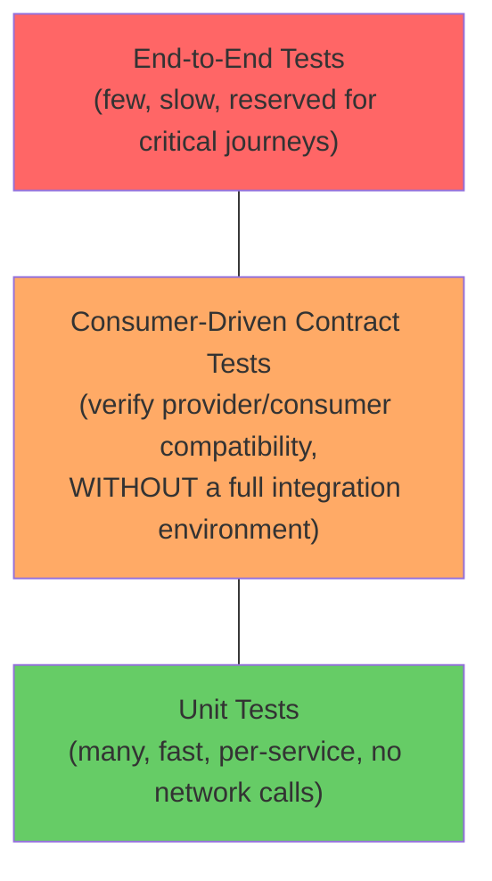
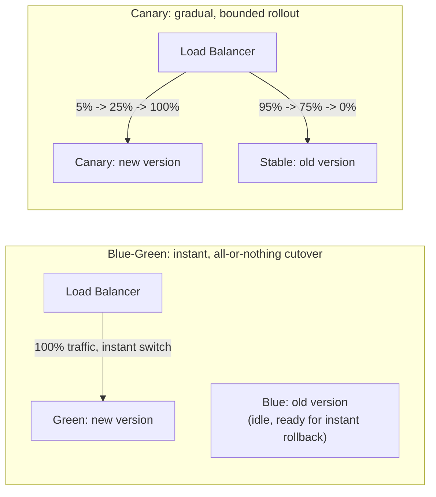
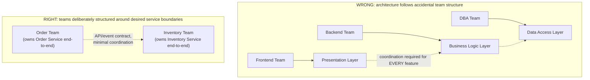

# Module 51 — Microservices: Versioning & Schema Evolution, Testing Strategies, Deployment Patterns & Team Topologies

> Domain: Microservices | Level: Intermediate → Expert | Prerequisite: [[01-Decomposition-Communication-Strangler-Fig]], [[02-Resilience-Observability-Sidecar-Patterns]], [[../03-REST-APIs/03-API-Documentation-Contract-Testing]] (consumer-driven contracts, extended here), [[../10-SOLID/01-SOLID-Principles-Deep-Dive]] (OCP, reapplied to API evolution)
> This module closes the remaining Principal-Engineer-level gaps in the microservices domain: how independently-deployed services stay compatible as they evolve (versioning), how you gain confidence in a change without a full integration environment (testing strategy), how you actually ship a change safely to production (deployment patterns), and how team structure itself shapes — and is shaped by — service boundaries (Conway's Law / Team Topologies).

---

## 1. Fundamentals

### Why do independently-deployable services need a dedicated discipline for versioning, testing, and deployment beyond what Modules 49-50 already covered?
Modules 49-50 established *how to decompose* services and *how to keep them resilient/observable* once running — but a defining property of microservices is that **each service deploys on its own schedule**, decided unilaterally by its own team, which means a consumer service and a provider service are almost never on the exact same version of each other's API/event schema at the exact same moment. Without deliberate versioning discipline, this becomes a breaking-change minefield; without a deliberate testing strategy, teams either can't ship confidently (over-relying on slow, flaky, full-environment integration tests) or ship recklessly (skipping verification because a full integration environment is impractical at scale); without deliberate deployment patterns, every release is a high-risk, all-or-nothing gamble.

### Why does this matter?
Because at the scale of dozens or hundreds of independently-deployed services (a realistic Principal Engineer's actual environment), the *organizational* practices around change — how compatibility is guaranteed, how confidence is gained pre-production, how risk is bounded during rollout — matter at least as much as the architectural decomposition itself; a Staff/Principal Engineer is expected to design and defend these practices as standing organizational policy, not just solve them ad hoc per incident.

### When does this matter?
Any organization with more than a handful of independently-deployed services and more than one team — the moment a single team no longer controls every service a given change touches, these disciplines become mandatory rather than optional.

### How does it work (30,000-ft view)?
```
Versioning: Semantic Versioning + backward-compatible-by-default evolution (additive changes only)
            -> breaking changes get a NEW version, old version kept alive during a deprecation window
Testing:    Unit tests (fast, per-service) -> Consumer-Driven Contract tests (verify compatibility
            WITHOUT a full integration environment) -> a SMALL number of true end-to-end tests
            (the "testing trophy/pyramid" applied to microservices specifically)
Deployment: Blue-Green (instant cutover, instant rollback) / Canary (gradual traffic shift,
            bounded blast radius) / Feature Flags (decouple deployment from release)
Team Topology: Conway's Law -- system architecture mirrors communication structure; deliberately
            designing team boundaries to match desired service boundaries (not the reverse)
```

---

## 2. Deep Dive

### 2.1 Semantic Versioning and Backward-Compatible-by-Default Evolution
Every service's public API/event schema should evolve under a strict default: **additive, backward-compatible changes require no version bump and no coordination** (adding a new, optional field to a response; adding a new endpoint) — directly Module 30's Open/Closed Principle (Module 10 §2.2) applied at the API-contract level: the contract should be open for extension (new optional fields/endpoints) but closed for modification (never repurposing or removing an existing field's meaning). **Breaking changes** (removing a field, changing a field's type or meaning, removing an endpoint) require an explicit new API version, with the **old version kept fully operational** for a defined deprecation window (giving every consumer time to migrate) — never a same-version, in-place breaking change, which silently breaks every consumer still expecting the old contract with no warning and no migration window.

### 2.2 The Microservices Testing Pyramid — Unit, Contract, and (Sparingly) End-to-End
A large suite of slow, flaky, full-environment end-to-end tests (spinning up every real service to test one interaction) doesn't scale as the number of services grows — each additional service in the dependency graph adds another point of flakiness and another few minutes of environment-startup time, and at dozens of services, a full-environment test suite becomes too slow and unreliable to run on every commit. The **testing pyramid** for microservices instead emphasizes: fast, numerous **unit tests** per service (no network calls, testing business logic in isolation); a smaller but critical layer of **consumer-driven contract tests** (Module 17 introduced Pact-style contract testing — the consumer defines its expectations of the provider's contract as an executable specification, and the provider verifies against every registered consumer's contract independently, in isolation, **without needing the actual consumer service running at all**); and a deliberately **small** number of true end-to-end tests, reserved for the handful of most business-critical user journeys, accepting their slowness/flakiness cost only where the value of full-stack verification clearly outweighs it.

### 2.3 Blue-Green Deployment — Instant Cutover, Instant Rollback
Blue-Green deployment maintains **two complete, parallel production environments** ("blue" = currently live, "green" = the new version, fully deployed and warmed up but not yet receiving live traffic) — cutover is a single, instantaneous routing change (all traffic now points to green instead of blue), and rollback is equally instantaneous (point traffic back to blue) since the old environment remains fully intact and running, not torn down, until the new version is confirmed healthy. The cost is running double the infrastructure temporarily during the transition, and it's an all-or-nothing cutover (100% of traffic moves at once) — appropriate when a gradual, partial rollout isn't feasible or necessary and instant rollback capability is the priority.

### 2.4 Canary Deployment — Gradual, Bounded-Blast-Radius Rollout
Canary deployment routes a **small percentage** of live traffic (5%, then 25%, then 50%, then 100%, incrementally) to the new version while the remainder continues on the old, stable version — critically, this bounds the blast radius of a bad deployment to only the small percentage of traffic that reached it, and provides real production-traffic validation (with real data patterns and load, which staging/test environments can never fully replicate) before committing to a full rollout. This is the direct deployment-level analog of Module 49's Strangler Fig migration pattern's incremental-cutover philosophy — gradual, monitored, reversible-at-every-step — now applied to *any* deployment, not specifically a monolith-to-microservices migration.

### 2.5 Feature Flags — Decoupling Deployment from Release
A feature flag wraps new functionality in a runtime-toggleable condition, meaning the **code can be deployed to production while the feature remains dark/disabled**, and later "released" (turned on) independently of any deployment event — this decouples two concerns that blue-green/canary conflate (deploying new code vs. exposing new behavior to users), enabling fine-grained control (enable for internal users only, then a small customer percentage, then everyone) entirely via configuration, without requiring a new deployment for each stage of rollout, and providing an even faster rollback mechanism than redeploying (simply flip the flag off) for behavioral, non-infrastructure issues specifically.

### 2.6 Conway's Law and Team Topologies — Architecture Mirrors Communication Structure
Conway's Law observes that any system's architecture will inevitably mirror the communication structure of the organization that builds it — if three teams must constantly coordinate to ship a single feature, the resulting architecture will reflect that coupling regardless of the intended design (directly explaining why Module 49 §4's technical-layer decomposition incident occurred: three teams, each owning one technical layer, produced an architecture requiring exactly the coordination their team structure already implied). The Principal-Engineer-level implication is **inverse Conway maneuver**: deliberately structuring teams to match the *desired* service boundaries (one team owning one business-capability-aligned service end-to-end, matching Module 49 §2.1's decomposition principle) rather than accepting whatever architecture an existing, unexamined team structure happens to produce — team topology is not a downstream consequence of architecture decisions but a **causal input** to them, and must be deliberately designed alongside the service boundaries themselves, not treated as an independent, separately-decided organizational concern.

## 3. Visual Architecture

### Testing Pyramid for Microservices


### Blue-Green vs Canary


### Inverse Conway Maneuver


## 4. Production Example
**Scenario**: A payments platform's Pricing service released a "breaking" change in place — renaming a `discountAmount` field to `discountValue` in its API response, deployed directly to the existing, single production version, with no new version and no deprecation window, on the reasoning that "it's a simple rename, and we notified the other teams in Slack." **Investigation**: within minutes of deployment, three separate downstream consumer services (Checkout, Invoicing, and a third-party partner integration the team hadn't even considered, since it consumed the API indirectly via an internal aggregator service they didn't have visibility into) began throwing null-reference errors reading the now-nonexistent `discountAmount` field — the Slack notification had reached the two internally-known consumer teams, who had **not yet had time to deploy their own updates**, and had entirely missed the indirect, third consumer nobody on the Pricing team knew existed. **Root cause**: treating a breaking API change as a same-version, in-place modification rather than following §2.1's breaking-change discipline (new version, old version kept alive during a deprecation window) — the team correctly recognized the need to *communicate* the change but incorrectly assumed synchronous, informal (Slack) coordination could substitute for the actual API-contract-level backward-compatibility guarantee that formal versioning provides, and had no mechanism (like Module 17's consumer-driven contract registry) to even discover the existence of every actual consumer before making the change. **Fix**: rolled back to the old field name immediately (mitigating the incident), then reintroduced the change correctly — added `discountValue` as a **new, additive field** alongside the existing `discountAmount` (kept, unchanged, for backward compatibility), with `discountAmount` formally deprecated and a tracked removal date communicated via the API's actual versioning/deprecation mechanism (not just Slack), giving every consumer — including ones not directly known to the Pricing team — time to migrate before the old field was ever actually removed. **Lesson**: this is precisely §2.1's OCP-at-the-API-level discipline, and a direct illustration of why informal, out-of-band communication (Slack) can never substitute for an API contract's own formal backward-compatibility guarantee — a contract's compatibility must be safe **by construction**, independent of whether every consumer happened to see and act on an informal notification in time, precisely because (as this incident showed) not even every consumer is necessarily known to the provider team in a sufficiently large organization.

## 5. Best Practices
- Default every API/event schema change to additive/backward-compatible; require an explicit new version (with a defined deprecation window for the old one) for any breaking change — never an in-place breaking modification (§4's incident).
- Never substitute informal communication (Slack, email) for a genuine backward-compatibility guarantee at the contract level — assume there are consumers you don't know about.
- Structure the majority of the test suite as fast unit tests and consumer-driven contract tests; reserve full end-to-end tests for a small number of the most business-critical user journeys.
- Prefer canary deployment (bounded blast radius, real-traffic validation) over blue-green for changes where gradual rollout is feasible; use feature flags to decouple deploying code from releasing behavior.
- Deliberately design team boundaries to match desired service boundaries (inverse Conway maneuver) rather than allowing architecture to passively mirror an unexamined existing team structure.

## 6. Anti-patterns
- In-place breaking API/event changes with no new version and no deprecation window, relying on informal notification to prevent consumer breakage (§4).
- An end-to-end-test-heavy suite that becomes too slow/flaky to run reliably as the number of services grows, eventually getting skipped or ignored rather than fixed.
- All-or-nothing deployment with no gradual rollout mechanism, maximizing the blast radius of any bad release.
- Conflating "deployed" with "released," losing the ability to control feature exposure independently of deployment timing.
- Allowing team structure to evolve accidentally and letting architecture passively follow it (Conway's Law operating unexamined), rather than deliberately designing team boundaries alongside service boundaries.

## 7. Performance Engineering
Consumer-driven contract tests (§2.2) run dramatically faster than full end-to-end tests (no real network calls, no full-environment startup), directly enabling a fast CI feedback loop even as the number of services grows — a suite dominated by contract tests can run in seconds/low minutes regardless of fleet size, while an end-to-end-test-dominated suite's runtime grows with the size and startup cost of the full dependency graph, eventually becoming impractical to run on every commit. Canary deployments (§2.4) additionally provide real production-load performance validation (catching a performance regression under genuine traffic patterns) that synthetic staging-environment load testing often misses, at the cost of that regression briefly affecting the canary's small traffic percentage.

## 8. Security
A deprecated-but-still-live old API version (§2.1's deprecation window) must still receive security patches and monitoring for its full deprecation lifetime — "it's being phased out" is not a justification for neglecting its security posture during the (potentially months-long) window it remains live and reachable. Feature flags (§2.5) themselves need access control — an internal-only or gradually-rolled-out feature flag that can be trivially discovered/toggled by an unauthorized party (a flag check performed client-side, inspectable in browser JavaScript, rather than server-side) defeats the controlled-rollout guarantee the flag was meant to provide.

## 9. Scalability
Blue-green deployment's double-infrastructure cost (§2.3) becomes a genuine capacity-planning concern at scale — running two complete parallel environments for every deployment, across dozens of services, multiplies infrastructure cost meaningfully, a real trade-off against blue-green's instant-rollback benefit that canary deployment (single environment, gradual traffic shift, no infrastructure duplication) avoids. Team topology decisions (§2.6) also scale organizationally — the inverse Conway maneuver becomes progressively harder to execute retroactively as an organization grows and existing team/service boundaries calcify, making it significantly cheaper to get team-boundary design right early than to reorganize a large, established organization around corrected boundaries later.

---

## 10. Interview Questions

### Basic (10)
1. **Q: What should a service's default API-evolution stance be?** **A:** Backward-compatible, additive changes only, requiring no version bump or consumer coordination.
2. **Q: What must accompany any breaking API change?** **A:** A new explicit version, with the old version kept operational during a defined deprecation window.
3. **Q: What is the microservices testing pyramid?** **A:** Many fast unit tests, a smaller layer of consumer-driven contract tests, and a small number of true end-to-end tests.
4. **Q: What is a consumer-driven contract test?** **A:** A test where the consumer defines its expectations of a provider's API as an executable spec, which the provider verifies against, without needing the real consumer service running.
5. **Q: What is blue-green deployment?** **A:** Maintaining two complete parallel environments and instantly cutting traffic over, enabling instant rollback.
6. **Q: What is canary deployment?** **A:** Gradually shifting a small, increasing percentage of traffic to a new version, bounding the blast radius of a bad release.
7. **Q: What is a feature flag, and what does it decouple?** **A:** A runtime-toggleable condition wrapping new functionality; it decouples deploying code from releasing/exposing behavior to users.
8. **Q: What is Conway's Law?** **A:** A system's architecture mirrors the communication structure of the organization that builds it.
9. **Q: What is the inverse Conway maneuver?** **A:** Deliberately structuring teams to match desired service boundaries, rather than letting architecture passively follow existing team structure.
10. **Q: Why is informal communication (Slack) insufficient to safely make a breaking API change?** **A:** Not every consumer may be known to the provider team, and consumers may not have time to react before the change takes effect.

### Intermediate (10)
1. **Q: Why does OCP (Module 10) apply at the API-contract level, not just the class-design level?** **A:** An API contract should similarly be open for extension (new optional fields/endpoints) but closed for modification (never repurposing/removing existing fields) — the same principle protecting existing callers from unexpected breakage, now applied to consumers across a network boundary instead of callers within one codebase.
2. **Q: Why do end-to-end tests scale poorly as the number of services grows?** **A:** Each additional service in the dependency graph adds startup time and a point of potential flakiness to the full-environment test run, making the suite progressively slower and less reliable as fleet size increases.
3. **Q: Why can consumer-driven contract tests verify compatibility without needing the actual consumer service running?** **A:** The consumer's expectations are captured as an executable specification (a contract) ahead of time; the provider verifies against that specification directly, decoupling the verification from needing the consumer's live, running code.
4. **Q: Why does blue-green deployment cost double the infrastructure, and when is that cost justified?** **A:** Two complete, parallel environments run simultaneously during the transition; justified when instant, guaranteed rollback capability is the priority and the double-infrastructure cost is acceptable relative to that guarantee's value.
5. **Q: Why does canary deployment provide validation that staging/synthetic load testing cannot?** **A:** It exposes the new version to genuine production traffic patterns and load, which synthetic test environments can never fully replicate in realism.
6. **Q: Why is a feature flag's rollback faster than a full redeployment rollback?** **A:** Flipping a flag off is a configuration-only change, taking effect immediately without needing to rebuild/redeploy any code.
7. **Q: Why did the §4 incident's Slack notification fail to prevent consumer breakage despite reaching the two internally-known consumer teams?** **A:** Those teams had not yet had time to deploy their own updates in response to the notification before the breaking change went live — informal notification doesn't guarantee synchronized timing the way a formal deprecation window does.
8. **Q: Why does Conway's Law explain Module 49 §4's technical-layer-decomposition incident specifically?** **A:** Three teams, each owning one technical layer, produced an architecture requiring the exact cross-team coordination their team structure already implied — the resulting distributed-monolith wasn't an accident of technical design alone but a direct mirror of the team structure that built it.
9. **Q: Why must a deprecated-but-still-live API version continue receiving security patches?** **A:** It remains live and reachable for its full deprecation window; "being phased out" doesn't reduce its actual attack surface during that period.
10. **Q: Why is a client-side-only feature flag check a security gap, not just an implementation detail?** **A:** It can be discovered/toggled by inspecting client-side code, defeating the controlled, gradual-rollout guarantee the flag exists to provide — enforcement must happen server-side.

### Advanced (10)
1. **Q: Diagnose the §4 incident from first principles, and design the specific organizational mechanism that would have caught the unknown third consumer before the breaking change shipped.**
   **A:** Root cause: no formal consumer registry — the Pricing team could only notify consumers *they knew about*, missing the indirect, aggregator-mediated third consumer entirely. Mechanism: a mandatory, centrally-registered consumer-driven contract registry (Module 17, extended here) that **every** consumer of a given API must register a contract against as a precondition for their integration being considered supported — this converts "which consumers exist" from tribal, incomplete team knowledge into a queryable, enforced system-of-record, so that a provider team can programmatically verify "does this change break any *registered* contract?" before shipping, and — as an organizational policy — any unregistered consumption of an API is explicitly treated as unsupported and not guaranteed compatibility, incentivizing every actual consumer to register rather than relying on informal, incomplete tribal awareness.
2. **Q: Design a decision framework for choosing between blue-green and canary deployment for a given service's release, rather than defaulting to one uniformly.**
   **A:** Prefer canary when: gradual, partial traffic-shifting infrastructure is available (typically requiring a more sophisticated load balancer/service mesh, §2.6's sidecar-model territory) and the change carries meaningful uncertainty where bounding blast radius and validating against real traffic before full rollout is valuable. Prefer blue-green when: the deployment involves a change that's inherently all-or-nothing (a database schema migration that can't sensibly serve two versions' worth of traffic simultaneously against different schema versions) or when instant, guaranteed full rollback is more valuable than gradual validation (a low-uncertainty, well-tested change where the main risk is an unexpected environment-specific issue, best caught by instant cutover/rollback rather than gradual exposure). Many mature organizations use both together — canary for gradual application-level rollout, with blue-green-style environment duplication as the underlying infrastructure enabling instant, full rollback if canary metrics degrade unacceptably at any stage.
3. **Q: A team's consumer-driven contract test suite passes for a proposed change, but the change still breaks a real consumer in production. Diagnose the likely gap and propose a fix.**
   **A:** Likely gap: the failing consumer's actual usage pattern isn't accurately captured by its registered contract (the contract is stale, incomplete, or was written to only capture a subset of fields/scenarios the consumer actually depends on) — contract tests are only as good as the contract's fidelity to real usage. Fix: institute a practice of periodically validating registered contracts against real production traffic samples (recording actual request/response pairs and verifying the contract still accurately reflects them), and treat contract staleness itself as a tracked risk — directly analogous to Module 17's original discussion of contract-testing discipline requiring active maintenance, not a write-once artifact.
4. **Q: Explain how you would design a feature-flag system's own architecture to avoid becoming a single point of failure or a performance bottleneck for every flag check across a large microservices fleet.**
   **A:** Avoid a design requiring a live, synchronous network call to a central flag-evaluation service for every single flag check in the request path (this would add both a latency cost and an availability dependency, directly reproducing Module 50 §2.1's every-synchronous-call-needs-defense discipline for what should be a lightweight concern) — instead, use a **local, cached flag-configuration** model, where each service periodically pulls (or receives push-based streaming updates of) the current flag configuration and evaluates flags against that local cache, falling back to the last-known-good configuration if the central flag service becomes temporarily unreachable, directly the same "cache locally, degrade gracefully if the control plane is unreachable" principle Module 50 §Advanced Q5 applied to a service mesh's control plane, now applied to feature-flag infrastructure specifically.
5. **Q: A Principal Engineer observes that despite a formally correct API-versioning policy (§2.1), teams still frequently ship breaking changes by accident, because engineers don't always recognize that a specific change (e.g., adding a new required, non-optional field, or changing the order of values in an enum) IS in fact breaking. Design a systemic fix beyond "remind engineers to be careful."**
   **A:** Automate breaking-change detection as a CI-pipeline gate — tooling (many API-contract frameworks, and OpenAPI-diff-style tools, Module 17's contract-testing ecosystem, support this) that automatically compares a proposed API/event-schema change against the previous, live version and **fails the build** if the diff constitutes a breaking change per a codified ruleset (removed field, changed type, new required field with no default, etc.) — this converts "does the engineer correctly recognize this as breaking" from an error-prone judgment call made under time pressure into an automated, enforced check, directly this course's recurring "convert a hard-won or subtle lesson into automated tooling rather than relying on individual engineer vigilance" governance pattern (Module 49 §Advanced Q10, Module 50 §Advanced Q10).
6. **Q: How would you evaluate whether an organization's team structure is actually well-aligned with its service architecture (a practical, evidence-based assessment of the inverse Conway maneuver's success), rather than relying on a subjective assessment?**
   **A:** Directly reuse Module 49 §Advanced Q7's deployment-correlation metric and feature-mapping exercise as the evidence base: if most features can be implemented and deployed by a single team owning a single service (or a small, stable, expected set of collaborating services) without requiring cross-team coordination for the majority of changes, team/architecture alignment is healthy; if most features routinely require coordinated changes and deployment across multiple teams' services, this is the same quantifiable signal (now viewed through a team-topology lens rather than a purely architectural one) that either the service boundaries or the team boundaries — or both — need re-examination, since Conway's Law guarantees they'll eventually converge to mirror each other regardless of which one moves.
7. **Q: Design an approach for migrating an organization from ad hoc, uncoordinated deployment practices to a disciplined canary/feature-flag model, given significant organizational inertia and existing manual deployment habits.**
   **A:** Apply Module 49's own core lesson reflexively — this is itself a Strangler-Fig-style incremental migration problem, not a big-bang policy change: start by mandating the new deployment discipline (canary + feature flags) for **new** services and features only, proving the practice's value with concrete, visible incidents-avoided or faster-rollback stories, then incrementally extend the requirement to existing, high-traffic/high-risk services (where the benefit is clearest and most valuable) before finally extending it fleet-wide — directly avoiding a risky, resistance-inducing mandate applied uniformly and immediately across an organization with significant existing inertia and manual habits.
8. **Q: A service owns a public API with dozens of external, unknown-to-the-team consumers (a genuinely public API, unlike §4's internal-fleet scenario). How does your breaking-change discipline change, if at all, when consumers are fundamentally unknowable rather than merely under-registered?**
   **A:** The core discipline (§2.1's additive-by-default, versioned-with-deprecation-window for breaking changes) doesn't change, but the deprecation window must be **substantially longer** (months to years, rather than the shorter windows feasible for known-internal consumers who can be actively pinged/tracked) since there's no realistic way to confirm every unknown external consumer has migrated — and version support must be **maintained indefinitely longer** as a result, treating "we cannot know when it's safe to fully remove the old version" as the honest, structural reality of a genuinely public API, rather than assuming a fixed, short deprecation timeline is always achievable regardless of consumer visibility.
9. **Q: Critique the following claim from a team lead: "We don't need consumer-driven contract tests — our end-to-end test suite already covers every integration, so contract tests would just be redundant." Evaluate this as a Principal Engineer.**
   **A:** Push back — even a comprehensive end-to-end suite covering every integration doesn't provide the same **fast-feedback, isolated-verification** property contract tests do (§2.2, §7): end-to-end tests only run (and only catch a compatibility break) after a full environment is stood up, likely later in the CI pipeline or even only in a staging environment, giving much slower feedback than a contract test that fails within seconds directly in the provider's own build pipeline, well before any full integration environment is involved — "coverage" alone doesn't capture the meaningfully different feedback-loop speed and isolation-of-failure-cause value contract tests provide; recommend both layers coexist, each serving a distinct purpose (Module 50's resilience-layering philosophy — defense in depth — applies here too, now to testing strategy rather than runtime resilience).
10. **Q: As a Principal Engineer establishing microservices governance for a 100+ service organization, design the specific set of automated gates (drawing on this entire module) you would require in every service's deployment pipeline, and justify why each one is necessary rather than optional.**
    **A:** (1) Automated breaking-change detection (Advanced Q5) — necessary because manual review alone reliably misses subtle breaking changes under time pressure. (2) Mandatory consumer-driven contract verification against every registered consumer (Advanced Q1) — necessary because a full end-to-end suite doesn't scale and doesn't provide fast, isolated feedback. (3) A canary or equivalent gradual-rollout mechanism with automated rollback triggers on error-rate/latency regression (§2.4, Module 50's golden signals) — necessary because human-monitored, manual rollback decisions are too slow relative to a bad deployment's potential blast radius at fleet scale. (4) A feature-flag-gated release path for any user-facing behavior change (§2.5) — necessary to decouple the (already-gated, already-safe) act of deploying code from the separate, product-level decision of exposing new behavior to users. Each gate targets a distinct failure mode this module identified (accidental breaking changes, slow/unreliable integration verification, unbounded blast radius, premature behavior exposure) — omitting any one reopens exactly the failure mode it exists to close, directly the same "each hard-won lesson becomes a specific, non-optional automated gate" governance pattern this course applies recurrently at increasing scale.

---

## 11. Coding Exercises

### Easy — Additive, backward-compatible API evolution (§2.1, §4's correct fix)
```csharp
public class PricingResponse
{
    public decimal DiscountAmount { get; set; }  // KEPT, unchanged -- existing consumers unaffected
    public decimal DiscountValue { get; set; }    // NEW, additive field -- old consumers simply ignore it
    [Obsolete("Use DiscountValue. Scheduled for removal 2027-01-01. See API deprecation registry.")]
    public decimal DiscountAmountLegacyAlias => DiscountAmount;
}
```

### Medium — Consumer-driven contract test (Pact-style, §2.2)
```csharp
[Fact]
public async Task InventoryConsumer_ExpectsAvailabilityField()
{
    // Consumer (Order Service) defines its EXPECTATION of the Inventory API's contract --
    // this runs WITHOUT the real Inventory Service running at all.
    _pact
        .UponReceiving("a request for stock availability")
        .Given("SKU-123 has 5 units in stock")
        .WithRequest(HttpMethod.Get, "/inventory/SKU-123/availability")
        .WillRespond()
        .WithStatus(200)
        .WithJsonBody(new { sku = "SKU-123", available = 5 });

    await _pact.VerifyAsync(async ctx =>
    {
        var client = new InventoryClient(ctx.MockServerUri);
        var result = await client.GetAvailabilityAsync("SKU-123");
        Assert.Equal(5, result.Available);
    });
    // The PROVIDER (Inventory Service) later verifies its actual API against this same
    // published contract in its OWN build pipeline -- catching incompatibility before either
    // service reaches a shared, full integration environment.
}
```

### Hard — Feature-flag-gated, server-side-enforced rollout (§2.5, §Intermediate Q10)
```csharp
public class FeatureFlagService
{
    private readonly IMemoryCache _localCache; // cached locally -- degrades gracefully if control plane unreachable

    public bool IsEnabled(string flagName, string userId)
    {
        var config = _localCache.Get<FlagConfig>(flagName) ?? _lastKnownGoodConfig[flagName];
        // Server-side evaluation ONLY -- never expose the rollout percentage or targeting logic
        // to client-side code, which would defeat the controlled-rollout guarantee (§8).
        return config.RolloutStrategy switch
        {
            RolloutStrategy.Percentage => HashUserId(userId) % 100 < config.RolloutPercentage,
            RolloutStrategy.InternalOnly => IsInternalUser(userId),
            RolloutStrategy.FullyOn => true,
            _ => false
        };
    }
}

public class CheckoutController : ControllerBase
{
    [HttpPost("/checkout")]
    public IActionResult Checkout(CheckoutRequest request)
    {
        if (_featureFlags.IsEnabled("new-checkout-flow", request.UserId))
            return _newCheckoutFlow.Process(request);  // deployed AND released independently
        return _legacyCheckoutFlow.Process(request);    // old path remains fully intact
    }
}
```

### Expert — Automated breaking-change detection CI gate (§Advanced Q5)
```csharp
public class SchemaCompatibilityChecker
{
    public CompatibilityResult Check(ApiSchema previous, ApiSchema proposed)
    {
        var violations = new List<string>();

        foreach (var field in previous.Fields)
        {
            var match = proposed.Fields.FirstOrDefault(f => f.Name == field.Name);
            if (match == null)
                violations.Add($"BREAKING: field '{field.Name}' removed");
            else if (match.Type != field.Type)
                violations.Add($"BREAKING: field '{field.Name}' type changed ({field.Type} -> {match.Type})");
        }

        foreach (var newField in proposed.Fields.Except(previous.Fields, FieldNameComparer.Instance))
        {
            if (newField.IsRequired && newField.DefaultValue == null)
                violations.Add($"BREAKING: new required field '{newField.Name}' has no default -- " +
                                 "existing consumers cannot satisfy this without a code change");
        }

        return new CompatibilityResult(IsCompatible: violations.Count == 0, violations);
        // Wired into CI: build FAILS if IsCompatible == false, unless an explicit new API version
        // is declared alongside the change (§2.1) -- converts human judgment into an enforced gate.
    }
}
```
**Discussion**: this automated checker is the concrete implementation of Advanced Q5's governance fix — it would have caught §4's `discountAmount` removal deterministically, at build time, regardless of whether any engineer on the Pricing team happened to recognize the rename as breaking under release-day time pressure.

---

## 12–17. System Design / LLD / Debugging / Decision / Case Study / Principal

*(§4's incident, the four §11 exercises, and the Advanced-tier Q&A — especially Advanced Q1's consumer-registry design, Advanced Q5's automated-gate design, and Advanced Q10's full governance-gate framework — collectively constitute this module's system-design, debugging, and Principal-Engineer-level content.)*

## 18. Revision
**Key takeaways**: Independently-deployed services require a default additive/backward-compatible API-evolution stance, with breaking changes always version-gated and given a deprecation window — informal communication can never substitute for this guarantee, since not every consumer is necessarily known (§4). The microservices testing pyramid favors fast unit and consumer-driven contract tests over a large, slow, flaky end-to-end suite that doesn't scale with fleet size. Canary deployment bounds blast radius and validates against real traffic; blue-green provides instant, guaranteed rollback at double the infrastructure cost; feature flags decouple deploying code from releasing behavior. Conway's Law means architecture will mirror team communication structure regardless of intent — the inverse Conway maneuver deliberately designs team boundaries to match desired service boundaries rather than accepting whatever an unexamined existing team structure produces. Every one of these disciplines is most durable when converted from individual-engineer vigilance into automated, enforced tooling (Advanced Q5, Q10).

---

**`17-Microservices` domain now fully complete (Modules 49–51): decomposition & communication, resilience & observability, and versioning/testing/deployment/team-topology.** Next: `18-Event-Driven-Architecture`, Module 52 — Event-Driven Architecture Fundamentals: Event Notification vs Event-Carried State Transfer, Choreography vs Orchestration & Pub/Sub Foundations.
