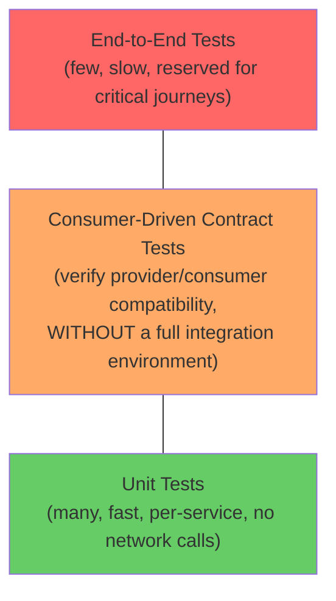
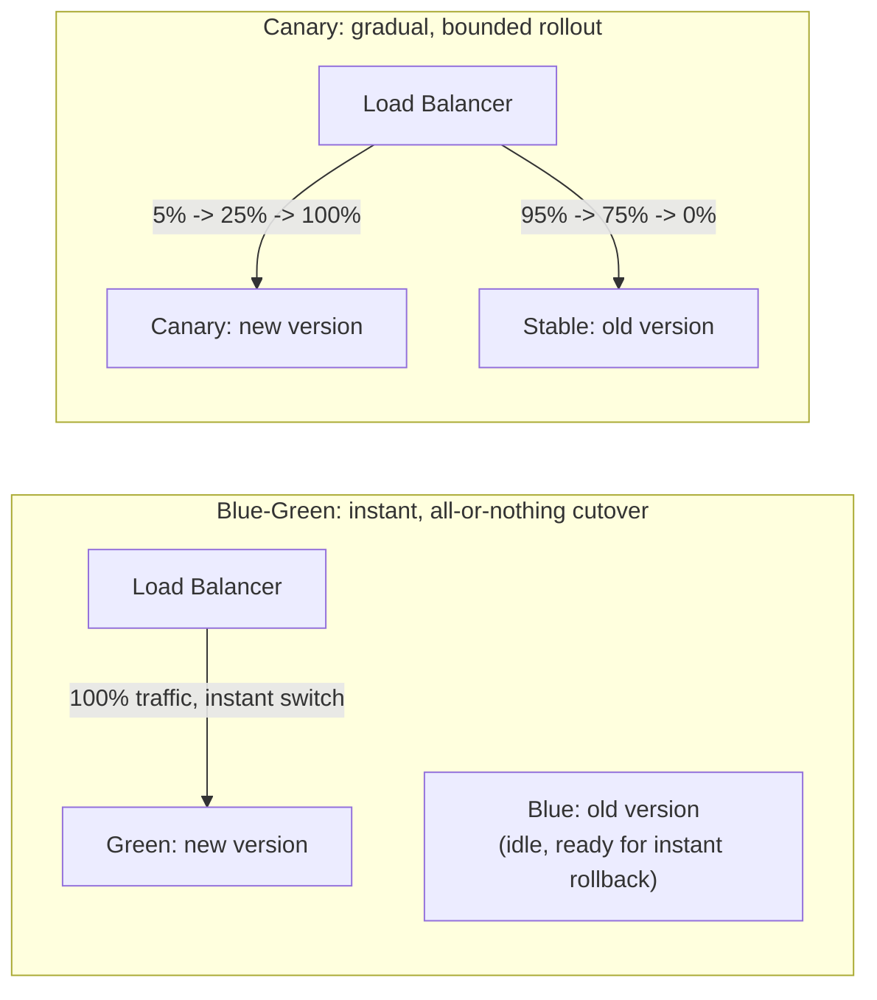
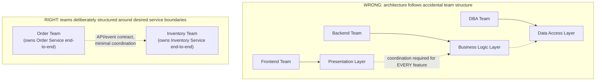
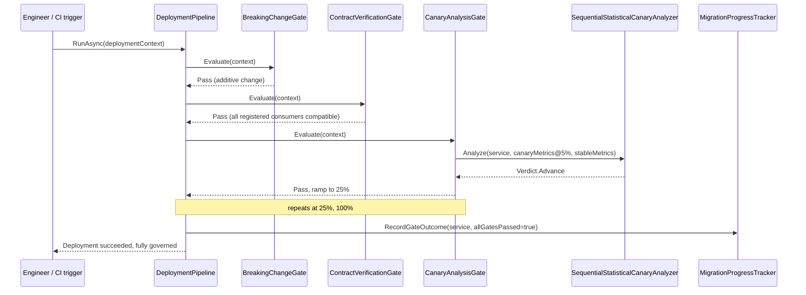

# Module 51 — Microservices: Versioning & Schema Evolution, Testing Strategies, Deployment Patterns & Team Topologies

> Domain: Microservices | Level: Intermediate → Expert | Prerequisite: [[01-Decomposition-Communication-Strangler-Fig]], [[02-Resilience-Observability-Sidecar-Patterns]], [[../03-REST-APIs/03-API-Documentation-Contract-Testing]] (consumer-driven contracts, extended here), [[../10-SOLID/01-SOLID-Principles-Deep-Dive]] (OCP, reapplied to API evolution)
> This module closes the remaining Principal-Engineer-level gaps in the microservices domain: how independently-deployed services stay compatible as they evolve (versioning), how you gain confidence in a change without a full integration environment (testing strategy), how you actually ship a change safely to production (deployment patterns), and how team structure itself shapes — and is shaped by — service boundaries (Conway's Law / Team Topologies).

---

## 1. Fundamentals

### Why do independently-deployable services need a dedicated discipline for versioning, testing, and deployment beyond what Modules 49-50 already covered?
Modules 49-50 established *how to decompose* services and *how to keep them resilient/observable* once running — but a defining property of microservices is that **each service deploys on its own schedule**, decided unilaterally by its own team, which means a consumer service and a provider service are almost never on the exact same version of each other's API/event schema at the exact same moment. Without deliberate versioning discipline, this becomes a breaking-change minefield; without a deliberate testing strategy, teams either can't ship confidently (over-relying on slow, flaky, full-environment integration tests) or ship recklessly (skipping verification because a full integration environment is impractical at scale); without deliberate deployment patterns, every release is a high-risk, all-or-nothing gamble.

### Why does this matter?
Because at the scale of dozens or hundreds of independently-deployed services (a realistic Principal Engineer's actual environment), the *organizational* practices around change — how compatibility is guaranteed, how confidence is gained pre-production, how risk is bounded during rollout — matter at least as much as the architectural decomposition itself; a Staff/Principal Engineer is expected to design and defend these practices as standing organizational policy, not just solve them ad hoc per incident.

### When does this matter?
Any organization with more than a handful of independently-deployed services and more than one team — the moment a single team no longer controls every service a given change touches, these disciplines become mandatory rather than optional.

### How does it work (30,000-ft view)?
```
Versioning: Semantic Versioning + backward-compatible-by-default evolution (additive changes only)
 -> breaking changes get a NEW version, old version kept alive during a deprecation window
Testing: Unit tests (fast, per-service) -> Consumer-Driven Contract tests (verify compatibility
 WITHOUT a full integration environment) -> a SMALL number of true end-to-end tests
 (the "testing trophy/pyramid" applied to microservices specifically)
Deployment: Blue-Green (instant cutover, instant rollback) / Canary (gradual traffic shift,
 bounded blast radius) / Feature Flags (decouple deployment from release)
Team Topology: Conway's Law -- system architecture mirrors communication structure; deliberately
 designing team boundaries to match desired service boundaries (not the reverse)
```

---

## 2. Deep Dive

### 2.1 Semantic Versioning and Backward-Compatible-by-Default Evolution
Every service's public API/event schema should evolve under a strict default: **additive, backward-compatible changes require no version bump and no coordination** (adding a new, optional field to a response; adding a new endpoint) — directly the Open/Closed Principle applied at the API-contract level: the contract should be open for extension (new optional fields/endpoints) but closed for modification (never repurposing or removing an existing field's meaning). **Breaking changes** (removing a field, changing a field's type or meaning, removing an endpoint) require an explicit new API version, with the **old version kept fully operational** for a defined deprecation window (giving every consumer time to migrate) — never a same-version, in-place breaking change, which silently breaks every consumer still expecting the old contract with no warning and no migration window.

### 2.2 The Microservices Testing Pyramid — Unit, Contract, and (Sparingly) End-to-End
A large suite of slow, flaky, full-environment end-to-end tests (spinning up every real service to test one interaction) doesn't scale as the number of services grows — each additional service in the dependency graph adds another point of flakiness and another few minutes of environment-startup time, and at dozens of services, a full-environment test suite becomes too slow and unreliable to run on every commit. The **testing pyramid** for microservices instead emphasizes: fast, numerous **unit tests** per service (no network calls, testing business logic in isolation); a smaller but critical layer of **consumer-driven contract tests** (introduced Pact-style contract testing — the consumer defines its expectations of the provider's contract as an executable specification, and the provider verifies against every registered consumer's contract independently, in isolation, **without needing the actual consumer service running at all**); and a deliberately **small** number of true end-to-end tests, reserved for the handful of most business-critical user journeys, accepting their slowness/flakiness cost only where the value of full-stack verification clearly outweighs it.

### 2.3 Blue-Green Deployment — Instant Cutover, Instant Rollback
Blue-Green deployment maintains **two complete, parallel production environments** ("blue" = currently live, "green" = the new version, fully deployed and warmed up but not yet receiving live traffic) — cutover is a single, instantaneous routing change (all traffic now points to green instead of blue), and rollback is equally instantaneous (point traffic back to blue) since the old environment remains fully intact and running, not torn down, until the new version is confirmed healthy. The cost is running double the infrastructure temporarily during the transition, and it's an all-or-nothing cutover (100% of traffic moves at once) — appropriate when a gradual, partial rollout isn't feasible or necessary and instant rollback capability is the priority.

### 2.4 Canary Deployment — Gradual, Bounded-Blast-Radius Rollout
Canary deployment routes a **small percentage** of live traffic (5%, then 25%, then 50%, then 100%, incrementally) to the new version while the remainder continues on the old, stable version — critically, this bounds the blast radius of a bad deployment to only the small percentage of traffic that reached it, and provides real production-traffic validation (with real data patterns and load, which staging/test environments can never fully replicate) before committing to a full rollout. This is the direct deployment-level analog of the Strangler Fig migration pattern's incremental-cutover philosophy — gradual, monitored, reversible-at-every-step — now applied to *any* deployment, not specifically a monolith-to-microservices migration.

### 2.5 Feature Flags — Decoupling Deployment from Release
A feature flag wraps new functionality in a runtime-toggleable condition, meaning the **code can be deployed to production while the feature remains dark/disabled**, and later "released" (turned on) independently of any deployment event — this decouples two concerns that blue-green/canary conflate (deploying new code vs. exposing new behavior to users), enabling fine-grained control (enable for internal users only, then a small customer percentage, then everyone) entirely via configuration, without requiring a new deployment for each stage of rollout, and providing an even faster rollback mechanism than redeploying (simply flip the flag off) for behavioral, non-infrastructure issues specifically.

### 2.6 Conway's Law and Team Topologies — Architecture Mirrors Communication Structure
Conway's Law observes that any system's architecture will inevitably mirror the communication structure of the organization that builds it — if three teams must constantly coordinate to ship a single feature, the resulting architecture will reflect that coupling regardless of the intended design (directly explaining why the technical-layer decomposition incident occurred: three teams, each owning one technical layer, produced an architecture requiring exactly the coordination their team structure already implied). The Principal-Engineer-level implication is **inverse Conway maneuver**: deliberately structuring teams to match the *desired* service boundaries (one team owning one business-capability-aligned service end-to-end, matching the decomposition principle) rather than accepting whatever architecture an existing, unexamined team structure happens to produce — team topology is not a downstream consequence of architecture decisions but a **causal input** to them, and must be deliberately designed alongside the service boundaries themselves, not treated as an independent, separately-decided organizational concern.

## 3. Visual Architecture

### Testing Pyramid for Microservices

```mermaid
graph TB
 E2E["End-to-End Tests<br/>(few, slow, reserved for critical journeys)"]
 Contract["Consumer-Driven Contract Tests<br/>(verify provider/consumer compatibility,<br/>WITHOUT a full integration environment)"]
 Unit["Unit Tests<br/>(many, fast, per-service, no network calls)"]
 E2E --- Contract --- Unit
 style E2E fill:#f66
 style Contract fill:#fa6
 style Unit fill:#6c6
```

### Blue-Green vs Canary

```mermaid
graph LR
 subgraph "Blue-Green: instant, all-or-nothing cutover"
 BG_LB[Load Balancer] -->|"100% traffic, instant switch"| Green[Green: new version]
 Blue["Blue: old version<br/>(idle, ready for instant rollback)"]
 end
 subgraph "Canary: gradual, bounded rollout"
 C_LB[Load Balancer] -->|"5% -> 25% -> 100%"| Canary[Canary: new version]
 C_LB -->|"95% -> 75% -> 0%"| Stable[Stable: old version]
 end
```

### Inverse Conway Maneuver

```mermaid
graph TB
 subgraph "WRONG: architecture follows accidental team structure"
 T1[Frontend Team] --> Layer1[Presentation Layer]
 T2[Backend Team] --> Layer2[Business Logic Layer]
 T3[DBA Team] --> Layer3[Data Access Layer]
 Layer1 -.->|"coordination required for EVERY feature"| Layer2 -.-> Layer3
 end
 subgraph "RIGHT: teams deliberately structured around desired service boundaries"
 OrderTeam["Order Team<br/>(owns Order Service end-to-end)"]
 InventoryTeam["Inventory Team<br/>(owns Inventory Service end-to-end)"]
 OrderTeam -.->|"API/event contract,<br/>minimal coordination"| InventoryTeam
 end
```

## 4. Production Example
**Scenario**: A payments platform's Pricing service released a "breaking" change in place — renaming a `discountAmount` field to `discountValue` in its API response, deployed directly to the existing, single production version, with no new version and no deprecation window, on the reasoning that "it's a simple rename, and we notified the other teams in Slack." **Investigation**: within minutes of deployment, three separate downstream consumer services (Checkout, Invoicing, and a third-party partner integration the team hadn't even considered, since it consumed the API indirectly via an internal aggregator service they didn't have visibility into) began throwing null-reference errors reading the now-nonexistent `discountAmount` field — the Slack notification had reached the two internally-known consumer teams, who had **not yet had time to deploy their own updates**, and had entirely missed the indirect, third consumer nobody on the Pricing team knew existed. **Root cause**: treating a breaking API change as a same-version, in-place modification rather than following the breaking-change discipline (new version, old version kept alive during a deprecation window) — the team correctly recognized the need to *communicate* the change but incorrectly assumed synchronous, informal (Slack) coordination could substitute for the actual API-contract-level backward-compatibility guarantee that formal versioning provides, and had no mechanism (like the consumer-driven contract registry) to even discover the existence of every actual consumer before making the change. **Fix**: rolled back to the old field name immediately (mitigating the incident), then reintroduced the change correctly — added `discountValue` as a **new, additive field** alongside the existing `discountAmount` (kept, unchanged, for backward compatibility), with `discountAmount` formally deprecated and a tracked removal date communicated via the API's actual versioning/deprecation mechanism (not just Slack), giving every consumer — including ones not directly known to the Pricing team — time to migrate before the old field was ever actually removed. **Lesson**: this is precisely the OCP-at-the-API-level discipline, and a direct illustration of why informal, out-of-band communication (Slack) can never substitute for an API contract's own formal backward-compatibility guarantee — a contract's compatibility must be safe **by construction**, independent of whether every consumer happened to see and act on an informal notification in time, precisely because (as this incident showed) not even every consumer is necessarily known to the provider team in a sufficiently large organization.
## 10. Interview Questions

### Basic (10)
1. **Q: What should a service's default API-evolution stance be?** **A:** Backward-compatible, additive changes only, requiring no version bump or consumer coordination.
2. **Q: What must accompany any breaking API change?** **A:** A new explicit version, with the old version kept operational during a defined deprecation window.
3. **Q: What is the microservices testing pyramid?** **A:** Many fast unit tests, a smaller layer of consumer-driven contract tests, and a small number of true end-to-end tests.
4. **Q: What is a consumer-driven contract test?** **A:** A test where the consumer defines its expectations of a provider's API as an executable spec, which the provider verifies against, without needing the real consumer service running.
5. **Q: What is blue-green deployment?** **A:** Maintaining two complete parallel environments and instantly cutting traffic over, enabling instant rollback.
6. **Q: What is canary deployment?** **A:** Gradually shifting a small, increasing percentage of traffic to a new version, bounding the blast radius of a bad release.
7. **Q: What is a feature flag, and what does it decouple?** **A:** A runtime-toggleable condition wrapping new functionality; it decouples deploying code from releasing/exposing behavior to users.
8. **Q: What is Conway's Law?** **A:** A system's architecture mirrors the communication structure of the organization that builds it.
9. **Q: What is the inverse Conway maneuver?** **A:** Deliberately structuring teams to match desired service boundaries, rather than letting architecture passively follow existing team structure.
10. **Q: Why is informal communication (Slack) insufficient to safely make a breaking API change?** **A:** Not every consumer may be known to the provider team, and consumers may not have time to react before the change takes effect.

### Intermediate (10)
1. **Q: Why does OCP apply at the API-contract level, not just the class-design level?** **A:** An API contract should similarly be open for extension (new optional fields/endpoints) but closed for modification (never repurposing/removing existing fields) — the same principle protecting existing callers from unexpected breakage, now applied to consumers across a network boundary instead of callers within one codebase.
2. **Q: Why do end-to-end tests scale poorly as the number of services grows?** **A:** Each additional service in the dependency graph adds startup time and a point of potential flakiness to the full-environment test run, making the suite progressively slower and less reliable as fleet size increases.
3. **Q: Why can consumer-driven contract tests verify compatibility without needing the actual consumer service running?** **A:** The consumer's expectations are captured as an executable specification (a contract) ahead of time; the provider verifies against that specification directly, decoupling the verification from needing the consumer's live, running code.
4. **Q: Why does blue-green deployment cost double the infrastructure, and when is that cost justified?** **A:** Two complete, parallel environments run simultaneously during the transition; justified when instant, guaranteed rollback capability is the priority and the double-infrastructure cost is acceptable relative to that guarantee's value.
5. **Q: Why does canary deployment provide validation that staging/synthetic load testing cannot?** **A:** It exposes the new version to genuine production traffic patterns and load, which synthetic test environments can never fully replicate in realism.
6. **Q: Why is a feature flag's rollback faster than a full redeployment rollback?** **A:** Flipping a flag off is a configuration-only change, taking effect immediately without needing to rebuild/redeploy any code.
7. **Q: Why did the incident's Slack notification fail to prevent consumer breakage despite reaching the two internally-known consumer teams?** **A:** Those teams had not yet had time to deploy their own updates in response to the notification before the breaking change went live — informal notification doesn't guarantee synchronized timing the way a formal deprecation window does.
8. **Q: Why does Conway's Law explain the technical-layer-decomposition incident specifically?** **A:** Three teams, each owning one technical layer, produced an architecture requiring the exact cross-team coordination their team structure already implied — the resulting distributed-monolith wasn't an accident of technical design alone but a direct mirror of the team structure that built it.
9. **Q: Why must a deprecated-but-still-live API version continue receiving security patches?** **A:** It remains live and reachable for its full deprecation window; "being phased out" doesn't reduce its actual attack surface during that period.
10. **Q: Why is a client-side-only feature flag check a security gap, not just an implementation detail?** **A:** It can be discovered/toggled by inspecting client-side code, defeating the controlled, gradual-rollout guarantee the flag exists to provide — enforcement must happen server-side.

### Advanced (10)
1. **Q: Diagnose the incident from first principles, and design the specific organizational mechanism that would have caught the unknown third consumer before the breaking change shipped.**
 **A:** Root cause: no formal consumer registry — the Pricing team could only notify consumers *they knew about*, missing the indirect, aggregator-mediated third consumer entirely. Mechanism: a mandatory, centrally-registered consumer-driven contract registry (extended here) that **every** consumer of a given API must register a contract against as a precondition for their integration being considered supported — this converts "which consumers exist" from tribal, incomplete team knowledge into a queryable, enforced system-of-record, so that a provider team can programmatically verify "does this change break any *registered* contract?" before shipping, and — as an organizational policy — any unregistered consumption of an API is explicitly treated as unsupported and not guaranteed compatibility, incentivizing every actual consumer to register rather than relying on informal, incomplete tribal awareness.
2. **Q: Design a decision framework for choosing between blue-green and canary deployment for a given service's release, rather than defaulting to one uniformly.**
 **A:** Prefer canary when: gradual, partial traffic-shifting infrastructure is available (typically requiring a more sophisticated load balancer/service mesh, the sidecar-model territory) and the change carries meaningful uncertainty where bounding blast radius and validating against real traffic before full rollout is valuable. Prefer blue-green when: the deployment involves a change that's inherently all-or-nothing (a database schema migration that can't sensibly serve two versions' worth of traffic simultaneously against different schema versions) or when instant, guaranteed full rollback is more valuable than gradual validation (a low-uncertainty, well-tested change where the main risk is an unexpected environment-specific issue, best caught by instant cutover/rollback rather than gradual exposure). Many mature organizations use both together — canary for gradual application-level rollout, with blue-green-style environment duplication as the underlying infrastructure enabling instant, full rollback if canary metrics degrade unacceptably at any stage.
3. **Q: A team's consumer-driven contract test suite passes for a proposed change, but the change still breaks a real consumer in production. Diagnose the likely gap and propose a fix.**
 **A:** Likely gap: the failing consumer's actual usage pattern isn't accurately captured by its registered contract (the contract is stale, incomplete, or was written to only capture a subset of fields/scenarios the consumer actually depends on) — contract tests are only as good as the contract's fidelity to real usage. Fix: institute a practice of periodically validating registered contracts against real production traffic samples (recording actual request/response pairs and verifying the contract still accurately reflects them), and treat contract staleness itself as a tracked risk — directly analogous to the original discussion of contract-testing discipline requiring active maintenance, not a write-once artifact.
4. **Q: Explain how you would design a feature-flag system's own architecture to avoid becoming a single point of failure or a performance bottleneck for every flag check across a large microservices fleet.**
 **A:** Avoid a design requiring a live, synchronous network call to a central flag-evaluation service for every single flag check in the request path (this would add both a latency cost and an availability dependency, directly reproducing the every-synchronous-call-needs-defense discipline for what should be a lightweight concern) — instead, use a **local, cached flag-configuration** model, where each service periodically pulls (or receives push-based streaming updates of) the current flag configuration and evaluates flags against that local cache, falling back to the last-known-good configuration if the central flag service becomes temporarily unreachable, directly the same "cache locally, degrade gracefully if the control plane is unreachable" principle §Advanced Q5 applied to a service mesh's control plane, now applied to feature-flag infrastructure specifically.
5. **Q: A Principal Engineer observes that despite a formally correct API-versioning policy, teams still frequently ship breaking changes by accident, because engineers don't always recognize that a specific change (e.g., adding a new required, non-optional field, or changing the order of values in an enum) IS in fact breaking. Design a systemic fix beyond "remind engineers to be careful."**
 **A:** Automate breaking-change detection as a CI-pipeline gate — tooling (many API-contract frameworks, and OpenAPI-diff-style tools, the contract-testing ecosystem, support this) that automatically compares a proposed API/event-schema change against the previous, live version and **fails the build** if the diff constitutes a breaking change per a codified ruleset (removed field, changed type, new required field with no default, etc.) — this converts "does the engineer correctly recognize this as breaking" from an error-prone judgment call made under time pressure into an automated, enforced check, directly this course's recurring "convert a hard-won or subtle lesson into automated tooling rather than relying on individual engineer vigilance" governance pattern.
6. **Q: How would you evaluate whether an organization's team structure is actually well-aligned with its service architecture (a practical, evidence-based assessment of the inverse Conway maneuver's success), rather than relying on a subjective assessment?**
 **A:** Directly reuse §Advanced Q7's deployment-correlation metric and feature-mapping exercise as the evidence base: if most features can be implemented and deployed by a single team owning a single service (or a small, stable, expected set of collaborating services) without requiring cross-team coordination for the majority of changes, team/architecture alignment is healthy; if most features routinely require coordinated changes and deployment across multiple teams' services, this is the same quantifiable signal (now viewed through a team-topology lens rather than a purely architectural one) that either the service boundaries or the team boundaries — or both — need re-examination, since Conway's Law guarantees they'll eventually converge to mirror each other regardless of which one moves.
7. **Q: Design an approach for migrating an organization from ad hoc, uncoordinated deployment practices to a disciplined canary/feature-flag model, given significant organizational inertia and existing manual deployment habits.**
 **A:** Apply the own core lesson reflexively — this is itself a Strangler-Fig-style incremental migration problem, not a big-bang policy change: start by mandating the new deployment discipline (canary + feature flags) for **new** services and features only, proving the practice's value with concrete, visible incidents-avoided or faster-rollback stories, then incrementally extend the requirement to existing, high-traffic/high-risk services (where the benefit is clearest and most valuable) before finally extending it fleet-wide — directly avoiding a risky, resistance-inducing mandate applied uniformly and immediately across an organization with significant existing inertia and manual habits.
8. **Q: A service owns a public API with dozens of external, unknown-to-the-team consumers (a genuinely public API, unlike the internal-fleet scenario). How does your breaking-change discipline change, if at all, when consumers are fundamentally unknowable rather than merely under-registered?**
 **A:** The core discipline (the additive-by-default, versioned-with-deprecation-window for breaking changes) doesn't change, but the deprecation window must be **substantially longer** (months to years, rather than the shorter windows feasible for known-internal consumers who can be actively pinged/tracked) since there's no realistic way to confirm every unknown external consumer has migrated — and version support must be **maintained indefinitely longer** as a result, treating "we cannot know when it's safe to fully remove the old version" as the honest, structural reality of a genuinely public API, rather than assuming a fixed, short deprecation timeline is always achievable regardless of consumer visibility.
9. **Q: Critique the following claim from a team lead: "We don't need consumer-driven contract tests — our end-to-end test suite already covers every integration, so contract tests would just be redundant." Evaluate this as a Principal Engineer.**
 **A:** Push back — even a comprehensive end-to-end suite covering every integration doesn't provide the same **fast-feedback, isolated-verification** property contract tests do: end-to-end tests only run (and only catch a compatibility break) after a full environment is stood up, likely later in the CI pipeline or even only in a staging environment, giving much slower feedback than a contract test that fails within seconds directly in the provider's own build pipeline, well before any full integration environment is involved — "coverage" alone doesn't capture the meaningfully different feedback-loop speed and isolation-of-failure-cause value contract tests provide; recommend both layers coexist, each serving a distinct purpose (the resilience-layering philosophy — defense in depth — applies here too, now to testing strategy rather than runtime resilience).
10. **Q: As a Principal Engineer establishing microservices governance for a 100+ service organization, design the specific set of automated gates (drawing on this entire module) you would require in every service's deployment pipeline, and justify why each one is necessary rather than optional.**
 **A:** (1) Automated breaking-change detection (Advanced Q5) — necessary because manual review alone reliably misses subtle breaking changes under time pressure. (2) Mandatory consumer-driven contract verification against every registered consumer (Advanced Q1) — necessary because a full end-to-end suite doesn't scale and doesn't provide fast, isolated feedback. (3) A canary or equivalent gradual-rollout mechanism with automated rollback triggers on error-rate/latency regression — necessary because human-monitored, manual rollback decisions are too slow relative to a bad deployment's potential blast radius at fleet scale. (4) A feature-flag-gated release path for any user-facing behavior change — necessary to decouple the (already-gated, already-safe) act of deploying code from the separate, product-level decision of exposing new behavior to users. Each gate targets a distinct failure mode this module identified (accidental breaking changes, slow/unreliable integration verification, unbounded blast radius, premature behavior exposure) — omitting any one reopens exactly the failure mode it exists to close, directly the same "each hard-won lesson becomes a specific, non-optional automated gate" governance pattern this course applies recurrently at increasing scale.

### Expert (10)
1. **Q: A trading-platform's Order-Routing API is versioned correctly (v1 and v2 live simultaneously, per §2.1), but an internal audit discovers that v1's deprecated code path has quietly accumulated 40% of total traffic over eighteen months — well past its originally-announced six-month deprecation window — because several large institutional clients' integration teams simply never prioritized migrating. Design a resolution that balances the platform's need to eventually retire v1 against the business risk of forcing a deadline on clients who control significant trading volume.**
 **A:** A unilateral, hard cutoff date risks real business harm (institutional clients routing away from the platform if forced into an unplanned integration sprint) — but indefinite, unbounded v1 support (Advanced Q8's "public API, indefinitely longer support" reasoning, here misapplied to a *known, identifiable* set of large clients rather than genuinely unknowable ones) isn't the right frame either, since these clients *are* known and reachable. The resolution: escalate from engineering-level deprecation notices (which evidently didn't move the needle) to **account-management-level, contractually-anchored migration commitments** — treat the migration as a relationship-managed business initiative, not a technical deprecation notice, with dedicated migration support offered to the largest v1-traffic clients, a jointly-agreed (not unilaterally-imposed) target date, and — critically — a running, visible metric (v1 traffic percentage by client) reviewed regularly by both engineering and account management, so the eighteen-month drift is caught and addressed at month three or six, not discovered by audit at month eighteen. This is the Principal-Engineer-level point: a deprecation window's *technical* mechanics (§2.1) are necessary but insufficient without an equally deliberate *business-process* mechanism ensuring the window's deadline is actually enforced against real-world stakeholder incentives that don't automatically align with the platform's own timeline.
2. **Q: Design a strategy for canary-deploying a change to a stateful service (one holding in-memory session/connection state, unlike the stateless services this module's canary discussion implicitly assumes) where routing a customer's *subsequent* requests to a different instance than their *first* request would break their session.**
 **A:** Standard percentage-based canary routing (§2.4) assumes any instance can serve any request — this breaks down for a stateful service where session affinity matters. The correct approach applies the same **sticky-routing** principle Module 49's Expert Q1 developed for Strangler Fig cutover (hash the session/connection identifier, route consistently to the same cohort — canary or stable — for that identifier's entire session lifetime) rather than per-request random percentage assignment; a *new* session beginning during the canary window is assigned to canary or stable per the configured percentage, but once assigned, that session's *entire* lifetime stays on the same cohort, avoiding the exact could-observe-mid-session-behavior-change failure mode naive per-request canary routing would introduce. This is also a strong argument (raised in Module 49 §2.6's original discussion, worth reprising here) for preferring genuinely stateless services with externalized session state wherever architecturally feasible, specifically because it removes this entire category of canary-deployment complexity.
3. **Q: A Principal Engineer is evaluating a proposal to replace an organization's existing "coordinated release train" (all services deploy together, on a fixed biweekly schedule, following a shared regression-test cycle) with fully independent, continuous per-service deployment (this module's standard recommendation). The proposal is contested by a Risk/Compliance team citing regulatory change-management requirements. Reconcile the technical recommendation with the compliance constraint.**
 **A:** The compliance concern (a regulator-mandated change-management process — documented approval, defined rollback procedure, defined testing evidence — for production changes to a regulated system) doesn't actually require *coordinated, batched* releases; it requires that **each individual release**, however frequent, satisfies the change-management evidentiary requirements. Reconcile by mapping this module's automated gates (Advanced Q10's four-gate standard) directly onto the compliance framework's requirements: automated contract verification and breaking-change detection *is* a form of automated testing evidence; a canary rollout with defined rollback triggers *is* a documented, automatic rollback procedure; the deployment pipeline's own audit log (who approved, when, what changed) satisfies the documented-approval requirement, generated automatically per deployment rather than manually per release-train cycle. The reframe for the Risk/Compliance stakeholders: independent, continuous deployment with these automated gates provides *stronger*, more consistent evidence per change than a biweekly batch process (where, ironically, a batch of forty coordinated changes gets one shared, less granular review, obscuring which specific change caused which specific production issue) — this is a genuine case where the more modern technical approach can be shown to *better* satisfy the compliance intent, not merely accommodated despite it, provided the automated evidence trail is designed explicitly with the compliance framework's actual requirements in mind from the start.
4. **Q: Design the specific metrics and statistical methodology a canary-analysis platform (§7.3) should use to decide "is the canary cohort meaningfully worse than the stable cohort," addressing why a naive "canary error rate > stable error rate" comparison is an inadequate decision rule.**
 **A:** A naive raw-comparison rule (canary error rate exceeds stable error rate, full stop) produces both false positives (a canary cohort with a small sample size showing an error-rate blip from ordinary statistical noise, especially early in a rollout at 5% traffic) and false negatives (a canary regression small enough to not exceed stable's *baseline* error rate, but still a meaningful, real regression against what the canary's *own* error rate should be). The correct methodology: (a) require a **minimum sample size** per cohort before any comparison is trusted, addressing the small-sample-noise false-positive risk directly; (b) use a proper statistical test (a sequential probability ratio test or a Bayesian comparison, rather than a static threshold), which correctly accounts for sample-size-dependent confidence rather than treating "5% more errors" as equally meaningful at 50 requests and at 50,000; (c) compare against **both** the stable cohort's current error rate *and* the canary's own historical baseline (an absolute regression against the canary's own recent past can matter even when it doesn't exceed stable's rate, catching the false-negative case); (d) weight latency percentiles (P95/P99, not just mean) equally with error rate, since a canary regression frequently manifests as tail-latency degradation before it manifests as outright errors. This methodology, not the underlying percentage-ramp mechanism (§2.4), is where canary deployment's actual decision-quality lives — a technically-correct traffic-shifting mechanism paired with a naive comparison rule still produces bad go/no-go decisions.
5. **Q: A Principal Engineer inherits an organization where "stream-aligned team" (§9.1) has been informally redefined, over several years of organic growth, to mean "a team of 2-3 engineers, each owning 4-5 microservices" — the opposite of the Team-Topologies-intended one-team-per-cohesive-capability alignment. Diagnose the likely symptoms this produces and design a remediation approach.**
 **A:** This pattern (many small services per small team, rather than one team per cohesive capability) reliably produces two related but distinct symptoms: first, cross-service coordination *within* the same team masquerading as "no coordination cost" simply because it happens inside one team's Slack channel rather than across a formal team boundary — hiding real distributed-monolith-style coupling (Module 49's core diagnostic) behind organizational proximity rather than eliminating it; second, severe on-call and knowledge-concentration risk, since 4-5 services' worth of tribal knowledge concentrated in 2-3 engineers is a significant bus-factor exposure the Team Topologies framework's actual intent (sustainable, cognitively-bounded ownership per team) exists specifically to prevent. Remediation: apply Module 49's feature-mapping exercise (Advanced Q4) *within* this small team's service portfolio specifically — if features routinely touch multiple of "their" services, those services are likely over-decomposed for a 2-3-person team's sustainable cognitive load and should be consolidated (directly Module 49 Advanced Q8's "sometimes the fix is consolidating, not splitting further"); if the services are genuinely independent but the team is simply understaffed relative to its ownership scope, the fix is organizational (grow the team, or split its service portfolio across two properly-resourced teams) rather than architectural.
6. **Q: Critique a Platform team's proposal (§9.2) to make their newly-built deployment-gate tooling mandatory, fleet-wide, with a hard cutover date, retiring all teams' existing ad hoc deployment scripts simultaneously. Draw on Module 49's Advanced Q7 migration-strategy lesson to propose an alternative.**
 **A:** A hard, simultaneous, fleet-wide cutover reproduces exactly the big-bang-migration risk Module 49 ruled out for architectural migrations, now applied to internal-tooling migration — dozens of teams simultaneously adapting to new deployment tooling on a fixed date multiplies the chance of some team's deployment breaking at the cutover moment, with no fallback path once old scripts are retired. Alternative, directly reusing Module 49's Strangler-Fig-style incremental philosophy: make the new tooling available and the *default, recommended path for new services* immediately, but let existing services migrate on their own team's schedule, tracked via a visible migration-progress dashboard (the same pattern Module 49 Advanced Q5 recommends for tracking any migration's completion) with a **soft target date and escalating support** (progressively less platform-team support for the legacy path as the deadline approaches) rather than a hard cutoff — reserving an actual mandatory cutoff only for a small, final tail of stragglers, at which point individual, low-risk, team-by-team enforcement is far safer than a single fleet-wide simultaneous cutover.
7. **Q: A service's contract-registry-verified change (Advanced Q1) passes all registered consumers' contract tests, deploys via canary successfully, and yet causes a production incident for a consumer three weeks later — not immediately. Diagnose how a contract-test-passing, canary-verified change can still cause a delayed production incident, and what gap this reveals in the testing/deployment strategy discussed so far.**
 **A:** Contract tests verify compatibility against the consumer's *registered expectations at the time of the test* — they say nothing about whether the consumer's actual runtime behavior, under real, evolving production data patterns, continues to match those registered expectations weeks later. This is a **data-drift** gap, not a contract-testing gap per se: a subtly-changed field's *value distribution* (not its schema, which the contract test correctly verified as compatible) could interact badly with the consumer's own business logic in a way that only manifests once enough real-world data exhibiting the new pattern accumulates (three weeks being enough time for a rare-but-not-vanishingly-rare data pattern to occur). This reveals that contract testing (schema/structure compatibility) and canary analysis (short-window operational-metrics compatibility) together still don't cover **long-tail, data-pattern-dependent compatibility** — the mitigation isn't more contract or canary rigor (neither tool is designed to catch this), it's maintaining production monitoring/alerting on consumer-side business outcomes for a longer window post-deployment than the canary rollout itself covers, treating "the canary looked clean" as necessary but not sufficient evidence of a fully safe change for data-pattern-sensitive integrations specifically.
8. **Q: As a Principal Engineer, you're asked to design the org chart implications of adopting Team Topologies' four team types (§9.1) for an organization currently structured as one large, undifferentiated "Engineering" org with no formal platform or enabling teams. What's the first, minimal structural change you'd recommend, and why not a complete reorg to the full four-type model immediately?**
 **A:** Recommend standing up a **single, initially small platform team** first — carved out from the highest-leverage, most-duplicated-across-teams existing work (likely the deployment/CI tooling multiple teams are each separately, redundantly maintaining), rather than attempting a complete reorg into all four Team-Topologies archetypes simultaneously. Reasoning: a full reorg, attempted all at once, is itself a big-bang organizational change carrying the same risk profile Module 49 and this Expert tier (Q6) both argue against for technical migrations — team restructuring has real, disruptive human cost (unclear reporting lines, uncertain ownership during transition) that compounds if attempted comprehensively rather than incrementally. Standing up one platform team first, targeted at a clearly duplicated, high-leverage pain point, produces an early, visible, low-risk proof of the model's value (directly analogous to Module 49 Advanced Q7's "prove the value with new work before mandating fleet-wide") — enabling and complicated-subsystem team archetypes can be introduced later, opportunistically, as specific needs for them become evident from real organizational pain points, rather than pre-emptively imposed as a complete framework before the organization has evidence any given archetype is actually needed in its specific context.
9. **Q: A Principal Engineer discovers that two different stream-aligned teams have each independently built nearly-identical consumer-driven contract-testing infrastructure, unaware of each other's work, over the same six-month period — a direct instance of the coordination-cost problem correct decomposition and Team Topologies are meant to solve, now occurring at the tooling layer instead of the service layer. Diagnose why this happened despite the organization having "correctly" adopted business-capability decomposition and Team Topologies, and design a structural prevention mechanism.**
 **A:** This is the precise gap §9.2 names: correct *service* decomposition and *team* topology don't automatically prevent duplicated *tooling* investment, because "which team should build shared, cross-cutting infrastructure" isn't answered by the stream-aligned/business-capability decomposition principle at all — it's specifically the platform team's remit, and its absence (or an existing platform team's insufficient visibility into what stream-aligned teams are independently building) is what let two teams duplicate effort unnoticed. Structural prevention: establish a lightweight, low-ceremony **cross-team technical-radar or build-vs-reuse review** — not a heavyweight approval gate that slows every team down, but a cheap, regular (monthly) forum where teams briefly announce infrastructure they're about to build, giving the platform team (or any other team) a chance to say "we're already building this, let's collaborate" *before* six months of duplicated effort accumulates, directly the tooling-layer analog of Module 49 Advanced Q10's fleet-wide architecture-health governance, now applied to prevent infrastructure duplication rather than to detect decomposition drift.
10. **Q: Synthesize this entire module's versioning, testing, deployment, and team-topology material into a single answer to the following interview question: "You're joining as the first Principal Engineer at a 60-engineer fintech scale-up currently shipping via a monthly, all-hands, high-anxiety release process. What's your 90-day plan?"**
 **A:** Sequence by leverage and risk, not by theoretical completeness: **weeks 1-3**, establish visibility before changing anything — instrument the feature-mapping and deployment-correlation metrics (Module 49 Advanced Q4/Q7) against the current architecture and team structure to get an evidence-based, not anecdotal, picture of where coordination cost actually concentrates, and inventory the current testing suite's composition (unit vs. contract vs. end-to-end) to quantify the CI-feedback-loop cost (§7.2) driving the monthly-cadence anxiety in the first place. **Weeks 4-8**, target the single highest-leverage fix the evidence points to — commonly, for an org at this stage, it's introducing consumer-driven contract testing (Advanced Q9's defense-in-depth argument) for the two or three most centrally-depended-upon services, directly attacking the "we batch releases because we're afraid of what we don't know is broken" root cause of the monthly cadence. **Weeks 9-13**, pilot canary deployment with automated rollback (§2.4, §7.3) for one, carefully-chosen, lower-risk service, proving the "we can ship more often, with *less* anxiety, not more" case with real data before proposing it fleet-wide (Expert Q6's incremental-adoption discipline). Explicitly deferred past the 90-day window and named as such: a full Team Topologies reorg (Expert Q8's own incremental-adoption argument applies) and a fleet-wide four-gate governance standard (Advanced Q10) — both real, valuable destinations, but sequenced *after* the evidence and the early wins exist to justify and de-risk them, not attempted as a day-one, comprehensive mandate a 60-engineer organization under existing release anxiety has neither the trust reserves nor the change-capacity to absorb all at once.

---

## 11. Coding Exercises

### Easy — Additive, backward-compatible API evolution
```csharp
public class PricingResponse
{
    public decimal DiscountAmount { get; set; } // KEPT, unchanged -- existing consumers unaffected
    public decimal DiscountValue { get; set; } // NEW, additive field -- old consumers simply ignore it
    [Obsolete("Use DiscountValue. Scheduled for removal 2027-01-01. See API deprecation registry.")]
    public decimal DiscountAmountLegacyAlias => DiscountAmount;
}
```

### Medium — Consumer-driven contract test (Pact-style)
```csharp
[Fact]
public async Task InventoryConsumer_ExpectsAvailabilityField
{
    // Consumer (Order Service) defines its EXPECTATION of the Inventory API's contract --
    // this runs WITHOUT the real Inventory Service running at all.
    _pact
    .UponReceiving("a request for stock availability")
    .Given("SKU-123 has 5 units in stock")
    .WithRequest(HttpMethod.Get, "/inventory/SKU-123/availability")
    .WillRespond
    .WithStatus(200)
    .WithJsonBody(new { sku = "SKU-123", available = 5 });

    await _pact.VerifyAsync(async ctx =>
        {
            var client = new InventoryClient(ctx.MockServerUri);
            var result = await client.GetAvailabilityAsync("SKU-123");
            Assert.Equal(5, result.Available);
    });
    // The PROVIDER (Inventory Service) later verifies its actual API against this same
    // published contract in its OWN build pipeline -- catching incompatibility before either
    // service reaches a shared, full integration environment.
}
```

### Hard — Feature-flag-gated, server-side-enforced rollout (§Intermediate Q10)
```csharp
public class FeatureFlagService
{
    private readonly IMemoryCache _localCache; // cached locally -- degrades gracefully if control plane unreachable

    public bool IsEnabled(string flagName, string userId)
    {
        var config = _localCache.Get<FlagConfig>(flagName)?? _lastKnownGoodConfig[flagName];
        // Server-side evaluation ONLY -- never expose the rollout percentage or targeting logic
        // to client-side code, which would defeat the controlled-rollout guarantee.
        return config.RolloutStrategy switch
        {
            RolloutStrategy.Percentage => HashUserId(userId) % 100 < config.RolloutPercentage,
                RolloutStrategy.InternalOnly => IsInternalUser(userId),
                RolloutStrategy.FullyOn => true,
                _ => false
        };
    }
}

public class CheckoutController: ControllerBase
{
    [HttpPost("/checkout")]
    public IActionResult Checkout(CheckoutRequest request)
    {
        if (_featureFlags.IsEnabled("new-checkout-flow", request.UserId))
            return _newCheckoutFlow.Process(request); // deployed AND released independently
        return _legacyCheckoutFlow.Process(request); // old path remains fully intact
    }
}
```

### Expert — Automated breaking-change detection CI gate (§Advanced Q5)
```csharp
public class SchemaCompatibilityChecker
{
    public CompatibilityResult Check(ApiSchema previous, ApiSchema proposed)
    {
        var violations = new List<string>;

        foreach (var field in previous.Fields)
        {
            var match = proposed.Fields.FirstOrDefault(f => f.Name == field.Name);
            if (match == null)
                violations.Add($"BREAKING: field '{field.Name}' removed");
            else if (match.Type!= field.Type)
                violations.Add($"BREAKING: field '{field.Name}' type changed ({field.Type} -> {match.Type})");
        }

        foreach (var newField in proposed.Fields.Except(previous.Fields, FieldNameComparer.Instance))
        {
            if (newField.IsRequired && newField.DefaultValue == null)
                violations.Add($"BREAKING: new required field '{newField.Name}' has no default -- " +
                "existing consumers cannot satisfy this without a code change");
        }

        return new CompatibilityResult(IsCompatible: violations.Count == 0, violations);
        // Wired into CI: build FAILS if IsCompatible == false, unless an explicit new API version
        // is declared alongside the change -- converts human judgment into an enforced gate.
    }
}
```
**Discussion**: this automated checker is the concrete implementation of Advanced Q5's governance fix — it would have caught the `discountAmount` removal deterministically, at build time, regardless of whether any engineer on the Pricing team happened to recognize the rename as breaking under release-day time pressure.

---

## 12. System Design

### Design a fleet-wide deployment-governance platform for a 120-service, 25-team payments organization

**Scope:** a payments company (card processing, merchant settlement, dispute/chargeback handling) has grown from 15 to 120 services and 4 to 25 teams over three years, organically, with no consistent versioning, testing, or deployment standard — the mandate is to design the platform (Advanced Q10's four-gate standard, made concrete) that brings every team onto a consistent, safe deployment path without a disruptive, all-at-once migration (Expert Q6).

**Functional requirements:**
- Every service's API/event-schema changes are automatically checked for breaking changes (Advanced Q5) before merge.
- Every service has a discoverable, queryable set of registered consumers (Advanced Q1), with automated contract verification in CI.
- Every service can canary-deploy with automated rollback triggers (§2.4), without each team building their own canary-analysis tooling.
- Feature flags are centrally available, server-side-enforced (§Intermediate Q10), with per-team, least-privilege access to only their own flags (§8.2).
- Adoption is incremental — new services default onto the platform; existing services migrate on a tracked, visible schedule (Expert Q6), never a forced simultaneous cutover.

**Non-functional requirements:**
- The platform's own CI feedback loop (contract verification + breaking-change check) must complete in under 90 seconds per service, to avoid becoming the fleet's new bottleneck (§9.4).
- Canary-analysis decisions (§7.3) must be statistically sound (Expert Q4), not naive threshold comparisons, given the cost of a false rollback (unnecessary redeploy delay) versus a false advance (a bad change reaching more traffic).
- The platform must scale to at least 300 services and 50 teams without a redesign, given the organization's growth trajectory.

**Back-of-the-envelope estimation:** 120 services, each deploying independently — a mature, correctly-decomposed fleet at this scale realistically ships 3-8 deployments per service per week (a reasonable estimate for teams practicing continuous delivery, stated explicitly as an assumption). That's roughly 120 × 5 (midpoint) = 600 deployments/week fleet-wide, or ~85/day, ~3.5/hour on average but clustered heavily during business hours — call it ~15-20 concurrent-capacity deployments/hour at peak. Each deployment triggers a contract-verification run (must complete in <90s per the NFR) and a canary-analysis cycle (minutes, per §7.3's dwell-time discussion) — the arithmetic tells us the platform's CI/canary-analysis infrastructure must be sized for **tens of concurrent pipeline runs**, not hundreds, which is a modest, comfortably-solvable throughput requirement; the genuinely hard problem, as with Module 49's Core Banking scenario, is not raw throughput but **correctness and consistency of the governance signal** across 25 independently-operating teams — the platform's value is entirely in whether teams trust and actually use its gates, not in how many deployments per second it can theoretically process.

**Component glossary:**
- **Breaking-Change Detector** — the CI-embedded schema-diff tool (§11's Expert exercise), invoked automatically on every pull request touching a service's public contract.
- **Contract Registry** — the queryable, centrally-owned store of every consumer's registered expectations (Advanced Q1), with its own access controls (§8.3) and change-impact-analysis query capability (§9.3) as the fleet's consumer graph grows.
- **Canary Analysis Service** — a shared, platform-team-owned service (§9.2) implementing Expert Q4's statistically-sound comparison methodology, consumed by every team's deployment pipeline rather than reimplemented per team.
- **Feature Flag Service** — centrally hosted, locally cached per service instance (§7.4), with per-team RBAC scoping flag-management access to only that team's own flags.
- **Migration Progress Dashboard** — the visible, tracked adoption-status view (Expert Q6) showing which of the 120 services have adopted which platform gates, driving the incremental-migration governance rather than a forced cutover.
- **Platform Team** — owns and operates all of the above as an internal product, the concrete organizational mechanism (§9.2) making fleet-wide governance actually scale to 25 teams without each team reimplementing it.

**Operational walkthrough (a service's deployment through the fully-adopted pipeline):**
1. Engineer opens a pull request changing a service's API response schema.
2. CI invokes the Breaking-Change Detector; if a breaking change is detected without an accompanying new API version declaration, the build fails (Advanced Q5) — engineer must either make the change additive or declare a new version.
3. On merge, CI invokes the Contract Registry's verification step: the provider's new contract is checked against every registered consumer's expectations (Advanced Q1); any incompatibility fails the build with the specific consumer and expectation named.
4. Deployment begins via canary (§2.4): 5% traffic to the new version, Canary Analysis Service begins comparing cohorts using Expert Q4's methodology (minimum sample size, sequential statistical test, both stable-comparison and canary-self-baseline comparison, latency percentiles weighted equally with error rate).
5. If the canary analysis clears each stage's bar, traffic ramps 5% → 25% → 100% automatically, each stage re-evaluated; any regression triggers automatic rollback with an alert to the owning team, not a human's manual, possibly-delayed judgment call.
6. Any new, user-facing behavior in the change ships behind a Feature Flag Service flag, dark by default — the deployment itself (already gated and verified above) is decoupled from actually exposing the new behavior to customers.
7. The Migration Progress Dashboard records this service's gate-adoption status, contributing to the org-wide, evidence-based view of governance-rollout progress (Expert Q6, Expert Q10).

**Data model (Contract Registry, extended for change-impact analysis at scale):**

| Column | Type | Description |
|---|---|---|
| `provider_service` | varchar(100) | |
| `consumer_service` | varchar(100) | |
| `contract_version` | varchar(50) | |
| `contract_spec` | jsonb | the executable Pact-style contract itself |
| `last_verified_at` | datetime2 | when this specific pairing was last successfully verified |
| `staleness_flag` | bit | set if `last_verified_at` exceeds a configured freshness threshold — directly Advanced Q3's contract-staleness risk, made a queryable, trackable field rather than an undetected assumption |

**Why `staleness_flag` is a first-class, queryable column rather than left as an informal team responsibility:** Advanced Q3 established that contract tests are only as good as the contract's fidelity to real usage, and that contracts can silently go stale — at 120 services and a dense consumer graph, relying on each team to remember to periodically revalidate their own registered contracts doesn't scale (the same individual-vigilance failure mode this module recurrently rules out); making staleness a tracked, queryable, dashboard-visible field converts it into something the platform team can proactively flag and follow up on fleet-wide, rather than a risk that only surfaces when a stale contract's blind spot causes a real production incident (Expert Q7).

---

## 13. Low-Level Design

### Class design — the deployment-governance pipeline orchestrator


```mermaid
classDiagram
    class IDeploymentGate {
        <<interface>>
        +GateResult Evaluate(DeploymentContext context)
    }
    class BreakingChangeGate {
        -SchemaCompatibilityChecker Checker
        +GateResult Evaluate(DeploymentContext context)
    }
    class ContractVerificationGate {
        -IContractRegistry Registry
        +GateResult Evaluate(DeploymentContext context)
    }
    class CanaryAnalysisGate {
        -ICanaryAnalysisService Analyzer
        +GateResult Evaluate(DeploymentContext context)
    }
    class DeploymentPipeline {
        -List~IDeploymentGate~ Gates
        -IMigrationProgressTracker Tracker
        +Task~PipelineResult~ RunAsync(DeploymentContext context)
    }
    class ICanaryAnalysisService {
        <<interface>>
        +Task~CanaryVerdict~ Analyze(string service, CohortMetrics canary, CohortMetrics stable)
    }
    class SequentialStatisticalCanaryAnalyzer {
        +Task~CanaryVerdict~ Analyze(string service, CohortMetrics canary, CohortMetrics stable)
        -bool MeetsMinimumSampleSize(CohortMetrics m)
        -bool RegressedVsOwnBaseline(CohortMetrics canary)
    }

    DeploymentPipeline --> IDeploymentGate : evaluates in sequence
    BreakingChangeGate ..|> IDeploymentGate
    ContractVerificationGate ..|> IDeploymentGate
    CanaryAnalysisGate ..|> IDeploymentGate
    CanaryAnalysisGate --> ICanaryAnalysisService
    SequentialStatisticalCanaryAnalyzer ..|> ICanaryAnalysisService
```

### Sequence diagram — a deployment passing through all four gates


```mermaid
sequenceDiagram
    participant Eng as Engineer / CI trigger
    participant Pipe as DeploymentPipeline
    participant BCG as BreakingChangeGate
    participant CVG as ContractVerificationGate
    participant CAG as CanaryAnalysisGate
    participant Analyzer as SequentialStatisticalCanaryAnalyzer
    participant Tracker as MigrationProgressTracker

    Eng->>Pipe: RunAsync(deploymentContext)
    Pipe->>BCG: Evaluate(context)
    BCG-->>Pipe: Pass (additive change)
    Pipe->>CVG: Evaluate(context)
    CVG-->>Pipe: Pass (all registered consumers compatible)
    Pipe->>CAG: Evaluate(context)
    CAG->>Analyzer: Analyze(service, canaryMetrics@5%, stableMetrics)
    Analyzer-->>CAG: Verdict.Advance
    CAG-->>Pipe: Pass, ramp to 25%
    Note over Pipe,CAG: repeats at 25%, 100%
    Pipe->>Tracker: RecordGateOutcome(service, allGatesPassed=true)
    Pipe-->>Eng: Deployment succeeded, fully governed
```

**Design patterns used:**
- **Chain of Responsibility / pipeline** (`DeploymentPipeline.Gates`) — each gate independently evaluates and can halt the pipeline, mirroring Module 49 §13's routing-rule chain but applied to sequential deployment-safety checks rather than request routing.
- **Strategy** (`ICanaryAnalysisService`) — the statistical methodology (Expert Q4) is swappable independently of the pipeline's own orchestration logic, letting the analysis approach evolve (a better statistical test, additional metrics) without touching gate-sequencing code.
- **Template Method** (implicit in `IDeploymentGate.Evaluate`'s uniform signature) — every gate, regardless of what it checks, plugs into the same pipeline contract, letting new gates (a future security-scanning gate, for instance) be added without the pipeline orchestrator needing gate-specific knowledge.

**SOLID mapping:**
- **SRP:** each gate class checks exactly one concern (breaking changes, contract compatibility, canary health) — a bug or change in canary-analysis methodology never risks the breaking-change detector's own correctness.
- **OCP:** adding a fifth gate (say, a security-scan gate) requires only a new `IDeploymentGate` implementation registered into the pipeline — `DeploymentPipeline` itself never changes.
- **LSP:** any `IDeploymentGate` substitutes cleanly into the pipeline's gate list.
- **ISP:** `IDeploymentGate`'s single-method interface means a gate never needs to implement unrelated pipeline-orchestration concerns.
- **DIP:** `DeploymentPipeline` depends on the `IDeploymentGate` and `ICanaryAnalysisService` abstractions; concrete gate implementations and the statistical-analysis algorithm are both swappable independent of the orchestrator.

**Extensibility:** onboarding a new service onto the platform (Expert Q6's incremental-adoption philosophy) requires no pipeline-orchestrator changes — only registering the service's contracts and enabling the gates it's ready for (a service might adopt the Breaking-Change Gate and Contract Verification Gate immediately but defer Canary Analysis Gate adoption until its traffic volume is high enough for statistically meaningful canary comparisons, per §7.3) — the pipeline design natively supports partial, incremental gate adoption per service, directly the mechanism behind the Migration Progress Dashboard's per-service, per-gate tracking granularity.

**Concurrency/thread safety:** the pipeline must support many services' deployments running through gates concurrently (§12's ~15-20 concurrent-pipeline-runs estimate) — each `DeploymentContext` is independent, so gates should be stateless with respect to any individual deployment (no shared mutable state between concurrent `Evaluate` calls for different services), and the `SequentialStatisticalCanaryAnalyzer`'s cohort-metrics aggregation (reading live traffic metrics for a specific canary rollout) must correctly scope its queries to the specific service/deployment being analyzed, avoiding cross-contamination between two services' simultaneously-running canary analyses — a realistic bug class if metrics queries are accidentally scoped too broadly (by time window alone, rather than by service+deployment ID) under concurrent multi-service canary load.

---

## 14. Production Debugging

### Incident: a feature flag's local cache staleness causes a partial, inconsistent rollout during an incident-response rollback

**Scenario:** during a production incident (a newly-released checkout-flow change, gated behind a feature flag, is suspected of causing elevated payment-decline rates), the on-call engineer flips the feature flag off via the Feature Flag Service's admin console, expecting checkout traffic to immediately revert to the legacy flow fleet-wide. Twelve minutes later, decline rates remain elevated, and investigation shows roughly 15% of checkout instances are still serving the new, suspect flow.

**Root cause:** the Feature Flag Service's local-cache design (§7.4, §Advanced Q4's original "cache locally, degrade gracefully" rationale) refreshes each service instance's cached flag configuration on a periodic pull interval (60 seconds, chosen originally as a reasonable balance between staleness and control-plane load) — but a subset of checkout service instances, due to an unrelated, pre-existing networking issue in one availability zone, had been silently failing their periodic config-refresh calls for the prior 40 minutes and were serving from an even-older cached configuration than the nominal 60-second staleness window implied, falling back to their last-successfully-fetched (pre-incident) flag state indefinitely rather than the intended bounded, short staleness window.

**Investigation:** correlating the affected 15% of checkout instances against infrastructure health metrics showed they were concentrated in exactly the one availability zone with the pre-existing networking issue — the Feature Flag Service's own health dashboards showed nothing wrong (the service itself was healthy and serving fresh configuration to any instance that successfully polled it); the gap was entirely on the *client* side, in how gracefully-degrading local caching interacted with a *silent*, ongoing fetch failure rather than a clean, detectable "control plane unreachable" signal.

**Tools:** cross-referencing per-instance "time since last successful flag-config fetch" (a metric that, notably, hadn't been instrumented before this incident — it existed implicitly in each instance's cache but wasn't exposed as an observable signal) against the availability-zone health data was the decisive correlation; its absence as a pre-existing, monitored metric is itself a finding.

**Fix:**
1. Immediate: manually restarted the affected instances (forcing a fresh config fetch on startup) to clear the stale cache and align them with the intended flag state, resolving the incident.
2. Structural: instrumented "time since last successful flag-config fetch" as a first-class, alertable metric per instance — the specific observability gap the investigation exposed — so that any instance silently degrading into a stale-cache state well beyond the intended refresh window is now detectable proactively, not only discovered reactively during an incident.
3. Structural: added a **maximum staleness ceiling** to the local-cache fallback behavior — an instance unable to refresh its config for longer than a configured maximum (e.g., 10 minutes) now fails toward a conservative, safe default (the legacy, pre-flag-change behavior) rather than indefinitely serving whatever configuration it last successfully cached, converting "degrade gracefully" from an unbounded, open-ended fallback into a bounded one with an explicit, safe worst case.

**Prevention:** the "cache locally, degrade gracefully on control-plane unavailability" pattern (§7.4, and its earlier appearances throughout this domain — Module 49 §2.5 Advanced Q5, Module 50 §Advanced Q5) is correct and necessary, but "degrade gracefully" must always be paired with an explicit, bounded staleness ceiling and its own observability — an unbounded graceful-degradation fallback is itself a latent risk masquerading as a resilience feature, and this incident is the concrete illustration of exactly how that latent risk manifests: not as an outright failure, but as a silent, partial, hard-to-detect inconsistency precisely when an operator most urgently needs the system to behave predictably (mid-incident, executing a rollback).

---

## 15. Architecture Decision

### Choosing the canary-analysis statistical methodology (§7.3, §Expert Q4, §13's `SequentialStatisticalCanaryAnalyzer`)

**Option A — static threshold comparison (canary error rate > stable error rate + fixed margin).**
- *Advantages:* trivially simple to implement and explain to any engineer reviewing the logic; fast to compute; no statistical expertise required to operate or debug.
- *Disadvantages:* Expert Q4's false-positive/false-negative problem is severe and well-documented — small-sample noise at low traffic percentages routinely triggers unwarranted rollbacks, while genuine regressions that don't cross the fixed absolute margin slip through undetected.
- *Cost:* lowest engineering cost to build; potentially high *operational* cost from false-positive-driven unnecessary rollback churn eroding teams' trust in the canary system (a team that gets falsely rolled back repeatedly starts working around the gate rather than trusting it — directly undermining §8.4's "gates must not have an easy bypass" governance principle by making bypass attractive).
- *Best for:* an organization's very first, minimal canary implementation, explicitly understood as a stopgap pending investment in Option B or C.

**Option B — sequential statistical testing (Expert Q4's recommended methodology, this module's default).**
- *Advantages:* correctly accounts for sample-size-dependent confidence, materially reduces both false-positive and false-negative rates relative to Option A, compares against both stable cohort and canary's own historical baseline.
- *Disadvantages:* requires genuine statistical expertise to implement correctly and to debug when a verdict seems wrong (a "why did the canary system say this was fine" question needs someone who understands the underlying test, not just the pipeline code); harder for a non-specialist engineer to sanity-check by eye.
- *Cost:* higher upfront build cost (statistical methodology, not just a comparison operator); lower ongoing operational cost (fewer false positives/negatives to firefight or route around).
- *Best for:* the platform-team-owned, fleet-wide canary infrastructure this module's §12 design targets — justified specifically because it's built *once* by a platform team with the relevant expertise and consumed by all 25 teams, amortizing the higher build cost across the entire fleet (directly §9.2's platform-team-leverage argument).

**Option C — machine-learning-based anomaly detection on the full metrics surface (not just error rate/latency, but arbitrary business and infrastructure metrics, learning "normal" canary-vs-stable variance from historical rollout data).**
- *Advantages:* can catch regression signatures neither Option A nor B is looking for (an unusual pattern across several correlated, lower-signal metrics that individually wouldn't cross any threshold but collectively indicate a real problem); improves over time as more historical rollout data accumulates.
- *Disadvantages:* requires substantially more data (many historical rollouts) before it's reliable, is the hardest to explain/debug when it produces a surprising verdict (an ML-model "no" is much harder for an engineer to interrogate than a statistical test's explicit confidence interval), and carries meaningful risk of learning spurious patterns from a still-limited rollout-history dataset, especially early in the platform's life.
- *Cost:* highest build and ongoing maintenance cost (model training, retraining, drift monitoring — an entire additional operational surface); potential for confusing, hard-to-trust verdicts if under-resourced.
- *Best for:* a mature platform (this module's 120-service scenario after several years of accumulated rollout history) layering ML-based anomaly detection *on top of* Option B's statistical foundation for additional signal, not replacing it — never a reasonable starting point for an organization still establishing basic canary discipline.

**Recommendation:** **Option B**, matching Expert Q4's answer and this module's §13 design, is recommended as the standing default for the 120-service platform in §12. The reasoning: Option A's false-positive/false-negative profile directly threatens the entire governance platform's adoption and trust (§8.4's warning about gates with attractive bypass paths applies with full force if teams learn the canary gate cries wolf), while Option C's data and expertise requirements aren't yet justified at this organization's current maturity and rollout-history volume — Option B is the correct point on the cost/rigor curve for a platform-team-owned, fleet-wide canary system serving 25 teams with heterogeneous traffic volumes, and the design should explicitly leave room (as an architecture-evolution note, not an immediate commitment) to layer Option C's anomaly detection on top once several years of rollout history accumulate.

---

## 17. Principal Engineer Perspective

**Business impact.** A 120-service organization's move from ad hoc, anxious monthly releases to governed, continuous, canary-verified deployment (Expert Q10's synthesis) is a direct, quantifiable business lever: faster, safer releases mean faster time-to-market for revenue-generating features and — in a payments business specifically — faster, lower-risk delivery of the compliance/regulatory changes that are frequently release-blocking, time-sensitive obligations rather than optional feature work. A Principal Engineer should be able to translate "we reduced average release cycle time from monthly to daily, with fewer incidents" into the business-legible claim that regulatory and competitive-response changes that previously took a month to reach production now reach it in days — a materially different risk and opportunity profile for the business.

**Engineering trade-offs.** Every governance mechanism in this module trades engineering velocity or flexibility for consistency and safety at scale: automated gates (Advanced Q5, Q10) trade a small amount of per-deployment friction (the gate's own runtime, §9.4) for dramatically reduced incident risk; the platform-team model (§9.2) trades some individual-team autonomy (using the shared canary-analysis and contract-registry tooling rather than building bespoke alternatives) for consistency and reduced duplicated effort (Expert Q9). A Principal Engineer's job is ensuring these trades are made deliberately and are periodically revisited — a gate or shared-tooling requirement that made sense at 40 services may need reconsideration at 300 (§12's stated scalability NFR), and treating any of these decisions as permanently settled rather than periodically re-justified is itself a governance failure mode.

**Technical leadership and cross-team communication.** The recurring theme of this module's Expert tier — that technical mechanisms (versioning, contract testing, canary analysis) are necessary but insufficient without a matched organizational/business-process mechanism (Expert Q1's account-management-level deprecation escalation, Expert Q9's cross-team build-vs-reuse forum) — is the clearest statement of what distinguishes Principal-Engineer-level thinking from Senior-Engineer-level thinking in this domain: a Senior Engineer designs the correct technical mechanism; a Principal Engineer additionally designs the organizational mechanism ensuring the technical one is actually, reliably used as intended by dozens of independently-operating teams with their own competing priorities and incentives.

**Architecture governance.** §12's Migration Progress Dashboard and §9.1's Team-Topologies vocabulary together give this module's governance philosophy a durable, reusable shape: make adoption status and architectural/organizational health **visible and queryable**, and structure incentives (Expert Q1's account-management escalation, Expert Q6's soft-target-with-escalating-support model) so that the visible, correct path is also the easiest one to follow — governance that depends on periodic manual audits alone (rather than continuously visible, always-current dashboards) will always lag reality, as the eighteen-month-drift scenario in Expert Q1 illustrates.

**Cost optimization.** The platform-team-leverage argument (§9.2) is fundamentally a cost-optimization argument: building shared governance infrastructure once and having 25 teams consume it is a materially better economic model than 25 teams each independently reimplementing weaker versions of the same capability — a Principal Engineer sizing this investment should be able to articulate the engineering-hours-saved-fleet-wide case explicitly (directly Module 49 Expert Q8's estimation discipline, applied here to platform-tooling ROI rather than architectural-migration cost) rather than defending the platform team's headcount on faith alone.

**Risk analysis and long-term maintainability.** The clearest long-term-maintainability lesson across this module's Expert and Production-Debugging material is that every "graceful degradation" or "cache locally" pattern (§14's incident) needs an explicit, bounded worst case and its own observability — an unbounded fallback is a maintainability trap specifically because it works correctly in the common case and fails silently, unpredictably, and only under the exact unusual conditions (a partial network issue, a stale cache outliving its intended window) that are hardest to anticipate and test for in advance, and easiest to discover for the first time during a live incident, which is the worst possible time to discover a design gap.

## 18. Revision
**Key takeaways**: Independently-deployed services require a default additive/backward-compatible API-evolution stance, with breaking changes always version-gated and given a deprecation window — informal communication can never substitute for this guarantee, since not every consumer is necessarily known. The microservices testing pyramid favors fast unit and consumer-driven contract tests over a large, slow, flaky end-to-end suite that doesn't scale with fleet size. Canary deployment bounds blast radius and validates against real traffic; blue-green provides instant, guaranteed rollback at double the infrastructure cost; feature flags decouple deploying code from releasing behavior. Conway's Law means architecture will mirror team communication structure regardless of intent — the inverse Conway maneuver deliberately designs team boundaries to match desired service boundaries rather than accepting whatever an unexamined existing team structure produces. Every one of these disciplines is most durable when converted from individual-engineer vigilance into automated, enforced tooling (Advanced Q5, Q10).

---

**`17-Microservices` domain now fully complete (Modules 49–51): decomposition & communication, resilience & observability, and versioning/testing/deployment/team-topology.** Next: `18-Event-Driven-Architecture`, — Event-Driven Architecture Fundamentals: Event Notification vs Event-Carried State Transfer, Choreography vs Orchestration & Pub/Sub Foundations.
