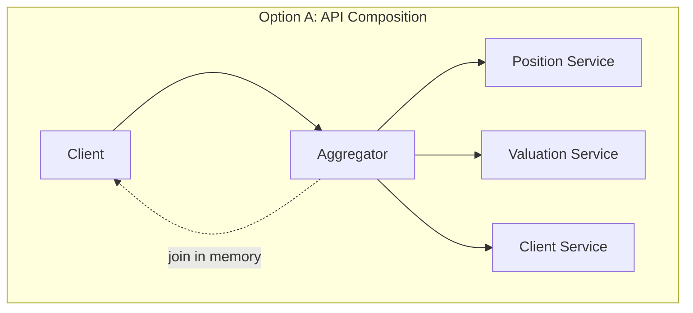
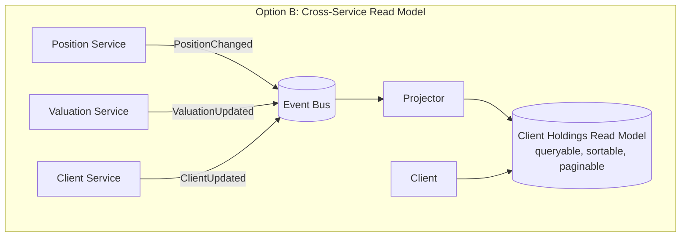
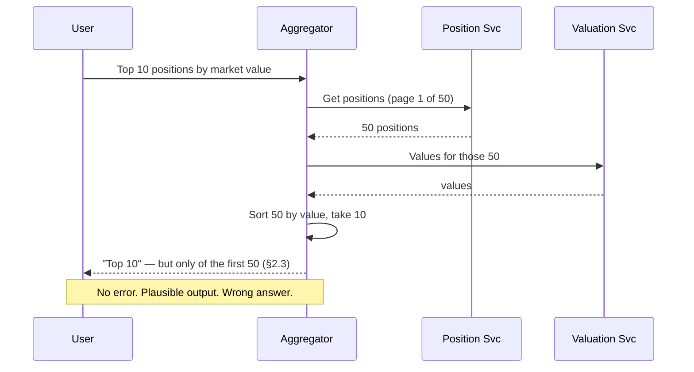
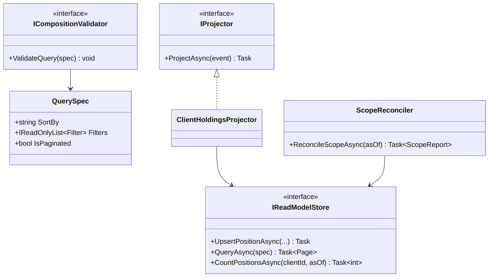

# Module 135 — Microservices: Data Consistency & Query Patterns Across Service Boundaries

> Domain: Microservices | Level: Beginner → Expert | Prerequisite: [[01-Decomposition-Communication-Strangler-Fig]] (§2.2's database-per-service rule, which creates the problem this module solves), [[../34-CQRS/01-CQRSFundamentals-CommandQuerySeparation-ReadModels-ComplexityThreshold]] (read models, applied here across service boundaries rather than within one), [[../36-Saga/01-SagaFundamentals-OrchestrationVsChoreography-CompensatingTransactions]] (the write-side counterpart — this module is its read-side equivalent)
>
> **Scope note:** This module extends `17-Microservices` toward its stated 8-module extra-depth scope (Modules 49–51 covered decomposition, resilience, and versioning/testing/deployment). Full 16-section template; Elite FinTech Interview Panel lens.

---

## 1. Fundamentals

**What:** The patterns for answering questions whose data spans multiple services — where database-per-service (Module 49 §2.2) has removed the join that a monolith would have used, and no single service owns enough data to answer alone.

**Why:** Decomposition solves write-side ownership cleanly: each service owns its data and its invariants. It says nothing about reads, and reads are where the business lives — "show me this client's holdings with current valuations, sorted by exposure" spans four services and is the most common thing a user asks for. This gap is the single most frequent source of microservices regret, because teams decompose correctly, then discover every screen needs a join they have just outlawed.

**When:** From the second service. The moment two services own data that appears together on one screen or in one report, this problem exists — and the design choice made early (composition versus read model) is expensive to reverse later.

**How (30,000-ft view):**
```
Monolith:      SELECT ... FROM positions JOIN valuations JOIN clients WHERE ...   (one query)

Microservices: Option A — API Composition:  caller fans out, joins in memory
               Option B — Read Model:       events maintain a queryable projection
               Option C — Data duplication:  each service holds what it needs
```

---

## 2. Deep Dive

### 2.1 API Composition — Fan Out and Join in Memory
An aggregator (a BFF, gateway, or dedicated composition service) calls each owning service and assembles the result. Simple, requires no new infrastructure, and correct for small result sets.

Its limits are structural, not incidental:
- **Fan-out cost.** Composing N positions with their valuations is N calls unless the valuation service offers a batch endpoint — and it often does not, because its owners designed for its own use cases.
- **Partial failure.** One slow or failed dependency degrades or fails the whole composition; the caller must decide per-field whether missing data is tolerable.
- **No cross-service filtering, sorting, or pagination.** This is the killer, developed in §2.3, and the source of §4's incident.

### 2.2 Read Models Across Service Boundaries
The scalable answer: a service subscribes to events from the owning services and maintains its own queryable projection — Module 119's CQRS read model, now spanning services rather than sitting beside one aggregate.

The projection is a genuine, first-class dataset with its own store, shaped for the query it serves. It accepts eventual consistency (Module 119 §2.3) in exchange for making the query a single local read. Its cost is real: another store, another consumer, another thing to keep correct, and Module 120's full apparatus of idempotency, reconciliation, and lag monitoring.

### 2.3 Why Filtering, Sorting and Pagination Break Composition
This deserves its own treatment because it is subtle, extremely common, and produces *silently wrong* results rather than errors.

Consider "top 10 positions by market value" where Position Service owns positions and Valuation Service owns values. The composition layer must either:
- Fetch **all** positions, enrich all with values, sort, then take 10 — correct, but the fetch is unbounded and the cost grows with portfolio size; or
- Fetch a page of positions, enrich, sort, take 10 — bounded and **wrong**, because the sort key lives outside the paginated set, so the "top 10" is the top 10 *of an arbitrary page*.

There is no third option within composition. Any query whose sort or filter predicate spans services requires either full materialization or a read model. Teams reliably choose the second bullet, because it performs well and looks right in testing on small portfolios.

### 2.4 Deliberate Data Duplication
The instinct that duplication is wrong comes from normalization within a single database, where it is. Across services it is often correct: a service caching the reference data it needs (an instrument's currency, a client's tier) avoids a synchronous dependency on every request.

The discipline that makes it safe: the duplicate is a **read-only replica with a single owner**, kept current by events, never written by the holder, and never treated as authoritative. Module 109's Anti-Corruption Layer applies — the copy is shaped for the consumer's needs, not a mirror of the owner's model, so the owner remains free to evolve.

### 2.5 Consistency Boundaries — What Actually Needs to Be Transactional
Much cross-service consistency anxiety is misplaced. The question is not "is this consistent" but "what breaks if it is briefly not." Module 110's synchronous-invariant test applies directly: if a rule must hold at every instant or money moves incorrectly, it belongs inside one service's transaction; if brief inconsistency is correctable and harmless, eventual consistency is fine and the coordination cost is avoidable.

The common error is treating every cross-service relationship as needing distributed transactions, then reaching for two-phase commit or a saga where a read model and a tolerance for seconds of lag would have sufficed.

### 2.6 The Shared-Database Escape Hatch and Why It Recurs
Under delivery pressure, the shortest path to a cross-service query is a direct read of another service's database. It works immediately and is the single most damaging thing a team can do to a microservices estate, because it couples services through a schema neither owns as an interface — the owning team can no longer change their tables, and will discover this only when they try.

It recurs because the alternatives (composition, read models) cost more upfront, and the coupling's cost arrives later and lands on someone else. This asymmetry is why the prohibition needs enforcement (§Advanced Q9) rather than agreement.

---

## 3. Visual Architecture







---

## 4. Production Example

**Problem:** A client-reporting service showed "largest 20 holdings by market value" for each client. Position Service owned holdings; Valuation Service owned current values.

**Architecture:** API composition (§2.1) — the reporting service fetched a client's positions, enriched each with a value, sorted, and returned the top 20.

**Implementation:** To bound latency, the position fetch was paginated at 200 records. For the overwhelming majority of clients — retail accounts holding fewer than 200 positions — the page contained the entire portfolio, so the sort was over the complete set and the answer was correct.

**Trade-offs:** Pagination was a deliberate, sensible-looking protection against unbounded fetches for large accounts.

**Lessons learned:** Institutional clients held 2,000–15,000 positions. For them, the service sorted the first 200 positions — returned in whatever order Position Service's default query produced, which was insertion order — and presented the top 20 of *that* as the client's largest holdings. The output was plausible: real positions, real values, correctly sorted among themselves. It was simply not the answer to the question asked, and it had been wrong for every institutional client since launch.

It surfaced when a relationship manager noticed a client's largest known holding missing from their own report.

Two things made this durable. First, **it produced no error and no anomaly** — the results were internally consistent, and only someone who independently knew the portfolio could detect the omission. Second, **it tested clean**, because test fixtures held tens of positions, so the page always covered the portfolio and the bug was unreachable in every environment below production scale.

The fix was a read model (§2.2) maintained from `PositionChanged` and `ValuationUpdated` events, making the sort a local indexed query over the complete set. The generalizable lesson: **a sort or filter whose predicate spans services cannot be correctly paginated in a composition layer** — and the failure is silent, so it must be prevented by design rather than caught by testing.

---

## 5. Best Practices
- Use composition for small, bounded result sets; use a read model the moment sorting or filtering spans services (§2.3).
- Treat any cross-service sort/filter predicate as a design signal requiring a read model, not an implementation detail (§4).
- Keep duplicated data read-only with a single owner, updated by events, shaped for the consumer (§2.4).
- Apply Module 110's synchronous-invariant test before reaching for distributed transactions (§2.5).
- Enforce the shared-database prohibition mechanically, not by convention (§2.6, Advanced Q9).
- Design batch endpoints on owning services deliberately, since composition's fan-out cost depends on them (§2.1).

## 6. Anti-patterns
- Paginating a composition whose sort key is owned by another service (§4's incident).
- Direct reads of another service's database as a query shortcut (§2.6).
- Treating every cross-service relationship as requiring a distributed transaction (§2.5).
- Duplicated data that the holder also writes, creating two authorities for one fact (§2.4).
- N+1 fan-out where a batch endpoint would serve, because no one asked the owning team for one (§2.1).
- A read model with no reconciliation against its sources, inheriting Module 120's drift risk unmanaged (§2.2).

---

## 7. Performance Engineering

**CPU/Memory:** Composition's memory cost is the materialized intermediate set — §2.3's correct-but-unbounded option is precisely a memory risk, which is why teams paginate and introduce §4's bug. A read model moves this cost to write time, amortized.

**Latency:** Composition latency is the *slowest* dependency plus join cost, not the average — the same tail-dominance as Module 129's grid. Parallel fan-out helps; it does not eliminate the tail.

**Throughput:** Composition multiplies load on downstream services by the composition rate, so a popular screen can generate more load on Valuation Service than Valuation Service's own consumers do. Capacity-plan owning services for *composed* traffic, which they usually cannot see.

**Scalability:** Read models scale reads independently of the owning services — the primary reason to adopt them beyond correctness.

**Benchmarking:** Benchmark composition against realistic *data distributions*, not just request rates. §4's bug was reachable only at institutional portfolio sizes, which no synthetic uniform fixture produced.

**Caching:** Composition results cache poorly (they combine several services' freshness); read models are effectively a durable, queryable cache with explicit lag — which is the more honest framing of the trade.

---

## 8. Security

**Threats:** A composition layer typically holds credentials for many services, making it a high-value target with broad reach. Read models concentrate data from multiple services into one store, creating an aggregation that may be more sensitive than any source.

**Mitigations:** Propagate the caller's identity to each service rather than using the aggregator's own privileges, so downstream authorization still applies per-service (Module 127 §2.3's defence-in-depth). Classify the read model by the sensitivity of the *combination*, which can exceed its parts — client identity plus holdings plus valuations together is materially more sensitive than any one.

**OWASP mapping:** Broken Object-Level Authorization, with a composition-specific variant: the aggregator may correctly authorize the top-level request while a downstream call is made with aggregator privileges that skip per-record checks.

**AuthN/AuthZ:** Each service authorizes independently on the propagated caller identity; the read model needs its own authorization reflecting the union of its sources' rules, which must be derived deliberately rather than inherited from whichever source the projector happened to be written against.

**Secrets:** Per-downstream credentials for the aggregator, scoped and rotated per Module 86.

**Encryption:** Read models holding combined sensitive data warrant encryption at rest commensurate with the combination's classification, not the lowest-classified source.

---

## 9. Scalability

**Horizontal scaling:** Aggregators scale statelessly but multiply downstream load (§7). Read models scale reads independently and are the only option that decouples read scaling from the owning services.

**Vertical scaling:** Rarely the lever.

**Caching:** §7's framing — a read model is a durable cache with explicit staleness, which is preferable to an opaque cache with implicit staleness.

**Replication/Partitioning:** Partition read models by their dominant query dimension (client, portfolio), which may differ entirely from how the source services partition — a legitimate and useful divergence.

**Load balancing:** Standard; note that composition fan-out makes one user request into many, so downstream rate limits must account for amplification.

**High Availability:** Composition's availability is the *product* of its dependencies' — four services at 99.9% compose to ~99.6%. Read models invert this: the query survives source-service outages, serving stale-but-available data, which for reporting is usually the better trade.

**Disaster Recovery:** Read models are rebuildable from source events (Module 120 §9), so their DR requirement is lighter than the owning services'.

**CAP theorem:** Composition is effectively CP by construction (a failed dependency fails the read); read models are AP (stale but available). Choosing between them is therefore also a CAP choice, which teams often make implicitly without noticing.

---

## 10. Interview Questions

### Basic (10)

1. **Q: What problem does database-per-service create that decomposition itself does not solve?**
   **A:** Cross-service reads — the join a monolith would use is no longer available, and no single service owns enough data to answer a business question spanning several (§1).
   **Why correct:** Identifies reads as the unsolved half of decomposition.
   **Common mistakes:** Assuming decomposition guidance covers reads because it covers writes.
   **Follow-ups:** "When does this appear?" (From the second service — as soon as two services' data appears together, §1.)

2. **Q: What is API composition?**
   **A:** An aggregator calls each owning service and joins results in memory, requiring no new infrastructure (§2.1).
   **Why correct:** States the mechanism and its principal advantage.
   **Common mistakes:** Treating it as universally applicable rather than bounded by §2.3's limits.
   **Follow-ups:** "What are its three structural limits?" (Fan-out cost, partial failure, and no cross-service filter/sort/pagination, §2.1.)

3. **Q: Why can't a composition layer correctly paginate a sort whose key is owned by another service?**
   **A:** The sort key lives outside the paginated set, so sorting a page produces the top of that page, not the top of the whole — correctness requires materializing everything (§2.3).
   **Why correct:** States the specific reason, which is structural rather than an implementation shortfall.
   **Common mistakes:** Assuming a larger page size fixes it; it only moves the threshold.
   **Follow-ups:** "What are the only two options?" (Full materialization, or a read model — there is no third within composition, §2.3.)

4. **Q: What is a cross-service read model?**
   **A:** A projection maintained from other services' events, stored locally and shaped for a specific query, making a cross-service question a single local read (§2.2).
   **Why correct:** States the mechanism and what it buys.
   **Common mistakes:** Treating it as a cache rather than a first-class dataset with its own correctness obligations.
   **Follow-ups:** "What does it cost?" (Another store and consumer, plus Module 120's idempotency, reconciliation, and lag monitoring, §2.2.)

5. **Q: When is duplicating another service's data correct rather than a normalization violation?**
   **A:** When it is a read-only replica with a single owner, updated by events, shaped for the consumer's needs — avoiding a synchronous dependency on every request (§2.4).
   **Why correct:** States the conditions that make duplication safe.
   **Common mistakes:** Applying single-database normalization instincts across service boundaries where they do not hold.
   **Follow-ups:** "What makes it unsafe?" (The holder also writing it, creating two authorities for one fact, §2.4.)

6. **Q: What test determines whether a cross-service relationship needs transactional consistency?**
   **A:** Module 110's synchronous-invariant test — must this hold at every instant to prevent incorrect outcomes, or is brief inconsistency correctable and harmless (§2.5)?
   **Why correct:** Applies the established test rather than defaulting to distributed transactions.
   **Common mistakes:** Treating all cross-service relationships as requiring coordination.
   **Follow-ups:** "What is the cost of getting this wrong toward coordination?" (Unnecessary sagas or 2PC where a read model and seconds of lag would suffice, §2.5.)

7. **Q: Why is reading another service's database directly so damaging?**
   **A:** It couples services through a schema neither owns as an interface, so the owning team cannot change their tables and discovers this only when they try (§2.6).
   **Why correct:** Names the specific coupling and its delayed, misplaced cost.
   **Common mistakes:** Viewing it as a pragmatic shortcut with bounded cost.
   **Follow-ups:** "Why does it recur despite being widely known as wrong?" (The cost arrives later and lands on another team, §2.6.)

8. **Q: What happened in §4's incident?**
   **A:** A "largest 20 holdings" report paginated positions at 200 while sorting by a value owned by another service, so institutional clients with thousands of positions saw the top 20 of an arbitrary first page (§4).
   **Why correct:** States the mechanism and who was affected.
   **Common mistakes:** Describing it as a pagination bug rather than a structural composition limit.
   **Follow-ups:** "Why did it test clean?" (Fixtures held tens of positions, so the page always covered the portfolio, §4.)

9. **Q: Why is composition's availability worse than any single dependency's?**
   **A:** It is the product of its dependencies' — four services at 99.9% compose to roughly 99.6% (§9).
   **Why correct:** States the multiplicative relationship.
   **Common mistakes:** Assuming composition availability equals the weakest dependency's.
   **Follow-ups:** "How do read models change this?" (They serve stale-but-available data during source outages, inverting the trade, §9.)

10. **Q: Why must a composition layer propagate the caller's identity rather than use its own credentials?**
    **A:** Otherwise downstream services authorize the aggregator rather than the user, skipping per-record checks the user should be subject to (§8).
    **Why correct:** Identifies the specific authorization bypass.
    **Common mistakes:** Using service credentials for simplicity, collapsing per-user authorization.
    **Follow-ups:** "What OWASP category is this?" (Broken Object-Level Authorization, in a composition-specific variant, §8.)

### Intermediate (10)

1. **Q: Walk through why §4's bug was undetectable by any signal the system produced.**
   **A:** The output was internally consistent — real positions, real values, correctly sorted among themselves — so no invariant was violated, no exception raised, and no metric anomalous. Detecting it required independently knowing the portfolio's contents, which only the client or their relationship manager did. The system was correct about everything it computed and wrong about what it computed over.
   **Why correct:** Explains the absence of any internal signal rather than describing it as unmonitored.
   **Common mistakes:** Proposing better monitoring, which cannot detect an answer that is self-consistent but scoped wrongly.
   **Follow-ups:** "What is the only reliable defence?" (Prevention by design — a cross-service sort predicate must route to a read model, §4.)

2. **Q: Design the decision rule for composition versus read model.**
   **A:** Use composition when the result set is bounded and small, no filter or sort predicate spans services, and eventual consistency is unacceptable. Use a read model when any of those fails — and note the sort/filter condition is binary rather than a matter of degree, because §2.3's failure is correctness, not performance.
   **Why correct:** Gives a rule with a hard condition rather than a spectrum, matching the underlying structure.
   **Common mistakes:** Treating the choice as purely a performance trade-off, which misses that composition is *incorrect* for cross-service sorts at any size.
   **Follow-ups:** "Why is bounded size still required even without cross-service sorts?" (Fan-out cost and partial-failure exposure grow with set size, §2.1.)

3. **Q: How should an aggregator handle one dependency failing?**
   **A:** Decide per-field in advance whether the data is essential or optional: return a partial result with the missing field explicitly marked absent (not defaulted to zero or empty, which is indistinguishable from a real value), or fail the whole request if the field is essential. The critical property is that a missing value never renders as a plausible one.
   **Why correct:** Specifies the per-field decision and the specific rendering hazard.
   **Common mistakes:** Defaulting missing values, which produces §4's failure class — a plausible wrong answer.
   **Follow-ups:** "Why is zero especially dangerous?" (A zero valuation looks like a real position worth nothing, and will be summed into totals.)

4. **Q: Why does a composition-heavy design make owning services hard to capacity-plan?**
   **A:** Their load is driven by composition rates they cannot observe — a popular screen can generate more traffic to Valuation Service than its own direct consumers do, and its owners have no visibility into why (§7).
   **Why correct:** Identifies the invisibility of amplified load to the owning team.
   **Common mistakes:** Capacity-planning owning services from their known consumers.
   **Follow-ups:** "What is the mitigation?" (Batch endpoints reducing amplification, plus caller identification so owners can attribute load, §2.1.)

5. **Q: Critique a read model whose projector writes fields the owning service also considers authoritative.**
   **A:** It creates two writers for one fact, so the projection can diverge from its source with no defined resolution — the same dual-authority problem §2.4 identifies for duplicated data. A read model must be *derived only*, never independently written, so any divergence is unambiguously a projection defect rather than a legitimate disagreement.
   **Why correct:** Names the dual-authority failure and why derived-only makes divergence diagnosable.
   **Common mistakes:** Allowing local enrichment writes into the projection for convenience.
   **Follow-ups:** "Where should genuinely local data live?" (A separate store the projection joins, so the derived and the owned remain distinguishable.)

6. **Q: Why does the shared-database prohibition need mechanical enforcement?**
   **A:** Its cost is deferred and externalized — the team taking the shortcut gains immediately, the owning team pays later — so agreement is insufficient under delivery pressure (§2.6). Enforcement must be structural: per-service credentials that cannot read other schemas.
   **Why correct:** Ties the enforcement need to the incentive asymmetry rather than to discipline.
   **Common mistakes:** Relying on architectural guidance, which loses to a deadline.
   **Follow-ups:** "What is the mechanism?" (Database-level per-service credentials, so cross-schema reads are impossible rather than discouraged, Advanced Q9.)

7. **Q: How does this module relate to Module 36's Saga pattern?**
   **A:** They are the write-side and read-side halves of the same decomposition consequence: Saga coordinates state changes across services without distributed transactions; this module answers queries across services without distributed joins. Both exist because database-per-service removed a database-level primitive, and both replace it with explicit, eventually-consistent coordination.
   **Why correct:** Identifies the symmetry and shared cause.
   **Common mistakes:** Treating them as unrelated patterns.
   **Follow-ups:** "Which is harder to get right?" (Saga, because compensation has no read-side equivalent — a wrong read can be re-read, a wrong write must be reversed.)

8. **Q: Why do read models often partition differently from their source services?**
   **A:** They are shaped for their query, which may aggregate by a dimension no source uses — a client-holdings model partitions by client, while Position Service may partition by portfolio and Valuation by instrument. This divergence is a feature: it is the reshaping that makes the query fast (§9).
   **Why correct:** Explains the divergence as intentional rather than as drift.
   **Common mistakes:** Mirroring source partitioning, forfeiting the read model's main benefit.
   **Follow-ups:** "What does this imply about the projector?" (It must handle a fan-in from differently-partitioned sources, which is where ordering care is needed, Module 120 §2.4.)

9. **Q: What is the risk of composing data whose combination is more sensitive than its parts?**
   **A:** Access control derived from any single source under-protects the combination — client identity plus holdings plus valuations together reveals a complete financial picture that no individual source does, so the read model's classification must be derived from the union rather than inherited (§8).
   **Why correct:** Identifies aggregation as creating new sensitivity.
   **Common mistakes:** Applying the highest source's classification, which still understates the combination.
   **Follow-ups:** "Who should determine the classification?" (Data governance, not the implementing team, since it is a policy judgment about the combination.)

10. **Q: Synthesize what decomposition genuinely costs, as this module reveals it.**
    **A:** Decomposition trades a database's two free primitives — the transaction and the join — for autonomy. Module 36 pays for the lost transaction with sagas and compensation; this module pays for the lost join with composition or read models. Neither replacement is as strong as what it replaces, so the honest framing is that microservices buy independent deployability and team autonomy by giving up guarantees a single database provided for free — which is a good trade at sufficient scale and a poor one below it.
    **Why correct:** Names both surrendered primitives and frames the trade honestly.
    **Common mistakes:** Presenting microservices as strictly superior rather than as a specific, scale-dependent trade.
    **Follow-ups:** "What determines whether the trade is worth it?" (Whether team-autonomy and independent-deployability benefits exceed the cost of replacing transactions and joins — which depends on organization size, not on system size.)

### Advanced (10)

1. **Q: Diagnose §4's incident and design the complete structural fix.**
   **A:** Root cause: a cross-service sort predicate was implemented in a composition layer that paginated its input, which is structurally incapable of correctness (§2.3), and the failure produced no signal (Intermediate Q1). Fix: (1) a read model maintained from `PositionChanged` and `ValuationUpdated`, making the sort a local indexed query over the complete set; (2) a design rule that any query whose sort or filter spans services routes to a read model, applied at review rather than discovered in implementation; (3) test fixtures at institutional scale, since the bug was unreachable below a few hundred positions; (4) a reconciliation comparing read-model holdings against Position Service's authoritative count per client (Module 120 §Advanced Q9), because the read model introduces its own drift risk in place of the one removed.
   **Why correct:** Fixes the instance, the class, the test gap that hid it, and the new risk the fix introduces.
   **Common mistakes:** Building the read model without (4), trading a silent composition bug for a silent projection-drift bug.
   **Follow-ups:** "Why does (3) matter if (1) and (2) prevent recurrence?" (Fixture realism is a general defence — the next scale-dependent bug will also be invisible at fixture scale.)

2. **Q: A team proposes solving cross-service queries with a shared read-only replica of every service's database. Evaluate.**
   **A:** It is the shared-database anti-pattern (§2.6) with a read-only fig leaf. Consumers still couple to schemas the owning teams control and evolve, so a table rename breaks unknown consumers — the coupling is identical, only the write risk is removed. Read models differ crucially in that they consume **events**, which are a deliberately-versioned published contract (Module 141's schema registry), not internal tables. The distinction is contract-versus-implementation, not read-versus-write.
   **Why correct:** Identifies that read-only does not address the coupling, and names the contract distinction that makes read models different.
   **Common mistakes:** Accepting it because read-only sounds safe, missing that schema coupling is the actual harm.
   **Follow-ups:** "What if the replica exposes views rather than tables?" (Better — a view is a deliberate contract — but only if the owning team commits to it as one, which makes it an API with extra steps.)

3. **Q: Critique a composition layer that caches enriched results to reduce fan-out.**
   **A:** The cache combines several services' freshness into one entry with a single TTL, so its staleness is the *worst* of its inputs and cannot be reasoned about per-field — a valuation refreshed every second and a client record refreshed daily cache identically. Invalidation is worse: no source knows the composite key, so no source can invalidate it, leaving TTL as the only mechanism. This is precisely the case where a read model is the better answer, because it makes lag explicit per source rather than opaque and uniform (§7, §9).
   **Why correct:** Identifies both the staleness-conflation and invalidation problems, and why a read model addresses them.
   **Common mistakes:** Adding the cache as a performance fix, inheriting an unreasonable staleness model.
   **Follow-ups:** "When is composite caching acceptable?" (When all sources have similar update cadence and the TTL is well below the fastest — a narrow condition worth checking rather than assuming.)

4. **Q: Design the batch-endpoint contract between an owning service and its composers.**
   **A:** Accept a bounded set of identifiers, return results keyed by identifier with explicit absence for unknown ones (never omitting silently, which the caller cannot distinguish from a lost response), enforce a maximum batch size the owner can serve predictably, and version it as a first-class API. The subtle requirement: the owner should be able to identify callers, because composed load is otherwise unattributable (Intermediate Q4).
   **Why correct:** Specifies the contract including the absence-signalling and attribution requirements teams usually omit.
   **Common mistakes:** Returning a bare list, so the caller must infer which requested IDs were missing.
   **Follow-ups:** "Why does explicit absence matter so much?" (An omitted ID and a lost ID are indistinguishable, so the caller cannot tell a legitimate not-found from a partial failure.)

5. **Q: How would you migrate an existing composition to a read model without a flag day?**
   **A:** Build the projector and let it populate in parallel; reconcile the read model against composition results for a period (Module 107's Parallel Run); then route reads over gradually, comparing outputs on a sample as traffic shifts. Critically, keep composition available as a fallback until reconciliation has covered the data distributions where they might differ — which, per §4, means specifically the largest accounts, not a random sample.
   **Why correct:** Applies the established migration pattern with the distribution-specific caveat this module's own incident teaches.
   **Common mistakes:** Sampling uniformly for the comparison, under-weighting exactly the accounts where composition was wrong.
   **Follow-ups:** "What does divergence during comparison indicate?" (Possibly a projector defect — or, per §4, that composition was wrong all along, which is why divergence must be investigated rather than assumed to be the new path's fault.)

6. **Q: A regulator asks how the firm ensures client reports are accurate. Answer for a read-model architecture.**
   **A:** Describe the chain: events published by owning services under versioned contracts; idempotent projection with ordering guarantees (Module 120 §2.5); reconciliation against source-of-truth counts and values on a defined cadence; and explicit staleness bounds published with the report so a user knows its as-of. Then state the residual honestly — the read model is eventually consistent, so a report may reflect state seconds old, which is disclosed rather than hidden.
   **Why correct:** Gives the mechanisms and the honest residual, consistent with the disclosure posture established across this course.
   **Common mistakes:** Claiming the report matches source systems exactly, which an eventually-consistent projection does not guarantee.
   **Follow-ups:** "Is eventual consistency acceptable for client reporting?" (Generally yes with disclosed as-of; for regulatory or contractual figures it may not be, which is a §2.5 boundary decision.)

7. **Q: Apply this course's "declared ≠ actual" theme to cross-service queries.**
   **A:** The claim is "this report shows the client's largest holdings." Its declared basis is that the query ran successfully and returned well-formed data. §4 shows the gap: the query answered a different question than the one asked, and every internal signal — status, latency, schema validity, internal consistency — was correct. The distinguishing feature here is that the wrongness lies in the *scope* of the computation rather than its correctness, so no amount of verifying the computation detects it; only comparing against an independently-known complete set does.
   **Why correct:** Locates the failure in scope rather than computation, and identifies why internal verification cannot reach it.
   **Common mistakes:** Treating it as a data-quality problem addressable by validating outputs.
   **Follow-ups:** "Which prior module shares this exact shape?" (Module 133 §4 — a completeness check scoped by the logic being checked; same structure, different domain.)

8. **Q: Design the monitoring that would have caught §4 within days rather than months.**
   **A:** Compare the read model's (or composition's) result set size against the owning service's authoritative count per entity — for §4, "positions considered" versus "positions the client holds." A systematic gap for a class of clients is immediately visible, whereas the report's contents are not. This is the same principle as Module 133's independent completeness reconciliation: verify scope against an independent count rather than verifying the output.
   **Why correct:** Proposes a scope check rather than an output check, which is what the failure class requires.
   **Common mistakes:** Monitoring latency and error rates, both of which were healthy throughout.
   **Follow-ups:** "Why is a count comparison sufficient?" (Because the failure is one of scope — a count mismatch is the direct signature, and it needs no knowledge of correct contents.)

9. **Q: Design the mechanical enforcement of the shared-database prohibition.**
   **A:** Per-service database credentials with grants only on that service's own schema, so a cross-schema read fails at the database rather than being discouraged by policy. Supplement with periodic audit of grants (drift happens through emergency access that is never revoked) and connection-string scanning in CI to catch a service configured with another's credentials. The principle matches Module 132 §Advanced Q1: make the violation impossible rather than forbidden.
   **Why correct:** Specifies the mechanism plus the two ways it erodes in practice.
   **Common mistakes:** Policy and code review only, which §2.6's incentive asymmetry defeats.
   **Follow-ups:** "Why audit grants periodically?" (Emergency access granted during an incident is rarely revoked, so the enforcement decays silently.)

10. **Q: Synthesize the governance required for cross-service query design.**
    **A:** (1) A design rule routing any cross-service sort/filter to a read model, applied at review (Advanced Q1). (2) Mechanical shared-database prevention with grant auditing (Advanced Q9). (3) Batch-endpoint contracts with explicit absence and caller attribution (Advanced Q4). (4) Read models derived-only, never locally written (Intermediate Q5). (5) Reconciliation of every read model against source counts (Advanced Q8). (6) Data classification of read models by their combination's sensitivity, set by governance (Intermediate Q9). (7) Fixtures at realistic data distributions, since scale-dependent bugs are invisible below threshold (Advanced Q1).
    **Why correct:** Assembles rules covering correctness, coupling, contracts, and the test-realism gap that hid the incident.
    **Common mistakes:** Governing the patterns without the enforcement and reconciliation, which is where each degrades.
    **Follow-ups:** "Which is most often missing?" (Read-model reconciliation — teams build the projection, verify it once, and never check it again, inheriting Module 120's drift risk unmanaged.)

### Expert (10)

1. **Q: When should cross-service queries prompt reconsidering the service boundaries themselves?**
   **A:** When the same set of services is repeatedly composed for most queries, the decomposition may have split a genuine aggregate. Module 109's bounded-context test applies: if positions and valuations are never useful apart and always change together in the business's language, they may be one context artificially divided along technical lines. Persistent, unavoidable composition is evidence about the boundary, not merely a query problem to solve — and the right response is sometimes to merge, which Module 138 develops.
   **Why correct:** Treats composition frequency as boundary evidence rather than accepting the boundary as given.
   **Common mistakes:** Optimizing the composition indefinitely without questioning whether the split was correct.
   **Follow-ups:** "What distinguishes a wrong boundary from a legitimate cross-context query?" (Whether domain experts describe the two as one thing or as related things — Module 109's language test.)

2. **Q: How do these patterns differ for internal versus client-facing queries?**
   **A:** Client-facing queries have latency and correctness expectations that make composition's tail latency and partial-failure behaviour visible to customers, pushing toward read models. Internal analytical queries may tolerate a slower path and can often use a data platform rather than either pattern — batch-replicated into a warehouse, which is a third option this module's framing sometimes obscures because it operates on a different cadence entirely.
   **Why correct:** Distinguishes by consumer expectation and surfaces the warehouse option the operational framing omits.
   **Common mistakes:** Building operational read models for analytical questions better served by a warehouse.
   **Follow-ups:** "What determines the boundary?" (Freshness requirement — sub-minute favours read models, daily favours the warehouse, and the middle is where the awkward decisions live.)

3. **Q: Evaluate GraphQL federation as a solution to cross-service queries.**
   **A:** It automates composition and improves the developer experience genuinely — but it does not change composition's structural limits. A federated query sorting by a field owned by another subgraph faces §2.3 exactly, and the framework's convenience makes it *easier* to write such a query without noticing. Federation is a better composition, not an alternative to read models, and its ergonomics arguably increase the risk of §4's bug by hiding the fan-out that would otherwise prompt scrutiny.
   **Why correct:** Credits the genuine benefit while identifying that it does not address the structural limit, and notes the ergonomic risk.
   **Common mistakes:** Adopting federation expecting it to solve cross-service sorting and pagination.
   **Follow-ups:** "What discipline does federation require?" (Explicit review of any query whose sort or filter crosses subgraphs — the same rule as Advanced Q1, now harder to notice.)

4. **Q: How should read-model ownership be assigned organizationally?**
   **A:** To the consuming team, not the producing teams — the model is shaped for their query and they bear the consequence of it being wrong. Producers own their events as contracts; consumers own their projections. Assigning projection ownership to producers recreates the coupling decomposition was meant to remove, because the producer then carries requirements from every consumer's query shape.
   **Why correct:** Assigns ownership by who bears the consequence and identifies the coupling the alternative creates.
   **Common mistakes:** Producer-owned projections, which pull consumer requirements back into the producing team.
   **Follow-ups:** "What does the producer owe the consumer?" (A stable, versioned event contract with adequate content — not a projection, §2.2.)

5. **Q: A composition times out only for the largest clients. Walk through the investigation.**
   **A:** Establish whether it is fan-out volume (N calls scaling with portfolio size), a single slow dependency at that size, or unbounded materialization (§2.3's correct-but-expensive option). Distinguish by tracing one slow request: many small calls indicates fan-out, one long call indicates a downstream query, and high memory with few calls indicates materialization. Each has a different fix — batching, a downstream index, or a read model — and the symptom alone does not discriminate.
   **Why correct:** Enumerates the three causes and gives the discriminating signal for each.
   **Common mistakes:** Adding a timeout increase, which converts a failure into a slow success without addressing cause.
   **Follow-ups:** "Why is this the same population as §4?" (Large clients expose both the performance limit and the correctness limit — which is why realistic-scale fixtures catch both.)

6. **Q: How does this module's read model differ from a data warehouse table serving the same query?**
   **A:** Freshness and purpose: the read model is operational, updated in near-real-time by events, and serves the application path; the warehouse is analytical, batch-loaded, and serves reporting where hours of lag are acceptable. They frequently duplicate content and are not redundant — using the warehouse for an operational query introduces unacceptable lag, and using the read model for analytics couples analytical workloads to operational infrastructure.
   **Why correct:** Distinguishes by freshness and consumer, and explains why the duplication is legitimate.
   **Common mistakes:** Consolidating them to reduce duplication, which forces one workload to accept the other's constraints.
   **Follow-ups:** "When does the distinction blur?" (Streaming warehouses reduce the lag gap, but the coupling argument remains — analytical query load should not affect operational latency.)

7. **Q: Evaluate the claim that read models make services less autonomous by coupling consumers to producers' events.**
   **A:** Partly true and worth taking seriously: consumers do depend on producers' event contracts, so producers cannot change them freely. But this is a *deliberate, versioned* contract dependency, categorically different from schema coupling (Advanced Q2) — the producer knows the contract is public and evolves it under compatibility rules (Module 141's registry). Autonomy does not mean zero dependency; it means dependencies are explicit, versioned, and negotiated rather than implicit and discovered on breakage.
   **Why correct:** Concedes the substance while distinguishing contract dependency from implementation coupling.
   **Common mistakes:** Either dismissing the concern or accepting it as a reason to avoid events.
   **Follow-ups:** "What makes an event contract genuinely public?" (Registry enforcement, compatibility rules, and versioning — without those it is an internal structure consumers happen to read, which is Advanced Q2's problem again.)

8. **Q: Design the approach for a query needing strong consistency across services.**
   **A:** First challenge the requirement with §2.5's test, since most such requests tolerate seconds of lag on inspection. If it genuinely requires strong consistency — a pre-trade check against current positions, say — the correct answer is usually not a distributed query but relocating the decision into the service that owns the authoritative data, so the check becomes local. Distributed strong consistency for reads is achievable but expensive and fragile; moving the decision to the data is generally the better design.
   **Why correct:** Challenges the requirement first, then proposes relocation over distributed coordination.
   **Common mistakes:** Building distributed read coordination for a requirement that either does not need it or is better satisfied by moving the logic.
   **Follow-ups:** "What if the decision genuinely needs data from two services strongly?" (That is strong evidence of a boundary problem — Expert Q1's signal, and Module 138's territory.)

9. **Q: How should cross-service query patterns be represented in a service catalog?**
   **A:** Record, per service, which events it publishes as contracts and which read models consume them — producing a dependency graph of *contract* consumption. This makes the blast radius of an event-schema change visible before it is made, which is otherwise discovered by breaking a consumer. It also surfaces Expert Q1's signal: services repeatedly co-consumed are candidates for boundary review.
   **Why correct:** Specifies content that serves both change-impact analysis and boundary evidence.
   **Common mistakes:** Cataloguing services and APIs without event contracts and their consumers, leaving the actual coupling invisible.
   **Follow-ups:** "Why is this harder than an API dependency graph?" (Event consumption is asynchronous and often undeclared — a consumer can subscribe without the producer knowing, which is why the catalog must be authoritative rather than inferred.)

10. **Q: Deliver the closing synthesis: what does this module reveal about microservices generally?**
    **A:** That decomposition's advertised cost — operational complexity, network calls, deployment machinery — is the visible one, and its real cost is the loss of two database primitives: the transaction and the join. Module 36 pays for the first, this module for the second, and neither replacement is as strong as what it replaces. §4 is the sharpest illustration: a query that was trivially correct in a monolith became silently wrong in a distributed system, not through any individual mistake but because the primitive that made it correct no longer existed and its replacement had a limit nobody articulated. The Principal-level conclusion is that microservices should be adopted for team autonomy and independent deployability at organizational scale — never for technical elegance — and that a team unable to articulate what it is giving up has not yet understood the trade.
    **Why correct:** Names the real cost, uses the incident as its illustration, and states the adoption criterion honestly.
    **Common mistakes:** Framing microservices costs as operational overhead, understating the semantic guarantees surrendered.
    **Follow-ups:** "What follows for a team considering decomposition?" (Enumerate the cross-service queries the decomposition will create before committing — if most screens need composition, the boundary is probably wrong, Expert Q1.)

---

## 11. Coding Exercises

### Easy — Batch Enrichment Instead of N+1 (§2.1)
**Problem:** Enrich positions with valuations without a call per position.
**Solution:**
```csharp
public async Task<IReadOnlyList<EnrichedPosition>> EnrichAsync(IReadOnlyList<Position> positions)
{
    var ids = positions.Select(p => p.InstrumentId).Distinct().ToList();
    var values = await _valuationClient.GetBatchAsync(ids);   // one call, not N

    return positions.Select(p => new EnrichedPosition(
        p,
        values.TryGetValue(p.InstrumentId, out var v) ? v : null))  // explicit absence, never 0
        .ToList();
}
```
**Time complexity:** O(n) with one network round trip rather than n.
**Space complexity:** O(n).
**Optimized solution:** Chunk `ids` to the batch endpoint's documented maximum (Advanced Q4) and issue chunks in parallel with bounded concurrency, so a large portfolio does not become one oversized request the owner cannot serve predictably.

### Medium — Detecting the Cross-Service Sort Hazard (§2.3, §4)
**Problem:** Fail fast when a query would paginate over a sort key the composer does not own.
**Solution:**
```csharp
public void ValidateQuery(QuerySpec spec)
{
    var localFields = _ownedFields;                       // fields this service owns
    var sortSpansServices  = spec.SortBy   is not null && !localFields.Contains(spec.SortBy);
    var filterSpansServices = spec.Filters.Any(f => !localFields.Contains(f.Field));

    if ((sortSpansServices || filterSpansServices) && spec.IsPaginated)
        throw new UnsupportedCompositionException(
            $"Cannot paginate with sort/filter on externally-owned field. Route to read model.");
}
```
**Time complexity:** O(f) for f filter fields.
**Space complexity:** O(1).
**Optimized solution:** Enforce at build time rather than runtime — a source analyzer over declared query specs turns §4's bug class into a compile error, which is the difference between preventing it and catching it in production.

### Hard — Cross-Service Read Model Projector (§2.2)
**Problem:** Maintain a client-holdings projection from two services' events.
**Solution:**
```csharp
public async Task ProjectAsync(DomainEvent e)
{
    await using var tx = await _store.BeginAsync();
    if (!await _store.TryRecordProcessedAsync(e.EventId, tx)) { await tx.CommitAsync(); return; } // idempotent

    switch (e)
    {
        case PositionChanged p:
            await _store.UpsertPositionAsync(p.ClientId, p.InstrumentId, p.Quantity, p.OccurredAt, tx);
            break;
        case ValuationUpdated v:
            await _store.UpdateValuationForInstrumentAsync(v.InstrumentId, v.Price, v.OccurredAt, tx);
            break;                                       // fans out across many clients' rows
    }
    await tx.CommitAsync();
}
```
**Time complexity:** O(1) for position events; O(k) for valuation events touching k holdings of that instrument.
**Space complexity:** O(1) per event.
**Optimized solution:** Store valuations once, keyed by instrument, and join at query time rather than denormalizing price into every holding row — otherwise a single price update rewrites thousands of rows, which is the dominant write cost at scale.

### Expert — Read-Model Scope Reconciliation (Advanced Q8)
**Problem:** Detect §4's failure class by comparing scope against an authoritative count.
**Solution:**
```csharp
public async Task<ScopeReport> ReconcileScopeAsync(DateOnly asOf)
{
    var findings = new List<ScopeGap>();
    await foreach (var clientId in _clients.StreamAllAsync())
    {
        var authoritative = await _positionService.CountPositionsAsync(clientId, asOf);
        var projected     = await _readModel.CountPositionsAsync(clientId, asOf);

        if (authoritative != projected)
            findings.Add(new ScopeGap(clientId, authoritative, projected));
    }
    return new ScopeReport(findings);   // a count gap is the direct signature of scope failure
}
```
**Time complexity:** O(c) for c clients, two counts each.
**Space complexity:** O(g) for gaps found.
**Optimized solution:** Weight the scan toward the largest accounts first (Module 129 §Advanced Q4's stratification) — §4 affected exactly those, and a uniform scan finds them last.

---

## 12. System Design

**Functional requirements**
- Serve client-facing views spanning Position, Valuation, Client, and Transaction services.
- Support sorting, filtering, and pagination over fields owned by different services.
- Degrade meaningfully when a source service is unavailable.
- Keep each service's data ownership intact — no shared database (§2.6).

**Non-functional requirements**
- Client-view latency P99 under 500ms.
- Read-model staleness bounded and published with every response.
- Read scaling independent of owning services' capacity.
- No silently-scoped results — scope verified against authoritative counts (Advanced Q8).

**Capacity estimation**
- 40k clients; median 30 positions, institutional tail to 15k; ~2.5M positions total.
- Client-view requests ~200/s peak; composition would fan out to ~200 × (1 + instruments-per-client) downstream calls.
- Read-model size ~2.5M rows plus instrument valuations (~50k) held separately (§11 Hard's optimization).
- **The sensitivity that matters:** the institutional tail. Median-based capacity planning under-provisions by orders of magnitude for the accounts that matter most commercially — and, per §4, those are also the accounts where composition is silently wrong.

**Architecture:** §3's Option B — owning services publish events; a projector maintains a client-holdings read model; the query API reads locally with sorting and pagination over the complete set.

**Components:** Event publishers in each owning service (via Outbox, Module 125); projector with idempotency and ordering (§11 Hard); read-model store; query API publishing staleness; scope reconciler (§11 Expert).

**Database selection:** Read model in a store supporting the dominant access pattern — indexed sorts over a client's holdings — so a relational or document store partitioned by client, not by instrument (Intermediate Q8).

**Caching:** The read model *is* the cache, with explicit lag rather than opaque TTL (Advanced Q3).

**Messaging:** Events from owning services with per-key ordering (Module 141 §2.3); Outbox delivery guarantees at the producer.

**Scaling:** Read model scales reads independently; the projector scales by partition; owning services unaffected by read volume — the primary benefit over composition (§7).

**Failure handling:** Source outage leaves the read model serving stale data with disclosed as-of; projector failure surfaces as growing lag (Module 141), not as wrong answers.

**Monitoring:** Projection lag per source; scope reconciliation gaps (Advanced Q8); staleness distribution as served to clients.

**Trade-offs:** Eventual consistency accepted in exchange for correct sorting, independent read scaling, and availability during source outages — the specific trade §2.3 makes unavoidable for this query shape.

---

## 13. Low-Level Design

**Requirements:** Composition hazards are rejected rather than silently mis-answered; projections are idempotent and derived-only; scope is independently verifiable.

**Class diagram:**


**Sequence diagram:** §3's third diagram — the composition failure this design replaces.

**Design patterns used:** CQRS (read model separate from owning services' write models); Anti-Corruption Layer (projection shaped for the consumer, §2.4); Idempotent Receiver (§11 Hard); Aggregator (composition, where still used for bounded queries).

**SOLID mapping:** Single Responsibility (projector transforms, store persists, validator guards); Open/Closed (a new source event adds a projector case without touching the query path); Liskov (every projector must be idempotent and derived-only — contract-tested per Module 117); Interface Segregation (read and reconcile paths separate); Dependency Inversion (query API depends on the store interface, not on owning services).

**Extensibility:** A new field from a new service adds an event subscription and a projection case; the query API is unchanged.

**Concurrency/thread safety:** Projection partitioned by client so one client's events serialize; valuation events fan out across clients and must not conflict with position events for the same row — resolved by keeping valuations in a separate table joined at query time (§11 Hard's optimization), which removes the contention entirely.

---

## 14. Production Debugging

**Incident:** After migrating the client-holdings view to a read model, a subset of clients intermittently showed holdings that had been sold days earlier. The projector's lag metrics were healthy and no errors were logged.

**Root cause:** `PositionChanged` events carried the new quantity, and the projector upserted it. When a position was fully closed, Position Service published `PositionChanged` with quantity zero — which the projector upserted faithfully, leaving a zero-quantity row. The query filtered `quantity > 0`, so this was correct.

But for a small number of instruments, Position Service published a **`PositionClosed`** event instead of a zero-quantity change — a legacy path retained for instruments migrated from an older system. The projector had no handler for `PositionClosed`; its `switch` fell through silently, and the last known non-zero quantity remained in the read model indefinitely.

**Investigation:** Lag was healthy because the events *were* consumed — they were simply ignored. Comparing the read model against Position Service for an affected client showed the extra holding; tracing that instrument's event history revealed the `PositionClosed` type. Searching the projector for that type found nothing.

**Tools:** Per-client read-model-versus-source comparison (the scope reconciler, §11 Expert, which had been built but was running weekly); event-type inventory from the topic versus handled types in the projector; git history showing `PositionClosed` predated the projector.

**Fix:** Handle `PositionClosed`; backfill affected clients by replaying their event history.

**Prevention:** (1) The projector's `switch` now throws on unhandled event types rather than falling through — an unknown event is a defect, not a no-op, and silence was what made this durable. (2) A test asserts every event type present on the subscribed topic has a handler, so a producer adding a type breaks the consumer's build rather than being silently ignored. (3) Scope reconciliation moved from weekly to daily, and to the largest accounts first (§11 Expert's optimization) — the same stratification lesson §4 taught, applied to the fix's own verification.

---

## 15. Architecture Decision

**Context:** How to serve the client-holdings view — the decision this module exists to inform, and the one most microservices estates face repeatedly.

**Option A — API Composition:**
*Advantages:* No new infrastructure; strongly consistent (reads current state from owners); simple to reason about; no projection to keep correct.
*Disadvantages:* Cannot correctly sort, filter, or paginate across services (§2.3) — a correctness ceiling, not a performance one. Availability is the product of dependencies (§9). Amplifies load onto owning services invisibly (§7).
*Cost:* Low upfront. *Complexity:* Low. *Correctness:* Bounded — fails for this query shape.

**Option B — Cross-Service Read Model (recommended):**
*Advantages:* Correct sorting and pagination over the complete set; read scaling independent of owners; available during source outages.
*Disadvantages:* Eventual consistency; another store and consumer to operate; inherits Module 120's projection obligations (idempotency, reconciliation, lag monitoring) — which §14 shows are not optional.
*Cost:* Moderate ongoing. *Complexity:* Moderate. *Correctness:* Full for this query shape, contingent on the projection being maintained correctly.

**Option C — Shared read replica across services:**
*Advantages:* Enables the join directly; no projection to build.
*Disadvantages:* Schema coupling (Advanced Q2) — owning teams lose the ability to evolve their tables, and discover this by breaking unknown consumers. Read-only does not address the coupling, which is about contracts rather than writes.
*Cost:* Lowest upfront, highest long-term. *Complexity:* Low initially. *Correctness:* Fine; *coupling:* unacceptable.

**Recommendation: Option B for this query, Option A retained for bounded ones.** The decisive factor is not performance but §2.3's correctness ceiling — composition cannot answer this question correctly at any scale, which §4 demonstrated for eleven months without producing a single error. Option C is rejected on coupling, and specifically on the observation that its cost lands on teams other than the one choosing it, making it the option most likely to be chosen for the wrong reason. Option A remains correct and preferable for queries that are bounded and do not sort or filter across services — most detail views, as opposed to list views, qualify. The rule worth carrying: **list views tend to need read models; detail views tend not to**, because sorting and filtering are what list views do.

---

## 17. Principal Engineer Perspective

**Business impact:** Cross-service query design determines whether a microservices estate can actually serve its users. Teams that decompose well and then cannot build a list view discover that autonomy was purchased at the cost of the product — and the fix, retrofitted read models, is far more expensive than designing for the query shape upfront.

**Engineering trade-offs:** The trade is consistency for correctness-of-scope plus availability, which is counter-intuitive: a read model is *less* consistent yet produces *more* correct answers for list queries. Being able to explain that clearly is the distinguishing senior insight, because the instinct is that reading live data is always more correct.

**Technical leadership:** §4 and §14 both failed silently for months, and both were preventable by a rule applied at review (route cross-service sorts to read models; throw on unhandled event types). Establishing these as review-time defaults, rather than lessons learned per incident, is the leverage available here — and it is cheap, which makes not doing it harder to justify afterwards.

**Cross-team communication:** Composition makes one team's screen into another team's load, invisibly (§7, Intermediate Q4). Making that visible — caller attribution on batch endpoints, shared capacity conversations — prevents the failure where a producing team is paged for traffic they cannot explain and did not know existed.

**Architecture governance:** Event contracts and their consumers belong in the service catalog (Expert Q9), because the coupling that matters in an event-driven estate is invisible in an API dependency graph. Without it, the blast radius of a schema change is discovered by breaking someone.

**Cost optimization:** Read models duplicate storage deliberately, and that duplication is cheap relative to the composition load it removes from owning services. The instinct to eliminate duplication is usually wrong here — the correct question is whether the duplication is *owned and derived*, not whether it exists.

**Risk analysis:** The dominant risk is silent scope error (§4, §14) — answers that are internally consistent, well-formed, and computed over the wrong set. It has no natural detector, which is why scope reconciliation against authoritative counts (Advanced Q8) is the control that matters most and is also the one most often skipped as redundant.

**Long-term maintainability:** What decays is the correspondence between producers' event types and consumers' handlers (§14) — producers add types, consumers ignore them silently. Making unhandled types loud, and asserting handler coverage in tests, is the durable fix; documentation of event catalogues is not, because it goes stale in exactly the way the code does not have to.

---

**Next in this run:** Module 136 — Service Discovery, Communication Infrastructure & Backpressure: how services find each other, how calls are shaped and bounded, and what happens when a caller is faster than a callee — the flow-control discipline this module's composition patterns assume but do not provide.
