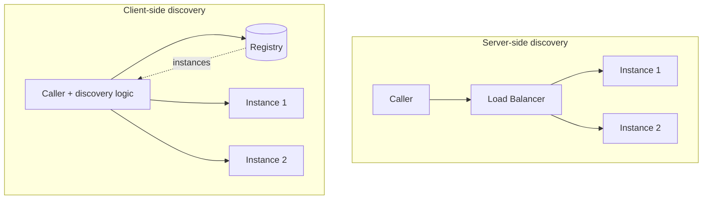
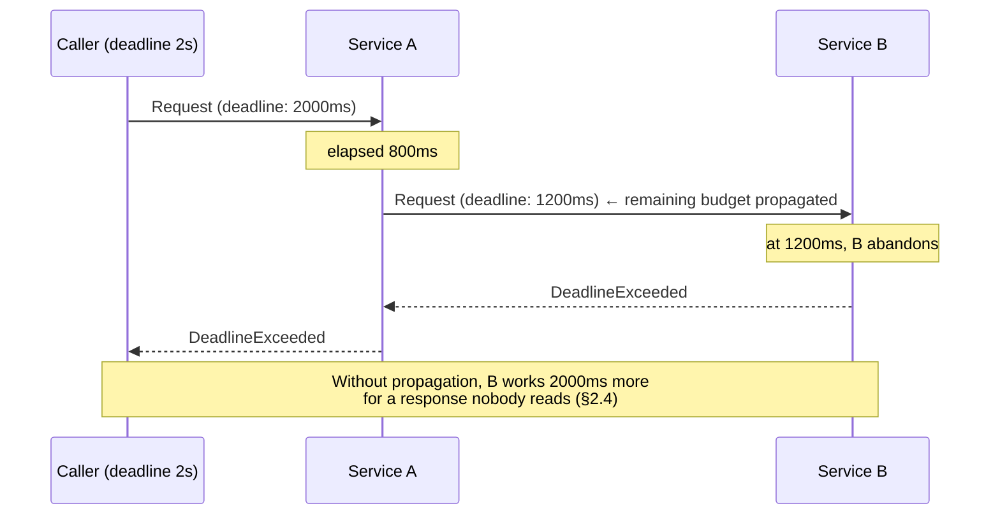
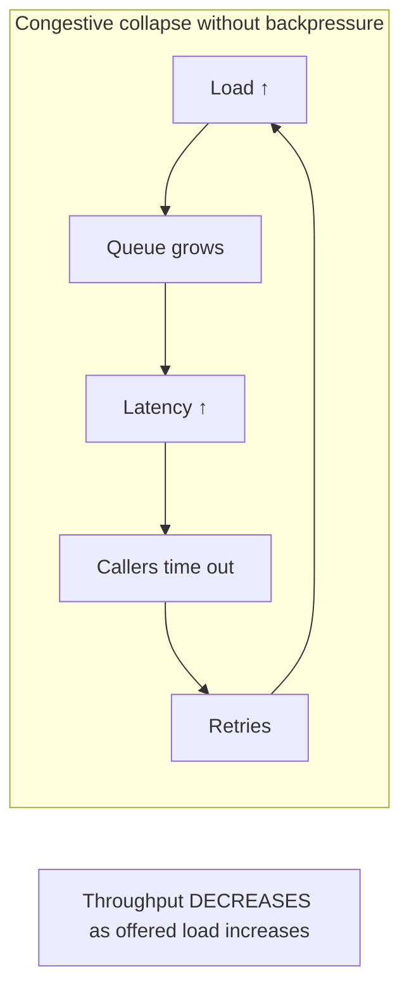
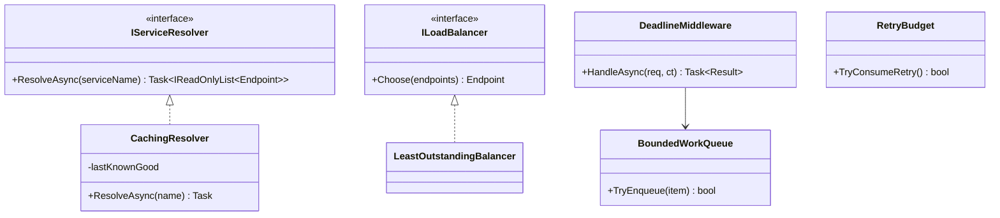

# Module 136 — Microservices: Service Discovery, Communication Infrastructure & Backpressure

> Domain: Microservices | Level: Beginner → Expert | Prerequisite: [[04-Data-Consistency-Query-Patterns-Across-Service-Boundaries]] (composition's fan-out, which this module's flow control bounds), [[02-Resilience-Observability-Sidecar-Patterns]] (timeouts, retries, circuit breakers — the per-call resilience this module extends to connection- and system-level concerns), [[../38-API-Gateway/01-APIGatewayFundamentals-Routing-RateLimiting-AuthEnforcement-Transformation]] (north-south traffic; this module covers east-west)
>
> **Scope note:** Second of five modules extending `17-Microservices` toward its stated 8-module extra-depth scope. Full 16-section template; Elite FinTech Interview Panel lens.

---

## 1. Fundamentals

**What:** How services locate each other in an environment where instances are ephemeral, how calls between them are shaped and bounded, and what happens when a caller can produce work faster than a callee can consume it.

**Why:** Module 50 covered per-call resilience — timeout, retry, circuit breaker — which protects a caller from a failing dependency. This module covers the layer beneath and around it: *finding* the dependency at all, and preventing a healthy caller from destroying a healthy callee through sheer volume. Most cascading failures in microservices estates are not caused by a service failing; they are caused by a service being overwhelmed by callers who were behaving correctly according to their own local logic.

**When:** Discovery matters from the moment instances are dynamic (containers, autoscaling) rather than fixed hosts. Backpressure matters from the moment any caller can generate load faster than a callee can absorb it — which, given retries and fan-out, is essentially always.

**How (30,000-ft view):**
```
Discovery:     "where is Valuation Service?" → registry/DNS/mesh → healthy instance addresses
Load balancing: which instance? → client-side or server-side, with health awareness
Call shaping:   connection pooling, multiplexing, deadlines propagated across hops
Backpressure:   callee signals "slow down" → caller reduces rate, sheds, or queues with bounds
```

---

## 2. Deep Dive

### 2.1 Client-Side vs Server-Side Discovery
**Server-side:** the caller addresses a stable endpoint (a load balancer or virtual IP) which resolves to healthy instances. Simple for callers, but the balancer is an extra hop and a shared component, and it typically has no view of caller-specific state.

**Client-side:** the caller queries a registry, receives instance addresses, and chooses one itself. Removes the hop and enables sophisticated caller-side balancing (§2.2), at the cost of every caller embedding discovery logic — which, in a polyglot estate, means maintaining it per language. This is the specific problem sidecars (Module 50 §2.6) and service meshes solve, by moving client-side discovery out of the application into a proxy.

The tension worth naming: client-side gives better balancing, server-side gives simpler callers, and the mesh gives both at the cost of an infrastructure layer.

### 2.2 Load Balancing Algorithms and Why Round-Robin Underperforms
Round-robin distributes evenly by *count*, which is correct only if requests cost the same and instances are equally capable. Neither holds in practice: a slow instance (GC pause, noisy neighbour, cold cache) receives the same share as a healthy one and becomes a latency outlier that the caller's P99 inherits.

**Least-outstanding-requests** (choosing the instance with fewest in-flight calls) self-corrects: a slow instance accumulates in-flight requests and naturally receives fewer new ones. This is materially better under heterogeneous latency and is the default worth preferring. **Power-of-two-choices** — sample two instances, pick the less loaded — achieves most of the benefit at a fraction of the coordination cost, and scales better than tracking all instances.

### 2.3 Health Checks: Liveness, Readiness, and the Distinction That Matters
**Liveness** answers "should this instance be restarted?" **Readiness** answers "should this instance receive traffic?" Conflating them is a common and damaging error: an instance that is temporarily unable to serve (dependency down, cache warming) should be removed from load balancing but *not* restarted, and a restart loop under dependency failure turns a partial outage into a total one.

The subtler failure: a readiness check that tests only the process, not its dependencies, reports ready while every request fails. The opposite error — readiness depending on a downstream service — means a downstream blip removes the entire fleet from rotation simultaneously, which is worse. The workable rule is that readiness should reflect *this instance's* ability to serve, including its own resources, but should not cascade the health of shared dependencies (§Advanced Q3).

### 2.4 Deadline Propagation
A caller with a 2-second timeout calling a service that itself calls three others with 2-second timeouts each can wait 6 seconds while the original caller gave up at 2 — the downstream work continues, consuming capacity for a response nobody will read.

**Deadline propagation** passes the remaining budget with the request: each hop subtracts its elapsed time and passes the remainder, so downstream work is abandoned when the original deadline expires. This is one of the highest-value and most commonly omitted patterns in distributed systems, because its absence produces waste that is invisible — the work completes successfully, just pointlessly, and appears in metrics as healthy throughput.

### 2.5 Backpressure — the Missing Half of Resilience
Module 50's patterns protect the **caller** from a failing callee. Backpressure protects the **callee** from an overwhelming caller, and the two are not symmetric.

Without it, a callee under excessive load queues, latency grows, callers time out and retry, load increases further, and the system enters congestive collapse — a failure mode where throughput *decreases* as offered load increases. Mechanisms, in increasing sophistication:
- **Bounded queues with rejection.** Fail fast when full, rather than queueing unboundedly and converting a capacity problem into a latency problem.
- **Load shedding.** Reject a fraction of requests to preserve service for the rest, ideally prioritized so critical traffic survives.
- **Explicit flow control.** The protocol carries the signal — gRPC/HTTP2 flow control, reactive-streams `request(n)` — so the producer genuinely slows rather than being rejected.

The insight teams miss: **an unbounded queue is not a buffer, it is a way of converting a fast failure into a slow one.** It always fills eventually, and when it does, the latency it added is pure loss.

### 2.6 Retry Amplification and the Retry Budget
Retries (Module 50 §2.2) are essential and dangerous: under partial failure, a retrying caller multiplies load on an already-struggling callee at exactly the wrong moment. With three retries across three hops, one user request can become 27 backend calls.

The mitigations are specific: **retry budgets** (cap retries as a percentage of total requests, so retries cannot exceed a fraction of normal traffic regardless of failure rate), **retry only at one layer** rather than at every hop, and **jittered backoff** to prevent synchronized retry storms. A retry budget is the single most effective control, because it bounds amplification structurally rather than depending on each layer's configuration being individually correct.

---

## 3. Visual Architecture







---

## 4. Production Example

**Problem:** A pricing service served valuations to several consumers, including the client-holdings composition of Module 135. It ran comfortably at 40% CPU for two years.

**Architecture:** Client-side discovery via a registry, round-robin balancing (§2.2), Module 50's timeout and retry configured correctly on every caller, and a work queue in front of the pricing computation.

**Implementation:** The queue was unbounded — a deliberate decision, documented, to avoid rejecting requests during brief spikes. The reasoning was sound on its face: pricing bursts were short, the queue absorbed them, and rejecting a client's valuation request seemed worse than making it wait.

**Trade-offs:** An unbounded queue trades memory and latency for availability during transient spikes, which for short bursts is a genuine benefit.

**Lessons learned:** A market-data disruption caused one instrument's pricing to take 40× longer than normal. That instrument appeared in many portfolios, so many requests slowed simultaneously. The queue absorbed them, as designed — and grew. Latency crossed callers' 2-second timeouts. Callers retried. Because there was no deadline propagation (§2.4), the pricing service continued computing every abandoned request to completion, consuming capacity for responses nobody would read. Retries added load, the queue grew faster, and within four minutes the service was processing a queue whose oldest entries were nine minutes old — every one of them long since abandoned by its caller.

Throughput of *useful* work fell to near zero while CPU sat at 100%. The service never crashed and never reported an error rate above baseline: from its own perspective it was successfully computing valuations at maximum capacity. Every single one was discarded on arrival.

Three failures compounded. The unbounded queue converted a capacity problem into an unbounded latency problem (§2.5). The absence of deadline propagation meant the service could not distinguish live work from abandoned work. And retries amplified the load precisely when the service was least able to absorb it (§2.6).

The fix: a bounded queue rejecting when full; deadline propagation so abandoned work is dropped rather than computed; and a retry budget capping retries at 10% of normal traffic. The generalizable lesson: **an unbounded queue does not absorb overload, it defers and amplifies it** — and a system that cannot tell live work from abandoned work will, under stress, spend all of its capacity on the latter.

---

## 5. Best Practices
- Bound every queue and reject when full; an unbounded queue defers failure rather than preventing it (§2.5, §4).
- Propagate deadlines across every hop so abandoned work is dropped rather than completed (§2.4).
- Cap retries with a budget expressed as a fraction of normal traffic, not per-call counts alone (§2.6).
- Prefer least-outstanding-requests or power-of-two-choices over round-robin under heterogeneous latency (§2.2).
- Separate liveness from readiness, and keep readiness reflecting this instance rather than shared dependencies (§2.3).
- Retry at one layer only, with jittered backoff (§2.6).

## 6. Anti-patterns
- Unbounded queues justified as spike absorption (§4's incident).
- Timeouts without deadline propagation, so downstream work outlives its caller (§2.4).
- Retries configured independently at every hop, multiplying amplification (§2.6).
- Readiness checks that depend on shared downstream services, removing the whole fleet on one blip (§2.3).
- Round-robin balancing in an estate with heterogeneous instance performance (§2.2).
- Conflating liveness and readiness, restarting instances that are merely temporarily unable to serve (§2.3).

---

## 7. Performance Engineering

**CPU/Memory:** §4's pathology is the canonical case — CPU at 100% doing entirely wasted work. Track *useful* throughput (requests completed within their deadline) separately from raw throughput, since the two diverge exactly when it matters.

**Latency:** Queue time dominates service time under load, and queue time is invisible in service-side processing metrics. Instrument time-in-queue distinctly from time-in-processing, or a saturated system reports healthy processing latency (§4).

**Throughput:** Little's Law (Module 102) bounds it: concurrency = arrival rate × latency, so a system with bounded concurrency and growing latency has falling throughput. This is the arithmetic behind congestive collapse.

**Scalability:** Connection management matters more than usually appreciated — a service calling many others with per-request connections exhausts ports and file descriptors long before CPU. Pool and multiplex (HTTP/2, gRPC) rather than opening per call.

**Benchmarking:** Load-test *past* saturation, not up to it. The interesting behaviour — whether throughput degrades gracefully or collapses — only appears beyond capacity, and a benchmark that stops at 80% never reveals which shape the system has.

**Caching:** Reduces load on callees and therefore backpressure incidence; note that a cache miss storm after eviction is itself a load spike that bounded queues must handle.

---

## 8. Security

**Threats:** A compromised registry can redirect all traffic to attacker-controlled instances — a total compromise of east-west trust. Discovery data also reveals topology, aiding lateral movement.

**Mitigations:** Mutual TLS between services with identity derived from workload identity rather than network position (Module 79's mesh material), so an attacker cannot impersonate a service by registering an endpoint. Registry writes must be strongly authorized — the ability to register an instance is the ability to receive traffic.

**OWASP mapping:** Broken Authentication at the service-to-service layer; and Server-Side Request Forgery risk where a service resolves and calls addresses influenced by request content.

**AuthN/AuthZ:** East-west calls authenticate with workload identity and authorize per-operation — the internal network is not a trust boundary (Module 100's Zero Trust position, applied to service-to-service traffic).

**Secrets:** Service identity credentials rotated automatically and short-lived, since long-lived service credentials are among the most valuable targets in an estate.

**Encryption:** In transit for all east-west traffic; the "internal network" assumption that once justified plaintext does not survive multi-tenant infrastructure.

---

## 9. Scalability

**Horizontal scaling:** Discovery must handle instance churn at autoscaling speed — a registry with slow propagation means traffic to terminated instances and unused new capacity. Propagation delay is a real scaling constraint often discovered late.

**Vertical scaling:** Connection and file-descriptor limits frequently bind before CPU (§7).

**Caching:** Discovery results cache locally with short TTL; the trade is staleness (traffic to dead instances) against registry load.

**Replication/Partitioning:** The registry is critical infrastructure — its unavailability prevents new connections estate-wide, so it needs stronger availability guarantees than the services it serves.

**Load balancing:** §2.2's algorithms; note that client-side balancing distributes the decision and removes the balancer as a bottleneck and single point of failure.

**High Availability:** Callers should cache last-known-good instances so a registry outage degrades gracefully rather than immediately severing all discovery — a stale instance list is far better than none.

**Disaster Recovery:** Registry state is rebuildable from instances re-registering, so its DR requirement is lighter than a data store's — provided instances re-register promptly rather than assuming persistent registration.

**CAP theorem:** Registries choose availability over consistency in most designs — a slightly stale instance list is better than no list, and callers handle stale entries through health checking and retry. A CP registry that refuses reads during partition is worse than an AP one serving slightly stale data.

---

## 10. Interview Questions

### Basic (10)

1. **Q: What is the difference between client-side and server-side discovery?**
   **A:** Server-side routes through a load balancer resolving to healthy instances; client-side has the caller query a registry and choose an instance itself, removing a hop but embedding discovery logic in every caller (§2.1).
   **Why correct:** States both mechanisms and their principal trade-off.
   **Common mistakes:** Treating them as equivalent implementation choices rather than a trade of caller simplicity against balancing sophistication.
   **Follow-ups:** "What resolves the tension?" (A sidecar or mesh moving client-side logic out of the application, §2.1.)

2. **Q: Why does round-robin underperform under heterogeneous latency?**
   **A:** It distributes by count, so a slow instance receives the same share as a healthy one and becomes a latency outlier the caller's P99 inherits (§2.2).
   **Why correct:** Identifies the specific assumption round-robin makes that fails in practice.
   **Common mistakes:** Assuming even distribution is inherently fair, when fairness by count is not fairness by load.
   **Follow-ups:** "What is better?" (Least-outstanding-requests, which self-corrects as slow instances accumulate in-flight calls, §2.2.)

3. **Q: What is the difference between liveness and readiness?**
   **A:** Liveness answers "should this be restarted"; readiness answers "should this receive traffic" — an instance temporarily unable to serve should be removed from rotation, not restarted (§2.3).
   **Why correct:** States both questions and why conflating them is harmful.
   **Common mistakes:** One health endpoint serving both, causing restart loops under dependency failure.
   **Follow-ups:** "What is the danger of readiness depending on a downstream service?" (A downstream blip removes the entire fleet simultaneously, §2.3.)

4. **Q: What is deadline propagation and what does it prevent?**
   **A:** Passing the remaining time budget with each request so downstream hops abandon work when the original deadline expires — preventing work continuing for responses nobody will read (§2.4).
   **Why correct:** States the mechanism and the specific waste it prevents.
   **Common mistakes:** Configuring independent timeouts per hop, which allows total time to exceed the caller's budget.
   **Follow-ups:** "Why is its absence hard to notice?" (The wasted work completes successfully and appears as healthy throughput, §2.4.)

5. **Q: What is backpressure and how does it differ from Module 50's resilience patterns?**
   **A:** Backpressure protects the callee from an overwhelming caller; Module 50's timeouts, retries, and circuit breakers protect the caller from a failing callee — opposite directions, not symmetric (§2.5).
   **Why correct:** States the direction and the asymmetry.
   **Common mistakes:** Assuming caller-side resilience patterns also protect callees.
   **Follow-ups:** "What happens without it?" (Congestive collapse — throughput decreases as offered load increases, §2.5.)

6. **Q: Why is an unbounded queue not a buffer?**
   **A:** It always fills eventually, and until then it adds latency without adding capacity — converting a fast failure into a slow one (§2.5, §4).
   **Why correct:** States the specific reframing that makes the anti-pattern visible.
   **Common mistakes:** Treating unbounded queues as spike absorption, which they are only for spikes shorter than the drain time.
   **Follow-ups:** "What should replace it?" (A bounded queue rejecting when full, so overload produces fast, honest failure, §2.5.)

7. **Q: What is retry amplification?**
   **A:** Retries multiplying load on a struggling callee at the worst moment — three retries across three hops turns one user request into up to 27 backend calls (§2.6).
   **Why correct:** States the mechanism with its multiplicative arithmetic.
   **Common mistakes:** Configuring retries per hop without considering their composition.
   **Follow-ups:** "What is the most effective control?" (A retry budget capping retries as a fraction of normal traffic, bounding amplification structurally, §2.6.)

8. **Q: What happened in §4's incident?**
   **A:** One slow instrument grew an unbounded queue past callers' timeouts; without deadline propagation the service computed every abandoned request to completion while retries added load, so CPU hit 100% doing entirely wasted work with no error-rate signal (§4).
   **Why correct:** States all three compounding failures.
   **Common mistakes:** Attributing it to the slow instrument rather than to the three design gaps that converted a slowdown into a collapse.
   **Follow-ups:** "Why was there no error signal?" (From the service's perspective it was successfully computing at capacity — the discarding happened at the caller, §4.)

9. **Q: Why must callers cache last-known-good instances?**
   **A:** So a registry outage degrades gracefully — a stale instance list is far better than none, and without caching, registry unavailability severs all discovery immediately (§9).
   **Why correct:** States the failure mode caching prevents.
   **Common mistakes:** Treating the registry as always available, making it a total single point of failure.
   **Follow-ups:** "What is the cost?" (Traffic to instances that have since terminated, handled by health checking and retry, §9.)

10. **Q: Why do registries typically choose availability over consistency?**
    **A:** A slightly stale instance list is usable — callers handle dead entries via health checks and retry — whereas refusing reads during partition prevents all new connections estate-wide (§9).
    **Why correct:** Justifies the CAP choice from the consequence of each failure.
    **Common mistakes:** Assuming consistency is always preferable for infrastructure metadata.
    **Follow-ups:** "What handles the staleness?" (Health checking and retry on the caller side, §9.)

### Intermediate (10)

1. **Q: Walk through §4's collapse mechanically, identifying each amplifying step.**
   **A:** One instrument's pricing slowed 40×; many requests touched it, so many slowed together. The unbounded queue absorbed them and grew rather than rejecting. Queue latency crossed the 2-second caller timeout. Callers abandoned and retried, adding load. Without deadline propagation, the service kept computing abandoned requests, consuming capacity for discarded results. Each retry lengthened the queue further, so the fraction of useful work fell monotonically until it approached zero — with CPU saturated throughout.
   **Why correct:** Traces the feedback loop step by step, identifying that the loop is self-reinforcing.
   **Common mistakes:** Describing it as overload rather than as a positive feedback loop, which is what makes it collapse rather than degrade.
   **Follow-ups:** "Which single fix would have broken the loop?" (Any of the three — bounded queue, deadline propagation, or retry budget — which is why all three are worth having.)

2. **Q: Why is a bounded queue better than a larger unbounded one?**
   **A:** Size is not the issue; the *rejection behaviour* is. A bounded queue converts overload into fast, honest failure the caller can act on (shed, retry elsewhere, degrade); an unbounded one converts it into growing latency the caller discovers only by timing out, after the work is already queued (§2.5).
   **Why correct:** Identifies rejection semantics rather than capacity as the meaningful difference.
   **Common mistakes:** Tuning queue size, which changes when collapse occurs but not whether.
   **Follow-ups:** "How should the bound be chosen?" (From latency budget: queue depth × service time should stay within the caller's deadline, or the queue is admitting work that will expire.)

3. **Q: Design deadline propagation across a call chain.**
   **A:** The entry point sets an absolute deadline (a timestamp, not a duration, so it survives clock-skew-free comparison and multiple hops); each hop passes it unchanged; each service checks remaining budget before starting work and abandons immediately if expired, and refuses to start work whose expected duration exceeds the remainder. The refusal-to-start check is what converts propagation from waste-reduction into genuine protection.
   **Why correct:** Specifies absolute deadlines and the pre-work check that provides the real benefit.
   **Common mistakes:** Passing durations, which accumulate error across hops, or checking only on completion, which saves nothing.
   **Follow-ups:** "Why absolute rather than relative?" (A duration must be decremented at each hop by the elapsed time, which requires accurate measurement of network time; a timestamp needs only comparison.)

4. **Q: Why does a readiness check depending on a downstream service cause a worse outage?**
   **A:** Every instance shares that dependency, so a downstream blip marks the entire fleet unready simultaneously — converting a degraded dependency into a total outage of the dependent service, when serving degraded responses would have been better (§2.3).
   **Why correct:** Identifies the simultaneity that makes it catastrophic rather than merely conservative.
   **Common mistakes:** Adding dependency checks to readiness for thoroughness, which inverts the intent.
   **Follow-ups:** "What should readiness check?" (This instance's own ability to serve — process health, local resources, warm-up state — but not shared dependencies, §2.3.)

5. **Q: How does a retry budget differ from a retry count, and why is it stronger?**
   **A:** A count bounds retries per request; a budget bounds retries as a fraction of total traffic across the service. Under widespread failure, counts still permit every request to retry its maximum, so amplification scales with failure rate; a budget caps total retry load regardless of how many requests fail — bounding amplification structurally rather than per-request (§2.6).
   **Why correct:** Identifies that counts scale with failure rate while budgets do not.
   **Common mistakes:** Assuming a low retry count is sufficient protection, which holds only when failures are rare.
   **Follow-ups:** "What happens when the budget is exhausted?" (Retries are refused and failures surface immediately — correct, since at that point retrying is making things worse.)

6. **Q: Why does queue time need separate instrumentation from processing time?**
   **A:** Service-side processing metrics exclude queue wait, so a saturated system reports healthy processing latency while callers experience seconds of delay — precisely §4, where the service saw normal per-request compute times throughout the collapse (§7).
   **Why correct:** Names the specific blind spot and ties it to the incident.
   **Common mistakes:** Monitoring processing latency and concluding the service is healthy.
   **Follow-ups:** "What single metric best captures the truth?" (Useful throughput — requests completed within their deadline — which falls to zero in §4 while raw throughput stayed high.)

7. **Q: Why do connection limits often bind before CPU?**
   **A:** A service calling many dependencies with per-request connections exhausts ephemeral ports and file descriptors at request rates well below CPU saturation — a limit that surfaces as connection errors rather than as slowness, and is therefore often misdiagnosed (§7).
   **Why correct:** Identifies the resource and why its symptom misleads.
   **Common mistakes:** Scaling on CPU metrics while connection exhaustion is the actual constraint.
   **Follow-ups:** "What is the fix?" (Connection pooling and multiplexing — HTTP/2 or gRPC carrying many concurrent requests over one connection, §7.)

8. **Q: Why must load tests run past saturation?**
   **A:** The question that matters is whether the system degrades gracefully or collapses (§2.5), and both look identical below capacity — a test stopping at 80% cannot distinguish a system that sheds load cleanly from one that will enter §4's feedback loop (§7).
   **Why correct:** Identifies that the behaviour of interest exists only beyond capacity.
   **Common mistakes:** Testing to a target throughput and declaring success, never observing the failure shape.
   **Follow-ups:** "What are you looking for past saturation?" (Whether throughput plateaus (good) or falls (collapse) — the shape of the curve, not the peak number.)

9. **Q: How does a service mesh change this module's concerns?**
   **A:** It relocates them rather than eliminating them: discovery, balancing, retries, and deadlines move from application code into a sidecar, which makes them consistent across languages and centrally configurable. But the same decisions must still be made correctly, and the mesh adds its own failure modes — a misconfigured mesh-level retry policy amplifies exactly as an application-level one would (§2.1, Module 79).
   **Why correct:** Identifies relocation rather than elimination, and notes the configuration risk persists.
   **Common mistakes:** Assuming mesh adoption solves backpressure and amplification, which it makes configurable rather than correct.
   **Follow-ups:** "What does the mesh genuinely solve?" (Polyglot consistency and central policy — every service gets the same behaviour without per-language libraries, §2.1.)

10. **Q: Synthesize how this module completes Module 50's resilience picture.**
    **A:** Module 50 gave the caller tools to survive a failing callee. This module gives the callee tools to survive an overwhelming caller, and gives the system tools to prevent the interaction between them from becoming pathological — deadline propagation so effort is not wasted, retry budgets so protection does not become attack, and bounded queues so overload fails fast. Together they cover both directions; either alone leaves the estate vulnerable to the failure the other addresses, which is why §4 occurred in a system where Module 50's patterns were correctly implemented.
    **Why correct:** Identifies the directional complementarity and notes that §4 happened despite correct caller-side resilience.
    **Common mistakes:** Treating caller-side resilience as complete protection.
    **Follow-ups:** "Which is more often missing in practice?" (Callee-side backpressure — caller-side patterns are well known and widely implemented, and their asymmetry is rarely noticed.)

### Advanced (10)

1. **Q: Diagnose §4's incident and design the complete structural fix.**
   **A:** Root cause: three compounding gaps — an unbounded queue converting capacity overload into unbounded latency, no deadline propagation so abandoned work consumed capacity, and unbudgeted retries amplifying load during the failure. Fix: (1) bounded queue sized so depth × service time stays within callers' deadlines (Intermediate Q2), rejecting when full; (2) absolute-deadline propagation with a pre-work expiry check (Intermediate Q3); (3) retry budget capping retries at a fraction of normal traffic (§2.6); (4) useful-throughput monitoring — requests completed within deadline — as the primary health signal, since raw throughput and CPU both read healthy throughout the collapse (Intermediate Q6).
   **Why correct:** Addresses all three mechanisms plus the monitoring gap that prevented detection.
   **Common mistakes:** Bounding the queue alone, which prevents unbounded latency but still wastes capacity on abandoned work.
   **Follow-ups:** "Why is (4) necessary if (1)–(3) prevent recurrence?" (Because the next saturation will have a different cause, and useful throughput is the signal that detects the class rather than the instance.)

2. **Q: A team proposes removing timeouts entirely so no work is wasted by abandonment. Evaluate.**
   **A:** It removes the caller's ability to bound its own latency, so a slow callee propagates unbounded delay up the chain — every caller inherits the slowest dependency's behaviour, and a user request can hang indefinitely. The waste it targets is real but is properly addressed by deadline propagation (§2.4), which eliminates waste *and* keeps bounds. Removing timeouts trades a bounded, visible failure for an unbounded, invisible one.
   **Why correct:** Identifies that the proposal addresses the symptom by removing the protection, and names the correct alternative.
   **Common mistakes:** Accepting the waste argument without noticing that propagation solves it without the cost.
   **Follow-ups:** "What if the callee genuinely needs longer than any reasonable caller deadline?" (Then it should be asynchronous — accept the request, return a handle, and let the caller poll or be notified, rather than holding a synchronous call open.)

3. **Q: Design readiness such that it neither cascades nor lies.**
   **A:** Readiness reflects this instance's ability to serve: process healthy, local resources available, warm-up complete, and — importantly — its own dependency *connections* established, without asserting that those dependencies are themselves healthy. If a dependency is down, the instance stays ready and returns degraded responses or fast failures, which callers handle with their own resilience (Module 50), rather than the fleet vanishing. The distinction is between "I cannot serve" (unready) and "my dependency cannot serve" (ready, but failing calls) — the second is not this instance's readiness question.
   **Why correct:** Draws the boundary precisely and explains why the second case should surface as failures rather than as unreadiness.
   **Common mistakes:** Either checking nothing (lying about readiness) or checking dependencies (cascading), both common.
   **Follow-ups:** "What if every dependency is down and all responses fail?" (Still ready — callers' circuit breakers handle it, and removing the fleet from rotation prevents even degraded service.)

4. **Q: Critique client-side load balancing in a polyglot estate without a mesh.**
   **A:** Discovery, balancing, retry, and deadline logic must be implemented and kept consistent in every language in use — and they will drift, since each implementation is maintained by a different team with different priorities. The failure mode is subtle: one language's client retries more aggressively or propagates deadlines incorrectly, producing amplification that appears to originate from those services for no visible reason. This is the specific problem sidecars solve, and the cost of not solving it grows with language count (§2.1).
   **Why correct:** Identifies drift across implementations as the failure mode, and why it is hard to attribute.
   **Common mistakes:** Assuming a shared specification produces consistent behaviour across independently-maintained libraries.
   **Follow-ups:** "What is the minimum viable alternative to a full mesh?" (A single shared client library where language count is small — viable at two languages, untenable at six.)

5. **Q: How should load shedding prioritize when it must reject?**
   **A:** By business criticality declared per request class, not by arrival order — a pricing request supporting a live trade should survive when a background report request does not. This requires requests to carry a priority the service can read, which means the *callers* must classify honestly, which in turn requires that priority be governed rather than self-declared. Without governance every caller marks itself critical and the mechanism degrades to first-come-first-served.
   **Why correct:** Specifies the mechanism and identifies the governance problem that determines whether it works.
   **Common mistakes:** Implementing priority shedding without governing priority assignment, which renders it inert.
   **Follow-ups:** "How is priority governed?" (Assigned at the platform level per caller and route rather than set by the calling service, so it cannot be self-inflated.)

6. **Q: A service's P99 latency is dominated by one slow instance. Walk through the diagnosis and fix.**
   **A:** Confirm by comparing per-instance latency distributions — if one instance is an outlier, the balancer is sending it a normal share of traffic despite abnormal performance, which is round-robin's signature failure (§2.2). Immediate fix: switch to least-outstanding-requests, which self-corrects. Then determine why that instance is slow — GC, noisy neighbour, cold cache, degraded hardware — since the balancing change treats the symptom. Outlier detection that ejects persistently slow instances is the structural addition.
   **Why correct:** Diagnoses via per-instance comparison, gives immediate and structural fixes, and separates symptom from cause.
   **Common mistakes:** Scaling out, which adds capacity while the outlier continues receiving its share.
   **Follow-ups:** "Why not just eject slow instances immediately?" (Aggressive ejection under a system-wide slowdown removes healthy capacity — ejection thresholds must be relative to fleet performance, not absolute.)

7. **Q: Apply this course's "declared ≠ actual" theme to this module.**
   **A:** The claim is "the service is healthy and serving requests." §4's declared basis was CPU utilization, error rate, and processing latency — all of which read healthy while the service was doing nothing useful whatsoever. The gap is that every conventional health signal measures *the service's own activity*, and the service was extremely active; none measured whether that activity produced value for anyone. This is the module's specific contribution to the theme: **a saturated system's metrics describe its effort, not its output**, and the two decouple precisely under the conditions where the distinction matters.
   **Why correct:** Identifies effort-versus-output as the specific decoupling, and that it occurs exactly under stress.
   **Common mistakes:** Concluding the monitoring was inadequate rather than that the standard metrics measure the wrong thing under saturation.
   **Follow-ups:** "What is the corrective metric?" (Useful throughput — completions within deadline — which is the only one that fell during §4.)

8. **Q: Design the monitoring that distinguishes healthy saturation from collapse.**
   **A:** Track offered load, useful throughput, and queue depth together. Healthy saturation: useful throughput plateaus while offered load rises, queue depth stable at its bound, rejections rising. Collapse: useful throughput *falls* while offered load rises, queue depth growing, rejections absent (because nothing is bounded). The discriminating signal is the direction of useful throughput against load — plateau is fine, decline is collapse, and raw throughput distinguishes neither.
   **Why correct:** Gives the specific signal combination and the discriminating direction.
   **Common mistakes:** Alerting on CPU or latency, both of which look similar in the two cases.
   **Follow-ups:** "Which single alert would have caught §4 fastest?" (Queue depth exceeding the depth at which queue time equals caller deadline — the point past which admitted work is guaranteed to be wasted.)

9. **Q: How should discovery behave during a registry outage?**
   **A:** Callers serve from their cached instance list indefinitely, marking it stale, while health checking prunes dead entries — degrading gradually as instances churn rather than failing immediately. New instances cannot be discovered, so autoscaling is impaired, but existing traffic continues. The critical design property: **cache expiry must not delete the last known entries**, since an empty cache during a registry outage means total failure, whereas a stale list means partial degradation.
   **Why correct:** Specifies graceful degradation and identifies the specific expiry behaviour that determines whether it works.
   **Common mistakes:** TTL-based expiry that empties the cache, converting a registry outage into a total outage.
   **Follow-ups:** "How stale is too stale?" (Bounded by instance churn rate — in a fast-autoscaling estate a stale list degrades quickly, which is an argument for registry HA rather than for aggressive expiry.)

10. **Q: Synthesize the governance required for east-west communication.**
    **A:** (1) Bounded queues everywhere, sized against caller deadlines (Advanced Q1). (2) Deadline propagation as a platform default, not per-service configuration (Intermediate Q3). (3) Retry budgets enforced centrally, with retry permitted at one layer only (§2.6). (4) Readiness semantics standardized to exclude shared dependencies (Advanced Q3). (5) Load-balancing default of least-outstanding-requests with outlier ejection (Advanced Q6). (6) Priority governed at the platform rather than self-declared (Advanced Q5). (7) Useful-throughput monitoring as the primary saturation signal (Advanced Q8). (8) Load testing past saturation as a release gate, since collapse shape is invisible below capacity (§7).
    **Why correct:** Assembles controls covering both directions plus the monitoring and testing that reveal the failure class.
    **Common mistakes:** Governing caller-side resilience only, which is §4's estate exactly.
    **Follow-ups:** "Which should be platform defaults rather than per-service choices?" (Deadline propagation and retry budgets — both fail when any single service configures them wrongly, so they must not be per-service decisions.)

### Expert (10)

1. **Q: Evaluate gRPC versus REST for east-west communication.**
   **A:** gRPC's advantages are concrete here: HTTP/2 multiplexing avoids §7's connection exhaustion, binary encoding reduces serialization cost at high call volumes, generated clients reduce per-language drift (Advanced Q4), and deadline propagation is built into the protocol rather than being a convention. REST's advantages are ecosystem breadth, debuggability, and browser reach — the last irrelevant east-west. For internal service-to-service traffic at volume, gRPC's protocol-level deadline and flow-control support is the decisive factor, since those are exactly what §4 lacked and what conventions implement inconsistently.
   **Why correct:** Compares on the dimensions this module establishes as mattering, rather than on general merits.
   **Common mistakes:** Choosing on familiarity, forgoing protocol-level deadline and flow control that must otherwise be built.
   **Follow-ups:** "What does gRPC not solve?" (Retry amplification and load shedding policy — protocol support does not make the configuration correct, Intermediate Q9.)

2. **Q: How does backpressure work in an asynchronous, event-driven path versus a synchronous one?**
   **A:** Synchronously, backpressure is immediate and explicit — the callee rejects or blocks, and the caller learns instantly. Asynchronously, the queue itself absorbs the mismatch, so backpressure manifests as *growing consumer lag* rather than as rejection, and the producer may never learn it is outpacing the consumer. This makes lag the primary signal (Module 141's territory) and means the corrective action — slowing the producer — requires an explicit feedback path that does not exist by default.
   **Why correct:** Identifies that the signal changes form and that the feedback path must be deliberately built.
   **Common mistakes:** Assuming a durable queue removes the need for backpressure, when it converts rejection into unbounded lag.
   **Follow-ups:** "Is unbounded lag better than rejection?" (Sometimes — it preserves the work, which for events is often correct — but only if lag is monitored and bounded by retention, or the events expire unprocessed.)

3. **Q: Design flow control for a service whose callers vary enormously in volume.**
   **A:** Per-caller concurrency limits rather than a global one, so a high-volume caller cannot consume the entire capacity — the bulkhead pattern (Module 50 §2.4) applied to inbound rather than outbound. Limits should be proportional to a caller's provisioned share, with unused capacity redistributable (Module 132's fair-share scheduler, reapplied). Without per-caller limits, a single misbehaving or newly-scaled caller starves every other, and the callee cannot distinguish this from genuine aggregate load.
   **Why correct:** Applies inbound bulkheading and fair-share, and identifies the attribution problem global limits create.
   **Common mistakes:** A single global concurrency limit, which protects the callee but distributes the pain arbitrarily.
   **Follow-ups:** "How does the callee identify callers reliably?" (Workload identity from mTLS (§8), not a self-declared header that a misbehaving caller could spoof or omit.)

4. **Q: A downstream service adds 50ms latency. Trace the effect through a five-hop chain.**
   **A:** The direct effect is 50ms; the compounding effects are larger. Each upstream hop's in-flight concurrency rises proportionally (Little's Law), consuming connection and thread resources at every level. If any hop's timeout is now marginal, retries begin, multiplying load. If queues are unbounded, latency grows superlinearly rather than by 50ms. The lesson: **added latency propagates as added concurrency**, and concurrency is what exhausts finite resources — which is why a small latency increase can produce a disproportionate failure.
   **Why correct:** Traces the concurrency consequence rather than only the additive latency, which is the mechanism that matters.
   **Common mistakes:** Reasoning additively and concluding 50ms is tolerable at every hop.
   **Follow-ups:** "What bounds the concurrency growth?" (Explicit concurrency limits per dependency — bulkheads — which convert latency growth into fast rejection rather than resource exhaustion.)

5. **Q: How should retries interact with idempotency?**
   **A:** Retries are only safe for idempotent operations, and safety must be established by the operation's contract rather than assumed from its HTTP verb — a POST that creates a payment is not retryable without an idempotency key, and a GET that triggers a side effect is not retryable despite being nominally safe. The discipline: every retryable operation carries an idempotency key, and operations without one are configured non-retryable at the client. The failure mode of getting this wrong is duplicate financial transactions (Module 131 §2.3), which is why this is not a stylistic concern.
   **Why correct:** Ties retry safety to contract and key rather than to verb, and names the consequence.
   **Common mistakes:** Retrying by verb convention, which produces duplicates on non-idempotent POSTs.
   **Follow-ups:** "Where should the idempotency check live?" (In the callee, inside the transaction applying the effect — Module 131 §11's pattern, since a caller-side check cannot prevent duplicates from concurrent retries.)

6. **Q: Evaluate whether backpressure should propagate transitively upstream.**
   **A:** Ideally yes — a saturated service at depth 3 should ultimately slow the entry point rather than having intermediate hops absorb and hide the pressure. In practice this requires every layer to translate downstream rejection into upstream pressure rather than into retries, which is the opposite of most default behaviour. The pragmatic position: propagate where the path is synchronous and short, and use admission control at the entry point where it is not — since entry-point admission control achieves the same outcome without requiring every intermediate layer to behave correctly.
   **Why correct:** States the ideal, the practical obstacle, and a mechanism achieving the outcome more robustly.
   **Common mistakes:** Assuming propagation happens naturally, when default retry behaviour actively prevents it.
   **Follow-ups:** "What does entry-point admission control need to know?" (Downstream saturation signals — which is a feedback path that must be built, but only once rather than at every layer.)

7. **Q: How does autoscaling interact with the failures in this module?**
   **A:** Poorly, in a specific way: autoscaling responds to CPU or latency, both of which read as "needs more capacity" during §4's collapse — so it adds instances that join the same doomed queue, increasing load on shared dependencies while useful throughput stays at zero. Autoscaling amplifies collapse rather than relieving it, because the constraint is not capacity but a feedback loop. Scaling signals should therefore include useful throughput, and scaling should be suppressed when it is falling despite rising load, which is the collapse signature (Advanced Q8).
   **Why correct:** Identifies that autoscaling responds to the wrong signal and worsens the specific failure.
   **Common mistakes:** Relying on autoscaling as a backpressure substitute, which inverts its effect during collapse.
   **Follow-ups:** "What is the safe behaviour?" (Scale on useful throughput and offered load, and prefer shedding to scaling when the ratio between them is degrading.)

8. **Q: Design the migration from application-level to mesh-level communication policy.**
   **A:** Incrementally and additively: deploy sidecars in passthrough mode first, verifying they carry traffic without changing behaviour; move one policy at a time (deadlines, then retries, then balancing), removing the application-level equivalent only after the mesh-level one is verified — never both active, since duplicated retries multiply. Reconcile behaviour before and after each move, since a mesh retry policy and an application retry policy compose multiplicatively rather than replacing one another.
   **Why correct:** Sequences additively, identifies the duplicated-policy hazard, and specifies one-at-a-time migration.
   **Common mistakes:** Enabling mesh policies while application policies remain, producing amplification that appears mysteriously after a purely infrastructural change.
   **Follow-ups:** "How would duplicated retries manifest?" (Total attempts as the product of both configurations — three at each level becomes nine, appearing as a sudden load increase with no code change.)

9. **Q: A firm's trading path requires single-digit-millisecond east-west latency. What changes?**
   **A:** Most of this module's machinery becomes cost rather than benefit: sidecars add hops, registries add lookups, and generic balancing adds indirection. Such paths typically use direct connections with pre-established pools to known endpoints, static or slowly-changing topology, and no mesh — accepting operational rigidity for latency. This is the same split as Module 130 §Expert Q1 (direct feeds versus the platform) and Module 131's OMS/EMS division: the latency-critical path is architecturally separate, and attempting to serve it from the general estate degrades both.
   **Why correct:** Recognizes the requirement is incompatible with general infrastructure and identifies the established separation pattern.
   **Common mistakes:** Optimizing the shared infrastructure toward the latency target, degrading it for everyone without reaching the goal.
   **Follow-ups:** "What is the cost of the separation?" (Duplicated operational practice and a path that does not benefit from platform improvements — accepted deliberately, as in the prior modules' equivalents.)

10. **Q: Deliver the closing synthesis: what does this module reveal that per-call resilience does not?**
    **A:** That the dangerous failures in a microservices estate are **emergent rather than local**. Every component in §4 was individually correct: the timeout was right, the retry was right, the queue absorbed spikes as designed, and each caller behaved sensibly. The collapse arose from their *interaction* — a feedback loop no single component could see, in a system where every local metric read healthy. This is why per-call resilience is necessary and insufficient: it makes each interaction survivable without bounding what the interactions do collectively. The Principal-level implication is that resilience must be reasoned about at the system level — offered load versus useful throughput, amplification factors, feedback loops — and that a design review examining each service's configuration in isolation will pass an estate that is one slow dependency away from collapse.
    **Why correct:** Names emergence as the distinguishing property, uses the incident to demonstrate that local correctness was insufficient, and states the review-level implication.
    **Common mistakes:** Concluding that better per-service configuration would have prevented §4, when every per-service configuration was already correct.
    **Follow-ups:** "How does one review for emergent failure?" (Trace amplification through the call graph and load-test past saturation — the two techniques that make system-level behaviour visible, §7, Advanced Q8.)

---

## 11. Coding Exercises

### Easy — Bounded Queue with Fast Rejection (§2.5)
**Problem:** Replace an unbounded work queue with one that rejects when full.
**Solution:**
```csharp
public sealed class BoundedWorkQueue
{
    private readonly Channel<WorkItem> _channel;

    public BoundedWorkQueue(int capacity) =>
        _channel = Channel.CreateBounded<WorkItem>(new BoundedChannelOptions(capacity)
        {
            FullMode = BoundedChannelFullMode.DropWrite   // reject, never block the producer
        });

    public bool TryEnqueue(WorkItem item) => _channel.Writer.TryWrite(item);  // false = shed
}
```
**Time complexity:** O(1) enqueue.
**Space complexity:** O(capacity) — bounded by construction, which is the point.
**Optimized solution:** Size capacity from the latency budget — `capacity ≈ deadline / serviceTime` — so the queue never admits work guaranteed to expire before it runs (Intermediate Q2).

### Medium — Absolute Deadline Propagation (§2.4, Intermediate Q3)
**Problem:** Propagate a deadline across hops and abandon expired work before starting it.
**Solution:**
```csharp
public async Task<Result> HandleAsync(Request req, CancellationToken ct)
{
    var deadline = req.Headers.Deadline;               // absolute timestamp, not a duration
    if (DateTimeOffset.UtcNow >= deadline)
        return Result.DeadlineExceeded();              // don't start work already expired

    var remaining = deadline - DateTimeOffset.UtcNow;
    if (remaining < _estimatedServiceTime)
        return Result.DeadlineExceeded();              // won't finish in time — don't try

    using var linked = CancellationTokenSource.CreateLinkedTokenSource(ct);
    linked.CancelAfter(remaining);

    return await _downstream.CallAsync(req.WithDeadline(deadline), linked.Token);  // pass unchanged
}
```
**Time complexity:** O(1).
**Space complexity:** O(1).
**Optimized solution:** Estimate service time from a rolling percentile rather than a constant, so the pre-work check adapts as the service's own latency changes rather than using a stale assumption.

### Hard — Retry Budget (§2.6, Intermediate Q5)
**Problem:** Cap retries as a fraction of total traffic rather than per request.
**Solution:**
```csharp
public sealed class RetryBudget
{
    private readonly double _ratio;              // e.g. 0.1 = retries may be 10% of requests
    private long _requests, _retries;

    public void RecordRequest() => Interlocked.Increment(ref _requests);

    public bool TryConsumeRetry()
    {
        var requests = Interlocked.Read(ref _requests);
        var retries  = Interlocked.Read(ref _retries);

        if (retries >= requests * _ratio) return false;   // budget exhausted — fail fast
        Interlocked.Increment(ref _retries);
        return true;
    }
}
```
**Time complexity:** O(1) per check.
**Space complexity:** O(1).
**Optimized solution:** Use a sliding window rather than cumulative counters, so the budget reflects recent traffic — cumulative counts let a long-running process accumulate retry allowance it can spend all at once during a failure.

### Expert — Useful-Throughput Instrumentation (Advanced Q1, Q8)
**Problem:** Measure work completed within its deadline, distinguishing effort from output.
**Solution:**
```csharp
public async Task<Result> ExecuteInstrumentedAsync(Request req)
{
    var enqueuedAt = DateTimeOffset.UtcNow;
    var result = await _inner.HandleAsync(req);
    var completedAt = DateTimeOffset.UtcNow;

    _metrics.RecordQueueTime(req.DequeuedAt - enqueuedAt);        // separate from processing (§7)
    _metrics.RecordProcessingTime(completedAt - req.DequeuedAt);

    if (completedAt <= req.Headers.Deadline)
        _metrics.IncrementUsefulThroughput();                      // the only metric that fell in §4
    else
        _metrics.IncrementWastedWork();                            // computed, then discarded

    return result;
}
```
**Time complexity:** O(1) per request.
**Space complexity:** O(1).
**Optimized solution:** Alert on the *ratio* of wasted work to useful throughput rather than on either alone — a rising ratio is the collapse signature (Advanced Q8) and appears before either absolute number looks alarming.

---

## 12. System Design

**Functional requirements**
- Services locate healthy instances of dependencies amid continuous instance churn.
- Calls are balanced across instances accounting for heterogeneous performance.
- Deadlines propagate so abandoned work is not computed.
- Callees protect themselves from overwhelming callers via bounded queues and shedding.

**Non-functional requirements**
- No congestive collapse under any offered load — throughput plateaus, never falls (§2.5).
- Retry amplification bounded regardless of failure rate (§2.6).
- Registry outage degrades gracefully rather than severing discovery (Advanced Q9).
- Useful throughput observable and alertable independently of raw throughput (Advanced Q8).

**Capacity estimation**
- ~180 services, ~1,400 instances, instance churn ~200/hour under normal autoscaling.
- East-west call volume ~85k/s aggregate at peak; fan-out from composition (Module 135) is the dominant multiplier.
- Registry lookups: with 30s client-side caching, ~1,400 instances × 2 lookups/min ≈ 47/s — trivial, which is why caching matters more for availability than for load.
- **The sensitivity that matters:** amplification factor, not base call volume. A retry configuration permitting three attempts at three layers turns 85k/s into a potential 2.3M/s under widespread failure — which no capacity plan accommodates, and which is why the retry budget is a correctness control rather than a tuning parameter.

**Architecture:** §3 — client-side discovery via registry with local caching, least-outstanding-requests balancing, absolute deadline propagation, bounded inbound queues with per-caller limits.

**Components:** Service registry; client-side resolver with cache and last-known-good retention; load balancer with outlier ejection; deadline middleware; bounded queue with priority shedding; retry budget; useful-throughput instrumentation.

**Database selection:** Registry backed by a consistent store for writes but serving reads from replicas — availability-favouring per §9, since stale reads are tolerable and unavailable reads are not.

**Caching:** Instance lists cached locally with short TTL and last-known-good retention (Advanced Q9).

**Messaging:** Synchronous east-west over gRPC for protocol-level deadlines and multiplexing (Expert Q1); asynchronous paths use queues where backpressure manifests as lag (Expert Q2).

**Scaling:** Instances scale on useful throughput and offered load rather than CPU (Expert Q7), with scaling suppressed during collapse signatures.

**Failure handling:** Bounded queues rejecting when full; deadline-expired work dropped before starting; retry budget exhaustion surfacing failures immediately; per-caller concurrency limits preventing one caller starving others (Expert Q3).

**Monitoring:** Useful throughput and wasted-work ratio (§11 Expert); queue depth against the deadline-derived bound; per-instance latency distributions for outlier detection; amplification factor across the call graph.

**Trade-offs:** Rejection over queueing accepts visible failures to prevent invisible collapse (§2.5). Client-side balancing accepts per-language complexity for better distribution, resolved by a mesh where language count justifies it (Advanced Q4).

---

## 13. Low-Level Design

**Requirements:** Queues are bounded by construction; deadlines cannot be dropped between hops; retries cannot exceed budget; readiness cannot cascade.

**Class diagram:**


**Sequence diagram:** §3's second diagram — deadline propagation preventing orphaned downstream work.

**Design patterns used:** Bulkhead (per-caller concurrency limits, Expert Q3); Circuit Breaker (Module 50, complemented here); Ambassador/Sidecar (mesh-based policy, §2.1); Token Bucket (retry budget); Load Shedder (priority rejection, Advanced Q5).

**SOLID mapping:** Single Responsibility (resolution, balancing, deadline enforcement, and queueing separate); Open/Closed (a new balancing algorithm implements `ILoadBalancer` without touching callers); Liskov (every balancer must be health-aware — a balancer ignoring health is not substitutable, which contract tests should enforce); Interface Segregation (resolution and balancing separate, since a mesh replaces one without the other); Dependency Inversion (callers depend on the resolver interface, allowing registry, DNS, or mesh implementations).

**Extensibility:** Swapping discovery mechanisms (registry to mesh) requires only a new `IServiceResolver`; adding priority shedding requires only queue configuration.

**Concurrency/thread safety:** The retry budget's counters are the contended structure and use interlocked operations; bounded channels handle producer/consumer concurrency internally; the resolver cache must serve reads lock-free during refresh, since blocking on refresh under registry slowness would convert a registry problem into a request-path problem.

---

## 14. Production Debugging

**Incident:** After migrating one service to a service mesh, its callers began seeing elevated error rates — but only for requests that had previously succeeded after a retry. Direct requests were fine; the service's own metrics showed no increase in failures.

**Root cause:** The application retained its application-level retry policy (3 attempts) while the mesh added its own (3 attempts). Total attempts became 9 rather than 3, and the retry budget — implemented at the application level — counted only its own retries, so the mesh's were invisible to it and unbudgeted.

Under a brief dependency slowdown, the 9× amplification exhausted the downstream service's per-caller concurrency limit (Expert Q3), which rejected the excess. Those rejections surfaced to callers as errors on requests that, before the mesh, would have succeeded on the second attempt within budget.

**Investigation:** The correlation with previously-retried requests was the key clue — it implicated retry behaviour rather than the mesh's data path. Comparing outbound request counts at the application against those observed at the destination showed a 3× discrepancy, which is precisely the mesh's retry multiplier.

**Tools:** Application-emitted outbound call counts versus destination-side inbound counts (the comparison that revealed the multiplier); mesh configuration review; per-caller concurrency-limit rejection metrics at the destination.

**Fix:** Remove the application-level retry, leaving the mesh as the single retry layer (§2.6's "retry at one layer only"), and move the retry budget to the mesh so it accounts for all retries.

**Prevention:** (1) The mesh migration runbook now requires removing the application-level equivalent *before* enabling each mesh policy, one at a time (Expert Q8) — the additive-then-remove sequence, never both active. (2) A continuous check comparing outbound call counts at source against inbound at destination, alerting on discrepancy, since any unaccounted multiplier indicates a duplicated policy. (3) Retry budgets moved to the platform layer, since an application-level budget cannot account for retries it does not perform — the same principle as Advanced Q10's "platform defaults, not per-service choices."

---

## 15. Architecture Decision

**Context:** Where communication policy — discovery, balancing, retries, deadlines — should live.

**Option A — Application libraries per language:**
*Advantages:* No infrastructure layer; policy visible in code alongside the logic it protects; no additional network hop or resource overhead.
*Disadvantages:* Drift across language implementations (Advanced Q4), producing inconsistent behaviour that is hard to attribute; policy changes require redeploying every service; a polyglot estate multiplies maintenance by language count.
*Cost:* Low infrastructure, high maintenance scaling with languages. *Complexity:* Distributed across teams.

**Option B — Service mesh sidecars (recommended for a polyglot estate):**
*Advantages:* Consistent behaviour regardless of language; policy changes centrally without redeployment; mTLS and observability arrive with it (Module 79).
*Disadvantages:* An infrastructure layer to operate, with its own failure modes; per-pod resource overhead; an added hop; and §14's hazard — mesh policy composing with residual application policy rather than replacing it.
*Cost:* Moderate infrastructure and operational. *Complexity:* Centralized but real.

**Option C — Shared library, single language:**
*Advantages:* Consistency without infrastructure, with policy in code.
*Disadvantages:* Only viable in a genuinely single-language estate, and constrains language choice permanently — a significant strategic cost for a tactical benefit.
*Cost:* Lowest. *Complexity:* Lowest. *Applicability:* Narrow.

**Recommendation: Option C where genuinely single-language, Option B otherwise.** The decisive variable is language count, not scale — Option A's drift (Advanced Q4) is manageable at one or two languages and unmanageable at five, because each implementation is maintained by a different team with different priorities and the inconsistency is invisible until it causes an incident nobody can attribute. Option B's genuine cost is not the infrastructure but §14's composition hazard: teams adopt the mesh without removing what it replaces, and the resulting amplification appears after a purely infrastructural change with no code deployment to blame. That risk is manageable with the migration discipline Expert Q8 specifies — but it must be planned for, because it is the single most common way mesh adoptions go wrong.

---

## 17. Principal Engineer Perspective

**Business impact:** The failures here are estate-wide outages rather than single-service degradations — §4 took down every consumer of a healthy service. Framing the investment as preventing correlated failure, rather than as improving individual service reliability, is what makes it legible to stakeholders who otherwise see a service that has run at 40% CPU for two years and question the need.

**Engineering trade-offs:** The central trade is fast, visible failure (rejection) against slow, invisible failure (queueing). Teams instinctively prefer queueing because rejection feels like giving up — and §4 is the consequence. Making the case that rejecting a request is *better service* than accepting one you cannot fulfil is the persuasion task, and it is genuinely counter-intuitive.

**Technical leadership:** Deadline propagation and retry budgets must be platform defaults rather than per-service choices (Advanced Q10), because both fail when any single service configures them wrongly — and §14 demonstrates that even a well-intentioned team can introduce amplification through an infrastructure change alone. Leadership here means making the correct behaviour the path of least resistance rather than documenting it.

**Cross-team communication:** §4's failure crossed team boundaries invisibly — the pricing team saw a healthy service, callers saw timeouts, and neither had the whole picture. Establishing shared, cross-service views of amplification and useful throughput is a communication artifact as much as a monitoring one, since the failure is only visible in the aggregate that no single team owns.

**Architecture governance:** Retry policy, deadline behaviour, and queue bounds belong in platform standards with mechanical enforcement, not in per-service discretion. §14 shows why: a locally-reasonable decision (keep the application retry during migration) produced estate-level amplification.

**Cost optimization:** §4's service ran at 100% CPU producing zero value — the most expensive possible operating point. Useful-throughput instrumentation is therefore a cost-management tool as well as a reliability one, since it reveals capacity spent on discarded work, which no conventional utilization metric shows.

**Risk analysis:** The dominant risk is emergent rather than local (Expert Q10) — configurations that are individually correct combining into a feedback loop. Risk assessment must therefore examine the call graph and amplification factors, not each service's configuration in isolation, which is a materially different review than most estates perform.

**Long-term maintainability:** What degrades is the consistency of policy across services as teams change, languages are added, and infrastructure migrates (§14). Platform-level enforcement is the durable answer; documented standards are not, because they are followed by whoever read them.

---

**Next in this run:** Module 137 — Multi-Region & Cell-Based Architecture: containing the blast radius of exactly the correlated failures this module describes, by ensuring that when a feedback loop does form, it cannot consume the entire estate.
