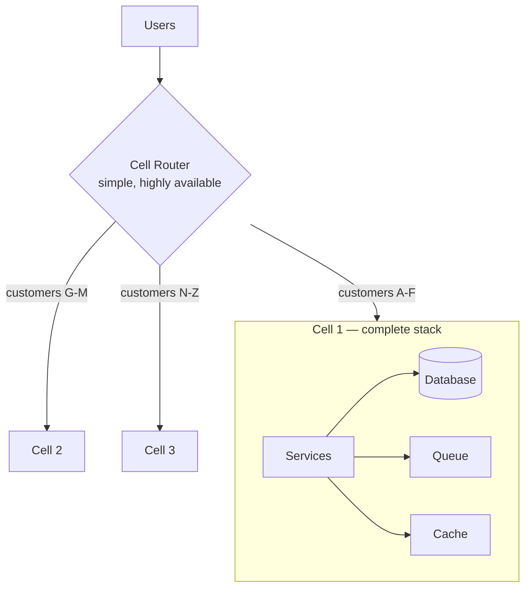
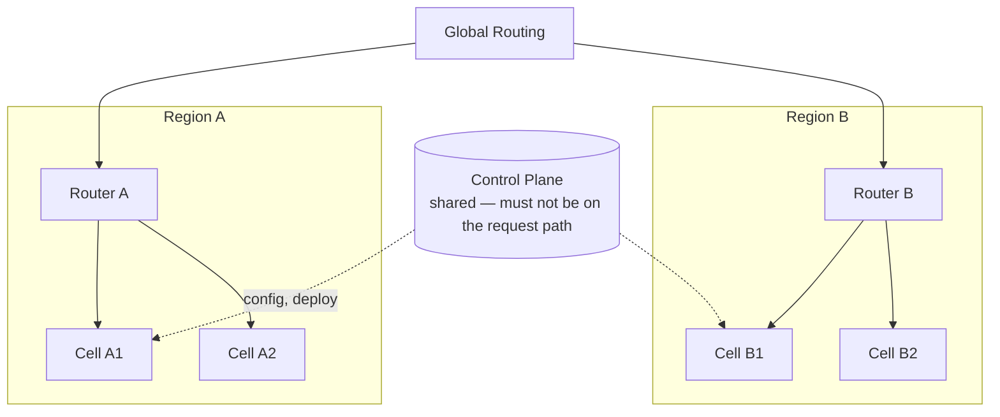
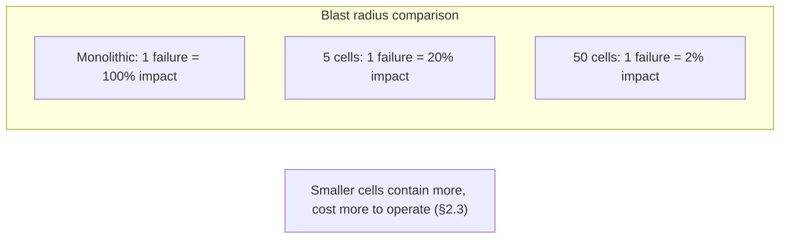
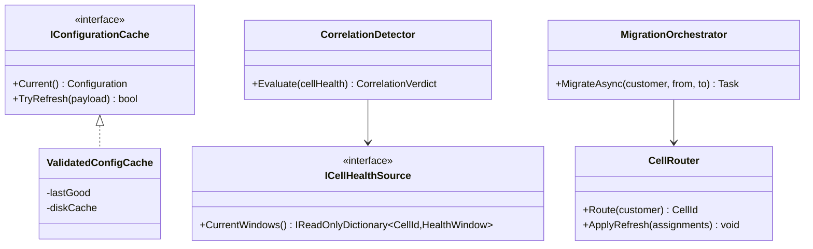

# Module 137 — Microservices: Multi-Region & Cell-Based Architecture — Containing Blast Radius

> Domain: Microservices | Level: Beginner → Expert | Prerequisite: [[05-Service-Discovery-Communication-Infrastructure-Backpressure]] (the correlated, emergent failures this module contains), [[../14-System-Design/12-Designing-MultiTenant-Portfolio-Analytics-Platform]] (tenant isolation, which cells generalize from data to failure), [[../21-AWS/01-Compute-Networking-VPC-LoadBalancing-AutoScaling]] (regions, availability zones, and the primitives cells are built from)
>
> **Scope note:** Third of five modules extending `17-Microservices` toward its stated 8-module extra-depth scope. Full 16-section template; Elite FinTech Interview Panel lens.

---

## 1. Fundamentals

**What:** Architectural patterns that bound how much of a system any single failure can affect — **cells** (independent, complete stacks each serving a subset of workload) and **multi-region** deployment (independent geographic footprints) — together with the routing and data strategies that make them work.

**Why:** Module 136 established that microservices failures are emergent: individually-correct components interact into feedback loops no local view can see. Resilience patterns reduce the *probability* of such failures; they cannot eliminate it. Cells address the complementary question — when a failure does occur, **how much does it take down?** A system with excellent resilience and no blast-radius containment still has a 100% failure mode.

**When:** Once the cost of total unavailability exceeds the cost of running partitioned infrastructure. For a trading platform where an hour of downtime has direct, quantifiable cost, that threshold arrives early. For an internal tool, it may never arrive — and building cells for a system that does not need them is a real and common waste.

**How (30,000-ft view):**
```
Monolithic deployment:  all users → one stack → one failure affects 100%

Cell-based:             users → router → cell 1 (complete stack, subset of users)
                                       → cell 2 (complete stack, subset of users)
                                       → cell N        ← failure affects 1/N

Multi-region:           region A (cells 1..n)  |  region B (cells 1..m)
                        ← regional failure affects one region's users
```

---

## 2. Deep Dive

### 2.1 What a Cell Actually Is
A cell is a **complete, independent instance of the entire stack** — services, databases, caches, queues — serving a defined subset of workload. Its defining property is that it shares nothing with other cells on the request path: no shared database, no shared cache, no shared message broker.

The distinction that matters: this is not horizontal scaling. Scaled instances typically share a database, so a database failure or a poison record affects all of them. In a cell, the database is *inside* the cell, so its failure is contained. **Cells partition failure domains, not just load.**

The most common failure to get this right is a shared component nobody counted — a shared configuration service, a shared feature-flag system, a shared identity provider — which silently makes every cell dependent on one thing and reintroduces the correlated failure the cells were built to prevent (§4).

### 2.2 Cell Routing and the Assignment Key
Something must map a request to a cell, and that mapping determines the containment properties:

- **By customer/tenant:** a customer's traffic always reaches one cell. Failures affect a known set of customers completely, rather than all customers partially. For most businesses this is preferable — 5% of customers fully down is easier to communicate and remediate than 100% degraded.
- **By geography:** natural for latency and data residency, but cell size follows population, so cells are unequal.
- **By hash of request:** even distribution, but one customer's requests scatter across cells, so a cell failure degrades everyone slightly — usually the wrong trade for exactly the reason above.

The router itself must be simple and extremely reliable, because it is the one component every request passes through. Complex routing logic in the router is a common way to reintroduce a single point of failure into an architecture built to eliminate them.

### 2.3 Cell Sizing — the Trade Nobody Gets Right First
Smaller cells contain failures better (1/50 versus 1/5) but multiply operational overhead — more databases to patch, more deployments to orchestrate, more per-cell overhead. Larger cells are cheaper to operate and contain less.

The workable heuristic: size cells so that **one cell's total failure is an acceptable incident**, then check whether that number of cells is operationally sustainable. If it is not, the answer is investment in cell automation rather than in larger cells — because the containment requirement comes from the business's tolerance for impact, not from operational convenience.

A cell must also be large enough to be *efficient*: below a certain size, per-cell fixed overhead (minimum database instances, baseline capacity) dominates, and utilization collapses.

### 2.4 Multi-Region: Active-Active, Active-Passive, and What Data Makes Possible
- **Active-passive:** one region serves; another stands ready. Simpler, with well-defined failover, but the passive region's readiness is unverified until needed — the classic failure being a failover that has never been tested at production load.
- **Active-active:** both serve simultaneously. Continuously verified, since both are always in use, but requires resolving the data question: either partition data by region (each region owns its subset — the cell model at regional scale) or replicate bidirectionally with conflict resolution, which is genuinely hard.

The determining factor is almost always **data**, not compute. Compute is straightforward to run in two regions; the difficulty is whether a write in region A must be visible to a read in region B, and how quickly. Partitioning to avoid that question is usually better than solving it.

### 2.5 The Control Plane / Data Plane Split
Cells contain failures on the **data plane** (request serving). The **control plane** — deployment, configuration, cell assignment, scaling — is inherently shared and therefore inherently a correlated-failure risk.

The discipline: the data plane must survive control-plane failure. If cells cannot serve requests when the deployment system, configuration service, or assignment database is down, then the control plane is a single point of failure regardless of cell isolation. Concretely, this means cells cache configuration locally and continue with last-known-good rather than failing when the config service is unreachable — a property that must be deliberately built and, crucially, deliberately tested (§Advanced Q4).

### 2.6 Cell Migration and the Rebalancing Problem
Customers must sometimes move cells — a cell becomes overloaded, a customer grows, a cell is retired. Migration requires moving that customer's data between cells without downtime, which is a per-customer data migration with all of Module 122's difficulties at a smaller scale.

Systems that cannot migrate customers between cells accumulate imbalance until some cells are overloaded while others idle, and the only remedy is over-provisioning every cell for the largest customer it might ever hold. Migration capability is therefore not an optional refinement — it is what makes cell sizing revisable, and its absence makes every initial sizing decision permanent.

---

## 3. Visual Architecture







---

## 4. Production Example

**Problem:** A firm operated its client-facing platform in eight cells, partitioned by client. The design was correct: each cell had its own services, database, cache, and queues, with no shared data-path components. It had contained two prior incidents to a single cell, exactly as intended.

**Architecture:** §3's cell design, with a simple router mapping client ID to cell.

**Implementation:** Each cell's services read feature-flag configuration from a central flag service at startup and then polled it every 30 seconds — a standard pattern, and one that kept flags consistent across cells.

**Trade-offs:** Central flag management was chosen deliberately: managing flags in eight places invites drift, and a flag that is on in one cell and off in another produces client-visible inconsistency that is hard to diagnose.

**Lessons learned:** The flag service suffered a failure that returned malformed responses rather than errors. Every cell's services polled, received the malformed payload, and their flag-parsing code — which had no defensive handling for this case — threw during the refresh. The refresh ran on a background thread whose exception handling terminated the polling loop, so flags froze. That alone would have been survivable.

But the same malformed response was cached in each service's flag store as an empty set, so every feature flag evaluated to its default — which for several flags was *off*, disabling functionality across all eight cells simultaneously. The cells were perfectly isolated, and the failure reached all of them anyway, because it arrived through the one path they shared.

Impact was identical to having no cells at all.

The fix had three parts: (1) flag configuration is cached to local disk and, on any refresh failure including a parse failure, the last-known-good is retained rather than replaced — the §2.5 principle the design had violated; (2) flag parsing validates before replacing cached state, so a malformed payload cannot overwrite good configuration; (3) a standing inventory of every shared dependency on the data path, reviewed quarterly, because the flag service had never been recognized as one.

The generalizable lesson: **cells contain only the failures that respect cell boundaries** — and any shared dependency, however peripheral it appears, is a channel through which a failure reaches every cell at once. The design's correctness was never in question; its completeness was, and completeness here means having enumerated every shared thing.

---

## 5. Best Practices
- Maintain an explicit, reviewed inventory of every shared dependency on the data path (§4).
- Cache shared configuration locally with last-known-good retention, and never replace good state with an unvalidated payload (§2.5, §4).
- Partition cells by customer so failures affect a known subset completely rather than everyone partially (§2.2).
- Size cells so one cell's total failure is an acceptable incident, then invest in automation rather than enlarging cells (§2.3).
- Build cell-migration capability before it is needed; without it, initial sizing becomes permanent (§2.6).
- Keep the router simple — complex routing logic reintroduces the single point of failure cells eliminate (§2.2).

## 6. Anti-patterns
- An unenumerated shared dependency on the data path, defeating containment entirely (§4's incident).
- Replacing cached configuration with an unvalidated response, so a bad payload propagates instantly everywhere.
- Hash-based cell routing, which spreads every customer across cells so any failure degrades all of them (§2.2).
- Active-passive failover never tested at production load (§2.4).
- Cells sized for operational convenience rather than for acceptable impact (§2.3).
- No cell-migration path, forcing every cell to be provisioned for its largest possible tenant (§2.6).

---

## 7. Performance Engineering

**CPU/Memory:** Cells impose per-cell fixed overhead — minimum database sizing, baseline service capacity — so aggregate utilization falls as cell count rises. This is the quantifiable cost of containment and should be stated explicitly rather than discovered in the infrastructure bill.

**Latency:** Cell-local serving generally *improves* latency, since all dependencies are within the cell and often within one availability zone. Cross-cell calls, if any exist, are an architectural smell — they mean the cell boundary was drawn through something cohesive.

**Throughput:** Per-cell, bounded by that cell's capacity; aggregate scales with cell count. The key property is that a hot customer cannot exceed their cell's capacity, which bounds the damage but also means per-customer growth must be handled by migration (§2.6) rather than by scaling.

**Scalability:** Adding a cell is the scaling unit — a fundamentally different model from adding instances, and one that requires cell provisioning to be fully automated or the scaling path becomes a project.

**Benchmarking:** Benchmark a single cell to establish its capacity, then verify that cell count multiplies it — cross-cell interference through an unnoticed shared dependency will show up here as sublinear scaling, making this test a detector for §4's failure class.

**Caching:** Per-cell caches, never shared. A shared cache is a shared failure domain and a shared performance domain, defeating both purposes.

---

## 8. Security

**Threats:** A compromise contained to one cell affects only that cell's customers — a genuine security benefit of cells that is often under-appreciated. The corresponding risk is the control plane, which by definition has access to every cell and is therefore the highest-value target in the architecture.

**Mitigations:** Cell-scoped credentials so a compromised cell cannot reach another's data (Module 132's per-tenant credential discipline, applied at cell granularity); control-plane access with the strictest controls in the estate, including approval workflows for cross-cell operations.

**OWASP mapping:** Broken Access Control at the routing layer — a request that can be directed to another cell, or a cell that accepts requests for customers it does not own, breaks the containment guarantee both operationally and as a data boundary.

**AuthN/AuthZ:** Cells validate that the customer in an authenticated request belongs to that cell, rather than trusting the router — otherwise router misconfiguration becomes a cross-customer data exposure rather than merely a routing error.

**Secrets:** Per-cell secrets so rotation and compromise are cell-scoped; a shared secret across cells is a shared failure domain in the security sense.

**Encryption:** Standard; note that per-cell keys enable cell-scoped cryptographic erasure, useful when a cell is decommissioned.

---

## 9. Scalability

**Horizontal scaling:** By cell addition rather than instance addition (§7), which requires automated cell provisioning as a prerequisite rather than an optimization.

**Vertical scaling:** Within a cell, standard; across cells, irrelevant.

**Caching:** Per-cell, per §7.

**Replication/Partitioning:** Data is partitioned by cell by construction. Cross-cell queries — reporting across all customers — must run outside the cells, typically against a data platform aggregating from all of them, which is a legitimate and necessary complement.

**Load balancing:** Between cells by assignment (§2.2), not by load — which means imbalance is corrected by migration (§2.6) rather than by routing, a fundamentally different operational model.

**High Availability:** Cell failure affects its customers entirely. Whether to fail those customers over to another cell is a significant design decision: it requires their data to be available elsewhere, which reintroduces cross-cell data movement and, done carelessly, the coupling cells exist to prevent.

**Disaster Recovery:** Per-cell DR is more tractable than whole-system DR — smaller units, independent recovery, and the ability to restore cells in priority order.

**CAP theorem:** Within a cell, standard trade-offs apply. Across cells, the architecture deliberately avoids the question by partitioning so no operation spans cells — which is the primary reason cells simplify rather than complicate consistency reasoning.

---

## 10. Interview Questions

### Basic (10)

1. **Q: What distinguishes a cell from a horizontally-scaled instance group?**
   **A:** A cell is a complete independent stack including its own database, cache, and queues; scaled instances typically share a database, so a database failure affects all of them. Cells partition failure domains, not just load (§2.1).
   **Why correct:** States the defining property and the specific contrast.
   **Common mistakes:** Treating cells as a scaling pattern rather than a containment pattern.
   **Follow-ups:** "What is the most common mistake in cell design?" (An unnoticed shared component, which silently makes cells dependent on one thing, §2.1.)

2. **Q: Why partition cells by customer rather than by hash of request?**
   **A:** Customer partitioning means a cell failure affects a known subset completely; hashing scatters each customer across cells so any failure degrades everyone slightly — usually the worse outcome operationally and commercially (§2.2).
   **Why correct:** Contrasts the two impact shapes and identifies which is preferable.
   **Common mistakes:** Choosing hashing for even distribution, optimizing balance over containment.
   **Follow-ups:** "Why is 5% fully down better than 100% degraded?" (It is communicable, remediable, and bounded — and most customers are unaffected, §2.2.)

3. **Q: What determines cell size?**
   **A:** Business tolerance for impact — size so one cell's total failure is an acceptable incident — bounded below by per-cell fixed overhead making very small cells inefficient (§2.3).
   **Why correct:** States both the driving requirement and the lower bound.
   **Common mistakes:** Sizing for operational convenience, which optimizes the wrong variable.
   **Follow-ups:** "What if the required cell count is operationally unsustainable?" (Invest in cell automation rather than enlarging cells, since the requirement comes from the business, §2.3.)

4. **Q: What is the control plane / data plane split and why does it matter here?**
   **A:** The data plane serves requests and is cell-isolated; the control plane (deployment, configuration, assignment) is inherently shared, so the data plane must survive its failure or the control plane is a single point of failure regardless of cell isolation (§2.5).
   **Why correct:** States both planes and the survival requirement.
   **Common mistakes:** Isolating the data plane while leaving a hard runtime dependency on the control plane.
   **Follow-ups:** "What does surviving control-plane failure require concretely?" (Local caching of configuration with last-known-good retention, §2.5.)

5. **Q: What went wrong in §4's incident?**
   **A:** A central feature-flag service returned malformed responses; every cell's services replaced their cached flags with an empty set, so flags defaulted to off across all eight cells simultaneously — perfect cell isolation defeated by a shared dependency (§4).
   **Why correct:** States the mechanism and the outcome.
   **Common mistakes:** Blaming the flag service's failure rather than the cells' dependency on it and their unsafe refresh behaviour.
   **Follow-ups:** "What is the generalizable lesson?" (Cells contain only failures that respect cell boundaries; any shared dependency is a channel to all cells at once, §4.)

6. **Q: What is the difference between active-active and active-passive multi-region?**
   **A:** Active-passive has one region serving and another standing ready — simpler but with unverified readiness; active-active has both serving, continuously verified but requiring the data question to be resolved (§2.4).
   **Why correct:** States both models and their principal trade-off.
   **Common mistakes:** Assuming active-passive is simply cheaper, ignoring that its readiness is untested until needed.
   **Follow-ups:** "What determines which is feasible?" (Data — whether writes in one region must be visible in the other, and how fast, §2.4.)

7. **Q: Why is cell-migration capability not optional?**
   **A:** Without it, imbalance accumulates with no remedy, and every cell must be provisioned for the largest customer it might ever hold — making the initial sizing decision permanent (§2.6).
   **Why correct:** States both consequences of its absence.
   **Common mistakes:** Deferring migration capability as a later refinement, which fixes sizing irreversibly.
   **Follow-ups:** "What does migration involve?" (A per-customer data migration between cells without downtime — Module 122's difficulties at smaller scale, §2.6.)

8. **Q: Why must the cell router be simple?**
   **A:** Every request passes through it, so it is the one remaining shared component on the data path — complex logic there reintroduces the single point of failure the architecture exists to eliminate (§2.2).
   **Why correct:** Identifies the router's unique position and the consequence of complexity.
   **Common mistakes:** Adding routing sophistication (load-aware routing, retries, transformation) that undermines its reliability.
   **Follow-ups:** "What should the router do?" (Map an assignment key to a cell — little more, §2.2.)

9. **Q: Why should cells validate that a request's customer belongs to them?**
   **A:** Otherwise a router misconfiguration becomes a cross-customer data exposure rather than merely a routing error — the cell must not trust the router's assignment (§8).
   **Why correct:** Identifies the security consequence of trusting the router.
   **Common mistakes:** Treating routing as trusted infrastructure, so a routing bug becomes a data breach.
   **Follow-ups:** "What OWASP category applies?" (Broken Access Control, at the cell boundary, §8.)

10. **Q: Where do cross-cell queries run?**
    **A:** Outside the cells — typically against a data platform aggregating from all of them, since no operation should span cells on the request path (§9).
    **Why correct:** States the correct location and the principle it preserves.
    **Common mistakes:** Cross-cell queries on the request path, which couples cells and defeats containment.
    **Follow-ups:** "Why is that not a violation of cell isolation?" (It is off the request path — its failure degrades reporting, not serving, §9.)

### Intermediate (10)

1. **Q: Walk through why §4's cells were perfectly isolated and still failed together.**
   **A:** Isolation was complete on every dimension the design considered — services, database, cache, queue. The flag service was not considered part of the data path because it was consulted at startup and refreshed in the background, which felt like configuration rather than serving. But its output determined runtime behaviour, so it was on the data path in effect if not in intent. The malformed response then propagated instantly because every cell polled independently and each replaced good state with bad without validating.
   **Why correct:** Explains both why the dependency was unrecognized and why the failure propagated so completely.
   **Common mistakes:** Framing it as an incomplete inventory alone; the unsafe refresh behaviour is what turned a shared dependency into a simultaneous total failure.
   **Follow-ups:** "Would a correct inventory alone have prevented it?" (Only if it prompted the last-known-good fix — recognizing the dependency matters because it prompts hardening, not by itself.)

2. **Q: Design the shared-dependency inventory §4's fix requires.**
   **A:** Enumerate everything a cell contacts during request serving *or* whose output affects request serving — including things consulted asynchronously, since §4's flag service was exactly that. For each: what happens to the cell if it is unavailable, returns errors, or returns malformed data (three distinct cases, and §4 failed on the third while presumably handling the first). Review quarterly and on architecture change, because dependencies accrete silently.
   **Why correct:** Specifies the scope including asynchronous dependencies, and distinguishes the three failure modes.
   **Common mistakes:** Inventorying only synchronous request-path calls, which excludes exactly the dependency that caused §4.
   **Follow-ups:** "Why is malformed-response handling separately important?" (Unavailability is anticipated and handled; malformed responses often are not, and they defeat retry logic because the call succeeds, §4.)

3. **Q: Why does last-known-good retention require validating before replacing?**
   **A:** Retention only helps if bad data does not overwrite good — §4 had a cache, but it accepted the malformed payload into it, so the last-known-good was destroyed by the very refresh that should have been rejected. Validation must gate replacement, not merely follow it (§2.5).
   **Why correct:** Identifies that caching alone is insufficient without a replacement gate.
   **Common mistakes:** Implementing caching and assuming it provides resilience, which it does not against bad-but-parseable data.
   **Follow-ups:** "What should validation check?" (Structural validity plus plausibility — an empty flag set where hundreds were expected is structurally valid and obviously wrong.)

4. **Q: How should cell assignment be stored and consulted, given the router must be simple and reliable?**
   **A:** The router consults a cached assignment map, refreshed asynchronously, and continues on last-known-good if the assignment store is unavailable — the same §2.5 discipline as configuration. New customers cannot be assigned during an outage, which degrades onboarding rather than serving, and that is the correct thing to sacrifice.
   **Why correct:** Applies the control-plane principle to the router and identifies what degrades.
   **Common mistakes:** Synchronous assignment lookup per request, making the assignment store a request-path dependency for everything.
   **Follow-ups:** "What about a customer whose assignment changes mid-outage?" (Rare and acceptable — migration is a controlled operation, so it can wait for the control plane to recover, §2.6.)

5. **Q: Why do cross-cell calls indicate a boundary problem?**
   **A:** If serving a request requires two cells, then those cells are not independent failure domains for that request — the failure of either affects it. A cross-cell call means the cell boundary was drawn through something cohesive, which is a decomposition question (Module 138) rather than a networking one (§7).
   **Why correct:** Identifies that cross-cell calls void the containment property for affected requests.
   **Common mistakes:** Accepting cross-cell calls as an implementation detail rather than as evidence about the boundary.
   **Follow-ups:** "What if a genuine cross-cell need exists?" (Handle it asynchronously and off the request path, so a cell's serving does not depend on another's availability.)

6. **Q: How would you verify that cells are genuinely independent?**
   **A:** Deliberately fail one cell — including its database and dependencies — under production-representative load and verify no measurable impact on other cells' latency, error rate, or throughput. Anything less than a full cell failure tests only partial isolation, and the shared dependency that breaks containment (§4) typically surfaces only when the failure is total.
   **Why correct:** Specifies a full-cell fault injection and explains why partial tests miss the failure class.
   **Common mistakes:** Testing service-level failure within a cell, which does not exercise shared dependencies at all.
   **Follow-ups:** "How often should this run?" (Regularly, since shared dependencies accrete — a one-time verification proves independence at that moment only.)

7. **Q: Why is active-passive readiness a specific risk rather than a general one?**
   **A:** The passive region is never under real load, so its capacity, configuration drift, and dependency reachability are unverified until failover — the moment when discovering a problem is most costly. Active-active avoids this by construction, since both regions are continuously proven (§2.4).
   **Why correct:** Names the specific unverified properties and why the discovery timing is the problem.
   **Common mistakes:** Assuming a passive region provisioned identically is ready, which ignores drift and untested capacity.
   **Follow-ups:** "How do you mitigate without going active-active?" (Regular failover exercises at production load — which most organizations schedule and few actually perform at full load.)

8. **Q: What is the cost of cells, stated honestly?**
   **A:** Lower aggregate utilization from per-cell fixed overhead (§7); operational multiplication (N databases to patch, N deployments to verify); the engineering cost of migration capability (§2.6); and the discipline cost of maintaining independence as dependencies accrete (§4). It is a genuine and ongoing cost, justified by impact containment, not by efficiency.
   **Why correct:** Enumerates four distinct costs including the ongoing discipline cost teams underestimate.
   **Common mistakes:** Presenting cells as free architectural hygiene.
   **Follow-ups:** "When is that cost not justified?" (When total unavailability is tolerable — an internal tool, a system with a manual fallback, §1.)

9. **Q: How does cell architecture change incident response?**
   **A:** Impact is immediately known and bounded — "cell 3 is down, these customers are affected" — rather than requiring investigation to determine scope. Remediation gains an option unavailable otherwise: failing the cell entirely and, if data permits, moving its customers, rather than debugging under pressure. The response model shifts from diagnose-then-fix toward contain-then-diagnose.
   **Why correct:** Identifies both the scoping benefit and the changed response option.
   **Common mistakes:** Assuming cells only help prevention, missing that they change response.
   **Follow-ups:** "What does contain-then-diagnose require?" (The ability to move or fail customers deliberately, which depends on migration capability, §2.6.)

10. **Q: Synthesize how cells relate to Module 136's emergent failures.**
    **A:** Module 136's failures — congestive collapse, retry amplification — are emergent and cannot be fully prevented, only made less likely. Cells accept this and bound the consequence: a collapse consumes one cell's capacity rather than the estate's. The two are complementary and neither substitutes: resilience reduces frequency, cells reduce impact, and a system with only one is either frequently or catastrophically unavailable.
    **Why correct:** Frames them as frequency-versus-impact complements rather than alternatives.
    **Common mistakes:** Treating cells as a substitute for resilience engineering, or vice versa.
    **Follow-ups:** "Which is more valuable first?" (Resilience, because it reduces incident frequency; cells become compelling once residual incidents are rare but severe.)

### Advanced (10)

1. **Q: Diagnose §4's incident and design the complete structural fix.**
   **A:** Root cause: an unrecognized shared data-path dependency, combined with a refresh that replaced good configuration with unvalidated bad data. Fix: (1) validate before replacing cached configuration, with plausibility checks not merely structural ones (Intermediate Q3); (2) persist last-known-good to local disk so a restart during the outage does not lose it — otherwise the fix survives only until the next deployment; (3) an enumerated, quarterly-reviewed shared-dependency inventory covering asynchronous dependencies (Intermediate Q2); (4) regular full-cell fault injection including shared-dependency failure modes, since the inventory is a list and the injection is the verification (Intermediate Q6).
   **Why correct:** Addresses the propagation mechanism, the restart gap, the recognition failure, and the ongoing verification.
   **Common mistakes:** Fixing validation alone, leaving the next unrecognized shared dependency to fail differently.
   **Follow-ups:** "Why does (2) matter specifically?" (In-memory last-known-good is lost on restart, and outages frequently prompt restarts — so the fix must survive the response to the incident.)

2. **Q: A team proposes eliminating the shared flag service by replicating flags into each cell's database. Evaluate.**
   **A:** It removes the runtime dependency, which is right, but replaces it with a replication problem — flags now propagate through a pipeline that can itself fail or lag, producing cross-cell inconsistency (the outcome the central service was chosen to prevent). The better framing: keep central management for authoring, but make each cell's *consumption* independent through validated local caching with last-known-good (Advanced Q1). The goal is not eliminating shared components but ensuring no shared component is on the critical path at request time.
   **Why correct:** Identifies that the proposal trades one problem for another and restates the actual objective.
   **Common mistakes:** Eliminating shared components as a goal in itself, which is often impractical and misses the point.
   **Follow-ups:** "So when is replication the right answer?" (When staleness is genuinely unacceptable and the replication path is simpler than the dependency it removes — rarely, for configuration.)

3. **Q: Critique failing a cell's customers over to another cell during a cell outage.**
   **A:** It requires their data to be available in the target cell, which means either continuous cross-cell replication (reintroducing coupling and a failure channel, §2.1) or accepting service without their data, which is usually worse than being down. Failover between cells is therefore often *not* the right response — the right response is repairing the cell, with containment ensuring the impact is bounded meanwhile. Teams reach for cell failover because instance failover is reflexive, missing that cells are stateful in a way instances are not.
   **Why correct:** Identifies the data requirement as the obstacle and challenges the reflex.
   **Common mistakes:** Designing cell failover by analogy with instance failover, then discovering the data problem late.
   **Follow-ups:** "When is cell failover viable?" (For genuinely stateless workloads, or where the data is already replicated for other reasons — not as a default capability.)

4. **Q: Design the test proving the data plane survives control-plane failure.**
   **A:** Disable the control plane entirely — configuration service, deployment system, assignment store — and verify cells continue serving at full capacity for a defined duration (hours, not minutes, since real control-plane outages are not brief). Include a cell restart during the outage, which is where §4's fix would have failed without disk persistence (Advanced Q1). The test's value is that it exercises exactly the dependency teams believe they do not have.
   **Why correct:** Specifies the full disable, a realistic duration, and the restart case that reveals the subtle gap.
   **Common mistakes:** Testing configuration-service unavailability briefly, which caches absorb without exercising the failure.
   **Follow-ups:** "Why include a restart?" (Because incident response often involves restarts, so the system must survive control-plane failure *and* the actions taken during it.)

5. **Q: How would you migrate a customer between cells without downtime?**
   **A:** Replicate their data to the target cell while the source continues serving; verify consistency; briefly pause writes for that customer (seconds, and only theirs — the containment benefit is that other customers are unaffected); flip the routing assignment; resume. The critical detail is that the pause is *per-customer*, which is what makes cell migration tractable where whole-system migration is not — the blast radius of the migration matches the blast radius of the cell.
   **Why correct:** Specifies the sequence and identifies why per-customer scoping makes it viable.
   **Common mistakes:** Attempting zero-pause migration, which requires dual-write and conflict resolution for a brief operation that a short pause handles simply.
   **Follow-ups:** "What if a customer cannot tolerate any pause?" (Then dual-write with reconciliation — Module 122's machinery — justified only for customers where the pause genuinely is unacceptable, not by default.)

6. **Q: A regulator asks how the firm limits the impact of a technology failure. Answer.**
   **A:** Describe containment concretely: cells sized so a total cell failure affects a defined, known customer subset; verified independence through regular full-cell fault injection (Intermediate Q6); an enumerated shared-dependency inventory with its own failure-mode analysis (Advanced Q1); and multi-region deployment bounding regional events. Then disclose the residual honestly: shared control-plane components exist and are hardened rather than eliminated, and §4 demonstrated the class of failure that reaches all cells — which is why the inventory and injection testing exist.
   **Why correct:** Gives the mechanisms and discloses the residual, consistent with the course's established posture.
   **Common mistakes:** Claiming cells eliminate correlated failure, which §4 disproves and which a supervisor may already know.
   **Follow-ups:** "Why disclose §4?" (It evidences that the control environment detects and corrects, which is what is actually being assessed.)

7. **Q: Apply this course's "declared ≠ actual" theme to cell architecture.**
   **A:** The claim is "a failure affects at most one cell." Its declared basis is the architecture diagram, which shows no shared components on the request path. §4's gap: the diagram was accurate about what it depicted, and the flag service was not depicted because nobody classified it as request-path. The distinguishing feature here is that the verification is **an enumeration problem** — you cannot verify independence by inspecting the isolated parts, only by proving there is nothing else, which is a negative claim and correspondingly harder to establish. Fault injection is the only genuine test, because it exercises the actual system rather than its documented model.
   **Why correct:** Identifies the negative-claim structure and why inspection cannot establish it.
   **Common mistakes:** Treating architectural review as verification of independence, which validates the model rather than the system.
   **Follow-ups:** "What makes fault injection sufficient where review is not?" (It fails when an undocumented dependency exists, without needing anyone to have known about it.)

8. **Q: Design the monitoring proving cell independence continuously.**
   **A:** Correlate error and latency across cells: independent cells should show *uncorrelated* incident timing, so a spike appearing simultaneously in all cells is itself the signal that a shared dependency is involved — regardless of what the incident's proximate cause appears to be. This is a leading indicator of §4's failure class, and it works without knowing what the shared dependency is, which is precisely the property the inventory approach lacks.
   **Why correct:** Uses cross-cell correlation as the detector, which requires no prior knowledge of the dependency.
   **Common mistakes:** Monitoring cells individually, which shows each is unhealthy but not that they are unhealthy *together*.
   **Follow-ups:** "What is the alert?" (Simultaneous degradation across a majority of cells — an event that should be impossible under genuine independence and therefore always indicates a shared cause.)

9. **Q: How should cell architecture interact with deployment?**
   **A:** Deploy cell by cell, treating each as a canary stage (Module 87) — a bad release affects one cell, is detected, and stops. This is one of cells' most valuable and least-cited benefits: they provide a natural progressive-deployment structure where the blast radius of a bad deployment equals the blast radius of a cell failure. It also means cell count sets deployment duration, which is a real cost of small cells (§2.3).
   **Why correct:** Identifies the deployment benefit and the duration cost.
   **Common mistakes:** Deploying to all cells simultaneously, forfeiting the containment for the failure mode most under the team's control.
   **Follow-ups:** "What determines deployment ordering?" (Lowest-risk cells first — internal or lower-tier customers — mirroring Module 126's canary-cohort reasoning.)

10. **Q: Synthesize the governance required for cell-based architecture.**
    **A:** (1) An enumerated, reviewed shared-dependency inventory including asynchronous dependencies (Advanced Q1). (2) Regular full-cell fault injection verifying independence empirically (Intermediate Q6, Advanced Q7). (3) Control-plane-failure testing including restart during outage (Advanced Q4). (4) Cross-cell correlation monitoring as a shared-dependency detector (Advanced Q8). (5) Cell-by-cell deployment as the standard release path (Advanced Q9). (6) Migration capability maintained and exercised, not merely built (§2.6). (7) Cell sizing reviewed against current business impact tolerance, since both change.
    **Why correct:** Assembles verification, detection, deployment, and the capability maintenance that keeps sizing revisable.
    **Common mistakes:** Governing the architecture without the fault injection and correlation monitoring, which are what detect erosion of the property the architecture exists to provide.
    **Follow-ups:** "Which erodes fastest?" (Independence — dependencies accrete with every feature, which is why (2) and (4) matter more than the initial design's correctness.)

### Expert (10)

1. **Q: When is cell architecture the wrong choice?**
   **A:** When total unavailability is tolerable — an internal tool, a system with manual fallback, or one whose users work in a single timezone and can absorb an outage. Also when the system is small enough that per-cell overhead dominates (§2.3's lower bound), or when the team lacks the automation maturity to operate N of everything, in which case cells multiply operational load faster than they contain failure. The honest position is that cells are expensive and specifically justified, not a default for serious systems.
   **Why correct:** Gives three distinct disqualifying conditions and states the cost honestly.
   **Common mistakes:** Adopting cells as an architectural maturity signal rather than against a specific impact-tolerance requirement.
   **Follow-ups:** "What is the intermediate step for a team not ready?" (Availability-zone isolation and per-tenant resource limits — partial containment without the full operational multiplication.)

2. **Q: How do cells interact with the multi-tenancy of Module 132?**
   **A:** They compose naturally: cells are failure isolation, tenancy is data isolation, and a cell contains multiple tenants who share failure fate but not data. The useful consequence is that tenant tiers can map to cells — the largest or most critical clients in cells with fewer tenants, so their blast radius is smaller — which is a genuine commercial capability rather than merely an engineering one, since it can be sold as an availability tier.
   **Why correct:** Distinguishes the two isolation dimensions and identifies the commercial application.
   **Common mistakes:** Conflating them, then being unable to explain why per-tenant data isolation does not provide failure isolation.
   **Follow-ups:** "What is the extreme case?" (A single-tenant cell — full failure isolation for one client, at the cost of no economies of scale, which is a legitimate premium tier.)

3. **Q: Evaluate whether cells should span availability zones or be zone-local.**
   **A:** Zone-local cells give tighter failure isolation (a zone failure takes one cell) and lower intra-cell latency, but require enough cells that losing one is acceptable, and make each cell vulnerable to a single zone event. Multi-zone cells survive zone failure but share that survival mechanism across the cell, and pay cross-zone latency on every internal call. The prevailing answer for latency-sensitive systems is zone-local cells with enough cells that a zone loss is a bounded event — treating the zone as the failure domain the cell aligns to, rather than trying to be resilient within each cell.
   **Why correct:** States both trade-offs and identifies the alignment principle that resolves it.
   **Common mistakes:** Multi-zone cells by default for resilience, paying cross-zone latency on every internal call to protect against an event cells already contain.
   **Follow-ups:** "What if cell count is too low for zone-local?" (Then multi-zone cells are correct — the choice depends on whether losing 1/N is acceptable when N is small.)

4. **Q: How does data residency interact with cell design?**
   **A:** It constrains assignment: a customer subject to EU residency must be in an EU cell, so cell assignment is not free but bounded by jurisdiction. This interacts with sizing — a jurisdiction with few customers may not justify a full cell, yet requires one, producing inefficient small cells. The resolution is usually accepting that residency-driven cells are less efficient, since the alternative (violating residency) is not available. It also constrains migration: a customer cannot be rebalanced into a cell outside their jurisdiction (§2.6).
   **Why correct:** Identifies the assignment constraint, the sizing inefficiency it forces, and the migration limitation.
   **Common mistakes:** Designing assignment purely for load balance, then discovering jurisdictional constraints make it infeasible.
   **Follow-ups:** "How does this compound with Module 132's residency constraint?" (Both apply — data must be in-jurisdiction and the failure domain must be jurisdiction-aligned, further constraining placement.)

5. **Q: A cell is at 90% capacity while others are at 40%. Walk through the response.**
   **A:** Determine whether it is one large customer or many — the remedies differ entirely. Many customers: migrate several to balance (§2.6, Advanced Q5). One dominant customer: they may need a dedicated cell, since balancing cannot help when one tenant exceeds the average cell's capacity. Immediate relief is scaling that cell vertically if possible, but the structural answer is migration, and its absence (§2.6) is what turns this from routine rebalancing into a crisis.
   **Why correct:** Branches on the actual cause and identifies migration capability as what determines whether this is routine.
   **Common mistakes:** Scaling the cell indefinitely, which works until a cell becomes so large that its failure is unacceptable — reintroducing the problem cells solved.
   **Follow-ups:** "When does a customer warrant a dedicated cell?" (When their load approaches a full cell's capacity, since co-tenanting them makes the cell's failure impact disproportionate.)

6. **Q: Evaluate the claim that cells are only relevant at hyperscale.**
   **A:** Partly true and often used as an excuse. The pattern originated at hyperscale, but the driving question — what fraction of customers does one failure affect — applies at any size. A firm with 200 institutional clients where an outage is contractually significant may benefit from four cells, which is operationally modest. The genuine gate is impact tolerance and automation maturity (Expert Q1), not customer count. Dismissing cells as hyperscale-only conflates the pattern's origin with its applicability.
   **Why correct:** Concedes the origin while identifying that the gating factor is different from scale.
   **Common mistakes:** Either dismissing cells as over-engineering or adopting them because large firms do.
   **Follow-ups:** "What is the smallest sensible cell count?" (Two — which already halves blast radius and forces the discipline of eliminating shared request-path components, which has value beyond the containment itself.)

7. **Q: How should observability work across cells?**
   **A:** Per-cell dashboards for operating each, plus a cross-cell view for the correlation detection (Advanced Q8) that per-cell views cannot provide. Critically, the observability system must not itself be a shared dependency that fails cells (§4's class) — which is why it should be off the request path and why cells should continue serving if telemetry export fails. The tension: cross-cell aggregation requires shared infrastructure, so it must be designed as explicitly non-critical.
   **Why correct:** Covers both views, identifies observability as a candidate shared dependency, and names the tension.
   **Common mistakes:** Building observability that blocks or degrades serving when unavailable, making the monitoring system a source of the outages it monitors.
   **Follow-ups:** "How do you ensure telemetry failure does not affect serving?" (Asynchronous, bounded-buffer export that drops on overflow — losing telemetry is always better than losing service.)

8. **Q: Design the approach for a global firm with follow-the-sun operations.**
   **A:** Region-local cells serving region-local customers, with each region operationally owned by staff in that timezone — which aligns the failure domain with the operational domain, so the team responding is awake and the affected customers are theirs. The subtlety: global customers trading across regions need consistent state across regions, which is §2.4's data question in its hardest form. The usual resolution is that the *account* lives in one region as system of record, with other regions reading, so cross-region writes are avoided rather than solved.
   **Why correct:** Aligns failure and operational domains, and identifies the global-customer complication with the standard resolution.
   **Common mistakes:** Regional deployment without regional operational ownership, so a regional incident is handled by staff who are asleep.
   **Follow-ups:** "What breaks the single-system-of-record model?" (A customer genuinely trading in two regions simultaneously needing consistent state — at which point the data question must actually be solved, §2.4.)

9. **Q: How should cell architecture influence the on-call model?**
   **A:** Cells enable a fundamentally different posture: since a cell failure is bounded and known, the on-call decision tree gains "isolate this cell and investigate without time pressure" as a first-class option, rather than every incident being a race. This changes both the escalation criteria (a single-cell incident may not warrant waking anyone) and the skill requirement (containment first, diagnosis second — Intermediate Q9). It also means runbooks should lead with containment steps rather than diagnostic ones, which inverts most existing runbooks.
   **Why correct:** Identifies the changed decision tree, escalation criteria, and the runbook inversion.
   **Common mistakes:** Retaining a monolithic incident-response model, forfeiting the response benefit cells provide.
   **Follow-ups:** "When does a single-cell incident escalate?" (When it might be a shared-dependency failure presenting first in one cell — which is why Advanced Q8's correlation monitoring feeds the escalation decision.)

10. **Q: Deliver the closing synthesis: what does cell architecture teach that resilience patterns do not?**
    **A:** That **reliability has two independent dimensions — frequency and impact — and engineering effort on one does not substitute for the other.** Modules 50 and 136 reduce how often failures occur and how far they cascade through interaction; cells bound what any failure can reach regardless of cause, including causes nobody anticipated. The distinction matters most for the failures you cannot foresee: resilience patterns address known failure modes, while containment addresses the class of failure you have not thought of yet, which is the class that causes the worst incidents. §4 is the honest counterweight — containment is itself a claim requiring verification, and it fails through the one channel the design did not enumerate. The Principal-level conclusion is that the question "how often will this fail" and "how much does one failure affect" are separate design conversations, and teams that hold only the first end up with rare, total outages.
    **Why correct:** Names the two dimensions, explains why containment addresses unforeseen causes specifically, and uses the incident as the honest limit.
    **Common mistakes:** Treating cells as another resilience pattern rather than as an orthogonal dimension.
    **Follow-ups:** "Which should a team invest in first?" (Frequency reduction, since it is cheaper and helps immediately; impact containment becomes the priority once residual incidents are rare but unacceptable in scope.)

---

## 11. Coding Exercises

### Easy — Cell Assignment with Cached Fallback (§2.2, Intermediate Q4)
**Problem:** Route a request to its cell without making the assignment store a request-path dependency.
**Solution:**
```csharp
public sealed class CellRouter
{
    private volatile IReadOnlyDictionary<CustomerId, CellId> _assignments = new Dictionary<CustomerId, CellId>();

    public CellId Route(CustomerId customer) =>
        _assignments.TryGetValue(customer, out var cell)
            ? cell
            : throw new UnassignedCustomerException(customer);   // explicit, never a default cell

    public void ApplyRefresh(IReadOnlyDictionary<CustomerId, CellId> fresh)
    {
        if (fresh.Count == 0) return;                            // never replace good with empty (§4)
        _assignments = fresh;                                     // atomic swap, lock-free reads
    }
}
```
**Time complexity:** O(1) routing.
**Space complexity:** O(c) for c customers.
**Optimized solution:** Persist the assignment map to local disk on each successful refresh so a restart during a control-plane outage recovers last-known-good rather than starting empty (Advanced Q1's point 2).

### Medium — Validated Configuration Refresh (§2.5, §4)
**Problem:** Prevent a malformed response from destroying good cached configuration.
**Solution:**
```csharp
public void RefreshFlags(string payload)
{
    if (!TryParse(payload, out var candidate))
    {
        _metrics.IncrementRefreshParseFailure();
        return;                                       // keep last-known-good
    }

    if (candidate.Count < _lastGood.Count * 0.5)       // plausibility, not just structure
    {
        _metrics.IncrementRefreshImplausible();
        _alerts.Raise($"Flag refresh returned {candidate.Count} vs {_lastGood.Count} — rejected");
        return;
    }

    _lastGood = candidate;
    _diskCache.Persist(candidate);                     // survives restart during outage
}
```
**Time complexity:** O(n) for n flags.
**Space complexity:** O(n).
**Optimized solution:** Alert on *sustained* refresh failure rather than each occurrence — a single failure is noise, but flags frozen for an hour is a real condition that §4's frozen polling loop should have surfaced.

### Hard — Cross-Cell Correlation Detector (Advanced Q8)
**Problem:** Detect a shared-dependency failure by its correlation signature.
**Solution:**
```csharp
public CorrelationVerdict Evaluate(IReadOnlyDictionary<CellId, HealthWindow> cells)
{
    var degraded = cells.Where(c => c.Value.ErrorRate > _threshold).Select(c => c.Key).ToList();
    if (degraded.Count < 2) return CorrelationVerdict.Isolated();

    var fraction = (double)degraded.Count / cells.Count;
    if (fraction < 0.5) return CorrelationVerdict.MultiCell(degraded);

    // Majority degraded simultaneously — impossible under genuine independence
    return CorrelationVerdict.SharedDependencySuspected(
        degraded,
        onsetSpread: cells.Values.Max(w => w.OnsetAt) - cells.Values.Min(w => w.OnsetAt));
}
```
**Time complexity:** O(n) for n cells.
**Space complexity:** O(n).
**Optimized solution:** Weight the verdict by onset spread — near-simultaneous onset across cells is far stronger evidence of a shared cause than the same cells degrading over an hour, which could be independent load growth.

### Expert — Per-Customer Cell Migration (Advanced Q5)
**Problem:** Move a customer between cells with a brief, customer-scoped pause.
**Solution:**
```csharp
public async Task MigrateAsync(CustomerId customer, CellId from, CellId to)
{
    await _replication.StartAsync(customer, from, to);              // continuous, source still serving
    await _replication.WaitForLagBelowAsync(customer, TimeSpan.FromSeconds(1));

    await using (await _writeGate.PauseAsync(customer))             // ONLY this customer pauses
    {
        await _replication.DrainAsync(customer);                    // final catch-up
        if (!await _verifier.MatchesAsync(customer, from, to))
            throw new MigrationVerificationException(customer);     // abort, keep source authoritative

        await _assignments.ReassignAsync(customer, to);
    }
    await _cleanup.ScheduleSourceRemovalAsync(customer, from, delay: TimeSpan.FromDays(7));
}
```
**Time complexity:** O(d) for d records replicated; the pause is bounded by drain time only.
**Space complexity:** O(1) beyond the replicated data.
**Optimized solution:** Delay source removal (as shown) so rollback remains possible if a problem surfaces after cutover — the same shadow-period reasoning as Module 134 §Advanced Q3, applied at customer granularity.

---

## 12. System Design

**Functional requirements**
- Serve all customers with each assigned to exactly one cell.
- Contain any single failure to one cell's customer set.
- Support customer migration between cells without cross-customer impact.
- Deploy progressively cell by cell.

**Non-functional requirements**
- No shared component on the request path; data plane survives control-plane failure (§2.5).
- One cell's total failure is an acceptable, bounded incident (§2.3).
- Cell independence verified empirically, not by inspection (Advanced Q7).
- Simultaneous multi-cell degradation detected as a distinct condition (Advanced Q8).

**Capacity estimation**
- 4,000 institutional clients; 8 cells at ~500 clients each.
- Per-cell: ~60 service instances, one primary database plus replica, cache, queue.
- Per-cell fixed overhead ~15% of capacity (minimum database sizing, baseline instances), so 8 cells cost roughly 15% more than one undivided deployment of equivalent capacity.
- **The sensitivity that matters:** client size distribution, not client count. If the largest client consumes 30% of a cell, that cell cannot host its proportional share of others, and effective capacity is set by the largest tenant rather than by the average — which is why Expert Q5's dedicated-cell question arises.

**Architecture:** §3 — simple router over cached assignments, eight independent complete stacks, shared control plane strictly off the request path.

**Components:** Cell router with cached assignments (§11 Easy); per-cell full stack; control plane (deployment, configuration, assignment) with local caching at every consumer; correlation detector (§11 Hard); migration orchestrator (§11 Expert).

**Database selection:** One primary per cell, sized for that cell's load. Cross-cell reporting runs off a separate data platform aggregating from all cells (§9), never against cells directly.

**Caching:** Per-cell, never shared (§7). Configuration cached locally with validated refresh and disk persistence (§11 Medium).

**Messaging:** Per-cell queues. Cross-cell messaging, if genuinely required, is asynchronous and off the request path (Intermediate Q5).

**Scaling:** By cell addition, requiring automated cell provisioning (§9); within a cell, conventionally.

**Failure handling:** Cell failure bounded to its customers; repair preferred over cell failover given the data problem (Advanced Q3); control-plane failure survivable by design and tested (Advanced Q4).

**Monitoring:** Per-cell health plus cross-cell correlation (§11 Hard); shared-dependency inventory reviewed quarterly; fault-injection results as a recurring verification artifact.

**Trade-offs:** ~15% capacity overhead and 8× operational multiplication accepted for bounding any failure to 12.5% of clients — a trade justified by contractual availability obligations, not by efficiency.

---

## 13. Low-Level Design

**Requirements:** Routing never falls back to a default cell; configuration refresh cannot destroy good state; migration is customer-scoped and verifiable.

**Class diagram:**


**Sequence diagram:** §3's second diagram — control plane feeding cells off the request path.

**Design patterns used:** Bulkhead (cells as the largest-granularity bulkhead in the estate); Circuit Breaker (within cells, Module 50); Cache-Aside with validated refresh (§11 Medium); Strangler Fig (cell-by-cell migration of an existing system, Module 107).

**SOLID mapping:** Single Responsibility (routing, configuration, correlation detection, migration each separate); Open/Closed (adding a cell is configuration, not code); Liskov (every cell must be functionally identical — a cell with divergent behaviour breaks the substitutability that makes migration safe, which contract tests should enforce); Interface Segregation (health reporting separate from routing); Dependency Inversion (router depends on an assignment source abstraction, allowing cached, remote, or static implementations).

**Extensibility:** New cells are provisioned by automation and appear via assignment refresh; no service code changes.

**Concurrency/thread safety:** The router's assignment map is swapped atomically for lock-free reads (§11 Easy) — important because it is on every request path and lock contention there would be a self-inflicted bottleneck. Configuration refresh similarly swaps rather than mutates.

---

## 14. Production Debugging

**Incident:** Following the §4 remediation, cells operated independently for months. Then a deployment to cell 3 caused elevated errors in cell 3 — correctly contained — but also a smaller error increase in cells 1 and 2, which should have been impossible.

**Root cause:** The deployment included a schema migration that added an index to cell 3's database. The migration ran against cell 3's database as intended. But the migration tooling wrote its execution record — which migrations have run, when, with what outcome — to a **shared migration-tracking database**, retained from before cells were introduced and never migrated into the cells.

The index build generated heavy write load on the tracking database's connection pool, which was sized for occasional metadata writes. Cells 1 and 2 were running their own routine migrations concurrently; their tracking writes queued behind cell 3's, timed out, and their deployment health checks — which verified migration state via that same tracking database — failed, causing their instances to report unready and be pulled from rotation.

A shared dependency that had existed since before cell architecture, was purely operational, and appeared on nobody's request-path inventory.

**Investigation:** The impossibility of the correlation was itself the entry point — the correlation detector (§11 Hard) flagged multi-cell degradation, which by design should not occur, immediately directing attention to shared components rather than to the deployed change. The tracking database appeared in connection metrics as the only component touched by all three cells.

**Tools:** The correlation detector's alert (which converted "why are cells 1 and 2 unhealthy" into "what do all three share"); connection-pool metrics on the tracking database; deployment tooling configuration review.

**Fix:** Per-cell migration tracking, eliminating the shared database entirely.

**Prevention:** (1) The shared-dependency inventory (Advanced Q1) was extended beyond the request path to include **anything a cell contacts for any reason**, since §4's flag service and this tracking database were both non-request-path and both caused cross-cell failure. (2) Readiness checks were reviewed against Module 136 §2.3's rule — these depended on a shared external system, which is exactly the cascading-readiness anti-pattern, and would have limited the impact had they not. (3) Deployment tooling was added to the fault-injection scope (Intermediate Q6), which had previously tested serving-path failures only.

---

## 15. Architecture Decision

**Context:** Whether to adopt cell-based architecture for the client platform, and if so at what granularity.

**Option A — Single deployment with strong resilience engineering:**
*Advantages:* Simplest operations; highest utilization; no migration machinery; all engineering effort on reducing failure frequency.
*Disadvantages:* Every failure is potentially total — Module 136's emergent failures have no bound, and the unforeseen failure class has full reach.
*Cost:* Lowest. *Complexity:* Lowest. *Impact tolerance:* None — the architecture offers no answer to "how much does one failure affect."

**Option B — Cells partitioned by client (recommended):**
*Advantages:* Bounded, known impact; natural progressive deployment (Advanced Q9); improved incident response (Intermediate Q9); security containment (§8).
*Disadvantages:* ~15% capacity overhead; operational multiplication; migration capability required; ongoing discipline to prevent shared-dependency accretion (§4, §14 — both of which occurred).
*Cost:* Moderate and ongoing. *Complexity:* Substantially higher operationally.

**Option C — Single-tenant deployment per client:**
*Advantages:* Maximum containment; per-client everything.
*Disadvantages:* No economies of scale at 4,000 clients; operationally infeasible without automation far beyond what cells require.
*Cost:* Prohibitive at this client count. *Applicability:* Viable only for a small number of premium clients as a tier (Expert Q2).

**Recommendation: Option B at eight cells, with Option C available as a premium tier.** The determining factor is contractual: client agreements specify availability with financial consequences, and Option A offers no mechanism to bound a breach — a single incident affects every client and every agreement simultaneously. Eight cells was chosen by working backward from what constitutes an acceptable incident (roughly 12% of clients), then confirming eight is operationally sustainable with the automation available. The honest caveat, evidenced by both §4 and §14: **the architecture's benefit is contingent on a discipline that erodes**, and two incidents in this system's history reached all cells through dependencies nobody had classified as shared. Option B is correct here, but its value is proportional to the ongoing verification investment, not to the initial design.

---

## 17. Principal Engineer Perspective

**Business impact:** Cells convert an unbounded availability risk into a bounded one, which is precisely what contractual availability commitments require. The framing that works commercially is that cells make availability *sellable* — differentiated tiers become possible (Expert Q2), turning an infrastructure investment into a product capability rather than a cost centre.

**Engineering trade-offs:** The trade is efficiency and operational simplicity for bounded impact, and it should be stated in those terms rather than as resilience improvement — cells do not make failures less likely, and claiming otherwise sets up a credibility problem the first time a cell fails.

**Technical leadership:** §4 and §14 both show the same erosion: dependencies accrete, and each one individually seems too peripheral to matter. The leadership task is making shared-dependency review a routine, recurring practice rather than a post-incident response — because the incentive to add a convenient shared component always exceeds the visible cost of doing so.

**Cross-team communication:** Cell architecture constrains what every team can build — no shared caches, no shared databases, no convenient central services on the request path. That constraint must be explained in terms of what it buys, or teams will experience it as arbitrary and route around it, which is exactly how §4 and §14 happened.

**Architecture governance:** The shared-dependency inventory, cell sizing rationale, and fault-injection results should be governed artifacts reviewed on a cadence (Advanced Q10). Cell sizing in particular should be revisited as the business's impact tolerance changes, since the number chosen at design time encodes an assumption that expires.

**Cost optimization:** The ~15% overhead is the visible cost; the operational multiplication is the larger one and is frequently underestimated at decision time. The honest analysis includes both, and includes the automation investment required to make N cells sustainable — which is often the real gate on cell count.

**Risk analysis:** The dominant risk is not cell failure — that is the anticipated case — but correlated failure through an unenumerated shared dependency, which both incidents in this system's history exemplify. Risk registers should track shared-dependency count and inventory currency as leading indicators, since a growing or stale inventory predicts the next correlated incident.

**Long-term maintainability:** What decays is independence itself. Every feature adds dependencies, and shared ones are always locally convenient. The durable investments are the correlation detector (Advanced Q8), which detects erosion without needing to know what was added, and regular fault injection (Intermediate Q6), which tests the actual system rather than its documented model — because the model will be wrong in exactly the way that matters.

---

**Next in this run:** Module 138 — Decomposition Failures & Service Right-Sizing: diagnosing distributed monoliths and nano-services, measuring coupling objectively, and the under-discussed question of when to merge services back together.
