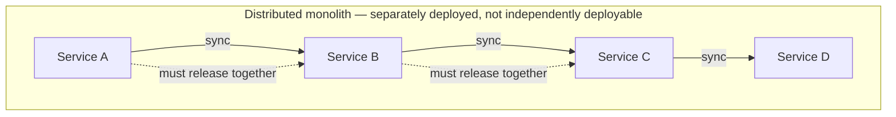
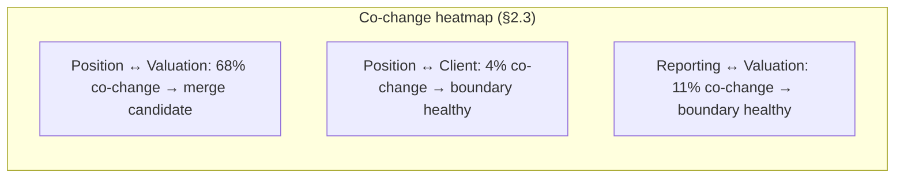
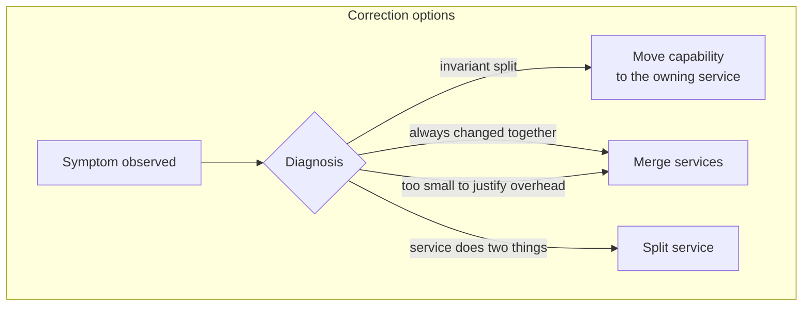
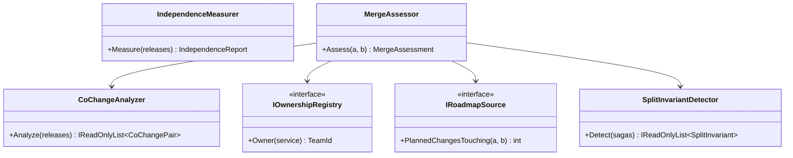

# Module 138 — Microservices: Decomposition Failures & Service Right-Sizing

> Domain: Microservices | Level: Beginner → Expert | Prerequisite: [[01-Decomposition-Communication-Strangler-Fig]] (the decomposition guidance this module examines when it goes wrong), [[04-Data-Consistency-Query-Patterns-Across-Service-Boundaries]] (§Expert Q1 there flagged persistent composition as boundary evidence — this module develops that), [[../31-Domain-Driven-Design/01-StrategicDDD-UbiquitousLanguage-BoundedContexts-ContextMapping]] (bounded contexts, the strongest available boundary heuristic)
>
> **Scope note:** Fourth of five modules extending `17-Microservices` toward its stated 8-module extra-depth scope. Full 16-section template; Elite FinTech Interview Panel lens.

---

## 1. Fundamentals

**What:** How to recognize that a decomposition is wrong, measure it rather than argue about it, and correct it — including the option most estates never seriously consider, which is **merging services back together**.

**Why:** Module 49 covered how to decompose. It did not cover what to do when you have decomposed badly, which is the more common situation — teams rarely get boundaries right the first time, because the information needed to place them correctly (which things change together, which are queried together) only becomes available after the system has run for a while. An estate that cannot correct its boundaries accumulates the cost of every early mistake permanently.

**When:** Continuously. Boundary quality is not a design-time property that is established and then holds; it degrades as the business changes and as features are added to whichever service is most convenient rather than most correct.

**How (30,000-ft view):**
```
Symptoms → Measurement → Diagnosis → Correction
 (pain)     (coupling      (wrong        (move a capability,
            metrics)        boundary       split, or merge)
                            or wrong
                            size?)
```

---

## 2. Deep Dive

### 2.1 The Distributed Monolith — Diagnosis by Symptom
The canonical failure: services that are separately deployed but not independently deployable. Its diagnostic symptoms, in rough order of reliability:

- **Lockstep releases.** Changing service A requires simultaneously releasing B and C. This is the defining symptom — if deployments must be coordinated, the services are one system wearing several uniforms.
- **Shared release trains.** A weekly "release all services together" cadence usually indicates lockstep coupling that has been normalized into process rather than fixed.
- **Cascading test failures.** A change in one service breaks another's tests, meaning the contract between them is not actually a contract.
- **Chatty synchronous chains.** One user request touching six services synchronously indicates the work was split along a path rather than at a boundary.

The important point: the cost of a distributed monolith is strictly worse than a monolith. It has the monolith's coupling *and* the distributed system's failure modes, latency, and operational overhead — which is why it is worth diagnosing decisively rather than tolerating.

### 2.2 Nano-Services — Decomposition Past the Point of Benefit
The opposite failure: services so small that per-service overhead exceeds the value of their independence. Symptoms: a service with one endpoint and no data of its own; a service that cannot be changed without changing its only caller; more time spent on service scaffolding, deployment, and monitoring than on the logic inside.

The underlying error is treating decomposition as intrinsically good rather than as a trade with real costs. Each service carries fixed overhead — a pipeline, a deployment, monitoring, on-call ownership, a repository, dependency updates — and below a certain size that overhead dominates whatever autonomy was gained.

### 2.3 Measuring Coupling Rather Than Debating It
Boundary arguments are usually conducted on intuition and lost by whoever is less senior. Measurement changes the conversation:

- **Co-change frequency.** From version control: how often are two services modified in the same commit or the same release? High co-change is the strongest available evidence of a wrong boundary, because it directly measures what boundaries are supposed to prevent.
- **Synchronous call depth.** How many services participate in a single user request, and how many are on the critical path.
- **Cross-service transaction count.** How many operations require a saga (Module 36); each represents an invariant split across a boundary.
- **Deployment coupling.** How often releases must be coordinated.

Co-change frequency is the most useful because it is objective, historical, and requires no instrumentation — the data already exists in the repository, which makes it available for a boundary argument today rather than after a measurement project.

### 2.4 Right-Sizing: The Team Is the Unit, Not the Domain
The most reliable sizing heuristic is organizational rather than technical: **a service should be ownable by one team**, and a team should own a small number of services. This follows from Conway's Law (Module 51 §2.6) — a boundary that does not align to team structure will be crossed constantly, and every cross-boundary change becomes a cross-team negotiation.

The corollary teams resist: if two services are always changed by the same team together, the boundary is providing no organizational benefit and is charging full technical cost. That is a merge candidate regardless of how clean the domain separation looks on a diagram.

### 2.5 Merging Services — the Under-Considered Correction
Merging is treated as failure, so it is avoided, so wrong boundaries persist. It should be a routine, unremarkable correction — and it is usually *easier* than splitting, because it removes a network boundary rather than introducing one.

The mechanics: bring both codebases into one deployable, replace remote calls with local ones, merge or co-locate the data stores, and retire the redundant infrastructure. The genuinely difficult part is the data merge if both own state, which is Module 122's problem at smaller scale. The organizational difficulty exceeds the technical one — merging reads as an admission that the original split was wrong, and needs to be framed as learning rather than as retreat.

### 2.6 Boundaries Drift Even When Initially Correct
A correct boundary does not stay correct. Features get added to whichever service is easiest to change rather than whichever should own them; a service accretes responsibilities until it is two services; the business reorganizes and Conway's Law pulls the architecture toward the new shape.

This means boundary review must be periodic rather than one-time, and it means the measurements in §2.3 are most valuable as **trends** rather than as snapshots — rising co-change between two services is the leading indicator that a boundary is eroding, and it is visible long before the pain is.

---

## 3. Visual Architecture







---

## 4. Production Example

**Problem:** A firm had decomposed its trading platform into 34 services over three years. Delivery velocity had fallen steadily despite growing headcount, and every significant feature required changes across four or five services with coordinated release.

**Architecture:** Services decomposed by technical function — a Validation Service, an Enrichment Service, a Persistence Service, a Notification Service — each cleanly separated, each with a single responsibility, each independently deployable in principle.

**Implementation:** The decomposition had been reviewed and approved by architecture governance, and each service genuinely did one thing well. On a diagram it looked exemplary.

**Trade-offs:** Functional decomposition gives clean separation of concerns and small, comprehensible services — the qualities the review had assessed.

**Lessons learned:** The decomposition had split along **processing stages** rather than business capabilities. Every business change — a new order type, a new instrument class, a new regulatory field — touched every stage, because a business capability spans validation, enrichment, persistence, and notification by nature. The services were independently deployable in the sense that each *could* be deployed alone, and never were, because no business change was confined to one.

Co-change analysis (§2.3) made it unarguable: the four services co-changed in 71% of releases. A boundary that is crossed by 71% of changes is not providing isolation; it is providing overhead.

The correction merged the four stage-services into three capability-services — Order Capture, Order Enrichment (retaining genuine external-dependency isolation), and Order Publication — organized by what changes together rather than by what happens in sequence. Co-change fell to 12%, and feature lead time roughly halved.

The generalizable lesson: **decomposing by processing stage produces services that are individually coherent and collectively useless**, because business changes propagate along the stage sequence. The review process had assessed each service's internal quality, which was genuinely high, and never asked the only question that mattered: *what does a typical change touch?*

---

## 5. Best Practices
- Measure co-change frequency from version control before arguing about boundaries (§2.3).
- Decompose by business capability, never by processing stage or technical layer (§4).
- Treat merging as a routine correction, not an admission of failure (§2.5).
- Size services so one team owns each, and question any boundary the same team crosses constantly (§2.4).
- Review boundaries periodically, tracking co-change as a trend rather than a snapshot (§2.6).
- Ask "what does a typical change touch?" in every decomposition review (§4).

## 6. Anti-patterns
- Decomposing by processing stage — validation, enrichment, persistence — so every business change crosses every boundary (§4's incident).
- Services so small that scaffolding, deployment, and monitoring exceed the logic they contain (§2.2).
- Coordinated release trains normalizing lockstep coupling into process (§2.1).
- Treating merging as failure, so wrong boundaries persist indefinitely (§2.5).
- Boundary reviews assessing each service's internal quality without asking what a change touches (§4).
- Boundaries set once at design time and never revisited as the business changes (§2.6).

---

## 7. Performance Engineering

**CPU/Memory:** Over-decomposition multiplies serialization, deserialization, and network overhead for work that was in-process — a chain of six services can spend more time on transport than on logic. Merging recovers this directly, which is a rarely-cited but real performance benefit.

**Latency:** Each synchronous hop adds its own latency plus tail-amplification (Module 136 §2.2) — a six-hop chain's P99 is dominated by whichever hop happens to be slowest on each request, so P99 degrades faster than the hop count suggests.

**Throughput:** Bounded by the slowest service in a synchronous chain, and every service must be scaled for the chain's peak even if its own work is trivial.

**Scalability:** The commonly-cited benefit — scaling services independently — is real but frequently unrealized, because services in a synchronous chain must scale together anyway. It is a genuine benefit only where load profiles genuinely differ.

**Benchmarking:** Measure the whole user-facing operation, not per-service latency. A decomposition where every service is fast and the operation is slow is the signature of excessive hops, and per-service metrics conceal it entirely.

**Caching:** Over-decomposition creates opportunities to cache that would not exist in-process — which is sometimes cited as a benefit, but caching to recover latency that decomposition introduced is recovering ground rather than gaining it.

---

## 8. Security

**Threats:** More services means more network boundaries, each requiring authentication, authorization, and encryption — so over-decomposition increases attack surface proportionally. Under-decomposition concentrates blast radius, so a compromise reaches more.

**Mitigations:** Right-sizing is itself a security decision: each boundary should justify the security machinery it requires. A boundary that exists only for architectural tidiness adds attack surface for no isolation benefit.

**OWASP mapping:** Broken Authentication risk scales with service count, since each inter-service connection is an authentication surface that must be configured correctly.

**AuthN/AuthZ:** Merging services removes an authorization boundary, so the merge must preserve any authorization that boundary enforced — a check that was implicit in "service B only accepts calls from service A" becomes an in-process concern requiring explicit implementation.

**Secrets:** Fewer services means fewer credentials to manage and rotate — a genuine operational security benefit of appropriate consolidation.

**Encryption:** Each service boundary requires transport encryption; merging removes that requirement along with the boundary.

---

## 9. Scalability

**Horizontal scaling:** Independent scaling is decomposition's headline benefit and is realized only where services have genuinely different load profiles. Two services in a synchronous chain scale together in practice, so the benefit is nominal.

**Vertical scaling:** Merged services may need larger instances, which is usually cheaper than the network and operational overhead of keeping them separate.

**Caching:** §7's note — caching to recover decomposition-introduced latency is not a net gain.

**Replication/Partitioning:** Merging services means merging data stores, which is the hard part of §2.5 and may constrain partitioning if the merged data has different natural partition keys.

**Load balancing:** Fewer services means fewer balancing configurations to maintain correctly (Module 136 §2.2's algorithm choice applies per service).

**High Availability:** Each service is a failure domain, but in a synchronous chain the availability multiplies downward (Module 135 §9) — six services at 99.9% give 99.4% for the operation. Fewer hops means better composite availability, which is a frequently-overlooked argument for consolidation.

**Disaster Recovery:** Fewer services with fewer data stores is materially simpler to recover, with fewer ordering dependencies between restores.

**CAP theorem:** Merging services can eliminate a cross-service consistency problem entirely by returning both sides of an invariant to one transaction — often the cleanest resolution to a saga that has proven troublesome (Module 36).

---

## 10. Interview Questions

### Basic (10)

1. **Q: What is the defining symptom of a distributed monolith?**
   **A:** Services that are separately deployed but not independently deployable — changing one requires releasing others simultaneously (§2.1).
   **Why correct:** Names the single most diagnostic symptom rather than a general list.
   **Common mistakes:** Citing chattiness alone, which can occur in a healthy decomposition.
   **Follow-ups:** "Why is it worse than a monolith?" (It has the monolith's coupling plus distributed failure modes, latency, and operational overhead, §2.1.)

2. **Q: What is a nano-service and what makes it a failure?**
   **A:** A service so small that per-service overhead — pipeline, deployment, monitoring, on-call, dependency management — exceeds the value of its independence (§2.2).
   **Why correct:** Defines it by the overhead-versus-benefit relationship rather than by size alone.
   **Common mistakes:** Defining it by line count, when the relevant measure is overhead relative to value.
   **Follow-ups:** "What is the underlying error?" (Treating decomposition as intrinsically good rather than as a trade with real fixed costs, §2.2.)

3. **Q: What is co-change frequency and why is it the most useful coupling metric?**
   **A:** How often two services are modified in the same commit or release — most useful because it directly measures what boundaries exist to prevent, is objective, and requires no instrumentation since the data is already in version control (§2.3).
   **Why correct:** States the measure and all three reasons it is preferable.
   **Common mistakes:** Preferring runtime call metrics, which measure chattiness rather than change coupling.
   **Follow-ups:** "Why does no instrumentation matter?" (The data exists today, so it can settle a boundary argument now rather than after a measurement project, §2.3.)

4. **Q: What is the most reliable service-sizing heuristic?**
   **A:** Organizational — a service should be ownable by one team, and a team should own few services, following from Conway's Law (§2.4).
   **Why correct:** States the heuristic and its basis.
   **Common mistakes:** Sizing by lines of code or by domain-model purity, neither of which predicts whether the boundary will be crossed constantly.
   **Follow-ups:** "What is the corollary teams resist?" (If two services are always changed together by one team, the boundary gives no organizational benefit at full technical cost — a merge candidate, §2.4.)

5. **Q: Why is merging services under-considered?**
   **A:** It reads as an admission the original split was wrong, so it is avoided and wrong boundaries persist — despite usually being easier than splitting, since it removes a network boundary rather than introducing one (§2.5).
   **Why correct:** Names the organizational obstacle and the technical asymmetry.
   **Common mistakes:** Assuming merging is technically harder than splitting; the difficulty is organizational.
   **Follow-ups:** "What is the genuinely hard part?" (Merging the data stores if both own state — Module 122's problem at smaller scale, §2.5.)

6. **Q: What went wrong in §4's decomposition?**
   **A:** Services were split by processing stage — validation, enrichment, persistence, notification — so every business change touched every stage, producing 71% co-change and lockstep releases despite each service being individually well-built (§4).
   **Why correct:** States the axis of decomposition and its consequence.
   **Common mistakes:** Attributing it to poor service quality, which was high.
   **Follow-ups:** "What question would have caught it at review?" ("What does a typical change touch?" — the question the review never asked, §4.)

7. **Q: Why do boundaries drift even when initially correct?**
   **A:** Features get added to whichever service is easiest rather than most correct; services accrete responsibilities; and business reorganization pulls the architecture toward a new shape via Conway's Law (§2.6).
   **Why correct:** Names three distinct drift mechanisms.
   **Common mistakes:** Treating boundary quality as a design-time property that persists.
   **Follow-ups:** "What follows for review cadence?" (Periodic review with co-change tracked as a trend, since rising co-change precedes the pain, §2.6.)

8. **Q: Why does independent scaling often go unrealized?**
   **A:** Services in a synchronous chain must scale together regardless of their individual load profiles, so the benefit is genuine only where profiles actually differ (§9).
   **Why correct:** Identifies the condition under which the headline benefit is nominal.
   **Common mistakes:** Citing independent scaling as an automatic benefit of decomposition.
   **Follow-ups:** "Where is it genuinely realized?" (Where load profiles genuinely differ — a read-heavy service beside a write-heavy one, §9.)

9. **Q: How does hop count affect composite availability?**
   **A:** Multiplicatively — six services at 99.9% give roughly 99.4% for an operation spanning all of them, so fewer hops means better composite availability (§9).
   **Why correct:** States the relationship and its direction.
   **Common mistakes:** Assuming per-service availability targets translate to operation availability.
   **Follow-ups:** "Why is this an argument for consolidation?" (Removing a hop improves availability without any reliability work, §9.)

10. **Q: How can merging services resolve a troublesome saga?**
    **A:** It returns both sides of an invariant into one transaction, eliminating the cross-service consistency problem rather than managing it (§9).
    **Why correct:** Identifies merging as a resolution to distributed-consistency difficulty, not merely an organizational change.
    **Common mistakes:** Treating a difficult saga as requiring better saga engineering rather than as boundary evidence.
    **Follow-ups:** "When is that the right response?" (When the invariant genuinely belongs together — a saga is evidence the boundary split something cohesive, Module 36.)

### Intermediate (10)

1. **Q: Walk through why §4's decomposition passed architecture review.**
   **A:** The review assessed each service against sound criteria — single responsibility, clean interfaces, comprehensible size — and each service genuinely met them. Every criterion was about a service in isolation. None asked what a typical change touches, which is a property of the decomposition rather than of any service, so the review examined the parts and never evaluated the whole.
   **Why correct:** Identifies that the criteria were individually valid and collectively insufficient because they were per-service.
   **Common mistakes:** Concluding the reviewers were careless, when the review process itself lacked the necessary question.
   **Follow-ups:** "What should a decomposition review assess?" (Properties of the decomposition — change locality, co-change, cross-boundary invariants — not per-service quality, §4.)

2. **Q: Design the co-change analysis concretely.**
   **A:** From version-control history, for each pair of services, compute the fraction of releases (or commits, if release granularity is coarse) touching both. Rank pairs descending. High co-change with high absolute change volume is the strongest merge signal; high co-change with few changes may be an infrequently-exercised coupling not worth acting on. Track the trend, since a rising pair is a boundary eroding (§2.6).
   **Why correct:** Specifies the computation, the ranking, the volume caveat, and the trend use.
   **Common mistakes:** Reporting co-change percentage without change volume, so a pair with two co-changing releases ranks alongside one with two hundred.
   **Follow-ups:** "What co-change level indicates a problem?" (No universal threshold — but a pair above roughly 50% is providing little isolation, and §4's 71% was unarguable.)

3. **Q: Why is decomposing by technical layer or processing stage a reliable mistake?**
   **A:** Business changes are expressed in business capabilities, and a capability spans every stage by nature — so a stage-based decomposition guarantees that every change crosses every boundary. The decomposition is orthogonal to the axis along which change actually arrives (§4).
   **Why correct:** Identifies the orthogonality between the decomposition axis and the change axis.
   **Common mistakes:** Viewing stage decomposition as merely suboptimal rather than as structurally guaranteeing maximal co-change.
   **Follow-ups:** "What is the correct axis?" (Business capability — what changes together — which is Module 31's bounded-context reasoning, §4.)

4. **Q: How would you make merging organizationally acceptable?**
   **A:** Frame it as acting on evidence rather than reversing a decision — the original split was made with the information available then, and co-change data available now shows the boundary is not earning its cost. Presenting the measurement first makes it a data-driven correction rather than a judgment on the original decision, which is both more accurate and more palatable (§2.5).
   **Why correct:** Addresses the organizational obstacle with an accurate framing rather than a rhetorical one.
   **Common mistakes:** Presenting the merge as fixing a mistake, which invites defensiveness and slows the correction.
   **Follow-ups:** "Why is the framing accurate rather than merely diplomatic?" (Boundary information genuinely is unavailable at design time — it emerges from observing what changes together, §1.)

5. **Q: What is the risk of merging services that are owned by different teams?**
   **A:** The merged service needs one owner, so the merge is also an organizational change — and if ownership is not resolved, the service becomes jointly-owned, which typically means poorly-owned. Conway's Law applies in both directions: merging the code without merging the ownership produces a service whose boundary runs through the middle of it (§2.4).
   **Why correct:** Identifies that the merge is organizational as well as technical and names the failure of not resolving it.
   **Common mistakes:** Treating the merge as purely a code change, leaving ownership ambiguous.
   **Follow-ups:** "What if ownership cannot be consolidated?" (Then the boundary may be organizationally real even if technically inefficient — Conway's Law arguing to keep the split, §2.4.)

6. **Q: Why measure the whole operation rather than per-service latency?**
   **A:** A decomposition where every service is individually fast and the user-facing operation is slow is the signature of excessive hops — and per-service metrics conceal this entirely, since each service is meeting its target (§7).
   **Why correct:** Identifies the specific blind spot in per-service measurement.
   **Common mistakes:** Per-service SLOs with no operation-level view, so hop proliferation is invisible.
   **Follow-ups:** "What metric captures it?" (End-to-end operation latency plus hop count, so growth in either is visible as it happens.)

7. **Q: How does over-decomposition affect security posture?**
   **A:** Each boundary requires authentication, authorization, and transport encryption, so attack surface scales with service count — meaning a boundary that exists only for tidiness adds security surface for no isolation benefit. Right-sizing is therefore partly a security decision (§8).
   **Why correct:** Frames boundary count as a security cost, not only an operational one.
   **Common mistakes:** Treating security as orthogonal to decomposition granularity.
   **Follow-ups:** "What must a merge preserve?" (Any authorization the removed boundary enforced implicitly — "only A may call B" becomes an in-process concern needing explicit implementation, §8.)

8. **Q: Why is co-change a better signal than runtime call volume?**
   **A:** Call volume measures chattiness, which a healthy decomposition can exhibit; co-change measures whether the boundary is actually isolating change, which is what boundaries are for. Two services can call each other constantly and still change independently — that is a fine boundary — whereas two that change together are coupled regardless of call volume (§2.3).
   **Why correct:** Distinguishes the two couplings and identifies which the boundary is meant to address.
   **Common mistakes:** Using call graphs as coupling evidence, which conflates runtime interaction with change coupling.
   **Follow-ups:** "When does call volume matter?" (For latency and availability composition (§9), which is a different concern from boundary correctness.)

9. **Q: How should a service that has grown to do two things be handled?**
   **A:** Split — but only if the two things genuinely change independently, which co-change analysis within the service (by module or directory) can indicate before the split rather than after. The failure mode is splitting because the service feels large, then discovering the two halves co-change at 60% and having created §4's problem deliberately.
   **Why correct:** Conditions the split on measured independence and names the failure of splitting on size alone.
   **Common mistakes:** Splitting by size or by domain-model tidiness without checking whether the halves change independently.
   **Follow-ups:** "How do you measure co-change within a service?" (The same version-control analysis at directory or module granularity — which is available before the split is made.)

10. **Q: Synthesize what this module implies about Module 49's decomposition guidance.**
    **A:** Module 49's guidance — decompose by business capability, database per service, Strangler Fig — is correct and insufficient, because it addresses the initial decomposition and the information needed to do it well is not available until afterward. This module supplies the missing half: measurement to detect wrong boundaries, and correction including merging. Decomposition is therefore better understood as an iterative process with a feedback loop than as a design activity with a correct answer.
    **Why correct:** Positions the two modules as halves of one process rather than as separate topics.
    **Common mistakes:** Treating decomposition as a design decision to get right upfront, which the information availability makes impossible.
    **Follow-ups:** "What does that imply for early-stage systems?" (Favour fewer, larger services initially, since merging is easier than splitting and boundary information improves with time — Expert Q1.)

### Advanced (10)

1. **Q: Diagnose §4's failure and design the complete correction.**
   **A:** Root cause: decomposition along processing stages, orthogonal to the axis along which business change arrives, guaranteeing maximal co-change; compounded by a review process assessing per-service quality rather than decomposition properties (Intermediate Q1). Correction: (1) co-change analysis to establish the boundary problem objectively rather than by argument (Intermediate Q2); (2) re-decompose by business capability, merging stage-services into capability-services while retaining boundaries where genuine isolation exists (the enrichment service's external dependencies justified keeping it separate); (3) add "what does a typical change touch?" to decomposition review as a required question; (4) track co-change as a standing trend so the next erosion is visible early (§2.6).
   **Why correct:** Addresses the axis error, the review gap, and the ongoing detection, and notes that not every boundary was wrong.
   **Common mistakes:** Merging everything, losing the enrichment boundary that was genuinely earning its cost.
   **Follow-ups:** "Why keep the enrichment service separate?" (It isolated external dependencies with genuinely different failure and change characteristics — a boundary with a real basis.)

2. **Q: A team proposes splitting a large service because it is "too big to understand." Evaluate.**
   **A:** Comprehensibility is a real concern but is not necessarily a decomposition problem — it may be a modularity problem solvable in-process at a fraction of the cost. Check co-change within the service first (Intermediate Q9): if the candidate halves change together, splitting produces two services that must be released together, which is strictly worse than one large one. Internal modularity, clear module boundaries, and ownership within the codebase address comprehensibility without adding a network boundary.
   **Why correct:** Separates the comprehensibility concern from the decomposition remedy and gives the check that discriminates.
   **Common mistakes:** Splitting for comprehensibility, creating a distributed monolith to solve a code-organization problem.
   **Follow-ups:** "When is size genuinely a decomposition signal?" (When the parts change independently *and* different teams want to own them — both conditions, not either.)

3. **Q: Critique the position that a well-designed system should never need to merge services.**
   **A:** It assumes boundary information is available at design time, which it is not — the data that reveals a correct boundary (what changes together, what is queried together) accumulates only from running the system. Treating merges as evidence of failure therefore penalizes exactly the learning that improves boundaries, and produces estates where every early mistake is permanent. A system that has never merged a service has either been extraordinarily lucky or is not correcting.
   **Why correct:** Identifies the false premise and the perverse incentive it creates.
   **Common mistakes:** Accepting the position as a standard of design quality, which entrenches early errors.
   **Follow-ups:** "What is a healthy rate of boundary change?" (Not a target number, but boundary adjustments should be routine and unremarkable rather than exceptional events requiring justification.)

4. **Q: Design the decomposition review that would have caught §4.**
   **A:** Assess properties of the decomposition rather than of services: for a representative sample of recent and anticipated changes, trace which services each touches — if most touch several, the boundary is wrong regardless of per-service quality. Add cross-boundary invariant count (each is a saga, Module 36) and projected co-change. The essential shift is from "is each service well-designed" to "does this decomposition localize change," which is the only question that predicts §4's outcome.
   **Why correct:** Specifies decomposition-level criteria and names the shift in question.
   **Common mistakes:** Adding more per-service criteria, which cannot detect a decomposition-level failure.
   **Follow-ups:** "Where do anticipated changes come from?" (The product roadmap — reviewing a decomposition against planned work is more informative than reviewing it abstractly.)

5. **Q: How would you execute a merge of two services that each own data?**
   **A:** Bring the code together first with both data stores intact and remote calls replaced by in-process calls to the co-located components — this delivers most of the latency and availability benefit at low risk. Then merge the data stores as a separate, subsequent step using Module 122's discipline (parallel run, reconciliation, scenario coverage). Sequencing these separately means the code merge can be validated before the harder data merge begins, and the data merge can be abandoned without reverting the code merge.
   **Why correct:** Sequences to deliver benefit early and isolate the risky step, and identifies the independence of the two changes.
   **Common mistakes:** Merging code and data simultaneously, which combines the risky change with the safe one and makes attribution of any problem ambiguous.
   **Follow-ups:** "Is the data merge always necessary?" (No — co-located stores in one deployable already remove the network boundary; merging schemas is an optimization that may not be worth the risk.)

6. **Q: A regulator or auditor asks why the firm changed its service architecture. Answer.**
   **A:** Present it as evidence-based correction: the original decomposition was reasonable given information available at design time; operational data (co-change, release coordination, lead time) subsequently showed specific boundaries were not delivering the isolation they were intended to; the correction was measured, staged, and verified. This framing is both accurate and demonstrates a control environment that observes and corrects — which is what is actually being assessed.
   **Why correct:** Frames it as a functioning feedback loop rather than as remediation of an error.
   **Common mistakes:** Describing it as fixing a design mistake, which invites questions about design governance rather than demonstrating it working.
   **Follow-ups:** "What artifact best supports this?" (The co-change trend before and after, which shows both the evidence for the change and its effect.)

7. **Q: Apply this course's "declared ≠ actual" theme to decomposition.**
   **A:** The claim is "these services are independently deployable." Its declared basis is the architecture — separate repositories, separate pipelines, separate deployments, all genuinely present. §4's gap: independently deployable *in principle* and never deployed independently *in practice*, because no business change was confined to one service. The distinguishing feature is that the capability existed and was simply never exercisable — which no inspection of the architecture reveals, because the architecture is correct. Only deployment history shows it.
   **Why correct:** Identifies the capability-versus-exercise gap and that only historical data reveals it.
   **Common mistakes:** Verifying independent deployability by checking that each service *can* deploy alone, which was true throughout.
   **Follow-ups:** "What is the verifying measurement?" (The fraction of releases deploying exactly one service — if it is near zero, independence is theoretical.)

8. **Q: Design the standing metrics for boundary health.**
   **A:** Co-change matrix with trend (§2.3); fraction of releases deploying a single service (Advanced Q7's verifier); cross-service saga count; and end-to-end operation hop count. Report as trends, since each is meaningful in direction more than in level — rising co-change and falling single-service-release fraction together are the erosion signature, and they appear well before delivery velocity visibly suffers.
   **Why correct:** Selects metrics that measure boundary function and identifies trend over level as the useful reading.
   **Common mistakes:** Counting services, which measures decomposition extent rather than quality.
   **Follow-ups:** "Which pair is the earliest signal?" (Rising co-change with falling single-service releases — both move before lead time does.)

9. **Q: How should an estate decide between correcting boundaries and living with them?**
   **A:** Compare the ongoing cost — measured as coordination overhead, lead-time impact, and cross-boundary invariant management — against the one-time correction cost. A boundary with high co-change but low absolute change volume may not be worth correcting (Intermediate Q2's volume caveat), while one with moderate co-change on a high-traffic path may be. The decision is economic and should be made with the measurements, not on architectural principle.
   **Why correct:** Frames it as an economic comparison and identifies volume as the discriminator.
   **Common mistakes:** Correcting every imperfect boundary, which consumes capacity that delivers no user value.
   **Follow-ups:** "What tips the balance toward correcting?" (When the boundary is on the path of most upcoming roadmap work — future change volume matters more than historical.)

10. **Q: Synthesize the governance for boundary management.**
    **A:** (1) Decomposition reviews assessing change locality rather than per-service quality (Advanced Q4). (2) Standing co-change and single-service-release metrics reported as trends (Advanced Q8). (3) Merging established as routine, with a template and precedent so it is not exceptional (§2.5, Advanced Q3). (4) Periodic boundary review on a cadence, not only when pain is felt (§2.6). (5) Economic criteria for whether to correct, using change volume rather than principle (Advanced Q9). (6) Ownership resolved as part of any merge (Intermediate Q5).
    **Why correct:** Covers detection, correction, cadence, and the organizational element merges require.
    **Common mistakes:** Governing initial decomposition without governing correction, which is where most of the value is.
    **Follow-ups:** "Which is hardest to establish?" (Making merges routine — the technical work is straightforward, and the organizational precedent is what actually unblocks it.)

### Expert (10)

1. **Q: How should a new system be decomposed given that boundary information is unavailable at design time?**
   **A:** Start with fewer, larger services — ideally a modular monolith (Module 30) with clear internal boundaries — and extract services when a specific, demonstrated need appears: a component with genuinely different scaling characteristics, a team that needs independent deployment, or a component with a materially different failure profile. This sequencing exploits the asymmetry that extracting from a well-modularized monolith is straightforward while merging distributed services is organizationally hard (§2.5, Intermediate Q10).
   **Why correct:** Derives the strategy from the information-availability problem and the extraction/merge asymmetry.
   **Common mistakes:** Decomposing extensively upfront, encoding boundary guesses made with the least information available.
   **Follow-ups:** "What makes the modular monolith work?" (Internal boundaries enforced by tooling — Module 113's fitness functions applied to module dependencies — so extraction is mechanical rather than archaeological.)

2. **Q: When is a distributed monolith the *correct* interim state?**
   **A:** During a Strangler Fig migration (Module 49 §2.5), where extracted services necessarily remain coupled to the remaining monolith until extraction completes. The distinction that matters is whether it is a transitional state with a plan and an end date, or a terminal state nobody has recognized. §4's estate was the latter, and had been for three years — the diagnostic question is not "are these coupled" but "is anyone working to decouple them, with a target."
   **Why correct:** Identifies the legitimate case and the question that distinguishes it from the failure.
   **Common mistakes:** Treating any coupling as failure, which condemns every in-progress migration.
   **Follow-ups:** "How long is too long?" (When the migration has no active workstream — coupling without a decoupling plan is terminal regardless of elapsed time.)

3. **Q: How does service granularity interact with Module 137's cell architecture?**
   **A:** Cells contain complete stacks, so more services means more per-cell overhead — a 34-service estate multiplied across 8 cells is 272 service deployments. Over-decomposition therefore compounds with cell count, and consolidation delivers savings multiplied by cells. This is a rarely-cited but significant argument for right-sizing in cell-based estates: the cost of an unnecessary service is paid once per cell.
   **Why correct:** Identifies the multiplicative interaction and its implication.
   **Common mistakes:** Evaluating service count independently of deployment topology.
   **Follow-ups:** "Does this argue against cells or against over-decomposition?" (Against over-decomposition — cells are justified by impact containment, and the multiplication is a reason to be disciplined about service count, not to abandon containment.)

4. **Q: Evaluate the claim that services should be small enough to rewrite in two weeks.**
   **A:** A memorable heuristic with a weak basis: rewritability is not a property anyone needs, and optimizing for it produces nano-services (§2.2) whose overhead exceeds their value. The useful properties are change locality and team ownership (§2.4), and a service satisfying those may be far larger than two weeks' rewriting. The heuristic persists because it is concrete and measurable, which are not the same as correct.
   **Why correct:** Identifies that the heuristic optimizes for an irrelevant property and why it nonetheless persists.
   **Common mistakes:** Adopting memorable heuristics because they are actionable, without checking what they optimize.
   **Follow-ups:** "What is a better concrete heuristic?" (One team owns it, and a typical change touches it alone — both observable, both predictive, §2.4.)

5. **Q: A team wants to extract a service to enable independent scaling. How would you validate the case?**
   **A:** Verify the load profiles genuinely differ (§9) — if both components scale with the same driver, extraction gives nothing and adds a hop. Then check whether in-process resource isolation (separate thread pools, bounded concurrency per component) achieves the goal at a fraction of the cost, which it frequently does. Extraction for scaling is justified when the profiles differ *and* in-process isolation is insufficient, which is a narrower case than usually assumed.
   **Why correct:** Requires two conditions and identifies the cheaper alternative usually skipped.
   **Common mistakes:** Extracting for scaling without checking whether profiles differ or whether in-process isolation suffices.
   **Follow-ups:** "When is in-process isolation insufficient?" (When the components need genuinely different instance types or different scaling latencies — a real but uncommon situation.)

6. **Q: How does organizational change drive boundary change, and how should architecture respond?**
   **A:** Conway's Law operates continuously — a reorganization that splits a team owning one service, or merges teams owning two, creates pressure toward matching architectural change. Resisting produces boundaries that are constantly crossed organizationally, which is the coupling §2.4 warns about. The response is to treat significant reorganizations as triggering a boundary review, rather than as unrelated to architecture, and to expect that some boundaries will need to move.
   **Why correct:** Identifies the continuous operation of Conway's Law and the appropriate architectural response.
   **Common mistakes:** Treating architecture as independent of organization, then wondering why boundaries feel wrong after a reorganization.
   **Follow-ups:** "Should architecture ever resist an organizational change?" (Sometimes — the Inverse Conway Maneuver deliberately organizes teams to produce a desired architecture, but this requires the architecture to be genuinely more important than the organizational rationale.)

7. **Q: Evaluate whether a monolith is ever the correct target state for a firm at this scale.**
   **A:** A modular monolith is correct more often than the industry's discourse suggests, and specifically for teams below roughly the size where independent deployment cadence becomes the binding constraint. Decomposition buys team autonomy; a firm with three teams does not have an autonomy problem that justifies distributed-system costs. The honest position is that microservices solve an *organizational* scaling problem, and applying them to a system that has a technical scaling problem but no organizational one is a category error (Module 135 §Expert Q10).
   **Why correct:** Identifies the organizational nature of the problem microservices solve and names the category error.
   **Common mistakes:** Treating decomposition as a technical maturity milestone.
   **Follow-ups:** "What if the monolith has a genuine scaling bottleneck?" (Extract that specific component — Expert Q1's targeted extraction — rather than decomposing wholesale.)

8. **Q: How should boundary decisions be documented so future teams understand them?**
   **A:** An ADR (Module 106) per significant boundary recording *why* the split exists — which specific isolation it provides, what change locality it was expected to deliver — so a future team can evaluate whether the rationale still holds. Without it, boundaries become facts of nature that nobody questions, which is how §4's estate persisted three years. The record should include the expectation, so it can be tested against reality later.
   **Why correct:** Specifies recording the rationale and expectation, and identifies what their absence causes.
   **Common mistakes:** Documenting what the boundaries are rather than why, leaving no basis for later evaluation.
   **Follow-ups:** "What makes recording the expectation valuable?" (It converts a later review from opinion into a comparison — did this boundary deliver the isolation it was expected to, measured by co-change.)

9. **Q: A firm has 200 services and cannot articulate what most of them do. What is the intervention?**
   **A:** Start with measurement rather than redesign: catalogue services with ownership, change frequency, and call volume, and identify those with no owner, no changes in a year, or no traffic — these are candidates for retirement, and retirement is cheaper than any redesign. Then apply co-change analysis to the actively-changing remainder to find merge candidates. The sequence matters: retiring dead services and merging obvious pairs delivers most of the benefit before any hard architectural decisions are needed.
   **Why correct:** Sequences from cheapest, highest-certainty actions to harder ones.
   **Common mistakes:** Beginning with a target architecture, which requires decisions the team lacks information to make.
   **Follow-ups:** "What does a service with no traffic and no owner indicate?" (Usually that it was replaced and never decommissioned — Module 107's "old systems never die," at service granularity.)

10. **Q: Deliver the closing synthesis: what does this module say about decomposition as a practice?**
    **A:** That it is **iterative rather than architectural** — a feedback loop, not a design decision. The information required to place a boundary correctly (what changes together, what is queried together, which team will own it) becomes available only by running the system, so first attempts are necessarily guesses, and an estate's quality depends far more on its ability to *correct* boundaries than on getting them right initially. §4 is the illustration: a decomposition that passed every per-service quality bar was structurally wrong on the only dimension that mattered, and persisted three years because merging was culturally unavailable and nobody measured what changes touched. The Principal-level conclusion is that the valuable investment is not in better upfront decomposition but in the measurement and the organizational permission that make correction routine — and that a team which has never merged a service is not demonstrating good design, but the absence of a feedback loop.
    **Why correct:** Names decomposition as iterative, explains why from information availability, and inverts the usual reading of a merge-free history.
    **Common mistakes:** Investing in more elaborate upfront decomposition analysis, which cannot access the information it needs.
    **Follow-ups:** "What is the single highest-leverage practice?" (Co-change measurement — it is free, available today, and converts boundary debate into evidence, §2.3.)

---

## 11. Coding Exercises

### Easy — Co-Change Analysis from Version Control (§2.3)
**Problem:** Compute pairwise co-change frequency between services.
**Solution:**
```csharp
public IReadOnlyList<CoChangePair> Analyze(IReadOnlyList<Release> releases)
{
    var pairCounts = new Dictionary<(string, string), int>();
    var serviceCounts = new Dictionary<string, int>();

    foreach (var release in releases)
    {
        foreach (var s in release.Services) serviceCounts.Increment(s);
        foreach (var (a, b) in release.Services.OrderBy(s => s).Pairs())
            pairCounts.Increment((a, b));
    }

    return pairCounts
        .Select(kv => new CoChangePair(
            kv.Key.Item1, kv.Key.Item2,
            Frequency: (double)kv.Value / Math.Min(serviceCounts[kv.Key.Item1], serviceCounts[kv.Key.Item2]),
            AbsoluteCount: kv.Value))                  // volume matters (Intermediate Q2)
        .OrderByDescending(p => p.Frequency * Math.Log(p.AbsoluteCount + 1))
        .ToList();
}
```
**Time complexity:** O(r × s²) for r releases with s services each — trivial at realistic service counts.
**Space complexity:** O(p) for p distinct pairs.
**Optimized solution:** Compute over a rolling window and emit the trend, since a rising pair is the erosion signal (§2.6) and a static snapshot cannot show it.

### Medium — Single-Service Release Fraction (Advanced Q7)
**Problem:** Measure whether independent deployability is exercised, not merely possible.
**Solution:**
```csharp
public IndependenceReport Measure(IReadOnlyList<Release> releases)
{
    var single = releases.Count(r => r.Services.Count == 1);
    var fraction = (double)single / releases.Count;

    return new IndependenceReport(
        SingleServiceFraction: fraction,
        Verdict: fraction switch
        {
            < 0.2 => "Theoretical — services deploy together in practice",
            < 0.6 => "Partial — some boundaries exercised",
            _     => "Genuine — independence routinely used"
        });
}
```
**Time complexity:** O(r).
**Space complexity:** O(1).
**Optimized solution:** Break down by service, since an estate-wide fraction hides that some boundaries are genuine and others are theoretical — the per-service view identifies which specific boundaries are not earning their cost.

### Hard — Cross-Boundary Invariant Detection (§2.3)
**Problem:** Count invariants split across services, each of which is a saga.
**Solution:**
```csharp
public IReadOnlyList<SplitInvariant> Detect(IReadOnlyList<SagaDefinition> sagas)
{
    return sagas
        .Where(s => s.Steps.Select(x => x.OwningService).Distinct().Count() > 1)
        .Select(s => new SplitInvariant(
            Name: s.Name,
            Services: s.Steps.Select(x => x.OwningService).Distinct().ToList(),
            CompensationCount: s.Steps.Count(x => x.HasCompensation),
            Severity: s.Steps.Count(x => x.HasCompensation) > 2
                ? Severity.High     // many compensations = invariant badly split
                : Severity.Moderate))
        .OrderByDescending(i => i.Severity)
        .ToList();
}
```
**Time complexity:** O(n × k) for n sagas of k steps.
**Space complexity:** O(n).
**Optimized solution:** Correlate with co-change — a saga spanning services that also co-change heavily is strong combined evidence the boundary split something cohesive, and the two signals together are more convincing than either alone.

### Expert — Merge Feasibility Assessment (Advanced Q5, Q9)
**Problem:** Assess whether two services should merge, economically rather than on principle.
**Solution:**
```csharp
public MergeAssessment Assess(ServiceId a, ServiceId b)
{
    var coChange   = _analysis.CoChangeFrequency(a, b);
    var volume     = _analysis.CombinedChangeVolume(a, b);
    var sameTeam   = _ownership.Owner(a) == _ownership.Owner(b);
    var sharedSagas= _sagas.SpanningBoth(a, b).Count;
    var roadmap    = _roadmap.PlannedChangesTouching(a, b);      // future volume matters more

    var benefit = coChange * (volume + roadmap * 2) + sharedSagas * _sagaCostWeight;
    var cost    = _dataMergeComplexity.Estimate(a, b) + (sameTeam ? 0 : _orgChangeCost);

    return new MergeAssessment(a, b, benefit, cost,
        Recommendation: benefit > cost * _threshold ? "Merge" : "Retain",
        Rationale: sameTeam
            ? "Same owner — no organizational change required"
            : "Requires ownership consolidation (Intermediate Q5)");
}
```
**Time complexity:** O(1) given precomputed analyses.
**Space complexity:** O(1).
**Optimized solution:** Weight roadmap volume above historical, since the decision is about future cost — a boundary that was expensive historically but sits outside upcoming work is lower priority than one on the roadmap's critical path (Advanced Q9).

---

## 12. System Design

**Functional requirements**
- Detect boundary problems objectively rather than by argument (§2.3).
- Support both splitting and merging as routine corrections (§2.5).
- Track boundary health continuously rather than at review points (§2.6).
- Assess corrections economically, using change volume and roadmap (Advanced Q9).

**Non-functional requirements**
- Measurement requires no instrumentation — version-control data only (§2.3).
- Corrections are staged so benefit is delivered before the risky data step (Advanced Q5).
- Boundary rationale is recorded so future teams can evaluate it (Expert Q8).

**Capacity estimation**
- Estate: 34 services pre-correction, 3 teams, ~40 releases/month.
- Co-change analysis: 34 services → 561 pairs, computed over 12 months of releases — seconds of compute, which is the point (§2.3's no-instrumentation property).
- Post-correction: 19 services, single-service release fraction from 8% to 54%.
- **The sensitivity that matters:** team count, not service count. Three teams owning 34 services means every team owns ~11, so most changes cross service boundaries within one team — which is §2.4's signal that the boundaries provide no organizational benefit at full technical cost.

**Architecture:** §3's correction flow — symptom, measurement, diagnosis, correction — operating continuously rather than as a project.

**Components:** Co-change analyzer (§11 Easy); independence measurer (§11 Medium); split-invariant detector (§11 Hard); merge-feasibility assessor (§11 Expert); boundary ADR record (Expert Q8).

**Database selection:** Version-control history is the primary data source; a small store for computed trends so direction is visible without recomputation.

**Caching:** Analyses are cheap enough to recompute; caching serves dashboard responsiveness only.

**Messaging:** None required — this is an analytical capability, not a runtime one.

**Scaling:** Analysis scales quadratically with service count, which is irrelevant below several hundred services.

**Failure handling:** Not applicable in the runtime sense; the failure mode is the analysis not being run or not being acted upon.

**Monitoring:** Co-change trend, single-service release fraction, split-invariant count, end-to-end hop count — all as trends (Advanced Q8).

**Trade-offs:** The measurement is cheap and the corrections are expensive, so the discipline is acting on measurement selectively (Advanced Q9) rather than correcting every imperfect boundary.

---

## 13. Low-Level Design

**Requirements:** Analysis uses existing data; recommendations are economic rather than principled; corrections are stageable.

**Class diagram:**


**Sequence diagram:** §3's correction-options flow.

**Design patterns used:** Strategy (correction options — move, merge, split — selected by diagnosis); Specification (merge feasibility criteria); Strangler Fig (Module 107, for staged correction).

**SOLID mapping:** Single Responsibility (each analyzer computes one signal); Open/Closed (a new coupling signal adds an analyzer without changing the assessor's structure); Interface Segregation (ownership and roadmap sources separate, since analysis works without roadmap data); Dependency Inversion (the assessor depends on source interfaces, allowing different version-control and planning systems).

**Extensibility:** New coupling signals join the assessment as additional weighted inputs.

**Concurrency/thread safety:** Analytical and batch — no runtime concurrency concerns.

---

## 14. Production Debugging

**Incident:** Eighteen months after §4's correction, lead time began rising again for changes touching Order Capture. Co-change with Order Publication had risen from 12% to 44%, though no boundary change had been made.

**Root cause:** A regulatory change had introduced a new requirement — real-time transaction reporting (Module 133) — whose logic needed both the captured order and its publication outcome. Rather than creating a new capability or reconsidering the boundary, the implementing team had added the reporting logic to Order Capture and had it call Order Publication synchronously to obtain the outcome, then react to it.

This introduced a new invariant spanning the two services and a synchronous dependency in the reverse direction of the original flow. Neither service had changed its stated responsibility; the coupling arrived through a *third* concern being placed in one of them.

**Investigation:** The co-change trend flagged it (§2.6, Advanced Q8), which prompted examining what had changed. Reviewing commits in the rising period showed both services modified together for reporting work specifically. The reporting logic was in Order Capture, whose ADR (Expert Q8) recorded its responsibility as capture — so the drift was visible against the recorded intent rather than against opinion.

**Tools:** Co-change trend (which surfaced it before lead time visibly degraded); commit-level analysis of the rising period; the boundary ADR as the reference for what should be where.

**Fix:** Extracted transaction reporting into its own capability consuming events from both services asynchronously, removing the synchronous reverse dependency and the shared invariant.

**Prevention:** (1) Co-change trend alerting on any pair rising materially over a quarter, since the signal appeared months before delivery pain and nobody was watching it. (2) A review question for new cross-cutting requirements — "which capability owns this?" — because the drift came from placing a new concern in an existing service rather than from either service changing. (3) Boundary ADRs (Expert Q8) now record what a service does *not* own, which made this drift assessable against a written intent rather than against recollection.

---

## 15. Architecture Decision

**Context:** How to correct §4's stage-based decomposition — the decision determining whether the correction delivers value or repeats the error.

**Option A — Merge everything into one service:**
*Advantages:* Eliminates all cross-boundary coordination; simplest possible operation; maximum change locality.
*Disadvantages:* Loses the enrichment boundary that was genuinely earning its cost (isolating external dependencies with different failure and change characteristics); over-corrects from one wrong extreme toward another; a single service owned by three teams reintroduces Conway's Law problems (§2.4).
*Cost:* Lowest operationally. *Risk:* Loses genuine isolation and creates ownership ambiguity.

**Option B — Re-decompose by business capability, retaining boundaries with demonstrated value (recommended):**
*Advantages:* Change locality restored where it was absent; boundaries retained where they genuinely isolate; each resulting service ownable by one team.
*Disadvantages:* Requires judgment per boundary rather than a uniform rule; the data merge for combined services carries Module 122's risks; a multi-month correction.
*Cost:* Moderate one-time. *Risk:* Moderate, managed by staging (Advanced Q5).

**Option C — Retain the decomposition and reduce coordination cost through tooling:**
*Advantages:* No architectural change; investment in release automation and contract testing has independent value.
*Disadvantages:* Treats the symptom — coordination is expensive because the boundaries are wrong, and better tooling makes the wrong thing cheaper rather than removing it. The 71% co-change is unaffected; every change still touches four services, just more smoothly.
*Cost:* Moderate ongoing. *Risk:* The underlying problem persists and compounds as the estate grows.

**Recommendation: Option B.** Option A's appeal is real — it is simpler and the estate is over-decomposed — but it discards the one boundary that was measurably working, which is a poor lesson to draw from discovering that others were not. Option C is the path of least resistance and the most common actual response, because it requires no architectural decision and every investment in it is independently defensible; its failure is that it optimizes the crossing of boundaries that should not be crossed. Option B requires per-boundary judgment supported by the co-change data, which is more work than applying a rule, and is the only option that addresses the cause. The general principle worth extracting: **when a decomposition is wrong, the correction is re-decomposition along the right axis, not consolidation to avoid the question.**

---

## 17. Principal Engineer Perspective

**Business impact:** Boundary quality shows up as delivery velocity, which is the metric business stakeholders actually feel. §4's estate had growing headcount and falling throughput — the clearest possible signal, and one that is usually attributed to process, scale, or technical debt in the abstract rather than to a specific, measurable, correctable architectural cause.

**Engineering trade-offs:** The central trade is that boundaries cost coordination when wrong and provide isolation when right, and the same boundary can be either depending on how the business changes. This makes boundary decisions revisable by nature, which conflicts with the instinct to treat architecture as settled — and holding both ideas is the senior position.

**Technical leadership:** The highest-leverage intervention is making merges culturally routine (§2.5, Advanced Q3). The technical work is straightforward; what blocks it is that merging reads as failure. A Principal Engineer who normalizes it — by framing corrections as evidence-driven and by doing one visibly — unblocks every subsequent correction in the estate.

**Cross-team communication:** Boundary arguments are among the most contentious in engineering because they touch ownership and identity. Co-change data changes the conversation from opinion to evidence, which is its most valuable property — more valuable than its analytical precision (§2.3).

**Architecture governance:** Reviews must assess decomposition properties rather than per-service quality (Advanced Q4), and boundary ADRs should record what a service does *not* own (§14's fix), since drift arrives through new concerns being placed conveniently rather than through existing services changing.

**Cost optimization:** Over-decomposition costs multiply with deployment topology — 34 services across 8 cells is 272 deployments (Expert Q3). Right-sizing is therefore a larger cost lever in cell-based estates than in single-deployment ones, and is worth quantifying that way when arguing for consolidation.

**Risk analysis:** The dominant risk is a wrong decomposition persisting because correcting it is culturally unavailable — §4 ran three years, and the cost compounded throughout. Risk registers rarely include architectural boundaries, which is why the co-change trend belongs on an engineering dashboard where it will be seen.

**Long-term maintainability:** Boundaries drift continuously (§2.6, §14), so the durable investment is the measurement and review cadence rather than any particular decomposition. An estate whose boundaries are periodically re-examined stays workable; one whose boundaries are settled at design time accumulates every early mistake permanently.

---

**Next in this run:** Module 139 — the Microservices capstone: platform engineering at scale, where the golden paths, service catalog, and governance that make this module's measurements and Module 137's containment sustainable across dozens of teams are themselves the system being designed.
