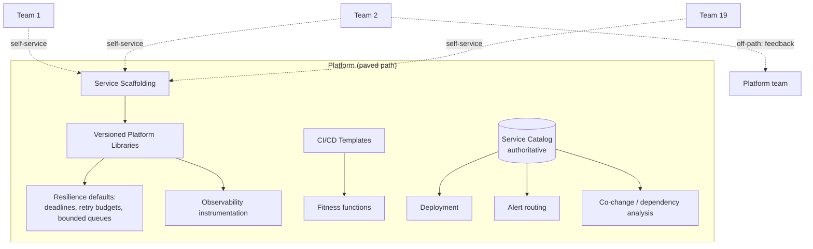
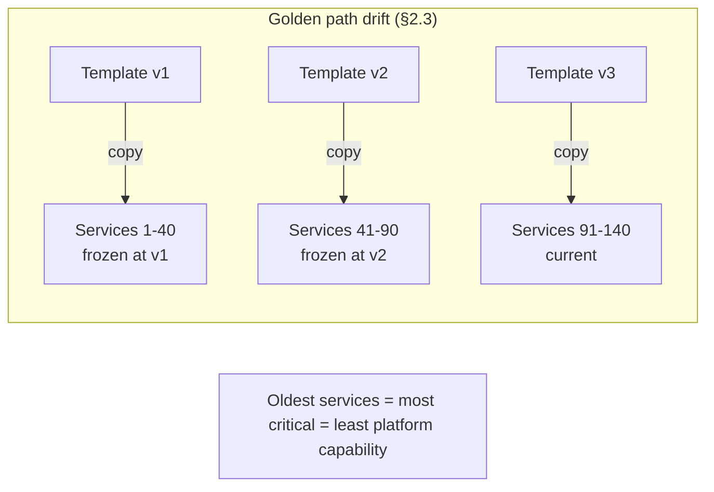
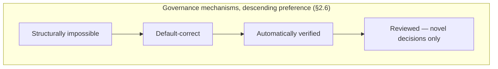
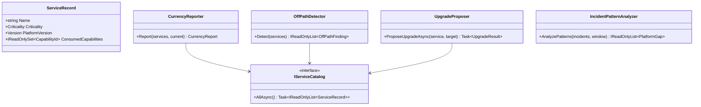

# Module 139 — Microservices: Capstone — Platform Engineering at Scale

> Domain: Microservices | Level: Beginner → Expert | Prerequisite: all seven preceding Microservices modules — [[01-Decomposition-Communication-Strangler-Fig]], [[02-Resilience-Observability-Sidecar-Patterns]], [[03-Versioning-Testing-Deployment-TeamTopologies]], [[04-Data-Consistency-Query-Patterns-Across-Service-Boundaries]], [[05-Service-Discovery-Communication-Infrastructure-Backpressure]], [[06-MultiRegion-Cell-Based-Architecture-Blast-Radius]], [[07-Decomposition-Failures-Service-Right-Sizing]] — plus [[../27-Observability/04-ObservabilityPlatformArchitecture-Cardinality-Cost-MultiSignalCorrelation]] (the golden-path-drift finding this module generalizes) and [[../37-Outbox/02-Capstone-SharedMultiTenantOutboxRelayPlatform]] (shared-platform governance)
>
> **Capstone note:** Eighth and final module of `17-Microservices`, completing its stated extra-depth scope. Where the prior seven addressed what to build, this addresses how dozens of teams build it consistently without a central team becoming the bottleneck. Full 16-section template; Elite FinTech Interview Panel lens.

---

## The Running Problem

The firm has 19 teams operating 140 services across 8 cells and 2 regions. Every discipline the prior seven modules established — bounded queues, deadline propagation, retry budgets, cell independence, read-model reconciliation, co-change measurement — is correct, documented, and applied inconsistently. Some teams do all of it; some do none; most do the parts they learned from an incident they personally experienced. The question this capstone answers is not *what* is correct but **how correctness becomes the default across an organization that will not read the documentation**.

---

## 1. Fundamentals

**What:** Platform engineering treats the internal developer experience as a product: a platform team builds paved paths — scaffolding, libraries, pipelines, defaults — that make the correct way to build a service also the easiest way, and product teams consume them self-service without gatekeeping.

**Why:** Every prior module ended with governance requirements. Applied naively, those become a review board that every team must pass, which does not scale and which teams route around. The platform inverts the mechanism: instead of checking that teams did the right thing, make the right thing the path of least resistance and the wrong thing require deliberate effort.

**When:** Once the number of teams exceeds what direct coordination can align — practically, somewhere between five and ten teams. Below that, a shared convention and a few conversations work; above it, drift is faster than communication.

**How (30,000-ft view):**
```
Without a platform:  19 teams × (pipeline + observability + resilience + deployment) = 19 divergent implementations
With a platform:     platform team builds paved paths → teams consume → consistency without gatekeeping
                     ↑                                                    ↓
                     └────────── feedback: what teams actually need ──────┘
```

---

## 2. Deep Dive

### 2.1 Paved Path, Not Mandated Path
The distinction determines whether the platform succeeds. A **mandated** path is enforced by policy: teams must use it, and when it does not fit they either suffer or seek exemptions, which makes the platform team a bottleneck and an adversary. A **paved** path is enforced by convenience: it is so much easier than the alternative that teams choose it, and when it does not fit they can leave — which is information, not failure.

The corollary that platform teams resist: **teams leaving the paved path is feedback about the platform**, not disobedience. A team that goes off-path has found a need the platform does not serve, and the correct response is to understand it rather than to compel compliance.

### 2.2 What Belongs on the Path
The platform should own what is **undifferentiated and cross-cutting** — every service needs it, and no service's version of it is a competitive advantage: service scaffolding, CI/CD pipelines, observability instrumentation, the resilience defaults from Modules 50 and 136 (deadline propagation, retry budgets, bounded queues), cell-aware deployment (Module 137), and secret management.

It should *not* own business logic, domain models, or anything where teams need genuine variation. The test: if two teams would reasonably want different behaviour, it is a library with options rather than a platform default — and if the platform makes that variation hard, it has overreached.

### 2.3 Golden Path Drift — The Failure This Course Has Seen Before
Module 96 established it in observability and Module 126 in Outbox infrastructure: a scaffolding template captures the correct approach at a moment in time, teams generate services from it, and the template then improves — but services generated earlier never receive the improvements. After two years the estate contains services embodying every version of the template, and the ones generated earliest, which are typically the most business-critical, have the least.

The fix, established in Module 96 and applying identically here: **live references rather than copies**. A service should depend on a versioned platform library it can upgrade, not a copy of code it received once. What cannot be a library — pipeline definitions, configuration structure — needs an explicit migration mechanism and tracking of which services are on which version.

### 2.4 Measuring the Platform as a Product
A platform team without adoption metrics is guessing. The meaningful measures are outcomes, not usage:
- **Time to first deploy** for a new service — the clearest measure of whether the path is genuinely paved.
- **Adoption rate** per capability, and specifically the *distribution*: 90% adoption with the 10% being the most critical services is a different situation from uniform adoption.
- **Version currency** — how many services are on the current platform version, which measures §2.3's drift directly.
- **Off-path incidence** — how often teams build their own, which is the feedback signal §2.1 describes.

The metric that misleads: raw usage counts, which rise even when the platform is imposed rather than chosen and tell you nothing about whether it is serving teams well.

### 2.5 The Service Catalog and Why Most Are Useless
A catalog listing services with owners is nearly worthless — it is stale within months and answers a question nobody urgently has. A catalog is valuable when it is **authoritative and consumed by automation**: deployment requires a catalog entry, alert routing derives ownership from it, and the co-change and dependency analyses of Module 138 read from it. Then it stays current because it is on the path of work rather than beside it.

The catalog should record what Module 138 §Expert Q8 requires — boundary rationale, what a service does *not* own — and Module 137's shared-dependency information, so the estate's structural properties are queryable rather than tribal.

### 2.6 Governance That Scales — Automated Over Reviewed
Every prior module's governance requirements must be delivered without a review board. The mechanisms, in descending preference:
- **Structurally impossible.** Per-service database credentials mean cross-schema reads cannot happen (Module 135 §Advanced Q9), not that they are forbidden.
- **Default-correct.** Platform-provided clients have deadline propagation and retry budgets built in (Module 136 §Advanced Q10), so a team gets them without knowing they exist.
- **Automatically verified.** Fitness functions in every pipeline check what defaults cannot guarantee — Module 137's cell independence, Module 132's tenant isolation.
- **Reviewed.** Reserved for genuinely novel decisions, where judgment is actually required and cannot be encoded.

Most organizations invert this, reviewing what could be automated and never getting to the automation because review consumes the capacity.

---

## 3. Visual Architecture







---

## 4. Production Example

**Problem:** The platform team built a well-received paved path: scaffolding, pipelines, observability, and resilience defaults. Adoption reached 94% of services within eighteen months, and the team's metrics showed a clear success.

**Architecture:** §3's design, with a scaffolding template teams used to generate new services and a versioned platform library for runtime concerns.

**Implementation:** Resilience defaults — deadline propagation, retry budgets, bounded queues (Module 136) — were delivered through the platform library, which services referenced by version. Teams upgraded when convenient.

**Trade-offs:** Version-referenced libraries let teams upgrade on their own schedule rather than being forced, which was a deliberate choice to keep the path paved rather than mandated (§2.1).

**Lessons learned:** A Module 136-style congestive collapse occurred in a service that had been generated before the resilience defaults were added to the library, and had never upgraded because it was stable and nobody had reason to touch it. It was the firm's client-facing order-entry service — the most business-critical service in the estate, and, precisely because it was critical, the one teams were most reluctant to change without cause.

The 94% adoption figure was true and had concealed this. Adoption was measured as *services referencing the platform library*, which this service did — at a version predating the resilience work. Version currency (§2.4) had not been measured at all, and the distribution of who was current correlated inversely with business criticality: stable, critical services upgraded least because stability was valued, and the platform's improvements reached them last.

Three fixes followed. **First**, version currency became a first-class metric alongside adoption, reported as a distribution weighted by service criticality rather than as an average. **Second**, security-and-resilience-relevant library updates gained a mandatory upgrade window with tracking, distinguishing them from optional improvements — a narrow, justified exception to the paved-path principle for changes where staying behind is a risk rather than a preference. **Third**, the platform began *proactively* opening upgrade pull requests against consuming services with the change pre-tested, converting the upgrade from work a team must do into work a team must approve.

The generalizable lesson: **adoption measures whether teams started using the platform; currency measures whether they are getting its value** — and the two diverge most for exactly the services that matter most, because criticality discourages change.

---

## 5. Best Practices
- Pave the path through convenience rather than mandate; treat off-path teams as feedback (§2.1).
- Measure version currency weighted by criticality, not adoption alone (§4, §2.4).
- Deliver improvements as versioned libraries, never as copied templates (§2.3).
- Open upgrade pull requests proactively rather than expecting teams to pull changes (§4).
- Make the catalog authoritative by putting it on the path of work — deployment and alerting depend on it (§2.5).
- Prefer structurally-impossible and default-correct governance over review (§2.6).

## 6. Anti-patterns
- Adoption metrics without version currency, concealing that the most critical services are least current (§4's incident).
- Copied scaffolding templates that freeze services at the version they were generated from (§2.3).
- A mandated path with an exemption process, making the platform team a bottleneck and an adversary (§2.1).
- A service catalog maintained by hand and consumed by nobody (§2.5).
- Review boards for decisions that could be automated, consuming the capacity that would build the automation (§2.6).
- Platform ownership of things teams reasonably need to vary, forcing them off-path for legitimate reasons (§2.2).

---

## 7. Performance Engineering

**CPU/Memory:** Platform libraries add overhead to every service — instrumentation, interceptors, sidecars. Small per-service costs multiply across 140 services, so the platform must measure and budget its own footprint, which teams cannot see and will not report.

**Latency:** Platform-injected middleware sits on every request path; a poorly-performing platform component degrades the entire estate at once. This makes platform code a higher performance bar than application code, since its cost is paid everywhere.

**Throughput:** Platform-provided defaults determine estate-wide behaviour under load — Module 136's retry budgets and bounded queues are platform defaults precisely because per-service configuration produces the amplification that module describes.

**Scalability:** The platform team is the constraint, and their scalability comes from self-service rather than headcount. A platform requiring the team's involvement per adoption does not scale regardless of how good it is.

**Benchmarking:** Benchmark the platform's own overhead per capability, and publish it — teams evaluating whether to adopt need the cost, and hiding it damages trust more than the cost itself does.

**Caching:** Standard within platform components; note that a shared platform cache is a Module 137 shared dependency and must be designed accordingly.

---

## 8. Security

**Threats:** The platform is estate-wide reach by design — a compromised platform library executes in every service. This makes the platform supply chain the highest-value target in the organization, above any individual service.

**Mitigations:** Signed artifacts with verification at build; restricted, audited publish access; and dependency scanning on the platform's own dependencies, since a compromise upstream of the platform propagates through it to everything.

**OWASP mapping:** Software and Data Integrity Failures — specifically supply-chain compromise — is the dominant risk, and it is materially more severe here than for application code because of the fan-out.

**AuthN/AuthZ:** Platform-provided authentication is a genuine security benefit: every service gets correct token validation without implementing it, which is otherwise a per-service opportunity for error. This is one of the strongest arguments for the platform, since it converts a distributed correctness problem into a centralized one.

**Secrets:** Platform-managed secret injection means teams never handle credentials directly — again converting many opportunities for error into one well-guarded mechanism.

**Encryption:** Platform-provided mTLS (Module 79) gives estate-wide transport security without per-service work, which is achievable at 140 services only through the platform.

---

## 9. Scalability

**Horizontal scaling:** The platform scales by teams served, and self-service is the mechanism. Any capability requiring platform-team involvement per use caps the estate at what that team can process.

**Vertical scaling:** Adding platform engineers has diminishing returns if the platform is not self-service — more people processing requests rather than removing the need for requests.

**Caching:** §7's note about shared-dependency implications.

**Replication/Partitioning:** Platform services (catalog, artifact registry) are estate-wide dependencies and must be engineered to Module 137's shared-dependency standard, with local caching and last-known-good so their failure does not stop deployments or serving.

**Load balancing:** Standard for platform services.

**High Availability:** The catalog and artifact registry are on the deployment path — their unavailability blocks all releases estate-wide, which is a severe but recoverable condition provided they are not also on the *request* path (Module 137 §2.5's control/data plane split).

**Disaster Recovery:** Platform configuration and artifacts must be recoverable independently of the services depending on them, since restoring services requires the platform to exist first — an ordering dependency worth making explicit in DR planning.

**CAP theorem:** Platform services choose availability — a stale catalog entry is far better than a blocked deployment — with the exception of anything security-relevant, where a stale permission is worse than a blocked action.

---

## 10. Interview Questions

### Basic (10)

1. **Q: What distinguishes a paved path from a mandated one?**
   **A:** A paved path is chosen because it is easiest; a mandated one is enforced by policy, which makes the platform team a bottleneck and produces exemption processes and workarounds (§2.1).
   **Why correct:** States the enforcement mechanism, which is the operative difference.
   **Common mistakes:** Treating them as equivalent since both aim at consistency.
   **Follow-ups:** "What does a team leaving the path indicate?" (A need the platform does not serve — feedback, not disobedience, §2.1.)

2. **Q: What belongs on the platform and what does not?**
   **A:** Undifferentiated cross-cutting concerns every service needs — scaffolding, pipelines, observability, resilience defaults, secrets. Not business logic, domain models, or anything teams reasonably need to vary (§2.2).
   **Why correct:** States both sides with the differentiating criterion.
   **Common mistakes:** Platform expansion into areas requiring variation, which pushes teams off-path for legitimate reasons.
   **Follow-ups:** "What is the test?" (If two teams would reasonably want different behaviour, it is a library with options rather than a platform default, §2.2.)

3. **Q: What is golden path drift?**
   **A:** Services generated from a scaffolding template freeze at that template's version; the template improves; earlier services never receive the improvements, so the estate accumulates every historical version (§2.3).
   **Why correct:** States the mechanism and its accumulation.
   **Common mistakes:** Treating templates as a one-time bootstrap concern rather than an ongoing divergence source.
   **Follow-ups:** "Which prior modules established this?" (Module 96 for observability and Module 126 for Outbox infrastructure — the same failure in three domains, §2.3.)

4. **Q: Why is adoption an insufficient platform metric?**
   **A:** It measures whether teams started using the platform, not whether they are getting its current value — a service can reference the platform library at a version predating the capability that matters (§4, §2.4).
   **Why correct:** States the specific gap between adoption and value.
   **Common mistakes:** Reporting adoption as the headline success measure, which §4 shows can conceal the most severe gap.
   **Follow-ups:** "What complements it?" (Version currency, reported as a distribution weighted by criticality, §2.4.)

5. **Q: Why are most service catalogs useless?**
   **A:** A hand-maintained list of services and owners goes stale within months and answers no urgent question. A catalog is valuable when authoritative and consumed by automation — deployment requires an entry, alerting derives from it — so it stays current because it is on the path of work (§2.5).
   **Why correct:** Identifies why the common form fails and what makes it work.
   **Common mistakes:** Building a catalog as documentation rather than as an operational dependency.
   **Follow-ups:** "What should it record beyond ownership?" (Boundary rationale and what a service does not own (Module 138), plus shared-dependency information (Module 137), §2.5.)

6. **Q: Rank the governance mechanisms by preference and explain the ordering.**
   **A:** Structurally impossible, then default-correct, then automatically verified, then reviewed — ordered by how little they depend on anyone remembering or choosing correctly (§2.6).
   **Why correct:** States the order and the principle behind it.
   **Common mistakes:** Inverting it — reviewing what could be automated, which consumes the capacity that would build the automation.
   **Follow-ups:** "What should reviews be reserved for?" (Genuinely novel decisions requiring judgment that cannot be encoded, §2.6.)

7. **Q: What went wrong in §4's incident?**
   **A:** The firm's most critical service suffered a congestive collapse because it predated the platform's resilience defaults and had never upgraded — stability discouraged change, so criticality correlated inversely with currency, and the 94% adoption metric measured library reference rather than version (§4).
   **Why correct:** States the mechanism including the inverse correlation.
   **Common mistakes:** Attributing it to the team's failure to upgrade, when the metric had told the platform team everything was fine.
   **Follow-ups:** "What is the generalizable lesson?" (Adoption and currency diverge most for the services that matter most, §4.)

8. **Q: Why is a compromised platform library more severe than a compromised service?**
   **A:** It executes in every service — the platform is estate-wide reach by design, making its supply chain the highest-value target in the organization (§8).
   **Why correct:** States the fan-out that creates the severity.
   **Common mistakes:** Applying application-code security standards to platform code.
   **Follow-ups:** "What mitigations follow?" (Signed artifacts with build-time verification, restricted audited publish access, and scanning of the platform's own dependencies, §8.)

9. **Q: Why does the platform team's scalability come from self-service rather than headcount?**
   **A:** A capability requiring platform-team involvement per use caps the estate at what that team can process; adding engineers processes more requests rather than removing the need for them (§9).
   **Why correct:** Identifies the structural constraint headcount cannot address.
   **Common mistakes:** Scaling the platform team to meet demand rather than removing the demand.
   **Follow-ups:** "What is the test of genuine self-service?" (A team can go from nothing to deployed without contacting the platform team, §2.4's time-to-first-deploy.)

10. **Q: Why do platform services favour availability over consistency?**
    **A:** A stale catalog entry is far better than a blocked deployment — except for security-relevant data, where a stale permission is worse than a blocked action (§9).
    **Why correct:** States the default and the specific exception.
    **Common mistakes:** One uniform posture, which either blocks deployments unnecessarily or serves stale permissions.
    **Follow-ups:** "Why is the deployment path different from the request path?" (Module 137 §2.5 — the control plane may be unavailable provided the data plane keeps serving, §9.)

### Intermediate (10)

1. **Q: Walk through why §4's 94% adoption metric was true and misleading simultaneously.**
   **A:** It measured whether a service referenced the platform library, which the failing service did — at a version predating the resilience defaults. The metric was accurate about what it measured and measured the wrong thing, because reference and currency are different properties. Worse, the divergence was systematic rather than random: stable, critical services change least, so they were the least current, and the metric's blind spot aligned precisely with the highest-consequence services.
   **Why correct:** Explains both the measurement gap and why the divergence was systematic rather than incidental.
   **Common mistakes:** Concluding the metric was wrong; it was correct and insufficient, which is a harder problem to notice.
   **Follow-ups:** "Why does systematic matter more than the gap itself?" (A random 6% gap is a tolerable risk; a gap concentrated in the most critical services is the worst possible distribution, §4.)

2. **Q: Design the currency metric §4's fix requires.**
   **A:** Per-service platform-library version, compared against current, weighted by service criticality — reported as a distribution rather than an average, since an average of "mostly current" hides that the laggards are the critical ones. Add a specific view of security-and-resilience-relevant versions, since being behind on those is materially different from being behind on convenience improvements (§4).
   **Why correct:** Specifies weighting, distribution reporting, and the relevance distinction.
   **Common mistakes:** Reporting mean version lag, which is precisely the average that concealed §4.
   **Follow-ups:** "Where does criticality come from?" (The service catalog (§2.5) — another reason it must be authoritative rather than documentary.)

3. **Q: Why is a mandatory upgrade window a justified exception to the paved-path principle?**
   **A:** The paved path relies on teams choosing the platform because it is better, which works for improvements but not for changes where staying behind is a *risk to others* — a service without retry budgets amplifies load onto shared dependencies (Module 136). For security and resilience specifically, the team's choice imposes cost on the estate, so the exception is justified by externality rather than by the platform team's preference (§4).
   **Why correct:** Justifies the exception by externality, which is the principled basis rather than expedience.
   **Common mistakes:** Extending mandatory upgrades to all changes, which converts the paved path into a mandated one.
   **Follow-ups:** "How narrow should the exception be?" (Changes where being behind creates risk beyond the owning team — a test that excludes most improvements.)

4. **Q: Why does proactively opening upgrade pull requests change adoption dynamics?**
   **A:** It converts upgrading from work a team must schedule into work a team must approve — the effort moves from the consuming team to the platform, and the default shifts from "not yet" to "why not." Combined with pre-tested changes, it removes the two reasons teams defer: effort and risk (§4).
   **Why correct:** Identifies both the effort shift and the default inversion.
   **Common mistakes:** Announcing new versions and expecting pull, which loses to every competing priority.
   **Follow-ups:** "What does this require of the platform?" (Confidence that the change is safe — which requires the platform to test against consuming services, making the platform's own test suite a first-class concern.)

5. **Q: How should the platform handle a team that goes off-path for a legitimate reason?**
   **A:** Understand the need first — it is feedback (§2.1). Then decide whether it generalizes: if other teams would want it, it belongs on the path; if it is genuinely idiosyncratic, the team stays off-path for that capability with the platform's support rather than its disapproval. The platform's job is serving teams, and a team it cannot serve is a gap, not a violation.
   **Why correct:** Sequences understanding before judgment and applies the generalization test (Module 126 §2.6).
   **Common mistakes:** Treating off-path as non-compliance to be corrected, which suppresses the feedback the platform needs.
   **Follow-ups:** "What if going off-path means missing security defaults?" (Then the platform must provide those separately — security cannot be contingent on adopting the full path, §8.)

6. **Q: Why must the catalog be on the path of work to stay current?**
   **A:** Anything maintained beside the work decays, because updating it is nobody's priority. A catalog that deployment requires and alert routing derives from is updated because work fails otherwise — the currency is a byproduct of use rather than an act of discipline (§2.5).
   **Why correct:** Identifies the mechanism that produces currency without requiring diligence.
   **Common mistakes:** Periodic catalog-review campaigns, which produce accurate data briefly.
   **Follow-ups:** "What is the risk of making it required?" (It becomes a deployment dependency (§9), so it must be highly available or it blocks releases.)

7. **Q: Why does platform code face a higher performance bar than application code?**
   **A:** It sits on every request path in every service, so its cost is paid estate-wide and a regression degrades everything simultaneously — a 2ms addition in a platform interceptor is 2ms on 140 services' every request (§7).
   **Why correct:** States the multiplication that raises the bar.
   **Common mistakes:** Applying the same performance standards as application code.
   **Follow-ups:** "What follows for platform releases?" (Performance regression testing as a release gate, and staged rollout like any high-blast-radius change, Module 126 §Advanced Q5.)

8. **Q: How does the platform relate to Module 137's cell architecture?**
   **A:** Platform services are shared dependencies by definition, so they must satisfy Module 137's control/data-plane discipline — cells must keep serving when the catalog, artifact registry, or configuration service is unavailable. The platform is the most likely source of §137 §4's correlated failure precisely because it is deliberately shared.
   **Why correct:** Identifies the tension and the specific discipline it requires.
   **Common mistakes:** Building platform services without the control-plane survivability requirement, making the platform a correlated-failure channel.
   **Follow-ups:** "What is the concrete requirement?" (Local caching with last-known-good in every consumer, and fault injection verifying it, Module 137 §Advanced Q4.)

9. **Q: What does time-to-first-deploy measure that other metrics do not?**
   **A:** Whether the path is genuinely paved end-to-end — it captures every friction a new team encounters, including the ones the platform team cannot see because they are familiar with the system. A path that is fast for its authors and slow for newcomers is not paved (§2.4).
   **Why correct:** Identifies it as an end-to-end friction measure including invisible friction.
   **Common mistakes:** Measuring individual capability adoption, which misses the assembly friction between them.
   **Follow-ups:** "How should it be measured?" (By observing an actual new team, not by the platform team timing themselves — the familiarity effect is exactly what it exists to detect.)

10. **Q: Synthesize what this capstone adds to the seven preceding Microservices modules.**
    **A:** Each established a discipline and ended with governance requirements that assumed someone would apply them. This module addresses the assumption: at 19 teams, applying disciplines through documentation and review does not work, and the mechanism that does work is making correctness the default. The prior modules answer *what is correct*; this one answers *how correctness survives contact with an organization*, which is the difference between an architecture that is right on paper and one that is right in production.
    **Why correct:** Frames the capstone as addressing the delivery gap the prior modules left open.
    **Common mistakes:** Treating platform engineering as an additional topic rather than as the mechanism the prior seven depend on.
    **Follow-ups:** "Which prior module's requirements are hardest to deliver without a platform?" (Module 136's — deadline propagation and retry budgets fail if any service configures them wrongly, so they must be defaults rather than choices.)

### Advanced (10)

1. **Q: Diagnose §4's incident and design the complete structural fix.**
   **A:** Root cause: adoption measured library reference rather than version, and the divergence was systematically concentrated in stable critical services that change least (Intermediate Q1). Fix: (1) criticality-weighted version-currency distribution as a first-class metric (Intermediate Q2); (2) a narrow mandatory-upgrade window for changes where being behind creates externalized risk (Intermediate Q3); (3) proactive pre-tested upgrade pull requests, shifting effort to the platform (Intermediate Q4); (4) a periodic audit specifically of the most critical services' platform capability, since the metric's blind spot aligned with the highest-consequence population and any future metric may have a similar blind spot.
   **Why correct:** Addresses the metric gap, the externality case, the effort barrier, and adds a check independent of the metrics themselves.
   **Common mistakes:** Fixing the metric alone, which detects the next occurrence without changing the dynamic that produced it.
   **Follow-ups:** "Why (4) if (1) fixes the metric?" (Because the failure was a metric blind spot, and the lesson is to verify critical services directly rather than trusting whichever metric is current.)

2. **Q: A platform team proposes mandating the path to guarantee consistency. Evaluate.**
   **A:** It converts the platform team into a gatekeeper and an adversary, and predictably produces exemption processes that consume more capacity than the inconsistency did. More damagingly, it destroys the feedback loop — teams going off-path is how the platform learns what it does not serve (§2.1), and mandating removes that signal while leaving the underlying gaps. The narrow legitimate case is the externality exception (Intermediate Q3), which is justified by risk to others rather than by consistency as a value.
   **Why correct:** Names the bottleneck, the exemption dynamic, and the feedback destruction, and identifies the legitimate narrow case.
   **Common mistakes:** Accepting mandate because consistency is genuinely valuable, without weighing what enforcement costs.
   **Follow-ups:** "What if adoption is genuinely too low?" (Low adoption is evidence the path is not sufficiently better — the response is improving it, not compelling use, §2.1.)

3. **Q: Critique a platform that provides a service template teams copy and customize.**
   **A:** It guarantees §2.3's drift: every generated service is a permanent fork, improvements never propagate, and after two years the estate contains every historical version with no upgrade path. Copying is appropriate only for genuinely one-time scaffolding — directory structure, initial configuration — while anything that will evolve must be a versioned dependency. The test: will this need to change after generation? If yes, it cannot be a copy.
   **Why correct:** Identifies the permanent-fork consequence and gives the discriminating test.
   **Common mistakes:** Templating everything for initial convenience, creating an estate that cannot be improved centrally.
   **Follow-ups:** "What about pipeline definitions, which cannot easily be libraries?" (They need an explicit migration mechanism and version tracking — the harder case §2.3 acknowledges, requiring active management rather than a dependency reference.)

4. **Q: Design the platform's own testing strategy given its blast radius.**
   **A:** Test against real consuming services, not only in isolation — the platform's contract is with 140 services whose usage patterns it cannot fully anticipate, so a representative sample should be built and tested against every platform release. Add performance regression gates (Intermediate Q7) and staged rollout by consumer cohort (Module 126 §Advanced Q5). The distinguishing requirement: the platform must be able to test a change against consumers *before* asking them to adopt it, which is what makes Intermediate Q4's proactive pull requests safe.
   **Why correct:** Specifies consumer-inclusive testing and connects it to the proactive-upgrade mechanism it enables.
   **Common mistakes:** Unit-testing platform libraries thoroughly and discovering integration issues in consuming services.
   **Follow-ups:** "How is the sample chosen?" (Weighted toward critical and structurally unusual consumers — the ones most likely to break and most costly if they do.)

5. **Q: How should platform capabilities be deprecated?**
   **A:** With the same discipline as an external API (Module 128 §2.3): announced deprecation, usage monitoring showing which services still depend on it, proactive migration assistance, and a tracked sunset with the deadline informed by actual remaining usage rather than a fixed calendar. The platform's position is stronger than an external API's — it can open migration pull requests (Intermediate Q4) — and that capability should be used rather than merely announcing.
   **Why correct:** Applies the established deprecation discipline and identifies the platform's specific advantage.
   **Common mistakes:** Removing capabilities on a schedule without usage data, breaking consumers who never saw the announcement.
   **Follow-ups:** "What if a critical service cannot migrate?" (Extend for that service specifically while proceeding with others — per-consumer deadlines rather than one global one, Module 128 §Advanced Q5's calibration.)

6. **Q: A regulator asks how the firm ensures consistent controls across 140 services. Answer.**
   **A:** Describe the mechanism hierarchy (§2.6): controls that are structurally impossible to violate (per-service credentials), those that are default-correct (platform-provided authentication, encryption, resilience), those automatically verified (fitness functions in every pipeline), and the narrow set requiring review. Then evidence it with currency metrics (Intermediate Q2) showing which services have which controls, and disclose §4 honestly — the incident that revealed adoption and currency diverge, and the controls added in response.
   **Why correct:** Gives the mechanism hierarchy, the evidence, and honest disclosure consistent with this course's established posture.
   **Common mistakes:** Claiming consistency from policy, which a supervisor will test by asking how it is verified.
   **Follow-ups:** "What is the strongest evidence?" (Structurally-impossible controls, since they require no verification — the control's existence is the evidence.)

7. **Q: Apply this course's "declared ≠ actual" theme to platform engineering.**
   **A:** The claim is "the estate follows our standards." Its declared basis is that standards exist, are documented, and adoption is high. §4's gap: adoption was genuinely 94% and the standard was genuinely correct, and the most critical service in the estate had neither — because adoption measured a relationship, not a state. The distinguishing feature is that the platform team had a metric, trusted it, and it was accurate; the failure was in what the metric could express, not in its measurement. That is a harder failure to anticipate than a missing metric, because the dashboard looks healthy and is not lying.
   **Why correct:** Identifies that the metric was accurate and insufficient, which is distinct from being wrong or absent.
   **Common mistakes:** Concluding the platform team should have measured better, without noting the metric was reasonable and the gap non-obvious.
   **Follow-ups:** "What generalizes?" (Any metric measuring a relationship rather than a state can conceal drift within that relationship — worth checking wherever adoption, coverage, or enrolment is reported.)

8. **Q: Design the platform's feedback loop.**
   **A:** Instrument off-path incidence (§2.4) and treat each instance as an investigation — what did the team need. Add direct channels: embedded platform engineers rotating through product teams, and regular sessions where teams describe friction rather than the platform describing features. The essential property is that the loop must surface what teams *do* rather than what they *say*, since teams route around friction quietly and rarely report it as a problem.
   **Why correct:** Combines behavioural signal with direct channels and identifies why behaviour matters more than reported feedback.
   **Common mistakes:** Satisfaction surveys, which capture stated preference and miss the workarounds teams have already normalized.
   **Follow-ups:** "Why is rotation particularly effective?" (A platform engineer building a service on their own platform encounters the friction directly — the fastest correction mechanism available.)

9. **Q: How should the platform team be organized and measured?**
   **A:** As a product team with product management, not as an operations team taking requests — the distinction determines whether it builds what teams need or what they last asked for. Measured on outcomes: time to first deploy, currency distribution, off-path incidence, and estate-wide reliability indicators the platform's defaults influence. Explicitly *not* measured on ticket throughput, which rewards processing requests rather than removing the need for them (§9).
   **Why correct:** Specifies the organizational model and the metric to avoid, with the reason.
   **Common mistakes:** Ticket-based measurement, which structurally opposes self-service.
   **Follow-ups:** "What does product management mean here?" (Discovery, roadmap, and prioritization based on teams' actual needs — the same discipline as external product work, with internal customers.)

10. **Q: Synthesize the governance for platform engineering itself.**
    **A:** (1) Paved-path principle with a narrow, externality-justified exception for security and resilience (Intermediate Q3, Advanced Q2). (2) Criticality-weighted currency metrics alongside adoption (Advanced Q1). (3) Versioned dependencies over copied templates, with explicit migration for what cannot be a dependency (Advanced Q3). (4) Consumer-inclusive testing and staged rollout given blast radius (Advanced Q4). (5) Platform capabilities deprecated with external-API discipline (Advanced Q5). (6) Feedback measured behaviourally through off-path incidence, not surveys (Advanced Q8). (7) Product-team organization with outcome metrics, never ticket throughput (Advanced Q9). (8) Platform services meeting Module 137's control-plane survivability standard (Intermediate Q8).
    **Why correct:** Covers the operating principle, measurement, delivery mechanics, feedback, organization, and the shared-dependency obligation.
    **Common mistakes:** Governing what teams must do without governing how the platform earns adoption, which is where platforms actually fail.
    **Follow-ups:** "Which item most predicts platform success?" (Item 6 — a platform without a behavioural feedback loop drifts from what teams need and discovers it only when adoption stalls.)

### Expert (10)

1. **Q: When should a firm build a platform team rather than relying on shared conventions?**
   **A:** When team count exceeds what direct coordination aligns — practically five to ten (§1) — and when the cost of divergence is demonstrable rather than theoretical. Below that threshold a platform team is overhead consuming capacity that could build product, and the conventions genuinely work because everyone talks. The signal to build is measurable divergence with measurable cost: different observability, incompatible resilience, per-team pipelines, and incidents attributable to the inconsistency.
   **Why correct:** Gives a team-count threshold and the demonstrable-cost condition.
   **Common mistakes:** Building a platform team as an organizational maturity milestone, before divergence costs anything.
   **Follow-ups:** "What is the intermediate step?" (A shared library maintained by a rotating owner — most of the consistency benefit without a dedicated team, viable to roughly ten teams.)

2. **Q: How does platform engineering interact with Module 138's boundary corrections?**
   **A:** It makes them cheaper and therefore more likely: if creating, merging, or retiring a service is largely automated, boundary corrections are routine rather than projects, which is what Module 138 §2.5 requires and most estates lack. A platform that makes service creation easy but merging hard produces the exact bias toward over-decomposition Module 138 describes — so merge and retirement tooling deserve equal investment to creation tooling, which they rarely receive.
   **Why correct:** Identifies the enabling relationship and the asymmetry platforms typically exhibit.
   **Common mistakes:** Investing in service creation only, structurally biasing the estate toward more services.
   **Follow-ups:** "What does merge tooling look like?" (Data-store consolidation helpers, dependency rewiring, catalog updates, and decommissioning automation — the reverse of creation, and rarely built.)

3. **Q: Evaluate buying a platform (Backstage, an internal-developer-platform product) versus building.**
   **A:** Buying the *shell* — catalog, developer portal, scaffolding framework — is usually right, since none of it is differentiating and the products are mature. The content — what the paved path actually contains, the resilience defaults, the pipeline shape — is necessarily bespoke, because it encodes this firm's decisions from Modules 135–138. The common error is expecting the product to supply the content, then finding an empty portal nobody uses because it paves nothing.
   **Why correct:** Separates shell from content and identifies the specific disappointment pattern.
   **Common mistakes:** Adopting a platform product expecting it to constitute the platform.
   **Follow-ups:** "What determines whether the shell is worth buying?" (Whether the team would otherwise build a portal — if the answer is no, buying one adds a thing to maintain without adding a path.)

4. **Q: How should the platform handle polyglot estates?**
   **A:** Either supply the paved path per language, which multiplies effort by language count, or push cross-cutting concerns out of language entirely — into sidecars and infrastructure (Module 136 §2.1) — so the path is language-agnostic. The second scales better and is the stronger argument for a service mesh than any individual mesh feature. The practical position: a well-supported path for the primary languages, infrastructure-level defaults for everything, and honest acknowledgement that minority languages get less.
   **Why correct:** Gives both strategies with their scaling properties and a realistic combined position.
   **Common mistakes:** Committing to full parity across languages, which consumes the platform team indefinitely.
   **Follow-ups:** "What does this imply for language governance?" (Adding a language has a platform cost that should be visible in the decision — not a prohibition, but a cost teams should see.)

5. **Q: A team says the platform is slowing them down. Walk through the response.**
   **A:** Take it as data, not complaint (§2.1, Advanced Q8). Establish what specifically: onboarding friction, a capability that does not fit, or overhead in the inner loop. Each has a different remedy, and the third is the most common and least reported — platform-imposed build or test time that teams absorb silently. If the platform genuinely does not fit their case, support them off-path for it rather than defending the platform, and record it as a gap.
   **Why correct:** Sequences from category identification to remedy and names the under-reported case.
   **Common mistakes:** Defending the platform, which ends the feedback and confirms the team's view.
   **Follow-ups:** "Why is inner-loop overhead under-reported?" (It is absorbed continuously rather than encountered as a blocker, so teams normalize it — which is why measurement matters more than reports.)

6. **Q: How should platform costs be attributed?**
   **A:** Visibly but usually not chargeback — showback (attributing cost without billing) gives teams the information to make sensible decisions without creating incentives to avoid the platform for cost reasons, which would be perverse given the platform exists to reduce total cost. The exception is genuinely elastic resources teams control, where attribution changes behaviour usefully.
   **Why correct:** Distinguishes showback from chargeback and identifies the perverse incentive chargeback creates here.
   **Common mistakes:** Chargeback for platform capabilities, driving teams off-path to avoid internal costs.
   **Follow-ups:** "What does showback achieve?" (Teams see the cost of their choices — instance sizing, retention, cell count — without the platform becoming something to avoid.)

7. **Q: How does the platform support Module 137's cell architecture operationally?**
   **A:** Cell provisioning must be fully automated or cell count is capped by manual effort (Module 137 §9), and deployment must be cell-aware — progressive rollout cell by cell (Module 137 §Advanced Q9) as the default path, not something each team implements. This is a clear case where the platform makes an architectural pattern viable: cells without automated provisioning and cell-aware deployment are operationally unsustainable at any meaningful cell count.
   **Why correct:** Identifies the two specific capabilities and that the pattern depends on them.
   **Common mistakes:** Adopting cells before the platform can provision and deploy to them, producing manual toil that grows with cell count.
   **Follow-ups:** "What is the ordering implication?" (Platform automation should precede cell adoption, or the architecture is unaffordable to operate.)

8. **Q: What is the platform team's relationship to incident response?**
   **A:** They own platform-caused incidents and, more importantly, own the *systemic* view — an incident that recurs across teams indicates a platform gap, whereas each team sees only their instance. This makes the platform team the natural owner of cross-team incident pattern analysis, and gives them the strongest information source for prioritization: recurring incidents are unambiguous evidence of what the paved path is missing.
   **Why correct:** Identifies the systemic-view ownership and its value as a prioritization input.
   **Common mistakes:** Platform teams owning only their own incidents, forfeiting the cross-team pattern view nobody else has.
   **Follow-ups:** "What does a recurring cross-team incident indicate?" (A default that should exist and does not — the highest-confidence platform requirement available.)

9. **Q: How should platform decisions be governed given they affect every team?**
   **A:** A lightweight architecture forum with product-team representation rather than platform-team unilateralism — significant path changes affect everyone's work, so those affected should have voice. But it must remain advisory rather than consensus-requiring, or the platform cannot move. The workable balance: the platform team decides, having genuinely consulted, and records decisions as ADRs (Module 106) with rationale so disagreement is at least informed.
   **Why correct:** Balances voice against decision velocity and specifies the mechanism.
   **Common mistakes:** Either unilateral platform decisions, breeding resentment, or consensus requirements, producing paralysis.
   **Follow-ups:** "How is genuine consultation distinguished from performative?" (By whether decisions ever change as a result — a forum that has never altered a platform decision is not consulting.)

10. **Q: Deliver the closing synthesis for this module and the Microservices domain.**
    **A:** Across eight modules, one pattern recurs: **every microservices discipline is correct in isolation and fails through inconsistent application at scale.** Module 135's read-model reconciliation, 136's retry budgets, 137's cell independence, 138's co-change measurement — each is straightforward to state and each fails when even one team omits it, because microservices estates are systems whose properties are emergent from every participant's behaviour. That is why this capstone is the domain's necessary conclusion rather than an appendix: the prior seven describe what correct looks like, and correctness that depends on 19 teams independently remembering is not a property the estate has.

    The Principal-level conclusion is that in a microservices organization, **architecture is delivered through the developer experience, not through documents** — a design decision that is not embodied in a default, a template, or a fitness function is a suggestion, and suggestions do not survive contact with delivery pressure. §4 is the honest limit: even a well-run platform with 94% adoption had its most critical service running without the defaults, because the mechanism for propagating improvements was weaker than the mechanism for establishing them. Establishing correctness is the easy half; propagating it, and keeping it propagated, is the work.
    **Why correct:** Names the recurring pattern across the domain, states the delivery-mechanism conclusion, and uses the incident as the honest limit rather than a triumphant close.
    **Common mistakes:** Treating platform engineering as an organizational nicety rather than as the mechanism the preceding architecture depends on.
    **Follow-ups:** "What is the first thing to build?" (Whatever the most recent cross-team incident indicates is missing (Expert Q8) — the highest-confidence requirement available, and it arrives free.)

---

## 11. Coding Exercises

### Easy — Version Currency by Criticality (§4, Intermediate Q2)
**Problem:** Report platform-library currency weighted by service criticality.
**Solution:**
```csharp
public CurrencyReport Report(IReadOnlyList<ServiceRecord> services, Version current)
{
    var buckets = services
        .GroupBy(s => s.Criticality)
        .ToDictionary(
            g => g.Key,
            g => new CurrencyBucket(
                Total: g.Count(),
                Current: g.Count(s => s.PlatformVersion >= current),
                MostStale: g.Min(s => s.PlatformVersion),
                StaleCriticalServices: g.Where(s => s.PlatformVersion < current)
                                        .Select(s => s.Name).ToList()));

    return new CurrencyReport(buckets);   // distribution, never an average (§4)
}
```
**Time complexity:** O(n) for n services.
**Space complexity:** O(n).
**Optimized solution:** Report separately for security-and-resilience-relevant versions (Intermediate Q3), since being behind on those is a different condition from being behind on convenience features and warrants different escalation.

### Medium — Off-Path Detection (§2.4, Advanced Q8)
**Problem:** Detect services not consuming platform capabilities, as a feedback signal.
**Solution:**
```csharp
public IReadOnlyList<OffPathFinding> Detect(IReadOnlyList<ServiceRecord> services)
{
    return services
        .SelectMany(s => _capabilities
            .Where(c => !s.ConsumedCapabilities.Contains(c.Id))
            .Select(c => new OffPathFinding(
                Service: s.Name,
                Capability: c.Id,
                Criticality: s.Criticality,
                Interpretation: c.IsSecurityRelevant
                    ? "Gap requiring remediation"
                    : "Potential platform gap — investigate need")))   // feedback, not violation
        .OrderByDescending(f => f.Criticality)
        .ToList();
}
```
**Time complexity:** O(n × c) for n services and c capabilities.
**Space complexity:** O(n × c) worst case.
**Optimized solution:** Cluster findings by capability — many services skipping the same capability is a platform gap, while one service skipping many is a team that has gone off-path entirely; the two need different responses (§2.1).

### Hard — Proactive Upgrade Pull Request (§4, Intermediate Q4)
**Problem:** Open pre-tested upgrade PRs against consuming services.
**Solution:**
```csharp
public async Task<UpgradeResult> ProposeUpgradeAsync(ServiceRecord service, Version target)
{
    var branch = await _vcs.CreateBranchAsync(service.Repository, $"platform-upgrade-{target}");
    await _vcs.UpdateDependencyAsync(branch, PlatformPackage, target);

    var build = await _ci.RunAsync(branch);                     // pre-test before asking
    if (!build.Succeeded)
        return UpgradeResult.RequiresAttention(service, build.Failures);  // platform investigates

    return await _vcs.OpenPullRequestAsync(branch, new PullRequestDetails(
        Title: $"Upgrade platform to {target}",
        Body: _changelog.Between(service.PlatformVersion, target),
        AutoMergeEligible: build.Succeeded && !_changelog.HasBreakingChanges(service.PlatformVersion, target)));
}
```
**Time complexity:** O(1) per service; the CI run dominates wall-clock.
**Space complexity:** O(1).
**Optimized solution:** Batch by cohort and stage the rollout (Module 126 §Advanced Q5) — opening 140 PRs simultaneously guarantees an unnoticed regression reaches everything, whereas cohorts allow the first to surface problems.

### Expert — Cross-Team Incident Pattern Analysis (Expert Q8)
**Problem:** Identify platform gaps from incidents recurring across teams.
**Solution:**
```csharp
public IReadOnlyList<PlatformGap> AnalyzePatterns(IReadOnlyList<Incident> incidents, TimeSpan window)
{
    return incidents
        .Where(i => i.OccurredAt > DateTimeOffset.UtcNow - window)
        .GroupBy(i => i.RootCauseCategory)
        .Where(g => g.Select(i => i.OwningTeam).Distinct().Count() >= _teamThreshold)
        .Select(g => new PlatformGap(
            Category: g.Key,
            AffectedTeams: g.Select(i => i.OwningTeam).Distinct().ToList(),
            Occurrences: g.Count(),
            TotalImpactMinutes: g.Sum(i => i.DurationMinutes),
            Recommendation: _catalog.CapabilityAddressing(g.Key) is { } existing
                ? $"Capability {existing} exists — adoption gap, not a platform gap"
                : "No capability addresses this — platform gap"))   // the discriminating question
        .OrderByDescending(gap => gap.TotalImpactMinutes)
        .ToList();
}
```
**Time complexity:** O(n log n) for n incidents.
**Space complexity:** O(g) for g categories.
**Optimized solution:** Distinguish adoption gaps from capability gaps as shown, then route them differently — an adoption gap needs Intermediate Q4's proactive upgrade, while a capability gap needs roadmap work. Conflating them sends the wrong remedy.

---

## 12. System Design

**Functional requirements**
- Self-service creation, deployment, and operation of services without platform-team involvement.
- Consistent resilience, observability, and security defaults across 140 services (Modules 50, 136, 137).
- Authoritative catalog consumed by deployment, alerting, and analysis (§2.5).
- Improvements propagate to existing services, not only new ones (§2.3).

**Non-functional requirements**
- Time to first deploy for a new service: under one day.
- Currency: critical services within one minor version of current for security and resilience capabilities.
- Platform services satisfy Module 137's control-plane survivability — their outage must not stop serving.
- Platform overhead measured, published, and budgeted (§7).

**Capacity estimation**
- 19 teams, 140 services, 8 cells, 2 regions → 140 × 8 = 1,120 service deployments per region-pair.
- Platform library releases ~2/month; at 140 consumers that is 280 upgrade PRs monthly if fully proactive (§11 Hard) — which is why batching and auto-merge eligibility matter.
- Catalog reads: on every deployment and every alert routing decision — hundreds per hour, trivial, but on the critical path for both.
- **The sensitivity that matters:** service count multiplied by cell count. Every platform capability's operational cost is paid 1,120 times, which is the quantitative form of Module 138 §Expert Q3's argument that over-decomposition compounds with cells.

**Architecture:** §3 — scaffolding and versioned libraries as the paved path, authoritative catalog feeding automation, fitness functions in pipelines, proactive upgrade mechanism.

**Components:** Service scaffolding; versioned platform libraries; CI/CD templates with fitness functions; service catalog; upgrade proposer (§11 Hard); currency reporter (§11 Easy); off-path detector (§11 Medium); incident pattern analyzer (§11 Expert).

**Database selection:** Catalog in a store supporting both API reads on the deployment path and analytical queries for Module 138's co-change work — modest scale, so a relational store is sufficient and simplest.

**Caching:** Catalog reads cached locally in consumers with last-known-good (Module 137 §2.5), so catalog unavailability degrades rather than blocks.

**Messaging:** Platform events — new version published, capability deprecated — consumed by the upgrade proposer and notification systems.

**Scaling:** By self-service; platform-team involvement per adoption is the anti-scaling property (§9).

**Failure handling:** Catalog and registry unavailability blocks deployments but not serving (§9); platform library defects staged by cohort (§11 Hard's optimization).

**Monitoring:** Time to first deploy; currency distribution by criticality; off-path incidence clustered by capability; cross-team incident patterns; platform overhead per capability.

**Trade-offs:** Paved over mandated accepts some inconsistency for feedback and adoption (§2.1), with the narrow externality exception (Intermediate Q3). Proactive upgrades accept platform-team effort to shift the adoption default (Intermediate Q4).

---

## 13. Low-Level Design

**Requirements:** Currency is measured as a distribution; off-path is treated as feedback; upgrades are pre-tested; incident patterns discriminate adoption gaps from capability gaps.

**Class diagram:**


**Sequence diagram:** §3's first diagram — teams self-serving from the paved path with off-path use flowing back as feedback.

**Design patterns used:** Template Method (scaffolding); Strategy (per-language paved paths, Expert Q4); Observer (platform-event-driven upgrade proposals); Registry (service catalog).

**SOLID mapping:** Single Responsibility (each analyzer computes one signal); Open/Closed (a new capability registers without changing the detector); Liskov (every paved-path implementation across languages must provide the same guarantees, verified by contract tests — a genuine requirement in a polyglot estate); Interface Segregation (catalog read interface separate from write); Dependency Inversion (analyzers depend on the catalog interface, allowing test and production sources).

**Extensibility:** New capabilities register with the catalog and are automatically covered by currency and off-path reporting — the extension and its measurement arrive together, which is the property that keeps the metrics honest as the platform grows.

**Concurrency/thread safety:** Analytical and batch; the upgrade proposer must bound concurrent PR creation to avoid overwhelming CI and to enable cohort staging (§11 Hard's optimization).

---

## 14. Production Debugging

**Incident:** Following §4's remediation, proactive upgrade PRs were running well. Then a platform library release caused failures in 30 services within two hours — all of which had auto-merged the upgrade because the pre-test had passed.

**Root cause:** The release changed a default timeout from 30 seconds to 5, a deliberate improvement aligning with Module 136's deadline discipline. The platform's pre-test ran each service's test suite, which passed — because test suites use mocked dependencies that respond immediately, so no test exercised a call taking longer than 5 seconds.

In production, 30 services had legitimate downstream calls in the 5–30 second range, which now failed. Auto-merge eligibility had been determined by "build succeeded and no breaking changes declared" (§11 Hard), and a default-value change had not been classified as breaking because the API surface was unchanged.

**Investigation:** The correlation across 30 services with one common change made the cause obvious; the harder question was why pre-testing passed. Comparing test-suite dependency configurations against production showed the mocking gap — every service's tests were fast by construction, so a timeout reduction was untestable by design.

**Tools:** Deployment timeline correlated against the platform release; test-suite configuration review across affected services; the platform changelog's breaking-change classification.

**Fix:** Reclassify default-value changes affecting runtime behaviour as breaking for auto-merge purposes, requiring explicit approval regardless of build outcome.

**Prevention:** (1) Auto-merge eligibility now requires that the change be *testable* by the consuming service's suite — a change whose effect no test can exercise is not validated by that suite passing, which is the deeper lesson. (2) Behaviour-affecting defaults are staged by cohort with production observation between cohorts, never released to all consumers on a single build signal (§11 Hard's optimization, which had been implemented for PR creation but not for auto-merge). (3) The platform publishes which categories of change its pre-testing can and cannot validate, so consuming teams calibrate their trust in auto-merge appropriately rather than treating a green build as complete assurance.

---

## 15. Architecture Decision

**Context:** How platform improvements reach existing services — the mechanism whose weakness §4 exposed and §14 showed is itself hazardous.

**Option A — Pull: teams upgrade when they choose:**
*Advantages:* Fully respects the paved-path principle; teams control their own risk and timing; no platform-team effort per consumer.
*Disadvantages:* §4 exactly — stable critical services never upgrade because stability is valued and nothing forces the question, so currency correlates inversely with criticality.
*Cost:* Lowest for the platform team. *Risk:* Improvements reach least the services that need them most.

**Option B — Proactive pre-tested pull requests, team approves (recommended):**
*Advantages:* Shifts effort to the platform and inverts the default from "not yet" to "why not"; teams retain the decision, preserving the paved-path principle; pre-testing removes the risk barrier.
*Disadvantages:* Significant platform-team effort (280 PRs/month at this scale, §12); requires the platform to test against consumers (Advanced Q4); and §14's hazard — pre-testing can create false confidence for changes the tests structurally cannot exercise.
*Cost:* Moderate ongoing platform effort. *Risk:* Managed by cohort staging and honest publication of what pre-testing validates.

**Option C — Push: platform upgrades services automatically:**
*Advantages:* Guarantees currency; no adoption gap possible.
*Disadvantages:* Removes team control entirely, converting the paved path into a mandated one with the platform team owning every consequence; §14 demonstrates what automatic application of a well-intentioned change does at scale, and Option C would have applied it to all 140 rather than 30.
*Cost:* Lowest ongoing effort. *Risk:* Highest — the platform team assumes responsibility for every service's runtime behaviour without their context.

**Recommendation: Option B, with the narrow externality exception (Intermediate Q3) permitting mandatory windows for security and resilience changes.** Option A is the principled position and demonstrably fails on the population that matters most. Option C achieves currency by abandoning the model that makes the platform welcome, and §14 shows the platform's judgment about safety is fallible in ways the consuming team's context would catch. Option B keeps the decision with teams while removing the friction that made deferral automatic — and §14's lesson is that its safety depends on honesty about what pre-testing can validate, since a green build on a test suite that cannot exercise the change is not evidence.

---

## 17. Principal Engineer Perspective

**Business impact:** The platform's value is delivery velocity across 19 teams and the reduction of incidents caused by inconsistency. Both are measurable — time to first deploy, cross-team incident patterns — which makes this one of the few infrastructure investments with a legible business case, and that legibility should be used rather than arguing from principle.

**Engineering trade-offs:** The recurring trade is consistency against team autonomy, and the paved-path model's insight is that it is usually a false trade — teams adopt consistency voluntarily when it is genuinely easier. Where it is a real trade (§4's externality cases), the exception should be narrow and justified by risk to others rather than by the platform team's preference for uniformity.

**Technical leadership:** The platform team's hardest discipline is treating off-path teams as feedback rather than non-compliance (§2.1), because the instinct under pressure to demonstrate adoption is to compel it. A Principal Engineer's role is protecting the feedback loop, since a platform that stops learning drifts from what teams need and discovers it only when adoption stalls.

**Cross-team communication:** The platform team is structurally at risk of building what it thinks teams need. Rotation into product teams (Advanced Q8) is the most effective correction available, because a platform engineer building a service on their own platform experiences the friction directly rather than hearing about it.

**Architecture governance:** Platform decisions affect every team, so they warrant a consultative forum that remains advisory (Expert Q9) — with ADRs recording rationale, since the decisions constrain everyone's work and unexplained constraints breed workarounds.

**Cost optimization:** Platform overhead is paid 1,120 times in this estate (§12), so per-capability efficiency matters far more than in application code. Showback rather than chargeback (Expert Q6) gives teams cost visibility without creating incentives to leave the path, which would be the worst possible outcome of a cost-attribution decision.

**Risk analysis:** The dominant risks are supply-chain compromise (§8, given estate-wide execution) and the currency gap §4 revealed. Both share a property worth noting: they are risks of the platform's *reach*, which is also its value — the same fan-out that delivers consistency delivers failures, which is why platform code warrants standards above application code.

**Long-term maintainability:** What decays is the fit between the platform and what teams need, as the estate evolves and the platform's assumptions age. The durable investment is the feedback loop (Advanced Q8) rather than any particular capability — a platform that keeps learning stays relevant, and one that stops becomes the thing teams route around, which is worse than no platform because it consumes capacity while providing decreasing value.

---

**Domain complete — `17-Microservices` (Modules 49–51, 135–139)** now stands at its stated eight-module extra-depth scope: decomposition and communication; resilience and observability; versioning, testing and deployment; cross-boundary data and query patterns; discovery, communication infrastructure and backpressure; multi-region and cell-based containment; decomposition failures and right-sizing; and this platform-engineering capstone. The domain's recurring finding across all eight: **every microservices discipline is individually straightforward and fails through inconsistent application at scale**, which is why the capstone addresses delivery rather than adding another pattern.

**Next in this run:** Modules 140–145 extending `18-Event-Driven-Architecture` to its stated scope, beginning with stream processing — stateful operations, windowing, and time semantics.
