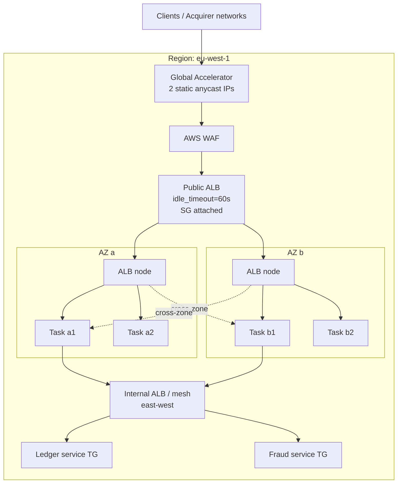
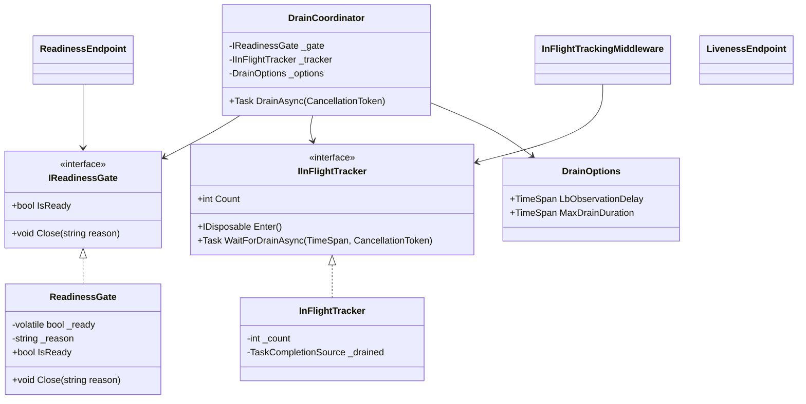
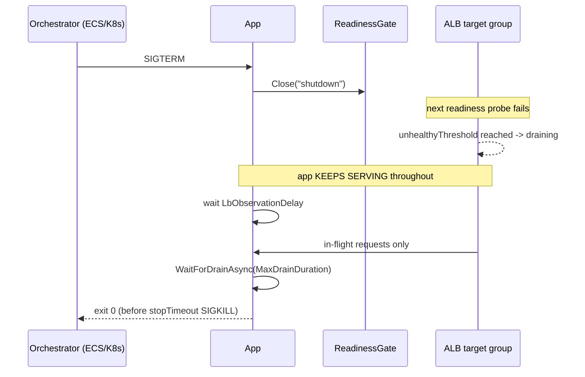

# Module 173 — Microservices: Load Balancing on AWS — ALB, NLB, Target Groups, Route 53 & Global Accelerator

> Domain: Microservices | Level: Beginner → Expert | Prerequisite: [[05-Service-Discovery-Communication-Infrastructure-Backpressure]] (discovery, LB algorithms, liveness/readiness, deadline propagation — this module is the AWS infrastructure realisation of that module's abstractions), [[02-Resilience-Observability-Sidecar-Patterns]] (timeouts, retries, circuit breakers), [[06-MultiRegion-Cell-Based-Architecture-Blast-Radius]] (the AZ/region/cell topology load balancers actually route across), [[08-Capstone-Microservices-Platform-Engineering-At-Scale]] (paved-path governance — how LB configuration stops being per-team folklore), [[../21-AWS/01-Compute-Networking-VPC-LoadBalancing-AutoScaling]] (VPC, subnets, AZs, ASGs, ELB at fundamentals depth), [[../21-AWS/07-Containers-Microservices-ECS-EKS-Fargate]] (ECS/EKS target integration), [[../38-API-Gateway/01-APIGatewayFundamentals-Routing-RateLimiting-AuthEnforcement-Transformation]] (north-south concerns layered above the LB), [[../39-Service-Mesh/01-MultiCluster-MultiMesh-Federation-AdoptionGovernance]] (east-west alternatives to internal LBs)
>
> **Scope note:** Ninth module of `17-Microservices`, added on explicit request to give load balancing its own dedicated treatment as first-class microservices infrastructure, with AWS as the concrete substrate throughout rather than as an afterthought. Full 16-section template; Elite FinTech Interview Panel lens. Module 136 established *why* balancing algorithms and health semantics matter in the abstract and is not re-derived here; this module is about the AWS components that implement them, the configuration surfaces they actually expose, and the failure modes those surfaces produce in production.
>
> **Accuracy caveat, stated once:** AWS defaults, quotas, prices and feature availability change. Every specific number below (idle timeouts, deregistration delays, LCU dimensions, per-region quotas, per-hour prices) is given because *the shape of the reasoning depends on it* — an interviewer wants to see that you know a default exists, what it is approximately, and what breaks when it is wrong. Verify current values against AWS documentation before putting any of them in a change ticket.

---

## 1. Fundamentals

**What:** A load balancer accepts client connections at a stable address and distributes the requests carried on them across a changing set of backend instances, removing instances that fail health checks and adding instances as they become ready. On AWS this is not one product but a family — Application Load Balancer (ALB, Layer 7), Network Load Balancer (NLB, Layer 4), Gateway Load Balancer (GWLB, Layer 3 appliance insertion), and the legacy Classic Load Balancer (CLB) — plus a global tier (Route 53, Global Accelerator, CloudFront) that decides *which region's* load balancer a client reaches at all.

**Why:** In a microservices estate, instances are ephemeral by design. Tasks are replaced on every deploy, scaled in on every traffic trough, killed by Spot interruptions, and rescheduled when a host degrades. No caller can hold a durable address for a specific instance, so something must own the indirection. That "something" also becomes the single place where three otherwise-unownable concerns get enforced: which instances are fit to serve (health), how load is spread (fairness), and how instances leave rotation without dropping in-flight work (lifecycle). Get the third wrong and every deploy produces customer-visible errors — which, in a payments estate, means duplicate authorisation attempts from network-level retries rather than a clean 500 on your dashboard.

**When:** Any time more than one instance serves the same responsibility, or any time an instance's address can change. That is essentially always in a containerised estate. The genuine design decisions are not *whether* but *which layer* (L7 vs L4), *how many* (one LB per service, per bounded context, or per estate), *where* TLS terminates, and *whether* the balancing decision is made per request or per connection — the last of which quietly decides whether load balancing works at all for gRPC and WebSocket traffic.

**How (30,000-ft view):** A client resolves a DNS name to one or more load balancer node IPs — the LB itself is a horizontally scaled fleet with nodes in each enabled AZ, not a box. The node terminates the client connection (ALB) or forwards the flow (NLB), selects a target from a *target group* using the group's configured algorithm, restricted to targets currently marked healthy, and either reuses a pooled backend connection or opens a new one. Health checks run continuously from each LB node against each registered target. Registration and deregistration are lifecycle state machines with their own timers, and the interaction between those timers and the application's own shutdown behaviour is where most production incidents in this area actually live.

---

## 2. Deep Dive

### 2.1 The four AWS load balancers, and the L7-vs-L4 decision that actually matters

The comparison usually taught — "ALB is Layer 7, NLB is Layer 4" — is true and nearly useless, because it does not say which consequences follow. The consequences that decide real designs are these:

| Concern | ALB (L7) | NLB (L4) |
|---|---|---|
| Connection model | Terminates the client TCP/TLS connection and **re-originates** a separate connection to the target | **Forwards the flow**; the target's TCP session is with the client |
| Client IP | Lost at the transport level; supplied in `X-Forwarded-For` | **Preserved** natively (client IP preservation), so the target's socket shows the real client |
| Routing inputs | Host, path, HTTP header, query string, HTTP method, source IP; weighted target groups | 5-tuple flow hash only — no request awareness |
| Balancing granularity | **Per request** | **Per flow** (a connection is pinned for its life) |
| Protocols | HTTP/1.1, HTTP/2, gRPC, WebSockets | TCP, UDP, TLS — anything, including non-HTTP |
| Static IP | No — DNS name only | Yes — one IP per AZ, optionally your own EIP |
| Security groups | Yes, always | Yes (added 2023); before that, target SGs had to allow the VPC CIDR |
| PrivateLink endpoint service | Not directly (front it with an NLB) | Yes |
| Latency added | Higher (full L7 parse, TLS terminate/re-originate) | Very low (flow forwarding) |

The decision rule that survives interview scrutiny: **choose ALB when you need the request to be a first-class object** — path/host routing to different services, per-route authentication, header-based canaries, WAF inspection of HTTP semantics, gRPC method awareness. **Choose NLB when you need the connection to be a first-class object** — source IP preservation for fraud scoring or IP allow-lists, non-HTTP protocols (FIX sessions, custom binary market-data feeds), extreme connection rates, static IPs that a counterparty firewall can allow-list, or a PrivateLink endpoint service for cross-account exposure.

Two combinations recur in regulated estates and are worth naming explicitly. **NLB in front of ALB** gives you static, allow-listable IPs and PrivateLink capability while keeping L7 routing behind it — at the cost of a second hop and of the ALB seeing the NLB as its client. **GWLB** exists for a different problem entirely: transparently inserting inline inspection appliances (next-gen firewall, IDS/IPS) into a traffic path using GENEVE encapsulation on port 6081, with flow stickiness so a flow always reaches the same appliance. Most teams never need it; a bank whose control framework mandates inline inspection of all internet-facing traffic needs it specifically, and that requirement is not satisfiable with ALB or NLB alone.

CLB is legacy. The only defensible reason to still run one is an unfinished migration, and it should have an owner and a date.

### 2.2 The load balancer is itself a distributed system

The most consequential mental-model correction in this whole topic: **an ALB or NLB is not a device with an address, it is a fleet of nodes discovered by DNS.** AWS runs LB nodes in each subnet you enable, scales that node count with load, and publishes the current node IPs in a DNS record with a short TTL (60 seconds for ELB names). Three real consequences follow.

**First, ALB IPs change, so anything that caches them breaks.** A counterparty firewall rule pinned to an ALB's resolved IPs will fail silently and intermittently when AWS scales or replaces nodes. This is *the* reason NLB (with fixed per-AZ IPs, optionally your own EIPs) exists as an answer to "our client's network team needs an IP allow-list." Answering that question with "we'll give them the ALB's IPs" is a recognised wrong answer.

**Second, a client that never re-resolves DNS never sees new capacity.** A JVM with an infinite DNS cache, or a .NET `HttpClient` holding a `SocketsHttpHandler` with no `PooledConnectionLifetime`, keeps using connections to the LB nodes it resolved at startup. When AWS scales the LB out, or replaces a node, the client's traffic remains concentrated on stale endpoints and, in the replacement case, fails. `PooledConnectionLifetime` (typically 2–5 minutes) is not a micro-optimisation; it is what makes a long-lived .NET service participate in DNS-based scaling at all.

**Third, LB scaling takes time, and a step-function load increase can outrun it.** For a genuinely instantaneous step — a scheduled market open, a batch settlement window, a marketing send — the historical answer was a support-requested pre-warm; the modern answer is to ramp synthetic load ahead of the event, or to use an NLB (which absorbs step loads far better because flow forwarding requires far less per-connection work). `RejectedConnectionCount` climbing is the signal that the LB, not your service, is the constraint.

### 2.3 Target groups: registration lifecycle, health checks, and the timers nobody reads

The load balancer is the routing surface; the **target group** is where nearly all behaviour is actually configured. A target moves through a lifecycle: `initial` → `healthy` → (`unhealthy`) → `draining` → deregistered.

**Health check math is the part candidates fumble.** Detection time for a genuinely failed target is approximately `interval × unhealthyThreshold` plus up to one `timeout`. With commonly-seen ALB values — 30 s interval, unhealthy threshold 2, 5 s timeout — a hard-failed target keeps receiving traffic for roughly 60–65 seconds. If your SLO says "no more than 15 seconds of elevated errors from a single instance failure," that configuration cannot deliver it, and no amount of application resilience compensates, because the LB is still choosing that target. Tightening to a 5 s interval with threshold 2 gives ~10–12 s detection at the cost of more probe traffic and more sensitivity to transient blips. This is a real trade-off with a real dial, and "we use the defaults" is not an answer at Principal level.

**Recovery is asymmetric on purpose.** Healthy threshold defaults higher than unhealthy threshold (e.g. 5 vs 2) so that a flapping target is removed quickly and readmitted slowly. That asymmetry is correct and should be preserved.

**Three target-group attributes cause more incidents than the rest combined:**

- **`deregistration_delay.timeout_seconds`** (default **300 s**) — how long the LB keeps sending *existing* in-flight requests to a draining target before hard-closing. Too short and you kill in-flight work on every deploy; too long and every deploy takes five minutes per batch. Set it to slightly above your P99.9 request duration, not to a round number someone liked.
- **`slow_start.duration_seconds`** (default **0**, i.e. disabled; 30–900 s when enabled) — ramps traffic to a newly healthy target linearly instead of hitting it with its full share immediately. This is the fix for the JIT/cold-cache problem: a freshly started .NET or JVM process that is *ready* but not yet *warm* will show terrible P99 for its first seconds under full load, and with round-robin every new task during a scale-out event does this simultaneously. Slow start is off by default and is one of the highest-value one-line changes available for latency-sensitive services.
- **`load_balancing.algorithm.type`** — ALB defaults to **round robin**. `least_outstanding_requests` is available and is, per Module 136 §2.2, materially better under heterogeneous latency. `weighted_random` with anomaly mitigation is also available. Leaving this at the default is a decision, and most estates make it accidentally.

Also worth knowing: `target_health_state.unhealthy.connection_termination.enabled` controls whether existing connections to a newly-unhealthy target are terminated (default: yes) — turning it off matters for long-lived streams where you would rather let a wobbling target finish its sessions than mass-disconnect clients.

### 2.4 The central finding: the LB↔target boundary is a contract between two independently configured lifecycles

This is the module's core, and it generalises the finding Modules 137, 139 and 171 arrived at from other directions: **failures concentrate at seams between independently correct components.** The LB↔target boundary is such a seam, and it has at least four separate timer pairs that must be ordered correctly. Each side's value was chosen by someone who did not know the other side's value.

**Pair 1 — idle timeout vs. target keep-alive timeout.** The ALB keeps backend connections alive for reuse, governed by the LB's idle timeout (**default 60 s**). The target has its own keep-alive timeout. If the *target's* is shorter, there is a window in which the target has decided a connection is dead and closed it while the ALB still believes it is usable — the ALB sends a request into a closing socket and returns **HTTP 502** to the client. The rule is unambiguous: **the target's keep-alive timeout must exceed the load balancer's idle timeout.** Kestrel's default `KeepAliveTimeout` is 130 s, comfortably above 60 s, which is exactly why .NET shops rarely hit this by accident — until someone raises the ALB idle timeout. Node.js (historically 5 s `keepAliveTimeout`), nginx (75 s), Gunicorn (2 s) hit it immediately.

And here is the part that makes it a *microservices* finding rather than a config trivia item: **`idle_timeout.timeout_seconds` is an attribute of the load balancer, not of a listener rule or a target group.** On a shared ALB — the pattern platform teams adopt precisely to control cost and quota — a change justified entirely by one endpoint's requirements silently re-parameterises the timeout contract for **every service behind that ALB**. The team that made the change had a legitimate reason and no visibility into the other twelve services' keep-alive settings. The teams that broke had made no change at all. This is §4's incident.

**Pair 2 — deregistration delay vs. application shutdown.** On SIGTERM, most applications stop accepting work and exit. But the LB does not know about SIGTERM; it learns about the target from deregistration, and it will keep sending in-flight requests for the whole deregistration delay. If the container exits first, those requests become 502s. The correct ordering is: fail readiness → let the LB observe unhealthy/draining → *keep serving* → drain in-flight → exit. On EKS this needs a `preStop` sleep (or pod readiness gates plus a sleep) because Kubernetes and the target group deregister asynchronously; on ECS, `stopTimeout` (default 30 s) must exceed deregistration delay plus drain time or ECS sends SIGKILL mid-drain. A 300 s deregistration delay with a 30 s `stopTimeout` is a guaranteed error budget burn on every single deploy, and both numbers are defaults.

**Pair 3 — health check detection vs. ASG/ECS grace period.** A health check grace period that is shorter than genuine startup time causes an instance to be killed for failing checks it was never given time to pass — a scale-out that produces a kill loop under exactly the load that triggered it.

**Pair 4 — LB idle timeout vs. client and downstream timeouts.** A 504 from the ALB means the target did not respond within the idle timeout. If the client's own timeout is *shorter* than the ALB's, the client gives up first and you see 460s (ALB's code for "client closed the connection before the idle timeout elapsed") with no target error at all. Reading a 460 as a client bug rather than as evidence of a timeout-ordering mistake is a common misdiagnosis.

**The diagnostic fork that follows from all of this** is worth memorising, because it is the single most useful ALB debugging fact:

- **`HTTPCode_ELB_5XX_Count`** — the load balancer generated the error. The target may never have been touched.
- **`HTTPCode_Target_5XX_Count`** — your application returned the error.

Specifically: **502** = target closed the connection, sent a malformed response, or failed TLS (Pair 1 lives here, alongside `TargetConnectionErrorCount`); **503** = no healthy targets in the target group; **504** = target too slow relative to idle timeout; **460** = client hung up first; **463** = malformed `X-Forwarded-For`. An access-log line with `target_status_code` of `-` proves the request never reached a target — that one field short-circuits hours of application-side investigation.

### 2.5 Cross-zone load balancing and the traffic-skew failure mode

An LB node in AZ-a can send traffic to targets in AZ-b only if **cross-zone load balancing** is enabled. The defaults differ by product and this asymmetry is a genuine trap:

- **ALB: cross-zone is always on** and cannot be disabled at the LB level (it *can* now be disabled per target group). Cross-AZ traffic from ALB to targets is not separately charged.
- **NLB: cross-zone is off by default**, and enabling it means cross-AZ data transfer charges apply.

With cross-zone off, each zonal LB node distributes only among *its own* AZ's targets. Clients resolve the LB name and spread roughly evenly across zonal IPs — so traffic arrives roughly evenly *per AZ*, regardless of how many targets each AZ has. The per-target load in an AZ is therefore `(1/numberOfAZs) / targetsInThatAZ`. With 2 targets in AZ-a and 6 in AZ-b across two AZs, each AZ receives 50%: the AZ-a targets carry 25% each and the AZ-b targets 8.3% each — a **3× skew**, with fleet-average CPU looking entirely healthy. This is §14's incident, and the imbalance that triggers it usually arrives without anyone changing anything: an AZ-level capacity shortfall during scale-out, a Spot interruption concentrated in one AZ, or an ASG that reports desired count met while unbalanced.

The corollaries: **keep target counts balanced across AZs, or enable cross-zone and pay for it.** And for deliberate AZ evacuation, **zonal shift / zonal autoshift** (Route 53 Application Recovery Controller) is the supported mechanism to pull an impaired AZ out of an ALB/NLB's rotation — which pairs directly with Module 137's cell thinking, where an AZ is often the cell boundary.

### 2.6 Request-level vs connection-level balancing — why gRPC and WebSockets break naive setups

Module 136 discussed algorithms as though the balancer gets to choose per request. On AWS that is true only for ALB, and only for protocols it understands.

**HTTP/1.1 through an ALB** balances per request, because the ALB parses each request off the (possibly reused) client connection and independently selects a target. Good.

**HTTP/2 and gRPC through an ALB** work if the target group's protocol version is set to `HTTP2` or `GRPC`. The ALB then multiplexes and can balance individual streams. gRPC health checks and method-level routing become available. This is the correct way to run gRPC behind an AWS load balancer.

**gRPC or WebSockets through an NLB is a trap.** NLB pins a flow to a target for the flow's lifetime. A gRPC client opens one long-lived HTTP/2 connection and multiplexes thousands of calls over it — so every call from that client goes to exactly one target, forever. Add ten clients and eight targets and you get a random, badly skewed assignment that never self-corrects, and a scale-out event that adds targets receiving zero traffic. The mitigations are all application- or platform-side, not LB-side: set a **max connection age** on the server (gRPC's `MaxConnectionAge`) so clients are periodically forced to re-establish and re-balance, use client-side load balancing with a resolver that sees individual pods, or put the traffic behind a mesh/ALB that balances per stream. "We'll put the gRPC service behind an NLB" is a very common design-review answer that quietly produces a 5× hot-target skew.

**Sticky sessions** are the deliberate version of the same phenomenon. ALB supports duration-based stickiness (the `AWSALB` cookie) and application-based stickiness (your own cookie). Both defeat balancing to a degree and both make a target's failure customer-visible as lost session state. The correct default is stateless services with session state in Redis or DynamoDB (per Module 7's material), reaching for stickiness only for genuinely session-affine legacy workloads — and then knowing you have re-introduced a failure mode you can't balance away.

### 2.7 The global tier: DNS is not a failover mechanism you can bound in time

Everything above routes traffic *within* a region. Choosing a region is a separate layer with three tools and one important truth.

**Route 53** offers simple, weighted, latency-based, geolocation, geoproximity, failover, multivalue-answer and IP-based routing, plus health checks (endpoint, calculated, and CloudWatch-alarm-backed) and alias records with `EvaluateTargetHealth` so an ALB's own health participates automatically. It is flexible, cheap, and the natural default for weighted canaries and latency routing.

**But DNS failover's actual recovery time is not your TTL.** It is health-check detection time, plus record propagation, plus *client-side caching you do not control* — resolvers that ignore TTLs, JVMs with cached lookups, corporate middleboxes, browser caches. In practice a 60-second TTL yields minutes of residual traffic to a failed region, and a non-trivial tail of clients that never move. If a regulator or an internal DR standard has been told the RTO is 60 seconds, DNS failover cannot substantiate that claim, and a DR exercise will expose it.

**Global Accelerator** removes DNS from the failover path entirely. It gives you two static **anycast** IPs advertised from AWS edge locations; clients connect to the nearest edge, and AWS carries the traffic over its backbone to a regional endpoint group. Failover is a routing decision inside AWS, typically sub-minute, with no client cache involved. It also offers **traffic dials** (cap a percentage of traffic per endpoint group) and endpoint weights, which together make regional shifts a controlled dial rather than a DNS edit. The costs are a fixed hourly charge per accelerator plus a data-transfer premium, and less routing expressiveness than Route 53. For a payments or trading API with a hard, auditable RTO, this is usually the right answer and the fixed cost is trivially justified.

**CloudFront** is a different tool that is often mistaken for the same one. It terminates TLS at the edge (removing one or two RTTs of handshake from a distant client — a real latency win even for uncacheable APIs), supports origin failover groups, and adds caching and Origin Shield. It is complementary to, not a substitute for, regional load balancing.

**Route 53 ARC routing controls** deserve a specific mention for regulated firms: they provide deliberate, operator-driven failover switches guarded by *safety rules* (for example, "never fail over if it would leave zero healthy regions"), with a data plane deliberately designed to be more available than the control plane. That is the mechanism to use when the failover must be an audited, intentional human decision rather than an automatic reaction.

### 2.8 East-west: internal load balancers, container integration, and the alternatives

North-south traffic (internet → estate) is what most people picture. East-west (service → service) is where a microservices estate spends most of its calls, and the AWS options are genuinely different.

**Internal ALB/NLB per service** is the simplest, most familiar option. It works, and it costs a base hourly charge per LB plus capacity units, consumes per-region LB quota (default order of 50 ALBs per region — a real constraint at 40+ services), and gives you no request-level identity or policy.

**EKS + AWS Load Balancer Controller** is where most Kubernetes estates land, and it has two consequential settings. **`ip` target mode registers pods directly** in the target group; **`instance` mode registers node ports**, adding a `kube-proxy` hop that re-balances the traffic and thereby *discards* the LB's carefully chosen target selection. Prefer `ip` mode — the LB's balancing decision should be the last one made. Second, **pod readiness gates** (`elbv2.k8s.aws/pod-readiness-gate-inject`) make a pod's Kubernetes readiness depend on its target-group registration actually being healthy. Without them, a rolling update can terminate old pods while new pods are Ready-to-Kubernetes but not yet registered with the ALB — a self-inflicted gap that presents as 502/503 bursts on every deploy. `TargetGroupBinding` lets you attach an externally managed target group, which is how you keep LB ownership in Terraform while pods come and go.

**ECS** integrates target groups directly into the service definition, and its `stopTimeout` vs `deregistrationDelay` ordering is Pair 2 above. **ECS Service Connect** and **Cloud Map** offer discovery-based east-west without an LB per service.

**VPC Lattice** is the newest and most interesting option: AWS-managed service-to-service networking with service networks, listeners, weighted target groups, and **IAM auth policies per service** — much of what a mesh provides, without running a mesh or a fleet of internal LBs. **AWS App Mesh has an announced end of support**; treat it as unavailable for new designs and verify current status before referencing it. For estates that already run Istio (Module 39), the mesh's sidecar does client-side balancing per request with far richer policy than any AWS LB, and the internal LB collapses to an ingress gateway.

The Principal-level framing: **internal load balancers, mesh sidecars and VPC Lattice are three answers to one question — where does the east-west balancing decision get made?** In the LB (simple, an extra hop, no identity), in the sidecar (rich policy, per-request, an infrastructure layer to own), or in an AWS-managed control plane (middle ground, AWS-coupled). Module 136 §2.1 named the abstract trade; these are its three concrete AWS instantiations.

### 2.9 Cost as a design input: LCUs and why connection reuse is a billing lever

ALB pricing is a small hourly charge plus **Load Balancer Capacity Units (LCUs)**, and LCU billing is charged on the **maximum** of four independent dimensions, not their sum:

| Dimension | Approx. 1 LCU covers |
|---|---|
| New connections | 25 per second |
| Active connections | 3,000 per minute |
| Processed bytes | 1 GB/hour (0.4 GB/hour for Lambda targets) |
| Rule evaluations | 1,000 per second |

Because it is a max, **different services are billed on different dimensions**, and that is directly actionable. A chatty internal API sending tiny JSON payloads without keep-alive is billed on *new connections* — and enabling connection reuse can cut its LCU bill by an order of magnitude while also removing a TCP+TLS handshake from every call's latency. A file-transfer or market-data-snapshot service is billed on *bytes* and connection tuning changes nothing. A shared ALB with 90 listener rules is billed on *rule evaluations*, which is a real argument against unbounded shared-ALB rule growth. NLB has an analogous NLCU model with different per-unit capacities (and a much lower allowance for new TLS flows than plain TCP flows).

Two more cost items that surprise people: **NLB cross-zone load balancing incurs inter-AZ data transfer charges** (ALB's does not), and **Global Accelerator adds a fixed hourly charge plus a per-GB premium** over standard data transfer. None of these numbers are large enough to drive a bad architecture, but they are exactly the kind of detail that separates an engineer who has operated this from one who has read about it.

---

## 3. Visual Architecture

### Regional topology: north-south and east-west



### The 502 keep-alive race (Pair 1 in §2.4)

```mermaid
sequenceDiagram
    participant Cl as Client
    participant LB as ALB node
    participant T as Target (keep-alive 130s)
    Note over LB,T: LB idle_timeout raised to 300s for a reporting endpoint
    Cl->>LB: POST /authorize
    LB->>T: forward on pooled connection
    T-->>LB: 200 OK
    Note over LB,T: connection pooled; LB will reuse for up to 300s
    Note over T: at t=130s target closes the idle connection
    T-->>LB: FIN
    Cl->>LB: POST /authorize (new request)
    LB->>T: forward on the (now closing) pooled connection
    T--xLB: RST / no response
    LB-->>Cl: HTTP 502 (TargetConnectionErrorCount++)
    Note over Cl,T: application logs show nothing — the request never arrived
```

### Cross-zone skew (ASCII, §2.5)

```
NLB, cross-zone DISABLED, 2 AZs, clients spread evenly across zonal IPs

        50% of traffic                        50% of traffic
             |                                      |
      +--------------+                      +--------------+
      | AZ-a LB node |                      | AZ-b LB node |
      +--------------+                      +--------------+
             |                                      |
       2 targets                              6 targets
    25% each  (HOT)                        8.3% each  (COLD)

  Fleet-average CPU:  ~fine.        AZ-a P99:  degraded.
  Skew ratio: 3.0x.  Nothing was changed to cause this —
  AZ-a simply failed to scale out due to capacity in that AZ.
```

### Graceful drain ordering (Pair 2 in §2.4)

```
WRONG                                 RIGHT
-----                                 -----
SIGTERM                               SIGTERM
  -> stop listener                      -> fail readiness probe  (t0)
  -> exit (t+0.2s)                      -> KEEP SERVING
  -> LB still routing for 300s          -> LB marks draining     (~t0+10s)
  => 502s on every deploy               -> drain in-flight       (<= dereg delay)
                                        -> exit                  (t0 + drain)
                                      requires: stopTimeout > deregDelay + drain
                                                preStop sleep on EKS
```

---

## 4. Production Example

**Context.** A card issuer's authorisation platform: an ASP.NET Core service on ECS Fargate behind an internal ALB, taking ISO 8583-derived authorisation requests translated by an edge gateway, at ~4,000 TPS peak. Eighteen months earlier the platform team had consolidated 31 per-service ALBs onto four shared ALBs partitioned by network zone, using host-based listener rules — a decision driven by LB quota pressure and a defensible cost saving, documented and approved.

**Problem.** Over one week, the payment network's operations desk reported a rise in "no response" authorisation attempts. Internally, everything looked healthy: the authorisation service's own error rate was 0.00%, its P99 was unchanged, no application log recorded a failure, and no trace showed an error span. The only internal signal was a 0.4% rise in `HTTPCode_ELB_5XX_Count` on one of the shared ALBs — which the on-call engineer had triaged as noise, because `HTTPCode_Target_5XX_Count` was flat.

The business impact was not "0.4% of requests errored." It was that the payment network retried each non-response, so a share of cardholders had **two authorisation holds against one purchase**, some hit their available-balance limit and were declined on a legitimate transaction, and the reconciliation team's exception queue grew by several hundred items a day. The customer harm was materially worse than the error rate suggested, and it presented in a completely different system from the one that was broken.

**Investigation.** ALB access logs settled it in minutes once someone looked: the failing lines had `elb_status_code = 502`, `target_status_code = -`, and `target_processing_time = -1`. The request had never reached a target. `TargetConnectionErrorCount` on the target group correlated exactly. That combination has essentially one family of causes: the LB tried to use a backend connection the target had already closed.

Then the timeline. Nine days earlier, a *different* team — the settlement reporting team, sharing the same ALB via a host rule — had raised `idle_timeout.timeout_seconds` from 60 to 300 to support a long-running report download that was being cut off at 60 seconds. The change was correct for their endpoint, was reviewed, and was approved. What neither the reviewer nor the author knew was that **idle timeout is a load-balancer-level attribute**. It re-parameterised the backend-connection contract for all thirteen services on that ALB. Kestrel's default `KeepAliveTimeout` of 130 seconds — comfortably safe against 60, and never chosen by anyone as a decision — was now *below* the LB's idle timeout, opening a 170-second window per pooled connection in which the target would close a connection the ALB still considered reusable.

The authorisation service was hit hardest because its traffic pattern produced many long-idle pooled connections between bursts. The settlement team saw nothing. The team that broke had changed nothing.

**Root cause.** A load-balancer-scoped attribute was changed to satisfy one service's requirement on a load balancer shared by thirteen services, inverting the required ordering `targetKeepAlive > lbIdleTimeout` for all of them. Every individual decision — consolidating ALBs for cost and quota, raising idle timeout for a legitimate long download, leaving Kestrel at its default — was independently reasonable and independently documented.

**Fix.**
1. Immediate: raised Kestrel's `KeepAliveTimeout` to 350 s across every service on that ALB (above the 300 s idle timeout, with margin). 502s stopped within one deployment cycle.
2. Structural: moved the reporting endpoint to its own ALB, restoring the shared ALB's idle timeout to 60 s. A long-running-download requirement is precisely the case that justifies not sharing.
3. Governance: the shared-ALB Terraform module now derives a required minimum target keep-alive from the LB's idle timeout and **fails the plan** if any service registered to that ALB declares a lower value — the Module 139 paved-path pattern applied to a cross-service invariant.
4. Detection: alerted on `HTTPCode_ELB_5XX_Count` and `TargetConnectionErrorCount` *independently of* target 5XX, because the entire point is that these fire when the application is healthy.

**Trade-offs acknowledged.** Un-consolidating one service partially reverses a cost saving. The team accepted that: the saving was roughly the cost of one ALB per month, and the incident cost far more in reconciliation labour alone. The honest lesson is not "don't share ALBs" — sharing is often right — but that **sharing a load balancer shares every attribute that is not per-rule, and that set of attributes must be enumerated and owned before the first service is co-located.**

**Lessons learned.**
- `HTTPCode_ELB_5XX_Count` with flat target 5XX is not noise; it is the signal that the load balancer is failing requests your application never saw.
- `target_status_code = -` in an access log is the fastest disambiguation available in this entire problem space.
- A resource-level attribute on a shared resource is a cross-team coupling, whether or not anyone modelled it as one.
- In payments, an infrastructure error rate does not stay an error rate. Upstream retries convert it into duplicate holds, false declines, and reconciliation exceptions — which is why 0.4% warranted a page.
## 10. Interview Questions

### Basic (10)

1. **Q: What problem does a load balancer solve in a microservices estate?**
 **A:** It provides a stable address in front of an ephemeral, changing set of instances, and centralises three concerns no individual instance can own: health-based routing, load distribution, and lifecycle (adding and draining instances without dropping work).
 **Why correct:** Names the indirection *and* the three responsibilities, rather than just "spreads traffic."
 **Common mistakes:** Describing only distribution and omitting health checks and drain semantics — which is where the production failures actually are.
 **Follow-ups:** "Why can't callers just hold instance addresses?" (Instances are replaced on every deploy, scale event, and Spot interruption.)

2. **Q: What is the core difference between ALB and NLB?**
 **A:** ALB operates at Layer 7 — it terminates the client connection, understands HTTP, and balances per request with routing on host/path/headers. NLB operates at Layer 4 — it forwards flows, preserves the client IP, offers static IPs, and pins a connection to one target for its lifetime.
 **Why correct:** Gives the layer *and* the consequences that follow (per-request vs per-flow, client IP, static IP).
 **Common mistakes:** Stopping at "L7 vs L4" without stating a single consequence.
 **Follow-ups:** "Which would you pick for a service whose clients need to allow-list your IPs?" (NLB — ALB IPs change.)

3. **Q: What is a target group?**
 **A:** The object that holds the registered targets plus the behaviour applied to them — health check configuration, balancing algorithm, deregistration delay, slow start, stickiness. Listeners route to target groups.
 **Why correct:** Identifies the target group as the real configuration surface, not just a list of instances.
 **Common mistakes:** Thinking health checks and algorithms are configured on the load balancer.
 **Follow-ups:** "Which attributes live on the LB rather than the target group?" (Idle timeout, security groups, WAF association, desync mitigation — the §4 finding.)

4. **Q: What does the ALB idle timeout control, and what is its default?**
 **A:** How long a connection (client-side and target-side) may sit idle before the ALB closes it. Default 60 seconds.
 **Why correct:** States both sides and the default.
 **Common mistakes:** Believing it is a request-duration timeout. It is idle time, not total time — though it does bound how long the ALB waits for a target's response, which is why a slow target yields a 504.
 **Follow-ups:** "What must be true of the target's keep-alive timeout?" (It must be *longer* than the LB's idle timeout.)

5. **Q: What do ALB 502, 503 and 504 mean respectively?**
 **A:** 502 — the target closed the connection, returned a malformed response, or failed TLS. 503 — no healthy targets in the target group. 504 — the target did not respond within the idle timeout.
 **Why correct:** Maps each code to a distinct, actionable cause.
 **Common mistakes:** Treating all three as "the backend is broken," which loses the fact that 502 often means the request never arrived.
 **Follow-ups:** "How do you tell whether the target ever saw the request?" (`target_status_code = -` in the access log.)

6. **Q: What is a health check's role, and what does the LB do on failure?**
 **A:** It periodically probes each target and, after `unhealthyThreshold` consecutive failures, removes that target from rotation, returning it only after `healthyThreshold` consecutive successes.
 **Why correct:** Includes the threshold mechanics rather than an implicit instant on/off.
 **Common mistakes:** Assuming a single failed probe removes a target — that would make every GC pause an outage.
 **Follow-ups:** "How long until a hard-failed target stops receiving traffic?" (Roughly interval × unhealthyThreshold, plus a timeout.)

7. **Q: What is deregistration delay?**
 **A:** How long the LB continues to send in-flight requests to a target that is being deregistered, before hard-closing connections. Default 300 seconds.
 **Why correct:** Names the mechanism, the purpose (in-flight completion), and the default.
 **Common mistakes:** Thinking it delays the start of draining rather than bounding it.
 **Follow-ups:** "What breaks if your container's stop timeout is shorter?" (SIGKILL mid-drain — in-flight requests become 502s on every deploy.)

8. **Q: Why does an ALB not have a static IP, and what do you do when you need one?**
 **A:** An ALB is a scaling fleet of nodes behind a DNS name; node IPs change. When a static IP is required — typically for a counterparty's firewall allow-list — use an NLB, which has one IP per AZ and supports assigning your own Elastic IPs.
 **Why correct:** Explains the architectural reason, not just the limitation.
 **Common mistakes:** Suggesting the client resolve and pin the ALB's current IPs, which fails intermittently later.
 **Follow-ups:** "Can you keep L7 routing?" (Yes — NLB in front of ALB.)

9. **Q: What is cross-zone load balancing, and how do ALB and NLB differ on it?**
 **A:** It lets a load balancer node in one AZ send traffic to targets in another. ALB has it always enabled (and cross-AZ traffic to targets isn't separately charged). NLB has it **disabled by default**, and enabling it incurs inter-AZ data transfer charges.
 **Why correct:** States the asymmetric defaults, which is the part that causes incidents.
 **Common mistakes:** Assuming both behave like ALB.
 **Follow-ups:** "What happens with cross-zone off and uneven target counts per AZ?" (Severe per-target skew — see Advanced Q4.)

10. **Q: Where do internal load balancers fit versus public ones?**
 **A:** Public (internet-facing) LBs live in public subnets and handle north-south traffic; internal LBs live in private subnets and handle east-west service-to-service traffic. Targets stay in private subnets either way.
 **Why correct:** Ties the scheme to subnet placement and traffic direction.
 **Common mistakes:** Placing targets in public subnets because the LB is public.
 **Follow-ups:** "What are the alternatives to an internal LB per service?" (Mesh sidecars, ECS Service Connect/Cloud Map, VPC Lattice.)

### Intermediate (10)

1. **Q: A service behind an ALB returns intermittent 502s. Application logs and traces show nothing. Walk me through your diagnosis.**
 **A:** Confirm the split first: if `HTTPCode_ELB_5XX_Count` is elevated while `HTTPCode_Target_5XX_Count` is flat, the LB generated the error. Check the access log for `target_status_code = -` and `target_processing_time = -1`, which prove the request never reached a target, and correlate with `TargetConnectionErrorCount`. That points at the LB reusing a connection the target has closed — so compare the target's keep-alive timeout against the LB's idle timeout, and check CloudTrail for a recent change to either.
 **Why correct:** Uses metrics to localise before hypothesising, then goes straight to the specific contract that produces this signature.
 **Common mistakes:** Searching application logs for hours; raising an AWS support ticket; assuming a target crash.
 **Follow-ups:** "Why do the application's own metrics show 0% errors?" (The request was never served, so the application has nothing to report — the reason this class of failure survives so long.)

2. **Q: What is the correct graceful-shutdown sequence for a container behind an ALB?**
 **A:** On SIGTERM: fail the readiness probe first, **keep serving**, wait for the LB to observe unhealthy/draining, drain in-flight requests, then exit. On EKS add a `preStop` sleep because pod termination and target deregistration are asynchronous; on ECS ensure `stopTimeout` exceeds deregistration delay plus drain time.
 **Why correct:** Gets the ordering right — the LB's view of health is what stops traffic, not the application's decision to stop.
 **Common mistakes:** Stopping the listener or exiting on SIGTERM, which produces 502s on every deploy.
 **Follow-ups:** "How would you prove it works?" (Deploy under load and assert zero LB 5XX — a steady-state load test will never catch it.)

3. **Q: What is `slow_start` and when would you use it?**
 **A:** A target-group setting that linearly ramps traffic to a newly healthy target over 30–900 seconds instead of giving it a full share immediately. Default is off. Use it where targets are ready before they are warm — JIT compilation, cold caches, unwarmed connection pools.
 **Why correct:** Distinguishes ready from warm, which is the actual reason it exists.
 **Common mistakes:** Not knowing it exists, then adding capacity to fix a post-scale-out P99 spike that more capacity makes worse.
 **Follow-ups:** "Why does the problem get worse during a scale-out?" (Every new target is cold simultaneously, so round-robin sends a growing share of traffic to cold targets.)

4. **Q: Why is round-robin a poor default, and what does ALB offer instead?**
 **A:** Round-robin distributes by count, so a slow target — GC pause, noisy neighbour, cold cache — receives the same share as a healthy one and becomes the P99 the caller inherits. ALB supports `least_outstanding_requests`, which self-corrects because a slow target accumulates in-flight requests and is chosen less often.
 **Why correct:** Names the failed assumption and the specific available fix.
 **Common mistakes:** Believing round-robin is inherently fair; not knowing the algorithm is configurable and defaults to round-robin.
 **Follow-ups:** "When is round-robin fine?" (Genuinely uniform request cost and homogeneous targets — rarer than assumed.)

5. **Q: How do you run gRPC behind an AWS load balancer?**
 **A:** ALB with the target group's protocol version set to `GRPC` (or `HTTP2`), which lets the ALB balance individual streams and support gRPC health checks and method-based routing. Do **not** use an NLB expecting balancing: NLB pins the flow, and a gRPC client's single long-lived HTTP/2 connection means every call lands on one target.
 **Why correct:** Gives the working configuration and names the specific trap.
 **Common mistakes:** "NLB, because gRPC is HTTP/2 and NLB is faster" — technically it works and is badly skewed.
 **Follow-ups:** "If you must use client-side balancing, how do you rebalance after a scale-out?" (Server-side max connection age forces periodic reconnection.)

6. **Q: Why must readiness checks not depend on downstream services?**
 **A:** Because a downstream blip then fails readiness on every instance simultaneously, the LB removes the entire fleet, and a partial degradation becomes a total outage — 503, no healthy targets. Readiness should reflect *this* instance's ability to serve.
 **Why correct:** States the cascade mechanism and the correct scope.
 **Common mistakes:** A "deep health check" that pings the database and every dependency, which looks thorough and is actively dangerous.
 **Follow-ups:** "What's the opposite error?" (A check so shallow it proves only that the process is alive while every request fails.)

7. **Q: How is ALB priced, and what does that imply for design?**
 **A:** A small hourly charge plus LCUs, where LCU consumption is the **maximum** of four dimensions: new connections, active connections, processed bytes, and rule evaluations. Because it's a max, different services are billed on different dimensions — a chatty API without keep-alive is billed on new connections, so enabling connection reuse cuts cost *and* latency; a shared ALB with very many rules can be billed on rule evaluations.
 **Why correct:** The max-not-sum detail is what makes the model actionable.
 **Common mistakes:** Assuming the dimensions are summed, or that bytes always dominate.
 **Follow-ups:** "So what's the cheapest performance win available?" (Connection reuse — it reduces handshakes and the billed dimension simultaneously.)

8. **Q: Compare `ip` and `instance` target mode on EKS.**
 **A:** `ip` mode registers pods directly in the target group, so the LB's target selection is the final routing decision. `instance` mode registers node ports, adding a `kube-proxy` hop that re-balances traffic and thereby discards the LB's choice, plus an extra network hop and no per-pod visibility. Prefer `ip`.
 **Why correct:** Identifies the real cost — not just an extra hop, but the loss of the LB's balancing decision.
 **Common mistakes:** Treating it as a pure networking detail with no behavioural consequence.
 **Follow-ups:** "What else does the AWS Load Balancer Controller give you?" (Pod readiness gates and `TargetGroupBinding`.)

9. **Q: When would you choose Global Accelerator over Route 53 for multi-region traffic?**
 **A:** When failover time must be bounded and defensible. Route 53's real recovery time includes client-side DNS caching you don't control, so a sub-minute RTO can't be substantiated. Global Accelerator uses anycast static IPs and fails over inside AWS's network, with traffic dials for controlled shifts. Route 53 remains better when you need richer routing (geolocation, complex weighting) or want to avoid the fixed accelerator cost.
 **Why correct:** Frames it as bounded-failover vs routing-expressiveness rather than "GA is newer."
 **Common mistakes:** Claiming a DNS TTL equals failover time.
 **Follow-ups:** "What about deliberate, audited failover?" (Route 53 ARC routing controls with safety rules.)

10. **Q: What are sticky sessions on an ALB and why are they usually the wrong answer?**
 **A:** Duration-based stickiness (`AWSALB` cookie) or application-based stickiness pins a client to one target. It defeats balancing and makes a single target's failure customer-visible as lost session state. The right default is stateless services with session state in Redis or DynamoDB; stickiness is for genuinely session-affine legacy workloads.
 **Why correct:** Names both costs — distribution and failure visibility.
 **Common mistakes:** Enabling stickiness to fix a session bug, converting a code problem into an architectural one.
 **Follow-ups:** "Where else does the same pinning happen without you asking?" (NLB flow pinning, and long-lived HTTP/2 connections.)

### Advanced (10)

1. **Q: Derive the exact detection time for a failed target and reconcile it against a 15-second error-budget SLO.**
 **A:** Detection ≈ `interval × unhealthyThreshold`, plus up to one `timeout` for the final probe, plus propagation to LB nodes. With 30 s interval and threshold 2, that's ~60–65 s — four times over a 15 s budget, and no application-side resilience helps because the LB is still selecting that target. To meet it you need something like a 5 s interval with threshold 2 (~10–12 s), accepting more probe load and more sensitivity to transient blips; the timeout must still exceed your P99 GC pause or you'll evict healthy targets under load.
 **Why correct:** Shows the arithmetic, connects it to the SLO, and names the counter-pressure that stops you tightening indefinitely.
 **Common mistakes:** Asserting "health checks are near-instant"; tightening the interval without checking the timeout against pause times.
 **Follow-ups:** "What else can shorten the window?" (`target_health_state.unhealthy.connection_termination`, and application-side circuit breaking so callers stop using a bad target before the LB does.)

2. **Q: On a shared ALB, one team raises the idle timeout from 60 s to 300 s for a long download. What breaks, for whom, and why?**
 **A:** Idle timeout is a **load-balancer-level** attribute, so it re-parameterises every service on that ALB. Any target whose keep-alive timeout is now *below* 300 s — including a default Kestrel at 130 s — will close pooled connections the ALB still believes are usable, producing intermittent 502s with `TargetConnectionErrorCount` and `target_status_code = -`. The teams that break made no change; the team that changed it sees nothing.
 **Why correct:** Identifies the attribute's scope as the mechanism, not just the timeout inversion.
 **Common mistakes:** Assuming idle timeout is per-listener or per-target-group; blaming the affected services' own configuration.
 **Follow-ups:** "How do you prevent recurrence structurally?" (Derive a minimum required keep-alive from the LB's idle timeout in the shared LB module and fail the plan on violation; move long-running endpoints to their own LB.)

3. **Q: Enumerate every timer pair that must be correctly ordered across the LB↔target boundary.**
 **A:** (1) target keep-alive **>** LB idle timeout, or 502s. (2) container stop timeout **>** deregistration delay + drain time, or SIGKILL mid-drain. (3) health-check grace period **>** genuine startup time, or a kill loop during scale-out. (4) client timeout vs LB idle timeout — if the client's is shorter you get 460s with no target error, which is a timeout-ordering finding, not a client bug. Optionally (5) LB idle timeout **>** longest legitimate response time, or spurious 504s.
 **Why correct:** Treats the boundary as a set of contracts rather than a list of settings, which is the generalisable insight.
 **Common mistakes:** Knowing one pair (usually keep-alive) and not recognising the pattern.
 **Follow-ups:** "What do all five have in common?" (Both sides' values are defaults chosen by people unaware of the other side — a seam between independently correct components.)

4. **Q: An NLB with cross-zone disabled has 2 targets in AZ-a and 6 in AZ-b. Quantify the skew and explain how it arises without anyone changing configuration.**
 **A:** Clients spread across zonal IPs, so each AZ receives ~50% of traffic regardless of target count. AZ-a's two targets carry ~25% each; AZ-b's six carry ~8.3% each — a 3× skew. Fleet-average CPU looks healthy while AZ-a's P99 degrades. It arises without any config change when a scale-out is partially blocked by AZ-level capacity, when Spot interruptions concentrate in one AZ, or when an ASG reports desired count met while unbalanced.
 **Why correct:** Produces the number, explains the mechanism, and identifies the no-change trigger — the part that makes it hard to diagnose.
 **Common mistakes:** Assuming AWS balances per target globally; looking only at fleet averages.
 **Follow-ups:** "Fix options and their costs?" (Balance target counts across AZs — free; enable cross-zone — pay inter-AZ data transfer; alert on per-AZ target-count variance and per-AZ `TargetResponseTime`.)

5. **Q: Why is DNS-based failover unable to substantiate a 60-second RTO, and what would you tell a regulator?**
 **A:** Actual recovery is health-check detection + record propagation + client-side caching outside your control — resolvers that ignore TTLs, JVMs with cached lookups, corporate middleboxes, browser caches. A 60 s TTL typically yields minutes of residual traffic and a tail that never moves. To a regulator you either restate the RTO honestly with evidence from a DR exercise, or you change the mechanism to Global Accelerator's anycast failover, which happens inside AWS's network with no client cache in the path.
 **Why correct:** Distinguishes the *claimed* mechanism from the *measured* one, and offers both honest options.
 **Common mistakes:** Equating TTL with RTO; claiming client caching is negligible.
 **Follow-ups:** "How would you actually measure it?" (Instrumented DR exercise measuring residual request rate to the failed region over time — the residual tail is the finding.)

6. **Q: You need mutual TLS from twelve counterparty networks, source-IP-based fraud rules, and per-path routing to four services. Design the edge.**
 **A:** These pull in different directions, so the honest answer names the tension. NLB gives genuine source IPs and static allow-listable IPs but no path routing; ALB gives path routing and mTLS `verify` mode against a trust store but loses transport-level client IP (only `X-Forwarded-For`, which must be parsed with the correct trusted-proxy depth). A workable design: NLB (static IPs, allow-listing, PrivateLink where the counterparty prefers it) fronting an ALB that does mTLS verification and path routing, accepting the extra hop; or ALB alone with mTLS and disciplined `X-Forwarded-For` handling if the fraud rules can tolerate a header-derived IP. If IP-based decisions are truly load-bearing for security, that argues for NLB and moving path routing into the application or a mesh gateway.
 **Why correct:** Refuses to pretend one product satisfies all three, and states what each option gives up.
 **Common mistakes:** "ALB does mTLS, done" — ignoring that the fraud rules now depend on a client-controllable header.
 **Follow-ups:** "How do you make `X-Forwarded-For` safe?" (Count trusted proxies and take the correct entry; never trust the leftmost value.)

7. **Q: Forty services, and you're at the per-region ALB quota. Options and recommendation?**
 **A:** Options: (a) request a quota increase — fastest, doesn't address the growth curve; (b) consolidate onto shared ALBs with host/path rules — cheaper and quota-efficient, but shares every LB-scoped attribute and the blast radius, and risks the per-LB rule quota and rule-evaluation LCU billing; (c) move east-west to a mesh or VPC Lattice so internal LBs collapse to a few ingress points — best long-term, real adoption cost; (d) an ingress controller with one ALB per bounded context. Recommendation: (d) as the target state with (a) as the immediate unblock — shared ALBs partitioned by bounded context with an explicit rule budget and one owner for LB-scoped attributes, moving east-west off dedicated LBs over time.
 **Why correct:** Separates the immediate unblock from the structural fix and names the specific coupling that consolidation introduces.
 **Common mistakes:** Consolidating maximally for cost without enumerating the shared attributes — which is precisely how §4 happens.
 **Follow-ups:** "What must be true before co-locating two services?" (Their requirements for every LB-scoped attribute — idle timeout, desync mode, WAF policy, TLS policy — must be compatible, and one team must own them.)

8. **Q: How does the load balancing layer interact with cell-based architecture, and where does it break isolation?**
 **A:** LBs physically realise cell routing — a cell per LB or per weighted target group, with a thin router above choosing the cell. It breaks isolation when the LB itself is shared across cells: a shared LB's LB-scoped attributes, WAF policy, and failure modes are common to every cell behind it, so a change or a fault there is correlated across cells you believe are independent. Module 137's rule applies directly: cells contain only the failures that respect cell boundaries, and independence is a negative claim provable only by fault injection.
 **Why correct:** Connects the concrete infrastructure to the isolation property and names the specific violation.
 **Common mistakes:** Treating "one target group per cell behind one ALB" as isolated.
 **Follow-ups:** "How do you evacuate one AZ deliberately?" (Zonal shift / zonal autoshift via Route 53 ARC.)

9. **Q: Which LB metrics would you alert on, and why is application-level alerting insufficient?**
 **A:** `HTTPCode_ELB_5XX_Count` and `TargetConnectionErrorCount` (failures where the application never saw the request), `RejectedConnectionCount` (the LB is the constraint), `UnHealthyHostCount` per AZ, per-AZ `TargetResponseTime` and `RequestCount` variance (skew), `ConsumedLCUs` (cost and dimension shifts), TLS negotiation error counts. Application alerting is insufficient because the entire class of failure in §4 produces zero application-side signal — the request never arrived.
 **Why correct:** Justifies each metric by the failure it uniquely detects, and states the structural reason application metrics can't cover it.
 **Common mistakes:** Alerting on overall 5XX without splitting ELB from target, which hides exactly the LB-generated failures.
 **Follow-ups:** "One field to disambiguate fastest?" (`target_status_code = -` in the ALB access log.)

10. **Q: A team reports errors only during deploys, never at steady state. Where do you look, and why did testing miss it?**
 **A:** The registration/deregistration lifecycle: does the app keep serving after SIGTERM until the LB stops routing; is `stopTimeout` greater than deregistration delay plus drain; on EKS are pod readiness gates enabled so new pods aren't counted Ready before target-group registration is healthy; is there a `preStop` sleep. Testing missed it because steady-state load tests never exercise the deploy path — the defect exists only in the transition, and both the app and the LB behave exactly as configured throughout.
 **Why correct:** Goes straight to lifecycle rather than to application code, and explains the structural test gap.
 **Common mistakes:** Hunting for a code regression in the new version; adding retries, which masks it and doubles the write risk on non-idempotent endpoints.
 **Follow-ups:** "How do you make it a permanent regression test?" (Deploy under sustained load in a pre-production environment and assert zero LB 5XX across the rollout.)

### Expert (10)

1. **Q: Argue that the LB↔target boundary is structurally the same failure class this course has found in cells, platform golden paths, and Staff+ seam incidents.**
 **A:** In each case every component is individually correctly configured and the defect exists only in the composition. Module 137: eight isolated cells all failed via a shared flag service. Module 139: 94% adoption measured library *reference* rather than *version*, so currency diverged silently. Module 171: coincident 30 s timeouts on either side of a call produced a state where the caller gave up and the callee succeeded. Here: Kestrel's 130 s and the ALB's 300 s are each defensible and jointly broken. The generalisation is that **correctness of parts does not compose into correctness of wholes**, so cross-component invariants need an explicit owner and a mechanical check — and the LB boundary is unusually dangerous because both sides' values are *defaults*, meaning nobody ever made the decision that broke.
 **Why correct:** Names the shared structure and the LB-specific aggravating factor rather than merely asserting similarity.
 **Common mistakes:** Treating it as a config-hygiene issue rather than a composition-verification issue.
 **Follow-ups:** "What follows for design reviews?" (Ask which invariants span the components under review, and what mechanically verifies each one continuously — approval is point-in-time, adoption is continuous.)

2. **Q: 0.4% of authorisation requests return ELB 502. The service's error rate is 0.00%. Justify paging, in business terms.**
 **A:** Because in payments an infrastructure error rate does not stay an error rate. The payment network retries non-responses, so each failure becomes a *duplicate authorisation hold*: cardholders see two pending amounts, some hit their available-balance limit and are falsely declined on legitimate spend, and reconciliation exceptions accumulate daily with manual cost and audit exposure. The harm is larger than 0.4% suggests and surfaces in a different system from the broken one — which is also why it went nine days undetected while every service dashboard was green.
 **Why correct:** Traces the technical signal to customer and control consequences, and explains the detection gap.
 **Common mistakes:** Arguing severity purely from the error percentage, or dismissing it because "the retry succeeded."
 **Follow-ups:** "What does that imply for alert routing?" (Own the LB-generated error metric in the service's own alerting, and treat upstream retry behaviour as part of your blast radius.)

3. **Q: Design the governance for load balancer configuration across 19 teams. Why isn't a review board enough?**
 **A:** A review board approves at a point in time while configuration drifts continuously, and it cannot see cross-service invariants unless someone happens to ask. Preferred hierarchy, per Module 139: make the bad state structurally impossible (a Terraform module that won't accept a keep-alive below the LB's idle timeout), else default-correct (module defaults for algorithm, slow start, deregistration delay, drain hooks), else automatically verified (CI check across all services on a shared LB; a drift detector against live AWS state), else reviewed. Ownership must be explicit for LB-scoped attributes, and exceptions must carry expiry dates — a rising exception count on a standard is evidence the standard is wrong, not that teams are undisciplined.
 **Why correct:** Applies the enforcement hierarchy and names the specific point-in-time-vs-continuous mismatch.
 **Common mistakes:** Proposing a wiki page and a review checklist — both decay at the attrition rate of the people who wrote them.
 **Follow-ups:** "What's the hardest part?" (Not the tooling — getting console-era hand-edited LBs into the module without an outage.)

4. **Q: When should a service *not* be behind a load balancer at all?**
 **A:** When per-request balancing is impossible or harmful, or when the hop is the dominant cost. Concretely: ultra-low-latency paths where an extra hop and TLS re-origination breach the budget (market data, FIX order entry) — use client-side balancing over direct connections; stateful partitioned services where a specific key *must* reach a specific instance, and an LB would break the partitioning (use a partition-aware client); long-lived multiplexed streams where the LB's decision is made once and never revisited, making the LB an illusion of balancing; and consumer groups where the broker already assigns work (Kafka — an LB in front of consumers is a category error).
 **Why correct:** Gives four structurally different reasons rather than only the latency one.
 **Common mistakes:** Treating an LB as unconditionally correct infrastructure; the Kafka-consumer case is a real design-review sighting.
 **Follow-ups:** "What do you give up?" (Centralised health enforcement and drain semantics move into every client — which is exactly the client-side-discovery trade of Module 136 §2.1.)

5. **Q: Multi-region active-active for a ledger service. Why is the load balancing layer the easy half?**
 **A:** Because Global Accelerator or Route 53 solves *where traffic goes* in bounded, well-understood ways, while active-active writes to a ledger raise a problem the LB cannot address: two regions accepting writes to the same account require either a conflict resolution policy (DynamoDB Global Tables' last-writer-wins, which for a monetary balance is data loss, not resolution), or single-writer-per-partition with the LB routing by account key, or asynchronous replication with an accepted RPO — which for a ledger is usually unacceptable. The honest architecture is typically account-partitioned single-writer regions with routing by partition key, or active-passive with a measured RPO. The LB layer implements whichever you choose; it cannot make the choice safe.
 **Why correct:** Identifies the data layer as the binding constraint and rejects last-writer-wins for money explicitly.
 **Common mistakes:** Presenting "GA plus Global Tables" as active-active without confronting conflict semantics.
 **Follow-ups:** "How does routing enforce single-writer?" (Deterministic account-key routing at the global tier — which makes the routing layer part of the correctness argument, not just the availability one.)

6. **Q: Critique the shared-ALB consolidation decision from §4 as an architecture decision, given what you now know.**
 **A:** The decision was directionally right and incompletely specified. Right: per-service ALBs at 31 services burn quota and money for no architectural benefit, and host-based routing is the standard consolidation. Incomplete: it never enumerated which attributes become shared, never assigned an owner for them, and never established a compatibility test for co-location. The correct version keeps consolidation but adds three things — an enumerated list of LB-scoped attributes, an owner, and an admission rule that a service may join a shared ALB only if its requirements for every one of those attributes are compatible. Note that the reporting service's long-download requirement made it *ineligible* under that rule, which the original decision had no way to express. Reversing consolidation entirely would be the wrong correction: it discards a real saving to avoid a failure that a one-page admission rule prevents.
 **Why correct:** Preserves the good part, names the precise omission, and rejects the over-correction.
 **Common mistakes:** Concluding "shared ALBs are an anti-pattern" — an over-correction whose steady state is worse.
 **Follow-ups:** "What's the general form of the rule?" (Sharing a resource shares every attribute that is not per-consumer; enumerate that set before the first co-tenant.)

7. **Q: How do you verify — not assume — that your load balancing layer behaves as designed under failure?**
 **A:** Only by injecting the failures, because every property here is a negative claim. Specific experiments: kill a target and measure actual time-to-removal against the derived detection time; deploy under sustained load and assert zero LB 5XX across the rollout; artificially unbalance AZ target counts and observe whether per-AZ skew alerting fires; block an AZ's targets and confirm zonal behaviour and remaining capacity; run a real regional failover and measure the residual request tail to the failed region; drop a target's keep-alive below the LB idle timeout in pre-production and confirm the CI invariant catches it *and* that the 502 alert fires if it doesn't.
 **Why correct:** Ties each experiment to a specific claimed property, and recognises these are negative claims not provable by inspection.
 **Common mistakes:** Reviewing Terraform and declaring the layer verified; testing only steady state.
 **Follow-ups:** "Which of those is most often skipped?" (Deploy-under-load — which is exactly why deploy-only error patterns are so common.)

8. **Q: What would make you reject an otherwise-sound design that puts a mesh in front of every east-west call?**
 **A:** Language and team count more than scale (Module 136 §15): a mesh's value is highest in a polyglot estate where per-language client libraries are the real cost. In a single-language estate with mature shared libraries, a mesh adds an infrastructure layer with its own upgrade cadence, failure modes, and — critically — its own retry and timeout policies that compose *multiplicatively* with the application's unless one side is removed. Module 136's second incident is exactly that: 3 application retries × 3 mesh retries = 9 attempts, with the application's retry budget blind to the mesh's. If the estate is single-language and the driver is "meshes are best practice," internal LBs or VPC Lattice deliver most of the value for a fraction of the operational surface.
 **Why correct:** Gives a decisive variable other than scale and cites the concrete composition hazard.
 **Common mistakes:** Recommending a mesh on scale alone; not knowing retry policies compose multiplicatively.
 **Follow-ups:** "How do you migrate safely?" (Remove the application policy before enabling each mesh policy, one at a time.)

9. **Q: The team wants to lower deregistration delay from 300 s to 5 s to speed deploys. Adjudicate.**
 **A:** The instinct is right and the number is chosen wrongly. The correct value is derived, not preferred: slightly above the measured P99.9 in-flight request duration for *that* target group, so in-flight work completes while deploys don't stall. Then check the coupled settings — `stopTimeout` must still exceed the new delay plus drain, and if any endpoint on that target group holds long-lived connections (SSE, WebSocket, streaming downloads) the delay is the wrong lever entirely; use server-side max connection age so clients reconnect gracefully. Also confirm no non-idempotent write can be truncated mid-flight, because a hard-closed connection on a payment POST is precisely the case that produces a duplicate on retry.
 **Why correct:** Replaces a preference with a derivation, checks the coupled timers, and flags the idempotency consequence.
 **Common mistakes:** Approving the number because deploys get faster; forgetting the streaming case and the write-safety case.
 **Follow-ups:** "Same target group serving both fast POSTs and long downloads?" (Split them — one target group cannot satisfy both, which is the same finding as §4 one level down.)

10. **Q: What single principle from this module would you carry into a domain with no load balancers at all?**
 **A:** That **a resource-scoped setting on a shared resource is a cross-team contract, whether or not anyone modelled it as one** — and that where two independently owned components must satisfy a joint invariant, the invariant needs an owner and a mechanical, continuous check, because both sides' values will otherwise be defaults chosen by people unaware of each other. The corollary is a diagnostic habit: when a system fails and every component reports healthy, stop looking inside components and start enumerating the invariants that span them. §4's nine undetected days were not a monitoring gap in any service; they were the absence of any metric owned at the seam.
 **Why correct:** Abstracts to the transferable principle plus an actionable diagnostic habit, rather than restating an AWS fact.
 **Common mistakes:** Answering with a product recommendation, which doesn't transfer.
 **Follow-ups:** "Where else does this bite?" (Shared database connection-pool limits, shared Kafka cluster quotas, shared Kubernetes namespace resource limits, shared feature-flag defaults — all the same shape.)

---

## 11. Coding Exercises

### Easy — Health-check detection time vs SLO (§2.3, Advanced Q1)

**Problem.** Given a target group's health-check configuration and an SLO for maximum acceptable single-instance error duration, compute worst-case detection time and report whether the configuration can satisfy the SLO.

```csharp
public sealed record HealthCheckConfig(
    int IntervalSeconds,
    int TimeoutSeconds,
    int UnhealthyThreshold,
    int PropagationAllowanceSeconds = 5);

public sealed record DetectionVerdict(int WorstCaseSeconds, bool MeetsSlo, string Explanation);

public static class HealthCheckAnalyzer
{
    public static DetectionVerdict Evaluate(HealthCheckConfig cfg, int sloSeconds)
    {
        // Worst case: a failure occurs immediately after a successful probe, so we
        // wait almost a full interval before the first failing probe is even attempted.
        int worstCase =
            cfg.IntervalSeconds * cfg.UnhealthyThreshold
            + cfg.TimeoutSeconds
            + cfg.PropagationAllowanceSeconds;

        bool meets = worstCase <= sloSeconds;
        string why = meets
            ? $"{worstCase}s detection fits the {sloSeconds}s budget."
            : $"{worstCase}s detection exceeds the {sloSeconds}s budget. "
              + $"No application-side resilience compensates: the load balancer is still "
              + $"selecting this target for up to {worstCase}s.";

        return new DetectionVerdict(worstCase, meets, why);
    }
}
```

**Time complexity:** O(1). **Space complexity:** O(1).

**Optimized solution.** The useful optimisation is not computational but inferential — invert the calculation to emit the tightest *safe* configuration, bounded below by the observed P99 pause so you don't evict healthy targets under GC:

```csharp
public static HealthCheckConfig TightestSafe(int sloSeconds, int p99PauseSeconds, int threshold = 2)
{
    // Timeout must exceed the P99 stall, or healthy-but-paused targets get evicted.
    int timeout = p99PauseSeconds + 1;
    int budgetForProbes = sloSeconds - timeout - 5;      // 5s propagation allowance
    int interval = Math.Max(5, budgetForProbes / threshold);  // 5s is ELB's practical floor
    return new HealthCheckConfig(interval, timeout, threshold);
}
```

### Medium — Fleet-wide timeout-contract validator (§2.4, Advanced Q2/Q3)

**Problem.** Given a shared load balancer's attributes and the configurations of every service registered to it, detect all violations of the four ordering invariants. This is the check that would have prevented §4.

```csharp
public sealed record LoadBalancerAttributes(string Name, int IdleTimeoutSeconds);

public sealed record ServiceConfig(
    string Service,
    int TargetKeepAliveSeconds,
    int DeregistrationDelaySeconds,
    int ContainerStopTimeoutSeconds,
    int ExpectedDrainSeconds,
    int HealthCheckGraceSeconds,
    int MeasuredStartupSeconds);

public sealed record Violation(string Service, string Invariant, string Detail, Severity Severity);
public enum Severity { Blocking, Warning }

public static class TimeoutContractValidator
{
    public static IReadOnlyList<Violation> Validate(
        LoadBalancerAttributes lb, IEnumerable<ServiceConfig> services)
    {
        var violations = new List<Violation>();

        foreach (var s in services)
        {
            // Pair 1: target keep-alive must outlive the LB's idle timeout.
            if (s.TargetKeepAliveSeconds <= lb.IdleTimeoutSeconds)
            {
                violations.Add(new Violation(s.Service, "keepAlive > idleTimeout",
                    $"keep-alive {s.TargetKeepAliveSeconds}s <= {lb.Name} idle timeout "
                    + $"{lb.IdleTimeoutSeconds}s: the LB will reuse connections the target "
                    + "has closed, producing intermittent ELB 502s.",
                    Severity.Blocking));
            }

            // Pair 2: the container must outlive the LB's drain window.
            int required = s.DeregistrationDelaySeconds + s.ExpectedDrainSeconds;
            if (s.ContainerStopTimeoutSeconds < required)
            {
                violations.Add(new Violation(s.Service, "stopTimeout > deregDelay + drain",
                    $"stopTimeout {s.ContainerStopTimeoutSeconds}s < required {required}s: "
                    + "SIGKILL will land mid-drain, 502-ing in-flight requests every deploy.",
                    Severity.Blocking));
            }

            // Pair 3: startup must fit inside the grace period.
            if (s.HealthCheckGraceSeconds <= s.MeasuredStartupSeconds)
            {
                violations.Add(new Violation(s.Service, "grace > startup",
                    $"grace {s.HealthCheckGraceSeconds}s <= startup {s.MeasuredStartupSeconds}s: "
                    + "new instances are killed for failing checks they were never given time "
                    + "to pass — a kill loop under exactly the load that triggered scale-out.",
                    Severity.Blocking));
            }

            // Advisory: an unusually long deregistration delay slows every deploy.
            if (s.DeregistrationDelaySeconds > 60 && s.ExpectedDrainSeconds < 10)
            {
                violations.Add(new Violation(s.Service, "deregDelay derived from P99.9",
                    $"deregistration delay {s.DeregistrationDelaySeconds}s with drain "
                    + $"{s.ExpectedDrainSeconds}s: likely the 300s default, not a derived value.",
                    Severity.Warning));
            }
        }

        return violations;
    }
}
```

**Time complexity:** O(n) in the number of registered services. **Space complexity:** O(v) in violations found.

**Optimized solution.** The real optimisation is moving the check left. Rather than reporting per service, derive the LB's *maximum permissible* idle timeout from its co-tenants and fail the infrastructure plan — so a change like §4's is rejected before it reaches production:

```csharp
public static int MaxPermissibleIdleTimeout(IEnumerable<ServiceConfig> services, int marginSeconds = 20)
{
    // Every co-tenant's keep-alive must exceed the LB idle timeout, so the LB is
    // bounded by the *minimum* keep-alive across all services registered to it.
    int minKeepAlive = services.Min(s => s.TargetKeepAliveSeconds);
    return Math.Max(1, minKeepAlive - marginSeconds);
}
// §4: minKeepAlive = 130 (Kestrel default) => max permissible idle timeout 110s.
// The proposed change to 300s is rejected at plan time, naming the binding service.
```

### Hard — Cross-zone skew analyzer (§2.5, Advanced Q4)

**Problem.** Given per-AZ target counts and the cross-zone setting, compute each target's share of traffic, the skew ratio, whether any target exceeds a safe utilisation headroom, and the minimum targets to add to remove the skew.

```csharp
public sealed record ZoneTargets(string AvailabilityZone, int HealthyTargets);

public sealed record SkewReport(
    double SkewRatio,
    string HottestZone,
    double HottestTargetSharePercent,
    bool BreachesHeadroom,
    IReadOnlyDictionary<string, int> TargetsToAdd);

public static class CrossZoneSkewAnalyzer
{
    public static SkewReport Analyze(
        IReadOnlyList<ZoneTargets> zones,
        bool crossZoneEnabled,
        double totalRequestsPerSecond,
        double safeRpsPerTarget)
    {
        var live = zones.Where(z => z.HealthyTargets > 0).ToList();
        if (live.Count == 0) throw new InvalidOperationException("No healthy targets: expect ELB 503.");

        int totalTargets = live.Sum(z => z.HealthyTargets);
        var sharePerTarget = new Dictionary<string, double>();

        if (crossZoneEnabled)
        {
            // Every LB node can reach every target: share is uniform, no skew possible.
            foreach (var z in live) sharePerTarget[z.AvailabilityZone] = 1.0 / totalTargets;
        }
        else
        {
            // Clients spread across zonal IPs => traffic arrives evenly PER AZ,
            // then splits only among that AZ's own targets.
            double perZone = 1.0 / live.Count;
            foreach (var z in live) sharePerTarget[z.AvailabilityZone] = perZone / z.HealthyTargets;
        }

        double max = sharePerTarget.Values.Max();
        double min = sharePerTarget.Values.Min();
        string hottest = sharePerTarget.MaxBy(kv => kv.Value).Key;

        // To remove skew with cross-zone off, every AZ needs the max target count.
        int target = live.Max(z => z.HealthyTargets);
        var toAdd = crossZoneEnabled
            ? new Dictionary<string, int>()
            : live.Where(z => z.HealthyTargets < target)
                  .ToDictionary(z => z.AvailabilityZone, z => target - z.HealthyTargets);

        return new SkewReport(
            SkewRatio: max / min,
            HottestZone: hottest,
            HottestTargetSharePercent: max * 100.0,
            BreachesHeadroom: max * totalRequestsPerSecond > safeRpsPerTarget,
            TargetsToAdd: toAdd);
    }
}
// 2 targets in AZ-a, 6 in AZ-b, cross-zone off => skew 3.0, hottest share 25%,
// add 4 targets to AZ-a. Fleet-average CPU never reveals this.
```

**Time complexity:** O(z) in the number of AZs. **Space complexity:** O(z).

**Optimized solution.** A point-in-time report is the wrong output — the skew arrives without any configuration change, so it must be detected continuously. Emit an alertable signal from a rolling window and fire on the *trend*, since a transient rebalance is normal and a sustained one is not:

```csharp
public static bool ShouldAlert(IEnumerable<SkewReport> rollingWindow, double threshold = 1.5,
                               int sustainedSamples = 3)
    => rollingWindow.TakeLast(sustainedSamples).Count(r => r.SkewRatio > threshold) == sustainedSamples;
```

### Expert — LCU dimension attribution and connection-reuse sensitivity (§2.9, Intermediate Q7)

**Problem.** Estimate ALB LCU consumption, identify which of the four dimensions is *billed* (the max, not the sum), and quantify the effect of enabling connection reuse — the answer decides whether a cost initiative should touch connections or bytes.

```csharp
public sealed record TrafficProfile(
    double NewConnectionsPerSecond,
    double ActiveConnectionsPerMinute,
    double ProcessedGbPerHour,
    double RuleEvaluationsPerSecond);

// Approximate per-LCU allowances; verify against current AWS pricing.
public sealed record LcuAllowances(
    double NewConnectionsPerSecond = 25,
    double ActiveConnectionsPerMinute = 3000,
    double ProcessedGbPerHour = 1.0,
    double RuleEvaluationsPerSecond = 1000);

public sealed record LcuEstimate(double BilledLcus, string BilledDimension,
                                 IReadOnlyDictionary<string, double> PerDimension);

public static class LcuEstimator
{
    public static LcuEstimate Estimate(TrafficProfile p, LcuAllowances a)
    {
        // Single pass: compute each dimension's LCU requirement, track the max.
        var perDimension = new Dictionary<string, double>(4)
        {
            ["newConnections"]     = p.NewConnectionsPerSecond    / a.NewConnectionsPerSecond,
            ["activeConnections"]  = p.ActiveConnectionsPerMinute  / a.ActiveConnectionsPerMinute,
            ["processedBytes"]     = p.ProcessedGbPerHour          / a.ProcessedGbPerHour,
            ["ruleEvaluations"]    = p.RuleEvaluationsPerSecond    / a.RuleEvaluationsPerSecond,
        };

        var billed = perDimension.MaxBy(kv => kv.Value);
        // Billing is the MAX across dimensions, not the sum — so only the dominant
        // dimension is worth optimising, and it differs per service.
        return new LcuEstimate(billed.Value, billed.Key, perDimension);
    }

    /// <summary>
    /// Models enabling keep-alive: N requests now share one connection, collapsing the
    /// new-connection rate by the reuse factor while bytes and rules are unchanged.
    /// </summary>
    public static (LcuEstimate Before, LcuEstimate After, double PercentSaved) ReuseSensitivity(
        TrafficProfile p, LcuAllowances a, double requestsPerConnectionAfterReuse)
    {
        var before = Estimate(p, a);
        var after = Estimate(p with
        {
            NewConnectionsPerSecond = p.NewConnectionsPerSecond / requestsPerConnectionAfterReuse,
            // Reuse raises concurrent-connection *duration*, so active connections do not
            // fall proportionally; model them as unchanged to stay conservative.
        }, a);

        double saved = before.BilledLcus <= 0 ? 0
            : (before.BilledLcus - after.BilledLcus) / before.BilledLcus * 100.0;
        return (before, after, saved);
    }
}
```

**Time complexity:** O(1) — four dimensions, constant work. **Space complexity:** O(1).

**Optimized solution.** The genuinely valuable version reports *what to do*, because the dominant dimension determines whether a cost programme is even applicable:

```csharp
public static string Recommend(LcuEstimate e) => e.BilledDimension switch
{
    "newConnections"    => "Enable keep-alive / connection reuse: cuts the billed dimension "
                         + "and removes a TCP+TLS handshake from every request's latency.",
    "processedBytes"    => "Connection tuning will not help. Consider compression, payload "
                         + "trimming, or CloudFront for cacheable responses.",
    "ruleEvaluations"   => "Listener-rule growth is the cost driver: split this shared ALB by "
                         + "bounded context and impose a rule budget.",
    "activeConnections" => "Long-lived connections dominate. Check for leaked or "
                         + "never-closed client connections before adding capacity.",
    _ => "No dominant dimension: LCU cost is not this service's optimisation target."
};
```

---

## 12. System Design

**Brief.** Design global traffic distribution for a card-issuer authorisation platform serving three payment networks and a mobile channel.

### Requirements

**Functional**
- Terminate mutual TLS from three payment-network endpoints and from an internal acquiring gateway; validate client certificates against a managed trust store.
- Route by path/host to four services: authorisation, tokenisation, cardholder query, settlement reporting.
- Preserve genuine client IP for fraud scoring and for network-level allow-listing.
- Support controlled canary (1% → 10% → 50%) and blue/green cutover at the traffic layer.
- Support deliberate, audited regional failover and AZ evacuation.

**Non-functional**
- 25,000 TPS peak, 4,000 TPS steady; P99 added latency at the edge ≤ 10 ms.
- 99.99% availability for authorisation; RTO ≤ 60 s regionally, *demonstrable in a DR exercise*.
- PCI-DSS: encryption in transit end-to-end, immutable access logs, no cardholder data in logs.
- Zero customer-visible errors during deployments.
- Single-AZ loss must not become a capacity incident.

### Architecture

```
Payment networks (static IP allow-list, mTLS)      Mobile clients
            |                                            |
    Global Accelerator (2 static anycast IPs)      CloudFront (edge TLS)
            |                                            |
            +--------------------+-----------------------+
                                 |
                    Region A (primary)          Region B (active)
                    NLB (static IPs, EIPs)      NLB
                          |                       |
                    AWS WAF + ALB               WAF + ALB
                    mTLS verify (trust store)
                    desync: defensive
                    idle_timeout: 60s
                          |
       +---------------+---+-----------+----------------+
       | auth TG       | token TG      | query TG       | (reporting: SEPARATE ALB)
       | LOR algorithm | LOR           | LOR            |
       | slow_start 60s| slow_start 30s| slow_start 0    |
       | dereg 20s     | dereg 15s     | dereg 10s      |
       |               |               |                |
   ECS Fargate     ECS Fargate     ECS Fargate
   3 AZs, balanced 3 AZs           3 AZs
```

**Key decisions and why.**
- **Global Accelerator, not Route 53, for the network channel.** The RTO must be demonstrable; DNS failover's tail is client-controlled (§2.7). GA also supplies the static anycast IPs the networks need to allow-list, and traffic dials make regional shifts a controlled dial rather than a DNS edit.
- **NLB in front of ALB.** Static, allow-listable IPs and PrivateLink capability for counterparties, with L7 routing and mTLS verification behind it. The extra hop costs ~1 ms, well inside a 10 ms budget.
- **Reporting on its own ALB.** Its long-download requirement needs a high idle timeout, which is an LB-scoped attribute (§2.4). Co-locating it with authorisation is precisely the §4 incident. This is the design expressing the admission rule.
- **Client IP.** NLB preserves it; the ALB forwards `X-Forwarded-For` with a known trusted-proxy depth, and the fraud service parses the correct entry rather than the leftmost.
- **Three AZs with balanced target counts**, so a single-AZ loss leaves 2/3 capacity — meaning steady-state utilisation is capped at ~60% for authorisation. Zonal autoshift enabled for AZ evacuation.
- **`least_outstanding_requests` plus slow start** on authorisation, whose targets have real warm-up cost and whose P99 is the SLO.

**Database, caching, messaging.** Aurora PostgreSQL per region for the authorisation ledger with account-key-partitioned single-writer regions — not last-writer-wins Global Tables, which for a monetary balance is data loss (Expert Q5). ElastiCache for tokenisation lookups and velocity counters, in-region only, since a cross-region cache read defeats the latency budget. Authorisation events to Kafka for downstream fraud, clearing and reporting, with the Outbox pattern (Module 37) guaranteeing the ledger write and the event publish agree.

**Scaling.** ECS service auto-scaling on request-count-per-target from the target group's own metric, which tracks the actual served load rather than a proxy like CPU. Balanced across AZs by capacity provider strategy, with a per-AZ target-count variance alarm because an AZ capacity shortfall silently creates the §2.5 skew.

**Failure handling.** Health checks at 5 s interval, threshold 2, timeout above the measured P99 pause — giving ~12 s detection against the SLO. Deregistration delay derived per target group from measured P99.9. Graceful drain implemented per §13. Circuit breakers and retry budgets per Module 136 §2.6, with retries at exactly one layer.

**Monitoring.** Separate alerts on `HTTPCode_ELB_5XX_Count`, `TargetConnectionErrorCount`, `RejectedConnectionCount`, `UnHealthyHostCount` per AZ, per-AZ `TargetResponseTime` variance, and `ConsumedLCUs` dimension shift. Access and connection logs to S3 with object lock for the mandated retention.

**Trade-offs accepted.** Two extra hops (GA + NLB) for static IPs and bounded failover. Higher cost from GA's fixed charge, an extra ALB for reporting, and 60% utilisation headroom for AZ loss. Account-partitioned single-writer regions mean some accounts are served cross-region during a partition failover, with measurably higher latency — accepted because the alternative is a ledger conflict-resolution policy nobody can defend to an auditor.

---

## 13. Low-Level Design

**Requirements.** A reusable drain coordinator for ASP.NET Core services behind an ALB that guarantees the §2.4 Pair-2 ordering: on SIGTERM, fail readiness, keep serving, wait for the LB to observe the change, drain in-flight, then exit — with in-flight tracking, a hard deadline, and observability at each phase.

### Class diagram



### Sequence diagram



### Implementation

```csharp
public interface IReadinessGate
{
    bool IsReady { get; }
    void Close(string reason);
}

public sealed class ReadinessGate : IReadinessGate
{
    private volatile bool _ready = true;
    private volatile string _reason = "";

    public bool IsReady => _ready;

    public void Close(string reason)
    {
        _reason = reason;
        _ready = false;   // single volatile write; readers see it without locking
    }

    public string Reason => _reason;
}

public interface IInFlightTracker
{
    int Count { get; }
    IDisposable Enter();
    Task WaitForDrainAsync(TimeSpan max, CancellationToken ct);
}

public sealed class InFlightTracker : IInFlightTracker
{
    private int _count;

    public int Count => Volatile.Read(ref _count);

    public IDisposable Enter()
    {
        Interlocked.Increment(ref _count);
        return new Leave(this);
    }

    public async Task WaitForDrainAsync(TimeSpan max, CancellationToken ct)
    {
        // Polling is deliberate: a completion source would need careful coordination
        // with requests arriving *during* the LB observation window, and 100ms of
        // imprecision is irrelevant against a multi-second drain budget.
        var deadline = DateTime.UtcNow + max;
        while (Count > 0 && DateTime.UtcNow < deadline && !ct.IsCancellationRequested)
            await Task.Delay(100, ct).ConfigureAwait(false);
    }

    private sealed class Leave(InFlightTracker owner) : IDisposable
    {
        private int _disposed;
        public void Dispose()
        {
            if (Interlocked.Exchange(ref _disposed, 1) == 0)
                Interlocked.Decrement(ref owner._count);
        }
    }
}

public sealed record DrainOptions
{
    /// Must exceed healthCheckInterval * unhealthyThreshold so the LB has
    /// actually observed the readiness failure before we stop serving.
    public TimeSpan LbObservationDelay { get; init; } = TimeSpan.FromSeconds(15);

    /// Must be <= (containerStopTimeout - LbObservationDelay) or the orchestrator
    /// SIGKILLs us mid-drain — the §2.4 Pair-2 violation.
    public TimeSpan MaxDrainDuration { get; init; } = TimeSpan.FromSeconds(20);
}

public sealed class DrainCoordinator(
    IReadinessGate gate,
    IInFlightTracker tracker,
    DrainOptions options,
    ILogger<DrainCoordinator> logger)
{
    public async Task DrainAsync(CancellationToken ct)
    {
        gate.Close("shutdown");
        logger.LogInformation("Drain: readiness closed, still serving. InFlight={Count}", tracker.Count);

        // Phase 1 — keep serving while the LB notices. Exiting here is the classic bug.
        await Task.Delay(options.LbObservationDelay, ct).ConfigureAwait(false);

        // Phase 2 — the LB has stopped sending new work; finish what we hold.
        await tracker.WaitForDrainAsync(options.MaxDrainDuration, ct).ConfigureAwait(false);

        if (tracker.Count > 0)
            logger.LogWarning("Drain: exiting with {Count} in-flight — raise MaxDrainDuration "
                              + "or lower deregistration delay.", tracker.Count);
        else
            logger.LogInformation("Drain: complete, zero in-flight.");
    }
}

public sealed class InFlightTrackingMiddleware(RequestDelegate next, IInFlightTracker tracker)
{
    public async Task InvokeAsync(HttpContext context)
    {
        using var _ = tracker.Enter();
        await next(context).ConfigureAwait(false);
    }
}

// Wiring
// app.UseMiddleware<InFlightTrackingMiddleware>();
// app.MapGet("/health/live",  () => Results.Ok());                       // process alive
// app.MapGet("/health/ready", (IReadinessGate g) =>
//     g.IsReady ? Results.Ok() : Results.StatusCode(503));               // LB probes this
// lifetime.ApplicationStopping.Register(() => coordinator.DrainAsync(CancellationToken.None).Wait());
```

**Design patterns used.** *Strategy* — `IReadinessGate` and `IInFlightTracker` let readiness sources and tracking mechanisms vary independently. *Decorator* — the middleware wraps the pipeline to add tracking without any handler knowing. *RAII/Dispose* — `Enter()` returns a disposable so the decrement cannot be forgotten on an exception path. *State* — the gate is a two-state machine with a deliberately one-way transition.

**SOLID mapping.** *SRP* — the gate owns readiness, the tracker owns counting, the coordinator owns sequencing; nothing owns two. *OCP* — a new readiness signal (dependency degradation, manual maintenance flag) composes gates without touching the coordinator. *LSP* — any `IInFlightTracker` honouring the count/drain contract substitutes freely, including a test double that drains instantly. *ISP* — two narrow interfaces rather than one `IHealthAndDrain`. *DIP* — the coordinator depends on abstractions, so a test can assert the ordering without a real LB.

**Extensibility.** Add a `CompositeReadinessGate` for multiple independent signals. Add an `IDrainHook` list for pre-exit work (flushing a metrics buffer, committing consumer offsets). Emit a `DrainStarted`/`DrainCompleted` metric so deploy-time error spikes can be correlated with drain duration rather than guessed at.

**Concurrency and thread safety.** `_ready` is `volatile` — a single writer, many readers, no lock needed and none wanted on the health-check hot path. `_count` uses `Interlocked` throughout and is read with `Volatile.Read`. `Leave.Dispose` is idempotent via `Interlocked.Exchange`, so a double dispose cannot drive the count negative and cause a premature exit. The drain loop is deliberately poll-based (see the comment) and both phases are bounded, so the coordinator cannot hang past the orchestrator's stop timeout — which would convert a graceful shutdown into the SIGKILL it exists to prevent.

---

## 14. Production Debugging

**Incident.** A collateral-valuation service on EC2 behind an **NLB** (chosen for its non-HTTP binary protocol) began showing intermittent P99 latency spikes — 180 ms against a 40 ms P99 SLO — on roughly a third of requests. Fleet-average CPU sat at 43%. No deploy, no configuration change, no dependency incident. It had run cleanly for eleven months.

**Investigation.**
1. **Fleet averages said nothing**, which was itself the clue: a 3× latency spread with a healthy average means the fleet is not uniform. The next question was not "why is the service slow" but "which instances are slow."
2. **Per-target metrics** showed it immediately: three of eleven targets ran at 91% CPU while the other eight sat near 25%. Not a gradual imbalance — a bimodal one.
3. **Grouping targets by AZ** explained the bimodality. AZ-a had 3 targets; AZ-b and AZ-c had 4 each. That is a mild imbalance, but with an NLB it is not mild at all.
4. **Checked the target group's cross-zone attribute.** Disabled — the NLB default (§2.5), never explicitly chosen. Each AZ therefore received ~33% of traffic regardless of target count, so AZ-a's three targets carried ~11.1% each against AZ-b/c's 8.3% each: a 1.33× skew, amplified by the fact that the service's per-request cost rises non-linearly above ~70% CPU as its internal work queue backs up.
5. **CloudTrail and ASG activity history** gave the trigger. Nine days earlier the ASG had scaled from 9 to 12 targets. Two launches in AZ-a succeeded; the third failed with insufficient capacity for that instance type in that AZ, and the ASG satisfied desired capacity by launching in AZ-b instead. The ASG reported healthy at desired count. Nothing was wrong from its point of view — it had 12 targets, all healthy.

**Root cause.** An NLB target group with cross-zone load balancing at its default of *disabled*, combined with an AZ-uneven target distribution that arose from an AZ-level capacity shortfall during a routine scale-out. Traffic is distributed per-AZ, not per-target, so AZ target-count imbalance translates directly into per-target load imbalance — and the service's non-linear cost curve above 70% CPU turned a 1.33× load skew into a 4.5× latency spread.

**Tools.** CloudWatch per-target-group and per-AZ metrics (`RequestCount`, `TargetResponseTime`, `UnHealthyHostCount` dimensioned by AZ); `describe-target-group-attributes` for the cross-zone setting; ASG activity history and CloudTrail for the launch-failure trigger; instance-level `dotnet-counters` to confirm the hot targets were CPU-bound on real work rather than blocked.

**Fix.**
1. **Immediate:** enabled cross-zone load balancing on the target group. The skew went to 1.0 within minutes and P99 returned to 34 ms. Inter-AZ data transfer charges were accepted as trivially cheaper than the alternative.
2. **Short-term:** rebalanced the ASG to an even per-AZ distribution and widened the allowed instance types so a single type's AZ shortfall could not recur in the same way.
3. **Detection:** a CloudWatch alarm on per-AZ **target-count variance**, and a second on per-AZ `TargetResponseTime` spread — because the symptom is invisible in every fleet-level metric, which is why it ran for nine days.
4. **Structural:** the NLB Terraform module now sets cross-zone explicitly — enabled by default, with an opt-out that requires a comment justifying it. A default that is a decision should be written down as a decision.

**Prevention and the transferable lesson.** Two things generalise. First, **a default is a decision nobody made**, and the two AWS load balancers disagree on this one — so an engineer's ALB intuition is actively wrong on NLB. Second, and more broadly: **this incident had no change to blame.** No deploy, no config edit, no bad release. The system drifted into a bad state through a routine, successful, correctly-handled capacity event. Change-correlation is the most productive first move in most investigations and it was useless here, which is the argument for alerting on invariant *violations* (per-AZ balance, timeout ordering, skew ratio) rather than only on changes and thresholds. It is the same conclusion §4 reached from the opposite direction: there, a change broke a service that changed nothing; here, nothing changed at all. Both are seam failures, and neither is visible from inside any single component.

---

## 15. Architecture Decision

**Decision.** How should a 40-service estate distribute east-west traffic, given ALB quota pressure, a stated goal of reducing infrastructure cost, and a mixed C#/Python/Java estate?

### Option A — Internal ALB per service

- **Advantages:** simplest possible model; complete blast-radius isolation between services; each team owns its own LB attributes with no coordination; familiar to everyone; no new technology.
- **Disadvantages:** 40 ALBs consume most of a region's default quota with no headroom for growth; 40 base hourly charges plus LCUs; no request-level identity or authorisation policy; per-LB configuration drift across 40 independently managed resources.
- **Cost:** highest of the LB-based options — roughly 40 × (base hourly + LCUs), order of low thousands of dollars a month at this scale, plus the operational cost of 40 configurations.
- **Complexity:** lowest. **Maintainability:** poor at 40 and worsening — drift is the dominant cost. **Performance:** one hop, good. **Scalability:** blocked by quota. **Ops overhead:** low per LB, high in aggregate.

### Option B — Shared internal ALBs, partitioned by bounded context

- **Advantages:** cuts LB count roughly 6–8×, resolving quota and most of the cost; host/path rules are standard and well understood; still one hop; each bounded context's LB is owned by one team.
- **Disadvantages:** **every LB-scoped attribute becomes a cross-team contract** (§4's exact failure); shared blast radius within a context; listener-rule quota and rule-evaluation LCU billing become real constraints; requires an admission rule and enumerated ownership that most estates don't write.
- **Cost:** ~6–8 base charges plus LCUs. Materially cheaper than A. **Complexity:** low-moderate — the complexity is organisational, not technical. **Maintainability:** good *if* the admission rule exists, poor if not. **Performance:** same as A. **Scalability:** good. **Ops overhead:** moderate, concentrated in governance.

### Option C — Service mesh (Istio) for all east-west traffic

- **Advantages:** per-request client-side balancing with policies no AWS LB offers; mTLS everywhere by default; identity-based authorisation; uniform retry, timeout, circuit-breaking and observability across all three languages — which is the real win in a polyglot estate; internal LBs collapse to a couple of ingress gateways.
- **Disadvantages:** a substantial infrastructure layer with its own upgrade cadence and failure modes; sidecar CPU/memory on every pod; **mesh policies compose multiplicatively with application-level retries** unless one side is removed (Module 136's second incident: 3 × 3 = 9 attempts); a real skills investment.
- **Cost:** low LB cost, meaningful sidecar resource cost, and the largest people cost of the four. **Complexity:** highest. **Maintainability:** excellent once mature, fragile during adoption. **Performance:** sidecar adds ~1 ms per hop; balancing quality improves. **Scalability:** excellent. **Ops overhead:** highest, needs an owning team.

### Option D — VPC Lattice

- **Advantages:** AWS-managed service-to-service networking with IAM auth policies per service, weighted routing, and no LB fleet or sidecar fleet to run; much of the mesh's value without the mesh's operational surface; sidesteps ALB quota entirely.
- **Disadvantages:** AWS-coupled, so multi-cloud or on-premises workloads sit outside it; less policy expressiveness than Istio; a smaller body of operational experience to draw on; another AWS-specific abstraction for the team to learn.
- **Cost:** per-service-and-per-request pricing; competitive with B at this scale, verify against your traffic shape. **Complexity:** moderate. **Maintainability:** good — AWS operates the data plane. **Performance:** comparable to an internal LB hop. **Scalability:** good. **Ops overhead:** low.

### Recommendation

**Option B now, with Option D as the stated target for new services**, and Option C rejected on the specific grounds that this estate's language count is three with mature shared libraries in each — the condition under which a mesh's principal value (removing per-language client-library duplication) is weakest against its operational cost. Module 136 §15's finding that language count rather than scale is the decisive mesh variable applies directly.

Concretely: consolidate onto one shared internal ALB per bounded context, and make the consolidation safe with the three things §4's version omitted — an enumerated list of LB-scoped attributes (idle timeout, security groups, WAF association, desync mitigation mode, TLS policy), a single named owner per LB for those attributes, and an **admission rule** that a service may join a shared ALB only if its requirements for every enumerated attribute are compatible with the incumbents'. Encode the rule as a Terraform plan-time check, not a wiki page. In parallel, put new services on VPC Lattice and migrate existing ones opportunistically as they change for other reasons.

**Why this over the alternatives.** A resolves nothing and hits a wall. C solves a problem this estate does not have, at the highest cost of the four, while introducing a retry-composition hazard that has already caused an incident elsewhere in this course. D is likely correct long-term but making it the immediate answer means a 40-service migration under quota pressure — the wrong time to adopt a newer abstraction. B unblocks today with technology everyone already knows.

**Honest weakest point.** B's safety depends entirely on the admission rule being enforced continuously rather than at the point of consolidation. §4 shows what happens when it isn't: the rule was absent, the coupling was invisible, and the team that broke had changed nothing. Governance that exists only at onboarding is governance that decays — so the plan-time check is not a nice-to-have refinement of this recommendation, it *is* the recommendation. Without it, B is strictly worse than A, because A's isolation is structural while B's safety is procedural.

---

## 17. Principal Engineer Perspective

**Business impact, stated in the language the business uses.** Load balancer misconfiguration does not present as downtime. It presents as duplicate authorisation holds, false declines on legitimate spend, a growing reconciliation exception queue, and — in §4 — nine days of customer harm invisible to every service dashboard. A Principal Engineer's contribution in this topic is largely translation: reframing "0.4% ELB 5XX" as "several hundred reconciliation exceptions a day and an unquantified number of falsely declined cardholders" is what moves it from a backlog ticket to a page. Module 170's finding applies exactly — the same facts framed as a control gap rather than a config inconsistency reach a different audience and get a different response.

**The engineering trade-off that actually recurs.** Every decision in this module is a variant of one question: *where is the balancing decision made, and who owns the parameters of the seam it creates?* LB, sidecar, or AWS control plane; per request or per flow; centralised attributes or per-service isolation. There is no free option — consolidation buys cost and quota with cross-team coupling; isolation buys independence with drift and quota; a mesh buys uniformity with an infrastructure layer to operate. The failure mode is not choosing wrongly; it is choosing without naming what was traded.

**Technical leadership.** The highest-leverage act here is not tuning a target group — it is turning cross-component invariants into mechanical checks. `targetKeepAlive > lbIdleTimeout` in a Terraform validation, per-AZ target-count variance as an alarm, deploy-under-load in the pipeline. Each is a few hours of work that prevents a class of incident permanently, and none requires anyone's permission. That is the Staff+/Principal pattern from Modules 171–172: prefer structurally impossible over default-correct over automatically-verified over reviewed, and remember that approval is point-in-time while adoption is continuous.

**Cross-team communication.** The specific conversation to have before consolidating load balancers is an ownership conversation, not a technical one: *which attributes become shared, who owns them, and what is the admission rule?* The §4 change was reviewed and approved by competent engineers. Review failed not through inattention but because nobody in the room knew the attribute's scope crossed thirteen services. The fix is to make the coupling visible in the artefact — the LB module — rather than to ask reviewers to hold it in their heads.

**Architecture governance.** LB configuration is a good test case for governance design because it has an unusually high ratio of consequential-defaults to interesting-decisions. Most estates have never explicitly chosen their balancing algorithm, slow start, deregistration delay, or NLB cross-zone setting — every one of which is a decision with a production consequence, and every one of which was made by AWS's default. Governance here means encoding the *derivations* (deregistration delay from measured P99.9; health-check interval from the error SLO; maximum idle timeout from the minimum co-tenant keep-alive) into the paved path, so the correct value is computed rather than remembered.

**Cost optimisation, honestly scoped.** The LCU max-not-sum model makes cost work targetable: find the billed dimension per service and act only on it. Connection reuse is the standout, because it reduces the billed dimension *and* removes a handshake from every request — a rare case where cost and latency point the same way. But keep the magnitudes straight. The entire LB bill for a 40-service estate is typically small relative to compute, and §4's ALB consolidation saved roughly one ALB's monthly cost while creating an incident that cost far more in reconciliation labour alone. Cost work at this layer is worth doing and is almost never worth accepting architectural risk for.

**Risk analysis.** Two risks in this area are systematically under-recognised. First, **RTO claims backed by DNS failover** — a claim that will be tested, in a DR exercise or by reality, and that the mechanism cannot support. Fix the mechanism or restate the claim; do not let it sit in a control document unexamined. Second, **DR-region load balancer configuration drift** — a DR region whose ALB exists but whose listener rules were hand-edited in the console over two years is a DR region that will not work. Both risks share a shape with everything else in this module: a declared guarantee whose continuous verification was never built.

**Long-term maintainability, and the throughline.** This module's central finding — that the LB↔target boundary is a contract between two independently configured lifecycles, where both sides' values are usually defaults chosen by people unaware of each other — is this course's most-repeated technical finding wearing infrastructure clothes. Module 137: cells contain only the failures that respect cell boundaries. Module 139: adoption measured reference, not version. Module 171: coincident timeouts on either side of one call. Module 168: risk concentrates at seams between independently hardened components. Here: Kestrel's 130 seconds and an ALB's 300 seconds, each individually defensible, jointly producing duplicate authorisation holds.

The durable lesson is a diagnostic habit rather than a fact: **when a system fails and every component reports healthy, stop looking inside components and start enumerating the invariants that span them.** In §4 nine days passed not because any team's monitoring was inadequate but because no metric was owned at the seam. In §14 no change existed to correlate against, because the system drifted into a bad state through a routine, successful capacity event. Neither is visible from inside a component, and neither is prevented by any amount of per-component quality — which is precisely why load balancing, the layer whose entire job is to sit between things, deserves its own module rather than a paragraph in someone else's.
