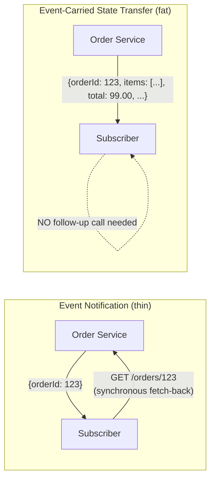
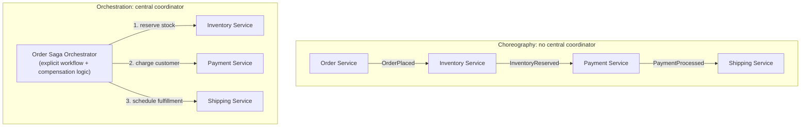
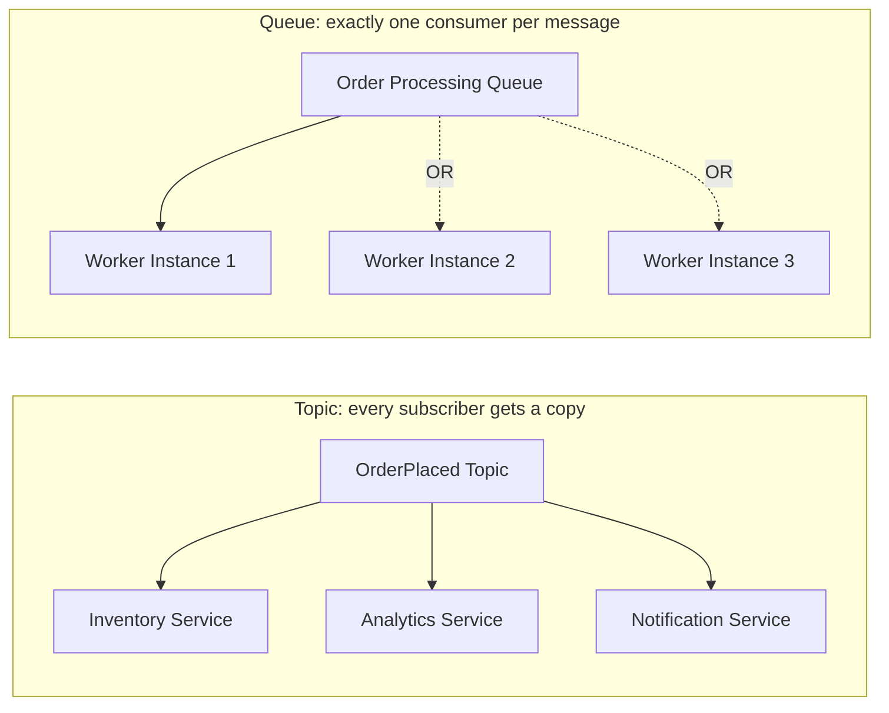

# Module 52 — Event-Driven Architecture: Event Notification vs Event-Carried State Transfer, Choreography vs Orchestration & Pub/Sub Foundations

> Domain: Event-Driven Architecture | Level: Beginner → Expert | Prerequisite: [[../17-Microservices/01-Decomposition-Communication-Strangler-Fig]] §2.4 (asynchronous communication), [[../16-Distributed-Systems/02-Failure-Detection-Idempotency-Outbox]] (Outbox pattern, the reliable-publishing mechanism this entire domain depends on)
> Forward references: dedicated later modules cover Kafka (`19-Kafka`) and RabbitMQ (`20-RabbitMQ`) broker internals, CQRS (`34-CQRS`), Event Sourcing (`35-Event-Sourcing`), Saga (`36-Saga`), and Outbox (`37-Outbox`, expanding on Module 48's introduction) in full depth — this module establishes the architectural vocabulary and decision framework those later modules build on.

---

## 1. Fundamentals

### What is Event-Driven Architecture, and why is it a distinct architectural discipline from simply "using a message queue"?
Event-Driven Architecture (EDA) is an architectural style where services communicate primarily by producing and reacting to **events** — immutable facts about something that has already happened (`OrderPlaced`, `PaymentProcessed`, `InventoryReserved`) — rather than by direct request/response calls. It is a distinct discipline from merely adopting a message queue as a transport detail because EDA requires deliberate decisions about **event semantics** (what does an event actually represent — a notification, or the full state?), **workflow coordination** (who decides what happens next — a central coordinator, or the services themselves reacting independently?), and **delivery guarantees** (can an event be processed twice? does order matter?) — get these decisions wrong, and a message-queue-based system inherits distributed-systems complexity (Module 47-48) without gaining EDA's actual benefits (loose coupling, independent scalability, natural audit trail).

### Why does this matter?
Because Module 49 §2.4 already established that asynchronous, event-based communication decouples publisher and subscriber availability — this module goes one level deeper: **not all events are the same kind of event**, and conflating them (using a lightweight notification where full state transfer was needed, or vice versa) is a common, costly architectural mistake; similarly, **not all multi-step workflows should be coordinated the same way** (choreography vs. orchestration), and choosing incorrectly produces either an untraceable, tangled web of implicit dependencies or an unnecessarily centralized bottleneck.

### When does this matter?
Any system where a single business action triggers multiple downstream effects across services (an order placement triggering inventory reservation, payment processing, shipping notification, and analytics) — precisely the multi-service coordination problem Module 43's Amazon case study and Module 48's Outbox pattern already introduced in outline; this module provides the deeper conceptual toolkit for those scenarios.

### How does it work (30,000-ft view)?
```
Event types: Event Notification (thin: "something happened, go fetch details if you need them")
             vs Event-Carried State Transfer (fat: "something happened, here's ALL the data you need")
             vs Event Sourcing (events ARE the source of truth, not just a notification of a state change --
                                  full depth in the dedicated Module 35)
Coordination: Choreography (each service reacts to events independently, no central coordinator)
             vs Orchestration (a central coordinator explicitly directs each step of a workflow)
Pub/Sub:     Topics/Exchanges (many subscribers can independently receive the same event) vs
             Queues (competing consumers, each message processed by exactly one consumer)
```

---

## 2. Deep Dive

### 2.1 Event Notification — Thin Events, Fetch-on-Demand
An Event Notification carries the **minimum information necessary** to identify what happened (`{ "eventType": "OrderPlaced", "orderId": "12345" }`) — subscribers interested in more detail must make a **separate, synchronous call back** to the publishing service's API to fetch the full data they need. This keeps events small and keeps the publishing service as the single, authoritative source of current data (no staleness risk — a subscriber always fetches the current state at the moment it needs it) — but reintroduces a synchronous dependency on the publisher's availability at the exact moment a subscriber processes the event, partially undermining the availability-decoupling benefit Module 49 §2.4 attributed to asynchronous communication in the first place.

### 2.2 Event-Carried State Transfer — Fat Events, Full Self-Sufficiency
An Event-Carried State Transfer event carries **all the data a subscriber is likely to need** embedded directly in the event payload (`{ "eventType": "OrderPlaced", "orderId": "12345", "customerId": "...", "items": [...], "totalAmount": ... }`) — subscribers can process the event entirely from its payload, with **no follow-up call back to the publisher required**, fully preserving the availability decoupling asynchronous communication is meant to provide (directly addressing §2.1's reintroduced synchronous-dependency weakness). The cost: subscribers now hold a **copy** of data that can become stale if the source changes after the event was published (an eventual-consistency risk requiring the same explicit business-stakeholder communication discipline Module 47 §Advanced Q6 established), and event payloads grow larger, with schema-evolution discipline (Module 51 §2.1, applied to event schemas specifically) becoming more consequential as more subscribers depend on more embedded fields.

### 2.3 Choosing Between Notification and State Transfer
The deciding question: **does the subscriber need the data to be perfectly current at the moment of processing, or is "current as of when the event was published" acceptable?** A Shipping service reacting to `OrderPlaced` to begin fulfillment planning generally only needs the order's contents as they existed at placement time (state transfer is appropriate — the order won't retroactively change once placed) — but a Fraud-Detection service that needs the customer's *current* account-standing/risk-score (which may have changed independently since the order was placed) may need to fetch that specific piece of current data itself rather than trusting a potentially-stale embedded value (notification, or a hybrid: state transfer for immutable facts about the event itself, notification/fetch for genuinely mutable, time-sensitive context).

### 2.4 Choreography — Decentralized, Independent Reaction
In a choreographed workflow, each service independently subscribes to the events it cares about and reacts autonomously, with **no central coordinator** dictating the overall sequence — Order Service publishes `OrderPlaced`; Inventory Service, subscribed independently, reacts by reserving stock and publishing `InventoryReserved`; Payment Service, subscribed to `InventoryReserved`, reacts by charging the customer and publishing `PaymentProcessed`; and so on, each service knowing only about the events immediately relevant to itself, with the overall workflow's shape emerging implicitly from the sum of these independent, local reactions rather than being explicitly written down anywhere as a single artifact.

### 2.5 Orchestration — Centralized, Explicit Workflow Control
In an orchestrated workflow, a **single, explicit coordinator** (an orchestrator, directly related to Module 43's Saga-orchestrator pattern) directs each step: it calls Inventory Service to reserve stock, then calls Payment Service to charge the customer, then calls Shipping Service to schedule fulfillment, explicitly sequencing every step and explicitly handling failure/compensation logic (Module 43's Saga compensating-transaction pattern) at each stage — the entire workflow's logic is visible in one place (the orchestrator's own code/state machine), rather than implicitly distributed across many independently-reacting services' subscription logic.

### 2.6 Choreography vs Orchestration — the Trade-off
Choreography's strength is loose coupling (no service needs to know about the overall workflow, only its own immediate reaction) and natural extensibility (adding a new reacting service requires no change to any existing service — it simply subscribes to the relevant existing event) — but its weakness, at scale, is **workflow invisibility**: as the number of participating services and events grows, understanding "what is the actual, current end-to-end order-fulfillment workflow?" requires mentally reconstructing it from many independently-deployed services' subscription logic, with no single artifact describing the whole picture, making debugging a stuck/failed workflow (Module 48's partial-failure ambiguity, now at the workflow level) genuinely difficult. Orchestration's strength is exactly this visibility (the whole workflow is one artifact, directly readable, directly debuggable, with explicit failure/compensation handling defined centrally) — but its weakness is the orchestrator becoming a **central point of coupling** (every participating service's interface is now known to, and depended upon by, the orchestrator) and a potential bottleneck/single point of failure if not itself built resiliently (Module 50's resilience patterns apply directly to the orchestrator's own calls to each participating service).

### 2.7 Topics vs Queues — Fan-out vs Competing Consumers
A **topic** (or exchange, in AMQP terminology) delivers a copy of each published event to **every** independent subscriber — appropriate for choreography, where multiple, independent services each need to react to the same event in their own way (Inventory, Analytics, and Notifications all independently subscribing to `OrderPlaced`). A **queue** delivers each individual message to **exactly one** consumer among a pool of competing consumers (multiple instances of the same service, load-balancing the processing of a single logical stream of work) — appropriate when a single logical unit of work should be processed exactly once by any one available worker, not once per subscriber type (a pool of `OrderProcessor` worker instances competing to pull from a single order-processing queue, where the goal is distributing load across workers, not fanning the same event out to multiple different subscriber types).

## 3. Visual Architecture

# Event-Driven Architecture

Instead of calling services directly, the **Order Service** publishes an event to an event bus. Any interested services subscribe to that event and react independently.

```text
                     Order Service
                           |
                   OrderCreated Event
                           |
                    Amazon EventBridge
      ------------------------------------------------
      |               |              |               |
Payment Service  Inventory Service  Email Service  Analytics Service
```

# Event-Driven Architecture Using AWS

In an **AWS Event-Driven Architecture (EDA)**, microservices do **not** communicate by calling each other directly. Instead, they communicate through **events** using services such as **Amazon EventBridge**, **Amazon SNS**, and **Amazon SQS**.

The service that produces the event is called the **Producer**, and the services that react to the event are called **Consumers**.

---

# AWS Architecture

```text
                          Customer
                              |
                              |
                     Amazon API Gateway
                              |
                    Amazon ECS / EKS / Lambda
                              |
                        Order Service
                              |
                   Save Order in Database
                              |
                Publish OrderCreated Event
                              |
                      Amazon EventBridge
                              |
   ------------------------------------------------------------------
   |                 |                 |                |             |
Payment Service  Inventory Service  Email Service  Analytics Service  Loyalty Service
   |                 |                 |                |             |
Aurora          DynamoDB          Amazon SES       Redshift        DynamoDB
```

---

### Event Notification vs Event-Carried State Transfer


### Choreography vs Orchestration


### Topics (Fan-out) vs Queues (Competing Consumers)


## 4. Production Example
**Scenario**: An order-fulfillment system originally used choreography — Order Service published `OrderPlaced`; Inventory, Payment, Shipping, and Notification services each independently subscribed and reacted, publishing their own downstream events in turn. This worked well for the first year with four participating services. As the system grew to twelve independently-reacting services (fraud checks, loyalty-points accrual, tax calculation, personalized-recommendation-refresh, and others added incrementally over time, each simply subscribing to whichever existing event was relevant), a customer complaint about a stuck order (payment succeeded, but shipping never triggered) took an on-call engineer **over three hours** to diagnose — there was no single artifact describing the full, current workflow; the engineer had to manually inspect the subscription configuration of all twelve services to reconstruct which service was supposed to react to which event, eventually discovering that a recently-added Fraud-Check service had been inserted **between** `PaymentProcessed` and the event Shipping subscribed to, was silently failing for this specific order's currency (an edge case), and Shipping was simply never receiving the event it expected because Fraud-Check's failure meant its downstream event was never published — with distributed tracing (Module 50 §2.5) only partially helping, since a choreographed workflow's "trace" isn't a single call chain but a scattered set of independent event-processing spans with no obvious way to know which one *should* have happened next. **Root cause**: choreography's implicit, distributed workflow logic (§2.6's stated weakness) had scaled from "manageable" at 4 services to "genuinely undebuggable without extensive tribal knowledge" at 12, and — critically — no one had explicitly decided this growth threshold warranted revisiting the architectural choice; each new participating service was added incrementally, individually reasonably, with the cumulative complexity never explicitly evaluated as a whole. **Fix**: migrated the core order-fulfillment workflow (the ordered sequence: inventory → payment → fraud-check → shipping) to an explicit **orchestrator** (Module 43's Saga-orchestrator pattern), while leaving genuinely independent, non-sequential reactions (analytics, loyalty-points accrual, recommendation-refresh — services that react to events but don't gate or depend on each other's completion) as choreography, since forcing those into the orchestrator would have added unnecessary central coupling for interactions that were genuinely fine being decentralized. **Lesson**: this is precisely §2.6's trade-off playing out concretely — choreography's loose coupling and easy extensibility are real benefits at a small scale, but the workflow-invisibility cost grows with the number of participating services and the presence of any genuine sequential/conditional dependency between steps; the corrected architecture uses a **hybrid** (orchestration for the sequential, failure-sensitive core workflow; choreography for the independent, non-gating side reactions), directly the pattern most mature EDA systems converge on rather than treating choreography-vs-orchestration as a single, system-wide, one-time choice.

## 5. Best Practices
- Choose Event-Carried State Transfer by default for immutable facts about what happened (preserving availability decoupling); use Event Notification only when subscribers genuinely need guaranteed-current data at processing time.
- Use choreography for independent, non-sequential reactions to an event (analytics, notifications, side effects with no ordering dependency on each other); use orchestration for workflows with genuine sequential/conditional steps and centralized failure/compensation handling needs.
- Re-evaluate the choreography-vs-orchestration choice as a workflow's participating-service count and complexity grow — a choice reasonable at 4 services may not remain reasonable at 12 (§4).
- Use topics for fan-out to multiple independent subscriber types; use queues for load-balancing a single logical stream of work across competing consumer instances.
- Apply the Outbox pattern (Module 48) for reliably publishing every event as part of the same transaction that changes the publishing service's own state — never publish an event as a separate, non-transactional step that could be lost or duplicated relative to the state change it describes.

## 6. Anti-patterns
- Using Event Notification for interactions that don't tolerate the reintroduced synchronous fetch-back dependency, silently undermining the availability decoupling asynchronous communication was chosen to provide.
- Using Event-Carried State Transfer for genuinely time-sensitive, frequently-changing data, creating a stale-data risk subscribers may not realize they're exposed to.
- Growing a choreographed workflow indefinitely without ever re-evaluating whether its increasing complexity now warrants an explicit orchestrator (§4's incident).
- Using a queue (competing consumers) where a topic (fan-out) was needed, causing only one of several intended subscriber types to actually receive and process a given event.
- Publishing events non-transactionally, alongside (rather than as part of) the state change they describe, reopening the dual-write problem Module 48's Outbox pattern exists specifically to close.

---

## 10. Interview Questions

### Basic (10)
1. **Q: What is an event, in the EDA sense?** **A:** An immutable fact about something that has already happened.
2. **Q: What is Event Notification?** **A:** A thin event carrying minimal data, requiring subscribers to fetch full details separately if needed.
3. **Q: What is Event-Carried State Transfer?** **A:** A fat event carrying all the data a subscriber is likely to need, requiring no follow-up call.
4. **Q: What is the main trade-off between Event Notification and Event-Carried State Transfer?** **A:** Notification preserves data freshness but reintroduces a synchronous dependency; state transfer preserves availability decoupling but risks staleness.
5. **Q: What is choreography?** **A:** A workflow coordination style where each service independently subscribes to and reacts to events, with no central coordinator.
6. **Q: What is orchestration?** **A:** A workflow coordination style where a central coordinator explicitly directs each step of a multi-service workflow.
7. **Q: What is the main weakness of choreography at scale?** **A:** Workflow invisibility — no single artifact describes the overall, current workflow.
8. **Q: What is the main weakness of orchestration?** **A:** The orchestrator becomes a central point of coupling and a potential bottleneck/single point of failure.
9. **Q: What is the difference between a topic and a queue?** **A:** A topic delivers a copy of each event to every subscriber (fan-out); a queue delivers each message to exactly one consumer among competing consumers.
10. **Q: Why must events be published via the Outbox pattern rather than as a separate, non-transactional step?** **A:** To avoid the dual-write problem — an event could otherwise be lost or duplicated relative to the state change it describes.

### Intermediate (10)
1. **Q: Why does Event Notification reintroduce a synchronous dependency that partially undermines asynchronous communication's benefit?** **A:** A subscriber must call back to the publisher to fetch full details, meaning the subscriber's processing now depends on the publisher's availability at that moment — exactly the availability coupling asynchronous communication was meant to avoid.
2. **Q: Why is Event-Carried State Transfer generally preferred for immutable facts but risky for mutable, time-sensitive context?** **A:** Immutable facts (what an order contained at placement time) can't become stale since they never change; mutable context (a customer's current risk score) embedded in an event can drift from the source's actual current value, creating a staleness risk for subscribers relying on it.
3. **Q: Why does choreography's extensibility advantage (adding a new reacting service requires no change to existing services) not fully offset its workflow-invisibility weakness at scale?** **A:** Extensibility only addresses how easy it is to *add* a new reaction; it doesn't address the separate, growing cost of *understanding and debugging* the increasingly complex aggregate workflow that results from many independently-added reactions (§4's incident).
4. **Q: Why does an orchestrator need to apply Module 50's resilience patterns to its own calls to participating services?** **A:** The orchestrator sits directly in the critical path of every workflow step it coordinates; an unprotected, unbounded call to any participating service could cascade into the orchestrator itself becoming unavailable, affecting every in-flight workflow.
5. **Q: Why would using a queue instead of a topic cause only one of several intended subscriber types to receive an event?** **A:** A queue delivers each message to exactly one consumer among competing consumers by design — if Inventory, Analytics, and Notifications are all attached as competing consumers on the same queue rather than independent topic subscribers, only one of them will receive any given event, not all three.
6. **Q: Why did distributed tracing (Module 50 §2.5) only partially help diagnose the §4 incident?** **A:** A choreographed workflow's trace is a scattered set of independent event-processing spans, not a single call chain — tracing shows what *did* happen in each span but doesn't inherently show what *should have* happened next, since no single artifact defines the expected overall workflow.
7. **Q: Why is a hybrid choreography/orchestration approach (§4's fix) often more appropriate than choosing one style system-wide?** **A:** Different interactions within the same system have different actual coordination needs — genuinely sequential, failure-sensitive workflows benefit from orchestration's visibility and compensation handling, while genuinely independent side reactions benefit from choreography's loose coupling, and forcing either style onto interactions that don't fit it adds unnecessary complexity or coupling.
8. **Q: Why does fat-event payload size matter for capacity planning at high event volume, when it might seem negligible at low volume?** **A:** Serialization, network transfer, and broker storage costs scale with payload size multiplied by event volume — a per-event cost that's negligible at low throughput can become a significant, measurable capacity constraint at high throughput.
9. **Q: Why should event-schema design apply data-minimization discipline even for Event-Carried State Transfer's "include what subscribers need" philosophy?** **A:** Convenience-driven inclusion of an entire source record (rather than deliberately selected needed fields) can inadvertently propagate sensitive data to subscribers that don't actually need it, unnecessarily expanding the data's exposure surface.
10. **Q: Why does compromising an orchestrator represent a larger security blast radius than compromising a single choreographed service?** **A:** The orchestrator holds centralized control over an entire multi-service workflow's steps; compromising it could allow manipulation of the whole business process, whereas compromising one choreographed service's independent reaction logic affects only that service's own narrow scope.

### Advanced (10)
1. **Q: Diagnose the §4 incident from first principles, and design the specific, ongoing architectural governance practice that would have caught the choreography-to-orchestration threshold being crossed before a three-hour diagnostic incident occurred.**
   **A:** Root cause: choreography was extended incrementally, service by service, with no explicit checkpoint evaluating whether the workflow's aggregate complexity still justified the decentralized style. Governance practice: maintain a **living, explicit workflow diagram/registry** (even for a choreographed workflow — generated or manually maintained, showing every event and every subscribing service's reaction) as a first-class, reviewed artifact whenever a new service subscribes to an existing event in a known business workflow, with an explicit review trigger ("does this workflow now have a genuine sequential/conditional dependency between steps, or exceed N participating services?") prompting a deliberate choreography-vs-orchestration re-evaluation — converting an implicit, never-revisited architectural choice into one with an explicit, periodic checkpoint, directly this course's recurring "convert tribal, incrementally-accumulated risk into an explicit, governed checkpoint" pattern.
2. **Q: A team argues that since choreography is "more decoupled," it should always be preferred over orchestration as a default, with orchestration used only as an exception when explicitly justified. Evaluate this as a Principal Engineer.**
   **A:** Push back on treating decoupling as an unconditional good, independent of whether a genuine sequential/conditional/compensating-transaction dependency actually exists between the workflow's steps (§2.6) — a workflow with real ordering and failure-handling requirements (Module 43's Saga pattern: if payment fails, inventory reservation must be released) forced into choreography doesn't eliminate that dependency, it merely makes it **implicit** (embedded in the specific sequence of events each service happens to subscribe to) rather than **explicit** (visible in an orchestrator's code) — implicit dependencies are not less real, only harder to see and debug (§4), so "always prefer choreography" is optimizing for a superficial decoupling metric at the cost of genuine workflow visibility precisely where visibility matters most (failure-sensitive, multi-step business processes).
3. **Q: Design a strategy for evolving a chosen orchestrator's own workflow definition (the explicit sequence of steps) over time, without breaking already-in-flight workflow instances that started under a previous version of the workflow definition.**
   **A:** This directly parallels Module 51 §2.1's API-versioning discipline, now applied to workflow *definitions* rather than API contracts: an in-flight workflow instance must continue executing against the **version of the workflow definition it started under**, not be silently migrated mid-flight to a new definition version (which could skip steps it already should have completed under the old definition, or duplicate/misalign compensation logic) — persist the workflow-definition version alongside each workflow instance's own state, and only apply new workflow-definition versions to newly-started instances, directly the same "don't retroactively change the contract underneath something already relying on the old one" principle, now applied to a stateful, in-flight process rather than a stateless request/response contract.
4. **Q: Explain how you would decide, for a specific piece of data, whether to embed it in an Event-Carried State Transfer payload versus relying on Event Notification's fetch-back, when the data's mutability is ambiguous (neither obviously immutable nor obviously highly time-sensitive).**
   **A:** Apply §2.3's deciding question rigorously: explicitly identify the **business tolerance** for staleness of that specific piece of data at the specific point a subscriber will use it — if the answer is "a value slightly out of date by the time this subscriber processes the event would not change any correct business decision" (embed it, state transfer), versus "an out-of-date value here could cause an incorrect business decision with real consequence" (fetch fresh, notification) — this reframes an ambiguous mutability question into a concrete, business-consequence-driven question that's answerable even when the data's abstract "mutability" isn't obviously one extreme or the other.
5. **Q: A choreographed system experiences a partial failure where one service in a multi-step reaction chain fails to process an event and never publishes its own downstream event, silently stalling the workflow with no error surfaced anywhere (directly the failure mode in §4, generalized). Design a systemic detection mechanism, independent of any specific incident's manual diagnosis.**
   **A:** Implement **workflow-completion monitoring** as a standing observability practice: for any known, important choreographed business workflow, define its expected terminal event (e.g., `OrderShipped`) and expected maximum time-to-completion from its triggering event (`OrderPlaced`); a background monitor tracks triggering events without a corresponding terminal event within the expected window and alerts proactively — converting workflow-stall detection from "a customer complains, then a multi-hour manual investigation begins" (§4) into an automated, proactive signal, directly Module 50's golden-signals monitoring philosophy applied at the cross-service workflow level rather than the single-service level.
6. **Q: How would you decide whether a specific side-effect service (like the Fraud-Check service inserted in §4) should be a gating step in an orchestrated sequence or an independent, non-gating choreographed reaction?**
   **A:** The deciding question: does the overall business workflow's correctness *require* this step's successful completion before subsequent steps proceed (a true gate — fraud-check failing should legitimately halt/reverse the order, making it an orchestrated, sequential, compensable step) or is it a valuable-but-non-essential side effect that shouldn't block the core workflow if it fails (in which case it should be choreographed, reacting independently, with its own failure handled/monitored separately without stalling shipping) — §4's incident occurred precisely because Fraud-Check was *implicitly* treated as a gate (Shipping's event depended on it) without ever being *explicitly* designed as one, exactly the ambiguity this deciding question resolves.
7. **Q: Design an approach for testing a choreographed workflow's overall correctness end-to-end, given that Module 51 §2.2 already established that full end-to-end tests don't scale well across many services.**
   **A:** Reuse Module 51's contract-testing philosophy at the *event* level rather than the API level: each service publishes a documented, versioned contract describing which events it consumes and which events it produces in response (including under specific failure conditions), and a lightweight, narrow integration test verifies each individual service's contract compliance in isolation (given event X, does this service correctly produce event Y, without needing every other participating service running) — combined with Advanced Q5's workflow-completion monitoring in production as the ongoing, live verification that the assembled, whole workflow (the sum of every service's individually-contract-tested behavior) still functions correctly end-to-end, since no practical test suite can fully substitute for observing the real, assembled system's behavior at scale.
8. **Q: A Principal Engineer is asked to decide the broker technology for a new EDA initiative before the dedicated Kafka/RabbitMQ modules are covered. What conceptual criteria from this module alone should drive that decision, independent of specific broker feature comparisons?**
   **A:** From this module's concepts alone: does the system's dominant pattern favor topics/fan-out (many independent choreographed subscribers per event, favoring a broker with strong native pub/sub-with-independent-subscriber-offset support) or queues/competing-consumers (load-balanced processing of a single logical work stream, favoring simpler queue semantics)? Does the system need long-lived, replayable event history (supporting late-joining subscribers or Event Sourcing's full-history-as-source-of-truth model, previewed in §2's opening) or only transient, consume-once delivery? These two questions alone meaningfully narrow the field before any broker-specific feature comparison (covered in full in Modules 53's Kafka-adjacent depth and the dedicated `19-Kafka`/`20-RabbitMQ` modules) becomes necessary.
9. **Q: Critique this claim: "Since orchestration gives us full visibility and centralized failure handling, we should orchestrate every multi-service interaction in our system, including simple, independent side effects like sending a confirmation email."** 
   **A:** Push back — orchestrating a simple, non-gating, independent side effect (sending a confirmation email, which doesn't need to block or be blocked by any other step, and whose failure doesn't require compensating any other service's action) adds unnecessary central coupling (the orchestrator now explicitly depends on and calls the email service) for a step that gains nothing from centralized visibility or compensation logic, since there's nothing to compensate and no sequencing dependency to make visible — directly Advanced Q6's gating-vs-non-gating distinction misapplied in the opposite direction from Advanced Q2's critique: just as forcing a genuinely sequential workflow into choreography hides real dependencies, forcing a genuinely independent reaction into orchestration adds coupling with no corresponding benefit; match the coordination style to each interaction's actual coordination need, not a single, system-wide default in either direction.
10. **Q: As a Principal Engineer establishing EDA standards for a large organization, design the decision framework (a concise, applicable checklist) you would provide to teams for choosing event type (notification vs. state transfer) and coordination style (choreography vs. orchestration) for a new workflow, synthesizing this entire module.**
    **A:** Event type: (1) does the subscriber need guaranteed-current data at processing time, or is data current-as-of-publish-time acceptable? — Notification if the former, State Transfer if the latter (§2.3); (2) does the data being embedded carry sensitive information beyond what most subscribers need? — apply data-minimization regardless of choice (§8). Coordination style: (3) does this specific step have a genuine sequential/conditional dependency on another step's outcome, or a genuine compensating-action need if it fails? — Orchestration if yes (Advanced Q6), Choreography if no (Advanced Q9); (4) as the workflow's participating-service count or complexity grows, is there a periodic, explicit re-evaluation checkpoint (Advanced Q1) rather than indefinite, unexamined accretion? This four-question checklist directly operationalizes §2.3's and §2.6's conceptual distinctions into a repeatable, applicable team-level decision process, avoiding both the "always choreograph" and "always orchestrate" false-default failure modes Advanced Q2 and Q9 each critique from opposite directions.

---

## 11. Coding Exercises

### Easy — Event Notification with fetch-back (§2.1)
```csharp
public class ThinOrderPlacedEvent
{
    public string OrderId { get; set; } = default!; // minimal payload -- just enough to identify the event
}

public class InventoryEventHandler
{
    private readonly IOrderServiceClient _orderClient; // synchronous fetch-back REQUIRED
    public async Task HandleAsync(ThinOrderPlacedEvent evt)
    {
        var order = await _orderClient.GetOrderAsync(evt.OrderId); // reintroduces availability dependency
        await _inventoryReservation.ReserveAsync(order.Items);
    }
}
```

### Medium — Event-Carried State Transfer (§2.2, availability-decoupled)
```csharp
public class FatOrderPlacedEvent
{
    public string OrderId { get; set; } = default!;
    public string CustomerId { get; set; } = default!;
    public List<OrderItem> Items { get; set; } = new();  // full data embedded -- immutable fact about placement
    public decimal TotalAmount { get; set; }
    // Deliberately OMITS current customer risk-score -- that's mutable, time-sensitive context (§2.3),
    // fetched fresh by Fraud-Check if/when it needs it, NOT embedded here.
}

public class ShippingEventHandler
{
    public Task HandleAsync(FatOrderPlacedEvent evt)
    {
        // NO call back to Order Service needed -- fully self-sufficient, even if Order Service is down.
        return _shippingScheduler.ScheduleAsync(evt.OrderId, evt.Items);
    }
}
```

### Hard — Choreographed reaction chain with a workflow-completion monitor (§Advanced Q5, mitigating §4)
```csharp
public class WorkflowCompletionMonitor : BackgroundService
{
    protected override async Task ExecuteAsync(CancellationToken ct)
    {
        while (!ct.IsCancellationRequested)
        {
            var stalledOrders = await _repository.FindOrdersWithoutTerminalEventAsync(
                triggeringEvent: "OrderPlaced",
                terminalEvent: "OrderShipped",
                maxAge: TimeSpan.FromHours(2)); // expected completion window for this workflow

            foreach (var stalled in stalledOrders)
                await _alerting.RaiseAsync($"Order {stalled.OrderId} stalled: OrderPlaced at " +
                    $"{stalled.PlacedAt}, no OrderShipped after 2h -- workflow likely stuck mid-chain");

            await Task.Delay(TimeSpan.FromMinutes(5), ct);
        }
        // Converts §4's "customer complains, 3-hour manual investigation" into a proactive alert,
        // WITHOUT requiring a full migration to orchestration for workflows staying choreographed.
    }
}
```

### Expert — Orchestrated Saga with explicit, versioned workflow definition (§Advanced Q3)
```csharp
public class OrderFulfillmentOrchestrator
{
    public async Task<WorkflowResult> ExecuteAsync(OrderPlacedEvent trigger)
    {
        var instance = new WorkflowInstance(trigger.OrderId, workflowDefinitionVersion: "v2"); // PINNED at start

        try
        {
            await _inventoryClient.ReserveAsync(trigger.OrderId, instance.DefinitionVersion);
            await _paymentClient.ChargeAsync(trigger.OrderId, instance.DefinitionVersion);
            await _fraudCheckClient.VerifyAsync(trigger.OrderId, instance.DefinitionVersion); // explicit GATE
            await _shippingClient.ScheduleAsync(trigger.OrderId, instance.DefinitionVersion);
            return WorkflowResult.Success(instance);
        }
        catch (FraudCheckFailedException)
        {
            // Explicit compensation -- visible HERE, not scattered across independently-reacting services.
            await _paymentClient.RefundAsync(trigger.OrderId);
            await _inventoryClient.ReleaseReservationAsync(trigger.OrderId);
            return WorkflowResult.Compensated(instance, reason: "Fraud check failed");
        }
        // A NEW workflow definition (e.g., "v3", adding a loyalty-points step) only applies to
        // NEWLY-STARTED instances -- this in-flight instance stays on "v2" for its entire lifecycle.
    }
}
```
**Discussion**: this orchestrator makes Fraud-Check an explicit **gate** with explicit compensation (directly resolving Advanced Q6's gating-vs-non-gating ambiguity that caused §4's incident) — had the original system used this pattern instead of choreography for the sequential core workflow, Shipping's dependency on Fraud-Check's outcome would have been visible in one place, and the on-call engineer would have found the stuck workflow in minutes by reading this one method, not three hours reconstructing implicit subscription relationships across twelve independently-deployed services.

---

## 12–17. System Design / LLD / Debugging / Decision / Case Study / Principal

*(§4's incident, the four §11 exercises, and the Advanced-tier Q&A — especially Advanced Q1's governance checkpoint, Advanced Q5's workflow-completion monitoring, and Advanced Q10's synthesized decision framework — collectively constitute this module's system-design, debugging, and Principal-Engineer-level content. Full Saga-specific compensating-transaction depth is in Module 43 and the later dedicated `36-Saga` module; this module's orchestration content is deliberately the conceptual/decision-framework layer above that implementation depth.)*

## 18. Revision
**Key takeaways**: Event Notification (thin, fetch-on-demand) trades availability-decoupling for data freshness; Event-Carried State Transfer (fat, self-sufficient) trades data-freshness risk for full availability decoupling — choose based on each specific piece of data's actual staleness tolerance (§2.3), not a blanket system-wide default. Choreography (decentralized, independently-reacting services) offers loose coupling and easy extensibility but risks workflow invisibility as complexity grows (§4); orchestration (a central, explicit coordinator) offers visibility and centralized compensation handling but adds central coupling — most mature systems use a deliberate hybrid, orchestrating genuinely sequential/gating workflows and choreographing genuinely independent side reactions (§Advanced Q6, Q9), with an explicit, periodic re-evaluation checkpoint as either style's complexity grows (§Advanced Q1). Topics serve fan-out to independent subscribers; queues serve load-balanced competing consumers — using the wrong one silently breaks the intended delivery semantics.

---

**Next**: Continuing to Module 53 — Event-Driven Architecture: Event Schema Design & Versioning, Ordering & Partitioning, Delivery Semantics (At-Least-Once/Exactly-Once), Idempotent Consumers & Dead Letter Queues, completing the core `18-Event-Driven-Architecture` conceptual arc before the dedicated `19-Kafka`/`20-RabbitMQ` broker-specific modules.
