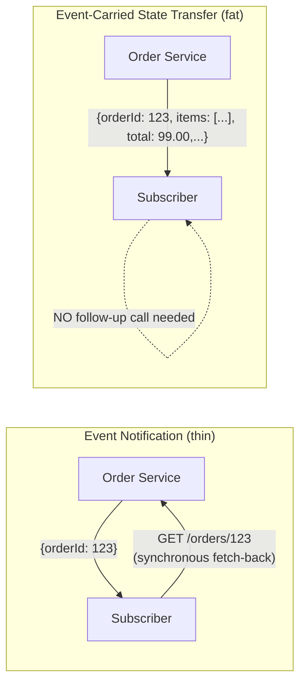
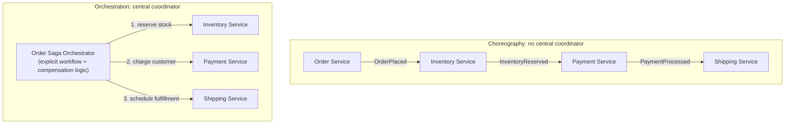
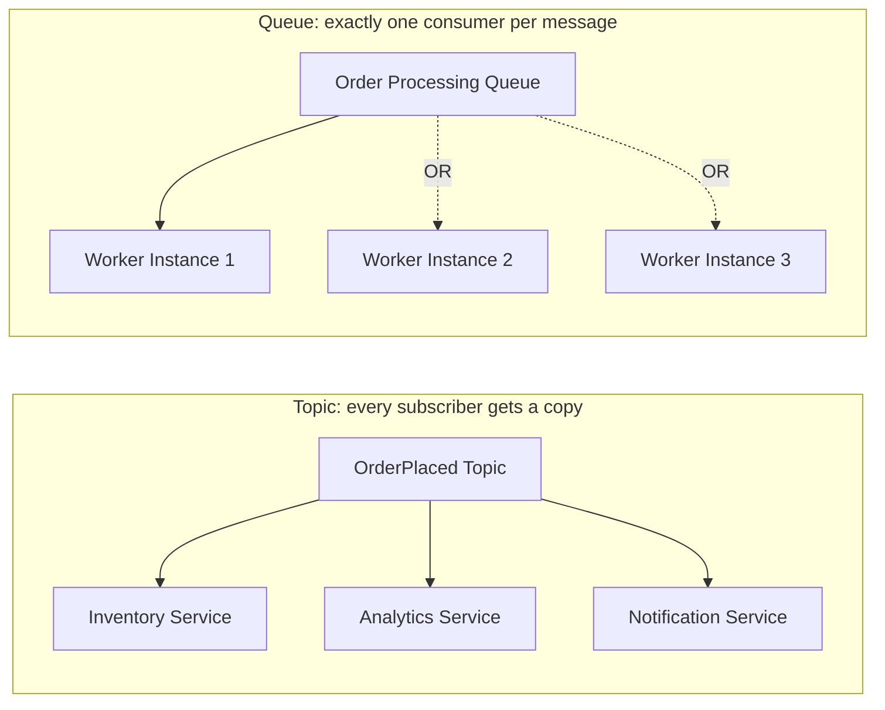
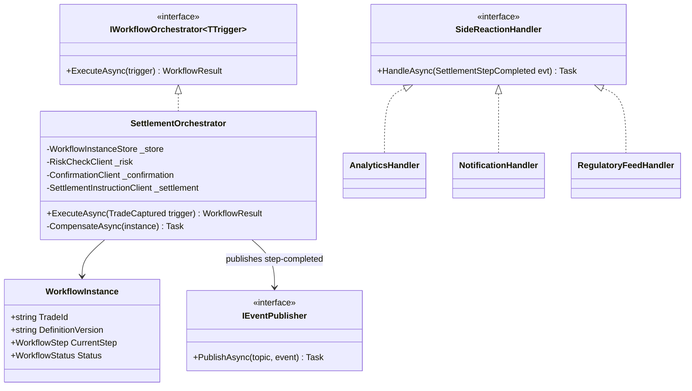
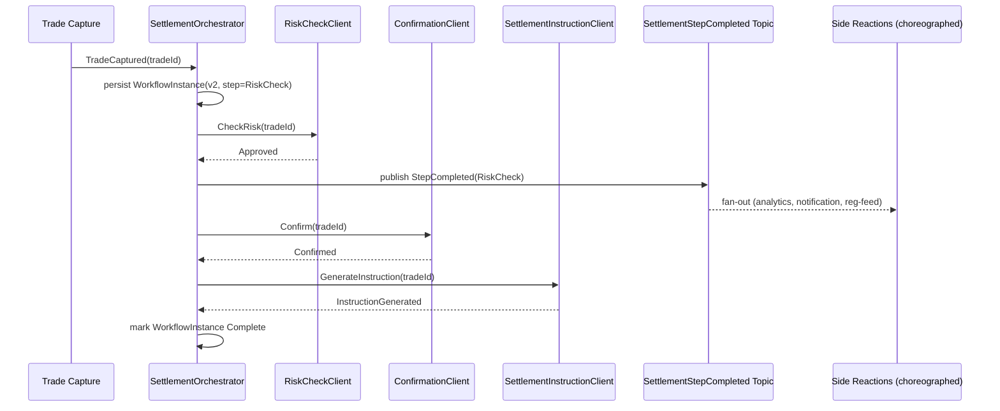

# Module 52 — Event-Driven Architecture: Event Notification vs Event-Carried State Transfer, Choreography vs Orchestration & Pub/Sub Foundations

> Domain: Event-Driven Architecture | Level: Beginner → Expert | Prerequisite: [[../17-Microservices/01-Decomposition-Communication-Strangler-Fig]] (asynchronous communication), [[../16-Distributed-Systems/02-Failure-Detection-Idempotency-Outbox]] (Outbox pattern, the reliable-publishing mechanism this entire domain depends on)
> Forward references: dedicated later modules cover Kafka (`19-Kafka`) and RabbitMQ (`20-RabbitMQ`) broker internals, CQRS (`34-CQRS`), Event Sourcing (`35-Event-Sourcing`), Saga (`36-Saga`), and Outbox (`37-Outbox`, expanding on the introduction) in full depth — this module establishes the architectural vocabulary and decision framework those later modules build on.

---

## 1. Fundamentals

### What is Event-Driven Architecture, and why is it a distinct architectural discipline from simply "using a message queue"?
Event-Driven Architecture (EDA) is an architectural style where services communicate primarily by producing and reacting to **events** — immutable facts about something that has already happened (`OrderPlaced`, `PaymentProcessed`, `InventoryReserved`) — rather than by direct request/response calls. It is a distinct discipline from merely adopting a message queue as a transport detail because EDA requires deliberate decisions about **event semantics** (what does an event actually represent — a notification, or the full state?), **workflow coordination** (who decides what happens next — a central coordinator, or the services themselves reacting independently?), and **delivery guarantees** (can an event be processed twice? does order matter?) — get these decisions wrong, and a message-queue-based system inherits distributed-systems complexity (48) without gaining EDA's actual benefits (loose coupling, independent scalability, natural audit trail).

### Why does this matter?
Because already established that asynchronous, event-based communication decouples publisher and subscriber availability — this module goes one level deeper: **not all events are the same kind of event**, and conflating them (using a lightweight notification where full state transfer was needed, or vice versa) is a common, costly architectural mistake; similarly, **not all multi-step workflows should be coordinated the same way** (choreography vs. orchestration), and choosing incorrectly produces either an untraceable, tangled web of implicit dependencies or an unnecessarily centralized bottleneck.

### When does this matter?
Any system where a single business action triggers multiple downstream effects across services (an order placement triggering inventory reservation, payment processing, shipping notification, and analytics) — precisely the multi-service coordination problem the Amazon case study and the Outbox pattern already introduced in outline; this module provides the deeper conceptual toolkit for those scenarios.

### How does it work (30,000-ft view)?
```
Event types: Event Notification (thin: "something happened, go fetch details if you need them")
 vs Event-Carried State Transfer (fat: "something happened, here's ALL the data you need")
 vs Event Sourcing (events ARE the source of truth, not just a notification of a state change --
 full depth in the dedicated)
Coordination: Choreography (each service reacts to events independently, no central coordinator)
 vs Orchestration (a central coordinator explicitly directs each step of a workflow)
Pub/Sub: Topics/Exchanges (many subscribers can independently receive the same event) vs
 Queues (competing consumers, each message processed by exactly one consumer)
```

---

## 2. Deep Dive

### 2.1 Event Notification — Thin Events, Fetch-on-Demand
An Event Notification carries the **minimum information necessary** to identify what happened (`{ "eventType": "OrderPlaced", "orderId": "12345" }`) — subscribers interested in more detail must make a **separate, synchronous call back** to the publishing service's API to fetch the full data they need. This keeps events small and keeps the publishing service as the single, authoritative source of current data (no staleness risk — a subscriber always fetches the current state at the moment it needs it) — but reintroduces a synchronous dependency on the publisher's availability at the exact moment a subscriber processes the event, partially undermining the availability-decoupling benefit attributed to asynchronous communication in the first place.

### 2.2 Event-Carried State Transfer — Fat Events, Full Self-Sufficiency
An Event-Carried State Transfer event carries **all the data a subscriber is likely to need** embedded directly in the event payload (`{ "eventType": "OrderPlaced", "orderId": "12345", "customerId": "...", "items": [...], "totalAmount":... }`) — subscribers can process the event entirely from its payload, with **no follow-up call back to the publisher required**, fully preserving the availability decoupling asynchronous communication is meant to provide (directly addressing the reintroduced synchronous-dependency weakness). The cost: subscribers now hold a **copy** of data that can become stale if the source changes after the event was published (an eventual-consistency risk requiring the same explicit business-stakeholder communication discipline §Advanced Q6 established), and event payloads grow larger, with schema-evolution discipline (applied to event schemas specifically) becoming more consequential as more subscribers depend on more embedded fields.

### 2.3 Choosing Between Notification and State Transfer
The deciding question: **does the subscriber need the data to be perfectly current at the moment of processing, or is "current as of when the event was published" acceptable?** A Shipping service reacting to `OrderPlaced` to begin fulfillment planning generally only needs the order's contents as they existed at placement time (state transfer is appropriate — the order won't retroactively change once placed) — but a Fraud-Detection service that needs the customer's *current* account-standing/risk-score (which may have changed independently since the order was placed) may need to fetch that specific piece of current data itself rather than trusting a potentially-stale embedded value (notification, or a hybrid: state transfer for immutable facts about the event itself, notification/fetch for genuinely mutable, time-sensitive context).

### 2.4 Choreography — Decentralized, Independent Reaction
In a choreographed workflow, each service independently subscribes to the events it cares about and reacts autonomously, with **no central coordinator** dictating the overall sequence — Order Service publishes `OrderPlaced`; Inventory Service, subscribed independently, reacts by reserving stock and publishing `InventoryReserved`; Payment Service, subscribed to `InventoryReserved`, reacts by charging the customer and publishing `PaymentProcessed`; and so on, each service knowing only about the events immediately relevant to itself, with the overall workflow's shape emerging implicitly from the sum of these independent, local reactions rather than being explicitly written down anywhere as a single artifact.

### 2.5 Orchestration — Centralized, Explicit Workflow Control
In an orchestrated workflow, a **single, explicit coordinator** (an orchestrator, directly related to the Saga-orchestrator pattern) directs each step: it calls Inventory Service to reserve stock, then calls Payment Service to charge the customer, then calls Shipping Service to schedule fulfillment, explicitly sequencing every step and explicitly handling failure/compensation logic (the Saga compensating-transaction pattern) at each stage — the entire workflow's logic is visible in one place (the orchestrator's own code/state machine), rather than implicitly distributed across many independently-reacting services' subscription logic.

### 2.6 Choreography vs Orchestration — the Trade-off
Choreography's strength is loose coupling (no service needs to know about the overall workflow, only its own immediate reaction) and natural extensibility (adding a new reacting service requires no change to any existing service — it simply subscribes to the relevant existing event) — but its weakness, at scale, is **workflow invisibility**: as the number of participating services and events grows, understanding "what is the actual, current end-to-end order-fulfillment workflow?" requires mentally reconstructing it from many independently-deployed services' subscription logic, with no single artifact describing the whole picture, making debugging a stuck/failed workflow (the partial-failure ambiguity, now at the workflow level) genuinely difficult. Orchestration's strength is exactly this visibility (the whole workflow is one artifact, directly readable, directly debuggable, with explicit failure/compensation handling defined centrally) — but its weakness is the orchestrator becoming a **central point of coupling** (every participating service's interface is now known to, and depended upon by, the orchestrator) and a potential bottleneck/single point of failure if not itself built resiliently (the resilience patterns apply directly to the orchestrator's own calls to each participating service).

### 2.7 Topics vs Queues — Fan-out vs Competing Consumers
A **topic** (or exchange, in AMQP terminology) delivers a copy of each published event to **every** independent subscriber — appropriate for choreography, where multiple, independent services each need to react to the same event in their own way (Inventory, Analytics, and Notifications all independently subscribing to `OrderPlaced`). A **queue** delivers each individual message to **exactly one** consumer among a pool of competing consumers (multiple instances of the same service, load-balancing the processing of a single logical stream of work) — appropriate when a single logical unit of work should be processed exactly once by any one available worker, not once per subscriber type (a pool of `OrderProcessor` worker instances competing to pull from a single order-processing queue, where the goal is distributing load across workers, not fanning the same event out to multiple different subscriber types).

## 3. Visual Architecture

### Event-Driven Architecture — the Core Shape

Instead of calling services directly, the **Order Service** publishes an event to an event bus. Any interested services subscribe to that event and react independently.

```text
                            Order Service
                                  |
                       publishes OrderCreated
                                  |
                                  v
                       +---------------------+
                       | Amazon EventBridge  |
                       +---------------------+
                                  |
        +-----------------+-------+--------+----------------+
        |                 |                |                |
        v                 v                v                v
 Payment Service  Inventory Service  Email Service  Analytics Service
```

### Event-Driven Architecture Using AWS

In an **AWS Event-Driven Architecture (EDA)**, microservices do **not** communicate by calling each other directly. Instead, they communicate through **events** using services such as **Amazon EventBridge**, **Amazon SNS**, and **Amazon SQS**.

The service that produces the event is called the **Producer**, and the services that react to the event are called **Consumers**.

---

### AWS Architecture — Producer, Bus, Consumers, and Each Consumer's Own Store

```text
                                       Customer
                                           |
                                           v
                                  Amazon API Gateway
                                           |
                                           v
                               Amazon ECS / EKS / Lambda
                                           |
                                           v
                                     Order Service
                                           |
                                Save Order in Database
                                           |
                              Publish OrderCreated Event
                                           |
                                           v
                                +---------------------+
                                | Amazon EventBridge  |
                                +---------------------+
                                           |
        +-----------------+----------------+----------------+-----------------+
        |                 |                |                |                 |
        v                 v                v                v                 v
 Payment Service  Inventory Service  Email Service  Analytics Service  Loyalty Service
        |                 |                |                |                 |
        v                 v                v                v                 v
     Aurora           DynamoDB        Amazon SES         Redshift          DynamoDB
```

Read the bottom two rows together: each consumer owns **its own** datastore, chosen for its own access pattern (Aurora for the payments ledger's relational integrity, DynamoDB for key-lookup loyalty balances, Redshift for analytical scans). That per-consumer store ownership is not incidental to the diagram — it is the property that makes the consumers genuinely independent, and it is what would be lost if they shared a database behind the event bus.

---

### Event Notification vs Event-Carried State Transfer

```mermaid
graph LR
 subgraph "Event Notification (thin)"
 Pub1[Order Service] -->|"{orderId: 123}"| Sub1[Subscriber]
 Sub1 -->|"GET /orders/123<br/>(synchronous fetch-back)"| Pub1
 end
 subgraph "Event-Carried State Transfer (fat)"
 Pub2[Order Service] -->|"{orderId: 123, items: [...], total: 99.00,...}"| Sub2[Subscriber]
 Sub2 -.->|"NO follow-up call needed"| Sub2
 end
```

### Choreography vs Orchestration

```mermaid
graph TB
 subgraph "Choreography: no central coordinator"
 O1[Order Service] -->|"OrderPlaced"| I1[Inventory Service]
 I1 -->|"InventoryReserved"| P1[Payment Service]
 P1 -->|"PaymentProcessed"| S1[Shipping Service]
 end
 subgraph "Orchestration: central coordinator"
 Orch["Order Saga Orchestrator<br/>(explicit workflow + compensation logic)"]
 Orch -->|"1. reserve stock"| I2[Inventory Service]
 Orch -->|"2. charge customer"| P2[Payment Service]
 Orch -->|"3. schedule fulfillment"| S2[Shipping Service]
 end
```

### Topics (Fan-out) vs Queues (Competing Consumers)

```mermaid
graph LR
 subgraph "Topic: every subscriber gets a copy"
 T[OrderPlaced Topic] --> TS1[Inventory Service]
 T --> TS2[Analytics Service]
 T --> TS3[Notification Service]
 end
 subgraph "Queue: exactly one consumer per message"
 Q[Order Processing Queue] --> QW1[Worker Instance 1]
 Q -.->|"OR"| QW2[Worker Instance 2]
 Q -.->|"OR"| QW3[Worker Instance 3]
 end
```

## 4. Production Example
**Scenario**: An order-fulfillment system originally used choreography — Order Service published `OrderPlaced`; Inventory, Payment, Shipping, and Notification services each independently subscribed and reacted, publishing their own downstream events in turn. This worked well for the first year with four participating services. As the system grew to twelve independently-reacting services (fraud checks, loyalty-points accrual, tax calculation, personalized-recommendation-refresh, and others added incrementally over time, each simply subscribing to whichever existing event was relevant), a customer complaint about a stuck order (payment succeeded, but shipping never triggered) took an on-call engineer **over three hours** to diagnose — there was no single artifact describing the full, current workflow; the engineer had to manually inspect the subscription configuration of all twelve services to reconstruct which service was supposed to react to which event, eventually discovering that a recently-added Fraud-Check service had been inserted **between** `PaymentProcessed` and the event Shipping subscribed to, was silently failing for this specific order's currency (an edge case), and Shipping was simply never receiving the event it expected because Fraud-Check's failure meant its downstream event was never published — with distributed tracing only partially helping, since a choreographed workflow's "trace" isn't a single call chain but a scattered set of independent event-processing spans with no obvious way to know which one *should* have happened next. **Root cause**: choreography's implicit, distributed workflow logic (the stated weakness) had scaled from "manageable" at 4 services to "genuinely undebuggable without extensive tribal knowledge" at 12, and — critically — no one had explicitly decided this growth threshold warranted revisiting the architectural choice; each new participating service was added incrementally, individually reasonably, with the cumulative complexity never explicitly evaluated as a whole. **Fix**: migrated the core order-fulfillment workflow (the ordered sequence: inventory → payment → fraud-check → shipping) to an explicit **orchestrator** (the Saga-orchestrator pattern), while leaving genuinely independent, non-sequential reactions (analytics, loyalty-points accrual, recommendation-refresh — services that react to events but don't gate or depend on each other's completion) as choreography, since forcing those into the orchestrator would have added unnecessary central coupling for interactions that were genuinely fine being decentralized. **Lesson**: this is precisely the trade-off playing out concretely — choreography's loose coupling and easy extensibility are real benefits at a small scale, but the workflow-invisibility cost grows with the number of participating services and the presence of any genuine sequential/conditional dependency between steps; the corrected architecture uses a **hybrid** (orchestration for the sequential, failure-sensitive core workflow; choreography for the independent, non-gating side reactions), directly the pattern most mature EDA systems converge on rather than treating choreography-vs-orchestration as a single, system-wide, one-time choice.

## 5. Best Practices
- Choose Event-Carried State Transfer by default for immutable facts about what happened (preserving availability decoupling); use Event Notification only when subscribers genuinely need guaranteed-current data at processing time.
- Use choreography for independent, non-sequential reactions to an event (analytics, notifications, side effects with no ordering dependency on each other); use orchestration for workflows with genuine sequential/conditional steps and centralized failure/compensation handling needs.
- Re-evaluate the choreography-vs-orchestration choice as a workflow's participating-service count and complexity grow — a choice reasonable at 4 services may not remain reasonable at 12.
- Use topics for fan-out to multiple independent subscriber types; use queues for load-balancing a single logical stream of work across competing consumer instances.
- Apply the Outbox pattern for reliably publishing every event as part of the same transaction that changes the publishing service's own state — never publish an event as a separate, non-transactional step that could be lost or duplicated relative to the state change it describes.

## 6. Anti-patterns
- Using Event Notification for interactions that don't tolerate the reintroduced synchronous fetch-back dependency, silently undermining the availability decoupling asynchronous communication was chosen to provide.
- Using Event-Carried State Transfer for genuinely time-sensitive, frequently-changing data, creating a stale-data risk subscribers may not realize they're exposed to.
- Growing a choreographed workflow indefinitely without ever re-evaluating whether its increasing complexity now warrants an explicit orchestrator (the incident).
- Using a queue (competing consumers) where a topic (fan-out) was needed, causing only one of several intended subscriber types to actually receive and process a given event.
- Publishing events non-transactionally, alongside (rather than as part of) the state change they describe, reopening the dual-write problem the Outbox pattern exists specifically to close.

---

## 7. Performance Engineering

**CPU/Memory:** Event-Carried State Transfer trades a synchronous fetch-back's request/response CPU cost for a larger deserialization cost paid by every subscriber on every message — a fat `OrderPlaced` event with embedded `Items` deserialized by five independent subscribers pays that deserialization cost five times, even though only one subscriber (Shipping) actually needs the full item list; Event Notification pays a single, targeted deserialization cost per subscriber that actually calls back, at the price of the reintroduced synchronous round trip.

**Latency:** In choreography, end-to-end workflow latency is the sum of each hop's processing time plus broker hand-off latency across however many services the workflow implicitly threads through — a twelve-service choreographed chain (the incident) has twelve broker round trips baked into its critical path even when no single step is slow, whereas an orchestrator issuing calls to the same twelve services can parallelize independent steps explicitly (something choreography cannot do without a service deliberately subscribing to multiple upstream events and joining them itself).

**Throughput — fan-out cost:** A topic with N independent subscribers multiplies broker storage and network egress by N for every published event (Amazon EventBridge and Kafka both bill or constrain on this) — at high event volume, a fat, five-subscriber ECST event is not "5x the notification event's cost," it is "5x the fat event's cost," compounding payload size and fan-out multiplicatively; this is the concrete cost consequence of §2.8's data-minimization guidance, expressed in a capacity-planning number rather than a security concern.

**Throughput — orchestrator bottleneck:** An orchestrator sits on the critical path of every workflow instance it coordinates, so its own throughput ceiling (thread-pool size, outbound-connection-pool limits to each participating service, its own database write throughput for persisting workflow state) becomes the *whole workflow's* throughput ceiling — unlike choreography, where each service's throughput is independently scalable, an under-provisioned orchestrator throttles every workflow type it manages simultaneously, including ones that individually have plenty of downstream capacity.

**Scalability:** Choreography scales fan-out horizontally for free (adding a new subscriber to a topic adds no load to existing subscribers); orchestration requires explicitly scaling the orchestrator itself (more instances, sharded by workflow-instance ID so no two instances race to drive the same in-flight workflow) as workflow volume grows — a scaling dimension choreography simply doesn't have, and one many teams underestimate until the orchestrator becomes the visible bottleneck under load.

**Benchmarking:** Load-test an orchestrator specifically at the concurrent-in-flight-workflow-instance count expected at peak, not at steady-state completed-workflows-per-second — an orchestrator holding open state (in-memory or persisted) for thousands of concurrently in-flight, long-running workflows has a materially different resource profile than one that completes each instance quickly, and benchmarking only the latter hides the former's actual constraint.

**Caching:** For Event Notification's fetch-back call, cache the fetched data at the subscriber for the duration of that single event's processing (never longer, or staleness risk reappears) to avoid repeated calls if a handler needs the same data more than once during one event's processing — this narrow, request-scoped caching captures most of the performance benefit without reopening the staleness problem State Transfer exists to avoid.

## 8. Security

**Threats:** A fat Event-Carried State Transfer payload is the most common way sensitive data silently crosses a bounded-context or tenant boundary it was never authorized to cross — embedding an entire `Customer` record (including fields like SSN, date of birth, or full address) into `OrderPlaced` because "subscribers might need it" means every current and future subscriber to that topic — including ones added years later by teams with no relationship to the original design decision — receives that data whether or not their business function requires it, silently expanding the blast radius of a future breach in any one subscriber to include data that subscriber never needed.

**Mitigations:** Apply data-minimization at the schema-design stage, not as a post-hoc audit — for every field considered for inclusion in a fat event, require an explicit answer to "which subscriber needs this, and why can it not fetch it on demand instead?" before adding it; in multi-tenant systems, never embed one tenant's data in a way that could be misrouted or misread by another tenant's subscriber, and treat the topic/event-bus boundary as a genuine trust boundary requiring the same review rigor as an external API contract.

**OWASP mapping:** Excessive Data Exposure (API3:2023-adjacent, applied to the event layer instead of a REST response) — a fat event is functionally an API response broadcast to every current and future subscriber simultaneously, so the same "return only what the specific, known caller needs" discipline applies, with the added difficulty that an event's caller set is often unknown or unbounded at design time in a way a REST endpoint's caller typically is not.

**AuthN/AuthZ — the orchestrator's blast radius:** A compromised orchestrator (Intermediate Q10) is the single highest-value target in an orchestrated workflow, since it typically holds credentials or trust relationships to call every participating service in the workflow — apply least-privilege scoping per step (the orchestrator's credential for calling Payment Service should not also grant it Inventory Service's admin operations) rather than issuing the orchestrator one broad, all-services credential for operational convenience, so a compromise of the orchestrator doesn't automatically become a compromise of every downstream service it coordinates.

**Secrets:** Choreographed services each hold only the credentials needed for their own narrow reaction, naturally limiting any single service's compromise blast radius to its own scope — this is a genuine security advantage of choreography's decentralization that should be weighed explicitly against its workflow-invisibility cost (§2.6), not treated as irrelevant to the coordination-style decision.

**Encryption:** Events in transit through a broker should use TLS regardless of coordination style; events at rest in a broker with meaningful retention (enabling replay, §Advanced Q7 in the sibling module) should be encrypted at rest specifically because a fat, ECST-style event's payload is exactly the kind of embedded sensitive data that makes broker storage a genuine data-at-rest concern, not merely a transient in-flight one.

## 9. Scalability

**Horizontal scaling:** Choreography scales each participating service independently — adding capacity to Inventory Service doesn't require touching Payment Service or Shipping Service, since there's no shared coordinator. Orchestration requires the orchestrator itself to scale horizontally, sharded consistently by workflow-instance ID (so retries and state lookups for one instance always land on the instance managing it) — an orchestrator that can't be horizontally sharded this way re-creates a single-node bottleneck regardless of how well the participating services themselves scale.

**Partitioning/ordering trade-offs:** A topic's fan-out (every subscriber gets every event) has no inherent ordering trade-off across subscribers — each subscriber processes its own copy independently. A queue's competing-consumer model, used for load-balancing a single logical work stream, has to choose between strict cross-message ordering (routing all messages needing relative order to the same consumer, capping that consumer's own parallelism) and maximum parallelism (accepting no ordering guarantee across competing consumers) — this is the same fundamental partition-key-vs-ordering trade-off the sibling module treats in full depth at the broker-partition level; at the coordination-style level, it manifests as choosing between fan-out (topics, no ordering trade-off needed) and competing consumers (queues, ordering trade-off unavoidable) based on which the workflow actually needs.

**Replication/HA:** An orchestrator's own in-flight workflow state must be durably persisted and replicated — an orchestrator holding workflow state only in memory loses every in-flight workflow on a crash, silently abandoning customers mid-transaction with no compensating action ever triggered; a choreographed workflow has no equivalent single point of state loss, since each service's own state persistence is independent and already covered by that service's own HA strategy.

**Load balancing:** Competing consumers on a queue are the queue-based load-balancing mechanism; topics rely on each subscriber independently scaling its own consumer pool. An orchestrator additionally needs its own load balancer/sharding layer in front of it, since (unlike a stateless service) routing an in-flight workflow's next step to the *wrong* orchestrator instance (one that doesn't hold that workflow's current state) either fails outright or requires an additional state-lookup hop, adding orchestrator-specific scaling complexity that a stateless choreographed reaction never has to solve.

**High Availability / Disaster Recovery:** For orchestration, DR planning must explicitly cover recovering in-flight workflow state (not just service availability) — a region failover that loses the orchestrator's workflow-instance table strands every in-flight workflow with no record of which steps completed, risking either duplicate re-execution (if steps aren't idempotent, §2.4's discipline) or permanently stalled workflows. Choreography's DR story is simpler in this specific respect: recovering each service independently restores the system's ability to react to future events, though any events genuinely lost during the outage window still require the same broker-level durability/retention guarantees either style depends on.

**CAP theorem:** An orchestrator's workflow-state store is a natural place CAP trade-offs surface concretely — favoring consistency (block a workflow step until the state write is confirmed durable before proceeding) protects against the duplicate-execution/stranded-workflow risk above at the cost of availability during a partition; favoring availability (proceed optimistically, reconcile later) risks exactly that duplication — for financially consequential workflow steps, consistency-favoring is the safer default, mirroring the same CP-leaning precedent applied elsewhere in this course to any store guarding a compensable but costly-to-duplicate action.

---

## 10. Interview Questions

### Basic (10)
1. **Q: What is an event, in the EDA sense?** **A:** An immutable fact about something that has already happened.
2. **Q: What is Event Notification?** **A:** A thin event carrying minimal data, requiring subscribers to fetch full details separately if needed.
3. **Q: What is Event-Carried State Transfer?** **A:** A fat event carrying all the data a subscriber is likely to need, requiring no follow-up call.
4. **Q: What is the main trade-off between Event Notification and Event-Carried State Transfer?** **A:** Notification preserves data freshness but reintroduces a synchronous dependency; state transfer preserves availability decoupling but risks staleness.
5. **Q: What is choreography?** **A:** A workflow coordination style where each service independently subscribes to and reacts to events, with no central coordinator.
6. **Q: What is orchestration?** **A:** A workflow coordination style where a central coordinator explicitly directs each step of a multi-service workflow.
7. **Q: What is the main weakness of choreography at scale?** **A:** Workflow invisibility — no single artifact describes the overall, current workflow.
8. **Q: What is the main weakness of orchestration?** **A:** The orchestrator becomes a central point of coupling and a potential bottleneck/single point of failure.
9. **Q: What is the difference between a topic and a queue?** **A:** A topic delivers a copy of each event to every subscriber (fan-out); a queue delivers each message to exactly one consumer among competing consumers.
10. **Q: Why must events be published via the Outbox pattern rather than as a separate, non-transactional step?** **A:** To avoid the dual-write problem — an event could otherwise be lost or duplicated relative to the state change it describes.

### Intermediate (10)
1. **Q: Why does Event Notification reintroduce a synchronous dependency that partially undermines asynchronous communication's benefit?** **A:** A subscriber must call back to the publisher to fetch full details, meaning the subscriber's processing now depends on the publisher's availability at that moment — exactly the availability coupling asynchronous communication was meant to avoid.
2. **Q: Why is Event-Carried State Transfer generally preferred for immutable facts but risky for mutable, time-sensitive context?** **A:** Immutable facts (what an order contained at placement time) can't become stale since they never change; mutable context (a customer's current risk score) embedded in an event can drift from the source's actual current value, creating a staleness risk for subscribers relying on it.
3. **Q: Why does choreography's extensibility advantage (adding a new reacting service requires no change to existing services) not fully offset its workflow-invisibility weakness at scale?** **A:** Extensibility only addresses how easy it is to *add* a new reaction; it doesn't address the separate, growing cost of *understanding and debugging* the increasingly complex aggregate workflow that results from many independently-added reactions (the incident).
4. **Q: Why does an orchestrator need to apply the resilience patterns to its own calls to participating services?** **A:** The orchestrator sits directly in the critical path of every workflow step it coordinates; an unprotected, unbounded call to any participating service could cascade into the orchestrator itself becoming unavailable, affecting every in-flight workflow.
5. **Q: Why would using a queue instead of a topic cause only one of several intended subscriber types to receive an event?** **A:** A queue delivers each message to exactly one consumer among competing consumers by design — if Inventory, Analytics, and Notifications are all attached as competing consumers on the same queue rather than independent topic subscribers, only one of them will receive any given event, not all three.
6. **Q: Why did distributed tracing only partially help diagnose the incident?** **A:** A choreographed workflow's trace is a scattered set of independent event-processing spans, not a single call chain — tracing shows what *did* happen in each span but doesn't inherently show what *should have* happened next, since no single artifact defines the expected overall workflow.
7. **Q: Why is a hybrid choreography/orchestration approach (the fix) often more appropriate than choosing one style system-wide?** **A:** Different interactions within the same system have different actual coordination needs — genuinely sequential, failure-sensitive workflows benefit from orchestration's visibility and compensation handling, while genuinely independent side reactions benefit from choreography's loose coupling, and forcing either style onto interactions that don't fit it adds unnecessary complexity or coupling.
8. **Q: Why does fat-event payload size matter for capacity planning at high event volume, when it might seem negligible at low volume?** **A:** Serialization, network transfer, and broker storage costs scale with payload size multiplied by event volume — a per-event cost that's negligible at low throughput can become a significant, measurable capacity constraint at high throughput.
9. **Q: Why should event-schema design apply data-minimization discipline even for Event-Carried State Transfer's "include what subscribers need" philosophy?** **A:** Convenience-driven inclusion of an entire source record (rather than deliberately selected needed fields) can inadvertently propagate sensitive data to subscribers that don't actually need it, unnecessarily expanding the data's exposure surface.
10. **Q: Why does compromising an orchestrator represent a larger security blast radius than compromising a single choreographed service?** **A:** The orchestrator holds centralized control over an entire multi-service workflow's steps; compromising it could allow manipulation of the whole business process, whereas compromising one choreographed service's independent reaction logic affects only that service's own narrow scope.

### Advanced (10)
1. **Q: Diagnose the incident from first principles, and design the specific, ongoing architectural governance practice that would have caught the choreography-to-orchestration threshold being crossed before a three-hour diagnostic incident occurred.**
 **A:** Root cause: choreography was extended incrementally, service by service, with no explicit checkpoint evaluating whether the workflow's aggregate complexity still justified the decentralized style. Governance practice: maintain a **living, explicit workflow diagram/registry** (even for a choreographed workflow — generated or manually maintained, showing every event and every subscribing service's reaction) as a first-class, reviewed artifact whenever a new service subscribes to an existing event in a known business workflow, with an explicit review trigger ("does this workflow now have a genuine sequential/conditional dependency between steps, or exceed N participating services?") prompting a deliberate choreography-vs-orchestration re-evaluation — converting an implicit, never-revisited architectural choice into one with an explicit, periodic checkpoint, directly this course's recurring "convert tribal, incrementally-accumulated risk into an explicit, governed checkpoint" pattern.
2. **Q: A team argues that since choreography is "more decoupled," it should always be preferred over orchestration as a default, with orchestration used only as an exception when explicitly justified. Evaluate this as a Principal Engineer.**
 **A:** Push back on treating decoupling as an unconditional good, independent of whether a genuine sequential/conditional/compensating-transaction dependency actually exists between the workflow's steps — a workflow with real ordering and failure-handling requirements (the Saga pattern: if payment fails, inventory reservation must be released) forced into choreography doesn't eliminate that dependency, it merely makes it **implicit** (embedded in the specific sequence of events each service happens to subscribe to) rather than **explicit** (visible in an orchestrator's code) — implicit dependencies are not less real, only harder to see and debug, so "always prefer choreography" is optimizing for a superficial decoupling metric at the cost of genuine workflow visibility precisely where visibility matters most (failure-sensitive, multi-step business processes).
3. **Q: Design a strategy for evolving a chosen orchestrator's own workflow definition (the explicit sequence of steps) over time, without breaking already-in-flight workflow instances that started under a previous version of the workflow definition.**
 **A:** This directly parallels the API-versioning discipline, now applied to workflow *definitions* rather than API contracts: an in-flight workflow instance must continue executing against the **version of the workflow definition it started under**, not be silently migrated mid-flight to a new definition version (which could skip steps it already should have completed under the old definition, or duplicate/misalign compensation logic) — persist the workflow-definition version alongside each workflow instance's own state, and only apply new workflow-definition versions to newly-started instances, directly the same "don't retroactively change the contract underneath something already relying on the old one" principle, now applied to a stateful, in-flight process rather than a stateless request/response contract.
4. **Q: Explain how you would decide, for a specific piece of data, whether to embed it in an Event-Carried State Transfer payload versus relying on Event Notification's fetch-back, when the data's mutability is ambiguous (neither obviously immutable nor obviously highly time-sensitive).**
 **A:** Apply the deciding question rigorously: explicitly identify the **business tolerance** for staleness of that specific piece of data at the specific point a subscriber will use it — if the answer is "a value slightly out of date by the time this subscriber processes the event would not change any correct business decision" (embed it, state transfer), versus "an out-of-date value here could cause an incorrect business decision with real consequence" (fetch fresh, notification) — this reframes an ambiguous mutability question into a concrete, business-consequence-driven question that's answerable even when the data's abstract "mutability" isn't obviously one extreme or the other.
5. **Q: A choreographed system experiences a partial failure where one service in a multi-step reaction chain fails to process an event and never publishes its own downstream event, silently stalling the workflow with no error surfaced anywhere (directly the failure mode, generalized). Design a systemic detection mechanism, independent of any specific incident's manual diagnosis.**
 **A:** Implement **workflow-completion monitoring** as a standing observability practice: for any known, important choreographed business workflow, define its expected terminal event (e.g., `OrderShipped`) and expected maximum time-to-completion from its triggering event (`OrderPlaced`); a background monitor tracks triggering events without a corresponding terminal event within the expected window and alerts proactively — converting workflow-stall detection from "a customer complains, then a multi-hour manual investigation begins" into an automated, proactive signal, directly the golden-signals monitoring philosophy applied at the cross-service workflow level rather than the single-service level.
6. **Q: How would you decide whether a specific side-effect service (like the Fraud-Check service inserted) should be a gating step in an orchestrated sequence or an independent, non-gating choreographed reaction?**
 **A:** The deciding question: does the overall business workflow's correctness *require* this step's successful completion before subsequent steps proceed (a true gate — fraud-check failing should legitimately halt/reverse the order, making it an orchestrated, sequential, compensable step) or is it a valuable-but-non-essential side effect that shouldn't block the core workflow if it fails (in which case it should be choreographed, reacting independently, with its own failure handled/monitored separately without stalling shipping) — the incident occurred precisely because Fraud-Check was *implicitly* treated as a gate (Shipping's event depended on it) without ever being *explicitly* designed as one, exactly the ambiguity this deciding question resolves.
7. **Q: Design an approach for testing a choreographed workflow's overall correctness end-to-end, given that already established that full end-to-end tests don't scale well across many services.**
 **A:** Reuse the contract-testing philosophy at the *event* level rather than the API level: each service publishes a documented, versioned contract describing which events it consumes and which events it produces in response (including under specific failure conditions), and a lightweight, narrow integration test verifies each individual service's contract compliance in isolation (given event X, does this service correctly produce event Y, without needing every other participating service running) — combined with Advanced Q5's workflow-completion monitoring in production as the ongoing, live verification that the assembled, whole workflow (the sum of every service's individually-contract-tested behavior) still functions correctly end-to-end, since no practical test suite can fully substitute for observing the real, assembled system's behavior at scale.
8. **Q: A Principal Engineer is asked to decide the broker technology for a new EDA initiative before the dedicated Kafka/RabbitMQ modules are covered. What conceptual criteria from this module alone should drive that decision, independent of specific broker feature comparisons?**
 **A:** From this module's concepts alone: does the system's dominant pattern favor topics/fan-out (many independent choreographed subscribers per event, favoring a broker with strong native pub/sub-with-independent-subscriber-offset support) or queues/competing-consumers (load-balanced processing of a single logical work stream, favoring simpler queue semantics)? Does the system need long-lived, replayable event history (supporting late-joining subscribers or Event Sourcing's full-history-as-source-of-truth model, previewed in the opening) or only transient, consume-once delivery? These two questions alone meaningfully narrow the field before any broker-specific feature comparison (covered in full in Modules 53's Kafka-adjacent depth and the dedicated `19-Kafka`/`20-RabbitMQ` modules) becomes necessary.
9. **Q: Critique this claim: "Since orchestration gives us full visibility and centralized failure handling, we should orchestrate every multi-service interaction in our system, including simple, independent side effects like sending a confirmation email."** 
 **A:** Push back — orchestrating a simple, non-gating, independent side effect (sending a confirmation email, which doesn't need to block or be blocked by any other step, and whose failure doesn't require compensating any other service's action) adds unnecessary central coupling (the orchestrator now explicitly depends on and calls the email service) for a step that gains nothing from centralized visibility or compensation logic, since there's nothing to compensate and no sequencing dependency to make visible — directly Advanced Q6's gating-vs-non-gating distinction misapplied in the opposite direction from Advanced Q2's critique: just as forcing a genuinely sequential workflow into choreography hides real dependencies, forcing a genuinely independent reaction into orchestration adds coupling with no corresponding benefit; match the coordination style to each interaction's actual coordination need, not a single, system-wide default in either direction.
10. **Q: As a Principal Engineer establishing EDA standards for a large organization, design the decision framework (a concise, applicable checklist) you would provide to teams for choosing event type (notification vs. state transfer) and coordination style (choreography vs. orchestration) for a new workflow, synthesizing this entire module.**
 **A:** Event type: (1) does the subscriber need guaranteed-current data at processing time, or is data current-as-of-publish-time acceptable? — Notification if the former, State Transfer if the latter; (2) does the data being embedded carry sensitive information beyond what most subscribers need? — apply data-minimization regardless of choice. Coordination style: (3) does this specific step have a genuine sequential/conditional dependency on another step's outcome, or a genuine compensating-action need if it fails? — Orchestration if yes (Advanced Q6), Choreography if no (Advanced Q9); (4) as the workflow's participating-service count or complexity grows, is there a periodic, explicit re-evaluation checkpoint (Advanced Q1) rather than indefinite, unexamined accretion? This four-question checklist directly operationalizes the and the conceptual distinctions into a repeatable, applicable team-level decision process, avoiding both the "always choreograph" and "always orchestrate" false-default failure modes Advanced Q2 and Q9 each critique from opposite directions.

### Expert (10)
1. **Q: A team proposes a third coordination style — a "process manager" that observes a choreographed workflow's events for monitoring and alerting purposes only, without ever calling a participating service directly or gating any step. Is this genuinely a third style, and when is it warranted over the binary choreography/orchestration choice?**
 **A:** It is not a third coordination style in the structural sense — the workflow's actual control flow remains fully choreographed, since no component directs or gates any step — but it is a genuinely useful hybrid *observability* layer: a passive subscriber to every event in a known business workflow, purpose-built to reconstruct and expose the workflow's current state for monitoring (directly generalizing Advanced Q5's workflow-completion monitor into a first-class component) without taking on orchestration's control-flow coupling or blast-radius risk. It's warranted whenever a team wants choreography's decoupling and extensibility preserved but needs orchestration's visibility for debugging and SLA tracking — a "watch but don't touch" role that captures much of orchestration's observability benefit at a fraction of its coupling cost, though it never gains centralized compensation handling, since it has no authority to act.
2. **Q: In a multi-region, multi-tenant platform where different tenants have different data-residency requirements, how does Event-Carried State Transfer's fat-payload design interact with that constraint, and how would you adapt the notification-vs-state-transfer decision framework?**
 **A:** A fat event published to a region-spanning topic carries its embedded tenant data wherever the topic itself is replicated or wherever subscribers are deployed — if a EU tenant's data is embedded in an ECST event and a US-region subscriber independently subscribes to that topic for an unrelated reason, the embedded data has now crossed a residency boundary the moment the event was published, regardless of whether that subscriber ever reads the specific field. The adapted framework: for any event type carrying tenant-scoped data subject to residency constraints, either (a) partition the event bus itself by region/tenant so subscribers physically cannot receive events outside their permitted scope, or (b) default to Event Notification for residency-constrained fields specifically, with the fetch-back call itself enforcing residency-aware access control at the point of retrieval — treating residency as a per-field decision layered on top of, not replacing, the staleness-driven notification/state-transfer decision.
3. **Q: Design a zero-downtime migration of a live, in-production workflow from choreography to orchestration, specifically addressing workflow instances that are already partially complete under the old choreographed model at the moment of cutover.**
 **A:** Do not attempt to migrate in-flight instances at all — apply the same principle Advanced Q3 established for workflow-definition versioning, now applied to a coordination-style change rather than a step-sequence change: every workflow instance already in flight when the new orchestrator is deployed continues under the **old choreographed reactions**, which must remain fully deployed and functional until the last pre-cutover instance completes (tracked via the workflow-completion monitor, Advanced Q5, repurposed as a cutover-readiness gate). The new orchestrator only accepts **newly-triggering** events from the cutover point forward. This requires a deliberate, temporary period of running both models simultaneously — more operational complexity than a single atomic cutover, but the only way to avoid either abandoning in-flight customer workflows or building bespoke, error-prone mid-flight state-translation logic between two structurally different coordination models.
4. **Q: Critique the claim: "An orchestrator is inherently a single point of failure, and therefore must never be used in a highly-available financial system." Evaluate as a Staff Engineer, and describe the HA patterns that address the concern.**
 **A:** The claim conflates "centralized" with "unavailable" — an orchestrator is a single point of *logical* control, not necessarily a single point of *physical* failure, provided it's built with the same HA discipline any other stateful, critical-path service requires: durable, replicated persistence of workflow state (§9's requirement) so a crashed orchestrator instance's in-flight workflows can be picked up by another instance rather than lost; leader election or consistent-hash sharding across multiple orchestrator instances so no single process is the literal runtime bottleneck; and idempotent step re-execution (this course's idempotent-consumer discipline, applied to the orchestrator's own outbound calls) so a workflow instance recovered by a new orchestrator instance after a crash can safely resume without risk of double-executing a step that already completed. An orchestrator built this way is no more a genuine single point of failure than any other horizontally-scaled, state-persisting service — the "never use orchestration" conclusion mistakes an easy-to-build-badly pattern for an inherently fragile one.
5. **Q: How could an attacker exploit choreography's implicit, distributed workflow logic that they could not as easily exploit in an orchestrated equivalent, and how does the attack surface differ?**
 **A:** In choreography, any service with publish access to a topic another service subscribes to can trigger that subscriber's reaction simply by publishing a well-formed event — if event authenticity/origin isn't independently verified (versus merely trusting "this arrived on the expected topic"), a compromised low-privilege service could forge an `InventoryReserved` event to trigger Payment Service's charge logic without ever having gone through the legitimate `OrderPlaced` → `InventoryReserved` sequence, since no component holds authority over whether the *sequence* was actually followed — choreography has no natural place to enforce "this event should only exist as a consequence of that prior event genuinely having occurred." An orchestrator, by contrast, is the sole authority that decides when each step fires, so forging an event that only a legitimate orchestrator step would normally trigger doesn't bypass sequencing the way it does in choreography — but compromising the orchestrator itself grants an attacker authority over the *entire* workflow at once (§8's blast-radius asymmetry), a categorically worse single-point compromise than forging one event in one choreographed link. Mitigation for choreography specifically: message-level authentication (signed events, verified producer identity) so a subscriber can verify not just "this event's schema is valid" but "this event actually originated from the legitimate publishing service," closing the forgery gap without requiring a coordinator.
6. **Q: Design the observability instrumentation required to make a choreographed workflow's debuggability genuinely equivalent to an orchestrator's built-in visibility, and name the specific standard this should be built on.**
 **A:** Every event must carry a **propagated correlation ID** (a single workflow-instance identifier, generated at the workflow's triggering event and passed through every subsequent event in the chain, distinct from any individual event's own ID) plus **causation metadata** (which specific prior event this one was produced in reaction to) — built on the W3C Trace Context standard (`traceparent`/`tracestate` headers) so that OpenTelemetry-compatible tracing tooling can reconstruct the full, scattered choreographed chain as a single distributed trace, exactly the reconstruction the on-call engineer in §4 had to do manually. Without both correlation (which events belong to the same workflow instance) and causation (which event caused which), the trace reconstruction is either incomplete (correlation alone tells you *what* happened but not *why* in what order) or must be inferred *post hoc*, exactly the failure mode the incident exhibited — this instrumentation is what should have existed before the incident, not merely a mitigation applied after.
7. **Q: Model, for a CFO-level cost review, the concrete cost trade-off between a fat-event, topic-based choreographed architecture and an orchestrator-based architecture for the same workflow, at a stated scale.**
 **A:** For a workflow at 10M events/day with 5 average subscribers per topic and a 2KB average ECST payload: choreography's broker cost scales as `events × subscribers × payload size` for storage/egress (roughly 100GB/day of egress alone at this scale, independent of processing compute, which each subscriber provisions and pays for independently) — cost is distributed across teams' budgets, harder to see in aggregate but individually smaller per team. Orchestration's cost concentrates differently: the orchestrator's own compute/instance cost scales with concurrent in-flight workflow count (not event fan-out) and its outbound API Gateway/call costs scale with `workflow instances × steps`, typically far smaller in raw broker egress terms but concentrated in one team's budget line and requiring that team to provision for peak concurrent-workflow load explicitly (§7's benchmarking point). The honest CFO framing: choreography tends to have a *lower, more distributed* infrastructure bill that's harder to attribute to one workflow's true cost; orchestration has a *more visible, concentrated* bill that's easier to attribute and forecast but requires deliberate capacity planning for one component — neither is unconditionally cheaper, and the right comparison requires modeling both at the organization's actual projected scale, not assuming either style's cost profile from first principles alone.
8. **Q: A regulator requires a complete, tamper-evident audit trail of the exact sequence and outcome of every step in a multi-step settlement workflow. Which coordination style natively provides this, and what specific additional instrumentation does the other style require to reach parity?**
 **A:** Orchestration natively provides this — the orchestrator's own persisted workflow-instance state (§9, §Advanced Q3's versioned definition) is, by construction, a single, authoritative, sequential record of exactly which steps executed, in what order, with what outcome, requiring no additional reconstruction. Choreography does *not* natively provide this — its "audit trail" is scattered across every participating service's own independent event log, with no single record confirming the *actual* sequence versus the *expected* sequence, and no native guarantee that a compliance auditor can reconstruct one from many; reaching parity requires exactly Expert Q6's correlation/causation-tagged distributed tracing, persisted durably (not just held transiently in a tracing backend's retention window) and treated as a first-class, retained compliance artifact — effectively building, after the fact, the same authoritative sequential record orchestration provides natively, at additional engineering and storage cost. This is a concrete, decision-relevant point in favor of orchestration specifically for regulator-facing, audit-critical workflows, independent of the other trade-offs already covered.
9. **Q: Could an orchestrator itself be implemented using Event Sourcing (persisting the orchestrator's own state purely as an append-only log of the events that drove its decisions, rather than as mutable current-state rows), and what would that trade off?**
 **A:** Yes — this is a well-established pattern (an "event-sourced saga/process manager"): rather than persisting the orchestrator's workflow-instance state as a mutable row updated in place at each step, persist an append-only log of every decision/step-outcome event, with the orchestrator's *current* state derived by replaying that log. This gains Event Sourcing's full benefits at the orchestrator layer specifically: a complete, replayable audit trail natively satisfying Expert Q8's regulator requirement with no additional instrumentation, and the ability to reconstruct the orchestrator's exact reasoning at any point in a workflow's history for debugging. The trade-off: replay cost grows with a long-running workflow's event history (mitigated by periodic snapshotting, the standard Event Sourcing technique), and the orchestrator's own internal complexity increases meaningfully versus a simple mutable-state-row implementation — a trade-off worth making specifically when the audit/replay benefit is a genuine, stated requirement (regulated settlement workflows), and likely not worth it for a low-stakes, short-lived workflow where a mutable state row is simpler to build and reason about.
10. **Q: Deliver the closing synthesis: what is the single deepest, most easily overlooked failure mode connecting Event Notification/State-Transfer, Choreography/Orchestration, and Topic/Queue design, and how does a Principal Engineer institutionalize protection against it across an organization?**
 **A:** Every one of this module's core distinctions is, underneath its surface framing, the same question asked at a different layer: **"is this design decision still valid at the current scale and complexity, or was it made once, for a smaller/simpler version of this system, and never revisited?"** — a notification-vs-state-transfer choice made when a data field was genuinely low-stakes becomes wrong silently as that field's downstream consequences grow; a choreography choice reasonable at four services becomes wrong silently at twelve (§4's incident); a topic/queue choice reasonable at one subscriber type becomes wrong silently when a second, different-purpose subscriber is added to what should have stayed a queue. None of these failures announce themselves — each produces correct-looking behavior right up until the specific condition that exposes the now-stale assumption occurs, exactly why the incident took three hours to diagnose rather than being caught earlier. The institutional protection is the same pattern this course applies recurrently: convert each of these implicit, point-in-time architectural choices into an **explicit, periodically-reviewed, owned artifact** (Advanced Q1's living workflow registry, generalized to event-schema and topic/queue design decisions too) with a stated re-evaluation trigger tied to a concrete, measurable signal (subscriber count, payload size, workflow step count, data-sensitivity classification) — not a one-time design-review checkbox, but a standing governance practice that assumes every architectural decision in this module has a shelf life determined by the system's growth, and builds in the checkpoint that catches it before a customer complaint does.

---

## 11. Coding Exercises

### Easy — Event Notification with fetch-back
```csharp
public class ThinOrderPlacedEvent
{
    public string OrderId { get; set; } = default!; // minimal payload -- just enough to identify the event
}

public class InventoryEventHandler
{
    private readonly IOrderServiceClient _orderClient; // synchronous fetch-back REQUIRED
    public async Task HandleAsync(ThinOrderPlacedEvent evt)
    {
        var order = await _orderClient.GetOrderAsync(evt.OrderId); // reintroduces availability dependency
        await _inventoryReservation.ReserveAsync(order.Items);
    }
}
```

### Medium — Event-Carried State Transfer (availability-decoupled)
```csharp
public class FatOrderPlacedEvent
{
    public string OrderId { get; set; } = default!;
    public string CustomerId { get; set; } = default!;
    public List<OrderItem> Items { get; set; } = new; // full data embedded -- immutable fact about placement
    public decimal TotalAmount { get; set; }
    // Deliberately OMITS current customer risk-score -- that's mutable, time-sensitive context
    // fetched fresh by Fraud-Check if/when it needs it, NOT embedded here.
}

public class ShippingEventHandler
{
    public Task HandleAsync(FatOrderPlacedEvent evt)
    {
        // NO call back to Order Service needed -- fully self-sufficient, even if Order Service is down.
        return _shippingScheduler.ScheduleAsync(evt.OrderId, evt.Items);
    }
}
```

### Hard — Choreographed reaction chain with a workflow-completion monitor (§Advanced Q5, mitigating)
```csharp
public class WorkflowCompletionMonitor: BackgroundService
{
    protected override async Task ExecuteAsync(CancellationToken ct)
    {
        while (!ct.IsCancellationRequested)
        {
            var stalledOrders = await _repository.FindOrdersWithoutTerminalEventAsync(
                triggeringEvent: "OrderPlaced",
                    terminalEvent: "OrderShipped",
                    maxAge: TimeSpan.FromHours(2)); // expected completion window for this workflow

            foreach (var stalled in stalledOrders)
                await _alerting.RaiseAsync($"Order {stalled.OrderId} stalled: OrderPlaced at " +
                $"{stalled.PlacedAt}, no OrderShipped after 2h -- workflow likely stuck mid-chain");

            await Task.Delay(TimeSpan.FromMinutes(5), ct);
        }
        // Converts the "customer complains, 3-hour manual investigation" into a proactive alert
        // WITHOUT requiring a full migration to orchestration for workflows staying choreographed.
    }
}
```

### Expert — Orchestrated Saga with explicit, versioned workflow definition (§Advanced Q3)
```csharp
public class OrderFulfillmentOrchestrator
{
    public async Task<WorkflowResult> ExecuteAsync(OrderPlacedEvent trigger)
    {
        var instance = new WorkflowInstance(trigger.OrderId, workflowDefinitionVersion: "v2"); // PINNED at start

        try
        {
            await _inventoryClient.ReserveAsync(trigger.OrderId, instance.DefinitionVersion);
            await _paymentClient.ChargeAsync(trigger.OrderId, instance.DefinitionVersion);
            await _fraudCheckClient.VerifyAsync(trigger.OrderId, instance.DefinitionVersion); // explicit GATE
            await _shippingClient.ScheduleAsync(trigger.OrderId, instance.DefinitionVersion);
            return WorkflowResult.Success(instance);
        }
        catch (FraudCheckFailedException)
        {
            // Explicit compensation -- visible HERE, not scattered across independently-reacting services.
            await _paymentClient.RefundAsync(trigger.OrderId);
            await _inventoryClient.ReleaseReservationAsync(trigger.OrderId);
            return WorkflowResult.Compensated(instance, reason: "Fraud check failed");
        }
        // A NEW workflow definition (e.g., "v3", adding a loyalty-points step) only applies to
        // NEWLY-STARTED instances -- this in-flight instance stays on "v2" for its entire lifecycle.
    }
}
```
**Discussion**: this orchestrator makes Fraud-Check an explicit **gate** with explicit compensation (directly resolving Advanced Q6's gating-vs-non-gating ambiguity that caused the incident) — had the original system used this pattern instead of choreography for the sequential core workflow, Shipping's dependency on Fraud-Check's outcome would have been visible in one place, and the on-call engineer would have found the stuck workflow in minutes by reading this one method, not three hours reconstructing implicit subscription relationships across twelve independently-deployed services.

---

## 12. System Design

**Scenario:** Design the event backbone coordinating a multi-tenant institutional trade-settlement platform's core workflow — trade capture → risk check → counterparty confirmation → settlement instruction generation — used by both a low-latency, high-volume equities desk and a lower-volume, higher-value fixed-income desk on the same platform.

**Functional requirements:**
- Coordinate the four-step settlement workflow with an explicit, auditable record of each step's outcome (regulator-facing, per §Expert Q8).
- Support independent, non-gating side reactions (analytics, client notifications, regulatory-reporting feed population) without coupling them to the core workflow's critical path.
- Allow the equities and fixed-income desks' materially different volume/latency profiles to scale independently.

**Non-functional requirements:**
- Every settlement-affecting step must be traceable to a specific, ordered sequence — no ambiguity about what happened and in what order (directly Expert Q8's regulator requirement).
- The core workflow must tolerate a single downstream service (e.g., a slow counterparty-confirmation integration) being degraded without silently stalling with no visibility, the exact failure mode in §4.
- Side reactions must never be able to block or delay the core settlement path.

**Back-of-the-envelope estimation:** Equities desk: ~500,000 trades/day, sub-second settlement-instruction generation target. Fixed-income desk: ~8,000 trades/day, minutes-scale acceptable. At 500,000/day the equities workflow is firmly in "many, cheap, latency-sensitive" territory; at 8,000/day fixed-income is "few, individually higher-value, correctness-over-latency" territory — this asymmetry is the deciding input for the architecture below, not an incidental detail.

**Architecture (hybrid, per §Advanced Q10's framework):** The four-step core workflow (trade capture → risk check → confirmation → settlement-instruction generation) is **orchestrated** — it has a genuine sequential/gating dependency at every step (a failed risk check must halt settlement-instruction generation and trigger compensating trade-cancellation, exactly Advanced Q6's gating criterion) and is exactly the kind of regulator-facing, audit-critical workflow Expert Q8 identifies as favoring orchestration natively. Side reactions (client notification, analytics ingestion, regulatory-reporting feed population) are **choreographed** — each independently subscribes to the orchestrator's step-completion events via a topic, with no gating relationship to the core workflow.

**Components:** `SettlementOrchestrator` (sharded by trade ID, per §9); `RiskCheckClient`, `ConfirmationClient`, `SettlementInstructionClient` (the three downstream services the orchestrator calls, each behind the resilience patterns per Intermediate Q4); `WorkflowInstanceStore` (durable, replicated persistence of in-flight orchestrator state, per §Expert Q4); a fan-out topic (`SettlementStepCompleted`) for the choreographed side reactions; `WorkflowCompletionMonitor` (per §Advanced Q5) watching for trades that enter the workflow but never reach a terminal state within the expected window, separately calibrated per desk (equities: minutes; fixed-income: hours).

**Database selection:** `WorkflowInstanceStore` on a strongly-consistent, low-latency relational store (trade ID as primary/shard key) — the orchestrator's state is exactly the kind of narrow, high-integrity, moderate-volume data a boring relational database is well-suited for, not a scale-driven NoSQL choice. The fan-out topic uses a broker sized for the equities desk's higher event volume, since it must absorb both desks' side-reaction traffic without the equities desk's throughput starving fixed-income's (mitigated by desk-specific partition keys, per the sibling module's ordering discipline).

**Caching:** None on the orchestrator's authoritative workflow-state path (correctness-critical, per §9's CP-leaning default); a short-lived read cache is acceptable for the choreographed analytics/notification consumers, which tolerate eventual consistency by nature.

**Messaging:** Orchestrator-to-downstream-service calls are synchronous within a resilience-pattern envelope (timeout, retry, circuit breaker) since the orchestrator needs each step's outcome before deciding the next; orchestrator-to-side-reaction is asynchronous fan-out via topic, since no side reaction's outcome gates anything.

**Scaling:** Orchestrator instances sharded by trade ID (consistent hashing) so equities' higher volume scales via more orchestrator shards without touching fixed-income's shard allocation; side-reaction subscribers scale independently per subscriber type, unaffected by orchestrator scaling.

**Failure handling:** A failed risk check triggers the orchestrator's own explicit compensation (trade cancellation, counterparty notification of cancellation) — visible in one place, per §11's Expert coding exercise. A downstream service outage (e.g., ConfirmationClient degraded) is contained by the resilience-pattern envelope around that specific call, not allowed to cascade into orchestrator unavailability for other in-flight workflows.

**Monitoring:** Per-desk workflow-completion-monitor SLA (§Advanced Q5, desk-specific thresholds); orchestrator shard-level throughput and in-flight-instance-count dashboards (§7's benchmarking concern, watched continuously rather than only at load-test time); side-reaction topic lag as a separate, lower-severity signal, since side-reaction delay doesn't affect settlement correctness.

**Trade-offs:** The hybrid adds the operational overhead of running and understanding two coordination styles simultaneously rather than one uniform style — accepted deliberately because forcing the side reactions into the orchestrator would add unnecessary coupling (§Advanced Q9) and forcing the core workflow into choreography would hide exactly the gating dependencies a regulator needs to see explicitly (§Expert Q8).

---

## 13. Low-Level Design

**Requirements:** The core settlement workflow's steps are explicit and centrally coordinated; side reactions are decoupled; the orchestrator's state survives a crash without losing or duplicating in-flight workflow progress; a new side reaction can be added without touching the orchestrator.

**Class diagram:**

```mermaid
classDiagram
    class IWorkflowOrchestrator~TTrigger~ {
        <<interface>>
        +ExecuteAsync(trigger) WorkflowResult
    }
    class SettlementOrchestrator {
        -WorkflowInstanceStore _store
        -RiskCheckClient _risk
        -ConfirmationClient _confirmation
        -SettlementInstructionClient _settlement
        +ExecuteAsync(TradeCaptured trigger) WorkflowResult
        -CompensateAsync(instance) Task
    }
    class WorkflowInstance {
        +string TradeId
        +string DefinitionVersion
        +WorkflowStep CurrentStep
        +WorkflowStatus Status
    }
    class IEventPublisher {
        <<interface>>
        +PublishAsync(topic, event) Task
    }
    class SideReactionHandler {
        <<interface>>
        +HandleAsync(SettlementStepCompleted evt) Task
    }
    class AnalyticsHandler
    class NotificationHandler
    class RegulatoryFeedHandler

    IWorkflowOrchestrator~TTrigger~ <|.. SettlementOrchestrator
    SettlementOrchestrator --> WorkflowInstance
    SettlementOrchestrator --> IEventPublisher : publishes step-completed
    SideReactionHandler <|.. AnalyticsHandler
    SideReactionHandler <|.. NotificationHandler
    SideReactionHandler <|.. RegulatoryFeedHandler
```

**Sequence diagram:**

```mermaid
sequenceDiagram
    participant T as Trade Capture
    participant O as SettlementOrchestrator
    participant R as RiskCheckClient
    participant C as ConfirmationClient
    participant S as SettlementInstructionClient
    participant Topic as SettlementStepCompleted Topic
    participant Side as Side Reactions (choreographed)

    T->>O: TradeCaptured(tradeId)
    O->>O: persist WorkflowInstance(v2, step=RiskCheck)
    O->>R: CheckRisk(tradeId)
    R-->>O: Approved
    O->>Topic: publish StepCompleted(RiskCheck)
    Topic-->>Side: fan-out (analytics, notification, reg-feed)
    O->>C: Confirm(tradeId)
    C-->>O: Confirmed
    O->>S: GenerateInstruction(tradeId)
    S-->>O: InstructionGenerated
    O->>O: mark WorkflowInstance Complete
```

**Design patterns used:** **Mediator** (the orchestrator centralizes and mediates all inter-service calls for the core workflow, exactly the Mediator pattern's shape); **Observer/Pub-Sub** (choreographed side reactions independently observing the step-completed topic); **Command** (each orchestrator step — `CheckRisk`, `Confirm`, `GenerateInstruction` — is an encapsulated, individually retriable command); **Saga** (the orchestrator's compensation path on risk-check failure is a textbook orchestrated Saga, detailed in full in the later dedicated `36-Saga` module).

**SOLID mapping:** **Single Responsibility** — the orchestrator owns sequencing and compensation only, delegating the actual risk/confirmation/settlement logic to their respective clients. **Open/Closed** — a new side reaction implements `SideReactionHandler` and subscribes to the topic without any change to `SettlementOrchestrator`. **Liskov** — every `SideReactionHandler` implementation must tolerate receiving `StepCompleted` events out of its own control and process them without assuming a specific upstream ordering guarantee the topic doesn't provide across different side-reaction types. **Interface Segregation** — `IWorkflowOrchestrator` and `SideReactionHandler` are separate, narrow interfaces; a side-reaction implementer never depends on orchestrator-internal methods. **Dependency Inversion** — the orchestrator depends on `IEventPublisher` and the downstream clients as abstractions, not concrete broker or service implementations, allowing the broker technology to be swapped (the deferred `19-Kafka`/`20-RabbitMQ` decision) without touching orchestration logic.

**Extensibility:** A new gating step (e.g., a sanctions-screening step) is added by extending `SettlementOrchestrator`'s sequence and its compensation logic explicitly — visible in one reviewable diff, per §Advanced Q6's gating criterion. A new non-gating side reaction requires zero orchestrator changes.

**Concurrency/thread safety:** `WorkflowInstance` persistence must use optimistic concurrency (a version column) or per-trade-ID locking, since a crash-recovered orchestrator instance picking up an in-flight workflow (§Expert Q4's HA pattern) must never race against a still-live instance also believing it owns that same workflow — enforced by sharding (only one orchestrator shard owns a given trade ID at a time) plus a persisted version check on every state write as a second, structural line of defense.

---

## 14. Production Debugging

**Incident:** Six months after the orchestrator migration (§4's fix), the settlement-instruction orchestrator began silently losing in-flight workflow state during rolling deployments — trades that had passed risk-check and confirmation, but not yet reached settlement-instruction generation, occasionally never completed, with no compensation ever triggered and no error surfaced. Detection came from the same `WorkflowCompletionMonitor` built for the original choreographed system (§Advanced Q5) — repurposed, correctly, to watch the orchestrated workflow too — flagging trades stuck mid-sequence for longer than the desk-specific SLA.

**Root cause:** The orchestrator had been built holding each in-flight `WorkflowInstance`'s state **in memory**, persisting to the durable store only on workflow *completion*, as a latency optimization to avoid a database write on every intermediate step. During a rolling deployment, an orchestrator instance handling in-flight workflows was terminated by the deployment process before those workflows completed — their in-memory state was lost entirely, with nothing in the durable store to indicate they had ever reached risk-check-approved/confirmed status, since the "persist on completion only" design meant intermediate progress was never durably recorded.

**Investigation:** Correlating the stalled trades' timestamps against deployment logs showed every stalled trade's last-known state transition occurred within seconds of a rolling deployment event — narrowing the search immediately from "somewhere in three downstream integrations" to "the orchestrator's own state-handling." Reviewing the orchestrator's persistence code confirmed the in-memory-only intermediate-state design, made originally as a deliberate performance trade-off (avoiding a database round trip per step) without an explicit review of what happens to that in-memory state across a deployment or crash.

**Tools:** `WorkflowCompletionMonitor` alerts (the detection signal); deployment-event timeline cross-referenced against workflow-instance last-transition timestamps; code review of the orchestrator's state-persistence layer, specifically searching for exactly which state transitions triggered a durable write versus which stayed in memory only.

**Fix:** Changed persistence to durably write `WorkflowInstance` state on **every** step transition, not only on completion — exactly the HA pattern §Expert Q4 describes as a prerequisite for treating an orchestrator as genuinely highly available, which this implementation had never actually satisfied despite superficially appearing to (it persisted *something*, just not frequently enough to survive the actual failure mode that occurred). Added a deployment-time drain: new deployments stop accepting new workflow triggers on the terminating instance and wait for its in-flight workflows to either complete or reach a durably-persisted checkpoint before the instance is terminated, rather than relying on persistence-on-every-step alone to fully close the gap.

**Prevention:** The original performance trade-off (durability on every step vs. avoiding a database write per step) was made without an explicit trade-off review weighing correctness risk against the latency savings — added as a standing architecture-review checklist item: any stateful, in-flight-critical-path component's persistence strategy must explicitly state what state is lost under an unplanned instance termination, and that answer must be reviewed and consciously accepted, not left as an implicit consequence of a latency-motivated implementation choice. This is the same "declared ≠ actual" pattern recurring at the orchestrator-HA layer: the orchestrator was declared durable/HA (§Expert Q4's design intent) without the specific persistence-frequency detail that would have made that declaration actually true.

---

## 15. Architecture Decision

**Context:** How should the core, gating settlement-workflow sequence (trade capture → risk check → confirmation → settlement-instruction generation) be coordinated, given the choice between choreography, pure orchestration, and the hybrid recommended in §12?

**Option A — Full choreography (as originally built, §4):**
*Advantages:* Maximum decoupling; each service scales and deploys independently; no orchestrator to build, scale, or make HA.
*Disadvantages:* No native audit trail satisfying regulator requirements (§Expert Q8) without significant additional distributed-tracing instrumentation; workflow invisibility grows with participating-service count (§4's incident); implicit gating relationships (Fraud-Check inserted between Payment and Shipping) are easy to introduce accidentally and hard to detect until they fail.
*Cost:* Low incremental cost per new reacting service; high, hidden cost in diagnostic/on-call time as complexity grows.
*Complexity:* Low per-service; high in aggregate, and hard to see the aggregate at all.
*Maintainability:* Degrades as participating-service count grows, exactly the failure mode observed.
*Scalability:* Excellent — no coordinator bottleneck.

**Option B — Full orchestration (every interaction, including non-gating side reactions, centralized):**
*Advantages:* Maximum visibility and centralized compensation handling; natively satisfies audit requirements.
*Disadvantages:* Unnecessary coupling for genuinely independent side reactions (§Advanced Q9's critique); orchestrator becomes the throughput ceiling for interactions that don't need to be gated at all (§7); orchestrator compromise has the largest possible blast radius, now including reactions that never needed centralized authority.
*Cost:* Higher orchestrator build/scale/HA cost, paid even for low-stakes side reactions that didn't need it.
*Complexity:* Concentrated in one component, which becomes large and harder to change safely as more interaction types are added to it regardless of whether they need gating.
*Maintainability:* A single large orchestrator accumulates unrelated concerns over time without a forcing function to keep gating and non-gating logic separated.
*Scalability:* Bounded by the orchestrator's own scaling ceiling for every interaction type it handles, including ones that individually would scale fine independently.

**Option C — Hybrid: orchestrate the gating core, choreograph the non-gating side reactions (recommended, per §12):**
*Advantages:* Regulator-facing audit trail and centralized compensation exactly where genuinely needed (the gating steps); independent scaling and loose coupling preserved exactly where genuinely appropriate (the side reactions); matches Advanced Q6/Q9's gating-vs-non-gating criterion precisely rather than applying one style uniformly.
*Disadvantages:* Requires the organization to correctly and consistently classify each interaction as gating or non-gating (§Advanced Q6) — a classification that can itself be gotten wrong, as §4's Fraud-Check incident shows; running two coordination styles simultaneously has genuine, non-zero operational-understanding overhead.
*Cost:* Moderate — orchestrator build/HA cost is incurred, but scoped only to the interactions that need it.
*Complexity:* Moderate, but *legibly* distributed — a team understands the core workflow by reading the orchestrator, and understands side reactions by their independent subscriptions, rather than one undifferentiated mass of coordination logic.
*Maintainability:* Best of the three, provided the gating/non-gating classification is periodically re-reviewed (§Advanced Q1's governance checkpoint) as the workflow evolves.
*Scalability:* Each style scales along its own natural dimension — the orchestrator scales with in-flight-workflow count, side reactions scale independently with their own subscriber pools.

**Recommendation: Option C, the hybrid**, for the same reason §4's actual remediation converged on it and §12's system design assumes it from the outset — it is the only option that maps coordination cost to genuine coordination need rather than applying a single style uniformly regardless of whether a given interaction has a real gating dependency. The residual risk (misclassifying an interaction) is real but is addressed structurally by Advanced Q1's living workflow registry and periodic re-evaluation checkpoint, not by defaulting to either uniform extreme.

---

## 17. Principal Engineer Perspective

**Business impact:** The choice of coordination style is invisible to a customer right up until it fails visibly — a stuck order, a delayed settlement, a duplicated charge — at which point the business cost is measured in customer trust and, in a regulated financial context, potential compliance exposure (§Expert Q8). A Principal Engineer frames this decision to non-technical stakeholders not as "choreography vs. orchestration" but as "how quickly can we detect and explain what happened when something in this multi-step process goes wrong" — a framing that makes the trade-off's business consequence legible without requiring the audience to understand the underlying architecture.

**Engineering trade-offs:** The recurring trade across this entire module is **decentralized flexibility versus centralized legibility**, and no single choice wins unconditionally — the skill this module is actually teaching is recognizing which side of that trade a given interaction genuinely needs (§Advanced Q6/Q9), not memorizing "choreography is more scalable" or "orchestration is more visible" as universal truths.

**Technical leadership:** The most valuable intervention a Principal Engineer makes here is rarely picking the style — it's installing the periodic re-evaluation checkpoint (§Advanced Q1) that catches a choice becoming wrong as the system grows, before a customer-facing incident forces the re-evaluation reactively. §4's incident and §14's follow-on incident both share this shape: a reasonable choice, made once, that quietly stopped being reasonable and had no mechanism forcing anyone to notice.

**Cross-team communication:** In a hybrid architecture, the boundary between "this is orchestrated" and "this is choreographed" must be an explicit, documented, discoverable fact — not tribal knowledge held by whoever built the orchestrator — so that a team adding a new interaction months later can correctly self-classify it as gating or non-gating without needing to ask the original architect.

**Architecture governance:** Require, for every new event-driven workflow crossing more than two or three services, an explicit, reviewed statement of its coordination style and the reasoning behind it (Advanced Q10's four-question checklist) as a lightweight architecture-decision-record — cheap to produce at design time, and exactly the artifact that would have made §4's Fraud-Check ambiguity visible during review instead of during an incident.

**Cost optimization:** §Expert Q7's CFO-level cost modeling matters here specifically because the two styles' costs are shaped completely differently (distributed-and-hidden vs. concentrated-and-visible) — a naive comparison of "which is cheaper" without modeling at the organization's actual scale risks optimizing for the wrong thing, particularly since the concentrated orchestrator cost is more visible and therefore more likely to attract cost-cutting scrutiny than the distributed, equally real choreography cost.

**Risk analysis:** The dominant risk pattern across both this module's production incidents (§4, §14) is the same: a design decision that was correct for the conditions it was made under, silently becoming incorrect as conditions changed (growing service count; a deployment pattern the original persistence design never accounted for) — risk registers for event-driven systems should track *the conditions under which each coordination-style and persistence decision remains valid*, not just the decision itself, so a changing condition is a visible trigger for re-review rather than a silent invalidation.

**Long-term maintainability:** A hybrid architecture's long-term health depends entirely on the gating/non-gating classification staying accurate as the workflow gains new steps over years, not just at initial design time — the single highest-leverage maintainability investment is making that classification an explicit, versioned artifact (the living workflow registry) rather than something inferred anew, incorrectly, by each engineer who touches the workflow next.

## 18. Revision
**Key takeaways**: Event Notification (thin, fetch-on-demand) trades availability-decoupling for data freshness; Event-Carried State Transfer (fat, self-sufficient) trades data-freshness risk for full availability decoupling — choose based on each specific piece of data's actual staleness tolerance, not a blanket system-wide default. Choreography (decentralized, independently-reacting services) offers loose coupling and easy extensibility but risks workflow invisibility as complexity grows; orchestration (a central, explicit coordinator) offers visibility and centralized compensation handling but adds central coupling — most mature systems use a deliberate hybrid, orchestrating genuinely sequential/gating workflows and choreographing genuinely independent side reactions (§Advanced Q6, Q9), with an explicit, periodic re-evaluation checkpoint as either style's complexity grows (§Advanced Q1). Topics serve fan-out to independent subscribers; queues serve load-balanced competing consumers — using the wrong one silently breaks the intended delivery semantics.

---

**Next**: Continuing to Module 53 — Event-Driven Architecture: Event Schema Design & Versioning, Ordering & Partitioning, Delivery Semantics (At-Least-Once/Exactly-Once), Idempotent Consumers & Dead Letter Queues, completing the core `18-Event-Driven-Architecture` conceptual arc before the dedicated `19-Kafka`/`20-RabbitMQ` broker-specific modules.
