# Event-Driven Architecture — Complete Interview Prep (All Topics, One File)

> Domain: Event-Driven Architecture | Level: Beginner → Expert | Prerequisite: [[../17-Microservices/00-Microservices-Interview-Master-Guide-DotNet-TechLead-Architect]] (async communication), [[../16-Distributed-Systems/01-Distributed-Systems-Interview-Prep]] (outbox, idempotency, consistency)
> **Quick-prep edition** (consolidated 2026-10-03). This one file replaces Modules 52, 53, 140–145. Originals: `git show ebb2d5c:18-Event-Driven-Architecture/<file>.md`. Brokers: [[../19-Kafka/01-Kafka-Interview-Prep]] · [[../20-RabbitMQ/01-RabbitMQ-Interview-Prep]]
> Each topic has: **Key concepts → code/diagram → Most common interview questions with answers.**

| # | Topic | # | Topic |
|---|---|---|---|
| 1 | EDA fundamentals: events, commands, messages | 9 | Stream processing: event time, windows, watermarks, state |
| 2 | Event styles: notification vs state transfer vs sourcing | 10 | Backpressure, flow control & consumer lag |
| 3 | Choreography vs orchestration | 11 | Cross-region & multi-cluster distribution |
| 4 | Topics vs queues (pub/sub vs competing consumers) | 12 | Testing, contract testing & chaos for event pipelines |
| 5 | Reliable publishing: outbox, CDC | 13 | Observability & tracing through async flows |
| 6 | Schema design, registry & evolution | 14 | Capstone: firm-wide event backbone (fintech) |
| 7 | Ordering, partitioning & delivery semantics | 15 | Top 30 rapid-fire + Principal questions |
| 8 | Idempotency, deduplication, DLQs & replay | 16 | Mistakes checklist |

---

## 1. EDA Fundamentals: Events, Commands, Messages

**Key concepts**
- **Event:** a fact that **happened** (past tense, immutable): `OrderPlaced`, `PaymentCaptured`. The producer doesn't know or care who consumes it.
- **Command:** a request to **do** something (imperative): `CapturePayment` — directed at one handler, which may refuse.
- **Query:** a request for data (usually synchronous).
- **Benefits:** loose coupling (temporal and spatial), independent scaling, extensibility (new consumers without changing the producer — OCP at architecture level), audit trail, resilience (consumers can be down and catch up).
- **Costs:** eventual consistency, harder debugging and tracing, duplicate and out-of-order messages, schema governance, "where is the business process?" visibility, operational overhead of brokers.
- **When not to use it:** a user needs an immediate answer (validation, read-your-writes), simple CRUD, or strong consistency across steps without compensation.

```csharp
// Event: past tense, immutable, carries an ID, a version and a timestamp
public sealed record OrderPlaced(Guid EventId, Guid OrderId, string CustomerId, decimal Total, string Currency,
                                 DateTimeOffset OccurredAt, int SchemaVersion = 1);

// Command: imperative, one handler
public sealed record CapturePayment(Guid CommandId, Guid PaymentId, decimal Amount);
```

**Common interview questions**

**Q1. Event vs command?**
An event states a fact that has already happened and is broadcast to any interested consumers; the producer doesn't expect a response. A command asks a specific component to do something and can be rejected. Naming reflects this: `OrderPlaced` vs `PlaceOrder`.

**Q2. When is EDA the wrong choice?**
When the caller needs the result synchronously, when the flow is simple CRUD, when strong cross-service consistency is required and compensation isn't acceptable, or when the team lacks the tooling and operational maturity for brokers, schema governance and async debugging.

---

## 2. Event Styles: Notification vs State Transfer vs Sourcing

| Style | Payload | Pros | Cons |
|---|---|---|---|
| **Event notification** (thin) | IDs + type ("Order 42 changed") | small, no data duplication, always-fresh fetch | consumers call back the producer (coupling, load, availability dependency) |
| **Event-carried state transfer** (fat) | the full relevant state | consumers are self-sufficient (local copies), no callbacks | bigger messages, duplicated data, schema coupling, PII spread |
| **Event sourcing** | the event stream *is* the system of record | full history, replay, audit | complexity (see [[../35-Event-Sourcing/01-Event-Sourcing-Interview-Prep]]) |
| **Domain vs integration events** | internal model events vs public, stable contract events | — | don't publish internal domain events as external contracts |

**Common interview questions**

**Q1. Thin or fat events?**
Thin when consumers need fresh data or rarely need it, payloads are sensitive, or the producer can handle callbacks. Fat when consumers must work independently of the producer's availability (e.g., read models, other regions), and you can govern the schema. A hybrid is common: the key fields consumers usually need + a link for details.

**Q2. Domain events vs integration events?**
Domain events are internal to a bounded context and may change with the model. Integration events are a published, versioned contract for other contexts. Translate domain events into integration events at the boundary (often via the outbox) so internal refactoring doesn't break consumers.

---

## 3. Choreography vs Orchestration

**Key concepts**
- **Choreography:** each service reacts to events and emits new ones; there's no central coordinator. Loose coupling and easy to add consumers — but the business flow is implicit and spread across services (hard to see, debug and change), with risk of cyclic dependencies.
- **Orchestration:** a central orchestrator (saga/workflow engine) sends commands and tracks state. The flow is explicit, timeouts and compensations are easy to manage — but the orchestrator is a dependency and can become a "god service".
- **Rule of thumb:** choreography for simple, few-step, loosely related reactions (notifications, analytics, cache updates); orchestration for business-critical, multi-step flows with compensation and SLAs (payments, order fulfilment, onboarding/KYC).
- Tools: MassTransit/NServiceBus sagas, Temporal, Azure Durable Functions, AWS Step Functions, Camunda.

```text
Choreography:
 Order ──OrderPlaced──► Inventory ──StockReserved──► Payment ──PaymentCaptured──► Shipping
                         (on failure: StockReservationFailed → Order cancels)

Orchestration:
 OrderSaga ──ReserveStock──► Inventory ──StockReserved──► OrderSaga
           ──CapturePayment──► Payment ──PaymentFailed──► OrderSaga ──ReleaseStock──► Inventory (compensate)
```

```csharp
// MassTransit state machine (orchestration) — abbreviated
public sealed class OrderStateMachine : MassTransitStateMachine<OrderState>
{
    public State AwaitingStock { get; private set; } = null!;
    public State AwaitingPayment { get; private set; } = null!;
    public Event<OrderPlaced> Placed { get; private set; } = null!;
    public Event<StockReserved> Reserved { get; private set; } = null!;
    public Event<PaymentFailed> PaymentFailed { get; private set; } = null!;

    public OrderStateMachine()
    {
        InstanceState(x => x.CurrentState);
        Event(() => Placed, x => x.CorrelateById(m => m.Message.OrderId));
        Initially(When(Placed).Send(ctx => new ReserveStock(ctx.Message.OrderId)).TransitionTo(AwaitingStock));
        During(AwaitingStock, When(Reserved).Send(ctx => new CapturePayment(ctx.Message.OrderId)).TransitionTo(AwaitingPayment));
        During(AwaitingPayment, When(PaymentFailed).Send(ctx => new ReleaseStock(ctx.Message.OrderId)).Finalize());
    }
}
```

**Common interview questions**

**Q1. Choreography or orchestration for a payment flow?**
Orchestration: payments need an explicit, auditable state machine, timeouts, compensations (void authorization, refund) and clear ownership of the outcome. Side effects like notifications, analytics and loyalty points can still be choreographed off the final events.

**Q2. What goes wrong with choreography at scale?**
Nobody can see the end-to-end flow; changes require coordinating many teams; event chains create hidden coupling and loops; failures stall silently. Mitigate with distributed tracing, process monitoring (a "process view" built from events) and promoting complex flows to an orchestrator.

---

## 4. Topics vs Queues (Pub/Sub vs Competing Consumers)

**Key concepts**
- **Queue (point-to-point):** each message is processed by **one** consumer instance; consumers compete → work distribution (commands, jobs). Examples: SQS, RabbitMQ queue, Azure Service Bus queue.
- **Topic (pub/sub):** each **subscription/consumer group** gets every message; within a group, instances share the work. Examples: Kafka topic + consumer groups, SNS → SQS fan-out, Service Bus topics, RabbitMQ fanout/topic exchanges.
- **Log-based (Kafka, Kinesis, Event Hubs):** retained, replayable, ordered per partition; consumers track offsets.
- **Broker-based (RabbitMQ, SQS, Service Bus):** messages are deleted after acknowledgement; rich routing, per-message TTL and priorities.

| Need | Choose |
|---|---|
| work queue / commands / per-message retries | queue (RabbitMQ, SQS, Service Bus) |
| many independent consumers of the same events, replay | log (Kafka, Event Hubs, Kinesis) |
| fan-out to a few subscribers, managed and simple | SNS → SQS / Service Bus topics / EventBridge |
| complex routing rules | RabbitMQ exchanges, EventBridge rules |

**Common interview question**

**Q. Kafka or a queue like RabbitMQ/SQS?**
Kafka for high-throughput event streams with many consumers, replay and long retention, and per-key ordering (events as a log). RabbitMQ/SQS for task queues with per-message acknowledgement, routing, delays and priorities, where messages are consumed once and deleted. Many systems use both.

---

## 5. Reliable Publishing: Outbox & CDC

**Key concepts**
- **Dual-write problem:** saving to the DB and publishing to the broker aren't atomic.
- **Transactional outbox:** write the event to an outbox table in the same DB transaction; a relay publishes it (at-least-once).
- **CDC** (Debezium) can publish outbox rows or table changes from the transaction log.
- **Publish ordering** per aggregate: partition by aggregate ID; publish outbox rows in order.
- Details and SQL: [[../37-Outbox/01-Outbox-Interview-Prep]] and [[../16-Distributed-Systems/01-Distributed-Systems-Interview-Prep]] §11.

```csharp
// EF Core: business change + outbox row in ONE SaveChanges (one transaction)
order.Place();
db.Outbox.Add(new OutboxMessage
{
    Id = Guid.NewGuid(), AggregateId = order.Id.ToString(), Type = nameof(OrderPlaced),
    Payload = JsonSerializer.Serialize(new OrderPlaced(Guid.NewGuid(), order.Id, order.CustomerId, order.Total, "EUR", DateTimeOffset.UtcNow)),
    CreatedAt = DateTimeOffset.UtcNow
});
await db.SaveChangesAsync(ct);
// MassTransit / NServiceBus / Wolverine provide built-in EF Core outboxes.
```

**Common interview question**

**Q. Why not publish to Kafka inside the same `try` block as `SaveChanges`?**
If the process crashes between the two, or the DB commit fails after publishing, the systems diverge — lost events or phantom events. The outbox makes the event part of the same commit; publishing becomes a retryable background step.

---

## 6. Schema Design, Registry & Evolution

**Key concepts**
- Events are **contracts**; consumers you don't know about depend on them.
- **Formats:** JSON (readable, no schema enforcement by default), **Avro** (compact, schema registry, strong evolution rules), **Protobuf** (field numbers, compact), JSON Schema.
- **Schema registry** (Confluent, Apicurio, AWS Glue, Azure Schema Registry) validates compatibility **at publish time**.
- **Compatibility modes:**
  - **Backward:** new consumers can read old events (you can add optional fields, remove fields) → upgrade consumers first.
  - **Forward:** old consumers can read new events (add fields that old consumers ignore) → upgrade producers first.
  - **Full:** both.
  - Event streams that are replayed or consumed by many teams usually need **full (transitive)** compatibility.
- **Rules:** add optional fields with defaults; never change types or meanings; never reuse names or field numbers; for breaking changes publish a **new event type/version** (`OrderPlaced.v2`) and run both in parallel.
- **Envelope metadata:** `eventId`, `type`, `version`, `occurredAt`, `source`, `correlationId`/`traceparent`, `causationId`. **CloudEvents** is a standard envelope.

```json
{
  "specversion": "1.0",
  "id": "6f1c2a3e-...",
  "type": "com.acme.payments.PaymentCaptured.v1",
  "source": "/payments-service",
  "time": "2026-10-03T10:15:00Z",
  "subject": "payment/pay_7a2b",
  "traceparent": "00-4bf92f35...-00f067aa0ba902b7-01",
  "datacontenttype": "application/json",
  "data": { "paymentId": "pay_7a2b", "amount": "125.50", "currency": "EUR" }
}
```

**Common interview questions**

**Q1. Backward vs forward compatibility?**
Backward: the new schema can read data written with the old schema (consumers upgrade first). Forward: the old schema can read data written with the new one (producers upgrade first). Choose based on who deploys first; for long-retained, replayable topics require full transitive compatibility.

**Q2. How do you evolve an event schema across many teams?**
A schema registry with enforced compatibility in CI and at publish time, additive changes only, deprecation by adding new fields or event versions, consumer-driven contract tests, documented ownership per event, and usage telemetry before removing anything.

**Q3. How do you make a breaking change to an event?**
Publish a new versioned event type (or topic) alongside the old one, dual-publish during migration, move consumers over, monitor that the old version has no consumers, then retire it.

---

## 7. Ordering, Partitioning & Delivery Semantics

**Key concepts**
- **Global ordering doesn't scale**; you get **ordering per partition/key** (Kafka partition, Service Bus session, SQS FIFO message group).
- Choose the **partition key** = the entity whose events must stay ordered (`accountId`, `orderId`). A hot key limits throughput (one partition, one consumer).
- **Increasing the partition count changes the key→partition mapping** → ordering breaks for in-flight keys; plan partitions up front or migrate carefully.
- Retries can reorder (a failed message retried after later ones) → per-key sequencing, version checks (ignore older versions), or blocking retries on that key.
- **Delivery semantics:** **at-most-once** (commit before processing — may lose), **at-least-once** (commit after processing — may duplicate; the default choice), **"exactly-once"** = at-least-once + idempotent processing (or Kafka transactions inside Kafka).

```csharp
// Kafka producer: key = accountId → all events of an account are ordered in one partition
await producer.ProduceAsync("payments", new Message<string, string> { Key = payment.AccountId, Value = json });

// Consumer: ignore stale events per entity using a version
if (evt.Version <= readModel.Version) return;          // out-of-order or duplicate → skip
readModel.Apply(evt); readModel.Version = evt.Version;
```

**Common interview questions**

**Q1. How do you guarantee ordering?**
Only per key: route all events of an entity to the same partition (key = entity ID) and process each partition sequentially. For cross-entity ordering, redesign (one aggregate) or use a single partition (no parallelism). Handle retries without reordering (version checks, per-key retry topics).

**Q2. We increased partitions and ordering broke. Why?**
The default partitioner maps `hash(key) % partitionCount`; changing the count moves keys to different partitions, so new events for a key can be consumed before older ones still in the old partition. Over-provision partitions initially, or migrate to a new topic with a controlled cutover.

**Q3. At-least-once or at-most-once?**
At-least-once almost always (losing financial events is unacceptable), paired with idempotent consumers. At-most-once only for disposable data (metrics samples, presence pings).

---

## 8. Idempotency, Deduplication, DLQs & Replay

**Key concepts**
- **Idempotency key design:** use a stable business identifier (`paymentId + operation`) or the event ID; it must identify the *logical operation*, not the delivery attempt.
- **Dedup store co-located with the effect:** record the processed ID in the **same transaction** as the business change (inbox table). A dedup check in Redis + a write to SQL is not atomic.
- **Dedup retention:** keep keys at least as long as messages can be redelivered or replayed.
- **External effects** (emails, payment providers) need the provider's idempotency keys or an outbox of commands.
- **Retry strategy:** immediate retries for transient errors → **retry topics/queues with delays** (5 s, 1 min, 10 min) → **DLQ** after N attempts. Classify errors: transient (retry) vs poison/permanent (DLQ immediately — e.g., deserialization failure, validation error).
- **DLQ operations:** alert on DLQ depth, a dashboard, tooling to inspect, fix and **redrive**; an owner for each DLQ. An unmonitored DLQ = silent data loss.
- **Replay:** retained logs let you rebuild read models, backfill new consumers and recover from bugs — requires idempotent consumers and awareness of side effects (don't re-send emails on replay).

```csharp
// Idempotent consumer with an inbox table (EF Core)
public async Task HandleAsync(PaymentCaptured evt, CancellationToken ct)
{
    await using var tx = await db.Database.BeginTransactionAsync(ct);
    db.Inbox.Add(new InboxMessage { MessageId = evt.EventId, Consumer = "ledger", ProcessedAt = DateTimeOffset.UtcNow });
    try { await db.SaveChangesAsync(ct); }
    catch (DbUpdateException ex) when (IsUniqueViolation(ex)) { return; }      // duplicate → already processed
    ledger.Post(evt.PaymentId, evt.Amount);                                     // business effect
    await db.SaveChangesAsync(ct);
    await tx.CommitAsync(ct);
}
```

**Common interview questions**

**Q1. Where must the dedup record live?**
In the same transactional store as the side effect, written in the same transaction. Otherwise a crash between the two leaves either a processed-but-not-recorded message (duplicate on retry) or a recorded-but-not-processed one (lost).

**Q2. How do you handle poison messages?**
Classify errors: deserialization/validation failures go straight to a DLQ; transient errors retry with backoff via delayed retry topics; after max attempts go to the DLQ. Alert on DLQ depth, provide inspection and redrive tooling, and make sure the poison message doesn't block the partition.

**Q3. What do you need before replaying events?**
Idempotent consumers, a way to suppress external side effects during replay (or idempotency keys downstream), enough retention, capacity for the catch-up load, and a plan for consumers that changed their logic since (replay with the new logic intentionally).

---

## 9. Stream Processing: Event Time, Windows, Watermarks, State

**Key concepts**
- **Event time** (when it happened, in the event) vs **processing time** (when you saw it). Use event time for correctness (late or out-of-order events, replays).
- **Windows:** **tumbling** (fixed, non-overlapping: per-minute totals), **hopping/sliding** (overlapping: 5-min window every 1 min), **session** (activity bursts separated by gaps), **global**.
- **Watermarks:** "we believe we've seen all events up to time T" → when to close a window. Too aggressive → dropped late data; too conservative → latency.
- **Late data strategies:** drop (with a metric), **allowed lateness** (update emitted results), or side-output for reconciliation.
- **State stores** (RocksDB in Kafka Streams/Flink) + **checkpointing/changelog topics** for fault tolerance; exactly-once state updates within the framework.
- **Stream-stream joins** must be windowed (bounded state); stream-table joins enrich events with reference data.
- Tools: Kafka Streams, ksqlDB, Apache Flink, Spark Structured Streaming, Azure Stream Analytics, Kinesis Data Analytics.

```text
Tumbling 1-min windows on event time, watermark = max event time − 30 s
10:00:00–10:01:00  closes when watermark ≥ 10:01:00, i.e., after seeing an event at 10:01:30
Event with event time 10:00:45 arriving at 10:02:10 → late → allowed-lateness update or side output
```

**Common interview questions**

**Q1. Event time vs processing time — why does it matter?**
Network delays, retries, offline devices and replays deliver events out of order. Aggregating by processing time puts events in the wrong buckets and gives different results on replay. Event time with watermarks gives correct, reproducible results.

**Q2. How do you handle late events in a real-time risk or fraud aggregate?**
Define a watermark from observed lateness, allow lateness for corrections (emit updated aggregates), route very late events to a side output for reconciliation, and expose metrics for late-event rates. For regulatory numbers, reconcile against a batch computation.

**Q3. What happens to stream state when a node fails?**
Frameworks checkpoint state (snapshots plus a changelog topic) and restore it on another node, then resume from the matching offsets — giving exactly-once state updates inside the framework; external sinks still need idempotent writes.

---

## 10. Backpressure, Flow Control & Consumer Lag

**Key concepts**
- **Consumer lag** = latest offset − committed offset: a **position**, not an error. It matters relative to the **SLA** (time lag) and the **retention boundary** — if lag exceeds retention, data is **lost**.
- Monitor **time lag** (how old the oldest unprocessed event is), not just message count.
- **Why consumers fall behind:** producer burst, a slow downstream (DB, API), poison messages or retries blocking a partition, rebalancing storms, under-provisioned partitions or consumers, GC pauses.
- **Scaling consumers:** at most one consumer per partition in a group → more partitions for more parallelism; or parallel processing within a partition by key (ordering per key preserved).
- **Flow control:** bounded in-memory buffers, `max.poll.records`, pause/resume partitions, rate limiting downstream calls, batching writes.
- **Head-of-line blocking:** one slow message blocks its partition → retry topics, per-key parallelism, priority separation (separate topics for urgent vs bulk).
- **Catch-up after an outage:** the thundering herd of backlog on downstream systems → throttle catch-up, autoscale on lag (KEDA), protect downstream with bulkheads.

```text
Lag-based autoscaling (KEDA ScaledObject for Kafka)
  trigger: kafka, lagThreshold: 1000 per partition, max replicas = partition count
```

**Common interview questions**

**Q1. Consumer lag is growing at 2 a.m. How do you diagnose it?**
Check whether lag is growing on all partitions (throughput problem: a slower downstream, fewer consumers, a producer spike) or on one (a hot key or a poison message blocking the partition); check rebalances, consumer errors and retries, downstream latency, and GC/CPU. Compare time lag with the retention window to see how urgent it is. Mitigate: scale consumers (up to the partition count), skip or DLQ poison messages, throttle or batch downstream, and alert before retention is threatened.

**Q2. Why can't you just add more consumers?**
In a consumer group, each partition goes to at most one consumer; consumers beyond the partition count sit idle. Add partitions (with ordering implications) or process in parallel within a consumer while keeping per-key order.

**Q3. What's the danger in lag approaching retention?**
Kafka deletes old segments by time or size regardless of consumption; if a consumer's position falls behind the earliest retained offset, those events are gone (the consumer jumps to `earliest`/`latest` per `auto.offset.reset`). That's silent data loss — alert on time lag versus retention.

---

## 11. Cross-Region & Multi-Cluster Event Distribution

**Key concepts**
- Replication (MirrorMaker 2, Confluent Cluster Linking/Replicator, Event Hubs geo-replication) is **a second, asynchronous pipeline** with its own lag, failures and monitoring.
- **Ordering survives only per partition** if partitions map 1:1; offsets differ between clusters → failover consumers resume **by timestamp or by content** (translated offsets via checkpoints), expecting duplicates.
- **RPO** = replication lag at the moment of failure.
- **Active-passive** (simpler) vs **active-active** (requires conflict rules, entity home regions, idempotency).
- **Replication loops:** tag events with their origin region and don't re-replicate them.
- **Data residency:** replicate selectively (EU data stays in the EU; only aggregates or anonymized events cross).

**Common interview questions**

**Q1. How do consumers fail over to another region's Kafka cluster?**
Use MirrorMaker 2 checkpoint/offset translation or resume by timestamp, reprocess a safety window, and rely on idempotent consumers for the resulting duplicates. Test it regularly — failover by offset copying alone is wrong because offsets differ across clusters.

**Q2. Active-active event distribution — what must you design?**
An entity home region (single writer per key) or conflict resolution rules, origin tagging to avoid loops, idempotent cross-region consumers, per-region topics with aggregate views, and data residency filters.

---

## 12. Testing, Contract Testing & Chaos for Event Pipelines

**Key concepts**
- Mock-based tests miss the real failures (duplicates, reordering, rebalances, schema drift, poison messages, lag).
- **Testcontainers** (real Kafka/RabbitMQ in tests), **consumer-driven contract tests** for events (Pact message pacts) + schema registry compatibility checks in CI.
- **Replay-based testing:** run new consumer versions against recorded production event streams (sanitized) and compare outputs.
- **Chaos:** inject duplicates, reordering, delays, broker restarts, consumer crashes mid-batch, network partitions; verify the invariants (no double posting, eventual correctness).
- **Production verification:** reconciliation jobs, synthetic events (canaries) flowing end-to-end, and business-level invariants (orders placed = orders fulfilled + cancelled).

```csharp
// Duplicate-delivery test: the same event twice must produce one ledger entry
[Fact]
public async Task Duplicate_event_is_applied_once()
{
    var evt = new PaymentCaptured(Guid.NewGuid(), Guid.NewGuid(), 100m);
    await handler.HandleAsync(evt, default);
    await handler.HandleAsync(evt, default);
    Assert.Equal(1, await db.LedgerEntries.CountAsync(e => e.PaymentId == evt.PaymentId));
}
```

**Common interview question**

**Q. How do you test a choreographed flow end-to-end without a central coordinator?**
Correlation IDs on every event; test harnesses that publish the initiating event and assert on the final events or state within a timeout; contract tests per hop; synthetic canary transactions in production with alerts if they don't complete; and a process-monitoring view built from the event stream.

---

## 13. Observability & Tracing Through Async Flows

- Propagate **W3C `traceparent`** in message headers; OpenTelemetry instrumentations for Kafka, RabbitMQ, MassTransit and Service Bus create producer and consumer spans (with links).
- **Correlation ID** (business flow) + **causation ID** (which message caused this one).
- **Key metrics:** publish rate and errors, consumer lag (time), processing latency, retry and DLQ counts, rebalance frequency, end-to-end latency (event time → processed time), outbox backlog.
- Structured logs with event IDs; avoid logging full payloads (PII).

**Common interview question**

**Q. A trace stops halfway at the message broker. Why?**
The trace context wasn't propagated in message headers (custom serializer, manual producer without instrumentation, or a consumer starting a new root span). Fix: OpenTelemetry instrumentation or explicit injection/extraction of `traceparent`, and span links for batches.

---

## 14. Capstone: Firm-Wide Event Backbone (FinTech)

**Scenario:** order capture → execution → risk → settlement → regulatory reporting.

- **Order capture:** an orchestrated saga at the point of truth (validation, limits, routing), the outbox publishing `OrderAccepted`.
- **Backbone:** Kafka with a schema registry (full compatibility), partitioned by account or instrument, retention sized for replay plus regulatory needs, tiered storage for long history.
- **Real-time risk:** stream processing on event time (exposure per account per window), state stores with checkpoints, late-event reconciliation.
- **Money movement:** idempotency at the point where money actually moves (ledger posting with an inbox and a unique key; payment provider idempotency keys).
- **Regulatory reporting:** derived from the immutable log; batch reconciliation against stream results and external confirmations; lineage from report back to source events.
- **Standing verification:** reconciliation jobs, synthetic trades, DLQ ownership, lag SLOs, chaos drills.

**Common interview question**

**Q. How do you make an event backbone auditable for regulators?**
Immutable, retained events with schemas and versions; event IDs and correlation IDs end to end; lineage from regulatory reports to source events; reconciliation evidence; access control and encryption; documented retention; and the ability to replay and reproduce a report as of a date.

---

## 15. Top 30 Rapid-Fire Questions + Principal Questions

1. **Event vs command?** Fact (past) vs request (imperative).
2. **Thin vs fat event?** Notification + callback vs self-contained state.
3. **Domain vs integration event?** Internal vs public contract.
4. **Choreography?** Services react to events; no coordinator.
5. **Orchestration?** A central state machine sends commands.
6. **Payments flow?** Orchestration.
7. **Queue vs topic?** One consumer vs every subscription.
8. **Log vs queue?** Retained and replayable vs deleted on ack.
9. **Dual write fix?** Transactional outbox / CDC.
10. **Schema registry?** Compatibility checks before publishing.
11. **Backward compatible?** New readers read old data.
12. **Forward compatible?** Old readers read new data.
13. **Breaking change?** A new event version in parallel.
14. **Ordering scope?** Per partition/key.
15. **Partition key?** The entity needing order.
16. **Partition increase risk?** Key remapping breaks ordering.
17. **Default delivery?** At-least-once.
18. **Exactly-once?** At-least-once + idempotency.
19. **Dedup store location?** Same transaction as the effect.
20. **Poison message?** DLQ, don't block the partition.
21. **Retry topics?** Delayed retries without blocking.
22. **DLQ must-haves?** Alerts, owner, redrive tooling.
23. **Replay needs?** Idempotency + side-effect suppression.
24. **Event time?** When it happened → correct windows.
25. **Watermark?** When to close a window.
26. **Window types?** Tumbling, hopping, session.
27. **Lag metric?** Time lag vs SLA and retention.
28. **Max consumers?** Partition count.
29. **Cross-region offsets?** Not portable → translate or use timestamps.
30. **Async tracing?** `traceparent` in headers.

**Principal-level questions**

**P1. How do you govern events across 100 teams?**
An event catalogue (AsyncAPI) with owners, a schema registry with enforced compatibility, naming and envelope standards (CloudEvents), topic provisioning via IaC with retention and ACL policies, contract tests in CI, DLQ ownership and lag SLOs on shared dashboards, and a lightweight design review for public integration events.

**P2. What are the organisational risks of EDA?**
Invisible coupling through shared events, unclear ownership of business processes spread across choreographed services, schema sprawl, DLQs nobody owns, and "eventual" becoming "never" without reconciliation. Counter them with explicit process ownership (orchestrators for critical flows), catalogues, SLOs and reconciliation.

**P3. Explain eventual consistency of an event-driven UI to the business.**
"Your action is accepted immediately and completes within a few seconds; during that time the screen shows 'processing'. Balances and confirmations update when processing completes; if something fails, we reverse it and notify you." Back it with UX patterns (pending states, optimistic updates, notifications) and SLAs on completion time.

**P4. What can't your event pipeline detect, and how do you fix that?**
Silent drops (a consumer filter bug), semantic schema changes, events stuck in DLQs, lag hidden behind averages, and cross-system divergence. Detectors: end-to-end reconciliation counts, synthetic canary events, DLQ alerts, time-lag SLOs, and business invariant monitors.

---

## 16. Mistakes Checklist (say why each is wrong)
- [ ] Publishing to the broker and DB without an outbox (dual write)
- [ ] Choreographing business-critical, multi-step flows with compensations
- [ ] Publishing internal domain events as external contracts · fat events full of PII
- [ ] Breaking schema changes without a new version · no schema registry
- [ ] Assuming global ordering · increasing partitions casually · retries that reorder
- [ ] Claiming exactly-once delivery · dedup in Redis while the effect is in SQL
- [ ] Unmonitored DLQs · poison messages blocking partitions · infinite retries
- [ ] Processing-time windows for financial aggregates · no late-data strategy
- [ ] Alerting on lag message counts only · ignoring the retention boundary
- [ ] Copying offsets across clusters on failover · replication loops
- [ ] Mock-only tests for event flows · no trace propagation through messages

---

## Architecture Diagrams (preserved from the original modules)

> All 40 Mermaid/ASCII diagrams from the original `18-Event-Driven-Architecture/` files, kept verbatim and grouped by source module. Originals: `git show ebb2d5c:18-Event-Driven-Architecture/<file>.md`.

### Module 52 — Event-Driven Architecture: Event Notification vs Event-Carried State Transfer, Choreography vs Orchestration & Pub/Sub Foundations
*Source: `01-EDA-Fundamentals-Choreography-vs-Orchestration.md`*

**Event Notification vs Event-Carried State Transfer**

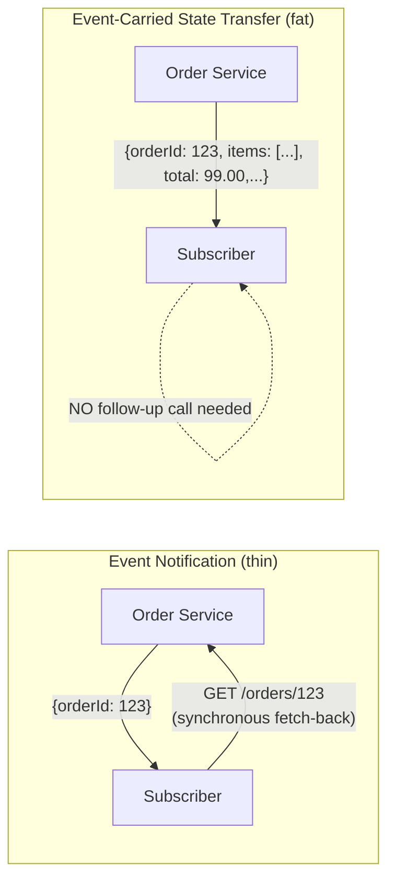

**Choreography vs Orchestration**

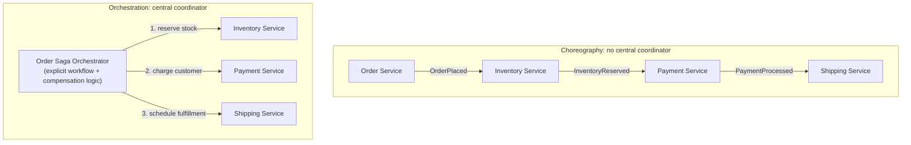

**Topics (Fan-out) vs Queues (Competing Consumers)**

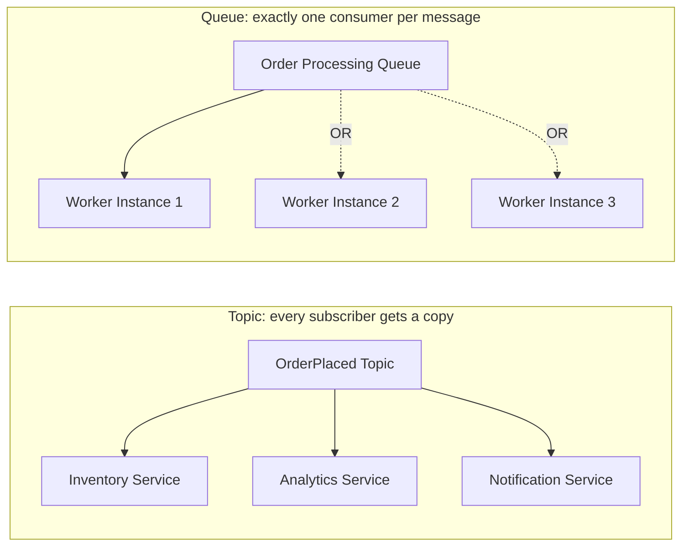

**13. Low-Level Design**

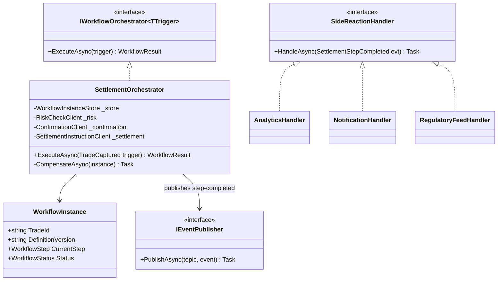

**13. Low-Level Design**

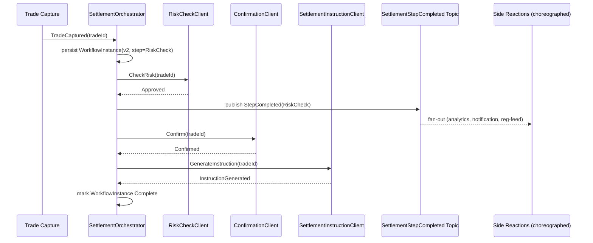

### Module 53 — Event-Driven Architecture: Schema Evolution, Ordering & Partitioning, Delivery Semantics & Dead Letter Queues
*Source: `02-Schema-Evolution-Ordering-DeliverySemantics-DLQ.md`*

**Schema Registry Enforcement Flow**

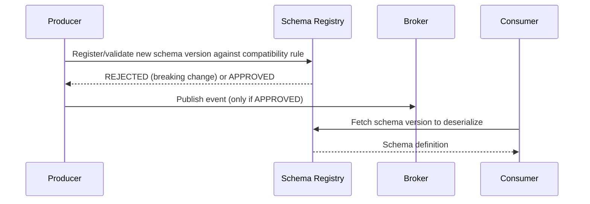

**Partition Key and Ordering**

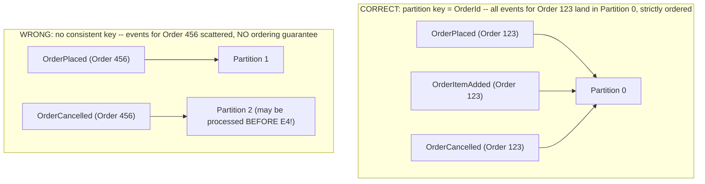

**Dead Letter Queue Flow**

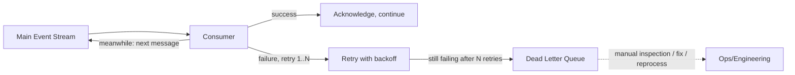

**13. Low-Level Design**

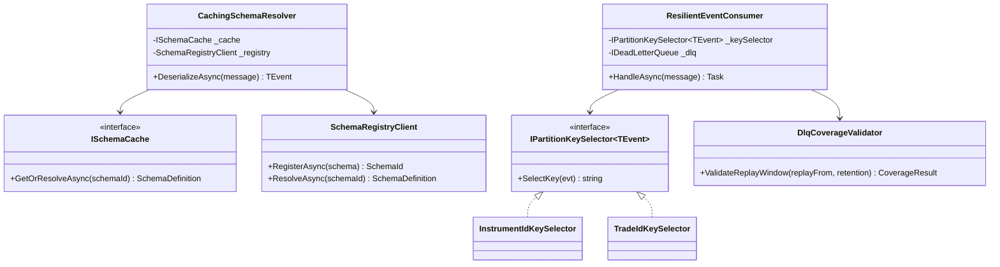

**13. Low-Level Design**

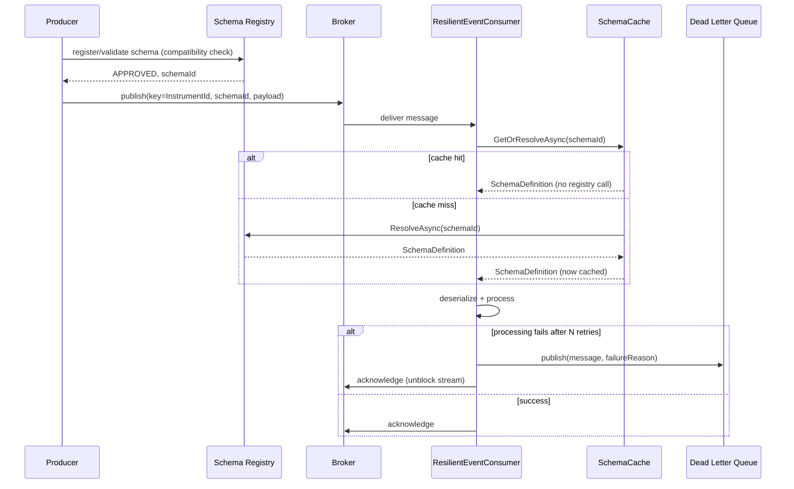

### Module 140 — Event-Driven Architecture: Stream Processing — Stateful Operations, Windowing & Time Semantics
*Source: `03-Stream-Processing-Stateful-Operations-Windowing-Time-Semantics.md`*

**1. Fundamentals**

```text
Unbounded stream ──► [window: bound the unbounded] ──► [aggregate/join over the window] ──► emit result
 ↑
 time semantics decide which events fall in which window,
 and watermarks decide when a window is complete enough to emit
```

**3. Visual Architecture**

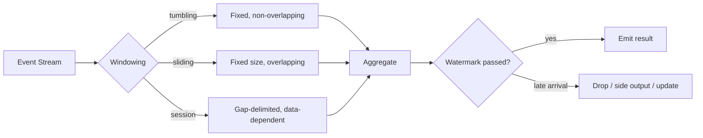

**3. Visual Architecture**

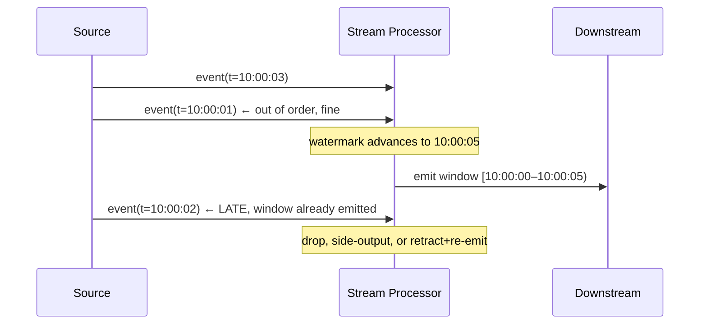

**3. Visual Architecture**

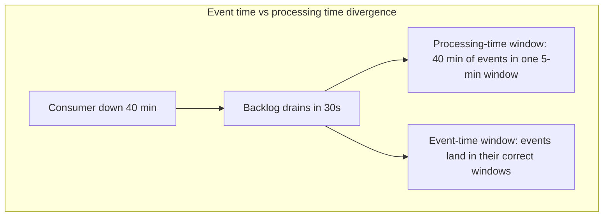

**13. Low-Level Design**

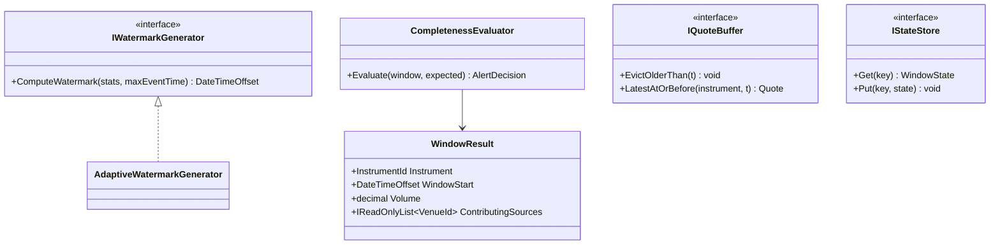

### Module 141 — Event-Driven Architecture: Backpressure, Flow Control & Consumer Lag at Scale
*Source: `04-Backpressure-Flow-Control-Consumer-Lag.md`*

**1. Fundamentals**

```text
Producer ──► [broker: absorbs mismatch, retains for N days] ──► Consumer
 │ │
 lag grows ◄────── consumer slower than producer ┘
 │
 retention boundary ──► data loss (unrecoverable)
```

**3. Visual Architecture**

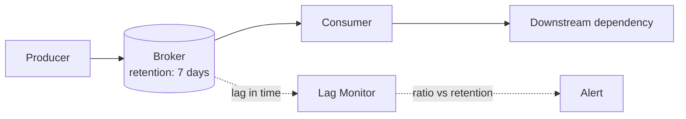

**3. Visual Architecture**

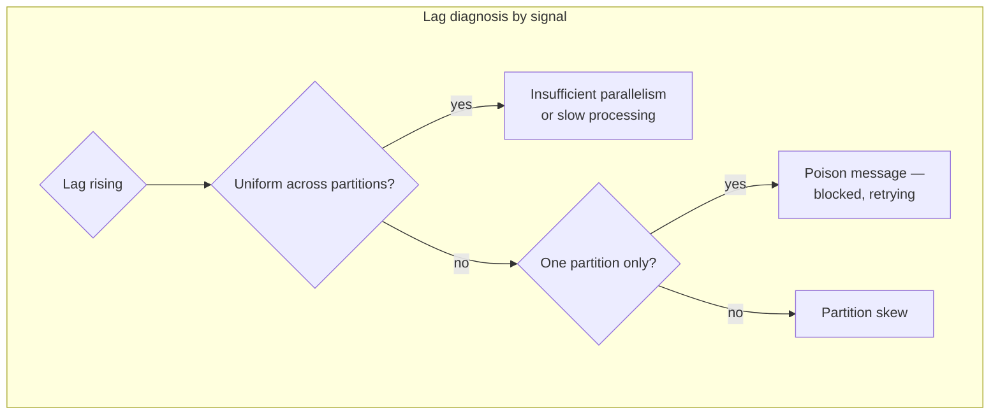

**3. Visual Architecture**

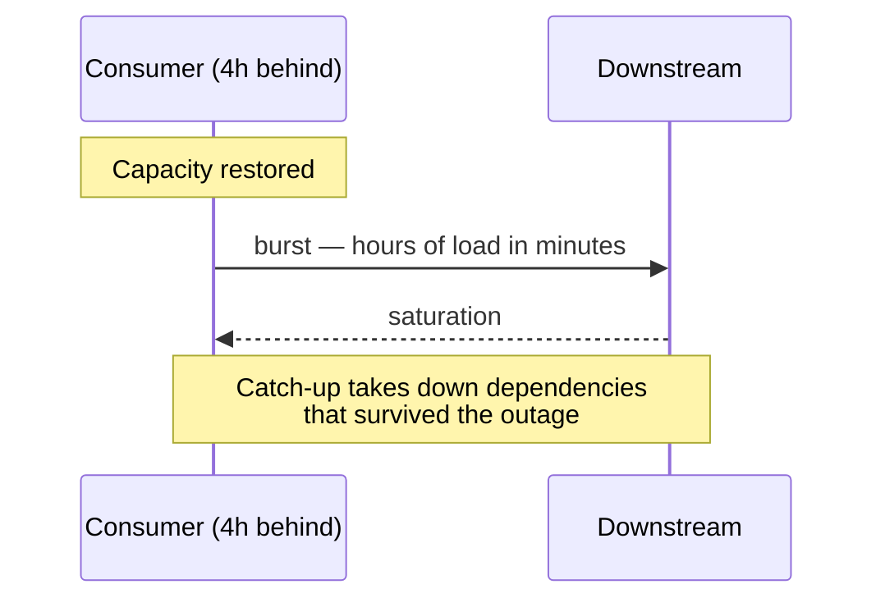

**13. Low-Level Design**

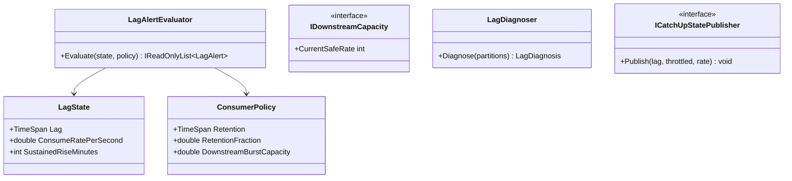

### Module 142 — Event-Driven Architecture: Cross-Region & Multi-Cluster Event Distribution
*Source: `05-CrossRegion-MultiCluster-Event-Distribution.md`*

**1. Fundamentals**

```text
Region A cluster ──(async replication, its own lag)──► Region B cluster
 │ │
 local offsets 0..N local offsets 0..M (different numbering)
 │ │
 local consumers, local ordering guaranteed local consumers, local ordering guaranteed
 │
 NO ordering guarantee BETWEEN regions
```

**3. Visual Architecture**

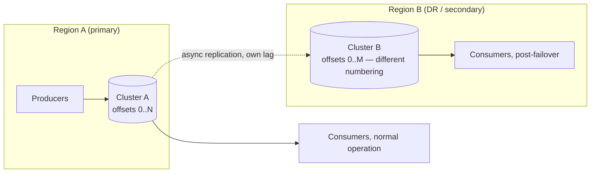

**3. Visual Architecture**

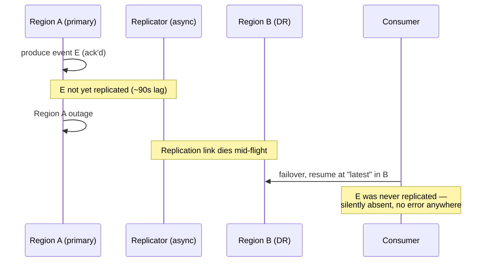

**3. Visual Architecture**

```mermaid
graph TB
 subgraph "Active-active split-brain"
 K[Same key] --> A1[Region A: local write 1, local write 2]
 K --> B1[Region B: local write 1']
 A1 -.replicates after partition heals.-> B1
 B1 -.replicates after partition heals.-> A1
 A1 --> M[Merged by arrival order,<br/>not causal order]
 B1 --> M
 M --> D[Divergent final values<br/>per region]
 end
```

**13. Low-Level Design**

```mermaid
classDiagram
 class ReplicatedEvent {
 +string OriginClusterId
 +Guid EventId
 +DateTimeOffset EventTime
 }
 class IReplicationGate {
 <<interface>>
 +ShouldReplicate(evt, localClusterId) bool
 +TagForReplication(evt, producingClusterId) ReplicatedEvent
 }
 class IOwnershipDirectory {
 <<interface>>
 +GetOwnerAsync(entityKey) RegionOwner
 }
 class OwnershipRouter {
 +ResolveWriteRegionAsync(entityKey) string
 +RouteWriteAsync(entityKey, evt, clients) void
 }
 class ResidencyClassifier {
 +IsReplicableTo(topic, region) bool
 }
 class ConsistencyCanary {
 +RunConsistencyCanaryAsync(keys, clients, maxLag) ConsistencyReport
 }

 OwnershipRouter --> IOwnershipDirectory
 IReplicationGate --> ReplicatedEvent
```

### Module 143 — Event-Driven Architecture: Idempotency, Exactly-Once Processing & Deduplication at Scale
*Source: `06-Idempotency-ExactlyOnce-Deduplication-At-Scale.md`*

**1. Fundamentals**

```text
Producer ──(at-least-once, retries on ambiguous failure)──► Broker ──► Consumer
 │
 Has this idempotency key
 been processed before?
 │ │
 Yes No
 │ │
 Skip / return Process + record key
 prior result atomically with the effect
```

**3. Visual Architecture**

```mermaid
graph LR
 P[Producer] -->|at-least-once, retries on ambiguity| B[(Broker)]
 B --> C[Consumer]
 C --> DK{Dedup key seen<br/>before?}
 DK -->|yes| Skip[Skip — return prior result]
 DK -->|no| Tx[Single transaction:<br/>apply effect + record key]
 Tx --> State[(State store)]
```

**3. Visual Architecture**

```mermaid
graph TB
 subgraph "Kafka exactly-once boundary"
 Consume[Consume] --> Process[Process/transform]
 Process --> Produce[Produce to output topic]
 Produce --> Commit[Commit offset]
 end
 Process -.side effect OUTSIDE the transaction.-> Ext[External API call —<br/>NOT covered by the guarantee]
 style Ext fill:#f66,color:#fff
```

**3. Visual Architecture**

```mermaid
sequenceDiagram
 participant C as Consumer (idempotent internally)
 participant G as Payment Gateway (no idempotency-key support)

 C->>G: charge card (attempt 1)
 G--xC: timeout, ambiguous outcome
 Note over C: Internal dedup key not yet recorded —<br/>consumer correctly retries
 C->>G: charge card (attempt 2)
 Note over C,G: Both attempts may have succeeded at G —<br/>internal idempotency did not prevent this
```

**13. Low-Level Design**

```mermaid
classDiagram
 class IdempotencyKeyGenerator {
 +DeriveIdempotencyKey(operation) string
 }
 class IIdempotentProcessor~T~ {
 <<interface>>
 +ProcessIdempotentlyAsync(key, effect) ProcessResult
 }
 class DedupCoverageValidator {
 +ValidateReplayWindow(replayFrom, retention) CoverageResult
 }
 class ExternalEffectReconciler {
 +ReconcileExternalChargesAsync(attempts, gateway, windowStart) ReconciliationReport
 }
 class ChargeDiscrepancy {
 +string ReferenceId
 +DiscrepancyType Type
 }

 IIdempotentProcessor~T~ --> IdempotencyKeyGenerator
 ExternalEffectReconciler --> ChargeDiscrepancy
```

### Module 144 — Event-Driven Architecture: Testing, Contract Testing & Chaos Engineering for Event Pipelines
*Source: `07-Testing-ContractTesting-ChaosEngineering-EventPipelines.md`*

**1. Fundamentals**

```text
Unit tests ──► verify logic in isolation (necessary, not sufficient)
 │
Contract tests ──► verify producer/consumer agree on schema + semantics, independently deployable
 │
Replay-based tests ──► verify behavior against real historical event sequences, including edge cases
 │
Chaos experiments ──► verify behavior under real failure: broker loss, lag, duplication, poison messages
```

**3. Visual Architecture**

```mermaid
graph TB
 subgraph "Testing pyramid for event-driven systems"
 U[Unit tests<br/>logic in isolation] --> CT[Contract tests<br/>producer/consumer agreement]
 CT --> RT[Replay-based tests<br/>real historical sequences]
 RT --> CH[Chaos experiments<br/>real broker/lag/duplication conditions]
 end
 CH -.does not replace.-> PV[Production verification:<br/>reconciliation, canaries, DLQ monitoring]
```

**3. Visual Architecture**

```mermaid
sequenceDiagram
 participant Prod as Producer CI
 participant CR as Contract Registry
 participant Cons as Consumer's registered contract

 Prod->>CR: Publish schema change
 CR->>Cons: Verify against EVERY registered consumer contract
 alt Contract satisfied
 CR-->>Prod: Deploy permitted
 else Contract violated
 CR-->>Prod: Deploy BLOCKED — before it reaches production
 end
```

**3. Visual Architecture**

```mermaid
graph LR
 subgraph "Chaos experiment: inject condition, not symptom"
 A[Kill broker node] --> B[Observe: does failover<br/>meet actual RPO?]
 C[Inject 90s replication delay] --> D[Observe: does the alert<br/>that should fire, fire?]
 E[Duplicate a message] --> F[Observe: is the effect<br/>applied exactly once?]
 end
```

**13. Low-Level Design**

```mermaid
classDiagram
 class ConsumerContract {
 +IReadOnlyList~FieldRequirement~ RequiredFields
 +IReadOnlyList~StructuralAssumption~ StructuralAssumptions
 }
 class IContractVerifier {
 <<interface>>
 +VerifyContract(sample, contract) ContractVerificationResult
 }
 class IReplayFixtureSource {
 <<interface>>
 +StreamAsync(windowTag) IAsyncEnumerable~CapturedEvent~
 }
 class IChaosInjector {
 <<interface>>
 +InjectAsync(condition, blastRadius, abortAfter) Task
 }
 class ILivenessMonitor {
 <<interface>>
 +WaitForStallDetectionAsync(correlationId, timeout) StallDetection
 }

 IContractVerifier --> ConsumerContract
```

### Module 145 — Event-Driven Architecture Capstone: A Firm-Wide Event Backbone, From Order Capture to Regulatory Reporting
*Source: `08-Capstone-FirmWide-Event-Backbone-OrderCapture-To-RegulatoryReporting.md`*

**1. Fundamentals**

```text
Order Capture (choreographed/orchestrated)
 │
 ▼
Execution Reports (schema-governed, ordered, DLQ-protected)
 │
 ├──► Stream Processing: real-time risk aggregation (windowed, watermarked)
 │ │
 │ ▼
 │ Backpressure-managed consumers (lag-monitored, catch-up-throttled)
 │
 ├──► Cross-region replication: DR + follow-the-sun desks
 │
 ├──► Idempotent ledger/settlement posting (effectively-once)
 │
 └──► Regulatory reporting pipeline (fed by this backbone)

Verified throughout by: contract tests, replay regression, chaos experiments, permanent reconciliation
```

**3. Visual Architecture**

```mermaid
graph TB
 subgraph "Order Capture (orchestrated,/131)"
 OMS[Order Management State Machine]
 end
 OMS -->|ExecutionReport, schema-governed, ordered| Backbone[(Event Backbone<br/>)]

 Backbone -->|choreographed fan-out| Risk[Real-Time Risk Aggregation<br/>windowed, watermarked —]
 Backbone -->|choreographed fan-out| Ledger[Idempotent Ledger Posting<br/>]
 Backbone -->|choreographed fan-out| RegReport[Regulatory Reporting Pipeline<br/>]

 Risk --> RiskConsumers[Backpressure-managed<br/>desk dashboards —]

 Backbone -.async replication.-> DR[(DR / Follow-the-Sun Region<br/>)]
 DR --> RiskDR[Risk Aggregation, DR region]
 DR --> LedgerDR[Ledger Posting, DR region]

 subgraph "Standing verification"
 CT[Contract Tests] -.gates.-> Backbone
 Chaos[Chaos Experiments] -.validates.-> Backbone
 Recon[Permanent Reconciliation] -.catches residual.-> Ledger
 Recon -.catches residual.-> Risk
 end
```

**3. Visual Architecture**

```mermaid
sequenceDiagram
 participant OMS as Order Mgmt (orchestrated)
 participant BB as Event Backbone
 participant Risk as Risk Stream Job (windowed)
 participant DR as DR Region

 OMS->>BB: ExecutionReport (idempotency key K)
 BB->>Risk: consume, update window state
 BB-->>DR: async replicate
 Note over BB,DR: Regional failover mid-window
 DR->>DR: resume risk job from replicated snapshot<br/>(itself lagging —)
 DR->>DR: window re-finalizes with INCOMPLETE prior state
 Note over DR: Event-level idempotency (K) correctly<br/>prevented re-processing E itself —<br/>but the WINDOW RESULT is a new aggregate identity
```

**3. Visual Architecture**

```mermaid
graph LR
 subgraph "Capstone incident chain"
 A[Cross-region failover<br/>] --> B[Stream job state<br/>reconstructed from lagging snapshot<br/>]
 B --> C[Window re-finalizes,<br/>emits a result]
 C --> D{Is this a duplicate?}
 D -->|Event-level dedup checks: NO —<br/>this is a new aggregate, not a repeated event| E[Downstream double-counts exposure<br/>the exact gap]
 end
```

**13. Low-Level Design**

```mermaid
classDiagram
 class BackboneStage {
 +string Name
 +bool RequiresSingleAuthoritativeStateTransition
 +IReadOnlyList~ReplicatedArtifact~ ReplicatedArtifacts
 }
 class ReplicatedArtifact {
 +string Name
 +bool HasIndependentRpoValidation
 +TimeSpan ReplicationCadence
 }
 class IWindowResultEmitter {
 <<interface>>
 +EmitWindowResultIdempotentlyAsync(result) EmissionResult
 }
 class DerivedArtifactAuditor {
 +AuditComponent(component) IReadOnlyList~RpoGap~
 }
 class ComposedFailoverExperiment {
 +RunAsync(job, injector, auditor, abortAfter) ExperimentResult
 }

 BackboneStage --> ReplicatedArtifact
 IWindowResultEmitter --> BackboneStage
```
