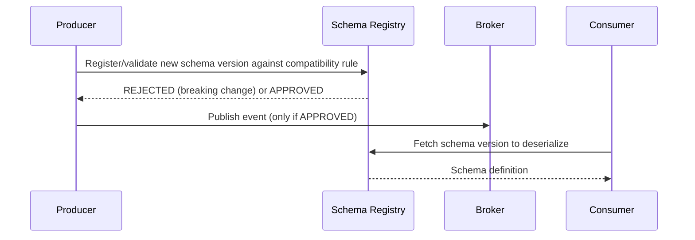
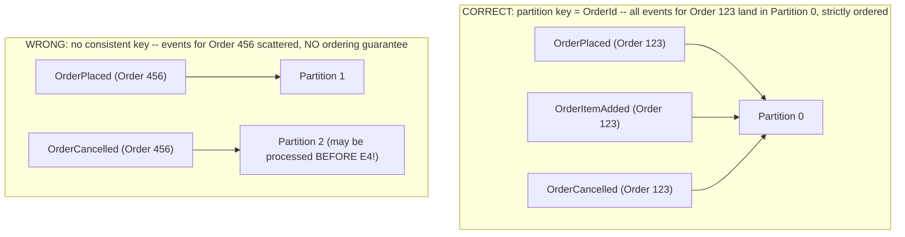
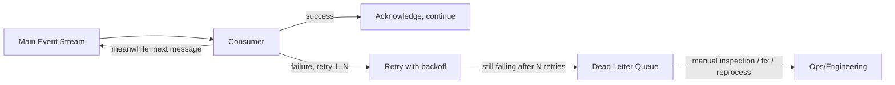

# Module 53 — Event-Driven Architecture: Schema Evolution, Ordering & Partitioning, Delivery Semantics & Dead Letter Queues

> Domain: Event-Driven Architecture | Level: Intermediate → Expert | Prerequisite: [[01-EDA-Fundamentals-Choreography-vs-Orchestration]], [[../17-Microservices/03-Versioning-Testing-Deployment-TeamTopologies]] §2.1 (API versioning, extended here to event schemas), [[../16-Distributed-Systems/02-Failure-Detection-Idempotency-Outbox]] (idempotency, applied here to event consumption specifically)
> This module completes the `18-Event-Driven-Architecture` conceptual arc (Modules 52–53) before the dedicated `19-Kafka`/`20-RabbitMQ` broker-implementation modules — it covers the four practical disciplines every production EDA system needs regardless of which specific broker technology implements them: schema evolution, ordering guarantees, delivery-semantics honesty, and failure isolation via dead letter queues.

---

## 1. Fundamentals

### Why do events need their own dedicated schema-evolution, ordering, and delivery-semantics discipline, distinct from what Modules 49-51 already established for synchronous APIs?
An event, once published, may be consumed by subscribers written by teams the publisher has never met, processed **minutes, hours, or even days later** (unlike a synchronous API call's immediate request/response), potentially **out of the order it was published** (depending on broker/partitioning configuration), and potentially **more than once** (most brokers default to at-least-once delivery, not exactly-once) — each of these properties has no equivalent in synchronous, immediate request/response communication, and each demands a deliberate architectural answer: how does an old consumer handle a newer event schema it's never seen a field from? What happens if events for the same entity arrive out of order? What happens if a consumer receives the same event twice, or if a consumer crashes mid-processing?

### Why does this matter?
Because these properties aren't edge cases to be handled defensively as an afterthought — they are the **normal, expected operating conditions** of any real event-driven system at scale, and Module 48's idempotency discipline (already established for synchronous retried calls) becomes even more critical here, since asynchronous, decoupled, potentially-delayed, potentially-reordered, potentially-duplicated delivery is the *default* assumption an event consumer must design around, not a rare failure mode.

### When does this matter?
Any system publishing or consuming events at meaningful scale or over any meaningful time horizon — a system with events flowing continuously between more than a couple of services, especially once schema changes, consumer scaling (multiple partitions/competing consumers), and inevitable transient failures are all considered together rather than in isolation.

### How does it work (30,000-ft view)?
```
Schema Evolution: a Schema Registry enforces compatibility rules (backward/forward/full) at
                   publish time, preventing an incompatible event schema from ever reaching consumers
Ordering:          partition/shard events by a consistent key (e.g., entity ID) so all events for
                   the SAME entity are strictly ordered; ordering across DIFFERENT entities is not guaranteed
Delivery Semantics: at-least-once (default, requires idempotent consumers) vs exactly-once
                   (harder, often emulated via idempotency rather than true broker-level guarantee)
Dead Letter Queue: a side channel capturing events a consumer repeatedly fails to process,
                   isolating the failure so it doesn't block the entire stream behind it
```

---

## 2. Deep Dive

### 2.1 The Schema Registry — Enforcing Compatibility Before an Event Ever Ships
A Schema Registry is a centralized service (Confluent Schema Registry being the most widely-adopted implementation, typically paired with Kafka) that stores every version of every event schema and **enforces a configured compatibility rule at publish time** — a producer attempting to publish an event under a schema that violates the registry's compatibility rule is **rejected before the event ever reaches the broker**, directly the event-schema equivalent of Module 51's automated breaking-change CI gate, but enforced at runtime, at the moment of publication, rather than only at build time. This closes exactly the gap Module 51 §4's incident exposed for synchronous APIs (an unknown consumer breaking silently) — with a schema registry, there's no way for an incompatible event to be published at all, regardless of whether every consumer is known to the publishing team.

### 2.2 Compatibility Modes — Backward, Forward, and Full
**Backward compatibility** means a **new** schema can be used to read data written under the **previous** schema — critically, this is the mode that protects **new consumer code** reading **old events** (relevant when a consumer is upgraded before all old events have been consumed, or when replaying historical events). **Forward compatibility** means an **old** schema can be used to read data written under a **new** schema — this protects **old, not-yet-upgraded consumer code** reading **newly-published events** (the far more common, pressing concern in practice: producers typically deploy before every consumer has upgraded, so new events must remain readable by old consumer code during the rollout window). **Full compatibility** requires both simultaneously — the strictest, safest mode, typically achieved by only ever adding new **optional** fields with defaults and never removing or repurposing existing fields, directly Module 51 §2.1's additive-by-default discipline applied at the schema-registry-enforced level.

### 2.3 Ordering Guarantees — Per-Key Ordering, Not Global Ordering
Most distributed event brokers (Kafka's partitioning model being the canonical example, covered in full in Module 54/the dedicated Kafka module) provide **strict ordering only within a single partition**, and a partition is typically assigned by hashing a chosen **partition key** — choosing the partition key correctly is what determines whether events that *must* be processed in order relative to each other (all events for a single order: `OrderPlaced`, `OrderItemAdded`, `OrderCancelled`) actually land in the same partition and are therefore guaranteed to be delivered to a consumer in publish order. Choosing the **wrong** partition key (or no consistent key at all, allowing random/round-robin distribution) means events for the same logical entity can land in different partitions, processed by different consumer instances, with **no guarantee about their relative order** — a subtle, easy-to-miss mistake, since it produces correct behavior under light load (where coincidental ordering is common) and only manifests as visible bugs under the concurrent load where reordering actually occurs.

### 2.4 Delivery Semantics — At-Least-Once, At-Most-Once, and the Reality of "Exactly-Once"
**At-most-once** delivery means a message might be lost but is never redelivered — rarely acceptable for business-critical events. **At-least-once** delivery (the overwhelmingly common practical default) guarantees a message will eventually be delivered but may be delivered **more than once** (a consumer processes a message, crashes before acknowledging receipt to the broker, and the broker redelivers it to another consumer instance believing it was never processed) — this is why **every event consumer must be idempotent** (Module 48's idempotency discipline, now mandatory for event consumption specifically, not optional). True **exactly-once** delivery is a much stronger, harder guarantee that few brokers provide end-to-end without significant constraints (Kafka's transactional/exactly-once semantics apply specifically within Kafka-to-Kafka pipelines, not universally across arbitrary external side effects) — in practice, most systems achieve the **effect** of exactly-once processing not through a true broker guarantee but through **idempotent consumer design** layered on top of at-least-once delivery (processing the same event twice produces the same result as processing it once, making the redelivery harmless rather than actually preventing it).

### 2.5 Dead Letter Queues — Isolating Poison Messages Without Blocking the Stream
A Dead Letter Queue (DLQ) is a side channel that a consumer routes a message to after it has **repeatedly failed processing** beyond a configured retry limit — rather than either (a) blocking the entire partition/queue indefinitely retrying the same "poison" message forever (starving every message behind it from ever being processed) or (b) silently dropping the failed message (losing it and its associated business event entirely), the DLQ preserves the failed message for later inspection/manual intervention/reprocessing while allowing the consumer to **continue processing subsequent messages** in the main stream unblocked. This is the event-driven-architecture equivalent of Module 50's circuit-breaker pattern's core insight — isolate and fail fast on what's clearly broken, rather than letting it degrade the processing of everything else behind it.

### 2.6 Event Replay — the Operational Superpower a Durable, Retained Event Log Provides
A broker that retains published events for a meaningful retention period (rather than deleting them immediately after every current consumer has acknowledged them) enables **replay** — reprocessing historical events from any point in the past, valuable for recovering from a bug in a consumer's processing logic (fix the bug, then replay the affected time range to reprocess events correctly this time), backfilling a newly-added subscriber that needs to build up state from historical events it never saw originally, or rebuilding a service's entire state from scratch (directly connecting to Event Sourcing's full philosophy, the dedicated later module) — this capability fundamentally depends on §2.4's idempotent-consumer discipline already being in place, since replay is, definitionally, redelivering already-processed events, and a non-idempotent consumer would corrupt its own state upon replay just as it would upon any other at-least-once-delivery duplicate.

## 3. Visual Architecture

### Schema Registry Enforcement Flow


### Partition Key and Ordering


### Dead Letter Queue Flow


## 4. Production Example
**Scenario**: A logistics platform's Shipment-Tracking service consumed `ShipmentStatusChanged` events, partitioned by a **randomly-generated event ID** (not the shipment ID) for "even load distribution across consumer instances," reasoning the team believed maximized throughput. For most shipments, this worked fine — status changes were infrequent enough that even reordered delivery usually didn't cause visible problems. But for a subset of high-priority shipments generating rapid, closely-spaced status updates (`PickedUp` → `InTransit` → `Delivered` within seconds during an automated warehouse-scanning process), events occasionally landed in different partitions and were processed by different consumer instances **out of order** — a `Delivered` event processed before the corresponding `PickedUp` event, causing the tracking service's state machine (which validated transitions like "can't go from `Unknown` directly to `Delivered`") to reject the "invalid" out-of-order transition and silently drop it, leaving the shipment's displayed status permanently stuck at whatever state happened to be processed last in the racing, reordered sequence — with no error surfaced anywhere, since the rejection was treated as a validation failure on a single event, not flagged as a systemic ordering problem. **Investigation**: customer complaints about "stuck" shipment statuses for a small, seemingly-random subset of shipments (specifically ones with rapid status changes) eventually led engineers to examine the partition assignment logic, discovering the random-event-ID partition key was the root cause — high-frequency-update shipments were simply more likely to have their tightly-spaced events land in different partitions and race each other, while low-frequency-update shipments (the majority) rarely hit this race window. **Fix**: changed the partition key to the **shipment ID** — guaranteeing every event for a given shipment lands in the same partition and is therefore delivered to its consumer in strict publish order, eliminating the reordering race entirely; also added a Dead Letter Queue for genuinely invalid transitions (a true data-integrity issue, distinct from an ordering artifact) so future genuine anomalies would be visible and inspectable rather than silently dropped. **Lesson**: this is precisely §2.3's per-key-ordering discipline, illustrating why the mistake is so easy to make and so late to surface — a "randomize for even load distribution" instinct is reasonable-sounding in isolation but directly sacrifices the ordering guarantee the consumer's state machine silently assumed was in place; and the silent-drop behavior (rather than surfacing rejected transitions to a DLQ, §2.5) meant the systemic root cause stayed hidden behind what looked like isolated, unrelated customer complaints for far longer than it should have.

## 5. Best Practices
- Enforce a schema registry with at least full backward+forward compatibility for every event type before it reaches production, converting Module 51's synchronous-API discipline into an equivalent, automatically-enforced, publish-time gate for events.
- Choose the partition/shard key deliberately, based on which entities require relative ordering guarantees among their own events — never randomize or round-robin the key when ordering matters (§4).
- Design every event consumer to be idempotent by default, treating at-least-once delivery (with potential duplicates) as the normal operating condition, not a rare edge case.
- Route repeatedly-failing messages to a Dead Letter Queue rather than blocking the stream indefinitely or silently dropping them (§4's missing DLQ compounded its diagnosis time).
- Retain published events for a meaningful period to enable replay, and ensure idempotent consumer design makes replay safe by construction.

## 6. Anti-patterns
- Publishing schema changes without registry-enforced compatibility checking, risking the same unknown-consumer breakage Module 51 §4 illustrated, now at the event layer.
- Randomizing or omitting a consistent partition key for entities whose events require relative ordering, producing rare, load-dependent, hard-to-reproduce reordering bugs (§4).
- Building non-idempotent consumers that assume exactly-once delivery, silently corrupting state on the inevitable at-least-once duplicate.
- Blocking an entire partition/queue indefinitely retrying one poison message, or silently dropping failed messages with no DLQ and no visibility (§4's diagnosis delay).
- Treating event replay as an emergency, ad hoc capability rather than a routinely-tested, idempotency-dependent operational tool.

## 7. Performance Engineering
Schema registry lookups (§2.1) on every publish/consume operation add a small latency cost, typically mitigated via aggressive local caching of schema definitions on both producer and consumer sides (fetching a given schema version once, then reusing the cached copy for all subsequent messages of that version) — a well-implemented registry client adds negligible steady-state overhead despite enforcing compatibility on every single message. Partition count (§2.3) directly determines the maximum degree of consumer parallelism (each partition can only be actively consumed by one consumer instance within a given consumer group at a time) — under-provisioning partition count creates an artificial throughput ceiling regardless of how many consumer instances are deployed, while over-provisioning adds per-partition overhead and, more importantly for ordering-sensitive systems, doesn't help since the *chosen partition key*, not partition count alone, determines whether ordering-critical events land together.

## 8. Security
Schema registries themselves need access control — an unauthorized party able to register a schema (even a technically-compatible one) could smuggle a new field designed to later carry unintended/malicious data through the pipeline, or an unauthorized party able to *read* schemas could learn sensitive information about a system's internal data model as reconnaissance. Dead Letter Queue contents (§2.5) often contain the exact, complete payload of a business event that failed processing — potentially including sensitive customer data — and must receive the same data-governance/access-control discipline as the main event stream, not be treated as a lower-security "junk drawer" simply because its contents represent failures rather than successes.

## 9. Scalability
Partition count (§7) is the primary scalability lever for consumer throughput, but it interacts directly with ordering guarantees (§2.3) — increasing partition count to scale consumer parallelism only helps if the partition key naturally distributes load across the new partition count while still keeping same-entity events together, meaning partition-count scaling decisions cannot be made independently of the partition-key design that was chosen for ordering correctness. Dead Letter Queue volume itself should be monitored as a standing metric — a sudden spike in DLQ volume is a leading indicator of a systemic processing problem (a bad deployment, a downstream dependency outage) affecting many messages simultaneously, not merely an occasional, isolated poison message, and should trigger the same alerting discipline as any other golden-signal anomaly (Module 50 §9).

---

## 10. Interview Questions

### Basic (10)
1. **Q: What does a schema registry do?** **A:** Stores every schema version and enforces a configured compatibility rule at publish time, rejecting incompatible schema changes.
2. **Q: What is backward compatibility, in the schema-registry sense?** **A:** A new schema can read data written under the previous schema.
3. **Q: What is forward compatibility?** **A:** An old schema can read data written under a new schema.
4. **Q: What ordering guarantee do most distributed brokers provide?** **A:** Strict ordering only within a single partition, not globally across all partitions.
5. **Q: What determines which partition an event lands in?** **A:** Typically a hash of a chosen partition key.
6. **Q: What is at-least-once delivery?** **A:** A guarantee that a message will eventually be delivered, but possibly more than once.
7. **Q: Why must event consumers be idempotent?** **A:** Because at-least-once delivery (the common default) can redeliver the same message, and idempotency ensures processing it twice produces the same result as processing it once.
8. **Q: What is a Dead Letter Queue?** **A:** A side channel capturing messages a consumer repeatedly fails to process, so they don't block the main stream.
9. **Q: What is event replay?** **A:** Reprocessing historical, retained events from a broker, useful for bug recovery, backfilling new subscribers, or rebuilding state.
10. **Q: What must be true of a consumer for replay to be safe?** **A:** The consumer must be idempotent, since replay is definitionally redelivering already-processed events.

### Intermediate (10)
1. **Q: Why is forward compatibility often the more pressing practical concern than backward compatibility?** **A:** Producers typically deploy new schema versions before every consumer has upgraded, so newly-published events must remain readable by old, not-yet-upgraded consumer code during the rollout window.
2. **Q: Why does a schema registry close a gap that Module 51's API-versioning discipline alone couldn't fully close?** **A:** It enforces compatibility automatically at the moment of publication, for every message, regardless of whether every consumer is known to the publishing team — closing exactly the "unknown consumer" gap that caused Module 51 §4's incident.
3. **Q: Why does randomizing a partition key for "even load distribution" risk breaking ordering guarantees, even though it sounds like a reasonable optimization?** **A:** It maximizes distribution across partitions, but sacrifices the guarantee that all events for a single logical entity land in the same partition — which is precisely what strict per-entity ordering depends on (§4).
4. **Q: Why did §4's ordering bug only affect high-frequency-update shipments and not the majority of shipments?** **A:** Reordering races only manifest when multiple events for the same entity are in flight closely enough in time to actually land in different partitions and be processed out of sequence — infrequent updates rarely create this race window, while rapid, closely-spaced updates frequently do.
5. **Q: Why is true exactly-once delivery rarely achieved end-to-end across arbitrary external systems, even with brokers advertising "exactly-once semantics"?** **A:** Broker-level exactly-once guarantees typically apply within the broker's own transactional boundary (e.g., Kafka-to-Kafka pipelines); once a side effect crosses into an external system (a database write, an external API call) the guarantee no longer inherently holds, and idempotent consumer design remains necessary to achieve the practical effect of exactly-once processing.
6. **Q: Why does a Dead Letter Queue prevent one poison message from blocking an entire stream?** **A:** Without it, a consumer retrying the same failing message indefinitely would never advance past it, starving every subsequent message in the same partition/queue from being processed at all.
7. **Q: Why should Dead Letter Queue volume be monitored as a standing metric rather than only inspected reactively when someone notices a problem?** **A:** A sudden spike indicates a systemic issue (a bad deployment, a downstream outage) affecting many messages at once, which is a leading indicator worth alerting on proactively, not just a place to look after a complaint arrives.
8. **Q: Why does under-provisioning partition count create an artificial throughput ceiling regardless of consumer instance count?** **A:** Each partition can only be actively consumed by one consumer instance within a consumer group at a time — adding more consumer instances beyond the partition count provides no additional parallelism, since there aren't enough partitions to assign to the extra instances.
9. **Q: Why can't partition-count scaling decisions be made independently of partition-key design?** **A:** Increasing partition count only improves throughput if the chosen partition key actually distributes load across the new partition count while still keeping same-entity events together — the key design and the count are coupled decisions, not independent levers.
10. **Q: Why must Dead Letter Queue contents receive the same data-governance discipline as the main event stream?** **A:** They typically contain the complete, original payload of a failed business event, which may include sensitive customer data — being a "failure" rather than a "success" doesn't reduce the sensitivity of the data contained within.

### Advanced (10)
1. **Q: Diagnose the §4 incident from first principles, and design the specific pre-production review question or automated check that would have caught the random-partition-key mistake before it reached production.**
   **A:** Root cause: the partition key was chosen to optimize load distribution without considering the consumer's own ordering assumptions (a state machine implicitly assuming in-order delivery). Review question: for every event-consuming service with any stateful, order-sensitive processing logic (a state machine, a sequence validator), explicitly ask "does this consumer's correctness depend on receiving events for the same entity in publish order, and if so, does the producer's partition key guarantee that?" — as an even stronger safeguard, an automated check could verify, for any topic a stateful consumer subscribes to, that the topic's actual partition-key configuration matches an entity-identifier field the consumer's own schema/contract declares as its ordering key, converting an implicit, easy-to-violate assumption into an explicitly declared, checkable contract between producer and consumer.
2. **Q: A consumer needs strict ordering across events for a shipment (§4's fix) but also needs to scale to a very high number of partitions for throughput, and a single shipment's events are relatively rare in absolute volume compared to the whole system's throughput. Does this create a genuine tension, and how would you resolve it if so?**
   **A:** No genuine tension in this specific case — partitioning by shipment ID naturally distributes *different* shipments' events across many partitions (achieving high aggregate parallelism and throughput across the whole system) while still guaranteeing all events for the *same* shipment land together (achieving per-shipment ordering) — the tension Advanced Q1 implies would only be genuine if a single entity's own event volume were high enough to itself become a partition-level bottleneck (an extremely high-frequency single entity), in which case a more sophisticated approach (sub-partitioning by entity+time-window, accepting weaker ordering guarantees within very narrow time slices) might be needed — but this is a rare, specific scale threshold, not the general case, and should not be assumed necessary without first confirming a single entity's event rate actually approaches partition-level throughput limits.
3. **Q: Design a strategy for migrating a topic's compatibility mode from "backward-only" to "full" (backward+forward) for an existing, already-in-production event type, without breaking any currently-running producer or consumer.**
   **A:** Full compatibility requires the stricter, additive-only discipline from that point forward (Module 51 §2.1) — the migration itself doesn't require rewriting historical events (already-published events remain readable under whatever compatibility guarantee was in effect when they were published), but going forward, the registry's enforced rule must be tightened, and — critically — every existing producer must be audited against the *new*, stricter rule before it's enforced, since a producer that was previously making backward-incompatible-but-forward-compatible changes (permitted under a weaker mode) would now be rejected; the safe sequence is: audit and fix any existing producer behavior that would violate the new rule **first**, then tighten the registry's enforced compatibility mode, never the reverse (which would immediately start rejecting a currently-functioning producer's next legitimate publish attempt).
4. **Q: Explain why "just make every consumer idempotent" is necessary but not sufficient to fully resolve the reordering problem illustrated in §4, and what idempotency alone does and doesn't protect against.**
   **A:** Idempotency (processing the same event twice produces the same result as processing it once) protects specifically against **duplicate delivery** of the *same* event — it does nothing to address **reordering** of *different* events for the same entity (`Delivered` processed before `PickedUp`), since these are two distinct events, not a duplicate of one event; idempotency and ordering are separate concerns requiring separate mechanisms (idempotency keys/dedup logic for duplicates, correct partition-key design for ordering) — §4's actual root cause was purely an ordering problem, and even a perfectly idempotent consumer would still have processed the reordered events incorrectly, since idempotency doesn't retroactively fix the sequence in which distinct events arrived.
5. **Q: A team implements a Dead Letter Queue but reports that messages routed to it are essentially "lost" in practice — engineers rarely go back to inspect or reprocess them, and the DLQ has become a silent graveyard rather than an actionable signal. Diagnose and propose a fix.**
   **A:** A DLQ without an operational process attached to it (alerting on new arrivals, an owned, staffed responsibility for triage, a defined SLA for investigation) provides the *mechanism* for isolating failures without providing the *organizational process* that makes that isolation actionable — directly Module 50 §9's "monitor DLQ volume as a standing metric" recommendation, now extended: route DLQ arrivals through the same incident/alerting pipeline as any other production issue, with an assigned owner and expected response time, converting the DLQ from a passive parking lot into an active part of the system's operational feedback loop — a DLQ is only as valuable as the process ensuring its contents get looked at.
6. **Q: Design an approach for safely testing a proposed schema change's actual forward-compatibility before relying solely on the registry's automated compatibility check, given that automated compatibility rules can't capture every possible subtle consumer-side deserialization behavior.**
   **A:** Maintain a small, representative set of "canary" consumer test harnesses (using real, deployed consumer code, not just the registry's abstract schema-compatibility rule engine) that deserialize sample events under the proposed new schema and assert expected business-level behavior still holds — this catches subtler issues the registry's structural compatibility check might miss (a field type change that's structurally "compatible" per the registry's rules but produces a semantically wrong business result in a specific consumer's deserialization/mapping logic), directly extending Module 51 §Advanced Q3's "contracts can be stale/incomplete relative to real usage" lesson to the schema-registry context specifically — automated structural compatibility checking is necessary but should be paired with, not treated as a full substitute for, targeted, realistic consumer-behavior verification for high-risk schema changes.
7. **Q: How would you decide the appropriate event-retention period (§2.6) for a given topic, balancing replay capability against storage cost?**
   **A:** Base retention on the **realistic recovery/backfill scenarios** the organization actually needs to support: how far back would a newly-onboarded subscriber plausibly need to backfill from (informing a minimum retention floor), and how long would it realistically take to detect and fix a consumer-side processing bug before replay becomes necessary to recover (informing how long replay capability needs to remain available) — balanced against the concrete storage cost of retaining high-volume topics for that duration; critically, retention should be a **deliberate, documented decision** per topic based on its specific replay-use-case needs, not a single, uniform default retention period applied blindly across topics with very different actual replay requirements and volumes.
8. **Q: A Principal Engineer discovers that different teams across the organization have each independently implemented their own ad hoc idempotency logic for event consumption, with inconsistent approaches (some using database unique constraints, some using in-memory deduplication caches with different, undocumented TTLs, some with no deduplication at all). Design a systemic response.**
   **A:** Directly the same governance pattern as Module 49 §Advanced Q10 and Module 51 §Advanced Q10 applied here: provide a shared, well-tested internal library implementing a standard idempotency mechanism (a durable, centrally-designed idempotency-key-tracking store, following Module 48's Outbox-adjacent idempotency-key pattern) as the **default**, sanctioned approach every team uses rather than reimplementing independently — converting inconsistent, ad hoc, team-by-team idempotency quality (some teams' in-memory-cache approach may not even survive a consumer restart, silently reopening the exact duplicate-processing risk idempotency exists to close) into a uniform, correctly-implemented-once, fleet-wide guarantee.
9. **Q: Critique the following claim: "Since our broker guarantees at-least-once delivery and our consumers are all idempotent, we don't need to worry about event ordering at all — idempotency handles reliability, full stop."**
   **A:** This conflates two genuinely separate concerns (Advanced Q4) — idempotency addresses duplicate delivery of the same event, while ordering addresses the relative sequence of distinct events; a fully idempotent consumer processing events in the wrong order (as in §4) will still produce an incorrect final result, since idempotency guarantees "processing this exact event twice is harmless," not "the events I'm receiving are in the correct relative sequence" — the claim's implicit assumption that idempotency is a superset of reliability concerns is precisely the kind of subtle, false equivalence that let §4's actual root cause (a pure ordering bug) go undetected while the team's attention was on other reliability properties.
10. **Q: As a Principal Engineer establishing EDA operational standards across a large organization, design the specific set of automated gates and standing monitors (synthesizing this entire module) you would require for every event-producing/consuming service, and justify each one's necessity.**
    **A:** (1) Mandatory schema-registry compatibility enforcement (full mode by default) on every publish — necessary because manual review alone misses unknown-consumer breakage (§2.1, directly Module 51 §Advanced Q5's automated-gate philosophy applied to events). (2) A declared, checkable partition-key-to-ordering-requirement contract for every stateful consumer (Advanced Q1) — necessary because ordering assumptions are otherwise implicit and easy to silently violate (§4). (3) A shared, standard idempotency library as the sanctioned default for every consumer (Advanced Q8) — necessary because ad hoc, team-by-team idempotency implementations vary unpredictably in correctness. (4) Mandatory Dead Letter Queue routing with attached, staffed alerting/triage process for every consumer (Advanced Q5) — necessary because a DLQ without an operational process is a silent graveyard, not an actionable safety mechanism. Each gate targets a distinct, specific failure mode this module identified through concrete incidents or reasoning, directly the same "convert each hard-won lesson into a specific, non-optional, automated or process-backed gate" governance pattern this course applies recurrently (Module 49 §Advanced Q10, Module 50 §Advanced Q10, Module 51 §Advanced Q10), now completing the pattern's application across the full Microservices-and-EDA arc.

---

## 11. Coding Exercises

### Easy — Additive-only, registry-enforced event schema (§2.2)
```csharp
public class ShipmentStatusChangedEventV2
{
    public string ShipmentId { get; set; } = default!;  // ordering/partition key -- UNCHANGED from v1
    public string Status { get; set; } = default!;
    public DateTimeOffset Timestamp { get; set; }
    public string? CarrierTrackingUrl { get; set; }  // NEW in v2, OPTIONAL with null default --
                                                       // old (v1) consumers simply ignore this field (forward-compatible);
                                                       // new (v2) consumers reading OLD (v1) events get null here (backward-compatible)
}
```

### Medium — Correct partition-key selection (§2.3, §4's actual fix)
```csharp
public class ShipmentEventPublisher
{
    public async Task PublishAsync(ShipmentStatusChangedEvent evt)
    {
        // CORRECT: partition key = ShipmentId -- ALL events for one shipment land in the SAME
        // partition, guaranteeing strict publish-order delivery to any one consumer instance.
        await _producer.PublishAsync(topic: "shipment-status-changed",
                                       key: evt.ShipmentId,   // NEVER a random/round-robin key when order matters
                                       value: evt);
    }
}
```

### Hard — Idempotent consumer with a durable dedup store (§2.4, §Advanced Q8)
```csharp
public class IdempotentShipmentConsumer
{
    private readonly IIdempotencyStore _idempotencyStore; // durable, survives consumer restarts

    public async Task HandleAsync(ShipmentStatusChangedEvent evt, string messageId)
    {
        if (await _idempotencyStore.HasProcessedAsync(messageId))
            return; // safe no-op -- this exact message was already processed, likely a redelivered duplicate

        await using var transaction = await _db.BeginTransactionAsync();
        await _shipmentRepository.UpdateStatusAsync(evt.ShipmentId, evt.Status);
        await _idempotencyStore.MarkProcessedAsync(messageId); // SAME transaction -- atomic with the business update
        await transaction.CommitAsync();
        // Handles at-least-once redelivery safely. Does NOT, by itself, handle reordering (§Advanced Q4) --
        // that's solved separately by correct partition-key design (Medium exercise above), not by this.
    }
}
```

### Expert — Dead Letter Queue with retry-count tracking and alerting (§2.5, §Advanced Q5)
```csharp
public class ResilientEventConsumer
{
    private const int MaxRetries = 3;

    public async Task HandleAsync(ConsumedMessage message)
    {
        try
        {
            await _businessHandler.ProcessAsync(message);
            await _broker.AcknowledgeAsync(message);
        }
        catch (Exception ex)
        {
            int retryCount = message.GetRetryCount();
            if (retryCount < MaxRetries)
            {
                await _broker.RetryWithBackoffAsync(message, retryCount, ex);
            }
            else
            {
                await _deadLetterQueue.PublishAsync(message, ex);
                await _broker.AcknowledgeAsync(message); // acknowledge on MAIN stream -- unblocks subsequent messages
                await _alerting.RaiseAsync(
                    $"Message {message.Id} moved to DLQ after {MaxRetries} retries: {ex.Message}",
                    severity: Severity.High); // NOT a silent graveyard (§Advanced Q5) -- routed to the incident pipeline
            }
        }
    }
}
```
**Discussion**: acknowledging the message on the main stream once it's routed to the DLQ (rather than leaving it unacknowledged and endlessly retried) is the critical detail preventing exactly the "one poison message blocks everything behind it" failure mode §2.5 describes — combined with the mandatory alerting call, this directly implements Advanced Q10's "DLQ routing with attached, staffed alerting" gate rather than a passive, unmonitored dead-letter mechanism.

---

## 12–17. System Design / LLD / Debugging / Decision / Case Study / Principal

*(§4's incident, the four §11 exercises, and the Advanced-tier Q&A — especially Advanced Q1's ordering-contract safeguard, Advanced Q5's DLQ-process fix, and Advanced Q10's synthesized governance-gate framework — collectively constitute this module's system-design, debugging, and Principal-Engineer-level content.)*

## 18. Revision
**Key takeaways**: A schema registry enforces compatibility (backward/forward/full) at publish time, closing the unknown-consumer breakage risk Module 51 identified, now automated at the event layer. Ordering is guaranteed only within a partition, and the partition key — not partition count alone — determines whether same-entity events stay correctly ordered (§4's incident: a randomized key broke ordering for high-frequency-update entities specifically). At-least-once delivery is the practical default, making idempotent consumer design mandatory — but idempotency and ordering are genuinely separate concerns (Advanced Q4, Q9); solving one does not solve the other. Dead Letter Queues isolate repeatedly-failing messages without blocking the stream, but only deliver operational value when paired with an actual alerting/triage process (Advanced Q5) — a DLQ with no attached process is a silent graveyard, not a safety mechanism. Event replay is a powerful recovery/backfill capability that depends entirely on the idempotent-consumer discipline already being correctly in place.

---

**`18-Event-Driven-Architecture` core conceptual arc complete (Modules 52–53): event-type/coordination-style fundamentals, and schema/ordering/delivery/DLQ discipline.** Next: `19-Kafka` — Module 54, covering Kafka's specific partitioning/replication/consumer-group internals as the canonical broker implementation of this module's concepts, followed by `20-RabbitMQ`'s exchange/queue/routing model as a contrasting broker architecture.
