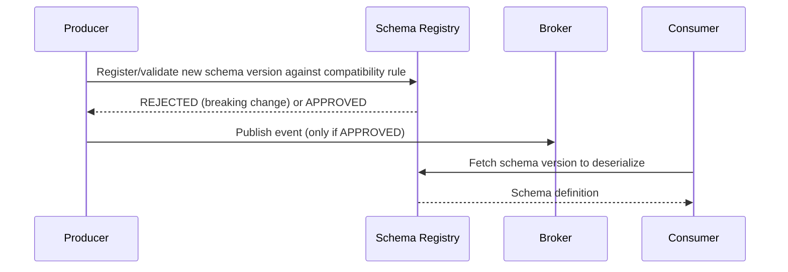
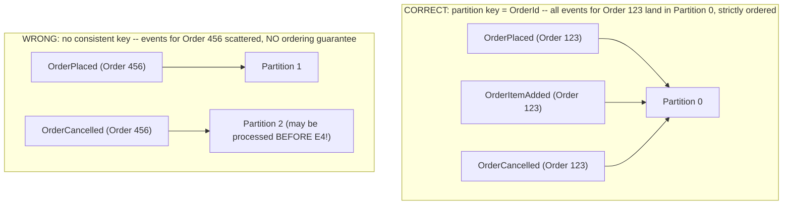
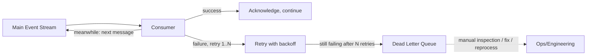
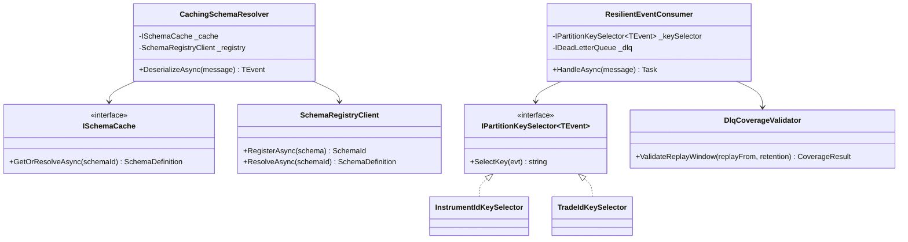
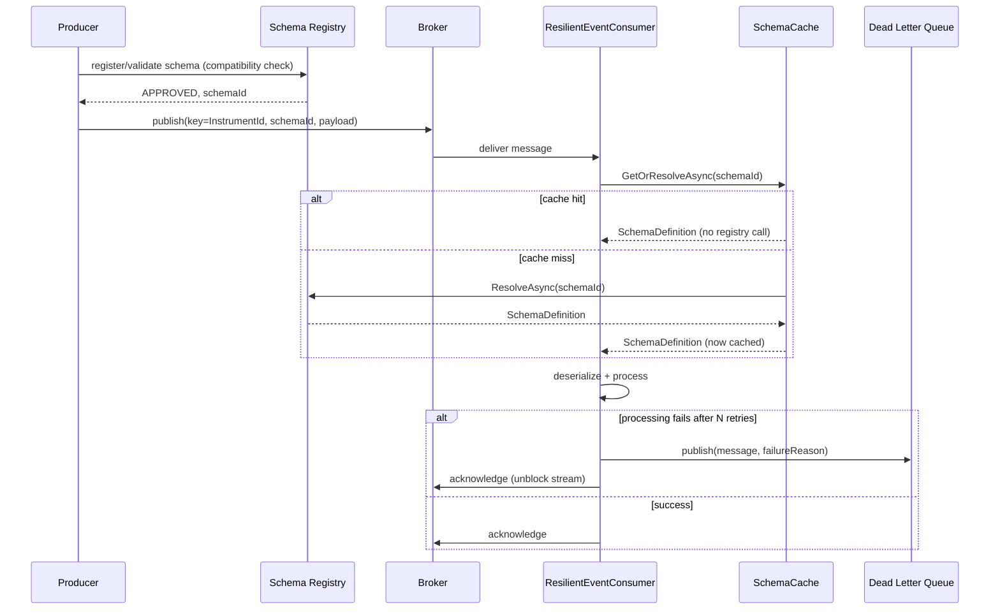

# Module 53 — Event-Driven Architecture: Schema Evolution, Ordering & Partitioning, Delivery Semantics & Dead Letter Queues

> Domain: Event-Driven Architecture | Level: Intermediate → Expert | Prerequisite: [[01-EDA-Fundamentals-Choreography-vs-Orchestration]], [[../17-Microservices/03-Versioning-Testing-Deployment-TeamTopologies]] (API versioning, extended here to event schemas), [[../16-Distributed-Systems/02-Failure-Detection-Idempotency-Outbox]] (idempotency, applied here to event consumption specifically)
> This module completes the `18-Event-Driven-Architecture` conceptual arc (Modules 52–53) before the dedicated `19-Kafka`/`20-RabbitMQ` broker-implementation modules — it covers the four practical disciplines every production EDA system needs regardless of which specific broker technology implements them: schema evolution, ordering guarantees, delivery-semantics honesty, and failure isolation via dead letter queues.

---

## 1. Fundamentals

### Why do events need their own dedicated schema-evolution, ordering, and delivery-semantics discipline, distinct from what Modules 49-51 already established for synchronous APIs?
An event, once published, may be consumed by subscribers written by teams the publisher has never met, processed **minutes, hours, or even days later** (unlike a synchronous API call's immediate request/response), potentially **out of the order it was published** (depending on broker/partitioning configuration), and potentially **more than once** (most brokers default to at-least-once delivery, not exactly-once) — each of these properties has no equivalent in synchronous, immediate request/response communication, and each demands a deliberate architectural answer: how does an old consumer handle a newer event schema it's never seen a field from? What happens if events for the same entity arrive out of order? What happens if a consumer receives the same event twice, or if a consumer crashes mid-processing?

### Why does this matter?
Because these properties aren't edge cases to be handled defensively as an afterthought — they are the **normal, expected operating conditions** of any real event-driven system at scale, and the idempotency discipline (already established for synchronous retried calls) becomes even more critical here, since asynchronous, decoupled, potentially-delayed, potentially-reordered, potentially-duplicated delivery is the *default* assumption an event consumer must design around, not a rare failure mode.

### When does this matter?
Any system publishing or consuming events at meaningful scale or over any meaningful time horizon — a system with events flowing continuously between more than a couple of services, especially once schema changes, consumer scaling (multiple partitions/competing consumers), and inevitable transient failures are all considered together rather than in isolation.

### How does it work (30,000-ft view)?
```
Schema Evolution: a Schema Registry enforces compatibility rules (backward/forward/full) at
 publish time, preventing an incompatible event schema from ever reaching consumers
Ordering: partition/shard events by a consistent key (e.g., entity ID) so all events for
 the SAME entity are strictly ordered; ordering across DIFFERENT entities is not guaranteed
Delivery Semantics: at-least-once (default, requires idempotent consumers) vs exactly-once
 (harder, often emulated via idempotency rather than true broker-level guarantee)
Dead Letter Queue: a side channel capturing events a consumer repeatedly fails to process,
 isolating the failure so it doesn't block the entire stream behind it
```

---

## 2. Deep Dive

### 2.1 The Schema Registry — Enforcing Compatibility Before an Event Ever Ships
A Schema Registry is a centralized service (Confluent Schema Registry being the most widely-adopted implementation, typically paired with Kafka) that stores every version of every event schema and **enforces a configured compatibility rule at publish time** — a producer attempting to publish an event under a schema that violates the registry's compatibility rule is **rejected before the event ever reaches the broker**, directly the event-schema equivalent of the automated breaking-change CI gate, but enforced at runtime, at the moment of publication, rather than only at build time. This closes exactly the gap the incident exposed for synchronous APIs (an unknown consumer breaking silently) — with a schema registry, there's no way for an incompatible event to be published at all, regardless of whether every consumer is known to the publishing team.

### 2.2 Compatibility Modes — Backward, Forward, and Full
**Backward compatibility** means a **new** schema can be used to read data written under the **previous** schema — critically, this is the mode that protects **new consumer code** reading **old events** (relevant when a consumer is upgraded before all old events have been consumed, or when replaying historical events). **Forward compatibility** means an **old** schema can be used to read data written under a **new** schema — this protects **old, not-yet-upgraded consumer code** reading **newly-published events** (the far more common, pressing concern in practice: producers typically deploy before every consumer has upgraded, so new events must remain readable by old consumer code during the rollout window). **Full compatibility** requires both simultaneously — the strictest, safest mode, typically achieved by only ever adding new **optional** fields with defaults and never removing or repurposing existing fields, directly the additive-by-default discipline applied at the schema-registry-enforced level.

### 2.3 Ordering Guarantees — Per-Key Ordering, Not Global Ordering
Most distributed event brokers (Kafka's partitioning model being the canonical example, covered in full /the dedicated Kafka module) provide **strict ordering only within a single partition**, and a partition is typically assigned by hashing a chosen **partition key** — choosing the partition key correctly is what determines whether events that *must* be processed in order relative to each other (all events for a single order: `OrderPlaced`, `OrderItemAdded`, `OrderCancelled`) actually land in the same partition and are therefore guaranteed to be delivered to a consumer in publish order. Choosing the **wrong** partition key (or no consistent key at all, allowing random/round-robin distribution) means events for the same logical entity can land in different partitions, processed by different consumer instances, with **no guarantee about their relative order** — a subtle, easy-to-miss mistake, since it produces correct behavior under light load (where coincidental ordering is common) and only manifests as visible bugs under the concurrent load where reordering actually occurs.

### 2.4 Delivery Semantics — At-Least-Once, At-Most-Once, and the Reality of "Exactly-Once"
**At-most-once** delivery means a message might be lost but is never redelivered — rarely acceptable for business-critical events. **At-least-once** delivery (the overwhelmingly common practical default) guarantees a message will eventually be delivered but may be delivered **more than once** (a consumer processes a message, crashes before acknowledging receipt to the broker, and the broker redelivers it to another consumer instance believing it was never processed) — this is why **every event consumer must be idempotent** (the idempotency discipline, now mandatory for event consumption specifically, not optional). True **exactly-once** delivery is a much stronger, harder guarantee that few brokers provide end-to-end without significant constraints (Kafka's transactional/exactly-once semantics apply specifically within Kafka-to-Kafka pipelines, not universally across arbitrary external side effects) — in practice, most systems achieve the **effect** of exactly-once processing not through a true broker guarantee but through **idempotent consumer design** layered on top of at-least-once delivery (processing the same event twice produces the same result as processing it once, making the redelivery harmless rather than actually preventing it).

### 2.5 Dead Letter Queues — Isolating Poison Messages Without Blocking the Stream
A Dead Letter Queue (DLQ) is a side channel that a consumer routes a message to after it has **repeatedly failed processing** beyond a configured retry limit — rather than either (a) blocking the entire partition/queue indefinitely retrying the same "poison" message forever (starving every message behind it from ever being processed) or (b) silently dropping the failed message (losing it and its associated business event entirely), the DLQ preserves the failed message for later inspection/manual intervention/reprocessing while allowing the consumer to **continue processing subsequent messages** in the main stream unblocked. This is the event-driven-architecture equivalent of the circuit-breaker pattern's core insight — isolate and fail fast on what's clearly broken, rather than letting it degrade the processing of everything else behind it.

### 2.6 Event Replay — the Operational Superpower a Durable, Retained Event Log Provides
A broker that retains published events for a meaningful retention period (rather than deleting them immediately after every current consumer has acknowledged them) enables **replay** — reprocessing historical events from any point in the past, valuable for recovering from a bug in a consumer's processing logic (fix the bug, then replay the affected time range to reprocess events correctly this time), backfilling a newly-added subscriber that needs to build up state from historical events it never saw originally, or rebuilding a service's entire state from scratch (directly connecting to Event Sourcing's full philosophy, the dedicated later module) — this capability fundamentally depends on the idempotent-consumer discipline already being in place, since replay is, definitionally, redelivering already-processed events, and a non-idempotent consumer would corrupt its own state upon replay just as it would upon any other at-least-once-delivery duplicate.

## 3. Visual Architecture

### Schema Registry Enforcement Flow

```mermaid
sequenceDiagram
 participant Producer
 participant Registry as Schema Registry
 participant Broker
 participant Consumer
 Producer->>Registry: Register/validate new schema version against compatibility rule
 Registry-->>Producer: REJECTED (breaking change) or APPROVED
 Producer->>Broker: Publish event (only if APPROVED)
 Consumer->>Registry: Fetch schema version to deserialize
 Registry-->>Consumer: Schema definition
```

### Partition Key and Ordering

```mermaid
graph TB
 subgraph "CORRECT: partition key = OrderId -- all events for Order 123 land in Partition 0, strictly ordered"
 E1["OrderPlaced (Order 123)"] --> P0[Partition 0]
 E2["OrderItemAdded (Order 123)"] --> P0
 E3["OrderCancelled (Order 123)"] --> P0
 end
 subgraph "WRONG: no consistent key -- events for Order 456 scattered, NO ordering guarantee"
 E4["OrderPlaced (Order 456)"] --> P1[Partition 1]
 E5["OrderCancelled (Order 456)"] --> P2["Partition 2 (may be processed BEFORE E4!)"]
 end
```

### Dead Letter Queue Flow

```mermaid
graph LR
 Stream[Main Event Stream] --> Consumer
 Consumer -->|"success"| Ack[Acknowledge, continue]
 Consumer -->|"failure, retry 1..N"| Retry[Retry with backoff]
 Retry -->|"still failing after N retries"| DLQ[Dead Letter Queue]
 DLQ -.->|"manual inspection / fix / reprocess"| Ops[Ops/Engineering]
 Consumer -->|"meanwhile: next message"| Stream
```

## 4. Production Example
**Scenario**: A logistics platform's Shipment-Tracking service consumed `ShipmentStatusChanged` events, partitioned by a **randomly-generated event ID** (not the shipment ID) for "even load distribution across consumer instances," reasoning the team believed maximized throughput. For most shipments, this worked fine — status changes were infrequent enough that even reordered delivery usually didn't cause visible problems. But for a subset of high-priority shipments generating rapid, closely-spaced status updates (`PickedUp` → `InTransit` → `Delivered` within seconds during an automated warehouse-scanning process), events occasionally landed in different partitions and were processed by different consumer instances **out of order** — a `Delivered` event processed before the corresponding `PickedUp` event, causing the tracking service's state machine (which validated transitions like "can't go from `Unknown` directly to `Delivered`") to reject the "invalid" out-of-order transition and silently drop it, leaving the shipment's displayed status permanently stuck at whatever state happened to be processed last in the racing, reordered sequence — with no error surfaced anywhere, since the rejection was treated as a validation failure on a single event, not flagged as a systemic ordering problem. **Investigation**: customer complaints about "stuck" shipment statuses for a small, seemingly-random subset of shipments (specifically ones with rapid status changes) eventually led engineers to examine the partition assignment logic, discovering the random-event-ID partition key was the root cause — high-frequency-update shipments were simply more likely to have their tightly-spaced events land in different partitions and race each other, while low-frequency-update shipments (the majority) rarely hit this race window. **Fix**: changed the partition key to the **shipment ID** — guaranteeing every event for a given shipment lands in the same partition and is therefore delivered to its consumer in strict publish order, eliminating the reordering race entirely; also added a Dead Letter Queue for genuinely invalid transitions (a true data-integrity issue, distinct from an ordering artifact) so future genuine anomalies would be visible and inspectable rather than silently dropped. **Lesson**: this is precisely the per-key-ordering discipline, illustrating why the mistake is so easy to make and so late to surface — a "randomize for even load distribution" instinct is reasonable-sounding in isolation but directly sacrifices the ordering guarantee the consumer's state machine silently assumed was in place; and the silent-drop behavior (rather than surfacing rejected transitions to a DLQ) meant the systemic root cause stayed hidden behind what looked like isolated, unrelated customer complaints for far longer than it should have.
## 10. Interview Questions

### Basic (10)
1. **Q: What does a schema registry do?** **A:** Stores every schema version and enforces a configured compatibility rule at publish time, rejecting incompatible schema changes.
2. **Q: What is backward compatibility, in the schema-registry sense?** **A:** A new schema can read data written under the previous schema.
3. **Q: What is forward compatibility?** **A:** An old schema can read data written under a new schema.
4. **Q: What ordering guarantee do most distributed brokers provide?** **A:** Strict ordering only within a single partition, not globally across all partitions.
5. **Q: What determines which partition an event lands in?** **A:** Typically a hash of a chosen partition key.
6. **Q: What is at-least-once delivery?** **A:** A guarantee that a message will eventually be delivered, but possibly more than once.
7. **Q: Why must event consumers be idempotent?** **A:** Because at-least-once delivery (the common default) can redeliver the same message, and idempotency ensures processing it twice produces the same result as processing it once.
8. **Q: What is a Dead Letter Queue?** **A:** A side channel capturing messages a consumer repeatedly fails to process, so they don't block the main stream.
9. **Q: What is event replay?** **A:** Reprocessing historical, retained events from a broker, useful for bug recovery, backfilling new subscribers, or rebuilding state.
10. **Q: What must be true of a consumer for replay to be safe?** **A:** The consumer must be idempotent, since replay is definitionally redelivering already-processed events.

### Intermediate (10)
1. **Q: Why is forward compatibility often the more pressing practical concern than backward compatibility?** **A:** Producers typically deploy new schema versions before every consumer has upgraded, so newly-published events must remain readable by old, not-yet-upgraded consumer code during the rollout window.
2. **Q: Why does a schema registry close a gap that the API-versioning discipline alone couldn't fully close?** **A:** It enforces compatibility automatically at the moment of publication, for every message, regardless of whether every consumer is known to the publishing team — closing exactly the "unknown consumer" gap that caused the incident.
3. **Q: Why does randomizing a partition key for "even load distribution" risk breaking ordering guarantees, even though it sounds like a reasonable optimization?** **A:** It maximizes distribution across partitions, but sacrifices the guarantee that all events for a single logical entity land in the same partition — which is precisely what strict per-entity ordering depends on.
4. **Q: Why did the ordering bug only affect high-frequency-update shipments and not the majority of shipments?** **A:** Reordering races only manifest when multiple events for the same entity are in flight closely enough in time to actually land in different partitions and be processed out of sequence — infrequent updates rarely create this race window, while rapid, closely-spaced updates frequently do.
5. **Q: Why is true exactly-once delivery rarely achieved end-to-end across arbitrary external systems, even with brokers advertising "exactly-once semantics"?** **A:** Broker-level exactly-once guarantees typically apply within the broker's own transactional boundary (e.g., Kafka-to-Kafka pipelines); once a side effect crosses into an external system (a database write, an external API call) the guarantee no longer inherently holds, and idempotent consumer design remains necessary to achieve the practical effect of exactly-once processing.
6. **Q: Why does a Dead Letter Queue prevent one poison message from blocking an entire stream?** **A:** Without it, a consumer retrying the same failing message indefinitely would never advance past it, starving every subsequent message in the same partition/queue from being processed at all.
7. **Q: Why should Dead Letter Queue volume be monitored as a standing metric rather than only inspected reactively when someone notices a problem?** **A:** A sudden spike indicates a systemic issue (a bad deployment, a downstream outage) affecting many messages at once, which is a leading indicator worth alerting on proactively, not just a place to look after a complaint arrives.
8. **Q: Why does under-provisioning partition count create an artificial throughput ceiling regardless of consumer instance count?** **A:** Each partition can only be actively consumed by one consumer instance within a consumer group at a time — adding more consumer instances beyond the partition count provides no additional parallelism, since there aren't enough partitions to assign to the extra instances.
9. **Q: Why can't partition-count scaling decisions be made independently of partition-key design?** **A:** Increasing partition count only improves throughput if the chosen partition key actually distributes load across the new partition count while still keeping same-entity events together — the key design and the count are coupled decisions, not independent levers.
10. **Q: Why must Dead Letter Queue contents receive the same data-governance discipline as the main event stream?** **A:** They typically contain the complete, original payload of a failed business event, which may include sensitive customer data — being a "failure" rather than a "success" doesn't reduce the sensitivity of the data contained within.

### Advanced (10)
1. **Q: Diagnose the incident from first principles, and design the specific pre-production review question or automated check that would have caught the random-partition-key mistake before it reached production.**
 **A:** Root cause: the partition key was chosen to optimize load distribution without considering the consumer's own ordering assumptions (a state machine implicitly assuming in-order delivery). Review question: for every event-consuming service with any stateful, order-sensitive processing logic (a state machine, a sequence validator), explicitly ask "does this consumer's correctness depend on receiving events for the same entity in publish order, and if so, does the producer's partition key guarantee that?" — as an even stronger safeguard, an automated check could verify, for any topic a stateful consumer subscribes to, that the topic's actual partition-key configuration matches an entity-identifier field the consumer's own schema/contract declares as its ordering key, converting an implicit, easy-to-violate assumption into an explicitly declared, checkable contract between producer and consumer.
2. **Q: A consumer needs strict ordering across events for a shipment (the fix) but also needs to scale to a very high number of partitions for throughput, and a single shipment's events are relatively rare in absolute volume compared to the whole system's throughput. Does this create a genuine tension, and how would you resolve it if so?**
 **A:** No genuine tension in this specific case — partitioning by shipment ID naturally distributes *different* shipments' events across many partitions (achieving high aggregate parallelism and throughput across the whole system) while still guaranteeing all events for the *same* shipment land together (achieving per-shipment ordering) — the tension Advanced Q1 implies would only be genuine if a single entity's own event volume were high enough to itself become a partition-level bottleneck (an extremely high-frequency single entity), in which case a more sophisticated approach (sub-partitioning by entity+time-window, accepting weaker ordering guarantees within very narrow time slices) might be needed — but this is a rare, specific scale threshold, not the general case, and should not be assumed necessary without first confirming a single entity's event rate actually approaches partition-level throughput limits.
3. **Q: Design a strategy for migrating a topic's compatibility mode from "backward-only" to "full" (backward+forward) for an existing, already-in-production event type, without breaking any currently-running producer or consumer.**
 **A:** Full compatibility requires the stricter, additive-only discipline from that point forward — the migration itself doesn't require rewriting historical events (already-published events remain readable under whatever compatibility guarantee was in effect when they were published), but going forward, the registry's enforced rule must be tightened, and — critically — every existing producer must be audited against the *new*, stricter rule before it's enforced, since a producer that was previously making backward-incompatible-but-forward-compatible changes (permitted under a weaker mode) would now be rejected; the safe sequence is: audit and fix any existing producer behavior that would violate the new rule **first**, then tighten the registry's enforced compatibility mode, never the reverse (which would immediately start rejecting a currently-functioning producer's next legitimate publish attempt).
4. **Q: Explain why "just make every consumer idempotent" is necessary but not sufficient to fully resolve the reordering problem illustrated, and what idempotency alone does and doesn't protect against.**
 **A:** Idempotency (processing the same event twice produces the same result as processing it once) protects specifically against **duplicate delivery** of the *same* event — it does nothing to address **reordering** of *different* events for the same entity (`Delivered` processed before `PickedUp`), since these are two distinct events, not a duplicate of one event; idempotency and ordering are separate concerns requiring separate mechanisms (idempotency keys/dedup logic for duplicates, correct partition-key design for ordering) — the actual root cause was purely an ordering problem, and even a perfectly idempotent consumer would still have processed the reordered events incorrectly, since idempotency doesn't retroactively fix the sequence in which distinct events arrived.
5. **Q: A team implements a Dead Letter Queue but reports that messages routed to it are essentially "lost" in practice — engineers rarely go back to inspect or reprocess them, and the DLQ has become a silent graveyard rather than an actionable signal. Diagnose and propose a fix.**
 **A:** A DLQ without an operational process attached to it (alerting on new arrivals, an owned, staffed responsibility for triage, a defined SLA for investigation) provides the *mechanism* for isolating failures without providing the *organizational process* that makes that isolation actionable — directly the "monitor DLQ volume as a standing metric" recommendation, now extended: route DLQ arrivals through the same incident/alerting pipeline as any other production issue, with an assigned owner and expected response time, converting the DLQ from a passive parking lot into an active part of the system's operational feedback loop — a DLQ is only as valuable as the process ensuring its contents get looked at.
6. **Q: Design an approach for safely testing a proposed schema change's actual forward-compatibility before relying solely on the registry's automated compatibility check, given that automated compatibility rules can't capture every possible subtle consumer-side deserialization behavior.**
 **A:** Maintain a small, representative set of "canary" consumer test harnesses (using real, deployed consumer code, not just the registry's abstract schema-compatibility rule engine) that deserialize sample events under the proposed new schema and assert expected business-level behavior still holds — this catches subtler issues the registry's structural compatibility check might miss (a field type change that's structurally "compatible" per the registry's rules but produces a semantically wrong business result in a specific consumer's deserialization/mapping logic), directly extending §Advanced Q3's "contracts can be stale/incomplete relative to real usage" lesson to the schema-registry context specifically — automated structural compatibility checking is necessary but should be paired with, not treated as a full substitute for, targeted, realistic consumer-behavior verification for high-risk schema changes.
7. **Q: How would you decide the appropriate event-retention period for a given topic, balancing replay capability against storage cost?**
 **A:** Base retention on the **realistic recovery/backfill scenarios** the organization actually needs to support: how far back would a newly-onboarded subscriber plausibly need to backfill from (informing a minimum retention floor), and how long would it realistically take to detect and fix a consumer-side processing bug before replay becomes necessary to recover (informing how long replay capability needs to remain available) — balanced against the concrete storage cost of retaining high-volume topics for that duration; critically, retention should be a **deliberate, documented decision** per topic based on its specific replay-use-case needs, not a single, uniform default retention period applied blindly across topics with very different actual replay requirements and volumes.
8. **Q: A Principal Engineer discovers that different teams across the organization have each independently implemented their own ad hoc idempotency logic for event consumption, with inconsistent approaches (some using database unique constraints, some using in-memory deduplication caches with different, undocumented TTLs, some with no deduplication at all). Design a systemic response.**
 **A:** Directly the same governance pattern as §Advanced Q10 and §Advanced Q10 applied here: provide a shared, well-tested internal library implementing a standard idempotency mechanism (a durable, centrally-designed idempotency-key-tracking store, following the Outbox-adjacent idempotency-key pattern) as the **default**, sanctioned approach every team uses rather than reimplementing independently — converting inconsistent, ad hoc, team-by-team idempotency quality (some teams' in-memory-cache approach may not even survive a consumer restart, silently reopening the exact duplicate-processing risk idempotency exists to close) into a uniform, correctly-implemented-once, fleet-wide guarantee.
9. **Q: Critique the following claim: "Since our broker guarantees at-least-once delivery and our consumers are all idempotent, we don't need to worry about event ordering at all — idempotency handles reliability, full stop."**
 **A:** This conflates two genuinely separate concerns (Advanced Q4) — idempotency addresses duplicate delivery of the same event, while ordering addresses the relative sequence of distinct events; a fully idempotent consumer processing events in the wrong order (as) will still produce an incorrect final result, since idempotency guarantees "processing this exact event twice is harmless," not "the events I'm receiving are in the correct relative sequence" — the claim's implicit assumption that idempotency is a superset of reliability concerns is precisely the kind of subtle, false equivalence that let the actual root cause (a pure ordering bug) go undetected while the team's attention was on other reliability properties.
10. **Q: As a Principal Engineer establishing EDA operational standards across a large organization, design the specific set of automated gates and standing monitors (synthesizing this entire module) you would require for every event-producing/consuming service, and justify each one's necessity.**
 **A:** (1) Mandatory schema-registry compatibility enforcement (full mode by default) on every publish — necessary because manual review alone misses unknown-consumer breakage (directly §Advanced Q5's automated-gate philosophy applied to events). (2) A declared, checkable partition-key-to-ordering-requirement contract for every stateful consumer (Advanced Q1) — necessary because ordering assumptions are otherwise implicit and easy to silently violate. (3) A shared, standard idempotency library as the sanctioned default for every consumer (Advanced Q8) — necessary because ad hoc, team-by-team idempotency implementations vary unpredictably in correctness. (4) Mandatory Dead Letter Queue routing with attached, staffed alerting/triage process for every consumer (Advanced Q5) — necessary because a DLQ without an operational process is a silent graveyard, not an actionable safety mechanism. Each gate targets a distinct, specific failure mode this module identified through concrete incidents or reasoning, directly the same "convert each hard-won lesson into a specific, non-optional, automated or process-backed gate" governance pattern this course applies recurrently, now completing the pattern's application across the full Microservices-and-EDA arc.

### Expert (10)
1. **Q: Design a Schema Registry deployment that remains available to producers even during a full registry outage, without silently disabling compatibility enforcement.**
 **A:** The correct design is not "fail open" (allowing unchecked publication, reopening the exact risk the registry exists to close) nor naive "fail closed" (blocking every producer estate-wide on any registry blip, an outsized blast radius for a transient issue) — it is **client-side schema caching with a bounded staleness tolerance**: producers cache the last-known-good compatibility verdict and their own previously-registered schema ID locally, so a producer publishing under an *already-registered, previously-validated* schema can continue doing so during a registry outage (no new compatibility decision is needed, since none is being made), while a producer attempting to register a genuinely **new** schema version during the outage is correctly blocked, since that specific action requires a compatibility decision the registry alone can make. This narrows the blast radius of a registry outage to exactly "no new schema versions can be introduced right now," not "no events can be published right now" — a materially smaller, more defensible degradation.
2. **Q: A high-frequency trading platform has a single instrument whose event rate approaches the partition-level throughput ceiling, making strict per-instrument ordering (partition key = instrument ID) a genuine bottleneck for that one instrument specifically. Design a resolution that doesn't sacrifice ordering correctness for the instrument's price-affecting events.**
 **A:** Split the instrument's event stream by **event category**, not by further partitioning the instrument itself — separate the events that genuinely require strict relative ordering against each other (price updates, which must be applied in sequence to avoid stale-overwriting a newer price with an older one) from events that don't have an ordering dependency on each other (independent analytics/logging events about the same instrument) — routing only the ordering-critical subset through the single, correctly-ordered partition while allowing the non-ordering-critical subset to spread across multiple partitions for parallelism. This is the same gating-vs-non-gating discriminating question the sibling module applies to coordination style, now applied to *which events for one entity actually need to share a partition* — not every event about an entity has the same ordering requirement as every other event about that entity.
3. **Q: Critique the following DLQ design: messages are routed to the DLQ after N failed retries, and a nightly batch job automatically replays every DLQ message back into the main stream once per day.**
 **A:** This design silently reintroduces exactly the failure mode a DLQ exists to prevent — if the original failure cause is still present (a persistent bug, not a transient blip), the nightly replay will fail again identically, but now the message has cycled through the DLQ→main-stream→DLQ loop indefinitely, consuming processing capacity every night without ever resolving, and — critically — without any human ever being alerted, since the automatic replay silently "handles" what should have triggered Advanced Q5's staffed-triage process. Automatic replay is appropriate only for failure classes confirmed to be transient (a downstream dependency's known brief outage window, confirmed resolved) — for anything else, replay must be a deliberate, triggered action following investigation, not a blind, scheduled default.
4. **Q: Explain the specific mechanics of a Kafka consumer-group rebalance and why it can cause brief, ordering-relevant processing pauses even for correctly-partitioned data.**
 **A:** A rebalance reassigns partition ownership across the consumer group's live instances (triggered by an instance joining, leaving, or being deemed dead via a missed heartbeat) — during the reassignment window, every affected partition briefly has **no actively-consuming owner** until the new assignment is confirmed and the new owning instance resumes from the last committed offset; this is not an ordering-correctness violation (the partition's own internal event order is untouched), but it is a **latency and continuity** disruption — a workflow-completion monitor (the sibling module's) with an aggressive threshold could false-positive-alert on a stall that's actually just a rebalance pause, so alerting thresholds must be calibrated with rebalance-pause duration as an accepted, expected floor, not treated as indistinguishable from a genuine processing stall.
5. **Q: A team stores DLQ messages with full plaintext payloads for "ease of debugging," arguing that encrypting DLQ contents would slow down incident response during exactly the high-pressure moments DLQ inspection matters most. Evaluate.**
 **A:** This is a false trade-off — encryption at rest doesn't meaningfully slow down authorized incident-response access (decryption on read, transparent to an authorized engineer with the right access, is a standard, low-latency pattern), it only prevents *unauthorized* access to the same sensitive payloads §8 identifies the DLQ as retaining. The actual, unstated trade being made is convenience for whoever provisioned the DLQ against data-governance discipline for whoever's PII ends up in a failed message — the "ease of debugging" framing conflates "encrypted" with "harder for an authorized engineer to read," which isn't what encryption-at-rest does; it's specifically what it doesn't do for legitimate access while doing exactly that for illegitimate access.
6. **Q: Design a contract-testing strategy specifically for schema evolution, distinct from event-flow contract testing, that would have caught a "structurally compatible but semantically wrong" schema change before production.**
 **A:** Beyond the registry's structural compatibility check (field types, presence/absence rules), maintain a small suite of **golden-event fixtures** — real, representative sample events captured from production — replayed through actual, deployed consumer deserialization and business-logic code whenever a new schema version is proposed, asserting the consumer's resulting business behavior (not just successful deserialization) matches an expected, previously-approved outcome. This catches the class of change that's structurally valid (e.g., changing a currency-amount field's numeric type in a way the registry's rules permit) but semantically wrong for a specific consumer's calculation logic — a gap the registry's schema-shape-only compatibility check is not designed to catch, since it reasons about the schema's structure, not about what any specific consumer *does* with the data.
7. **Q: How should idempotency-key retention interact with cross-region schema-registry replication during a failover, if a consumer resumes in a DR region using a locally-cached, possibly-stale schema-registry mirror?**
 **A:** A DR region's schema-registry mirror lagging behind the primary region means the DR consumer may be unable to resolve the schema ID of a very recently-published event (published in the primary region just before failover, not yet replicated to the DR mirror) — this manifests as a deserialization failure indistinguishable, without specific diagnosis, from a genuinely malformed event, risking an incorrect DLQ routing for a perfectly valid event whose only problem is a lagging registry mirror. The mitigation: DR failover runbooks must explicitly check schema-registry mirror lag as a pre-condition before resuming consumption, and a consumer's DLQ-routing logic should distinguish "schema ID not found, possibly due to registry replication lag" from "payload genuinely malformed" as separate failure categories with separate handling, rather than collapsing both into an identical DLQ outcome.
8. **Q: A Principal Engineer is asked whether "exactly-once" should be pursued at the broker/transactional level (e.g., Kafka's transactional producer/consumer APIs) for a new, latency-sensitive trading-events pipeline, or whether idempotent-consumer design on top of at-least-once delivery is sufficient. What's the deciding factor?**
 **A:** The deciding factor is **where the pipeline's side effects terminate**, not throughput or latency preference in isolation: if every step of the pipeline stays fully within the broker's own transactional boundary (Kafka-to-Kafka, no external side effect), broker-level transactional guarantees provide genuine, strong protection with less bespoke idempotency-key engineering required. If any step's side effect crosses outside that boundary (a call to an external execution venue, a write to a non-transactional external system), broker-level guarantees provide **no** protection for that step regardless of how strong they are internally, making idempotent-consumer design mandatory anyway — at which point paying the latency/throughput cost of broker-level transactions *in addition to* idempotent-consumer design is often not worth the marginal protection it adds only to the fully-internal portion of the pipeline. For a trading pipeline whose entire point is triggering external effects (order execution), idempotent-consumer design is the load-bearing guarantee regardless of whether broker-level transactions are also enabled.
9. **Q: Design chaos-engineering experiments specifically targeting this module's three disciplines (schema evolution, ordering, DLQ) rather than generic infrastructure chaos (killing random pods).**
 **A:** (1) **Schema chaos:** deliberately deploy a consumer pinned to an *older* schema version against a topic actively receiving *newer*-schema events in production-like volume, verifying forward compatibility holds under real load, not just in an isolated compatibility-check test. (2) **Ordering chaos:** inject artificial partition-reassignment/rebalance events during active processing of a known ordering-sensitive entity's event sequence, verifying the consumer's state machine handles the resulting brief pause correctly rather than mis-timing out or false-alerting. (3) **DLQ chaos:** simulate a sustained downstream-dependency failure at production-representative volume, verifying DLQ storage and alerting handle the resulting backlog burst without the DLQ mechanism itself becoming the bottleneck or losing messages under the induced load. Each experiment targets a specific mechanism this module names, rather than generic resilience testing that wouldn't isolate which of these three disciplines actually failed.
10. **Q: Deliver the closing synthesis: what single discipline, if adopted as a non-negotiable default across every event-producing and event-consuming service in an organization, would prevent the largest share of this module's failure modes at once?**
 **A:** **Content-derived, transactionally co-located idempotency keys with a database-level structural uniqueness backstop, applied uniformly, regardless of coordination style, ordering guarantee, or delivery-semantics configuration.** Reasoning: ordering bugs (the incident) still cause incorrect *processing outcomes* even with perfect idempotency, but a structural uniqueness backstop specifically prevents the most costly *consequence* of both ordering failures and duplicate-delivery failures alike — a duplicated or conflicting write reaching a system of record. Schema-evolution failures are a separate category this specific discipline doesn't address, but ordering and delivery-semantics failures — the two disciplines most likely to produce a silent, financially consequential duplicate or corrupted write — are both substantially mitigated by the same one mechanism. This is why idempotency, of everything covered across both modules, earns its own dedicated deeper treatment: it is the single highest-leverage, broadest-coverage discipline in the entire domain, not merely one item on a checklist alongside the others.

---

## 11. Coding Exercises

### Easy — Additive-only, registry-enforced event schema
```csharp
public class ShipmentStatusChangedEventV2
{
    public string ShipmentId { get; set; } = default!; // ordering/partition key -- UNCHANGED from v1
    public string Status { get; set; } = default!;
    public DateTimeOffset Timestamp { get; set; }
    public string? CarrierTrackingUrl { get; set; } // NEW in v2, OPTIONAL with null default --
    // old (v1) consumers simply ignore this field (forward-compatible)
    // new (v2) consumers reading OLD (v1) events get null here (backward-compatible)
}
```

### Medium — Correct partition-key selection
```csharp
public class ShipmentEventPublisher
{
    public async Task PublishAsync(ShipmentStatusChangedEvent evt)
    {
        // CORRECT: partition key = ShipmentId -- ALL events for one shipment land in the SAME
        // partition, guaranteeing strict publish-order delivery to any one consumer instance.
        await _producer.PublishAsync(topic: "shipment-status-changed",
            key: evt.ShipmentId, // NEVER a random/round-robin key when order matters
                value: evt);
    }
}
```

### Hard — Idempotent consumer with a durable dedup store (§Advanced Q8)
```csharp
public class IdempotentShipmentConsumer
{
    private readonly IIdempotencyStore _idempotencyStore; // durable, survives consumer restarts

    public async Task HandleAsync(ShipmentStatusChangedEvent evt, string messageId)
    {
        if (await _idempotencyStore.HasProcessedAsync(messageId))
            return; // safe no-op -- this exact message was already processed, likely a redelivered duplicate

        await using var transaction = await _db.BeginTransactionAsync;
        await _shipmentRepository.UpdateStatusAsync(evt.ShipmentId, evt.Status);
        await _idempotencyStore.MarkProcessedAsync(messageId); // SAME transaction -- atomic with the business update
        await transaction.CommitAsync;
        // Handles at-least-once redelivery safely. Does NOT, by itself, handle reordering (§Advanced Q4) --
        // that's solved separately by correct partition-key design (Medium exercise above), not by this.
    }
}
```

### Expert — Dead Letter Queue with retry-count tracking and alerting (§Advanced Q5)
```csharp
public class ResilientEventConsumer
{
    private const int MaxRetries = 3;

    public async Task HandleAsync(ConsumedMessage message)
    {
        try
        {
            await _businessHandler.ProcessAsync(message);
            await _broker.AcknowledgeAsync(message);
        }
        catch (Exception ex)
        {
            int retryCount = message.GetRetryCount;
            if (retryCount < MaxRetries)
            {
                await _broker.RetryWithBackoffAsync(message, retryCount, ex);
            }
            else
            {
                await _deadLetterQueue.PublishAsync(message, ex);
                await _broker.AcknowledgeAsync(message); // acknowledge on MAIN stream -- unblocks subsequent messages
                await _alerting.RaiseAsync(
                    $"Message {message.Id} moved to DLQ after {MaxRetries} retries: {ex.Message}",
                        severity: Severity.High); // NOT a silent graveyard (§Advanced Q5) -- routed to the incident pipeline
            }
        }
    }
}
```
**Discussion**: acknowledging the message on the main stream once it's routed to the DLQ (rather than leaving it unacknowledged and endlessly retried) is the critical detail preventing exactly the "one poison message blocks everything behind it" failure mode describes — combined with the mandatory alerting call, this directly implements Advanced Q10's "DLQ routing with attached, staffed alerting" gate rather than a passive, unmonitored dead-letter mechanism.

---

## 12. System Design

**Scenario:** Design the market-data and trade-confirmation event pipeline for a multi-asset trading platform — a high-volume `PriceUpdate` stream per instrument, and a lower-volume, correctness-critical `TradeConfirmed` stream, both flowing through a shared broker infrastructure to dozens of independent downstream consumers (risk engines, client-facing feeds, regulatory reporting, analytics).

**Functional requirements:**
- Every consumer must be able to deserialize events under whatever schema version it was built against, regardless of which schema version the producer is currently publishing (forward compatibility, §2.2, is the dominant concern here since consumers upgrade independently and on their own schedule).
- `PriceUpdate` events for a single instrument must be strictly ordered relative to each other; `TradeConfirmed` events have no cross-instrument ordering requirement but must never be lost or silently dropped.
- Repeatedly-failing messages must not block the stream, and must be recoverable without reprocessing already-successful messages.

**Non-functional requirements:**
- Schema-registry lookup must not become a per-message latency tax at `PriceUpdate` volume (§7).
- DLQ storage and replay must handle a burst backlog from a systemic downstream outage without becoming the bottleneck during recovery (§9).
- No consumer's dedup/ordering assumptions should be violated by partition-key or partition-count changes made without cross-team visibility.

**Back-of-the-envelope estimation:** `PriceUpdate`: ~200,000 events/second across all instruments at peak (a genuinely high-throughput stream). `TradeConfirmed`: ~50 events/second (low volume, individually high-stakes). This order-of-magnitude difference — 4,000x — is the deciding input for treating these as two structurally different topics with different partition counts, retention, and DLQ handling, not a single uniform topic design applied to both.

**Architecture:** Two separate topics. `price-updates`, partitioned by instrument ID (ordering-critical per instrument, high partition count for aggregate throughput across many instruments, per §Expert Q2's category-splitting principle if any single instrument approaches partition-level throughput). `trade-confirmed`, partitioned by trade ID (no cross-trade ordering need, but each individual trade's own lifecycle events, if any, must stay ordered), low partition count reflecting its low volume, with materially longer retention (trade confirmations are audit-relevant and replay-worthy far longer than transient price ticks).

**Components:** Schema Registry (shared across both topics, full-compatibility mode enforced); `SchemaCache` client library (§7, mandatory for every consumer, caching resolved schema definitions by immutable schema ID); per-topic Dead Letter Queues, `price-updates-dlq` sized for burst tolerance given the topic's high steady-state volume, `trade-confirmed-dlq` with tighter alerting thresholds given the topic's low volume and high per-message stakes; `DlqReplayService` (a dedicated, separately-scaled consumer group per §7, never sharing capacity with live-stream consumers).

**Database selection:** Not directly applicable to the pipeline itself; each downstream consumer's own persistence is out of scope for this shared-infrastructure design, per the same boundary-setting discipline the sibling module's §12 applies.

**Caching:** Schema-definition cache (§7, per-consumer, keyed by immutable schema ID, no expiry needed); no caching on the ordering-critical `price-updates` partition-assignment path itself, since correctness there depends on current, not cached, partition ownership.

**Messaging:** Both topics use at-least-once delivery (the practical default, §2.4); every consumer is required to be idempotent (the shared, sanctioned idempotency library, §Advanced Q8) regardless of which topic it consumes, since duplicate delivery is a property of the delivery mechanism, not of any specific topic's business content.

**Scaling:** `price-updates` partition count provisioned ahead of peak instrument-count growth, not reactively (§9); `trade-confirmed`'s low volume means partition count is driven by ordering-scope needs, not throughput. DLQ replay capacity provisioned for a stated worst-case backlog scenario (a full trading day's `price-updates` volume during a prolonged downstream outage), benchmarked explicitly per §7, not assumed adequate by extrapolating from steady-state DLQ volume.

**Failure handling:** A downstream consumer's repeated processing failure routes to its topic-specific DLQ after a bounded retry count, unblocking the live stream (§2.5); DLQ arrivals for `trade-confirmed` page an on-call engineer immediately given the low volume and high per-message stakes, while `price-updates` DLQ arrivals alert on backlog *rate* (a sudden spike) rather than on every individual arrival, given the topic's normal, higher background DLQ trickle.

**Monitoring:** Schema-cache hit rate (near-100% expected in steady state; a drop signals either a schema-version churn spike or a cache-implementation regression); DLQ volume and backlog age per topic; consumer-group rebalance frequency and pause duration (§Expert Q4), tracked distinctly from genuine processing stalls.

**Trade-offs:** Splitting into two topics with different partition/retention/DLQ profiles costs additional operational surface area (two DLQ alerting policies, two retention configurations to maintain) versus a single uniform topic design — accepted because the 4,000x volume and stakes asymmetry between the two streams makes a uniform design either over-provisioned for `trade-confirmed` or under-provisioned for `price-updates` regardless of which single configuration is chosen.

---

## 13. Low-Level Design

**Requirements:** A schema-registry lookup is cached and never repeated per message for an already-seen schema ID; a partition key is deliberately, explicitly chosen per topic rather than defaulted; failed messages route to a DLQ with retry-count tracking without blocking subsequent messages; a replay operation validates dedup/schema coverage before running.

**Class diagram:**

```mermaid
classDiagram
    class ISchemaCache {
        <<interface>>
        +GetOrResolveAsync(schemaId) SchemaDefinition
    }
    class SchemaRegistryClient {
        +RegisterAsync(schema) SchemaId
        +ResolveAsync(schemaId) SchemaDefinition
    }
    class CachingSchemaResolver {
        -ISchemaCache _cache
        -SchemaRegistryClient _registry
        +DeserializeAsync(message) TEvent
    }
    class IPartitionKeySelector~TEvent~ {
        <<interface>>
        +SelectKey(evt) string
    }
    class InstrumentIdKeySelector
    class TradeIdKeySelector
    class ResilientEventConsumer {
        -IPartitionKeySelector~TEvent~ _keySelector
        -IDeadLetterQueue _dlq
        +HandleAsync(message) Task
    }
    class DlqCoverageValidator {
        +ValidateReplayWindow(replayFrom, retention) CoverageResult
    }

    CachingSchemaResolver --> ISchemaCache
    CachingSchemaResolver --> SchemaRegistryClient
    IPartitionKeySelector~TEvent~ <|.. InstrumentIdKeySelector
    IPartitionKeySelector~TEvent~ <|.. TradeIdKeySelector
    ResilientEventConsumer --> IPartitionKeySelector~TEvent~
    ResilientEventConsumer --> DlqCoverageValidator
```

**Sequence diagram:**

```mermaid
sequenceDiagram
    participant P as Producer
    participant Reg as Schema Registry
    participant B as Broker
    participant C as ResilientEventConsumer
    participant Cache as SchemaCache
    participant DLQ as Dead Letter Queue

    P->>Reg: register/validate schema (compatibility check)
    Reg-->>P: APPROVED, schemaId
    P->>B: publish(key=InstrumentId, schemaId, payload)
    B->>C: deliver message
    C->>Cache: GetOrResolveAsync(schemaId)
    alt cache hit
        Cache-->>C: SchemaDefinition (no registry call)
    else cache miss
        Cache->>Reg: ResolveAsync(schemaId)
        Reg-->>Cache: SchemaDefinition
        Cache-->>C: SchemaDefinition (now cached)
    end
    C->>C: deserialize + process
    alt processing fails after N retries
        C->>DLQ: publish(message, failureReason)
        C->>B: acknowledge (unblock stream)
    else success
        C->>B: acknowledge
    end
```

**Design patterns used:** **Strategy** (`IPartitionKeySelector<TEvent>` — the partition-key choice is an explicit, swappable strategy per event type rather than an implicit default, directly preventing §4's incident's root cause); **Chain of Responsibility** (retry-then-DLQ escalation, each retry attempt a link in the chain before falling through to DLQ routing); **Registry/Cache-Aside** (`CachingSchemaResolver`, resolving through the cache first and falling back to the registry only on miss); **Circuit Breaker** (implicit in DLQ routing — isolating a repeatedly-failing message rather than letting it degrade the whole stream, per §2.5's explicit analogy).

**SOLID mapping:** **Single Responsibility** — schema resolution, partition-key selection, and DLQ routing are each an independent, separately-testable component. **Open/Closed** — a new event type adds a new `IPartitionKeySelector<TEvent>` implementation without modifying `ResilientEventConsumer`. **Liskov** — every `IPartitionKeySelector<TEvent>` implementation must return a key stable across retries of the same logical event and must genuinely reflect the entity requiring ordering, or downstream ordering guarantees silently break regardless of the interface being correctly implemented in a structural sense. **Interface Segregation** — `ISchemaCache`, `IPartitionKeySelector<TEvent>`, and DLQ routing are independent, narrow interfaces usable in isolation. **Dependency Inversion** — `ResilientEventConsumer` depends on the `IPartitionKeySelector<TEvent>` and `ISchemaCache` abstractions, allowing partition strategy and caching implementation to change independently of consumer logic.

**Extensibility:** A new event type's partition-key strategy is added without touching the consumer's retry/DLQ logic; a new schema version is added without touching consumer code at all, provided compatibility mode is respected.

**Concurrency/thread safety:** `ISchemaCache` must be safe for concurrent reads across all consumer threads (a simple `ConcurrentDictionary`-backed cache is sufficient given schema definitions are immutable once cached — no write contention beyond the rare first-resolution-per-schema-ID write); DLQ routing must ensure the main-stream acknowledgment and the DLQ publish are effectively atomic from the consumer's perspective (acknowledge only after the DLQ publish is confirmed durable, never before, or a crash between the two could lose the failed message from both the main stream and the DLQ).

---

## 14. Production Debugging

**Incident:** Following the partition-key fix (§4), the platform's Schema Registry experienced an unplanned two-hour outage during a routine infrastructure maintenance window that was believed, incorrectly, to be isolated from the registry. During the outage, every producer across the estate — not just the ones actively registering new schema versions — began failing to publish entirely, halting the `PriceUpdate` and `TradeConfirmed` streams estate-wide, since every producer's publish call synchronously checked registry compatibility, including producers publishing under an already-registered, previously-approved schema they'd used unchanged for months.

**Root cause:** The producer client library performed a registry compatibility check on **every publish call**, not only on first use of a new schema version — a design that made sense when first built (simplicity: one code path, always check) but meant the registry's availability became a hard dependency for *all* publishing, not merely for the genuinely infrequent event of a schema change. §Expert Q1's distinction — between "publishing under an already-validated schema" and "registering a new one" — had never been implemented; the client treated both as requiring a live registry round trip.

**Investigation:** Estate-wide publish failures correlating precisely with the registry-maintenance window made the registry the immediate suspect; reviewing producer client library code confirmed every publish call, regardless of schema novelty, synchronously called the registry's compatibility-check endpoint with no local caching of prior approval decisions.

**Tools:** Producer error logs (uniform `SchemaRegistryUnavailable` exceptions across every producing service simultaneously); registry maintenance-window change log cross-referenced against the outage's exact start time; client library source review confirming the missing cache.

**Fix:** Implemented exactly §Expert Q1's design: producers cache their own previously-approved `(schema content hash → schema ID, approved)` mapping locally, so publishing under an unchanged, already-approved schema requires no registry call at all; only a genuinely new schema version (a cache miss) requires a live registry round trip, correctly narrowing the registry's blast radius to "blocks new schema introductions" rather than "blocks all publishing."

**Prevention:** Added a standing architecture-review requirement that any shared, upstream dependency sitting in a service's synchronous critical path (the Schema Registry being the clearest instance, but generalizing to any shared control-plane service) must have an explicit, reviewed answer to "what does this dependency's unavailability actually block, and is that blast radius the minimum necessary, or merely whatever the simplest implementation happened to produce?" — the original "always check" design wasn't wrong when built, it was never revisited as the registry's blast radius grew from "irrelevant, rarely hit" to "every single publish, estate-wide," the same shape of un-revisited-assumption failure recurring from the sibling module's own incidents.

---

## 15. Architecture Decision

**Context:** How should Schema Registry compatibility checking be performed on the publish path — synchronously, on every publish call, against a live registry; or cached client-side with only new-schema registrations requiring a live check?

**Option A — Synchronous check on every publish (as originally built, §14):**
*Advantages:* Simplest possible implementation; no cache-invalidation reasoning required at all; always reflects the registry's absolute latest state.
*Disadvantages:* Registry unavailability blocks all publishing estate-wide, regardless of whether any actual new schema decision is being made (§14's incident); adds a network round trip to every single publish call regardless of volume (§7's latency tax).
*Cost:* Lowest engineering cost to build; highest operational/incident cost when the registry is unavailable.
*Complexity:* Lowest.
*Maintainability:* High in isolation, but hides a blast-radius risk that isn't visible until an incident exposes it.
*Scalability:* Poor at high publish volume — registry call cost scales linearly with message volume, not with the (much rarer) rate of actual schema changes.

**Option B — Client-side caching of approved schemas, live check only on cache miss (the fix, recommended):**
*Advantages:* Registry unavailability blocks only genuinely new schema registrations, not steady-state publishing under already-approved schemas (§14's fix); removes the per-message registry round trip for the overwhelming majority of publishes.
*Disadvantages:* Requires correct cache-key design (content-hash-based, per §Advanced Q9's schema-registration parallel to idempotency-key design) and a clear answer for what happens on a genuine cache miss during a registry outage (must still block, correctly, since that's a real new-schema decision requiring the registry).
*Cost:* Moderate — a cache layer to build and reason about, offset by materially reduced registry load and blast radius.
*Complexity:* Moderate — one additional cache-consistency question to answer, though schema immutability makes this simpler than typical cache-invalidation problems.
*Maintainability:* Better long-term — the blast-radius question is answered explicitly by design rather than discovered during an incident.
*Scalability:* Strong — registry load scales with schema *change* rate, not message volume, matching the resource cost to the actual, infrequent event that requires it.

**Recommendation: Option B.** The same "declared ≠ actual" pattern recurs here as elsewhere in this course: Option A's design implicitly declared "the registry protects against unknown-consumer breakage" without the corollary blast-radius statement "...and therefore the registry's own availability becomes a dependency of every single publish, forever" — a consequence not wrong to accept, but never explicitly decided, only inherited from the simplest implementation. Option B makes the actual dependency explicit and minimal: the registry is only in the critical path for the event that genuinely needs it — a new schema decision — not for the vastly more common case of publishing under an already-settled one.

---

## 17. Principal Engineer Perspective

**Business impact:** Both this module's incidents (§4's ordering bug, §14's registry-outage blast radius) share a business-impact shape: a correctness or availability control, correctly motivated and correctly built for the condition it was designed under, produced an outsized business cost once a condition it was never explicitly evaluated against (a high-frequency entity; an infrastructure maintenance window) actually occurred. A Principal Engineer's framing to leadership is that these controls are not "done" once built — they carry an ongoing obligation to re-validate their assumptions as the system's scale and operating conditions change.

**Engineering trade-offs:** The recurring trade in this module is **correctness-by-design versus blast-radius-of-the-mechanism-enforcing-it** — a schema registry, a partition key, a DLQ, are each a control that, done naively, protects the specific thing it targets while quietly creating a new, broader dependency or bottleneck of its own; the mature version of each control (cached registry checks, deliberately-chosen partition keys, burst-provisioned DLQs) is the version that has had this second-order cost made explicit and engineered against, not merely the first-order benefit.

**Technical leadership:** The most valuable review question across this entire module is not "does this satisfy at-least-once delivery / ordering / schema compatibility?" — most implementations will answer yes — but "what does this control's own unavailability or misconfiguration cost us, and is that cost the minimum necessary, or an accident of the simplest way to build it?" Both incidents in this module would have been caught by that second question during design review.

**Cross-team communication:** A Schema Registry, DLQ, and partition-key convention are shared, cross-team infrastructure by nature — a change to any one of them (tightening compatibility mode, changing DLQ retention, altering a partition-key convention) has consequences for every team producing or consuming events through them, and must be communicated and reviewed as a cross-cutting change, not owned and changed unilaterally by whichever team happens to operate the shared infrastructure.

**Architecture governance:** Require an explicit, reviewed blast-radius statement for any shared control-plane dependency (the registry) as a standing architecture-review item — §14's prevention measure — generalizing beyond this module's specific incident to any future shared dependency added to the estate's critical path.

**Cost optimization:** §Expert Q8's exactly-once-vs-idempotent-consumer trade-off is the clearest cost-optimization lens in this module: paying for stronger broker-level transactional guarantees only where the guarantee's actual coverage (internal-to-broker state) matches the pipeline's actual risk surface, rather than paying for it uniformly and still needing idempotent-consumer design anyway wherever any external side effect exists.

**Risk analysis:** The dominant risk pattern across this module's two incidents is a **hidden coupling** — ordering correctness quietly coupled to partition-key choice; publish availability quietly coupled to registry availability for every message, not just new-schema ones — surfaced only once a specific, previously-untested condition (high-frequency entity; maintenance-window outage) exercised it. Risk registers for event-driven infrastructure should explicitly enumerate each shared control's hidden coupling and its blast radius under failure, not just its intended benefit under success.

**Long-term maintainability:** As an event-driven estate grows — more topics, more schema versions, more consumers, more entities with varying event-rate profiles — the assumptions baked into early, simple implementations of shared controls (a synchronous registry check; a convenient-but-wrong partition key) age at different rates for different parts of the system, and neither incident in this module was caused by the original implementation being wrong when built — both were caused by the system's growth outrunning an assumption nobody was assigned to keep re-checking.

## 18. Revision
**Key takeaways**: A schema registry enforces compatibility (backward/forward/full) at publish time, closing the unknown-consumer breakage risk identified, now automated at the event layer. Ordering is guaranteed only within a partition, and the partition key — not partition count alone — determines whether same-entity events stay correctly ordered (the incident: a randomized key broke ordering for high-frequency-update entities specifically). At-least-once delivery is the practical default, making idempotent consumer design mandatory — but idempotency and ordering are genuinely separate concerns (Advanced Q4, Q9); solving one does not solve the other. Dead Letter Queues isolate repeatedly-failing messages without blocking the stream, but only deliver operational value when paired with an actual alerting/triage process (Advanced Q5) — a DLQ with no attached process is a silent graveyard, not a safety mechanism. Event replay is a powerful recovery/backfill capability that depends entirely on the idempotent-consumer discipline already being correctly in place.

---

**`18-Event-Driven-Architecture` core conceptual arc complete (Modules 52–53): event-type/coordination-style fundamentals, and schema/ordering/delivery/DLQ discipline.** Next: `19-Kafka` —, covering Kafka's specific partitioning/replication/consumer-group internals as the canonical broker implementation of this module's concepts, followed by `20-RabbitMQ`'s exchange/queue/routing model as a contrasting broker architecture.
