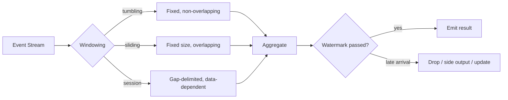
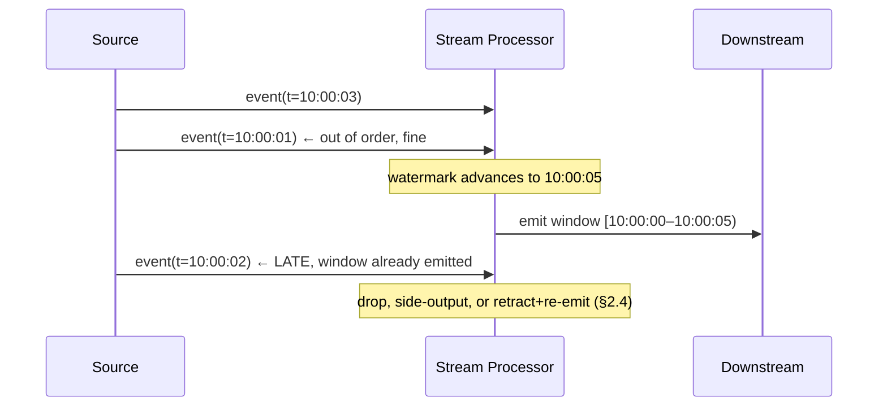
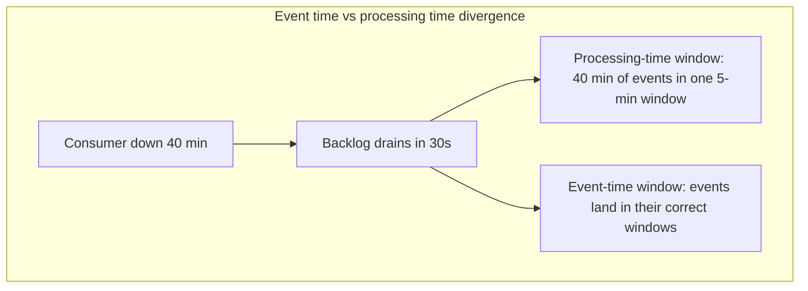
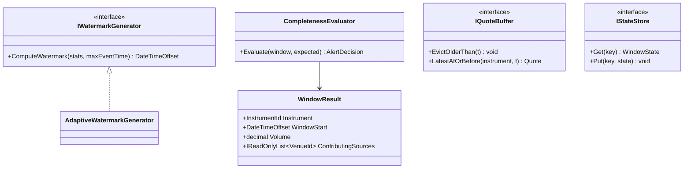

# Module 140 — Event-Driven Architecture: Stream Processing — Stateful Operations, Windowing & Time Semantics

> Domain: Event-Driven Architecture | Level: Beginner → Expert | Prerequisite: [[01-EDA-Fundamentals-Choreography-vs-Orchestration]] (event notification vs. state transfer, which determines what a stream carries), [[02-Schema-Evolution-Ordering-DeliverySemantics-DLQ]] (§2.3's per-key ordering, which windowing depends on), [[../14-System-Design/10-Designing-Market-Data-Distribution-Platform]] (§2.6's event-vs-knowledge time, which this module formalizes as the central abstraction)
>
> **Scope note:** First of six modules extending `18-Event-Driven-Architecture` toward its stated 8-module extra-depth scope (the prior two covered EDA fundamentals and schema/ordering/delivery/DLQ). Full 16-section template; Elite FinTech Interview Panel lens.

---

## 1. Fundamentals

**What:** Stream processing computes continuously over unbounded event sequences — aggregations, joins, and pattern detection that produce results as data arrives rather than after it has all arrived. Its defining difficulty is **statefulness over time**: a running total, a five-minute average, or a join between two streams all require remembering things, and remembering across an unbounded stream requires deciding what to forget and when.

**Why:** Modules 44–45 established event delivery and Module 141 will cover its flow control, but neither addresses computation *over* events. A firm consuming a market-data stream (Module 130) does not want each tick; it wants a five-minute VWAP, a rolling exposure, or an alert when a pattern occurs. That computation is where the hard problems live, and they are almost entirely problems about time.

**When:** Whenever a question is about a *sequence* rather than an event — anything phrased as "over the last N", "the average of", "when X is followed by Y". A question about a single event needs a consumer; a question about a sequence needs a stream processor.

**How (30,000-ft view):**
```
Unbounded stream ──► [window: bound the unbounded] ──► [aggregate/join over the window] ──► emit result
                          ↑
                     time semantics decide which events fall in which window,
                     and watermarks decide when a window is complete enough to emit
```

---

## 2. Deep Dive

### 2.1 Event Time vs. Processing Time — the Distinction Everything Rests On
**Event time** is when something happened at its source. **Processing time** is when the stream processor saw it. They differ by network delay, broker retention, consumer lag, and — most consequentially — by however long a consumer was down.

Computing on processing time is trivial and almost always wrong for business questions: a "5-minute trade volume" computed on processing time changes if the consumer restarts, because a backlog drains in seconds and events spanning an hour land in one processing-time window. The same input produces different output depending on infrastructure behaviour, which makes results irreproducible — Module 129 §2.6's requirement, violated at the stream layer.

Event time gives correct, reproducible results and creates every difficulty in this module, because events arrive out of order and late, so a window's contents are not known when its time range ends.

### 2.2 Window Types and What Each Answers
- **Tumbling:** fixed, non-overlapping (every 5 minutes). Each event belongs to exactly one window. Answers "per-interval" questions — volume per 5 minutes.
- **Sliding/hopping:** fixed size, overlapping (5-minute window every 1 minute). Each event belongs to several windows. Answers "rolling" questions — the current 5-minute average, updated frequently.
- **Session:** dynamically sized, closed by a gap in activity. Answers "per burst of activity" questions — a user's trading session, a client's active period.

Session windows are the most expensive because their bounds are data-dependent: you cannot know a session has ended until enough time has passed with no events, so state must be retained for the gap duration on every key.

### 2.3 Watermarks — Deciding When to Stop Waiting
A watermark is the processor's assertion that **no more events with event time before T will arrive**. It is what allows a window to be finalized and emitted, converting an unbounded wait into a bounded one.

Watermarks are necessarily heuristic. Generated too aggressively, late events arrive after their window closed and are dropped or must be handled specially. Generated too conservatively, results are delayed by the full watermark lag even when all data has actually arrived. The choice is a direct completeness-versus-latency trade, and it is a business decision more than a technical one — a risk aggregation may need completeness; an operational dashboard may prefer speed.

### 2.4 Late Data — the Three Available Strategies
When an event arrives after its window's watermark has passed:
- **Drop.** Simplest, and silently loses data — acceptable only where the business genuinely tolerates it, which is rarer than teams assume.
- **Side output.** Route late events to a separate stream for inspection or reconciliation. Preserves the data and makes lateness visible, at the cost of somewhere to handle it.
- **Allowed lateness with window update.** Keep window state for a grace period and re-emit a corrected result when a late event arrives. Correct, but requires every downstream consumer to handle *retractions* — a result they already acted on being superseded.

The third is most correct and most expensive, because it pushes the correction problem downstream. §4's incident is precisely the failure to recognize which strategy was actually in effect.

### 2.5 State Stores, Checkpointing and Recovery
Stateful processing needs somewhere to keep window contents and aggregates, typically a local embedded store backed by a changelog for durability. Recovery restores from the changelog, and recovery time scales with state size — a processor with hours of session state can take a long time to resume, which is a real operational property that must be measured rather than assumed.

The crucial interaction: **checkpointing frequency, state size, and recovery time are one trade-off, not three settings.** Frequent checkpoints mean fast recovery and steady overhead; infrequent ones mean the reverse. Teams tune them independently and are surprised by recovery time during an incident.

### 2.6 Stream-Stream Joins and Why They Need Bounds
Joining two streams — trades against quotes, orders against fills — requires holding one side's events until the other's matching events arrive. Since both are unbounded, the join must be bounded by a time window: "join a trade to quotes within 5 seconds before it."

Without such a bound the state grows without limit, which is the single most common way a stream job runs out of memory. The window is not an optimization; it is what makes the join computable at all — and choosing it requires domain knowledge about how far apart matching events can legitimately be.

---

## 3. Visual Architecture







---

## 4. Production Example

**Problem:** A firm computed a rolling 5-minute traded-volume-per-instrument metric from its trade stream (Module 131), feeding a liquidity dashboard and an automated alert when volume spiked abnormally.

**Architecture:** Event-time tumbling windows with a 30-second watermark lag, chosen because trade events had historically arrived within a few seconds of execution.

**Implementation:** Late data was configured to drop — the default in the framework, and never explicitly reconsidered, since 30 seconds seemed ample given observed arrival latency.

**Trade-offs:** Dropping late data keeps windows immutable once emitted, which meant downstream consumers never had to handle retractions — a genuine simplification, and the reason the default was not questioned.

**Lessons learned:** A regional connectivity issue delayed one venue's trade reports by 4–6 minutes for approximately 90 minutes. Those trades arrived long after their windows had closed and were silently dropped. Volume for instruments trading predominantly on that venue was understated by roughly 40% for the affected period.

The liquidity dashboard showed unremarkable volume, and — worse — the volume-spike alert did not fire for a genuine spike on that venue, because the spike's trades were exactly the ones being dropped. The system reported normality precisely because the abnormal data was missing.

Nothing errored. The framework's dropped-record metric existed and was being emitted; nobody had ever alerted on it because it had always been zero.

Three fixes followed. **First**, late data moved to a side output with an alert on non-zero volume, converting silent loss into a visible signal. **Second**, the watermark strategy became adaptive — derived from observed arrival-delay percentiles per source rather than a fixed 30 seconds — so a source degrading is accommodated rather than discarded. **Third**, and most significantly, the alert consuming these windows was changed to require a *completeness assertion*: it now checks that expected sources contributed to the window before evaluating the spike condition, and suppresses rather than fires when a source is missing.

The generalizable lesson: **a dropped-late-data metric that has always been zero is not evidence it will stay zero — it is an untested alarm**, and the specific danger of dropping late data is that missing events skew aggregates toward normality, so the system's silence is indistinguishable from genuine calm.

---

## 5. Best Practices
- Use event time for any business-meaningful computation; reserve processing time for infrastructure metrics (§2.1).
- Route late data to a side output with alerting rather than dropping it silently (§2.4, §4).
- Derive watermarks from observed per-source arrival-delay distributions, not a fixed constant (§4).
- Bound every stream-stream join with a time window sized from domain knowledge (§2.6).
- Assert window completeness before acting on aggregates that drive alerts or decisions (§4).
- Treat checkpoint frequency, state size, and recovery time as one coupled trade-off and measure recovery (§2.5).

## 6. Anti-patterns
- Processing-time windows for business questions, producing results that change with infrastructure behaviour (§2.1).
- Dropping late data by default without an alert, so loss is silent and skews toward normality (§4).
- A fixed watermark lag that cannot accommodate a degraded source (§4).
- Unbounded stream-stream joins, which is the most common cause of stream-job memory exhaustion (§2.6).
- Alerting on aggregates without asserting the aggregate's inputs were complete (§4).
- Tuning checkpoint frequency without measuring the recovery time it implies (§2.5).

---

## 7. Performance Engineering

**CPU/Memory:** State size dominates memory, and state size is governed by window type and key cardinality — session windows over a high-cardinality key are the expensive combination, since each key holds state for its gap duration.

**Latency:** End-to-end latency is watermark lag plus processing time. Watermark lag is usually the larger term and is a deliberate choice (§2.3), so latency complaints are frequently completeness decisions rather than performance problems — worth establishing before optimizing.

**Throughput:** Bounded by state-store write throughput for stateful operations, not by event ingestion. A job that ingests happily and stalls on aggregation is almost always state-bound.

**Scalability:** Scales by partition, so key skew is the limiting factor — one instrument accounting for 40% of trades means one partition doing 40% of the work regardless of parallelism.

**Benchmarking:** Benchmark with realistic key distributions and realistic out-of-orderness. Perfectly-ordered synthetic streams exercise none of the watermark and late-data machinery that dominates real behaviour.

**Caching:** The state store *is* the cache; its locality and access pattern determine performance more than any additional caching layer.

---

## 8. Security

**Threats:** Aggregates can leak information about individuals even when raw events are protected — a per-client volume aggregate over a small population reveals individual activity. Stream state also persists sensitive data in local stores, which are frequently overlooked in data-protection reviews.

**Mitigations:** Minimum-cardinality thresholds before emitting aggregates over sensitive dimensions (Module 132 §Intermediate Q4's differencing-attack discipline); encryption of state stores and changelogs at rest, since they hold the same data as the source stream.

**OWASP mapping:** Sensitive Data Exposure via state stores and changelogs, which retain event content and are often less protected than the topics they derive from.

**AuthN/AuthZ:** Stream jobs need read access to source topics and write access to their own state and outputs — scoped narrowly, since a job with broad topic access is a broad data-exfiltration surface.

**Secrets:** Standard per Module 86; note that state-store encryption keys must be available at recovery, so key-management failure prevents recovery rather than merely blocking new work.

**Encryption:** State stores and changelogs encrypted at rest with the same standard as the source stream — the common gap is protecting topics and forgetting the derived state.

---

## 9. Scalability

**Horizontal scaling:** By partition; rebalancing moves state between instances, so scaling is not instantaneous and its cost scales with state size (§2.5).

**Vertical scaling:** Relevant where state is large and local-store performance binds.

**Caching:** §7's note — the state store is the primary structure.

**Replication/Partitioning:** Partition by the aggregation key so all events for a key reach one instance; a key requiring cross-partition aggregation defeats the model and needs a repartition step.

**Load balancing:** Automatic within the framework's partition assignment; key skew is the limiting factor (§7).

**High Availability:** Recovery from changelog; recovery time is a first-class operational property that must be measured, since it determines how long a failure takes to become invisible (§2.5).

**Disaster Recovery:** State is rebuildable from source-topic replay provided retention exceeds the window and state horizon — which links stream state directly to Module 141's retention decisions.

**CAP theorem:** Stream processors favour availability with eventual correctness — results emit on watermark and may be corrected by late data (§2.4), which is an explicitly eventually-consistent posture rather than an accidental one.

---

## 10. Interview Questions

### Basic (10)

1. **Q: What is the difference between event time and processing time?**
   **A:** Event time is when something happened at its source; processing time is when the processor saw it — differing by network delay, lag, and consumer downtime (§2.1).
   **Why correct:** States both definitions and the sources of divergence.
   **Common mistakes:** Treating them as approximately equal, which holds until a consumer restarts.
   **Follow-ups:** "Why is processing time usually wrong for business questions?" (Results change with infrastructure behaviour, so the same input gives different output, §2.1.)

2. **Q: Name the three window types and what each answers.**
   **A:** Tumbling (fixed, non-overlapping — per-interval questions); sliding (fixed size, overlapping — rolling questions); session (gap-delimited — per-burst-of-activity questions) (§2.2).
   **Why correct:** Names all three with their distinct question shapes.
   **Common mistakes:** Treating sliding windows as tumbling with a shorter interval, which changes what the result means.
   **Follow-ups:** "Which is most expensive and why?" (Session — bounds are data-dependent, so state is held for the gap duration per key, §2.2.)

3. **Q: What is a watermark?**
   **A:** The processor's assertion that no more events with event time before T will arrive, which allows a window to be finalized and emitted (§2.3).
   **Why correct:** States the assertion and its purpose.
   **Common mistakes:** Treating it as a guarantee rather than a heuristic.
   **Follow-ups:** "What does the choice trade off?" (Completeness against latency — aggressive watermarks drop more late data, conservative ones delay results, §2.3.)

4. **Q: What are the three strategies for late data?**
   **A:** Drop; route to a side output; or retain window state for a grace period and re-emit a corrected result (§2.4).
   **Why correct:** Names all three.
   **Common mistakes:** Assuming dropping is the only option, which is usually just the framework default.
   **Follow-ups:** "What does the third require downstream?" (Handling retractions — a result already acted upon being superseded, §2.4.)

5. **Q: Why must stream-stream joins be time-bounded?**
   **A:** Both streams are unbounded, so without a bound the state held for matching grows without limit — the most common cause of stream-job memory exhaustion (§2.6).
   **Why correct:** States the unbounded-state consequence.
   **Common mistakes:** Treating the window as an optimization rather than as what makes the join computable.
   **Follow-ups:** "How is the bound chosen?" (From domain knowledge about how far apart matching events legitimately occur, §2.6.)

6. **Q: What went wrong in §4's incident?**
   **A:** A venue's trades were delayed 4–6 minutes past a fixed 30-second watermark, so they arrived after their windows closed and were silently dropped — understating volume ~40% and suppressing a genuine spike alert, because the spike's trades were exactly the dropped ones (§4).
   **Why correct:** States the mechanism and the specific inversion.
   **Common mistakes:** Describing it as data loss without noting that the loss skewed results toward normality.
   **Follow-ups:** "Why was the dropped-record metric useless?" (It existed and was emitted, but nobody alerted on it because it had always been zero — an untested alarm, §4.)

7. **Q: What governs stream-processing memory usage?**
   **A:** State size, determined by window type and key cardinality — session windows over high-cardinality keys being the expensive combination (§7).
   **Why correct:** Identifies the two governing factors.
   **Common mistakes:** Sizing memory from event throughput, which does not predict state size.
   **Follow-ups:** "What bounds throughput for stateful operations?" (State-store write throughput, not ingestion rate, §7.)

8. **Q: Why is key skew the limiting factor for scaling?**
   **A:** Processing scales by partition, so one key accounting for a large share of events means one partition does that share of work regardless of added parallelism (§9).
   **Why correct:** States the mechanism.
   **Common mistakes:** Adding parallelism to address a skew problem, which does not help.
   **Follow-ups:** "What is the mitigation?" (A repartition or two-stage aggregation for hot keys — which adds complexity and is justified only where skew is severe.)

9. **Q: Why must state stores be encrypted?**
   **A:** They hold the same data as the source stream, and are frequently overlooked in data-protection reviews that cover topics (§8).
   **Why correct:** Identifies the common gap.
   **Common mistakes:** Protecting topics and treating derived state as internal.
   **Follow-ups:** "What is the recovery implication of state encryption?" (Keys must be available at recovery, so key-management failure blocks recovery rather than only new work, §8.)

10. **Q: What is the relationship between checkpoint frequency, state size, and recovery time?**
    **A:** One coupled trade-off — frequent checkpoints give fast recovery and steady overhead; infrequent give the reverse (§2.5).
    **Why correct:** States them as coupled rather than independent.
    **Common mistakes:** Tuning checkpoint frequency for overhead and being surprised by recovery time during an incident.
    **Follow-ups:** "What should be measured?" (Actual recovery time at realistic state size, since it determines how long a failure lasts, §2.5.)

### Intermediate (10)

1. **Q: Walk through why §4's failure inverted the alert's behaviour rather than merely degrading it.**
   **A:** The dropped trades were from the venue experiencing the connectivity issue, which was also the venue where the volume spike occurred. So the events constituting the anomaly were precisely those excluded from the aggregate. The alert did not fail to detect a spike it could see; it correctly evaluated an aggregate from which the spike had been removed. Missing data biased the result toward the normal case, making silence indistinguishable from calm.
   **Why correct:** Explains the correlation between what was dropped and what was being detected.
   **Common mistakes:** Treating it as reduced sensitivity rather than as a systematic bias toward the null result.
   **Follow-ups:** "Is this general?" (Yes for anomaly detection over aggregates — missing data almost always makes things look more normal, which is the worst direction for detection.)

2. **Q: Design the completeness assertion §4's fix requires.**
   **A:** Record which sources contributed events to each window and compare against the set expected to be active at that time. Suppress the alert and raise a separate data-quality signal when a source is missing, rather than evaluating on partial data. The essential property: the alert's precondition is input completeness, so partial data produces a *different* signal rather than a quieter version of the same one (§4).
   **Why correct:** Specifies the mechanism and the distinct-signal requirement.
   **Common mistakes:** Lowering the alert threshold to compensate for possible missing data, which produces false positives when data is complete.
   **Follow-ups:** "Where does 'expected sources' come from?" (Venue trading calendars and recent activity — a source that traded in the prior window is expected in this one.)

3. **Q: Why is an adaptive watermark preferable to a fixed lag?**
   **A:** A fixed lag encodes an assumption about arrival latency that holds until a source degrades — precisely when correctness matters most. Deriving the lag from observed per-source arrival-delay percentiles accommodates degradation automatically, trading some additional latency for not silently discarding a struggling source's data (§4).
   **Why correct:** Identifies that the assumption fails exactly when it matters and states the trade.
   **Common mistakes:** Setting a generous fixed lag, which pays the latency cost always and still fails for delays beyond it.
   **Follow-ups:** "What is the risk of adaptive watermarks?" (A permanently-degraded source drags the watermark indefinitely, delaying everything — so it needs a ceiling with an alert when reached.)

4. **Q: Why does allowed-lateness-with-retraction push cost downstream?**
   **A:** A re-emitted corrected result means every consumer must handle a value they already acted upon being superseded — recomputing derived aggregates, correcting displays, potentially reversing actions. The upstream correctness is bought with downstream complexity, which is why it is chosen less often than it should be (§2.4).
   **Why correct:** Identifies where the cost lands and why the strategy is underused.
   **Common mistakes:** Enabling allowed lateness without confirming consumers handle retractions, producing inconsistent downstream state.
   **Follow-ups:** "When is it clearly worth it?" (When downstream is itself a stream processor that handles retractions natively, making the cost near-zero.)

5. **Q: How does consumer downtime expose the event-time/processing-time distinction?**
   **A:** On restart, the backlog drains far faster than real time, so processing-time windows compress an hour of events into seconds and produce results bearing no relation to what happened. Event-time windows place each event in its correct window regardless of when it was processed, giving the same answer as if there had been no outage (§2.1).
   **Why correct:** Uses the concrete scenario to show the divergence.
   **Common mistakes:** Assuming the distinction only matters for slightly out-of-order events.
   **Follow-ups:** "What does this imply about backfilling?" (Event-time processing makes replay produce identical results, which is what makes backfill viable at all, §9.)

6. **Q: Why is recovery time an operational property rather than a tuning detail?**
   **A:** It determines how long an instance failure lasts, and it scales with state size — a job with hours of session state may take many minutes to resume, during which its output is stale or absent. Teams that tune checkpointing for steady-state overhead discover recovery time during an incident (§2.5).
   **Why correct:** Connects it to incident duration and identifies the tuning error.
   **Common mistakes:** Treating recovery as a rare-path concern not worth measuring.
   **Follow-ups:** "How would you measure it?" (Kill an instance under realistic state and measure time to correct output — not process start, which is much sooner.)

7. **Q: Critique a stream-stream join windowed at 24 hours "to be safe."**
   **A:** It holds a full day of both streams in state, which for high-volume streams is enormous and will likely exhaust memory or force expensive spilling. The window should come from domain knowledge — if a trade and its quote are always within seconds, a 24-hour window buys nothing and costs everything. "To be safe" here means "we did not determine the actual bound," which is the decision being avoided (§2.6).
   **Why correct:** Identifies the cost and that the generous window substitutes for the domain analysis.
   **Common mistakes:** Choosing generous windows to avoid missing matches, without computing state implications.
   **Follow-ups:** "How do you determine the right bound?" (Measure the actual distribution of matching-event time differences and size from its tail, plus margin.)

8. **Q: Why do aggregates over sensitive dimensions need minimum-cardinality thresholds?**
   **A:** An aggregate over a small population reveals individual activity — a per-client volume over one client is that client's volume. This is Module 132's differencing concern applied to streams, and it applies even when raw events are properly protected (§8).
   **Why correct:** Identifies aggregation as an independent disclosure path.
   **Common mistakes:** Treating aggregates as inherently safe because they are summaries.
   **Follow-ups:** "What else is needed beyond a threshold?" (Awareness of repeated queries across slices, since differences between overlapping aggregates can reconstruct individuals.)

9. **Q: How does stream state relate to source-topic retention?**
   **A:** State is rebuildable by replaying the source, which requires retention exceeding the window and state horizon. If retention is shorter, state loss is unrecoverable — linking a retention decision (Module 141) directly to whether stream jobs can be recovered or backfilled (§9).
   **Why correct:** Identifies the dependency between two decisions usually made separately.
   **Common mistakes:** Setting retention on storage-cost grounds without checking what depends on replay.
   **Follow-ups:** "What is the minimum retention?" (Longer than the largest window plus the maximum tolerable recovery-from-scratch period.)

10. **Q: Synthesize why time semantics dominate this module.**
    **A:** Every hard problem here — windowing, watermarks, late data, joins — reduces to the same underlying issue: an unbounded stream must be divided into bounded pieces to compute over, and events do not arrive in the order they occurred, so the boundary between "this window" and "the next" is never cleanly knowable. Watermarks are a heuristic answer to an undecidable question, and late-data strategy is what you do when the heuristic is wrong. The rest is mechanics.
    **Why correct:** Identifies the common root and characterizes watermarks accurately as heuristic.
    **Common mistakes:** Treating the topics as separate features rather than as responses to one problem.
    **Follow-ups:** "Why is it undecidable?" (You cannot know whether more events for a time range will arrive without waiting forever — the watermark is a bet, §2.3.)

### Advanced (10)

1. **Q: Diagnose §4's incident and design the complete structural fix.**
   **A:** Root cause: a fixed watermark encoding a stale latency assumption, late-data dropping as an unexamined default, an existing metric nobody alerted on, and — decisively — an alert consuming aggregates without asserting input completeness, so missing data biased toward the null result (Intermediate Q1). Fix: (1) late data to a side output with alerting on non-zero volume; (2) adaptive per-source watermarks with a ceiling and alert (Intermediate Q3); (3) completeness assertion as an alert precondition, producing a distinct signal on partial data (Intermediate Q2); (4) a standing review of metrics that have always been zero, since §4's dropped-record counter is a general class — an alarm never exercised is not known to work.
   **Why correct:** Addresses all four contributing factors plus the general class the fourth represents.
   **Common mistakes:** Fixing the watermark alone, which handles this delay magnitude and not the next.
   **Follow-ups:** "Why is (4) generalizable?" (Any counter that has always read zero is an untested detector — the same reasoning as Module 94's alert-liveness canaries.)

2. **Q: A team proposes processing-time windows because event-time handling is complex. Evaluate.**
   **A:** It genuinely removes complexity and produces results that are not reproducible and change with infrastructure behaviour (§2.1). For infrastructure metrics — throughput, lag — processing time is correct and appropriate. For anything a business decision depends on, it means the same events produce different answers depending on whether a consumer restarted, which fails Module 129 §2.6's reproducibility requirement and cannot be defended when a figure is questioned.
   **Why correct:** Concedes the complexity reduction, identifies the legitimate use, and names the specific failure for business use.
   **Common mistakes:** Rejecting processing time entirely, when it is correct for infrastructure metrics.
   **Follow-ups:** "How would the divergence surface?" (A restart producing a volume spike that never happened — visible, but easily attributed to a genuine market event.)

3. **Q: Critique emitting window results before the watermark passes, for lower latency.**
   **A:** Early emission is legitimate and widely used — but only if results are explicitly marked provisional and consumers handle the final value superseding them, which is the retraction problem (Intermediate Q4) under another name. Emitting early without that contract produces consumers acting on partial aggregates believing them final, which is §4's failure with a different cause: a plausible number computed over an incomplete set.
   **Why correct:** Identifies the legitimate use and the contract it requires, connecting to the same underlying failure.
   **Common mistakes:** Early emission for dashboard responsiveness without marking provisionality, so users act on partial data.
   **Follow-ups:** "How should a provisional result be presented?" (Explicitly as such, with the final superseding it — the same as-of discipline as Module 135's read models.)

4. **Q: Design the state-size and recovery-time budget for a stateful job.**
   **A:** Determine the maximum tolerable recovery time from the business impact of stale output, then work backward: recovery time is roughly state size divided by restore throughput plus changelog replay, so the budget bounds state size, which bounds window duration and key cardinality. If the required state exceeds the budget, the options are more parallelism (smaller state per instance), shorter windows, or accepting slower recovery — a decision to make deliberately rather than discover (§2.5).
   **Why correct:** Works backward from business tolerance and identifies the three levers.
   **Common mistakes:** Sizing state from what the data requires and treating recovery time as whatever results.
   **Follow-ups:** "Which lever is usually preferred?" (More parallelism, since it preserves the computation's semantics while reducing per-instance state.)

5. **Q: How would you backfill a stream aggregate after a logic change?**
   **A:** Replay the source topic from the required start through the new logic into a separate output, verify against the existing output for the overlapping period where both should agree, then cut over. This works only because event-time processing makes replay deterministic (Intermediate Q5) — with processing-time windows the replay produces different windows entirely and no comparison is possible. Retention must cover the replay period (Intermediate Q9).
   **Why correct:** Specifies the procedure and identifies the two properties it depends on.
   **Common mistakes:** Backfilling in place, losing the ability to compare old and new.
   **Follow-ups:** "What if old and new legitimately disagree?" (Expected where the logic change alters results — the comparison establishes that differences are confined to the intended cases.)

6. **Q: A regulator asks how a stream-derived figure was computed. Answer.**
   **A:** State the window definition, the watermark policy in effect, the late-data strategy, and the source completeness at computation time — then reproduce it by replaying the source through the same logic version (Advanced Q5). The honest disclosure is the late-data policy: if late data was dropped, the figure reflects events known by the watermark, which is a bounded and stateable claim rather than "all events in the period."
   **Why correct:** Enumerates the four determinants and states the completeness claim precisely.
   **Common mistakes:** Presenting the figure as the complete period total when the late-data policy means it is not.
   **Follow-ups:** "What makes reproduction possible?" (Event-time semantics plus retained source and logic version — Module 129 §2.6's provenance requirement at the stream layer.)

7. **Q: Apply this course's "declared ≠ actual" theme to stream processing.**
   **A:** The claim is "this aggregate reflects activity in the window." Its declared basis is that the job ran without error and emitted a result. §4's gap: the result was computed correctly over the events that arrived by the watermark, and the events that mattered were not among them. The distinguishing feature is that missing data in an aggregate is **directionally biased toward normality** — an absent event reduces a count, so anomaly detection over incomplete aggregates fails specifically in the direction of not alerting, which is the worst possible bias for a detector.
   **Why correct:** Identifies the directional bias, which is what makes this instance of the theme particularly dangerous.
   **Common mistakes:** Treating incompleteness as adding noise rather than as systematic bias in one direction.
   **Follow-ups:** "What follows for any aggregate driving a decision?" (Completeness must be asserted, not assumed — Advanced Q1's fix, §4.)

8. **Q: Design the monitoring for a stateful streaming job.**
   **A:** Watermark lag against event time (how far behind the job is in event-time terms, not processing terms); late-record rate by source; state size and its growth trend; and per-source contribution to recent windows (the completeness signal, Intermediate Q2). The distinguishing property: standard consumer-lag monitoring (Module 141) measures processing progress and would have shown §4 as healthy throughout, because the job was keeping up with what it received.
   **Why correct:** Specifies stream-specific signals and notes why conventional lag monitoring misses the failure.
   **Common mistakes:** Monitoring consumer lag alone, which is necessary and insufficient.
   **Follow-ups:** "Why does watermark lag differ from consumer lag?" (Consumer lag measures unprocessed events; watermark lag measures how far behind real time the job's event-time frontier is — a slow source raises the second without the first.)

9. **Q: How should a stream job handle a source that stops entirely?**
   **A:** With event-time windows and a watermark derived from arriving events, a silent source produces no events, so it neither advances nor holds back the watermark — windows close without its data and the loss is invisible. This requires an explicit expected-source check (Intermediate Q2): the job must know which sources should be contributing and signal when one is absent, because absence generates no event to detect.
   **Why correct:** Identifies that silence is undetectable from the event stream alone.
   **Common mistakes:** Assuming a stopped source manifests as an error or lag, when it manifests as nothing.
   **Follow-ups:** "Is this the same as §4?" (A more extreme version — §4's source was late, this one is absent, and both are invisible without an expected-source model.)

10. **Q: Synthesize the governance for stream-derived figures used in decisions.**
    **A:** (1) Event-time semantics for anything business-meaningful (Advanced Q2). (2) Late data to a side output with alerting, never dropped silently (Advanced Q1). (3) Adaptive watermarks with a ceiling and alert (Intermediate Q3). (4) Completeness assertion as a precondition for any alert or automated action (Intermediate Q2, Advanced Q9). (5) Provisional results explicitly marked if emitted before watermark (Advanced Q3). (6) Recovery time measured against a business-derived budget (Advanced Q4). (7) Retention exceeding replay needs, decided jointly with the stream owner (Intermediate Q9). (8) Periodic review of always-zero counters as untested detectors (Advanced Q1).
    **Why correct:** Covers semantics, completeness, operations, and the untested-detector class.
    **Common mistakes:** Governing the computation without governing completeness, which is where the consequential failures occur.
    **Follow-ups:** "Which is most often missing?" (Completeness assertion — teams verify the computation and assume the inputs, §4.)

### Expert (10)

1. **Q: Evaluate stream processing versus micro-batch for a firm's analytics.**
   **A:** Micro-batch (processing small fixed intervals) is simpler operationally, has easier failure semantics, and is sufficient wherever latency tolerance exceeds the batch interval — which is more cases than streaming advocacy suggests. True streaming earns its complexity where latency genuinely matters (sub-second alerting) or where session semantics require continuous evaluation. The honest position: most "streaming" requirements are satisfied by one-minute micro-batches, and the complexity difference is substantial.
   **Why correct:** Identifies the latency threshold as the discriminator and states the complexity difference honestly.
   **Common mistakes:** Choosing streaming for modernity, then operating watermark and state machinery for a requirement a batch would satisfy.
   **Follow-ups:** "Does micro-batch avoid event-time problems?" (No — it still needs event-time bucketing and late-data policy; it avoids continuous state management and some operational complexity, not the time semantics.)

2. **Q: How do exactly-once semantics work in stream processing, and what do they actually guarantee?**
   **A:** They guarantee that *effects on the processor's own managed state and its transactional output* occur once, achieved by atomically committing state changes and output offsets. They do not guarantee external side effects occur once — a call to an external service inside the processing logic can be retried on failure. So "exactly-once" is exactly-once *within the framework's transactional boundary*, which is a real and useful guarantee frequently over-read.
   **Why correct:** States the actual boundary of the guarantee and what falls outside it.
   **Common mistakes:** Assuming exactly-once covers external effects, which it does not.
   **Follow-ups:** "How are external effects made safe?" (Idempotency keyed on something stable — Module 131 §2.3's discipline, unchanged by the framework's guarantee.)

3. **Q: Design a real-time exposure aggregation feeding Module 129's risk engine.**
   **A:** Event-time sliding windows over trade and position-change streams, keyed by portfolio, with an adaptive watermark and completeness assertion (Intermediate Q2). Critically, the output must carry its own completeness metadata and as-of, so Module 129's snapshot pinning has something meaningful to pin — an exposure figure without stated completeness cannot participate in the reproducibility chain that module requires. This is where §4's lesson and Module 129's requirement meet.
   **Why correct:** Specifies the design and identifies the metadata that makes it usable by the consuming system.
   **Common mistakes:** Emitting a bare figure, which the risk engine then cannot reason about or reproduce.
   **Follow-ups:** "What should the risk engine do with incomplete exposure?" (Refuse to compute a limit check against it — Module 129 §9's CP posture, informed by the completeness flag.)

4. **Q: How should a firm handle a source whose events are systematically delayed by minutes?**
   **A:** Either accommodate it — set the watermark from its actual distribution, accepting the latency for all outputs — or process it separately with its own watermark and combine downstream. The second preserves low latency for timely sources and is usually correct when one source is an outlier, but it requires the combination step to handle the differing completeness of its inputs, which is where the complexity moves.
   **Why correct:** Gives both approaches and identifies where the second's complexity lands.
   **Common mistakes:** Setting a global watermark to accommodate the worst source, penalizing everything.
   **Follow-ups:** "What is the risk of separate processing?" (Two figures with different completeness that appear comparable — which is a presentation problem as much as a technical one.)

5. **Q: A stream job's output disagrees with a batch computation over the same period. Walk through the diagnosis.**
   **A:** Check the obvious causes in order: late data dropped by the stream but included in the batch (§4's mechanism, and the most common cause); different window boundary semantics (inclusive/exclusive endpoints); event-time versus ingestion-time in the batch's source; and duplicate handling. Most disagreements resolve to the first, which is why the late-data policy should be the first thing established rather than the last.
   **Why correct:** Orders by likelihood and identifies the dominant cause.
   **Common mistakes:** Auditing the aggregation logic, which is rarely the cause.
   **Follow-ups:** "Which should be considered authoritative?" (Usually the batch, since it sees complete data — which means the stream's figure should be understood as an early estimate that the batch confirms.)

6. **Q: Evaluate whether stream state should be queryable directly.**
   **A:** Interactive queries against a job's state avoid a separate serving store and give the freshest possible answer, which is genuinely attractive. The costs: query load now affects processing throughput on the same instances; rebalancing moves state so queries must find the right instance; and recovery makes state temporarily unavailable. For high query volume a separate serving store fed by the job's output (Module 135's read model) is more robust, at the cost of additional lag.
   **Why correct:** Identifies three specific costs and the alternative with its trade.
   **Common mistakes:** Adopting interactive queries for freshness without accounting for the coupling to processing.
   **Follow-ups:** "When is direct query clearly right?" (Low query volume with a strong freshness requirement — where a separate store's lag would defeat the purpose.)

7. **Q: How does stream processing interact with Module 137's cell architecture?**
   **A:** Stream jobs are stateful and partition-assigned, so a per-cell job processes only that cell's data — natural alignment, since cell partitioning and stream partitioning can share a key. The complication is aggregates spanning cells, which must run outside the cells (Module 137 §9) against a combined stream, making that combined stream a shared dependency requiring §137's discipline. The rule: cell-local aggregates in cells, cross-cell aggregates outside and off the request path.
   **Why correct:** Identifies the natural alignment and the specific complication with its resolution.
   **Common mistakes:** Running cross-cell aggregation inside a cell, which couples cells.
   **Follow-ups:** "What if a cell needs a cross-cell aggregate?" (It must be delivered asynchronously and treated as potentially stale — never a synchronous dependency, Module 137 §2.1.)

8. **Q: How should time-zone and market-hours semantics be handled?**
   **A:** Compute in UTC internally and apply market-calendar semantics at the boundary, since "daily volume" means a session that differs per venue and shifts with daylight-saving. Encoding session boundaries into window definitions makes them wrong twice a year and per-venue; deriving them from a market-calendar service keeps the windowing simple and the domain complexity in one place. This is a domain-specific instance of separating computation from calendar semantics.
   **Why correct:** Separates the concerns and identifies the specific failure of encoding calendars into windows.
   **Common mistakes:** Fixed-offset daily windows, which break on daylight-saving transitions and differ per venue.
   **Follow-ups:** "What about a session spanning midnight UTC?" (Common for Asian venues — which is exactly why session boundaries must come from a calendar rather than from window arithmetic.)

9. **Q: A stream job's state grows unboundedly despite windowed operations. Diagnose.**
   **A:** Likely causes: an unbounded join (§2.6); session windows over a key space that grows without bound, so each new key holds state for its gap even if it never recurs; or a keyed aggregation over an unbounded key space with no expiry — a per-instrument aggregate is bounded, a per-order one is not. The distinguishing question is whether the key space is bounded, which is easy to get wrong when a key that seems finite (client) is joined to one that is not (order).
   **Why correct:** Enumerates the three causes and identifies key-space boundedness as the discriminator.
   **Common mistakes:** Assuming windowing bounds state, which it does only if the key space is also bounded.
   **Follow-ups:** "What is the fix for unbounded key spaces?" (State TTL independent of window semantics — expire keys that have been inactive, accepting that a very-late recurrence starts fresh.)

10. **Q: Deliver the closing synthesis: what makes stream processing distinctively hard?**
    **A:** That **you must decide when to stop waiting for data that may still arrive, and every hard problem descends from that one undecidable question**. Windows bound the unbounded, watermarks guess when a bound is complete, late-data policy handles the guess being wrong, and joins need bounds for the same reason. None of this exists in batch, where the data is all present before computation begins — which is why batch is genuinely simpler and why the streaming complexity should be paid only when latency requires it (Expert Q1). §4 is the honest illustration: the machinery worked exactly as configured, and the configuration encoded an assumption about arrival timing that a degraded source violated. The Principal-level conclusion is that in stream processing, **the correctness question is rarely about the computation and almost always about whether its inputs were complete** — and completeness is not observable from the stream itself, which is why it must be asserted from outside.
    **Why correct:** Names the undecidable question as the root, uses the incident as illustration, and states the completeness conclusion.
    **Common mistakes:** Framing stream processing as batch with lower latency, missing that the time semantics are a different problem class.
    **Follow-ups:** "How does the next module relate?" (Module 141's backpressure and lag address whether the processor can keep up — a different question from whether its inputs were complete, and both must hold.)

---

## 11. Coding Exercises

### Easy — Event-Time Tumbling Window (§2.1, §2.2)
**Problem:** Aggregate trade volume into 5-minute event-time windows.
**Solution:**
```csharp
public IEnumerable<WindowResult> Aggregate(IEnumerable<Trade> trades, TimeSpan size)
{
    return trades
        .GroupBy(t => new WindowKey(
            t.InstrumentId,
            Floor(t.EventTime, size)))          // EVENT time, not arrival time
        .Select(g => new WindowResult(
            g.Key.Instrument,
            g.Key.WindowStart,
            Volume: g.Sum(t => t.Quantity),
            ContributingSources: g.Select(t => t.VenueId).Distinct().ToList()));  // completeness input
}

private static DateTimeOffset Floor(DateTimeOffset t, TimeSpan size) =>
    new(t.Ticks - (t.Ticks % size.Ticks), t.Offset);
```
**Time complexity:** O(n) for n trades.
**Space complexity:** O(w × k) for w open windows and k keys.
**Optimized solution:** Emit contributing sources with the result (as shown) so downstream completeness assertion (§11 Medium) has the data it needs without a second pass.

### Medium — Completeness Assertion (§4, Intermediate Q2)
**Problem:** Suppress an alert when a window is missing an expected source.
**Solution:**
```csharp
public AlertDecision Evaluate(WindowResult window, IReadOnlySet<VenueId> expectedSources)
{
    var missing = expectedSources.Except(window.ContributingSources).ToList();
    if (missing.Count > 0)
        return AlertDecision.Suppressed(
            reason: $"Incomplete window — missing {string.Join(",", missing)}",
            raiseDataQualitySignal: true);      // distinct signal, not a quieter version (§4)

    return window.Volume > _threshold
        ? AlertDecision.Fire(window)
        : AlertDecision.NoAlert();
}
```
**Time complexity:** O(s) for s expected sources.
**Space complexity:** O(s).
**Optimized solution:** Derive `expectedSources` from recent activity plus the market calendar rather than static configuration, so a venue that legitimately stopped trading does not permanently suppress alerts.

### Hard — Adaptive Watermark (Intermediate Q3)
**Problem:** Derive watermark lag from observed per-source arrival delay.
**Solution:**
```csharp
public DateTimeOffset ComputeWatermark(IReadOnlyDictionary<VenueId, DelayStats> stats,
                                       DateTimeOffset maxEventTime)
{
    var requiredLag = stats.Values
        .Select(s => s.Percentile99)
        .DefaultIfEmpty(_minimumLag)
        .Max();

    var cappedLag = requiredLag > _maximumLag ? _maximumLag : requiredLag;
    if (requiredLag > _maximumLag)
        _alerts.Raise($"Source delay {requiredLag} exceeds watermark ceiling {_maximumLag} — data will be late");

    return maxEventTime - cappedLag;
}
```
**Time complexity:** O(s) for s sources.
**Space complexity:** O(s) for delay statistics.
**Optimized solution:** Track the delay distribution over a rolling window so a historical outage does not permanently inflate the lag, and so genuine degradation is reflected promptly rather than being averaged away.

### Expert — Bounded Stream-Stream Join (§2.6, Advanced Q9)
**Problem:** Join trades to quotes within a bounded window without unbounded state.
**Solution:**
```csharp
public IEnumerable<EnrichedTrade> Join(Trade trade, IQuoteBuffer buffer, TimeSpan lookback)
{
    buffer.EvictOlderThan(trade.EventTime - lookback);        // bound state by time (§2.6)

    var quote = buffer.LatestAtOrBefore(trade.InstrumentId, trade.EventTime);
    if (quote is null)
    {
        _metrics.IncrementUnmatchedTrade(trade.VenueId);      // visible, never silent
        yield return EnrichedTrade.WithoutQuote(trade);        // explicit absence, not a default
        yield break;
    }
    yield return EnrichedTrade.With(trade, quote);
}
```
**Time complexity:** O(log q) for the buffer lookup; eviction amortized O(1) per event.
**Space complexity:** O(q) bounded by lookback × quote rate — bounded by construction.
**Optimized solution:** Size `lookback` from the measured distribution of trade-to-quote time differences (Intermediate Q7) rather than a round number, and alert on the unmatched rate, since a rising rate means the bound has become too tight for current conditions.

---

## 12. System Design

**Functional requirements**
- Compute rolling and per-interval aggregates over trade and market-data streams.
- Join related streams within domain-appropriate bounds.
- Produce results usable by Module 129's risk engine and by alerting.
- Support replay and backfill after logic changes.

**Non-functional requirements**
- Event-time semantics with reproducible results across replays (§2.1).
- Late data visible, never silently dropped (§2.4).
- Aggregates carry completeness metadata so consumers can reason about them (Expert Q3).
- Recovery time within a business-derived budget (Advanced Q4).

**Capacity estimation**
- Input ~80k trades/s peak plus market data at Module 130's rates.
- 200k instrument keys; 5-minute windows → 200k × (5min / window slide) open windows at any time.
- State: with 5-minute sliding windows at 1-minute slide, five windows open per key ≈ 1M window states; at ~200 bytes each ≈ 200MB per aggregate type, comfortably local.
- **The sensitivity that matters:** key cardinality times window multiplicity, not event rate. Session windows over order IDs rather than instruments would be unbounded (Advanced Q9), and the difference is a design choice rather than a load characteristic.

**Architecture:** §3 — event-time windowing with adaptive watermarks, side-output late handling, bounded joins, completeness metadata on output.

**Components:** Window aggregator (§11 Easy); completeness evaluator (§11 Medium); adaptive watermark generator (§11 Hard); bounded join (§11 Expert); state store with changelog; late-data side output.

**Database selection:** Embedded local state store with changelog to the broker for durability; outputs to topics consumed by Module 135's read models for serving.

**Caching:** The state store is the cache (§7).

**Messaging:** Source topics partitioned by aggregation key so all events for a key reach one instance (§9).

**Scaling:** By partition; key skew mitigated by two-stage aggregation for hot instruments only where measured to matter.

**Failure handling:** Recovery from changelog within budget (Advanced Q4); late data to side output; unmatched joins emitted with explicit absence (§11 Expert).

**Monitoring:** Watermark lag in event-time terms; late-record rate by source; state size trend; per-source window contribution (Advanced Q8).

**Trade-offs:** Adaptive watermarks trade some latency for not discarding degraded sources (Intermediate Q3). Completeness metadata adds output size for the ability to reason about partial results — required by Expert Q3's consumer.

---

## 13. Low-Level Design

**Requirements:** Windows are event-time; completeness travels with results; watermarks adapt with a ceiling; joins are bounded by construction.

**Class diagram:**


**Sequence diagram:** §3's second diagram — out-of-order arrival, watermark advance, and late-arrival handling.

**Design patterns used:** Strategy (window types, late-data policies); Buffer with time-based eviction (§11 Expert); Observer (watermark advance triggering emission); Memento (checkpointed state).

**SOLID mapping:** Single Responsibility (windowing, watermark generation, completeness evaluation separate); Open/Closed (a new window type implements the strategy without touching the pipeline); Liskov (every watermark generator must be monotonic — a generator that moves backward breaks window finalization, which contract tests should enforce); Interface Segregation (state read and write paths separate for query support, Expert Q6); Dependency Inversion (the pipeline depends on generator and store interfaces).

**Extensibility:** New aggregates add a windowing definition; completeness evaluation applies uniformly since it reads the metadata every result carries.

**Concurrency/thread safety:** State is partition-local and single-threaded per partition, which is what makes stateful stream processing tractable — no locking needed within a partition, and cross-partition state is by construction absent.

---

## 14. Production Debugging

**Incident:** After the §4 remediation, a stream job computing per-client exposure began producing results that intermittently regressed — a client's exposure would show a value, then a *lower* value seconds later, then the higher value again, cycling.

**Root cause:** The job used sliding windows with allowed lateness and re-emission (§2.4's third strategy), correctly adopted after §4. Downstream, Module 135's read model applied each emission as an upsert keyed on client and window.

But the re-emissions and the original emissions arrived on a topic partitioned by *client*, while the read-model projector consumed with multiple instances and processed a client's messages in order — correctly. The regression came from a different source: two window instances (the sliding windows overlapped) emitting for the same client at slightly different event-time boundaries, and the read model's upsert key included only the client, not the window start. So the two windows' results overwrote each other alternately.

**Investigation:** The cycling pattern suggested competing writers rather than incorrect computation. Examining the emitted messages showed two distinct window-start values for the same client arriving interleaved. The read model's key definition confirmed the collision.

**Tools:** Raw topic inspection showing both window instances' emissions; read-model key definition review; correlation of regression timing against window slide interval, which matched exactly.

**Fix:** The read model's key extended to include window start, so overlapping windows are distinct records and the serving layer selects the appropriate one rather than the last written.

**Prevention:** (1) A contract test asserting that any consumer of a windowed stream keys on the full window identity, since the window start is part of the result's identity and omitting it conflates distinct results. (2) The stream's output schema documents that emissions are keyed by (entity, windowStart) rather than entity alone — the ambiguity arose from an output shape that looked entity-keyed. (3) Sliding-window outputs now carry an explicit window-identity field rather than requiring consumers to infer it, making the correct key obvious at the point of consumption.

---

## 15. Architecture Decision

**Context:** The late-data strategy (§2.4) — the decision §4's incident forced and whose alternatives carry materially different downstream costs.

**Option A — Drop late data:**
*Advantages:* Simplest; windows immutable once emitted; no downstream retraction handling; lowest state retention.
*Disadvantages:* §4 exactly — silent loss biased toward normality, invisible without dedicated alerting, and the loss correlates with source degradation which is when the data matters most.
*Cost:* Lowest. *Risk:* High and asymmetric — the bias direction defeats detection.

**Option B — Side output with reconciliation (recommended):**
*Advantages:* Preserves data; makes lateness visible and alertable; downstream consumers are unaffected since windows remain immutable; supports later reconciliation of the true figure.
*Disadvantages:* Requires somewhere to handle the side output and a process for reconciling — the data is preserved but not automatically incorporated, so the primary aggregate remains incomplete until reconciliation.
*Cost:* Moderate. *Risk:* Moderate — depends on the side output actually being consumed rather than accumulating unread.

**Option C — Allowed lateness with retraction:**
*Advantages:* The aggregate becomes correct automatically; no separate reconciliation.
*Disadvantages:* Every downstream consumer must handle retractions (Intermediate Q4); state retained for the grace period across all keys; and §14 shows the downstream complexity is easy to get wrong in ways that produce visible, confusing behaviour.
*Cost:* Highest, and largely downstream. *Risk:* Correctness is higher, operational complexity is higher, and the failure modes are more subtle.

**Recommendation: Option B as the default, Option C where consumers natively handle retractions.** Option A is disqualified by §4 not because dropping is always wrong but because its failure mode is silent and directionally biased — if data must be dropped, the drop must at minimum be loud, which is Option B's minimum form. Option C is genuinely more correct and should be preferred where the downstream is another stream processor that handles retractions natively, making its cost near-zero. Where consumers are read models or dashboards, §14's incident shows the retraction semantics propagate complexity into systems not designed for it, and Option B's explicit reconciliation is more tractable than implicit correction that consumers may mishandle.

---

## 17. Principal Engineer Perspective

**Business impact:** Stream-derived figures drive alerts and decisions, so their completeness is a business-correctness property rather than a technical one. §4's cost was not the missing data but the alert that did not fire — framing stream quality in terms of decisions not made is what makes it legible to stakeholders who cannot evaluate watermark lag.

**Engineering trade-offs:** The recurring trade is completeness against latency (§2.3), and the senior insight is that it is a business decision engineering should surface rather than settle. A risk aggregation and an operational dashboard warrant different answers, and a single global watermark policy silently imposes one answer on both.

**Technical leadership:** §4's dropped-record counter existed, was emitted, and was never alerted on because it had always been zero. That pattern — an untested detector — recurs throughout this course (Module 94's alert liveness, Module 99's scanner credentials), and teaching teams to treat always-zero counters as unverified rather than as evidence of health is a transferable discipline worth naming explicitly.

**Cross-team communication:** Stream outputs consumed by other teams need their completeness semantics documented, not implied. §14's incident arose from an output shape that looked entity-keyed and was not — the producer knew, the consumer inferred, and the inference was wrong.

**Architecture governance:** Watermark policy, late-data strategy, and window definitions should be recorded decisions (Module 106), because each encodes a completeness-versus-latency judgment that downstream consumers depend on and cannot see.

**Cost optimization:** State size drives cost more than throughput (§7), and state size is a design choice — key cardinality and window multiplicity, not load. The highest-leverage cost intervention is usually reconsidering the key, not scaling the cluster.

**Risk analysis:** The dominant risk is incomplete aggregates biasing toward normality (Advanced Q7), which is worse than random error because it defeats detection specifically. Risk assessment for any stream feeding an alert should treat completeness as the primary concern and computation correctness as secondary — the reverse of the intuitive ordering.

**Long-term maintainability:** What decays is the fit between fixed assumptions and changing reality — a watermark lag correct at design time as sources and volumes change. Adaptive policies and monitoring of the assumptions themselves (delay distributions, unmatched-join rates) are what keep a stream job correct as its environment moves.

---

**Next in this run:** Module 141 — Backpressure, Flow Control & Consumer Lag: whether the processor can keep up, which is a distinct question from whether its inputs were complete, and both must hold for a stream-derived figure to be trustworthy.
