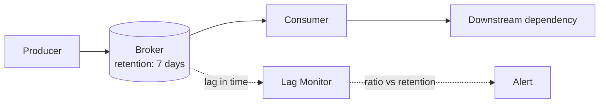
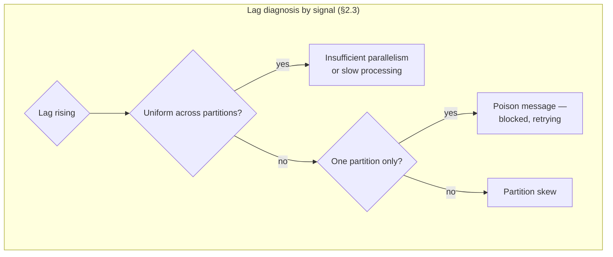
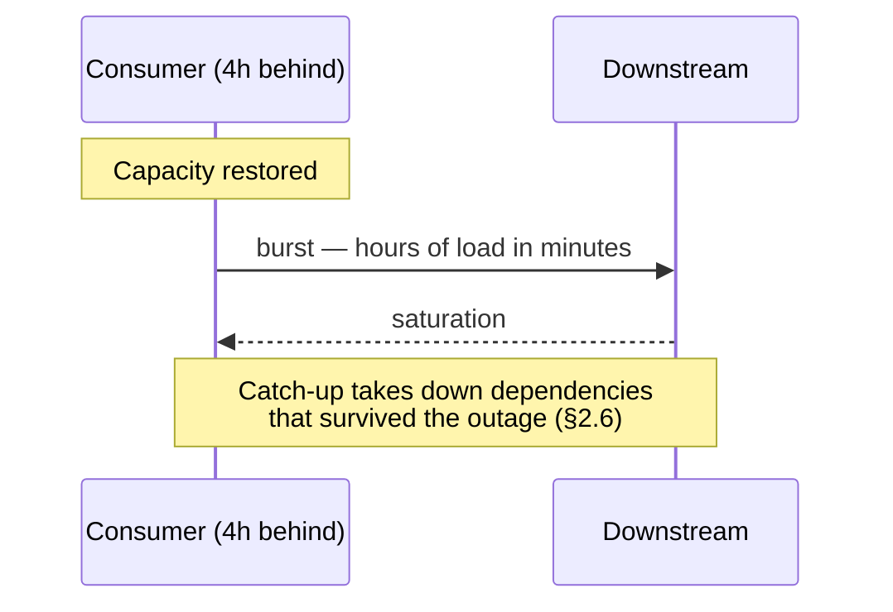
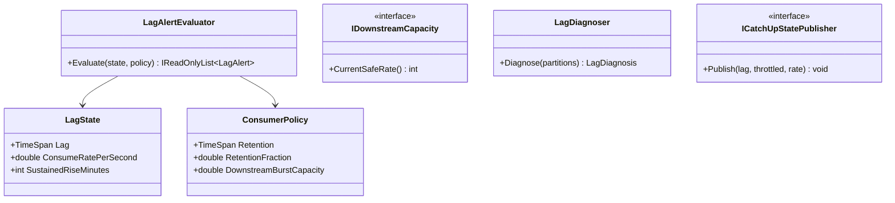

# Module 141 — Event-Driven Architecture: Backpressure, Flow Control & Consumer Lag at Scale

> Domain: Event-Driven Architecture | Level: Beginner → Expert | Prerequisite: [[03-Stream-Processing-Stateful-Operations-Windowing-Time-Semantics]] (whose watermark and state machinery this module's lag directly affects), [[../17-Microservices/05-Service-Discovery-Communication-Infrastructure-Backpressure]] (§Expert Q2 there identified that asynchronous backpressure manifests as lag rather than rejection — this module develops that), [[../37-Outbox/01-OutboxFundamentals-TableDesign-RelayMechanisms-DeliveryGuarantees]] (relay throughput and archival, the producer-side equivalent)
>
> **Scope note:** Second of six modules extending `18-Event-Driven-Architecture` toward its stated 8-module extra-depth scope. Full 16-section template; Elite FinTech Interview Panel lens.

---

## 1. Fundamentals

**What:** How an event-driven system behaves when producers outpace consumers — how that mismatch manifests, how it is measured, and what can be done about it, given that the queue between them absorbs the difference rather than signalling it.

**Why:** Module 136 established backpressure for synchronous calls, where a callee rejects and the caller learns immediately. Asynchronously, the broker absorbs the mismatch: the producer succeeds, the consumer falls behind, and **nothing fails**. The system's most important operational signal — consumer lag — is therefore not an error but a number that must be watched, and its consequences arrive at a boundary (retention expiry) rather than continuously.

**When:** From the first asynchronous consumer. Lag exists in every event-driven system; the question is only whether it is bounded, monitored, and understood.

**How (30,000-ft view):**
```
Producer ──► [broker: absorbs mismatch, retains for N days] ──► Consumer
                          │                                          │
                     lag grows ◄────── consumer slower than producer ┘
                          │
                     retention boundary ──► data loss (unrecoverable)
```

---

## 2. Deep Dive

### 2.1 Lag Is Not an Error — It Is a Position
Consumer lag is the difference between the latest offset produced and the latest offset committed by a consumer. It is a *position*, not a failure: a healthy system has non-zero lag, and lag rising during a burst then draining is normal and desirable — it is the queue doing its job.

What matters is not lag's value but its **derivative and its ceiling**. Rising lag that does not drain indicates the consumer is persistently slower than the producer, which ends in retention expiry. Lag measured in messages is also less useful than lag measured in *time* — 100,000 messages means nothing without the consumption rate, whereas "40 minutes behind" is immediately interpretable and directly comparable to retention.

### 2.2 The Retention Boundary — Where Lag Becomes Loss
A broker retains events for a configured period. A consumer lagging beyond it loses events permanently — not delayed, lost — because the broker has deleted them.

This is the defining asymmetry from synchronous backpressure: synchronous overload produces immediate, visible rejection, while asynchronous overload produces a slow slide toward a cliff. Everything is fine, then fine, then data is gone. The consequence is that **lag must be monitored against retention as a ratio**, not as an absolute — Module 126 §4's near-miss established this for the Outbox relay, and it applies to every consumer.

### 2.3 Why Consumers Fall Behind — Four Distinct Causes
Diagnosis matters because remedies differ entirely:
- **Insufficient parallelism.** Fewer consumer instances than partitions, or partitions than needed. Fixed by scaling — the only cause scaling addresses.
- **Slow processing per message.** A downstream dependency, an expensive computation. Scaling helps only if the bottleneck is not itself shared.
- **Partition skew.** One partition carrying disproportionate volume, so one consumer is saturated while others idle. Scaling does nothing.
- **Poison message.** A message that cannot be processed and is retried indefinitely, blocking its partition entirely (Module 44 §2.5's DLQ concern). Scaling does nothing and lag grows on one partition only.

The distinguishing signal is per-partition lag: uniform lag suggests the first two, skewed lag the last two.

### 2.4 Flow Control Between Producer and Consumer
Genuine backpressure requires the producer to slow, which asynchronous decoupling deliberately prevents — that decoupling is the point. The available mechanisms are therefore indirect:

- **Producer quotas** at the broker, capping produce rate per client. Blunt but effective, and the only mechanism that genuinely slows a producer.
- **Consumer-driven pacing** where the consumer's own pull rate limits its intake — which controls consumer load but does nothing about the growing backlog.
- **Load shedding at the producer**, dropping or sampling before publishing when the consumer is known to be behind, which requires the producer to observe consumer state and is an explicit coupling accepted deliberately.

The honest position: **you usually cannot apply backpressure in an event-driven system without breaking its decoupling**, so the practical answer is capacity plus monitoring plus a plan for when lag grows, rather than a mechanism that prevents it.

### 2.5 Prioritization and the Head-of-Line Problem
A single topic delivers in order, so an urgent event behind a backlog waits for the backlog. Priority requires separate topics or partitions with independent consumers, since priority within an ordered log is not expressible.

The subtlety: separating by priority means losing ordering *between* priorities, which may matter — a high-priority cancellation processed before the low-priority order it cancels is a genuine correctness problem. Priority and ordering are in tension, and the resolution requires knowing which events genuinely relate.

### 2.6 Catch-Up Dynamics and the Thundering Herd
When a lagging consumer recovers capacity, it consumes as fast as it can — which means a burst of load onto every downstream dependency at once, often larger than normal peak. A consumer catching up from a four-hour backlog can generate hours of downstream load in minutes, taking down the dependencies that were fine throughout the outage.

Mitigation is rate-limited catch-up: recover deliberately at a rate downstream can absorb, accepting slower recovery for not causing a second incident. Teams rarely implement this until it has happened once, and §4 is that once.

---

## 3. Visual Architecture







---

## 4. Production Example

**Problem:** A settlement-enrichment consumer processed trade events, calling a reference-data service per event to attach instrument details. It ran comfortably at roughly 15 minutes of lag against 7-day retention.

**Architecture:** Six partitions, six consumer instances, with lag monitored and alerted at a 2-hour absolute threshold.

**Implementation:** The reference-data service had a maintenance window during which it returned errors; the consumer retried with backoff, as designed, and lag grew. The 2-hour alert fired, was acknowledged as expected given the known maintenance, and the team waited for the window to close.

**Trade-offs:** Retrying rather than failing was correct — the events needed enrichment, and dropping them was not acceptable.

**Lessons learned:** The maintenance overran, lasting nine hours rather than two. Lag reached roughly nine hours, still far inside 7-day retention, so no data was at risk and the team was unconcerned.

When reference data returned, all six consumers began draining simultaneously at full rate. The reference-data service — freshly restarted, caches cold, and sized for normal steady-state load — received approximately nine hours of requests compressed into the first few minutes. It fell over within ninety seconds.

The consumers then retried against a now-failing service, lag resumed growing, and the reference-data team, seeing their service collapse immediately on returning to production, initially believed their maintenance had broken something. It took forty minutes to establish that the maintenance was fine and the consumers were the load source — during which lag grew by another forty minutes, worsening the eventual catch-up.

The recovery required manually throttling the consumers, which no mechanism supported, so it was done by scaling them down to one instance and back up gradually.

Three fixes followed. **First**, rate-limited catch-up: when lag exceeds a threshold, consumers throttle to a configured rate rather than consuming at maximum, with the rate derived from downstream capacity. **Second**, lag alerting changed from absolute to a ratio against retention (§2.2), with a separate alert on *sustained rising* lag regardless of magnitude — the nine-hour lag was genuinely safe from a data-loss perspective, and the metric that mattered was that it would take a large burst to clear. **Third**, downstream dependencies were made aware of catch-up: the consumer publishes its own catch-up state, so a dependency seeing an unexpected load surge can attribute it rather than investigating a phantom fault.

The generalizable lesson: **the danger of lag is not usually the lag itself but the recovery** — a backlog is a stored burst, and it will be delivered to downstream dependencies at whatever rate the consumer can manage unless something limits it.

---

## 5. Best Practices
- Measure lag in time, not messages, and alert on the ratio against retention (§2.1, §2.2).
- Alert separately on sustained rising lag regardless of magnitude, since direction matters before level does (§4).
- Rate-limit catch-up from a configured downstream-capacity budget (§2.6, §4).
- Diagnose lag by per-partition distribution before choosing a remedy (§2.3).
- Publish consumer catch-up state so downstream dependencies can attribute load surges (§4).
- Accept that genuine producer backpressure conflicts with decoupling, and plan capacity and response instead (§2.4).

## 6. Anti-patterns
- Unthrottled catch-up, converting a stored backlog into a downstream outage (§4's incident).
- Absolute lag thresholds with no reference to retention or trend (§2.2, §4).
- Scaling consumers in response to lag without diagnosing the cause, which helps only for parallelism limits (§2.3).
- Lag measured in message count, which is uninterpretable without a rate.
- Priority implemented within a single ordered topic, which cannot express it (§2.5).
- Treating non-zero lag as a problem, which produces alert fatigue and obscures the trend that matters (§2.1).

---

## 7. Performance Engineering

**CPU/Memory:** Consumer throughput is usually bound by per-message processing rather than by broker fetch — §4's consumer was bound by a downstream call, which no consumer-side tuning addresses.

**Latency:** End-to-end event latency is production-to-consumption, of which lag is the dominant term whenever it is non-trivial. This makes lag the primary latency metric for event-driven paths, not a separate operational concern.

**Throughput:** Bounded by `partitions × per-partition throughput`, so partition count is a hard ceiling on consumer parallelism — and increasing it later is disruptive since it changes key-to-partition mapping.

**Scalability:** Consumers scale to partition count and no further; beyond that, additional instances sit idle. This makes initial partition count a capacity decision with long consequences.

**Benchmarking:** Benchmark catch-up specifically — the sustained maximum consumption rate and the downstream load it generates — since §4 shows this differs from steady-state behaviour and is where the risk concentrates.

**Caching:** Per-message enrichment lookups are the common bottleneck (§4); caching them is usually the highest-leverage consumer optimization, and a cold cache after a dependency restart is exactly what compounded §4.

---

## 8. Security

**Threats:** A consumer lagging past retention loses events, which for regulated data is a compliance failure (Module 133) rather than merely an operational one. A malicious or malfunctioning producer can also induce lag deliberately, making producer quotas a security control as well as a capacity one.

**Mitigations:** Producer quotas per client (§2.4); lag monitoring as a data-integrity control for regulated streams; and alerting on lag approaching retention treated with the severity of potential data loss rather than of degraded performance.

**OWASP mapping:** Denial of Service via producer flooding, which asynchronous decoupling makes harder to detect because nothing rejects.

**AuthN/AuthZ:** Per-client produce and consume authorization; a consumer group's offsets are themselves sensitive, since manipulating them can cause data to be skipped or reprocessed.

**Secrets:** Standard per Module 86.

**Encryption:** In transit and at rest; note that long retention means the broker holds regulated data for the retention period and inherits its protection requirements.

---

## 9. Scalability

**Horizontal scaling:** To partition count (§7); partition count should therefore be provisioned generously at creation, since increasing it later rehashes keys and breaks per-key ordering for in-flight data.

**Vertical scaling:** Helps per-message processing where the bottleneck is local.

**Caching:** §7 — enrichment caching is the highest-leverage consumer optimization.

**Replication/Partitioning:** Partition by the key requiring ordering; skew is the limiting factor (§2.3) and is a design decision rather than a load characteristic.

**Load balancing:** Automatic within consumer groups; rebalancing pauses consumption, so frequent rebalances (from instance churn) themselves cause lag.

**High Availability:** Consumer failure is absorbed by the group; the lag it creates is the visible consequence, which is why lag is the right health signal rather than instance count.

**Disaster Recovery:** Retention is the recovery window — a consumer down longer than retention cannot recover its missed events, making retention a DR parameter rather than a storage-cost decision (Module 140 §Intermediate Q9).

**CAP theorem:** Brokers favour availability and partition tolerance for produce; consumers experience the trade as lag rather than as rejection, which is precisely why the failure mode is a slow slide rather than a fast failure (§2.2).

---

## 10. Interview Questions

### Basic (10)

1. **Q: What is consumer lag and why is it not an error?**
   **A:** The difference between the latest produced offset and the latest committed by a consumer — a position rather than a failure, since healthy systems have non-zero lag and a burst absorbed then drained is the queue working correctly (§2.1).
   **Why correct:** States the definition and why non-zero is normal.
   **Common mistakes:** Alerting on any non-zero lag, producing fatigue and hiding the trend that matters.
   **Follow-ups:** "What matters instead of the value?" (Its derivative and its ceiling — rising-and-not-draining, and proximity to retention, §2.1.)

2. **Q: Why measure lag in time rather than messages?**
   **A:** A message count is uninterpretable without a consumption rate, whereas "40 minutes behind" is immediately meaningful and directly comparable to retention (§2.1).
   **Why correct:** States the interpretability and comparability reasons.
   **Common mistakes:** Alerting on message-count thresholds, which mean different things at different throughputs.
   **Follow-ups:** "What is it compared against?" (Retention, as a ratio — the boundary where lag becomes permanent loss, §2.2.)

3. **Q: What happens when lag exceeds retention?**
   **A:** Events are permanently lost — not delayed, deleted by the broker — which is the defining asymmetry from synchronous overload's immediate visible rejection (§2.2).
   **Why correct:** States the consequence and contrasts with synchronous behaviour.
   **Common mistakes:** Assuming a lagging consumer eventually catches up regardless of duration.
   **Follow-ups:** "Why is this failure mode particularly dangerous?" (It is a slow slide to a cliff — everything is fine until data is gone, §2.2.)

4. **Q: Name the four causes of consumer lag and how they are distinguished.**
   **A:** Insufficient parallelism, slow per-message processing, partition skew, and a poison message — distinguished by per-partition lag distribution, since uniform lag suggests the first two and skewed lag the last two (§2.3).
   **Why correct:** Names all four with the discriminating signal.
   **Common mistakes:** Scaling in response to lag, which addresses only the first cause.
   **Follow-ups:** "Which show a single lagging partition?" (Poison message specifically — a blocked partition retrying indefinitely, §2.3.)

5. **Q: Why is genuine backpressure difficult in an event-driven system?**
   **A:** It requires the producer to slow, which asynchronous decoupling deliberately prevents — that decoupling being the architecture's purpose (§2.4).
   **Why correct:** Identifies the conflict between backpressure and the architecture's intent.
   **Common mistakes:** Expecting async systems to provide backpressure as synchronous ones do.
   **Follow-ups:** "What is the practical answer?" (Capacity, monitoring, and a response plan rather than a preventing mechanism, §2.4.)

6. **Q: Why can't priority be implemented within a single topic?**
   **A:** A topic delivers in order, so an urgent event behind a backlog waits for it — priority requires separate topics or partitions with independent consumers (§2.5).
   **Why correct:** States the ordering constraint that makes priority inexpressible.
   **Common mistakes:** Attempting priority via message headers, which the consumer can only act on after receiving the message in order.
   **Follow-ups:** "What is lost by separating?" (Ordering between priorities — a high-priority cancellation could be processed before the low-priority order it cancels, §2.5.)

7. **Q: What went wrong in §4's incident?**
   **A:** Nine hours of lag accumulated during an overrunning maintenance window, then six consumers drained simultaneously at full rate into a freshly-restarted reference-data service with cold caches, taking it down in ninety seconds (§4).
   **Why correct:** States the accumulation and the catch-up mechanism.
   **Common mistakes:** Attributing it to the maintenance overrun, which was the trigger rather than the cause of the second failure.
   **Follow-ups:** "What is the generalizable lesson?" (The danger of lag is usually the recovery — a backlog is a stored burst, §4.)

8. **Q: Why does partition count act as a hard ceiling on consumer scaling?**
   **A:** Each partition is consumed by at most one instance in a group, so instances beyond partition count sit idle (§7, §9).
   **Why correct:** States the assignment constraint.
   **Common mistakes:** Scaling consumers past partition count and expecting throughput gains.
   **Follow-ups:** "Why not just increase partitions later?" (It rehashes keys, breaking per-key ordering for in-flight data — disruptive, so initial count is a long-lived decision, §9.)

9. **Q: Why is retention a disaster-recovery parameter rather than a storage-cost decision?**
   **A:** It is the recovery window — a consumer down longer than retention cannot recover its missed events, so retention bounds how long an outage can last and remain recoverable (§9).
   **Why correct:** Reframes retention by what depends on it.
   **Common mistakes:** Setting retention to minimize storage without checking what recovery it permits.
   **Follow-ups:** "What else depends on retention?" (Stream-state rebuild and backfill, Module 140 §Intermediate Q9.)

10. **Q: Why should a consumer publish its catch-up state?**
    **A:** So downstream dependencies seeing an unexpected load surge can attribute it rather than investigating a phantom fault — §4 cost forty minutes to establish the load source (§4).
    **Why correct:** States the diagnostic benefit with the concrete cost it avoids.
    **Common mistakes:** Treating catch-up as invisible to downstream, who then experience unexplained load.
    **Follow-ups:** "What should the state include?" (Current lag and whether throttling is active, so a dependency knows both the cause and its expected duration.)

### Intermediate (10)

1. **Q: Walk through why §4's second failure was worse than the first.**
   **A:** The maintenance overrun was a known, contained condition with a clear owner and an obvious remedy — wait. The catch-up collapse was unexpected, its cause was misattributed to the reference-data team's own maintenance, and it worsened continuously during the forty minutes of misdiagnosis because lag kept growing. The first failure was understood and bounded; the second was neither, and the recovery mechanism for it did not exist.
   **Why correct:** Contrasts on understanding, attribution, and available remedy rather than on magnitude.
   **Common mistakes:** Comparing by duration, when the distinguishing property was that nobody knew what was happening.
   **Follow-ups:** "What made misattribution likely?" (The reference-data service failed immediately on returning to production, which strongly suggests the maintenance as cause, §4.)

2. **Q: Design the rate-limited catch-up §4's fix requires.**
   **A:** When lag exceeds a threshold, the consumer throttles to a configured rate rather than consuming at maximum — the rate derived from downstream capacity, not from consumer capability. Throttling should ease as lag drains, and the consumer publishes both its lag and its throttle state (§4). The essential inversion: catch-up speed is governed by what downstream can absorb, not by what the consumer can process.
   **Why correct:** Specifies the mechanism and the governing constraint.
   **Common mistakes:** Rate-limiting to a fixed value unrelated to downstream capacity, which is arbitrary and either too slow or still harmful.
   **Follow-ups:** "How is downstream capacity determined?" (From the dependency's own load testing under catch-up conditions — Module 136 §7's past-saturation testing, applied to the burst shape.)

3. **Q: Why is a ratio-against-retention alert better than an absolute lag threshold?**
   **A:** The absolute value's significance depends entirely on retention — nine hours against 7-day retention is safe, while nine hours against 12-hour retention is nearly data loss. The ratio expresses the property that actually matters (proximity to permanent loss), and it stays correct if retention or throughput changes (§2.2, §4).
   **Why correct:** Identifies that the absolute number's meaning is retention-dependent.
   **Common mistakes:** An absolute threshold that becomes wrong when retention is reduced for cost reasons.
   **Follow-ups:** "What second alert is needed?" (Sustained rising lag regardless of magnitude — direction matters before level, since the ratio alert fires late, §4.)

4. **Q: How does per-partition lag distribution discriminate the four causes?**
   **A:** Uniform lag across partitions means the consumer group as a whole is slower than the producer — insufficient parallelism or slow processing. Lag concentrated on one partition means that partition specifically is blocked (poison message) or overloaded (skew), and the distinction between those two is whether the partition is making any progress at all (§2.3).
   **Why correct:** Gives the discrimination including the second-level distinction.
   **Common mistakes:** Looking only at aggregate group lag, which averages away the signal.
   **Follow-ups:** "Which is most urgent?" (Poison message — it will never resolve without intervention, whereas skew and capacity issues at least make progress.)

5. **Q: Critique using producer quotas as the primary flow-control mechanism.**
   **A:** They genuinely slow producers, which is the only mechanism that does — but they do so bluntly, rejecting or delaying production regardless of the event's importance, and they push the problem to the producer, which may have nowhere to put the events it cannot publish. They are appropriate as a protection against runaway or malicious producers (§8), and poor as routine flow control, where capacity and catch-up management are more appropriate.
   **Why correct:** Concedes the mechanism's effectiveness while identifying its bluntness and displacement of the problem.
   **Common mistakes:** Adopting quotas as general flow control, converting a consumer problem into a producer problem.
   **Follow-ups:** "When are quotas clearly right?" (Multi-tenant brokers where one tenant's volume could starve others — Module 126's noisy-neighbour concern at the broker layer.)

6. **Q: Why does priority separation conflict with ordering?**
   **A:** Separate topics or partitions consume independently, so no ordering exists between them — a cancellation on the high-priority topic can be processed before the order it cancels on the low-priority one, which is a correctness failure rather than merely a surprise (§2.5).
   **Why correct:** Gives the concrete correctness consequence.
   **Common mistakes:** Separating by priority without checking whether the separated events relate causally.
   **Follow-ups:** "How is it resolved?" (Keep causally-related events on one topic and separate only genuinely independent ones — which requires knowing which relate, §2.5.)

7. **Q: Why is a cold cache after a dependency restart a compounding factor?**
   **A:** The dependency returns to service with none of its usual caching, so its effective capacity is far below normal at exactly the moment it receives a catch-up burst — the two effects multiply, which is why §4's service failed in ninety seconds rather than degrading (§4, §7).
   **Why correct:** Identifies the multiplication of reduced capacity and increased load.
   **Common mistakes:** Sizing catch-up rate against the dependency's normal capacity, which it does not have immediately after restart.
   **Follow-ups:** "What follows for the throttle rate?" (It should start conservative and increase as the dependency demonstrates capacity, rather than assuming steady-state capability.)

8. **Q: Why do frequent consumer rebalances themselves cause lag?**
   **A:** Rebalancing pauses consumption while partitions are reassigned, so instance churn — from autoscaling, deployments, or crashes — produces repeated pauses that accumulate into lag independent of processing capability (§9).
   **Why correct:** Identifies the pause mechanism.
   **Common mistakes:** Diagnosing this as slow processing, since the symptom is identical.
   **Follow-ups:** "How is it distinguished?" (Rebalance frequency metrics — lag rising with frequent rebalances and normal per-message processing time is the signature.)

9. **Q: How does lag affect Module 140's stream processing specifically?**
   **A:** Lag delays event-time progression, so watermarks advance slowly and windows finalize late — meaning a lagging stream job produces correct but delayed results. Critically, this is *not* the same failure as Module 140 §4's incompleteness: a lagging job will eventually emit correct windows, whereas dropped late data never will. Confusing the two leads to treating a latency problem as a correctness problem or vice versa.
   **Why correct:** Identifies the effect and distinguishes it from the superficially-similar completeness failure.
   **Common mistakes:** Treating delayed windows as data loss, or treating dropped data as mere delay.
   **Follow-ups:** "How are they distinguished operationally?" (Lag drains and results appear; dropped data never appears — the side output (Module 140 §2.4) is what makes the difference visible.)

10. **Q: Synthesize how this module completes Module 136's backpressure treatment.**
    **A:** Module 136 covered the synchronous case, where a callee rejects and the caller learns immediately, and its remedies — bounded queues, load shedding — work because rejection is available. Asynchronously the broker absorbs the mismatch, so nothing rejects and the signal is lag rather than error. The remedies are correspondingly different: monitoring against retention, rate-limited catch-up, and capacity planning, since the architecture deliberately prevents the producer from learning it is too fast.
    **Why correct:** Identifies the structural difference and why the remedies differ.
    **Common mistakes:** Applying synchronous backpressure thinking to async systems, expecting rejection that will not come.
    **Follow-ups:** "Which is more dangerous?" (Async — synchronous overload fails fast and visibly, async slides silently toward retention expiry, §2.2.)

### Advanced (10)

1. **Q: Diagnose §4's incident and design the complete structural fix.**
   **A:** Root cause: no catch-up rate control, so a stored backlog was delivered downstream at maximum rate into a dependency with cold caches and normal-load sizing; compounded by absolute lag alerting that gave no signal about the recovery risk, and by downstream having no way to attribute the load. Fix: (1) rate-limited catch-up governed by downstream capacity, starting conservative post-restart (Intermediate Q2, Q7); (2) ratio-against-retention alerting plus a sustained-rise alert (Intermediate Q3); (3) consumer catch-up state published for downstream attribution (§4); (4) catch-up load testing as a standing exercise, since the burst shape differs from steady state and is where the risk concentrates (§7).
   **Why correct:** Addresses the mechanism, the alerting gap, the attribution gap, and the untested condition.
   **Common mistakes:** Adding throttling alone, leaving the alerting unable to warn before the next event.
   **Follow-ups:** "Why does (4) matter given (1)?" (Throttle rates must be derived from measured downstream capacity under burst, not guessed — the test is what makes the rate correct.)

2. **Q: A team proposes eliminating lag by scaling consumers aggressively. Evaluate.**
   **A:** It addresses only insufficient parallelism (§2.3) and is capped by partition count (§7). Where the bottleneck is a downstream dependency — §4's case — more consumers increase load on the bottleneck and make things worse, converting a lag problem into a downstream outage. Scaling must follow diagnosis, and the per-partition lag distribution is what determines whether it will help at all.
   **Why correct:** Identifies the single cause scaling addresses and the specific harm when misapplied.
   **Common mistakes:** Scaling as the reflexive lag response, which is actively harmful for the dependency-bound case.
   **Follow-ups:** "What if the bottleneck is genuinely the consumer's own processing?" (Then scaling helps, up to partition count — after which the constraint is partition count and increasing it is disruptive, §9.)

3. **Q: Critique retention set purely on storage cost.**
   **A:** Retention is the recovery window (§9) and the rebuild horizon for stream state (Module 140 §Intermediate Q9), so shortening it for cost silently shortens how long an outage can last and remain recoverable, and may make stream-state rebuild impossible. The decision belongs jointly to whoever owns recovery objectives, not to whoever owns the storage bill — and the cost saving should be compared against the recovery capability surrendered.
   **Why correct:** Identifies what depends on retention and where the decision belongs.
   **Common mistakes:** Retention reduction as a routine cost optimization, discovering the constraint during the next long outage.
   **Follow-ups:** "What is the minimum?" (Longer than the maximum tolerable outage plus the time to detect and begin recovery — which is a recovery-objective calculation, not a storage one.)

4. **Q: Design the alerting hierarchy for consumer lag.**
   **A:** Three distinct alerts: sustained rising lag regardless of magnitude (earliest, indicates the consumer is persistently slower than the producer); lag exceeding a fraction of retention (data-loss risk, urgent); and lag magnitude sufficient that catch-up would exceed downstream capacity (recovery risk, which §4 shows can be severe even when data loss is not in question). The third is the one teams lack, and it is what would have flagged §4's nine-hour lag as dangerous despite being safe from a retention perspective.
   **Why correct:** Distinguishes three genuinely different conditions and identifies the missing one.
   **Common mistakes:** A single lag threshold conflating three conditions with different urgencies and remedies.
   **Follow-ups:** "How is the third threshold computed?" (Lag × consumption rate compared against downstream burst capacity — the point at which catch-up becomes hazardous.)

5. **Q: How would you handle a poison message blocking a partition?**
   **A:** Bounded retry, then route to a DLQ (Module 44 §2.5) and advance past it, so one message cannot block a partition indefinitely. The subtlety for ordered streams: skipping a message breaks per-key ordering for that key, which may be unacceptable — in which case the correct behaviour is to halt that partition and alert, accepting the lag rather than processing out of order. Which applies depends on whether ordering is load-bearing for that stream.
   **Why correct:** Gives the standard remedy and identifies the ordering case where it is wrong.
   **Common mistakes:** Always skipping to DLQ, which silently breaks ordering for streams where it matters.
   **Follow-ups:** "How do you know if ordering is load-bearing?" (Whether events for a key are causally dependent — a state machine's transitions are, independent measurements are not.)

6. **Q: A regulator asks how the firm ensures no regulatory events are lost in transit. Answer.**
   **A:** Describe the chain: producer-side Outbox guaranteeing publication (Module 125), broker retention exceeding maximum tolerable consumer outage, lag monitoring against retention with alerting well before the boundary (Advanced Q4), and DLQ capture with alerting for messages that cannot be processed (Advanced Q5). Then state the residual: if a consumer were down beyond retention, events would be lost — which is why retention is set from recovery objectives (Advanced Q3) and why the lag alert exists.
   **Why correct:** Gives the chain and states the specific condition under which loss occurs.
   **Common mistakes:** Claiming loss is impossible, when retention expiry is a real mechanism.
   **Follow-ups:** "What would detect loss if it occurred?" (Sequence-gap detection at the consumer or reconciliation against the producer's count — Module 131 §Advanced Q4's discipline.)

7. **Q: Apply this course's "declared ≠ actual" theme to consumer lag.**
   **A:** The claim is "events are being processed." Its declared basis is that consumers are running and not erroring — which is true throughout a lag incident, since a lagging consumer is healthy by every conventional measure. The distinguishing feature is that **the failure has no error state at any point**: not while lag grows, not at retention expiry (the broker deletes normally), and not afterward, since the consumer continues processing whatever remains. Detection requires monitoring a *position* rather than a status, which is a different kind of signal than most health checks provide.
   **Why correct:** Identifies that no error state exists at any stage, which is stronger than the usual silent-failure framing.
   **Common mistakes:** Expecting some component to error at retention expiry, when deletion is normal broker operation.
   **Follow-ups:** "What is the equivalent in synchronous systems?" (There is none — synchronous overload produces rejection, which is why the async case needs monitoring the sync case does not, Intermediate Q10.)

8. **Q: Design the monitoring that distinguishes a slow consumer from a fast producer.**
   **A:** Track produce rate and consume rate independently rather than only their difference. Lag rising with a stable consume rate and elevated produce rate is a producer surge — likely legitimate, likely transient. Lag rising with a stable produce rate and falling consume rate is consumer degradation, which will not self-resolve. The difference determines whether to wait or intervene, and lag alone cannot distinguish them.
   **Why correct:** Identifies that the two rates carry the diagnostic information lag conceals.
   **Common mistakes:** Monitoring lag alone, which shows a problem exists without indicating which side.
   **Follow-ups:** "Which is more urgent?" (Consumer degradation — a producer surge drains when it ends, whereas a degraded consumer falls further behind indefinitely.)

9. **Q: How should catch-up interact with Module 137's cell architecture?**
   **A:** Per-cell consumers mean a lagging consumer affects one cell's data freshness, which is the containment benefit working as intended. But if all cells' consumers depend on a *shared* downstream service — as §4's reference-data service was — then simultaneous catch-up across cells multiplies the burst by cell count, which is Module 137 §4's shared-dependency failure in a new form. Catch-up throttling must therefore account for aggregate load across cells, not per-cell capacity.
   **Why correct:** Identifies the containment benefit and the specific way a shared dependency defeats it during catch-up.
   **Common mistakes:** Setting per-cell throttle rates from per-cell downstream capacity, which multiplies at the shared dependency.
   **Follow-ups:** "How is aggregate throttling coordinated?" (Either a shared rate budget across cells, or per-cell rates set at aggregate-capacity divided by cell count — the latter simpler and more conservative.)

10. **Q: Synthesize the governance for event-driven consumer operations.**
    **A:** (1) Lag measured in time and alerted as a ratio against retention, plus sustained-rise and catch-up-risk alerts (Advanced Q4). (2) Rate-limited catch-up governed by measured downstream capacity, conservative after dependency restarts (Advanced Q1). (3) Retention set from recovery objectives jointly with recovery owners, never from storage cost alone (Advanced Q3). (4) DLQ with alerting, and an explicit decision per stream about whether skipping breaks load-bearing ordering (Advanced Q5). (5) Produce and consume rates monitored independently for diagnosis (Advanced Q8). (6) Catch-up load testing as a standing exercise (§7). (7) Aggregate throttle budgets where cells share downstream dependencies (Advanced Q9).
    **Why correct:** Covers alerting, recovery, retention, ordering, diagnosis, and the multi-cell interaction.
    **Common mistakes:** Governing lag thresholds without governing catch-up, which §4 shows is where the severe failure occurs.
    **Follow-ups:** "Which is most often missing?" (Catch-up rate control — most teams add it after an incident, and §4 is that incident.)

### Expert (10)

1. **Q: Evaluate whether an event-driven system should ever apply true backpressure to producers.**
   **A:** Rarely, and it should be recognized as abandoning a property the architecture was chosen for. The legitimate cases: multi-tenant brokers where one producer can starve others (Intermediate Q5), and systems where dropping is genuinely worse than blocking upstream — a regulatory event stream where the producer can queue locally rather than lose data. Elsewhere, the async decoupling exists precisely so a slow consumer does not slow the business, and reintroducing coupling to manage lag usually indicates the consumer should be scaled or the work restructured instead.
   **Why correct:** Identifies the legitimate cases and frames the general answer as recognizing what is being surrendered.
   **Common mistakes:** Adding producer backpressure as a lag remedy, coupling the producer to consumer health.
   **Follow-ups:** "What does the producer do when blocked?" (Which is the question that usually reveals backpressure is wrong — if it has nowhere to put the events, blocking just moves the problem.)

2. **Q: How does lag behave differently for compacted versus retention-based topics?**
   **A:** A compacted topic retains the latest value per key indefinitely, so a consumer cannot lose data by lagging — it will eventually receive current state for every key, though it will miss intermediate values. This changes the failure mode entirely: lag threatens *freshness* rather than *completeness*, so the retention-boundary alert (§2.2) does not apply, while intermediate-value loss may matter if the consumer needs the sequence rather than the state.
   **Why correct:** Identifies the changed failure mode and the case where compaction still loses something relevant.
   **Common mistakes:** Assuming compaction eliminates lag concerns, when it changes rather than removes them.
   **Follow-ups:** "When is compaction inappropriate?" (When consumers need every transition — an event-sourced stream (Module 121) cannot be compacted without destroying history.)

3. **Q: Design the approach for a consumer that must never fall behind.**
   **A:** Challenge the requirement first — "never" usually means "not beyond X", which is a bounded and achievable target. Given a genuine tight bound: provision consumers well above peak, eliminate per-message external dependencies (the usual cause, §4) by pre-loading or caching reference data, partition generously so parallelism is not capped, and monitor with a tight sustained-rise alert. Accept that the guarantee is probabilistic — no configuration makes falling behind impossible if the producer surges beyond provisioned capacity.
   **Why correct:** Challenges the framing, gives concrete measures, and states the honest limit.
   **Common mistakes:** Accepting "never" and designing as if it were achievable, rather than establishing the actual bound.
   **Follow-ups:** "What if the bound is genuinely near-zero?" (That is a synchronous requirement wearing async clothing — Module 136's territory, and the architecture choice should be revisited.)

4. **Q: How should lag be handled during a planned consumer deployment?**
   **A:** Deployment pauses consumption during rebalance (Intermediate Q8), so lag grows briefly — normally trivial, and harmful only if lag is already high, since deployment then adds to an existing backlog and the post-deployment catch-up is larger. The discipline: check lag before deploying, and defer non-urgent deployments when lag is elevated, which is a simple gate that avoids compounding a developing problem.
   **Why correct:** Identifies the interaction and gives a simple preventive gate.
   **Common mistakes:** Deploying during elevated lag, worsening the catch-up that follows.
   **Follow-ups:** "What about an urgent fix for the lag itself?" (Then deploy — but expect the catch-up burst and ensure throttling is in place first, §4.)

5. **Q: A consumer's lag is stable but high — say four hours, steady. Is this a problem?**
   **A:** It depends entirely on what consumes the output. Stable lag means the consumer is keeping pace, so it is not degrading — but the output is four hours stale, which matters enormously for a risk feed and not at all for a nightly reconciliation. The other concern is catch-up risk: a four-hour backlog is a stored burst (Advanced Q4's third alert), so any interruption compounds it. Stable-but-high is a freshness decision plus a latent recovery risk, not a health problem.
   **Why correct:** Separates the freshness question from the health question and notes the latent risk.
   **Common mistakes:** Treating stable lag as fine because it is not growing, ignoring both staleness and stored-burst risk.
   **Follow-ups:** "Why is stable high lag common?" (Consumers provisioned to match average rather than peak throughput settle at a lag that never drains — usually an unnoticed provisioning decision.)

6. **Q: How does consumer lag interact with Module 133's regulatory deadlines?**
   **A:** Directly and severely: a reporting pipeline consuming events with hours of lag has that lag subtracted from its deadline margin, and Module 133 §2.2 established that deadline margin is what converts a validation failure from routine into a crisis. Lag therefore consumes the buffer that makes the pipeline recoverable, which means for deadline-bound consumers, lag is not a freshness concern but a *schedule risk* concern and should be monitored against the deadline rather than only against retention.
   **Why correct:** Connects lag to deadline margin and reframes what it should be monitored against.
   **Common mistakes:** Monitoring reporting-consumer lag against retention, missing that the binding constraint is the regulatory deadline.
   **Follow-ups:** "What is the alert threshold?" (Lag consuming more than a defined fraction of the deadline margin — a completely different threshold from the retention-based one.)

7. **Q: Evaluate consumer-side batching as a throughput optimization.**
   **A:** Batching amortizes per-message overhead and is frequently the single largest consumer throughput improvement — particularly where the bottleneck is a downstream call that supports batch operations (§4's reference-data lookups being the canonical case). Its costs: increased latency for the first message in a batch, larger failure blast radius (a batch failure retries all of it), and complicated offset management, since partial batch success requires care. Generally worth it where downstream supports batching, which is a question to ask the dependency rather than assume.
   **Why correct:** Identifies the benefit, three specific costs, and the enabling condition.
   **Common mistakes:** Batching without a batch-capable downstream, which gains only serialization overhead.
   **Follow-ups:** "How is partial batch failure handled?" (Either retry the whole batch, requiring idempotency, or track per-message outcomes — the second is more correct and considerably more complex.)

8. **Q: How should lag be presented to non-engineering stakeholders?**
   **A:** As data freshness — "the risk dashboard reflects activity as of 14:32" — rather than as an offset difference, which is meaningless outside the team. This framing also surfaces the right conversation: stakeholders can say whether four hours of staleness is acceptable for their use, which is a business decision engineering cannot make and frequently makes by default.
   **Why correct:** Translates to the stakeholder's frame and identifies the decision it surfaces.
   **Common mistakes:** Reporting lag metrics, which stakeholders cannot evaluate, so the freshness decision is never explicitly made.
   **Follow-ups:** "What if different stakeholders want different freshness?" (That is an argument for separate consumers with different provisioning — the same per-consumer calibration as Module 126 §2.1.)

9. **Q: A consumer group's lag drops to zero instantly. What are the possible causes?**
   **A:** Rarely good news. Possibilities: offsets were reset to latest (skipping the backlog — data not processed but no longer counted); the topic was recreated or partitions changed; the consumer group was recreated with a new ID and default offset; or, legitimately, the backlog genuinely drained. The first three lose data silently, so an instant drop should be investigated as a potential loss rather than celebrated — the metric improved because the measurement changed, not because the work was done.
   **Why correct:** Enumerates the causes and identifies that the benign one is least likely.
   **Common mistakes:** Treating lag reaching zero as resolution, when it usually indicates the backlog was skipped.
   **Follow-ups:** "How do you distinguish?" (Compare consumed-message count against the backlog size — genuine drain shows the messages processed, a reset shows them skipped.)

10. **Q: Deliver the closing synthesis: what makes asynchronous flow control distinctively hard?**
    **A:** That **the architecture is deliberately built to prevent the signal you need.** Decoupling means the producer does not learn the consumer is behind — that is the value proposition, not a defect — so there is no mechanism by which overload announces itself, and no component errors at any stage including the moment data is lost (Advanced Q7). The consequence is that async flow control cannot be a mechanism in the way synchronous backpressure is; it must be *monitoring plus a planned response*, which is operationally weaker and requires someone to be watching. §4's second failure is the honest illustration: the team was watching, the alert fired, it was correctly assessed as safe on the dimension being measured, and the dimension that mattered — recovery burst — was not being measured at all. The Principal-level conclusion is that in event-driven systems, **lag is the primary operational signal and it must be interpreted against three different boundaries — retention, freshness requirement, and downstream catch-up capacity — because a value that is safe against one can be dangerous against another**.
    **Why correct:** Names the deliberate absence of the signal, explains why remedies are weaker, and gives the three-boundary interpretation as the actionable conclusion.
    **Common mistakes:** Seeking a backpressure mechanism, when the architecture's purpose precludes one.
    **Follow-ups:** "Which boundary is most often unmonitored?" (Catch-up capacity — retention is standard and freshness is usually discussed, while the stored-burst risk is typically discovered by experiencing it, §4.)

---

## 11. Coding Exercises

### Easy — Lag in Time Rather Than Messages (§2.1)
**Problem:** Express consumer lag as a duration.
**Solution:**
```csharp
public TimeSpan LagAsTime(ConsumerPosition pos, IReadOnlyList<EventRecord> recent)
{
    if (pos.MessagesBehind == 0) return TimeSpan.Zero;

    var latestProducedTime  = recent.Max(r => r.EventTime);
    var lastConsumedTime    = pos.LastConsumedEventTime;
    return latestProducedTime - lastConsumedTime;      // interpretable, comparable to retention
}
```
**Time complexity:** O(n) over the recent sample.
**Space complexity:** O(1).
**Optimized solution:** Read the timestamp of the message at the consumer's committed offset directly from the broker rather than sampling, avoiding the assumption that recent messages represent the head.

### Medium — Three-Boundary Lag Alerting (Advanced Q4, Expert Q10)
**Problem:** Alert on the three genuinely distinct lag conditions.
**Solution:**
```csharp
public IReadOnlyList<LagAlert> Evaluate(LagState state, ConsumerPolicy policy)
{
    var alerts = new List<LagAlert>();

    if (state.SustainedRiseMinutes > policy.RiseWindow)
        alerts.Add(LagAlert.Degrading("Lag rising and not draining — consumer slower than producer"));

    if (state.Lag > policy.Retention * policy.RetentionFraction)
        alerts.Add(LagAlert.DataLossRisk($"Lag {state.Lag} approaching retention {policy.Retention}"));

    var catchUpLoad = state.Lag.TotalSeconds * state.ConsumeRatePerSecond;
    if (catchUpLoad > policy.DownstreamBurstCapacity)
        alerts.Add(LagAlert.RecoveryRisk(                    // the alert §4 lacked
            $"Catch-up would generate {catchUpLoad} requests vs capacity {policy.DownstreamBurstCapacity}"));

    return alerts;
}
```
**Time complexity:** O(1).
**Space complexity:** O(1).
**Optimized solution:** Make the three alerts route differently — degrading to the owning team, data-loss risk to on-call, recovery risk to both the consumer and downstream owners, since the last requires coordination §4 lacked.

### Hard — Rate-Limited Catch-Up (§2.6, Intermediate Q2)
**Problem:** Throttle consumption when lagging, governed by downstream capacity.
**Solution:**
```csharp
public async Task ConsumeWithCatchUpControlAsync(CancellationToken ct)
{
    while (!ct.IsCancellationRequested)
    {
        var lag = await _position.CurrentLagAsync();
        var rate = lag > _catchUpThreshold
            ? _downstreamCapacity.CurrentSafeRate()          // conservative after restart (Intermediate Q7)
            : _normalRate;

        _catchUpState.Publish(lag, throttled: lag > _catchUpThreshold, rate);  // downstream attribution (§4)

        var batch = await _consumer.FetchAsync(maxRecords: rate, ct);
        foreach (var record in batch) await _processor.HandleAsync(record, ct);

        await _limiter.WaitForNextWindowAsync(rate, ct);
    }
}
```
**Time complexity:** O(b) per batch of size b.
**Space complexity:** O(b).
**Optimized solution:** Ramp the rate upward as downstream demonstrates capacity rather than jumping to a configured maximum, since a freshly-restarted dependency's capacity grows as caches warm (Intermediate Q7).

### Expert — Lag Cause Diagnosis (§2.3, Intermediate Q4)
**Problem:** Distinguish the four causes from per-partition signals.
**Solution:**
```csharp
public LagDiagnosis Diagnose(IReadOnlyDictionary<PartitionId, PartitionLag> partitions)
{
    var lagging = partitions.Where(p => p.Value.Lag > _threshold).ToList();
    if (lagging.Count == 0) return LagDiagnosis.Healthy();

    if (lagging.Count == partitions.Count)
        return partitions.Values.Average(p => p.ProcessingTimeMs) > _normalProcessingMs
            ? LagDiagnosis.SlowProcessing("Uniform lag, elevated processing time")
            : LagDiagnosis.InsufficientParallelism("Uniform lag, normal processing time");

    var stalled = lagging.Where(p => p.Value.CommittedOffsetUnchangedFor > _stallWindow).ToList();
    return stalled.Count > 0
        ? LagDiagnosis.PoisonMessage(stalled.Select(s => s.Key).ToList())    // no progress at all
        : LagDiagnosis.PartitionSkew(lagging.Select(l => l.Key).ToList());   // progressing, overloaded
}
```
**Time complexity:** O(p) for p partitions.
**Space complexity:** O(p).
**Optimized solution:** Include the diagnosis in the alert payload so responders receive the cause rather than only the symptom — the remedies differ entirely (Advanced Q2), and diagnosis at alert time saves the investigation.

---

## 12. System Design

**Functional requirements**
- Consume trade and market-data event streams with bounded staleness.
- Recover from consumer outages without downstream harm.
- Detect and isolate poison messages without blocking partitions indefinitely.
- Support deadline-bound consumers (Module 133) whose lag budget is the regulatory margin.

**Non-functional requirements**
- Lag never approaches retention undetected (§2.2).
- Catch-up never exceeds downstream burst capacity (§2.6).
- Lag cause diagnosable from monitoring without investigation (§2.3).
- Retention set from recovery objectives (Advanced Q3).

**Capacity estimation**
- Trade stream: 80k events/s peak, 24 partitions, 7-day retention.
- Consumer processing: ~2ms per event with cached reference data, ~40ms without — a 20× difference that makes cache state the dominant capacity variable (§4).
- Steady-state consumption comfortably exceeds production; catch-up from 9 hours of backlog at full rate would generate ~2.6B downstream requests, versus a reference-data service sized for ~5k/s.
- **The sensitivity that matters:** the ratio of catch-up rate to downstream capacity, not lag magnitude. Nine hours of lag is safe against 7-day retention and catastrophic against a 5k/s dependency — which is precisely §4, and why the third alert (§11 Medium) exists.

**Architecture:** §3 — producers to a partitioned broker with recovery-objective-derived retention, consumers with rate-limited catch-up and published catch-up state, three-boundary lag alerting.

**Components:** Lag monitor with time-based measurement (§11 Easy); three-boundary alert evaluator (§11 Medium); rate-limited consumer (§11 Hard); lag-cause diagnoser (§11 Expert); DLQ with alerting.

**Database selection:** Broker retention as the durable buffer; DLQ as a separate topic with longer retention, since poison messages need investigation time.

**Caching:** Reference-data caching in the consumer is the dominant throughput lever (§7) — and its cold state after restart is a first-class capacity consideration, not an implementation detail.

**Messaging:** Partitioned by the key requiring ordering; priority via separate topics only where events are genuinely independent (§2.5).

**Scaling:** To partition count; partition count provisioned generously at creation given the cost of changing it (§9).

**Failure handling:** Poison messages to DLQ with the ordering caveat (Advanced Q5); catch-up throttled against downstream (§11 Hard); rebalance frequency monitored as an independent lag cause (Intermediate Q8).

**Monitoring:** Lag in time; three-boundary alerts; per-partition distribution for diagnosis; produce and consume rates independently (Advanced Q8); rebalance frequency.

**Trade-offs:** Throttled catch-up accepts slower recovery to avoid a second incident (§4). Generous partition provisioning accepts overhead for avoiding a disruptive later change (§9).

---

## 13. Low-Level Design

**Requirements:** Lag is expressed in time; alerts distinguish three conditions; catch-up is governed by downstream; cause is diagnosable from partition signals.

**Class diagram:**


**Sequence diagram:** §3's third diagram — catch-up burst overwhelming a restarted dependency.

**Design patterns used:** Token Bucket (rate-limited catch-up); Circuit Breaker (downstream protection during catch-up); Dead Letter Channel (poison isolation); Observer (catch-up state publication for downstream attribution).

**SOLID mapping:** Single Responsibility (measurement, alerting, throttling, diagnosis separate); Open/Closed (a new lag boundary adds an evaluator rule without changing the consumer); Liskov (every downstream-capacity implementation must be conservative after restart — a capacity source reporting steady-state values post-restart breaks the throttle's purpose); Interface Segregation (capacity and state-publication interfaces separate); Dependency Inversion (the consumer depends on the capacity interface, allowing static, measured, or adaptive implementations).

**Extensibility:** New consumers adopt the throttled-consumer base with their own downstream-capacity implementation.

**Concurrency/thread safety:** Per-partition consumption is single-threaded by the consumer-group model; the rate limiter is the shared structure across partitions within an instance and must account for aggregate rather than per-partition rate, since downstream sees the sum.

---

## 14. Production Debugging

**Incident:** Following the §4 remediation, a consumer's lag alert fired as degrading — sustained rise with stable produce rate, indicating consumer degradation (Advanced Q8). Investigation found normal per-message processing time, normal CPU, no downstream errors, and correct partition assignment. The consumer appeared entirely healthy while falling steadily behind.

**Root cause:** The consumer had been deployed to a node pool that had been reconfigured with a lower CPU quota during an unrelated cost-optimization exercise. Per-message processing time was normal because each message's *work* was unchanged — but the container was being CPU-throttled, so the time between messages had increased. The consumer was healthy for every message it processed and was simply processing fewer of them per second.

Per-message processing time is measured while processing; throttling manifests as time *not* processing, which no processing-time metric captures.

**Investigation:** The contradiction — degrading lag with normal processing time — was the entry point, since Advanced Q8's diagnosis had excluded the producer side. Comparing messages-consumed-per-second against processing-time metrics showed the gap: processing time accounted for far less wall-clock than elapsed. Container CPU-throttling metrics confirmed it.

**Tools:** Consume-rate versus processing-time comparison (the discriminating measurement); container CPU-throttling metrics; node-pool configuration change history.

**Fix:** Restored the CPU quota for the consumer's workload class.

**Prevention:** (1) Consume rate is now monitored alongside processing time, since their divergence is the signature of throttling or any other non-processing delay — a class the processing-time metric structurally cannot show. (2) Container throttling metrics were added to consumer dashboards, having previously been considered platform-level rather than application-level. (3) The cost-optimization process now identifies workloads with throughput SLOs before changing their resource quotas, since the change was applied by workload *type* without reference to what depended on the affected consumers.

---

## 15. Architecture Decision

**Context:** How to respond when a consumer falls persistently behind — the decision §4 exposed as unplanned.

**Option A — Scale consumers to maximum and drain as fast as possible:**
*Advantages:* Fastest return to freshness; simplest; no additional mechanism.
*Disadvantages:* §4 exactly — the stored burst overwhelms downstream, converting a freshness problem into an outage; and it is capped by partition count anyway (§7).
*Cost:* None to implement. *Risk:* High where downstream is shared or capacity-constrained.

**Option B — Rate-limited catch-up governed by downstream capacity (recommended):**
*Advantages:* Recovery without a second incident; downstream can attribute the load (§4); rate adapts as the dependency demonstrates capacity.
*Disadvantages:* Slower return to freshness, which for a deadline-bound consumer (Expert Q6) may itself be unacceptable; requires knowing downstream capacity, which must be measured (§7).
*Cost:* Moderate implementation. *Risk:* Low, with the freshness caveat.

**Option C — Skip the backlog, resume at latest:**
*Advantages:* Immediate freshness; no catch-up load at all.
*Disadvantages:* Discards the backlog — acceptable only where events are genuinely superseded by later ones (a price feed where only the latest matters) and unacceptable anywhere completeness is required, which includes anything regulatory (Module 133).
*Cost:* Trivial. *Risk:* Data loss by design — legitimate for some streams, catastrophic for others.

**Recommendation: Option B as the default, with Option C available per-stream where events are genuinely superseded.** Option A is disqualified by §4 not because draining fast is wrong but because doing so unbounded ignores that a backlog is a stored burst. Option C is legitimate more often than teams assume — for latest-value streams, skipping to current is exactly right and the backlog has no value — but the decision must be per-stream and explicit, since applying it to a completeness-required stream is silent data loss. The general principle: **the correct catch-up strategy depends on whether the backlog's contents have independent value, which is a property of the stream rather than of the incident.**

---

## 17. Principal Engineer Perspective

**Business impact:** Lag is data staleness, which stakeholders can evaluate when it is expressed that way (Expert Q8) and cannot when expressed as offsets. Framing it as freshness surfaces a business decision — how stale is acceptable — that engineering otherwise makes by default through provisioning choices nobody reviews.

**Engineering trade-offs:** The central trade is recovery speed against downstream safety (§15), and §4 shows the instinct favours speed because the backlog feels like the problem. Recognizing that a backlog is a stored burst — and therefore that recovery is the dangerous phase — is the non-obvious insight worth teaching explicitly.

**Technical leadership:** §4 and §14 share a shape: the team was monitoring, the metrics were correct, and the dimension that mattered was not among them. Building the habit of asking "what would this metric fail to show?" is more valuable than any specific dashboard, and both incidents here are teaching cases for it.

**Cross-team communication:** §4 cost forty minutes because a downstream team could not attribute their load surge. Publishing catch-up state is a small technical change addressing a purely communicative failure — worth noting as a pattern, since cross-team incidents frequently turn on attribution rather than on either team's system being wrong.

**Architecture governance:** Retention, catch-up policy, and per-stream backlog-value classification (§15's Option C decision) should be recorded per stream (Module 106), since each encodes a judgment consumers depend on and cannot infer.

**Cost optimization:** Retention reduction is a tempting saving that surrenders recovery capability (Advanced Q3), and §14 shows resource-quota reductions can silently degrade throughput SLOs. Both are cases where cost optimization applied by asset class rather than by workload requirement produces failures the optimizer cannot see.

**Risk analysis:** The dominant risk is the absence of any error state throughout (Advanced Q7) — no component fails at any point, including when data is deleted. Risk registers should treat lag monitoring as a data-integrity control rather than a performance metric, which changes both its priority and who owns it.

**Long-term maintainability:** What decays is the correspondence between configured thresholds and current reality — retention, throttle rates, and downstream capacity all change independently of the consumer's configuration. Deriving thresholds from measured values (Module 140's adaptive watermark reasoning, applied here) is what keeps them correct as the environment moves.

---

**Next in this run:** Module 142 — Cross-Region & Multi-Cluster Event Distribution: replicating streams across regions, where lag acquires a geographic dimension and ordering guarantees interact with replication topology.
