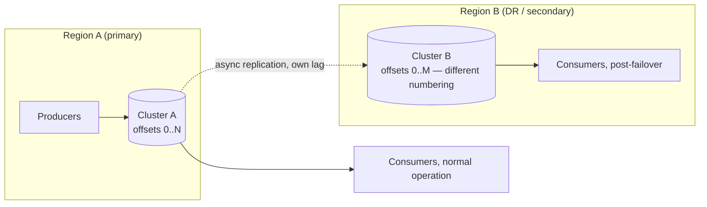
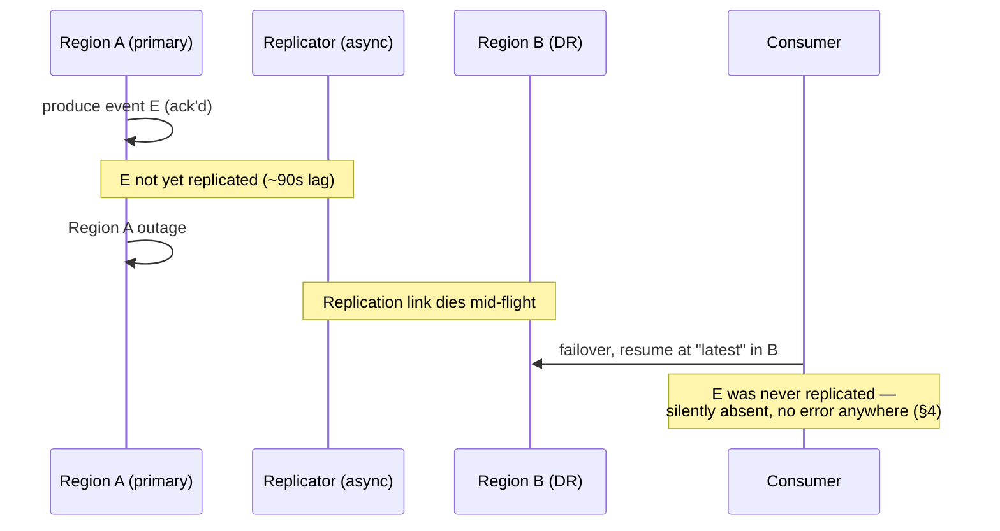
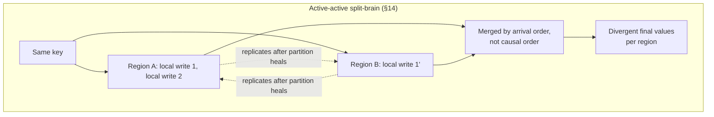
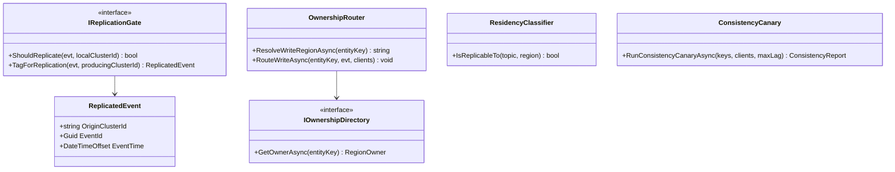

# Module 142 — Event-Driven Architecture: Cross-Region & Multi-Cluster Event Distribution

> Domain: Event-Driven Architecture | Level: Beginner → Expert | Prerequisite: [[04-Backpressure-Flow-Control-Consumer-Lag]] (lag as a monitored position — this module adds a geographic dimension to it), [[../17-Microservices/06-MultiRegion-Cell-Based-Architecture-Blast-Radius]] (cell/region containment and active-active vs active-passive, applied here to the event backbone specifically), [[02-Schema-Evolution-Ordering-DeliverySemantics-DLQ]] §2.3 (per-key ordering within one cluster — this module asks what survives when that cluster is replicated)

>
> **Scope note:** Third of six modules extending `18-Event-Driven-Architecture` toward its stated 8-module extra-depth scope. Full 16-section template; Elite FinTech Interview Panel lens.

---

## 1. Fundamentals

**What:** How event streams are distributed across regions and clusters — for disaster recovery, regional read locality, and data-residency compliance — and what guarantees survive the trip when a topic is replicated from one Kafka (or equivalent) cluster to another.

**Why:** Every guarantee this domain has built so far — per-key ordering (Module 44 §2.3), retention as a recovery window (Module 141 §9), lag as an interpretable signal (Module 141 §2.1) — was implicitly scoped to *one cluster*. Cross-region replication is a second, independent event pipeline layered on top of the first, with its own lag, its own failure modes, and critically, **its own offsets** — a replicated topic in a second cluster does not share offset numbering with the original, so "resume where you left off" cannot mean what it meant inside one cluster.

**When:** Any system with a regulatory disaster-recovery requirement, a genuinely multi-region user base, or a data-residency constraint that forbids some events from leaving a jurisdiction. Single-region systems can skip this domain entirely; the moment DR or residency enters the requirements, it cannot be retrofitted casually.

**How (30,000-ft view):**
```
Region A cluster ──(async replication, its own lag)──► Region B cluster
       │                                                        │
  local offsets 0..N                              local offsets 0..M (different numbering)
       │                                                        │
  local consumers, local ordering guaranteed          local consumers, local ordering guaranteed
                                                                 │
                                            NO ordering guarantee BETWEEN regions
```

---

## 2. Deep Dive

### 2.1 Replication Is a Second Pipeline, Not an Extension of the First
Cross-region replication (Kafka MirrorMaker 2, Confluent Cluster Linking, or equivalent) is itself a consumer of the source cluster and a producer into the destination cluster. It inherits every property of Module 141's consumer-lag discussion — it can fall behind, and its "consumer" (the replicator) has its own retention-relative risk — while adding a property no single-cluster consumer has: **the destination cluster assigns new offsets on write**. A message at offset 4,521 in Region A may land at offset 9,003 in Region B. Any system that persisted "offset 4,521" as a resume point for the source cluster has persisted something meaningless for the destination.

### 2.2 What Ordering Survives Replication, and What Doesn't
Per-key ordering (Module 44 §2.3) is preserved *within the replication of a single partition* — MirrorMaker mirrors partition-by-partition and preserves intra-partition order. What is **not** preserved automatically:
- **Cross-partition ordering** — never guaranteed even in one cluster, so this is not a regression.
- **Ordering between independently-produced streams in an active-active topology** — if both regions accept writes for overlapping keys, each region's local order is internally consistent but the *merged* order across regions, after replication, has no causal guarantee. This is the single most consequential fact in this module: **active-active replication for a shared key space does not produce a single globally-ordered log; it produces two locally-ordered logs that must be reconciled, not merged.**
- **Timing relative to a consumer that failed over.** §2.3 below.

### 2.3 Offsets Don't Survive — Failover Must Resume by Time or by Content, Not by Position
Because offsets are cluster-local, a consumer that fails over from Region A to Region B cannot resume "from offset X" — that offset either doesn't exist in B or means something different. The two available failover-resume strategies:
- **Timestamp-based resume** — ask the destination cluster for the offset corresponding to a given event time, and resume there. Works if clocks and event-time semantics (Module 140 §2.1) are consistent, and is lossy exactly to the granularity of the timestamp index.
- **Content-based resume (idempotent replay from a safe earlier point)** — resume somewhat earlier than necessary and rely on idempotent consumption (Module 44 §2.4) to discard already-processed duplicates. Safer, but requires idempotency to already be correctly implemented, which is not free (Module 44 §11 Hard).

Neither strategy recovers events that were never replicated at all — which is exactly what asynchronous replication lag puts at risk during an unplanned failover, and is §4's incident.

### 2.4 RPO Is a Property of Replication Lag at the Moment of Failure
Recovery Point Objective — how much data a DR plan permits losing — is not a policy statement; it is a direct, mechanical function of replication lag at the instant of failover. Asynchronous replication (the only kind that scales across regions without crippling write latency) always has some lag, so RPO > 0 is the honest default, and the actual number is whatever the lag happened to be when the primary died — which is unknowable in advance and is usually worse during an outage than during steady state, because whatever caused the outage often also degrades replication throughput.

### 2.5 Active-Active Requires a Conflict Resolution Discipline, Not Just Bidirectional Links
Active-active (both regions accept writes) is attractive for latency — clients write to the nearest region — but for any shared key, it reintroduces the concurrent-write problem this course has repeatedly solved with a single writer (Module 121's Aggregates, Module 131's order state machine). Bidirectional replication alone does not resolve concurrent writes to the same key from different regions; it only delivers both writes to both places, in each place's own arrival order, which is not causal order. A conflict resolution strategy — last-write-wins by a synchronized clock, per-key single-writer-region assignment, or CRDT-style merge for genuinely commutative updates — must be chosen explicitly. Silence on this point does not mean it doesn't matter; it means the system has a default (usually last-arrival-wins) that nobody decided.

### 2.6 Origin Tagging Prevents Replication Loops
Bidirectional (active-active) replication without marking an event's origin cluster will re-mirror an already-replicated event back toward its source, which the source's own replicator sees as new and re-mirrors again — an infinite loop, or at minimum unbounded duplication. Every mirrored event must carry an origin-cluster tag, and a replicator must skip re-mirroring events not originated locally. This is a mechanical requirement, not a design choice, and its absence is invisible until active-active is actually exercised concurrently from both sides.

### 2.7 Data Residency Makes Replication Selective, Not Blanket
Some events (personally-identifiable data under GDPR, or a regulator's data-localization requirement) must not leave a jurisdiction, while others (reference data, aggregated risk figures) are fine to replicate globally. This means the replication topology is not "mirror everything" but a **per-topic, sometimes per-field, residency classification** that determines what replicates where — and that classification must be enforced at the replication layer, not trusted to application discipline, since a residency violation is a compliance incident regardless of intent.

---

## 3. Visual Architecture







---

## 4. Production Example

**Problem:** A trade-capture platform ran its primary cluster in EMEA with asynchronous active-passive replication to an Americas DR cluster, targeting a documented RPO of under 60 seconds and RTO under 5 minutes. Consumers were built to fail over automatically on primary-cluster health-check failure.

**Architecture:** MirrorMaker-style replication of the trade-events topic, one direction, with consumer groups configured to reconnect to the secondary cluster and resume at `latest` on failover — chosen because timestamp-based resume was judged unnecessary given the sub-60-second lag target.

**Implementation:** A regional network event caused the EMEA cluster to become unreachable. Automated failover worked exactly as designed: consumers detected the primary's health-check failures within 20 seconds and reconnected to the Americas cluster, resuming consumption within the 5-minute RTO target. The team's dashboards showed a clean failover: no consumer errors, normal processing resumed, RTO met.

**Trade-offs:** Resuming at `latest` rather than a timestamp-derived offset was chosen for implementation simplicity and because steady-state replication lag was consistently under 2 seconds, far inside the 60-second RPO target — the team's mental model was that resuming at latest and losing "a couple of seconds" was an acceptable, bounded cost.

**Lessons learned:** The outage that triggered failover was itself the cause of a lag spike: the same regional network degradation that made the primary unreachable to consumers had also degraded the replication link's throughput for roughly 90 seconds before the link died entirely. Ninety seconds of trades — produced, acknowledged to their producers, and therefore fully "committed" from the business's perspective — were never replicated to the Americas cluster. When consumers resumed at `latest` in the secondary cluster, those trades were not late; they were gone, and `latest` skipped straight past where they would have been.

No component reported an error at any point. Producers received acks from a primary cluster that genuinely had the events, at the moment it had them. The replicator did not fail loudly; its lag simply grew, then the link died, which looked identical to normal link teardown during planned maintenance. The secondary cluster was healthy and consumed cleanly from its own `latest`. The gap was invisible until an end-of-day reconciliation against an independent trade-affirmation record, run four days later because reconciliation ran on a T+3 cycle, flagged 340 trades present in the affirmation record with no corresponding event in either cluster.

The fix had three parts. **First**, resume strategy changed from `latest` to timestamp-based, computed as "health-check failure time minus a safety margin covering the worst observed replication-lag spike," accepting duplicate reprocessing (handled by existing idempotent consumption) in exchange for closing the gap. **Second**, replication lag was added to the same three-boundary alerting Module 141 established for consumer lag, since a replication link degrading *before* an outage is a leading indicator the team had the data for and wasn't watching. **Third**, RPO was redefined from "target lag under normal conditions" to "worst-case lag during a regional-degradation event," which is a materially larger and more honest number, and the reconciliation cadence for trade events specifically was shortened from T+3 to same-day specifically to catch this class of gap faster.

The generalizable lesson: **RPO measured during steady state describes a condition that will not hold during the event RPO exists to bound** — the same failure that takes down the primary frequently degrades the replication link first, so the realistic RPO is the lag under duress, not the lag on an ordinary Tuesday.

---

## 5. Best Practices
- Resume by timestamp (with a safety margin) or by idempotent replay, never by cross-cluster offset (§2.3).
- Set RPO from worst-case lag under correlated failure, not steady-state lag (§2.4, §4).
- Classify every topic's residency requirement explicitly and enforce it at the replication layer (§2.7).
- Tag every replicated event with its origin cluster and skip re-mirroring non-local events (§2.6).
- Choose a named conflict-resolution strategy for any key active-active regions can both write (§2.5).
- Monitor replication lag with the same three-boundary discipline as consumer lag, since it is a leading indicator of the outage that follows it (§4).

## 6. Anti-patterns
- Resuming at `latest` after failover, silently skipping whatever hadn't replicated (§4's incident).
- Treating steady-state replication lag as the RPO, ignoring correlated degradation (§2.4, §4).
- Bidirectional replication without origin tagging, producing unbounded duplication loops (§2.6).
- Blanket "mirror everything" topologies that violate data-residency requirements by default (§2.7).
- Active-active for a shared key space with no conflict-resolution decision, defaulting silently to last-arrival-wins (§2.5, §14).
- Assuming intra-partition ordering guarantees extend to cross-region merged streams (§2.2).

---

## 7. Performance Engineering

**CPU/Memory:** Replication throughput is typically network- and serialization-bound rather than CPU-bound; the replicator's own consumer-side behavior (Module 141's causes of lag) applies to it directly.

**Latency:** Cross-region replication adds one-way network latency plus batching delay to end-to-end event delivery — often tens to low-hundreds of milliseconds even when healthy, which matters for any cross-region consumer expecting near-real-time freshness.

**Throughput:** Bounded by inter-region bandwidth and by destination-cluster partition count, exactly as Module 141 §7 bounded single-cluster consumers — cross-region links commonly become the binding constraint before either cluster does.

**Scalability:** Adding regions multiplies replication links (full mesh for active-active) or funnels through a hub (hub-and-spoke); full mesh grows as O(n²) in link count and conflict-resolution surface area, making hub-and-spoke the more scalable default beyond three or four regions.

**Benchmarking:** Benchmark replication lag under *correlated* failure conditions specifically — a regional network event that stresses both the primary's availability and the link's throughput simultaneously — since §4 shows steady-state benchmarks systematically understate the number that matters.

**Caching:** Not directly applicable to replication itself; destination-region consumers benefit from the same reference-data caching discipline as Module 141 §7, now doubly important since a cold cache after regional failover compounds with catch-up load exactly as in Module 141 §4.

---

## 8. Security

**Threats:** Cross-region links carrying regulated data are a new network attack surface and, if residency classification is wrong, a compliance violation independent of any attack (§2.7). A malicious or compromised region in an active-active topology can inject events that propagate globally.

**Mitigations:** Encrypt replication links in transit; enforce residency classification at the replication layer rather than trusting producers (§2.7); authenticate and authorize the replicator itself as a first-class client of both clusters, not an implicit trusted process.

**OWASP mapping:** Broken access control if a region's replicator has broader read/write scope than its residency classification permits; injection risk if event content from a compromised region is trusted without re-validation on ingest into the second cluster.

**AuthN/AuthZ:** Per-cluster, per-topic replication credentials, distinct from application producer/consumer credentials, so a compromised application client cannot reconfigure replication topology.

**Secrets:** Replication link credentials rotated per Module 86; must be provisioned in both regions' secret stores, which is itself an operational dependency worth testing during DR drills.

**Encryption:** In transit across the inter-region link (mandatory, since this traffic crosses network boundaries the intra-cluster traffic does not); at rest in both clusters per standard policy.

---

## 9. Scalability

**Horizontal scaling:** Replication throughput scales with parallel MirrorMaker/linking tasks per partition, up to source-partition count — the same ceiling logic as Module 141 §9's consumer scaling.

**Vertical scaling:** Helps replicator serialization/compression work where that is the local bottleneck rather than network bandwidth.

**Caching:** §7 — destination-region reference-data caching, doubly important post-failover.

**Replication/Partitioning:** The subject of this entire module; partition-level mirroring preserves intra-partition order (§2.2) and nothing broader.

**Load balancing:** Consumer failover routing (DNS, service discovery) must itself be tested, since a correct replication topology with a broken failover-routing path produces the same outcome as no DR at all.

**High Availability:** Active-passive trades write-availability for simplicity and a well-defined single writer per key; active-active trades that simplicity for regional write-latency, at the cost of the conflict-resolution discipline in §2.5.

**Disaster Recovery:** The core subject — §2.4's RPO-under-duress framing and §2.3's resume-strategy choice are the two decisions that determine whether DR actually works when exercised for real rather than in a drill with no correlated failure present.

**CAP theorem:** Active-active across regions is a direct CAP trade: favouring availability (both regions keep accepting writes during a partition) sacrifices consistency for shared keys (§14), while active-passive favours consistency (single writer) at the cost of write availability in the passive region.

---

## 10. Interview Questions

### Basic (10)

1. **Q: Why can't a consumer resume "at the same offset" after failing over to a replicated cluster?**
   **A:** Offsets are assigned locally by each cluster; the destination cluster assigns its own offsets on write, unrelated to the source cluster's numbering, so a source offset is either meaningless or points to the wrong event in the destination (§2.1, §2.3).
   **Why correct:** States the mechanical reason offsets don't transfer.
   **Common mistakes:** Assuming replication preserves offset numbering because it preserves message order.
   **Follow-ups:** "What resumes correctly instead?" (Timestamp-based lookup or idempotent replay from a safe earlier point, §2.3.)

2. **Q: What is RPO, and why is it usually greater than zero for cross-region replication?**
   **A:** Recovery Point Objective — the maximum acceptable data loss in a failover. It's greater than zero because cross-region replication is asynchronous (synchronous would cripple write latency across the distance), so some lag always exists, meaning some recently-produced data has not yet reached the secondary at any given instant (§2.4).
   **Why correct:** Defines RPO and ties it directly to the asynchronous mechanism.
   **Common mistakes:** Treating RPO as a policy number achievable by configuration alone rather than a consequence of replication lag.
   **Follow-ups:** "When is the actual RPO worse than the steady-state number?" (During the correlated failure that triggers failover, §2.4, §4.)

3. **Q: What does active-passive replication mean, and what does it simplify?**
   **A:** One region (active) accepts writes; the other (passive) only receives replicated data and does not accept writes until promoted during failover. It simplifies conflict resolution entirely — there is only ever one writer per key, so no concurrent-write conflicts can occur (§2.5).
   **Why correct:** Defines the topology and its main structural benefit.
   **Common mistakes:** Assuming active-passive means the passive region is idle rather than actively consuming replicated data.
   **Follow-ups:** "What does it cost?" (Write availability in the passive region, and an RTO for promotion during failover — Module 137's active-active/active-passive trade-off applied here.)

4. **Q: What does active-active replication mean, and what new problem does it introduce?**
   **A:** Both regions accept writes, typically so clients can write to their nearest region for latency. It introduces concurrent writes to the same key from different regions, which bidirectional replication delivers to both places but does not order causally — a conflict-resolution strategy is required (§2.5).
   **Why correct:** Defines the topology and names the concurrency problem it creates.
   **Common mistakes:** Assuming bidirectional replication alone resolves conflicts because both regions "eventually see everything."
   **Follow-ups:** "Name a conflict-resolution strategy." (Single-writer-region per key, last-write-wins by synchronized clock, or CRDT-style commutative merge, §2.5.)

5. **Q: Why must replicated events carry an origin-cluster tag?**
   **A:** Without it, bidirectional replication re-mirrors an already-replicated event back toward its source, which mirrors it again, producing an infinite loop or unbounded duplication (§2.6).
   **Why correct:** States the loop mechanism the tag prevents.
   **Common mistakes:** Assuming bidirectional links are safe by default; the loop only appears once both directions are exercised concurrently, so it is easy to miss in testing.
   **Follow-ups:** "What does a replicator do with a tagged event?" (Skip re-mirroring anything not originated locally.)

6. **Q: What is data residency, and why does it make replication topology "selective" rather than "blanket"?**
   **A:** A regulatory or contractual requirement that certain data not leave a jurisdiction. It means some topics (or fields) must never be mirrored to certain regions, so the replication topology must be classified per topic rather than uniformly mirroring everything (§2.7).
   **Why correct:** Defines residency and its structural consequence for topology design.
   **Common mistakes:** Applying one blanket replication policy across all topics for operational simplicity, silently violating residency for the sensitive ones.
   **Follow-ups:** "Where should the classification be enforced?" (At the replication layer itself, not trusted to producer discipline, §2.7.)

7. **Q: What went wrong in §4's incident, at a high level?**
   **A:** Ninety seconds of trades were produced and acknowledged in the primary region but never replicated before the link died during a regional outage; consumers failing over resumed at `latest` in the secondary cluster, silently skipping exactly those events with no error anywhere (§4).
   **Why correct:** States the mechanism and the silent-loss outcome.
   **Common mistakes:** Attributing the loss to the outage itself rather than to the resume-at-`latest` choice combined with the pre-outage lag spike.
   **Follow-ups:** "What would have prevented it?" (Timestamp-based resume with a safety margin, closing the specific gap, §4's fix.)

8. **Q: Why is intra-partition ordering preserved by replication but cross-partition ordering is not newly broken by it?**
   **A:** Replication mirrors partition-by-partition and preserves the order within each partition's stream, but cross-partition ordering was never guaranteed even within one cluster — replication doesn't regress a guarantee that didn't exist (§2.2).
   **Why correct:** Correctly scopes what replication preserves versus what was already unguaranteed.
   **Common mistakes:** Believing replication introduces a new ordering weakness, when the weakness (cross-partition) predates it.
   **Follow-ups:** "What ordering guarantee genuinely is new and weaker under active-active?" (Merged ordering across regions for a shared key space, §2.2.)

9. **Q: Why does full-mesh active-active replication scale poorly beyond a few regions?**
   **A:** Full mesh requires a bidirectional link between every pair of regions, growing as O(n²) in link count, and every pair introduces its own conflict-resolution surface for shared keys (§7).
   **Why correct:** States the quadratic growth and the compounding conflict-resolution cost.
   **Common mistakes:** Adding regions to a full-mesh topology without re-evaluating whether hub-and-spoke would scale better.
   **Follow-ups:** "What's the alternative?" (Hub-and-spoke, funnelling replication through a central point, trading a single chokepoint for linear rather than quadratic link growth, §7.)

10. **Q: Why should replication lag be monitored with the same discipline as consumer lag?**
    **A:** Because it is a leading indicator of exactly the correlated failure that produces a bad failover — §4's replication link degraded for 90 seconds before it died, and that degradation was visible in metrics nobody was alerting on with urgency (§4, §5).
    **Why correct:** Connects the monitoring gap directly to the incident's timeline.
    **Common mistakes:** Monitoring replication lag as a low-priority operational metric rather than as an RPO-relevant signal.
    **Follow-ups:** "What alert would have helped?" (A sustained-rise alert on replication lag specifically, mirroring Module 141 Advanced Q4's three-boundary structure.)

### Intermediate (10)

1. **Q: Walk through why resuming at `latest` was a reasonable-looking choice before §4's incident, and why it failed.**
   **A:** Steady-state replication lag was consistently under 2 seconds against a 60-second RPO target, so "lose a couple of seconds at `latest`" looked like an acceptable, bounded cost, and it was true under normal conditions. It failed because the failover-triggering event was correlated with a lag spike to 90 seconds — the exact scenario in which the "couple of seconds" assumption breaks, and which is precisely when failover actually happens. The choice was reasonable for the case that doesn't occur (planned, healthy conditions) and wrong for the case that does (unplanned, degraded conditions).
   **Why correct:** Identifies that the assumption was validated against the wrong condition.
   **Common mistakes:** Concluding the team was simply careless, when the choice was a defensible engineering trade-off given the data available at design time.
   **Follow-ups:** "What data would have surfaced the flaw earlier?" (Replication lag under injected regional-degradation testing, not just steady-state observation, §7.)

2. **Q: Design the timestamp-based resume strategy §4's fix requires.**
   **A:** On failover, compute a resume timestamp as the health-check-failure detection time minus a safety margin sized to the worst observed replication-lag spike (not the steady-state lag), then look up the destination cluster's offset nearest that timestamp and resume there. Accept that this replays some already-processed events, and rely on existing idempotent consumption (Module 44 §2.4) to discard the duplicates safely.
   **Why correct:** Specifies the computation and the mechanism that makes over-replay safe.
   **Common mistakes:** Sizing the safety margin from steady-state lag, reproducing §4's original error in the fix itself.
   **Follow-ups:** "What if idempotency isn't implemented for this consumer?" (Then timestamp-based resume introduces duplicate processing risk, and idempotency becomes a prerequisite for safe failover, not an optional hardening.)

3. **Q: Why does the same regional event that causes an outage often also degrade the replication link first?**
   **A:** Both the primary cluster's availability and the inter-region link typically depend on overlapping infrastructure — regional network capacity, routing, sometimes the same physical links — so a degrading regional network event stresses both simultaneously, with the link often failing more gracefully (increasing lag) before it fails completely (§2.4, §4).
   **Why correct:** Identifies the shared-infrastructure reason for correlation.
   **Common mistakes:** Treating replication-link health and primary-cluster health as independent signals when they frequently share a root cause.
   **Follow-ups:** "What does this imply for RPO measurement?" (RPO should be estimated from lag observed during actual or simulated regional-degradation events, not from unrelated steady-state measurement, §2.4.)

4. **Q: A team proposes active-active everywhere for lower write latency. Evaluate.**
   **A:** It genuinely reduces write latency for clients near each region, but for any key with a shared identity across regions (Module 131's order state, Module 121's Aggregates), it reintroduces the concurrent-write problem this course has spent multiple domains eliminating via single-writer models. The evaluation should be per-entity: genuinely region-local entities (a user's own preferences) are safe for active-active; globally-shared entities (a position, an order) need either single-writer-per-key assignment or an explicit conflict-resolution strategy, not blanket active-active.
   **Why correct:** Distinguishes entities by whether their identity is genuinely region-scoped.
   **Common mistakes:** Applying active-active uniformly across all data because it was justified for one genuinely region-local use case.
   **Follow-ups:** "How would you assign single-writer-per-key across regions?" (Route by a stable hash or ownership field to the owning region, similar to Module 137's customer-based cell routing.)

5. **Q: Critique hub-and-spoke replication versus full mesh for a five-region deployment.**
   **A:** Full mesh requires ten bidirectional links and up to ten distinct pairwise conflict-resolution contexts; hub-and-spoke requires five links through a central hub, with conflict resolution centralized at the hub, at the cost of the hub being a single point of both bottleneck and failure for global distribution. Hub-and-spoke is the more operationally tractable default beyond a handful of regions, provided the hub's availability is engineered to the standard of the data flowing through it (§7, §9).
   **Why correct:** Quantifies the link-count difference and names the trade each topology makes.
   **Common mistakes:** Choosing full mesh reflexively because it avoids a single point of failure, without weighing the multiplied conflict-resolution and link-management burden.
   **Follow-ups:** "How is the hub made non-single-point-of-failure?" (Active-passive redundancy for the hub itself, or a small full-mesh core with spokes off each core node.)

6. **Q: How should residency classification interact with a shared "global positions" topic that risk aggregation needs to read from every region?**
   **A:** The topic itself is a poor unit of classification if it mixes residency-restricted fields with globally-shareable ones — the correct design separates the residency-restricted detail (client-identifying data) from the globally-replicable aggregate (positions without client identity), replicating only the latter, which is a schema-design decision made before replication topology is even chosen (§2.7).
   **Why correct:** Identifies that the fix is upstream, in event design, not downstream, in replication filtering alone.
   **Common mistakes:** Attempting to filter residency-restricted fields out during replication rather than designing the event to not need it, which is fragile and easy to regress on schema evolution (Module 44 §2.2).
   **Follow-ups:** "What does this imply for schema evolution governance?" (A residency-impact check should be part of the compatibility gate for any new field added to a globally-replicated topic.)

7. **Q: Why is a DR drill with no correlated failure present a weak test of the actual failover path?**
   **A:** A drill that cleanly stops the primary while the replication link is otherwise healthy tests the failover mechanics but not the RPO-relevant condition — real outages usually degrade the link before killing the primary, and that degradation is exactly what determines actual data loss (§2.4, §4). A drill validating only "does failover work" without validating "what does failover lose under realistic lag" tests the wrong half of the problem.
   **Why correct:** Identifies the gap between mechanical failover testing and RPO validation.
   **Common mistakes:** Treating a successful clean-stop drill as proof the DR plan meets its RPO target.
   **Follow-ups:** "How would you test the realistic case?" (Inject replication-link degradation before triggering failover in the drill, deliberately reproducing §4's correlated-failure shape.)

8. **Q: How does reconciliation cadence interact with cross-region data loss detection?**
   **A:** §4's gap was invisible for four days because reconciliation ran on a T+3 cycle designed for routine discrepancies, not for detecting silent regional data loss — a longer cadence means a longer window during which downstream decisions are made on incomplete data before anyone knows. Shortening cadence for cross-region-replicated streams specifically trades reconciliation cost for faster detection of exactly this failure class.
   **Why correct:** Connects cadence directly to detection latency and the cost of the undetected window.
   **Common mistakes:** Treating reconciliation cadence as a fixed operational parameter rather than one that should be calibrated to the risk of the stream it covers.
   **Follow-ups:** "What made this stream warrant same-day reconciliation?" (Regulatory and financial materiality of individual trade records — Module 133's completeness-is-the-hard-problem framing applied to cross-region loss specifically.)

9. **Q: How does Module 137's cell-based containment interact with cross-region event replication?**
   **A:** Cells contain failures within a region (Module 137 §4), but a shared cross-region replicated topic is, by construction, a dependency that spans cell boundaries — exactly the shared-infrastructure pattern Module 137 §4's central feature-flag service represented. A replication-layer incident (a bad schema pushed globally, a residency misconfiguration) can therefore affect every cell simultaneously, which cell isolation does nothing to contain, since the replication path was never partitioned by cell.
   **Why correct:** Identifies replication as a cross-cutting shared dependency that defeats per-region cell isolation for the specific failure modes that live in the replication layer itself.
   **Common mistakes:** Assuming cell-based containment automatically extends to cross-region data flows, when cells contain regional processing, not the replication substrate connecting regions.
   **Follow-ups:** "How would you contain a replication-layer incident?" (Canary the replication configuration change to one region pair before global rollout, mirroring Module 128's partner-specific canary gate.)

10. **Q: Synthesize how this module extends Module 141's lag treatment.**
    **A:** Module 141 established consumer lag as a position (not an error) that must be monitored against retention, freshness, and catch-up-capacity boundaries. Cross-region replication introduces a second, structurally similar lag — between the source and destination cluster — with an added twist: destination-cluster offsets are not comparable to source offsets, so failover cannot resume by position at all, only by timestamp or idempotent replay. The core lesson carries over unchanged: **the failure has no error state at any point**, and the number that matters (lag under correlated failure) is not the number usually measured (steady-state lag).
    **Why correct:** Draws the direct structural parallel and names the one genuinely new complication (non-portable offsets).
    **Common mistakes:** Treating replication lag as unrelated to consumer lag rather than as the same phenomenon one layer up the pipeline.
    **Follow-ups:** "Which is more dangerous, consumer lag or replication lag?" (Replication lag — a lagging consumer can still eventually catch up on data that exists; lagging replication risks the data never existing in the destination at all, §4.)

### Advanced (10)

1. **Q: Diagnose §4's incident and design the complete structural fix.**
   **A:** Root cause: resume-at-`latest` failover strategy combined with an unmonitored pre-outage replication-lag spike correlated with the same regional event that triggered failover, silently skipping 90 seconds of committed trades with no error at any stage. Fix: (1) timestamp-based resume with a safety margin derived from worst-case, not steady-state, lag (Intermediate Q2); (2) replication lag added to three-boundary alerting so a pre-outage spike is a leading indicator, not a retrospective explanation (§9, Basic Q10); (3) RPO redefined from steady-state to correlated-failure lag (§2.4); (4) reconciliation cadence shortened for this stream class to bound detection latency (Intermediate Q8); (5) DR drills extended to inject link degradation before triggering failover, testing the condition that actually occurs (Intermediate Q7).
   **Why correct:** Addresses the resume mechanism, the monitoring gap, the RPO definition, detection latency, and drill realism as five distinct, individually necessary fixes.
   **Common mistakes:** Fixing only the resume strategy, leaving RPO measurement and drill realism still describing conditions that don't hold during a real event.
   **Follow-ups:** "Which fix alone would have most reduced the impact?" (Timestamp-based resume closes the specific gap directly; the others prevent recurrence and shorten detection, which is a different kind of value.)

2. **Q: A team proposes synchronous cross-region replication to eliminate RPO entirely. Evaluate.**
   **A:** It genuinely eliminates RPO — no acknowledged write can be lost, since the write isn't acknowledged until both regions have it — but at the cost of write latency bounded below by inter-region round-trip time, typically tens to over a hundred milliseconds depending on distance, applied to every write. For most trading and settlement workloads this latency cost is unacceptable, and for the workloads where it might be tolerable, the harder question is availability: a synchronous scheme must decide what happens to writes when the remote region is unreachable, which either blocks writes (unacceptable) or falls back to async (reintroducing RPO exactly when it matters most, during a partition).
   **Why correct:** States the latency cost precisely and identifies that the fallback-during-partition case reintroduces the exact problem being solved.
   **Common mistakes:** Treating synchronous replication as a strictly superior option rather than a different point on the latency/RPO trade curve with its own partition-time failure mode.
   **Follow-ups:** "When is synchronous cross-region replication actually justified?" (Very high-value, low-volume writes where latency cost is acceptable and RPO must genuinely be zero — a narrow category, not a general default.)

3. **Q: Design the conflict-resolution mechanism for an active-active "global watchlist" topic where the same instrument can be flagged from either region.**
   **A:** First classify the operation: adding a flag is commutative (a set union — both regions' additions can merge safely regardless of order, a CRDT-friendly case) while removing a flag is not commutative against a concurrent add (order matters — did the remove happen before or after the add it's removing?). For the additive case, merge as a set with no conflict-resolution logic needed. For removal, either require single-writer-per-instrument assignment (routing removes to an owning region) or apply a defined precedence (e.g., "add wins" during the conflict window, resolved to consistency once the propagation completes) with the choice made explicit and documented rather than left to arrival order.
   **Why correct:** Separates the operation by whether it is genuinely commutative and gives a distinct treatment for each case.
   **Common mistakes:** Applying one blanket conflict-resolution rule (e.g., last-write-wins) to all operations on the topic, which is wrong for the commutative case (unnecessarily restrictive) and potentially wrong for the non-commutative case (silently drops intent).
   **Follow-ups:** "What's the general principle?" (Classify each operation type by its algebraic properties before choosing a conflict-resolution strategy — CRDTs exist precisely to formalize which operations are safely commutative.)

4. **Q: How would you detect a replication loop before it causes visible duplication?**
   **A:** Monitor replicated-event volume per topic against locally-produced volume per topic as an independent ratio; a loop manifests as replicated volume growing without bound relative to genuine local production, often exponentially once both directions are active. This is detectable well before duplication is visible to consumers if the ratio is alerted on directly, rather than waiting for downstream symptoms (double-counted positions, storage growth) to surface it (§2.6).
   **Why correct:** Names a specific leading metric (replicated-vs-local volume ratio) rather than relying on downstream symptom detection.
   **Common mistakes:** Relying on storage-growth alerts alone, which fire late relative to when the loop actually started.
   **Follow-ups:** "What's the immediate mitigation once detected?" (Disable the offending replication direction while investigating origin tagging — asymmetric shutdown, not both directions, to preserve at least one-way DR coverage.)

5. **Q: Critique measuring DR readiness solely by whether the last drill succeeded.**
   **A:** A drill's success depends heavily on the conditions present during the drill, and §4 shows the condition that matters (correlated lag spike) is precisely the one a clean, scheduled drill typically lacks. A drill succeeding under clean conditions provides evidence the failover mechanism works, not evidence the RPO target holds — those are different claims, and conflating them is this module's own instance of the course's recurring "declared ≠ actual" theme.
   **Why correct:** Separates the mechanism-works claim from the RPO-holds claim and identifies why a clean drill only supports the first.
   **Common mistakes:** Reporting DR readiness as a single pass/fail from the last drill, obscuring which of the two distinct claims was actually tested.
   **Follow-ups:** "What would a stronger readiness claim require?" (A drill that injects realistic correlated degradation and measures actual data loss against the RPO target, not just successful reconnection, Intermediate Q7.)

6. **Q: A regulator asks how the firm ensures no trade events are lost during a regional failover. Answer.**
   **A:** Describe the layered chain: async replication with lag monitored against a three-boundary alert structure (§9, Module 141's pattern extended); timestamp-based failover resume with a safety margin derived from worst-case, not steady-state, lag (Advanced Q1); idempotent consumption absorbing the resulting replay overlap (Module 44 §2.4); and same-day reconciliation against an independent affirmation record specifically for this stream class (Intermediate Q8). Then state the residual honestly: RPO is not zero for asynchronous replication, and the actual bound is whatever the safety margin was calibrated against — which is why that calibration is itself governed and periodically re-validated against observed correlated-failure lag.
   **Why correct:** Gives the full chain and states the honest residual risk with its governing mechanism, rather than overclaiming zero loss.
   **Common mistakes:** Claiming zero data loss, which asynchronous replication cannot honestly guarantee.
   **Follow-ups:** "What would change the answer to zero loss?" (Only synchronous replication, with its latency and partition-time availability costs, Advanced Q2 — a different architecture, not a tuning change to the current one.)

7. **Q: Apply this course's "declared ≠ actual" theme to cross-region DR specifically.**
   **A:** The claim is "we can fail over to Region B with RPO under 60 seconds." Its declared basis is the documented RPO target and a passing DR drill. The distinguishing failure in §4 is that both pieces of evidence were true and the claim was still false in the exact scenario it existed to cover — the drill tested clean failover, and the RPO target was validated against steady-state lag, neither of which represents the correlated-failure condition that real failovers occur under. The claim was never tested against the condition it was meant to protect against.
   **Why correct:** Identifies that both supporting pieces of evidence were individually valid yet jointly insufficient for the claim they were used to support.
   **Common mistakes:** Concluding the drill or the RPO target was performed incorrectly, when the deeper issue is that neither was designed to represent the failure condition in question.
   **Follow-ups:** "What test would have exposed the gap before the real incident?" (A drill with injected link degradation prior to failover — Advanced Q5's stronger readiness test.)

8. **Q: How should replication topology change (adding a region, switching active-passive to active-active) be governed?**
   **A:** As a canaried, staged rollout rather than a global cutover — Module 128's partner-specific canary gate applied here: enable the new topology for one non-critical topic or one region pair first, validate origin tagging, conflict resolution, and lag behavior under realistic load, then extend. A topology change touches ordering and conflict-resolution assumptions system-wide, and §14's split-brain incident shows the failure mode when those assumptions are wrong is silent divergence, not an error a canary-free rollout would surface quickly.
   **Why correct:** Applies an established canary-governance pattern to a change class whose failure mode is specifically silent, making staged validation more valuable than usual.
   **Common mistakes:** Treating replication topology as infrastructure configuration outside the change-management rigor applied to application code, when its failure modes are at least as consequential.
   **Follow-ups:** "What would the canary specifically need to validate?" (Origin-tag correctness under real bidirectional traffic and observed conflict frequency for shared keys, both of which only appear under genuine concurrent load.)

9. **Q: How does cross-region replication interact with Module 140's watermarks for a stream job consuming a globally-replicated topic?**
   **A:** Replication lag adds directly to the delay a watermark must tolerate (Module 140 §2.3) — a stream job consuming replicated data in a secondary region sees events later than a job consuming the same data locally in the primary, so a watermark calibrated against local-only delay distributions will be systematically too tight for the replicated consumer, dropping late data that is not actually anomalous, just cross-region-delayed. Watermark configuration must therefore be calibrated per consumption point, not assumed uniform across regions.
   **Why correct:** Connects replication lag to a specific, previously-established mechanism (watermarks) and identifies the concrete miscalibration risk.
   **Common mistakes:** Reusing one watermark configuration across regions, silently reproducing Module 140 §4's dropped-data incident for the specific case of replicated-stream consumers.
   **Follow-ups:** "How would you calibrate it?" (Measure the delay distribution at the actual consumption point, including replication lag, per Module 140's adaptive-watermark reasoning, Module 141 §18.)

10. **Q: Synthesize the governance for cross-region event distribution.**
    **A:** (1) Resume by timestamp or idempotent replay, never by cross-cluster offset (§2.3). (2) RPO derived from correlated-failure lag, re-validated periodically against observed incidents (§2.4). (3) Replication lag on the same three-boundary alerting as consumer lag (§9). (4) Explicit per-topic residency classification enforced at the replication layer (§2.7). (5) Named conflict-resolution strategy per shared-key entity for any active-active topology, classified by operation commutativity (Advanced Q3). (6) Origin tagging mandatory on every replicated event, with replicated-vs-local volume ratio monitored as a loop detector (Advanced Q4). (7) Topology changes canaried, not globally cut over (Advanced Q8). (8) Reconciliation cadence calibrated to the materiality of the stream, not applied uniformly (Intermediate Q8).
    **Why correct:** Covers resume mechanics, RPO definition, monitoring, residency, conflict resolution, loop prevention, change governance, and detection cadence as eight distinct, individually necessary controls.
    **Common mistakes:** Governing replication mechanics without governing RPO definition or drill realism, leaving the documented target disconnected from what actually happens during a real event.
    **Follow-ups:** "Which is most often missing in practice?" (RPO redefinition from steady-state to correlated-failure lag — most teams discover this gap the way §4 did.)

### Expert (10)

1. **Q: Evaluate whether a firm should ever accept RPO = 0 as a stated target for an asynchronously-replicated system.**
   **A:** No — stating RPO = 0 for an asynchronous topology is a claim the mechanism cannot support, regardless of how small steady-state lag is measured to be, because §2.4 establishes that lag under the correlated-failure condition that triggers failover is structurally likely to exceed steady-state lag, and any nonzero lag at the moment of failure is nonzero data loss. A defensible target states RPO as a number derived from measured worst-case correlated lag, with an explicit statement that the number is a bound under tested conditions, not a guarantee. Reaching genuine RPO = 0 requires synchronous replication (Advanced Q2) with its own distinct costs — it is an architecture choice, not a target you can configure your way into.
   **Why correct:** Identifies RPO = 0 as an architectural claim requiring a different mechanism, not an aspirational configuration target for the current one.
   **Common mistakes:** Accepting RPO = 0 as a documented target for an async system because steady-state lag is very low, which §4 shows is not the condition that determines actual loss.
   **Follow-ups:** "What should the RPO statement include?" (The measurement condition it was validated under — ideally a correlated-degradation drill, not steady state, Advanced Q5.)

2. **Q: How does cross-region replication interact with Module 121's Event Sourcing when the source of truth is the event log itself?**
   **A:** If an Aggregate's source of truth is its event log (Module 121), and that log is asynchronously replicated for DR, then the replicated copy is not "the same source of truth in a second location" — it is a second, potentially-incomplete log whose completeness is bounded by §2.4's correlated-failure lag. A failover that promotes the secondary region effectively promotes a *possibly-truncated* event log to authoritative status, meaning any Aggregate reconstruction (Module 121 §2.1's LoadFromHistory) performed post-failover may reconstruct a state that never actually existed, missing the final events before the outage. This is a sharper version of §4's incident: it is not merely lost notifications but a corrupted historical record for whatever entities had in-flight events at the failure moment.
   **Why correct:** Connects replication truncation specifically to Event Sourcing's reconstruction guarantee, identifying the sharper consequence for systems whose correctness depends on the log being complete.
   **Common mistakes:** Assuming Event Sourcing's durability guarantee extends automatically across a DR failover, when the guarantee was only ever as strong as the underlying log's completeness at the failed-over cluster.
   **Follow-ups:** "How would you detect a truncated post-failover reconstruction?" (Compare the reconstructed Aggregate's last-known state against an independent record — the same reconciliation discipline as §4, applied per-Aggregate rather than per-stream.)

3. **Q: Design the approach for a system that must support both data-residency restrictions and disaster recovery for the same regulated entity.**
   **A:** These pull in opposite directions — residency wants data to stay in one jurisdiction, DR wants a copy somewhere else — and the resolution is that DR replication must itself respect residency, meaning the secondary region for a residency-restricted entity must be *within the same permitted jurisdiction*, not the firm's default DR region. This typically means per-jurisdiction DR pairs rather than one global DR topology, increasing operational complexity (more cluster pairs to manage, Advanced Q8's canary governance applied to each independently) in exchange for a design that doesn't have to choose between compliance and recoverability.
   **Why correct:** Identifies that the two requirements are reconcilable only by scoping DR pairs to jurisdiction rather than treating DR as a single global topology.
   **Common mistakes:** Choosing one global DR region for operational simplicity and either violating residency for restricted entities or leaving them without DR coverage.
   **Follow-ups:** "What if no in-jurisdiction secondary region is available?" (Then DR for that entity is genuinely constrained — the honest answer may be reduced redundancy within the single permitted jurisdiction, e.g., multi-AZ rather than multi-region, accepting a narrower failure-domain coverage.)

4. **Q: A post-mortem finds that §14's split-brain divergence was undetected for six hours because both regions' local health checks reported healthy throughout. Why, and what does it imply about health-check design?**
   **A:** Each region's local health check validates that the region is internally functioning — accepting writes, processing them, serving reads — which was true throughout; the partition affected only the inter-region link, invisible to a health check scoped to local operation. This implies health checks for active-active topologies must include a **cross-region consistency check** as a distinct signal from local health — the two can diverge completely (locally perfect, globally inconsistent) and a health-check suite that only measures the former structurally cannot detect the latter.
   **Why correct:** Identifies the scope mismatch between local health and global consistency as the reason detection failed, and names the missing signal category.
   **Common mistakes:** Concluding the health checks were poorly implemented, when they were correct for what they measured — the gap is in what was being measured, not implementation quality.
   **Follow-ups:** "What would a cross-region consistency check look like?" (Periodic comparison of a checksummed or sampled view of shared-key state across regions, flagging divergence beyond expected replication lag — a lightweight, continuous version of the reconciliation Intermediate Q8 runs on a schedule.)

5. **Q: How should conflict-resolution strategy choice interact with regulatory audit requirements for a financial entity?**
   **A:** Last-write-wins by clock is auditable in principle (the winning write is identifiable) but is frequently indefensible to a regulator asking "why was this value chosen over that one," since "it arrived later" is not typically an acceptable business justification for a financial state change. Single-writer-per-key assignment is more defensible because it eliminates the question entirely — there was never a conflict to resolve, only one authoritative writer — and is generally the safer default for any entity subject to audit, reserving conflict-resolution schemes for genuinely low-stakes, non-auditable data.
   **Why correct:** Distinguishes the strategies by auditability and defensibility of the resolution rationale, not merely by technical correctness.
   **Common mistakes:** Choosing last-write-wins for its implementation simplicity without considering whether "arrival order" is an acceptable answer to a regulator's question.
   **Follow-ups:** "What if single-writer-per-key isn't feasible for a genuinely globally-mutated entity?" (Route conflicting writes to a synchronous, non-replicated authority for that specific operation — accepting the latency cost for the subset of operations that need it, rather than for the whole entity.)

6. **Q: Evaluate CRDTs (Conflict-free Replicated Data Types) as a general solution to active-active conflict resolution.**
   **A:** CRDTs guarantee convergence for operations that are genuinely commutative and associative — Advanced Q3's set-union watchlist addition is a clean fit — but most financially meaningful state (a position, a balance, an order status) is not naturally commutative: applying "debit $100" and "debit $50" in different orders produces the same total, but the *intermediate* states and any conditional logic depending on them (an overdraft check) are order-sensitive, so CRDTs solve less of the real problem than their appeal suggests. They are a genuine tool for the narrow category of truly commutative operations and not a general substitute for the single-writer or explicit-conflict-resolution decisions the rest of this module establishes.
   **Why correct:** Correctly scopes CRDTs to commutative operations and explains why most financial state falls outside that scope.
   **Common mistakes:** Adopting CRDTs broadly as "the active-active answer" without checking whether the specific operations involved are actually commutative.
   **Follow-ups:** "What CRDT-appropriate use case exists in this course's running examples?" (A watchlist or entitlement-flag set — additive, commutative membership — as opposed to a position or balance, which are not.)

7. **Q: How does §4's failure mode change if the DR region is also actively serving read traffic (active-passive-with-read-replicas) rather than purely idle?**
   **A:** It doesn't change the write-loss mechanism at all — the gap in replicated data is identical regardless of whether the secondary is read-only or idle — but it changes *detection*: read traffic against the secondary during normal operation would have been silently serving slightly-stale (by replication lag) data continuously, meaning the team already had a live, if unmonitored, signal of typical replication lag before the incident, and possibly evidence of degraded lag in the minutes before the outage if read-side staleness was ever measured. Serving reads from a replica doesn't prevent the failure but does create an existing observability surface that, if actually monitored, narrows Advanced Q1's fix (3) — the leading indicator was already present in the read path, not only in replication-internal metrics.
   **Why correct:** Separates the write-loss mechanism (unchanged) from the detection opportunity (materially improved by an already-existing read-side signal).
   **Common mistakes:** Assuming serving reads from the secondary either fixes or is irrelevant to the failover data-loss problem, when its real effect is on observability rather than on the loss itself.
   **Follow-ups:** "Should you deliberately measure read-replica staleness even without serving reads from it?" (Yes — a synthetic canary read against the secondary, comparing to the primary, gives the same leading-indicator value without needing genuine read traffic.)

8. **Q: A cost-optimization review proposes reducing replication to a single active-passive pair from the current three-region active-active mesh, citing the O(n²) link cost from Advanced Q4/§7. Evaluate the trade-off from a Principal Engineer's perspective.**
   **A:** The technical cost reduction is real and well-founded (§7, §9), but the decision cannot be made on link-count cost alone — it must be evaluated against what active-active was purchasing: regional write latency for clients, and containment of a single region's outage without any failover event at all (in active-active, another region simply continues; in active-passive, a failover — with its RPO exposure — becomes necessary). Reverting to active-passive reintroduces §4's entire failure class as the *normal* recovery path for any regional outage, rather than the rare case it was under active-active. The recommendation should quantify both sides: the saved link/conflict-resolution cost against the reintroduced expected frequency of RPO-bearing failover events, not treat the topology purely as an infrastructure cost line.
   **Why correct:** Refuses to evaluate the change on cost alone and identifies the specific risk being reintroduced by reverting topology.
   **Common mistakes:** Approving the simplification purely on infrastructure cost savings without pricing in the reintroduced failover-frequency and RPO exposure.
   **Follow-ups:** "Is there a middle option?" (Active-active for two regions with a passive third for deep DR, reducing mesh complexity from O(n²) at n=3 while retaining no-failover continuity for the common case.)

9. **Q: What is the relationship between this module's replication-lag monitoring and Module 141's consumer-lag monitoring, and should they share alerting infrastructure?**
   **A:** They are structurally the same signal — a position gap against a moving source — measured at two different layers of the same pipeline, and both are governed by the identical three-boundary logic (sustained rise, proximity to a loss boundary, catch-up-risk against downstream capacity). They should share alerting infrastructure and vocabulary specifically so an operator sees "lag" as one coherent concept with a layer dimension, rather than two unrelated dashboards — which is exactly the kind of fragmentation Module 96 and Module 126 identified as the recurring failure of unconsolidated observability. The one addition replication lag needs beyond consumer lag is the RPO-relevant boundary (§2.4), which has no consumer-lag equivalent since consumer lag risks staleness and retention loss, not a fundamentally different cluster's incomplete copy.
   **Why correct:** Identifies the structural identity between the two lag types, recommends consolidation per an established prior finding, and names the one genuinely distinct addition.
   **Common mistakes:** Building entirely separate monitoring for replication lag, reproducing the fragmentation this course has repeatedly flagged as costly.
   **Follow-ups:** "What would consolidated tooling need to add?" (A layer dimension — consumer vs. replication vs. any future layer — so the same underlying lag concept is filterable rather than requiring separate tools per layer.)

10. **Q: Deliver the closing synthesis: what makes cross-region event distribution distinctively hard, beyond simply "lag, but between clusters"?**
    **A:** Three properties compound in a way single-cluster lag does not. First, **the loss is structural, not merely delayed** — Module 141's lag eventually drains into correct results; replication gaps under an unplanned failover do not, because the secondary cluster's log is permanently missing what never arrived (Expert Q2's Event Sourcing case makes this sharpest). Second, **the failure condition and the measurement condition are systematically different** — steady-state lag, the number everyone measures, is not the number that matters, because the correlated failure that triggers a real failover is exactly the condition that degrades the link first (§2.4), making naive RPO targets honest-sounding fictions (Expert Q1). Third, **active-active replaces a solved problem (concurrent writes, solved within one cluster by ordering and single ownership) with an unsolved one at the region boundary**, requiring an explicit, auditable conflict-resolution decision per entity (Expert Q5) rather than inheriting the guarantee for free. The Principal-level conclusion: cross-region distribution is not an extension of what one cluster already provides — it is a second system, with a second, structurally different failure surface, that happens to carry the same events.
    **Why correct:** Names three genuinely distinct compounding properties — permanence of loss, measurement-condition mismatch, and reintroduced concurrency — and states the actionable framing conclusion.
    **Common mistakes:** Treating cross-region replication as "the same lag problem, just bigger," missing that permanence and reintroduced concurrency have no single-cluster equivalent at all.
    **Follow-ups:** "Which of the three is most often unaddressed in practice?" (Measurement-condition mismatch — teams that have explicitly chosen active-passive and set a conflict-resolution-free topology still routinely validate RPO against steady-state lag rather than correlated-failure lag, §4.)

---

## 11. Coding Exercises

### Easy — Timestamp-Based Failover Resume (§2.3, Intermediate Q2)
**Problem:** Compute a safe resume point in the destination cluster after failover.
**Solution:**
```csharp
public DateTimeOffset ComputeResumeTimestamp(
    DateTimeOffset failoverDetectedAt,
    TimeSpan worstCaseReplicationLag)          // measured under correlated failure, not steady-state (§2.4)
{
    return failoverDetectedAt - worstCaseReplicationLag - _safetyMargin;
}
```
**Time complexity:** O(1).
**Space complexity:** O(1).
**Optimized solution:** Derive `worstCaseReplicationLag` from a rolling maximum observed during actual DR drills with injected degradation (Intermediate Q7), not a single historical constant, so the margin adapts as infrastructure and traffic patterns change.

### Medium — Origin-Tagged Replication Loop Prevention (§2.6, Advanced Q4)
**Problem:** Prevent a replicator from re-mirroring an event back toward its origin.
**Solution:**
```csharp
public bool ShouldReplicate(ReplicatedEvent evt, string localClusterId)
{
    if (evt.OriginClusterId == localClusterId)
        return false;                          // don't re-mirror what originated here

    return true;
}

public ReplicatedEvent TagForReplication(RawEvent evt, string producingClusterId)
    => new ReplicatedEvent(evt, originClusterId: producingClusterId);
```
**Time complexity:** O(1) per event.
**Space complexity:** O(1).
**Optimized solution:** Alert on the ratio of replicated-origin to local-origin volume per topic (Advanced Q4) as an independent loop detector — the tag prevents the loop mechanically, but the ratio catches a misconfiguration where tagging was accidentally omitted for a new topic before it compounds.

### Hard — Per-Key Single-Writer-Region Router for Active-Active (Advanced Q3, Expert Q5)
**Problem:** Route writes for a shared-key entity to its owning region, avoiding conflict entirely for auditable entities.
**Solution:**
```csharp
public class OwnershipRouter
{
    private readonly IOwnershipDirectory _directory;   // key -> owning region, itself replicated

    public async Task<string> ResolveWriteRegionAsync(string entityKey)
    {
        var owner = await _directory.GetOwnerAsync(entityKey);
        if (owner is null)
            throw new UnownedEntityException(entityKey);   // fail closed — never guess an owner

        return owner.RegionId;
    }

    public async Task RouteWriteAsync(string entityKey, EventEnvelope evt, IRegionClients clients)
    {
        var region = await ResolveWriteRegionAsync(entityKey);
        if (region != clients.LocalRegionId)
        {
            await clients.ForwardAsync(region, evt);        // cross-region forward to the owner, not a direct local write
            return;
        }
        await clients.LocalProduceAsync(evt);
    }
}
```
**Time complexity:** O(1) plus one directory lookup and, on the non-owning path, one cross-region hop.
**Space complexity:** O(1) per call; O(k) for the ownership directory across k entities.
**Optimized solution:** Cache ownership locally with a short TTL and replication-aware invalidation, since a directory lookup on every write is a latency cost that mostly returns the same answer — but never serve a stale owner past the TTL, since a stale answer reintroduces the exact concurrent-write conflict single-writer routing exists to prevent.

### Expert — Cross-Region Consistency Canary (Expert Q4)
**Problem:** Detect split-brain divergence for shared keys independent of local health checks.
**Solution:**
```csharp
public async Task<ConsistencyReport> RunConsistencyCanaryAsync(
    IEnumerable<string> sampledKeys, IRegionClients clients, TimeSpan maxExpectedReplicationLag)
{
    var mismatches = new List<KeyMismatch>();

    foreach (var key in sampledKeys)
    {
        var local  = await clients.LocalStateAsync(key);
        var remote = await clients.RemoteStateAsync(key);

        if (local is null || remote is null) continue;      // not yet replicated either direction — expected

        var ageDelta = (local.LastUpdated - remote.LastUpdated).Duration();
        if (local.Checksum != remote.Checksum && ageDelta > maxExpectedReplicationLag)
            mismatches.Add(new KeyMismatch(key, local, remote, ageDelta));   // divergence beyond expected lag
    }

    return new ConsistencyReport(mismatches, sampledAt: DateTimeOffset.UtcNow);
}
```
**Time complexity:** O(k) for k sampled keys.
**Space complexity:** O(m) for m mismatches found.
**Optimized solution:** Run continuously against a rotating sample rather than the full key space, and alert on mismatch *rate* trending up rather than any single mismatch, since a mismatch within `maxExpectedReplicationLag` is normal and only a sustained excess indicates genuine split-brain divergence (§14).

---

## 12. System Design

**Functional requirements**
- Replicate designated event streams across regions for DR and regional read locality.
- Support failover with a defined, tested RPO/RTO.
- Enforce data-residency classification per topic.
- Support active-active for genuinely region-local entities without introducing silent conflicts for shared entities.

**Non-functional requirements**
- RPO stated and validated against correlated-failure lag, not steady-state (§2.4).
- No replication loops under bidirectional topology (§2.6).
- No residency violations regardless of topology change (§2.7).
- Cross-region consistency independently monitored, not inferred from local health (Expert Q4).

**Capacity estimation**
- Trade-events topic: 80k events/s peak (Module 141's figure), replicated active-passive EMEA → Americas.
- Steady-state replication lag: sub-2-second, observed. Correlated-failure lag: up to 90 seconds, observed in §4's incident — the number RPO is actually set from.
- **The sensitivity that matters:** the gap between these two numbers, not either one alone — a system whose steady-state and worst-case lag are close is far safer than one where they diverge sharply, since the divergence is exactly what a naive RPO target misses.

**Architecture:** §3 — async replication link with origin tagging, three-boundary lag alerting extended to the replication layer, timestamp-based failover resume, per-key ownership routing for any active-active shared entities.

**Components:** Timestamp-resume calculator (§11 Easy); origin-tag enforcement and loop-ratio monitor (§11 Medium); ownership router for active-active shared keys (§11 Hard); cross-region consistency canary (§11 Expert).

**Database selection:** Destination-cluster retention sized to cover realistic failover-detection-plus-resume time, not just steady-state operation.

**Caching:** Destination-region reference-data caches pre-warmed where feasible, since a cold cache post-failover compounds with resume-triggered replay load exactly as Module 141 §4's catch-up burst compounded with a cold downstream cache.

**Messaging:** Per-topic residency classification gating what replicates where (§2.7); origin-tagged bidirectional links only where active-active is deliberately chosen per entity.

**Scaling:** Hub-and-spoke beyond three to four regions to avoid O(n²) mesh growth (§7, §9).

**Failure handling:** Timestamp-based resume with idempotent replay absorbing overlap (§11 Easy); ownership routing preventing conflicts for auditable entities (§11 Hard); asymmetric loop shutdown on detection (Advanced Q4).

**Monitoring:** Replication lag on the same three-boundary structure as consumer lag, consolidated rather than siloed (Expert Q9); cross-region consistency canary independent of local health (§11 Expert); replicated-vs-local volume ratio as a loop detector (§11 Medium).

**Trade-offs:** Active-passive accepts write-unavailability in the secondary for conflict-free simplicity; active-active accepts conflict-resolution complexity for regional write latency and no-failover continuity (§14, Expert Q8).

---

## 13. Low-Level Design

**Requirements:** Failover resumes without cross-cluster offset dependence; replication loops are structurally prevented; shared-key conflicts are resolved by an explicit, auditable strategy; residency is enforced at the replication layer.

**Class diagram:**


**Sequence diagram:** §3's second diagram — async replication lag spike coinciding with a regional outage, followed by resume-at-latest silently skipping unreplicated events.

**Design patterns used:** Gateway (replication gate enforcing origin-tag and residency rules before any event crosses regions); Strategy (pluggable conflict-resolution per entity type — single-writer routing, last-write-wins, CRDT merge); Observer (consistency canary independent of local health reporting).

**SOLID mapping:** Single Responsibility (resume calculation, loop prevention, ownership routing, and consistency checking are separate components); Open/Closed (a new conflict-resolution strategy plugs in via the Strategy interface without changing the router); Liskov (every `IOwnershipDirectory` implementation must fail closed on an unknown key — one that guessed an owner would silently reintroduce concurrent writes, §11 Hard); Interface Segregation (replication-gate, ownership, and residency concerns are distinct interfaces); Dependency Inversion (the router depends on the ownership-directory abstraction, allowing a static mapping, a hash-based scheme, or a dynamic reassignment service).

**Extensibility:** A new region joins by adding replication links per the chosen topology (hub-and-spoke preferred beyond a handful of regions, §9) and registering its entities' ownership in the shared directory.

**Concurrency/thread safety:** Ownership-directory reads must be strongly consistent enough that two regions cannot simultaneously believe they own the same key during a reassignment — reassignment itself must be a single-writer operation, recursively applying this module's own principle to its own control plane.

---

## 14. Production Debugging

**Incident:** Following §4's remediation, a separate active-active deployment (the firm's client-facing watchlist service, spanning EMEA and Americas for latency) showed a discrepancy: an end-of-day cross-region reconciliation flagged that a shared "global positions" aggregate — a genuinely shared entity that should have been ownership-routed but had been left on ordinary active-active replication as an oversight during a rapid feature rollout — held different values in each region for the same key, with no error logged anywhere in either region.

**Root cause:** A brief network partition between the two regions (approximately six minutes) had occurred overnight, well within normal infrastructure noise and below the threshold that paged anyone. During the partition, both regions continued accepting local updates to the same position key — each individually valid, each locally well-ordered — because the entity had not been assigned single-writer-region ownership. When the partition healed, bidirectional replication delivered each region's updates to the other, and each region applied the incoming replicated updates in *replicated arrival order* relative to its own already-applied local updates — which was not the true causal order, since the two update sequences had been produced concurrently with no causal relationship recorded between them. The two regions converged to different final values for the same key.

Each region's local health check reported healthy throughout, since each was internally functioning correctly — accepting, processing, and replicating events exactly as designed. Nothing about local operation revealed the global inconsistency; only a comparison across regions could.

**Investigation:** The six-hour detection gap traced to reconciliation running once daily and to the absence of any continuous cross-region consistency signal — precisely the gap Expert Q4 anticipates. Once flagged, the investigation compared each region's local update history for the key and found two divergent causal chains with no shared prior state after the partition began, confirming concurrent, unsynchronized writes rather than a replication-mechanics bug.

**Tools:** Cross-region reconciliation (the detector that eventually caught it); per-region local update history comparison; network-partition timeline correlation from infrastructure logs.

**Fix:** The "global positions" entity was reclassified and moved to single-writer-region ownership routing (§11 Hard), eliminating the possibility of concurrent regional writes for that entity going forward. A continuous consistency canary (§11 Expert, sampling shared-key entities) was deployed specifically to shorten detection latency for any future misclassification to minutes rather than the reconciliation cycle's up-to-24-hour window.

**Prevention:** (1) A residency-and-ownership classification review became a mandatory step for any entity added to an active-active-replicated topic, closing the gap where "global positions" was left on default active-active during a rapid rollout without the classification step being enforced. (2) The continuous consistency canary is now standing infrastructure for every active-active topology, not deployed reactively per incident. (3) Brief network partitions between regions are now alerted on explicitly, even when below the threshold that pages anyone for availability purposes, specifically because §14 shows a partition too short to affect availability is exactly long enough to cause silent divergence for unrouted shared keys.

---

## 15. Architecture Decision

**Context:** Choosing a cross-region topology for a new event stream shared between two regions.

**Option A — Active-passive, single writer, async replication (recommended default):**
*Advantages:* No conflict-resolution mechanism needed at all; failover and RPO reasoning are well-understood and this module's guidance applies directly; simplest to reason about and audit.
*Disadvantages:* Write unavailability in the passive region during normal operation; every regional outage in the active region is a failover event carrying §4's RPO exposure, even for entities that don't strictly need active-active's latency benefit.
*Cost:* Lower — one link, no conflict-resolution engineering. *Risk:* Concentrated in the failover path specifically, which is well-scoped and testable (§9's DR-drill discipline).

**Option B — Active-active with per-key single-writer-region routing:**
*Advantages:* No regional outage requires failover for entities not owned by the affected region — genuine continuity, not just DR; local write latency for owned entities.
*Disadvantages:* Requires the ownership-directory infrastructure (§11 Hard) and its own single-writer control-plane discipline (§13); an entity misclassified as unrouted (§14's incident) silently reintroduces the conflict problem.
*Cost:* Higher — ownership directory, routing logic, and ongoing classification discipline. *Risk:* Concentrated in classification correctness, which §14 shows fails silently when missed.

**Option C — Active-active with CRDT-based conflict-free merge:**
*Advantages:* No routing infrastructure needed; genuinely conflict-free for commutative operations.
*Disadvantages:* Only correct for operations that are actually commutative (Expert Q6) — most financially meaningful state is not, making this option narrow rather than general.
*Cost:* Moderate, concentrated in correctly identifying which operations qualify. *Risk:* High if applied outside its valid scope — silently wrong rather than loudly failing.

**Recommendation: Option A as the default for any entity without a demonstrated regional-latency requirement; Option B for entities that genuinely need active-active continuity, with mandatory classification review at creation time (§14's fix); Option C reserved narrowly for verified-commutative operations only (Expert Q6).** The generalizable principle: **active-active must be earned per entity by a demonstrated latency or continuity requirement, not adopted as a platform default**, because its cost is not primarily the replication link — it is the ongoing discipline of correctly classifying every entity that touches it, and §14 shows what happens the moment that discipline lapses even briefly.

---

## 17. Principal Engineer Perspective

**Business impact:** RPO and RTO are business-risk numbers, not engineering configuration — §4 shows the gap between a documented target and its actual value under real conditions is exactly the gap a regulator or auditor will ask about after an incident, and closing that gap before being asked is materially cheaper than explaining it after.

**Engineering trade-offs:** The central trade running through this module is regional write latency and continuity (active-active) against conflict-resolution and classification discipline (§15) — and §14 demonstrates that the discipline cost is not a one-time design decision but an ongoing operational burden that degrades exactly when a rollout is rapid and a classification step gets skipped.

**Technical leadership:** §4 and §14 share this domain's recurring shape once more — every component behaved correctly by its own local measure, and the failure lived entirely in the gap between components' individually-correct local views. Teaching engineers to ask "what would make each of these locally-healthy signals simultaneously true while the system is actually wrong?" is the transferable skill both incidents illustrate.

**Cross-team communication:** A regional outage's failover is visible to every team whose consumers depend on the affected stream; publishing the resume strategy and expected data-loss window (if any) during the incident — analogous to Module 141 §4's catch-up-state publication — prevents each downstream team from independently investigating the same root cause.

**Architecture governance:** Topology choice (Option A/B/C, §15), residency classification, and ownership assignment for shared entities should all be recorded per-entity (Module 106), since §14's incident traces directly to a classification decision that was never explicitly made, only implicitly defaulted.

**Cost optimization:** Expert Q8's mesh-simplification proposal is the representative case — a genuine infrastructure saving that must be priced against the specific risk it reintroduces, not evaluated as a pure cost line, since the reintroduced risk (routine failover exposure) is exactly what the more expensive topology was purchasing.

**Risk analysis:** The dominant risk across both incidents is identical to Module 141's: no component errors at any point, and detection depends entirely on a comparison against an independent source (affirmation records in §4, cross-region reconciliation in §14) rather than on any internal signal. Risk registers should treat both replication lag and cross-region consistency as continuously-monitored data-integrity controls, not periodic batch checks discovered to be too slow only after an incident.

**Long-term maintainability:** What decays is the correspondence between an entity's original topology classification and its current reality — an entity added as region-local under Option A can quietly become shared as the business evolves, and nothing about the system detects that its ownership assumption has become wrong except a periodic classification review (§15) or an incident like §14. Building that review into the same governance cadence as schema-compatibility gates (Module 44 §2.1) is what keeps classification correct as the system's actual usage drifts from its original design.

---

**Next in this run:** Module 143 — Idempotency, Exactly-Once Processing & Deduplication at Scale: what "effectively-once" actually requires once events cross consumer, saga, and now regional boundaries, and why at-least-once delivery plus a correct consumer is a stronger guarantee than exactly-once delivery alone.
