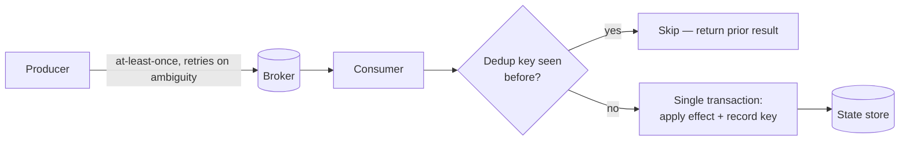
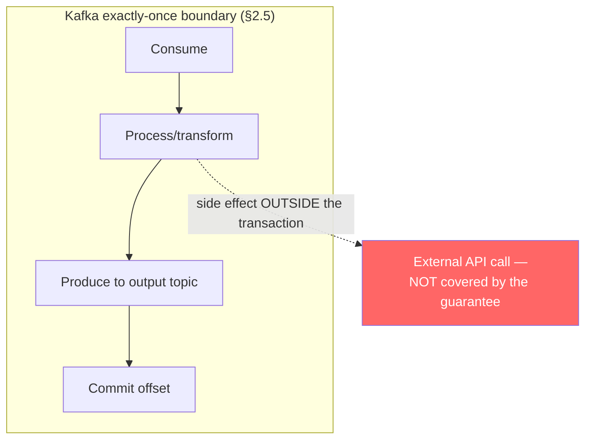
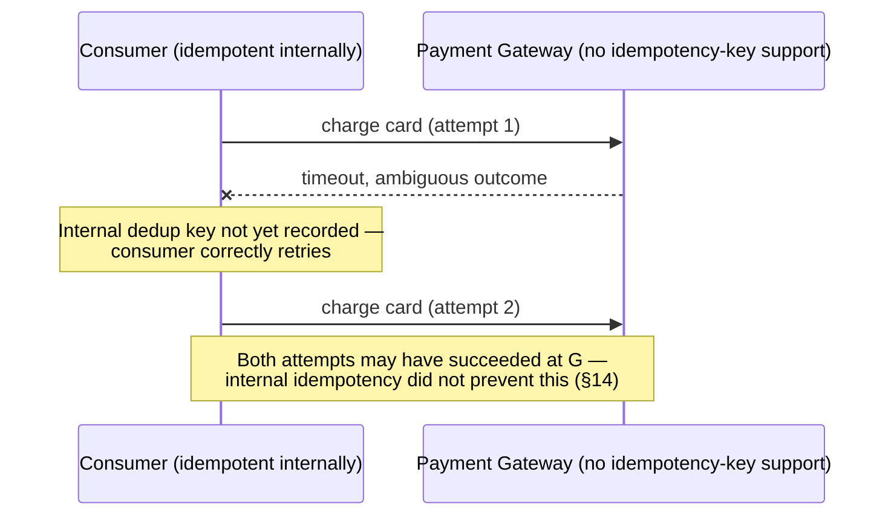
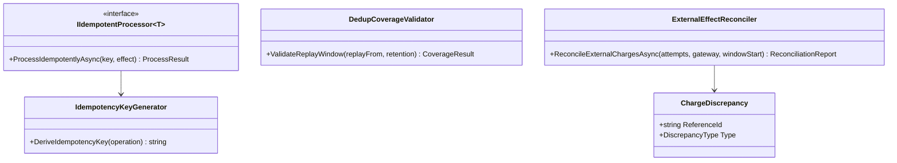

# Module 143 — Event-Driven Architecture: Idempotency, Exactly-Once Processing & Deduplication at Scale

> Domain: Event-Driven Architecture | Level: Beginner → Expert | Prerequisite: [[02-Schema-Evolution-Ordering-DeliverySemantics-DLQ]] §2.4 (at-least-once delivery and "the reality of exactly-once" — this module is the dedicated deep treatment §2.4 explicitly deferred), [[../36-Saga/01-SagaFundamentals-OrchestrationVsChoreography-CompensatingTransactions]] (mandatory idempotency at every saga step and compensation — extended here to its full mechanics), [[../14-System-Design/11-Designing-Order-Management-Trade-Lifecycle]] §4 (the per-session-scoped ExecID incident — the canonical example of a deduplication key scoped wrong)

>
> **Scope note:** Fourth of six modules extending `18-Event-Driven-Architecture` toward its stated 8-module extra-depth scope. Full 16-section template; Elite FinTech Interview Panel lens.

---

## 1. Fundamentals

**What:** How a consumer processes each logically-distinct event exactly once in its *effect*, given that the delivery mechanism underneath it — the broker, the network, the producer's retry logic — guarantees only *at-least-once delivery*, meaning the same event can, and eventually will, arrive more than once.

**Why:** Module 44 §2.4 named the reality plainly: "exactly-once delivery" is not a property most brokers actually provide end-to-end, and chasing it at the delivery layer is the wrong target. The achievable and sufficient goal is **effectively-once processing** — at-least-once delivery combined with an idempotent consumer, producing the same observable outcome as true exactly-once without requiring the delivery guarantee itself. This module is the dedicated treatment of what that combination actually requires, because "make the consumer idempotent" is easy to say and has several distinct, easy-to-get-wrong mechanics underneath it.

**When:** Any consumer whose processing has a side effect that is not naturally safe to repeat — writing state, calling an external system, sending a notification, moving money. A purely read-only, stateless consumer has nothing to deduplicate; almost no consumer in a financial system is purely that.

**How (30,000-ft view):**
```
Producer ──(at-least-once, retries on ambiguous failure)──► Broker ──► Consumer
                                                                            │
                                                              Has this idempotency key
                                                              been processed before?
                                                                    │           │
                                                                   Yes          No
                                                                    │           │
                                                              Skip / return   Process + record key
                                                              prior result    atomically with the effect
```

---

## 2. Deep Dive

### 2.1 Why "Exactly-Once Delivery" Is Not the Right Target
Delivering a message exactly once end-to-end requires the producer, broker, and consumer to agree on delivery state across a network that can partition, delay, or duplicate at any point — and the producer itself cannot know whether an unacknowledged publish failed before or after the broker received it, so its only safe option under ambiguity is to retry, which is itself a duplicate. Some brokers offer "exactly-once semantics" (Kafka's idempotent producer plus transactional writes) but, as §2.5 details, this covers a narrower guarantee than the name suggests. The consequence: **delivery will duplicate, and the system must be designed for that as a normal condition, not an edge case.**

### 2.2 Idempotency Key Design — What Makes a Key Correct
An idempotency key must uniquely identify the *logical operation*, not merely the *message*. Three requirements, each independently necessary:
- **Uniqueness within its actual scope.** Module 131 §4's incident is the canonical failure: an `ExecID` was globally unique *in specification* but scoped per-session *in practice*, so after a session restart a genuinely new fill bearing a previously-seen `ExecID` was silently discarded by correctly-functioning deduplication. The key's scope must match the counterparty's or system's *actual* behavior, not its stated guarantee.
- **Stability across retries.** A key generated fresh on each retry (e.g., from a local timestamp or a new GUID per attempt) defeats deduplication entirely, since every retry looks like a new operation. The key must be generated once, at the point the operation is first initiated, and carried unchanged through every retry.
- **Derivable independently by both sides where possible.** A key that only the producer can regenerate (not deterministically reconstructable from the operation's content) cannot be used by a consumer to detect a duplicate arriving via a different path — e.g., after a producer restart that lost its own retry state. A content-derived key (a hash of the immutable parts of the operation) survives this; an arbitrarily-assigned key does not unless it is itself durably persisted before the first attempt.

### 2.3 The Dedup Store Must Be Transactionally Co-Located With the Effect
The most common idempotency bug is architecturally correct-looking and practically broken: check the dedup store, see the key is absent, process the event, then write the key to the dedup store as a separate step. Between "process" and "record," a crash leaves the effect applied with no record of it — the next delivery of the same event reprocesses it, duplicating the effect. This is the exact "dual write" problem Module 111/125's Outbox pattern exists to solve, applied to consumption instead of production: **the dedup-key write and the state-changing effect must occur in the same atomic transaction**, or via an equivalent mechanism (a single database transaction covering both, or the dedup key encoded as a natural uniqueness constraint on the effect's own row).

### 2.4 The Dedup Store Needs Retention Too — And a Boundary Just Like Module 141's
A dedup store that never expires entries grows unboundedly (Module 125 §4's exact table-growth failure, recurring at the consumer layer). It needs a retention policy — but retention here has the identical shape as Module 141 §2.2's boundary: **the dedup retention window must exceed the maximum realistic redelivery window**, or an event redelivered after the key has expired will be silently reprocessed as if new. A backfill, a long consumer outage, or a replay from an earlier offset are all realistic redelivery windows that can exceed a dedup TTL sized only for "normal" retry timing (§4's incident).

### 2.5 What Kafka-Style "Exactly-Once Semantics" Actually Guarantees
Idempotent producers (deduplicating retries at the broker via a producer ID and sequence number) plus transactional writes (atomically committing a consume-process-produce cycle across multiple partitions, including offset commits) together guarantee that **internal state transformations within the broker-and-consumer-group boundary happen exactly once**. This is a real and valuable guarantee for stream processing (Module 140's stateful operations) where the entire computation stays inside that boundary. It guarantees **nothing** about a side effect outside that boundary — an HTTP call to a payment gateway, a write to an external database, an email sent — because those systems have no visibility into the Kafka transaction and cannot be rolled back if the transaction later aborts, nor deduplicated by it if the transaction commits after the external call has already fired twice. Confusing "exactly-once semantics" (a specific, scoped Kafka guarantee) with "my consumer's side effects happen exactly once" is the single most consequential misunderstanding in this domain, and is §14's incident.

### 2.6 Internal Idempotency vs. External Idempotency Are Different Problems
A consumer can be perfectly idempotent about its *own* state (§2.3's transactional dedup store correctly prevents a duplicate local write) while still producing a duplicate *external* effect, if that effect is a call to a system that does not itself support an idempotency key. The consumer's retry — safe from its own perspective, since it would just re-check the dedup store and see the key already recorded, or the state-changing part is what's gated — is not what causes the problem; the problem is a side effect issued *before* the dedup-protected state write, or a side effect to a system with no dedup mechanism of its own, so retrying that specific call is unsafe regardless of how correct the consumer's internal bookkeeping is. External idempotency requires the downstream system to itself accept and honor an idempotency key (as major payment networks and gateways do via an `Idempotency-Key` header or equivalent) — where it doesn't, the consumer must either accept the residual duplication risk, add a synchronous existence-check before calling (itself race-prone without the downstream's cooperation), or restructure to make the call idempotent by construction (e.g., "set balance to X" rather than "add X to balance").

---

## 3. Visual Architecture







---

## 4. Production Example

**Problem:** A settlement-instruction consumer processed enrichment events and posted resulting ledger entries, protected by a dedup store keyed on event ID, transactionally co-located with the ledger write per §2.3 — a genuinely well-built idempotent consumer by every standard check the team had used.

**Architecture:** Dedup keys retained for 14 days, sized against the team's historical maximum observed redelivery delay of roughly 6 days from prior incidents, with headroom judged more than sufficient.

**Implementation:** A data-quality issue required reprocessing three months of historical settlement events through the same consumer pipeline via a backfill job — replaying events from long-retained archival storage (Module 44 §2.6's replay capability, being used exactly as intended for a legitimate correction).

**Trade-offs:** Reusing the existing consumer for the backfill, rather than building a separate one-off script, was chosen deliberately — it guaranteed the backfill applied identical business logic to the original processing, avoiding the risk of a hand-written script silently diverging from production logic.

**Lessons learned:** The backfill replayed events up to three months old. The dedup store's 14-day retention meant every dedup key for events older than 14 days had already expired and been purged — the store had no record that these events were ever processed the first time. The idempotent consumer, checking correctly against a dedup store that legitimately contained no matching key, correctly concluded each replayed event was new and correctly reprocessed it, posting a second ledger entry for every one of roughly 40,000 already-settled instructions.

Nothing in the consumer malfunctioned. Every component behaved exactly as designed: the dedup check ran, found no key, and the transactional write proceeded — precisely the intended behavior for a genuinely new event. The dedup mechanism's correctness was scoped to redeliveries within its retention window, and a backfill is a redelivery *outside* any window sized for normal operational retry timing, a distinction the design had never made explicit.

Detection came from an end-of-day ledger reconciliation flagging a doubling in entry volume against the expected historical baseline for the backfill date range — not from any error, alert, or consumer-level signal, since none had fired.

The fix had two parts. **First**, the dedup key's uniqueness was redefined to be derivable from the settlement instruction's own immutable content (§2.2's content-derived key) rather than relying solely on a store lookup, and the ledger-write path added a database-level uniqueness constraint on the derived key directly on the ledger table — making a duplicate posting structurally impossible regardless of dedup-store retention, not merely unlikely. **Second**, any backfill or replay operation now requires an explicit pre-flight check confirming the dedup mechanism's effective coverage for the full time range being replayed, treating dedup-store retention as a parameter that must be validated against the operation being performed, not assumed sufficient by default.

The generalizable lesson: **a dedup store's retention window is a boundary exactly like Module 141's retention boundary — safe for the traffic pattern it was sized against, and silently insufficient for any redelivery pattern (a backfill, a long outage, a deliberate replay) that exceeds it**, and the fix that survives this class of incident is a dedup mechanism whose correctness does not depend on retention at all wherever that's achievable.

---

## 5. Best Practices
- Derive idempotency keys from the operation's immutable content where possible, not from a retry-generated or store-only identifier (§2.2, §4's fix).
- Write the dedup key and the state-changing effect in one atomic transaction (§2.3).
- Enforce deduplication structurally where possible — a database uniqueness constraint on the effect's own row — rather than relying solely on a separate dedup-store check (§4's fix).
- Size dedup retention against the *worst* realistic redelivery window (backfill, replay, long outage), not typical retry timing, and validate it explicitly before any replay operation (§2.4, §4).
- Treat Kafka-style "exactly-once semantics" as scoped strictly to the broker-and-consumer-group boundary, never assumed to cover external side effects (§2.5).
- For external calls without native idempotency-key support, restructure toward idempotent-by-construction operations ("set to X") rather than accepting duplication risk on additive ones ("add X") (§2.6).

## 6. Anti-patterns
- Checking a dedup store and writing its effect as two separate, non-transactional steps (§2.3).
- Sizing dedup retention against normal retry timing without considering backfill or replay windows (§4's incident).
- Assuming "exactly-once semantics" (a Kafka-specific, internally-scoped guarantee) protects external side effects (§2.5, §14).
- Generating a fresh idempotency key on every retry attempt, defeating deduplication entirely (§2.2).
- Trusting a counterparty's documented uniqueness guarantee for a key without verifying its actual operational scope (§2.2, Module 131 §4).
- Treating "the consumer is idempotent" as a single binary fact rather than two distinct properties — internal-state idempotency and external-effect idempotency — that must each be verified separately (§2.6).

---

## 7. Performance Engineering

**CPU/Memory:** Dedup-store lookups add a read (and, on new keys, a write) to every message's processing path; a poorly-indexed dedup store becomes the dominant per-message cost at scale, particularly once its retention window makes it large.

**Latency:** The dedup check is on the critical path for every message; a content-derived key (§2.2) avoids an extra round trip to fetch a producer-assigned key but requires deterministic, cheap-to-compute hashing of the operation's immutable fields.

**Throughput:** A dedup store implemented as a single hot table with high write contention on insert can itself become a bottleneck, particularly for high-partition-count consumers writing concurrently; partitioning the dedup store by the same key as the underlying data avoids contention.

**Scalability:** Retention-bounded dedup stores (§2.4) keep the table size proportional to the redelivery window rather than to total historical volume, which is what keeps lookup performance from degrading as the system ages — unbounded stores degrade exactly as Module 125 §4's outbox table did.

**Benchmarking:** Benchmark dedup-check latency specifically under the store's *maximum* expected size (at the edge of its retention window), not an empty or lightly-populated table, since that is the condition production actually runs under most of the time.

**Caching:** A short-lived in-memory cache of recently-seen keys can absorb the common case (duplicate arriving within seconds, from producer retry) without hitting the durable store, provided the durable store remains the authority for anything the cache has evicted.

---

## 8. Security

**Threats:** A predictable or guessable idempotency key allows an attacker to pre-empt a legitimate operation by submitting a duplicate with the same key first, potentially suppressing or redirecting the real operation's effect depending on how "already processed" is handled. External-system duplication (§2.6, §14) is itself a financial-integrity risk — a double charge — independent of any malicious actor.

**Mitigations:** Idempotency keys derived from content the requester cannot forge without also being authorized to perform the underlying operation; rate-limiting and authorization checks applied *before* the dedup check, not after, so a dedup-key collision attempt cannot be used to probe for the existence of another user's operation.

**OWASP mapping:** Insecure Direct Object Reference-adjacent risk if a dedup key's "already processed" response leaks information about another party's operation; broken authorization if dedup-key collision is checked before authorization rather than after.

**AuthN/AuthZ:** The dedup check must be scoped per-authorized-principal where the operation itself is principal-scoped, so one party cannot collide with or observe another's idempotency key space.

**Secrets:** Not directly applicable; standard handling for any credentials used in external-effect calls (§2.6).

**Encryption:** Dedup-store entries may contain enough operation content to be sensitive (§2.2's content-derived keys) and should be protected at the same classification as the underlying data.

---

## 9. Scalability

**Horizontal scaling:** The dedup store should be partitioned consistently with the underlying data's partitioning, so a dedup check never requires a cross-partition lookup on the hot path.

**Vertical scaling:** Helps dedup-store write throughput under contention where the bottleneck is local rather than cross-partition.

**Caching:** §7 — short-lived in-memory cache for the common near-immediate-retry case, backed by the durable store as authority.

**Replication/Partitioning:** Co-partition the dedup store with the effect it protects (§7); a dedup store partitioned differently from the state it guards reintroduces the transactional co-location problem §2.3 solves, since a cross-partition transaction is generally unavailable or expensive.

**Load balancing:** Not the dedup store's direct concern; standard consumer-group balancing applies.

**High Availability:** The dedup store's availability must match the effect's availability requirement — if the state write can proceed but the dedup check cannot, the consumer must fail closed (refuse to process without a verified dedup check) rather than proceed unprotected, since proceeding without the check reintroduces exactly the duplication risk the mechanism exists to prevent.

**Disaster Recovery:** Dedup-store retention (§2.4) is itself a DR-adjacent parameter — a restore from backup or a cross-region failover (Module 142) that loses recent dedup entries reintroduces exactly Module 142 §4's shape of risk, now for duplicate processing rather than lost processing.

**CAP theorem:** A dedup check under network partition must choose: block until consistency is restored (favoring correctness, delaying processing) or proceed optimistically and reconcile later (favoring availability, risking a duplicate) — for financially consequential effects, blocking is usually the correct default, mirroring Module 118's CP-favoring risk-check precedent.

---

## 10. Interview Questions

### Basic (10)

1. **Q: What is "effectively-once" processing, and how does it differ from "exactly-once delivery"?**
   **A:** Effectively-once processing is at-least-once delivery combined with an idempotent consumer, producing the same observable outcome as true exactly-once without requiring the delivery mechanism itself to guarantee no duplicates — which most brokers cannot honestly provide end-to-end (§2.1).
   **Why correct:** Distinguishes the achievable combination from the harder-to-guarantee delivery property.
   **Common mistakes:** Believing "exactly-once delivery" is a solved, broadly-available broker guarantee rather than a narrow, specific one (§2.5).
   **Follow-ups:** "Why can't delivery alone guarantee no duplicates?" (A producer cannot know if an unacknowledged publish succeeded, so it must retry under ambiguity — which is itself a duplicate, §2.1.)

2. **Q: What three properties must a correct idempotency key have?**
   **A:** Uniqueness within its actual operational scope (not just its stated specification), stability across retries of the same logical operation, and ideally independent derivability from the operation's own content (§2.2).
   **Why correct:** Names all three requirements.
   **Common mistakes:** Generating a fresh key on every retry attempt, which defeats deduplication regardless of the key's uniqueness.
   **Follow-ups:** "Give an example of a key unique in specification but not in practice." (Module 131 §4's per-session-scoped `ExecID`, treated as globally unique.)

3. **Q: Why must the dedup-key write and the state-changing effect happen in one transaction?**
   **A:** If they are separate steps, a crash between them leaves the effect applied with no record it happened, so the next delivery reprocesses it — the same dual-write problem the Outbox pattern solves for production, here applied to consumption (§2.3).
   **Why correct:** States the crash window and its consequence.
   **Common mistakes:** Checking the dedup store, then processing, then writing the key as three separate steps, assuming this is equivalent to a single transaction.
   **Follow-ups:** "What's a structural alternative to a separate dedup store?" (A uniqueness constraint on the effect's own row, making duplication impossible rather than merely checked, §4's fix.)

4. **Q: Why does a dedup store need a retention policy?**
   **A:** An unbounded dedup store grows forever, degrading lookup performance — the same table-growth failure Module 125 §4 found in the Outbox relay, recurring at the consumer layer (§2.4).
   **Why correct:** States the growth problem and its precedent.
   **Common mistakes:** Assuming a dedup store is small enough not to matter, without projecting its growth over the system's actual lifetime.
   **Follow-ups:** "What must retention exceed?" (The maximum realistic redelivery window — including backfills and replays, not just normal retry timing, §2.4, §4.)

5. **Q: What does Kafka's "exactly-once semantics" actually guarantee?**
   **A:** That internal state transformations within the broker-and-consumer-group transactional boundary happen exactly once — it says nothing about side effects outside that boundary, such as an external API call (§2.5).
   **Why correct:** Correctly scopes the guarantee to the internal boundary.
   **Common mistakes:** Assuming enabling Kafka's exactly-once configuration makes any external side effect in the consumer automatically safe from duplication.
   **Follow-ups:** "What is unprotected as a result?" (Any external call — a payment, an email, a write to a non-transactional system — issued from within the processing, §2.5, §14.)

6. **Q: Why are internal idempotency and external idempotency different problems?**
   **A:** A consumer can correctly deduplicate its own state (§2.3) while still calling an external system twice, if that system has no idempotency-key mechanism of its own to honor — the consumer's internal correctness doesn't make the external call itself safe to repeat (§2.6).
   **Why correct:** States why local correctness doesn't imply external correctness.
   **Common mistakes:** Treating "the consumer is idempotent" as a single fact rather than two properties that must be verified separately.
   **Follow-ups:** "How is external idempotency achieved?" (The downstream system must itself accept an idempotency key, or the operation must be restructured to be idempotent by construction, §2.6.)

7. **Q: What went wrong in §4's incident, at a high level?**
   **A:** A legitimate three-month backfill replayed events far older than the dedup store's 14-day retention, so their dedup keys had already expired; the consumer correctly found no matching key and correctly reprocessed each event, posting roughly 40,000 duplicate ledger entries with no error anywhere (§4).
   **Why correct:** States the retention-window mismatch and its consequence.
   **Common mistakes:** Attributing this to a bug in the dedup mechanism, when it operated exactly as designed for a redelivery window it was never sized to cover.
   **Follow-ups:** "What structural fix survives regardless of retention?" (A database uniqueness constraint on the derived key directly on the ledger table, §4's fix.)

8. **Q: Why is "add X to balance" a riskier operation than "set balance to X" under possible duplication?**
   **A:** "Add" is not idempotent by construction — applying it twice changes the outcome — while "set" produces the same final state regardless of how many times it is applied, making it safe even without a working dedup mechanism (§2.6).
   **Why correct:** Contrasts additive and absolute operations by their behavior under repetition.
   **Common mistakes:** Assuming all operations are equally risky under duplication, when their algebraic structure differs.
   **Follow-ups:** "When is 'set' not available as an option?" (When the correct final value depends on concurrent operations from elsewhere, requiring a true additive operation — which then needs dedup protection it cannot avoid by restructuring alone.)

9. **Q: Why must a consumer fail closed if its dedup check is unavailable?**
   **A:** Proceeding to apply the effect without a verified dedup check reintroduces exactly the duplication risk the mechanism exists to prevent — availability of the effect's write path does not imply the dedup guarantee still holds (§9).
   **Why correct:** States the risk of decoupling the effect from its protection mechanism.
   **Common mistakes:** Treating the dedup check as an optional optimization that can be skipped under its own unavailability rather than a required precondition.
   **Follow-ups:** "What's the cost of failing closed?" (Processing halts or delays during dedup-store unavailability — an availability trade accepted for correctness, mirroring Module 118's CP-favoring precedent.)

10. **Q: Why should a backfill or replay operation require a pre-flight dedup-coverage check?**
    **A:** Because dedup retention is sized against normal operational redelivery timing, and a backfill or replay can easily exceed that window, silently reprocessing events the dedup store no longer has any record of (§4's fix).
    **Why correct:** Connects the check directly to the retention-window mismatch §4 exposed.
    **Common mistakes:** Reusing the production consumer for a backfill without verifying its dedup mechanism actually covers the backfill's time range.
    **Follow-ups:** "What if the coverage check fails?" (Either extend retention temporarily for the backfill window, or rely on the structural fix — a uniqueness constraint independent of retention, §4.)

### Intermediate (10)

1. **Q: Walk through why §4's incident wasn't caused by a bug.**
   **A:** Every component behaved exactly as designed: the dedup check correctly queried the store, correctly found no matching key (because the key had legitimately expired per the retention policy), and correctly proceeded to process what looked, by every available signal, like a new event. The failure was in the *scope mismatch* between the retention policy's assumption (normal retry timing) and the actual redelivery pattern (a three-month backfill) — a design gap, not an implementation defect.
   **Why correct:** Locates the failure in a scope assumption rather than in faulty code.
   **Common mistakes:** Searching for a code-level bug in the dedup check logic, when the logic was correct for the condition it was designed against.
   **Follow-ups:** "What kind of testing would have caught this before production?" (A test replaying events older than the retention window specifically — most idempotency tests validate near-immediate retries, not long-delayed redelivery.)

2. **Q: Design the database-level structural fix §4's remediation added.**
   **A:** A uniqueness constraint on the ledger table itself, keyed on the settlement instruction's content-derived identifier (§2.2), so that even if the dedup-store check is bypassed, expired, or simply wrong, the database itself physically rejects a second insert for the same logical operation — converting a probabilistic protection (a store that might not have the key) into a structural guarantee (the database cannot hold two rows with the same key) (§4).
   **Why correct:** Specifies the mechanism and explains why it is stronger than the store-based check alone.
   **Common mistakes:** Treating the uniqueness constraint as redundant with the dedup store rather than as a deliberately independent, stronger layer.
   **Follow-ups:** "What must the consumer do when the constraint rejects a duplicate insert?" (Catch the constraint violation and treat it as confirmation the operation was already applied — the same outcome as a dedup-store hit, reached by a different mechanism.)

3. **Q: A team argues that Kafka's transactional producer makes their consumer's payment-gateway call safe from duplication. Evaluate.**
   **A:** Incorrect — the transactional guarantee covers the consume-process-produce-commit cycle within Kafka's boundary, not an HTTP call to an external gateway issued during processing. If the transaction aborts after the gateway call has already fired, the call cannot be rolled back; if the transaction retries after an ambiguous outcome, the call may fire again with no protection from Kafka at all. The gateway call needs its own idempotency mechanism entirely independent of the Kafka transaction (§2.5, §2.6).
   **Why correct:** Precisely scopes what the transactional guarantee covers and identifies the specific gap.
   **Common mistakes:** Conflating "the Kafka processing is transactional" with "everything that happens during processing is protected."
   **Follow-ups:** "How would you make the gateway call safe?" (Use the gateway's own idempotency-key support if available, or restructure to check-then-conditionally-call within the same transactional boundary as the dedup record, accepting the residual race if the gateway offers no cooperation, §2.6.)

4. **Q: Why is a content-derived idempotency key generally preferable to a producer-assigned one?**
   **A:** A content-derived key (a deterministic hash or composition of the operation's immutable fields) can be independently reconstructed by the consumer or by any downstream system without depending on the producer having durably persisted and correctly retransmitted an assigned identifier — surviving producer restarts, retry-state loss, or even a different producer resubmitting the same logical operation (§2.2, §4's fix).
   **Why correct:** Identifies the independence property that makes content-derived keys more resilient.
   **Common mistakes:** Assuming a producer-assigned GUID is always safe, when its safety depends entirely on the producer's own retry-state durability.
   **Follow-ups:** "When is a producer-assigned key still necessary?" (When the operation has no stable immutable content to hash — e.g., a request whose only distinguishing feature is arrival timing — though this is itself often a sign the operation needs better identity design.)

5. **Q: Critique in-memory-only deduplication (no durable store) for a consumer processing regulated financial events.**
   **A:** It protects against near-immediate duplicate delivery within a single consumer instance's uptime but loses all protection on restart, deployment, or rebalance — exactly the conditions under which redelivery is most likely, since rebalances and restarts are common triggers for at-least-once redelivery in the first place. For regulated events, durable dedup protection is not optional; the failure mode (double-processing across a restart) is common, not rare (§2.3, §9).
   **Why correct:** Identifies that in-memory dedup fails precisely during the events most likely to cause redelivery.
   **Common mistakes:** Treating in-memory caching (§7) as sufficient protection rather than as a latency optimization layered on top of durable protection.
   **Follow-ups:** "What's the correct role for an in-memory cache here?" (A fast-path check backed by the durable store as authority — absorbing the common near-immediate-retry case without weakening the guarantee, §7.)

6. **Q: How does dedup-store partitioning interact with transactional co-location (§2.3)?**
   **A:** If the dedup store is partitioned differently from the effect it protects, the "single transaction" requirement becomes a cross-partition transaction, which is either unavailable or expensive depending on the datastore — so the dedup store must be co-partitioned with the underlying state by the same key, making the transaction local rather than distributed (§9).
   **Why correct:** Connects partitioning choice directly to whether §2.3's transactional requirement is achievable cheaply.
   **Common mistakes:** Designing the dedup store's partitioning independently of the data it protects, discovering the cross-partition transaction cost only under load.
   **Follow-ups:** "What if co-partitioning isn't possible?" (A two-phase or saga-style commit across the boundary, accepting more complexity and a brief window of inconsistency — Module 123's saga discipline applied at the dedup layer.)

7. **Q: Why does §4's fix (a database uniqueness constraint) not eliminate the need for a dedup store entirely?**
   **A:** The uniqueness constraint prevents a duplicate *row* from being written but doesn't, by itself, tell the consumer *before* attempting the write that the operation was already processed, nor does it help for effects that aren't naturally expressible as a single uniquely-keyed row (a multi-step process, an external call). The dedup store remains useful as the fast, general-purpose check; the constraint is a structural backstop for the specific case it protects, not a full replacement (§4).
   **Why correct:** Distinguishes the constraint's narrower structural guarantee from the store's broader, faster-path role.
   **Common mistakes:** Removing the dedup store after adding the constraint, losing the general protection for effects the constraint doesn't cover.
   **Follow-ups:** "Give an example the constraint alone wouldn't protect." (A consumer whose effect is an external API call plus a local write — the constraint protects the local write, not the external call, which is exactly §14's gap.)

8. **Q: How should idempotency interact with Module 123's saga compensation steps specifically?**
   **A:** Compensations need the same treatment as forward steps — a compensation retried after an ambiguous failure must not compensate twice (e.g., refunding twice), so compensating actions need their own idempotency keys, transactionally co-located with their own effects, following the identical discipline as forward processing. Module 123 established this as a requirement; this module supplies the concrete mechanics (§2.2–§2.3) for satisfying it correctly.
   **Why correct:** Connects the saga requirement to the specific mechanics that implement it.
   **Common mistakes:** Idempotency-protecting forward saga steps carefully while treating compensations as simpler or lower-risk, when they carry the identical duplication risk.
   **Follow-ups:** "What idempotency key would a compensation use?" (Typically derived from the original operation's key plus a compensation marker, so it's distinguishable from the forward operation but still stable across compensation retries.)

9. **Q: A consumer's dedup check adds meaningful latency to every message under peak load. How would you address this without weakening the guarantee?**
   **A:** Add the in-memory fast-path cache from §7/Intermediate Q5 for the common case (near-immediate duplicate from producer retry), backed by the durable, transactionally-co-located check as authority for anything not in the cache — this reduces average-case latency without ever relying on the cache as the sole protection, since cache eviction or instance restart falls back correctly to the durable path.
   **Why correct:** Layers an optimization without removing the durable guarantee underneath it.
   **Common mistakes:** Replacing the durable check with the cache to gain speed, silently reintroducing §2.3's crash-window risk.
   **Follow-ups:** "What invalidates the cache incorrectly?" (Nothing should — the cache is additive and read-through to the durable store; the risk is only in treating a cache miss as proof of non-duplication rather than as "check the durable store.")

10. **Q: Synthesize how this module completes Module 44 §2.4's deferred treatment.**
    **A:** Module 44 named the reality — "exactly-once" is mostly a myth at the delivery layer, and at-least-once plus idempotent consumption is the achievable substitute — but didn't detail the mechanics. This module supplies them: key design that survives real-world scoping mismatches (§2.2, echoing Module 131 §4), transactional co-location closing the dual-write gap (§2.3), retention sized against realistic redelivery including backfills (§2.4, §4), and the precise boundary of what broker-level "exactly-once semantics" actually covers versus what remains the consumer's own responsibility (§2.5, §2.6).
    **Why correct:** Names each mechanic and ties it back to the specific gap it closes from the deferred treatment.
    **Common mistakes:** Treating "idempotent consumer" as fully specified by Module 44's brief mention, missing the several independently-failable mechanics underneath it.
    **Follow-ups:** "Which mechanic is most often skipped in practice?" (Retention sizing against realistic redelivery — §4 shows teams routinely size it against normal retry timing and discover the gap only during a backfill.)

### Advanced (10)

1. **Q: Diagnose §4's incident and design the complete structural fix.**
   **A:** Root cause: dedup-store retention (14 days) sized against normal retry timing, insufficient for a legitimate three-month backfill, so expired keys caused correct-looking reprocessing of ~40,000 already-settled instructions with no error anywhere. Fix: (1) a database uniqueness constraint on the ledger table keyed on a content-derived identifier, making duplication structurally impossible independent of dedup-store state (Intermediate Q2); (2) mandatory pre-flight dedup-coverage validation before any backfill or replay operation, checking the operation's time range against effective retention (Basic Q10); (3) idempotency keys redefined as content-derived rather than relying on store presence alone (§2.2); (4) reconciliation — which is what actually caught this — retained as a permanent backstop per Module 122 §14's established principle that reconciliation must remain a permanent, not migration-period-only, safeguard.
   **Why correct:** Addresses the structural gap, the operational process gap, the key-design gap, and retains the detection backstop.
   **Common mistakes:** Extending dedup retention indefinitely as the fix, which reintroduces Module 125 §4's unbounded-growth problem instead of solving the underlying scope mismatch.
   **Follow-ups:** "Why is the uniqueness constraint the most important single fix?" (It removes the failure mode's dependency on retention entirely — no retention window, however generous, would have prevented the incident as reliably as a structural constraint.)

2. **Q: A team proposes eliminating the dedup store and relying solely on database uniqueness constraints everywhere. Evaluate.**
   **A:** Works cleanly for effects naturally expressible as a single uniquely-keyed row insert, but fails for multi-step effects, external calls (§2.6), or operations that update rather than insert (where a uniqueness constraint on the row doesn't prevent a second update from a duplicate delivery). The dedup store remains necessary as the general mechanism; constraints are a valuable structural backstop for the specific, common case of single-row inserts, not a universal replacement (Intermediate Q7).
   **Why correct:** Scopes the constraint's applicability precisely and identifies the cases it doesn't cover.
   **Common mistakes:** Generalizing from §4's specific success case (an insert-shaped ledger entry) to a universal claim about all idempotency protection.
   **Follow-ups:** "What about update-shaped effects?" (Idempotent-by-construction updates — Basic Q8's "set" rather than "add" — sidestep the need for dedup protection on that specific operation, where the business logic permits it.)

3. **Q: Design the idempotency approach for a consumer that calls a payment gateway with no idempotency-key support.**
   **A:** First, check whether the gateway's own API can be restructured toward idempotent-by-construction semantics (query-then-conditionally-act, if the gateway supports checking prior transaction state by a client-supplied reference). If not, accept the residual duplication risk explicitly and add a compensating control: a post-call reconciliation against the gateway's own transaction records, comparing internal dedup-protected attempts against what the gateway actually processed, catching any duplicate the internal protection couldn't prevent (§2.6, §14). This is the same "declared ≠ actual" pattern this course applies elsewhere — where a system genuinely cannot make a claim structurally true, the honest answer is a verified compensating control, not a false assurance.
   **Why correct:** Exhausts the structural options first and falls back to an explicit, verified compensating control rather than an unverified assumption of safety.
   **Common mistakes:** Declaring the consumer "idempotent" because its internal state handling is correct, without addressing the gateway call's residual risk at all.
   **Follow-ups:** "What would the reconciliation compare?" (Internal record of attempted charges against the gateway's own transaction log for the same time window and reference — a mismatch indicates either a missed charge or a duplicate.)

4. **Q: How should dedup-store retention interact with Module 142's cross-region replication?**
   **A:** If dedup state itself is region-local and not replicated, a regional failover (Module 142 §4) loses all dedup history for events processed shortly before the outage, and the failover's own resume strategy (timestamp-based replay, Module 142 §2.3) will redeliver events the destination region has no record of having already processed — reproducing this module's §4 incident, triggered by cross-region failover instead of a backfill. Dedup state for cross-region-failover-eligible consumers must itself be replicated, with the same RPO reasoning Module 142 §2.4 applies to the primary data.
   **Why correct:** Connects two independently-established failure mechanisms (dedup-retention gaps, cross-region RPO) and identifies their compounding interaction.
   **Common mistakes:** Replicating the primary state but treating dedup state as purely local, ephemeral bookkeeping not worth replicating.
   **Follow-ups:** "What if dedup-state replication itself lags during failover?" (Then the same RPO-driven gap applies recursively to the dedup store — favoring the structural uniqueness-constraint approach (Advanced Q1) as a backstop that doesn't depend on dedup-state replication being current.)

5. **Q: Critique using message timestamp as the sole basis for a dedup key.**
   **A:** A timestamp alone doesn't identify the operation — two genuinely distinct events can share a timestamp at sufficient granularity, and a retried delivery of the same event may carry a different timestamp if the producer regenerates it per attempt (violating §2.2's stability requirement). Timestamp is useful as part of a composite key or for windowing, never as the sole discriminator of operation identity.
   **Why correct:** Identifies both the collision risk and the stability violation.
   **Common mistakes:** Using timestamp for convenience when content-derived fields are available and more correct.
   **Follow-ups:** "When is timestamp a legitimate component of a composite key?" (Combined with a stable business identifier, to distinguish genuinely repeated operations on the same entity at different times — e.g., entity ID plus event type plus a business-meaningful sequence number, not a technical send-time.)

6. **Q: A regulator asks how the firm ensures no settlement instruction is posted twice. Answer.**
   **A:** Describe the layered chain: content-derived idempotency keys stable across retries (§2.2), transactionally co-located dedup checks (§2.3), a database uniqueness constraint as a structural backstop independent of dedup-store state (Advanced Q1), retention validated explicitly against any replay or backfill operation before it runs (Basic Q10), and permanent reconciliation as the independent verification catching anything the preventive layers miss (Advanced Q1's point 4). Then state the residual honestly for any external, non-cooperating side effect: a compensating reconciliation against the external system's own records, since internal idempotency cannot structurally guarantee an uncooperative external call (Advanced Q3).
   **Why correct:** Gives the full layered chain and states the honest residual for the one case that can't be structurally closed.
   **Common mistakes:** Claiming duplication is impossible, when an uncooperative external dependency means the honest claim is "prevented and independently verified," not "prevented."
   **Follow-ups:** "What would change the external-call answer to a structural guarantee?" (The gateway adopting idempotency-key support — outside this firm's control, which is why the compensating reconciliation exists as the answer in the meantime.)

7. **Q: Apply this course's "declared ≠ actual" theme to idempotent consumers specifically.**
   **A:** The claim is "this consumer is idempotent." Its declared basis is usually a passing test suite exercising near-immediate duplicate delivery. §4 shows the claim was true for that tested condition and false for an untested one (redelivery beyond retention), and §14 shows a consumer can be genuinely, verifiably idempotent for its *internal* state while the claim is simply the wrong claim for an *external* side effect it also performs (§2.6) — the internal correctness doesn't generalize to the property actually needed. Both are instances of a narrower verified property being mistaken for the broader claim it resembles.
   **Why correct:** Identifies two distinct ways the claim can be narrower than it sounds — an untested redelivery window, and a scope mismatch between internal and external effects.
   **Common mistakes:** Treating "idempotent" as a single pass/fail property rather than a claim that must specify exactly which redelivery conditions and which effects it covers.
   **Follow-ups:** "How would you make the claim precise?" (State explicitly: idempotent for redeliveries within N days, for internal state only, with external effect E covered by a separate compensating control — a scoped claim rather than an unqualified one.)

8. **Q: Design the idempotency-coverage governance for backfill and replay operations across the organization.**
   **A:** A mandatory pre-flight step, before any backfill or replay runs against a production consumer, that checks: (1) the time range being replayed against the consumer's effective dedup coverage (Basic Q10); (2) whether the consumer's effects have a structural uniqueness backstop (Advanced Q1) independent of dedup-store state, in which case coverage gaps are lower-risk; (3) whether any external, non-idempotent side effects are triggered by the replayed events, requiring the compensating reconciliation from Advanced Q3/Q6 to be run afterward regardless of internal dedup coverage.
   **Why correct:** Covers the three genuinely distinct risk dimensions a replay operation touches.
   **Common mistakes:** Gating only on dedup-store retention (point 1), missing that a structural backstop can make a coverage gap survivable (point 2) while an external effect makes even full internal coverage insufficient (point 3).
   **Follow-ups:** "Who should own this gate?" (The platform or data-engineering team running the replay, in coordination with the consumer's owning team — neither alone has full visibility into both the replay's scope and the consumer's effect surface.)

9. **Q: How does idempotency interact with Module 140's stream-processing windowed aggregations?**
   **A:** A windowed aggregation's *inputs* need standard event-level idempotency (a duplicated input event should not be double-counted into the window), but the aggregation's *output* — the finalized window result — often needs its own separate idempotency treatment if it's re-emitted (e.g., on a late-data retraction, Module 140 §2.4), since a downstream consumer of the aggregate result needs to know whether a re-emitted window value replaces or adds to a prior one. Kafka's exactly-once semantics (§2.5) genuinely helps here, since the entire aggregation stays within its transactional boundary — this is the well-fitted case that guarantee was designed for, in contrast to §14's external-call case it was never meant to cover.
   **Why correct:** Distinguishes input-level and output-level idempotency needs for a windowed aggregation and correctly identifies where the Kafka guarantee genuinely applies.
   **Common mistakes:** Assuming windowed aggregation needs no additional idempotency treatment because Kafka's transactional guarantee is enabled, missing the output re-emission case.
   **Follow-ups:** "How should a downstream consumer treat a re-emitted window value?" (As a replacement keyed by entity-plus-window-start, per Module 140 §14's own established fix for a related conflation bug — idempotency and correct keying are related but distinct concerns.)

10. **Q: Synthesize the governance for idempotent processing across the organization.**
    **A:** (1) Content-derived, retry-stable idempotency keys as the default (§2.2). (2) Dedup checks transactionally co-located with their effects, never a separate check-then-act (§2.3). (3) Structural uniqueness constraints as a backstop wherever the effect is expressible as a uniquely-keyed row (Advanced Q1). (4) Dedup retention validated explicitly, not assumed, against any replay or backfill's actual time range (Advanced Q8). (5) External, non-cooperating side effects treated as a distinct risk category requiring compensating reconciliation, never assumed covered by internal idempotency or broker-level exactly-once semantics (§2.5, §2.6, Advanced Q3). (6) Compensation steps in sagas held to the identical discipline as forward steps (Intermediate Q8). (7) Permanent reconciliation retained regardless of how strong preventive controls appear, since it is what actually catches the gaps between them (Advanced Q1).
    **Why correct:** Covers key design, transactional mechanics, structural backstops, retention validation, external-effect risk, saga symmetry, and permanent verification as seven distinct, individually necessary controls.
    **Common mistakes:** Governing internal dedup mechanics thoroughly while leaving external side effects and backfill/replay operations ungoverned, which is where both this module's incidents actually occurred.
    **Follow-ups:** "Which is most often missing in practice?" (Explicit backfill/replay coverage validation — most teams build a genuinely correct dedup mechanism for normal operation and discover its retention-window assumption only during the first large-scale replay, §4.)

### Expert (10)

1. **Q: Evaluate whether "idempotent" should ever be used as an unqualified claim about a consumer.**
   **A:** No — Expert-level practice states the claim with its scope: which redelivery conditions it covers (normal retry timing versus arbitrary replay, §4), and which effects it covers (internal state versus external side effects, §2.6). An unqualified "this consumer is idempotent" is this module's own instance of the "declared ≠ actual" theme (Advanced Q7) — true for the tested condition, silently false outside it, and indistinguishable from the fully-true version until the untested condition actually occurs.
   **Why correct:** Insists on scoped claims and identifies why the unqualified version is structurally misleading rather than merely imprecise.
   **Common mistakes:** Accepting "idempotent" as a complete answer in a design review without asking for the specific scope.
   **Follow-ups:** "What should a design review specifically ask?" (The redelivery-window assumption and a list of every external effect with its own idempotency treatment named explicitly, Advanced Q8.)

2. **Q: How does this module's dedup-key scoping problem (§2.2) relate to Module 131 §4's `ExecID` incident at a structural level, beyond both being about keys?**
   **A:** Both are instances of the same category: **a uniqueness guarantee stated in a specification is trusted without verifying the actual operational scope it holds under.** Module 131's counterparty stated `ExecID` was unique; it was unique only per-session. This module's dedup keys are typically self-issued rather than externally stated, but the same failure recurs internally whenever a key's *assumed* scope (globally stable, covering all redelivery) exceeds its *actual* scope (retention-bounded, §4) — the discipline required is identical: verify the scope empirically, don't trust the documentation or the design intent.
   **Why correct:** Names the shared structural category — trusted-but-unverified scope — rather than treating the two incidents as merely thematically similar.
   **Common mistakes:** Treating the two incidents as coincidentally similar rather than as the same underlying discipline failure recurring at different layers (external counterparty specification versus internal retention policy).
   **Follow-ups:** "What's the general defense?" (Treat any uniqueness or scope claim — internal or external — as requiring empirical verification against actual behavior before being relied upon, not accepted from documentation alone.)

3. **Q: Design a dedup mechanism for a consumer whose effect must integrate with a legacy system that has no transactional capability at all — not even a uniqueness constraint option.**
   **A:** Where no structural backstop is available on the effect side, correctness must move entirely to the *verification* side: a durable, transactionally-protected local record of "attempted this operation with this key" (§2.3, protecting the local bookkeeping even though the downstream can't cooperate), combined with mandatory post-hoc reconciliation against the legacy system's own output for every attempt, and — critically — an explicit, documented acceptance that this consumer's guarantee is "detected and correctable duplication," not "prevented duplication," communicated to whoever owns the business risk rather than silently assumed to be the stronger guarantee.
   **Why correct:** Correctly identifies that when structural prevention is unavailable, the honest architecture is verified detection, not a false claim of prevention.
   **Common mistakes:** Building elaborate internal dedup logic against a legacy system that ignores idempotency keys entirely, producing false confidence rather than the honestly weaker guarantee actually achievable.
   **Follow-ups:** "Who should approve accepting this weaker guarantee?" (Whoever owns the business risk of the specific effect — a compliance or product owner, not an engineering decision made silently, mirroring §15's Option C precedent of an explicit per-stream decision.)

4. **Q: A post-mortem on §14's payment-gateway incident finds the consumer's internal dedup mechanism worked flawlessly — the internal ledger showed exactly one attempt recorded per operation, yet the gateway processed two charges for several operations. Explain the apparent contradiction.**
   **A:** No contradiction: the internal dedup mechanism deduplicates *retries the consumer itself initiates after observing a failure*, but the specific failure mode here was an *ambiguous* outcome — a timeout where the consumer could not tell whether the gateway had processed the charge before the timeout occurred. The consumer's retry, from its own perspective, was the *first* attempt at recording the dedup key (since the original attempt's outcome was unknown and hadn't been recorded as success), so its internal bookkeeping correctly shows one recorded attempt — while the gateway may have silently processed both the original, ambiguous call and the retry. Internal dedup protects against the consumer *re-initiating* a completed operation; it cannot protect against an operation whose completion status was never knowable to begin with.
   **Why correct:** Identifies that the internal mechanism's scope (protecting against duplicate initiation of a known-completed operation) doesn't cover the actual failure (ambiguous completion status).
   **Common mistakes:** Assuming a flawless internal record proves no duplication occurred, when the internal record only proves the consumer didn't knowingly repeat a confirmed-successful call.
   **Follow-ups:** "How would you close this specific gap?" (A gateway-side idempotency key is the only structural fix; absent that, a post-call status query before assuming failure — polling the gateway's own record rather than blindly retrying on ambiguous timeout — narrows but does not eliminate the window.)

5. **Q: How should idempotency-key retention be governed differently for a stream feeding a regulatory report (Module 133) versus one feeding an internal analytics dashboard?**
   **A:** The regulatory stream's retention must be sized against the full realistic range of correction and resubmission activity Module 133 itself establishes — potentially extending well beyond typical operational timeframes, since regulatory corrections can be requested long after original submission — while the analytics stream can reasonably use a much shorter window, since a duplicated analytics data point has bounded, non-compliance consequence. Retention sizing is not a single organizational default; it is a per-stream decision calibrated to the cost of the specific failure mode it prevents (§2.4, §15).
   **Why correct:** Ties retention sizing to the differentiated consequence of duplication for each stream type, rather than treating it as a uniform infrastructure parameter.
   **Common mistakes:** Applying one organization-wide dedup-retention default, under-protecting the regulatory stream and possibly over-engineering the analytics one.
   **Follow-ups:** "What governs the regulatory stream's specific window?" (Module 133's own established correction and resubmission timelines, which should directly parameterize this stream's dedup retention rather than the two being decided independently.)

6. **Q: Evaluate storing idempotency keys directly as part of the event's own schema (a self-declared key) versus deriving keys purely at the consumer.**
   **A:** A self-declared key, set by the producer at the point of original creation and carried through every retry and every downstream hop, is more robust than a consumer-derived key for any effect where the operation's identity isn't fully reconstructable from the event's own visible content at consumption time (e.g., the key needs to incorporate something about the *originating request* that isn't otherwise present in the resulting event). The trade-off is trust: the consumer must then trust the producer got key stability right (§2.2's requirement), shifting responsibility upstream rather than eliminating it. In practice, combining both — a producer-declared key validated where possible against consumer-derivable content — gives the strongest guarantee, catching a producer-side key-generation bug via the consumer-side check.
   **Why correct:** Weighs the robustness gain against the shifted trust dependency, and proposes the combined approach as strictly stronger than either alone.
   **Common mistakes:** Choosing one approach exclusively rather than recognizing they check different failure modes and are stronger combined.
   **Follow-ups:** "What producer-side bug would the consumer-side check catch?" (A producer regenerating a supposedly-stable key on retry due to a bug — the consumer-side content-hash check would flag the mismatch rather than silently trusting a broken declared key.)

7. **Q: How does this module's dedup discipline extend Module 121's Event Sourcing, where every event is by definition appended and never overwritten?**
   **A:** Event Sourcing's append-only log means a duplicated event is not merely a processing error but a permanent, replayable part of the historical record — Aggregate reconstruction (Module 121 §2.1) would replay the duplicate on every future rebuild, not just at the moment of the original failure. This makes deduplication *before* append, at the point of writing to the event store itself, more critical than in a non-event-sourced system where a duplicate write can potentially be corrected by a later compensating write — an event-sourced duplicate becomes a durable, structurally load-bearing part of the aggregate's history unless explicitly and carefully excised.
   **Why correct:** Identifies the elevated stakes of duplication specifically for an append-only, replay-based source of truth.
   **Common mistakes:** Treating dedup discipline as equally important across all persistence models, missing that Event Sourcing specifically amplifies the permanence of any duplication that slips through.
   **Follow-ups:** "How would you correct a duplicate that has already been appended to an event store?" (A compensating event explicitly marking the duplicate as void, rather than deletion — preserving the append-only guarantee while correcting the derived state, the same semantic-compensation principle Module 123 established for saga rollback.)

8. **Q: A cost-optimization review proposes removing the database uniqueness constraint from §4's fix, arguing the dedup store alone is sufficient now that retention has been fixed and pre-flight validation is in place. Evaluate.**
   **A:** The constraint is a structural, always-true guarantee independent of any process being followed correctly; the dedup store plus pre-flight validation is a set of *procedural* controls that depend on every future operator correctly running the validation step every time, indefinitely. Removing the structural backstop reintroduces single-point-of-process-failure risk for the sake of a marginal storage or performance saving on a constraint that, once added, has near-zero ongoing cost. This is a case where cost optimization is evaluated against process-reliance risk, not against the constraint's own resource cost, which is negligible.
   **Why correct:** Distinguishes structural guarantees from procedural controls and argues the marginal cost doesn't justify losing the stronger category of protection.
   **Common mistakes:** Evaluating the constraint purely on its storage/performance footprint, missing that its actual value is removing dependence on a human or process step being followed correctly every time.
   **Follow-ups:** "Is there ever a legitimate case to remove it?" (Only if the effect type changes such that a uniqueness constraint no longer applies — e.g., migrating from insert-shaped to update-shaped effects — not as a cost trade against an alternative that still relies on process correctness.)

9. **Q: How should idempotency testing be structured to catch what §4 and §14 missed?**
   **A:** Beyond the standard near-immediate-duplicate test, include: (1) a redelivery test at an interval exceeding dedup retention, verifying the structural backstop (not just the store) prevents duplication (§4's gap); (2) an ambiguous-failure test against any external effect, simulating a timeout with unknown downstream outcome and verifying the consumer's behavior is either safe by construction or produces a detectable discrepancy via reconciliation (§14's gap); (3) a replay-at-scale test replaying a full historical window through the consumer against a snapshot of expected state, catching aggregate-level duplication that a single-event test wouldn't surface.
   **Why correct:** Derives each test directly from a specific mechanism that failed in this module's two incidents, rather than proposing generic idempotency testing.
   **Common mistakes:** Testing only the fast-retry case, which is the one scenario idempotency mechanisms are almost never wrong about.
   **Follow-ups:** "Why is test (3) distinct from test (1)?" (Test (1) validates a single event beyond retention; test (3) validates that duplication *at volume* is caught by the aggregate-level detection — reconciliation — not just that any individual event is theoretically protected.)

10. **Q: Deliver the closing synthesis: what makes idempotency distinctively hard to get right, beyond "just check if you've seen it before"?**
    **A:** Three properties compound. First, **the check is only as good as its scope**, and scope has two independent dimensions that both fail silently when wrong — the redelivery window it's sized for (§4) and the effect boundary it actually covers, internal versus external (§14, §2.6). Second, **correctness at the mechanism level (the dedup check itself, done exactly right) does not imply correctness at the system level**, because the crash window between check and effect (§2.3), the ambiguity of external call outcomes (Expert Q4), and the permanence of duplication in an append-only store (Expert Q7) are all failure modes that a perfectly-implemented check alone doesn't close. Third, **the honest architecture is layered, not singular** — a content-derived key, a transactional check, a structural constraint, and permanent reconciliation each catch a different subset of failures, and no single layer is sufficient alone, which is why §4's actual detection came from reconciliation rather than from the dedup mechanism it was supposedly protecting. The Principal-level conclusion: idempotency is not a property a consumer either has or lacks — it is a claim with a specific, statable scope (Expert Q1), achieved by layered, independently-failable mechanisms, verified by a detection layer that assumes the prevention layers will eventually miss something.
    **Why correct:** Names three genuinely distinct compounding difficulties — dual-dimension scope, mechanism-versus-system correctness gap, and the necessity of layering — and states the actionable framing conclusion.
    **Common mistakes:** Treating idempotency as fully solved once a dedup-check mechanism is implemented and passes its immediate-retry test, missing that both incidents in this module occurred with a technically-correct mechanism in place.
    **Follow-ups:** "Which layer most often gets skipped first under delivery pressure?" (Permanent reconciliation — it looks like redundant work once the preventive mechanism is trusted, and both this module's incidents show it is the layer that actually caught the failure the trusted mechanism missed.)

---

## 11. Coding Exercises

### Easy — Content-Derived Idempotency Key (§2.2, §4's fix)
**Problem:** Derive a stable idempotency key from an operation's immutable content.
**Solution:**
```csharp
public string DeriveIdempotencyKey(SettlementInstruction instruction)
{
    var stableContent = $"{instruction.TradeId}|{instruction.SettlementDate:O}|{instruction.Amount}|{instruction.Currency}";
    using var sha256 = SHA256.Create();
    var hash = sha256.ComputeHash(Encoding.UTF8.GetBytes(stableContent));
    return Convert.ToHexString(hash);          // reconstructable by any party from the instruction's own content
}
```
**Time complexity:** O(1) per operation.
**Space complexity:** O(1).
**Optimized solution:** Include only fields that are guaranteed immutable for the operation's lifetime — a mutable field accidentally included would make retries of the "same" logical operation produce different keys, silently defeating deduplication (§2.2's stability requirement).

### Medium — Transactionally Co-Located Dedup Check (§2.3)
**Problem:** Apply an effect and record its dedup key atomically.
**Solution:**
```csharp
public async Task<ProcessResult> ProcessIdempotentlyAsync(string idempotencyKey, LedgerEntry entry)
{
    await using var tx = await _db.BeginTransactionAsync();

    var existing = await _db.QuerySingleOrDefaultAsync<LedgerEntry>(
        "SELECT * FROM ledger_entries WHERE idempotency_key = @Key FOR UPDATE",
        new { Key = idempotencyKey }, tx);

    if (existing is not null)
    {
        await tx.CommitAsync();
        return ProcessResult.AlreadyProcessed(existing);   // duplicate — no re-application
    }

    await _db.ExecuteAsync(
        "INSERT INTO ledger_entries (idempotency_key, ...) VALUES (@Key, ...)",
        new { Key = idempotencyKey, entry }, tx);           // effect + key in ONE transaction (§2.3)

    await tx.CommitAsync();
    return ProcessResult.Applied(entry);
}
```
**Time complexity:** O(1) per operation (indexed lookup plus insert).
**Space complexity:** O(1) per operation.
**Optimized solution:** Add a database-level uniqueness constraint on `idempotency_key` (§4's structural fix) so that even a race between two concurrent instances processing the same key concurrently is resolved by the database rejecting the second insert, rather than relying solely on the `SELECT ... FOR UPDATE` lock to serialize them.

### Hard — Retention-Aware Dedup Store With Coverage Validation (§2.4, §4)
**Problem:** Validate dedup coverage before a replay operation, and structurally protect against gaps.
**Solution:**
```csharp
public class DedupCoverageValidator
{
    public CoverageResult ValidateReplayWindow(DateTimeOffset replayFrom, TimeSpan dedupRetention)
    {
        var coverageBoundary = DateTimeOffset.UtcNow - dedupRetention;
        if (replayFrom < coverageBoundary)
        {
            return CoverageResult.Insufficient(
                gap: coverageBoundary - replayFrom,
                recommendation: "Rely on structural uniqueness constraint, not dedup-store coverage, for this range");
        }
        return CoverageResult.Sufficient();
    }
}

public async Task RunGatedReplayAsync(DateTimeOffset replayFrom, TimeSpan dedupRetention, IReplaySource source)
{
    var coverage = new DedupCoverageValidator().ValidateReplayWindow(replayFrom, dedupRetention);
    if (!coverage.IsSufficient)
        _logger.LogWarning(
            "Replay from {From} exceeds dedup-store coverage by {Gap} — relying on structural constraint only",
            replayFrom, coverage.Gap);          // proceed only because the structural backstop (§11 Medium) still protects

    await foreach (var evt in source.ReadFromAsync(replayFrom))
        await ProcessIdempotentlyAsync(DeriveIdempotencyKey(evt.Instruction), evt.ToLedgerEntry());
}
```
**Time complexity:** O(1) for validation; O(n) for the replay itself.
**Space complexity:** O(1) beyond the underlying replay stream.
**Optimized solution:** Require explicit operator acknowledgment (not just a log warning) before proceeding with a replay outside dedup-store coverage on any stream lacking a structural uniqueness backstop, escalating the check from advisory to blocking exactly where §4's incident shows the risk is real rather than theoretical.

### Expert — External-Effect Reconciliation for Non-Cooperating Downstream (Advanced Q3, Expert Q4)
**Problem:** Detect duplicate external side effects a cooperating downstream idempotency key cannot prevent.
**Solution:**
```csharp
public async Task<ReconciliationReport> ReconcileExternalChargesAsync(
    IEnumerable<InternalChargeAttempt> internalAttempts, IPaymentGatewayClient gateway, DateTimeOffset windowStart)
{
    var gatewayRecords = await gateway.GetTransactionsAsync(windowStart);   // gateway's own authoritative record
    var report = new List<ChargeDiscrepancy>();

    foreach (var attempt in internalAttempts)
    {
        var matches = gatewayRecords.Where(g => g.ClientReference == attempt.ReferenceId).ToList();

        if (matches.Count > 1)
            report.Add(ChargeDiscrepancy.Duplicate(attempt.ReferenceId, matches));   // §14's failure mode, caught here
        else if (matches.Count == 0 && attempt.Outcome == AttemptOutcome.Ambiguous)
            report.Add(ChargeDiscrepancy.UnknownOutcome(attempt.ReferenceId));        // never resolved — needs manual review
    }

    return new ReconciliationReport(report, windowStart, DateTimeOffset.UtcNow);
}
```
**Time complexity:** O(n × m) naive matching for n internal attempts and m gateway records; O(n + m) with reference-ID indexing.
**Space complexity:** O(n + m).
**Optimized solution:** Run continuously on a short cadence rather than as a periodic batch, and route `Duplicate` discrepancies to an automated compensating-refund workflow where the gateway supports one, reserving manual review specifically for `UnknownOutcome` cases where the correct action genuinely requires human judgment.

---

## 12. System Design

**Functional requirements**
- Process trade and settlement events effectively-once despite at-least-once delivery.
- Support safe replay and backfill of historical events without duplicating already-applied effects.
- Detect duplication in external, non-cooperating side effects that cannot be structurally prevented.

**Non-functional requirements**
- Dedup correctness independent of retention wherever structurally achievable (§4's constraint).
- Dedup retention validated explicitly against any replay's actual time range before it runs (§11 Hard).
- External-effect duplication detected within a bounded, short window via reconciliation, not left to periodic batch discovery.

**Capacity estimation**
- Settlement ledger: ~200k postings/day steady state, dedup store partitioned by settlement-instruction key, co-partitioned with the ledger table (§9).
- Dedup store size bounded by retention window rather than total historical volume — at 14-day retention and steady-state volume, a small, fast, well-indexed table; the risk (§4) was never store performance, it was retention-window scope.
- **The sensitivity that matters:** the gap between dedup-store retention and the *actual* maximum redelivery window a real operation (backfill, cross-region failover, Module 142) can produce — not the store's steady-state size or performance.

**Architecture:** §3 — at-least-once delivery, transactionally co-located dedup check backed by a structural uniqueness constraint, permanent reconciliation as the independent verification layer.

**Components:** Content-derived key generator (§11 Easy); transactional dedup-and-apply (§11 Medium); replay coverage validator (§11 Hard); external-effect reconciliation (§11 Expert).

**Database selection:** Dedup store co-partitioned with the state it protects; ledger table carrying its own uniqueness constraint as a structural backstop independent of the dedup store.

**Caching:** Short-lived in-memory fast path for near-immediate duplicate detection, durable store as authority (§7).

**Messaging:** No change to delivery semantics required — the design accepts at-least-once delivery as given and builds correctness at the consumer, per §2.1's core framing.

**Scaling:** Dedup-store partitioning matched to underlying data partitioning avoids cross-partition transaction cost (§9).

**Failure handling:** Fail closed if the dedup check is unavailable, never proceed unprotected (§9); structural constraint as backstop if the dedup-store check itself is somehow bypassed (Advanced Q1).

**Monitoring:** Dedup-store hit rate as a general health signal; reconciliation discrepancy rate specifically for external, non-cooperating effects (§11 Expert); replay-coverage-gap warnings surfaced before, not after, a replay runs (§11 Hard).

**Trade-offs:** A structural uniqueness constraint costs a small amount of schema rigidity in exchange for a guarantee independent of retention or process discipline (Expert Q8) — judged worth it wherever the effect shape permits it.

---

## 13. Low-Level Design

**Requirements:** Idempotency keys are content-derived and retry-stable; the dedup check and effect are atomic; a structural backstop exists wherever possible; external effects have an independent reconciliation path.

**Class diagram:**


**Sequence diagram:** §3's third diagram — an internally-idempotent consumer's retry against a non-cooperating payment gateway, producing an undetectable-at-the-time possible duplicate.

**Design patterns used:** Idempotent Receiver (the core pattern this module details the mechanics of); Unit of Work (transactional co-location of dedup key and effect); Reconciliation/Compensating Action (external-effect verification and correction).

**SOLID mapping:** Single Responsibility (key generation, transactional processing, coverage validation, and reconciliation are separate components); Open/Closed (a new effect type adds a new `IIdempotentProcessor<T>` implementation without changing the coverage validator or reconciler); Liskov (every processor implementation must genuinely co-locate its dedup write with its effect in one transaction — a processor that checks then applies non-atomically breaks the contract silently, §2.3); Interface Segregation (processing, validation, and reconciliation are distinct interfaces used independently); Dependency Inversion (the replay orchestrator depends on `IIdempotentProcessor<T>` and `DedupCoverageValidator` abstractions, not on a specific storage implementation).

**Extensibility:** A new effect type implements `IIdempotentProcessor<T>` and, where its shape permits, adds its own structural uniqueness constraint; external effects additionally register a reconciliation source.

**Concurrency/thread safety:** The `SELECT ... FOR UPDATE` (or equivalent row-lock) in the transactional check must be paired with the structural uniqueness constraint precisely because two concurrent instances racing on the same key is a real condition under partition rebalance or multi-instance deployment, not a theoretical one — the lock handles the common case, the constraint handles the race the lock's isolation level doesn't fully close under all datastore configurations.

---

## 14. Production Debugging

**Incident:** Following §4's remediation, a card-settlement consumer — internally verified idempotent per every existing test, including the new retention-boundary test added post-§4 — was found via the newly-added external-effect reconciliation (§11 Expert) to have double-charged 23 client accounts over a two-week period, with no internal dedup-store or database-constraint anomaly recorded for any of them.

**Root cause:** The consumer called a third-party payment gateway that did not support an idempotency-key header. Under normal operation this was a known, accepted residual risk (§2.6) with low observed frequency. Investigation traced the 23 cases to a specific pattern: a gateway network timeout occurring *after* the gateway had actually processed the charge but *before* its response reached the consumer — an outcome genuinely indistinguishable, from the consumer's side, from "the request never reached the gateway at all." The consumer's retry logic, correctly treating this as a safe-to-retry ambiguous failure (per its own internal idempotency design, which had never itself been triggered incorrectly), issued a second charge attempt, which the gateway — having no idempotency-key mechanism — processed as a wholly independent, valid new charge.

The internal ledger recorded exactly one charge attempt per operation because, from the consumer's perspective, the "operation" was a single logical charge request; its own retry was invisible to its own bookkeeping specifically because the retry was designed to look, internally, like a continuation of the same operation rather than a second one — which is correct internal behavior and simultaneously insufficient protection for the external effect (§2.6, Expert Q4's exact mechanism, now observed for the first time in production rather than only reasoned about).

**Investigation:** The discrepancy was found by the reconciliation Advanced Q9's testing recommendation had prompted the team to add proactively after §4 — comparing internal charge-attempt records against the gateway's own transaction log for the same reference IDs, exactly per §11 Expert's design. Without that addition, this class of duplication had no detection path at all; the internal dedup mechanism, functioning exactly as designed, gave no signal.

**Tools:** External-effect reconciliation report (§11 Expert); gateway transaction log cross-referenced by client reference ID; timeout/retry timing logs correlated against gateway-side processing timestamps to confirm the "processed before timeout, response lost" mechanism.

**Fix:** Immediate: manual refund process for the 23 affected accounts, identified precisely by the reconciliation report. Structural: engaged the gateway vendor to add idempotency-key support to their charge API, which they had available on a newer API version not yet adopted; migrated to it, closing the gap at its actual source for the first time rather than continuing to manage it via detection alone.

**Prevention:** (1) The reconciliation added post-§4 is now standing, continuous infrastructure for every external effect lacking native idempotency support, not an ad hoc addition — its value was proven by catching exactly the class of failure it was designed for. (2) A new architectural review checklist item requires, for any new external integration, an explicit check for idempotency-key support before integration, with lack of support requiring documented sign-off on the residual risk and a committed reconciliation control, rather than silent acceptance. (3) The specific "processed before timeout, response lost" ambiguity was documented as a named failure mode in the team's incident-response runbook, since it is not obvious from first principles and had previously only been reasoned about theoretically (Expert Q4) rather than confirmed in production.

---

## 15. Architecture Decision

**Context:** How to handle idempotency for an external side effect whose downstream system does not support an idempotency key.

**Option A — Accept the residual risk with no compensating control:**
*Advantages:* No additional engineering cost.
*Disadvantages:* §14 exactly — undetected duplication with real financial and customer impact, discovered only by chance or customer complaint rather than by design.
*Cost:* None to implement. *Risk:* Unbounded and unmonitored — the worst combination.

**Option B — Restructure toward idempotent-by-construction operations where the business logic permits:**
*Advantages:* Structurally eliminates the risk for operations that can be expressed this way (Basic Q8's "set" versus "add").
*Disadvantages:* Not available for genuinely additive, non-commutative operations like a payment charge, which is exactly the case that most needs protection.
*Cost:* Low where applicable. *Risk:* Near-zero where applicable, but inapplicable to the highest-risk operation category.

**Option C — Compensating reconciliation against the external system's own records (recommended where B is unavailable):**
*Advantages:* Detects what cannot be structurally prevented, bounding the exposure window to the reconciliation cadence rather than to chance discovery; provides an audit trail defensible to a regulator (Advanced Q6).
*Disadvantages:* Detects rather than prevents — duplication still occurs and must be corrected after the fact, with real customer impact in the interim.
*Cost:* Moderate — integration with the external system's own reporting, plus an operational response process for discrepancies found. *Risk:* Low, bounded by reconciliation cadence.

**Recommendation: Option B wherever the operation's business logic permits it; Option C as the mandatory standing control everywhere it does not, with Option A explicitly disqualified as a silent default.** §14 demonstrates precisely what Option A produces in practice — not lower risk from inaction, but the same risk with no detection mechanism attached. The generalizable principle: **an external effect without native idempotency support is not a solved problem deferred to "unlikely," it is an open risk requiring an explicit, resourced compensating control** — and the choice between B and C should be made per-integration, at design time, not discovered as a gap during a post-incident review.

---

## 17. Principal Engineer Perspective

**Business impact:** A duplicated charge is a direct financial and trust cost, and §14 shows it can occur despite genuinely correct engineering at every internal layer — the business risk exists specifically at boundaries the engineering team does not control (a vendor's API design), which is exactly the case that most needs its residual risk stated explicitly to whoever owns it, rather than absorbed silently into "the consumer is idempotent."

**Engineering trade-offs:** The recurring trade in this module is structural prevention (cheap once built, but not always available) against compensating detection (always available, but accepts a real duplication window). §15 concludes prevention should be used wherever the operation's algebra permits, with detection as the mandatory fallback rather than an optional afterthought — a trade that should be made consciously per integration, not by default.

**Technical leadership:** Both incidents in this module occurred with technically correct implementations of the specific property being tested — §4's dedup check was correct for its retention window; §14's internal idempotency was correct for its own operation identity. Teaching engineers to ask "correct for *which* condition, specifically?" is more valuable than any checklist, since the checklist itself would have passed in both cases.

**Cross-team communication:** §14's fix required engaging an external vendor to add idempotency-key support — a dependency outside the team's control that took real calendar time, during which Option C's reconciliation was the only available protection. Naming this dependency and its interim compensating control explicitly to stakeholders is what distinguishes a managed residual risk from a silently unmanaged one.

**Architecture governance:** Every external integration should have its idempotency-key support status recorded explicitly (Module 106), with a named compensating control for any integration lacking it — §14's incident traces directly to this status never having been formally documented, only informally known and under-prioritized.

**Cost optimization:** Expert Q8's constraint-removal proposal is this module's representative case — a marginal resource saving weighed against the loss of a structural guarantee that doesn't depend on process discipline; the correct evaluation compares against what the guarantee actually buys (independence from human/process reliability), not against the guarantee's own footprint.

**Risk analysis:** The dominant risk pattern across both incidents is a correctly-scoped mechanism mistaken for a broader guarantee than it actually provides — retention-bounded dedup mistaken for unconditional protection (§4), internal-operation idempotency mistaken for external-effect protection (§14). Risk registers should record idempotency guarantees with their explicit scope (Expert Q1), not as an unqualified property.

**Long-term maintainability:** What decays is the correspondence between an integration's original idempotency-support assessment and its current reality — a downstream vendor can add idempotency-key support (as in §14's fix) or a new integration can be added without the assessment ever being run. Making the assessment a standing checklist item (§14's fix, point 2) rather than a one-time design decision is what keeps it current as the system's integration surface grows.

---

**Next in this run:** Module 144 — Event-Driven Architecture Testing, Contract Testing & Chaos Engineering for Event Pipelines: how to verify the guarantees this module and its predecessors establish — ordering, delivery semantics, idempotency, cross-region replication — actually hold, rather than assuming a passing unit-test suite proves a distributed, asynchronous system behaves as designed under the failure conditions that matter.
