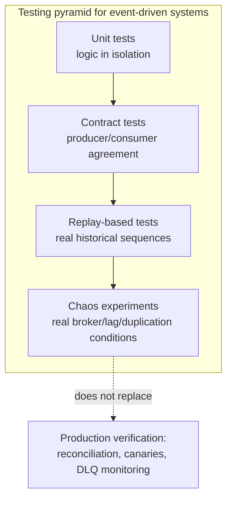
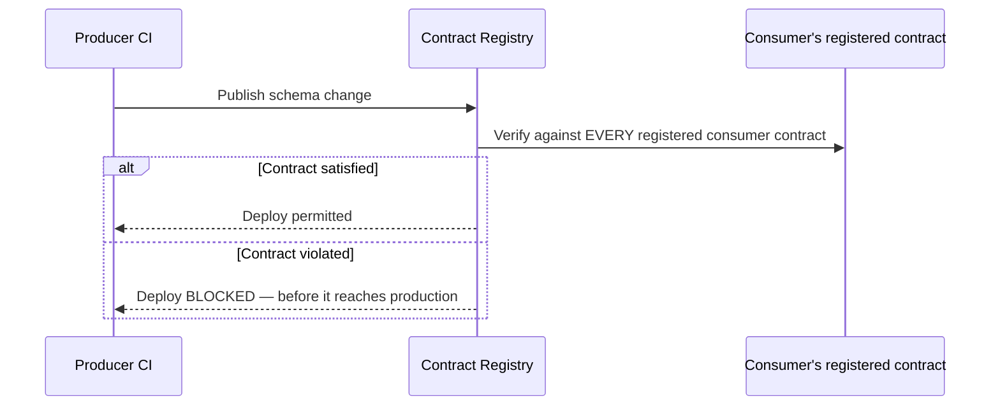
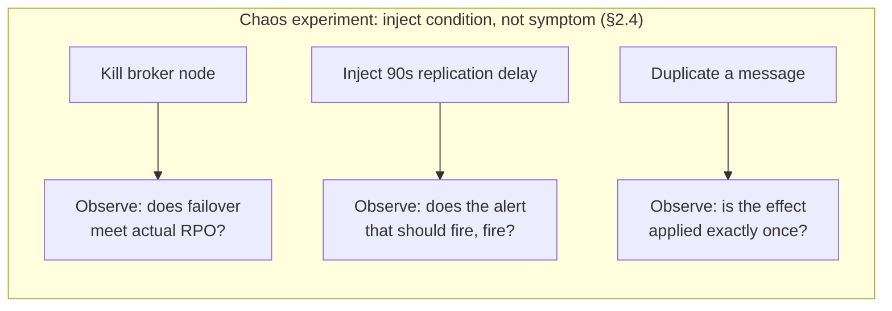
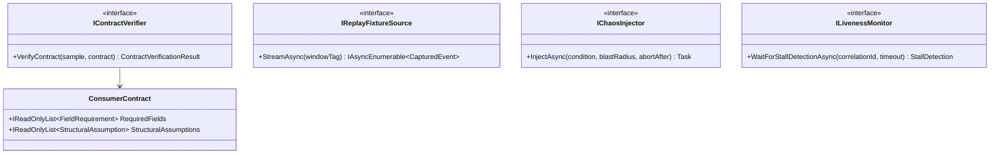

# Module 144 — Event-Driven Architecture: Testing, Contract Testing & Chaos Engineering for Event Pipelines

> Domain: Event-Driven Architecture | Level: Beginner → Expert | Prerequisite: [[02-Schema-Evolution-Ordering-DeliverySemantics-DLQ]] (schema compatibility as the object under test), [[06-Idempotency-ExactlyOnce-Deduplication-At-Scale]] Expert Q9 (which named the exact tests §4 and §14 there were each missing — this module generalizes that into a standing testing discipline), [[../33-Hexagonal-Architecture/01-HexagonalArchitectureFundamentals-PrimarySecondaryAdapters-AdapterSubstitutionTesting]] (Adapter-substitution testing, extended here to asynchronous, broker-mediated boundaries)

>
> **Scope note:** Fifth of six modules extending `18-Event-Driven-Architecture` toward its stated 8-module extra-depth scope. Full 16-section template; Elite FinTech Interview Panel lens.

---

## 1. Fundamentals

**What:** How to verify that an event-driven system's guarantees — schema compatibility, ordering, delivery semantics, idempotency, backpressure behavior, cross-region failover — actually hold, given that every one of Modules 140–143's incidents occurred in a system with a passing unit-test suite and no code-level bug.

**Why:** A unit test exercises a function in isolation, synchronously, with mocked dependencies that respond instantly and deterministically. An event-driven system's actual failure surface — the one this course's last four modules mapped in detail — lives almost entirely in what a unit test structurally cannot exercise: real delivery timing, real duplication, real broker failure, real cross-service contract drift, real replay windows exceeding retention. **Testing an event-driven system well requires a distinct discipline layered on top of, not replacing, ordinary unit testing.**

**When:** From the first service that produces or consumes events across a team boundary. A single team's internal event flow can lean more heavily on integration tests; cross-team and cross-region flows need the contract and chaos disciplines this module develops, because no single team can see or control the other side's behavior directly.

**How (30,000-ft view):**
```
Unit tests ──► verify logic in isolation (necessary, not sufficient)
                       │
Contract tests ──► verify producer/consumer agree on schema + semantics, independently deployable
                       │
Replay-based tests ──► verify behavior against real historical event sequences, including edge cases
                       │
Chaos experiments ──► verify behavior under real failure: broker loss, lag, duplication, poison messages
```

---

## 2. Deep Dive

### 2.1 Why Mocked Integration Tests Systematically Miss This Domain's Real Failures
A mock responds instantly, never duplicates, never reorders, and never partially fails mid-call. Every one of Modules 140–143's incidents depended on exactly one of those properties being false in production: Module 140 §4's late data, Module 141 §4's catch-up burst against a cold cache, Module 142 §4's replication lag spiking under correlated failure, Module 143 §4's redelivery beyond retention. A test suite built entirely on mocks is, by construction, blind to the entire class of failure this domain's content addresses — not because the tests are poorly written, but because the tests validate a condition (instant, ordered, single delivery) that production does not provide.

### 2.2 Consumer-Driven Contract Testing — Decoupling Deployability From Schema Agreement
A contract test asserts that a producer's actual output and a consumer's actual expectations agree, without either service needing the other running. The consumer publishes its expectations (a contract — "I require fields X, Y, Z with these types") and the producer's build verifies its output satisfies every registered consumer's contract before it can deploy. This directly operationalizes Module 44 §2.1's schema-registry compatibility enforcement at the level of *actual consumer needs* rather than the schema's declared compatibility mode alone — a schema change can be backward-compatible in the registry's formal sense while still breaking a specific consumer's business logic that depended on a field's *value semantics*, not merely its type, which contract tests catch and schema compatibility checking does not.

### 2.3 Replay-Based Testing — Validating Against What Actually Happened
Given durable event retention (Module 44 §2.6), a captured slice of real historical production events is a test fixture no hand-written scenario reliably matches for edge-case density — the actual sequence of duplicates, out-of-order arrivals, and malformed-but-valid messages a system has genuinely seen. Replay-based testing runs a candidate change against this real history and diffs the output against either the historical actual output (regression) or an independently-computed expected result (correctness). This is how Module 143 Expert Q9's "replay-at-scale test" is actually implemented, and it is the single most effective technique for catching the aggregate-level, volume-dependent bugs (Module 142 §14's split-brain, Module 143 §4's mass-duplication) that a handful of hand-picked test cases will not surface.

### 2.4 Chaos Engineering for Event Pipelines — Injecting the Conditions, Not the Symptoms
Chaos experiments deliberately introduce the specific failure conditions this domain's modules named as dangerous — killing a broker node, injecting consumer lag, duplicating messages, delaying replication, degrading a downstream dependency during catch-up — in a controlled environment (ideally staging with production-shaped load, or production itself under a carefully scoped, reversible experiment) and verify the system's actual behavior against its designed behavior. The discipline's core principle: **inject the condition (a killed broker, an added 90-second delay), not the assumed symptom (a fabricated error response)** — Module 141 §4's incident had no error at any stage, so a chaos experiment that only injects errors would never have reproduced it; only an experiment that genuinely delays or drops the underlying infrastructure reproduces the actual failure shape.

### 2.5 Testing Choreographed Flows End-to-End Without a Central Point to Query
A choreographed flow (Module 01 §2.4) has no orchestrator to ask "is this complete?" — completeness is an emergent property of every participating service's independent reactions. Testing it end-to-end requires either a synthetic correlation ID threaded through the entire flow with a test harness polling every participant's terminal state, or — more robustly — the same liveness monitoring the production system itself needs (Module 123 §2's saga-liveness monitoring, generalized to choreography) exercised against a known-shape test scenario, verifying the monitoring itself would actually detect a stalled flow before trusting it in production.

### 2.6 The Limits of Pre-Production Testing — Why Production Verification Remains Necessary
No pre-production test environment fully reproduces production's actual traffic shape, actual downstream dependency behavior under real load, or the actual correlated-failure conditions that matter most (Module 142 §2.4's replication-lag-under-real-regional-degradation). Pre-production testing reduces the space of possible failures; it does not eliminate the need for the production-side verification this domain has established repeatedly — reconciliation (Module 133, Module 143 §4), consistency canaries (Module 142 Expert Q4), and dead-letter monitoring (Module 44 §2.5). **Testing and production verification are complementary, not substitutes** — a system that tests well and has no production verification is exactly as exposed to an untested condition as one that never tested at all, the moment that condition actually occurs.

---

## 3. Visual Architecture







---

## 4. Production Example

**Problem:** A trade-enrichment pipeline spanning four teams — capture, enrichment, risk, and settlement — had extensive unit and integration test coverage per team, all passing, and a documented schema-registry-enforced compatibility policy per Module 44. The teams considered the pipeline well-tested.

**Architecture:** Each team owned its service's tests independently; there was no shared contract test suite and no chaos testing program, on the reasoning that each service's own tests, combined with schema-registry enforcement at the boundary, provided sufficient coverage.

**Implementation:** The enrichment team added a new, backward-compatible optional field to its output event, correctly following the schema-evolution discipline — the registry accepted the change, and enrichment's own tests, which didn't reference the new field's absence-handling in any special way, passed cleanly.

**Trade-offs:** Relying on schema-registry compatibility enforcement alone, without consumer-specific contract tests, was a deliberate simplification — building and maintaining contract tests across four teams was judged higher-overhead than the registry's automated compatibility check, which the team believed covered the relevant risk.

**Lessons learned:** The risk service's aggregation logic, written before the new field existed, computed a checksum over the *entire* event payload as an internal data-integrity check — unrelated to the specific fields it business-logically consumed — and compared that checksum against a previously-cached value to detect whether an event represented a genuine update or a redundant redelivery it should skip. The new field changed every event's checksum, since the checksum was computed over the full payload rather than the fields the risk service's actual dedup logic (Module 143's idempotency discipline, applied here) was supposed to key on. Every event, including ones the risk service had already processed, now looked like a new update under its checksum-based dedup check, and was reprocessed — silently duplicating risk-exposure calculations across the estate.

The change was fully backward-compatible by every definition the schema registry checked: the new field was optional, existing fields were unchanged, and no consumer's declared schema requirements were violated. It broke the risk service anyway, because the risk service's dedup key was an implementation detail — a full-payload checksum — never declared as a contract, never visible to the enrichment team, and never exercised by any test that included both services together.

The generalizable lesson, extending directly from Module 143 §2.2: **the risk service's dedup key had the exact scope-mismatch problem this course has named repeatedly — it was "unique" for the payload as it existed at design time, and that scope silently changed the moment the payload's shape changed**, a failure a formally-compliant schema-compatibility check cannot detect because it checks schema shape, not every consumer's internal use of that shape.

The fix had three parts. **First**, the risk service's dedup key was corrected to be explicitly field-scoped (per Module 143 §2.2's content-derived-key discipline) rather than a full-payload checksum, eliminating this specific fragility structurally. **Second**, a consumer-driven contract test was introduced for exactly this class of risk — each consumer now declares not just the fields it reads but any structural assumption (like "dedup key derived from full payload") that a technically-compatible change could still violate, making the assumption visible and testable rather than implicit. **Third**, replay-based testing (§2.3) was added to the pipeline's CI, replaying a captured slice of real production events including the exact "add an optional field" scenario, specifically because this was a class of change the team now knew looked safe by every declared rule and wasn't.

The generalizable lesson at the pipeline level: **schema-registry compatibility enforcement verifies the contract's declared shape, not every consumer's actual, sometimes undeclared, dependence on that shape** — and closing that gap requires either making every such dependency an explicit, tested contract, or validating against real historical traffic that would surface an undeclared one.

---

## 5. Best Practices
- Layer contract tests, replay-based tests, and chaos experiments on top of unit tests — none substitutes for another (§2.1–§2.4).
- Make consumer assumptions that go beyond declared schema fields (like a dedup key's scope) explicit, registered contract terms, not silent implementation details (§4).
- Inject the actual failure condition in chaos experiments (a killed broker, real injected lag), never a fabricated symptom (§2.4).
- Use captured real production event sequences for replay-based testing rather than only hand-written scenarios, to surface edge-case density hand-written tests miss (§2.3).
- Test choreographed flows via the same liveness monitoring production depends on, verifying the monitoring itself would catch a stall (§2.5).
- Retain production-side verification (reconciliation, canaries, DLQ monitoring) regardless of test coverage, since no pre-production environment fully reproduces production's real conditions (§2.6).

## 6. Anti-patterns
- Relying on mocked integration tests alone for a system whose real failures are timing-, duplication-, and ordering-dependent (§2.1).
- Treating schema-registry compatibility enforcement as sufficient contract verification, missing undeclared consumer-side assumptions (§4).
- Chaos experiments that inject a fabricated error response rather than the actual underlying condition (§2.4).
- Testing choreographed flows only for the happy path, with no verification that stall-detection monitoring actually works (§2.5).
- Treating a fully green pre-production test suite as proof a production verification layer (reconciliation, canaries) is no longer needed (§2.6).
- Hand-writing test scenarios exclusively, without ever replaying real historical production traffic through a candidate change (§2.3).

---

## 7. Performance Engineering

**CPU/Memory:** Replay-based tests against large historical windows can be resource-intensive; running them against a representative sample rather than full history balances coverage against CI runtime, provided the sample is chosen to include known edge-case periods (a prior incident window, a high-volume day) rather than purely at random.

**Latency:** Contract test verification should run in CI before deployment, not as a separate slow nightly job, so a violation blocks the specific change that introduced it rather than surfacing hours or days later against an unclear set of candidate commits.

**Throughput:** Chaos experiments injecting load (a simulated catch-up burst, Module 141 §4's shape) must be run against infrastructure sized to match production's actual downstream capacity, or the experiment either under- or over-states real risk.

**Scalability:** As the number of consumer teams grows, a shared contract registry (§2.2) scales far better than any pairwise integration-test arrangement between every producer and every consumer, which grows combinatorially.

**Benchmarking:** Benchmark the chaos experiment's *detection* path (does the alert fire, does the dashboard show the expected signal) with the same rigor as the injected condition itself — Module 141 §4 and Module 142 §4 both show that the injected condition alone teaches little if the monitoring response isn't also being validated.

**Caching:** Replay-test fixtures (captured event windows) should themselves be cached and versioned, so a specific historical edge case, once captured, remains a permanent regression fixture rather than being re-captured or lost.

---

## 8. Security

**Threats:** Replay-based tests using real production data risk exposing sensitive information (client identities, trade details) in test environments with weaker access controls than production. Chaos experiments run carelessly in production risk becoming genuine incidents rather than controlled learning.

**Mitigations:** Anonymize or tokenize sensitive fields in captured replay fixtures before they leave production's security boundary; scope chaos experiments with explicit blast-radius limits (a single non-critical consumer group, a canary region) and an automatic abort condition, per Module 128's canary-gate discipline applied to chaos testing specifically.

**OWASP mapping:** Sensitive data exposure if replay fixtures containing regulated client data are stored or transmitted without the same protection as production; denial of service if a chaos experiment's blast radius is under-scoped and genuinely degrades a shared dependency.

**AuthN/AuthZ:** Contract-test infrastructure and replay-fixture stores need their own access controls, since they may contain a representative sample of the same regulated data the production system protects.

**Secrets:** Standard per Module 86; chaos-experiment tooling credentials scoped narrowly to only the infrastructure the experiment is authorized to affect.

**Encryption:** Replay fixtures containing regulated data encrypted at rest and in transit identically to production, not treated as lower-sensitivity because they're "just test data."

---

## 9. Scalability

**Horizontal scaling:** Contract test verification scales per-consumer, run independently and in parallel for each registered contract against a producer's candidate change.

**Vertical scaling:** Not the primary lever; the bottleneck is typically test-suite runtime and chaos-experiment infrastructure availability, not per-test resource needs.

**Caching:** §7 — versioned, cached replay fixtures as durable regression assets.

**Replication/Partitioning:** A chaos experiment testing cross-region behavior (Module 142) requires its own multi-region test infrastructure, mirroring production's actual topology rather than a single-region approximation that cannot exercise replication-lag conditions at all.

**Load balancing:** Not directly applicable; chaos experiments should be scheduled to avoid colliding with genuine incident response, since both compete for the same on-call attention.

**High Availability:** A chaos experimentation program itself needs governance ensuring experiments are reversible and scoped — an unscoped experiment is itself an availability risk to the system it's meant to be validating.

**Disaster Recovery:** DR drills (Module 142 §9) are this domain's most consequential chaos experiment category; §2.4's "inject the condition, not the symptom" principle applies most sharply here, per Module 142 Intermediate Q7's finding that a clean-stop drill tests the wrong condition.

**CAP theorem:** Chaos experiments are the primary tool for empirically verifying which side of a CAP trade-off a system actually exhibits under a real partition, rather than relying on the documented, intended design — Module 142 §14's split-brain was exactly a case where the intended (undocumented) behavior and actual behavior diverged, and a chaos experiment injecting a real partition would have surfaced it before production did.

---

## 10. Interview Questions

### Basic (10)

1. **Q: Why do mocked integration tests systematically miss this domain's real failures?**
   **A:** Mocks respond instantly, never duplicate, never reorder, and never partially fail — properties production does not have, and every incident in Modules 140–143 depended on exactly one of those properties being false (§2.1).
   **Why correct:** States the structural reason mocks can't exercise this class of failure.
   **Common mistakes:** Assuming more mocked test coverage closes this gap, when the gap is in what mocks are capable of representing at all.
   **Follow-ups:** "What replaces mocks for this class of testing?" (Contract tests, replay-based tests, and chaos experiments against real or realistic conditions, §2.2–§2.4.)

2. **Q: What is a consumer-driven contract test?**
   **A:** A test where the consumer publishes its actual expectations of a producer's output as a contract, and the producer's build verifies its output satisfies every registered consumer's contract before deploying — catching breakage the schema registry's formal compatibility check alone might miss (§2.2).
   **Why correct:** Defines the mechanism and its verification point (producer CI, before deployment).
   **Common mistakes:** Confusing contract tests with schema-registry compatibility checks, which verify shape but not necessarily every consumer's actual usage of that shape.
   **Follow-ups:** "What can a contract test catch that schema compatibility can't?" (An undeclared consumer-side assumption about the payload, like §4's full-payload checksum dedup key.)

3. **Q: What is replay-based testing?**
   **A:** Running a candidate change against a captured slice of real historical production events and diffing the output against expected or historical-actual results — surfacing edge-case density hand-written test scenarios typically miss (§2.3).
   **Why correct:** Defines the mechanism and its comparative advantage.
   **Common mistakes:** Treating replay-based testing as equivalent to a handful of hand-picked regression scenarios, missing that its value is specifically the density and realism of genuine historical traffic.
   **Follow-ups:** "What durability property makes replay-based testing possible?" (Retained event history — Module 44 §2.6's replay capability, reused here for testing rather than production correction.)

4. **Q: What is the core principle of chaos engineering as applied to event pipelines?**
   **A:** Inject the actual failure condition — a killed broker, real injected lag, real message duplication — rather than a fabricated symptom like a synthetic error response, since many of this domain's real incidents (Module 141 §4) produced no error at any stage (§2.4).
   **Why correct:** States the "condition, not symptom" principle and why it matters given this domain's actual failure shapes.
   **Common mistakes:** Building chaos tooling that injects error responses only, missing the no-error failure modes that are actually characteristic of this domain.
   **Follow-ups:** "Give an example of a no-error failure this misses." (Module 141 §4's catch-up burst — no component errored at any point during the entire incident.)

5. **Q: Why is testing a choreographed flow harder than testing an orchestrated one?**
   **A:** An orchestrated flow has a central coordinator to query for completeness; a choreographed flow's completeness is an emergent property of every independent participant's reaction, with no single place to ask "is this done?" (§2.5).
   **Why correct:** Identifies the structural absence of a central query point.
   **Common mistakes:** Testing only individual services' reactions in isolation, never verifying the emergent, whole-flow completeness property.
   **Follow-ups:** "How is it tested despite this?" (A correlation ID threaded through the flow with a test harness polling every participant, or exercising the same liveness monitoring production uses, §2.5.)

6. **Q: Does thorough pre-production testing eliminate the need for production-side verification like reconciliation?**
   **A:** No — no pre-production environment fully reproduces production's real traffic shape, real downstream behavior under load, or real correlated-failure conditions, so testing and production verification are complementary, not substitutes (§2.6).
   **Why correct:** States why testing alone is structurally insufficient.
   **Common mistakes:** Reducing or removing reconciliation and monitoring because test coverage improved, leaving the system exposed to exactly the untested condition the moment it occurs.
   **Follow-ups:** "Give an example where this exact gap caused an incident." (Module 143 §4 — a genuinely well-tested dedup mechanism, undone by an untested redelivery window; caught only by reconciliation.)

7. **Q: What went wrong in §4's incident, at a high level?**
   **A:** A schema-registry-compliant, backward-compatible field addition broke a downstream consumer's undeclared, full-payload-checksum-based dedup key, causing every event to look new and be reprocessed, duplicating risk calculations — a failure schema-compatibility checking alone could not catch (§4).
   **Why correct:** States the mechanism and why the existing verification (compatibility checking) didn't cover it.
   **Common mistakes:** Attributing this to a schema-evolution mistake, when the change was genuinely, formally compatible by every rule that was checked.
   **Follow-ups:** "What would have caught it?" (A consumer-driven contract test declaring the dedup-key assumption explicitly, or replay-based testing exercising the exact 'add an optional field' scenario, §4's fix.)

8. **Q: Why should chaos-experiment blast radius be explicitly scoped?**
   **A:** An unscoped experiment run carelessly, especially in production, risks becoming a genuine incident rather than a controlled learning exercise (§8).
   **Why correct:** States the risk of unscoped experimentation.
   **Common mistakes:** Treating chaos engineering as inherently safe because it's "just testing," rather than as itself a risk requiring the same governance as any production-affecting change.
   **Follow-ups:** "What limits should an experiment have?" (An explicit blast-radius boundary — a single non-critical consumer group or canary region — and an automatic abort condition, §8.)

9. **Q: Why should replay fixtures containing production data be anonymized before use in test environments?**
   **A:** Test environments typically have weaker access controls than production, so real client identities or trade details in a replay fixture would be exposed to a broader, less-controlled audience than the data's actual sensitivity classification permits (§8).
   **Why correct:** States the exposure risk from environment-security mismatch.
   **Common mistakes:** Treating replay fixtures as "just test data" rather than as regulated production data that has moved to a lower-security environment.
   **Follow-ups:** "What's the alternative to full anonymization if realistic data shape is needed?" (Tokenization preserving structural realism — format, distribution — while removing genuine identity, §8.)

10. **Q: What's the relationship between the testing pyramid in §3 and this domain's earlier modules?**
    **A:** Each layer targets a specific failure class this domain established: unit tests validate logic, contract tests validate schema/semantic agreement (Module 44), replay tests validate against real historical density (surfacing Module 140–143's aggregate-scale bugs), and chaos experiments validate real infrastructure failure conditions (Modules 141–142's lag and replication incidents) (§3).
    **Why correct:** Maps each testing layer to the specific prior-module failure class it targets.
    **Common mistakes:** Treating the pyramid as a generic testing methodology unrelated to this domain's specific, previously-established failure modes.
    **Follow-ups:** "Which layer is most often skipped?" (Chaos experiments — they require the most infrastructure investment and are the layer most teams add only after a real incident, per this module's own §4.)

### Intermediate (10)

1. **Q: Walk through why §4's schema change passed every existing check and still broke production.**
   **A:** The change was optional and additive, satisfying the schema registry's backward-compatibility rule; it didn't touch any field the risk service's declared business logic read, satisfying naive "does this affect known consumers" review. It broke the risk service because that service's dedup mechanism used an undeclared, implementation-internal signal (a full-payload checksum) that no compatibility rule or review process had visibility into, because it was never registered as a contract term.
   **Why correct:** Traces the change through every check that passed and identifies precisely what none of them covered.
   **Common mistakes:** Concluding the schema-compatibility process failed, when it functioned exactly as designed for the property it was designed to check.
   **Follow-ups:** "What kind of contract term would have surfaced this?" (An explicit declaration from the risk service: 'dedup key derived from fields X, Y, Z only' — making the previously-implicit assumption a registered, checkable fact.)

2. **Q: Design a contract test suite for the pipeline in §4, incorporating the lesson learned.**
   **A:** Each consumer registers not only the fields it reads but any structural assumption a technically-compatible change could still violate — dedup-key scope, ordering assumptions, expected event size or field-count ranges if those matter to internal logic like buffering. The producer's CI verifies every registered contract, including these structural assumptions, before allowing deployment, converting what was previously an invisible implementation detail into an explicit, tested boundary.
   **Why correct:** Specifies both the standard field-level check and the structural-assumption extension §4 shows is necessary.
   **Common mistakes:** Registering only field-level read requirements, reproducing the exact gap §4 exposed for any consumer whose fragility isn't field-level.
   **Follow-ups:** "Whose responsibility is it to identify these structural assumptions?" (The consumer team's — they're the only ones who know their own internal implementation details, which is exactly why they were invisible to the producer and to schema-registry enforcement.)

3. **Q: Why is a replay-based test of "add an optional field" a higher-value regression fixture than a hand-written test of the same scenario?**
   **A:** A hand-written test encodes what the test author *thought* to check, typically the fields declared as read; a replay-based test run against real historical volume would have processed the same events through the risk service's actual dedup logic at real scale, surfacing the checksum-based reprocessing as an observable behavior change (reprocessing rate spiking) rather than requiring the test author to have already anticipated the specific failure mode (§2.3, §4).
   **Why correct:** Identifies that replay testing surfaces unanticipated behavior changes, while hand-written tests only catch anticipated ones.
   **Common mistakes:** Believing a sufficiently thorough hand-written test suite is equivalent to replay-based testing, when the value of replay testing is specifically catching what wasn't anticipated.
   **Follow-ups:** "What would the replay test's pass/fail criterion be?" (No unexpected increase in processing volume or dedup-miss rate for already-seen events, compared against the historical baseline — an aggregate behavioral check, not a per-event assertion.)

4. **Q: How would a chaos experiment be designed to validate Module 141 §4's fix (rate-limited catch-up)?**
   **A:** Deliberately accumulate consumer lag (pause consumption, or inject a real network delay to the reference-data dependency for a bounded window), then trigger recovery and observe: does the consumer throttle its catch-up rate as designed, does the downstream dependency remain healthy through the recovery, and does the three-boundary alerting (Module 141 Advanced Q4) fire the expected alerts at the expected thresholds during the accumulation phase, before recovery even begins.
   **Why correct:** Designs an experiment injecting the actual condition (real lag accumulation) and validates both the mechanism and its monitoring, per §2.4's dual requirement.
   **Common mistakes:** Testing only whether the throttle mechanism activates, without validating that the alerting that should have warned about the accumulating lag actually fires.
   **Follow-ups:** "What would constitute experiment failure here?" (The downstream dependency degrading during simulated catch-up despite the throttle being active — meaning the throttle rate itself, not just its existence, needs recalibration.)

5. **Q: Critique running chaos experiments only in a dedicated staging environment, never in production.**
   **A:** Staging systematically differs from production in traffic volume, downstream dependency behavior under real load, and the correlated-failure conditions (Module 142 §2.4) that matter most — a staging-only chaos program validates the mechanism exists but not that it behaves correctly under production's actual scale and conditions. The stronger practice is a carefully scoped, reversible experiment in production itself (with explicit blast-radius limits, §8), reserving staging for earlier-stage, higher-risk experimentation before a mechanism is trusted enough to test live.
   **Why correct:** Identifies the specific dimensions staging cannot represent and recommends a staged progression rather than staging-only or production-only extremes.
   **Common mistakes:** Treating staging-only chaos testing as a complete program, missing that its findings may not transfer to production's actual conditions.
   **Follow-ups:** "What would justify skipping staging and going straight to a scoped production experiment?" (A mechanism whose staging-equivalent behavior is well-understood and where production-specific conditions — real downstream load — are precisely what needs validating, e.g., Module 141 §4's catch-up-burst-against-a-real-dependency scenario.)

6. **Q: How should a test harness verify a choreographed flow's liveness monitoring, per §2.5?**
   **A:** Deliberately construct a test scenario where one participant fails to react (simulating a stalled step), then verify the production liveness-monitoring mechanism (Module 123's saga-liveness pattern, generalized) actually flags the stall within its expected detection window — testing the *detector*, not just the happy-path flow, since Module 123 §14's original incident was specifically a case where a new step was added without updating monitoring coverage.
   **Why correct:** Targets the monitoring mechanism itself as the object under test, directly reusing the precedent incident that motivates it.
   **Common mistakes:** Testing only that the choreographed flow completes correctly under normal conditions, never verifying detection of the abnormal case the monitoring exists to catch.
   **Follow-ups:** "How often should this test run?" (On every change that could affect flow topology — a new step, a changed participant — mirroring Module 123's fix of gating new steps against monitoring-coverage assertions.)

7. **Q: Why does §4's incident specifically illustrate the limits of "compatible by the schema registry's rules" as a sufficient safety claim?**
   **A:** Because the claim is true and the outcome was still broken — the registry checks a specific, narrow property (does the new schema satisfy declared type/structure compatibility with prior versions) and §4's failure lived entirely outside that property's scope (an undeclared internal dedup mechanism). This is a direct instance of the course's "declared ≠ actual" theme: the declared safety property held exactly as claimed, and it simply wasn't the property that mattered for this specific consumer.
   **Why correct:** Connects the incident explicitly to the declared-versus-actual distinction and states why the registry's check, though correct, was insufficient.
   **Common mistakes:** Concluding the schema-compatibility check was wrong or broken, when it worked exactly as designed for a narrower claim than "this change is safe for every consumer in every respect."
   **Follow-ups:** "What's the general defense against this class of gap?" (Explicit consumer-declared contracts covering structural assumptions beyond field-level schema, Intermediate Q2 — narrowing the gap between the declared and the actual.)

8. **Q: How should replay-fixture selection be governed to maximize edge-case coverage without unbounded CI runtime cost?**
   **A:** Curate a rotating, versioned set of fixtures anchored to known-significant windows — prior incident periods, peak-volume days, periods spanning a schema or topology change — rather than either a purely random sample (likely to miss rare edge cases) or the full historical record (prohibitive runtime cost), and add a new fixture deliberately whenever a production incident surfaces a scenario the existing set didn't cover, treating fixture curation as a living artifact rather than a one-time setup.
   **Why correct:** Balances coverage against cost through deliberate, incident-informed curation rather than either extreme.
   **Common mistakes:** Treating the initial fixture set as permanent, never adding newly-discovered edge cases as production incidents reveal them.
   **Follow-ups:** "Should §4's specific incident become a permanent fixture?" (Yes — a captured 'add an optional field against the risk service's real historical data' scenario is now a standing regression test for exactly this class of change.)

9. **Q: How does contract testing interact with Module 142's cross-region replication specifically?**
   **A:** A contract normally verifies producer-consumer agreement within one cluster; a cross-region-replicated topic introduces a second dimension — does the *replicated* copy of the event still satisfy the contract, given that replication can alter delivery timing, and in an active-active topology, potentially interleave events from two origin regions in an order neither producer intended. Contract tests for cross-region-replicated topics should explicitly include a replicated-delivery scenario, not assume the same-cluster contract automatically extends across the replication boundary.
   **Why correct:** Identifies the specific way replication introduces a dimension standard contract testing doesn't automatically cover.
   **Common mistakes:** Assuming a contract verified within one cluster automatically holds for the replicated copy, missing timing and interleaving effects specific to cross-region delivery.
   **Follow-ups:** "What would a cross-region contract test specifically check?" (That a consumer reading from the replicated cluster, under realistic replication lag, still behaves correctly — directly testing Module 142 §Advanced Q9's watermark-miscalibration risk.)

10. **Q: Synthesize how this module's testing pyramid would have caught each of Modules 140–143's incidents, if it had existed beforehand.**
    **A:** Module 140 §4 (dropped late trades) — a chaos experiment injecting real 4-6 minute delay against the fixed watermark would have shown the drop and the suppressed alert directly. Module 141 §4 (catch-up collapse) — a chaos experiment simulating accumulated lag plus recovery against a cold-cache dependency, per Intermediate Q4. Module 142 §4 (replication-lag failover gap) — a DR drill injecting link degradation before failover, per Module 142 Intermediate Q7, is exactly this module's chaos-experiment discipline applied to that domain. Module 143 §4 (backfill beyond dedup retention) — a replay-based test replaying events older than retention, per Module 143 Expert Q9, is precisely §2.3's technique.
    **Why correct:** Maps each specific prior incident to the specific testing-pyramid layer that would have caught it, showing the pyramid is not generic advice but a direct response to this domain's own documented failure history.
    **Common mistakes:** Treating this module's techniques as independent, generic testing best practice unrelated to the specific incidents that motivate each one.
    **Follow-ups:** "Which incident would have been hardest to catch even with this pyramid in place?" (Module 142 §14's split-brain — genuinely requires either a live production consistency canary or a chaos experiment specifically simulating a brief, sub-alerting-threshold partition, which is a narrower and less obvious experiment to think to run.)

### Advanced (10)

1. **Q: Diagnose §4's incident and design the complete structural fix.**
   **A:** Root cause: an undeclared, full-payload-checksum dedup key in a downstream consumer broke silently under a formally schema-compatible change, because no verification layer had visibility into that internal assumption. Fix: (1) the dedup key itself corrected to explicit field-scoped derivation, removing the fragility at its source (Module 143 §2.2's discipline); (2) consumer-driven contract tests extended to cover structural assumptions beyond field-level reads, making previously-implicit dependencies explicit and checkable (Intermediate Q2); (3) replay-based testing added to CI, specifically exercising the "add an optional field" scenario against real historical data going forward (Intermediate Q3); (4) production reconciliation retained regardless, per §2.6's complementary-not-substitute principle, since no test suite closes the gap completely.
   **Why correct:** Addresses the specific fragility, the missing verification layer, the regression-prevention mechanism, and the permanent backstop.
   **Common mistakes:** Fixing only the dedup key (point 1), leaving the underlying process gap — no visibility into consumer-internal assumptions — able to produce the same class of incident for a different consumer's different implicit assumption.
   **Follow-ups:** "Why is point 2 more valuable long-term than point 1 alone?" (Point 1 fixes this specific instance; point 2 changes the process so the *next* consumer's undeclared assumption is caught before it breaks, not after.)

2. **Q: A team proposes chaos engineering is too risky for a regulated financial system and should be limited to staging only. Evaluate.**
   **A:** The risk of *not* validating failure behavior against real conditions is asymmetric with the risk of a well-scoped experiment: Modules 140–143's incidents each occurred in production, unplanned, with no controlled blast radius, which is strictly worse than a deliberately scoped, reversible, off-peak experiment with an explicit abort condition (§8). Staging-only chaos testing (Intermediate Q5) misses production-scale and correlated-failure conditions specifically, which is where this domain's most severe incidents concentrated. The correct response to regulatory risk is not avoiding production chaos testing but governing it with the same rigor as any production change — canaried, scoped, reversible, scheduled with stakeholder awareness — not skipping it entirely.
   **Why correct:** Reframes the comparison as scoped-experiment-risk versus unplanned-incident-risk, and recommends governance over avoidance.
   **Common mistakes:** Accepting "too risky for production" as a final answer rather than examining what risk is actually being avoided versus accepted by that choice.
   **Follow-ups:** "What governance would satisfy a regulator's concern?" (Documented experiment scope, blast-radius limits, abort conditions, and a record of findings and remediations — treating chaos experiments as a formal risk-management activity with its own audit trail, mirroring Module 142 §9's DR-drill discipline.)

3. **Q: Design the replay-based test infrastructure needed to catch Module 143 §4's specific incident class (backfill beyond dedup retention).**
   **A:** Capture a fixture spanning a period older than the consumer's current dedup retention window, replay it through the consumer's actual processing path (not a simplified stand-in), and assert on the *aggregate* outcome — total posting count, or a checksum of resulting state — against an independently-computed expected result, specifically checking for unintended duplication rather than per-event correctness alone, since the failure mode is about volume and aggregation, not any single event's individual processing being wrong.
   **Why correct:** Specifies the fixture's required time span, the real-path replay requirement, and the aggregate (not per-event) assertion needed to catch the specific failure class.
   **Common mistakes:** Testing individual event correctness only, missing that the failure is specifically about aggregate duplication across many events, invisible to a per-event assertion.
   **Follow-ups:** "How would this test have needed updating after §4's structural fix (a uniqueness constraint)?" (It would now also verify the constraint itself rejects the duplicate insert correctly — testing the backstop, not just the primary mechanism, per Advanced Q1's layered-defense principle.)

4. **Q: How should contract testing interact with Module 143's idempotency-key scoping problem specifically?**
   **A:** A consumer's contract should explicitly declare its idempotency-key derivation logic (which fields it depends on) as a first-class, registered term — not merely its business-logic field reads — so that a producer's schema change is checked against both what the consumer *uses* and what the consumer's *deduplication mechanism* depends on, which §4 of this module shows can be a materially different, and easily overlooked, set of fields.
   **Why correct:** Extends contract-test scope specifically to cover idempotency-key derivation, directly connecting this module to Module 143's core mechanism.
   **Common mistakes:** Assuming a consumer's business-logic contract automatically covers its idempotency mechanism, when §4 shows these can diverge (business logic ignored the new field; the checksum-based dedup key didn't).
   **Follow-ups:** "What would this contract term look like concretely?" (A declared list of fields the dedup key is derived from, verified by a producer-side test that changing any *other* field doesn't alter that derived key for a fixed sample payload.)

5. **Q: Critique using code coverage percentage as the primary metric for "this event pipeline is well-tested."**
   **A:** Code coverage measures whether lines of code executed during testing, saying nothing about whether the *conditions* under which those lines execute in production (real duplication, real lag, real cross-service contract drift) were represented in the test — a pipeline can have high coverage entirely from mocked, synchronous, single-delivery test paths and still be exposed to every failure class Modules 140–143 document. A more meaningful metric set would track: contract coverage (fraction of consumers with registered contracts), replay-fixture recency (does the fixture set include the last N incident classes), and chaos-experiment currency (when was each critical failure mode last actually exercised).
   **Why correct:** Identifies what code coverage cannot measure and proposes metrics targeting the actual gap.
   **Common mistakes:** Treating high code coverage as evidence of low risk in this domain specifically, when this module's entire premise is that the risk lives outside what coverage measures.
   **Follow-ups:** "Which of the proposed metrics is hardest to maintain over time?" (Chaos-experiment currency — experiments are effortful to run and easy to defer, exactly the pattern that let Modules 140–143's incidents occur with a "well-tested" pipeline on paper.)

6. **Q: A regulator asks how the firm verifies its event-driven trade-processing pipeline behaves correctly under failure conditions. Answer.**
   **A:** Describe the layered verification: unit and contract tests gating every deployment (§2.2), replay-based regression testing against curated real historical fixtures including known prior incident classes (§2.3), scheduled chaos experiments with documented scope and findings validating actual behavior under injected broker failure, lag, and duplication (§2.4, Advanced Q2's governance), and permanent production-side verification — reconciliation and consistency monitoring — that does not depend on test coverage being complete (§2.6). State the residual honestly: pre-production testing reduces but cannot eliminate exposure to untested conditions, which is precisely why the production-verification layer is retained as a permanent, not supplementary, control.
   **Why correct:** Gives the full layered answer and states the honest residual with its governing permanent control, mirroring the pattern this course uses for every "how do you guarantee X" regulatory question.
   **Common mistakes:** Claiming testing alone provides complete assurance, omitting the honest residual and the production-verification layer that actually closes it.
   **Follow-ups:** "How is chaos-experiment coverage itself audited?" (A maintained inventory of known failure modes — one per prior-module incident class — against which experiment currency is tracked, Advanced Q5.)

7. **Q: Apply this course's "declared ≠ actual" theme to a passing CI pipeline for an event-driven service.**
   **A:** The claim is "this service is safe to deploy." Its declared basis is a green CI run — unit tests, and possibly contract tests, passing. §4 shows the claim can be true for everything CI actually checked and still false for the specific failure that occurs, because CI's scope (declared contracts, unit-level logic) is narrower than "every way this deployment could break something," and the gap is specifically the undeclared, implicit assumptions no automated check has visibility into. A green CI run is evidence for a scoped claim, not the unscoped one teams often treat it as.
   **Why correct:** States the specific narrower claim CI actually verifies and why it's easy to over-read as the broader one.
   **Common mistakes:** Treating "CI passed" and "safe to deploy" as synonymous, when CI passing is evidence for a specific, narrower set of checked properties.
   **Follow-ups:** "What closes the gap between the two claims?" (Progressively — better contract coverage narrows it; it is never fully closed, which is why canaried rollout (Module 128) and production verification remain necessary regardless of CI results.)

8. **Q: How should this module's testing discipline be governed across the four-team pipeline in §4, given no single team owns the whole flow?**
   **A:** A shared contract registry (§2.2) with mandatory registration for any cross-team event dependency, owned collectively rather than by any single team, with CI-gate enforcement at every producer's deployment pipeline checking against every registered downstream contract regardless of team boundary; replay-fixture curation and chaos-experiment scheduling as a shared platform capability (Module 139's platform-engineering pattern) rather than each team independently reinventing its own testing infrastructure, avoiding exactly the golden-path fragmentation Module 96 and Module 126 identified in other contexts.
   **Why correct:** Applies established cross-team governance patterns (contract registry, shared platform capability) specifically to this module's testing disciplines.
   **Common mistakes:** Leaving contract and chaos-testing infrastructure to each team independently, reproducing the fragmentation this course has repeatedly flagged as costly at scale.
   **Follow-ups:** "What would make a team skip registering a contract?" (Perceived overhead relative to unclear immediate benefit — exactly the platform-adoption problem Module 139 addressed via paved-path incentives rather than mandate alone.)

9. **Q: How does replay-based testing interact with Module 121's Event Sourcing, where the event log is itself the source of truth?**
   **A:** For an event-sourced Aggregate, replay-based testing is not merely a *testing technique* borrowed from elsewhere — it is the same mechanism (`LoadFromHistory`, Module 121 §2.1) the production system uses for its actual source-of-truth reconstruction, meaning a replay-based test for an event-sourced consumer is testing the production reconstruction path directly, with materially higher fidelity than for a non-event-sourced consumer where replay is a separate, testing-only facility approximating production behavior.
   **Why correct:** Identifies that Event Sourcing collapses the distinction between "test technique" and "production mechanism," strengthening the guarantee replay-based testing provides for such consumers specifically.
   **Common mistakes:** Treating replay-based testing identically for event-sourced and non-event-sourced consumers, missing that the former tests the actual production code path while the latter tests an approximation of it.
   **Follow-ups:** "Does this reduce the need for other testing layers for event-sourced consumers?" (No — it strengthens replay-based coverage specifically but doesn't address contract drift or chaos-injected infrastructure failure, which remain independently necessary, §2.1–§2.4's layers are not redundant with each other.)

10. **Q: Synthesize the governance for event-driven testing across the organization.**
    **A:** (1) A shared, mandatorily-registered contract registry covering both field-level reads and structural assumptions like idempotency-key derivation (Advanced Q4). (2) Curated, versioned replay fixtures anchored to known-significant and incident-derived windows, run in CI on every relevant change (Intermediate Q8). (3) Scheduled, governed chaos experiments with explicit blast-radius scope, abort conditions, and a maintained inventory of failure-mode coverage and currency (Advanced Q2, Q5). (4) Choreographed-flow testing explicitly validating liveness-monitoring detection, not just happy-path completion (Intermediate Q6). (5) Production-side verification (reconciliation, consistency canaries, DLQ monitoring) retained permanently and explicitly, never reduced on the basis of improved test coverage (§2.6). (6) Testing infrastructure — contract registry, fixture stores, chaos tooling — provided as shared platform capability, not reinvented per team (Advanced Q8).
    **Why correct:** Covers contract scope, fixture curation, chaos governance, choreography-specific testing, the permanent production backstop, and organizational delivery as six distinct, individually necessary controls.
    **Common mistakes:** Governing pre-production testing thoroughly while implicitly treating it as a substitute for, rather than a complement to, production-side verification.
    **Follow-ups:** "Which is most often under-resourced?" (Chaos-experiment governance — it requires the most dedicated infrastructure investment and is the layer most commonly added reactively, after an incident, exactly as in this module's own §4.)

### Expert (10)

1. **Q: Evaluate whether a fully green testing pyramid (unit, contract, replay, chaos) should ever be treated as sufficient grounds to reduce production-side reconciliation.**
   **A:** No — §2.6 establishes this as a category error: testing reduces the *probability* of an untested condition occurring in production, but reconciliation exists specifically to catch the residual the testing pyramid, by construction, cannot cover — genuinely novel conditions no fixture or experiment anticipated. A fully green pyramid is evidence the *known* failure modes are well-defended; it says nothing about unknown ones, which is precisely reconciliation's domain. Reducing reconciliation on the strength of test coverage conflates two different claims exactly as Advanced Q7 describes for CI more narrowly.
   **Why correct:** Identifies the category difference between probability-reduction (testing) and residual-catching (production verification), and why no amount of the former substitutes for the latter.
   **Common mistakes:** Treating test coverage and production verification as points on the same spectrum, tradeable against each other, when they address genuinely different classes of risk.
   **Follow-ups:** "Is there any test-coverage level that would justify reducing reconciliation cadence?" (Only if reconciliation itself becomes the bottleneck to detecting genuinely novel conditions faster than an alternative equally-independent verification — a tooling change, not a coverage-driven policy change.)

2. **Q: How would you design a chaos experiment to specifically validate Module 142 §14's split-brain scenario (a brief, sub-alerting-threshold partition) before it recurs?**
   **A:** Inject a genuine network partition between two active-active regions for a duration deliberately calibrated *below* the existing alerting threshold (mirroring the six minutes that caused §14's incident), targeting specifically an unrouted shared-key entity, then verify via the continuous consistency canary (Module 142 §11 Expert) that divergence is detected within an acceptable window — the experiment's success criterion is not "the partition didn't cause visible failure" but "the canary caught the resulting divergence," since the partition itself causing no *visible* symptom is exactly what made the original incident silent for six hours.
   **Why correct:** Designs the experiment around the exact sub-threshold condition and defines success as detection, not absence of visible symptoms, directly addressing why the original incident went unnoticed.
   **Common mistakes:** Designing the experiment to trigger the existing alerting threshold, which would validate a different (already-covered) scenario rather than the specific gap §14 exposed.
   **Follow-ups:** "What would experiment failure (canary doesn't detect) indicate?" (Either the canary's sampling misses the specific affected key, or its comparison window is itself too coarse — requiring the canary's own design to be revisited, not just accepted as sufficient because it exists.)

3. **Q: A Principal Engineer is asked to justify chaos-engineering budget against a competing feature-delivery priority. Construct the argument.**
   **A:** Quantify the counterfactual: each of Modules 140–143's incidents cost detection delay (hours to days), remediation effort, and in several cases direct financial correction — all incurred *after* the fact, unplanned, at a time not of the team's choosing, against production data at real scale. A chaos-experiment program converts a subset of that same discovery work into a scheduled, scoped, lower-cost activity performed *before* the failure has real consequences. The argument isn't "chaos engineering prevents all incidents" (it doesn't — §2.6) but "it moves the discovery of a known, likely failure class from an uncontrolled to a controlled setting," which is a materially different risk profile at a bounded, plannable cost — the same logic Module 128 applied to canary deployment cost against blast-radius reduction.
   **Why correct:** Frames the cost against a concrete counterfactual (incident cost) rather than an abstract "safety" argument, and correctly scopes the claim to known/likely failure classes rather than overclaiming completeness.
   **Common mistakes:** Overclaiming that chaos engineering eliminates incident risk, which is both false and gives the resourcing argument a fragile, disprovable premise.
   **Follow-ups:** "How would you measure the program's value after the fact?" (Track incidents whose root cause matches a previously-run experiment's scenario — did the experiment's fix hold, and separately, track new incident classes with no matching prior experiment, which is where the program's coverage gap actually is.)

4. **Q: How does replay-based testing's value change for a system using Module 142's active-active cross-region replication, versus a single-cluster system?**
   **A:** A single-cluster replay reproduces one deterministic event order; an active-active system's actual production behavior depends on the interleaving of two regions' independently-produced streams, which is not fully deterministic and not fully reproducible from a single captured event log alone — a faithful replay test for active-active needs to capture and replay *both* regions' event streams with their actual relative timing, or it systematically under-tests the specific concurrency conditions (Module 142 §14) that are this topology's distinguishing risk.
   **Why correct:** Identifies that single-stream replay is structurally insufficient for a topology whose risk is specifically about the interleaving of multiple independent streams.
   **Common mistakes:** Replaying only one region's event stream in isolation, testing each region's local correctness while missing the cross-region interleaving that is the actual source of risk.
   **Follow-ups:** "Is this fully solvable through replay testing alone?" (No — true concurrency is not fully reproducible from a recording, since the recorded timing was itself one specific interleaving; chaos experiments injecting live, deliberately-timed concurrent writes (Expert Q2) are necessary specifically because replay cannot substitute for genuine concurrency testing here.)

5. **Q: A cost-optimization review proposes reducing replay-fixture retention to six months to save storage, arguing older fixtures are unlikely to be relevant. Evaluate.**
   **A:** Fixture relevance is not primarily a function of age but of what failure class the fixture represents — a fixture capturing a rare, high-value edge case (a specific historical incident's exact conditions) remains just as valuable at three years old as at three months, since the underlying system property it tests (a dedup-key scoping bug, a specific ordering edge case) doesn't expire, while a routine, unremarkable period's fixture may have negligible ongoing value even shortly after capture. Retention policy should be keyed to fixture *significance* (was this period an incident window, a known edge case, a topology-change boundary), not uniform age, mirroring Module 141 §9's finding that retention should be a recovery-objective decision, not a storage-cost default applied uniformly.
   **Why correct:** Reframes the retention criterion from age to significance and connects it to an established prior principle about retention decisions generally.
   **Common mistakes:** Applying a uniform age-based retention policy to fixtures, discarding rare high-value edge cases purely because they're old.
   **Follow-ups:** "How would you classify fixture significance systematically?" (Tag each fixture at capture time with the specific failure mode or incident it represents, and retain indefinitely any fixture tagged as incident-derived, applying age-based pruning only to untagged, routine-period fixtures.)

6. **Q: How should testing discipline change for a consumer whose failure mode, per Module 143 Expert Q3, has no structural prevention available — only compensating reconciliation?**
   **A:** Testing shifts emphasis from "does the prevention mechanism work" (there isn't one) to "does the compensating reconciliation actually detect the failure class it exists to catch" — the test target becomes the *detector*, not the *preventer*. This means deliberately engineering a test scenario that produces the exact undetectable-by-internal-means duplication (Module 143 Expert Q4's ambiguous-timeout mechanism) and verifying the reconciliation process surfaces it within its expected window, which is a fundamentally different testing shape than testing a mechanism that's supposed to prevent the failure outright.
   **Why correct:** Correctly identifies that testing must target whatever the actual safeguard is — here, detection rather than prevention — rather than applying a uniform prevention-testing template regardless of what's actually being protected.
   **Common mistakes:** Testing only that the consumer's internal idempotency logic is correct, missing that the entire risk in this specific case lives in the external effect the internal logic cannot protect, per Module 143 §14.
   **Follow-ups:** "What would this test look like concretely?" (A test harness that deliberately introduces the ambiguous-outcome condition against a sandboxed version of the external dependency, then asserts the reconciliation report correctly flags the resulting discrepancy.)

7. **Q: Apply this course's "verify the verifier" recurring theme (Module 125 §14's unmonitored dead-letter alert) to this module's own testing infrastructure.**
   **A:** A contract test, replay fixture, or chaos experiment can itself silently stop functioning — a contract test with a bug that always passes regardless of actual compatibility, a replay fixture whose data source quietly stopped updating, a chaos experiment whose injection mechanism no longer actually reaches the target system after an infrastructure change. Each of this module's verification mechanisms needs its own meta-verification: a deliberately-broken test case that must fail the contract check (proving the check is actually discriminating), periodic fixture-freshness validation, and chaos-injection health checks confirming the injected condition genuinely occurred before evaluating the system's response to it.
   **Why correct:** Recognizes this module's own tooling as subject to the identical silent-failure risk this course has repeatedly found in monitoring and alerting infrastructure, and proposes the specific meta-verification each mechanism needs.
   **Common mistakes:** Treating testing infrastructure as inherently trustworthy because it's designed to catch failures, rather than as itself a component that can fail silently and needs its own verification.
   **Follow-ups:** "Which of this module's mechanisms is most vulnerable to this silent-failure risk?" (Chaos experiments — a failed injection that silently doesn't actually happen produces a false-positive 'the system handled it fine' result, which is the most dangerous kind of testing failure since it looks identical to success.)

8. **Q: How should this module's testing discipline account for the fact that a system's actual production topology (Module 137's cells, Module 142's regions) changes over time, independent of any single application-level code change?**
   **A:** Contract, replay, and chaos-testing infrastructure must itself be re-validated against topology changes as a distinct trigger category — separate from ordinary code-change-triggered testing — since a cell added, a region's active-active status changed, or a partition count increased (Module 141 §9's disruptive, rarely-changed parameter) can each independently invalidate assumptions baked into existing tests without any application code changing at all. A topology-change checklist item requiring re-validation of the affected chaos experiments and contract assumptions closes this gap, mirroring Module 142 Advanced Q8's canary-governance treatment of topology changes as a distinct, high-scrutiny change category.
   **Why correct:** Identifies topology change as an independent trigger for test invalidation, distinct from and easy to miss relative to code-change-triggered testing.
   **Common mistakes:** Triggering test re-validation only on application code changes, missing that infrastructure topology changes can silently invalidate test assumptions with no corresponding code diff to prompt review.
   **Follow-ups:** "Give a concrete example of a topology change invalidating an existing test's assumption." (A partition-count increase rehashing keys — Module 141 §9 — could silently break a replay fixture's assumption about which partition a given key lands on, if the fixture's expected behavior depended on partition assignment.)

9. **Q: Design the testing strategy for a genuinely novel event-driven feature with no prior production incident history to draw replay fixtures or chaos scenarios from.**
   **A:** Absent historical fixtures, derive initial chaos scenarios and contract terms from this domain's *established, cross-cutting failure taxonomy* rather than feature-specific history — every new event-driven component should, at minimum, be tested against the generalized failure classes this course's modules have each named: late/out-of-order delivery (Module 140), backpressure and lag under recovery (Module 141), cross-region replication gaps if applicable (Module 142), redelivery beyond any assumed window (Module 143), and undeclared consumer assumptions surviving a compatible schema change (this module's §4). This taxonomy substitutes for incident-derived history until the feature accumulates its own.
   **Why correct:** Proposes a principled substitute for incident-derived testing — a standing, transferable failure taxonomy — specifically for the case where no prior history exists.
   **Common mistakes:** Deferring rigorous testing until after the feature has "enough production history," which is precisely the reasoning that let each of this domain's own incidents occur with a seemingly well-tested system.
   **Follow-ups:** "How would this taxonomy be kept current as new failure classes are discovered?" (Add each newly-discovered failure class from any future incident, in any part of the estate, to the standing taxonomy — treating it as organizational learning applied prospectively, not just remediated locally.)

10. **Q: Deliver the closing synthesis: what makes testing event-driven systems distinctively hard, beyond simply "more test types are needed"?**
    **A:** Three properties compound. First, **the failure modes this domain produces are frequently invisible by construction** — no error at any stage (Module 141 §4), a formally-compliant change (§4 of this module), a technically-correct mechanism operating outside its actual scope (Module 143 §4) — meaning a test must be specifically designed to notice the *absence* of an expected signal or the *presence* of an unexpected aggregate effect, not merely check for a thrown exception. Second, **the object under test is frequently a property of the whole distributed system rather than any single service**, so unit- and even integration-testing a component in isolation, however thoroughly, cannot exercise it — ordering across services, choreographed completeness (§2.5), cross-region consistency (Module 142 §14) all require deliberately multi-component test design. Third, **testing infrastructure itself is subject to the same silent-failure risk as the production system it protects** (Expert Q7), so a testing program is never a one-time investment that stays trustworthy — it needs its own ongoing verification exactly like the production monitoring this course has repeatedly found decaying unnoticed. The Principal-level conclusion: testing an event-driven system is not "unit tests plus more of them" — it is a standing, multi-layered discipline purpose-built around this domain's specific, empirically-documented failure taxonomy, that itself requires maintenance and never fully substitutes for production-side verification.
    **Why correct:** Names three genuinely distinct compounding difficulties — silent-by-construction failures, whole-system rather than per-component properties, and the meta-risk of testing infrastructure itself decaying — and states the actionable framing conclusion.
    **Common mistakes:** Treating "add more tests" as a sufficient response to any of Modules 140–143's incidents, missing that the harder problem is designing tests that can notice a failure with no error signal at all.
    **Follow-ups:** "Which of the three properties is most often underestimated by teams new to this domain?" (The first — engineers experienced in synchronous systems expect failures to produce errors, and this domain's defining characteristic, repeated across every incident in this six-module run, is that they frequently don't.)

---

## 11. Coding Exercises

### Easy — Consumer-Driven Contract Assertion (§2.2)
**Problem:** Verify a producer's sample output satisfies a registered consumer contract.
**Solution:**
```csharp
public class ContractVerificationResult
{
    public bool Satisfied { get; init; }
    public IReadOnlyList<string> Violations { get; init; } = [];
}

public ContractVerificationResult VerifyContract(JsonElement sampleEvent, ConsumerContract contract)
{
    var violations = new List<string>();

    foreach (var requiredField in contract.RequiredFields)
        if (!sampleEvent.TryGetProperty(requiredField.Name, out var value) || value.ValueKind != requiredField.ExpectedKind)
            violations.Add($"Missing or wrong-typed field: {requiredField.Name}");

    foreach (var assumption in contract.StructuralAssumptions)     // §4's lesson — beyond field-level checks
        if (!assumption.StillHolds(sampleEvent))
            violations.Add($"Structural assumption violated: {assumption.Description}");

    return new ContractVerificationResult { Satisfied = violations.Count == 0, Violations = violations };
}
```
**Time complexity:** O(f + a) for f required fields and a structural assumptions.
**Space complexity:** O(v) for v violations found.
**Optimized solution:** Run this check in the producer's CI against every registered consumer's contract in parallel, blocking deployment on any violation, rather than as a manually-triggered, occasional audit.

### Medium — Replay-Based Regression Test (§2.3, §4)
**Problem:** Detect unintended reprocessing volume from a schema change, using a captured historical fixture.
**Solution:**
```csharp
public async Task<ReplayComparisonResult> RunReplayRegressionAsync(
    IAsyncEnumerable<CapturedEvent> fixture, IEventConsumer candidateConsumer, ProcessingBaseline baseline)
{
    int reprocessedCount = 0, totalCount = 0;

    await foreach (var evt in fixture)
    {
        totalCount++;
        var result = await candidateConsumer.ProcessAsync(evt.ToEnvelope());
        if (result.WasTreatedAsNew && evt.KnownAlreadyProcessedInBaseline)
            reprocessedCount++;                                    // §4's exact failure signature
    }

    var reprocessRate = totalCount == 0 ? 0 : (double)reprocessedCount / totalCount;
    return new ReplayComparisonResult(
        reprocessRate,
        Regression: reprocessRate > baseline.AcceptableReprocessRate);
}
```
**Time complexity:** O(n) for n fixture events.
**Space complexity:** O(1) beyond the streamed fixture.
**Optimized solution:** Run this test against every schema-change candidate automatically in CI, using the exact `AddOptionalField` fixture derived from §4's incident as a permanent, versioned regression case (Intermediate Q8).

### Hard — Chaos Experiment: Injected Lag With Detection Verification (§2.4, Advanced Q1's point about validating monitoring)
**Problem:** Inject real consumer lag and verify both the throttled-catch-up mechanism and its alerting fire correctly.
**Solution:**
```csharp
public class LagInjectionExperiment
{
    public async Task<ExperimentResult> RunAsync(
        IConsumerLagInjector injector, ILagAlertMonitor alertMonitor, TimeSpan targetLag, TimeSpan abortAfter)
    {
        using var abortCts = new CancellationTokenSource(abortAfter);   // mandatory blast-radius bound (§8)

        await injector.PauseConsumptionAsync(targetLag, abortCts.Token);   // real injected condition, not a symptom
        var alertsFired = await alertMonitor.CaptureAlertsDuringAsync(targetLag, abortCts.Token);

        await injector.ResumeConsumptionAsync(abortCts.Token);
        var catchUpBehavior = await injector.ObserveCatchUpRateAsync(abortCts.Token);

        return new ExperimentResult(
            SustainedRiseAlertFired: alertsFired.Any(a => a.Type == LagAlertType.SustainedRise),
            CatchUpWasThrottled: catchUpBehavior.MaxObservedRate <= catchUpBehavior.ConfiguredThrottleCeiling,
            DownstreamRemainedHealthy: catchUpBehavior.DownstreamErrorRateDuringCatchUp < 0.01);
    }
}
```
**Time complexity:** O(1) orchestration overhead; dominated by the injected wait duration.
**Space complexity:** O(1).
**Optimized solution:** Schedule this experiment to run periodically (not only once) against production with a small, canaried blast radius, since Module 141 §4 shows the throttle rate that was correct at design time can silently become wrong as downstream capacity changes — periodic re-validation catches that drift, a single one-time experiment does not.

### Expert — Choreography Liveness-Detection Test Harness (§2.5, Intermediate Q6)
**Problem:** Verify that liveness monitoring for a choreographed flow actually detects a deliberately stalled participant.
**Solution:**
```csharp
public class ChoreographyLivenessTestHarness
{
    public async Task<LivenessTestResult> VerifyStallDetectionAsync(
        string correlationId, IReadOnlyList<IChoreographyParticipant> participants,
        int stallParticipantIndex, ILivenessMonitor productionMonitor, TimeSpan expectedDetectionWindow)
    {
        var stalledParticipant = participants[stallParticipantIndex];
        stalledParticipant.SuppressReactionFor(correlationId);        // deliberately simulate the stall

        foreach (var p in participants.Where((_, i) => i != stallParticipantIndex))
            await p.TriggerAsync(correlationId);                      // every OTHER participant reacts normally

        var detected = await productionMonitor.WaitForStallDetectionAsync(
            correlationId, timeout: expectedDetectionWindow);

        return new LivenessTestResult(
            Detected: detected is not null,
            DetectionLatency: detected?.DetectedAt - detected?.StallStartedAt,
            FlaggedParticipant: detected?.SuspectedParticipant == stalledParticipant.Id);
    }
}
```
**Time complexity:** O(p) for p participants to trigger; dominated by the detection-window wait.
**Space complexity:** O(1).
**Optimized solution:** Parameterize the stall index and run the harness once per participant in the flow, since Module 123 §14's actual incident was specifically a *new* step whose stall the existing monitoring didn't cover — this test suite should be re-run against every topology change, not written once and assumed to remain valid (Expert Q8).

---

## 12. System Design

**Functional requirements**
- Verify producer-consumer schema and structural-assumption compatibility before deployment.
- Regression-test candidate changes against real historical event sequences.
- Validate system behavior under real injected failure conditions (lag, broker loss, duplication, replication delay).
- Verify choreographed-flow liveness monitoring actually detects a stalled participant.

**Non-functional requirements**
- Testing infrastructure itself independently verified against silent failure (Expert Q7).
- Chaos experiments scoped with explicit blast-radius limits and abort conditions (§8).
- Production-side verification retained regardless of test coverage level (§2.6).
- Fixture and contract infrastructure re-validated on topology change, not only on code change (Expert Q8).

**Capacity estimation**
- Contract registry: scales per registered consumer, checked in parallel on every producer deployment — the dominant cost is CI runtime, not storage.
- Replay fixtures: curated set anchored to incident-derived and high-volume windows, versioned and retained by significance rather than uniform age (Expert Q5) — bounded by curation discipline rather than raw historical volume.
- **The sensitivity that matters:** fixture and chaos-scenario *coverage* against this domain's own documented failure taxonomy (Expert Q9), not raw test count — a large number of tests covering only the happy path provides materially less protection than a smaller, taxonomy-driven set.

**Architecture:** §3 — layered pyramid (unit, contract, replay, chaos) feeding into, and never replacing, permanent production-side verification.

**Components:** Contract verifier (§11 Easy); replay-regression runner (§11 Medium); lag-injection chaos experiment with detection verification (§11 Hard); choreography liveness-detection test harness (§11 Expert).

**Database selection:** Fixture store versioned and tagged by significance (incident-derived, peak-volume, topology-boundary); contract registry as shared, cross-team infrastructure (Advanced Q8).

**Caching:** Not a primary concern for this design; fixture retrieval performance matters for CI runtime but is secondary to fixture curation quality.

**Messaging:** Chaos experiments targeting the broker/consumer layer directly, using real infrastructure primitives (pause, delay, duplicate) rather than application-level fault injection that wouldn't exercise the actual delivery-layer behavior.

**Scaling:** Contract registry scales per-consumer in parallel; chaos-experiment scheduling avoids collision with genuine incident response (§9).

**Failure handling:** Every chaos experiment has a mandatory abort condition and bounded blast radius (§8, §11 Hard); a failed or inconclusive experiment blocks the associated confidence claim rather than being silently ignored.

**Monitoring:** Chaos-experiment coverage and currency tracked against the failure taxonomy (Advanced Q5, Expert Q9); contract-test pass rate and violation trends tracked per producer.

**Trade-offs:** Investment in chaos-engineering infrastructure trades upfront and ongoing cost for converting unplanned-incident discovery into scheduled, scoped discovery (Expert Q3) — judged worthwhile specifically because this domain's own incident history (Modules 140–143) shows the alternative is not "no discovery," it's "discovery during a real, uncontrolled incident."

---

## 13. Low-Level Design

**Requirements:** Contracts cover structural assumptions, not just field-level schema; replay tests assert aggregate outcomes, not only per-event correctness; chaos experiments inject real conditions with bounded blast radius; choreography tests verify detection, not just happy-path completion.

**Class diagram:**


**Sequence diagram:** §3's first diagram — producer CI verifying against every registered consumer contract before permitting deployment.

**Design patterns used:** Strategy (pluggable structural-assumption checks per consumer); Template Method (the chaos-experiment lifecycle — inject, observe, verify detection, abort-bound — shared across experiment types); Observer (liveness monitor watching choreography participants without being embedded in their individual logic).

**SOLID mapping:** Single Responsibility (contract verification, fixture replay, chaos injection, and liveness detection are independent components); Open/Closed (a new structural-assumption type or chaos-condition type plugs in via its respective interface without changing the orchestrating harness); Liskov (every `IChaosInjector` implementation must genuinely enforce its abort-after bound — one that ignored it would violate the blast-radius contract every caller depends on, §8); Interface Segregation (contract, replay, chaos, and liveness concerns are separate interfaces, usable independently); Dependency Inversion (CI pipelines depend on `IContractVerifier` and `IReplayFixtureSource` abstractions, allowing the underlying registry or fixture store implementation to change independently).

**Extensibility:** A new structural-assumption category (e.g., ordering-sensitivity) plugs in as a new `StructuralAssumption` implementation without changing the verifier's core logic.

**Concurrency/thread safety:** Chaos experiments injecting conditions against shared infrastructure must themselves be serialized or explicitly scoped to avoid two concurrent experiments compounding into an unintended, unscoped blast radius — an experiment-scheduling lock is itself a necessary safety mechanism, not an optional nicety.

---

## 14. Production Debugging

**Incident:** Six months after §4's remediation, a newly-added consumer to the same pipeline — with a fully registered contract per the new process — passed its contract test, its replay-regression test, and its unit tests cleanly, yet produced incorrect risk figures for two days before being caught by end-of-day reconciliation, the same detection layer that caught §4.

**Root cause:** The new consumer's contract correctly declared its field-level reads and even, per the post-§4 process, its dedup-key derivation fields. What it did not declare — because the new contract-registration checklist, written in direct response to §4, asked specifically about dedup-key scope but not about *ordering sensitivity* — was that the consumer's aggregation logic assumed events for a given key arrived in strict per-key order, an assumption that had always silently held in practice because the producer had, until a recent internal refactor, always published to a single partition per key. The refactor changed the producer's partitioning scheme for unrelated performance reasons, technically preserving per-key ordering *within* the new scheme, but introducing a brief window during the partition-count transition where in-flight messages for the same key briefly could arrive out of order across old and new partition assignments.

**Investigation:** The contract test passed because it checked field presence and the specific dedup-key-scope assumption §4's process update had added — it had no mechanism to check an ordering assumption that was never registered, because the checklist itself, however improved, still reflected the specific gap §4 had exposed rather than a general "declare every structural assumption" discipline. The replay-regression fixture, captured before the partitioning refactor, also never exercised the transition window's brief reordering, since the fixture predated the change that caused it.

**Tools:** End-of-day reconciliation (again the actual detector); partition-assignment history correlated against the incorrect-output time window; per-key event-arrival-order analysis confirming the brief reordering during the transition.

**Fix:** The consumer's aggregation logic was corrected to be genuinely order-tolerant (using a sequence number rather than arrival order for correctness) rather than relying on an assumption about partition-level delivery order. The contract-registration checklist was generalized from "declare dedup-key scope" (§4's specific fix) to "declare every assumption about delivery — ordering, timing, exactly-once-within-partition — your logic depends on," addressing the general category rather than only the specific instance §4 had surfaced.

**Prevention:** (1) The generalized contract checklist, closing the specific gap this incident exposed in the previous fix's scope. (2) A new chaos-experiment scenario specifically simulating a partition-count transition, added to the standing experiment inventory (per Advanced Q5's currency-tracking discipline) — this class of infrastructure change had not previously been represented in the chaos program at all. (3) A retrospective observation, recorded explicitly in the team's process documentation: **fixes derived from one incident tend to close exactly the gap that incident exposed, and no wider** — §4's fix closed the dedup-key-scope gap precisely and left the structurally identical, differently-shaped ordering-assumption gap fully open, which is itself a pattern worth naming so future fixes are deliberately checked for their actual generality, not assumed to generalize.

---

## 15. Architecture Decision

**Context:** How much of this module's testing pyramid to build and maintain, given real cost, for a pipeline of moderate criticality (not the highest-stakes settlement flow, but genuinely production-important).

**Option A — Unit and contract tests only:**
*Advantages:* Lower cost; contract tests alone close a meaningful fraction of cross-team schema-drift risk (§2.2).
*Disadvantages:* No coverage for aggregate-scale, duplication, ordering-under-real-conditions, or infrastructure-failure classes — exactly the classes this domain's incidents concentrate in.
*Cost:* Low. *Risk:* Concentrated in exactly the failure classes with the least visibility until a real incident occurs.

**Option B — Full pyramid (unit, contract, replay, chaos) with dedicated ongoing investment (recommended for genuinely production-critical pipelines):**
*Advantages:* Covers the full failure taxonomy this domain has documented; converts unplanned-incident discovery into scheduled, scoped discovery (Expert Q3).
*Disadvantages:* Materially higher ongoing cost — fixture curation, chaos-experiment scheduling and governance, and the ongoing meta-verification this module's Expert Q7 requires are not one-time investments.
*Cost:* High, and recurring. *Risk:* Low for known failure classes; §14's incident shows even a mature program has boundaries — new infrastructure changes need their own new coverage, not a static, "done" test suite.

**Option C — Full pyramid for the highest-criticality flows only, contract-and-replay-only elsewhere:**
*Advantages:* Concentrates the highest-cost layer (chaos engineering) where the consequence of an undetected failure is greatest, avoiding uniform overinvestment.
*Disadvantages:* Requires an accurate, maintained criticality classification — a pipeline misclassified as lower-criticality inherits Option A's blind spots without anyone having deliberately chosen that trade-off.
*Cost:* Moderate, concentrated. *Risk:* Contingent entirely on classification accuracy.

**Recommendation: Option C as the practical default, with the criticality classification itself treated as a living, periodically-reviewed decision (Module 106) rather than a one-time label.** §14 reinforces that even Option B's full investment has a boundary — chaos and replay coverage must be re-validated on infrastructure change, not assumed to remain complete — so the real differentiator between B and C is not "does the pipeline ever fail this way" but "how much scheduled, scoped investment is justified by the consequence of an undetected failure," which is precisely a criticality question, made explicit rather than left implicit.

---

## 17. Principal Engineer Perspective

**Business impact:** Every incident this module references (Modules 140–143's §4s, plus this module's own §4 and §14) cost detection delay and remediation effort that a scoped, scheduled testing investment converts into a smaller, planned cost — the business case for this module's discipline is the same counterfactual argument Expert Q3 constructs, made concrete by this domain's own six-module incident history.

**Engineering trade-offs:** The central trade is testing-infrastructure investment against the residual risk of an undetected failure occurring unplanned in production — and §14 shows this is not a trade made once; new infrastructure and topology changes reopen it continuously, which is a maintenance cost easy to underbudget at initial design time.

**Technical leadership:** §14's closing observation — that a fix derived from one incident tends to close exactly that incident's gap and no wider — is a durable lesson worth teaching explicitly: reviewing any incident fix for its actual generality, not just its sufficiency for the specific case that prompted it, is a habit that prevents the same *shape* of gap recurring in a different, unanticipated form.

**Cross-team communication:** A shared contract registry (§2.2) and shared chaos-experiment infrastructure (Advanced Q8) require genuine cross-team coordination and ownership — Module 139's platform-engineering paved-path lesson applies directly, since a testing discipline any single team must adopt voluntarily, without shared tooling making the paved path the easy path, predictably erodes exactly where §4 and §14 show the risk concentrates: at cross-team boundaries.

**Architecture governance:** Contract terms, replay-fixture significance tags, and chaos-experiment coverage against the failure taxonomy should each be recorded and periodically reviewed (Module 106) — treating testing coverage itself as a governed artifact, not an implicit, undocumented state of the codebase.

**Cost optimization:** Expert Q5's fixture-retention proposal is this module's representative case — a plausible-sounding cost saving (age-based pruning) that would discard exactly the rare, high-value fixtures a significance-based policy protects; the correct optimization target is curation quality, not raw volume or age.

**Risk analysis:** The dominant risk pattern across this module's own two incidents is that a fix, however correct for its specific trigger, does not automatically generalize — §14 explicitly names this. Risk registers tracking testing coverage should record coverage *by failure-taxonomy category* (Expert Q9), making it visible when a fix has closed one instance of a category without addressing the category itself.

**Long-term maintainability:** What decays is the correspondence between the testing pyramid's coverage and the system's current topology and failure surface — a chaos-experiment inventory and contract checklist built for today's infrastructure silently under-covers tomorrow's, exactly as §14's partition-count refactor shows. Treating testing infrastructure as itself subject to the same ongoing-currency discipline this course has applied to monitoring, retention, and RPO throughout Modules 140–143 is what keeps this module's own guarantees from becoming another instance of "declared ≠ actual."

---

**Next in this run:** Module 145 — Capstone: A Firm-Wide Event Backbone, From Order Capture to Regulatory Reporting: synthesizing Modules 140–144's stream processing, backpressure, cross-region distribution, idempotency, and testing disciplines into one full trade-lifecycle event architecture, closing `18-Event-Driven-Architecture` at its stated 8-module extra-depth scope.
