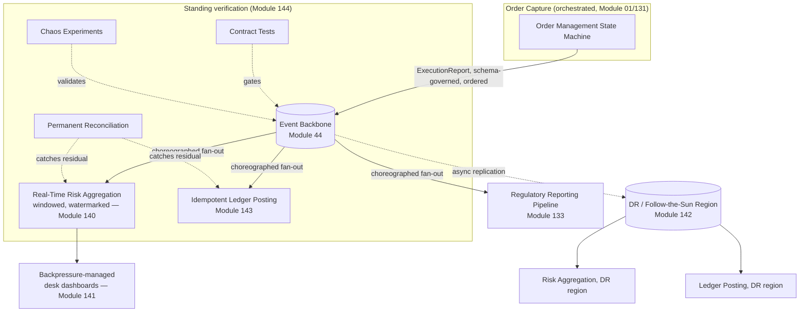
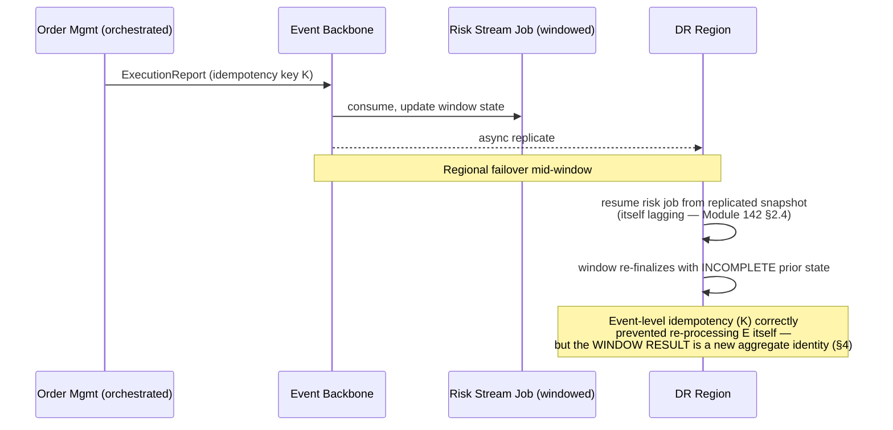
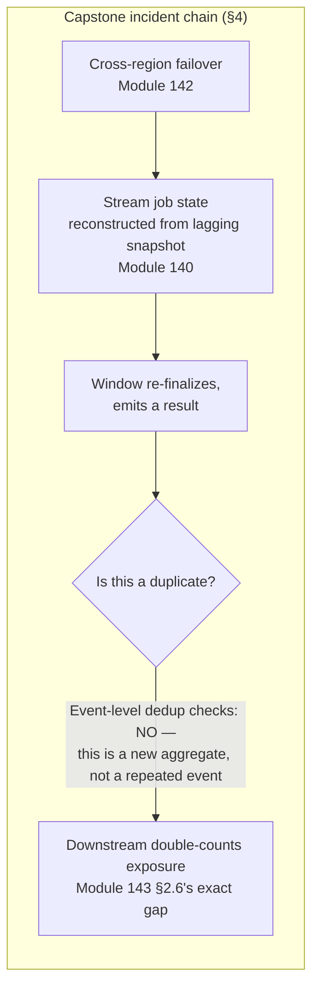
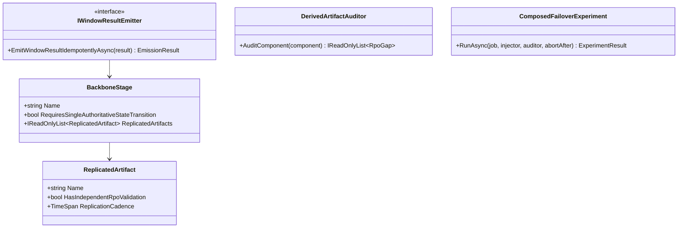

# Module 145 — Event-Driven Architecture Capstone: A Firm-Wide Event Backbone, From Order Capture to Regulatory Reporting

> Domain: Event-Driven Architecture | Level: Beginner → Expert | Prerequisite: [[01-EDA-Fundamentals-Choreography-vs-Orchestration]], [[02-Schema-Evolution-Ordering-DeliverySemantics-DLQ]], [[03-Stream-Processing-Stateful-Operations-Windowing-Time-Semantics]], [[04-Backpressure-Flow-Control-Consumer-Lag]], [[05-CrossRegion-MultiCluster-Event-Distribution]], [[06-Idempotency-ExactlyOnce-Deduplication-At-Scale]], [[07-Testing-ContractTesting-ChaosEngineering-EventPipelines]] — this module assumes and synthesizes all seven

>
> **Scope note:** Sixth and final module extending `18-Event-Driven-Architecture` toward its stated 8-module extra-depth scope (Modules 1–2 plus 140–145). Full 16-section template; Elite FinTech Interview Panel lens.

---

## 1. Fundamentals

**What:** A single, worked architecture for a firm-wide event backbone spanning order capture, execution, real-time risk, cross-region distribution, and regulatory reporting — pulling together every mechanism this domain has established individually, and specifically examining how they interact, since the domain's own incident history (Modules 140–144) shows that mechanisms which are each individually correct can still fail at their seams.

**Why:** Every prior module in this run isolated one concern to explain it clearly — windowing without cross-region replication, idempotency without stream state, testing without considering topology change. Real event backbones run all of these simultaneously, and this capstone's central finding is that **the interactions between correctly-implemented mechanisms are where the least-tested failures live**, not any single mechanism's own internal correctness.

**When:** This is the shape of the event architecture underlying nearly every capital-markets and payments firm's core trade-processing estate — order capture through settlement through regulatory reporting, at the scale and criticality this course's Elite FinTech Interview Panel lens has assumed throughout.

**How (30,000-ft view):**
```
Order Capture (choreographed/orchestrated, Module 01)
        │
        ▼
Execution Reports (schema-governed, ordered, DLQ-protected, Module 02)
        │
        ├──► Stream Processing: real-time risk aggregation (windowed, watermarked, Module 140)
        │            │
        │            ▼
        │     Backpressure-managed consumers (lag-monitored, catch-up-throttled, Module 141)
        │
        ├──► Cross-region replication: DR + follow-the-sun desks (Module 142)
        │
        ├──► Idempotent ledger/settlement posting (effectively-once, Module 143)
        │
        └──► Regulatory reporting pipeline (Module 133, fed by this backbone)

Verified throughout by: contract tests, replay regression, chaos experiments, permanent reconciliation (Module 144)
```

---

## 2. Deep Dive

### 2.1 The Backbone as One System, Not Five Independently-Correct Layers
Modules 140–144 each demonstrated a mechanism working correctly in isolation and a specific incident when its assumptions met a real, exceptional condition. This capstone's first finding: **a firm-wide backbone composes all five mechanisms concurrently, and their interaction surface — not any single mechanism — is the actual object a Principal Engineer must reason about.** A stream-processing window (Module 140) that is also cross-region-replicated (Module 142) and whose output is idempotently consumed (Module 143) has a correctness argument that depends on all three mechanisms' guarantees holding *simultaneously and compatibly*, not merely each holding independently — precisely the composition gap §4's incident exploits.

### 2.2 Order Capture: Choosing Choreography vs. Orchestration at the Point of Truth
Module 01 established the trade-off; a firm-wide backbone applies it differently at each stage. Order capture and execution (Module 131's OMS) use **orchestration** — a single, explicit state machine owning the order lifecycle, because Module 131 §4's own incident (a per-session-scoped `ExecID`) showed how much correctness depends on one authoritative process tracking state transitions. Downstream fan-out — risk aggregation, position updates, client notification — uses **choreography**, since these are independent reactions to a settled fact (an execution occurred) with no need for centralized coordination, and Module 01 §2.6's trade-off (choreography's simplicity against orchestration's auditability) favors choreography once the authoritative state transition has already happened upstream.

### 2.3 The Schema and Ordering Backbone Underneath Everything
Every event flowing through this architecture is schema-registry-governed (Module 44 §2.1), per-key ordered within its partition (Module 44 §2.3), and DLQ-protected against poison messages (Module 44 §2.5) — this is not a separate concern layered on top but the substrate every other mechanism in this capstone assumes. Module 144 §4's incident is the sharpest reminder why: a formally schema-compatible change is not the same claim as "safe for every consumer," and that gap doesn't close just because the schema layer itself is correctly governed.

### 2.4 Real-Time Risk as the Stream-Processing Core
The backbone's real-time risk aggregation is Module 140's windowed, watermarked stream job, computing rolling exposure per instrument and per desk. Its correctness depends on the watermark-driven completeness discipline Module 140 established, and — as §4 below shows — on that discipline continuing to hold when the job's *state itself* must be reconstructed after a regional failover, a condition Module 140 in isolation never had to consider because it didn't yet have Module 142's cross-region dimension layered on top of it.

### 2.5 Idempotency at the Point Where Money Actually Moves
Ledger posting and settlement instruction generation — the backbone's money-moving effects — use Module 143's full discipline: content-derived keys, transactional co-location, and a structural uniqueness backstop. Critically, this protects *individual event* duplication correctly. §4's incident below shows precisely the boundary Module 143 §2.6 already named in the abstract — internal, event-level idempotency does not automatically extend to *aggregate*-level effects, like a stream-processing window's finalized result, which has its own, distinct identity that event-level dedup keys don't naturally cover.

### 2.6 Verification as a Standing, Not a Launch-Time, Discipline
Module 144's pyramid — contract tests, replay regression, chaos experiments, permanent reconciliation — runs continuously against this backbone, not once at initial build. §14's incident below is this capstone's demonstration of Module 144 Expert Q8's own warning: a topology change (a new consumer, a partitioning refactor) can silently outrun test coverage that was complete at the time it was built, and the coverage gap is discovered by production reconciliation exactly as often as by the tests meant to catch it first.

---

## 3. Visual Architecture







---

## 4. Production Example

**Problem:** The firm's real-time risk aggregation stream job — Module 140's windowed exposure calculation, now running as part of this full backbone — consumed execution events and maintained five-minute tumbling windows of net exposure per instrument, replicated cross-region per Module 142's active-passive DR topology for the risk desk's continuity requirement.

**Architecture:** Event-level idempotency (Module 143) protected the stream job's input consumption — each execution event carried a content-derived key, checked before being folded into window state. Window state itself was periodically snapshotted for fast recovery, with the snapshot itself included in cross-region replication per Module 142's standard mechanism.

**Implementation:** A regional network event triggered failover exactly as Module 142 §4 previously described — but by this point the team had already implemented Module 142 §4's fix: timestamp-based resume with a calibrated safety margin, and the replication link's lag was well within the tested worst-case bound. Individually, the cross-region failover behaved correctly.

**Trade-offs:** Snapshotting the stream job's window state for replication, rather than only replicating raw input events and reconstructing state from scratch, was chosen for fast recovery time (Module 140's own recovery-time trade-off, §2.4) — accepting that the snapshot itself, like any replicated artifact, carries its own replication lag (Module 142 §2.1) distinct from the input event stream's lag.

**Lessons learned:** The snapshot replicated to the DR region was, at the moment of failover, roughly 45 seconds older than the primary region's actual window state — well within Module 142's tested RPO bound for *raw event* loss, which the team had explicitly validated. What the team had not separately validated: the risk job's *window state snapshot* had its own, independent replication cadence, less frequent than the raw input event stream, because snapshotting was deliberately throttled to limit its own overhead (an entirely reasonable, unrelated engineering decision made when the snapshot mechanism was first built, long before cross-region replication existed at all).

On failover, the DR region's risk job resumed from the 45-second-stale snapshot and began reprocessing input events from the timestamp-based resume point (Module 142 §2.3's mechanism, working exactly as designed). Those input events were correctly checked against event-level idempotency keys and correctly recognized as not-yet-applied-to-*this*-snapshot — which was true, and was exactly the intended behavior for individual event replay. The window that had already finalized and emitted a result in the primary region *before* the outage was reconstructed from the stale snapshot, replayed forward with the same input events, and finalized *again* — producing a second, freshly-emitted result for a window that downstream consumers had already received and applied.

Downstream desk dashboards, keyed on instrument alone (not on instrument-plus-window-start, the exact conflation Module 140 §14 had previously identified and fixed for a different consumer in a different context), added the second emission's exposure value to the first, doubling several desks' displayed risk figures for approximately twenty minutes before a risk-figure sanity check — comparing displayed exposure against an independent position-based calculation — flagged the divergence.

No component in this incident behaved incorrectly by its own individual specification. Event-level idempotency correctly deduplicated individual events. Cross-region failover correctly resumed from a validated, tested RPO bound for event data. The window-processing logic correctly finalized a window given the state and events it was handed. **The gap lived entirely in the composition**: nobody had asked whether a stream job's *snapshot* replication lag needed the same RPO validation as its *input event* replication lag, because Module 140's original design predated Module 142's cross-region layer, and Module 142's RPO validation had been scoped to raw event data, not to the derived, stateful artifacts a downstream stream job separately maintains.

The fix had three parts. **First**, snapshot replication was brought under the identical RPO-validation discipline as event replication (Module 142 §2.4), with its own measured worst-case lag and its own three-boundary alerting (Module 141's pattern, applied to snapshot lag specifically). **Second**, window results were given their own idempotency treatment distinct from input-event idempotency — a window-result key derived from instrument-plus-window-start (directly reusing Module 140 §14's fix), checked before emission, so a re-finalized window recognizes it has already emitted this specific aggregate and suppresses the duplicate rather than re-emitting it. **Third**, and most consequential for governance: every stateful stream job in the backbone was audited for any derived artifact — snapshots, materialized aggregates, cached lookups — that replicated on a different cadence or mechanism than its raw input events, since this was identified as a structural pattern, not a one-off bug, likely to recur anywhere a team had optimized a derived artifact's replication independently of the events feeding it.

The generalizable lesson: **each mechanism in this backbone (idempotency, replication, windowing) was validated correctly against its own explicit scope, and the incident lived precisely in an implicit scope neither mechanism's owner had reason to consider — the interaction of a second, independently-evolving replication cadence with a stateful computation's identity.** This is Module 142 §2.4's RPO lesson and Module 143 §2.6's internal-versus-external-scope lesson, recurring together, one layer higher than either module individually anticipated.

---

## 5. Best Practices
- Treat every derived, stateful artifact (a stream job's snapshot, a materialized view) as requiring its own explicit RPO validation, distinct from raw input-event replication (§4).
- Give aggregate-level outputs (a finalized window, a computed report) their own idempotency identity, separate from the input events that produced them (§4, Module 140 §14 reused).
- Choose orchestration at the system's authoritative state-transition point and choreography for independent downstream reactions to an already-settled fact (§2.2).
- Run Module 144's full verification pyramid continuously against the composed backbone, not per-mechanism in isolation, since composition gaps don't appear in any single mechanism's own test suite (§2.6).
- Audit for asymmetric replication cadences across a system's raw events and its derived artifacts whenever cross-region replication is added to an existing stateful component (§4's third fix).
- Treat every "this mechanism is correct" claim in this capstone's own component modules as scoped exactly as narrowly as those modules themselves stated it — the composition is where the unscoped assumption creeps back in.

## 6. Anti-patterns
- Validating RPO for raw event replication while leaving a stateful component's own derived-artifact replication unvalidated (§4's incident).
- Assuming event-level idempotency automatically covers aggregate-level (window, report) duplication (§4, Module 143 §2.6).
- Building each mechanism's test suite (Module 144) in isolation without a composed-system test exercising their interaction under the same failure condition.
- Adding cross-region replication to an existing component without re-auditing every artifact that component independently maintains and replicates.
- Treating choreography and orchestration as a single, firm-wide choice rather than a per-boundary decision made deliberately at each stage (§2.2).
- Declaring the backbone "resilient" from any single mechanism's passing validation, without exercising the composed failure condition that actually occurs (§4).

---

## 7. Performance Engineering

**CPU/Memory:** The composed backbone's dominant cost centers are unchanged from its component modules — per-message enrichment (Module 141 §7), stream-state size (Module 140 §2.4), and dedup-check overhead (Module 143 §7) — but now must be budgeted jointly, since a regional failover exercises several of these simultaneously (catch-up load, window reconstruction, dedup-check volume all spike together).

**Latency:** End-to-end latency from order capture to risk-dashboard freshness is the sum of every stage's individual latency plus replication lag where cross-region — Module 141 §7's framing of lag as the dominant latency term applies at the whole-backbone level, not just per-consumer.

**Throughput:** Bounded by the tightest individual-stage ceiling — typically partition count (Module 141 §7) at the highest-volume stage, usually execution-report ingestion.

**Scalability:** The backbone scales by adding capacity at whichever stage is the current bottleneck, which shifts over the system's life — Module 139's platform-engineering lesson that criticality and load concentrate unevenly applies to *stages* of a single backbone just as it applies across independent services.

**Benchmarking:** §4's incident is the definitive argument for benchmarking the *composed* failure condition — a regional failover under real load, exercising every mechanism simultaneously — not each mechanism's isolated benchmark, since the isolated benchmarks were each individually satisfied when the incident occurred.

**Caching:** Reference-data caching (Module 141 §7) remains the highest-leverage per-message optimization; its cold-cache-after-restart risk compounds identically whether the restart is a consumer restart or a regional failover.

---

## 8. Security

**Threats:** A firm-wide backbone spanning order capture through regulatory reporting is high-value: threats include data exposure across the residency boundaries Module 142 §2.7 established, unauthorized replay of settlement-affecting events, and manipulation of stream-processing state to misstate risk exposure.

**Mitigations:** Per-topic residency classification enforced at the replication layer (Module 142 §2.7); idempotency keys derived from authorized-operation content, not attacker-controllable input alone (Module 143 §8); chaos and replay-testing infrastructure handling production-derived data under the same protection as production itself (Module 144 §8).

**OWASP mapping:** Broken access control if a downstream consumer can replay or resubmit events without authorization; sensitive data exposure across the testing-infrastructure boundary (Module 144 §8) if replay fixtures aren't properly anonymized.

**AuthN/AuthZ:** Per-stage, per-principal authorization — order capture's orchestrated state machine, the stream job's window-state access, and cross-region replication credentials are each independently scoped, so a compromise at one stage doesn't cascade into control over another.

**Secrets:** Standard per Module 86 at every stage; cross-region secret provisioning tested during DR drills (Module 142 §8), not assumed to work identically in the secondary region.

**Encryption:** End-to-end across every stage and every cross-region hop, with retained window snapshots and dedup-store content protected at the same classification as the raw events they derive from.

---

## 9. Scalability

**Horizontal scaling:** Each stage scales independently to its own partition-count ceiling (Module 141 §9); the composed backbone's overall capacity is set by whichever stage is currently tightest, which a capacity review should track explicitly rather than assuming uniform headroom.

**Vertical scaling:** Helps stage-local bottlenecks (a compute-heavy risk calculation) but not cross-stage or cross-region constraints.

**Caching:** §7 — reference-data caching as the dominant per-stage lever, cold-start risk compounding under failover.

**Replication/Partitioning:** The backbone's cross-region topology (Module 142) and its per-stage partitioning (Module 44 §2.3) must be reasoned about jointly — §4's incident is exactly a case where each was individually correct and their composition wasn't.

**Load balancing:** Standard per-stage consumer-group balancing; rebalance-triggered lag (Module 141 §9) compounds during any stage's independent deployment, which should be scheduled to avoid overlapping with elevated lag anywhere upstream.

**High Availability:** The backbone's overall availability is the composition of every stage's individual availability design — active-passive for money-moving stages (Module 142 §15's Option A default), evaluated per-stage rather than uniformly.

**Disaster Recovery:** §4's incident is this capstone's central DR lesson: RPO validation must extend to every derived, stateful artifact a component maintains, not only its raw input events — a composed-system DR drill (Module 144's chaos discipline, applied to the whole backbone) is what actually exercises this, not a per-component drill.

**CAP theorem:** Money-moving stages favor consistency (Module 118's CP precedent); risk-dashboard freshness stages favor availability, accepting the staleness Module 141 §9 already establishes as a business decision, not an engineering default.

---

## 10. Interview Questions

### Basic (10)

1. **Q: Why does this capstone treat the backbone as "one system" rather than five independently-correct layers?**
   **A:** Because Modules 140–144 each showed a mechanism working correctly in isolation, and this capstone's incidents show failures specifically at the *interaction* between mechanisms, not within any single one — the composition is the actual object of analysis (§2.1).
   **Why correct:** States the reframing and its evidentiary basis.
   **Common mistakes:** Assuming validating each mechanism independently is sufficient for the composed system.
   **Follow-ups:** "What's the practical implication?" (Testing and DR drills must exercise the composed failure condition, not only per-mechanism benchmarks, §7.)

2. **Q: Why does order capture use orchestration while downstream fan-out uses choreography?**
   **A:** Orchestration provides the single authoritative state machine order-lifecycle correctness depends on (Module 131's precedent); downstream reactions to an already-settled execution fact don't need central coordination, so choreography's simplicity is the better fit there (§2.2).
   **Why correct:** States the criterion — proximity to the authoritative state transition — that determines the choice at each stage.
   **Common mistakes:** Treating choreography-vs-orchestration as one firm-wide architectural decision rather than a per-boundary one.
   **Follow-ups:** "What would go wrong choosing the other way at each stage?" (Choreographed order capture loses the single source of truth Module 131 §4's incident shows is essential; orchestrated fan-out adds unnecessary central-coordinator load and coupling for independent reactions.)

3. **Q: What happened in §4's incident, at a high level?**
   **A:** A stream job's window-state snapshot replicated to the DR region on a slower, independent cadence than the raw input events; after failover, the stale snapshot caused a window to re-finalize and re-emit, and because event-level idempotency doesn't cover aggregate-level (window) identity, downstream consumers double-counted the exposure (§4).
   **Why correct:** States the mechanism and why existing idempotency didn't prevent it.
   **Common mistakes:** Attributing this to a failure of cross-region replication or idempotency individually, when both worked correctly for their own explicit scope.
   **Follow-ups:** "What was the fix?" (Window-result idempotency keyed on instrument-plus-window-start, plus RPO validation extended to derived artifacts, not just raw events, §4's fix.)

4. **Q: Why doesn't event-level idempotency automatically protect a stream job's window output?**
   **A:** A window's finalized result is a distinct, aggregate-level identity computed *from* many events — deduplicating the individual input events correctly doesn't prevent the *computation* itself from being re-run and re-emitted, which is a different operation with a different, uncovered identity (§4, reusing Module 143 §2.6).
   **Why correct:** Distinguishes input-level from output-level idempotency scope.
   **Common mistakes:** Assuming "the consumer is idempotent" covers every effect it produces, rather than only the specific effect its dedup key was designed around.
   **Follow-ups:** "What's the general principle?" (Every distinct effect an event-driven component produces needs its own explicitly-scoped idempotency treatment — Module 143 §2.6's principle, recurring here at the aggregate level.)

5. **Q: Why did the team's existing Module 142 RPO validation not catch this incident?**
   **A:** RPO validation had been scoped to raw input-event replication lag, which was correctly measured and within bound; the stream job's separately-cadenced snapshot replication was a different artifact with its own, unvalidated lag (§4).
   **Why correct:** Identifies the scope gap in what was actually validated.
   **Common mistakes:** Assuming one RPO number covers everything a component replicates, rather than checking each distinct replicated artifact separately.
   **Follow-ups:** "What should RPO validation cover going forward?" (Every derived, stateful artifact a component maintains and replicates, audited explicitly — §4's third fix.)

6. **Q: What does this capstone mean by "the interaction, not the mechanism, is where the failure lives"?**
   **A:** Each individual mechanism (idempotency, replication, windowing) passed its own validation against its own explicit scope; the failure occurred specifically because no validation exercised all three operating together under the same real condition (§2.1, §4).
   **Why correct:** States the composition-versus-component distinction precisely.
   **Common mistakes:** Concluding one specific mechanism was flawed, rather than recognizing the gap was between mechanisms.
   **Follow-ups:** "How would you test for this class of gap going forward?" (A composed chaos experiment exercising cross-region failover against a stateful stream job specifically, per Module 144's discipline extended to the whole backbone, §7.)

7. **Q: Why does this backbone use per-stage, rather than uniform, high-availability design?**
   **A:** Money-moving stages need consistency (favoring active-passive, single-writer correctness) while risk-dashboard freshness stages can favor availability and accept staleness as a business decision — applying one HA policy uniformly would either over-engineer the dashboard or under-protect the ledger (§9).
   **Why correct:** States the differentiated requirement per stage and why uniform treatment is wrong in both directions.
   **Common mistakes:** Assuming "the backbone" needs one consistent HA posture rather than a per-stage decision.
   **Follow-ups:** "Which stage's HA choice is highest-stakes to get wrong?" (The ledger-posting stage — an availability-favoring choice there risks the exact concurrent-write conflicts Module 142 §2.5 warns against.)

8. **Q: What is the standing verification discipline this backbone runs, and why "standing" rather than "at launch"?**
   **A:** Module 144's full pyramid — contract tests, replay regression, chaos experiments, permanent reconciliation — run continuously, because §14's incident (and Module 144 §14's own precedent) shows topology and consumer changes can silently outrun test coverage that was complete when originally built (§2.6).
   **Why correct:** States the mechanism and the reason a one-time validation is insufficient.
   **Common mistakes:** Treating a passing test suite at launch as durable proof of ongoing correctness.
   **Follow-ups:** "What triggers re-validation specifically?" (Any topology change — new consumer, partitioning refactor, added replication — per Module 144 Expert Q8.)

9. **Q: Why is a derived artifact like a stream-processing snapshot a distinct replication risk from the raw events feeding it?**
   **A:** It can be built, versioned, and replicated on its own independent schedule, chosen for reasons (recovery-time optimization) unrelated to and predating any cross-region requirement — meaning its replication lag characteristics can silently diverge from the raw event stream's, with nobody having reason to compare the two until a failover actually exercises both simultaneously (§4).
   **Why correct:** Identifies the independent-evolution risk specific to derived artifacts.
   **Common mistakes:** Assuming all replicated data within one system shares the same lag characteristics by default.
   **Follow-ups:** "What's the audit that catches this?" (An explicit inventory of every artifact a stateful component replicates, each with its own measured RPO — §4's third fix.)

10. **Q: What does this module mean when it says each of Modules 140–144's mechanisms was "correct for its own explicit scope"?**
    **A:** Each mechanism's design and validation were accurate and sufficient for the specific property it claimed to guarantee (event-level dedup, raw-event RPO, per-message ordering); the incident arose from a *composition* none of those individual scopes covered, not from any mechanism failing its own claim (§4, §2.1).
    **Why correct:** Reaffirms the composition-versus-component distinction as the capstone's central finding.
    **Common mistakes:** Reading this incident as evidence any individual mechanism from Modules 140–143 was under-designed, rather than as evidence of a scope gap between them.
    **Follow-ups:** "Is this avoidable in general, or an inherent property of composed systems?" (Reducible but not eliminable — Expert Q10 below addresses this directly.)

### Intermediate (10)

1. **Q: Walk through why §4's incident wasn't preventable by any single component team acting alone.**
   **A:** The stream-processing team correctly built windowing and snapshotting to Module 140's spec; the platform/infrastructure team correctly built and validated cross-region replication to Module 142's spec, including RPO validation for raw events; the idempotency discipline was correctly applied to Module 143's spec at the event level. No team's own component was wrong, and no team owned the specific composed question — "does this component's *snapshot* need its own RPO validation distinct from its input events?" — since that question only exists at the intersection of stream processing and cross-region replication, which is nobody's single ownership boundary by default.
   **Why correct:** Traces the ownership gap precisely to the intersection no single team's mandate covered.
   **Common mistakes:** Assigning blame to one team, when the actual gap was structural — an unowned question at a boundary.
   **Follow-ups:** "How should ownership be assigned to prevent recurrence?" (A cross-cutting architecture review specifically for any component gaining a new dimension — e.g., an existing stream job being added to cross-region scope — owned by whoever approves that addition, not assumed to be covered by either team's existing scope.)

2. **Q: Design the window-result idempotency key that fixes §4's incident.**
   **A:** Derived from the aggregate's own identity — instrument plus window-start timestamp (directly reusing Module 140 §14's fix for a structurally identical conflation) — checked transactionally before emission (Module 143 §2.3's discipline, applied to an aggregate output rather than an input event), so a re-finalized window recognizes "I have already emitted this specific window result" and suppresses the duplicate rather than re-publishing it.
   **Why correct:** Specifies the key's derivation and the transactional check, reusing two previously-established mechanisms in combination.
   **Common mistakes:** Keying the check on the window's *content* (the computed value) rather than its *identity* (instrument plus window-start) — two different re-computations of a correctly-identical window would then be indistinguishable from two different windows with coincidentally equal values.
   **Follow-ups:** "What if the recomputed window's value legitimately differs from the first emission (e.g., late data arrived)?" (That's Module 140's retraction case — a deliberate, distinct-from-duplication update, requiring the downstream consumer to treat it as a replacement per Module 140 §14's established handling, not as an unexpected extra addition.)

3. **Q: Why does this capstone recommend a composed chaos experiment specifically simulating cross-region failover of a stateful stream job?**
   **A:** Because §4's incident specifically required all three conditions simultaneously — active cross-region replication, a stateful stream job with its own snapshot cadence, and an actual failover event — and no single-mechanism chaos experiment (Module 141's lag injection, Module 142's DR drill, Module 143's replay test) individually exercises that specific combination (Intermediate Q1, §7).
   **Why correct:** Identifies exactly which combination of conditions the incident required and why no existing single-purpose experiment covers it.
   **Common mistakes:** Assuming a full suite of individually-passing chaos experiments is equivalent to a composed one.
   **Follow-ups:** "What would this experiment's success criterion be?" (No duplicate window emission detected downstream after an injected failover — directly testing the fix from Intermediate Q2, not merely that failover completes.)

4. **Q: How does this capstone's choreography-at-fan-out decision (§2.2) interact with Module 123's saga discipline for settlement?**
   **A:** Settlement itself, once triggered by an execution event, is Module 123's orchestrated saga — spanning settlement, ledger, and regulatory services with compensating transactions — nested *within* the backbone's broader choreographed fan-out. The distinction is scope: choreography governs how independent downstream systems each learn about an execution; orchestration governs the specific, auditable, multi-step business process (settlement) that one of those systems then explicitly manages. Both coexist because they answer different questions at different scopes.
   **Why correct:** Clarifies that choreography and orchestration aren't mutually exclusive architecture-wide choices but coexist at different scopes within the same backbone.
   **Common mistakes:** Treating "the backbone uses choreography" as a blanket statement that would exclude Module 123's saga orchestration, when they operate at nested, distinct scopes.
   **Follow-ups:** "Where else in the backbone does this nesting occur?" (Regulatory reporting's own internal repair-loop process, Module 133, is itself an orchestrated sub-process triggered choreographically by the backbone's broader event flow.)

5. **Q: Critique validating RPO only for a component's primary datastore, not its secondary derived structures (indexes, materialized views, caches persisted for recovery).**
   **A:** §4 generalizes beyond stream-processing snapshots specifically — any derived, persisted structure a component maintains for its own operational reasons (a materialized read model, Module 34's CQRS projections, a recovery-optimized cache) carries the identical risk if it's replicated independently of the primary data it derives from, and its replication lag is unvalidated. The critique is structural: RPO validation scoped to "the database" rather than "every persisted, replicated artifact this component owns" systematically misses this class of gap.
   **Why correct:** Generalizes §4's specific finding to the broader category of derived, independently-replicated structures.
   **Common mistakes:** Treating §4 as a stream-processing-specific lesson rather than recognizing the same risk in CQRS read models, caches, or any other derived structure.
   **Follow-ups:** "Where in this course's other modules does this same risk already appear?" (Module 34/CQRS's read-model projections — Module 120's per-consumer, never-shared reconciliation cadence is the same discipline, applied there for a different triggering reason.)

6. **Q: How should the composed backbone's testing pyramid (Module 144) be prioritized given limited investment, across its five major stages?**
   **A:** Per Module 144 §15's Option C — concentrate the full pyramid (contract, replay, chaos) on the highest-criticality stages by consequence of an undetected failure, which for this backbone means money-moving stages (ledger posting, settlement) and any stage feeding regulatory reporting first, with risk-dashboard freshness stages receiving lighter (contract-and-replay-only) coverage, since a stale or briefly-wrong dashboard has materially lower consequence than a duplicated ledger entry or a missed regulatory obligation.
   **Why correct:** Applies Module 144's own established prioritization framework to this specific backbone's stage-by-stage criticality.
   **Common mistakes:** Applying uniform testing investment across all five stages, over-investing in low-consequence stages while under-investing in the highest-stakes ones.
   **Follow-ups:** "Where does §4's incident's stage fall in this prioritization?" (Real-time risk aggregation feeds trading decisions and desk risk limits — high consequence, meriting full-pyramid coverage, which is exactly why the fix included a new composed chaos experiment rather than accepting the gap.)

7. **Q: Apply this course's "declared ≠ actual" theme to §4's incident specifically.**
   **A:** The declared claim was "this backbone has validated cross-region RPO" — true, and evidenced by a passing DR drill per Module 142's discipline. The actual scope of what was validated was narrower than the claim's apparent breadth: raw event RPO specifically, not every derived artifact's independent replication lag. This is the identical structural pattern Module 142 Expert Q1 named for RPO claims generally, now shown concretely composing with a second mechanism (stream-processing snapshots) neither module individually anticipated needing to cross-reference.
   **Why correct:** Identifies the specific narrower-than-claimed scope and connects it to the exact prior module that predicted this class of gap in the abstract.
   **Common mistakes:** Treating this as a novel failure mode, when Module 142 Expert Q1 had already named the general pattern — this incident is that pattern's concrete instantiation, one layer deeper.
   **Follow-ups:** "What would make the RPO claim's scope explicit enough to avoid this?" (An RPO statement that enumerates every replicated artifact by name, not a single number implicitly assumed to cover "the component's data" generically.)

8. **Q: How does §4's fix (window-result idempotency) interact with the backbone's downstream regulatory reporting stage?**
   **A:** Regulatory reporting (Module 133) consumes derived risk and position figures that themselves depend on correctly-deduplicated window results — a duplicated window emission that reached the reporting pipeline before detection could have propagated into a materially incorrect regulatory submission, which Module 133 §4's own established lesson (an unidentified event is invisible to completeness reconciliation) shows would not necessarily have been caught by regulatory-side reconciliation alone, since a *duplicated* figure isn't a *missing* one and requires a different detection approach (a magnitude sanity check, which is in fact what caught §4's incident here).
   **Why correct:** Connects the incident's blast radius to a specific downstream consumer and identifies why that consumer's own established detection mechanism (completeness reconciliation) wouldn't have caught this particular failure mode.
   **Common mistakes:** Assuming Module 133's regulatory completeness reconciliation is a general-purpose safety net covering any upstream data-quality issue, rather than recognizing it's specifically scoped to detect missing, not duplicated, data.
   **Follow-ups:** "What detection would specifically catch a duplicated regulatory figure?" (A magnitude or trend sanity check comparing submission figures against an independent historical baseline — structurally different from completeness reconciliation, and worth adding to Module 133's pipeline as a distinct control.)

9. **Q: How would this capstone's incident change if the backbone used active-active rather than active-passive cross-region replication for the risk-aggregation stage?**
   **A:** Active-active would avoid the failover-triggered re-finalization entirely for the *DR-continuity* case (no failover occurs, since both regions are already live) — but would introduce Module 142 §2.5's conflict-resolution requirement for the shared aggregate state itself, since both regions would need to independently compute or reconcile the same windows, which is a different, and arguably harder, problem than this incident's failover-specific one. The trade is not "avoided" but "exchanged" — active-active substitutes a permanent conflict-resolution design burden for an occasional failover-triggered re-finalization risk.
   **Why correct:** Correctly identifies that active-active doesn't eliminate the risk category but substitutes a different, standing one, per Module 142 §15's established trade-off framework.
   **Common mistakes:** Assuming active-active is a strictly safer choice because it avoids failover, without accounting for the conflict-resolution burden it introduces instead.
   **Follow-ups:** "Which is the better choice for this specific stage?" (Active-passive remains preferable for risk aggregation specifically, since Module 142 §15's Option A default applies and the occasional-failover risk, once fixed per §4, is now well-understood and bounded, versus a permanent conflict-resolution design cost for a stage where a single authoritative computation is naturally the correct model.)

10. **Q: Synthesize how §4's incident demonstrates the value of this capstone's entire premise — building one integrated architecture rather than treating each module as independently complete.**
    **A:** Modules 140–143, studied independently, each conclude with a well-validated, correctly-scoped mechanism and an honestly-stated residual risk within that mechanism's own boundary. None of those residual-risk statements, taken alone, predicts §4's incident — it required stream processing's stateful recovery-time trade-off (Module 140 §2.4) to compose with cross-region replication's RPO scoping (Module 142 §2.4) in a way neither module's own residual-risk framing anticipated, because neither module's authors were reasoning about the other's mechanism at design time. This is precisely why a capstone that composes the mechanisms, rather than one more isolated module, is where this class of gap becomes visible.
    **Why correct:** States explicitly why composition, not additional isolated depth, is what surfaces this incident class.
    **Common mistakes:** Treating the capstone as merely a review or summary of prior modules, missing that its actual pedagogical function is surfacing an incident class none of the prior modules could individually produce.
    **Follow-ups:** "Does this mean every possible composition needs its own dedicated module?" (No — Expert Q10 addresses why this is intractable to fully enumerate, and what the actual, sustainable defense is instead.)

### Advanced (10)

1. **Q: Diagnose §4's incident and design the complete structural fix.**
   **A:** Root cause: a stream-processing snapshot replicated on an independent, unvalidated cadence relative to raw input events, and event-level idempotency didn't cover the resulting aggregate-level (window) re-emission after failover reconstructed state from a stale snapshot. Fix: (1) window-result idempotency keyed on instrument-plus-window-start, checked before emission (Intermediate Q2); (2) RPO validation extended explicitly to every derived, replicated artifact a stateful component maintains, not only its raw events (Intermediate Q5's generalization); (3) a composed chaos experiment specifically simulating cross-region failover of a stateful stream job, added to the standing experiment inventory (Intermediate Q3); (4) a magnitude-based sanity check added to regulatory-reporting consumption of derived risk figures, since completeness reconciliation alone doesn't catch duplication (Advanced Q8).
   **Why correct:** Addresses the specific aggregate-identity gap, the RPO-scoping gap, the missing composed test, and the downstream detection gap.
   **Common mistakes:** Fixing only the window-result idempotency (point 1), leaving the RPO-scoping gap able to produce a structurally similar incident for any other derived artifact in the estate.
   **Follow-ups:** "Which fix is most likely to prevent a *different* incident in the future, not just recurrence of this one?" (Point 2 — the RPO-scoping audit, since it addresses the general category rather than only this specific manifestation.)

2. **Q: A Principal Engineer is asked whether this backbone's architecture is "correct." How should they answer, given this capstone's findings?**
   **A:** Not as a binary claim — per this domain's recurring "declared ≠ actual" theme, "correct" must be stated as a specific, scoped claim: which conditions have been validated (which failure modes, at what scale, under what composed conditions), and which residual risks remain explicitly known and monitored versus genuinely unknown. §4's incident occurred in a backbone every component of which had passed its own individual validation — the honest answer names the validated scope precisely and states that composed, cross-mechanism validation is inherently incomplete and requires ongoing, not one-time, investment (Module 144 §2.6).
   **Why correct:** Refuses the binary framing and gives the scoped, honest alternative this course has established as the correct response pattern throughout.
   **Common mistakes:** Answering "yes, it's been tested and validated" as a complete answer, reproducing exactly the unscoped-claim pattern this capstone's own incident demonstrates the danger of.
   **Follow-ups:** "How would you communicate this to a non-technical stakeholder?" (State what's been validated and what residual risk is actively monitored — Module 141 Expert Q8's stakeholder-freshness framing, generalized to "here's what we know, here's what we watch for.")

3. **Q: Design the governance process that catches a §4-shaped gap before it reaches production, for a new cross-cutting capability being added to an existing component.**
   **A:** Any change adding a *new dimension* to an existing component — cross-region replication added to a previously single-region stream job, a new consumer added to an existing topic, active-active added to a previously active-passive stage — triggers a mandatory cross-cutting review answering: what does this component *already* independently maintain and replicate/persist beyond its primary data path, and does the new dimension's validation (RPO, idempotency, ordering) explicitly cover each of those artifacts, not just the primary one. This directly operationalizes Module 144 Expert Q8's topology-change trigger, made concrete for the specific "adding cross-region to an existing stateful component" case §4 represents.
   **Why correct:** Specifies the trigger condition and the exact question the review must answer, derived directly from §4's root cause.
   **Common mistakes:** Reviewing only the new capability's own design (does cross-region replication work correctly) without auditing what the *existing* component already independently maintains that the new capability now also needs to cover.
   **Follow-ups:** "Who should own this review?" (A joint review between the component's owning team and whichever team owns the new cross-cutting capability being added — neither alone has full visibility into both the component's existing derived artifacts and the new capability's validation scope, mirroring Intermediate Q1's ownership-gap finding.)

4. **Q: How does §4's incident relate to Module 137's cell-based containment, applied to this backbone?**
   **A:** If risk aggregation ran per-cell (Module 137's containment unit) rather than as one estate-wide stream job, §4's incident would have been contained to whichever cell's region failed over — a materially smaller blast radius than an estate-wide double-count. This doesn't eliminate the root cause (the RPO-scoping gap would still exist per-cell) but bounds its consequence, exactly matching Module 137 §4's own established distinction between reducing failure *frequency* (resilience, not what cells do) and bounding failure *impact* (containment, what cells do) — §4's incident is a frequency problem cells wouldn't have prevented, but its impact is exactly what cell boundaries would have limited.
   **Why correct:** Correctly applies Module 137's frequency-versus-impact distinction to this specific incident, rather than claiming cells would have prevented it outright.
   **Common mistakes:** Claiming cell-based architecture would have prevented the incident, when it would only have bounded its blast radius — a materially different and more honest claim.
   **Follow-ups:** "Would cell-based risk aggregation introduce its own new risk?** (Yes — per-cell exposure figures require an additional aggregation step to produce a firm-wide risk view, which is itself a new composed computation subject to this same class of scope gap, illustrating Expert Q10's point that composition risk is not eliminable, only ever bounded and relocated.)

5. **Q: Critique treating §4's fix as "complete" once the specific window-result idempotency gap is closed.**
   **A:** The fix closes the specific manifestation; Advanced Q1's point 2 (the RPO-scoping audit) is what addresses the *category*, and even that audit is bounded to artifacts known and inventoried at the time it runs — a future component adding its own new derived, independently-replicated artifact after the audit would reintroduce the identical category of gap, undetected by the audit's historical snapshot. "Complete" is not an achievable state for this class of risk; the honest framing is "the known instance is closed, and an ongoing discipline — not a one-time audit — is what manages the category going forward" (Module 144 §2.6's standing-not-launch-time principle, applied here).
   **Why correct:** Distinguishes closing a specific incident from closing the risk category, and states why even a thorough audit doesn't achieve the latter permanently.
   **Common mistakes:** Treating a completed remediation checklist as evidence the risk category itself is closed, rather than only its currently-known instances.
   **Follow-ups:** "What ongoing mechanism keeps this current?" (The topology-change-triggered review from Advanced Q3, run on every future addition of a new dimension to an existing component — a standing process, not a one-time audit.)

6. **Q: A regulator asks how the firm ensures its real-time risk figures are accurate during and after a regional failover. Answer.**
   **A:** Describe the layered chain: window-result idempotency preventing aggregate-level duplication on re-finalization (Advanced Q1's point 1), RPO validation extended to every derived artifact including stream-state snapshots (point 2), a composed chaos experiment specifically validating this exact failure class before it can recur (point 3), and a magnitude-based sanity check on regulatory-facing figures as an independent, aggregate-appropriate detection layer distinct from completeness reconciliation (point 4). State the residual honestly: composed-system validation is inherently incomplete for genuinely novel combinations of conditions (Advanced Q5), which is why the sanity check and ongoing topology-change review (Advanced Q3) exist as permanent, not one-time, controls.
   **Why correct:** Gives the full layered chain and states the honest residual with its governing ongoing mechanism, consistent with every other "how do you guarantee X" answer this domain has modeled.
   **Common mistakes:** Claiming the specific fix eliminates all future risk of this class, rather than stating what it closes and what remains an ongoing discipline.
   **Follow-ups:** "What would change the answer to a stronger guarantee?" (Nothing structurally — Expert Q10 argues this is an inherent property of composed distributed systems, not a solvable-once problem; the honest answer is always "here is the current known-scope validation and the ongoing process that expands it," not a static completeness claim.)

7. **Q: Apply this course's "verify the verifier" theme to this capstone's own testing pyramid, given §4's incident occurred despite Module 144's discipline being in place.**
   **A:** §4's incident occurred *before* the composed chaos experiment (Advanced Q1 point 3) existed — Module 144's pyramid was applied per-mechanism (each of Modules 140–143 individually had its own tests) but had not yet been extended to the specific composed condition. This is not a failure of "verify the verifier" so much as a demonstration of Module 144 Expert Q8's own explicit warning: a testing pyramid's coverage is scoped to what it was built against, and a new composition (cross-region added to an existing stream job) is exactly the kind of topology change that silently outruns existing coverage until deliberately re-scoped. The "verify the verifier" question here is: does the organization have a process that *notices* when a new composition has occurred and asks whether test coverage was extended to match — and prior to this incident, it did not.
   **Why correct:** Correctly distinguishes "the tests had a bug" from "the tests were never scoped to cover this new composition," and identifies the actual missing process.
   **Common mistakes:** Concluding Module 144's testing discipline failed or was insufficiently rigorous, when the actual gap was a missing trigger for extending coverage to a new composition, precisely as that module's own Expert Q8 predicted.
   **Follow-ups:** "What closes this gap going forward?" (Advanced Q3's topology-change-triggered review, which now explicitly includes "does this change require new composed test coverage" as a standing checklist item.)

8. **Q: How should engineering leadership prioritize investment between (a) building more individual mechanisms and (b) hardening the composition of existing ones, given finite capacity?**
   **A:** The backbone's individual mechanisms (Modules 140–143) each address a well-understood, previously-incident-demonstrated risk class with clear ROI; composition-hardening (this capstone's finding) addresses a less bounded, harder-to-fully-enumerate risk class whose incidents are rarer but, per §4, can be higher-consequence precisely because no single team's mandate covers them by default. The recommendation is not "prefer one over the other" but explicit, named investment in composition-hardening as its own budget line — a cross-cutting architecture review function and a standing composed-chaos-experiment program (Advanced Q3) — rather than assuming it's implicitly covered by the sum of individual-mechanism investment, which §4 demonstrates it is not.
   **Why correct:** Names composition-hardening as a distinct investment category requiring explicit budget, rather than assuming it's a byproduct of individual-mechanism investment.
   **Common mistakes:** Treating composition risk as automatically addressed once every individual mechanism is well-built, which is precisely the assumption §4's incident disproves.
   **Follow-ups:** "How would you justify this budget line to a skeptical stakeholder?" (Expert Q3's counterfactual-cost argument, applied at the composition level: the cost of a scheduled, scoped composed chaos program against the cost of discovering the next §4-shaped gap unplanned, in production, at real scale.)

9. **Q: How does this capstone's finding relate to Module 139's closing lesson for the Microservices domain — "every discipline is individually straightforward and fails through inconsistent application at scale"?**
   **A:** They're related but distinct: Module 139's finding is about *consistency* — the same discipline applied unevenly across many services. This capstone's finding is about *composition* — multiple different, individually well-applied disciplines interacting at their boundaries in ways neither discipline's own design anticipated. Module 139's fix (platform engineering, paved paths) addresses uneven application; this capstone's fix (composed testing, cross-cutting review) addresses boundary interactions between correctly and consistently applied disciplines. Both are failures that occur despite — not because of — individually sound engineering, which is this course's broader recurring pattern at two different structural levels.
   **Why correct:** Distinguishes the two failure categories precisely while identifying their shared meta-pattern (soundness at the component level, failure at a level components don't individually address).
   **Common mistakes:** Conflating the two findings as the same lesson, missing that one is about horizontal consistency and the other about vertical/cross-cutting interaction.
   **Follow-ups:** "Which is harder to defend against in practice?" (Composition risk, arguably — consistency gaps are visible via an audit comparing services against each other; composition gaps require imagining interactions between mechanisms that were never designed with each other in mind, which is a fundamentally harder search space, directly motivating Expert Q10's answer.)

10. **Q: Synthesize the governance for this firm-wide event backbone as a single, coherent operating discipline.**
    **A:** (1) Per-boundary choreography/orchestration decisions made explicitly, not defaulted (§2.2). (2) Every mechanism (schema, ordering, stream processing, lag, replication, idempotency) validated to its own explicit, stated scope, with that scope documented rather than assumed (Advanced Q2). (3) Every derived, independently-replicated artifact inventoried and RPO-validated individually, not assumed covered by its component's primary-data validation (Advanced Q1 point 2). (4) A mandatory cross-cutting review triggered by any new dimension added to an existing component (Advanced Q3), explicitly including a test-coverage-extension check (Advanced Q7). (5) Testing investment prioritized by per-stage criticality (Intermediate Q6) with an explicit, budgeted composition-hardening program alongside individual-mechanism investment (Advanced Q8). (6) Permanent, aggregate-appropriate detection (magnitude sanity checks, not only completeness reconciliation) at every consequential downstream consumer (Advanced Q6).
    **Why correct:** Covers per-boundary architectural decisions, scoped validation, derived-artifact RPO, cross-cutting change governance, prioritized investment, and downstream detection as six distinct, individually necessary controls operating at the whole-backbone level.
    **Common mistakes:** Governing each component module's own discipline thoroughly while leaving the cross-cutting, composition-level governance implicit or assumed, which is exactly where §4's incident occurred.
    **Follow-ups:** "Which single control would have most changed §4's outcome if it alone had existed beforehand?" (Point 3 — the derived-artifact RPO audit — since it would have surfaced the snapshot-cadence mismatch directly, before any failover ever exercised it.)

### Expert (10)

1. **Q: Evaluate whether a firm-wide event backbone of this scale and criticality can ever be declared "fully tested."**
   **A:** No, and the honest framing matters: "fully tested" implies a completable state, while this capstone's finding is that composition risk grows combinatorially with the number of interacting mechanisms and the number of ways each can independently evolve (a new consumer, a new region, a new derived artifact) — the space of possible compositions is not enumerable in advance. The achievable and correct goal is not completeness but **currency**: validated coverage that is explicitly scoped, visibly tracked against a living inventory of known mechanisms and their interactions (Module 144's taxonomy, extended to composition pairs), and re-triggered on every topology change (Advanced Q3) — a standing discipline, never a finished project.
   **Why correct:** Rejects the completable-state framing explicitly and names the achievable substitute (currency, not completeness) with its concrete mechanism.
   **Common mistakes:** Treating "fully tested" as an aspirational but theoretically achievable goal, rather than recognizing it as a category error for a system of this compositional complexity.
   **Follow-ups:** "How would you measure 'currency' concretely?" (Time since the last composed-chaos-experiment cycle covering each stage-pair, and count of un-reviewed topology changes since the last cross-cutting review — leading indicators of coverage staleness, not a binary pass/fail.)

2. **Q: How does §4's incident change the answer to "is Kafka's exactly-once semantics sufficient for this backbone's risk-aggregation stage," given Module 143 §2.5's scoping?**
   **A:** Module 143 §2.5 established that exactly-once semantics covers computation *within* the broker-and-consumer-group transactional boundary — and §4's incident shows that boundary itself is insufficient once cross-region replication of the *stream job's own recovery state* sits outside it. Kafka's transactional guarantee protects the consume-process-produce-commit cycle in the primary region; it says nothing about a snapshot replicated to a second cluster entirely, which is a boundary Module 143 never needed to consider because Module 143 was written before this capstone composed it with Module 142. This is the concrete evidence for Module 143 §2.5's own abstract warning, encountered as an actual production incident one composition deeper than that module's original scope.
   **Why correct:** Traces exactly how Module 143's own stated boundary is the boundary §4's incident crossed, showing the abstract warning was precisely accurate and simply hadn't yet been composed with the specific mechanism that exercised it.
   **Common mistakes:** Concluding Kafka's exactly-once guarantee is insufficiently strong in general, rather than recognizing it performed exactly as scoped and the incident occurred entirely outside that scope.
   **Follow-ups:** "What would extend the guarantee to cover this?" (Nothing at the Kafka layer — cross-cluster replication is fundamentally outside any single cluster's transactional boundary by construction, which is why the fix operates at the application layer, via window-result idempotency, rather than by seeking a stronger broker-level guarantee.)

3. **Q: A new Principal Engineer joins the team and proposes formally modeling every possible interaction between this backbone's mechanisms (a full interaction matrix) to eliminate composition risk systematically. Evaluate.**
   **A:** A genuine improvement over ad hoc discovery, but bounded by the same combinatorial growth Expert Q1 identifies — the matrix grows with every new mechanism, region, consumer, and derived artifact, and modeling effort must be weighed against its diminishing marginal return for increasingly rare compositions. The more sustainable version: model interactions between mechanism *categories* (stateful recovery × cross-region replication, idempotency scope × aggregate computation) rather than every concrete instance, since §4's incident is itself a specific instantiation of a category (derived-artifact RPO scoping) that, once named, transfers to any future instance without needing to be separately modeled — this is precisely Advanced Q1 point 2's audit, generalized as an ongoing modeling discipline rather than a one-time matrix.
   **Why correct:** Credits the proposal's genuine value while identifying its combinatorial limit, and redirects toward the tractable, category-level version already implicit in this capstone's fix.
   **Common mistakes:** Either dismissing the proposal entirely (missing its real value at the category level) or endorsing full instance-level modeling as achievable (missing the combinatorial growth problem Expert Q1 already established).
   **Follow-ups:** "How do you know when a new category, rather than a new instance, has appeared?" (When an incident's root cause doesn't map onto any previously-named category in the taxonomy — exactly how §4 itself was discovered and then generalized into Advanced Q1 point 2's category-level fix.)

4. **Q: How should this backbone's architecture evolve differently for a firm operating under stricter regulatory capital requirements (where risk-figure accuracy has direct capital implications) versus one where risk figures are advisory only?**
   **A:** For capital-implicated risk figures, §4's incident's consequence class shifts from "displayed dashboard error, caught by sanity check" to "potential regulatory capital misstatement," which changes the acceptable residual risk profile entirely — the magnitude-sanity-check detection (Advanced Q6) that was an adequate secondary control for a dashboard becomes insufficient as the *sole* secondary control where capital calculations are downstream, warranting synchronous, pre-publication validation (a CP-favoring design, Module 118's precedent) for the capital-relevant computation path specifically, even at real latency cost, while advisory-only risk figures can retain the AP-favoring, eventually-detected design this capstone otherwise recommends.
   **Why correct:** Ties the architectural recommendation directly to the specific downstream consequence class, rather than proposing one universal design regardless of what the figures are used for.
   **Common mistakes:** Applying one risk-aggregation architecture uniformly regardless of downstream consequence, rather than differentiating by what depends on the figure's correctness.
   **Follow-ups:** "What would synchronous pre-publication validation look like concretely?" (A blocking reconciliation check against an independent, simpler calculation before capital-relevant figures are published — accepting latency for the specific path where Module 118's CP-favoring precedent applies, while leaving advisory paths on the faster, eventually-consistent design.)

5. **Q: A cost-optimization review proposes eliminating the composed chaos-experiment program (Advanced Q1 point 3) after two years of clean results, redirecting the budget elsewhere. Evaluate.**
   **A:** Two years of clean results from a composed chaos program is evidence the currently-known composition space is well-defended, not evidence the composition-risk category itself has been eliminated — per Expert Q1, new topology changes continuously reopen the space, and a program's clean history reflects the compositions it has been testing, not the ones it hasn't yet been extended to cover. This is structurally identical to Module 141 Advanced Q3's critique of retention reduction based on steady-state cost logic: the clean-results argument evaluates the program's cost against its own historical output, not against the counterfactual risk it continues to suppress by existing.
   **Why correct:** Applies the identical "steady-state evidence doesn't justify removing a control designed for rare, high-consequence conditions" reasoning this course has established elsewhere, naming the specific prior precedent it mirrors.
   **Common mistakes:** Treating a clean track record as evidence a preventive control is no longer needed, rather than as evidence it has been successfully doing its job.
   **Follow-ups:** "What would legitimately justify reducing this investment?" (Evidence the compositional space has genuinely stabilized — no new mechanisms, regions, or derived artifacts added in a defined period — not merely the absence of an incident, which could equally mean the program hasn't yet been extended to cover the next gap.)

6. **Q: How does this capstone's central finding — composition risk as distinct from component risk — relate to the CAP theorem discussions scattered throughout Modules 140–144?**
   **A:** Each individual module's CAP discussion (Module 141 §9, Module 142 §9, Module 143 §9) correctly analyzes one mechanism's own consistency-availability trade at its own boundary. §4's incident shows that a *composed* system's effective CAP behavior is not simply the union or intersection of its components' individual trade-offs — the stream job's stateful recovery, layered under cross-region replication, produced a consistency failure (duplicate aggregate emission) that neither component's own CAP analysis, taken alone, predicted, because the failure lived in the recovery-and-replication interaction, not in either mechanism's steady-state behavior that CAP theorem discussions typically address.
   **Why correct:** Identifies that CAP analysis, like the individual mechanism validations themselves, is typically scoped per-component and doesn't automatically compose, extending this capstone's central finding to this specific analytical framework.
   **Common mistakes:** Assuming a system's overall CAP characteristics can be derived by simply combining each component's individually-stated trade-off, missing that recovery and reconstruction paths introduce their own, separately-analyzable consistency risk.
   **Follow-ups:** "How would you extend CAP analysis to cover this?" (Explicitly analyze the *recovery path* of any stateful component as its own consistency question, distinct from its steady-state read/write behavior — §4's failure was entirely in the recovery path, which standard CAP framing, focused on ongoing operation, tends to underweight.)

7. **Q: A regulator, reviewing this incident during an examination, asks why the firm's architecture didn't anticipate this failure mode given the individual risks (stateful recovery, cross-region replication) were each independently well-documented internally. Construct the honest response.**
   **A:** Each risk was genuinely well-documented and well-mitigated within its own module's scope — Module 140's recovery-time trade-off and Module 142's RPO discipline were both mature, tested disciplines. The gap was not a failure to document known risks but the absence of a standing process that specifically reviews *new compositions* of already-well-understood individual risks, which is a distinct organizational capability from documenting the individual risks themselves. The firm's response — extending governance to explicitly require a cross-cutting review triggered by any new composition (Advanced Q3), and reframing testing investment to include a dedicated composition-hardening budget line (Advanced Q8) — directly addresses the actual gap identified, which is a more credible and specific answer than either denying the gap existed or overclaiming it's now permanently closed.
   **Why correct:** Gives a specific, honest account of what was and wasn't in place, and names the precise organizational capability that was added, avoiding both defensiveness and overclaiming.
   **Common mistakes:** Either denying a gap existed (contradicted by the incident itself) or claiming the fix makes recurrence of any similar incident impossible (contradicted by Expert Q1's combinatorial-growth argument).
   **Follow-ups:** "How would you demonstrate this new capability is functioning, not just documented?" (A record of cross-cutting reviews actually triggered and completed for subsequent topology changes, with findings — evidence of the process operating, not merely existing on paper, mirroring Module 142 Advanced Q5's drill-realism critique.)

8. **Q: How should an organization's incident-review process itself be structured to reliably surface composition-class findings like this capstone's, rather than settling for single-mechanism root causes?**
   **A:** A root-cause analysis that stops at "the stream job's snapshot lagged" or "idempotency didn't cover this case" identifies a proximate, single-mechanism cause and risks missing the composition-level lesson entirely. The structural fix is a mandatory review step asking explicitly: "which two or more independently-correct mechanisms combined to produce this outcome, and was their combination previously reviewed by anyone?" — forcing the analysis past the first sufficient-looking explanation into the cross-cutting question this capstone's own incident required to actually generalize into Advanced Q1 point 2's audit and Advanced Q3's ongoing review process.
   **Why correct:** Names the specific analytical discipline (an explicit composition question) that distinguishes a proximate-cause finding from the generalizable, category-level lesson this capstone actually needed to extract.
   **Common mistakes:** Treating "we found and fixed the root cause" as sufficient once the proximate, single-mechanism explanation is identified, without the additional step of asking whether it represents a broader, composition-level category.
   **Follow-ups:** "Who should be in the room for this composition-focused review step?" (Representatives from every mechanism's owning team, not just the team whose component the proximate cause landed in — since the composition question, by definition, requires perspective from more than one mechanism's owner.)

9. **Q: This capstone closes `18-Event-Driven-Architecture`'s extra-depth arc (Modules 140–145). What is the single finding that would most change how a Principal Engineer approaches the *next* domain extension this course undertakes?**
   **A:** That depth added module-by-module, each correctly scoped and validated in isolation, does not automatically compose into depth at the system level — the last module in any such arc should be explicitly reserved, as this one was, for composing the prior modules' mechanisms against each other and asking what fails at their boundaries, rather than assuming the individual modules' sum already constitutes complete coverage. This is a transferable finding for how *any* domain's extra-depth arc should be structured and closed, not specific to event-driven architecture.
   **Why correct:** Extracts the meta-lesson about how depth-building arcs should be structured generally, generalizing beyond this specific domain.
   **Common mistakes:** Treating this capstone's finding as specific to event-driven systems' particular mechanisms, missing that the structural lesson (composition risk is distinct from and additional to component risk) applies to any sufficiently deep, multi-module technical arc.
   **Follow-ups:** "Does this apply to this course's own structure, beyond just this domain?" (Yes — any domain with multiple extension modules, per this file's own `CLAUDE.md` cross-module-synthesis requirement, should reserve capstone effort for genuine composition, not merely a summary of what preceded it — which is exactly the standard this module has attempted to meet.)

10. **Q: Deliver the closing synthesis for `18-Event-Driven-Architecture`'s full arc: what is the domain's one recurring finding, stated at its most general?**
    **A:** Across all eight modules — fundamentals through this capstone — the domain's single most consequential, most repeated finding is that **event-driven systems fail silently, at scopes their individual mechanisms were never designed to cover, in ways that no component's own correctness disproves.** Module 140's dropped-late-data incident, Module 141's catch-up collapse, Module 142's replication-gap and split-brain incidents, Module 143's retention-boundary and external-effect incidents, Module 144's undeclared-assumption incidents, and this capstone's composition incident are eight distinct manifestations of one structural property: **asynchronous, distributed processing removes the immediate, visible failure signal synchronous systems provide by default, and every mechanism this domain builds — idempotency, replication, windowing, testing — is a deliberate, partial answer to that absence, correct only within a scope that must be stated explicitly and revisited continuously, never assumed complete.** The Principal-level takeaway that survives every individual mechanism's details: in this domain, the question that matters most is never "does this work," but **"correct for which condition, specifically — and who is watching for the one it isn't?"**
    **Why correct:** Names the domain's single unifying structural property — silent failure at unstated scope boundaries — traces it through every module's own incident, and states the actionable, transferable question that generalizes across all of them.
    **Common mistakes:** Summarizing the domain as a list of eight separate techniques rather than identifying the one structural property that explains why each technique's own limits took the specific shape they did.
    **Follow-ups:** "How does this connect to the course's broader 'declared ≠ actual' theme running through every domain, not just this one?" (This domain is where that theme is sharpest, because asynchronous systems remove the error signal that makes a false declaration obvious elsewhere — silence, not a wrong answer, is the domain's characteristic failure mode, which is precisely why verification — reconciliation, canaries, permanent testing — is never optional infrastructure here, but the load-bearing mechanism that makes any correctness claim actually true rather than merely believed.)

---

## 11. Coding Exercises

### Easy — Per-Stage Choreography vs. Orchestration Selector (§2.2)
**Problem:** Encode the decision rule for choosing choreography or orchestration at a given backbone stage.
**Solution:**
```csharp
public enum FlowStyle { Orchestrated, Choreographed }

public FlowStyle SelectFlowStyle(BackboneStage stage)
{
    return stage.RequiresSingleAuthoritativeStateTransition
        ? FlowStyle.Orchestrated       // e.g., order lifecycle, settlement saga (Module 01, 123, 131)
        : FlowStyle.Choreographed;     // independent reactions to an already-settled fact (§2.2)
}
```
**Time complexity:** O(1).
**Space complexity:** O(1).
**Optimized solution:** Make `RequiresSingleAuthoritativeStateTransition` an explicit, reviewed architecture-decision-record field per stage (Module 106), not an inferred property — the decision should be visible and auditable, not implicit in code structure alone.

### Medium — Window-Result Idempotency (§4's core fix, Advanced Q1 point 1)
**Problem:** Prevent duplicate emission of an aggregate window result after a stateful recovery.
**Solution:**
```csharp
public async Task<EmissionResult> EmitWindowResultIdempotentlyAsync(WindowResult result)
{
    var aggregateKey = $"{result.InstrumentId}|{result.WindowStart:O}";   // instrument + window-start (Module 140 §14 reused)

    await using var tx = await _db.BeginTransactionAsync();
    var alreadyEmitted = await _db.QuerySingleOrDefaultAsync<EmittedWindow>(
        "SELECT * FROM emitted_windows WHERE aggregate_key = @Key FOR UPDATE",
        new { Key = aggregateKey }, tx);

    if (alreadyEmitted is not null)
    {
        await tx.CommitAsync();
        return EmissionResult.Suppressed(aggregateKey);   // §4's exact gap — now closed
    }

    await _db.ExecuteAsync(
        "INSERT INTO emitted_windows (aggregate_key, value, emitted_at) VALUES (@Key, @Value, @Now)",
        new { Key = aggregateKey, result.Value, Now = DateTimeOffset.UtcNow }, tx);
    await _publisher.PublishAsync(result, tx);             // emission + record, one transaction (Module 143 §2.3 reused)

    await tx.CommitAsync();
    return EmissionResult.Published(aggregateKey);
}
```
**Time complexity:** O(1) per window emission.
**Space complexity:** O(1) per window.
**Optimized solution:** Add a database uniqueness constraint on `aggregate_key` (Module 143 §4's structural-backstop discipline, reused here at the aggregate level) so the guarantee survives even a bug in the transactional check itself.

### Hard — Derived-Artifact RPO Audit (Advanced Q1 point 2, Intermediate Q5)
**Problem:** Enumerate every replicated artifact a stateful component maintains and flag any without independent RPO validation.
**Solution:**
```csharp
public class DerivedArtifactAuditor
{
    public IReadOnlyList<RpoGap> AuditComponent(ComponentDescriptor component)
    {
        var gaps = new List<RpoGap>();

        foreach (var artifact in component.ReplicatedArtifacts)   // raw events AND snapshots/caches/materialized views
        {
            if (!artifact.HasIndependentRpoValidation)
                gaps.Add(new RpoGap(
                    component.Name, artifact.Name,
                    Reason: "Replicated artifact lacks its own measured worst-case lag validation — " +
                            "may silently diverge from primary-data RPO (§4)"));

            if (artifact.ReplicationCadence != component.PrimaryDataReplicationCadence)
                gaps.Add(new RpoGap(
                    component.Name, artifact.Name,
                    Reason: $"Cadence ({artifact.ReplicationCadence}) differs from primary data " +
                            $"({component.PrimaryDataReplicationCadence}) — exactly §4's root cause"));
        }
        return gaps;
    }
}
```
**Time complexity:** O(a) for a artifacts per component.
**Space complexity:** O(g) for g gaps found.
**Optimized solution:** Run this audit as a standing, scheduled check across every component in the backbone, not a one-time exercise, and trigger it explicitly whenever a component gains a new dimension (Advanced Q3's cross-cutting review trigger) — a component with zero artifacts today can acquire one tomorrow.

### Expert — Composed Chaos Experiment: Cross-Region Failover of a Stateful Stream Job (Intermediate Q3, Advanced Q1 point 3)
**Problem:** Validate the fix for §4's incident class end-to-end, exercising replication, stateful recovery, and idempotency together.
**Solution:**
```csharp
public class ComposedFailoverExperiment
{
    public async Task<ExperimentResult> RunAsync(
        IStreamJobController job, IRegionFailoverInjector failoverInjector,
        IWindowEmissionAuditor emissionAuditor, TimeSpan abortAfter)
    {
        using var cts = new CancellationTokenSource(abortAfter);          // bounded blast radius (Module 144 §8)

        var preFailoverEmissions = await emissionAuditor.CaptureEmittedWindowsAsync(cts.Token);

        await failoverInjector.TriggerRegionalFailoverAsync(cts.Token);   // real condition: kills primary, forces resume from snapshot
        await job.WaitForRecoveryAsync(cts.Token);

        var postFailoverEmissions = await emissionAuditor.CaptureEmittedWindowsAsync(cts.Token);

        var duplicates = postFailoverEmissions
            .GroupBy(w => w.AggregateKey)
            .Where(g => g.Count() > 1)
            .Select(g => g.Key)
            .ToList();

        return new ExperimentResult(
            DuplicateWindowEmissions: duplicates,                        // must be EMPTY — §4's exact failure signature
            RecoveryTime: job.LastRecoveryDuration,
            Passed: duplicates.Count == 0);
    }
}
```
**Time complexity:** O(w) for w windows captured pre/post failover.
**Space complexity:** O(w).
**Optimized solution:** Schedule this experiment to run periodically against a canaried, non-production-critical stream job first (mirroring Module 128's canary-gate discipline), then extend to production-critical stages once validated, and re-run automatically whenever the derived-artifact audit (§11 Hard) detects a new or changed artifact for the job under test.

---

## 12. System Design

**Functional requirements**
- Capture and process orders through execution via an orchestrated state machine.
- Distribute execution facts to independent downstream consumers via choreography.
- Compute real-time risk exposure via windowed, watermarked stream processing.
- Replicate cross-region for DR and follow-the-sun continuity.
- Post settlement and ledger effects effectively-once.
- Feed a regulatory reporting pipeline with complete, non-duplicated figures.

**Non-functional requirements**
- Every derived, replicated artifact independently RPO-validated (§4's fix).
- Aggregate-level outputs (windows, reports) carry their own idempotency identity, distinct from input-event idempotency (§4).
- Testing pyramid coverage extended to composed, cross-mechanism failure conditions, not only per-mechanism (Advanced Q1 point 3).
- Every architectural claim ("this backbone is DR-tested," "this consumer is idempotent") stated with explicit scope, never unqualified (Advanced Q2).

**Capacity estimation**
- Inherits each stage's own capacity figures from Modules 140–143 (80k events/s peak ingestion, sub-2-second steady-state replication lag, 14-day-plus-structural-backstop dedup retention).
- **The sensitivity that matters, uniquely at this composed level:** not any single stage's capacity, but the *alignment* of independently-evolving parameters across stages — snapshot cadence versus event-replication cadence being §4's concrete instance of a broader category (any two independently-tuned parameters across composed mechanisms are a latent gap until explicitly checked for alignment).

**Architecture:** §3 — orchestrated capture, choreographed fan-out, windowed stream processing, cross-region replication, idempotent settlement, standing multi-layer verification.

**Components:** Flow-style selector (§11 Easy); window-result idempotent emitter (§11 Medium); derived-artifact RPO auditor (§11 Hard); composed failover chaos experiment (§11 Expert).

**Database selection:** Per-stage selection inherited from Modules 140–143 (dedup stores co-partitioned with their effects, snapshot stores independently RPO-validated per §4's fix).

**Caching:** Reference-data caching at every consuming stage, cold-start risk explicitly budgeted for failover scenarios (§7).

**Messaging:** Schema-governed, per-key-ordered, DLQ-protected substrate (§2.3) underlying every stage.

**Scaling:** Per-stage, to each stage's own partition-count ceiling, with capacity reviewed for cross-stage alignment, not only individually (§9).

**Failure handling:** Layered per mechanism (Modules 140–143's individual failure handling) plus the composed chaos experiment validating their combination specifically (§11 Expert).

**Monitoring:** Per-mechanism monitoring (lag, replication lag, dedup hit rate) plus composition-specific monitoring — a duplicate-emission detector for aggregate outputs, and a derived-artifact RPO-alignment dashboard (§11 Hard).

**Trade-offs:** Composition-hardening investment (a dedicated review process, a composed chaos program) accepted as an explicit, ongoing cost distinct from individual-mechanism investment, justified by §4's demonstrated consequence when it's absent (Advanced Q8).

---

## 13. Low-Level Design

**Requirements:** Aggregate outputs carry distinct idempotency identity from input events; every replicated artifact is independently RPO-validated; composed failure conditions are explicitly, not incidentally, tested.

**Class diagram:**


**Sequence diagram:** §3's second and third diagrams — a stateful stream job's snapshot-lag-driven duplicate emission after cross-region failover, and the incident chain from replication through window re-finalization to downstream double-counting.

**Design patterns used:** Idempotent Receiver (Module 143, extended to aggregate outputs); Saga (Module 123, nested within choreographed fan-out); Gateway (Module 142's replication-gate origin tagging); Strategy (per-stage flow-style selection, §11 Easy); Template Method (the composed chaos-experiment lifecycle, §11 Expert).

**SOLID mapping:** Single Responsibility (each mechanism — schema governance, windowing, replication, idempotency, testing — remains its own component, per its originating module); Open/Closed (a new backbone stage adopts existing mechanisms via their established interfaces without modifying them); Liskov (every `ReplicatedArtifact` must genuinely report its own cadence and validation status — an artifact silently omitted from the inventory reproduces §4 exactly); Interface Segregation (flow-style selection, emission, auditing, and chaos-experimentation remain independent interfaces); Dependency Inversion (the backbone's orchestration layer depends on abstractions for each mechanism, allowing per-stage implementation choices — active-passive here, active-active there — without changing the composing logic).

**Extensibility:** A new backbone stage registers its `ReplicatedArtifact` inventory at creation time, subject to the standing audit (§11 Hard) and the cross-cutting review trigger (Advanced Q3) on any subsequent change.

**Concurrency/thread safety:** The window-result emitter's transactional check (§11 Medium) and the underlying event-level idempotency check (Module 143 §11 Medium) operate at different granularities and must not be conflated — a correct implementation checks both, since neither alone covers the other's scope (§4's central lesson).

---

## 14. Production Debugging

**Incident:** Eight months after §4's remediation — including the composed chaos-experiment program (§11 Expert) now running on a monthly schedule against the risk-aggregation stage specifically — a new consumer was added to the backbone: a client-facing "estimated intraday P&L" feature, built by a different team, subscribing to the same execution-report stream that fed risk aggregation, but computing its own independent five-minute rolling window using a different open-source stream-processing library than the risk stage used, chosen for the new team's existing familiarity with it. Three weeks after launch, an end-of-day reconciliation flagged that a subset of client-facing P&L estimates diverged from the firm's own internal risk figures for the same instruments and time windows by amounts too large to be explained by the two features' differing business definitions alone.

**Root cause:** The new library's default watermark and late-data handling differed materially from the risk stage's carefully-tuned configuration (Module 140's watermark discipline) — where the risk stage used side-output-with-reconciliation for late data (Module 140 §15's recommended default), the new library's default configuration silently dropped late-arriving execution reports past its watermark, reproducing Module 140 §4's original incident almost exactly, in a brand-new consumer that had never been reviewed against that established lesson because it used different tooling and was built by a team with no direct exposure to Module 140's own documented incident history.

**Investigation:** The composed chaos-experiment program (§11 Expert) had been correctly scoped to the *existing* risk-aggregation stage and had not been automatically extended to cover the new P&L consumer, since it subscribed to the same input topic via an entirely separate, independently-deployed pipeline that the audit and review triggers (Advanced Q3) had not been configured to detect as a "new dimension added to an existing component" — from the audit's perspective, this looked like a brand-new, unrelated consumer, not an extension of anything already in scope, and the specific trigger condition ("new consumer on an existing critical topic") had never been named as its own distinct category requiring review, only "new dimension on an existing *component*" had been.

**Tools:** End-of-day reconciliation (the fourth time in this domain's incident history that this specific detection layer, not a preventive mechanism, was what actually caught the failure); comparison of the two stream-processing libraries' default late-data configurations; a review of the new consumer's deployment history against the cross-cutting review trigger's actual logged invocations, confirming it had never fired for this addition.

**Fix:** The new consumer's watermark and late-data handling were reconfigured to match the risk stage's established, incident-informed defaults (Module 140 §15). The cross-cutting review trigger (Advanced Q3) was broadened explicitly to include "a new consumer added to any topic already feeding a high-criticality stage," not only "a new dimension added to an existing component" — closing the specific category boundary this incident exposed, in the same way §4's own fix closed a narrower category boundary eight months earlier.

**Prevention:** (1) The broadened trigger condition, closing this specific gap. (2) A firm-wide "known stream-processing failure modes" checklist — derived directly from Module 140's watermark lesson, Module 143's idempotency-scope lesson, and this capstone's own composition lesson — made a mandatory review step for any *new* stream-processing pipeline regardless of which team builds it or which library it uses, since the underlying failure modes are properties of stream processing generally, not of any specific tooling choice. (3) A explicit, named observation added to the team's engineering culture: **each fix in this domain's incident history has closed exactly the category boundary its triggering incident exposed, and each subsequent incident has occurred exactly one category boundary outside the previous fix's scope** — Module 144 §14 first named this pattern for a single fix; this incident confirms it recurs at the organizational-governance level as well, not only within a single team's test-coverage scope.

---

## 15. Architecture Decision

**Context:** How to structure ongoing investment in this backbone's composition-risk defense, given that Modules 140–145's own history shows fixes reliably close exactly their triggering incident's category and no wider.

**Option A — React to each incident as it occurs, fixing its specific category boundary:**
*Advantages:* Lowest ongoing cost; every fix is concretely justified by a real, understood incident.
*Disadvantages:* §14 demonstrates the reactive pattern's own limit — each fix's scope is bounded by what that specific incident revealed, guaranteeing the *next* incident sits just outside it, indefinitely.
*Cost:* Lowest, but each incident itself carries real cost (detection delay, remediation, client or regulatory impact).
*Risk:* An unbounded, recurring tax paid in production incidents rather than in planned investment.

**Option B — Attempt full compositional coverage via an exhaustive interaction matrix (Expert Q3's proposal):**
*Advantages:* In principle, closes the category permanently.
*Disadvantages:* Combinatorially intractable per Expert Q1 — the space grows with every new mechanism, consumer, region, and derived artifact, making "exhaustive" an unachievable target in practice.
*Cost:* Prohibitively high and permanently growing. *Risk:* False confidence from an apparently-thorough matrix that cannot actually be kept current.

**Option C — Category-level, continuously-extended governance: name each incident's category boundary explicitly, broaden triggers accordingly, and invest in a standing (not exhaustive) composed-testing program (recommended):**
*Advantages:* Tractable — each incident's lesson is deliberately generalized one level, per Advanced Q1 point 2 and §14's own broadened trigger, converting reactive, narrow fixes into progressively wider, still-achievable coverage; explicitly acknowledges Expert Q1's currency-not-completeness framing rather than promising something unachievable.
*Disadvantages:* Requires organizational discipline to actually generalize each incident's lesson rather than settling for the narrowest sufficient fix — precisely the discipline §14 shows was still incomplete even after §4's own explicit attempt at it.
*Cost:* Moderate, ongoing, and bounded — a standing review and testing program rather than either a reactive trickle or an unbounded exhaustive effort.
*Risk:* Residual, honestly stated — new categories will still occasionally appear, caught by the same permanent reconciliation and detection layer this domain has relied on throughout.

**Recommendation: Option C, explicitly rejecting both Option A's narrow-reactive pattern and Option B's unachievable exhaustiveness.** The generalizable principle, and this capstone's final architectural judgment: **composition risk in a system of this scale cannot be eliminated, only continuously, deliberately widened in scope — and the discipline that keeps the widening real, rather than illusory, is treating every incident's fix as a prompt to ask "what is the next-broadest category this belongs to," not merely "what closes this specific instance."**

---

## 17. Principal Engineer Perspective

**Business impact:** This capstone's incidents (§4, §14) each cost detection delay and remediation effort measured in days, not the catastrophic, existential failures a system this critical might suggest — precisely because the domain's layered verification (idempotency backstops, reconciliation, sanity checks) bounded their consequence even where prevention failed. The business case for this domain's entire investment is exactly this: not the impossible promise of zero incidents, but bounded, detected, and correctable ones instead of unbounded, silent, and compounding ones.

**Engineering trade-offs:** The recurring trade across this entire six-module run is prevention (cheaper once built, never fully sufficient) against detection (always necessary, never sufficient alone) — and this capstone's closing finding is that composition-level risk specifically requires this trade to be made *again*, one level higher, for the interactions between already-well-defended individual mechanisms, not assumed inherited from them.

**Technical leadership:** The single most valuable habit this domain's full arc teaches is asking, of any "this is correct" or "this is tested" claim: **correct or tested for which specific, statable condition — and what happens one composition, one topology change, or one new consumer beyond that stated scope?** Every incident from Module 140 through this capstone's own §14 is an instance of that question going unasked until a production incident asked it instead.

**Cross-team communication:** §14's incident occurred specifically because a new team, using different tooling, built a new consumer without direct exposure to this domain's own hard-won incident history — the fix (a firm-wide, tooling-agnostic failure-mode checklist) is fundamentally a knowledge-transfer mechanism, not a technical one, reinforcing that this domain's lessons must be actively propagated across team and tooling boundaries, not assumed to transfer by osmosis.

**Architecture governance:** Every mechanism's scope, every derived artifact's RPO validation, and every cross-cutting review trigger and its actual invocation history should be recorded and auditable (Module 106) — §14 shows that even a well-intentioned trigger can have an unnamed gap in its own definition, discoverable only by checking whether it actually fired when it should have.

**Cost optimization:** Expert Q5's chaos-program-removal proposal and this capstone's Option B versus Option C choice are the representative cases: composition-risk investment must be evaluated against the counterfactual cost of undetected, compounding incidents, not against its own visible line-item cost or a misleadingly clean track record.

**Risk analysis:** The dominant, unifying risk pattern across all eight modules of this domain's full arc is silent failure at an unstated scope boundary — no error, no exception, a technically-correct mechanism operating exactly as designed outside the condition it was designed for. Risk registers for any event-driven system of this criticality should track claims by their explicit scope (Module 143 Expert Q1's discipline, generalized across the whole domain), never as unqualified guarantees.

**Long-term maintainability:** What decays, across every module in this run, is the correspondence between a mechanism's original, validated scope and the system's current, continuously-evolving actual shape — new consumers, new regions, new derived artifacts, new tooling choices each quietly widen the gap between "what was validated" and "what exists now." The single practice that has kept this gap from becoming catastrophic throughout this domain's incident history is not any one preventive mechanism but the **permanent verification layer** — reconciliation, consistency canaries, sanity checks — that assumes every preventive mechanism will eventually miss something, and is designed to catch it when it does. That is this domain's final, load-bearing lesson: **build the prevention carefully, scope it honestly, and never remove the verification that exists precisely because the prevention's scope is never quite as complete as it appears.**

---

**`18-Event-Driven-Architecture` domain complete at its stated 8-module extra-depth scope (Modules 1–2 plus 140–145): Fundamentals (notification/state-transfer, choreography/orchestration), schema evolution/ordering/delivery-semantics/DLQ, stream processing/windowing/time-semantics, backpressure/flow-control/consumer-lag, cross-region/multi-cluster distribution, idempotency/exactly-once/deduplication, testing/contract-testing/chaos-engineering, and this capstone's composition synthesis — closing the shortfall the 2026-07-19 curriculum audit identified. Recurring finding across the full arc: event-driven systems fail silently, at scopes their individual mechanisms were never designed to cover, in ways no single component's own correctness disproves — the Principal-level question throughout is never "does this work" but "correct for which condition, specifically, and who is watching for the one it isn't."**
