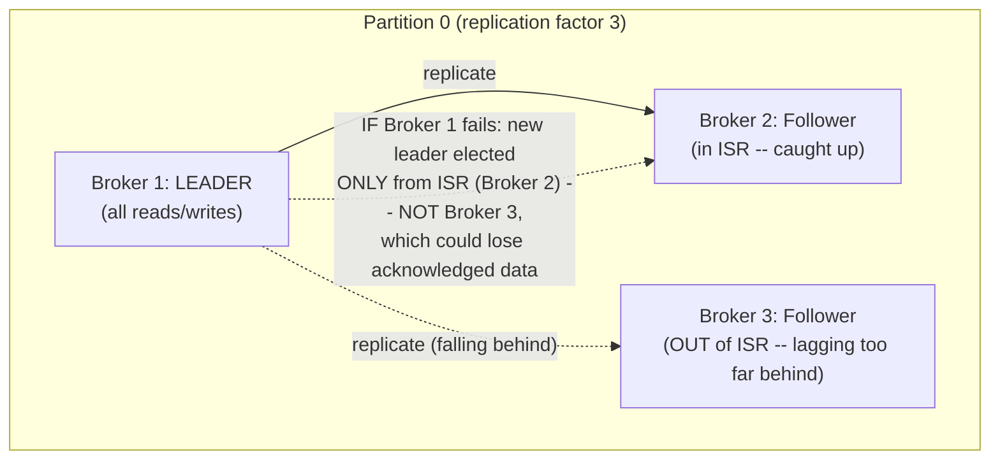
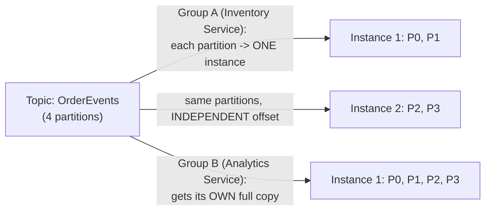
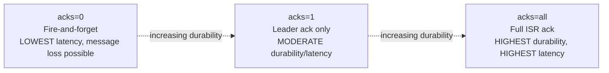

# Module 54 — Kafka: Architecture, Partitioning, Replication & Consumer Group Internals

> Domain: Kafka | Level: Beginner → Expert | Prerequisite: [[../18-Event-Driven-Architecture/02-Schema-Evolution-Ordering-DeliverySemantics-DLQ]] (this module is the canonical broker implementation of that module's ordering/delivery-semantics concepts), [[../16-Distributed-Systems/01-Consensus-Consistency-Distributed-Transactions]] (Raft/quorum concepts, directly reused by Kafka's replication model)

---

## 1. Fundamentals

### What is Kafka, and why does it warrant a dedicated module beyond Module 53's broker-agnostic EDA concepts?
Apache Kafka is a distributed, partitioned, replicated commit log — not a traditional message queue in the RabbitMQ sense (Module 55 draws this contrast directly), but a durable, append-only, ordered log of records that consumers read from at their own pace, with records retained (not deleted upon consumption) for a configurable period, enabling multiple independent consumers and replay (Module 53 §2.6) as first-class capabilities rather than exceptions. This module covers the specific mechanisms — partitions, replication via an ISR (in-sync replica) set, consumer groups, and offset management — that make Kafka the concrete, most widely-adopted implementation of Module 53's partition-key-ordering and at-least-once-delivery concepts.

### Why does this matter?
Because Kafka's specific architectural choices (log-based storage, pull-based consumption, partition-level parallelism, leader/follower replication) have direct, practical consequences for how a Principal Engineer designs topics, chooses partition counts, reasons about durability guarantees (`acks` configuration), and diagnoses real production issues (consumer lag, rebalancing storms, under-replicated partitions) — abstract EDA concepts alone don't equip an engineer to make these concrete, Kafka-specific operational decisions.

### When does this matter?
Any system using Kafka as its event backbone — understanding partition/replica mechanics is what separates confidently designing a topic's partition count and replication factor from guessing, and understanding consumer-group rebalancing is what separates quickly diagnosing a lagging-consumer incident from an extended, confused investigation.

### How does it work (30,000-ft view)?
```
Topic: a named stream of records, split into Partitions for parallelism
Partition: an ordered, immutable, append-only log; the unit of ordering AND parallelism
Replication: each partition has a Leader (all reads/writes) + Follower replicas that copy the leader;
             the ISR (In-Sync Replica) set tracks which followers are caught up enough to be
             promotable to leader without data loss
Consumer Group: a set of consumer instances that COOPERATIVELY divide a topic's partitions among
             themselves (each partition consumed by exactly ONE instance within the group at a time) --
             this IS Kafka's mechanism for Module 53's "competing consumers" pattern
Offset: a per-partition, per-consumer-group position marker tracking how far a group has consumed
```

---

## 2. Deep Dive

### 2.1 Topics and Partitions — the Unit of Both Ordering and Parallelism
A Kafka topic is logically a named stream, but physically it's split into a configured number of **partitions**, each an independent, ordered, append-only log — this dual role (Module 53 §2.3's ordering-vs-parallelism tension made concrete) means the partition count decision directly trades off against per-entity ordering: more partitions enable more consumer parallelism (§2.4), but Kafka guarantees strict ordering **only within a single partition**, never across partitions of the same topic — exactly why Module 53 §4's shipment-tracking incident occurred: the wrong partition key scattered one entity's events across multiple partitions, forfeiting the very ordering guarantee the consumer's logic silently depended on.

### 2.2 Replication, the Leader/Follower Model, and the ISR
Each partition is replicated across multiple brokers (a configurable replication factor, commonly 3 in production) — one broker holds the **leader** replica (handling all reads and writes for that partition) while the others hold **follower** replicas that continuously fetch and replicate the leader's log. The **In-Sync Replica (ISR)** set is the subset of replicas (including the leader) that are currently caught up closely enough to the leader to be safely promotable to leader if the current leader fails without losing acknowledged data — a follower falling too far behind (exceeding a configured lag threshold) is removed from the ISR, and if the leader itself fails, a new leader is elected **only from the current ISR set**, directly Module 47's quorum/consensus principles (a leader election requiring agreement among a sufficiently caught-up subset of replicas) applied concretely to Kafka's specific replication model.

### 2.3 The `acks` Configuration — the Producer's Durability/Latency Trade-off
The producer's `acks` setting directly controls the durability-vs-latency trade-off for every published message: `acks=0` (fire-and-forget, no acknowledgment awaited at all — lowest latency, but message loss is possible if the leader fails before the message is even written); `acks=1` (wait for the leader to acknowledge the write to its own local log — moderate durability, but a message can still be lost if the leader fails before followers replicate it); `acks=all` (wait for every replica in the current ISR set to acknowledge — the strongest durability guarantee Kafka provides, at the cost of the highest latency, since the producer waits for the slowest ISR member's confirmation) — this is a direct, concrete instance of Module 47's CAP-theorem-adjacent consistency-vs-latency trade-off, now expressed as a single, tunable producer configuration rather than an abstract system property.

### 2.4 Consumer Groups — Kafka's Native Competing-Consumers Mechanism
Multiple consumer instances sharing the same **consumer group ID** cooperatively divide a topic's partitions among themselves — each partition is assigned to exactly **one** consumer instance within the group at any given time (directly Module 53's "queue-like, competing consumers" pattern, achieved here via partition assignment rather than a distinct queue data structure), while **different** consumer groups each independently receive their own copy of every message (directly Module 53's "topic-like, fan-out" pattern) — this dual capability from a single underlying mechanism (partition assignment scoped per consumer-group ID) is a key Kafka-specific architectural insight: the same topic simultaneously supports both fan-out (across groups) and load-balanced competing consumption (within a group), unlike brokers that require separate topic/queue constructs for each pattern.

### 2.5 Consumer Group Rebalancing — the Cost of Membership Changes
When a consumer instance joins or leaves a group (a new instance starting up, an existing instance crashing or being intentionally scaled down), Kafka triggers a **rebalance** — reassigning partitions among the group's current members, which necessarily pauses consumption for affected partitions during the reassignment process. Frequent, unwanted rebalancing (a "rebalancing storm," often caused by consumer instances that are alive but slow enough to exceed a configured processing-time threshold, causing Kafka to presume them dead and evict them, only for them to rejoin moments later, triggering another rebalance) is a well-known, disruptive Kafka operational failure mode — directly mitigated by correctly tuning `max.poll.interval.ms` (the maximum time allowed between polls before a consumer is considered dead) relative to the consumer's actual, realistic per-batch processing time, and by using **incremental cooperative rebalancing** (a newer Kafka rebalancing protocol that reassigns only the specific partitions that need to move, rather than the older "stop-the-world" protocol that paused every partition in the group during every rebalance regardless of whether it needed to move).

### 2.6 Offset Management — Tracking Consumption Progress Durably
Kafka tracks each consumer group's progress per partition via a durable, committed **offset** (itself stored in a special internal Kafka topic, `__consumer_offsets`) — a consumer processes a batch of records and then **commits** its offset, marking that position as consumed for its group. The timing of this commit relative to actual processing is the direct, concrete Kafka expression of Module 53 §2.4's delivery-semantics distinction: committing the offset **before** processing completes risks under-processing (a crash after commit but before processing finishes means those records are never reprocessed — closer to at-most-once); committing the offset **after** processing completes (the standard, recommended approach) risks over-processing (a crash after processing but before commit means those records are redelivered and reprocessed on restart — at-least-once, requiring Module 53's mandatory idempotent-consumer discipline).

## 3. Visual Architecture

### Partition Replication and Leader Election


### Consumer Groups: Fan-out Across Groups, Load-Balancing Within a Group


### `acks` Trade-off


## 4. Production Example
**Scenario**: An analytics pipeline's Kafka consumer group processed high-volume clickstream events, with each batch triggering a moderately expensive enrichment call to an external geolocation API before committing offsets. During a period of elevated latency on that external geolocation API (unrelated to Kafka itself), individual batch-processing times occasionally exceeded the consumer's configured `max.poll.interval.ms` — Kafka, receiving no poll from that consumer instance within the expected window, presumed it dead and triggered a rebalance, reassigning its partitions to other group members; the "dead" instance, still alive and simply slow, eventually finished its poll cycle and rejoined the group moments later, triggering **another** rebalance. This repeated in a cascading loop for nearly 20 minutes, during which the "stop-the-world" rebalancing protocol in use (the older, non-cooperative version) paused consumption across **the entire consumer group**, not just the affected partitions, causing consumer lag to spike dramatically across the whole pipeline, well beyond what the original, isolated external-API slowness alone would have caused. **Investigation**: monitoring showed the classic rebalancing-storm signature — a rapid sequence of "member joined/member left" group-coordinator log events correlating precisely with the lag spike, rather than a single, sustained processing slowdown; correlating against the external geolocation API's own latency metrics (Module 50 §2.5's distributed-tracing/correlation discipline, now applied to root-causing a Kafka-specific incident) revealed the true root cause several layers removed from Kafka itself. **Fix**: (1) increased `max.poll.interval.ms` to a value comfortably exceeding the geolocation API's worst-case observed latency plus enrichment processing time, preventing premature dead-consumer presumption during transient external slowness; (2) migrated to the incremental cooperative rebalancing protocol, so that even if a rebalance did trigger, only the specific reassigned partitions would pause, not the entire group; (3) separately, added a circuit breaker (Module 50 §2.3) around the geolocation API call itself, so a genuinely degraded external dependency would fail fast with a fallback rather than risk exceeding the poll interval at all. **Lesson**: this incident illustrates the compounding nature of insufficiently-tuned Kafka configuration interacting with an external dependency's transient degradation (Module 50's resilience-pattern territory) — the geolocation API's slowness was the trigger, but Kafka's overly-aggressive `max.poll.interval.ms` and the older, non-cooperative rebalancing protocol were what turned a contained, external-dependency slowdown into a full consumer-group-wide outage; a Principal Engineer must reason about Kafka configuration and application-level resilience patterns together, not as independent concerns.

## 5. Best Practices
- Choose partition count based on required consumer parallelism, but choose the partition **key** based on which entities require relative ordering — these are coupled decisions (Module 53 §9), not independent.
- Use `acks=all` for business-critical data where durability matters more than the added latency; reserve `acks=0`/`acks=1` for genuinely loss-tolerant, high-throughput use cases (metrics, logs) where the latency savings justify the risk.
- Tune `max.poll.interval.ms` to comfortably exceed the consumer's realistic worst-case batch-processing time (including any external dependency calls), and pair this with Module 50's resilience patterns (timeouts, circuit breakers) around those external calls rather than relying on Kafka's timeout alone.
- Use incremental cooperative rebalancing rather than the older, stop-the-world protocol wherever available, to minimize the blast radius of any rebalance that does occur.
- Commit offsets only after processing completes (never before), accepting the resulting at-least-once semantics and designing consumers to be idempotent accordingly (Module 53 §2.4).

## 6. Anti-patterns
- Choosing a partition key that doesn't align with actual ordering requirements, silently breaking per-entity ordering guarantees (Module 53 §4's incident, now understood via Kafka's specific partition mechanics).
- Using `acks=0` or `acks=1` for genuinely business-critical events where message loss on leader failure is unacceptable.
- Leaving `max.poll.interval.ms` at an aggressive default while consumer processing logic includes slow, unbounded external calls, inviting rebalancing storms (§4).
- Committing offsets before processing completes, risking silent under-processing (records skipped) rather than the generally-preferred at-least-once over-processing risk.
- Ignoring under-replicated-partition alerts (partitions whose ISR has shrunk below the desired replication factor), which silently erodes the durability guarantee `acks=all` is meant to provide until an actual leader failure exposes the gap.

---

## 10. Interview Questions

### Basic (10)
1. **Q: What is Kafka, architecturally?** **A:** A distributed, partitioned, replicated commit log — records are retained and can be replayed, not deleted upon consumption.
2. **Q: What is a partition, and what two roles does it serve?** **A:** An ordered, append-only log within a topic; it is both the unit of ordering and the unit of parallelism.
3. **Q: What is the ISR?** **A:** The In-Sync Replica set — replicas caught up closely enough to the leader to be safely promotable without data loss.
4. **Q: What does `acks=all` guarantee?** **A:** The producer waits for every replica in the current ISR to acknowledge the write — Kafka's strongest durability guarantee.
5. **Q: What is a consumer group?** **A:** A set of consumer instances that cooperatively divide a topic's partitions, each partition consumed by exactly one instance within the group.
6. **Q: What happens to consumption when a consumer group rebalances?** **A:** Partitions are reassigned among group members, pausing consumption for the affected partitions during reassignment.
7. **Q: What is an offset?** **A:** A per-partition, per-consumer-group marker tracking how far that group has consumed.
8. **Q: Does Kafka guarantee ordering across partitions of the same topic?** **A:** No — only within a single partition.
9. **Q: What determines the maximum degree of consumer-group parallelism?** **A:** The topic's partition count.
10. **Q: What is the difference between committing an offset before vs after processing?** **A:** Before risks under-processing (at-most-once-like); after (standard, recommended) risks over-processing/duplicates (at-least-once), requiring idempotent consumers.

### Intermediate (10)
1. **Q: Why is a new partition leader elected only from the current ISR, not from any replica?** **A:** Electing from outside the ISR could promote a replica that hasn't fully caught up, silently losing data that had already been acknowledged to producers — the ISR restriction preserves the durability guarantee.
2. **Q: Why does `acks=0` risk message loss even though the producer receives no error?** **A:** The producer doesn't wait for any acknowledgment at all, so if the leader fails before the message is even durably written, the producer has no way to know the message was lost.
3. **Q: Why can the same Kafka topic simultaneously support both fan-out and load-balanced competing consumption?** **A:** Partition assignment is scoped per consumer-group ID — different groups each get their own full copy (fan-out), while instances within one group divide the partitions among themselves (competing consumers) — a single mechanism serving both patterns.
4. **Q: Why does a rebalancing storm cause lag to spike well beyond what the original triggering slowness alone would cause?** **A:** Each rebalance pauses consumption for affected partitions (or, under the older protocol, potentially the entire group) during reassignment — repeated rebalances compound this pause repeatedly, on top of the original processing slowdown itself.
5. **Q: Why does incremental cooperative rebalancing reduce a rebalance's blast radius compared to the older protocol?** **A:** It reassigns only the specific partitions that actually need to move, rather than pausing every partition across the entire group for every rebalance regardless of whether it needed reassignment.
6. **Q: Why must `max.poll.interval.ms` be tuned relative to a consumer's realistic worst-case processing time, including any external dependency calls?** **A:** If actual processing (including slow external calls) can exceed the configured interval, Kafka will presume a live-but-slow consumer dead and trigger an unnecessary, disruptive rebalance (§4).
7. **Q: Why doesn't tuning `max.poll.interval.ms` alone fully solve the §4 incident's underlying risk?** **A:** It only prevents premature dead-consumer presumption; it doesn't address the underlying external-API slowness itself, which is why the fix also added a circuit breaker (Module 50) around that specific call — a Kafka-level configuration change alone doesn't substitute for application-level resilience patterns.
8. **Q: Why can excessively high partition count degrade broker performance, contradicting the intuition that more partitions is always better for parallelism?** **A:** Each partition carries per-partition overhead (open file handles, replication traffic, controller metadata) — beyond the parallelism actually needed, additional partitions add broker-level cost without corresponding throughput benefit, and can slow failover/rebalance operations.
9. **Q: Why does simply adding more brokers to a cluster not automatically improve an existing topic's throughput?** **A:** Existing topics' partitions remain assigned to their original brokers until an explicit partition-reassignment operation redistributes them — new brokers start with no load unless deliberately assigned some.
10. **Q: Why is network-level isolation alone insufficient security for a production Kafka deployment?** **A:** A compromised host within the same network segment could otherwise freely produce/consume any topic with no additional authentication/authorization barrier — direct application of Module 49 §8's "never assume internal traffic is trusted" principle.

### Advanced (10)
1. **Q: Diagnose the §4 rebalancing-storm incident from first principles, and design the specific pre-production capacity/configuration review that would have caught the `max.poll.interval.ms` misconfiguration before it caused an incident.**
   **A:** Root cause: `max.poll.interval.ms` was left at a default/conservative value without being explicitly validated against the consumer's actual worst-case processing time, including its slowest external dependency call. Review practice: for every consumer group whose processing logic includes an external call, explicitly compute and document "worst-case realistic batch processing time" (using the external dependency's own observed p99/worst-case latency, not its typical/average latency) and require `max.poll.interval.ms` to exceed that value with meaningful headroom — converting an implicit, unvalidated assumption ("processing should usually be fast enough") into an explicit, documented, reviewed capacity calculation, directly the same discipline Module 37 §7's latency-budgeting review applies to synchronous call chains, now applied to Kafka consumer configuration specifically.
2. **Q: A team argues for using `acks=all` universally across every topic in their organization "to be safe," reasoning maximum durability is always the correct default. Evaluate this as a Principal Engineer.**
   **A:** Push back — `acks=all`'s added latency (waiting for the slowest ISR member) is a real cost that isn't justified for every use case; a high-volume metrics or clickstream topic where occasional message loss has negligible business impact but where producer throughput/latency is a genuine, load-bearing concern is better served by `acks=1` (or even `acks=0` in some cases), while genuinely business-critical data (financial transactions, order events) justifies `acks=all`'s cost — recommend a **per-topic**, deliberate durability-vs-latency decision based on that topic's actual business criticality (directly Module 47 §Advanced Q6's "make eventual-consistency/durability trade-offs an explicit, communicated decision" principle), not a single, uniform organization-wide default applied without considering each topic's distinct actual requirements.
3. **Q: Design a strategy for choosing a topic's replication factor, beyond simply "always use 3."**
   **A:** Replication factor trades off durability/availability (surviving N-1 simultaneous broker failures for a factor of N) against storage cost (each additional replica multiplies storage requirements) and write latency under `acks=all` (more replicas to await acknowledgment from) — 3 is a reasonable, common default balancing "survive one broker failure without data loss or downtime" against reasonable storage/latency cost, but a topic with extremely high business criticality and low volume might justify a higher factor (5, surviving two simultaneous failures), while a topic with very high volume and lower criticality (recomputable/re-derivable data, or data with its own independent durable source of truth elsewhere) might justify a lower factor (2, or even relying on the source system for recovery) — the decision should explicitly weigh each topic's actual failure-tolerance requirement against its volume-driven storage/latency cost, not default uniformly.
4. **Q: Explain why the §4 incident's fix explicitly separated "prevent premature rebalancing" (tuning `max.poll.interval.ms`, migrating rebalancing protocols) from "prevent the underlying external-API slowness from affecting the consumer at all" (adding a circuit breaker), rather than treating either fix alone as sufficient.**
   **A:** These address genuinely different failure modes: without the `max.poll.interval.ms`/protocol fix, even a well-protected consumer (with a circuit breaker) could still trigger unnecessary rebalances if its own internal circuit-breaker-timeout logic still occasionally exceeds the poll interval; without the circuit breaker, the consumer remains vulnerable to the external API's degradation directly affecting its own processing reliability and latency, independent of whether Kafka ever rebalances at all — treating these as one combined problem risks under-addressing either the Kafka-configuration-level symptom or the application-level root cause, when both are independently necessary for full resilience.
5. **Q: A consumer group's lag (the difference between the latest produced offset and the group's committed offset) is steadily, continuously increasing rather than spiking transiently like §4's incident. Diagnose the likely difference in root cause and appropriate remediation compared to a transient rebalancing storm.**
   **A:** Steadily increasing (rather than spiking) lag indicates the consumer group's **sustained processing throughput is below the topic's sustained production rate** — a capacity mismatch, not a transient disruption — remediation requires either increasing consumer-group parallelism (more instances, up to the partition-count ceiling, Module 53 §9) or increasing partition count itself (if already at the parallelism ceiling) to enable more parallelism, or optimizing the consumer's own per-record/per-batch processing efficiency — fundamentally different from §4's transient rebalancing-storm remediation (which addressed a temporary disruption, not a sustained capacity shortfall), illustrating why lag-trend shape (steady climb vs. sharp spike-and-recover) is itself a valuable diagnostic signal for distinguishing root-cause categories.
6. **Q: How would you design monitoring to distinguish a genuine broker/infrastructure failure (a broker going down, requiring leader election) from an application-level consumer processing slowdown (like §4's), given that both can produce superficially similar symptoms (lag increase, consumer group instability)?**
   **A:** Correlate consumer-group-coordinator events (member join/leave, rebalance triggers) against **broker-level** health metrics (under-replicated-partition counts, controller/leader-election events, broker uptime) — a genuine broker failure shows broker-level symptoms (leader elections, under-replicated partitions) co-occurring with the consumer-group disruption; a purely application-level slowdown (§4) shows consumer-group disruption **without** any corresponding broker-level anomaly, since the brokers themselves remained entirely healthy throughout — this correlation is the concrete, Kafka-specific instance of Module 50 §2.5's broader "distinguish root-cause layer via cross-signal correlation, not just a single symptom" diagnostic discipline.
7. **Q: Explain the trade-off in choosing `linger.ms`/`batch.size` producer batching settings for a latency-sensitive versus a throughput-sensitive topic, and how you would tune each differently.**
   **A:** For a latency-sensitive topic (a user-facing action needing near-immediate downstream processing), keep `linger.ms` low (minimal added delay before sending a batch, even if batches are consequently smaller and less efficient) — prioritizing low per-message latency over throughput efficiency. For a throughput-sensitive, latency-tolerant topic (bulk clickstream/log ingestion), increase `linger.ms` (allowing more records to accumulate into larger, more efficient batches before sending) and `batch.size`, trading a small, acceptable added latency for meaningfully improved broker-side efficiency and reduced network overhead — directly Module 37's general latency-vs-throughput trade-off, now tuned per-topic based on that topic's actual consumption-urgency requirements rather than a single, uniform producer configuration.
8. **Q: A team observes persistent under-replicated-partition warnings for a specific topic but no active incident or consumer impact, and considers dismissing the alerts as noise since "nothing is actually broken right now." Evaluate this as a Principal Engineer.**
   **A:** Push back firmly — an under-replicated partition means the durability guarantee that topic's `acks=all` configuration is meant to provide is **currently degraded** (fewer replicas than the desired replication factor are caught up and in the ISR), even though no consumer-facing symptom is visible yet; the actual risk (data loss) only manifests **if** the leader subsequently fails while under-replicated — dismissing this as "nothing is broken" ignores that the safety margin against exactly that failure has already eroded, directly analogous to ignoring a failing redundant component in any other resilient system (a degraded RAID array, an unhealthy replica in Module 47's quorum-based systems) simply because the system is still currently serving traffic correctly on its remaining healthy components.
9. **Q: Design an approach for testing whether a proposed new topic's partition count and key design will actually deliver the expected ordering and parallelism properties, before relying on it in production.**
   **A:** Directly extend Module 51 §2.2's testing-pyramid philosophy to Kafka topic design: write a targeted test that publishes a representative sample of events for several distinct entities (using the proposed partition key) and asserts (a) all events for the same entity land in the same partition (verifying the ordering property directly, rather than assuming the key design is correct by inspection alone) and (b) events for different entities are reasonably distributed across the full partition count (verifying the parallelism property) — converting an easy-to-get-subtly-wrong design assumption (as in Module 53 §4's incident) into an explicit, automatically-verified pre-production check, rather than only discovering a partition-key mistake once production load exposes an ordering violation.
10. **Q: As a Principal Engineer establishing Kafka operational standards across a large organization with many teams independently operating consumer groups, design the specific set of standing configuration reviews and monitors (synthesizing this entire module) you would require, and justify each.**
    **A:** (1) Mandatory, documented `max.poll.interval.ms` justification tied to each consumer's actual worst-case processing time (Advanced Q1) — necessary because default values are easy to leave unvalidated until a rebalancing storm exposes the gap. (2) A per-topic, explicitly-justified `acks` and replication-factor decision (Advanced Q2, Q3) rather than a uniform default — necessary because durability requirements genuinely differ by topic, and blind uniformity either overpays in latency or underpays in durability somewhere. (3) Standing alerting on under-replicated-partition counts, treated with the same urgency as any other degraded-redundancy signal (Advanced Q8) — necessary because the risk is latent until an actual failure exposes it, by which point it's too late to remediate. (4) Pre-production partition-key/ordering verification tests for any topic with ordering-sensitive consumers (Advanced Q9) — necessary because ordering mistakes are otherwise invisible until production load and specific entity access patterns expose them, often much later and much more expensively than a pre-production test would. Each standard targets a distinct, concrete failure mode this module identified through specific incidents or reasoning, directly extending this course's recurring "convert hard-won lessons into specific, enforced, fleet-wide gates" governance pattern into Kafka-specific operational practice.

---

## 11. Coding Exercises

### Easy — Correct partition-key producer configuration (§2.1, restoring Module 53 §4's ordering guarantee)
```csharp
var producerConfig = new ProducerConfig { BootstrapServers = "kafka:9092", Acks = Acks.All };
using var producer = new ProducerBuilder<string, ShipmentStatusChangedEvent>(producerConfig).Build();

await producer.ProduceAsync("shipment-status-changed", new Message<string, ShipmentStatusChangedEvent>
{
    Key = evt.ShipmentId,     // CORRECT partition key -- ensures same-shipment events land in one partition
    Value = evt
});
```

### Medium — `acks` configuration matched to business criticality (§2.3, §Advanced Q2)
```csharp
// Business-critical: order/payment events -- maximum durability justified
var criticalProducerConfig = new ProducerConfig { Acks = Acks.All, EnableIdempotence = true };

// High-volume, loss-tolerant: clickstream analytics -- throughput prioritized over durability
var analyticsProducerConfig = new ProducerConfig
{
    Acks = Acks.Leader,      // acks=1 -- moderate durability, lower latency than acks=all
    LingerMs = 20,            // batch aggressively -- throughput-optimized, not latency-sensitive
    BatchSize = 65536
};
```

### Hard — Consumer with correctly-ordered offset commit and idempotent processing (§2.6, Module 53 §2.4)
```csharp
public class OrderEventConsumer
{
    public async Task ConsumeLoopAsync(CancellationToken ct)
    {
        _consumer.Subscribe("order-events");
        while (!ct.IsCancellationRequested)
        {
            var result = _consumer.Consume(ct);
            try
            {
                await _idempotentHandler.HandleAsync(result.Message.Value, result.Message.Key);
                _consumer.Commit(result); // COMMIT AFTER processing completes -- at-least-once,
                                            // requires idempotent handler (already established, Module 53)
            }
            catch (Exception ex)
            {
                await _resilientRetryHandler.HandleFailureAsync(result, ex); // routes to DLQ after N retries
            }
        }
    }
}
```

### Expert — `max.poll.interval.ms`-aware consumer configuration with circuit-breaker-protected external call (§4's full fix)
```csharp
var consumerConfig = new ConsumerConfig
{
    GroupId = "geo-enrichment-group",
    // Tuned to comfortably exceed the geolocation API's observed WORST-CASE latency (2s)
    // plus processing overhead, with meaningful headroom -- NOT left at an unvalidated default.
    MaxPollIntervalMs = 30000,
    PartitionAssignmentStrategy = PartitionAssignmentStrategy.CooperativeSticky // incremental rebalancing
};

public class EnrichmentHandler
{
    private readonly DependencyClient _geoApiClient; // Module 50's bulkhead + circuit-breaker-protected client

    public async Task HandleAsync(ClickstreamEvent evt)
    {
        var geoData = await _geoApiClient.CallAsync(
            operation: client => client.GetGeoDataAsync(evt.IpAddress),
            fallback: GeoData.Unknown); // circuit breaker trips fast on API degradation --
                                          // NEVER risks exceeding MaxPollIntervalMs waiting on a failing dependency
        await _enrichmentRepository.SaveAsync(evt, geoData);
    }
}
```
**Discussion**: pairing `CooperativeSticky` assignment with a circuit-breaker-protected external call is precisely §4's two-layer fix — the Kafka-level configuration (cooperative rebalancing, a generous but justified `MaxPollIntervalMs`) limits the blast radius *if* a rebalance does occur, while the application-level circuit breaker prevents the external dependency's degradation from ever threatening to exceed the poll interval in the first place — neither layer alone would have fully resolved the incident.

---

## 12–17. System Design / LLD / Debugging / Decision / Case Study / Principal

*(§4's incident, the four §11 exercises, and the Advanced-tier Q&A — especially Advanced Q1's capacity-review safeguard, Advanced Q5/Q6's lag-pattern and cross-signal diagnostic frameworks, and Advanced Q10's synthesized governance standards — collectively constitute this module's system-design, debugging, and Principal-Engineer-level content.)*

## 18. Revision
**Key takeaways**: Kafka is a distributed, replicated commit log, not a traditional queue — partitions are simultaneously the unit of ordering and parallelism, and the chosen partition key (not partition count alone) determines whether per-entity ordering is preserved. The ISR-based replication model, combined with the `acks` setting, gives explicit, tunable control over the durability-vs-latency trade-off per topic — a decision that should be made deliberately per topic's actual business criticality, not defaulted uniformly. Consumer groups provide both fan-out (across groups) and load-balanced competing consumption (within a group) from one underlying partition-assignment mechanism, but rebalancing (triggered by group-membership changes) pauses affected consumption and can cascade into a disruptive storm if `max.poll.interval.ms` is misconfigured relative to real processing time (§4) — application-level resilience patterns (Module 50's circuit breakers) and Kafka-level configuration must be reasoned about together, not independently.

---

**Next**: Continuing to Module 55 — Kafka: Exactly-Once Semantics, Kafka Streams/ksqlDB & Log Compaction, completing the `19-Kafka` domain before moving to `20-RabbitMQ`.
