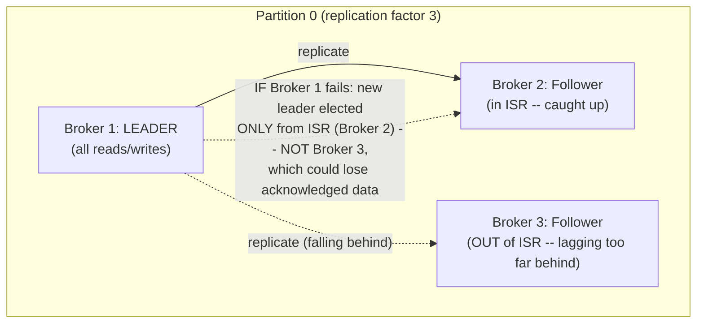
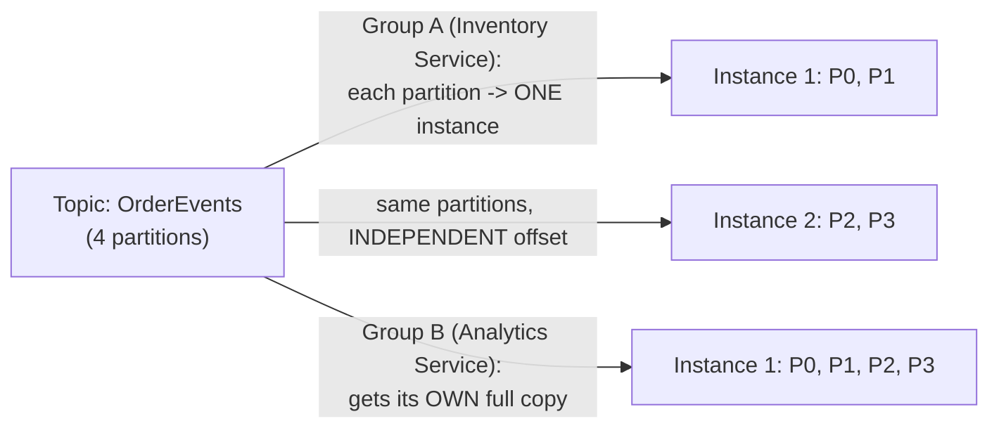
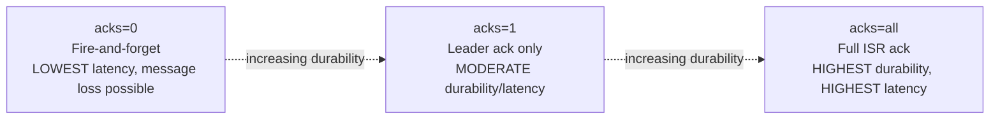
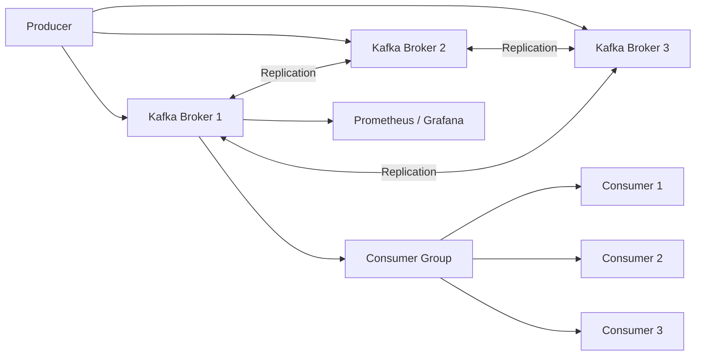
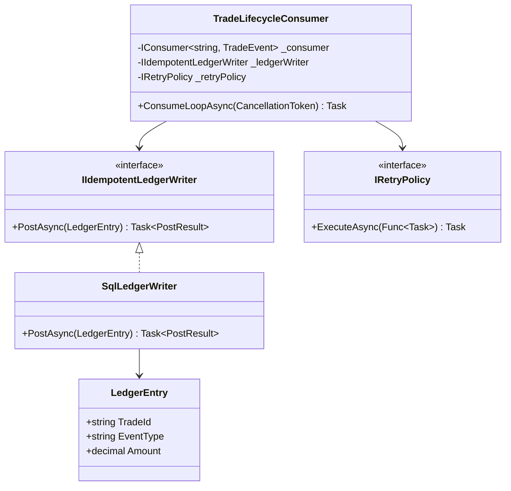

# Module 54 — Kafka: Architecture, Partitioning, Replication & Consumer Group Internals

> Domain: Kafka | Level: Beginner → Expert | Prerequisite: [[../18-Event-Driven-Architecture/02-Schema-Evolution-Ordering-DeliverySemantics-DLQ]] (this module is the canonical broker implementation of that module's ordering/delivery-semantics concepts), [[../16-Distributed-Systems/01-Consensus-Consistency-Distributed-Transactions]] (Raft/quorum concepts, directly reused by Kafka's replication model)

---

## 1. Fundamentals

### What is Kafka, and why does it warrant a dedicated module beyond the broker-agnostic EDA concepts?
Apache Kafka is a distributed, partitioned, replicated commit log — not a traditional message queue in the RabbitMQ sense (draws this contrast directly), but a durable, append-only, ordered log of records that consumers read from at their own pace, with records retained (not deleted upon consumption) for a configurable period, enabling multiple independent consumers and replay as first-class capabilities rather than exceptions. This module covers the specific mechanisms — partitions, replication via an ISR (in-sync replica) set, consumer groups, and offset management — that make Kafka the concrete, most widely-adopted implementation of the partition-key-ordering and at-least-once-delivery concepts.

### Why does this matter?
Because Kafka's specific architectural choices (log-based storage, pull-based consumption, partition-level parallelism, leader/follower replication) have direct, practical consequences for how a Principal Engineer designs topics, chooses partition counts, reasons about durability guarantees (`acks` configuration), and diagnoses real production issues (consumer lag, rebalancing storms, under-replicated partitions) — abstract EDA concepts alone don't equip an engineer to make these concrete, Kafka-specific operational decisions.

### When does this matter?
Any system using Kafka as its event backbone — understanding partition/replica mechanics is what separates confidently designing a topic's partition count and replication factor from guessing, and understanding consumer-group rebalancing is what separates quickly diagnosing a lagging-consumer incident from an extended, confused investigation.

### How does it work (30,000-ft view)?
```
Topic: a named stream of records, split into Partitions for parallelism
Partition: an ordered, immutable, append-only log; the unit of ordering AND parallelism
Replication: each partition has a Leader (all reads/writes) + Follower replicas that copy the leader;
 the ISR (In-Sync Replica) set tracks which followers are caught up enough to be
 promotable to leader without data loss
Consumer Group: a set of consumer instances that COOPERATIVELY divide a topic's partitions among
 themselves (each partition consumed by exactly ONE instance within the group at a time) --
 this IS Kafka's mechanism for the "competing consumers" pattern
Offset: a per-partition, per-consumer-group position marker tracking how far a group has consumed
```

---

## 2. Deep Dive

### 2.1 Topics and Partitions — the Unit of Both Ordering and Parallelism
A Kafka topic is logically a named stream, but physically it's split into a configured number of **partitions**, each an independent, ordered, append-only log — this dual role (the ordering-vs-parallelism tension made concrete) means the partition count decision directly trades off against per-entity ordering: more partitions enable more consumer parallelism, but Kafka guarantees strict ordering **only within a single partition**, never across partitions of the same topic — exactly why the shipment-tracking incident occurred: the wrong partition key scattered one entity's events across multiple partitions, forfeiting the very ordering guarantee the consumer's logic silently depended on.

### 2.2 Replication, the Leader/Follower Model, and the ISR
Each partition is replicated across multiple brokers (a configurable replication factor, commonly 3 in production) — one broker holds the **leader** replica (handling all reads and writes for that partition) while the others hold **follower** replicas that continuously fetch and replicate the leader's log. The **In-Sync Replica (ISR)** set is the subset of replicas (including the leader) that are currently caught up closely enough to the leader to be safely promotable to leader if the current leader fails without losing acknowledged data — a follower falling too far behind (exceeding a configured lag threshold) is removed from the ISR, and if the leader itself fails, a new leader is elected **only from the current ISR set**, directly the quorum/consensus principles (a leader election requiring agreement among a sufficiently caught-up subset of replicas) applied concretely to Kafka's specific replication model.

### 2.3 The `acks` Configuration — the Producer's Durability/Latency Trade-off
The producer's `acks` setting directly controls the durability-vs-latency trade-off for every published message: `acks=0` (fire-and-forget, no acknowledgment awaited at all — lowest latency, but message loss is possible if the leader fails before the message is even written); `acks=1` (wait for the leader to acknowledge the write to its own local log — moderate durability, but a message can still be lost if the leader fails before followers replicate it); `acks=all` (wait for every replica in the current ISR set to acknowledge — the strongest durability guarantee Kafka provides, at the cost of the highest latency, since the producer waits for the slowest ISR member's confirmation) — this is a direct, concrete instance of the CAP-theorem-adjacent consistency-vs-latency trade-off, now expressed as a single, tunable producer configuration rather than an abstract system property.

### 2.4 Consumer Groups — Kafka's Native Competing-Consumers Mechanism
Multiple consumer instances sharing the same **consumer group ID** cooperatively divide a topic's partitions among themselves — each partition is assigned to exactly **one** consumer instance within the group at any given time (directly the "queue-like, competing consumers" pattern, achieved here via partition assignment rather than a distinct queue data structure), while **different** consumer groups each independently receive their own copy of every message (directly the "topic-like, fan-out" pattern) — this dual capability from a single underlying mechanism (partition assignment scoped per consumer-group ID) is a key Kafka-specific architectural insight: the same topic simultaneously supports both fan-out (across groups) and load-balanced competing consumption (within a group), unlike brokers that require separate topic/queue constructs for each pattern.

### 2.5 Consumer Group Rebalancing — the Cost of Membership Changes
When a consumer instance joins or leaves a group (a new instance starting up, an existing instance crashing or being intentionally scaled down), Kafka triggers a **rebalance** — reassigning partitions among the group's current members, which necessarily pauses consumption for affected partitions during the reassignment process. Frequent, unwanted rebalancing (a "rebalancing storm," often caused by consumer instances that are alive but slow enough to exceed a configured processing-time threshold, causing Kafka to presume them dead and evict them, only for them to rejoin moments later, triggering another rebalance) is a well-known, disruptive Kafka operational failure mode — directly mitigated by correctly tuning `max.poll.interval.ms` (the maximum time allowed between polls before a consumer is considered dead) relative to the consumer's actual, realistic per-batch processing time, and by using **incremental cooperative rebalancing** (a newer Kafka rebalancing protocol that reassigns only the specific partitions that need to move, rather than the older "stop-the-world" protocol that paused every partition in the group during every rebalance regardless of whether it needed to move).

### 2.6 Offset Management — Tracking Consumption Progress Durably
Kafka tracks each consumer group's progress per partition via a durable, committed **offset** (itself stored in a special internal Kafka topic, `__consumer_offsets`) — a consumer processes a batch of records and then **commits** its offset, marking that position as consumed for its group. The timing of this commit relative to actual processing is the direct, concrete Kafka expression of the delivery-semantics distinction: committing the offset **before** processing completes risks under-processing (a crash after commit but before processing finishes means those records are never reprocessed — closer to at-most-once); committing the offset **after** processing completes (the standard, recommended approach) risks over-processing (a crash after processing but before commit means those records are redelivered and reprocessed on restart — at-least-once, requiring the mandatory idempotent-consumer discipline).

## 3. Visual Architecture

### Partition Replication and Leader Election

```mermaid
graph TB
 subgraph "Partition 0 (replication factor 3)"
 Leader["Broker 1: LEADER<br/>(all reads/writes)"]
 F1["Broker 2: Follower<br/>(in ISR -- caught up)"]
 F2["Broker 3: Follower<br/>(OUT of ISR -- lagging too far behind)"]
 Leader -->|replicate| F1
 Leader -.->|"replicate (falling behind)"| F2
 end
 Leader -.->|"IF Broker 1 fails: new leader elected<br/>ONLY from ISR (Broker 2) -- NOT Broker 3,<br/>which could lose acknowledged data"| F1
```

### Consumer Groups: Fan-out Across Groups, Load-Balancing Within a Group

```mermaid
graph LR
 Topic["Topic: OrderEvents<br/>(4 partitions)"]
 Topic -->|"Group A (Inventory Service):<br/>each partition -> ONE instance"| GA1[Instance 1: P0, P1]
 Topic -->|"same partitions, INDEPENDENT offset"| GA2[Instance 2: P2, P3]
 Topic -->|"Group B (Analytics Service):<br/>gets its OWN full copy"| GB1[Instance 1: P0, P1, P2, P3]
```

### `acks` Trade-off

```mermaid
graph LR
 A0["acks=0<br/>Fire-and-forget<br/>LOWEST latency, message loss possible"]
 A1["acks=1<br/>Leader ack only<br/>MODERATE durability/latency"]
 Aall["acks=all<br/>Full ISR ack<br/>HIGHEST durability, HIGHEST latency"]
 A0 -.->|"increasing durability"| A1 -.->|"increasing durability"| Aall
```

### Apache Kafka Architecture — the Cluster-Level View


```mermaid
flowchart LR

 Producer[Producer]

 Producer --> Broker1[Kafka Broker 1]
 Producer --> Broker2[Kafka Broker 2]
 Producer --> Broker3[Kafka Broker 3]

 Broker1 <-->|Replication| Broker2
 Broker2 <-->|Replication| Broker3
 Broker3 <-->|Replication| Broker1

 Broker1 --> ConsumerGroup[Consumer Group]

 ConsumerGroup --> Consumer1[Consumer 1]
 ConsumerGroup --> Consumer2[Consumer 2]
 ConsumerGroup --> Consumer3[Consumer 3]

 Broker1 --> Monitoring[Prometheus / Grafana]
```

This is the full picture zoomed out one level from the leader/follower and consumer-group diagrams above: a producer fans out to whichever broker leads the relevant partition, brokers replicate among themselves, and a consumer group pulls from the leader while metrics flow out to observability tooling — every other diagram in this section is a zoomed-in view of one edge of this graph.

### Topic Partitioning — Partitions as Parallel, Independent Logs

```text
Topic: Orders

   +--------------+     +--------------+     +--------------+
   |  Partition 0 |     |  Partition 1 |     |  Partition 2 |
   +--------------+     +--------------+     +--------------+
   | Order-101    |     | Order-102    |     | Order-103    |   offset 0
   | Order-104    |     | Order-105    |     | Order-106    |   offset 1
   | Order-107    |     | Order-108    |     | Order-109    |   offset 2
   +--------------+     +--------------+     +--------------+
          |                    |                    |
          v                    v                    v
     append-only          append-only          append-only
     ordered log          ordered log          ordered log
```

Drawing the partitions **side by side** rather than stacked is the point: they are parallel, independent logs, not one sequence split into chunks. Ordering is guaranteed *within* a partition and never *across* them — so `Order-101` is guaranteed to be read before `Order-104`, while nothing whatsoever is guaranteed about the relative order of `Order-101` and `Order-102`. Partition count is therefore the unit of both parallelism and of ordering scope, and those two pull in opposite directions.

### Replication — Leader Serves All Traffic, Followers Pull

```text
         ┌──────────────────────────┐
         │ Broker-1                 │
         │ Partition-0  (LEADER)    │   <- every produce and consume goes here
         └─────────────┬────────────┘
                       │  followers PULL from the leader
            ┌──────────┴──────────┐
            ▼                     ▼
   ┌──────────────────┐  ┌──────────────────┐
   │ Broker-2         │  │ Broker-3         │
   │ Partition-0      │  │ Partition-0      │
   │ (FOLLOWER, ISR)  │  │ (FOLLOWER, ISR)  │
   └──────────────────┘  └──────────────────┘
```

Note what the arrows do **not** show: no client traffic reaches a follower. Followers exist for durability and failover, not for read scaling — which is the single most common wrong assumption about this diagram. A follower earns its place in the **ISR** (in-sync replica set) by staying caught up; only an ISR member can be promoted to leader without data loss, so `min.insync.replicas` is what actually determines your durability guarantee, not the replication factor alone.

### Consumer Group — Partition Assignment Table

```text
                Topic: Orders
                      │
        ┌─────────────┴──────────────┐
        │      Consumer Group A      │
        └─────────────┬──────────────┘
              ┌───────┴───────┐
              ▼               ▼
        ┌────────────┐  ┌────────────┐
        │ Consumer-1 │  │ Consumer-2 │
        └────────────┘  └────────────┘

   Partition-0  ->  Consumer-1
   Partition-1  ->  Consumer-2
   Partition-2  ->  Consumer-1     <- 3 partitions, 2 consumers:
                                      one consumer carries two
```

The assignment table is the important half of this diagram. Each partition is consumed by **exactly one** member of the group, which is what makes a consumer group Kafka's implementation of competing consumers. It also fixes the ceiling: **adding consumers beyond the partition count adds nothing** — a third consumer here would take over `Partition-2`, but a fourth would sit idle with no partition to own. Partition count, chosen at topic-creation time, is therefore the permanent upper bound on a group's parallelism.

### Message Flow — Where Ordering and Durability Are Actually Decided

```text
   Producer
      │
      │  publish
      ▼
   Kafka Topic
      │
      │  partition selected: hash(key), or round-robin when key is null
      ▼
   Leader Broker for that partition
      │
      │  replicate to followers; acks honoured per min.insync.replicas
      ▼
   Consumer Group
      │
      │  one partition -> exactly one member
      ▼
   Business Service
```

The labels on the arrows carry the content here, not the boxes. Two of them decide correctness rather than mechanics: **`hash(key)`** is where per-entity ordering is won or lost (a null or wrongly-chosen key scatters one entity's events across partitions and forfeits ordering silently), and **`acks` / `min.insync.replicas`** is where the durability guarantee is actually set — `acks=all` means nothing if `min.insync.replicas` is 1, because a single surviving replica then satisfies "all".

### Kafka Components — Responsibility Glossary

| Component | Responsibility |
|-----------|----------------|
| Producer | Publishes messages |
| Topic | Logical stream of events |
| Partition | Parallelism and ordering unit |
| Broker | Stores and serves data |
| Leader | Handles reads and writes |
| Follower | Replicates data |
| Consumer | Reads messages |
| Consumer Group | Enables scalable processing |
| Offset | Tracks message position |

### End-to-End: Cluster, Topic, Partitions, Consumers

```text
                    Producer
                        │
                        ▼
                  Kafka Cluster
        ┌──────────┬──────────┬──────────┐
        │ Broker1  │ Broker2  │ Broker3  │
        └──────────┴──────────┴──────────┘
                        │
                 Topic (Orders)
                        │
          ┌─────────────┴─────────────┐
          ▼             ▼             ▼
     Partition0    Partition1    Partition2
          │             │             │
          ▼             ▼             ▼
     Consumer1     Consumer2     Consumer3
```

This is the whole model on one page, and it is worth reading bottom-up: the three parallel consumer lanes exist **because** there are three partitions, and the three partitions are spread across brokers **because** that is what makes the topic both parallel and fault-tolerant. Brokers are the physical unit, partitions the logical unit of parallelism, and consumers the unit of work — collapse any two of those three and the model stops explaining anything.

## 4. Production Example
**Scenario**: An analytics pipeline's Kafka consumer group processed high-volume clickstream events, with each batch triggering a moderately expensive enrichment call to an external geolocation API before committing offsets. During a period of elevated latency on that external geolocation API (unrelated to Kafka itself), individual batch-processing times occasionally exceeded the consumer's configured `max.poll.interval.ms` — Kafka, receiving no poll from that consumer instance within the expected window, presumed it dead and triggered a rebalance, reassigning its partitions to other group members; the "dead" instance, still alive and simply slow, eventually finished its poll cycle and rejoined the group moments later, triggering **another** rebalance. This repeated in a cascading loop for nearly 20 minutes, during which the "stop-the-world" rebalancing protocol in use (the older, non-cooperative version) paused consumption across **the entire consumer group**, not just the affected partitions, causing consumer lag to spike dramatically across the whole pipeline, well beyond what the original, isolated external-API slowness alone would have caused. **Investigation**: monitoring showed the classic rebalancing-storm signature — a rapid sequence of "member joined/member left" group-coordinator log events correlating precisely with the lag spike, rather than a single, sustained processing slowdown; correlating against the external geolocation API's own latency metrics (the distributed-tracing/correlation discipline, now applied to root-causing a Kafka-specific incident) revealed the true root cause several layers removed from Kafka itself. **Fix**: (1) increased `max.poll.interval.ms` to a value comfortably exceeding the geolocation API's worst-case observed latency plus enrichment processing time, preventing premature dead-consumer presumption during transient external slowness; (2) migrated to the incremental cooperative rebalancing protocol, so that even if a rebalance did trigger, only the specific reassigned partitions would pause, not the entire group; (3) separately, added a circuit breaker around the geolocation API call itself, so a genuinely degraded external dependency would fail fast with a fallback rather than risk exceeding the poll interval at all. **Lesson**: this incident illustrates the compounding nature of insufficiently-tuned Kafka configuration interacting with an external dependency's transient degradation (the resilience-pattern territory) — the geolocation API's slowness was the trigger, but Kafka's overly-aggressive `max.poll.interval.ms` and the older, non-cooperative rebalancing protocol were what turned a contained, external-dependency slowdown into a full consumer-group-wide outage; a Principal Engineer must reason about Kafka configuration and application-level resilience patterns together, not as independent concerns.
## 10. Interview Questions

### Basic (10)
1. **Q: What is Kafka, architecturally?** **A:** A distributed, partitioned, replicated commit log — records are retained and can be replayed, not deleted upon consumption.
2. **Q: What is a partition, and what two roles does it serve?** **A:** An ordered, append-only log within a topic; it is both the unit of ordering and the unit of parallelism.
3. **Q: What is the ISR?** **A:** The In-Sync Replica set — replicas caught up closely enough to the leader to be safely promotable without data loss.
4. **Q: What does `acks=all` guarantee?** **A:** The producer waits for every replica in the current ISR to acknowledge the write — Kafka's strongest durability guarantee.
5. **Q: What is a consumer group?** **A:** A set of consumer instances that cooperatively divide a topic's partitions, each partition consumed by exactly one instance within the group.
6. **Q: What happens to consumption when a consumer group rebalances?** **A:** Partitions are reassigned among group members, pausing consumption for the affected partitions during reassignment.
7. **Q: What is an offset?** **A:** A per-partition, per-consumer-group marker tracking how far that group has consumed.
8. **Q: Does Kafka guarantee ordering across partitions of the same topic?** **A:** No — only within a single partition.
9. **Q: What determines the maximum degree of consumer-group parallelism?** **A:** The topic's partition count — each partition is consumed by at most one consumer within a group, so consumers beyond the partition count sit idle; this makes partition count a capacity-planning decision made at topic creation, not a knob consumers can scale past.
10. **Q: What is the difference between committing an offset before vs after processing?** **A:** Before risks under-processing (at-most-once-like); after (standard, recommended) risks over-processing/duplicates (at-least-once), requiring idempotent consumers.

### Intermediate (10)
1. **Q: Why is a new partition leader elected only from the current ISR, not from any replica?** **A:** Electing from outside the ISR could promote a replica that hasn't fully caught up, silently losing data that had already been acknowledged to producers — the ISR restriction preserves the durability guarantee.
2. **Q: Why does `acks=0` risk message loss even though the producer receives no error?** **A:** The producer doesn't wait for any acknowledgment at all, so if the leader fails before the message is even durably written, the producer has no way to know the message was lost.
3. **Q: Why can the same Kafka topic simultaneously support both fan-out and load-balanced competing consumption?** **A:** Partition assignment is scoped per consumer-group ID — different groups each get their own full copy (fan-out), while instances within one group divide the partitions among themselves (competing consumers) — a single mechanism serving both patterns.
4. **Q: Why does a rebalancing storm cause lag to spike well beyond what the original triggering slowness alone would cause?** **A:** Each rebalance pauses consumption for affected partitions (or, under the older protocol, potentially the entire group) during reassignment — repeated rebalances compound this pause repeatedly, on top of the original processing slowdown itself.
5. **Q: Why does incremental cooperative rebalancing reduce a rebalance's blast radius compared to the older protocol?** **A:** It reassigns only the specific partitions that actually need to move, rather than pausing every partition across the entire group for every rebalance regardless of whether it needed reassignment.
6. **Q: Why must `max.poll.interval.ms` be tuned relative to a consumer's realistic worst-case processing time, including any external dependency calls?** **A:** If actual processing (including slow external calls) can exceed the configured interval, Kafka will presume a live-but-slow consumer dead and trigger an unnecessary, disruptive rebalance.
7. **Q: Why doesn't tuning `max.poll.interval.ms` alone fully solve the incident's underlying risk?** **A:** It only prevents premature dead-consumer presumption; it doesn't address the underlying external-API slowness itself, which is why the fix also added a circuit breaker around that specific call — a Kafka-level configuration change alone doesn't substitute for application-level resilience patterns.
8. **Q: Why can excessively high partition count degrade broker performance, contradicting the intuition that more partitions is always better for parallelism?** **A:** Each partition carries per-partition overhead (open file handles, replication traffic, controller metadata) — beyond the parallelism actually needed, additional partitions add broker-level cost without corresponding throughput benefit, and can slow failover/rebalance operations.
9. **Q: Why does simply adding more brokers to a cluster not automatically improve an existing topic's throughput?** **A:** Existing topics' partitions remain assigned to their original brokers until an explicit partition-reassignment operation redistributes them — new brokers start with no load unless deliberately assigned some.
10. **Q: Why is network-level isolation alone insufficient security for a production Kafka deployment?** **A:** A compromised host within the same network segment could otherwise freely produce/consume any topic with no additional authentication/authorization barrier — direct application of the "never assume internal traffic is trusted" principle.

### Advanced (10)
1. **Q: Diagnose the rebalancing-storm incident from first principles, and design the specific pre-production capacity/configuration review that would have caught the `max.poll.interval.ms` misconfiguration before it caused an incident.**
 **A:** Root cause: `max.poll.interval.ms` was left at a default/conservative value without being explicitly validated against the consumer's actual worst-case processing time, including its slowest external dependency call. Review practice: for every consumer group whose processing logic includes an external call, explicitly compute and document "worst-case realistic batch processing time" (using the external dependency's own observed p99/worst-case latency, not its typical/average latency) and require `max.poll.interval.ms` to exceed that value with meaningful headroom — converting an implicit, unvalidated assumption ("processing should usually be fast enough") into an explicit, documented, reviewed capacity calculation, directly the same discipline the latency-budgeting review applies to synchronous call chains, now applied to Kafka consumer configuration specifically.
2. **Q: A team argues for using `acks=all` universally across every topic in their organization "to be safe," reasoning maximum durability is always the correct default. Evaluate this as a Principal Engineer.**
 **A:** Push back — `acks=all`'s added latency (waiting for the slowest ISR member) is a real cost that isn't justified for every use case; a high-volume metrics or clickstream topic where occasional message loss has negligible business impact but where producer throughput/latency is a genuine, load-bearing concern is better served by `acks=1` (or even `acks=0` in some cases), while genuinely business-critical data (financial transactions, order events) justifies `acks=all`'s cost — recommend a **per-topic**, deliberate durability-vs-latency decision based on that topic's actual business criticality (directly §Advanced Q6's "make eventual-consistency/durability trade-offs an explicit, communicated decision" principle), not a single, uniform organization-wide default applied without considering each topic's distinct actual requirements.
3. **Q: Design a strategy for choosing a topic's replication factor, beyond simply "always use 3."**
 **A:** Replication factor trades off durability/availability (surviving N-1 simultaneous broker failures for a factor of N) against storage cost (each additional replica multiplies storage requirements) and write latency under `acks=all` (more replicas to await acknowledgment from) — 3 is a reasonable, common default balancing "survive one broker failure without data loss or downtime" against reasonable storage/latency cost, but a topic with extremely high business criticality and low volume might justify a higher factor (5, surviving two simultaneous failures), while a topic with very high volume and lower criticality (recomputable/re-derivable data, or data with its own independent durable source of truth elsewhere) might justify a lower factor (2, or even relying on the source system for recovery) — the decision should explicitly weigh each topic's actual failure-tolerance requirement against its volume-driven storage/latency cost, not default uniformly.
4. **Q: Explain why the incident's fix explicitly separated "prevent premature rebalancing" (tuning `max.poll.interval.ms`, migrating rebalancing protocols) from "prevent the underlying external-API slowness from affecting the consumer at all" (adding a circuit breaker), rather than treating either fix alone as sufficient.**
 **A:** These address genuinely different failure modes: without the `max.poll.interval.ms`/protocol fix, even a well-protected consumer (with a circuit breaker) could still trigger unnecessary rebalances if its own internal circuit-breaker-timeout logic still occasionally exceeds the poll interval; without the circuit breaker, the consumer remains vulnerable to the external API's degradation directly affecting its own processing reliability and latency, independent of whether Kafka ever rebalances at all — treating these as one combined problem risks under-addressing either the Kafka-configuration-level symptom or the application-level root cause, when both are independently necessary for full resilience.
5. **Q: A consumer group's lag (the difference between the latest produced offset and the group's committed offset) is steadily, continuously increasing rather than spiking transiently like the incident. Diagnose the likely difference in root cause and appropriate remediation compared to a transient rebalancing storm.**
 **A:** Steadily increasing (rather than spiking) lag indicates the consumer group's **sustained processing throughput is below the topic's sustained production rate** — a capacity mismatch, not a transient disruption — remediation requires either increasing consumer-group parallelism (more instances, up to the partition-count ceiling) or increasing partition count itself (if already at the parallelism ceiling) to enable more parallelism, or optimizing the consumer's own per-record/per-batch processing efficiency — fundamentally different from the transient rebalancing-storm remediation (which addressed a temporary disruption, not a sustained capacity shortfall), illustrating why lag-trend shape (steady climb vs. sharp spike-and-recover) is itself a valuable diagnostic signal for distinguishing root-cause categories.
6. **Q: How would you design monitoring to distinguish a genuine broker/infrastructure failure (a broker going down, requiring leader election) from an application-level consumer processing slowdown (like's), given that both can produce superficially similar symptoms (lag increase, consumer group instability)?**
 **A:** Correlate consumer-group-coordinator events (member join/leave, rebalance triggers) against **broker-level** health metrics (under-replicated-partition counts, controller/leader-election events, broker uptime) — a genuine broker failure shows broker-level symptoms (leader elections, under-replicated partitions) co-occurring with the consumer-group disruption; a purely application-level slowdown shows consumer-group disruption **without** any corresponding broker-level anomaly, since the brokers themselves remained entirely healthy throughout — this correlation is the concrete, Kafka-specific instance of the broader "distinguish root-cause layer via cross-signal correlation, not just a single symptom" diagnostic discipline.
7. **Q: Explain the trade-off in choosing `linger.ms`/`batch.size` producer batching settings for a latency-sensitive versus a throughput-sensitive topic, and how you would tune each differently.**
 **A:** For a latency-sensitive topic (a user-facing action needing near-immediate downstream processing), keep `linger.ms` low (minimal added delay before sending a batch, even if batches are consequently smaller and less efficient) — prioritizing low per-message latency over throughput efficiency. For a throughput-sensitive, latency-tolerant topic (bulk clickstream/log ingestion), increase `linger.ms` (allowing more records to accumulate into larger, more efficient batches before sending) and `batch.size`, trading a small, acceptable added latency for meaningfully improved broker-side efficiency and reduced network overhead — directly the general latency-vs-throughput trade-off, now tuned per-topic based on that topic's actual consumption-urgency requirements rather than a single, uniform producer configuration.
8. **Q: A team observes persistent under-replicated-partition warnings for a specific topic but no active incident or consumer impact, and considers dismissing the alerts as noise since "nothing is actually broken right now." Evaluate this as a Principal Engineer.**
 **A:** Push back firmly — an under-replicated partition means the durability guarantee that topic's `acks=all` configuration is meant to provide is **currently degraded** (fewer replicas than the desired replication factor are caught up and in the ISR), even though no consumer-facing symptom is visible yet; the actual risk (data loss) only manifests **if** the leader subsequently fails while under-replicated — dismissing this as "nothing is broken" ignores that the safety margin against exactly that failure has already eroded, directly analogous to ignoring a failing redundant component in any other resilient system (a degraded RAID array, an unhealthy replica in the quorum-based systems) simply because the system is still currently serving traffic correctly on its remaining healthy components.
9. **Q: Design an approach for testing whether a proposed new topic's partition count and key design will actually deliver the expected ordering and parallelism properties, before relying on it in production.**
 **A:** Directly extend the testing-pyramid philosophy to Kafka topic design: write a targeted test that publishes a representative sample of events for several distinct entities (using the proposed partition key) and asserts (a) all events for the same entity land in the same partition (verifying the ordering property directly, rather than assuming the key design is correct by inspection alone) and (b) events for different entities are reasonably distributed across the full partition count (verifying the parallelism property) — converting an easy-to-get-subtly-wrong design assumption (as in the incident) into an explicit, automatically-verified pre-production check, rather than only discovering a partition-key mistake once production load exposes an ordering violation.
10. **Q: As a Principal Engineer establishing Kafka operational standards across a large organization with many teams independently operating consumer groups, design the specific set of standing configuration reviews and monitors (synthesizing this entire module) you would require, and justify each.**
 **A:** (1) Mandatory, documented `max.poll.interval.ms` justification tied to each consumer's actual worst-case processing time (Advanced Q1) — necessary because default values are easy to leave unvalidated until a rebalancing storm exposes the gap. (2) A per-topic, explicitly-justified `acks` and replication-factor decision (Advanced Q2, Q3) rather than a uniform default — necessary because durability requirements genuinely differ by topic, and blind uniformity either overpays in latency or underpays in durability somewhere. (3) Standing alerting on under-replicated-partition counts, treated with the same urgency as any other degraded-redundancy signal (Advanced Q8) — necessary because the risk is latent until an actual failure exposes it, by which point it's too late to remediate. (4) Pre-production partition-key/ordering verification tests for any topic with ordering-sensitive consumers (Advanced Q9) — necessary because ordering mistakes are otherwise invisible until production load and specific entity access patterns expose them, often much later and much more expensively than a pre-production test would. Each standard targets a distinct, concrete failure mode this module identified through specific incidents or reasoning, directly extending this course's recurring "convert hard-won lessons into specific, enforced, fleet-wide gates" governance pattern into Kafka-specific operational practice.

### Expert (10)
1. **Q: A partition key that is high-cardinality and uniformly distributed in general can still produce hot partitions in production (§14). Design a partitioning strategy resilient to this class of skew without abandoning per-entity ordering.**
 **A:** Pure `hash(TradeId)` partitioning is correct for ordering but blind to real-world activity skew — the fix isn't a different key (which would break ordering) but **more partitions than the average-load math alone suggests**, sized against the measured or realistically-modeled skew distribution (§14's fix: doubling partition count to reduce the probability any two hot accounts collide on the same partition), combined with a per-partition (not just aggregate) lag alert so a future skew is caught as a localized signal, not averaged into an aggregate metric that still looks healthy. A more sophisticated option for extreme, known-in-advance skew is a composite key (`TradeId` salted or bucketed) for the specific hot accounts only — but this is a targeted, higher-complexity exception, not a default strategy, since it complicates any consumer logic that assumes a single partition holds one entity's full history.
 **Why correct:** Preserves the ordering guarantee (the non-negotiable constraint) while directly addressing the skew risk through capacity headroom and monitoring granularity, reserving key-salting for genuinely extreme, well-understood cases.
 **Common mistakes:** Changing the partition key to something more "evenly distributed" without checking whether the new key still guarantees the required per-entity ordering.
 **Follow-ups:** "How would you detect this skew before it reaches production?" (A load test replaying a realistic, non-uniform account-activity distribution against a staging topic, per §14's prevention step — not a uniform-random synthetic load.)

2. **Q: Kafka's controller (KRaft mode, post-ZooKeeper removal) is itself a Raft-based quorum. How does controller failure differ operationally from a partition-leader failure, and why does this distinction matter for an SRE on-call runbook?**
 **A:** A partition-leader failure triggers ISR-scoped leader election (2.2) for that one partition only, affecting only clients of that specific partition, and resolves in milliseconds to low seconds. A controller failure affects **cluster-wide metadata operations** — new topic creation, partition reassignment, broker registration — while in-flight partition leadership for already-stable partitions is typically unaffected during the brief controller re-election window, since KRaft's controller quorum re-elects a new active controller via the same Raft mechanism, directly reusing the consensus/quorum concepts. The operational distinction matters because a controller-election event alone, with no correlated partition-leader-election spike, should not be treated with the same urgency as a broker outage causing multiple simultaneous partition-leader elections — conflating the two produces either alert fatigue (over-escalating routine controller elections) or under-escalation (missing that a genuine broker outage is occurring).
 **Why correct:** Precisely distinguishes the blast radius and operational signature of the two failure classes, and ties the distinction to a concrete on-call decision.
 **Common mistakes:** Treating any leader-election log line as equally urgent, without checking whether it's a routine single-partition event or a cluster-wide controller failover correlated with a broader outage.
 **Follow-ups:** "What migration risk does KRaft's removal of ZooKeeper introduce for a long-running cluster?" (Version-compatibility and metadata-migration risk during the ZooKeeper-to-KRaft migration itself, which is a one-time, carefully-staged operational event requiring its own tested runbook, distinct from steady-state controller-failover behavior.)

3. **Q: Design the exactly-once producer-idempotency guarantee's interaction with the hot-partition fix in §14 — does doubling partition count from 24 to 48 risk breaking any producer-side guarantee already in place?**
 **A:** No, and precisely why is worth stating explicitly: the idempotent producer's deduplication (Module 55 §2.1) tracks a sequence number per (Producer ID, partition) pair — increasing partition count changes which partition a given key's messages land on (via the hash function), but does not affect the correctness of the per-(PID, partition) sequence tracking itself, since that tracking is established fresh for whichever partition a given key now maps to. The one real operational risk is that repartitioning **changes key-to-partition mapping for every key**, meaning any consumer relying on "this specific partition number always holds this specific entity" (an anti-pattern in itself, since consumers should never hardcode partition-number assumptions) would break — the correct design was already partition-count-agnostic at the consumer level, so this repartitioning is safe specifically because that assumption was never made.
 **Why correct:** Correctly separates what repartitioning does and does not affect, and surfaces the specific consumer-side anti-pattern that would have made it unsafe.
 **Common mistakes:** Assuming repartitioning is risk-free in general, without checking whether any consumer has silently taken a dependency on specific partition numbers.
 **Follow-ups:** "Would in-flight, uncommitted transactions be affected by a partition-count change?" (Transactions should be drained/completed before a partition-count change in a transactional topic — repartitioning a topic with in-flight transactions is an unsupported, high-risk operation that should be scheduled as an explicit maintenance window, not performed live.)

4. **Q: A regulator asks how the firm guarantees no trade-lifecycle event (§12) is ever silently lost. Answer precisely, distinguishing what Kafka's own guarantees cover from what requires an independent control.**
 **A:** Kafka's own guarantee: `acks=all` with `min.insync.replicas=2` and replication factor 3 ensures an acknowledged write survives any single broker failure without loss, and the ISR-gated leader-election mechanism (2.2) ensures a promoted leader is never missing acknowledged data. This is a real, structural guarantee — but it is scoped to "data already accepted and acknowledged by Kafka," not to "every trade event a producer intended to send actually reached Kafka" (a producer-side bug, network partition before the send, or an unhandled produce-callback failure could still mean an event never arrived at all). The complete answer names both layers: Kafka's durability guarantee for acknowledged writes, **and** an independent, permanent reconciliation control (§12's ledger-vs-`TradeSettled`-count check) that would catch an event that never made it into Kafka in the first place — exactly this course's standing principle that structural guarantees are supplemented, never replaced, by independent verification.
 **Why correct:** Precisely scopes Kafka's own guarantee and names the specific gap (pre-produce failure) it doesn't cover, plus the independent control that closes that gap.
 **Common mistakes:** Answering only with Kafka's `acks=all`/ISR mechanics, presenting it as a complete, unqualified "no data loss" guarantee without acknowledging its actual boundary.
 **Follow-ups:** "What producer-side failure specifically falls outside `acks=all`'s coverage?" (A producer that crashes, or whose outbound network call fails, before the produce request is even sent — the message never existed from Kafka's perspective at all; this is why many financial-event producers pair Kafka publication with the transactional/outbox pattern at the source database, ensuring the intent to publish is itself durably recorded before the publish attempt.)

5. **Q: Compare `CooperativeSticky` assignment (used in §4's fix) against `RangeAssignor` and `RoundRobinAssignor`, and explain precisely why only cooperative rebalancing reduces blast radius, not merely partition-assignment quality.**
 **A:** `RangeAssignor` and `RoundRobinAssignor` differ from each other only in **which** partitions end up with which consumer (range-per-topic vs. round-robin across all subscribed topics) — both are still **eager** protocols, meaning every rebalance revokes all partitions from all members before reassigning, causing a stop-the-world pause regardless of assignment quality. `CooperativeSticky` changes the **protocol**, not just the assignment algorithm: it computes a new assignment that preserves as many existing partition-to-consumer mappings as possible and only revokes the specific partitions that must actually move, allowing unaffected partitions to continue processing throughout the rebalance — the blast-radius reduction (2.5, §4) comes from the protocol-level incremental-revocation behavior, not from being a "smarter" assignment algorithm.
 **Why correct:** Correctly distinguishes assignment-algorithm quality (which partition goes to which consumer) from rebalance-protocol behavior (eager vs. incremental revocation), identifying the latter as what actually reduces disruption.
 **Common mistakes:** Assuming any assignor change alone would have fixed the §4 incident, without recognizing that `RangeAssignor`/`RoundRobinAssignor` are both still eager-protocol, stop-the-world assignors.
 **Follow-ups:** "Is `CooperativeSticky` compatible with a group mid-migration from an eager assignor?" (Kafka supports a documented, multi-step rolling upgrade path for this exact migration; deploying `CooperativeSticky` directly to a subset of a group already running an eager assignor without following that path can itself trigger repeated rebalances — the migration path itself must be followed carefully, not treated as a simple config swap.)

6. **Q: Design a chaos-engineering test that would validate the settlement platform's (§12) actual RTO/RPO under a genuine, unannounced broker-loss event, rather than relying on the theoretical `min.insync.replicas=2`/replication-factor-3 guarantee alone.**
 **A:** Inject a real broker termination (not a simulated/mocked failure) against a staging cluster carrying production-representative topic configuration and load, then measure: (1) time from termination to a new leader being elected for every affected partition (the actual RTO for write availability), (2) whether any producer using `acks=all` observed a failed or timed-out send during the election window (validating the durability guarantee held under real, not theoretical, conditions), and (3) whether the reconciliation control (§12) would have caught it if it hadn't. This directly extends the pre-production ordering-verification-test philosophy (Advanced Q9 of the Basic/Intermediate/Advanced tiers) from correctness properties to failure-recovery properties specifically — validating the theoretical guarantee empirically rather than trusting the configuration alone.
 **Why correct:** Proposes measuring the guarantee's actual, observed behavior under a real failure injection rather than relying solely on configuration review, and explicitly ties it to validating each of the three layered controls.
 **Common mistakes:** Treating `acks=all`/`min.insync.replicas=2` as sufficient proof of the guarantee on paper, without ever having observed the cluster's actual recovery behavior under a genuine broker loss.
 **Follow-ups:** "How often should this test run?" (Periodically, as a scheduled game-day exercise, and mandatorily after any change to replication factor, `min.insync.replicas`, or broker/rack placement — configuration drift is exactly the kind of change that can silently invalidate a previously-validated guarantee.)

7. **Q: A team proposes reducing replication factor from 3 to 2 on a high-volume, lower-criticality clickstream topic to cut storage cost, citing this module's per-topic durability principle (Advanced Q2/Q3). Evaluate the proposal and identify what it correctly does and doesn't address.**
 **A:** The proposal correctly applies the per-topic-not-uniform durability principle — a lower-criticality, recomputable topic is exactly the case where a lower replication factor is defensible. What it must additionally address, and often doesn't in a first pass: replication factor 2 means **any single broker failure removes redundancy entirely** (down to 1 replica) until recovery, not merely "slightly less durable" — during that window, a second failure causes actual data loss, a materially different risk profile than factor 3's "survive one full failure with redundancy to spare." The complete evaluation requires explicitly stating this narrowed failure-tolerance window as a named, accepted risk (with an estimate of how long a broker typically takes to recover and rejoin the ISR) rather than presenting the storage saving alone as the full picture.
 **Why correct:** Credits the correct general principle while surfacing the specific, quantifiable risk (zero-redundancy window) the proposal must explicitly own, not silently accept.
 **Common mistakes:** Evaluating replication-factor changes purely on "is this topic important" without quantifying the specific window-of-vulnerability the change introduces.
 **Follow-ups:** "Would `min.insync.replicas=1` be an acceptable pairing with replication factor 2 for this topic?" (Only if message loss during a broker failure is genuinely, fully acceptable for this topic — `min.insync.replicas=1` with factor 2 means a single remaining replica satisfies every future acknowledged write, which is a materially weaker guarantee still, and should be an explicit, documented choice, not a default.)

8. **Q: How would you extend this module's ordering guarantee (2.1) to a scenario where a single logical business transaction spans multiple topics — e.g., a trade event on `trade-lifecycle-events` and a corresponding risk-limit-check event on a separate `risk-checks` topic — that must be processed by a downstream consumer in a specific relative order?**
 **A:** Kafka provides no native cross-topic ordering guarantee — partition-level ordering (2.1) is scoped to a single partition of a single topic, and nothing in the protocol relates the relative arrival order of records on two different topics, even if produced by the same producer in program order. A consumer requiring strict cross-topic ordering must implement it at the application level: either (a) a windowed buffering/joining strategy (the Kafka Streams stream-time join model) that explicitly reasons about event-time ordering across the two streams rather than assuming arrival order, or (b) restructuring the design so the dependent events are actually published to the *same* topic/partition as a single, ordered stream if the relative-ordering requirement is strict and business-critical enough to justify the coupling — the correct choice depends on whether the two event types are genuinely independent streams that occasionally need correlating (favoring (a)) or are really one logical lifecycle artificially split across two topics (favoring (b)).
 **Why correct:** Correctly states the absence of a native cross-topic guarantee and provides two concrete, differently-scoped remediation strategies with the deciding criterion between them.
 **Common mistakes:** Assuming that because both events come from the same producer and were sent in program order, Kafka preserves that relative order across topics — it does not, since each topic's partitions are entirely independent logs.
 **Follow-ups:** "Does producing both events within the same Kafka transaction (Module 55 §2.2) solve the ordering problem?** (No — a transaction guarantees atomic, all-or-nothing visibility of the two produces together, not their relative *order* as observed by a downstream consumer reading both topics; atomicity and ordering are distinct guarantees that are easy to conflate.)

9. **Q: Critique this claim from a junior engineer: "Our consumer group has 48 instances for a 24-partition topic, so we have 2x redundancy in case any instance fails."**
 **A:** This inverts the actual mechanics (2.4/§Basic Q9): only 24 of the 48 instances are actively assigned a partition at any time; the other 24 sit fully idle, consuming nothing, because partition count is the hard ceiling on active parallelism. If an active instance fails, its partition is reassigned to one of the *idle* instances via a rebalance (2.5) — so there genuinely is failover capacity, but it is not "2x redundancy" in the sense of 2x processing capacity or 2x throughput; it is exactly 1x processing capacity (bounded by partition count) plus idle standby capacity that only activates during a rebalance, and that rebalance itself incurs the pause-and-reassign cost (2.5) the module has extensively covered — a materially different, more nuanced claim than "2x redundancy" suggests.
 **Why correct:** Corrects the specific, common misconception about what "extra instances beyond partition count" actually provides — standby failover capacity, not additional throughput or a doubled-capacity redundancy claim.
 **Common mistakes:** Believing that adding consumer instances beyond partition count provides any processing benefit at all under normal, healthy operation.
 **Follow-ups:** "Is provisioning idle standby instances a reasonable practice at all, given they provide no throughput benefit?" (Yes, in specific cases — e.g., absorbing sudden instance failures with zero cold-start delay for the replacement, or supporting a planned future partition-count increase without a code deploy — but the decision should be made explicitly for that reason, not under the mistaken belief it doubles throughput capacity.)

10. **Q: Synthesize this module's recurring theme — connect the hot-partition incident (§14), the exactly-once scope limits (Module 55), and the CRDT composition-risk theme from the Distributed Systems domain into a single Principal-level observation about "component correctness versus system correctness."**
 **A:** All three cases share an identical shape: a mechanism that is individually, provably correct for the specific property it guarantees — Kafka's hash-based partitioning genuinely distributes uniformly-random keys evenly; `acks=all`/ISR genuinely guarantees no acknowledged-write loss on a single-partition basis; a CRDT's merge genuinely, mathematically converges for its own data type — produces a system-level failure not because the mechanism was wrong, but because a **broader, unstated assumption composed on top of it** didn't hold: uniform key distribution assumed no real-world activity skew (§14); "no data loss" was implicitly over-extended to "no event ever fails to reach Kafka at all" (Expert Q4); individually-correct CRDT convergence was assumed to imply aggregate, cross-field correctness (the CRDT module). The Principal-level discipline this pattern demands is the same in every case: state the mechanism's actual, narrow guarantee precisely, then separately and explicitly verify whether the broader property the business actually needs is a logical consequence of that narrow guarantee or merely resembles one — the recurring, expensive mistake across all three domains is treating resemblance as logical entailment.
 **Why correct:** Identifies the shared structural pattern across three genuinely different technical domains and states the general discipline that prevents it, rather than treating each incident as an isolated, domain-specific lesson.
 **Common mistakes:** Treating the hot-partition incident, exactly-once scoping, and CRDT composition risk as three unrelated topics rather than recognizing the identical "narrow guarantee, broader assumed guarantee" failure shape recurring across all three.
 **Follow-ups:** "What single review practice would catch this failure shape across any new mechanism a team proposes adopting?" (A mandatory, explicit statement of the mechanism's precise guarantee boundary at design-review time — "this guarantees X specifically; here is what it does NOT guarantee" — reviewed against every property the business actually needs, rather than allowing "we use Kafka's durability guarantee" or "we use CRDTs" to stand as an unscoped, implicitly-broader safety claim.)

---

## 11. Coding Exercises

### Easy — Correct partition-key producer configuration (restoring the ordering guarantee)
```csharp
var producerConfig = new ProducerConfig { BootstrapServers = "kafka:9092", Acks = Acks.All };
using var producer = new ProducerBuilder<string, ShipmentStatusChangedEvent>(producerConfig).Build;

await producer.ProduceAsync("shipment-status-changed", new Message<string, ShipmentStatusChangedEvent>
    {
        Key = evt.ShipmentId, // CORRECT partition key -- ensures same-shipment events land in one partition
            Value = evt
});
```

### Medium — `acks` configuration matched to business criticality (§Advanced Q2)
```csharp
// Business-critical: order/payment events -- maximum durability justified
var criticalProducerConfig = new ProducerConfig { Acks = Acks.All, EnableIdempotence = true };

// High-volume, loss-tolerant: clickstream analytics -- throughput prioritized over durability
var analyticsProducerConfig = new ProducerConfig
{
    Acks = Acks.Leader, // acks=1 -- moderate durability, lower latency than acks=all
        LingerMs = 20, // batch aggressively -- throughput-optimized, not latency-sensitive
        BatchSize = 65536
};
```

### Hard — Consumer with correctly-ordered offset commit and idempotent processing
```csharp
public class OrderEventConsumer
{
    public async Task ConsumeLoopAsync(CancellationToken ct)
    {
        _consumer.Subscribe("order-events");
        while (!ct.IsCancellationRequested)
        {
            var result = _consumer.Consume(ct);
            try
            {
                await _idempotentHandler.HandleAsync(result.Message.Value, result.Message.Key);
                _consumer.Commit(result); // COMMIT AFTER processing completes -- at-least-once
                // requires idempotent handler (already established)
            }
            catch (Exception ex)
            {
                await _resilientRetryHandler.HandleFailureAsync(result, ex); // routes to DLQ after N retries
            }
        }
    }
}
```

### Expert — `max.poll.interval.ms`-aware consumer configuration with circuit-breaker-protected external call (the full fix)
```csharp
var consumerConfig = new ConsumerConfig
{
    GroupId = "geo-enrichment-group",
        // Tuned to comfortably exceed the geolocation API's observed WORST-CASE latency (2s)
    // plus processing overhead, with meaningful headroom -- NOT left at an unvalidated default.
    MaxPollIntervalMs = 30000,
        PartitionAssignmentStrategy = PartitionAssignmentStrategy.CooperativeSticky // incremental rebalancing
};

public class EnrichmentHandler
{
    private readonly DependencyClient _geoApiClient; // the bulkhead + circuit-breaker-protected client

    public async Task HandleAsync(ClickstreamEvent evt)
    {
        var geoData = await _geoApiClient.CallAsync(
            operation: client => client.GetGeoDataAsync(evt.IpAddress),
                fallback: GeoData.Unknown); // circuit breaker trips fast on API degradation --
        // NEVER risks exceeding MaxPollIntervalMs waiting on a failing dependency
        await _enrichmentRepository.SaveAsync(evt, geoData);
    }
}
```
**Discussion**: pairing `CooperativeSticky` assignment with a circuit-breaker-protected external call is precisely the two-layer fix — the Kafka-level configuration (cooperative rebalancing, a generous but justified `MaxPollIntervalMs`) limits the blast radius *if* a rebalance does occur, while the application-level circuit breaker prevents the external dependency's degradation from ever threatening to exceed the poll interval in the first place — neither layer alone would have fully resolved the incident.

---

## 12. System Design

**Scenario**: Design the Kafka topic and partitioning strategy backing a real-time trade-settlement notification platform for a multi-asset investment bank. Every executed trade produces a lifecycle of events — `TradeExecuted` → `TradeAffirmed` → `TradeSettled`/`TradeFailed` — and these must reach: (1) a settlement-ops dashboard needing near-real-time state, (2) a regulatory trade-reporting service with a hard T+1 deadline, (3) a client-notification service, and (4) an internal ledger-posting service that must never post a settlement twice.

**Requirements**:
- Functional: preserve strict per-trade event ordering; support 4 independent downstream consumers with different latency tolerances; support replay for a newly onboarded consumer without re-touching upstream systems; guarantee the ledger-posting service never double-posts.
- Non-functional: 50,000 trades/day peak-day volume (≈ 2 TPS sustained, bursting to ~50 TPS at market open/close — the estimation immediately tells you this is a **correctness-and-ordering problem, not a throughput problem**, exactly the module's recurring theme applied at design-scope level); durability such that no acknowledged trade event is ever lost even under a single-broker failure; auditability for 7 years (regulatory retention, handled outside Kafka's own retention window — see Wrap-Up).

**Topic and partition design**:
- Topic `trade-lifecycle-events`, partition key = `TradeId` (never `AccountId` or a random UUID) — this is the single decision that preserves the mandatory `Executed → Affirmed → Settled` ordering per trade, directly reusing 2.1's ordering-vs-parallelism trade-off: 24 partitions, sized for the 50 TPS burst against a target of ≤2 TPS/partition, not for the 2 TPS average, since burst capacity — not average load — is what determines partition count in a bursty, market-hours-concentrated workload.
- Replication factor 3, `min.insync.replicas=2`, `acks=all` on every producer — non-negotiable for this topic class per Advanced Q2's per-topic durability decision: a lost `TradeSettled` event is a regulatory and financial-integrity incident, not a tolerable data-quality blemish.
- Four independent consumer groups (`settlement-dashboard`, `reg-reporting`, `client-notify`, `ledger-posting`) off the **same** topic — the fan-out property (2.4) means the regulatory-reporting consumer's own pace (batched, T+1) never throttles the dashboard's near-real-time pace, and a fifth consumer can be onboarded later with zero change to producers, replaying from `earliest` for full historical reconstruction.
- `ledger-posting` consumer is built with idempotent processing keyed on `TradeId + EventType` (a unique constraint in the ledger's own database), since Kafka's at-least-once delivery (offset committed after processing, 2.6) means this consumer **will** see redelivery after a crash — the double-post risk is closed at the ledger's own write path, not assumed away by Kafka.

**Failure handling**: a `reg-reporting` consumer outage triggers steadily increasing lag (distinguishable from a rebalancing-storm spike per Advanced Q5) with plenty of runway before the T+1 deadline, alerted on a lag-vs-time-to-deadline burn-rate metric rather than a raw lag threshold, since raw lag alone doesn't communicate deadline risk.

**Monitoring**: per-consumer-group lag, under-replicated-partition count (Advanced Q8), rebalance-event rate, and — specific to this domain — a reconciliation job comparing ledger-posted settlement count against `TradeSettled` events produced, independent of Kafka's own guarantees, per this course's standing principle that structural guarantees are supplemented, never replaced, by an independent backstop.

## 13. Low-Level Design

**Scope**: the `ledger-posting` consumer's internal design — the component with the hardest correctness requirement (no double-post) in the system design above.


```mermaid
classDiagram
 class TradeLifecycleConsumer {
 -IConsumer~string, TradeEvent~ _consumer
 -IIdempotentLedgerWriter _ledgerWriter
 -IRetryPolicy _retryPolicy
 +ConsumeLoopAsync(CancellationToken) Task
 }
 class IIdempotentLedgerWriter {
 <<interface>>
 +PostAsync(LedgerEntry) Task~PostResult~
 }
 class SqlLedgerWriter {
 +PostAsync(LedgerEntry) Task~PostResult~
 }
 class LedgerEntry {
 +string TradeId
 +string EventType
 +decimal Amount
 }
 class IRetryPolicy {
 <<interface>>
 +ExecuteAsync(Func~Task~) Task
 }
 TradeLifecycleConsumer --> IIdempotentLedgerWriter
 TradeLifecycleConsumer --> IRetryPolicy
 IIdempotentLedgerWriter <|.. SqlLedgerWriter
 SqlLedgerWriter --> LedgerEntry
```

```mermaid
sequenceDiagram
 participant K as Kafka (trade-lifecycle-events)
 participant C as TradeLifecycleConsumer
 participant W as SqlLedgerWriter
 participant DB as Ledger DB (unique index: TradeId+EventType)

 K->>C: poll -> TradeSettled(TradeId=T1)
 C->>W: PostAsync(LedgerEntry)
 W->>DB: INSERT ... ON CONFLICT (TradeId, EventType) DO NOTHING
 DB-->>W: 0 rows affected (already posted)
 W-->>C: PostResult.AlreadyPosted
 C->>K: Commit(offset) -- safe to commit; duplicate was a no-op, not an error
```

**Design patterns used**: Strategy (`IRetryPolicy` pluggable backoff), Repository/Gateway (`IIdempotentLedgerWriter` isolates Kafka-consumer logic from persistence mechanics), Template Method (`ConsumeLoopAsync` fixes the poll→process→commit skeleton while delegating the processing step).

**SOLID mapping**: SRP — the consumer only orchestrates poll/commit, the writer only owns idempotent persistence; OCP — a new ledger backend (e.g., swapping SQL Server for an event-sourced ledger) implements `IIdempotentLedgerWriter` without touching the consumer; DIP — `TradeLifecycleConsumer` depends on the `IIdempotentLedgerWriter` abstraction, not `SqlLedgerWriter` directly, enabling the exact substitution just described and trivial unit testing with a fake writer.

**Extensibility**: adding a fifth downstream consumer (Section 12) requires zero changes to this class hierarchy — it is a wholly independent consumer-group instance of the same pattern, reusing `IIdempotentLedgerWriter`'s idempotency discipline template for its own store if it, too, has a double-processing risk.

**Concurrency/thread safety**: a single `TradeLifecycleConsumer` instance processes one partition's records strictly sequentially (Kafka's own per-partition ordering guarantee makes this safe by construction, 2.1) — parallelism is achieved by running multiple consumer instances within the group (2.4), each bound to a disjoint partition set, never by multi-threading within one partition's processing, which would silently violate the per-trade ordering this entire design exists to preserve.

## 14. Production Debugging

**Incident**: `ledger-posting`'s consumer lag climbed from near-zero to 40 minutes over a single trading session, with no rebalance events in the group-coordinator logs (ruling out the rebalancing-storm pattern from §4) and no under-replicated-partition alerts (ruling out a broker-side issue).

**Investigation**: `kafka-consumer-groups.sh --describe --group ledger-posting` showed lag concentrated on 3 of 24 partitions, not spread evenly — immediately narrowing the search from "the consumer is slow" to "specific partitions are slow," which pointed at data skew rather than a global capacity problem. Correlating the 3 hot partitions against `TradeId` hashing revealed a small number of high-frequency algorithmic-trading accounts whose `TradeId` values happened to hash into the same 3 partitions, each producing an order of magnitude more trade-lifecycle events than a typical account — a hot-partition problem structurally identical to a skewed shard key in any partitioned datastore.

**Tools**: `kafka-consumer-groups.sh` for per-partition lag, JMX metrics (`kafka.consumer:type=consumer-fetch-manager-metrics`) for per-partition fetch latency confirming the 3 partitions were being polled at the same rate as the others (ruling out a broker-side leader-placement issue) but simply carried more work per poll cycle, and application-level structured logs correlating processing duration against `TradeId` to confirm the skewed accounts as root cause.

**Root cause**: partition key choice (`TradeId`) was correct for ordering (§12) but its hash distribution wasn't uniform under this specific account-activity profile — a small number of accounts' trade volume was disproportionate enough to create de facto hot partitions, even though `TradeId` itself is high-cardinality and uniformly distributed in the general case.

**Fix**: increased partition count from 24 to 48 (halving the probability any single hot account's trades cluster with another hot account's trades on the same partition) and added a per-partition lag alert (not just aggregate group lag) so a future skew shows up as a targeted signal rather than being averaged away in an aggregate metric that looked healthy overall.

**Prevention**: added a synthetic load test replaying a realistic, skewed account-activity distribution (not a uniform-random `TradeId` distribution) against a staging topic before any future partition-count change, directly Intermediate §Advanced Q9's pre-production ordering/parallelism verification test, extended here to also verify distribution under realistic, non-uniform load rather than only verifying correctness under idealized uniform load.

## 15. Architecture Decision

**Decision**: how should the settlement platform (§12) deliver trade-lifecycle events to the 4 downstream consumers?

| Option | Advantages | Disadvantages | Cost | Complexity | Scalability |
|---|---|---|---|---|---|
| **A. Single Kafka topic, 4 consumer groups (recommended)** | One source of truth; new consumers onboard for free via replay; independent per-group pacing (fan-out, 2.4) | All consumers see the same event shape — a consumer needing a very different view still must transform it itself | Lowest — one topic, standard Kafka ops | Low | Scales consumers independently up to partition-count ceiling per group |
| **B. Point-to-point queues per downstream (e.g., RabbitMQ per consumer)** | Per-consumer message shape/routing flexibility | 4x infrastructure to operate; no replay; a new consumer requires a new publish path from producers | Highest — 4 separate broker resources | High | Each queue scales independently but with 4x operational surface |
| **C. Kafka topic + downstream materialized views via Kafka Streams per consumer need** | Each consumer gets a purpose-built, pre-joined view | Added Kafka Streams operational surface (state stores, 2.5/§9 of Module 55); over-engineered for consumers that just need the raw event | Medium-high | Medium-high | Scales well but only justified if per-consumer transformation logic is genuinely complex |

**Recommendation**: Option A. The 4 consumers in §12 all need the *same* underlying event stream at different paces, not fundamentally different data shapes — exactly the case Kafka's topic/consumer-group model is built for, and Option B's operational multiplication and lost replay capability are costs with no corresponding benefit here. Option C is the right answer only if a future consumer genuinely needs pre-aggregated or joined data (e.g., a real-time settlement-risk score requiring a windowed join against a positions topic) — reserved as the natural next step, not the starting design, per this module's recurring "match tool to actual requirement, not to what's fashionable" discipline.

## 17. Principal Engineer Perspective

**Business impact**: an ordering or durability mistake in this topic doesn't surface as a UI bug — it surfaces as a missed regulatory filing deadline, a double-posted ledger entry requiring manual reconciliation and client-facing correction, or a delayed settlement notification breaching an SLA with a counterparty. The `acks=all`/`min.insync.replicas=2` and `TradeId`-keyed partitioning decisions in §12 are therefore not tuning choices made for their own sake — they are the mechanism by which a specific business risk (financial-record loss or duplication) is closed at the infrastructure layer, and a Principal Engineer must be able to trace that line explicitly when justifying the resulting latency/cost trade-off to a non-technical stakeholder.

**Engineering trade-offs**: every decision in this module trades something concrete for something concrete — `acks=all` trades producer latency for durability; more partitions trade broker-side overhead for parallelism headroom and hot-partition resilience (§14); cooperative rebalancing trades a small implementation/upgrade cost for a materially smaller blast radius during membership changes (§4). None of these are free, and articulating the specific cost being paid, not just the benefit being gained, is what distinguishes a Principal-level design review from a junior one that only argues from benefits.

**Technical leadership & cross-team communication**: the partition-key decision (§12) is easy for a downstream team to get wrong in a way that's invisible until production — a new consumer team adding a feature that (incorrectly) assumes cross-partition ordering is exactly the kind of mistake a platform/Kafka-owning team must actively guard against via topic-level documentation of the ordering contract and, ideally, an automated pre-production check (Advanced Q9) rather than trusting every downstream team to independently rediscover this module's lessons.

**Architecture governance**: a standing review gate requiring explicit `acks`/replication-factor/partition-key justification for every new topic (Advanced Q10) converts tribal knowledge about "how we do Kafka here" into an enforced, auditable standard — essential in a regulated environment where "why was this topic configured this way" must have a defensible answer during an audit, not just a shrug.

**Cost optimization**: partition count and replication factor both carry real infrastructure cost (broker CPU/memory/network, storage multiplication) — the Principal-level judgment call is sizing for genuine burst/skew headroom (§12, §14) without over-provisioning "just in case," which is why the design explicitly grounds partition count in measured burst TPS and observed account-activity skew rather than a round, arbitrary number.

**Risk analysis & long-term maintainability**: the single largest long-term risk in this design is silent partition-key misuse by a future producer team unaware of the ordering contract — mitigated by documentation, the pre-production ordering test (Advanced Q9), and treating any observed cross-partition-ordering violation as a P1 data-integrity incident, not a low-priority bug, reflecting the actual blast radius of getting this specific decision wrong in a financial system.

---

## 18. Revision
**Key takeaways**: Kafka is a distributed, replicated commit log, not a traditional queue — partitions are simultaneously the unit of ordering and parallelism, and the chosen partition key (not partition count alone) determines whether per-entity ordering is preserved. The ISR-based replication model, combined with the `acks` setting, gives explicit, tunable control over the durability-vs-latency trade-off per topic — a decision that should be made deliberately per topic's actual business criticality, not defaulted uniformly. Consumer groups provide both fan-out (across groups) and load-balanced competing consumption (within a group) from one underlying partition-assignment mechanism, but rebalancing (triggered by group-membership changes) pauses affected consumption and can cascade into a disruptive storm if `max.poll.interval.ms` is misconfigured relative to real processing time — application-level resilience patterns (the circuit breakers) and Kafka-level configuration must be reasoned about together, not independently.

---

**Next**: Continuing to Module 55 — Kafka: Exactly-Once Semantics, Kafka Streams/ksqlDB & Log Compaction, completing the `19-Kafka` domain before moving to `20-RabbitMQ`.
