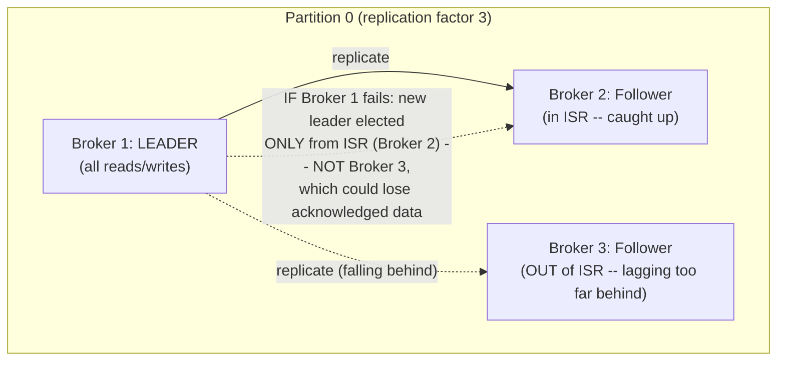
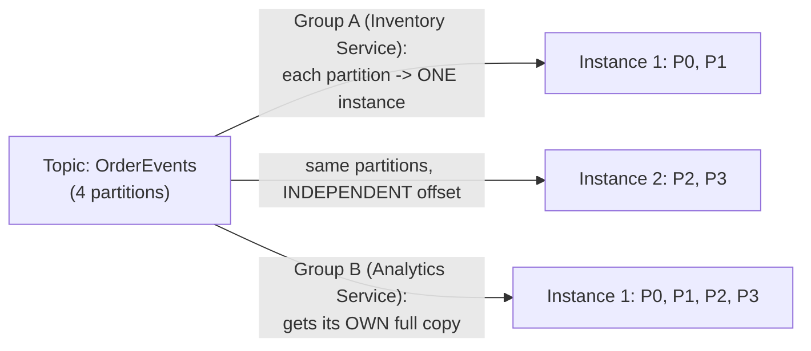
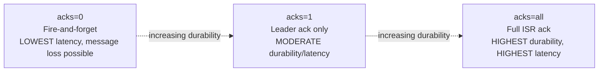
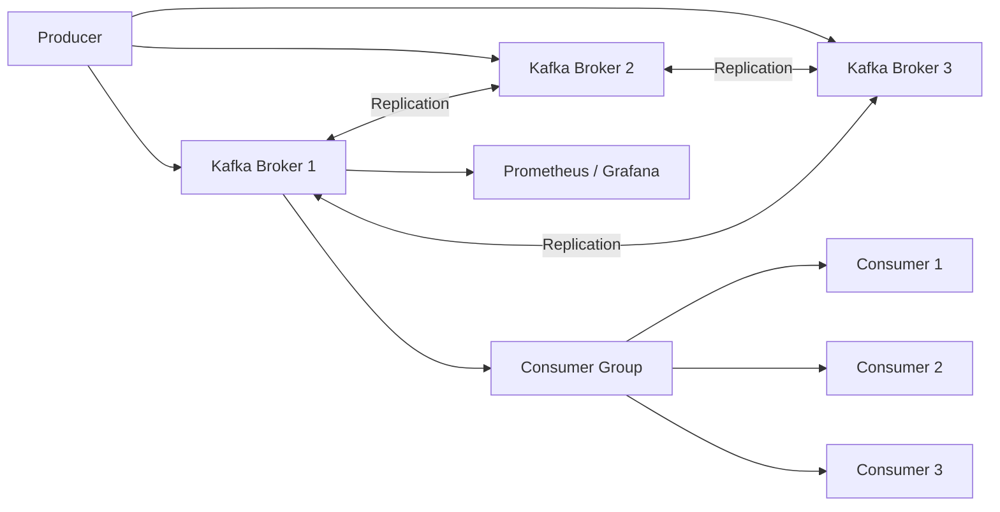
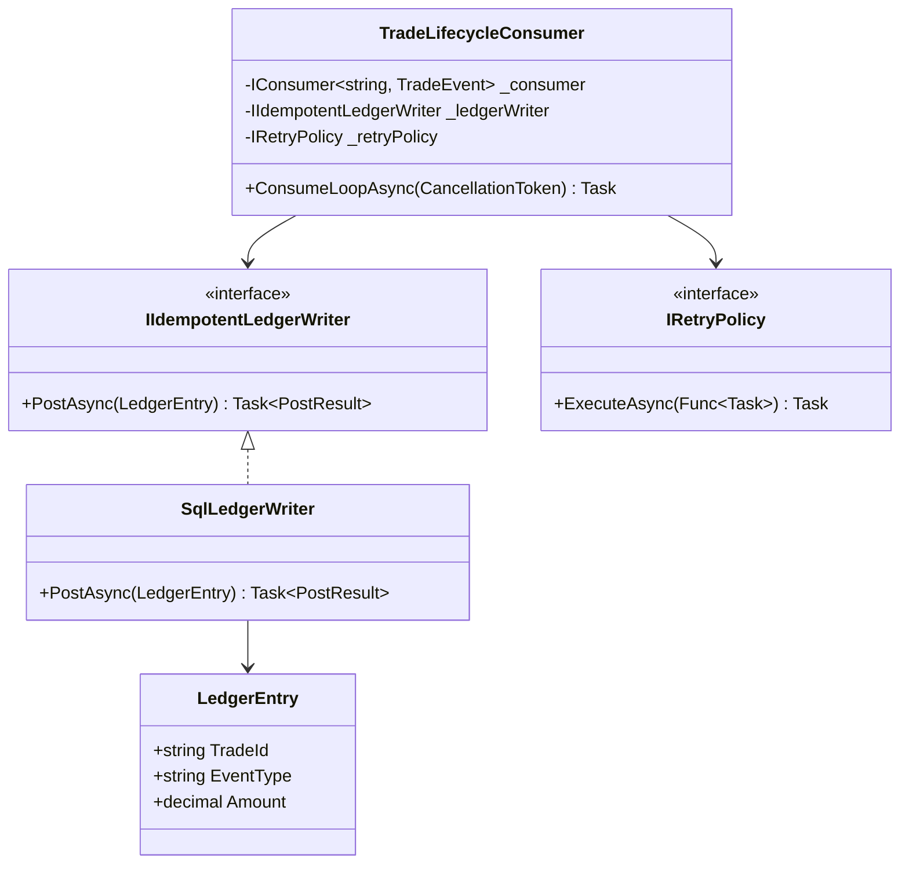
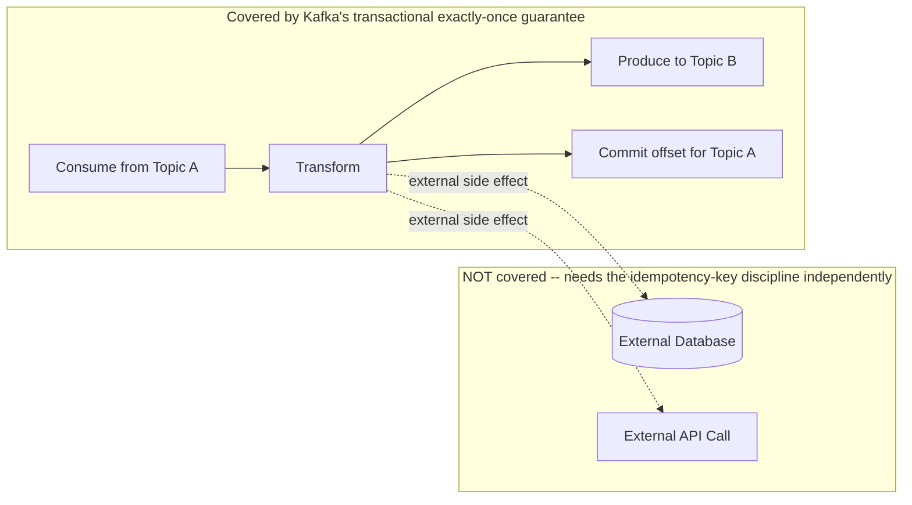
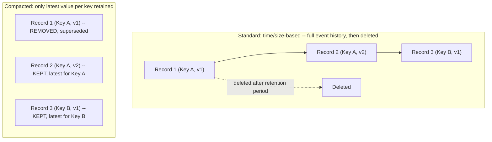
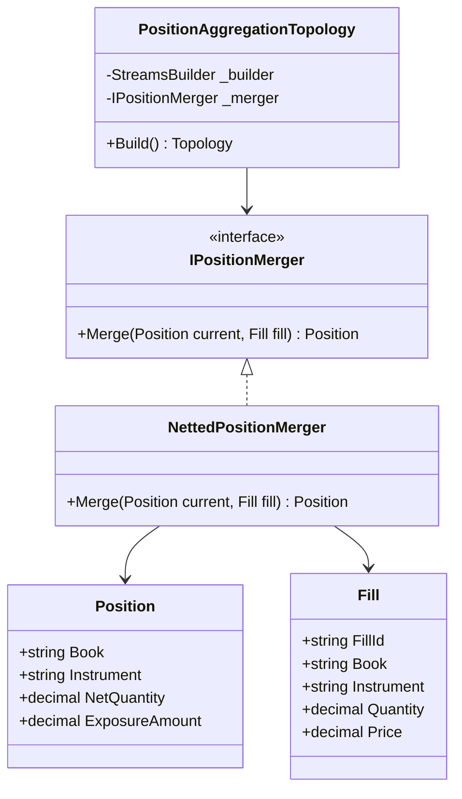
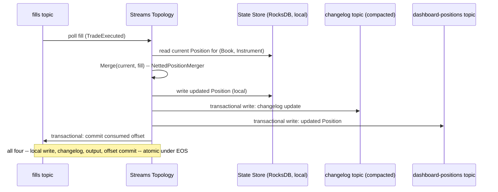

# Kafka — Complete Interview Prep (All Topics, One File)

> Domain: Kafka | Level: Beginner → Expert | Prerequisite: [[../18-Event-Driven-Architecture/01-EDA-Interview-Prep]] (ordering, delivery semantics, DLQs), [[../16-Distributed-Systems/01-Distributed-Systems-Interview-Prep]] (replication, quorums, exactly-once)
> **Quick-prep edition** (consolidated 2026-10-03). This one file replaces Modules 54–55. Originals: `git show ebb2d5c:19-Kafka/<file>.md`. Compare with [[../20-RabbitMQ/01-RabbitMQ-Interview-Prep]]
> Each topic has: **Key concepts → .NET (Confluent.Kafka) code/config → Most common interview questions with answers.**

| # | Topic | # | Topic |
|---|---|---|---|
| 1 | Architecture: brokers, topics, partitions, KRaft | 8 | Exactly-once: idempotent producer & transactions |
| 2 | Partitioning & ordering | 9 | Retention, log compaction & tiered storage |
| 3 | Replication, ISR & durability | 10 | Kafka Streams, ksqlDB & Kafka Connect/CDC |
| 4 | Producers: acks, batching, retries | 11 | Schema Registry & serialization |
| 5 | Consumers & consumer groups | 12 | Operations: sizing, monitoring, security, multi-region |
| 6 | Rebalancing | 13 | Kafka vs RabbitMQ vs cloud services |
| 7 | Offsets & delivery semantics | 14 | Top 30 rapid-fire + Principal · 15 Mistakes checklist |

---

## 1. Architecture: Brokers, Topics, Partitions, KRaft

**Key concepts**
- **Kafka = a distributed, partitioned, replicated, append-only commit log.** Producers append records; consumers read at their own pace by **offset**; records are retained by time/size (not deleted on consumption).
- **Broker:** a server storing partitions. **Topic:** a named stream. **Partition:** an ordered, immutable sequence of records — the unit of **ordering, parallelism and replication**.
- **Record:** key, value, headers, timestamp. The key determines the partition.
- **Controller / metadata:** **KRaft** (Kafka Raft) replaced ZooKeeper (ZooKeeper removed in Kafka 4.0); controllers manage metadata, leader elections and partition assignments.
- Performance comes from **sequential disk I/O**, the OS page cache, **zero-copy** (`sendfile`), batching and compression.
- Managed options: Confluent Cloud, Amazon MSK (incl. Serverless), Azure Event Hubs (Kafka-compatible API), Aiven, Redpanda (Kafka-compatible).

```csharp
// dotnet add package Confluent.Kafka
var config = new ProducerConfig { BootstrapServers = "broker1:9092,broker2:9092", ClientId = "payments-api" };
using var producer = new ProducerBuilder<string, string>(config).Build();
var result = await producer.ProduceAsync("payments.captured",
    new Message<string, string> { Key = payment.AccountId, Value = json,
        Headers = new Headers { { "traceparent", Encoding.UTF8.GetBytes(Activity.Current?.Id ?? "") } } });
Console.WriteLine($"{result.TopicPartitionOffset}");    // e.g. payments.captured [[3]] @1042
```

**Common interview questions**

**Q1. Why is Kafka so fast?**
Append-only sequential writes, reading from the OS page cache, zero-copy transfer from disk to network, batching and compression of records, and partitioning for horizontal parallelism. It doesn't track per-message acknowledgements — consumers just track offsets.

**Q2. What changed with KRaft?**
Kafka manages its own metadata with an internal Raft quorum instead of ZooKeeper: one system to operate, faster controller failover, and support for far more partitions. Kafka 4.0 runs only in KRaft mode.

**Q3. Kafka as a database?**
It's a durable, replayable log and can be a source of truth for events (with compaction for latest state), but it has no secondary indexes or ad hoc queries. Typically it feeds databases, caches and search indexes that serve queries.

---

## 2. Partitioning & Ordering

**Key concepts**
- **Ordering is guaranteed only within a partition.** Choose the **key** = the entity whose events must stay ordered (accountId, orderId).
- Default partitioner: `murmur2(key) % numPartitions`; null keys → sticky partitioning across partitions (no ordering).
- **Partition count** sets maximum consumer parallelism (one consumer per partition per group). Choose for **future** peak throughput: partitions ≈ max(target throughput ÷ per-consumer throughput, target ÷ per-partition producer throughput).
- **Adding partitions later remaps keys** → ordering breaks for existing keys; can't reduce partitions.
- **Hot partitions** from skewed keys (one big merchant) → compose the key (`merchantId + shard`), accepting looser ordering, or isolate the hot entity in its own topic.
- Too many partitions → more open files, longer leader elections and rebalances, more memory; KRaft raised practical limits, but keep it purposeful.

**Common interview questions**

**Q1. How do you guarantee the ordering of an account's transactions?**
Use the account ID as the key so all its records go to one partition, keep `enable.idempotence=true` (preserves order under retries), process each partition sequentially (or parallelize by key within it), and avoid changing the partition count.

**Q2. How do you choose the number of partitions?**
From target peak throughput and per-consumer processing rate (e.g., 50k msg/s ÷ 2k msg/s per consumer = 25 → round up with headroom, e.g., 32), plus future growth because increasing later breaks key ordering. Balance against overhead per partition.

**Q3. Increasing partitions broke ordering. Why, and how should it have been done?**
The key→partition mapping changed, so new records for a key went to a different partition and could be consumed before older ones still queued in the old partition. Over-provision at creation; if you must grow, create a new topic with more partitions, dual-write or migrate with a cutover after draining the old topic.

---

## 3. Replication, ISR & Durability

**Key concepts**
- Each partition has a **leader** and **followers** (replication factor, typically **3**). Producers and consumers talk to the leader (consumers can fetch from the closest follower with rack awareness).
- **ISR (in-sync replicas):** followers caught up within `replica.lag.time.max.ms`.
- **`acks=all` + `min.insync.replicas=2` (RF=3):** a write succeeds only when at least 2 in-sync replicas have it → survives one broker loss without data loss; if ISR drops below 2, producers get `NotEnoughReplicas` (choosing consistency over availability).
- **High watermark:** consumers only see records replicated to all ISR members.
- **`unclean.leader.election.enable=false`** (default): never elect an out-of-sync replica (which would lose data).
- **Rack/AZ awareness:** spread replicas across AZs (`broker.rack`).

```properties
# Topic / broker durability settings
replication.factor=3
min.insync.replicas=2
unclean.leader.election.enable=false
```

**Common interview questions**

**Q1. Messages vanished after a broker failure. What happened?**
Likely `acks=1` (the leader acknowledged before replication, then died) or unclean leader election, or `min.insync.replicas=1`. Fix: `acks=all`, `min.insync.replicas=2` with RF=3, unclean election disabled, idempotent producer, and alerts on under-replicated partitions.

**Q2. What does `min.insync.replicas` do?**
With `acks=all`, it's the minimum number of in-sync replicas that must acknowledge a write. If fewer are in sync, writes fail rather than being accepted with weak durability — a deliberate availability-for-durability trade.

**Q3. RF=3, min.insync=2 — how many broker failures can you tolerate?**
One broker for writes without data loss (ISR = 2 still meets the minimum). With two down, writes to affected partitions fail (reads of committed data may continue from the remaining replica).

---

## 4. Producers: acks, Batching, Retries

**Key concepts**
- **`acks`:** `0` (fire and forget), `1` (leader only), **`all`** (all ISR — durable).
- **Idempotent producer** (`enable.idempotence=true`, default in modern clients): producer ID + sequence numbers per partition → broker drops duplicates from retries and preserves order (with ≤ 5 in-flight requests).
- **Batching:** `linger.ms` (wait to fill batches), `batch.size`, **compression** (`lz4`/`zstd`) → throughput vs latency.
- `delivery.timeout.ms` bounds total retry time; `max.in.flight.requests.per.connection`.
- Produce **asynchronously**; handle delivery reports; **flush on shutdown**.
- Use the **outbox pattern** when the produce must be atomic with a DB change.

```csharp
var config = new ProducerConfig
{
    BootstrapServers = brokers,
    Acks = Acks.All,
    EnableIdempotence = true,
    LingerMs = 5,
    BatchSize = 64 * 1024,
    CompressionType = CompressionType.Zstd,
    MessageTimeoutMs = 120_000          // librdkafka: total delivery timeout
};
using var producer = new ProducerBuilder<string, byte[]>(config)
    .SetErrorHandler((_, e) => logger.LogError("Kafka error {Reason}", e.Reason)).Build();

try { await producer.ProduceAsync("orders", new Message<string, byte[]> { Key = orderId, Value = payload }, ct); }
catch (ProduceException<string, byte[]> ex) { logger.LogError(ex, "Delivery failed: {Error}", ex.Error.Reason); throw; }

// On graceful shutdown
producer.Flush(TimeSpan.FromSeconds(10));
```

**Common interview questions**

**Q1. `acks=all` vs `acks=1` — the trade-off?**
`acks=all` waits for all in-sync replicas: higher latency, no data loss on leader failure (with min.insync ≥ 2). `acks=1` is faster but loses writes if the leader dies before followers copy them. Financial events require `acks=all`.

**Q2. What does the idempotent producer guarantee?**
No duplicates and preserved order within a partition *for retries within one producer session*. It doesn't deduplicate across application restarts or across different producers — that needs transactions or consumer-side idempotency.

**Q3. How do you tune for throughput vs latency?**
Higher `linger.ms`, bigger batches and compression boost throughput at the cost of a few milliseconds of latency; for latency-critical flows keep `linger.ms` low. Measure end-to-end.

---

## 5. Consumers & Consumer Groups

**Key concepts**
- A **consumer group** shares partitions: each partition is assigned to **exactly one** consumer in the group; different groups read independently (pub/sub).
- **Max useful consumers = number of partitions**.
- **Poll loop:** `Consume()` → process → commit offset. Processing must finish within **`max.poll.interval.ms`** or the consumer is kicked out (rebalance).
- Concurrency inside one consumer: process **by key** in parallel workers while preserving per-key order, then commit contiguous offsets.
- Settings: `group.id`, `auto.offset.reset` (`earliest`/`latest` when no committed offset), `enable.auto.commit`, `session.timeout.ms`, `isolation.level=read_committed` (with transactions).
- `Confluent.Kafka` wraps librdkafka; `Consume()` is blocking → run it on a dedicated long-running thread in a `BackgroundService`.

```csharp
public sealed class PaymentsConsumer(ILogger<PaymentsConsumer> log, IServiceScopeFactory scopes) : BackgroundService
{
    protected override Task ExecuteAsync(CancellationToken ct) => Task.Factory.StartNew(() => Run(ct), TaskCreationOptions.LongRunning);

    private void Run(CancellationToken ct)
    {
        var cfg = new ConsumerConfig
        {
            BootstrapServers = "broker1:9092", GroupId = "ledger-writer",
            AutoOffsetReset = AutoOffsetReset.Earliest,
            EnableAutoCommit = false,                     // commit after processing (at-least-once)
            IsolationLevel = IsolationLevel.ReadCommitted,
            MaxPollIntervalMs = 300_000,
            PartitionAssignmentStrategy = PartitionAssignmentStrategy.CooperativeSticky
        };
        using var consumer = new ConsumerBuilder<string, string>(cfg).Build();
        consumer.Subscribe("payments.captured");
        try
        {
            while (!ct.IsCancellationRequested)
            {
                var cr = consumer.Consume(ct);
                using var scope = scopes.CreateScope();
                var handler = scope.ServiceProvider.GetRequiredService<IPaymentHandler>();
                handler.HandleAsync(cr.Message, ct).GetAwaiter().GetResult();   // dedicated thread; idempotent handler (inbox)
                consumer.Commit(cr);                                            // or StoreOffset + periodic commit
            }
        }
        catch (OperationCanceledException) { }
        finally { consumer.Close(); }                                           // leave the group cleanly
    }
}
```

**Common interview questions**

**Q1. We added 10 consumers but throughput didn't change. Why?**
The topic has fewer partitions than consumers (extra consumers sit idle), or one hot partition dominates, or the bottleneck is downstream (DB/API). Add partitions (mind ordering), fix key skew, or parallelize processing by key inside consumers.

**Q2. Why is my consumer constantly rebalancing?**
Processing takes longer than `max.poll.interval.ms` (slow downstream, big batches), long GC pauses, consumers crashing, or session timeouts from network issues. Reduce batch size, speed up or offload processing, raise the interval sensibly, and use cooperative-sticky assignment and static membership.

**Q3. How do you process messages in parallel without losing ordering?**
Partition-level parallelism (more partitions/consumers), or within a consumer dispatch records to worker queues keyed by message key (same key → same worker), then commit only offsets below the lowest unfinished one per partition.

---

## 6. Rebalancing

**Key concepts**
- A rebalance reassigns partitions when consumers join/leave/crash, subscriptions change or partitions are added.
- **Eager (stop-the-world):** all consumers revoke all partitions → processing pauses for the whole group.
- **Incremental cooperative (`cooperative-sticky`):** only moved partitions are revoked → far less disruption.
- **Static membership** (`group.instance.id`): restarts within the session timeout don't trigger rebalances (rolling deploys in Kubernetes).
- **KIP-848** (new consumer group protocol, server-side assignment) further reduces rebalance cost in Kafka 4.x.
- Handle revocation: commit processed offsets in the **partitions-revoked** handler to avoid reprocessing.

```csharp
var consumer = new ConsumerBuilder<string, string>(cfg)
    .SetPartitionsRevokedHandler((c, partitions) =>
    {
        // commit what we've processed before losing ownership
        c.Commit(partitions.Select(p => new TopicPartitionOffset(p.TopicPartition, processed[p.TopicPartition])));
    })
    .Build();
// cfg.GroupInstanceId = Environment.GetEnvironmentVariable("POD_NAME");   // static membership
```

**Common interview questions**

**Q1. What is the cost of a rebalance?**
Processing pauses (fully, with eager rebalancing), possible duplicate processing of uncommitted records, lost local state/caches, and lag spikes. Frequent rebalances during deploys or from slow processing can cause cascading lag.

**Q2. How do you minimize rebalance impact during deployments?**
Cooperative-sticky assignment, static membership with stable pod IDs, graceful shutdown that commits offsets and leaves the group, processing times well within `max.poll.interval.ms`, and rolling deployments one pod at a time.

---

## 7. Offsets & Delivery Semantics

**Key concepts**
- Offsets are committed to the internal `__consumer_offsets` topic per group/partition.
- **At-most-once:** commit before processing (a crash loses the message).
- **At-least-once:** process, then commit (a crash re-delivers — **duplicates**) → the standard, with idempotent consumers.
- **Exactly-once (Kafka → Kafka):** transactions (§8).
- **Auto-commit** commits on a timer regardless of processing → may lose (commit before finishing) or duplicate → disable it for important data.
- **Replay/reset:** `kafka-consumer-groups --reset-offsets --to-datetime ...` to reprocess (consumers must be idempotent).
- If the committed offset falls behind retention → `auto.offset.reset` decides (`earliest` reprocesses all retained, `latest` skips — **silent loss**).

```bash
# Reset a group to reprocess from a point in time (group must be stopped)
kafka-consumer-groups --bootstrap-server broker1:9092 --group ledger-writer \
  --topic payments.captured --reset-offsets --to-datetime 2026-10-03T00:00:00.000 --execute

# Inspect lag
kafka-consumer-groups --bootstrap-server broker1:9092 --describe --group ledger-writer
```

**Common interview questions**

**Q1. How do you achieve at-least-once processing safely?**
Disable auto-commit, commit offsets only after the side effect is durably done, and make processing idempotent (inbox table or upserts keyed by business ID) because a crash between processing and commit re-delivers.

**Q2. When is auto-commit acceptable?**
For non-critical data where occasional loss or duplication doesn't matter (metrics, logs) and processing is fast. Never for payments, orders or ledger events.

---

## 8. Exactly-Once: Idempotent Producer & Transactions

**Key concepts**
- **Idempotent producer:** dedupes retries per partition per producer session.
- **Transactions:** a producer with a `transactional.id` writes to multiple partitions **and** commits consumer offsets **atomically** (`SendOffsetsToTransaction`) → consume-transform-produce **exactly-once within Kafka**. Consumers read with `isolation.level=read_committed` to skip aborted records.
- **Zombie fencing:** the same `transactional.id` gets a new epoch on restart; old instances are fenced.
- **Limits:** external side effects (DB writes, emails, HTTP calls) are **not** covered → use the outbox (DB → Kafka) or idempotent sinks (Kafka → DB with dedupe/upserts).
- **Kafka Streams** offers `processing.guarantee=exactly_once_v2`.

```csharp
// Consume-transform-produce with transactions (exactly-once inside Kafka)
var producer = new ProducerBuilder<string, string>(new ProducerConfig
    { BootstrapServers = brokers, TransactionalId = "fx-enricher-1", EnableIdempotence = true }).Build();
producer.InitTransactions(TimeSpan.FromSeconds(30));

while (!ct.IsCancellationRequested)
{
    var cr = consumer.Consume(ct);
    producer.BeginTransaction();
    try
    {
        producer.Produce("payments.enriched", new Message<string, string> { Key = cr.Message.Key, Value = Enrich(cr.Message.Value) });
        producer.SendOffsetsToTransaction(
            [new TopicPartitionOffset(cr.TopicPartition, cr.Offset + 1)], consumer.ConsumerGroupMetadata, TimeSpan.FromSeconds(30));
        producer.CommitTransaction();
    }
    catch (KafkaException) { producer.AbortTransaction(); throw; }      // consumer must seek back / restart
}
```

**Common interview questions**

**Q1. Does Kafka support exactly-once?**
Yes, for read-process-write pipelines entirely within Kafka (transactions + idempotent producer + read_committed consumers). For effects outside Kafka, you still need idempotency or an outbox — "exactly-once" means an effectively-once outcome, not a magic network guarantee.

**Q2. What is zombie fencing?**
If a producer instance pauses and a replacement starts with the same `transactional.id`, the broker bumps the epoch; the old instance's writes are rejected, so two instances can't both commit transactions for the same work.

**Q3. How do you write Kafka events into SQL exactly once?**
Idempotent upserts keyed by business ID, or an inbox table in the same DB transaction, and store the Kafka offset in the same DB transaction (seek to it on startup) — then the DB itself is the source of truth for progress.

---

## 9. Retention, Log Compaction & Tiered Storage

**Key concepts**
- **Delete policy:** keep records for `retention.ms` / `retention.bytes`, deleting whole segments.
- **Compact policy:** keep at least the **latest value per key**; older versions are removed in the background; a record with a **null value is a tombstone** (deletes the key after `delete.retention.ms`).
- `cleanup.policy=compact,delete` combines both.
- Uses for compaction: **state/changelog topics** (latest balance per account, customer profiles, configuration), KTables, `__consumer_offsets`.
- **Tiered storage** (KIP-405; MSK/Confluent): old segments go to object storage (S3) → long retention cheaply.

```bash
kafka-topics --create --topic customer.profiles --partitions 12 --replication-factor 3 \
  --config cleanup.policy=compact --config min.cleanable.dirty.ratio=0.1 --config delete.retention.ms=86400000
```

**Common interview questions**

**Q1. When would you use a compacted topic?**
When consumers need the latest state per key rather than the full history — reference data, profiles, current positions, materialized changelogs — so a new consumer can bootstrap the full current state by reading the topic.

**Q2. How do you delete a key in a compacted topic (e.g., GDPR)?**
Produce a tombstone (key + null value); compaction removes earlier values and eventually the tombstone. Other topics, backups and downstream stores must also delete — and for crypto-shredding, encrypt personal data with per-user keys and delete the key.

---

## 10. Kafka Streams, ksqlDB & Kafka Connect/CDC

**Key concepts**
- **Kafka Streams** (Java/JVM library, no separate cluster): KStream (event stream), **KTable** (changelog → latest state), joins, windowed aggregations, state stores (RocksDB) backed by changelog topics, exactly-once. In .NET: **Streamiz.Kafka.Net** (community port), or use Flink/ksqlDB.
- **ksqlDB:** SQL over streams (`CREATE STREAM`, `CREATE TABLE AS SELECT`, windowed aggregates), push/pull queries.
- **Kafka Connect:** source and sink connectors (JDBC, Debezium CDC, S3, Elasticsearch, Snowflake), distributed workers, SMTs (single message transforms), DLQs for sink errors.
- **Debezium CDC:** streams DB changes (SQL Server CDC, PostgreSQL logical decoding, MySQL binlog) into topics — feeds the outbox pattern or data lakes.

```sql
-- ksqlDB: payments per merchant per minute
CREATE STREAM payments (merchantId VARCHAR KEY, amount DECIMAL(19,4), currency VARCHAR)
  WITH (KAFKA_TOPIC='payments.captured', VALUE_FORMAT='AVRO');
CREATE TABLE payments_per_minute AS
  SELECT merchantId, COUNT(*) AS cnt, SUM(amount) AS total
  FROM payments WINDOW TUMBLING (SIZE 1 MINUTE)
  GROUP BY merchantId EMIT CHANGES;
```

```json
{
  "name": "orders-outbox",
  "config": {
    "connector.class": "io.debezium.connector.sqlserver.SqlServerConnector",
    "database.hostname": "sql", "database.names": "Orders", "table.include.list": "dbo.Outbox",
    "transforms": "outbox",
    "transforms.outbox.type": "io.debezium.transforms.outbox.EventRouter",
    "transforms.outbox.route.by.field": "AggregateType"
  }
}
```

**Common interview questions**

**Q1. KStream vs KTable?**
A KStream is an unbounded sequence of independent events (each record matters). A KTable is a changelog interpreted as the latest value per key (an update overwrites). Joining a stream with a table enriches events with current reference data.

**Q2. What is Kafka Connect for, and when would you write a custom consumer instead?**
Connect moves data between Kafka and external systems with configuration only (CDC, sinks to warehouses, search, S3), with scaling, offsets and error handling built in. Write custom consumers when you need business logic, complex transformations or transactional integration with your own domain.

---

## 11. Schema Registry & Serialization

**Key concepts**
- **Schema Registry** (Confluent, Apicurio, AWS Glue): stores Avro/Protobuf/JSON Schema versions per subject; producers register, consumers fetch by schema ID embedded in the message; **compatibility rules** enforced at registration (BACKWARD default; FULL_TRANSITIVE for long-lived streams).
- **Subject naming:** `TopicNameStrategy` (one schema per topic) vs `RecordNameStrategy` (multiple event types per topic).
- Avro: compact binary, defaults enable evolution. Protobuf: field numbers. JSON: easy, larger, weaker typing.
- Breaking changes → a new topic or event version with a migration window.

```csharp
// Confluent.SchemaRegistry.Serdes.Avro
var schemaRegistry = new CachedSchemaRegistryClient(new SchemaRegistryConfig { Url = "http://schema-registry:8081" });
using var producer = new ProducerBuilder<string, PaymentCaptured>(producerConfig)
    .SetValueSerializer(new AvroSerializer<PaymentCaptured>(schemaRegistry,
        new AvroSerializerConfig { AutoRegisterSchemas = false }))   // register via CI, not at runtime
    .Build();
```

**Common interview question**

**Q. Why disable auto-registration of schemas in production?**
So schema changes go through CI with compatibility checks and review, rather than any producer deployment silently registering a new (possibly incompatible) version. Producers then fail fast if their schema isn't registered.

---

## 12. Operations: Sizing, Monitoring, Security, Multi-Region

**Key concepts**
- **Monitoring:** under-replicated partitions (must be 0), offline partitions, ISR shrink/expand rate, active controller count (1), request latency (produce/fetch), **consumer lag (time-based)**, disk usage and retention headroom, network throughput, rebalance rate, producer error rate. Tools: Burrow, Kafka Exporter + Prometheus, Confluent Control Center, Cruise Control (rebalancing partitions across brokers).
- **Sizing:** throughput (MB/s in and out × replication factor), retention × throughput = disk, partitions per broker, headroom for broker failure and rebalancing.
- **Security:** TLS encryption, authentication (SASL/SCRAM, mTLS, OAuth/OIDC, IAM for MSK), **ACLs** per topic/group (producers write only their topics), encryption at rest, quotas per client to stop noisy tenants.
- **Multi-region:** MirrorMaker 2 / Cluster Linking (async, offsets differ → offset translation or timestamp-based failover), stretch clusters (synchronous across nearby AZs/regions — latency cost).
- **Upgrades:** rolling broker restarts, protocol version pinning, client compatibility.

**Common interview questions**

**Q1. Consumer lag is growing — diagnose.**
All partitions or one? One → a hot key or a poison message stuck in retries. All → downstream slowness, too few consumers/partitions, rebalance storms, or a traffic spike. Check consumer error logs, processing latency, rebalance metrics and downstream dependencies; compare time lag with retention (urgency). Scale consumers up to the partition count, fix the hot key or DLQ the poison message, and protect downstream.

**Q2. What do you alert on for a Kafka cluster?**
Under-replicated and offline partitions, controller changes, ISR shrinks, disk usage vs retention, request latency p99, consumer time lag vs SLO and retention, and producer delivery failures — symptoms first, then causes.

**Q3. How do you secure a multi-team Kafka cluster?**
TLS + strong authentication (mTLS/SASL/OAuth), ACLs giving each service write access only to its own topics and read access only to topics it consumes, client quotas, topic provisioning via IaC with naming conventions and ownership, and audit logging.

---

## 13. Kafka vs RabbitMQ vs Cloud Services

| | **Kafka** | **RabbitMQ** | **SQS/SNS** | **Azure Service Bus** | **Event Hubs / Kinesis** |
|---|---|---|---|---|---|
| Model | partitioned log | broker queues + exchanges | managed queue / pub-sub | managed queues/topics (enterprise features) | managed partitioned log |
| Retention/replay | yes (time/size, compaction) | no (deleted on ack; streams add a log) | no (up to 14 days in queue) | no (DLQ, deferral) | yes (time-based) |
| Ordering | per partition | per queue (single consumer) | FIFO queues per group | sessions | per partition/shard |
| Throughput | very high | high | high (managed) | medium-high | very high |
| Routing | by topic/key | rich (direct/topic/fanout/headers) | SNS filters | filters, sessions | by partition key |
| Best for | event streaming, CDC, analytics, many consumers | task queues, RPC, complex routing | simple decoupling on AWS | enterprise messaging on Azure (transactions, sessions, dedup) | telemetry/stream ingest |

**Common interview question**

**Q. When would you choose Kafka over Service Bus or SQS?**
When you need high-throughput event streams consumed by many independent consumers, replay (rebuild read models, onboard new consumers), long retention, per-key ordering at scale, or stream processing. Choose Service Bus/SQS for work queues with per-message features (sessions, scheduled delivery, DLQ, dedup) and minimal operations.

---

## 14. Top 30 Rapid-Fire Questions + Principal Questions

1. **Kafka in one line?** A distributed, partitioned, replicated commit log.
2. **Ordering?** Per partition only.
3. **Key role?** Chooses the partition → order per key.
4. **Max consumers in a group?** Number of partitions.
5. **Two groups on one topic?** Each gets all messages.
6. **ISR?** Followers caught up with the leader.
7. **Durable config?** `acks=all`, RF=3, `min.insync.replicas=2`.
8. **Unclean leader election?** Disabled (prevents data loss).
9. **Idempotent producer?** Dedupes retries per partition per session.
10. **Transactions?** Atomic multi-partition writes + offset commits.
11. **read_committed?** Skip aborted transactional records.
12. **Zombie fencing?** `transactional.id` epochs.
13. **At-least-once?** Process then commit.
14. **Auto-commit risk?** Loss or duplicates.
15. **Lag beyond retention?** Silent data loss.
16. **`auto.offset.reset`?** earliest/latest when no offset exists.
17. **Rebalance trigger?** Join/leave/crash/timeouts/partition changes.
18. **Reduce rebalances?** Cooperative-sticky + static membership.
19. **`max.poll.interval.ms`?** Max processing time between polls.
20. **Adding partitions?** Breaks key ordering.
21. **Compaction?** Latest value per key; tombstones delete.
22. **Tiered storage?** Old segments in object storage.
23. **Kafka Streams KTable?** Latest value per key.
24. **Kafka Connect?** Config-driven source/sink integration.
25. **Debezium?** CDC from database logs.
26. **Schema Registry?** Versioned schemas + compatibility.
27. **ZooKeeper today?** Replaced by KRaft.
28. **Why fast?** Sequential I/O, page cache, zero-copy, batching.
29. **Hot partition fix?** Better key, salting, separate topic.
30. **.NET client?** Confluent.Kafka (librdkafka) in a BackgroundService.

**Principal-level questions**

**P1. Design the Kafka platform for a bank.**
Managed (MSK/Confluent) or a dedicated platform team; multi-AZ with RF=3 and min.insync=2; topic provisioning via GitOps with naming, ownership, retention and ACLs; Schema Registry with FULL_TRANSITIVE for core events; mTLS/OAuth and per-team ACLs and quotas; tiered storage for regulatory retention; DR via cluster linking with documented RPO and offset translation; standard client libraries (outbox, idempotent consumer, OTel); dashboards and SLOs for lag and availability; and a cost model per team.

**P2. Kafka is the backbone — what's your biggest risk and mitigation?**
It's a shared dependency for everything: an outage or a misbehaving tenant affects all teams. Mitigate with quotas, separate clusters for critical vs bulk workloads, capacity headroom, upgrade discipline, chaos tests of broker loss, and producers that degrade gracefully (outbox buffering in the DB).

**P3. How do you migrate from RabbitMQ to Kafka without downtime?**
Bridge: publish to both (or a connector from RabbitMQ to Kafka), move consumers one by one to Kafka with idempotent handling, compare outputs, cut producers over to Kafka (via outbox), then decommission queues. Keep message contracts identical during the transition.

---

## 15. Mistakes Checklist (say why each is wrong)
- [ ] `acks=1`/`min.insync.replicas=1` for financial data · unclean leader election enabled
- [ ] No key (losing ordering) · low-cardinality or skewed keys · increasing partitions casually
- [ ] More consumers than partitions expecting more throughput
- [ ] Auto-commit for critical data · committing before processing · no idempotent consumer
- [ ] Long processing exceeding `max.poll.interval.ms` · eager rebalancing during deploys
- [ ] Assuming transactions cover external side effects · dual writes without an outbox
- [ ] Lag alerts on message count only · ignoring retention vs lag
- [ ] Auto-registering schemas from producers in prod · breaking schema changes in place
- [ ] No ACLs/quotas on a shared cluster · copying offsets across clusters on failover
- [ ] Blocking `Consume()` on thread-pool threads · not closing consumers on shutdown

---

## Architecture Diagrams (preserved from the original modules)

> All 14 Mermaid/ASCII diagrams from the original `19-Kafka/` files, kept verbatim and grouped by source module. Originals: `git show ebb2d5c:19-Kafka/<file>.md`.

### Module 54 — Kafka: Architecture, Partitioning, Replication & Consumer Group Internals
*Source: `01-Architecture-Partitioning-Replication-ConsumerGroups.md`*

**Partition Replication and Leader Election**



**Consumer Groups: Fan-out Across Groups, Load-Balancing Within a Group**



**`acks` Trade-off**



**Apache Kafka Architecture — the Cluster-Level View**



**Replication — Leader Serves All Traffic, Followers Pull**

```text
         ┌──────────────────────────┐
         │ Broker-1                 │
         │ Partition-0  (LEADER)    │   <- every produce and consume goes here
         └─────────────┬────────────┘
                       │  followers PULL from the leader
            ┌──────────┴──────────┐
            ▼                     ▼
   ┌──────────────────┐  ┌──────────────────┐
   │ Broker-2         │  │ Broker-3         │
   │ Partition-0      │  │ Partition-0      │
   │ (FOLLOWER, ISR)  │  │ (FOLLOWER, ISR)  │
   └──────────────────┘  └──────────────────┘
```

**Consumer Group — Partition Assignment Table**

```text
                Topic: Orders
                      │
        ┌─────────────┴──────────────┐
        │      Consumer Group A      │
        └─────────────┬──────────────┘
              ┌───────┴───────┐
              ▼               ▼
        ┌────────────┐  ┌────────────┐
        │ Consumer-1 │  │ Consumer-2 │
        └────────────┘  └────────────┘

   Partition-0  ->  Consumer-1
   Partition-1  ->  Consumer-2
   Partition-2  ->  Consumer-1     <- 3 partitions, 2 consumers:
                                      one consumer carries two
```

**Message Flow — Where Ordering and Durability Are Actually Decided**

```text
   Producer
      │
      │  publish
      ▼
   Kafka Topic
      │
      │  partition selected: hash(key), or round-robin when key is null
      ▼
   Leader Broker for that partition
      │
      │  replicate to followers; acks honoured per min.insync.replicas
      ▼
   Consumer Group
      │
      │  one partition -> exactly one member
      ▼
   Business Service
```

**End-to-End: Cluster, Topic, Partitions, Consumers**

```text
                    Producer
                        │
                        ▼
                  Kafka Cluster
        ┌──────────┬──────────┬──────────┐
        │ Broker1  │ Broker2  │ Broker3  │
        └──────────┴──────────┴──────────┘
                        │
                 Topic (Orders)
                        │
          ┌─────────────┴─────────────┐
          ▼             ▼             ▼
     Partition0    Partition1    Partition2
          │             │             │
          ▼             ▼             ▼
     Consumer1     Consumer2     Consumer3
```

**13. Low-Level Design**



**13. Low-Level Design**

```mermaid
sequenceDiagram
 participant K as Kafka (trade-lifecycle-events)
 participant C as TradeLifecycleConsumer
 participant W as SqlLedgerWriter
 participant DB as Ledger DB (unique index: TradeId+EventType)

 K->>C: poll -> TradeSettled(TradeId=T1)
 C->>W: PostAsync(LedgerEntry)
 W->>DB: INSERT ... ON CONFLICT (TradeId, EventType) DO NOTHING
 DB-->>W: 0 rows affected (already posted)
 W-->>C: PostResult.AlreadyPosted
 C->>K: Commit(offset) -- safe to commit; duplicate was a no-op, not an error
```

### Module 55 — Kafka: Exactly-Once Semantics, Kafka Streams/ksqlDB & Log Compaction
*Source: `02-ExactlyOnce-Streams-LogCompaction.md`*

**Exactly-Once Scope: What's Covered, What's Not**



**Standard Retention vs Log Compaction**



**13. Low-Level Design**



**13. Low-Level Design**


