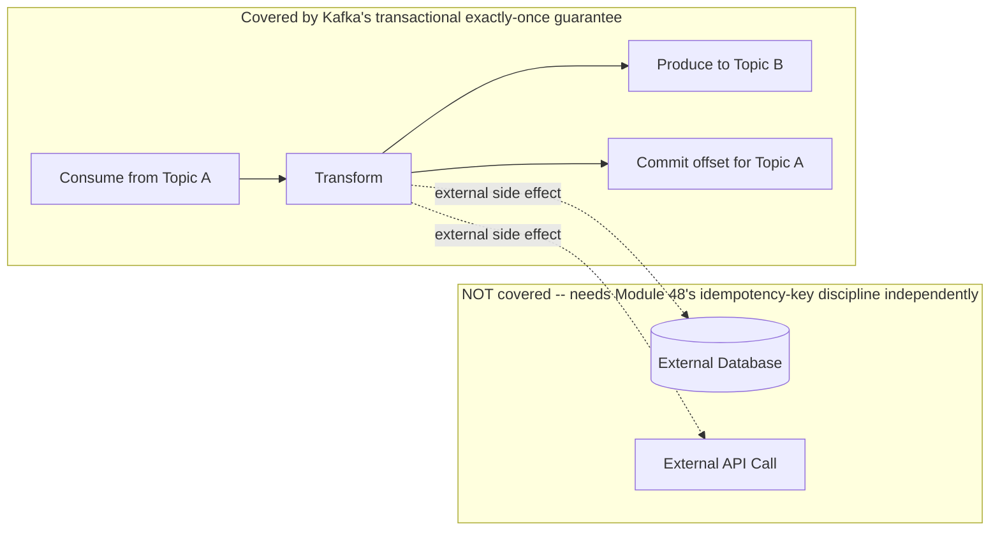
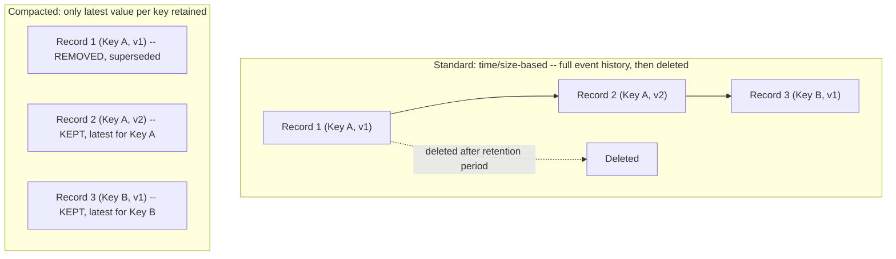

# Module 55 — Kafka: Exactly-Once Semantics, Kafka Streams/ksqlDB & Log Compaction

> Domain: Kafka | Level: Intermediate → Expert | Prerequisite: [[01-Architecture-Partitioning-Replication-ConsumerGroups]], [[../18-Event-Driven-Architecture/02-Schema-Evolution-Ordering-DeliverySemantics-DLQ]] §2.4 (delivery semantics)

---

## 1. Fundamentals

### Why does Kafka's "exactly-once semantics" deserve its own deep dive beyond Module 54's `acks`/offset-commit discussion?
Module 54 §2.6 already noted that true exactly-once delivery is hard and that most systems achieve exactly-once *processing effect* via idempotent consumers layered on at-least-once delivery — but Kafka specifically provides a genuine, protocol-level exactly-once guarantee for a **bounded, specific scope**: read-process-write pipelines that stay entirely within Kafka (consume from one topic, transform, produce to another topic, all as part of Kafka's own transactional mechanism) — understanding exactly what this guarantee covers, and critically, what it does **not** cover (any side effect to an external, non-Kafka system), is essential to avoid the common, costly mistake of assuming "exactly-once" solves a broader problem than it actually does.

### Why does this matter?
Because Kafka Streams and ksqlDB (stream-processing frameworks built directly on Kafka's consumer/producer APIs) are increasingly the default choice for building real-time transformation/aggregation pipelines, and log compaction is a distinct, differently-configured topic-retention strategy from the time/size-based retention Module 54 implicitly assumed — a Principal Engineer needs both to design correct stream-processing topologies and to choose the right retention strategy for topics serving as a changelog/latest-state source rather than a pure event history.

### When does this matter?
Any system building multi-stage Kafka-to-Kafka processing pipelines (stream processing, real-time aggregation, materialized views derived from an event stream) — precisely the domain Kafka Streams/ksqlDB target, and precisely where a misunderstanding of exactly-once's actual scope, or an incorrect retention-strategy choice, causes subtle, hard-to-diagnose correctness bugs.

### How does it work (30,000-ft view)?
```
Exactly-once (Kafka-native): idempotent producer (dedup on the broker side, per producer session)
             + transactional writes (atomically commit a consumed offset AND a produced record
             together, as one atomic unit) -- guarantees hold ONLY within Kafka-to-Kafka pipelines
Kafka Streams / ksqlDB: a library/SQL layer built on Kafka's consumer/producer APIs for stream
             transformation, joins, and aggregation -- inherits Kafka's exactly-once guarantee
             for its OWN internal state, when configured to do so
Log Compaction: an alternative retention strategy keeping only the LATEST record per key
             (not the full history) -- turns a topic into a durable, replayable changelog of
             CURRENT STATE per key, rather than a full event history
```

---

## 2. Deep Dive

### 2.1 The Idempotent Producer — Deduplicating at the Broker, Per Producer Session
Enabling `enable.idempotence=true` on a producer assigns it a unique Producer ID (PID) and attaches a monotonically-increasing sequence number to every message it sends for a given partition — the broker tracks the last sequence number it has durably written per (PID, partition) pair and **silently deduplicates** any message with a sequence number it has already seen, which directly solves the specific, narrow problem of a producer's own **retry** (Module 50 §2.2's retry pattern, applied here) sending the same message twice due to an ambiguous acknowledgment failure (the original write actually succeeded, but the acknowledgment was lost, causing the producer to retry) — this is a genuine, broker-enforced, exactly-once guarantee, but strictly scoped to **producer-side retry deduplication**, not a general system-wide exactly-once guarantee across arbitrarily many producers or across any non-Kafka side effect.

### 2.2 Transactions — Atomically Committing a Consume-Transform-Produce Cycle
Kafka transactions extend idempotent production further: a stream-processing application can wrap **consuming an input record, producing one or more output records, and committing its consumer offset** all as a single, atomic transaction — either all three happen, or none do, meaning a crash mid-processing can never leave the system in an inconsistent state (e.g., having produced an output record but not yet committed the corresponding input offset, which would cause that same input to be reprocessed and produce a **duplicate** output record on restart). This is what enables genuinely exactly-once **Kafka-to-Kafka** processing semantics — but critically, this transactional guarantee applies **only to Kafka's own topics and offsets**; if the same processing step also writes to an external database or calls an external API as a side effect, that external write is **entirely outside** this transactional boundary and can still be duplicated on reprocessing after a crash, unless that external system is made idempotent independently (Module 48's idempotency-key discipline, which remains mandatory for any non-Kafka side effect regardless of Kafka's own transactional guarantees).

### 2.3 Kafka Streams — a Library, Not a Separate Cluster
Kafka Streams is a Java/JVM client library (with a growing ecosystem of interop options for other languages) that runs **within your own application process**, built directly on the standard Kafka consumer/producer APIs — unlike some other stream-processing frameworks that require a separate, dedicated processing cluster, a Kafka Streams application is simply a regular application that happens to consume from and produce to Kafka topics using higher-level abstractions (stream transformations, joins, windowed aggregations) rather than raw consumer/producer calls, and it inherits Kafka's exactly-once transactional guarantee (§2.2) automatically when the appropriate configuration (`processing.guarantee=exactly_once_v2`) is enabled, without the application needing to manually orchestrate consume/produce/offset-commit transactions itself.

### 2.4 ksqlDB — SQL-Level Stream Processing
ksqlDB provides a SQL-like interface over Kafka Streams' underlying capabilities, letting an engineer express stream transformations, joins, and aggregations declaratively (`CREATE STREAM enriched_orders AS SELECT ... FROM orders JOIN customers ...`) rather than writing Kafka Streams' programmatic Java API directly — this trades some flexibility for significantly faster development of common stream-processing patterns, and is particularly valuable for teams wanting real-time materialized views or continuous queries without needing deep Kafka Streams programming expertise, at the cost of being less suited to highly custom, complex processing logic that doesn't map cleanly onto SQL's declarative model.

### 2.5 Log Compaction — Retaining Only the Latest Value Per Key
Standard Kafka topic retention deletes records after a configured time/size threshold, regardless of key — appropriate for a pure event-history/audit-log use case. **Log compaction** (a per-topic configuration, `cleanup.policy=compact`) instead retains **only the most recent record for each distinct key**, periodically removing older records for keys that have since been updated — this transforms a topic into a durable, replayable **changelog of current state** rather than a full history, directly useful for scenarios like "the current state of every customer's profile" (where only the latest update per customer ID matters, not the full history of every past update) or as the underlying mechanism for Kafka Streams' own internal state-store changelogs (§2.3's exactly-once state management is itself typically backed by compacted topics). A record published with a `null` value for a given key acts as a **tombstone**, signaling that key's data should be fully removed during the next compaction cycle — the mechanism for deleting a key's data entirely from a compacted topic, since compaction alone only reduces to the latest value per key, it doesn't remove keys.

### 2.6 Choosing Between Compacted and Standard Retention
The deciding question: does this topic represent an **event history** (where every individual occurrence matters and should be preserved and replayable — an audit log, a sequence of state transitions) or a **current-state snapshot keyed by entity** (where only the latest value per key matters, and older values are genuinely superseded, not independently valuable)? Choosing compaction for a topic that's actually serving as an event history silently **loses** historical records a consumer might have needed (Module 53 §2.6's replay capability degraded to "replay only the latest state per key," not "replay full history") — a subtle, easy-to-miss mistake since it produces no immediately visible symptom until a consumer actually needs historical detail that compaction has already discarded.

## 3. Visual Architecture

### Exactly-Once Scope: What's Covered, What's Not


### Standard Retention vs Log Compaction


## 4. Production Example
**Scenario**: A real-time order-enrichment pipeline used Kafka Streams to join an `orders` stream with a `customer-profiles` topic (keyed by customer ID) to attach current customer tier/discount-eligibility information to each order event, producing an `enriched-orders` topic consumed by a downstream Billing service. The `customer-profiles` topic was configured with **standard, time-based retention** (30 days) rather than log compaction, on the (incorrect) assumption that "since we're only ever joining against the current customer state, time-based retention is fine as long as it's long enough." Three months after launch, the join began silently failing to find profile data for customers whose most recent profile update happened to fall outside the 30-day retention window (a customer who hadn't updated their profile in over a month, and whose original profile-creation record — the only record Kafka Streams' internal state store had ever seen for that key — aged out and was deleted from the topic), causing Kafka Streams' internal state store (which materializes the `customer-profiles` topic's data to serve the join) to silently lose that customer's profile data during a routine internal state-store rebuild (triggered by a Kafka Streams application restart, which rehydrates its internal state stores by replaying the full underlying changelog topic from the beginning) — orders for these customers were enriched with missing/default discount data instead of their correct, still-valid profile information. **Investigation**: the bug was intermittent and customer-specific (only affecting customers whose profile hadn't been updated recently enough relative to the 30-day window, and only surfacing after an application restart triggered a state-store rebuild, not during normal, continuous operation) making it especially difficult to reproduce and diagnose — the team eventually correlated the affected customers' "last profile update timestamp" against the exact retention window boundary, revealing the pattern. **Root cause**: `customer-profiles` was genuinely a **current-state-per-key** topic (§2.6's compaction use case), but was configured with time-based retention appropriate for an event-history topic instead — time-based retention doesn't understand "latest per key" at all, and simply deletes anything older than the window regardless of whether it happens to be the *only* record ever published for a given key. **Fix**: reconfigured `customer-profiles` to `cleanup.policy=compact`, ensuring the latest record for every key is retained indefinitely (regardless of how long ago it was published), with no dependency on a fixed time window at all — a state-store rebuild now always correctly rehydrates the current profile for every customer, no matter how recently their profile was last updated. **Lesson**: this is precisely §2.6's decision question applied incorrectly — the team correctly identified that "current state" was what mattered, but chose a retention mechanism (time-based) that doesn't actually preserve "current state" as its guarantee, conflating "if I set the window long enough, current data will probably still be there" with "compaction's explicit, permanent, per-key latest-value guarantee, independent of time" — a subtle distinction that only manifested as a real bug for the specific, delayed-update customer segment and specifically upon a state-store rebuild, both of which combined to make the bug rare and hard to reproduce in normal testing.

## 5. Best Practices
- Understand exactly-once's actual scope precisely: it covers Kafka-to-Kafka consume-transform-produce cycles, never external side effects, which always require independent idempotency handling (Module 48) regardless of Kafka's own transactional guarantees.
- Enable `enable.idempotence=true` and `processing.guarantee=exactly_once_v2` (Kafka Streams) by default for any pipeline where duplicate processing would cause a real correctness problem, accepting the modest throughput cost.
- Use ksqlDB for straightforward, SQL-expressible stream transformations/joins/aggregations; use Kafka Streams' programmatic API directly for genuinely complex, custom processing logic that doesn't map cleanly onto SQL.
- Choose log compaction explicitly for any topic serving as a current-state-per-key changelog (§4's corrected fix); never assume a sufficiently long time-based retention window is an adequate substitute.
- Always publish a tombstone (null value) for a key when that entity is genuinely deleted, on any compacted topic — compaction alone reduces to latest-value-per-key, it does not remove keys without an explicit tombstone.

## 6. Anti-patterns
- Assuming Kafka's exactly-once guarantee extends to external, non-Kafka side effects (database writes, API calls) without independent idempotency handling for those specific effects.
- Choosing time-based retention for a topic that's actually serving as a current-state-per-key changelog, risking silent, delayed-manifesting data loss for infrequently-updated keys (§4).
- Forcing genuinely complex, highly custom processing logic into ksqlDB's SQL model when Kafka Streams' full programmatic API would be clearer and more maintainable.
- Forgetting to publish tombstones for deleted entities on a compacted topic, leaving stale data for deleted keys retained indefinitely.
- Treating a Kafka Streams application's internal state-store rebuild as a rare, ignorable edge case rather than a routine operational event (triggered by any restart) that must be tested against, exactly as §4's incident illustrates.

---

## 10. Interview Questions

### Basic (10)
1. **Q: What does enabling `enable.idempotence=true` on a producer prevent?** **A:** Duplicate messages caused by the producer's own retries after an ambiguous acknowledgment failure.
2. **Q: What does a Kafka transaction atomically commit together?** **A:** A consumed input record's offset and the corresponding produced output record(s), as a single atomic unit.
3. **Q: Does Kafka's exactly-once guarantee cover writes to an external database?** **A:** No — it covers only Kafka-to-Kafka consume-transform-produce cycles; external side effects need independent idempotency handling.
4. **Q: What is Kafka Streams?** **A:** A client library (not a separate cluster) built on Kafka's consumer/producer APIs for stream transformation, joins, and aggregation.
5. **Q: What is ksqlDB?** **A:** A SQL-like declarative interface over Kafka Streams' capabilities.
6. **Q: What is log compaction?** **A:** A retention strategy that keeps only the most recent record per key, rather than deleting by time/size regardless of key.
7. **Q: What is a tombstone in a compacted topic?** **A:** A record published with a null value for a key, signaling that key's data should be fully removed during compaction.
8. **Q: When should you choose compacted retention over standard, time-based retention?** **A:** When the topic represents current state per key, not a full event history where every occurrence matters.
9. **Q: What underlies Kafka Streams' internal state stores?** **A:** Compacted changelog topics — every local (RocksDB) state-store update is also written to a per-store changelog topic in Kafka; on instance failure or rebalance, the replacement instance rebuilds its state by replaying that compacted changelog, making the "local" state durably recoverable.
10. **Q: What configuration enables Kafka Streams' exactly-once processing guarantee?** **A:** `processing.guarantee=exactly_once_v2`.

### Intermediate (10)
1. **Q: Why is the idempotent producer's deduplication scoped to "per producer session," not a general, system-wide guarantee?** **A:** It tracks a sequence number per (Producer ID, partition) pair for a specific producer instance's own retries — it doesn't deduplicate messages sent by a different producer, or the same logical event published independently by unrelated code paths.
2. **Q: Why can a Kafka Streams application still produce duplicate output despite Kafka's exactly-once transactional guarantee, if it also writes to an external database?** **A:** The transactional guarantee only covers the Kafka consume/produce/offset-commit cycle; the external database write sits entirely outside that transaction boundary and can be duplicated on reprocessing after a crash unless made independently idempotent.
3. **Q: Why is ksqlDB well-suited to straightforward joins/aggregations but less suited to highly custom processing logic?** **A:** Its declarative SQL model maps cleanly onto common relational-style operations, but complex, imperative, branching business logic often doesn't translate naturally into SQL, making Kafka Streams' full programmatic API a better fit for that complexity.
4. **Q: Why did the §4 incident only manifest for customers whose profile hadn't been updated recently, not all customers?** **A:** Time-based retention deletes records purely by age, regardless of whether a record is the only one ever published for a given key — only keys whose sole update happened to fall outside the retention window lost their data, while frequently-updated customers' recent records remained within the window.
5. **Q: Why did the §4 bug specifically surface upon a Kafka Streams application restart, rather than during continuous, normal operation?** **A:** A state-store rebuild replays the full underlying changelog topic from the beginning to rehydrate the store — if the source topic had already deleted certain keys' only records due to time-based retention, the rebuild simply never sees that data, whereas a long-running, never-restarted instance might retain the data in its already-built in-memory/local state store even after the source topic deletes it.
6. **Q: Why does compaction not remove a key's data without an explicit tombstone?** **A:** Compaction's guarantee is "retain the latest value per key" — a key with a real, non-null latest value is, by that guarantee, always retained; only a null-valued (tombstone) record signals that the key itself should be fully removed.
7. **Q: Why does enabling idempotent production and transactions add measurable overhead, and why is this an acceptable trade-off for many pipelines?** **A:** Sequence-number tracking and transaction-coordinator involvement add processing/latency cost; it's acceptable whenever duplicate processing would cause a genuine correctness problem whose cost exceeds the modest performance overhead of preventing it.
8. **Q: Why does a compacted topic's background compaction process need to keep pace with its update rate?** **A:** If updates arrive faster than compaction can process them, uncompacted "dirty" data accumulates, temporarily inflating storage beyond the ideal latest-value-per-key size until the background process catches up.
9. **Q: Why does a ksqlDB server need its own access-control layer beyond the underlying Kafka ACLs?** **A:** It exposes its own REST/SQL query interface as a new, distinct access surface — Kafka-level ACLs alone don't automatically govern who can issue queries through that separate interface.
10. **Q: Why does Kafka Streams' state-store scaling not require manual state migration when adding application instances?** **A:** State stores are automatically re-partitioned/redistributed as part of the standard Kafka consumer-group rebalancing mechanism (Module 54 §2.4-2.5) that Kafka Streams is built on, handling redistribution as a built-in consequence of partition reassignment.

### Advanced (10)
1. **Q: Diagnose the §4 incident from first principles, and design the specific topic-design review question that would have caught the retention-strategy mistake before it caused a production data-loss bug.**
   **A:** Root cause: conflating "a long-enough time window will probably still contain current data" with compaction's actual, permanent, per-key latest-value guarantee that is independent of time entirely. Review question, applied to every new Kafka topic at design time: "does this topic represent a full event history where every occurrence must be individually preserved and replayable, or does only the latest value per key matter, with older values genuinely superseded and not independently useful?" — if the latter, compaction should be the default choice, explicitly, rather than time-based retention with an assumed-sufficient window; this question, asked explicitly during topic design/review (directly paralleling Module 53 §Advanced Q1's ordering-contract review question), would have surfaced that `customer-profiles` was a current-state-per-key topic requiring compaction's explicit guarantee, not a sufficiently-long time window's implicit, probabilistic one.
2. **Q: A team wants exactly-once guarantees for a pipeline that consumes from Kafka, calls an external payment-processing API, and produces a confirmation event back to Kafka. Design the correct approach, given that Kafka's transactional guarantee doesn't cover the external API call.**
   **A:** Kafka's exactly-once transaction can safely cover the consume-offset-commit and the confirmation-event-production, but the external payment API call itself needs Module 48's idempotency-key pattern applied independently — generate a stable idempotency key (derived from the input event's own unique identifier, not a new random value per attempt) and pass it to the payment API, relying on the payment provider's own idempotency-key support (a standard feature of mature payment APIs) to ensure a retried call (due to a crash between the API call succeeding and the Kafka transaction committing) doesn't double-charge — the two mechanisms (Kafka's internal transaction, and the payment API's own idempotency-key handling) must be composed together, since neither alone covers the full pipeline's correctness needs.
3. **Q: Explain why a Kafka Streams application's internal state-store rebuild being "a routine operational event triggered by any restart" (rather than a rare edge case) has broader implications for how such applications should be tested, beyond just the specific retention-strategy fix in §4.**
   **A:** Since a restart-triggered rebuild replays the complete underlying changelog from the beginning, **any** assumption a team makes about "the changelog topic will always contain everything my state store needs" is implicitly tested every time the application restarts — not just during initial development or rare disaster-recovery drills — meaning topic retention/compaction configuration correctness (and any other assumption about changelog completeness) needs to be validated as part of routine, ongoing operational testing (deliberately triggering restarts and verifying state-store rehydration correctness periodically), not assumed correct once at initial launch and never revisited, since data that ages out of an incorrectly-configured topic between launch and a later restart is exactly the multi-month-delayed bug pattern §4 exhibited.
4. **Q: A Principal Engineer is evaluating whether to adopt ksqlDB or raw Kafka Streams for a new real-time fraud-detection pipeline involving multiple conditional branches, stateful pattern matching across a sliding time window, and calls to an external risk-scoring model. Make and justify a recommendation.**
   **A:** Recommend Kafka Streams' programmatic API over ksqlDB — the described requirements (complex conditional branching, custom stateful pattern-matching logic, and integration with an external model call within the processing topology) exceed what ksqlDB's declarative SQL model comfortably expresses (§2.4's stated limitation); forcing this logic into SQL would likely require convoluted workarounds or splitting logic awkwardly across ksqlDB and external application code, whereas Kafka Streams' full programmatic API directly supports custom processors, stateful transformations, and external calls within the same, clearly-expressed topology — ksqlDB remains the better choice for the more straightforward portions of a pipeline (a simple enrichment join), but this specific, complex use case's requirements point clearly toward the more flexible, if more verbose, programmatic approach.
5. **Q: Design a strategy for migrating an existing, already-in-production topic from standard time-based retention to log compaction (as in §4's fix), without losing data or breaking existing consumers during the transition.**
   **A:** Log compaction and time-based retention can actually be configured **together** (`cleanup.policy=compact,delete`) as an interim, safer transition state — compaction begins retaining the latest value per key going forward, while the existing time-based deletion continues operating on truly aged records that aren't the latest for their key, giving the team a window to verify compaction is behaving correctly (rehydration tests, Advanced Q3) before potentially removing the time-based component entirely and relying purely on compaction — this combined configuration avoids a risky, instantaneous, all-or-nothing retention-policy cutover for a topic already serving production consumers, directly the same incremental, verifiable migration philosophy Module 49's Strangler Fig pattern applies at the architectural level, now applied to a topic-configuration change specifically.
6. **Q: Explain a scenario where relying solely on Kafka's idempotent producer (§2.1) would be insufficient to prevent a duplicate business event, even though the producer's own retries are correctly deduplicated.**
   **A:** If the **application logic itself** (not the Kafka client library) independently decides to re-publish the same logical business event twice — for example, an application that re-processes an already-completed order and calls `producer.Send()` again for an `OrderPlaced` event it had already successfully published in a previous run, perhaps due to its own upstream idempotency-key check being flawed or absent — the idempotent producer's sequence-number-based deduplication has no way to recognize this as a duplicate, since from the producer's perspective, this is a fresh, new message send, not a retry of a previous attempt; idempotent production solves the narrow "did my own retry duplicate this exact send attempt" problem, not the broader "is this logically the same business event as one I already sent, unrelated to retries" problem, which requires the application's own business-level idempotency-key discipline (Module 48) regardless.
7. **Q: How would you decide the appropriate `linger.ms`/batching configuration for a producer operating under a Kafka transaction (§2.2), given that transactions add their own coordination overhead independent of batching?**
   **A:** Transaction overhead and batching configuration are largely independent, composable levers — increasing `linger.ms`/`batch.size` still provides the same general throughput benefit within a transactional producer as a non-transactional one (Module 54 §7), while the transaction's own overhead (coordinator round-trips to begin/commit) is a comparatively fixed, per-transaction cost that's better amortized by including **more records per transaction** (committing a transaction less frequently, covering a larger batch of consumed/produced records per commit) rather than by batching configuration alone — tuning transaction-commit frequency and batch size are therefore two distinct, complementary levers, both worth considering together rather than assuming one substitutes for the other.
8. **Q: A team observes that their compacted `customer-profiles` topic (§4's corrected fix) is growing unexpectedly large despite compaction supposedly retaining only one record per key. Diagnose the likely cause.**
   **A:** Likely cause: compaction runs as a periodic **background** process (§9), not an instantaneous, continuous operation — between compaction cycles, multiple updates for the same key accumulate uncompacted ("dirty" segments awaiting the next compaction pass), and if the update rate is high relative to the broker's compaction throughput capacity, the uncompacted backlog can grow substantially before being reduced — this is a capacity/tuning issue (broker compaction-thread resources, or compaction-trigger threshold configuration) rather than a sign that compaction itself is fundamentally not working, and should be diagnosed by checking compaction-lag/dirty-ratio metrics specifically, not assumed to indicate a compaction-guarantee failure.
9. **Q: Critique this claim: "We've enabled exactly-once semantics on our Kafka Streams application, so our entire order-processing pipeline — including the final database write to our orders table — is now guaranteed to never process an order twice."**
   **A:** This is the exact scope-conflation Advanced Q2 addresses directly — Kafka Streams' exactly-once guarantee (`processing.guarantee=exactly_once_v2`) covers only the Kafka-internal consume/transform/produce/offset-commit cycle; the moment processing logic writes to an external database (a non-Kafka side effect, exactly like the external payment API in Advanced Q2), that write sits entirely outside the transactional boundary and can absolutely still be duplicated on reprocessing after a crash — the claim's confidence in "the entire pipeline" being covered is precisely the misunderstanding this module's fundamentals section warns against, and the database write needs its own, independent idempotency mechanism (a unique constraint on the order ID, or an idempotency-key check) regardless of Kafka Streams' internal guarantee.
10. **Q: As a Principal Engineer establishing Kafka Streams/ksqlDB governance standards for an organization building multiple real-time processing pipelines, design the specific review checklist you would require for every new pipeline design, synthesizing this entire module.**
    **A:** (1) Explicit classification of every output/side effect in the pipeline as either "Kafka-internal" (covered by `exactly_once_v2` if enabled) or "external" (requiring independent, explicitly-designed idempotency handling, Advanced Q2/Q9) — necessary because the scope-conflation risk is subtle and easy to miss under the umbrella term "exactly-once." (2) Explicit retention-strategy justification (compacted vs. standard) for every topic based on the event-history-vs-current-state-per-key question (Advanced Q1) — necessary because the wrong choice produces a silent, delayed-manifesting bug rather than an immediate, visible failure (§4). (3) A requirement to periodically, deliberately test state-store rehydration via triggered restarts in a staging environment (Advanced Q3) — necessary because rehydration-dependent bugs are otherwise only discovered via a production restart, by which point the affected data may already be unrecoverable. (4) A ksqlDB-vs-Kafka-Streams decision explicitly justified against the pipeline's actual logical complexity (Advanced Q4) — necessary to avoid either over-complicating a simple pipeline with unnecessary Java code or under-serving a complex pipeline's needs by forcing it into SQL. Each checklist item targets a distinct, concrete failure mode this module identified through specific incidents or reasoning, directly extending this course's recurring governance-gate pattern into Kafka Streams/ksqlDB-specific practice.

---

## 11. Coding Exercises

### Easy — Idempotent producer configuration (§2.1)
```csharp
var producerConfig = new ProducerConfig
{
    BootstrapServers = "kafka:9092",
    EnableIdempotence = true,  // deduplicates THIS producer's own retried sends, per (PID, partition)
    Acks = Acks.All             // required alongside idempotence for the full durability guarantee
};
```

### Medium — Transactional consume-transform-produce (§2.2)
```csharp
using var producer = new ProducerBuilder<string, EnrichedOrder>(txnProducerConfig).Build();
producer.InitTransactions(TimeSpan.FromSeconds(10));

while (!ct.IsCancellationRequested)
{
    var consumeResult = consumer.Consume(ct);
    producer.BeginTransaction();
    try
    {
        var enriched = Transform(consumeResult.Message.Value);
        producer.Produce("enriched-orders", new Message<string, EnrichedOrder> { Value = enriched });
        producer.SendOffsetsToTransaction(
            new[] { new TopicPartitionOffset(consumeResult.TopicPartition, consumeResult.Offset + 1) },
            consumer.ConsumerGroupMetadata);
        producer.CommitTransaction(); // ATOMIC: produced record + committed offset, together or not at all
    }
    catch (Exception)
    {
        producer.AbortTransaction(); // input record will be redelivered, safely, on next poll
        throw;
    }
}
```

### Hard — Compacted topic with tombstone-based deletion (§2.5, §4's corrected fix)
```csharp
// customer-profiles topic configured with: cleanup.policy=compact
public class CustomerProfileEventHandler
{
    public async Task PublishUpdateAsync(string customerId, CustomerProfile profile)
    {
        await _producer.ProduceAsync("customer-profiles",
            new Message<string, CustomerProfile> { Key = customerId, Value = profile });
        // Compaction guarantees this LATEST value for customerId is retained INDEFINITELY,
        // independent of how long ago it was published -- fixing §4's time-based-retention bug.
    }

    public async Task PublishDeletionAsync(string customerId)
    {
        await _producer.ProduceAsync("customer-profiles",
            new Message<string, CustomerProfile> { Key = customerId, Value = null }); // TOMBSTONE
        // Without this explicit tombstone, a deleted customer's LAST profile value would be
        // retained by compaction FOREVER -- compaction alone never removes a key, only reduces
        // it to its latest value.
    }
}
```

### Expert — ksqlDB declarative enrichment join, with the Kafka Streams equivalent noted (§2.3, §2.4, §Advanced Q4)
```sql
-- ksqlDB: appropriate for THIS straightforward join (§Advanced Q4's "simpler portions" case)
CREATE STREAM enriched_orders AS
    SELECT o.order_id, o.customer_id, o.total_amount, p.tier, p.discount_eligible
    FROM orders o
    JOIN customer_profiles_table p ON o.customer_id = p.customer_id  -- profiles is a COMPACTED table
    EMIT CHANGES;
```
```csharp
// The equivalent, more complex fraud-detection pipeline (Advanced Q4) -- NOT ksqlDB-appropriate,
// needs Kafka Streams' full programmatic API for custom stateful windowed logic + external calls:
var builder = new StreamsBuilder();
builder.Stream<string, Transaction>("transactions")
    .GroupByKey()
    .WindowedBy(TimeWindows.Of(TimeSpan.FromMinutes(5)))
    .Aggregate(() => new FraudScore(), (key, txn, agg) => agg.IncorporateAndScore(txn, _riskModelClient))
    .ToStream()
    .Filter((key, score) => score.IsSuspicious)
    .To("fraud-alerts");
```
**Discussion**: this pairing directly demonstrates Advanced Q4's recommendation in code — the straightforward, relational-style enrichment join maps cleanly onto ksqlDB's declarative SQL, while the fraud-detection pipeline's windowed, stateful aggregation combined with an external risk-model call requires Kafka Streams' programmatic flexibility, illustrating concretely why "which tool fits" depends on the specific pipeline's actual logical complexity, not a blanket organizational preference for one over the other.

---

## 12–17. System Design / LLD / Debugging / Decision / Case Study / Principal

*(§4's incident, the four §11 exercises, and the Advanced-tier Q&A — especially Advanced Q1's topic-design review question, Advanced Q2's composed-idempotency design, and Advanced Q10's synthesized governance checklist — collectively constitute this module's system-design, debugging, and Principal-Engineer-level content.)*

## 18. Revision
**Key takeaways**: Kafka's exactly-once guarantee is real but narrowly scoped — idempotent production deduplicates a producer's own retries, and transactions atomically commit a consume-transform-produce cycle, but neither extends to external, non-Kafka side effects, which always need independent idempotency handling (Module 48) regardless. Kafka Streams is a client library (not a separate cluster) providing this exactly-once guarantee automatically for Kafka-to-Kafka pipelines; ksqlDB layers a SQL interface on top, well-suited to straightforward transformations but not a substitute for Kafka Streams' full API when processing logic is genuinely complex. Log compaction retains only the latest value per key, turning a topic into a durable current-state changelog rather than a full event history — choosing standard, time-based retention for a topic that's actually current-state-per-key silently risks losing data for infrequently-updated keys (§4), a mistake that often only surfaces much later, during a routine state-store rebuild.

---

**`19-Kafka` domain complete (Modules 54–55): architecture/partitioning/replication/consumer groups, and exactly-once/Streams/ksqlDB/log compaction.** Next: `20-RabbitMQ`, Module 56 — Exchanges, Queues, Routing & Message Acknowledgment Patterns, contrasting RabbitMQ's broker-centric, routing-key-based model against Kafka's log-based architecture.
