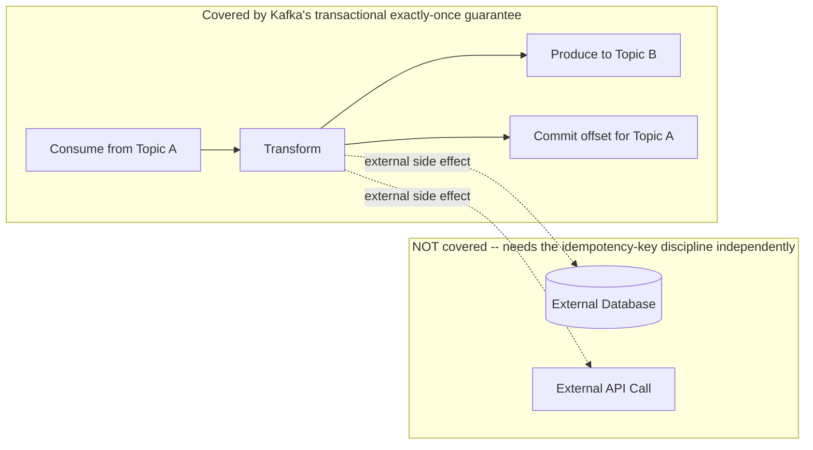
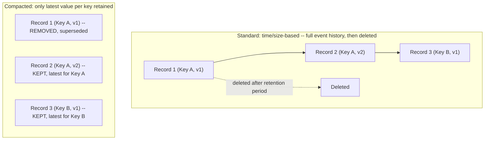
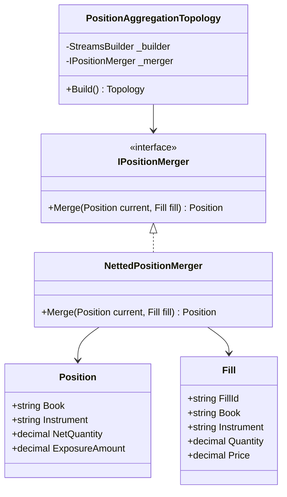
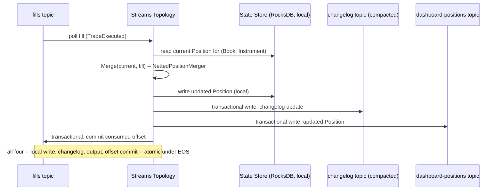

# Module 55 — Kafka: Exactly-Once Semantics, Kafka Streams/ksqlDB & Log Compaction

> Domain: Kafka | Level: Intermediate → Expert | Prerequisite: [[01-Architecture-Partitioning-Replication-ConsumerGroups]], [[../18-Event-Driven-Architecture/02-Schema-Evolution-Ordering-DeliverySemantics-DLQ]] (delivery semantics)

---

## 1. Fundamentals

### Why does Kafka's "exactly-once semantics" deserve its own deep dive beyond the `acks`/offset-commit discussion?
 already noted that true exactly-once delivery is hard and that most systems achieve exactly-once *processing effect* via idempotent consumers layered on at-least-once delivery — but Kafka specifically provides a genuine, protocol-level exactly-once guarantee for a **bounded, specific scope**: read-process-write pipelines that stay entirely within Kafka (consume from one topic, transform, produce to another topic, all as part of Kafka's own transactional mechanism) — understanding exactly what this guarantee covers, and critically, what it does **not** cover (any side effect to an external, non-Kafka system), is essential to avoid the common, costly mistake of assuming "exactly-once" solves a broader problem than it actually does.

### Why does this matter?
Because Kafka Streams and ksqlDB (stream-processing frameworks built directly on Kafka's consumer/producer APIs) are increasingly the default choice for building real-time transformation/aggregation pipelines, and log compaction is a distinct, differently-configured topic-retention strategy from the time/size-based retention implicitly assumed — a Principal Engineer needs both to design correct stream-processing topologies and to choose the right retention strategy for topics serving as a changelog/latest-state source rather than a pure event history.

### When does this matter?
Any system building multi-stage Kafka-to-Kafka processing pipelines (stream processing, real-time aggregation, materialized views derived from an event stream) — precisely the domain Kafka Streams/ksqlDB target, and precisely where a misunderstanding of exactly-once's actual scope, or an incorrect retention-strategy choice, causes subtle, hard-to-diagnose correctness bugs.

### How does it work (30,000-ft view)?
```
Exactly-once (Kafka-native): idempotent producer (dedup on the broker side, per producer session)
 + transactional writes (atomically commit a consumed offset AND a produced record
 together, as one atomic unit) -- guarantees hold ONLY within Kafka-to-Kafka pipelines
Kafka Streams / ksqlDB: a library/SQL layer built on Kafka's consumer/producer APIs for stream
 transformation, joins, and aggregation -- inherits Kafka's exactly-once guarantee
 for its OWN internal state, when configured to do so
Log Compaction: an alternative retention strategy keeping only the LATEST record per key
 (not the full history) -- turns a topic into a durable, replayable changelog of
 CURRENT STATE per key, rather than a full event history
```

---

## 2. Deep Dive

### 2.1 The Idempotent Producer — Deduplicating at the Broker, Per Producer Session
Enabling `enable.idempotence=true` on a producer assigns it a unique Producer ID (PID) and attaches a monotonically-increasing sequence number to every message it sends for a given partition — the broker tracks the last sequence number it has durably written per (PID, partition) pair and **silently deduplicates** any message with a sequence number it has already seen, which directly solves the specific, narrow problem of a producer's own **retry** (the retry pattern, applied here) sending the same message twice due to an ambiguous acknowledgment failure (the original write actually succeeded, but the acknowledgment was lost, causing the producer to retry) — this is a genuine, broker-enforced, exactly-once guarantee, but strictly scoped to **producer-side retry deduplication**, not a general system-wide exactly-once guarantee across arbitrarily many producers or across any non-Kafka side effect.

### 2.2 Transactions — Atomically Committing a Consume-Transform-Produce Cycle
Kafka transactions extend idempotent production further: a stream-processing application can wrap **consuming an input record, producing one or more output records, and committing its consumer offset** all as a single, atomic transaction — either all three happen, or none do, meaning a crash mid-processing can never leave the system in an inconsistent state (e.g., having produced an output record but not yet committed the corresponding input offset, which would cause that same input to be reprocessed and produce a **duplicate** output record on restart). This is what enables genuinely exactly-once **Kafka-to-Kafka** processing semantics — but critically, this transactional guarantee applies **only to Kafka's own topics and offsets**; if the same processing step also writes to an external database or calls an external API as a side effect, that external write is **entirely outside** this transactional boundary and can still be duplicated on reprocessing after a crash, unless that external system is made idempotent independently (the idempotency-key discipline, which remains mandatory for any non-Kafka side effect regardless of Kafka's own transactional guarantees).

### 2.3 Kafka Streams — a Library, Not a Separate Cluster
Kafka Streams is a Java/JVM client library (with a growing ecosystem of interop options for other languages) that runs **within your own application process**, built directly on the standard Kafka consumer/producer APIs — unlike some other stream-processing frameworks that require a separate, dedicated processing cluster, a Kafka Streams application is simply a regular application that happens to consume from and produce to Kafka topics using higher-level abstractions (stream transformations, joins, windowed aggregations) rather than raw consumer/producer calls, and it inherits Kafka's exactly-once transactional guarantee automatically when the appropriate configuration (`processing.guarantee=exactly_once_v2`) is enabled, without the application needing to manually orchestrate consume/produce/offset-commit transactions itself.

### 2.4 ksqlDB — SQL-Level Stream Processing
ksqlDB provides a SQL-like interface over Kafka Streams' underlying capabilities, letting an engineer express stream transformations, joins, and aggregations declaratively (`CREATE STREAM enriched_orders AS SELECT... FROM orders JOIN customers...`) rather than writing Kafka Streams' programmatic Java API directly — this trades some flexibility for significantly faster development of common stream-processing patterns, and is particularly valuable for teams wanting real-time materialized views or continuous queries without needing deep Kafka Streams programming expertise, at the cost of being less suited to highly custom, complex processing logic that doesn't map cleanly onto SQL's declarative model.

### 2.5 Log Compaction — Retaining Only the Latest Value Per Key
Standard Kafka topic retention deletes records after a configured time/size threshold, regardless of key — appropriate for a pure event-history/audit-log use case. **Log compaction** (a per-topic configuration, `cleanup.policy=compact`) instead retains **only the most recent record for each distinct key**, periodically removing older records for keys that have since been updated — this transforms a topic into a durable, replayable **changelog of current state** rather than a full history, directly useful for scenarios like "the current state of every customer's profile" (where only the latest update per customer ID matters, not the full history of every past update) or as the underlying mechanism for Kafka Streams' own internal state-store changelogs (the exactly-once state management is itself typically backed by compacted topics). A record published with a `null` value for a given key acts as a **tombstone**, signaling that key's data should be fully removed during the next compaction cycle — the mechanism for deleting a key's data entirely from a compacted topic, since compaction alone only reduces to the latest value per key, it doesn't remove keys.

### 2.6 Choosing Between Compacted and Standard Retention
The deciding question: does this topic represent an **event history** (where every individual occurrence matters and should be preserved and replayable — an audit log, a sequence of state transitions) or a **current-state snapshot keyed by entity** (where only the latest value per key matters, and older values are genuinely superseded, not independently valuable)? Choosing compaction for a topic that's actually serving as an event history silently **loses** historical records a consumer might have needed (the replay capability degraded to "replay only the latest state per key," not "replay full history") — a subtle, easy-to-miss mistake since it produces no immediately visible symptom until a consumer actually needs historical detail that compaction has already discarded.

## 3. Visual Architecture

### Exactly-Once Scope: What's Covered, What's Not

```mermaid
graph LR
 subgraph "Covered by Kafka's transactional exactly-once guarantee"
 In[Consume from Topic A] --> Process[Transform]
 Process --> Out[Produce to Topic B]
 Process --> Commit[Commit offset for Topic A]
 end
 subgraph "NOT covered -- needs the idempotency-key discipline independently"
 Process -.->|"external side effect"| ExtDB[(External Database)]
 Process -.->|"external side effect"| ExtAPI[External API Call]
 end
```

### Standard Retention vs Log Compaction

```mermaid
graph TB
 subgraph "Standard: time/size-based -- full event history, then deleted"
 S1["Record 1 (Key A, v1)"] --> S2["Record 2 (Key A, v2)"] --> S3["Record 3 (Key B, v1)"]
 S1 -.->|"deleted after retention period"| Gone1[Deleted]
 end
 subgraph "Compacted: only latest value per key retained"
 C1["Record 1 (Key A, v1) -- REMOVED, superseded"]
 C2["Record 2 (Key A, v2) -- KEPT, latest for Key A"]
 C3["Record 3 (Key B, v1) -- KEPT, latest for Key B"]
 end
```

## 4. Production Example
**Scenario**: A real-time order-enrichment pipeline used Kafka Streams to join an `orders` stream with a `customer-profiles` topic (keyed by customer ID) to attach current customer tier/discount-eligibility information to each order event, producing an `enriched-orders` topic consumed by a downstream Billing service. The `customer-profiles` topic was configured with **standard, time-based retention** (30 days) rather than log compaction, on the (incorrect) assumption that "since we're only ever joining against the current customer state, time-based retention is fine as long as it's long enough." Three months after launch, the join began silently failing to find profile data for customers whose most recent profile update happened to fall outside the 30-day retention window (a customer who hadn't updated their profile in over a month, and whose original profile-creation record — the only record Kafka Streams' internal state store had ever seen for that key — aged out and was deleted from the topic), causing Kafka Streams' internal state store (which materializes the `customer-profiles` topic's data to serve the join) to silently lose that customer's profile data during a routine internal state-store rebuild (triggered by a Kafka Streams application restart, which rehydrates its internal state stores by replaying the full underlying changelog topic from the beginning) — orders for these customers were enriched with missing/default discount data instead of their correct, still-valid profile information. **Investigation**: the bug was intermittent and customer-specific (only affecting customers whose profile hadn't been updated recently enough relative to the 30-day window, and only surfacing after an application restart triggered a state-store rebuild, not during normal, continuous operation) making it especially difficult to reproduce and diagnose — the team eventually correlated the affected customers' "last profile update timestamp" against the exact retention window boundary, revealing the pattern. **Root cause**: `customer-profiles` was genuinely a **current-state-per-key** topic (the compaction use case), but was configured with time-based retention appropriate for an event-history topic instead — time-based retention doesn't understand "latest per key" at all, and simply deletes anything older than the window regardless of whether it happens to be the *only* record ever published for a given key. **Fix**: reconfigured `customer-profiles` to `cleanup.policy=compact`, ensuring the latest record for every key is retained indefinitely (regardless of how long ago it was published), with no dependency on a fixed time window at all — a state-store rebuild now always correctly rehydrates the current profile for every customer, no matter how recently their profile was last updated. **Lesson**: this is precisely the decision question applied incorrectly — the team correctly identified that "current state" was what mattered, but chose a retention mechanism (time-based) that doesn't actually preserve "current state" as its guarantee, conflating "if I set the window long enough, current data will probably still be there" with "compaction's explicit, permanent, per-key latest-value guarantee, independent of time" — a subtle distinction that only manifested as a real bug for the specific, delayed-update customer segment and specifically upon a state-store rebuild, both of which combined to make the bug rare and hard to reproduce in normal testing.
## 10. Interview Questions

### Basic (10)
1. **Q: What does enabling `enable.idempotence=true` on a producer prevent?** **A:** Duplicate messages caused by the producer's own retries after an ambiguous acknowledgment failure.
2. **Q: What does a Kafka transaction atomically commit together?** **A:** A consumed input record's offset and the corresponding produced output record(s), as a single atomic unit.
3. **Q: Does Kafka's exactly-once guarantee cover writes to an external database?** **A:** No — it covers only Kafka-to-Kafka consume-transform-produce cycles; external side effects need independent idempotency handling.
4. **Q: What is Kafka Streams?** **A:** A client library (not a separate cluster) built on Kafka's consumer/producer APIs for stream transformation, joins, and aggregation.
5. **Q: What is ksqlDB?** **A:** A SQL-like declarative interface over Kafka Streams' capabilities.
6. **Q: What is log compaction?** **A:** A retention strategy that keeps only the most recent record per key, rather than deleting by time/size regardless of key.
7. **Q: What is a tombstone in a compacted topic?** **A:** A record published with a null value for a key, signaling that key's data should be fully removed during compaction.
8. **Q: When should you choose compacted retention over standard, time-based retention?** **A:** When the topic represents current state per key, not a full event history where every occurrence matters.
9. **Q: What underlies Kafka Streams' internal state stores?** **A:** Compacted changelog topics — every local (RocksDB) state-store update is also written to a per-store changelog topic in Kafka; on instance failure or rebalance, the replacement instance rebuilds its state by replaying that compacted changelog, making the "local" state durably recoverable.
10. **Q: What configuration enables Kafka Streams' exactly-once processing guarantee?** **A:** `processing.guarantee=exactly_once_v2`.

### Intermediate (10)
1. **Q: Why is the idempotent producer's deduplication scoped to "per producer session," not a general, system-wide guarantee?** **A:** It tracks a sequence number per (Producer ID, partition) pair for a specific producer instance's own retries — it doesn't deduplicate messages sent by a different producer, or the same logical event published independently by unrelated code paths.
2. **Q: Why can a Kafka Streams application still produce duplicate output despite Kafka's exactly-once transactional guarantee, if it also writes to an external database?** **A:** The transactional guarantee only covers the Kafka consume/produce/offset-commit cycle; the external database write sits entirely outside that transaction boundary and can be duplicated on reprocessing after a crash unless made independently idempotent.
3. **Q: Why is ksqlDB well-suited to straightforward joins/aggregations but less suited to highly custom processing logic?** **A:** Its declarative SQL model maps cleanly onto common relational-style operations, but complex, imperative, branching business logic often doesn't translate naturally into SQL, making Kafka Streams' full programmatic API a better fit for that complexity.
4. **Q: Why did the incident only manifest for customers whose profile hadn't been updated recently, not all customers?** **A:** Time-based retention deletes records purely by age, regardless of whether a record is the only one ever published for a given key — only keys whose sole update happened to fall outside the retention window lost their data, while frequently-updated customers' recent records remained within the window.
5. **Q: Why did the bug specifically surface upon a Kafka Streams application restart, rather than during continuous, normal operation?** **A:** A state-store rebuild replays the full underlying changelog topic from the beginning to rehydrate the store — if the source topic had already deleted certain keys' only records due to time-based retention, the rebuild simply never sees that data, whereas a long-running, never-restarted instance might retain the data in its already-built in-memory/local state store even after the source topic deletes it.
6. **Q: Why does compaction not remove a key's data without an explicit tombstone?** **A:** Compaction's guarantee is "retain the latest value per key" — a key with a real, non-null latest value is, by that guarantee, always retained; only a null-valued (tombstone) record signals that the key itself should be fully removed.
7. **Q: Why does enabling idempotent production and transactions add measurable overhead, and why is this an acceptable trade-off for many pipelines?** **A:** Sequence-number tracking and transaction-coordinator involvement add processing/latency cost; it's acceptable whenever duplicate processing would cause a genuine correctness problem whose cost exceeds the modest performance overhead of preventing it.
8. **Q: Why does a compacted topic's background compaction process need to keep pace with its update rate?** **A:** If updates arrive faster than compaction can process them, uncompacted "dirty" data accumulates, temporarily inflating storage beyond the ideal latest-value-per-key size until the background process catches up.
9. **Q: Why does a ksqlDB server need its own access-control layer beyond the underlying Kafka ACLs?** **A:** It exposes its own REST/SQL query interface as a new, distinct access surface — Kafka-level ACLs alone don't automatically govern who can issue queries through that separate interface.
10. **Q: Why does Kafka Streams' state-store scaling not require manual state migration when adding application instances?** **A:** State stores are automatically re-partitioned/redistributed as part of the standard Kafka consumer-group rebalancing mechanism (2.5) that Kafka Streams is built on, handling redistribution as a built-in consequence of partition reassignment.

### Advanced (10)
1. **Q: Diagnose the incident from first principles, and design the specific topic-design review question that would have caught the retention-strategy mistake before it caused a production data-loss bug.**
 **A:** Root cause: conflating "a long-enough time window will probably still contain current data" with compaction's actual, permanent, per-key latest-value guarantee that is independent of time entirely. Review question, applied to every new Kafka topic at design time: "does this topic represent a full event history where every occurrence must be individually preserved and replayable, or does only the latest value per key matter, with older values genuinely superseded and not independently useful?" — if the latter, compaction should be the default choice, explicitly, rather than time-based retention with an assumed-sufficient window; this question, asked explicitly during topic design/review (directly paralleling §Advanced Q1's ordering-contract review question), would have surfaced that `customer-profiles` was a current-state-per-key topic requiring compaction's explicit guarantee, not a sufficiently-long time window's implicit, probabilistic one.
2. **Q: A team wants exactly-once guarantees for a pipeline that consumes from Kafka, calls an external payment-processing API, and produces a confirmation event back to Kafka. Design the correct approach, given that Kafka's transactional guarantee doesn't cover the external API call.**
 **A:** Kafka's exactly-once transaction can safely cover the consume-offset-commit and the confirmation-event-production, but the external payment API call itself needs the idempotency-key pattern applied independently — generate a stable idempotency key (derived from the input event's own unique identifier, not a new random value per attempt) and pass it to the payment API, relying on the payment provider's own idempotency-key support (a standard feature of mature payment APIs) to ensure a retried call (due to a crash between the API call succeeding and the Kafka transaction committing) doesn't double-charge — the two mechanisms (Kafka's internal transaction, and the payment API's own idempotency-key handling) must be composed together, since neither alone covers the full pipeline's correctness needs.
3. **Q: Explain why a Kafka Streams application's internal state-store rebuild being "a routine operational event triggered by any restart" (rather than a rare edge case) has broader implications for how such applications should be tested, beyond just the specific retention-strategy fix.**
 **A:** Since a restart-triggered rebuild replays the complete underlying changelog from the beginning, **any** assumption a team makes about "the changelog topic will always contain everything my state store needs" is implicitly tested every time the application restarts — not just during initial development or rare disaster-recovery drills — meaning topic retention/compaction configuration correctness (and any other assumption about changelog completeness) needs to be validated as part of routine, ongoing operational testing (deliberately triggering restarts and verifying state-store rehydration correctness periodically), not assumed correct once at initial launch and never revisited, since data that ages out of an incorrectly-configured topic between launch and a later restart is exactly the multi-month-delayed bug pattern exhibited.
4. **Q: A Principal Engineer is evaluating whether to adopt ksqlDB or raw Kafka Streams for a new real-time fraud-detection pipeline involving multiple conditional branches, stateful pattern matching across a sliding time window, and calls to an external risk-scoring model. Make and justify a recommendation.**
 **A:** Recommend Kafka Streams' programmatic API over ksqlDB — the described requirements (complex conditional branching, custom stateful pattern-matching logic, and integration with an external model call within the processing topology) exceed what ksqlDB's declarative SQL model comfortably expresses (the stated limitation); forcing this logic into SQL would likely require convoluted workarounds or splitting logic awkwardly across ksqlDB and external application code, whereas Kafka Streams' full programmatic API directly supports custom processors, stateful transformations, and external calls within the same, clearly-expressed topology — ksqlDB remains the better choice for the more straightforward portions of a pipeline (a simple enrichment join), but this specific, complex use case's requirements point clearly toward the more flexible, if more verbose, programmatic approach.
5. **Q: Design a strategy for migrating an existing, already-in-production topic from standard time-based retention to log compaction (as in the fix), without losing data or breaking existing consumers during the transition.**
 **A:** Log compaction and time-based retention can actually be configured **together** (`cleanup.policy=compact,delete`) as an interim, safer transition state — compaction begins retaining the latest value per key going forward, while the existing time-based deletion continues operating on truly aged records that aren't the latest for their key, giving the team a window to verify compaction is behaving correctly (rehydration tests, Advanced Q3) before potentially removing the time-based component entirely and relying purely on compaction — this combined configuration avoids a risky, instantaneous, all-or-nothing retention-policy cutover for a topic already serving production consumers, directly the same incremental, verifiable migration philosophy the Strangler Fig pattern applies at the architectural level, now applied to a topic-configuration change specifically.
6. **Q: Explain a scenario where relying solely on Kafka's idempotent producer would be insufficient to prevent a duplicate business event, even though the producer's own retries are correctly deduplicated.**
 **A:** If the **application logic itself** (not the Kafka client library) independently decides to re-publish the same logical business event twice — for example, an application that re-processes an already-completed order and calls `producer.Send` again for an `OrderPlaced` event it had already successfully published in a previous run, perhaps due to its own upstream idempotency-key check being flawed or absent — the idempotent producer's sequence-number-based deduplication has no way to recognize this as a duplicate, since from the producer's perspective, this is a fresh, new message send, not a retry of a previous attempt; idempotent production solves the narrow "did my own retry duplicate this exact send attempt" problem, not the broader "is this logically the same business event as one I already sent, unrelated to retries" problem, which requires the application's own business-level idempotency-key discipline regardless.
7. **Q: How would you decide the appropriate `linger.ms`/batching configuration for a producer operating under a Kafka transaction, given that transactions add their own coordination overhead independent of batching?**
 **A:** Transaction overhead and batching configuration are largely independent, composable levers — increasing `linger.ms`/`batch.size` still provides the same general throughput benefit within a transactional producer as a non-transactional one, while the transaction's own overhead (coordinator round-trips to begin/commit) is a comparatively fixed, per-transaction cost that's better amortized by including **more records per transaction** (committing a transaction less frequently, covering a larger batch of consumed/produced records per commit) rather than by batching configuration alone — tuning transaction-commit frequency and batch size are therefore two distinct, complementary levers, both worth considering together rather than assuming one substitutes for the other.
8. **Q: A team observes that their compacted `customer-profiles` topic (the corrected fix) is growing unexpectedly large despite compaction supposedly retaining only one record per key. Diagnose the likely cause.**
 **A:** Likely cause: compaction runs as a periodic **background** process, not an instantaneous, continuous operation — between compaction cycles, multiple updates for the same key accumulate uncompacted ("dirty" segments awaiting the next compaction pass), and if the update rate is high relative to the broker's compaction throughput capacity, the uncompacted backlog can grow substantially before being reduced — this is a capacity/tuning issue (broker compaction-thread resources, or compaction-trigger threshold configuration) rather than a sign that compaction itself is fundamentally not working, and should be diagnosed by checking compaction-lag/dirty-ratio metrics specifically, not assumed to indicate a compaction-guarantee failure.
9. **Q: Critique this claim: "We've enabled exactly-once semantics on our Kafka Streams application, so our entire order-processing pipeline — including the final database write to our orders table — is now guaranteed to never process an order twice."**
 **A:** This is the exact scope-conflation Advanced Q2 addresses directly — Kafka Streams' exactly-once guarantee (`processing.guarantee=exactly_once_v2`) covers only the Kafka-internal consume/transform/produce/offset-commit cycle; the moment processing logic writes to an external database (a non-Kafka side effect, exactly like the external payment API in Advanced Q2), that write sits entirely outside the transactional boundary and can absolutely still be duplicated on reprocessing after a crash — the claim's confidence in "the entire pipeline" being covered is precisely the misunderstanding this module's fundamentals section warns against, and the database write needs its own, independent idempotency mechanism (a unique constraint on the order ID, or an idempotency-key check) regardless of Kafka Streams' internal guarantee.
10. **Q: As a Principal Engineer establishing Kafka Streams/ksqlDB governance standards for an organization building multiple real-time processing pipelines, design the specific review checklist you would require for every new pipeline design, synthesizing this entire module.**
 **A:** (1) Explicit classification of every output/side effect in the pipeline as either "Kafka-internal" (covered by `exactly_once_v2` if enabled) or "external" (requiring independent, explicitly-designed idempotency handling, Advanced Q2/Q9) — necessary because the scope-conflation risk is subtle and easy to miss under the umbrella term "exactly-once." (2) Explicit retention-strategy justification (compacted vs. standard) for every topic based on the event-history-vs-current-state-per-key question (Advanced Q1) — necessary because the wrong choice produces a silent, delayed-manifesting bug rather than an immediate, visible failure. (3) A requirement to periodically, deliberately test state-store rehydration via triggered restarts in a staging environment (Advanced Q3) — necessary because rehydration-dependent bugs are otherwise only discovered via a production restart, by which point the affected data may already be unrecoverable. (4) A ksqlDB-vs-Kafka-Streams decision explicitly justified against the pipeline's actual logical complexity (Advanced Q4) — necessary to avoid either over-complicating a simple pipeline with unnecessary Java code or under-serving a complex pipeline's needs by forcing it into SQL. Each checklist item targets a distinct, concrete failure mode this module identified through specific incidents or reasoning, directly extending this course's recurring governance-gate pattern into Kafka Streams/ksqlDB-specific practice.

### Expert (10)
1. **Q: A payments team implements exactly-once Kafka-to-Kafka processing (transactions enabled) for a pipeline that also calls an external card-network authorization API mid-topology, using the API's own idempotency-key support (Advanced Q2). During a crash-recovery test, they observe the external API call executed twice despite the idempotency key. Diagnose the possible causes.**
 **A:** Several distinct causes are possible, and a rigorous diagnosis must rule each in or out rather than assuming the idempotency key itself is broken: (1) the idempotency key wasn't derived from a stable, input-event-based identifier but instead included a per-attempt value (a timestamp, a random nonce) that changed between the original call and the retry — the single most common implementation mistake, since it produces a *different* key each attempt, defeating the mechanism entirely; (2) the external provider's idempotency-key window has an expiration shorter than the retry delay, so a retry arriving after the window closed is treated as a genuinely new request; (3) the topology called the external API **before** the point the transaction actually commits, meaning a crash between the (successful, non-idempotent-in-effect-since-key-mismatched) call and the transaction commit causes reprocessing to re-attempt the call with an actually-different key due to (1) or (2). Ruling out (1) first is the correct diagnostic order, since it's both the most common and the easiest to verify by inspecting the actual key values sent on both attempts.
 **Why correct:** Provides a rigorous, ordered diagnostic process across three genuinely distinct failure causes rather than assuming a single obvious explanation, and correctly prioritizes the most likely one first.
 **Common mistakes:** Assuming the external provider's idempotency mechanism itself is unreliable without first verifying the application actually sent an identical key on both attempts.
 **Follow-ups:** "How would you test for cause (1) specifically before a crash-recovery test even runs?" (A unit test that computes the idempotency key twice from the same input event and asserts byte-for-byte equality — cheap, deterministic, and catches the most common mistake without needing a full crash-recovery test harness at all.)

2. **Q: Kafka Streams' EOS (`exactly_once_v2`) internally relies on transactional writes to both output topics and the internal changelog topics backing state stores. Explain why a state-store update and its corresponding changelog write must be part of the same transaction, and what would break if they weren't.**
 **A:** A state store's changelog topic exists specifically so the store can be durably rebuilt after instance failure (2.5's underlying mechanism) — if the local state-store update (e.g., incrementing a windowed aggregation) and the changelog write recording that update were **not** transactionally atomic with the same commit boundary as the topology's input-offset-commit and output-produce, a crash between updating local state and writing the changelog could leave local state ahead of what the changelog (and therefore any future rebuild) would reflect; a subsequent rebuild after failure would then reconstruct a state store *missing* the locally-applied-but-not-yet-changelogged update, silently diverging from the pre-crash state and from what any correctly-committed downstream output already reflected — reintroducing exactly the kind of "individually-updated-but-not-durably-recorded" gap EOS exists to close.
 **Why correct:** Explains the specific failure mode (local-state/changelog divergence after a crash) that transactional changelog writes prevent, tying it directly to the rebuild mechanism established in 2.5.
 **Common mistakes:** Treating the changelog topic as a passive, best-effort backup rather than a transactionally-consistent component of the EOS guarantee itself.
 **Follow-ups:** "Does this mean a Kafka Streams application with EOS disabled has no changelog-consistency guarantee at all?" (It still writes to the changelog, but without transactional atomicity — under `at_least_once`, the same class of crash could produce a changelog slightly ahead or behind local state, tolerable specifically because the topology's overall idempotent-consumer design is expected to handle the resulting reprocessing correctly, per Module 54's standing at-least-once discipline.)

3. **Q: Design a test that would have caught the §4 retention-strategy incident during code review, before it ever reached a staging or production environment.**
 **A:** A topology-level integration test that: (1) publishes a single profile-update event for a test customer to a `customer-profiles` topic configured identically to production (including its actual `cleanup.policy`), (2) advances a simulated clock (or uses a genuinely short, test-scoped retention window) past the topic's configured retention boundary without publishing any further update for that key, (3) triggers a Kafka Streams application restart against this topic, forcing a real state-store rebuild from the changelog, and (4) asserts the test customer's profile data is still present and correct after rebuild. This test would have failed immediately under the original, incorrect time-based retention configuration (since the simulated aged record would genuinely have been deleted before rebuild) and passed under the corrected compacted configuration — converting the delayed, hard-to-reproduce production bug into an immediate, deterministic, pre-merge test failure.
 **Why correct:** Designs a concrete, deterministic test that specifically exercises the exact failure sequence (aged single-update key, followed by rebuild) that made the original bug both real and hard to reproduce.
 **Common mistakes:** Testing only that a fresh profile update is correctly joinable immediately after publishing, which would pass under either retention configuration and never exercise the actual bug.
 **Follow-ups:** "Why is 'advance a simulated clock' preferable to 'wait for the real retention window to elapse' in this test?" (A multi-day real-time wait is impractical for a CI pipeline; the test instead should use a short, explicitly test-scoped retention window — e.g., seconds, not days — configured identically in shape but compressed in duration, preserving the same underlying mechanism under test while keeping the test fast and deterministic.)

4. **Q: A ksqlDB persistent query performs a stream-table join against a compacted table topic. Explain precisely what "table" means in this context relative to the underlying Kafka mechanics, and why a non-compacted topic used as a ksqlDB `TABLE` produces incorrect join results.**
 **A:** A ksqlDB (or Kafka Streams) `KTable` is a materialized, current-state-per-key view backed directly by a compacted changelog — semantically, "table" *means* "the latest value per key," which is precisely log compaction's own guarantee (2.5), not an independent ksqlDB abstraction layered arbitrarily on top. A `TABLE` declared over a non-compacted, time-based-retention topic will, upon any state-store rebuild, reconstruct its "current state" incorrectly for any key whose sole or most-recent update has aged out of the retention window — the exact §4 incident, now stated as the general principle: a `KTable`'s correctness is structurally dependent on its backing topic actually being compacted, and declaring one over a non-compacted topic is a category error, not a valid-but-suboptimal configuration choice.
 **Why correct:** Precisely connects the `KTable`/`TABLE` abstraction to its structural dependency on log compaction, generalizing the incident's specific bug into the underlying architectural principle it violates.
 **Common mistakes:** Treating `STREAM` versus `TABLE` in ksqlDB as merely a syntactic/query-capability choice, without recognizing `TABLE`'s current-state semantics structurally require compacted backing.
 **Follow-ups:** "Does ksqlDB or Kafka Streams enforce this at topic-creation time?** (No — declaring a `TABLE`/`KTable` over a non-compacted topic is not rejected or warned against by default, which is precisely why the §Advanced Q1 topic-design review question must be applied deliberately at design time; the tooling doesn't structurally prevent the mistake.)

5. **Q: Compare the durability/consistency trade-off of Kafka Streams' EOS against a two-phase-commit (2PC) protocol spanning Kafka and an external transactional database, for a hypothetical pipeline needing atomicity across both.**
 **A:** Kafka's own transactional mechanism (2.2) is architecturally similar to 2PC in spirit — a coordinator (the transaction coordinator) ensures atomic, all-or-nothing commit across multiple partitions — but it is scoped **entirely within Kafka's own transaction-coordinator domain**; it has no native extension to an external, non-Kafka resource manager the way a true, generalized 2PC protocol (or an XA-transaction-coordinated system) would. Building genuine cross-system atomicity (Kafka plus an external database) via true 2PC is possible in principle but rarely chosen in practice, since it requires the external database to participate as a 2PC resource manager (imposing availability and latency costs on every transaction, and creating a coordinator single point of blocking) — the standard, much more common alternative is the transactional-outbox pattern at the database side combined with Kafka's own internal EOS on the Kafka-to-Kafka portion, achieving effectively-atomic *observable* behavior without a literal cross-system 2PC coordinator, at the cost of eventual (not synchronous) consistency between the two systems.
 **Why correct:** Correctly scopes Kafka's own transactional mechanism as 2PC-like but Kafka-internal, and names the practical, standard alternative (outbox pattern) over literal cross-system 2PC, with its trade-off stated explicitly.
 **Common mistakes:** Assuming Kafka's transactional producer can be extended to atomically span an arbitrary external database without additional architecture, when no such native extension exists.
 **Follow-ups:** "Why is the outbox pattern preferred over true 2PC in most production Kafka architectures?" (2PC's synchronous coordinator-blocking behavior imposes availability and latency costs on every participating system for every transaction, and couples the external database's own availability directly into Kafka's transaction-commit path — a coupling most teams deliberately avoid in favor of the outbox pattern's eventual-consistency trade-off, which decouples the two systems' availability.)

6. **Q: A Kafka Streams topology's state-store rebuild time has grown from seconds to over 20 minutes as the underlying compacted changelog topic has grown over 18 months of production operation. Diagnose the likely cause and design a remediation that doesn't compromise the compaction guarantee.**
 **A:** Likely cause: compaction reduces to the latest value **per key**, but if the key cardinality itself has grown substantially (many more distinct customers/entities over 18 months, each still needing their own latest-value record retained), the compacted topic's steady-state size grows proportionally with key cardinality even though per-key redundancy remains fully eliminated — this is expected, correct compaction behavior, not a compaction malfunction, but it does mean rebuild time scales with cardinality growth that may not have been accounted for in the original capacity/RTO planning. Remediation: (1) increase `num.standby.replicas` (§9) so most instance failures are absorbed via warm-standby failover rather than a cold rebuild at all, directly reducing how often the now-slow rebuild path is actually exercised; (2) if 20-minute cold-start RTO is itself unacceptable for a genuine full-cluster-restart scenario, consider whether the compacted topic's key space should be partitioned across more Kafka partitions, distributing rebuild work across more parallel state-store shards, per §9's state-store-scaling-at-volume guidance.
 **Why correct:** Correctly attributes rebuild-time growth to expected cardinality growth rather than assuming a compaction defect, and proposes remediation targeting the actual operational impact (RTO) rather than attempting to "fix" compaction itself.
 **Common mistakes:** Treating rebuild-time growth as evidence compaction has stopped working correctly, rather than recognizing it as the expected consequence of legitimate, correct per-key retention at growing cardinality.
 **Follow-ups:** "Would this have been caught earlier with better capacity planning?" (Yes — periodically re-measuring rebuild time against current changelog size and key cardinality, as a standing operational metric rather than a one-time launch-day measurement, would have surfaced the growing RTO trend well before it reached 20 minutes, mirroring this course's recurring "assumptions validated once at launch silently drift" pattern.)

7. **Q: Critique this claim: "Since our Kafka Streams topology uses `exactly_once_v2` end to end, we don't need to worry about message ordering — exactly-once already implies in-order processing."**
 **A:** This conflates two genuinely distinct guarantees. Exactly-once (2.1/2.2) concerns **how many times** an operation's effect is applied — never zero, never more than once, for the specific Kafka-internal scope it covers. Ordering (Module 54 §2.1) concerns **the sequence** in which records within a partition are processed — a wholly separate property that EOS neither provides nor depends on beyond what partition-level ordering already guarantees at the broker layer. A topology can be perfectly exactly-once and still process records within a partition out of the business-intended order if, for instance, the partition key doesn't align with the actual ordering requirement (Module 54's central incident) — EOS guarantees each record is processed exactly once *in whatever order the partition delivers it*, not that the delivery order itself is business-correct.
 **Why correct:** Precisely separates exactly-once's "how many times" guarantee from ordering's "in what sequence" guarantee, showing neither implies the other.
 **Common mistakes:** Assuming any strong-sounding Kafka guarantee ("exactly-once") subsumes any other correctness property ("ordering") without verifying the two are actually related claims.
 **Follow-ups:** "Could enabling EOS ever make an existing ordering bug harder to detect?" (Potentially — EOS's stronger duplicate-elimination guarantee could make a pipeline's overall output look "cleaner" and more trustworthy in casual inspection, subtly increasing the risk that a separate, still-present ordering bug goes unnoticed longer, since one class of visible symptom — duplicates — has been eliminated while an unrelated class — misordering — remains.)

8. **Q: How would you extend the §4 fix's review checklist (Advanced Q1's topic-design review question) to also cover the choice between `cleanup.policy=compact` and `cleanup.policy=compact,delete` (Advanced Q5's migration-safe combined policy)? When should the combined policy be the permanent, not merely transitional, choice?**
 **A:** The combined policy should be the **permanent** choice, not merely a migration transition, whenever a topic is genuinely current-state-per-key (justifying compaction) **and** has a legitimate, independent business reason to also cap how long a fully-superseded (i.e., since-updated) historical version is retained before deletion — e.g., a regulatory requirement to not retain superseded personal-data versions indefinitely, distinct from the requirement to retain the *current* version indefinitely. Pure `compact` alone retains the current value per key forever (correct for "must always answer 'what is X's current state'") but says nothing about superseded versions' own retention, since compaction only removes a key's *older* values as a byproduct of retaining the latest — the combined policy explicitly bounds how long compaction itself might lag in removing superseded data as an additional safety net, useful specifically where that lag has its own compliance implications.
 **Why correct:** Correctly distinguishes "retain current value forever" (compaction's core guarantee) from "bound how long superseded data persists" (an additional, independent requirement the combined policy addresses) and identifies the genuine, non-migration reason to keep the combined policy permanently.
 **Common mistakes:** Treating `compact,delete` purely as Advanced Q5's transitional migration aid, missing that it also serves a distinct, permanent purpose for topics with independent superseded-data retention requirements.
 **Follow-ups:** "Does the `delete` component of the combined policy ever risk removing a key's current, latest value?" (No — `delete` only removes segments entirely older than the time/size threshold; compaction independently ensures the latest value per key is retained regardless of age, so the two policies compose safely without the `delete` component undermining compaction's core guarantee.)

9. **Q: Synthesize the connection between this module's exactly-once scope limit (Advanced Q9) and the CRDT composition-risk theme from the Distributed Systems domain — are these the same underlying failure pattern, or genuinely distinct ones?**
 **A:** They are the same underlying failure shape, occurring at different layers: both involve a mechanism whose actual, narrow guarantee is real and correctly implemented — Kafka's EOS genuinely guarantees exactly-once for its Kafka-internal scope; a CRDT genuinely guarantees convergence for its own individual data type — but where an engineer or team implicitly, informally extends that narrow guarantee's perceived scope to cover a broader property it was never designed to address: "exactly-once" silently extended to "our entire pipeline including the external database write" (Advanced Q9), or "CRDT-protected" silently extended to "the aggregate of these five values remains valid." In both cases, the fix is identical in structure even though the domains differ: precisely, explicitly state the mechanism's actual scope boundary, and separately, explicitly verify or engineer the broader property the business needs rather than assuming it follows automatically.
 **Why correct:** Correctly identifies the shared "narrow guarantee silently assumed broader" failure pattern across two structurally different technical domains, rather than treating them as coincidentally similar-sounding but unrelated issues.
 **Common mistakes:** Treating "exactly-once" and "CRDT convergence" as unrelated technical topics simply because they concern different mechanisms, missing the identical scope-conflation shape underlying both.
 **Follow-ups:** "What third instance of this same pattern appears in Module 54 of this same domain?" (The hot-partition incident's implicit assumption that uniform key cardinality implies uniform partition load — `hash(key)` genuinely, correctly distributes uniformly-distributed keys, but that narrow guarantee was silently assumed to extend to "therefore load will be balanced under any real-world activity distribution," which real account-activity skew violated.)

10. **Q: As a Principal Engineer, deliver the closing synthesis for this module: what is the single deepest lesson a candidate should be able to articulate about exactly-once semantics and log compaction together, beyond restating their individual mechanics?**
 **A:** Both concepts are frequently marketed and casually discussed using absolute, unscoped language — "exactly-once," "always retains the latest value" — that is technically true within a precisely bounded scope and dangerously easy to over-generalize past that boundary in team communication, architecture documents, and even code comments. The deepest, most Principal-level-differentiating lesson is not mastering the mechanics themselves (widely documented, and this module's §2 covers them precisely) but internalizing the discipline of **never stating either guarantee without its scope attached** — "exactly-once, for the Kafka-internal consume-transform-produce cycle specifically" and "compaction retains the latest value per key indefinitely, which does not by itself satisfy any requirement about superseded-version retention" are the only versions of these claims that are actually, fully true, and every documented incident in this module traces back to someone, somewhere, dropping the scope qualifier and treating the unscoped version as the real guarantee.
 **Why correct:** Identifies the meta-lesson (scope-qualifier discipline) that generalizes across both of the module's major topics, rather than restating either topic's mechanics as the "deepest" takeaway.
 **Common mistakes:** Answering with a restatement of exactly-once or compaction mechanics rather than identifying the higher-order communication/documentation discipline that both incidents in this module trace back to violating.
 **Follow-ups:** "How would you operationalize this discipline beyond individual engineer diligence?" (A documentation/ADR template requirement that any claimed guarantee ("exactly-once," "durable," "compacted") must state its scope explicitly as a mandatory field, reviewed at design-review time — converting an individual-diligence expectation into an enforced, structural documentation standard, directly the same governance-gate pattern Advanced Q10 already proposes for this module's specific checklist items.)

---

## 11. Coding Exercises

### Easy — Idempotent producer configuration
```csharp
var producerConfig = new ProducerConfig
{
    BootstrapServers = "kafka:9092",
        EnableIdempotence = true, // deduplicates THIS producer's own retried sends, per (PID, partition)
        Acks = Acks.All // required alongside idempotence for the full durability guarantee
};
```

### Medium — Transactional consume-transform-produce
```csharp
using var producer = new ProducerBuilder<string, EnrichedOrder>(txnProducerConfig).Build;
producer.InitTransactions(TimeSpan.FromSeconds(10));

while (!ct.IsCancellationRequested)
{
    var consumeResult = consumer.Consume(ct);
    producer.BeginTransaction;
    try
    {
        var enriched = Transform(consumeResult.Message.Value);
        producer.Produce("enriched-orders", new Message<string, EnrichedOrder> { Value = enriched });
        producer.SendOffsetsToTransaction(
            new[] { new TopicPartitionOffset(consumeResult.TopicPartition, consumeResult.Offset + 1) },
                consumer.ConsumerGroupMetadata);
        producer.CommitTransaction; // ATOMIC: produced record + committed offset, together or not at all
    }
    catch (Exception)
    {
        producer.AbortTransaction; // input record will be redelivered, safely, on next poll
        throw;
    }
}
```

### Hard — Compacted topic with tombstone-based deletion
```csharp
// customer-profiles topic configured with: cleanup.policy=compact
public class CustomerProfileEventHandler
{
    public async Task PublishUpdateAsync(string customerId, CustomerProfile profile)
    {
        await _producer.ProduceAsync("customer-profiles",
            new Message<string, CustomerProfile> { Key = customerId, Value = profile });
        // Compaction guarantees this LATEST value for customerId is retained INDEFINITELY
        // independent of how long ago it was published -- fixing the time-based-retention bug.
    }

    public async Task PublishDeletionAsync(string customerId)
    {
        await _producer.ProduceAsync("customer-profiles",
            new Message<string, CustomerProfile> { Key = customerId, Value = null }); // TOMBSTONE
        // Without this explicit tombstone, a deleted customer's LAST profile value would be
        // retained by compaction FOREVER -- compaction alone never removes a key, only reduces
        // it to its latest value.
    }
}
```

### Expert — ksqlDB declarative enrichment join, with the Kafka Streams equivalent noted
```sql
-- ksqlDB: appropriate for THIS straightforward join (§Advanced Q4's "simpler portions" case)
CREATE STREAM enriched_orders AS
 SELECT o.order_id, o.customer_id, o.total_amount, p.tier, p.discount_eligible
 FROM orders o
 JOIN customer_profiles_table p ON o.customer_id = p.customer_id -- profiles is a COMPACTED table
 EMIT CHANGES;
```
```csharp
// The equivalent, more complex fraud-detection pipeline (Advanced Q4) -- NOT ksqlDB-appropriate
// needs Kafka Streams' full programmatic API for custom stateful windowed logic + external calls:
var builder = new StreamsBuilder;
builder.Stream<string, Transaction>("transactions")
.GroupByKey
.WindowedBy(TimeWindows.Of(TimeSpan.FromMinutes(5)))
.Aggregate(=> new FraudScore, (key, txn, agg) => agg.IncorporateAndScore(txn, _riskModelClient))
.ToStream
.Filter((key, score) => score.IsSuspicious)
.To("fraud-alerts");
```
**Discussion**: this pairing directly demonstrates Advanced Q4's recommendation in code — the straightforward, relational-style enrichment join maps cleanly onto ksqlDB's declarative SQL, while the fraud-detection pipeline's windowed, stateful aggregation combined with an external risk-model call requires Kafka Streams' programmatic flexibility, illustrating concretely why "which tool fits" depends on the specific pipeline's actual logical complexity, not a blanket organizational preference for one over the other.

---

## 12. System Design

**Scenario**: Design a real-time position-and-exposure engine for a multi-asset trading desk: every fill (`TradeExecuted`) must update a running per-instrument, per-book position and a derived exposure figure, exposed to risk-management dashboards with sub-second freshness, while also guaranteeing that a service restart never produces an incorrect, silently-stale position.

**Requirements**:
- Functional: current position per (Book, Instrument) always reflects every fill exactly once, never double- or under-counted; a risk dashboard can query current exposure at any time with bounded staleness; a new consumer (e.g., a newly added compliance-limits service) can be onboarded and immediately see correct current state without replaying the entire multi-year fill history.
- Non-functional: ~5,000 fills/second at peak (a genuine throughput requirement, unlike Module 54's settlement-notification design — this is the module's first design scenario where raw throughput, not just correctness, is a first-order driver); state-store rebuild after any instance restart must complete within a bounded RTO (target: under 2 minutes) even after months of continuous operation.

**Core design — Kafka Streams with EOS, backed by a compacted state topic**:
- Source topic `fills` (standard, time-based retention — a genuine event history; every fill matters individually and must remain independently auditable, the 2.6 "event history" case).
- A Kafka Streams topology consumes `fills`, maintains a `KTable<PositionKey, Position>` (windowless, running aggregation keyed by `Book+Instrument`), and produces to an internal changelog topic that Kafka Streams automatically configures as **compacted** — this changelog is the 2.5 "current-state-per-key" case, in contrast to the source topic, directly applying the decision question per topic rather than uniformly.
- `processing.guarantee=exactly_once_v2` enabled — a fill processed twice (on redelivery after a crash) would double-count a position, a direct, material risk-exposure-reporting error; the added transactional-commit latency (§7) is an accepted cost given the correctness stakes, exactly Module 54 Advanced Q2's per-topic durability-vs-latency decision applied here to a correctness-vs-latency axis instead.
- `num.standby.replicas=1` (§9) so an instance failure fails over to a warm-standby copy of its state-store partitions rather than triggering a cold rebuild from the changelog — directly targeting the 2-minute RTO requirement, since a cold rebuild against months of accumulated compacted state (§Expert Q6) could otherwise exceed it.

**Onboarding a new consumer (the compliance-limits service)**: reads directly from the compacted internal changelog topic (exposed as its own named topic via `KTable` materialization) rather than replaying and re-aggregating the full `fills` history itself — the entire point of compaction (2.5): the new consumer gets current, correct state immediately, without re-deriving it, exactly the "durable, replayable changelog of current state" value proposition stated in Fundamentals.

**Failure handling**: a poison-pill fill (malformed data causing the aggregation logic to throw) is routed to a dead-letter topic by the topology's exception handler rather than blocking the entire partition's processing — Kafka Streams' `DeserializationExceptionHandler`/`ProductionExceptionHandler` hooks make this an explicit, configured choice rather than an unhandled crash loop.

**Monitoring**: state-store rebuild duration as a standing, periodically-re-measured metric (§Expert Q6, not a one-time launch measurement); EOS transaction-commit latency distribution (§7); and — the domain-specific backstop — an independent, batch reconciliation comparing the Kafka Streams-derived position against the firm's system-of-record ledger position nightly, retained regardless of EOS's guarantee per this course's standing "structural guarantees are supplemented, never replaced, by independent verification" principle.

## 13. Low-Level Design

**Scope**: the position-aggregation topology's core processing step and its exactly-once interaction with the compacted state store.


```mermaid
classDiagram
 class PositionAggregationTopology {
 -StreamsBuilder _builder
 -IPositionMerger _merger
 +Build() Topology
 }
 class IPositionMerger {
 <<interface>>
 +Merge(Position current, Fill fill) Position
 }
 class NettedPositionMerger {
 +Merge(Position current, Fill fill) Position
 }
 class Position {
 +string Book
 +string Instrument
 +decimal NetQuantity
 +decimal ExposureAmount
 }
 class Fill {
 +string FillId
 +string Book
 +string Instrument
 +decimal Quantity
 +decimal Price
 }
 PositionAggregationTopology --> IPositionMerger
 IPositionMerger <|.. NettedPositionMerger
 NettedPositionMerger --> Position
 NettedPositionMerger --> Fill
```


```mermaid
sequenceDiagram
 participant F as fills topic
 participant T as Streams Topology
 participant S as State Store (RocksDB, local)
 participant C as changelog topic (compacted)
 participant D as dashboard-positions topic

 F->>T: poll fill (TradeExecuted)
 T->>S: read current Position for (Book, Instrument)
 T->>T: Merge(current, fill) -- NettedPositionMerger
 T->>S: write updated Position (local)
 T->>C: transactional write: changelog update
 T->>D: transactional write: updated Position
 T->>F: transactional: commit consumed offset
 Note over T,F: all four -- local write, changelog, output, offset commit -- atomic under EOS
```

**Design patterns used**: Strategy (`IPositionMerger` — swappable netting logic, e.g., gross vs. net exposure calculation, without touching the topology's plumbing); Template Method (the topology's fixed read-merge-write-commit skeleton, matching Module 54 §13's consumer skeleton but now including the state-store read/write step EOS makes transactionally atomic).

**SOLID mapping**: SRP — `NettedPositionMerger` owns only the position-merging business rule, entirely independent of Kafka Streams plumbing, making it independently unit-testable with plain `Position`/`Fill` objects and no Kafka test harness; OCP — a new netting methodology (e.g., a regulatory-mandated gross-exposure calculation alongside net) implements a second `IPositionMerger`, composed via a second topology branch, without modifying `NettedPositionMerger`; DIP — the topology depends on `IPositionMerger`'s abstraction, not a concrete merge implementation.

**Extensibility**: adding the compliance-limits consumer (§12) requires zero change to this topology at all — it's a wholly independent consumer of the compacted output topic, directly demonstrating the 2.4 fan-out property at the design level, not just the conceptual one.

**Concurrency/thread safety**: each topology instance's state-store partitions are processed single-threaded per partition (Kafka Streams' own threading model assigns each `StreamTask` to one partition, processed sequentially) — the `NettedPositionMerger.Merge` call is therefore never invoked concurrently for the same `(Book, Instrument)` key within one instance, and cross-instance safety is guaranteed by partition assignment ensuring no two instances ever own the same partition simultaneously (Module 54 §2.4) — critically, this is what makes the local RocksDB read-merge-write sequence in the diagram safe without any additional application-level locking.

## 14. Production Debugging

**Incident**: three weeks after the position-engine (§12) went live, the risk dashboard began showing exposure figures approximately 8% higher than the nightly ledger-reconciliation figure for a specific subset of high-turnover instruments, with the gap growing slowly, day over day, rather than appearing as a single, sudden jump.

**Investigation**: since EOS was correctly enabled (ruling out simple duplicate-processing per Advanced Q9's own warning against assuming EOS covers everything), the team first verified fill counts matched between the source `fills` topic and the ledger system's own trade count for the affected instruments — they matched exactly, ruling out both under- and over-consumption at the Kafka layer. Next, replaying a sample of the affected instruments' fills through an isolated test instance of `NettedPositionMerger` in unit-test form (§13's SRP-driven testability paying off directly) reproduced a subtle netting-logic bug: a specific fill-amendment sequence (a trade booked, then corrected via a follow-up "correction" fill referencing the original `FillId`) was being netted as an **additional** fill rather than a replacement, because the merger's business logic had no explicit handling for the correction-fill message type at all — it silently treated every fill, including corrections, as a fresh, additive quantity change.

**Tools**: topic-level fill-count comparison (Kafka Streams `consumer-groups.sh` lag/offset inspection against the source-system's own trade count), targeted unit-test replay of `NettedPositionMerger` against a curated sample of the affected correction-fill sequences (not a broad, unfocused replay), and the nightly reconciliation job's own discrepancy report, which is what surfaced the gap in the first place, again the independent-backstop detection layer this course repeatedly credits with catching what structural correctness mechanisms (EOS, in this case genuinely functioning exactly as designed) don't.

**Root cause**: a business-logic gap in `NettedPositionMerger`, entirely orthogonal to Kafka's own exactly-once guarantee, which had correctly ensured every fill (including every correction fill) was processed exactly once — the bug was in *what* the merge logic did with a correctly, exactly-once-delivered correction fill, not in how many times it was processed, a precise, concrete instantiation of §Expert Q7's "exactly-once says nothing about the correctness of the business logic operating on each exactly-once-delivered record."

**Fix**: `NettedPositionMerger` extended to explicitly recognize a correction-fill's reference to an original `FillId` and net out the original quantity before applying the correction's replacement quantity, with a new, targeted unit test asserting this specific sequence nets to the corrected value, not the additive sum; separately, the nightly reconciliation discrepancy threshold was tightened and alerted on a smaller percentage gap than the one that had silently accumulated for three weeks before being investigated, closing the detection-latency gap alongside the root-cause fix itself.

**Prevention**: added a topology-level property-based test generating randomized fill-and-correction sequences and asserting the resulting net position always matches an independently-computed reference calculation — directly extending Module 54's pre-production ordering-verification-test discipline from "does the partition key preserve ordering" to "does the business-logic merge function itself compute the financially correct result," recognizing that EOS's correctness guarantee and the merge logic's business correctness are two entirely separate properties requiring two entirely separate test strategies.

## 15. Architecture Decision

**Decision**: how should the position engine (§12) expose current position/exposure state to downstream consumers (dashboards, compliance-limits service, ad hoc analyst queries)?

| Option | Advantages | Disadvantages | Cost | Complexity | Scalability |
|---|---|---|---|---|---|
| **A. Compacted Kafka topic + KTable, consumers read directly (recommended)** | Current state available to any number of new consumers with zero re-aggregation; naturally fits Kafka Streams' own internal mechanism (§13) | Consumers needing complex ad hoc queries (arbitrary filters/joins an analyst might want) are poorly served by a raw compacted-topic read | Low — reuses existing topology output | Low | Scales with consumer count trivially (fan-out, 2.4) |
| **B. Kafka Streams Interactive Queries (query the running topology's state store directly via a query API)** | Sub-millisecond point lookups against live state, no separate materialization step | Couples query availability to the topology instance's own availability/partition ownership; requires client-side routing logic to find which instance owns a given key's partition | Medium | Medium-high | Scales with topology instances, but query availability tied to topology health |
| **C. Materialize compacted topic into a queryable store (e.g., a relational read-replica or a document store) via a sink connector** | Rich ad hoc query support (SQL, secondary indexes) for analyst and compliance use cases | Added infrastructure (connector, target store) and an additional replication-lag hop beyond the Kafka Streams topology's own EOS boundary | Medium-high | Medium | Scales independently of the topology, but adds an operational component |

**Recommendation**: a **combination of A and C**, not a single choice — the compliance-limits service and dashboard (§12) consume the compacted topic directly (Option A) since they need current-state lookups by key, not ad hoc queries, while a separate sink-connector-fed read-replica (Option C) serves analyst ad hoc querying, which Option A's raw topic access structurally cannot support well. Option B is deliberately not chosen here despite its latency advantage, because the position engine's actual consumers (§12) don't have a sub-millisecond point-lookup latency requirement that would justify B's added operational coupling between query availability and topology-instance health — B is the right choice for a genuinely latency-critical point-lookup use case (e.g., a pre-trade limit check needing microsecond-scale current-position reads), which this design doesn't currently require but could adopt later for that specific, narrower purpose without disturbing A or C.

## 17. Principal Engineer Perspective

**Business impact**: the §14 incident's 8% exposure overstatement is not a cosmetic dashboard bug — a risk desk making hedging or limit decisions against an inflated exposure figure is a direct financial-risk-management failure, and the fact that Kafka's own guarantees (EOS, correctly functioning) were entirely uninvolved in causing it is exactly the nuance a Principal Engineer must communicate clearly to leadership: "we use exactly-once" is not, and was never claimed to be, a guarantee against business-logic bugs, and conflating the two in an incident post-mortem would misdirect the organization's remediation investment toward hardening infrastructure that was never the problem.

**Engineering trade-offs**: enabling EOS (§12) accepts real, measured latency cost for a correctness guarantee that is necessary but insufficient on its own (§14 proves this directly) — the Principal-level judgment is recognizing that this insufficiency is not a reason to skip EOS (duplicate-processing would have caused its own, distinct, and worse class of error) but a reason to invest equally in business-logic correctness testing (§14's fix) as a separate, additional line of defense, not a substitute for or replacement of the other.

**Technical leadership & cross-team communication**: the correction-fill netting bug (§14) is exactly the kind of subtle business-logic gap that a Kafka-infrastructure-focused team can miss if they treat "the topology has EOS enabled" as sufficient sign-off — a Principal Engineer reviewing this design must explicitly ask the business-logic-domain question ("does the merge function correctly handle every real-world fill-message variant, including corrections/cancellations, not just the happy-path new-fill case") as a distinct review item from the infrastructure-correctness question, and ensure the trading-desk domain experts, not just the Kafka platform team, review the merge logic's business correctness.

**Architecture governance**: standardizing the compacted-vs-standard-retention decision (§12) and the EOS-vs-at-least-once decision as explicit, documented, per-topic choices — rather than defaults applied uniformly — converts what could otherwise be inconsistent, ad hoc choices across different teams' Kafka Streams topologies into an auditable, reviewable standard, directly extending Module 54 §17's architecture-governance point into this module's specific EOS/compaction decisions.

**Cost optimization**: `num.standby.replicas=1` (§12) doubles state-store storage/compute cost for every instance running it — a deliberate, quantifiable spend justified specifically by the 2-minute RTO requirement; a lower-criticality topology without a comparably tight RTO requirement shouldn't default to standby replicas merely because the position engine does, reinforcing the per-topology, not organization-wide-default, decision discipline this course applies throughout.

**Risk analysis & long-term maintainability**: the §14 incident's slow, gradually-widening discrepancy (rather than a sudden, obvious jump) is a particularly dangerous failure shape — it's easy to dismiss small, growing gaps as reconciliation noise until they cross a materiality threshold, which is exactly why the fix explicitly tightened the reconciliation alert threshold rather than merely fixing the immediate bug; a Principal Engineer must treat "the gap is small today" as insufficient reassurance on its own when the gap's *trend*, not its current magnitude, is the actual leading indicator of a latent correctness bug.

---

## 18. Revision
**Key takeaways**: Kafka's exactly-once guarantee is real but narrowly scoped — idempotent production deduplicates a producer's own retries, and transactions atomically commit a consume-transform-produce cycle, but neither extends to external, non-Kafka side effects, which always need independent idempotency handling regardless. Kafka Streams is a client library (not a separate cluster) providing this exactly-once guarantee automatically for Kafka-to-Kafka pipelines; ksqlDB layers a SQL interface on top, well-suited to straightforward transformations but not a substitute for Kafka Streams' full API when processing logic is genuinely complex. Log compaction retains only the latest value per key, turning a topic into a durable current-state changelog rather than a full event history — choosing standard, time-based retention for a topic that's actually current-state-per-key silently risks losing data for infrequently-updated keys, a mistake that often only surfaces much later, during a routine state-store rebuild.

---

**`19-Kafka` domain complete (Modules 54–55): architecture/partitioning/replication/consumer groups, and exactly-once/Streams/ksqlDB/log compaction.** Next: `20-RabbitMQ`, — Exchanges, Queues, Routing & Message Acknowledgment Patterns, contrasting RabbitMQ's broker-centric, routing-key-based model against Kafka's log-based architecture.
