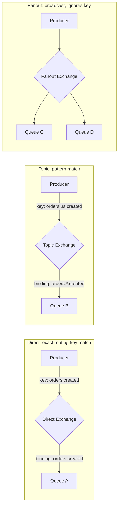
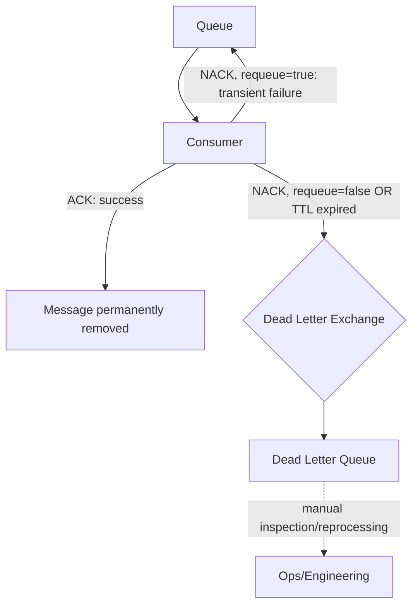
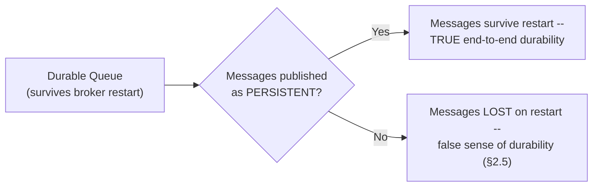

# Module 56 — RabbitMQ: Exchanges, Queues, Routing & Message Acknowledgment Patterns

> Domain: RabbitMQ | Level: Beginner → Expert | Prerequisite: [[../19-Kafka/01-Architecture-Partitioning-Replication-ConsumerGroups]] (this module deliberately contrasts RabbitMQ's broker-centric model against Kafka's log-based architecture throughout), [[../18-Event-Driven-Architecture/02-Schema-Evolution-Ordering-DeliverySemantics-DLQ]] (delivery semantics, DLQ concepts, now expressed via RabbitMQ's native mechanisms)

---

## 1. Fundamentals

### What is RabbitMQ, and why does it warrant a fundamentally different mental model from Kafka despite both being "message brokers"?
RabbitMQ is a traditional message broker implementing the AMQP (Advanced Message Queuing Protocol) model — messages are routed by an **exchange** to one or more **queues** based on routing rules, and once a message is consumed and acknowledged, it is **removed from the queue** (no retention, no replay, no consumer offset tracking) — a fundamentally different storage philosophy from Kafka's durable, retained, replayable log (Module 54 §1). This isn't a minor implementation detail: it means RabbitMQ's core strength is **flexible, sophisticated routing** (fanning a message to multiple queues based on complex matching rules, priority queues, per-message TTLs, delayed delivery) while Kafka's core strength is **high-throughput, ordered, replayable log storage** — the two are optimized for different problems, and choosing between them (or using both, for different purposes within the same system) should be a deliberate architectural decision, not a default habit.

### Why does this matter?
Because a Principal Engineer must be able to reason correctly about which broker fits a given messaging need — a task queue with complex routing/priority requirements and no need for replay is often a more natural fit for RabbitMQ, while a high-throughput event stream with multiple independent consumers needing replay capability is a more natural fit for Kafka — and getting this choice wrong (or not understanding why one was chosen) produces friction that persists for the system's entire lifetime.

### When does this matter?
Any system choosing a message-queuing/broker technology, or any system operating an existing RabbitMQ deployment and needing to reason correctly about its acknowledgment, routing, and durability guarantees to diagnose issues or design new messaging patterns.

### How does it work (30,000-ft view)?
```
Producer -> Exchange (routing logic: direct / topic / fanout / headers) -> Queue(s) -> Consumer
Exchange types: Direct (exact routing-key match) / Topic (pattern-based routing-key match) /
                Fanout (broadcast to ALL bound queues, ignores routing key) / Headers (match on
                message header attributes instead of routing key)
Acknowledgment: Consumer explicitly ACKs after successful processing -> message removed from queue;
                NACK/reject -> message requeued or dead-lettered
Durability: durable queues + persistent messages survive broker restart; requires explicit
                configuration on BOTH the queue and the message, not either alone
```

---

## 2. Deep Dive

### 2.1 Exchanges — the Routing Layer Kafka Has No Direct Equivalent For
Every message published to RabbitMQ goes to an **exchange**, never directly to a queue — the exchange applies routing logic (based on the message's routing key and the exchange's type) to determine which bound queue(s), if any, should receive a copy. This is architecturally distinct from Kafka, where a producer publishes directly to a named topic with no separate routing-logic layer — RabbitMQ's exchange abstraction enables routing decisions (which consumers should see this message) to be configured and changed independently of the producer's own code, without requiring the producer to know anything about which specific queues or consumers ultimately receive its messages.

### 2.2 Exchange Types — Direct, Topic, Fanout, Headers
A **Direct** exchange routes a message to any queue whose binding key exactly matches the message's routing key (`orders.created` routes only to queues bound with exactly that key) — the simplest, most predictable routing type. A **Topic** exchange allows pattern-based routing keys using wildcards (`*` matches exactly one word, `#` matches zero or more words) — a queue bound with `orders.*.created` matches `orders.us.created` and `orders.eu.created` but not `orders.created` or `orders.us.region1.created`, enabling flexible, hierarchical routing without the producer needing to know every specific consumer's exact interest. A **Fanout** exchange ignores the routing key entirely and broadcasts to **every** bound queue — the direct RabbitMQ equivalent of Kafka's cross-consumer-group fan-out (Module 54 §2.4), but implemented via explicit queue bindings rather than consumer-group semantics. A **Headers** exchange routes based on matching arbitrary message header key-value pairs instead of a single routing-key string, useful when routing decisions depend on multiple, independent attributes rather than one hierarchical key.

### 2.3 Message Acknowledgment — Consumer-Driven, Removal-Upon-Ack
A consumer explicitly acknowledges (ACKs) a message after successfully processing it, at which point RabbitMQ **permanently removes** that message from the queue — this is the fundamental architectural difference from Kafka's offset-based model (Module 54 §2.6): RabbitMQ has no concept of "replaying" an already-acknowledged message, since it's simply gone once acknowledged, whereas Kafka retains records regardless of consumption and tracks progress via a separate, movable offset. If a consumer crashes **before** acknowledging a message it had received, RabbitMQ detects the lost connection and **requeues** the unacknowledged message for redelivery (to the same or a different consumer) — directly producing the same at-least-once delivery semantics and mandatory-idempotent-consumer requirement Module 53 §2.4 established, now via RabbitMQ's specific ack/requeue mechanism rather than Kafka's offset-commit-timing mechanism.

### 2.4 NACK and Rejection — Explicit Failure Signaling
Beyond a plain ACK, a consumer can explicitly **NACK** (negative-acknowledge) or **reject** a message it received but failed to process successfully — with a configurable choice of `requeue=true` (put it back on the queue for redelivery, appropriate for a transient failure) or `requeue=false` (discard it, or — critically, when a Dead Letter Exchange is configured, §2.6 — route it there instead). This is a more explicit failure-signaling mechanism than Kafka provides natively (Kafka's consumer API has no built-in "reject this specific record" concept — a consumer's own application logic must decide how to handle a processing failure, typically via its own retry/DLQ logic layered on top, as Module 55's coding exercises demonstrated) — RabbitMQ bakes this signaling directly into the protocol.

### 2.5 Queue and Message Durability — Two Independent Settings That Must Both Be Configured
A **durable** queue survives a broker restart (its definition — the queue itself — persists), but this alone does **not** guarantee its **messages** survive a restart unless those messages were also published as **persistent** (a separate, per-message delivery-mode setting) — a common, easy-to-miss misconfiguration is declaring a durable queue but publishing non-persistent messages, which silently loses all queued messages on a broker restart despite the queue definition itself surviving intact, giving a false sense of durability from the queue setting alone.

### 2.6 Dead Letter Exchanges — RabbitMQ's Native DLQ Mechanism
A Dead Letter Exchange (DLX) is a regular exchange configured as the destination for messages that are rejected (with `requeue=false`), that expire (via a per-message or per-queue TTL), or that exceed a queue's configured max-length — messages routed to a DLX can be inspected/reprocessed independently, directly RabbitMQ's native, protocol-level implementation of Module 53 §2.5's Dead Letter Queue pattern, distinguished from Kafka's DLQ pattern (which requires the consuming application to implement the retry-count tracking and explicit re-publish to a separate DLQ topic itself, as Module 55's exercises showed) by being a first-class, broker-enforced routing behavior rather than an application-implemented convention.

## 3. Visual Architecture

### Exchange Types


### Acknowledgment and Dead Letter Flow


### Durability: Queue + Message, Both Required


## 4. Production Example
**Scenario**: A payment-notification system used RabbitMQ with a durable queue for outbound customer notifications, but the publishing code had never explicitly set the message's `DeliveryMode` to persistent, defaulting to transient (non-persistent) delivery — this went unnoticed for months since the broker rarely restarted under normal operation. During a planned RabbitMQ cluster maintenance window (a rolling restart to apply a security patch), roughly 4,000 queued-but-not-yet-delivered notification messages were silently lost — the queue itself survived the restart intact (as expected, since it was correctly configured as durable), but its contents did not, since none of those messages had been published as persistent. **Investigation**: the operations team, having verified the queue's durable configuration before the maintenance window and expecting message survival as a result, discovered the loss only when customers began reporting missing payment confirmation notifications in the hours following the restart — cross-referencing the payment-processing system's own transaction log (which had definitively recorded these payments as successfully processed) against the notification system's now-empty queue confirmed the messages had existed and were lost specifically during the restart window, not simply delayed. **Root cause**: precisely §2.5's independent-settings trap — the team's mental model treated "durable queue" as synonymous with "my messages are safe," without recognizing that message persistence is a **separate, per-message** publishing decision that must be explicitly set by the producer, not an automatic consequence of the queue's own durability configuration. **Fix**: updated the publisher to explicitly set `DeliveryMode.Persistent` on every notification message, and — as a broader safeguard — added an automated pre-deployment check verifying that every queue expected to be durable also received exclusively persistent messages in a staging-environment test, converting the previously-invisible assumption into an explicitly-verified property; additionally implemented a reconciliation job comparing the payment-processing system's transaction log against confirmed-sent notifications, to catch any future notification loss (from any cause) within minutes rather than relying on customer complaints. **Lesson**: this incident is a direct, costly illustration of why durability in RabbitMQ requires **two independent, explicitly-configured settings working together** — a mental model assuming either one alone is sufficient will pass all functional testing (since normal operation never exercises the failure mode) and only be exposed by an actual broker restart, exactly the kind of latent, dormant misconfiguration this course has repeatedly flagged as needing proactive verification rather than reactive discovery (directly echoing Module 54 §Advanced Q8's under-replicated-partition discussion: a degraded safety margin that produces no visible symptom until the specific failure condition it protects against actually occurs).

## 5. Best Practices
- Always explicitly set message persistence (`DeliveryMode.Persistent`) for any message published to a durable queue where message survival across a broker restart matters — never assume queue durability alone is sufficient (§4).
- Choose the exchange type deliberately based on the actual routing need: Direct for simple, exact-match routing; Topic for hierarchical, pattern-based routing; Fanout for broadcast; Headers for multi-attribute matching.
- Configure a Dead Letter Exchange for every queue where message-processing failure is a realistic possibility, rather than allowing failed messages to be silently discarded or to block the queue indefinitely.
- Use manual acknowledgment (not auto-ack) for any consumer where message loss on a mid-processing crash would be unacceptable, accepting the resulting at-least-once semantics and designing idempotent consumers accordingly.
- Periodically, deliberately test broker-restart resilience in a staging environment (verifying message survival end-to-end, not just queue-definition survival) rather than assuming durability configuration is correct until an actual production restart exposes a gap.

## 6. Anti-patterns
- Assuming a durable queue alone guarantees message survival across a broker restart, without also explicitly configuring message persistence (§4's incident).
- Using auto-acknowledgment for consumers processing business-critical messages, silently losing any message a consumer was processing at the moment of an unexpected crash.
- Choosing Fanout when Topic-based routing was actually needed (or vice versa), producing either unwanted broadcast to irrelevant consumers or missed delivery to consumers who should have received a message.
- Leaving failed messages with no Dead Letter Exchange configured, either blocking the queue indefinitely with automatic requeue-and-retry loops or silently discarding them with `requeue=false` and no DLX destination.
- Treating RabbitMQ as a drop-in Kafka replacement (or vice versa) without considering their genuinely different storage/replay/routing trade-offs.

---

## 10. Interview Questions

### Basic (10)
1. **Q: What does a RabbitMQ exchange do?** **A:** Routes a published message to zero or more bound queues based on the exchange's type and the message's routing key.
2. **Q: What is a Direct exchange?** **A:** Routes a message to any queue whose binding key exactly matches the message's routing key.
3. **Q: What is a Topic exchange?** **A:** Routes based on pattern matching (using `*` and `#` wildcards) against the routing key.
4. **Q: What is a Fanout exchange?** **A:** Broadcasts a message to every bound queue, ignoring the routing key entirely.
5. **Q: What happens to a message once a consumer ACKs it?** **A:** It is permanently removed from the queue.
6. **Q: What happens if a consumer crashes before acknowledging a message?** **A:** RabbitMQ detects the lost connection and requeues the unacknowledged message for redelivery.
7. **Q: What two settings must both be configured for a message to survive a broker restart?** **A:** The queue must be durable, and the message must be published as persistent.
8. **Q: What is a Dead Letter Exchange?** **A:** A destination exchange for messages that are rejected, expire, or exceed a queue's max length, RabbitMQ's native DLQ mechanism.
9. **Q: What is the core architectural difference between RabbitMQ and Kafka regarding message storage?** **A:** RabbitMQ removes messages upon acknowledgment; Kafka retains messages regardless of consumption, tracked via a movable offset.
10. **Q: What is a NACK?** **A:** A negative acknowledgment signaling a consumer failed to process a message, with a choice to requeue it or route it elsewhere (e.g., a DLX).

### Intermediate (10)
1. **Q: Why does RabbitMQ's exchange abstraction let routing decisions change independently of producer code?** **A:** The producer only specifies a routing key/exchange, unaware of which specific queues are bound to it — bindings can be added, removed, or reconfigured without any producer code change.
2. **Q: Why does a Topic exchange's `orders.*.created` binding not match `orders.created`?** **A:** The `*` wildcard matches exactly one word — `orders.created` has no word in the position `*` requires, so it fails to match; only patterns with the correct word-count structure match.
3. **Q: Why does RabbitMQ have no concept of "replaying" an already-acknowledged message, unlike Kafka?** **A:** Acknowledgment triggers permanent removal from the queue — there's no retained log to replay from, fundamentally unlike Kafka's retention-based model.
4. **Q: Why is declaring a durable queue but publishing non-persistent messages a "false sense of durability"?** **A:** The queue definition survives a restart, but its message contents do not, since persistence is a separate, per-message setting — an operator verifying only the queue's durable flag would incorrectly conclude messages are safe (§4).
5. **Q: Why does batching acknowledgments trade reliability blast radius for reduced overhead?** **A:** A single batched ack call covers multiple messages; a crash before that batched ack causes the entire unacknowledged batch to be redelivered, not just the one message that would have been affected under per-message acknowledgment.
6. **Q: Why is RabbitMQ's DLX mechanism described as "protocol-level" compared to Kafka's DLQ pattern?** **A:** RabbitMQ's dead-lettering is a built-in, broker-enforced routing behavior triggered by rejection/expiry/max-length; Kafka's DLQ requires the consuming application to implement its own retry-count tracking and explicit re-publish logic, since Kafka's consumer API has no native "reject this record" concept.
7. **Q: Why does unbounded RabbitMQ queue growth pose a more immediate performance risk than Kafka's log growth?** **A:** RabbitMQ queue growth degrades broker memory/performance more directly, since messages are actively held in the broker pending consumption, whereas Kafka's disk-based log model is designed for large-scale, ongoing retention as a normal operating condition.
8. **Q: Why do quorum queues provide stronger consistency guarantees than the older mirrored-queue model?** **A:** Quorum queues use a Raft-based consensus mechanism (Module 47) requiring agreement among a quorum of replicas, rather than the older primary-mirror replication model's weaker guarantees around failover consistency.
9. **Q: Why does RabbitMQ's per-vhost permission model provide lightweight multi-tenancy without requiring separate broker clusters?** **A:** A vhost logically isolates exchanges/queues/bindings and their permissions within one broker, letting unrelated applications/teams share infrastructure while maintaining access separation, without the operational overhead of running fully separate clusters.
10. **Q: Why is maximum achievable parallelism reasoned about differently in RabbitMQ than in Kafka?** **A:** RabbitMQ has no inherent partition concept — parallelism comes from multiple competing consumers on the same queue, receiving round-robin delivery, rather than Kafka's explicit, partition-count-bounded consumer-group assignment.

### Advanced (10)
1. **Q: Diagnose the §4 incident from first principles, and design the specific pre-production/pre-maintenance verification step that would have caught the missing message-persistence configuration before the maintenance window caused actual message loss.**
   **A:** Root cause: the team's verification checked only the queue's durable flag, not actual message survival end-to-end. Verification step: before any planned broker restart/maintenance, run an automated staging-environment test that publishes a known message to each durable queue expected to preserve messages, restarts the broker, and asserts the message is still present and correctly delivered afterward — converting an implicit, partially-checked assumption ("the queue is durable, so we're fine") into an explicit, end-to-end-verified property covering both required settings together, directly the same "verify the actual guarantee, not a proxy for it" discipline Module 54 §Advanced Q9 applied to Kafka partition-key ordering, now applied to RabbitMQ's two-part durability configuration.
2. **Q: A team is deciding between RabbitMQ and Kafka for a new order-processing task queue where tasks must be processed with complex priority rules (VIP customers' orders processed before standard orders) and no historical replay is needed. Make and justify a recommendation.**
   **A:** Recommend RabbitMQ — its native priority-queue support (message priority as a first-class, broker-enforced feature) and flexible exchange-based routing directly address the described requirement without needing custom application-level logic to simulate prioritization, while the explicit "no replay needed" requirement removes Kafka's core differentiating advantage (durable, replayable log storage) from consideration entirely — this is a clear instance of §1's "choose deliberately based on actual need" principle: Kafka's strengths (high-throughput ordered log, replay) aren't relevant to this specific requirement, while RabbitMQ's strengths (sophisticated routing/priority) map directly onto it.
3. **Q: Design a strategy for using both RabbitMQ and Kafka together within the same system, and identify a concrete scenario where this hybrid approach is justified rather than being unnecessary complexity.**
   **A:** A justified hybrid: use Kafka as the durable, replayable, high-throughput backbone for core business events (`OrderPlaced`, `PaymentProcessed`) that multiple downstream systems need to consume independently and potentially replay (Module 53's event-history use case), while using RabbitMQ for specific, complex task-routing needs derived from those events (a priority-based task queue for customer-support-escalation tickets generated from certain event patterns, where replay is irrelevant but sophisticated routing/priority is essential) — the justification hinges on each broker serving a genuinely distinct need within the same system (Module 49 §Advanced Q9's "match the tool to the actual, specific need" principle, applied to broker choice); using both without a clear, distinct justification for each simply adds unnecessary operational complexity (two broker technologies to operate, monitor, and secure) without a corresponding benefit.
4. **Q: Explain why batching acknowledgments (§7) requires careful consideration of idempotent consumer design specifically, beyond the general idempotency requirement already established for at-least-once delivery.**
   **A:** Batched acknowledgment means a single crash can cause redelivery of an entire batch of messages, not just one — a consumer's idempotency mechanism must correctly handle **each individual message** within a redelivered batch idempotently, including the possibility that some messages in the batch may have been fully processed (their side effects already applied) while others in the same batch were not yet reached when the crash occurred, meaning the idempotency check must operate per-message, not per-batch, even though acknowledgment itself operates per-batch — conflating "the batch was acknowledged/not acknowledged" with "every message in the batch was processed/not processed" would be an incorrect simplification, since messages within an unacknowledged batch may be in a genuinely mixed processed/unprocessed state.
5. **Q: A RabbitMQ consumer configured with `requeue=true` for all processing failures is observed causing a specific malformed message to be redelivered and immediately re-fail in a tight, continuous loop, consuming significant broker/consumer resources. Diagnose and propose the fix.**
   **A:** This is a classic "poison message" scenario — `requeue=true` is appropriate for genuinely transient failures but actively harmful for a permanently, deterministically failing message (a malformed payload that will never successfully process regardless of retry count), which will loop indefinitely, consuming resources and effectively blocking other messages behind it in single-consumer scenarios; fix: implement retry-count tracking (via a message header incremented on each redelivery, or RabbitMQ's built-in `x-death` header from a delayed-retry-queue pattern) and route to a Dead Letter Exchange (§2.6) after a bounded number of retries, rather than requeuing indefinitely — directly the RabbitMQ-specific implementation of Module 53 §2.5's "isolate poison messages via a DLQ rather than blocking the stream" principle.
6. **Q: Explain the trade-off between RabbitMQ's classic mirrored queues and quorum queues (§9) beyond "quorum queues are just better," identifying at least one legitimate reason a team might still choose classic/mirrored queues.**
   **A:** Quorum queues' Raft-based consensus provides stronger consistency but requires a minimum of 3 broker nodes (quorum needs an odd-numbered majority) and has somewhat different performance characteristics (throughput/latency profile) compared to classic mirrored queues — a smaller deployment genuinely unable to run 3+ broker nodes, or a workload where classic queues' specific performance profile has already been validated and quorum queues' consistency improvement isn't needed for that particular use case's actual durability requirements, might legitimately retain classic queues rather than migrating purely because quorum queues are the newer, generally-recommended default — the decision should be based on the specific deployment's actual node-count constraints and consistency requirements, not an assumption that "newer and generally recommended" automatically means "correct for every case."
7. **Q: Design an approach for testing that a Topic exchange's routing-key/binding-pattern configuration actually delivers messages to the intended consumers before relying on it in production, generalizing Module 54 §Advanced Q9's Kafka partition-key testing philosophy to RabbitMQ's routing model.**
   **A:** Write a targeted integration test that publishes a representative set of messages with various realistic routing keys against the actual configured exchange/binding topology, and asserts each message arrives at exactly the expected set of queues (and does *not* arrive at queues that shouldn't receive it) — directly catching a subtly wrong wildcard pattern (an easy mistake, given `*` vs `#`'s different semantics, Intermediate Q2) before production traffic reveals a missing or unwanted delivery, converting an easy-to-get-wrong routing configuration into an explicitly, automatically verified property rather than one only exposed by production behavior.
8. **Q: A Principal Engineer observes that a RabbitMQ-based system's queues are growing steadily, with consumers seemingly healthy and not erroring. Diagnose the likely cause and the appropriate remediation, contrasting with Module 54 §Advanced Q5's Kafka-lag-trend diagnostic.**
   **A:** Directly analogous to Module 54 §Advanced Q5's steadily-increasing-lag diagnosis: sustained consumer throughput below sustained producer throughput — a capacity mismatch, not a transient disruption — remediation requires adding more competing consumers (up to the point where RabbitMQ's round-robin delivery model can still usefully distribute load, §9) or improving per-message processing efficiency; the RabbitMQ-specific twist is that unlike Kafka, RabbitMQ's queue growth directly threatens broker memory/performance (§7, §9) more urgently than Kafka's disk-based log growth would, making prompt remediation more time-sensitive in RabbitMQ than the equivalent Kafka scenario.
9. **Q: Critique this claim from a team lead: "We don't need message persistence configured, since our durable queues will survive a restart and that's the durability guarantee that matters."**
   **A:** This is exactly §4's incident's root-cause misconception, stated as an explicit claim — queue durability (the queue definition surviving a restart) and message persistence (the message contents surviving a restart) are separate, both-required settings (§2.5); the claim conflates "the container survives" with "the contents survive," precisely the false-sense-of-security §4 exposed at real cost — the correct response is to explicitly verify and configure both settings together, and ideally add the automated end-to-end restart-survival test (Advanced Q1) rather than relying on either setting's presence alone as sufficient evidence of the desired guarantee.
10. **Q: As a Principal Engineer establishing RabbitMQ operational standards for an organization operating multiple RabbitMQ-based systems, design the specific set of standing configuration reviews and monitors (synthesizing this entire module) you would require, and justify each.**
    **A:** (1) Mandatory, automated end-to-end durability verification (both queue-durable and message-persistent settings, tested via an actual staging-environment restart) for every queue expected to preserve messages (Advanced Q1) — necessary because the two-setting requirement is easy to partially satisfy and only exposed by an actual restart (§4). (2) Mandatory Dead Letter Exchange configuration with a bounded retry-count limit for every queue where processing failure is realistically possible (Advanced Q5) — necessary to prevent poison-message loops from consuming resources indefinitely. (3) Automated routing-configuration verification tests for every Topic/Headers exchange binding (Advanced Q7) — necessary because wildcard pattern mistakes are subtle and otherwise only discovered via missing or unwanted production delivery. (4) Standing queue-length/growth monitoring with alerting thresholds tuned tighter than the equivalent Kafka-lag monitoring (Advanced Q8), given RabbitMQ's more immediate memory/performance sensitivity to queue growth — necessary because unmitigated growth threatens broker stability more directly and more quickly than in Kafka's disk-based model. Each standard targets a distinct, concrete failure mode this module identified through specific incidents or reasoning, directly extending this course's recurring governance-gate pattern into RabbitMQ-specific operational practice.

---

## 11. Coding Exercises

### Easy — Topic exchange with pattern-based routing (§2.2)
```csharp
channel.ExchangeDeclare("orders-exchange", ExchangeType.Topic);
channel.QueueDeclare("us-orders-queue", durable: true, exclusive: false, autoDelete: false);
channel.QueueBind("us-orders-queue", "orders-exchange", routingKey: "orders.us.*"); // matches orders.us.created, orders.us.cancelled
```

### Medium — Correct, END-TO-END durability configuration (§2.5, §4's actual fix)
```csharp
channel.QueueDeclare("payment-notifications", durable: true, exclusive: false, autoDelete: false); // queue: durable

var properties = channel.CreateBasicProperties();
properties.Persistent = true;  // message: ALSO explicitly persistent -- BOTH required, neither alone sufficient
properties.DeliveryMode = 2;    // (2 = persistent, in the raw AMQP protocol)

channel.BasicPublish(exchange: "notifications-exchange", routingKey: "payment.confirmed",
                       basicProperties: properties, body: messageBody);
```

### Hard — Manual acknowledgment with retry-count tracking and Dead Letter Exchange (§2.4, §Advanced Q5)
```csharp
channel.ExchangeDeclare("dlx", ExchangeType.Fanout);
channel.QueueDeclare("payment-notifications-dlq", durable: true, exclusive: false, autoDelete: false);
channel.QueueBind("payment-notifications-dlq", "dlx", routingKey: "");

var args = new Dictionary<string, object> { { "x-dead-letter-exchange", "dlx" } };
channel.QueueDeclare("payment-notifications", durable: true, exclusive: false, autoDelete: false, arguments: args);

consumer.Received += async (model, ea) =>
{
    int retryCount = ea.BasicProperties.Headers?.TryGetValue("x-retry-count", out var rc) == true ? (int)rc : 0;
    try
    {
        await _idempotentHandler.HandleAsync(ea.Body.ToArray(), ea.BasicProperties.MessageId);
        channel.BasicAck(ea.DeliveryTag, multiple: false);
    }
    catch (Exception) when (retryCount < 3)
    {
        channel.BasicNack(ea.DeliveryTag, multiple: false, requeue: true); // transient -- retry
    }
    catch (Exception)
    {
        channel.BasicNack(ea.DeliveryTag, multiple: false, requeue: false); // exhausted retries -- routes to DLX
    }
};
```

### Expert — Batched acknowledgment with per-message idempotency (§7, §Advanced Q4)
```csharp
public class BatchAckConsumer
{
    private readonly List<ulong> _pendingDeliveryTags = new();
    private readonly int _batchSize = 20;

    public async Task HandleAsync(BasicDeliverEventArgs ea, IModel channel)
    {
        // Idempotency check is PER-MESSAGE, regardless of batch-level acknowledgment (§Advanced Q4) --
        // a redelivered batch may contain a MIX of already-processed and not-yet-processed messages.
        if (!await _idempotencyStore.HasProcessedAsync(ea.BasicProperties.MessageId))
        {
            await _businessHandler.ProcessAsync(ea.Body.ToArray());
            await _idempotencyStore.MarkProcessedAsync(ea.BasicProperties.MessageId);
        }

        _pendingDeliveryTags.Add(ea.DeliveryTag);
        if (_pendingDeliveryTags.Count >= _batchSize)
        {
            channel.BasicAck(_pendingDeliveryTags.Last(), multiple: true); // ACKs the WHOLE batch up to this tag
            _pendingDeliveryTags.Clear();
            // Reduced acknowledgment network overhead (§7) -- at the cost of redelivering the
            // FULL unacknowledged batch on a crash, safely handled by the per-message idempotency check above.
        }
    }
}
```
**Discussion**: the per-message idempotency check inside a batch-acknowledgment consumer is the concrete resolution of Advanced Q4's subtlety — even though acknowledgment happens at the batch level (reducing overhead per §7), correctness still depends on treating each individual message's processed/unprocessed state independently, since a crash mid-batch can leave the batch in a genuinely mixed state that a batch-level idempotency assumption would handle incorrectly.

---

## 12–17. System Design / LLD / Debugging / Decision / Case Study / Principal

*(§4's incident, the four §11 exercises, and the Advanced-tier Q&A — especially Advanced Q1's end-to-end durability verification, Advanced Q2/Q3's broker-choice and hybrid-architecture decision frameworks, and Advanced Q10's synthesized governance checklist — collectively constitute this module's system-design, debugging, and Principal-Engineer-level content.)*

## 18. Revision
**Key takeaways**: RabbitMQ's exchange-based routing (Direct/Topic/Fanout/Headers) provides sophisticated, producer-decoupled routing flexibility that Kafka's topic model doesn't natively offer, but its remove-on-acknowledgment storage model forfeits Kafka's durable retention/replay capability — the two brokers are optimized for genuinely different problems, and the choice (or justified hybrid use, Advanced Q3) should be deliberate. Durability requires two independent, both-required settings (durable queue + persistent message) — a common, costly misconfiguration is satisfying only one and assuming full durability (§4), a gap invisible until an actual broker restart exposes it. Manual acknowledgment with NACK/reject and Dead Letter Exchange configuration provides native, protocol-level failure handling that mirrors Module 53's DLQ pattern but is broker-enforced rather than application-implemented. RabbitMQ's queue-growth performance sensitivity and non-partitioned parallelism model require a distinct mental model from Kafka's partition-bounded consumer groups when reasoning about scalability.

---

**`20-RabbitMQ` domain complete (Modules 56).** With `18-Event-Driven-Architecture` (52–53), `19-Kafka` (54–55), and `20-RabbitMQ` (56) now covering the full messaging/EDA arc at Principal-Engineer depth, next: `21-AWS`, Module 57 — AWS Compute & Networking Fundamentals for Principal Engineers (EC2, VPC, Load Balancing, Auto Scaling).
