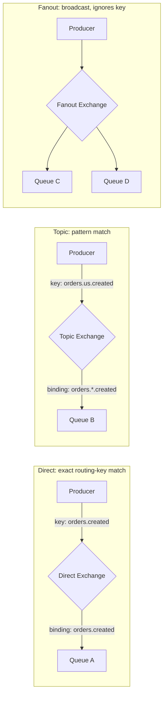
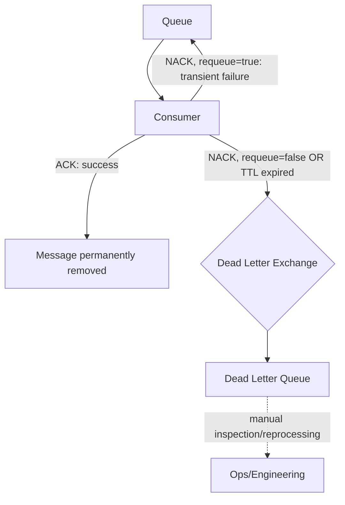
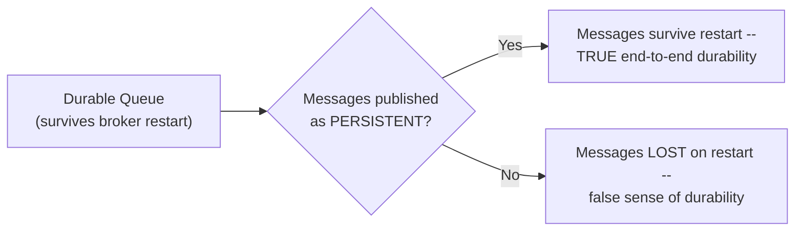
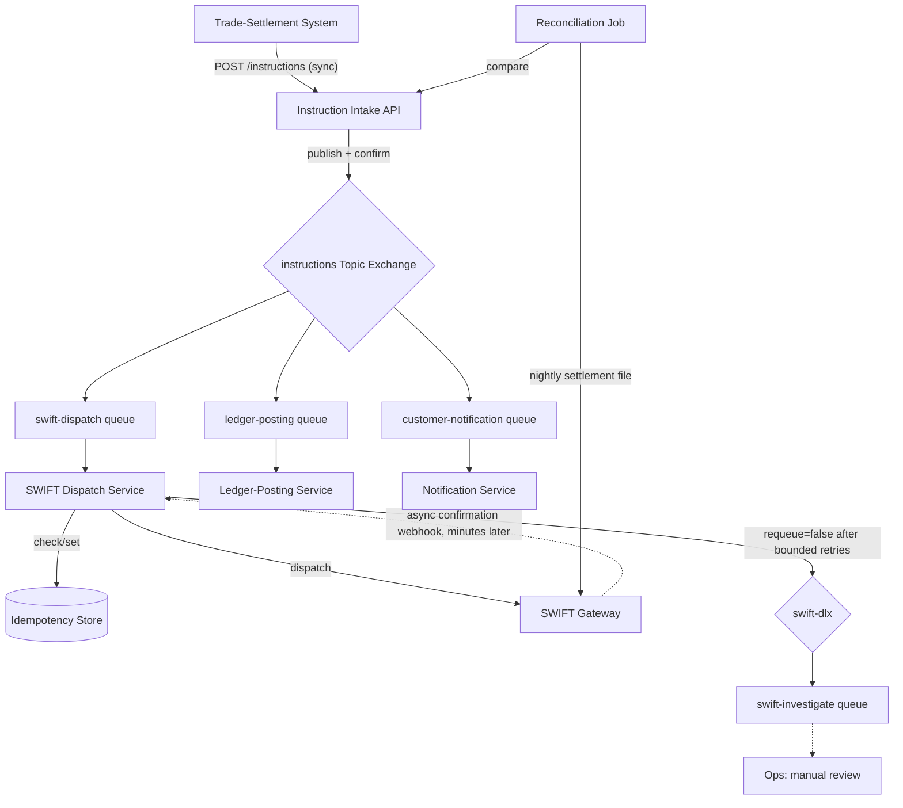
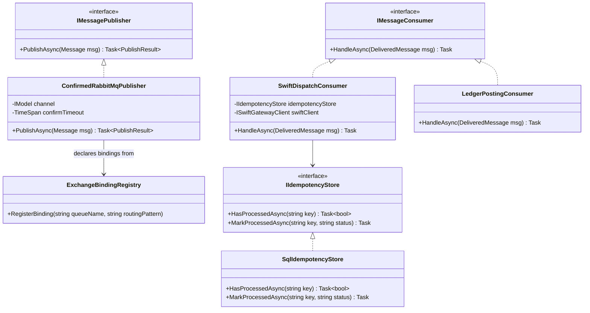
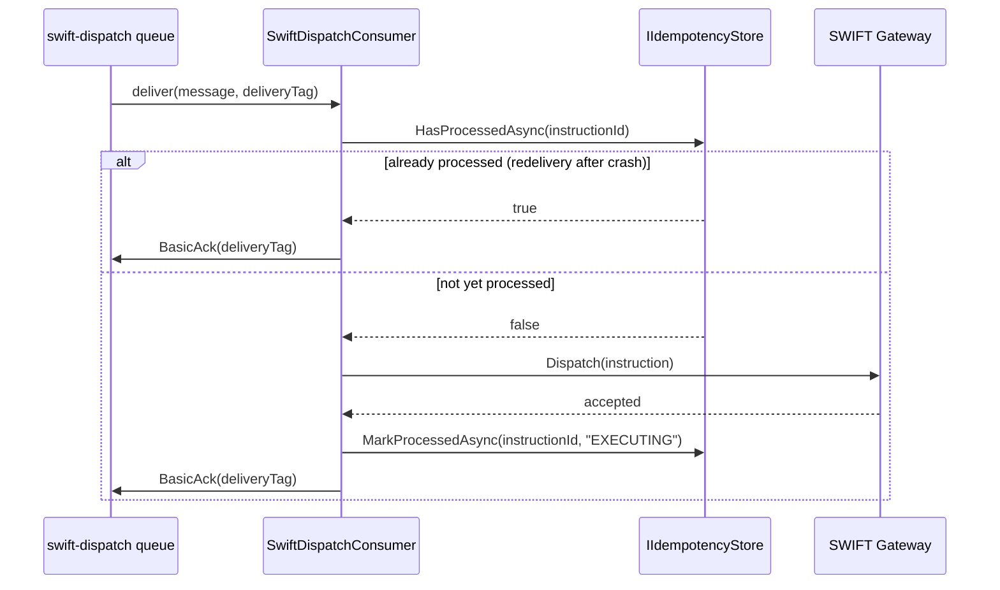

# Module 56 — RabbitMQ: Exchanges, Queues, Routing & Message Acknowledgment Patterns

> Domain: RabbitMQ | Level: Beginner → Expert | Prerequisite: [[../19-Kafka/01-Architecture-Partitioning-Replication-ConsumerGroups]] (this module deliberately contrasts RabbitMQ's broker-centric model against Kafka's log-based architecture throughout), [[../18-Event-Driven-Architecture/02-Schema-Evolution-Ordering-DeliverySemantics-DLQ]] (delivery semantics, DLQ concepts, now expressed via RabbitMQ's native mechanisms)

---

## 1. Fundamentals

### What is RabbitMQ, and why does it warrant a fundamentally different mental model from Kafka despite both being "message brokers"?
RabbitMQ is a traditional message broker implementing the AMQP (Advanced Message Queuing Protocol) model — messages are routed by an **exchange** to one or more **queues** based on routing rules, and once a message is consumed and acknowledged, it is **removed from the queue** (no retention, no replay, no consumer offset tracking) — a fundamentally different storage philosophy from Kafka's durable, retained, replayable log. This isn't a minor implementation detail: it means RabbitMQ's core strength is **flexible, sophisticated routing** (fanning a message to multiple queues based on complex matching rules, priority queues, per-message TTLs, delayed delivery) while Kafka's core strength is **high-throughput, ordered, replayable log storage** — the two are optimized for different problems, and choosing between them (or using both, for different purposes within the same system) should be a deliberate architectural decision, not a default habit.

### Why does this matter?
Because a Principal Engineer must be able to reason correctly about which broker fits a given messaging need — a task queue with complex routing/priority requirements and no need for replay is often a more natural fit for RabbitMQ, while a high-throughput event stream with multiple independent consumers needing replay capability is a more natural fit for Kafka — and getting this choice wrong (or not understanding why one was chosen) produces friction that persists for the system's entire lifetime.

### When does this matter?
Any system choosing a message-queuing/broker technology, or any system operating an existing RabbitMQ deployment and needing to reason correctly about its acknowledgment, routing, and durability guarantees to diagnose issues or design new messaging patterns.

### How does it work (30,000-ft view)?
```
Producer -> Exchange (routing logic: direct / topic / fanout / headers) -> Queue(s) -> Consumer
Exchange types: Direct (exact routing-key match) / Topic (pattern-based routing-key match) /
 Fanout (broadcast to ALL bound queues, ignores routing key) / Headers (match on
 message header attributes instead of routing key)
Acknowledgment: Consumer explicitly ACKs after successful processing -> message removed from queue;
 NACK/reject -> message requeued or dead-lettered
Durability: durable queues + persistent messages survive broker restart; requires explicit
 configuration on BOTH the queue and the message, not either alone
```

---

## 2. Deep Dive

### 2.1 Exchanges — the Routing Layer Kafka Has No Direct Equivalent For
Every message published to RabbitMQ goes to an **exchange**, never directly to a queue — the exchange applies routing logic (based on the message's routing key and the exchange's type) to determine which bound queue(s), if any, should receive a copy. This is architecturally distinct from Kafka, where a producer publishes directly to a named topic with no separate routing-logic layer — RabbitMQ's exchange abstraction enables routing decisions (which consumers should see this message) to be configured and changed independently of the producer's own code, without requiring the producer to know anything about which specific queues or consumers ultimately receive its messages.

### 2.2 Exchange Types — Direct, Topic, Fanout, Headers
A **Direct** exchange routes a message to any queue whose binding key exactly matches the message's routing key (`orders.created` routes only to queues bound with exactly that key) — the simplest, most predictable routing type. A **Topic** exchange allows pattern-based routing keys using wildcards (`*` matches exactly one word, `#` matches zero or more words) — a queue bound with `orders.*.created` matches `orders.us.created` and `orders.eu.created` but not `orders.created` or `orders.us.region1.created`, enabling flexible, hierarchical routing without the producer needing to know every specific consumer's exact interest. A **Fanout** exchange ignores the routing key entirely and broadcasts to **every** bound queue — the direct RabbitMQ equivalent of Kafka's cross-consumer-group fan-out, but implemented via explicit queue bindings rather than consumer-group semantics. A **Headers** exchange routes based on matching arbitrary message header key-value pairs instead of a single routing-key string, useful when routing decisions depend on multiple, independent attributes rather than one hierarchical key.

### 2.3 Message Acknowledgment — Consumer-Driven, Removal-Upon-Ack
A consumer explicitly acknowledges (ACKs) a message after successfully processing it, at which point RabbitMQ **permanently removes** that message from the queue — this is the fundamental architectural difference from Kafka's offset-based model: RabbitMQ has no concept of "replaying" an already-acknowledged message, since it's simply gone once acknowledged, whereas Kafka retains records regardless of consumption and tracks progress via a separate, movable offset. If a consumer crashes **before** acknowledging a message it had received, RabbitMQ detects the lost connection and **requeues** the unacknowledged message for redelivery (to the same or a different consumer) — directly producing the same at-least-once delivery semantics and mandatory-idempotent-consumer requirement established, now via RabbitMQ's specific ack/requeue mechanism rather than Kafka's offset-commit-timing mechanism.

### 2.4 NACK and Rejection — Explicit Failure Signaling
Beyond a plain ACK, a consumer can explicitly **NACK** (negative-acknowledge) or **reject** a message it received but failed to process successfully — with a configurable choice of `requeue=true` (put it back on the queue for redelivery, appropriate for a transient failure) or `requeue=false` (discard it, or — critically, when a Dead Letter Exchange is configured, — route it there instead). This is a more explicit failure-signaling mechanism than Kafka provides natively (Kafka's consumer API has no built-in "reject this specific record" concept — a consumer's own application logic must decide how to handle a processing failure, typically via its own retry/DLQ logic layered on top, as the coding exercises demonstrated) — RabbitMQ bakes this signaling directly into the protocol.

### 2.5 Queue and Message Durability — Two Independent Settings That Must Both Be Configured
A **durable** queue survives a broker restart (its definition — the queue itself — persists), but this alone does **not** guarantee its **messages** survive a restart unless those messages were also published as **persistent** (a separate, per-message delivery-mode setting) — a common, easy-to-miss misconfiguration is declaring a durable queue but publishing non-persistent messages, which silently loses all queued messages on a broker restart despite the queue definition itself surviving intact, giving a false sense of durability from the queue setting alone.

### 2.6 Dead Letter Exchanges — RabbitMQ's Native DLQ Mechanism
A Dead Letter Exchange (DLX) is a regular exchange configured as the destination for messages that are rejected (with `requeue=false`), that expire (via a per-message or per-queue TTL), or that exceed a queue's configured max-length — messages routed to a DLX can be inspected/reprocessed independently, directly RabbitMQ's native, protocol-level implementation of the Dead Letter Queue pattern, distinguished from Kafka's DLQ pattern (which requires the consuming application to implement the retry-count tracking and explicit re-publish to a separate DLQ topic itself, as the exercises showed) by being a first-class, broker-enforced routing behavior rather than an application-implemented convention.

## 3. Visual Architecture

### Exchange Types

```mermaid
graph LR
 subgraph "Direct: exact routing-key match"
 D[Producer] -->|"key: orders.created"| DE{Direct Exchange}
 DE -->|"binding: orders.created"| DQ[Queue A]
 end
 subgraph "Topic: pattern match"
 T[Producer] -->|"key: orders.us.created"| TE{Topic Exchange}
 TE -->|"binding: orders.*.created"| TQ[Queue B]
 end
 subgraph "Fanout: broadcast, ignores key"
 F[Producer] --> FE{Fanout Exchange}
 FE --> FQ1[Queue C]
 FE --> FQ2[Queue D]
 end
```

### Acknowledgment and Dead Letter Flow

```mermaid
graph TB
 Q[Queue] --> C[Consumer]
 C -->|"ACK: success"| Removed[Message permanently removed]
 C -->|"NACK, requeue=true: transient failure"| Q
 C -->|"NACK, requeue=false OR TTL expired"| DLX{Dead Letter Exchange}
 DLX --> DLQ[Dead Letter Queue]
 DLQ -.->|"manual inspection/reprocessing"| Ops[Ops/Engineering]
```

### Durability: Queue + Message, Both Required

```mermaid
graph LR
 DQ["Durable Queue<br/>(survives broker restart)"] --> Check{"Messages published<br/>as PERSISTENT?"}
 Check -->|"Yes"| Safe["Messages survive restart --<br/>TRUE end-to-end durability"]
 Check -->|"No"| Lost["Messages LOST on restart --<br/>false sense of durability"]
```

## 4. Production Example
**Scenario**: A payment-notification system used RabbitMQ with a durable queue for outbound customer notifications, but the publishing code had never explicitly set the message's `DeliveryMode` to persistent, defaulting to transient (non-persistent) delivery — this went unnoticed for months since the broker rarely restarted under normal operation. During a planned RabbitMQ cluster maintenance window (a rolling restart to apply a security patch), roughly 4,000 queued-but-not-yet-delivered notification messages were silently lost — the queue itself survived the restart intact (as expected, since it was correctly configured as durable), but its contents did not, since none of those messages had been published as persistent. **Investigation**: the operations team, having verified the queue's durable configuration before the maintenance window and expecting message survival as a result, discovered the loss only when customers began reporting missing payment confirmation notifications in the hours following the restart — cross-referencing the payment-processing system's own transaction log (which had definitively recorded these payments as successfully processed) against the notification system's now-empty queue confirmed the messages had existed and were lost specifically during the restart window, not simply delayed. **Root cause**: precisely the independent-settings trap — the team's mental model treated "durable queue" as synonymous with "my messages are safe," without recognizing that message persistence is a **separate, per-message** publishing decision that must be explicitly set by the producer, not an automatic consequence of the queue's own durability configuration. **Fix**: updated the publisher to explicitly set `DeliveryMode.Persistent` on every notification message, and — as a broader safeguard — added an automated pre-deployment check verifying that every queue expected to be durable also received exclusively persistent messages in a staging-environment test, converting the previously-invisible assumption into an explicitly-verified property; additionally implemented a reconciliation job comparing the payment-processing system's transaction log against confirmed-sent notifications, to catch any future notification loss (from any cause) within minutes rather than relying on customer complaints. **Lesson**: this incident is a direct, costly illustration of why durability in RabbitMQ requires **two independent, explicitly-configured settings working together** — a mental model assuming either one alone is sufficient will pass all functional testing (since normal operation never exercises the failure mode) and only be exposed by an actual broker restart, exactly the kind of latent, dormant misconfiguration this course has repeatedly flagged as needing proactive verification rather than reactive discovery (directly echoing §Advanced Q8's under-replicated-partition discussion: a degraded safety margin that produces no visible symptom until the specific failure condition it protects against actually occurs).

## 5. Best Practices
- Always explicitly set message persistence (`DeliveryMode.Persistent`) for any message published to a durable queue where message survival across a broker restart matters — never assume queue durability alone is sufficient.
- Choose the exchange type deliberately based on the actual routing need: Direct for simple, exact-match routing; Topic for hierarchical, pattern-based routing; Fanout for broadcast; Headers for multi-attribute matching.
- Configure a Dead Letter Exchange for every queue where message-processing failure is a realistic possibility, rather than allowing failed messages to be silently discarded or to block the queue indefinitely.
- Use manual acknowledgment (not auto-ack) for any consumer where message loss on a mid-processing crash would be unacceptable, accepting the resulting at-least-once semantics and designing idempotent consumers accordingly.
- Periodically, deliberately test broker-restart resilience in a staging environment (verifying message survival end-to-end, not just queue-definition survival) rather than assuming durability configuration is correct until an actual production restart exposes a gap.

## 6. Anti-patterns
- Assuming a durable queue alone guarantees message survival across a broker restart, without also explicitly configuring message persistence (the incident).
- Using auto-acknowledgment for consumers processing business-critical messages, silently losing any message a consumer was processing at the moment of an unexpected crash.
- Choosing Fanout when Topic-based routing was actually needed (or vice versa), producing either unwanted broadcast to irrelevant consumers or missed delivery to consumers who should have received a message.
- Leaving failed messages with no Dead Letter Exchange configured, either blocking the queue indefinitely with automatic requeue-and-retry loops or silently discarding them with `requeue=false` and no DLX destination.
- Treating RabbitMQ as a drop-in Kafka replacement (or vice versa) without considering their genuinely different storage/replay/routing trade-offs.

---

## 7. Performance Engineering

### 7.1 Publisher Confirms — The Round-Trip Cost of Durability Guarantees
Publisher confirms (`confirmSelect` / `ConfirmSelect`) are RabbitMQ's producer-side acknowledgment mechanism — the broker signals back to the producer once a published message has been safely handled (persisted to disk for a durable queue, or routed successfully for a transient one), letting the producer know it's safe to consider the publish complete rather than assuming success optimistically. This is not free: each confirm is a broker round-trip, and awaiting a confirm **per message** synchronously (publish, block until confirmed, publish next) caps throughput at roughly `1 / round_trip_latency` messages/sec — on a network with a 1ms round-trip, that's a hard ceiling of ~1,000 msg/sec no matter how fast the broker itself is, an entirely latency-bound (not broker-bound) limit. The standard fix is **asynchronous, pipelined confirms**: publish a batch of messages without waiting for each individual confirm, track outstanding delivery tags, and process confirms as they arrive (RabbitMQ can batch-confirm up to a given delivery tag with `multiple=true`) — this decouples throughput from round-trip latency, since many messages are in flight at once, and is the pattern that lets a well-tuned publisher sustain tens of thousands of msg/sec against a single connection. The trade-off is exactly the one Advanced Q4/§11's batched-acknowledgment discussion already established on the consumer side, mirrored on the producer side: a crash before a pipelined confirm arrives leaves the producer uncertain about which messages in the outstanding window actually landed, requiring the same idempotent-republish discipline (a client-generated message ID, checked or naturally deduplicated downstream) rather than blind resend.

### 7.2 Queue Depth and Memory Pressure — Why RabbitMQ Queue Growth Is Urgent, Not Merely Suboptimal
Unlike Kafka's log, which is designed around disk as the primary storage medium with memory as a bounded working set, a classic RabbitMQ queue by default keeps message bodies **in memory** (backed by disk for durability, but actively resident in RAM for delivery) until consumed — a sustained producer/consumer throughput mismatch doesn't just delay downstream processing, it directly consumes broker RAM, and a broker that exhausts available memory triggers RabbitMQ's **flow control**: the broker throttles (blocks) producer connections publishing to the affected vhost, converting a capacity problem into a producer-facing outage rather than a purely internal backlog. This is the concrete mechanism behind the Advanced Q8 queue-growth diagnostic (§10) — the reason RabbitMQ queue growth is more time-sensitive than the equivalent Kafka lag scenario is this direct RAM-to-flow-control pipeline, which Kafka's disk-first design doesn't share at anywhere near the same growth rate.

### 7.3 Lazy Queues / Message Paging — Trading Memory for Disk Under Sustained Backlog
For queues that are expected to occasionally carry a large backlog (a downstream consumer outage, a batch-processing pattern with bursty consumption), RabbitMQ's lazy-queue behavior (the default queue behavior in modern RabbitMQ versions, tunable via queue mode/policy in older ones) pages message bodies to disk more aggressively and keeps only a small in-memory index, trading higher per-message latency (a disk read on delivery instead of a pure memory read) for dramatically lower memory pressure under a large backlog — the correct choice for a queue whose normal operating mode includes large, bursty backlogs, while a queue that should always stay near-empty in normal operation is better served by keeping default in-memory-favoring behavior for lower steady-state latency. Getting this wrong in either direction is a recurring production tuning mistake: defaulting every queue to lazy behavior pays an unnecessary latency tax on queues that never actually accumulate backlog, while leaving a backlog-prone queue on eager, memory-favoring behavior risks the flow-control cascade in §7.2.

### 7.4 Prefetch (QoS) — Balancing Consumer Throughput Against Redelivery Blast Radius
A consumer's prefetch count (`basicQos(prefetchCount)`) controls how many unacknowledged messages the broker will deliver to that consumer channel before waiting for acks — set too low (e.g., 1), a consumer spends more time idle waiting for the broker to push the next message than processing, undershooting achievable throughput; set too high (unbounded), a consumer crash mid-batch redelivers a much larger in-flight window (echoing the batched-ack blast-radius trade-off in §2.4/Advanced Q4, now driven by delivery count rather than explicit ack-batch size). Tuning prefetch is therefore a direct throughput-vs-recovery-blast-radius trade-off, typically set empirically (start near expected per-consumer concurrent-processing capacity and measure) rather than left at RabbitMQ's historically low default, which under-utilizes most production consumers.

---

## 8. Security

### 8.1 Virtual Host (vhost) Isolation — Logical Multi-Tenancy, Not a Security Boundary Against a Compromised Broker
A vhost partitions exchanges, queues, bindings, and permissions within a single broker/cluster, letting unrelated teams or applications share infrastructure without seeing or accidentally binding into each other's topology (§10 Intermediate Q9) — but this is **logical** isolation enforced by the broker's authorization layer, not a hard security boundary in the sense a separate cluster or separate network segment provides. A vhost does not protect against a broker-level compromise (an attacker with broker admin credentials sees every vhost), nor does it provide resource isolation (one vhost's queue-growth-driven flow control, §7.2, can still degrade the whole broker's memory headroom, affecting other vhosts sharing that broker). For genuinely sensitive workloads — payment instructions, PII-bearing settlement messages — where regulatory or compliance requirements (PCI-DSS scope segmentation being the sharpest example) demand real isolation, a separate cluster, not merely a separate vhost, is the correct control.

### 8.2 Transport Security — TLS for Both AMQP Traffic and the Management Plane
RabbitMQ's default AMQP port (5672) and its HTTP management-API/UI port (15672) are both plaintext unless explicitly configured otherwise — production deployments must enable TLS on the AMQP listener (port 5671 conventionally) for producer/consumer traffic, and TLS on the management interface separately, since these are independent listener configurations and enabling one does not implicitly secure the other. Credentials (including the RabbitMQ default `guest` account, which is restricted to `localhost`-only connections out of the box specifically to prevent trivial remote exploitation) and message payloads travel in cleartext over an unencrypted AMQP connection — for a FinTech deployment carrying payment or trade data, unencrypted broker traffic is an immediate compliance failure (PCI-DSS's transmission-encryption requirements apply directly), not merely a best-practice gap.

### 8.3 User Permission Scoping — Configure, Write, Read as Three Independent Grants
RabbitMQ's permission model grants each user three independent, regex-scoped permissions per vhost: **configure** (declare/delete exchanges and queues), **write** (publish), and **read** (consume) — a common over-privileging mistake is granting a service account broad `.*` configure permission when it only ever needs to publish to a fixed, already-provisioned exchange, meaning a compromised or buggy service credential can redeclare or delete broker topology it should never be able to touch. The correct posture, directly mirroring least-privilege principles established elsewhere in this course for IAM/database roles, is to scope each service account's permissions to the minimum regex pattern actually needed for its specific queues/exchanges, with topology changes (configure permission) reserved for a deployment/ops identity rather than every runtime service credential.

### 8.4 Unauthenticated or Default-Credential Broker Exposure — A Recurring, Real-World Incident Class
RabbitMQ management consoles and AMQP listeners left exposed to the public internet with default or weak credentials are a well-documented, recurring real-world incident class (mass credential-stuffing scans specifically targeting RabbitMQ's default `guest`/`guest` combination and known management-API paths) — the concrete production posture is: never expose the AMQP or management ports directly to the internet (place the broker behind a VPN/private network/security-group restriction), always rotate/disable the default `guest` account in any non-localhost-restricted deployment, and enforce TLS client-certificate or strong-credential authentication for any broker reachable outside a fully trusted network boundary. This is the same "presence of an auth mechanism is not the same as it being correctly enforced" pattern this course has repeatedly flagged (Kubernetes RBAC objects existing without effective enforcement, Module 74–76) — a default install with `guest` reachable is technically "authenticated" but practically open.

---

## 9. Scalability

### 9.1 Quorum Queues vs. Classic Mirrored Queues — Raft Consensus as the Modern Default
Classic mirrored queues replicate a queue's contents to multiple nodes via a primary-mirror model with comparatively weak failover consistency guarantees (a mirror can, in some failure sequences, diverge or lose unsynced messages during a failover) — quorum queues, RabbitMQ's modern replacement, use the **Raft consensus algorithm**, requiring a write to be acknowledged by a quorum (majority) of replica nodes before it's considered committed, giving materially stronger consistency guarantees during leader failover at the cost of requiring a minimum of 3 cluster nodes (Raft's majority requirement needs an odd number ≥3) and a modestly different throughput/latency profile than classic queues (§10 Advanced Q6 covers the legitimate cases for still choosing classic queues). For any new FinTech-grade deployment carrying payment, trade, or settlement messages where a failover-induced message loss or divergence would be a real financial/compliance incident, quorum queues are the correct default, not classic mirrored queues.

### 9.2 Federation and Shovel — Cross-Region and Cross-Cluster Distribution Without Full Clustering
RabbitMQ clustering (including quorum-queue replication) is designed for **low-latency, same-datacenter** deployment — Raft consensus's per-write quorum round-trip makes a geographically stretched cluster (nodes split across regions) both slow (every write pays cross-region round-trip latency) and fragile (a region-partition risks losing quorum entirely). For cross-region or cross-cluster message distribution, RabbitMQ instead offers **federation** (a loosely-coupled link that forwards messages from an exchange/queue in one broker to another, tolerating WAN latency and even extended disconnection, at the cost of weaker delivery-ordering/consistency guarantees than true clustering) and **shovel** (a simpler, explicitly-configured point-to-point mover of messages between a source and destination queue/exchange, useful for one-off or unidirectional cross-cluster movement). The architectural principle: never stretch a single RabbitMQ cluster across regions to solve a cross-region distribution need — use federation/shovel, which are purpose-built for exactly that latency/reliability profile, the same "don't force a same-datacenter-optimized replication primitive across a WAN" principle this course has applied to stretched database clusters and stretched Kubernetes clusters elsewhere.

### 9.3 Clustering Limits — Why RabbitMQ Clusters Don't Scale Like Kafka Partitions
Kafka scales consumer-side parallelism by adding partitions (an explicit, pre-declared unit of parallelism); RabbitMQ has no equivalent partition concept — a single queue's throughput ceiling is ultimately bounded by that queue's own master/leader node's processing capacity (even with quorum replication spreading the replicated writes, message delivery for a given queue is still coordinated through that queue's current leader), and adding more broker nodes to a cluster does not automatically increase a single queue's throughput the way adding Kafka partitions increases a single topic's achievable parallelism. Horizontal scalability in RabbitMQ instead comes from **sharding work across multiple queues** (a producer-side hashing or routing-key strategy spreading messages across N independently-hosted queues, each independently consumed) — an explicit application-level design decision, not a broker-level lever, and a materially different scaling mental model from Kafka's partition-count knob (directly extending §10 Intermediate Q10's parallelism-model contrast).

---

## 10. Interview Questions

### Basic (10)
1. **Q: What does a RabbitMQ exchange do?** **A:** Routes a published message to zero or more bound queues based on the exchange's type and the message's routing key.
2. **Q: What is a Direct exchange?** **A:** Routes a message to any queue whose binding key exactly matches the message's routing key.
3. **Q: What is a Topic exchange?** **A:** Routes based on pattern matching (using `*` and `#` wildcards) against the routing key.
4. **Q: What is a Fanout exchange?** **A:** Broadcasts a message to every bound queue, ignoring the routing key entirely.
5. **Q: What happens to a message once a consumer ACKs it?** **A:** It is permanently removed from the queue.
6. **Q: What happens if a consumer crashes before acknowledging a message?** **A:** RabbitMQ detects the lost connection and requeues the unacknowledged message for redelivery.
7. **Q: What two settings must both be configured for a message to survive a broker restart?** **A:** The queue must be durable, and the message must be published as persistent.
8. **Q: What is a Dead Letter Exchange?** **A:** A destination exchange for messages that are rejected, expire, or exceed a queue's max length, RabbitMQ's native DLQ mechanism.
9. **Q: What is the core architectural difference between RabbitMQ and Kafka regarding message storage?** **A:** RabbitMQ removes messages upon acknowledgment; Kafka retains messages regardless of consumption, tracked via a movable offset.
10. **Q: What is a NACK?** **A:** A negative acknowledgment signaling a consumer failed to process a message, with a choice to requeue it or route it elsewhere (e.g., a DLX).

### Intermediate (10)
1. **Q: Why does RabbitMQ's exchange abstraction let routing decisions change independently of producer code?** **A:** The producer only specifies a routing key/exchange, unaware of which specific queues are bound to it — bindings can be added, removed, or reconfigured without any producer code change.
2. **Q: Why does a Topic exchange's `orders.*.created` binding not match `orders.created`?** **A:** The `*` wildcard matches exactly one word — `orders.created` has no word in the position `*` requires, so it fails to match; only patterns with the correct word-count structure match.
3. **Q: Why does RabbitMQ have no concept of "replaying" an already-acknowledged message, unlike Kafka?** **A:** Acknowledgment triggers permanent removal from the queue — there's no retained log to replay from, fundamentally unlike Kafka's retention-based model.
4. **Q: Why is declaring a durable queue but publishing non-persistent messages a "false sense of durability"?** **A:** The queue definition survives a restart, but its message contents do not, since persistence is a separate, per-message setting — an operator verifying only the queue's durable flag would incorrectly conclude messages are safe.
5. **Q: Why does batching acknowledgments trade reliability blast radius for reduced overhead?** **A:** A single batched ack call covers multiple messages; a crash before that batched ack causes the entire unacknowledged batch to be redelivered, not just the one message that would have been affected under per-message acknowledgment.
6. **Q: Why is RabbitMQ's DLX mechanism described as "protocol-level" compared to Kafka's DLQ pattern?** **A:** RabbitMQ's dead-lettering is a built-in, broker-enforced routing behavior triggered by rejection/expiry/max-length; Kafka's DLQ requires the consuming application to implement its own retry-count tracking and explicit re-publish logic, since Kafka's consumer API has no native "reject this record" concept.
7. **Q: Why does unbounded RabbitMQ queue growth pose a more immediate performance risk than Kafka's log growth?** **A:** RabbitMQ queue growth degrades broker memory/performance more directly, since messages are actively held in the broker pending consumption, whereas Kafka's disk-based log model is designed for large-scale, ongoing retention as a normal operating condition.
8. **Q: Why do quorum queues provide stronger consistency guarantees than the older mirrored-queue model?** **A:** Quorum queues use a Raft-based consensus mechanism requiring agreement among a quorum of replicas, rather than the older primary-mirror replication model's weaker guarantees around failover consistency.
9. **Q: Why does RabbitMQ's per-vhost permission model provide lightweight multi-tenancy without requiring separate broker clusters?** **A:** A vhost logically isolates exchanges/queues/bindings and their permissions within one broker, letting unrelated applications/teams share infrastructure while maintaining access separation, without the operational overhead of running fully separate clusters.
10. **Q: Why is maximum achievable parallelism reasoned about differently in RabbitMQ than in Kafka?** **A:** RabbitMQ has no inherent partition concept — parallelism comes from multiple competing consumers on the same queue, receiving round-robin delivery, rather than Kafka's explicit, partition-count-bounded consumer-group assignment.

### Advanced (10)
1. **Q: Diagnose the incident from first principles, and design the specific pre-production/pre-maintenance verification step that would have caught the missing message-persistence configuration before the maintenance window caused actual message loss.**
 **A:** Root cause: the team's verification checked only the queue's durable flag, not actual message survival end-to-end. Verification step: before any planned broker restart/maintenance, run an automated staging-environment test that publishes a known message to each durable queue expected to preserve messages, restarts the broker, and asserts the message is still present and correctly delivered afterward — converting an implicit, partially-checked assumption ("the queue is durable, so we're fine") into an explicit, end-to-end-verified property covering both required settings together, directly the same "verify the actual guarantee, not a proxy for it" discipline §Advanced Q9 applied to Kafka partition-key ordering, now applied to RabbitMQ's two-part durability configuration.
2. **Q: A team is deciding between RabbitMQ and Kafka for a new order-processing task queue where tasks must be processed with complex priority rules (VIP customers' orders processed before standard orders) and no historical replay is needed. Make and justify a recommendation.**
 **A:** Recommend RabbitMQ — its native priority-queue support (message priority as a first-class, broker-enforced feature) and flexible exchange-based routing directly address the described requirement without needing custom application-level logic to simulate prioritization, while the explicit "no replay needed" requirement removes Kafka's core differentiating advantage (durable, replayable log storage) from consideration entirely — this is a clear instance of the "choose deliberately based on actual need" principle: Kafka's strengths (high-throughput ordered log, replay) aren't relevant to this specific requirement, while RabbitMQ's strengths (sophisticated routing/priority) map directly onto it.
3. **Q: Design a strategy for using both RabbitMQ and Kafka together within the same system, and identify a concrete scenario where this hybrid approach is justified rather than being unnecessary complexity.**
 **A:** A justified hybrid: use Kafka as the durable, replayable, high-throughput backbone for core business events (`OrderPlaced`, `PaymentProcessed`) that multiple downstream systems need to consume independently and potentially replay (the event-history use case), while using RabbitMQ for specific, complex task-routing needs derived from those events (a priority-based task queue for customer-support-escalation tickets generated from certain event patterns, where replay is irrelevant but sophisticated routing/priority is essential) — the justification hinges on each broker serving a genuinely distinct need within the same system (§Advanced Q9's "match the tool to the actual, specific need" principle, applied to broker choice); using both without a clear, distinct justification for each simply adds unnecessary operational complexity (two broker technologies to operate, monitor, and secure) without a corresponding benefit.
4. **Q: Explain why batching acknowledgments requires careful consideration of idempotent consumer design specifically, beyond the general idempotency requirement already established for at-least-once delivery.**
 **A:** Batched acknowledgment means a single crash can cause redelivery of an entire batch of messages, not just one — a consumer's idempotency mechanism must correctly handle **each individual message** within a redelivered batch idempotently, including the possibility that some messages in the batch may have been fully processed (their side effects already applied) while others in the same batch were not yet reached when the crash occurred, meaning the idempotency check must operate per-message, not per-batch, even though acknowledgment itself operates per-batch — conflating "the batch was acknowledged/not acknowledged" with "every message in the batch was processed/not processed" would be an incorrect simplification, since messages within an unacknowledged batch may be in a genuinely mixed processed/unprocessed state.
5. **Q: A RabbitMQ consumer configured with `requeue=true` for all processing failures is observed causing a specific malformed message to be redelivered and immediately re-fail in a tight, continuous loop, consuming significant broker/consumer resources. Diagnose and propose the fix.**
 **A:** This is a classic "poison message" scenario — `requeue=true` is appropriate for genuinely transient failures but actively harmful for a permanently, deterministically failing message (a malformed payload that will never successfully process regardless of retry count), which will loop indefinitely, consuming resources and effectively blocking other messages behind it in single-consumer scenarios; fix: implement retry-count tracking (via a message header incremented on each redelivery, or RabbitMQ's built-in `x-death` header from a delayed-retry-queue pattern) and route to a Dead Letter Exchange after a bounded number of retries, rather than requeuing indefinitely — directly the RabbitMQ-specific implementation of the "isolate poison messages via a DLQ rather than blocking the stream" principle.
6. **Q: Explain the trade-off between RabbitMQ's classic mirrored queues and quorum queues beyond "quorum queues are just better," identifying at least one legitimate reason a team might still choose classic/mirrored queues.**
 **A:** Quorum queues' Raft-based consensus provides stronger consistency but requires a minimum of 3 broker nodes (quorum needs an odd-numbered majority) and has somewhat different performance characteristics (throughput/latency profile) compared to classic mirrored queues — a smaller deployment genuinely unable to run 3+ broker nodes, or a workload where classic queues' specific performance profile has already been validated and quorum queues' consistency improvement isn't needed for that particular use case's actual durability requirements, might legitimately retain classic queues rather than migrating purely because quorum queues are the newer, generally-recommended default — the decision should be based on the specific deployment's actual node-count constraints and consistency requirements, not an assumption that "newer and generally recommended" automatically means "correct for every case."
7. **Q: Design an approach for testing that a Topic exchange's routing-key/binding-pattern configuration actually delivers messages to the intended consumers before relying on it in production, generalizing §Advanced Q9's Kafka partition-key testing philosophy to RabbitMQ's routing model.**
 **A:** Write a targeted integration test that publishes a representative set of messages with various realistic routing keys against the actual configured exchange/binding topology, and asserts each message arrives at exactly the expected set of queues (and does *not* arrive at queues that shouldn't receive it) — directly catching a subtly wrong wildcard pattern (an easy mistake, given `*` vs `#`'s different semantics, Intermediate Q2) before production traffic reveals a missing or unwanted delivery, converting an easy-to-get-wrong routing configuration into an explicitly, automatically verified property rather than one only exposed by production behavior.
8. **Q: A Principal Engineer observes that a RabbitMQ-based system's queues are growing steadily, with consumers seemingly healthy and not erroring. Diagnose the likely cause and the appropriate remediation, contrasting with §Advanced Q5's Kafka-lag-trend diagnostic.**
 **A:** Directly analogous to §Advanced Q5's steadily-increasing-lag diagnosis: sustained consumer throughput below sustained producer throughput — a capacity mismatch, not a transient disruption — remediation requires adding more competing consumers (up to the point where RabbitMQ's round-robin delivery model can still usefully distribute load) or improving per-message processing efficiency; the RabbitMQ-specific twist is that unlike Kafka, RabbitMQ's queue growth directly threatens broker memory/performance more urgently than Kafka's disk-based log growth would, making prompt remediation more time-sensitive in RabbitMQ than the equivalent Kafka scenario.
9. **Q: Critique this claim from a team lead: "We don't need message persistence configured, since our durable queues will survive a restart and that's the durability guarantee that matters."**
 **A:** This is exactly the incident's root-cause misconception, stated as an explicit claim — queue durability (the queue definition surviving a restart) and message persistence (the message contents surviving a restart) are separate, both-required settings; the claim conflates "the container survives" with "the contents survive," precisely the false-sense-of-security exposed at real cost — the correct response is to explicitly verify and configure both settings together, and ideally add the automated end-to-end restart-survival test (Advanced Q1) rather than relying on either setting's presence alone as sufficient evidence of the desired guarantee.
10. **Q: As a Principal Engineer establishing RabbitMQ operational standards for an organization operating multiple RabbitMQ-based systems, design the specific set of standing configuration reviews and monitors (synthesizing this entire module) you would require, and justify each.**
 **A:** (1) Mandatory, automated end-to-end durability verification (both queue-durable and message-persistent settings, tested via an actual staging-environment restart) for every queue expected to preserve messages (Advanced Q1) — necessary because the two-setting requirement is easy to partially satisfy and only exposed by an actual restart. (2) Mandatory Dead Letter Exchange configuration with a bounded retry-count limit for every queue where processing failure is realistically possible (Advanced Q5) — necessary to prevent poison-message loops from consuming resources indefinitely. (3) Automated routing-configuration verification tests for every Topic/Headers exchange binding (Advanced Q7) — necessary because wildcard pattern mistakes are subtle and otherwise only discovered via missing or unwanted production delivery. (4) Standing queue-length/growth monitoring with alerting thresholds tuned tighter than the equivalent Kafka-lag monitoring (Advanced Q8), given RabbitMQ's more immediate memory/performance sensitivity to queue growth — necessary because unmitigated growth threatens broker stability more directly and more quickly than in Kafka's disk-based model. Each standard targets a distinct, concrete failure mode this module identified through specific incidents or reasoning, directly extending this course's recurring governance-gate pattern into RabbitMQ-specific operational practice.

### Expert (10)
1. **Q: A FinTech payment-notification service uses publisher confirms with async, pipelined publishing (§7.1) for throughput. Design the exact reconciliation logic needed to handle a broker connection drop with an unknown number of unconfirmed messages in flight, without either double-sending or silently losing a payment notification.**
 **A:** On reconnection, the producer cannot trust its local "was this confirmed" state for the in-flight window at the moment of disconnect — some may have been persisted broker-side despite the confirm never arriving (network drop after the broker committed but before the ack reached the producer). Correct design: every published message carries a client-generated, stable idempotency key (e.g., a deterministic hash of payment ID + notification type, not a random GUID regenerated per attempt); on reconnect, before resending any message in the unconfirmed window, the producer (or, more robustly, the consumer side via an idempotency store keyed on that same key) treats a resend as safe-to-deduplicate rather than assuming resend implies duplicate-free. This is the publisher-side mirror of Advanced Q4/§7.4's consumer-side batch-redelivery idempotency requirement — extended here to the harder case where the *producer* itself, not just the consumer, cannot trust its own confirm-received bookkeeping across a connection drop.
2. **Q: Explain precisely why `exactly-once = at-least-once AND at-most-once` applies to RabbitMQ's ack/requeue/confirm model, and identify which RabbitMQ mechanism supplies each half.**
 **A:** At-least-once is supplied by requeue-on-crash (§2.3): an unacknowledged message is never silently dropped, guaranteeing every message is delivered at least once (possibly redelivered on failure). At-most-once is *not* natively supplied by RabbitMQ's protocol — RabbitMQ will happily redeliver the same message multiple times under retry/requeue, meaning "at most once" must come from the consumer's own idempotency layer (a dedupe store keyed on message ID/idempotency key), not from any broker setting. Combining broker-guaranteed at-least-once delivery with application-guaranteed at-most-once processing (via idempotency) together produces the practical effect of exactly-once *processing* — RabbitMQ itself never claims exactly-once delivery as a protocol-level guarantee, and any vendor or team claiming otherwise is describing the combined system property, not a broker primitive.
3. **Q: A quorum queue's current leader node fails during a burst of in-flight payment-confirmation messages. Walk through, step by step, what happens to (a) messages already acknowledged by a quorum before the failure, (b) messages in flight but not yet quorum-acknowledged, and (c) consumers currently attached to that queue.**
 **A:** (a) Messages already committed via Raft quorum-agreement survive intact — a new leader is elected from the surviving replicas that had the message, and it remains fully available, satisfying the consistency guarantee that motivated choosing quorum over classic mirrored queues (§9.1). (b) Messages published but not yet acknowledged by a quorum of replicas at the moment of failure are in an genuinely uncertain state from the producer's perspective — the producer's publisher-confirm (§7.1) simply never arrives for these, and the producer must treat them as unconfirmed (i.e., re-publish per its own confirm-timeout policy), which is exactly why relying on quorum-queue consistency alone, without also using publisher confirms, leaves a real gap. (c) Attached consumers experience a connection interruption to the old leader and must reconnect (RabbitMQ client libraries with automatic recovery handle this transparently) to the newly elected leader, resuming consumption from the now-consistent quorum state — any messages mid-delivery-but-unacknowledged at the moment of failure are requeued per the standard ack/requeue mechanism (§2.3), now redelivered from the new leader.
4. **Q: Critique this architecture: a settlement-reconciliation team routes every reconciliation-break message through a single Direct exchange bound to one queue, consumed by one instance, to guarantee strict in-order processing of breaks per account. Identify the scalability ceiling this creates and propose a fix that preserves ordering where it's actually required.**
 **A:** A single queue/single consumer guarantees total order but caps throughput at that one consumer's processing rate — directly the clustering-limits ceiling described in §9.3 (RabbitMQ has no partition concept; a queue's throughput is bounded by its own delivery path). The actual business requirement, however, is almost certainly ordering **per account**, not global ordering across all accounts — the fix is to shard by account (a routing-key or consistent-hash strategy mapping each account deterministically to one of N queues, each independently consumed, mirroring Kafka's partition-key-based ordering pattern but implemented via RabbitMQ's routing-key/binding mechanism instead of partition assignment) preserving per-account order while allowing N-way parallelism across accounts — the same "identify the true ordering scope before choosing a scaling strategy" principle this course applies to Kafka partition-key design, now translated into RabbitMQ's queue-sharding idiom since RabbitMQ has no native partition primitive to lean on.
5. **Q: A broker operating multiple vhosts for different trading desks experiences a memory-pressure incident (§7.2/§7.3) caused by one desk's queue backlog, and it visibly degrades message delivery latency for an unrelated desk sharing the same physical broker. Diagnose the architectural gap and propose the fix, referencing §8.1.**
 **A:** This is precisely the limit of vhost isolation named in §8.1 — vhosts provide logical (topology/permission) isolation, not resource isolation; one vhost's queue-driven memory/flow-control pressure affects the whole broker's available memory and can trigger flow control broker-wide, degrading unrelated vhosts sharing that node. The architectural gap is treating vhost separation as sufficient isolation for workloads with materially different criticality or backlog risk profiles. Fix: for workloads where one desk's backlog risk must not be allowed to degrade another's latency SLA, move to genuinely separate broker clusters (or at minimum, separate nodes within a cluster with resource limits/policies enforced per node) rather than relying on vhost separation alone — the same "logical partitioning is not a substitute for physical/resource isolation when blast-radius containment is the actual requirement" principle applied elsewhere in this course to Kubernetes namespaces and multi-tenant database schemas.
6. **Q: Design the specific, end-to-end idempotency-key strategy for a payment-instruction publisher that must tolerate (a) producer-side retries after an unconfirmed publish, (b) consumer-side redelivery after a crash, and (c) a downstream at-least-once webhook call to an external payment processor — three independent at-least-once hops in sequence.**
 **A:** A single, stable idempotency key must be generated once, deterministically, at the true origin of the business event (e.g., derived from the payment-instruction's own natural key — payer, payee, amount, and a client-supplied idempotent request ID — not regenerated at each hop), and propagated unchanged through every hop: attached as the RabbitMQ message's `MessageId`/application header for the publish-retry and consumer-redelivery hops (§7.1, §2.3), and forwarded as the same value in the `Idempotency-Key` header on the outbound webhook call to the external processor. Each hop's own deduplication layer (producer confirm-timeout resend logic, consumer idempotency-store check, and the payment processor's own idempotency-key handling — mirroring the Pragmatic-Engineer-style payment-system idempotency-key pattern) then independently collapses retries at that hop using the *same* key, rather than each hop minting its own key and losing the ability to correlate a retry back to the original attempt across hop boundaries — the critical design point being that idempotency-key propagation must be end-to-end by design, not re-derived independently at each stage, or duplicate suppression silently breaks at whichever hop generates a fresh key.
7. **Q: A team proposes replacing RabbitMQ entirely with a database-backed outbox-and-polling queue table to "simplify the stack," for a moderate-throughput (500 msg/sec) internal task-distribution system with priority requirements. As a Principal Engineer, evaluate this proposal.**
 **A:** A polling-based DB queue can work at 500 msg/sec but reintroduces, as custom application code, everything RabbitMQ provides natively: priority ordering (requires a custom `ORDER BY priority` query plus row-locking to prevent double-dequeue, both are RabbitMQ built-ins), visibility-timeout/redelivery semantics (requires custom lease-expiry logic, RabbitMQ's ack/requeue is this already), and dead-lettering (requires custom retry-count tracking and a manual "failed" table, RabbitMQ's DLX is this already) — each of these is a nontrivial correctness surface to reimplement and maintain, and polling itself adds either latency (a polling interval) or load (tight polling) that a push-based broker avoids entirely. The "simplification" argument only holds if the team is also removing a genuine current pain point RabbitMQ causes (e.g., broker operational burden disproportionate to the team's actual scale) — absent that, the proposal trades a well-understood, purpose-built, actively-maintained system for a larger, harder-to-get-right custom one, the same "resist reinventing a mature primitive without a genuine driving reason" critique this course applies to homegrown retry/backoff/circuit-breaker implementations elsewhere.
8. **Q: Explain why federation (§9.2) provides weaker delivery guarantees than in-cluster quorum replication, and design a scenario-specific mitigation for a cross-region disaster-recovery use case where a primary region's queues must be federated to a standby region.**
 **A:** Federation forwards messages from an upstream exchange/queue to a downstream one via a normal AMQP consumer-like link (the federated link itself behaves like a consumer of the upstream, republishing to the downstream) — it does not provide the same atomic, quorum-committed replication semantics as in-cluster quorum queues; a federation link can lag, and messages in transit during a primary-region outage may not yet have reached the standby region, meaning failover to the standby is not lossless by default. Mitigation for a DR use case: treat federation as a best-effort warm-standby mechanism, not a zero-RPO replication strategy — pair it with (a) publisher confirms on the *original* publish plus durable persistence in the primary region so the primary's own data isn't lost even if federation lags, (b) an explicit, measured RPO target based on observed federation lag under realistic load, communicated to stakeholders as the actual DR guarantee rather than an assumed zero-RPO figure, and (c) for genuinely zero-RPO requirements, reconsider whether synchronous replication to a same-region secondary (accepting the latency cost) rather than cross-region federation is the correct primary control, with cross-region federation reserved for the disaster scenario the same-region strategy doesn't cover.
9. **Q: A Principal Engineer is asked to set the "correct" prefetch count (§7.4) for a new consumer service processing trade-settlement instructions, where processing time per message varies from 5ms (routine) to 4 seconds (instructions requiring manual-review-queue escalation). Design the approach, rather than proposing a single number.**
 **A:** A single static prefetch value is the wrong frame here — the workload's highly variable per-message processing time means a prefetch tuned for the fast path (routine instructions) will hold an outsized in-flight window when a slow (manual-review-triggering) message is being processed, growing the crash blast-radius (§7.4) unpredictably; a prefetch tuned for the slow path underutilizes throughput on the common fast path. The better design separates the two workloads at the routing layer (a Topic or Headers exchange routing manual-review-bound instructions to a distinct queue/consumer pool from routine ones, §2.2) so each pool's prefetch can be tuned independently to its own actual processing-time distribution — directly an application of the "match routing granularity to actual behavioral differences in the workload" principle, avoiding a one-size-fits-all tuning parameter across a workload that isn't actually one size.
10. **Q: Synthesizing §7 (Performance), §8 (Security), and §9 (Scalability), design the full production configuration checklist a Principal Engineer would require before a new RabbitMQ-backed payment-settlement queue goes live at an elite FinTech firm, and justify each item's inclusion.**
 **A:** (1) Publisher confirms with async pipelining plus a defined confirm-timeout/resend policy keyed on a stable idempotency key (§7.1, Expert Q1/Q2) — without it, producer-side message loss on a connection drop is undetectable. (2) Quorum queues, not classic mirrored (§9.1) — classic queues' weaker failover consistency is an unacceptable risk for settlement data specifically. (3) Lazy-queue/paging behavior evaluated against the queue's expected backlog profile (§7.3) — sized deliberately, not left at an unexamined default. (4) TLS enabled on both the AMQP and management listeners, default `guest` account disabled, and broker not directly internet-exposed (§8.2, §8.4) — a compliance-mandatory baseline for payment data, not optional hardening. (5) Per-service-account permission scoping (configure/write/read) limited to the minimum needed queues/exchanges (§8.3) — least privilege, so a compromised service credential can't redeclare broker topology. (6) Dedicated cluster or resource-isolated nodes for this workload rather than a shared vhost on general-purpose infrastructure (§8.1, Expert Q5) — given the blast-radius risk a shared broker's memory pressure poses to an unrelated workload's latency SLA. (7) A prefetch value tuned to this queue's actual measured processing-time distribution, with slow/manual-review paths routed to a separate pool if the distribution is bimodal (§7.4, Expert Q9). (8) A Dead Letter Exchange with bounded retry-count tracking (§2.6, Advanced Q5) so a malformed settlement instruction can't loop indefinitely or be silently dropped. Each item traces to a specific, previously-established failure mode or guarantee gap in this module, rather than being a generic "harden the broker" checklist — the discipline a Principal Engineer applies is requiring every checklist item to answer "what specific incident or gap does this prevent," exactly the standard this module's own incident (§4) and Advanced-tier reasoning were built around.

---

## 11. Coding Exercises

### Easy — Topic exchange with pattern-based routing
```csharp
channel.ExchangeDeclare("orders-exchange", ExchangeType.Topic);
channel.QueueDeclare("us-orders-queue", durable: true, exclusive: false, autoDelete: false);
channel.QueueBind("us-orders-queue", "orders-exchange", routingKey: "orders.us.*"); // matches orders.us.created, orders.us.cancelled
```

### Medium — Correct, END-TO-END durability configuration
```csharp
channel.QueueDeclare("payment-notifications", durable: true, exclusive: false, autoDelete: false); // queue: durable

var properties = channel.CreateBasicProperties;
properties.Persistent = true; // message: ALSO explicitly persistent -- BOTH required, neither alone sufficient
properties.DeliveryMode = 2; // (2 = persistent, in the raw AMQP protocol)

channel.BasicPublish(exchange: "notifications-exchange", routingKey: "payment.confirmed",
    basicProperties: properties, body: messageBody);
```

### Hard — Manual acknowledgment with retry-count tracking and Dead Letter Exchange (§Advanced Q5)
```csharp
channel.ExchangeDeclare("dlx", ExchangeType.Fanout);
channel.QueueDeclare("payment-notifications-dlq", durable: true, exclusive: false, autoDelete: false);
channel.QueueBind("payment-notifications-dlq", "dlx", routingKey: "");

var args = new Dictionary<string, object> { { "x-dead-letter-exchange", "dlx" } };
channel.QueueDeclare("payment-notifications", durable: true, exclusive: false, autoDelete: false, arguments: args);

consumer.Received += async (model, ea) =>
{
    int retryCount = ea.BasicProperties.Headers?.TryGetValue("x-retry-count", out var rc) == true? (int)rc: 0;
    try
    {
        await _idempotentHandler.HandleAsync(ea.Body.ToArray, ea.BasicProperties.MessageId);
        channel.BasicAck(ea.DeliveryTag, multiple: false);
    }
    catch (Exception) when (retryCount < 3)
    {
        channel.BasicNack(ea.DeliveryTag, multiple: false, requeue: true); // transient -- retry
    }
    catch (Exception)
    {
        channel.BasicNack(ea.DeliveryTag, multiple: false, requeue: false); // exhausted retries -- routes to DLX
    }
};
```

### Expert — Batched acknowledgment with per-message idempotency (§Advanced Q4)
```csharp
public class BatchAckConsumer
{
    private readonly List<ulong> _pendingDeliveryTags = new;
    private readonly int _batchSize = 20;

    public async Task HandleAsync(BasicDeliverEventArgs ea, IModel channel)
    {
        // Idempotency check is PER-MESSAGE, regardless of batch-level acknowledgment (§Advanced Q4) --
        // a redelivered batch may contain a MIX of already-processed and not-yet-processed messages.
        if (!await _idempotencyStore.HasProcessedAsync(ea.BasicProperties.MessageId))
        {
            await _businessHandler.ProcessAsync(ea.Body.ToArray);
            await _idempotencyStore.MarkProcessedAsync(ea.BasicProperties.MessageId);
        }

        _pendingDeliveryTags.Add(ea.DeliveryTag);
        if (_pendingDeliveryTags.Count >= _batchSize)
        {
            channel.BasicAck(_pendingDeliveryTags.Last, multiple: true); // ACKs the WHOLE batch up to this tag
            _pendingDeliveryTags.Clear;
            // Reduced acknowledgment network overhead -- at the cost of redelivering the
            // FULL unacknowledged batch on a crash, safely handled by the per-message idempotency check above.
        }
    }
}
```
**Discussion**: the per-message idempotency check inside a batch-acknowledgment consumer is the concrete resolution of Advanced Q4's subtlety — even though acknowledgment happens at the batch level (reducing overhead), correctness still depends on treating each individual message's processed/unprocessed state independently, since a crash mid-batch can leave the batch in a genuinely mixed state that a batch-level idempotency assumption would handle incorrectly.

---

## 12. System Design

### Step 1 — Understand the Problem and Establish Design Scope

**Q (Interviewer): "Design a payment-instruction dispatch system for a bank's outbound wire-transfer desk — instructions come from an internal trade-settlement system and must reach three different downstream processors (SWIFT gateway, an internal ledger-posting service, and a customer-notification service), each with different processing speeds and different failure-handling needs. Where would you start?"**
**A (Candidate): "First, what's the source of truth for 'this instruction was accepted' — is it acceptable for the dispatch system itself to be the durability boundary, or must every instruction already be durably recorded upstream before it reaches us?"**
**Q: "Assume the trade-settlement system has already durably persisted the instruction and calls us via a synchronous API — our job starts once we return 200 OK to that call."**
**A: "Then our own queue becomes the durability boundary from that point forward — I'd want message persistence and quorum replication non-negotiable. Second: do all three downstream consumers need the instruction in lockstep, or can each proceed independently at its own pace?"**
**Q: "Independently — SWIFT gateway dispatch is time-critical (seconds), ledger posting can lag by up to a minute, notification can lag by minutes without issue."**
**A: "That's a fan-out topology, not a pipeline — one exchange, three independently-consumed queues, each downstream free to process at its own rate without blocking the others. Is exactly-once processing required, or is at-least-once-plus-idempotency acceptable, given SWIFT dispatch is a real-money-movement action?"**
**Q: "At-least-once with idempotency is fine, as long as SWIFT dispatch specifically never double-sends a wire."**
**A: "Understood — that's the one consumer where idempotency enforcement is non-negotiable and needs its own dedicated dedupe store, not just best-effort. Scope-wise: am I designing the queue/routing layer only, or also the retry/reconciliation logic against SWIFT's own async confirmation?"**
**Q: "Queue/routing layer plus the retry and reconciliation logic — SWIFT's confirmation arrives asynchronously, minutes later, via a separate webhook."**
**A: "Good — that tells me this is fundamentally a durable fan-out-with-idempotent-dispatch problem, single-region for now, with SWIFT as the one leg requiring genuine exactly-once-effect guarantees."**

**Functional requirements:**
- Accept a durably-sourced payment instruction via synchronous API call from the trade-settlement system.
- Fan the instruction out to three independent consumers (SWIFT dispatch, ledger posting, customer notification), each processing at its own pace.
- Guarantee SWIFT dispatch never double-sends a wire for the same instruction, even under retry/redelivery.
- Reconcile SWIFT's asynchronous confirmation webhook against the original instruction and update its status.
- Route permanently-failing instructions (malformed, rejected by SWIFT) to a queue for manual investigation, never silently dropped.

**Non-functional requirements:**
- No message loss across a broker restart or single-node failure (durability + quorum replication).
- SWIFT dispatch latency: instruction accepted-to-dispatched under 5 seconds at p99.
- Throughput: the desk processes roughly 50,000 wire instructions/day, concentrated in business hours.
- Auditability: every instruction's full lifecycle (received → dispatched → confirmed/failed) must be reconstructable for regulatory review.
- Multi-vhost isolation from unrelated broker workloads sharing the same cluster (§8.1).

**Back-of-the-envelope estimation:**
```
50,000 instructions/day ÷ (8 business hours × 3,600 sec/hour) = 50,000 / 28,800 ≈ 1.7 instructions/sec average
Peak assumption: 5x average burst during market-open/close windows ≈ 8.5 instructions/sec peak
```
1.7–8.5 msg/sec is trivially low for RabbitMQ's throughput ceiling (a single well-tuned queue sustains thousands/sec, §7.1) — **this tells us throughput is not the hard problem.** The hard problem is exactly what the Pragmatic Engineer payment-system framing predicts: **correctness under failure** — guaranteeing SWIFT dispatch is neither lost nor duplicated, and that every instruction's status is auditable end-to-end, is what the design must actually be optimized for, not raw message-passing speed.

### Step 2 — Propose High-Level Design and Get Buy-In

**Core flows** (three independent fan-out legs, sharing one entry point):
1. **Dispatch leg** — instruction → SWIFT gateway (time-critical, exactly-once-effect required).
2. **Ledger leg** — instruction → internal ledger-posting service (tolerant of minute-scale lag).
3. **Notification leg** — instruction → customer-notification service (tolerant of minute-scale lag, least critical).

**Component glossary:**
- **Instruction Intake API** — the synchronous HTTP endpoint the trade-settlement system calls; its only job is to validate, assign an idempotency key, and publish to RabbitMQ with a publisher confirm before returning 200 OK.
- **`instructions` Topic Exchange** — routes each instruction to all three downstream queues via a Fanout-like binding pattern (three permanent bindings, one per queue), using instruction type in the routing key to allow future selective routing.
- **`swift-dispatch` Quorum Queue** — durable, quorum-replicated; consumed by the SWIFT Dispatch Service.
- **`ledger-posting` Quorum Queue** and **`customer-notification` Quorum Queue** — same durability posture, independent consumers.
- **SWIFT Dispatch Service** — consumes `swift-dispatch`, checks its idempotency store before calling SWIFT's API, records the dispatch attempt, and separately handles SWIFT's async confirmation webhook.
- **Idempotency Store** — a keyed store (instruction ID → dispatch status) checked before every SWIFT call, the mechanism enforcing "never double-send."
- **`swift-dlx` Dead Letter Exchange / `swift-investigate` queue** — receives instructions that permanently fail SWIFT validation after bounded retries, for manual ops review.
- **Reconciliation Job** — nightly (plus intraday spot-check) job comparing SWIFT's settlement confirmation file against the Instruction Intake API's own record of dispatched instructions.

**Architecture diagram:**

```mermaid
graph TB
    TS[Trade-Settlement System] -->|"POST /instructions (sync)"| API[Instruction Intake API]
    API -->|"publish + confirm"| EX{instructions Topic Exchange}
    EX --> Q1[swift-dispatch queue]
    EX --> Q2[ledger-posting queue]
    EX --> Q3[customer-notification queue]
    Q1 --> SDS[SWIFT Dispatch Service]
    SDS -->|"check/set"| IDS[(Idempotency Store)]
    SDS -->|"dispatch"| SWIFT[SWIFT Gateway]
    SWIFT -.->|"async confirmation webhook, minutes later"| SDS
    SDS -->|"requeue=false after bounded retries"| DLX{swift-dlx}
    DLX --> INV[swift-investigate queue]
    INV -.-> OPS[Ops: manual review]
    Q2 --> LPS[Ledger-Posting Service]
    Q3 --> NS[Notification Service]
    RECON[Reconciliation Job] -->|"nightly settlement file"| SWIFT
    RECON -->|"compare"| API
```

**End-to-end operational walkthrough (numbered):**
1. Trade-settlement system durably persists the instruction, then calls `POST /instructions` on the Instruction Intake API.
2. The API validates the payload, assigns/confirms an idempotency key (`instructionId`, supplied by the caller), and publishes one message to the `instructions` Topic Exchange with `properties.Persistent = true`.
3. The API awaits the publisher confirm (§7.1) before returning 200 OK to the trade-settlement system — this is the durability handoff point.
4. The exchange routes the message to all three bound queues (`swift-dispatch`, `ledger-posting`, `customer-notification`) per their bindings.
5. SWIFT Dispatch Service consumes from `swift-dispatch`, checks the Idempotency Store for `instructionId` — if already dispatched, it ACKs immediately without re-calling SWIFT (dedupe on redelivery).
6. If not yet dispatched, it calls SWIFT's API, records `status = EXECUTING` in the Idempotency Store, and ACKs the message only after SWIFT accepts the call (not before — an ack-then-crash-before-store-write is closed by writing the store record synchronously as part of the same transaction boundary as the SWIFT call where possible).
7. Ledger-Posting Service and Notification Service consume independently from their own queues, at their own pace, unaffected by SWIFT's latency.
8. Minutes later, SWIFT posts an async confirmation webhook; SWIFT Dispatch Service updates `status = SUCCESS` or `status = FAILED` against the same `instructionId`.
9. If SWIFT rejects the instruction after bounded retries (§2.6/§10 Advanced Q5), it's NACKed with `requeue=false`, routing to `swift-investigate` for manual ops review — never silently dropped.
10. The nightly Reconciliation Job compares SWIFT's settlement file against the Idempotency Store's recorded dispatches, flagging any break (Step 3 detail below).

**REST API design:**

`POST /instructions`

| Field | Type | Description |
|---|---|---|
| `instructionId` | string (UUID) | Caller-supplied idempotency key; API rejects a duplicate `instructionId` with the original's recorded response rather than re-publishing. |
| `payerAccount` | string | Source account identifier. |
| `payeeSwiftCode` | string | Destination SWIFT/BIC code. |
| `amount` | string | Transfer amount, stored/transmitted as a **string**, never a float — avoiding floating-point precision loss on monetary values (mirroring the Pragmatic Engineer payment-article convention this repo's §12 standard is built on). |
| `currency` | string | ISO 4217 currency code. |
| `valueDate` | string (ISO 8601 date) | Requested settlement date. |

Response:

| Field | Type | Description |
|---|---|---|
| `instructionId` | string | Echoed back. |
| `status` | string | `ACCEPTED` (durably queued) — never a downstream-dispatch status, since dispatch is asynchronous from this call's perspective. |
| `acceptedAt` | string (ISO 8601 timestamp) | When the API's publisher confirm was received. |

`GET /instructions/{instructionId}/status` — polled by the trade-settlement system or ops tooling:

| Field | Type | Description |
|---|---|---|
| `instructionId` | string | — |
| `dispatchStatus` | string | `NOT_STARTED \| EXECUTING \| SUCCESS \| FAILED \| INVESTIGATING` |
| `swiftConfirmationRef` | string, nullable | Populated once SWIFT's confirmation webhook arrives. |
| `lastUpdatedAt` | string (ISO 8601 timestamp) | — |

**Data model:**

`instructions` table

| Column | Type | Description |
|---|---|---|
| `instruction_id` | UUID, primary key | Idempotency key, also the RabbitMQ message ID. |
| `payer_account` | varchar | — |
| `payee_swift_code` | varchar | — |
| `amount` | decimal(19,4) | Stored as a fixed-precision decimal in the database (the API's string transport avoids client-side float rounding; the DB itself uses `decimal`, not `float`, for the same reason). |
| `currency` | char(3) | — |
| `dispatch_status` | varchar (enum-constrained) | `NOT_STARTED → EXECUTING → SUCCESS \| FAILED` — the status lifecycle; `INVESTIGATING` is a terminal side-branch from `FAILED` after bounded retries route to the DLX. |
| `swift_confirmation_ref` | varchar, nullable | — |
| `created_at` / `updated_at` | timestamp | — |

**Third-party integration boundary:** SWIFT's own API/webhook contract is treated as an external system boundary — the SWIFT Dispatch Service is the only component with direct SWIFT credentials/network access, keeping SWIFT-specific compliance scope (SWIFT CSP controls) contained to one service rather than spread across the fan-out.

### Step 3 — Design Deep Dive

**External-provider integration (SWIFT dispatch):** SWIFT's API is called directly (not via a hosted redirect page, unlike a card-payment flow) — the numbered flow is steps 5–6 above: idempotency-store check → SWIFT call → store the `EXECUTING` record → ACK. The async confirmation webhook (step 8) is the delayed-completion leg: SWIFT's own processing (correspondent-bank routing, compliance screening) can take minutes to hours, so the design never blocks the RabbitMQ consumer waiting for it — the consumer's job ends at successful *submission* to SWIFT, and the webhook independently closes the loop.

**Reconciliation against externally-supplied truth:** the nightly Reconciliation Job pulls SWIFT's settlement confirmation file and classifies breaks into three tiers, mirroring the standard reconciliation pattern: **automatable** (an instruction shows `SUCCESS` in SWIFT's file and `SUCCESS` in our own store — no action), **manual** (SWIFT's file shows a confirmation for an `instructionId` our store still shows `EXECUTING` for — likely a missed/delayed webhook, auto-remediate by updating status from the file itself), and **investigate** (an `instructionId` in SWIFT's file with no matching record in our store at all, or a status mismatch beyond simple webhook-lag — routed to ops, never auto-resolved). This reconciliation step runs **even though SWIFT's webhook delivery is itself expected to be reliable** — per this repo's standing reconciliation principle, an upstream party's own delivery guarantee is never a substitute for independently verifying against their externally-supplied source of truth.

**Handling processing delays:** the `EXECUTING` status is a genuine, expected pending state (not an error) — the `GET /instructions/{id}/status` endpoint is designed for polling by the trade-settlement system precisely because SWIFT confirmation is asynchronous and can legitimately take minutes; no consumer blocks or times out waiting for it.

**Internal service communication:** the Instruction Intake API's only synchronous call is the publisher-confirm round-trip to RabbitMQ (§7.1) — every downstream leg (SWIFT dispatch, ledger posting, notification) is decoupled via the queue, a deliberate choice: a synchronous call chain (API → SWIFT dispatch → ledger → notification, in sequence) would tie the API's own latency and availability to the slowest and least reliable downstream (SWIFT), which is exactly the coupling the fan-out topology avoids.

**Handling failed operations:** SWIFT rejections are classified retryable (a transient SWIFT-side timeout — NACK with `requeue=true`, bounded retry count) vs. non-retryable (a permanently malformed instruction — NACK with `requeue=false`, routed to `swift-investigate` via the DLX, §2.6/§10 Advanced Q5) — never an indefinite requeue loop.

**Exactly-once delivery:** `exactly-once = at-least-once AND at-most-once` (§10 Expert Q2). At-least-once comes from RabbitMQ's ack/requeue mechanism (§2.3) plus publisher confirms (§7.1) on the intake side. At-most-once — specifically, "SWIFT is never called twice for the same instruction" — comes entirely from the Idempotency Store check in step 5, keyed on `instructionId`, checked before every SWIFT call regardless of how many times the message is redelivered. Two concrete scenarios: **(a) double submit** — the trade-settlement system retries its `POST /instructions` call after a network timeout, even though the first call actually succeeded; the API's own `instructionId`-uniqueness check (not RabbitMQ's) catches this at intake, returning the original `ACCEPTED` response rather than re-publishing. **(b) response lost after SWIFT succeeded** — the SWIFT Dispatch Service calls SWIFT, SWIFT accepts, but the service crashes before ACKing the RabbitMQ message; on redelivery, the Idempotency Store already shows `EXECUTING` (or later `SUCCESS`, once the webhook lands) for that `instructionId`, so the redelivered message is ACKed without a second SWIFT call — this is precisely why the store write must happen before the ACK, not after, and ideally atomically with the SWIFT call's own recorded outcome.

**Consistency:** the Idempotency Store and the `instructions` table are the system's stateful components; both must be strongly consistent internally (a single primary-writer relational store, not an eventually-consistent replica, for the idempotency check specifically — a stale-read on the idempotency check is precisely the gap that would let a duplicate SWIFT call slip through) — RabbitMQ's own quorum queues (§9.1) provide the message-durability leg of consistency, but the idempotency check itself sits outside RabbitMQ, in the primary-writer store, deliberately.

**Security:** the SWIFT Dispatch Service holds the only SWIFT credentials in the system (§12 Step 2's integration-boundary note); the RabbitMQ vhost hosting these three queues is dedicated to this workload, not shared with unrelated systems (§8.1/§9.1's shared-broker blast-radius lesson applied directly); TLS is mandatory end-to-end (§8.2) given the payment-instruction payload.

### Step 4 — Wrap-Up

**Not covered, and the next questions an interviewer would ask:** monitoring/alerting specifics (queue-depth alert thresholds tuned per §7.2's flow-control risk, SWIFT-dispatch-latency p99 dashboards, reconciliation-break-count alerting); multi-currency and multi-region expansion (a second region would need federation or a fully separate regional cluster per §9.2, not a stretched cluster); additional downstream integrations beyond the three named legs (e.g., a fraud-screening consumer added later — trivially added as a fourth queue binding on the same exchange, demonstrating the fan-out topology's extensibility); debugging tooling (RabbitMQ management UI queue/consumer dashboards, correlation-ID-based distributed tracing across the intake API, dispatch service, and reconciliation job).

**Closing summary diagram:** see the architecture diagram in Step 2 — the durable fan-out from one exchange to three independently-paced, independently-scaled consumer queues, with the SWIFT leg singled out for idempotent-dispatch and reconciliation treatment, is the complete system.

**References:**
1. RabbitMQ official documentation — Exchanges, Queues, Bindings: https://www.rabbitmq.com/tutorials
2. RabbitMQ documentation — Quorum Queues: https://www.rabbitmq.com/docs/quorum-queues
3. RabbitMQ documentation — Publisher Confirms and Consumer Acknowledgements: https://www.rabbitmq.com/docs/confirms
4. RabbitMQ documentation — Federation and Shovel: https://www.rabbitmq.com/docs/federation, https://www.rabbitmq.com/docs/shovel
5. SWIFT — ISO 20022 payment messaging standards: https://www.swift.com/standards/iso-20022
6. Colin McCabe / Pragmatic Engineer — "Designing a Payment System" (this repo's standing §12 structural reference): https://newsletter.pragmaticengineer.com/p/designing-a-payment-system

---

## 13. Low-Level Design

**Requirements**: a publisher-side library used by the Instruction Intake API (§12) that (a) publishes with persistence and awaits a publisher confirm, (b) exposes a pluggable retry/idempotency strategy so the SWIFT-dispatch consumer's redelivery-dedupe logic (§12 Step 3) can be composed independently of the publish path, and (c) supports adding new downstream consumer bindings (the fraud-screening example from §12 Step 4) without modifying existing publisher or consumer code.

### Class Diagram

```mermaid
classDiagram
    class IMessagePublisher {
        <<interface>>
        +PublishAsync(Message msg) Task~PublishResult~
    }
    class ConfirmedRabbitMqPublisher {
        -IModel channel
        -TimeSpan confirmTimeout
        +PublishAsync(Message msg) Task~PublishResult~
    }
    class IIdempotencyStore {
        <<interface>>
        +HasProcessedAsync(string key) Task~bool~
        +MarkProcessedAsync(string key, string status) Task
    }
    class SqlIdempotencyStore {
        +HasProcessedAsync(string key) Task~bool~
        +MarkProcessedAsync(string key, string status) Task
    }
    class IMessageConsumer {
        <<interface>>
        +HandleAsync(DeliveredMessage msg) Task
    }
    class SwiftDispatchConsumer {
        -IIdempotencyStore idempotencyStore
        -ISwiftGatewayClient swiftClient
        +HandleAsync(DeliveredMessage msg) Task
    }
    class LedgerPostingConsumer {
        +HandleAsync(DeliveredMessage msg) Task
    }
    class ExchangeBindingRegistry {
        +RegisterBinding(string queueName, string routingPattern)
    }
    IMessagePublisher <|.. ConfirmedRabbitMqPublisher
    IIdempotencyStore <|.. SqlIdempotencyStore
    IMessageConsumer <|.. SwiftDispatchConsumer
    IMessageConsumer <|.. LedgerPostingConsumer
    SwiftDispatchConsumer --> IIdempotencyStore
    ConfirmedRabbitMqPublisher --> ExchangeBindingRegistry : declares bindings from
```

### Sequence Diagram — Idempotent SWIFT Dispatch on Redelivery

```mermaid
sequenceDiagram
    participant Q as swift-dispatch queue
    participant C as SwiftDispatchConsumer
    participant S as IIdempotencyStore
    participant SW as SWIFT Gateway

    Q->>C: deliver(message, deliveryTag)
    C->>S: HasProcessedAsync(instructionId)
    alt already processed (redelivery after crash)
        S-->>C: true
        C->>Q: BasicAck(deliveryTag)
    else not yet processed
        S-->>C: false
        C->>SW: Dispatch(instruction)
        SW-->>C: accepted
        C->>S: MarkProcessedAsync(instructionId, "EXECUTING")
        C->>Q: BasicAck(deliveryTag)
    end
```

**Design patterns used:**
- **Strategy** — `IMessagePublisher` and `IIdempotencyStore` are swappable strategies (a test double replaces `SqlIdempotencyStore` with an in-memory store in integration tests without touching consumer logic).
- **Template Method (implicit)** — every `IMessageConsumer` implementation follows the same idempotency-check → process → ack shape; a shared base class factors out the check/ack boilerplate, leaving only the business call as the variable step.
- **Observer/Publish-Subscribe** — the exchange/binding topology itself is the Observer pattern realized at the infrastructure level: the publisher has no reference to any consumer, only to the exchange.
- **Chain of Responsibility (for retry classification)** — the retryable-vs-non-retryable exception classification (§12 Step 3) is a small chain: transient-exception handlers attempt requeue, terminal-exception handlers route to the DLX, falling through in a fixed order.

**SOLID mapping:**
- **SRP** — `ConfirmedRabbitMqPublisher` only publishes and confirms; idempotency logic lives entirely in `IIdempotencyStore`/consumers, not smeared into the publisher.
- **OCP** — adding the fraud-screening consumer (§12 Step 4) means adding a new `IMessageConsumer` implementation and a new binding registration — zero changes to `ConfirmedRabbitMqPublisher`, `SwiftDispatchConsumer`, or the exchange declaration.
- **LSP** — any `IIdempotencyStore` implementation (SQL-backed, Redis-backed) is substitutable without changing consumer behavior, provided it honors the interface's consistency contract (§12 Step 3's "must be a strongly-consistent primary-writer store" requirement is a documented precondition, not enforced by the interface itself — a known LSP-adjacent limitation worth flagging in review).
- **ISP** — `IMessagePublisher` and `IIdempotencyStore` are narrow, single-purpose interfaces rather than one bloated `IMessagingInfrastructure` interface a consumer would have to depend on in full.
- **DIP** — `SwiftDispatchConsumer` depends on `IIdempotencyStore` and `ISwiftGatewayClient` abstractions, not concrete SQL/HTTP client types, enabling the confirm-timeout and retry-policy unit tests to run without a real broker or SWIFT sandbox.

**Extensibility**: new downstream legs are added purely via new bindings + a new consumer implementing `IMessageConsumer` — the topic exchange and publisher path are untouched, directly realizing OCP at the messaging-topology level, not just the code level.

**Concurrency / thread safety**: `ConfirmedRabbitMqPublisher` uses a single RabbitMQ channel per publishing thread (channels are not thread-safe for concurrent publish calls in most client libraries) — a connection pool with one channel per logical publisher worker avoids cross-thread channel contention; `SqlIdempotencyStore`'s `HasProcessedAsync`/`MarkProcessedAsync` pair is **not** atomic by default (a check-then-act race is possible if two redelivered copies of the same message are processed concurrently by different consumer instances) — the production mitigation is a unique constraint on `instruction_id` in the underlying table, converting a would-be race into a caught constraint violation that the consumer treats as "already processed" rather than relying on the check-then-act sequence alone to be race-free.

---

## 14. Production Debugging

**Incident**: a bank's trade-settlement-notification pipeline (built on the fan-out topology from §12, though this incident predates the SWIFT-dispatch idempotency hardening described there) began exhibiting p99 message-delivery latency climbing from ~50ms to over 12 seconds during the London trading-day open, with the `ledger-posting` queue's depth climbing steadily into the tens of thousands and the broker's management UI showing memory usage approaching its configured high-watermark.

**Root cause**: the Ledger-Posting Service had been redeployed the previous week with a new per-message database write that, under a specific combination of high message volume and a newly-introduced (unindexed) lookup query, ran roughly 40x slower than before — the consumer's effective processing rate dropped well below the sustained publish rate during the London-open volume spike, and RabbitMQ's default (non-lazy) queue behavior kept the growing backlog of unconsumed messages resident in broker memory (§7.2/§7.3), eventually approaching the broker's memory high-watermark and triggering flow control — which throttled **all** producers on that vhost, including the unrelated `swift-dispatch` and `customer-notification` legs sharing the same exchange, explaining why symptoms appeared broker-wide rather than confined to the one slow consumer.

**Investigation**: the on-call engineer first ruled out a broker-level fault by checking RabbitMQ's management UI cluster-health dashboard (all nodes healthy, no network partition) — the queue-depth-by-queue breakdown immediately isolated `ledger-posting` as the sole queue with abnormal growth, while `swift-dispatch` and `customer-notification` queue depths stayed near zero, confirming the bottleneck was consumer-side on that one leg, not exchange/routing-level. Cross-referencing the Ledger-Posting Service's own APM traces against the queue-depth growth's start time pinpointed the exact deployment that introduced the slow query, and a database slow-query log confirmed the specific unindexed lookup as the per-message cost driver. The broker-wide flow-control throttling (visible as connection-level blocked notifications in the RabbitMQ management UI's connection view) was the mechanism connecting one queue's backlog to the unrelated legs' latency degradation — without checking per-queue depth breakdown first, this could easily have been misdiagnosed as a general broker capacity problem rather than a single consumer's regression.

**Tools**: RabbitMQ management UI (per-queue depth, per-connection flow-control-blocked status, cluster memory/alarm view), the Ledger-Posting Service's APM/tracing tool (isolating the slow per-message database call), database slow-query log (confirming the missing index as root cause).

**Fix**: added the missing index to eliminate the per-message query cost (restoring the Ledger-Posting Service's throughput to its prior baseline, draining the backlog); as an immediate mitigation while the index was being validated in staging, temporarily converted `ledger-posting` to a lazy queue (§7.3) to relieve broker memory pressure and stop the flow-control cascade from affecting the other two legs, accepting higher per-message delivery latency on that one queue as a deliberate, temporary trade-off.

**Prevention**: added a per-queue depth-growth-rate alert (not just an absolute-depth threshold) so a consumer regression is caught within minutes of deployment rather than after it grows large enough to trigger broker-wide flow control; added a load-test gate to the Ledger-Posting Service's deployment pipeline specifically exercising realistic London-open message volume against any new per-message database call; and — as a structural fix beyond this one incident — moved the three fan-out legs onto separate vhosts with independent memory-alarm thresholds (§8.1's isolation limits directly informing this decision), so a future single-consumer regression on one leg can no longer trigger flow control against the other two.

---

## 15. Architecture Decision

**Context**: choosing the message-durability/replication model for the `swift-dispatch`, `ledger-posting`, and `customer-notification` queues from §12.

**Option A — Classic queues, non-mirrored.**
- *Advantages*: lowest operational complexity, best raw throughput/latency for the small message volumes this system sees (§12's ~2–8.5 msg/sec).
- *Disadvantages*: a single node failure loses the queue and its unconsumed messages entirely — unacceptable for payment-instruction durability.
- *Cost/complexity*: lowest.
- *Recommendation*: rejected outright for this workload — durability requirement is non-negotiable per §12's NFRs.

**Option B — Classic mirrored queues.**
- *Advantages*: better durability than Option A; mature, long-established RabbitMQ feature; lower node-count requirement than quorum queues.
- *Disadvantages*: weaker failover-consistency guarantees than quorum queues (§9.1) — a failover can, in some sequences, lose or diverge unsynced messages, precisely the risk profile unacceptable for SWIFT wire-dispatch instructions specifically.
- *Cost/complexity*: moderate — mirroring configuration and monitoring, but no minimum-3-node requirement.
- *Maintainability*: RabbitMQ's classic mirrored-queue feature is in long-term maintenance mode relative to quorum queues, a forward-looking maintainability concern.

**Option C — Quorum queues (recommended).**
- *Advantages*: Raft-consensus-backed, quorum-committed writes give materially stronger failover consistency (§9.1) — directly matching the "SWIFT dispatch must never lose or duplicate" requirement; the actively-developed, currently-recommended RabbitMQ replication model.
- *Disadvantages*: requires a minimum of 3 cluster nodes; somewhat different (not strictly better in every dimension) throughput/latency profile than classic queues.
- *Cost/complexity*: moderate-to-higher (3-node minimum cluster cost), but the message volume here (§12's back-of-envelope) is so far below any quorum-queue throughput ceiling that the performance trade-off is immaterial in this specific case.
- *Scalability*: sharding-by-account (§9.3) remains available if volume ever grows beyond a single queue's ceiling, independent of the mirroring-model choice.

**Recommendation**: **Option C, quorum queues**, for all three legs, justified specifically by the payment-instruction durability requirement (§12 NFRs) outweighing the marginal 3-node operational cost — this is precisely the kind of decision where "the newer, generally-recommended option happens to also be correct here," distinguished from §10 Advanced Q6's counter-example (where classic queues remain legitimate for a genuinely lower-stakes workload) by this workload's specific correctness requirements around wire-transfer dispatch.

---

## 17. Principal Engineer Perspective

**Business impact**: a message-loss or duplicate-dispatch defect in the SWIFT-dispatch leg isn't a "bug" in the ordinary sense — a duplicate wire transfer is a real, often difficult-to-reverse movement of client funds, and a lost instruction is a missed settlement obligation with potential counterparty and regulatory consequences; this reframes every design decision in §12–15 (quorum queues, idempotency-key propagation, reconciliation) from "engineering best practice" to "the specific control that prevents a specific, quantifiable financial-loss and regulatory-reporting scenario" — the framing a Principal Engineer must carry into every design review and every trade-off conversation with non-engineering stakeholders.

**Engineering trade-offs**: the quorum-queue-vs-classic decision (§15) and the lazy-queue/prefetch tuning (§7.3/§7.4) are genuinely competing concerns (consistency and durability vs. raw throughput/latency) — a Principal Engineer's job is not to pretend there's a free-lunch answer, but to make the trade-off explicit, tie it to the specific workload's actual risk profile (as §15 does, distinguishing this workload from §10 Advanced Q6's legitimate classic-queue counter-example), and ensure the decision is documented with its reasoning so a future engineer doesn't "simplify" it back to a lower-durability option without understanding why it was chosen.

**Technical leadership**: the incident in §14 is a useful teaching moment — the actual defect was a slow database query, not a RabbitMQ misconfiguration, but its *blast radius* (throttling unrelated queues via broker-wide flow control) was a direct consequence of a shared-vhost topology decision; a Principal Engineer uses incidents like this to drive structural fixes (the post-incident vhost-separation change) rather than only fixing the proximate cause, and communicates the distinction between "what broke" and "what let it spread" clearly to the team.

**Cross-team communication**: the SWIFT-dispatch idempotency guarantee (§12 Step 3, §10 Expert Q1/Q2) is a contract the trade-settlement team, the SWIFT Dispatch Service team, and compliance/audit all depend on being true — a Principal Engineer ensures this guarantee is documented as an explicit, testable contract (not tribal knowledge in one engineer's head), with the reconciliation job's break-classification output (§12 Step 3) surfaced to ops and compliance as a standing, reviewable audit trail rather than an internal engineering-only artifact.

**Architecture governance**: the checklist in §10 Expert Q10 is exactly the kind of artifact a Principal Engineer institutionalizes as a mandatory pre-production gate for any new RabbitMQ-backed payment workload across the organization — not a one-off review for this system alone, converting a single design review's hard-won reasoning into a reusable governance control.

**Cost optimization**: the 3-node quorum-queue minimum and dedicated-vhost/cluster isolation (§15, §14's structural fix) both carry real infrastructure cost — a Principal Engineer justifies that cost explicitly against the quantified downside (a duplicate-wire or lost-instruction incident's financial/regulatory cost) rather than either over-provisioning reflexively or under-provisioning to save infrastructure spend on a workload where the correctness stakes clearly justify the cost.

**Risk analysis**: the single largest residual risk after this design is a defect in the Idempotency Store's own consistency guarantee (§12 Step 3's "must be strongly consistent, not eventually consistent" requirement) — a Principal Engineer explicitly names this as the system's actual correctness linchpin in any architecture review, rather than letting quorum-queue durability (a real but different guarantee) be mistaken for covering this risk too.

**Long-term maintainability**: choosing the actively-developed quorum-queue model over the maintenance-mode classic-mirrored model (§15) is itself a long-term-maintainability decision, not just a durability one — a Principal Engineer weighs a technology's trajectory, not only its current feature set, when the choice will outlive the current team's tenure on the system.

---

## 18. Revision
**Key takeaways**: RabbitMQ's exchange-based routing (Direct/Topic/Fanout/Headers) provides sophisticated, producer-decoupled routing flexibility that Kafka's topic model doesn't natively offer, but its remove-on-acknowledgment storage model forfeits Kafka's durable retention/replay capability — the two brokers are optimized for genuinely different problems, and the choice (or justified hybrid use, Advanced Q3) should be deliberate. Durability requires two independent, both-required settings (durable queue + persistent message) — a common, costly misconfiguration is satisfying only one and assuming full durability, a gap invisible until an actual broker restart exposes it. Manual acknowledgment with NACK/reject and Dead Letter Exchange configuration provides native, protocol-level failure handling that mirrors the DLQ pattern but is broker-enforced rather than application-implemented. RabbitMQ's queue-growth performance sensitivity and non-partitioned parallelism model require a distinct mental model from Kafka's partition-bounded consumer groups when reasoning about scalability.

---

**`20-RabbitMQ` domain complete (Modules 56).** With `18-Event-Driven-Architecture` (52–53), `19-Kafka` (54–55), and `20-RabbitMQ` (56) now covering the full messaging/EDA arc at Principal-Engineer depth, next: `21-AWS`, — AWS Compute & Networking Fundamentals for Principal Engineers (EC2, VPC, Load Balancing, Auto Scaling).
