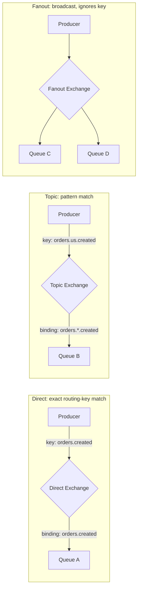
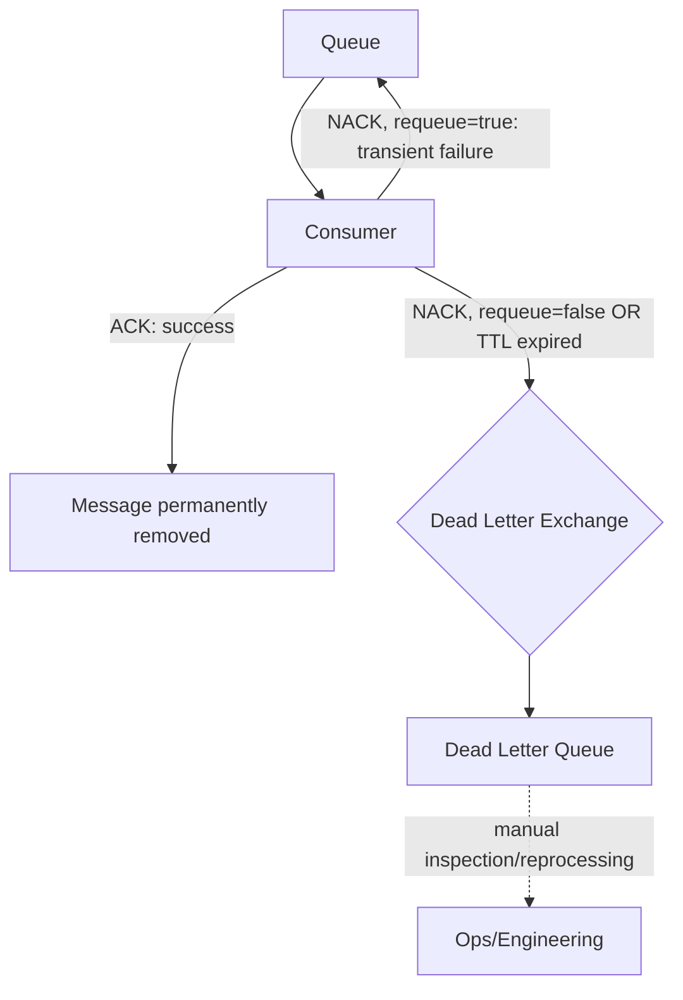
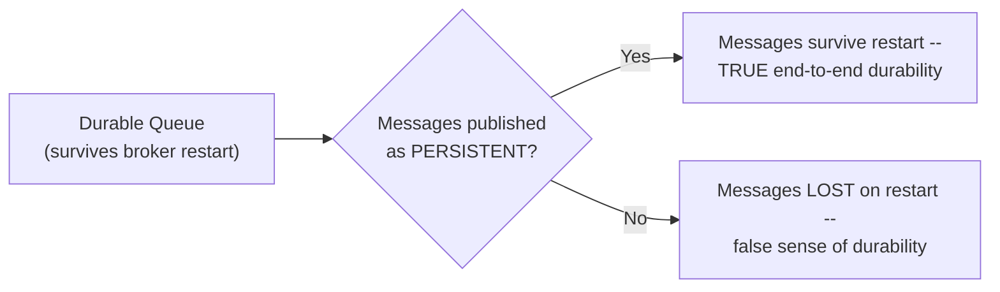
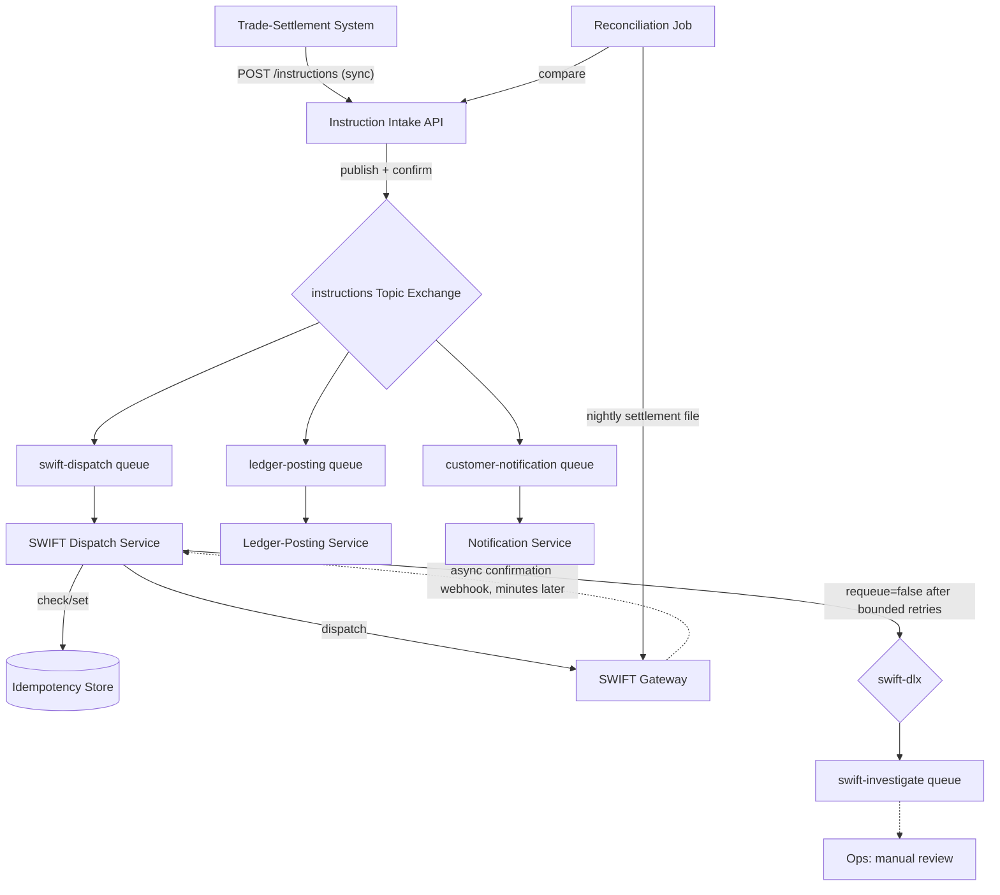
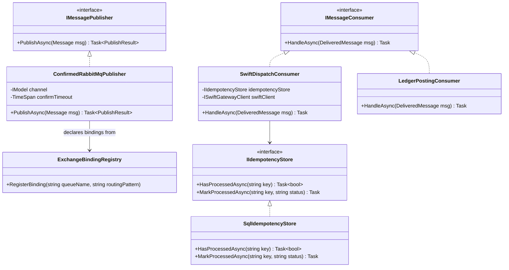
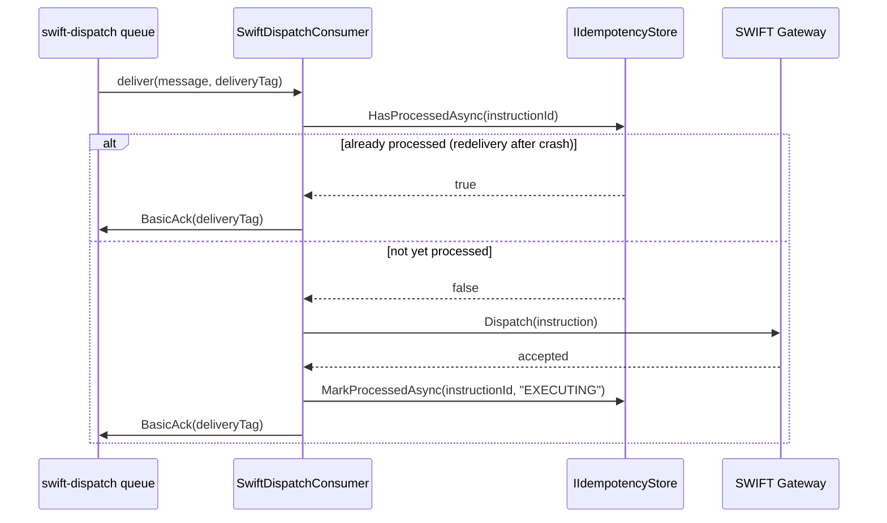

# RabbitMQ — Complete Interview Prep (All Topics, One File)

> Domain: RabbitMQ | Level: Beginner → Expert | Prerequisite: [[../19-Kafka/01-Kafka-Interview-Prep]] (log-based contrast), [[../18-Event-Driven-Architecture/01-EDA-Interview-Prep]] (delivery semantics, DLQs)
> **Quick-prep edition** (consolidated 2026-10-03). This one file replaces Module 56. Original: `git show ebb2d5c:20-RabbitMQ/01-Exchanges-Queues-Routing-Acknowledgment.md`
> Each topic has: **Key concepts → .NET code → Most common interview questions with answers.**

| # | Topic | # | Topic |
|---|---|---|---|
| 1 | AMQP model: producers, exchanges, bindings, queues | 7 | Queue types: classic, quorum, streams; HA |
| 2 | Exchange types & routing | 8 | Ordering, priorities, TTL, delayed messages |
| 3 | Consumer acknowledgements, prefetch & redelivery | 9 | Patterns: work queues, pub/sub, RPC, competing consumers |
| 4 | Publisher confirms & reliable publishing | 10 | .NET: RabbitMQ.Client, MassTransit, NServiceBus |
| 5 | Durability & persistence | 11 | Operations: monitoring, scaling, security |
| 6 | Dead-letter exchanges, retries & poison messages | 12 | RabbitMQ vs Kafka · 13 Top 25 + Principal · 14 Mistakes |

---

## 1. AMQP Model: Producers, Exchanges, Bindings, Queues

**Key concepts**
- **Smart broker, simple consumer:** producers publish to an **exchange** (never directly to a queue); **bindings** (with a routing/binding key) route messages to **queues**; consumers read from queues; a message is **removed when acknowledged**.
- **Connection** (TCP, expensive — long-lived, one per app) → **channels** (lightweight, multiplexed; not thread-safe — one per thread/consumer).
- **Virtual hosts** isolate environments/tenants (own exchanges, queues, permissions).
- Protocols: AMQP 0-9-1 (classic), AMQP 1.0 (RabbitMQ 4.x first-class), MQTT, STOMP.

```text
Producer ──publish(routingKey="payments.eu.captured")──► [Exchange: payments (topic)]
                                                          ├─ binding "payments.*.captured" ─► [Queue: ledger]    ─► ledger consumers
                                                          └─ binding "payments.eu.#"       ─► [Queue: eu-audit]  ─► audit consumers
```

**Common interview questions**

**Q1. Explain RabbitMQ's model in one minute.**
Producers publish messages with a routing key to an exchange; the exchange uses its type and bindings to copy the message to zero or more queues; consumers subscribe to queues and acknowledge each message, after which it's deleted. The broker does the routing; consumers are simple.

**Q2. Connection vs channel?**
A connection is a TCP connection (with TLS and auth) — expensive, keep a few long-lived ones. Channels are lightweight virtual connections inside it — use one per consumer or publishing thread, since channels aren't thread-safe.

---

## 2. Exchange Types & Routing

| Type | Routing | Example |
|---|---|---|
| **Direct** | exact match routing key = binding key | `payment.captured` → `ledger` queue |
| **Topic** | pattern match: `*` = one word, `#` = zero or more words | `payments.*.captured`, `orders.#` |
| **Fanout** | every bound queue (ignores the key) | broadcast cache invalidation |
| **Headers** | match on message headers (`x-match: all/any`) | route by `region=EU AND tier=gold` |
| **Default (nameless) exchange** | direct to the queue named by the routing key | simple work queues |
| **Exchange-to-exchange bindings** | compose routing topologies | |
| **Alternate exchange** | catches unroutable messages | |

```csharp
// RabbitMQ.Client 7.x (async API)
var factory = new ConnectionFactory { HostName = "rabbit", UserName = "app", Password = secret, ClientProvidedName = "payments-api" };
await using var connection = await factory.CreateConnectionAsync();
await using var channel = await connection.CreateChannelAsync();

await channel.ExchangeDeclareAsync("payments", ExchangeType.Topic, durable: true);
await channel.QueueDeclareAsync("ledger", durable: true, exclusive: false, autoDelete: false,
    arguments: new Dictionary<string, object?> { ["x-queue-type"] = "quorum" });
await channel.QueueBindAsync("ledger", "payments", routingKey: "payments.*.captured");
```

**Common interview questions**

**Q1. Direct vs topic vs fanout?**
Direct for exact routing by key (one type of message → specific queues); topic for hierarchical, pattern-based routing (region, type, priority); fanout for broadcasting to every subscriber regardless of key.

**Q2. What happens to a message no queue is bound for?**
It's silently dropped — unless the publisher sets `mandatory` (returned to the publisher) or the exchange has an alternate exchange. For important messages, use mandatory + returns handling or an alternate exchange.

---

## 3. Consumer Acknowledgements, Prefetch & Redelivery

**Key concepts**
- **Manual ack** (`autoAck: false`): `BasicAck` after successful processing; `BasicNack`/`BasicReject` with `requeue: true|false` on failure. **Auto-ack** deletes on delivery → message loss if the consumer crashes.
- **Unacked messages are redelivered** when the channel/connection closes (`redelivered = true`) → **at-least-once** → consumers must be idempotent.
- **Prefetch (QoS):** `BasicQos(prefetchCount: N)` limits unacked messages per consumer → fair dispatch and backpressure. Too high = one consumer hoards; too low = idle round trips. Tune (e.g., 10–100) based on processing time.
- **Requeue loops:** `nack(requeue:true)` on a poison message spins forever → use DLX with a delivery limit (quorum queues: `x-delivery-limit`).
- **Consumer timeout:** delivery not acked within `consumer_timeout` (default 30 min) closes the channel.

```csharp
await channel.BasicQosAsync(prefetchSize: 0, prefetchCount: 20, global: false);
var consumer = new AsyncEventingBasicConsumer(channel);
consumer.ReceivedAsync += async (_, ea) =>
{
    try
    {
        var evt = JsonSerializer.Deserialize<PaymentCaptured>(ea.Body.Span)!;
        await handler.HandleAsync(evt);                                     // idempotent (inbox / unique key)
        await channel.BasicAckAsync(ea.DeliveryTag, multiple: false);
    }
    catch (JsonException)
    {
        await channel.BasicRejectAsync(ea.DeliveryTag, requeue: false);    // poison → DLX
    }
    catch (Exception)
    {
        await channel.BasicNackAsync(ea.DeliveryTag, multiple: false, requeue: false); // → DLX/retry queue
    }
};
await channel.BasicConsumeAsync("ledger", autoAck: false, consumer: consumer);
```

**Common interview questions**

**Q1. Auto-ack vs manual ack?**
Auto-ack removes the message as soon as it's delivered — fast, but a crash during processing loses it. Manual ack after processing gives at-least-once delivery: an unacked message is redelivered if the consumer dies. Use manual ack for anything important, plus idempotent handlers.

**Q2. What does prefetch do and how do you choose it?**
It caps unacknowledged messages per consumer, which enables fair distribution and protects consumers from being flooded. Start around 10–50; lower for slow, heavy messages; higher for fast, small ones; measure throughput and memory.

**Q3. A poison message keeps being redelivered. Fix?**
Stop requeueing on non-transient errors: reject without requeue to a dead-letter exchange; for transient failures use delayed retry queues with a limited count (or a quorum-queue delivery limit), then DLQ with alerting.

---

## 4. Publisher Confirms & Reliable Publishing

**Key concepts**
- By default, `BasicPublish` is fire-and-forget: a broker crash or a network issue can lose messages silently.
- **Publisher confirms:** the broker acks the message once it's safely handled (written to disk / replicated for quorum queues); nacks on failure → the publisher retries. Batch or async confirms for throughput.
- **Mandatory flag + returns:** detect unroutable messages.
- **Transactions (tx.select):** much slower — use confirms instead.
- Atomicity with the database still needs the **transactional outbox** (MassTransit/NServiceBus have built-in outboxes).
- Retries on publish can duplicate → consumers deduplicate by message ID.

```csharp
// RabbitMQ.Client 7: channel with publisher confirms + tracking
await using var channel = await connection.CreateChannelAsync(
    new CreateChannelOptions(publisherConfirmationsEnabled: true, publisherConfirmationTrackingEnabled: true));

var props = new BasicProperties { MessageId = evt.EventId.ToString(), DeliveryMode = DeliveryModes.Persistent,
                                  ContentType = "application/json", CorrelationId = correlationId };
await channel.BasicPublishAsync(exchange: "payments", routingKey: "payments.eu.captured",
                                mandatory: true, basicProperties: props, body: JsonSerializer.SerializeToUtf8Bytes(evt));
// With confirmation tracking enabled, the await completes when the broker confirms (throws on nack/return).
```

**Common interview questions**

**Q1. How do you make sure a published message isn't lost?**
Durable exchange and quorum queue, persistent messages, publisher confirms (retry on nack/timeout), mandatory + an alternate exchange for unroutable messages, and the outbox pattern so publishing is tied to the DB commit. Consumers deduplicate because retries can duplicate.

**Q2. Publisher confirms vs AMQP transactions?**
Both make publishing reliable, but transactions are synchronous and drastically slower. Confirms are asynchronous and batchable — the recommended approach.

---

## 5. Durability & Persistence

**Key concepts**
- Three independent settings must **all** be right: **durable exchange**, **durable queue** (survives broker restart), **persistent messages** (`DeliveryMode = Persistent`). Miss one → messages lost on restart.
- **Lazy queues** (classic) or quorum/stream queues store messages on disk rather than in memory → handle large backlogs.
- Memory and disk **alarms** block publishers when thresholds are hit (flow control) → monitor them.
- Persistence costs throughput; non-critical data (telemetry) can use transient messages.

**Common interview question**

**Q. After a broker restart, messages disappeared. Why?**
The queue was non-durable, or the messages were published as transient, or the exchange wasn't durable so bindings vanished; with classic mirrored or single-node queues, an unsynchronized node failure also loses data. Use durable quorum queues + persistent messages + publisher confirms.

---

## 6. Dead-Letter Exchanges, Retries & Poison Messages

**Key concepts**
- **DLX:** a queue argument `x-dead-letter-exchange` (and optional routing key). Messages go there when **rejected/nacked without requeue**, **TTL-expired**, the **queue length limit** is exceeded, or the **delivery limit** is exceeded (quorum queues).
- The `x-death` header records the reason, count and original queue.
- **Retry with delay pattern:** failed → retry queue with a message TTL (e.g., 30 s) whose DLX routes back to the work queue; count attempts via `x-death`; after N attempts → parking-lot/DLQ. (Or the **delayed message exchange plugin**, or MassTransit's redelivery.)
- **DLQ operations:** alert on depth, inspect, fix, **shovel** back for reprocessing; an owner per DLQ.

```csharp
// Work queue with DLX → retry queue (TTL 30s) → back to work queue; quorum delivery limit as a backstop
await channel.ExchangeDeclareAsync("payments.dlx", ExchangeType.Direct, durable: true);
await channel.QueueDeclareAsync("ledger", durable: true, exclusive: false, autoDelete: false, arguments: new Dictionary<string, object?>
{
    ["x-queue-type"] = "quorum",
    ["x-dead-letter-exchange"] = "payments.dlx",
    ["x-dead-letter-routing-key"] = "ledger.retry",
    ["x-delivery-limit"] = 5
});
await channel.QueueDeclareAsync("ledger.retry", durable: true, exclusive: false, autoDelete: false, arguments: new Dictionary<string, object?>
{
    ["x-message-ttl"] = 30_000,
    ["x-dead-letter-exchange"] = "",                // default exchange
    ["x-dead-letter-routing-key"] = "ledger"         // back to the work queue after the delay
});
await channel.QueueBindAsync("ledger.retry", "payments.dlx", "ledger.retry");
// A separate "ledger.parking" queue receives messages once x-death count exceeds the max (checked in the consumer).
```

**Common interview questions**

**Q1. How do you implement retries with backoff in RabbitMQ?**
Dead-letter failed messages to retry queues with increasing TTLs (or use the delayed-message plugin / a framework's redelivery), route them back to the main queue on expiry, count attempts with `x-death`, and park them in a DLQ after the limit, with alerts and redrive tooling.

**Q2. When does a message get dead-lettered?**
When it's rejected or nacked with `requeue=false`, its TTL expires, the queue exceeds its max length/bytes (with overflow set to dead-letter), or (quorum queues) it exceeds the delivery limit.

---

## 7. Queue Types: Classic, Quorum, Streams; HA

**Key concepts**
- **Classic queues:** single-node storage (classic **mirrored** queues were deprecated and **removed in RabbitMQ 4.0**).
- **Quorum queues:** replicated with **Raft** across an odd number of nodes (3/5); data-safe, poison-message handling (delivery limit), the default choice for durability and HA. Higher resource use than classic; not for transient/very high-churn exclusive queues.
- **Streams** (3.9+): an append-only, replicated **log** with non-destructive reads, offsets and replay (Kafka-like) — large fan-out, replay, huge backlogs; Super Streams for partitioning.
- **Cluster:** nodes share metadata; queue leaders are spread across nodes; use an odd number of nodes; avoid clustering over a WAN (use **Federation** or **Shovel** between data centres).
- **Network partitions:** `pause_minority` handling avoids split-brain for classic setups; quorum queues need a majority.

**Common interview questions**

**Q1. Classic vs quorum vs stream queues?**
Classic: fast, single-node — fine for transient data. Quorum: Raft-replicated, durable, safe failover — the default for important messages. Streams: replayable logs with offsets for fan-out and replay, closer to Kafka semantics.

**Q2. How do you replicate between data centres?**
Not with a stretched cluster (Raft and Erlang clustering need low-latency links). Use Federation (exchanges/queues pull from upstream brokers) or Shovel (move messages between brokers), or a separate per-region cluster with application-level replication.

---

## 8. Ordering, Priorities, TTL & Delayed Messages

**Key concepts**
- **Ordering:** FIFO per queue, but **only with a single consumer** (and no requeues); multiple competing consumers or redeliveries reorder. Options: **Single Active Consumer** (`x-single-active-consumer`), consistent-hash exchange to partition by key across queues, or streams/Super Streams.
- **Priority queues** (`x-max-priority`, classic queues): higher-priority messages first — use sparingly (few levels).
- **TTL:** per queue (`x-message-ttl`) or per message (`expiration`); queue TTL (`x-expires`) deletes unused queues.
- **Length limits:** `x-max-length`, `x-overflow` (`drop-head`, `reject-publish`, `reject-publish-dlx`).
- **Delayed messages:** delayed-message exchange plugin or TTL + DLX.

**Common interview question**

**Q. How do you preserve per-customer ordering with multiple consumers?**
Partition by key: a consistent-hash exchange spreads keys across N queues, each with a single active consumer, so one customer's messages always go to the same queue and are processed sequentially — while different customers are processed in parallel. Or use Super Streams.

---

## 9. Patterns: Work Queues, Pub/Sub, RPC, Competing Consumers

- **Work queue / competing consumers:** many consumers on one queue → load balancing; prefetch for fairness.
- **Pub/sub:** a fanout/topic exchange → a queue per subscriber service.
- **Routing:** direct/topic exchanges per message type, region or priority.
- **RPC (request/reply):** `ReplyTo` (a temporary/exclusive queue or direct reply-to `amq.rabbitmq.reply-to`) + `CorrelationId`; use timeouts — and question whether HTTP/gRPC is simpler.
- **Scheduled/delayed jobs**, **message expiry** for stale requests (quotes).

```csharp
// RPC client sketch with direct reply-to
var props = new BasicProperties { CorrelationId = Guid.NewGuid().ToString(), ReplyTo = "amq.rabbitmq.reply-to" };
// consume from "amq.rabbitmq.reply-to" (autoAck: true) BEFORE publishing; match CorrelationId; enforce a timeout
```

**Common interview question**

**Q. Should you do RPC over RabbitMQ?**
Possible (ReplyTo + CorrelationId), but it adds latency and complexity and hides synchronous coupling behind a queue. Prefer HTTP/gRPC for request/response; use messaging for asynchronous commands and events.

---

## 10. .NET: RabbitMQ.Client, MassTransit, NServiceBus

**Key concepts**
- **RabbitMQ.Client 7.x:** fully async API (`CreateConnectionAsync`, `BasicPublishAsync`, `AsyncEventingBasicConsumer`); one long-lived connection per app; channels per consumer.
- **MassTransit / NServiceBus / Wolverine** abstract topology, retries, DLQs, sagas, the **outbox/inbox**, serialization and observability → recommended for business messaging (check licensing: MassTransit v9+ moved to a commercial license; NServiceBus is commercial).
- **OpenTelemetry**: trace context in message headers.

```csharp
// MassTransit with RabbitMQ: retries, redelivery, EF Core outbox, consumers
builder.Services.AddMassTransit(x =>
{
    x.AddConsumer<PaymentCapturedConsumer>();
    x.AddEntityFrameworkOutbox<AppDbContext>(o => { o.UseSqlServer(); o.UseBusOutbox(); });
    x.UsingRabbitMq((ctx, cfg) =>
    {
        cfg.Host("rabbit", "/", h => { h.Username("app"); h.Password(secret); });
        cfg.UseMessageRetry(r => r.Exponential(5, TimeSpan.FromSeconds(1), TimeSpan.FromMinutes(1), TimeSpan.FromSeconds(5)));
        cfg.UseDelayedRedelivery(r => r.Intervals(TimeSpan.FromMinutes(5), TimeSpan.FromMinutes(15)));
        cfg.ConfigureEndpoints(ctx);              // queues, bindings and _error/_skipped queues created automatically
    });
});

public sealed class PaymentCapturedConsumer(LedgerService ledger) : IConsumer<PaymentCaptured>
{
    public Task Consume(ConsumeContext<PaymentCaptured> ctx) => ledger.PostAsync(ctx.Message, ctx.CancellationToken);
}
```

**Common interview question**

**Q. Raw client or MassTransit/NServiceBus?**
Raw client for simple, performance-sensitive or infrastructure code where you control the topology. A framework for business messaging: it gives retries, DLQs, sagas, outbox/inbox, serialization conventions and observability consistently across teams — weigh licensing and abstraction leakage.

---

## 11. Operations: Monitoring, Scaling, Security

- **Metrics:** queue depth (ready + unacked), publish/deliver/ack rates, consumer count and utilization, redelivery rate, DLQ depth, memory and disk alarms, file descriptors, connection/channel churn, quorum queue leader distribution. Prometheus plugin + Grafana dashboards.
- **Scaling:** more consumers (competing), more queues (shard by key), more nodes (spread queue leaders); throughput limits per queue (one queue is served by one leader).
- **Avoid:** connection/channel churn (open once, reuse), huge messages (store payloads in blob storage, pass references — claim check), unbounded queues.
- **Security:** TLS, per-app users with least-privilege permissions per vhost (configure/write/read regex), OAuth 2 plugin, no `guest` user, management UI restricted.

**Common interview questions**

**Q1. A queue is growing and consumers can't keep up. What do you do?**
Check consumer health and errors (redeliveries, nacks), processing latency and downstream bottlenecks, and prefetch settings; scale consumers if downstream can take it; shard hot queues by key; shed or defer low-priority work; set length limits with overflow to DLX to protect the broker; alert on depth and age.

**Q2. How do you handle large messages?**
The claim-check pattern: store the payload in blob storage and send a reference; keep messages small (KBs) to avoid memory pressure and slow replication.

---

## 12. RabbitMQ vs Kafka

| | RabbitMQ | Kafka |
|---|---|---|
| Model | smart broker routes, deletes on ack | dumb broker log, consumers track offsets |
| Replay | no (streams yes) | yes, by offset/time |
| Ordering | per queue, single consumer | per partition |
| Routing | rich (exchanges, headers, patterns) | topic + key |
| Per-message features | ack/nack, TTL, priority, delay, DLX | none per message; retry topics by convention |
| Throughput | tens of thousands/s per queue | millions/s per cluster |
| Consumers | competing on a queue | consumer groups per partition |
| Best for | task distribution, commands, complex routing, RPC | event streaming, many consumers, replay, analytics, CDC |

**Common interview question**

**Q. RabbitMQ or Kafka for an order-processing system?**
Commands and work distribution (process this payment, send this email) with retries, delays and priorities fit RabbitMQ. Domain event streams consumed by many services, with replay to build read models and analytics, fit Kafka. Many architectures use RabbitMQ (or Service Bus/SQS) for commands and Kafka for events.

---

## 13. Top 25 Rapid-Fire Questions + Principal Questions

1. **Where do producers publish?** To exchanges.
2. **Binding?** Exchange → queue rule with a key.
3. **Direct exchange?** Exact key match.
4. **Topic exchange?** `*` one word, `#` many words.
5. **Fanout?** Broadcast to all bound queues.
6. **Headers exchange?** Match on headers.
7. **Unroutable message?** Dropped unless mandatory/alternate exchange.
8. **Auto-ack risk?** Loss on consumer crash.
9. **Manual ack semantics?** At-least-once.
10. **Prefetch?** Max unacked per consumer.
11. **Nack requeue loop?** Poison message → DLX instead.
12. **DLX triggers?** Reject, TTL, length limit, delivery limit.
13. **Retry with delay?** TTL retry queue + DLX back.
14. **Publisher confirms?** Broker acks safe receipt.
15. **Durability trio?** Durable exchange + durable queue + persistent message.
16. **Quorum queues?** Raft-replicated, safe HA.
17. **Mirrored queues?** Removed in 4.0 → quorum queues.
18. **Streams?** Replayable log in RabbitMQ.
19. **Ordering with many consumers?** Not guaranteed → SAC or consistent hash.
20. **Connection vs channel?** TCP vs lightweight multiplexed session.
21. **Cross-DC?** Federation/Shovel, not stretched clusters.
22. **Large payloads?** Claim check.
23. **RPC?** ReplyTo + CorrelationId (prefer HTTP/gRPC).
24. **.NET frameworks?** MassTransit, NServiceBus, Wolverine.
25. **Memory alarm?** Broker blocks publishers (flow control).

**Principal-level questions**

**P1. Design reliable payment command processing on RabbitMQ.**
Outbox in the payments DB publishing commands with confirms to a durable topic exchange; quorum queues per command type; idempotent consumers keyed by command ID; retry queues with exponential delays for transient errors; DLQ with alerting and redrive; single active consumer or key partitioning where order matters; OTel tracing; and monitoring of depth, age and redeliveries.

**P2. When would you migrate off RabbitMQ?**
When you need large-scale event streaming with replay and many independent consumers, long retention for analytics, or throughput beyond what queue sharding handles — then Kafka (or RabbitMQ Streams as an intermediate step). Keep RabbitMQ for command/work queues if it fits.

---

## 14. Mistakes Checklist (say why each is wrong)
- [ ] Auto-ack for important messages · no idempotent consumers
- [ ] Missing one of durable exchange / durable queue / persistent message
- [ ] Publishing without confirms or mandatory handling · dual writes without an outbox
- [ ] Requeueing poison messages forever · no DLX, no DLQ alerts
- [ ] Unlimited prefetch · unbounded queues without length limits
- [ ] Expecting ordering with competing consumers
- [ ] Opening a connection per message · sharing channels across threads
- [ ] Classic single-node queues for critical data · stretched clusters across regions
- [ ] Large payloads in messages · `guest` user / over-broad permissions

---

## Architecture Diagrams (preserved from the original modules)

> All 6 Mermaid/ASCII diagrams from the original `20-RabbitMQ/` files, kept verbatim and grouped by source module. Originals: `git show ebb2d5c:20-RabbitMQ/<file>.md`.

### Module 56 — RabbitMQ: Exchanges, Queues, Routing & Message Acknowledgment Patterns
*Source: `01-Exchanges-Queues-Routing-Acknowledgment.md`*

**Exchange Types**



**Acknowledgment and Dead Letter Flow**



**Durability: Queue + Message, Both Required**



**Step 2 — Propose High-Level Design and Get Buy-In**



**Class Diagram**



**Sequence Diagram — Idempotent SWIFT Dispatch on Redelivery**


