# AWS — Complete Interview Prep (All Topics, One File)

> Domain: AWS | Level: Beginner → Expert | Prerequisite: [[../14-System-Design/01-System-Design-Fundamentals]], [[../17-Microservices/00-Microservices-Interview-Master-Guide-DotNet-TechLead-Architect]] (resilience, §25 load balancing), [[../08-DynamoDB/01-DynamoDB-Interview-Prep]]
> **Quick-prep edition** (consolidated 2026-10-03). This one file replaces Modules 57–64. Originals: `git show ebb2d5c:21-AWS/<file>.md`. Azure equivalents: [[../22-Azure/01-Azure-Interview-Prep]]
> Each topic has: **Key concepts → .NET/IaC/CLI example → Most common interview questions with answers.** Prices and limits change — verify current AWS docs before committing a design.

| # | Topic | # | Topic |
|---|---|---|---|
| 1 | Global infrastructure & the master request journey | 11 | Containers: ECS, EKS, Fargate, ECR |
| 2 | VPC networking | 12 | Observability: CloudWatch, X-Ray/ADOT, CloudTrail |
| 3 | Compute: EC2, Auto Scaling, the compute decision framework | 13 | Infrastructure as Code: CloudFormation, CDK, Terraform |
| 4 | Load balancing & edge: ALB/NLB, API Gateway, CloudFront, Route 53 | 14 | Well-Architected, resilience & multi-region DR |
| 5 | IAM, STS & workload identity | 15 | Cost optimization (FinOps on AWS) |
| 6 | KMS, Secrets Manager, Parameter Store & security services | 16 | Migration: legacy .NET to AWS (7 Rs) |
| 7 | Storage: S3, EBS, EFS, FSx | 17 | Reference architecture: payment platform end to end |
| 8 | Databases: RDS, Aurora, DynamoDB, ElastiCache (+ .NET connectivity) | 18 | Top 40 rapid-fire + Principal questions |
| 9 | Serverless: Lambda, API Gateway, Step Functions | 19 | Mistakes checklist |
| 10 | Messaging: SQS, SNS, EventBridge, Kinesis, MSK | | |

---

## 1. Global Infrastructure & the Master Request Journey

**Key concepts**
- **Region** (independent geographic area, e.g., `eu-west-1`) → **Availability Zones** (≥ 3 isolated data centres per region, low-latency links) → **Edge locations** (CloudFront, Route 53, Global Accelerator).
- **Design for AZ failure by default** (multi-AZ), **region failure by business requirement** (DR strategy, cost).
- Shared responsibility: AWS secures the cloud (hardware, hypervisor, managed service internals); you secure what's in it (IAM, data, network config, patching EC2, app code).
- **Master request journey** (be able to trace it hop by hop):

```text
User → Route 53 (DNS, latency/failover routing) → CloudFront (TLS at edge, WAF, cache)
     → ALB in public subnets (TLS/HTTP routing, health checks) → target group
     → ECS/EKS tasks or EC2 in private subnets (ASP.NET Core / Kestrel)
     → RDS Proxy → RDS/Aurora (private DB subnets, Multi-AZ)   ← secrets via Secrets Manager (IAM role)
     → ElastiCache (cache-aside)                               ← telemetry → CloudWatch / X-Ray
     → SQS/SNS/EventBridge (async work)                        ← outbound internet via NAT Gateway; AWS APIs via VPC endpoints
```

**Common interview questions**

**Q1. Trace an HTTPS request from a browser to your .NET API on AWS and back.**
DNS lookup via Route 53 returns the CloudFront distribution; the browser opens TLS to the nearest edge; WAF rules run; CloudFront forwards (cache miss) to the ALB origin over HTTPS; the ALB terminates TLS, picks a healthy target in the target group (least outstanding requests), and forwards over HTTP/HTTPS to the task's port; Kestrel processes the request, the app reads secrets with its IAM role, queries RDS through RDS Proxy (connection pooling, faster failover), checks ElastiCache; the response returns the same path; CloudWatch/X-Ray capture logs, metrics and traces at each hop.

**Q2. Multi-AZ vs multi-region?**
Multi-AZ protects against a data-centre failure with synchronous options (RDS Multi-AZ, ALB across AZs) and is standard for production. Multi-region protects against a regional outage or meets residency/latency needs, but needs asynchronous replication, DNS/Global Accelerator failover, duplicated stacks and cost — justified by RTO/RPO and business impact.

---

## 2. VPC Networking

**Key concepts**
- **VPC:** your isolated network with a CIDR (e.g., `10.0.0.0/16`); plan non-overlapping CIDRs across accounts and on-prem for future peering/Transit Gateway.
- **Subnets** live in one AZ. **Public** = route table has a route to an **Internet Gateway**; **private** = no IGW route (outbound internet via a **NAT Gateway** in a public subnet). "Public" is defined by routing, not the name.
- **Three-tier layout:** public (ALB, NAT), private app (ECS/EKS/EC2), private data (RDS, ElastiCache) — in ≥ 2–3 AZs.
- **Security Groups:** stateful, allow-only, attached to ENIs; reference other SGs (`app-sg` can reach `db-sg` on 1433). **NACLs:** stateless, subnet-level, allow + deny, ordered rules (coarse guardrails).
- **VPC endpoints:** **Gateway** (S3, DynamoDB — free, route table) and **Interface** (PrivateLink ENIs for most AWS APIs — Secrets Manager, SQS, ECR, CloudWatch). Keep AWS traffic private and **cut NAT Gateway data-processing costs**.
- **Connectivity:** VPC peering (non-transitive), **Transit Gateway** (hub for many VPCs/on-prem), **PrivateLink** (expose a service to other VPCs/accounts without network merging), Site-to-Site VPN, **Direct Connect** (dedicated link).
- **Flow Logs** for network troubleshooting and security auditing.

```hcl
# Terraform (abridged): private subnet route via NAT, SG chaining
resource "aws_security_group" "app" {
  vpc_id = aws_vpc.main.id
  ingress {
    from_port       = 8080
    to_port         = 8080
    protocol        = "tcp"
    security_groups = [aws_security_group.alb.id]   # only the ALB may reach the app
  }
  egress {
    from_port   = 0
    to_port     = 0
    protocol    = "-1"
    cidr_blocks = ["0.0.0.0/0"]
  }
}
resource "aws_security_group" "db" {
  vpc_id = aws_vpc.main.id
  ingress {
    from_port       = 1433
    to_port         = 1433
    protocol        = "tcp"
    security_groups = [aws_security_group.app.id]   # only the app tier may reach SQL Server
  }
}
resource "aws_vpc_endpoint" "s3" {
  vpc_id            = aws_vpc.main.id
  service_name      = "com.amazonaws.eu-west-1.s3"
  vpc_endpoint_type = "Gateway"
  route_table_ids   = [aws_route_table.private_a.id, aws_route_table.private_b.id]
}
```

**Common interview questions**

**Q1. What makes a subnet public?**
Its route table has a `0.0.0.0/0` route to an Internet Gateway (and instances need public IPs to be reachable). A private subnet has no IGW route; outbound internet goes through a NAT Gateway.

**Q2. Security Group vs NACL?**
SGs are stateful (return traffic allowed automatically), allow-only, instance/ENI-level, and can reference other SGs — the primary control. NACLs are stateless (you must allow return ports), subnet-level, ordered, and support deny — used as coarse guardrails (e.g., block a known-bad CIDR).

**Q3. Our NAT Gateway bill is huge. Why and how do you fix it?**
NAT charges per GB processed; pulling container images, S3 objects, or calling AWS APIs through NAT adds up. Add gateway endpoints for S3/DynamoDB and interface endpoints for ECR, Secrets Manager, CloudWatch, SQS; cache images; keep cross-AZ NAT traffic in-AZ (one NAT per AZ).

**Q4. Peering vs Transit Gateway vs PrivateLink?**
Peering: simple 1:1, non-transitive — fine for a few VPCs. Transit Gateway: hub-and-spoke for many VPCs and on-prem with central routing. PrivateLink: expose one service privately to consumers in other VPCs/accounts without merging networks or overlapping-CIDR concerns.

---

## 3. Compute: EC2, Auto Scaling, the Compute Decision Framework

**Key concepts**
- **EC2:** instance families (general m7, compute c7, memory r7, Graviton `g` = ARM, better price-performance), purchasing (On-Demand, **Savings Plans/Reserved**, **Spot** for interruptible), AMIs, user data, instance metadata (IMDSv2 required), EBS volumes.
- **Auto Scaling Groups:** min/desired/max across AZs; **target tracking** (e.g., 50% CPU or ALB requests per target), step, scheduled, predictive scaling; health checks (EC2 + ELB); **launch templates**; instance refresh for rolling updates; lifecycle hooks; warm pools.
- **Compute decision framework:**

| Option | Choose when | Avoid when |
|---|---|---|
| **Lambda** | event-driven, spiky, short (≤ 15 min), low ops | long-running, steady high load (cost), latency-critical with cold starts |
| **ECS Fargate** | containers without managing servers or Kubernetes; AWS-only | you need Kubernetes ecosystem/portability, GPUs/daemonsets |
| **EKS** | Kubernetes standard, many teams, portability, advanced scheduling | small team without K8s skills |
| **EC2** | full control, special OS/licensing (SQL Server on Windows), legacy | you want minimal ops |
| **App Runner / Elastic Beanstalk** | simple web apps, quick start | complex networking, fine control, large estates |

- **Capacity estimation:** peak RPS × latency = concurrent requests (Little's Law) → per-instance capacity from load tests → instances needed + headroom (N+1 AZ).

**Common interview questions**

**Q1. ECS vs EKS vs Lambda for a new .NET microservice platform?**
Lambda for event-driven or spiky workloads with low ops; ECS Fargate for a containerized .NET estate on AWS where you want simplicity; EKS when you need the Kubernetes ecosystem (operators, service mesh, GitOps, portability) and have a platform team. Decide on team skills, workload shape, portability and cost — record it in an ADR.

**Q2. How do you scale a .NET API on EC2/ECS correctly?**
Target-tracking on a load signal that reflects saturation (ALB requests per target or CPU, sometimes custom metrics like queue length), multi-AZ, health checks on readiness, warm-up time accounted for (instance warmup, JIT/ReadyToRun), scale-in protection during deployments, and load-tested limits per instance.

**Q3. Little's Law capacity example?**
10,000 RPS at 50 ms average latency ⇒ 500 concurrent requests. If one task handles ~100 concurrent requests at target CPU, you need 5 tasks; with N+1 AZ headroom across 3 AZs, run ~8.

---

## 4. Load Balancing & Edge: ALB/NLB, API Gateway, CloudFront, Route 53

**Key concepts**
- **ALB (L7):** HTTP/HTTPS/gRPC, host/path/header routing, TLS termination, WAF, OIDC/Cognito auth, target groups (instances, IPs, Lambda), sticky sessions, slow start. **NLB (L4):** TCP/UDP/TLS, ultra-low latency, static IPs/Elastic IPs, preserves source IP, PrivateLink services. **GWLB:** for network appliances.
- **Target group timers that cause incidents:** health-check interval/thresholds, **deregistration delay** (drain), **idle timeout (ALB 60 s) vs Kestrel keep-alive** (Kestrel's keep-alive must be **longer** than the ALB idle timeout or you get 502s), slow start.
- **API Gateway** (REST/HTTP/WebSocket APIs) for managed APIs: auth (JWT/Lambda/Cognito/IAM), throttling, usage plans/API keys, request validation, direct service integrations — vs ALB for high-throughput container backends (cheaper at scale).
- **CloudFront:** CDN + TLS at the edge, caching, origin shield, WAF, Lambda@Edge/CloudFront Functions, **origin access control** for private S3, origin failover.
- **Route 53:** routing policies — simple, weighted (canary), **latency**, **failover** (with health checks), geolocation/geoproximity, multivalue. Alias records to AWS resources. DNS failover time includes client caching → **Global Accelerator** (anycast static IPs) for fast, cache-free regional failover.

```csharp
// Kestrel keep-alive must exceed the ALB idle timeout (default 60 s) to avoid 502s
builder.WebHost.ConfigureKestrel(k =>
{
    k.Limits.KeepAliveTimeout = TimeSpan.FromSeconds(75);
    k.Limits.RequestHeadersTimeout = TimeSpan.FromSeconds(30);
});
// Graceful shutdown longer than the target group's deregistration delay
builder.Services.Configure<HostOptions>(o => o.ShutdownTimeout = TimeSpan.FromSeconds(45));
```

**Common interview questions**

**Q1. ALB or NLB?**
ALB for HTTP(S)/gRPC with content-based routing, WAF and auth. NLB for TCP/UDP, extreme throughput/latency, static IPs, source-IP preservation or PrivateLink. gRPC: ALB supports it natively; behind an NLB, long-lived HTTP/2 connections pin to targets (use client-side balancing).

**Q2. Random 502s from the ALB on a healthy service. Diagnose.**
`HTTPCode_ELB_5XX` with target status `-` in access logs means the request never reached the app or the connection broke. Classic cause: the backend closes idle keep-alive connections before the ALB (Kestrel's keep-alive < ALB's idle timeout), so the ALB reuses a dead connection. Fix: backend keep-alive > ALB idle timeout. Also check deploy-time 502s from missing graceful drain (deregistration delay vs shutdown timeout).

**Q3. API Gateway or ALB in front of .NET services?**
API Gateway when you need managed API features (per-client throttling/usage plans, API keys, JWT/Lambda authorizers, request validation, Lambda integration) and moderate traffic. ALB for high-volume container backends where API Gateway's per-request cost and limits (29 s default integration timeout, payload limits) matter; add WAF and do auth in the app or at the ALB.

**Q4. How fast is Route 53 DNS failover really?**
Health-check detection time + TTL + client/resolver caching that may ignore TTLs → often minutes with a long tail. For a tight, auditable RTO use Global Accelerator (anycast IPs, failover inside AWS's network in seconds) or client-side retry to multiple endpoints.

---

## 5. IAM, STS & Workload Identity

**Key concepts**
- **Principals:** root (lock away, MFA), IAM users (avoid for humans — use **IAM Identity Center/SSO**), **roles** (temporary credentials), federated identities.
- **Policies:** identity-based, resource-based (S3 bucket policies, KMS key policies, SQS), **permission boundaries**, **SCPs** (Organizations guardrails), session policies.
- **Evaluation logic:** explicit **Deny** wins → then an **Allow** is required from all applicable policy types (SCP, boundary, identity/resource) → default deny. Cross-account access needs both the trust policy and permissions.
- **STS AssumeRole:** a trust policy says *who* can assume; permission policies say *what* the role can do; credentials are temporary.
- **Least privilege:** start with specific actions/resources and conditions (`aws:SourceVpce`, `aws:PrincipalTag`, `kms:ViaService`), use **IAM Access Analyzer** to generate policies from CloudTrail and find external access.
- **Workload identity for .NET:** the AWS SDK default **credential chain** picks up credentials automatically: environment → profile → **ECS task role** → **EKS IRSA / Pod Identity** → EC2 instance profile. **Never** put access keys in config.
- **Multi-account strategy** (Organizations + Control Tower): separate accounts per environment/workload/team = the strongest blast-radius boundary.
- **ABAC:** tag-based policies (`aws:PrincipalTag/team == aws:ResourceTag/team`) scale better than per-resource policies.

```json
{
  "Version": "2012-10-17",
  "Statement": [{
    "Sid": "ReadOwnTenantObjects",
    "Effect": "Allow",
    "Action": ["s3:GetObject", "s3:PutObject"],
    "Resource": "arn:aws:s3:::docs-bucket/${aws:PrincipalTag/tenant}/*"
  }, {
    "Sid": "DecryptOnlyViaS3",
    "Effect": "Allow",
    "Action": "kms:Decrypt",
    "Resource": "arn:aws:kms:eu-west-1:111122223333:key/abcd-...",
    "Condition": { "StringEquals": { "kms:ViaService": "s3.eu-west-1.amazonaws.com" } }
  }]
}
```

```csharp
// No keys in code: the SDK resolves the task role / IRSA / instance profile automatically
builder.Services.AddDefaultAWSOptions(builder.Configuration.GetAWSOptions());
builder.Services.AddAWSService<IAmazonS3>();
builder.Services.AddAWSService<IAmazonSQS>();
```

**Common interview questions**

**Q1. Explain IAM policy evaluation.**
Start with an implicit deny; any explicit Deny in any applicable policy (SCP, permission boundary, session, identity, resource) ends evaluation with deny; otherwise the request needs an Allow that's permitted by every guardrail layer (SCP and boundary must allow, and an identity or resource policy must grant it). Cross-account needs both sides.

**Q2. How does a .NET app on EKS get AWS permissions?**
IRSA or EKS Pod Identity: the pod's Kubernetes service account is associated with an IAM role; the SDK's credential chain exchanges the projected service-account token (via STS `AssumeRoleWithWebIdentity` for IRSA, or the Pod Identity agent) for temporary credentials. Each workload gets its own least-privilege role — not the node's role.

**Q3. How would you prevent tenant A from accessing tenant B's data on AWS?**
Defence in depth: tenant derived from the authenticated token; per-tenant prefixes/partition keys with ABAC (session tags on the assumed role restricting S3 prefixes and DynamoDB leading keys); per-tenant KMS keys for high-tier tenants; app-level authorization on every object; separate accounts or cells for the largest/regulated tenants; and automated cross-tenant access tests.

**Q4. How do you enforce guardrails across 200 accounts?**
AWS Organizations with SCPs (deny disabling CloudTrail, leaving the org, using unapproved regions, creating IAM users), Control Tower landing zone, permission boundaries for delegated role creation, AWS Config rules with auto-remediation, Security Hub aggregation, and IAM Identity Center for human access.

---

## 6. KMS, Secrets Manager, Parameter Store & Security Services

**Key concepts**
- **KMS envelope encryption:** KMS generates a **data key**; you encrypt data locally with the plaintext data key, store the **encrypted** data key with the data, and discard the plaintext key. KMS only ever encrypts small keys (4 KB limit) → scalable, auditable (CloudTrail logs every key use).
- **Key types:** AWS-owned, AWS-managed, **customer-managed (CMK)** — control rotation, key policies, cross-account grants; multi-region keys for DR. Key policies are the primary access control for KMS.
- **Secrets Manager:** secrets with **automatic rotation** (Lambda rotation for RDS etc.), versioning, cross-region replication; per-secret cost. **Parameter Store:** config and simple secrets (SecureString via KMS), hierarchical, cheap/free tier, no built-in rotation.
- **IAM database authentication** (RDS MySQL/PostgreSQL): short-lived tokens instead of passwords — not for RDS SQL Server (use Secrets Manager rotation or Windows/Kerberos auth via AWS Managed AD).
- **Security services:** **WAF** (L7 rules, rate limiting, managed rule groups), **Shield** (DDoS; Advanced for 24/7 response), **GuardDuty** (threat detection), **Inspector** (vulnerabilities), **Macie** (PII in S3), **Security Hub** (aggregation), **Config** (compliance/drift), **CloudTrail** (audit), **ACM** (certificates).

```csharp
// Secrets Manager with caching (avoid calling the API on every request)
// dotnet add package AWSSDK.SecretsManager.Caching
var cache = new SecretsManagerCache(new AmazonSecretsManagerClient());
string json = await cache.GetSecretString("prod/payments/db");
var cs = JsonSerializer.Deserialize<DbSecret>(json)!.ToConnectionString();

// Envelope encryption with KMS
var kms = new AmazonKeyManagementServiceClient();
var dk = await kms.GenerateDataKeyAsync(new GenerateDataKeyRequest { KeyId = "alias/payments-data", KeySpec = DataKeySpec.AES_256 });
byte[] cipher = AesGcmEncrypt(plaintext, dk.Plaintext.ToArray());   // local encryption
Store(cipher, dk.CiphertextBlob.ToArray());                          // keep only the encrypted data key
CryptographicOperations.ZeroMemory(dk.Plaintext.ToArray());
```

**Common interview questions**

**Q1. Explain envelope encryption and why it's used.**
Encrypting large data directly in KMS isn't possible (size limits) or efficient (a network call per operation). Instead KMS issues a data key; you encrypt data locally and store the data key encrypted under the KMS key. To decrypt, you ask KMS to decrypt the small data key. KMS key access is centrally controlled and audited; rotating the master key doesn't require re-encrypting all data.

**Q2. Secrets Manager vs Parameter Store vs IAM DB auth?**
Secrets Manager for credentials needing rotation and cross-region replication (database passwords, API keys). Parameter Store for configuration and low-volume secrets without rotation needs (cheaper). IAM DB auth where supported, to remove long-lived DB passwords entirely (watch connection-rate limits).

**Q3. A developer committed AWS keys to GitHub. Your response?**
Deactivate and delete the keys immediately, check CloudTrail for usage since exposure, rotate anything those keys could access, look for persistence (new users, roles, keys, Lambda functions), notify security/compliance, then fix root causes: no long-lived keys (SSO and roles), secret scanning in pre-commit and CI, and SCPs blocking IAM user key creation.

---

## 7. Storage: S3, EBS, EFS, FSx

**Key concepts — S3**
- Object storage with a flat namespace (prefixes, not folders); 11 nines durability; **strong read-after-write consistency** (since 2020).
- **Storage classes:** Standard, Intelligent-Tiering, Standard-IA, One Zone-IA, Glacier Instant/Flexible/Deep Archive → **lifecycle policies** for transitions and expiry.
- **Versioning** (recover from overwrite/delete), **Object Lock** (WORM compliance: governance/compliance mode — regulatory retention), **replication** (CRR/SRR).
- **Encryption:** SSE-S3 (default), **SSE-KMS** (audit, key control; consider S3 Bucket Keys to reduce KMS cost), client-side.
- **Access:** IAM policies, bucket policies, **Block Public Access** (on by default), **pre-signed URLs** (time-limited upload/download without proxying through the API), access points, OAC for CloudFront.
- Performance: thousands of requests/sec per prefix; multipart upload for large files; S3 Transfer Acceleration.

**Key concepts — block and file**
- **EBS:** block storage attached to one instance, **AZ-scoped** (gp3 with independent IOPS/throughput, io2 for high IOPS); snapshots to S3; → multi-AZ databases need replication (RDS Multi-AZ), not a shared volume.
- **EFS:** managed NFS (POSIX), multi-AZ, shared by many instances/pods — only when you truly need shared file semantics (legacy apps, CMS uploads).
- **FSx:** Windows File Server (SMB, AD integration — Windows .NET apps), Lustre (HPC), NetApp ONTAP, OpenZFS.

```csharp
// Pre-signed upload URL: the browser uploads directly to S3; the API never proxies the bytes
var s3 = new AmazonS3Client();
string url = await s3.GetPreSignedURLAsync(new GetPreSignedUrlRequest
{
    BucketName = "loan-docs", Key = $"{tenantId}/{applicationId}/{Guid.NewGuid()}.pdf",
    Verb = HttpVerb.PUT, Expires = DateTime.UtcNow.AddMinutes(5), ContentType = "application/pdf",
    ServerSideEncryptionMethod = ServerSideEncryptionMethod.AWSKMS
});
// Then: S3 event → SQS → scanner Lambda (malware scan) → mark document as verified
```

**Common interview questions**

**Q1. How do you let users upload large files without overloading your API?**
Issue a short-lived pre-signed PUT (or a multipart upload set) scoped to a tenant prefix with content-type and size conditions; the client uploads directly to S3; an S3 event triggers validation/malware scanning; the API records metadata only after verification.

**Q2. How do you meet a 7-year regulatory retention requirement on S3?**
Versioning + **Object Lock in compliance mode** with a retention period (no one, including root, can delete early), lifecycle transitions to Glacier for cost, replication to another region/account for DR, SSE-KMS encryption, access logging and CloudTrail data events.

**Q3. Why can't two EC2 instances in different AZs share an EBS volume for HA?**
EBS volumes are AZ-scoped (and single-attach except io2 Multi-Attach within one AZ). Cross-AZ HA requires replication at the application/database layer (RDS Multi-AZ, Always On) or a shared file system like EFS/FSx.

---

## 8. Databases: RDS, Aurora, DynamoDB, ElastiCache (+ .NET Connectivity)

**Key concepts**
- **RDS** (SQL Server, PostgreSQL, MySQL, MariaDB, Oracle, Db2): managed backups/PITR, patching, **Multi-AZ** (synchronous standby, automatic failover ~1–2 min for SQL Server; DNS endpoint flips), **read replicas** (async; SQL Server read replicas Enterprise edition), storage autoscaling. SQL Server licensing: License Included vs BYOL (on dedicated hosts/EC2).
- **Aurora** (PostgreSQL/MySQL compatible): storage replicated 6 ways across 3 AZs, log-structured storage, up to 15 low-lag replicas, **faster failover (~30 s or less)**, Aurora Serverless v2, **Global Database** (cross-region < 1 s lag, managed failover), cluster/reader endpoints.
- **RDS Proxy:** connection pooling and multiplexing in front of RDS/Aurora — essential for **Lambda** (connection storms) and reduces failover time impact; IAM auth integration.
- **DynamoDB:** see [[../08-DynamoDB/01-DynamoDB-Interview-Prep]] — key design, capacity, global tables.
- **ElastiCache** (Redis/Valkey/Memcached) and **MemoryDB** (durable Redis-compatible): cache-aside, sessions, rate limiting — not a system of record (except MemoryDB).
- **.NET connectivity essentials:** pooled connections (`Max Pool Size`), **connection timeouts and command timeouts**, `MultiSubnetFailover=True` for SQL Server AGs/Multi-AZ to speed reconnects, **EF Core `EnableRetryOnFailure`** for transient errors during failover, short DNS caching, async all the way (pool exhaustion → thread starvation).

```csharp
// SQL Server on RDS Multi-AZ via EF Core with resilience
builder.Services.AddDbContextPool<PaymentsDb>(o => o.UseSqlServer(
    "Server=payments.xxxx.eu-west-1.rds.amazonaws.com,1433;Database=Payments;Encrypt=True;" +
    "Max Pool Size=200;Connect Timeout=15;MultiSubnetFailover=True;" + credentialsFromSecretsManager,
    sql => sql.EnableRetryOnFailure(maxRetryCount: 6, maxRetryDelay: TimeSpan.FromSeconds(10), errorNumbersToAdd: null)
              .CommandTimeout(30)));

// Aurora PostgreSQL: separate writer and reader endpoints
// writer: payments.cluster-xxxx.eu-west-1.rds.amazonaws.com   reader: payments.cluster-ro-xxxx...
```

| Need | Choose |
|---|---|
| existing SQL Server estate, T-SQL, SSRS-style reporting | RDS SQL Server (or EC2 for full control/licensing) |
| relational, high availability, fast failover, read scale, cost | Aurora PostgreSQL |
| key-value at massive scale, predictable latency, serverless | DynamoDB |
| caching / ephemeral state | ElastiCache (Valkey/Redis) |
| durable Redis-compatible primary store | MemoryDB |
| analytics | Redshift / Athena on S3 |

**Common interview questions**

**Q1. What does the application see during an RDS Multi-AZ failover, and how do you handle it?**
Existing connections drop and new connections fail for the failover window (DNS switches to the standby). Handle with connection retry/backoff (EF Core execution strategy), idempotent operations, short DNS TTL caching, `MultiSubnetFailover` for faster reconnection, RDS Proxy (keeps client connections and reconnects behind the scenes), and alarms on failover events.

**Q2. Why is Aurora failover faster than RDS?**
Aurora replicas share the same distributed storage volume, so promoting a replica doesn't require replaying or copying data — just switching the writer role (plus DNS/endpoint update). RDS Multi-AZ has a separate standby with its own storage that must finish recovery.

**Q3. Lambda functions are exhausting database connections. Fix?**
Each concurrent Lambda environment opens its own connections, so a burst creates thousands. Use RDS Proxy to pool and multiplex, cap Lambda reserved concurrency, reuse connections across invocations (initialize outside the handler), or move to a connection-light datastore (DynamoDB) or an async queue buffer.

**Q4. Connection-pool exhaustion cascading into thread-pool starvation — explain.**
A slow DB makes requests hold pooled connections longer; new requests wait for a connection (up to the connect timeout); if the code blocks synchronously, threads pile up waiting, the thread pool starves, and even healthy endpoints slow down. Fix: async all the way, sensible pool sizes and timeouts, fast-fail with circuit breakers, fix the slow query, and bulkhead DB-heavy endpoints.

---

## 9. Serverless: Lambda, API Gateway, Step Functions

**Key concepts — Lambda**
- **Execution model:** **Init phase** (download code, start runtime, run static/constructor init — cold start) → **Invoke phase** (handler). Environments are reused for subsequent invocations (warm) → initialize SDK clients and connections outside the handler.
- **.NET cold starts:** reduce with **NativeAOT** (custom runtime `provided.al2023`), ReadyToRun, trimming, smaller dependencies, more memory (memory = CPU), **SnapStart** for .NET (snapshots the initialized environment; mind uniqueness and connection restoration), **provisioned concurrency** for latency-critical paths.
- **Concurrency:** account concurrency limit (default 1,000 per region, raisable); **reserved concurrency** (caps and guarantees a function's share — protects downstream DBs); **provisioned concurrency** (pre-initialized environments).
- **Invocation types:** synchronous (API Gateway — errors go back to the caller), **asynchronous** (S3/SNS/EventBridge — built-in retries ×2, on-failure destinations/DLQ), **poll-based** event source mappings (SQS, Kinesis, DynamoDB Streams, Kafka — batch size, **partial batch failure reporting**, bisect on error, max retry age).
- Limits: 15-minute timeout, payload limits (6 MB sync), `/tmp` up to 10 GB, memory up to 10 GB.
- VPC-attached Lambdas use Hyperplane ENIs (cold-start ENI penalty mostly gone) but need NAT/endpoints for outbound access.

**Key concepts — API Gateway & Step Functions**
- **HTTP API** (cheaper, faster, JWT authorizers, simpler) vs **REST API** (usage plans/API keys, request validation, WAF, caching, private APIs, more features) vs WebSocket API.
- **Authorizers:** JWT (HTTP API), Cognito user pools, **Lambda authorizers** (custom logic; cache results), IAM (SigV4 for service-to-service).
- **Step Functions:** state machines (ASL) orchestrating Lambdas/services with retries, catch, timeouts, parallel, map, wait, **compensation** (saga); **Standard** (long-running up to 1 year, exactly-once execution, audit history, priced per transition) vs **Express** (high-volume, short ≤ 5 min, at-least-once, priced per duration).

```csharp
// Lambda handler (.NET 8, Amazon.Lambda.Annotations) — SQS batch with partial failures
public class Functions(IPaymentProcessor processor)       // DI via Annotations source generator
{
    [LambdaFunction]
    public async Task<SQSBatchResponse> ProcessPayments(SQSEvent evt, ILambdaContext ctx)
    {
        var failures = new List<SQSBatchResponse.BatchItemFailure>();
        foreach (var msg in evt.Records)
        {
            try { await processor.HandleAsync(JsonSerializer.Deserialize<PaymentCommand>(msg.Body)!); }   // idempotent
            catch (Exception ex)
            {
                ctx.Logger.LogError(ex, "Failed {MessageId}", msg.MessageId);
                failures.Add(new SQSBatchResponse.BatchItemFailure { ItemIdentifier = msg.MessageId });
            }
        }
        return new SQSBatchResponse(failures);             // only failed messages return to the queue
    }
}
```

```json
{
  "Comment": "Order saga with compensation",
  "StartAt": "ReserveInventory",
  "States": {
    "ReserveInventory": { "Type": "Task", "Resource": "arn:aws:lambda:...:reserve", "Next": "ChargePayment",
      "Retry": [{ "ErrorEquals": ["States.TaskFailed"], "MaxAttempts": 3, "BackoffRate": 2 }] },
    "ChargePayment": { "Type": "Task", "Resource": "arn:aws:lambda:...:charge", "Next": "Ship",
      "Catch": [{ "ErrorEquals": ["States.ALL"], "Next": "ReleaseInventory" }] },
    "ReleaseInventory": { "Type": "Task", "Resource": "arn:aws:lambda:...:release", "Next": "OrderFailed" },
    "OrderFailed": { "Type": "Fail" },
    "Ship": { "Type": "Task", "Resource": "arn:aws:lambda:...:ship", "End": true }
  }
}
```

**Common interview questions**

**Q1. What causes Lambda cold starts for .NET and how do you reduce them?**
Creating a new execution environment, starting the .NET runtime, JIT compilation and your initialization code (DI container, SDK clients, config). Mitigate with NativeAOT or ReadyToRun, trimming dependencies, more memory (more CPU), lazy initialization of rarely used clients, SnapStart, and provisioned concurrency for latency-sensitive endpoints. Measure init duration in CloudWatch.

**Q2. How do you protect a database from a Lambda traffic spike?**
Reserved concurrency to cap parallelism, RDS Proxy for pooling, buffering through SQS with a controlled batch size and concurrency (maximum concurrency on the event source mapping), and backoff on throttling.

**Q3. Lambda chaining vs Step Functions?**
Chaining Lambdas directly hides the workflow, duplicates retry/error logic and loses state on failure. Step Functions give explicit state, retries, catches, timeouts, compensation and an audit trail — use them for multi-step business processes; use Express workflows for high-volume short flows.

**Q4. HTTP API or REST API in API Gateway?**
HTTP API by default (cheaper, lower latency, native JWT auth). REST API when you need usage plans and API keys, request validation, response caching, WAF integration, private endpoints or edge-optimized APIs.

---

## 10. Messaging: SQS, SNS, EventBridge, Kinesis, MSK

**Key concepts**
- **SQS Standard:** nearly unlimited throughput, **at-least-once**, best-effort ordering. **Visibility timeout** hides a received message; if not deleted before it expires it's redelivered → set it longer than processing time (and extend for long jobs). **Long polling** (`WaitTimeSeconds=20`) cuts cost and empty receives. **DLQ** via redrive policy (`maxReceiveCount`) + redrive to source.
- **SQS FIFO:** ordering per **message group ID**, exactly-once *processing within a 5-minute dedup window* (dedup ID), lower throughput (high-throughput mode available).
- **SNS:** pub/sub fan-out → **SNS → SQS per consumer** (durable buffering, independent retries), message filtering, FIFO topics.
- **EventBridge:** event bus with **content-based rules**, schema registry, SaaS integrations, archive & **replay**, scheduler, cross-account buses — great for domain/integration events at moderate volume.
- **Kinesis Data Streams:** shards (1 MB/s or 1,000 records/s in per shard), ordering per partition key, retention 24 h–365 days, **replay**, multiple consumers (enhanced fan-out) — real-time analytics. Firehose for delivery to S3/Redshift/OpenSearch.
- **MSK:** managed Kafka (see [[../19-Kafka/01-Kafka-Interview-Prep]]).
- **Decision:** queue work → SQS; fan-out → SNS+SQS; event routing across domains/accounts → EventBridge; ordered high-throughput streams with replay → Kinesis/MSK.
- **Outbox** still needed for DB + publish atomicity.

```csharp
// SQS consumer as a BackgroundService (long polling, delete after success)
public sealed class OrderQueueWorker(IAmazonSQS sqs, IOrderHandler handler, IConfiguration cfg) : BackgroundService
{
    protected override async Task ExecuteAsync(CancellationToken ct)
    {
        var url = cfg["Queues:Orders"];
        while (!ct.IsCancellationRequested)
        {
            var resp = await sqs.ReceiveMessageAsync(new ReceiveMessageRequest
                { QueueUrl = url, MaxNumberOfMessages = 10, WaitTimeSeconds = 20, VisibilityTimeout = 60 }, ct);
            foreach (var m in resp.Messages ?? [])
            {
                await handler.HandleAsync(m.Body, ct);                               // idempotent by message/business ID
                await sqs.DeleteMessageAsync(url, m.ReceiptHandle, ct);              // delete only after success
            }
        }
    }
}
```

**Common interview questions**

**Q1. SQS processed the same message twice. Why?**
At-least-once delivery: processing took longer than the visibility timeout (the message reappeared), the consumer crashed before deleting, or standard-queue duplicates. Fix: idempotent consumers, a visibility timeout above the p99 processing time (with heartbeat extension), and FIFO + dedup IDs where ordering and dedup windows fit.

**Q2. Why fan out SNS → SQS instead of SNS → consumers directly?**
Each consumer gets a durable buffer with independent retries, DLQ, scaling and backpressure; a slow or down consumer doesn't lose messages or affect others.

**Q3. EventBridge vs SNS?**
EventBridge: content-based rules on any event field, many targets, schema registry, archive/replay, cross-account buses, SaaS sources — for domain event routing. SNS: very high-throughput, low-latency fan-out with simpler attribute filtering, mobile/SMS/email delivery.

**Q4. Kinesis vs SQS vs MSK?**
SQS for queues (each message processed once, deleted). Kinesis for ordered, replayable streams with multiple consumers and a managed shard model. MSK when you want the Kafka API/ecosystem (Connect, Streams, existing tooling) or portability.

---

## 11. Containers: ECS, EKS, Fargate, ECR

**Key concepts**
- **ECS:** AWS-native orchestration — task definitions, services (desired count, deployment circuit breaker), **Fargate** (serverless) or EC2 capacity providers; **task role** (app permissions) vs **execution role** (pull images, read secrets for injection); Service Connect / Cloud Map for discovery.
- **EKS:** managed Kubernetes control plane; data plane via **managed node groups**, Fargate profiles, or **Karpenter** (fast, cost-aware node provisioning); **VPC CNI** (pods get VPC IPs — watch IP exhaustion → prefix delegation or custom networking); **AWS Load Balancer Controller** (Ingress → ALB, Service → NLB); **IRSA/Pod Identity**; EBS/EFS CSI drivers; add-ons; upgrades every ~quarter (support windows).
- **ECR:** image registry, scanning, lifecycle policies, replication, immutable tags.
- **Scaling:** HPA (pods) + Cluster Autoscaler/Karpenter (nodes) — two independent dimensions; KEDA for event-driven scaling (SQS depth, Kafka lag).
- **Deployments:** rolling, blue/green (CodeDeploy for ECS), canary (Argo Rollouts/Flagger on EKS).
- **Security:** least-privilege pod roles, Pod Security Standards, network policies, image signing, Secrets via Secrets Manager + CSI driver (Kubernetes Secrets are only base64 → enable envelope encryption with KMS).

```json
{
  "family": "payments-api",
  "requiresCompatibilities": ["FARGATE"], "networkMode": "awsvpc", "cpu": "1024", "memory": "2048",
  "taskRoleArn": "arn:aws:iam::111122223333:role/payments-task",
  "executionRoleArn": "arn:aws:iam::111122223333:role/payments-exec",
  "containerDefinitions": [{
    "name": "api", "image": "111122223333.dkr.ecr.eu-west-1.amazonaws.com/payments-api:1.42.0",
    "portMappings": [{ "containerPort": 8080 }],
    "secrets": [{ "name": "ConnectionStrings__Payments", "valueFrom": "arn:aws:secretsmanager:eu-west-1:111122223333:secret:prod/payments/db" }],
    "healthCheck": { "command": ["CMD-SHELL", "curl -f http://localhost:8080/health/live || exit 1"] },
    "logConfiguration": { "logDriver": "awslogs", "options": { "awslogs-group": "/ecs/payments-api", "awslogs-region": "eu-west-1", "awslogs-stream-prefix": "api" } }
  }]
}
```

**Common interview questions**

**Q1. ECS vs EKS — which would you defend?**
ECS (Fargate) for AWS-committed teams wanting the least operational overhead and deep AWS integration. EKS when you need Kubernetes portability, its ecosystem (GitOps, operators, service mesh, KEDA), multi-cloud skills, or a platform team serving many teams. EKS brings upgrade cadence, networking and add-on management costs.

**Q2. Task role vs execution role in ECS?**
The execution role is used by the ECS agent to pull images from ECR, write logs and fetch secrets to inject into the container. The task role is what your application code uses to call AWS APIs. Keep them separate and least-privilege.

**Q3. Pods are Pending in EKS. Diagnose.**
`kubectl describe pod` events: insufficient CPU/memory (autoscaler/Karpenter not adding nodes, max limits reached), no free IPs in subnets (VPC CNI), unsatisfiable affinity/taints, PVC in another AZ (EBS is AZ-scoped), or image pull errors. Fix the specific constraint (prefix delegation, node pools, topology-aware storage).

---

## 12. Observability: CloudWatch, X-Ray/ADOT, CloudTrail

**Key concepts**
- **CloudWatch Metrics** (namespaces, dimensions, high-resolution, Embedded Metric Format), **Logs** (log groups, retention, **Logs Insights** queries, subscription filters), **Alarms** (static, anomaly detection, composite alarms), dashboards, **Synthetics** canaries, **RUM**, Container Insights, Application Signals (SLOs).
- **Tracing:** AWS X-Ray or **AWS Distro for OpenTelemetry (ADOT)** — OTel SDK in .NET exporting to X-Ray/CloudWatch or third-party backends.
- **CloudTrail:** API audit log (management events by default; **data events** for S3/Lambda/DynamoDB at cost), organization trail to a locked central account + S3 Object Lock for tamper resistance.
- **Alerting:** on symptoms (SLO burn, error rates, latency p99, queue age, DLQ depth) per service — with the numbers and reasons documented.
- **Cost of observability:** log retention, metric cardinality (custom dimensions), data events.

```sql
-- CloudWatch Logs Insights: p99 latency and errors per endpoint in the last hour
fields @timestamp, path, status, durationMs
| filter service = "payments-api"
| stats pct(durationMs, 99) as p99, count(*) as requests, sum(status >= 500) as errors by path
| sort p99 desc
```

**Common interview questions**

**Q1. What alarms would you set for a payments API on AWS?**
ALB 5xx rate and target response time p99 vs SLO (burn-rate), healthy host count, ECS/EKS task restarts, RDS CPU/connections/replica lag/free storage, SQS `ApproximateAgeOfOldestMessage` and DLQ depth, Lambda errors/throttles, and business metrics (authorization success rate). Composite alarms to reduce noise; route to the owning team.

**Q2. CloudTrail vs CloudWatch Logs?**
CloudTrail records AWS API calls (who did what to which resource) for security and audit; CloudWatch Logs holds application and service logs for operations. Both feed investigations; CloudTrail should be an organization-wide, immutable trail.

---

## 13. Infrastructure as Code: CloudFormation, CDK, Terraform

| | CloudFormation | AWS CDK | Terraform |
|---|---|---|---|
| Language | YAML/JSON | C#/TypeScript/Python → CloudFormation | HCL |
| State | managed by AWS (stacks) | via CloudFormation | state file (S3 + DynamoDB lock / Terraform Cloud) |
| Multi-cloud | no | no | yes |
| Strengths | native, drift detection, StackSets | real code, constructs, tests in C# | huge provider ecosystem, plan output |

- Practices: modules/constructs for paved roads, environments as separate stacks/workspaces, **plan/changeset review in PRs**, policy-as-code (cfn-guard, Checkov, OPA/Sentinel), drift detection, no console changes in prod.

```csharp
// AWS CDK in C#: Fargate service behind an ALB
var cluster = new Cluster(this, "Cluster", new ClusterProps { Vpc = vpc });
var svc = new ApplicationLoadBalancedFargateService(this, "PaymentsApi", new ApplicationLoadBalancedFargateServiceProps
{
    Cluster = cluster, Cpu = 1024, MemoryLimitMiB = 2048, DesiredCount = 3,
    TaskImageOptions = new ApplicationLoadBalancedTaskImageOptions
    {
        Image = ContainerImage.FromEcrRepository(repo, "1.42.0"), ContainerPort = 8080,
        Secrets = new Dictionary<string, Secret> { ["ConnectionStrings__Payments"] = Secret.FromSecretsManager(dbSecret) }
    },
    CircuitBreaker = new DeploymentCircuitBreaker { Rollback = true }
});
svc.TargetGroup.ConfigureHealthCheck(new HealthCheck { Path = "/health/ready" });
svc.Service.AutoScaleTaskCount(new EnableScalingProps { MaxCapacity = 20 })
   .ScaleOnRequestCount("rps", new RequestCountScalingProps { RequestsPerTarget = 500, TargetGroup = svc.TargetGroup });
```

**Common interview question**

**Q. CloudFormation, CDK or Terraform?**
Terraform for multi-cloud or an existing Terraform estate and ecosystem; CDK for AWS-only teams who want real code, abstraction and unit-testable infrastructure (good fit for C# teams); raw CloudFormation for simple native stacks and StackSets. The bigger decision is the practices: reviewed plans, modules, policy-as-code, no click-ops.

---

## 14. Well-Architected, Resilience & Multi-Region DR

**Key concepts**
- **Well-Architected pillars (6):** Operational Excellence, **Security**, **Reliability**, Performance Efficiency, **Cost Optimization**, **Sustainability** — run Well-Architected reviews on critical workloads, track risks.
- **DR strategies** (cost ↑, RTO/RPO ↓):

| Strategy | RPO | RTO | How |
|---|---|---|---|
| **Backup & restore** | hours | hours–day | cross-region backups (AWS Backup), IaC to rebuild |
| **Pilot light** | minutes | tens of minutes–hours | core data replicated (Aurora Global, DynamoDB global tables), minimal infra off/small |
| **Warm standby** | seconds–minutes | minutes | a scaled-down full stack running in the second region |
| **Multi-site active-active** | ~0–seconds | near zero | both regions serve traffic; conflict handling, global data stores |

- **Make DR real:** automated failover runbooks, regular game days, **measured** RTO/RPO, data integrity checks after failover, quotas pre-raised in the DR region, DNS/Global Accelerator switch tested, secrets/keys replicated (multi-region KMS keys, Secrets Manager replication).
- **Resilience tools:** AWS Resilience Hub, Fault Injection Service (FIS), Route 53 Application Recovery Controller (readiness checks + routing controls).
- **Static stability:** the data plane keeps working when the control plane is impaired (pre-provisioned capacity, no dependency on scaling during the failure).

**Common interview questions**

**Q1. What DR strategy for a payment platform with RPO 1 min, RTO 15 min?**
Warm standby: Aurora Global Database (sub-second replication, managed failover) or DynamoDB global tables; a scaled-down stack in the DR region running continuously; Route 53 ARC or Global Accelerator for traffic switching; multi-region KMS keys and replicated secrets; idempotent processing to handle in-flight duplicates; quarterly failover game days with measured results.

**Q2. What does "static stability" mean?**
Designing so that during a failure the system keeps working without needing to make control-plane changes (launching instances, creating resources) — e.g., running enough capacity in each AZ to absorb the loss of one AZ rather than relying on autoscaling during the event.

**Q3. Review this architecture: single-AZ RDS, EC2 in one public subnet with SSH open, access keys in appsettings.json. What do you fix first?**
Security first: remove access keys (use roles), close SSH (use SSM Session Manager), move instances to private subnets behind an ALB. Then reliability: RDS Multi-AZ with automated backups, multi-AZ ASG, health checks. Then operability: centralized logging, alarms, IaC. Prioritize by risk and explain why.

---

## 15. Cost Optimization (FinOps on AWS)

- **Visibility:** cost allocation tags, Cost Explorer, CUR (Cost and Usage Report) + Athena, Budgets with alerts, cost anomaly detection, per-team/service showback.
- **Compute:** right-size (Compute Optimizer), **Graviton**, **Savings Plans/RIs** for the steady baseline, **Spot** for stateless/batch (diversify instance types), scale to zero for non-prod (schedules), Fargate Spot.
- **Storage:** S3 lifecycle/Intelligent-Tiering, delete orphaned EBS volumes and old snapshots, gp2 → gp3.
- **Network:** VPC endpoints instead of NAT for AWS APIs, keep traffic in-AZ where possible, CloudFront to cut egress, compress.
- **Databases:** Aurora Serverless v2 for spiky loads, right-sized instances, reserved DB instances, DynamoDB on-demand vs provisioned review.
- **Observability:** log retention policies, sampling, metric cardinality.
- **Unit economics:** cost per transaction/tenant tracked over time.

**Common interview question**

**Q. Cut the AWS bill by 30% without hurting reliability.**
Get visibility (tags, CUR, top-10 cost drivers), then go after the big rocks: commit Savings Plans for the steady baseline, right-size and move to Graviton, Spot for batch/stateless and non-prod schedules, NAT → VPC endpoints, S3 lifecycle, gp3, log retention, and remove idle resources. Validate each change against SLOs, and set budgets and anomaly alerts so savings stick.

---

## 16. Migration: Legacy .NET to AWS (7 Rs)

- **7 Rs:** Retire, Retain, **Rehost** (lift-and-shift to EC2 — MGN), **Relocate** (VMware Cloud on AWS), **Replatform** (lift-tinker-and-shift: e.g., IIS app to Windows containers or Elastic Beanstalk, SQL Server to RDS), **Repurchase** (SaaS), **Refactor** (re-architect: .NET Framework → .NET 8/9 on Linux containers, microservices, serverless).
- **.NET Framework → modern .NET:** .NET Upgrade Assistant / AWS Transform for .NET (porting assistance), replace WCF (CoreWCF or gRPC/REST), System.Web dependencies, Windows-only APIs; run on Linux containers to cut Windows licensing.
- **Data:** AWS DMS + SCT (schema conversion, CDC sync), Babelfish for Aurora PostgreSQL (T-SQL compatibility), backup/restore to RDS SQL Server.
- **Approach:** discovery (Migration Hub, Application Discovery Service), landing zone first, migrate in waves, Strangler Fig for refactors, dual-run and data validation, cutover runbooks, hypercare.

**Common interview question**

**Q. Migrate a legacy .NET Framework monolith with SQL Server to AWS — your plan?**
Phase 1: landing zone (accounts, network, IAM, logging), rehost or replatform quickly (EC2/Windows or Windows containers + RDS SQL Server) to exit the data centre. Phase 2: port to modern .NET on Linux containers (ECS/EKS) module by module, replacing WCF and Windows dependencies. Phase 3: Strangler Fig — extract high-value capabilities into services with their own data, using DMS/CDC for data moves; evaluate Aurora PostgreSQL/Babelfish to reduce licensing. Measure cost, performance and incidents at each phase.

---

## 17. Reference Architecture: Payment Platform End to End

```text
Edge:      Route 53 (latency + failover) → Global Accelerator / CloudFront + WAF + Shield
API:       ALB (or API Gateway for partner APIs: usage plans, JWT authorizer)
Compute:   ECS Fargate / EKS — payments-api, ledger, risk, notifications (task roles, private subnets, 3 AZs)
Data:      Aurora PostgreSQL (or RDS SQL Server) Multi-AZ via RDS Proxy — ledger & payments (outbox table)
           DynamoDB — idempotency keys / sessions (TTL) · ElastiCache — reference data cache
Async:     Outbox relay → EventBridge (domain events) / MSK (high-volume streams) → SQS per consumer + DLQ
Workflow:  Step Functions — payout/settlement sagas with compensation
Files:     S3 (pre-signed uploads, Object Lock for statements), KMS CMKs per data class
Security:  IAM Identity Center, SCPs, Secrets Manager rotation, GuardDuty, Security Hub, Macie, CloudTrail org trail
Ops:       CloudWatch + ADOT/X-Ray, SLO alarms, FIS game days, AWS Backup, warm-standby DR region (Aurora Global)
Delivery:  CodePipeline/GitHub Actions → ECR (scanned, signed) → blue/green or canary deploys; CDK/Terraform IaC
```

**Common interview question**

**Q. Walk me through how this architecture handles a card authorization timing out at the PSP.**
The payments service records the attempt with an idempotency key, calls the PSP with that key and a timeout; on timeout, the payment stays `PENDING`, a Step Functions/retry flow queries the PSP status by key (never blindly re-charges), and the outcome event is published via the outbox. Reconciliation against the PSP settlement file the next day catches any mismatch.

---

## 18. Top 40 Rapid-Fire Questions + Principal Questions

1. **Region vs AZ?** Geographic area vs isolated DC group within it.
2. **Public subnet?** Route to an IGW.
3. **Private outbound internet?** NAT Gateway.
4. **SG vs NACL?** Stateful allow-only vs stateless allow/deny.
5. **S3/DynamoDB private access?** Gateway endpoints.
6. **Many VPCs + on-prem?** Transit Gateway.
7. **Expose a service privately?** PrivateLink.
8. **ALB vs NLB?** L7 HTTP vs L4 TCP/UDP, static IPs.
9. **502 behind ALB?** Backend keep-alive shorter than ALB idle timeout.
10. **DNS failover limit?** Client caching → Global Accelerator.
11. **CloudFront + private S3?** Origin Access Control.
12. **Compute for spiky events?** Lambda.
13. **Containers, least ops?** ECS Fargate.
14. **Kubernetes on AWS?** EKS.
15. **IAM evaluation?** Explicit deny > allow required > default deny.
16. **AssumeRole?** Trust policy + temporary credentials.
17. **App credentials on EKS?** IRSA / Pod Identity.
18. **Org-wide guardrails?** SCPs.
19. **Envelope encryption?** KMS data keys.
20. **Rotating DB passwords?** Secrets Manager rotation.
21. **S3 consistency?** Strong read-after-write.
22. **WORM retention?** S3 Object Lock (compliance mode).
23. **Direct uploads?** Pre-signed URLs.
24. **EBS scope?** One AZ.
25. **Shared POSIX?** EFS.
26. **RDS Multi-AZ?** Synchronous standby, auto failover.
27. **Faster failover?** Aurora (shared storage).
28. **Lambda + DB connections?** RDS Proxy.
29. **Lambda cold start (.NET)?** NativeAOT, SnapStart, provisioned concurrency.
30. **Protect downstream from Lambda?** Reserved concurrency.
31. **SQS duplicates?** Visibility timeout/at-least-once → idempotency.
32. **SQS ordering?** FIFO + message group ID.
33. **Fan-out?** SNS → SQS per consumer.
34. **Content-based routing + replay?** EventBridge.
35. **Ordered replayable stream?** Kinesis / MSK.
36. **Workflow with compensation?** Step Functions.
37. **Audit API calls?** CloudTrail (org trail).
38. **DR tiers?** Backup/restore, pilot light, warm standby, active-active.
39. **IaC options?** CloudFormation, CDK, Terraform.
40. **Cost quick wins?** Savings Plans, Graviton, Spot, endpoints, lifecycle.

**Principal-level questions**

**P1. Design a multi-account AWS landing zone for a regulated fintech.**
Organizations with OUs (security, infrastructure, workloads prod/non-prod, sandbox), Control Tower guardrails + custom SCPs (region restriction, no IAM users, protect CloudTrail/Config), centralized logging account (immutable org trail, Config, VPC Flow Logs), security tooling account (GuardDuty, Security Hub delegated admin), network hub (Transit Gateway, inspection VPC, egress control), IAM Identity Center with least-privilege permission sets and break-glass, account vending via IaC, tagging and budget policies, and evidence pipelines for auditors.

**P2. What can't your AWS design detect, and how would you fix that?**
Name the gaps: e.g., silent data divergence between regions after failover (add reconciliation), a misconfigured SCP blocking DR actions only during a disaster (test DR with SCPs in place), quota exhaustion in the DR region (pre-raise and monitor), or a compromised CI role (separate deploy roles per environment + anomaly detection on CloudTrail).

**P3. A team wants to use 15 different AWS services for a new product. How do you respond?**
Ask what each adds versus the paved road; every service is operational surface (IAM, monitoring, cost, skills, compliance evidence). Prefer a small, well-understood set (ECS/EKS, Aurora/DynamoDB, SQS/SNS/EventBridge, S3) unless a specific capability justifies more — documented in an ADR with ownership.

---

## 19. Mistakes Checklist (say why each is wrong)
- [ ] Access keys in code/config · IAM users for humans · wildcard (`*`) policies · no SCPs
- [ ] Single-AZ production · single NAT for all AZs · overlapping CIDRs
- [ ] SSH open to the internet · databases in public subnets · S3 buckets with public access
- [ ] Backend keep-alive shorter than ALB idle timeout · no graceful drain on deploy
- [ ] Relying on DNS TTL for a tight RTO · DR plans never tested
- [ ] Lambda directly hammering RDS without a proxy or concurrency caps · ignoring cold starts
- [ ] SQS visibility timeout shorter than processing · non-idempotent consumers · no DLQ alarms
- [ ] Kubernetes Secrets assumed encrypted · node roles used by all pods
- [ ] All AWS traffic via NAT (no endpoints) · no cost tags/budgets · infinite log retention
- [ ] Click-ops in production · no drift detection · unreviewed IaC changes

---

## Architecture Diagrams (preserved from the original modules)

> All 42 Mermaid/ASCII diagrams from the original `21-AWS/` files, kept verbatim and grouped by source module. Originals: `git show ebb2d5c:21-AWS/<file>.md`.

### Module 57 — AWS: Compute & Networking Fundamentals — EC2, VPC, Load Balancing & Auto Scaling
*Source: `01-Compute-Networking-VPC-LoadBalancing-AutoScaling.md`*

**How it works — 30,000-foot view**

```text
Region (e.g. us-east-1)
 └─ VPC (10.0.0.0/16 — your isolated network, ~65,536 IPs)
     ├─ AZ us-east-1a
     │   ├─ Public subnet  10.0.0.0/24  (route → Internet Gateway)
     │   └─ Private subnet 10.0.10.0/24 (route → NAT Gateway, in the public subnet)
     └─ AZ us-east-1b
         ├─ Public subnet  10.0.1.0/24
         └─ Private subnet 10.0.11.0/24

Public subnets:  NAT Gateways, the internet-facing Load Balancer's nodes, bastion hosts (if used)
Private subnets: EC2 instances / EKS nodes / ECS tasks / RDS instances — nothing here has a public IP
Load Balancer:   spans both AZs, terminates TLS, health-checks targets, routes to the private subnets
Auto Scaling Group: maintains N healthy instances across both private subnets, replacing failures
```

**3.1 The master request-journey sequence**

```mermaid
sequenceDiagram
    participant U as User Browser
    participant R53 as Route 53
    participant CF as CloudFront
    participant WAF as AWS WAF
    participant ALB as ALB (public subnet)
    participant APP as .NET API (private subnet)
    participant DB as RDS SQL Server

    U->>R53: DNS query: api.acmebank.com
    R53-->>U: Alias → CloudFront edge IP (health-check verified)
    U->>CF: TLS handshake + HTTPS GET /v1/accounts/{id}/transactions
    CF->>WAF: Evaluate Web ACL rules
    WAF-->>CF: Allow (no rule matched)
    CF->>ALB: Forward (re-encrypted TLS, CachingDisabled policy)
    ALB->>ALB: Listener rule match: /v1/* → accounts-api-tg
    ALB->>APP: Forward to healthy target (SG: alb-sg → app-sg)
    APP->>APP: Validate JWT (Hop 5 authN); check account ownership (authZ)
    APP->>DB: Query transactions (private subnet, SG: app-sg → db-sg)
    DB-->>APP: Result set
    APP-->>ALB: 200 OK + JSON
    ALB-->>CF: 200 OK
    CF-->>U: 200 OK (access logged to S3, metrics to CloudWatch)
```

**3.2 Multi-AZ VPC topology (component view)**

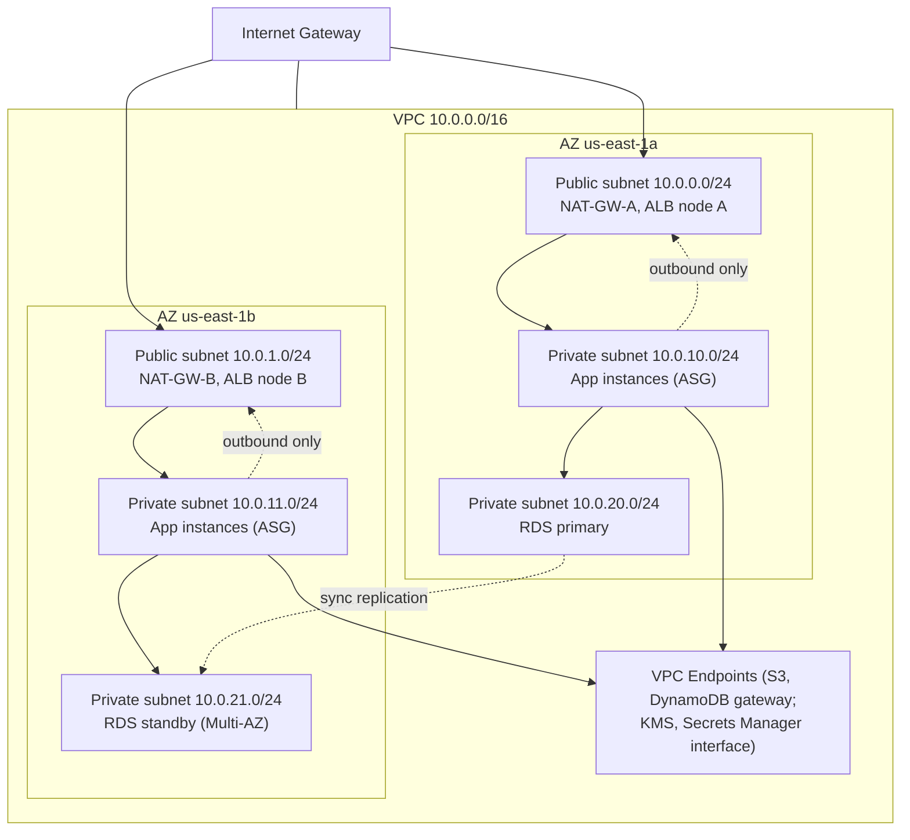
```mermaid
graph TB
    IGW[Internet Gateway] --- VPC
    subgraph VPC["VPC 10.0.0.0/16"]
        subgraph AZA["AZ us-east-1a"]
            PubA["Public subnet 10.0.0.0/24<br/>NAT-GW-A, ALB node A"]
            PrivA["Private subnet 10.0.10.0/24<br/>App instances (ASG)"]
            DataA["Private subnet 10.0.20.0/24<br/>RDS primary"]
        end
        subgraph AZB["AZ us-east-1b"]
            PubB["Public subnet 10.0.1.0/24<br/>NAT-GW-B, ALB node B"]
            PrivB["Private subnet 10.0.11.0/24<br/>App instances (ASG)"]
            DataB["Private subnet 10.0.21.0/24<br/>RDS standby (Multi-AZ)"]
        end
        EP["VPC Endpoints (S3, DynamoDB gateway;<br/>KMS, Secrets Manager interface)"]
    end
    IGW --> PubA
    IGW --> PubB
    PubA --> PrivA
    PubB --> PrivB
    PrivA -.->|outbound only| PubA
    PrivB -.->|outbound only| PubB
    PrivA --> EP
    PrivB --> EP
    PrivA --> DataA
    PrivB --> DataB
    DataA -. sync replication .-> DataB
```

**3.3 Deployment topology — cross-region DR posture**

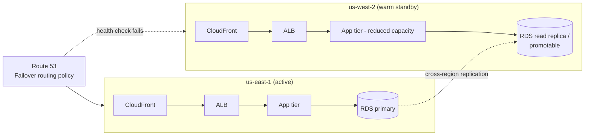
```mermaid
graph LR
    R53[Route 53<br/>Failover routing policy] --> Primary
    R53 -.->|health check fails| Secondary
    subgraph Primary["us-east-1 (active)"]
        CF1[CloudFront] --> ALB1[ALB] --> APP1[App tier] --> DB1[(RDS primary)]
    end
    subgraph Secondary["us-west-2 (warm standby)"]
        CF2[CloudFront] --> ALB2[ALB] --> APP2[App tier - reduced capacity] --> DB2[(RDS read replica /<br/>promotable)]
    end
    DB1 -. cross-region replication .-> DB2
```

**13. Low-Level Design**

```text
IHealthCheckProvider ──implements──> Route53HealthCheckAdapter
IFailoverPolicy ──implements──> PrimarySecondaryFailoverPolicy
RegionEndpoint { Name, IsPrimary, HealthCheckProvider }
FailoverRouter { List<RegionEndpoint>, IFailoverPolicy } → ResolveActiveEndpoint()
```

**13. Low-Level Design**

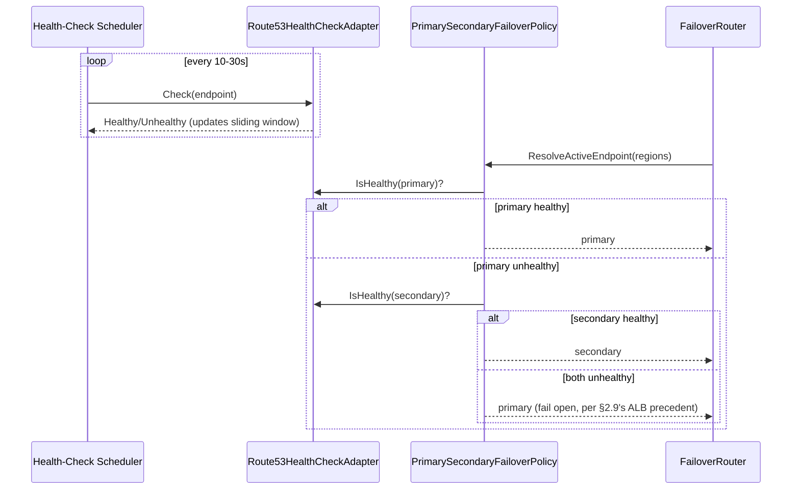
```mermaid
sequenceDiagram
    participant Clock as Health-Check Scheduler
    participant HC as Route53HealthCheckAdapter
    participant Policy as PrimarySecondaryFailoverPolicy
    participant Router as FailoverRouter

    loop every 10-30s
        Clock->>HC: Check(endpoint)
        HC-->>Clock: Healthy/Unhealthy (updates sliding window)
    end
    Router->>Policy: ResolveActiveEndpoint(regions)
    Policy->>HC: IsHealthy(primary)?
    alt primary healthy
        Policy-->>Router: primary
    else primary unhealthy
        Policy->>HC: IsHealthy(secondary)?
        alt secondary healthy
            Policy-->>Router: secondary
        else both unhealthy
            Policy-->>Router: primary (fail open, per §2.9's ALB precedent)
        end
    end
```

### Module 58 — AWS: IAM & Security — Roles, Policies, KMS, Secrets Manager & Cross-Account Access
*Source: `02-IAM-Security-KMS-SecretsManager.md`*

**How does it work — 30,000-ft view**

```text
Principal (IAM User / IAM Role / Federated Identity)
     │  makes an API call, SigV4-signs the request with temporary or long-lived credentials
     ▼
AWS STS / IAM Policy Evaluation Engine
     │  evaluates: Identity-based policies (attached to the principal)
     │           ∩ Resource-based policies (attached to the resource, if any)
     │           ∩ Permissions boundaries (if set)
     │           ∩ Service Control Policies (Organizations-level ceiling)
     │           ∩ Session policies (if assumed via AssumeRole with a session policy)
     │  → explicit Deny anywhere wins; otherwise needs an explicit Allow; default is implicit Deny
     ▼
Allowed → the underlying service (S3, DynamoDB, KMS, ...) executes the action
Denied  → AccessDenied, logged to CloudTrail either way
```

**AssumeRole / STS Flow (the mechanism behind every "role")**

```mermaid
sequenceDiagram
    participant App as .NET App (EC2/ECS/EKS/Lambda)
    participant Meta as Credential Source<br/>(Instance Metadata / Task Metadata / Pod Identity Agent)
    participant STS as AWS STS
    participant Svc as Target Service (S3 / DynamoDB / KMS)

    App->>Meta: Request credentials (AWS SDK default chain)
    Meta->>STS: AssumeRole (trust policy checked)
    STS-->>Meta: Temporary credentials (AccessKey, SecretKey, SessionToken, TTL)
    Meta-->>App: Cached temporary credentials
    App->>Svc: SigV4-signed API call using temp credentials
    Svc->>Svc: Evaluate identity policy ∩ resource policy ∩ SCP ∩ session policy
    Svc-->>App: Allow (200) or Deny (403 AccessDenied)
    Note over App,Svc: Credentials auto-refresh before TTL expiry;<br/>no long-lived secret ever touches disk
```

**Envelope Encryption (KMS)**

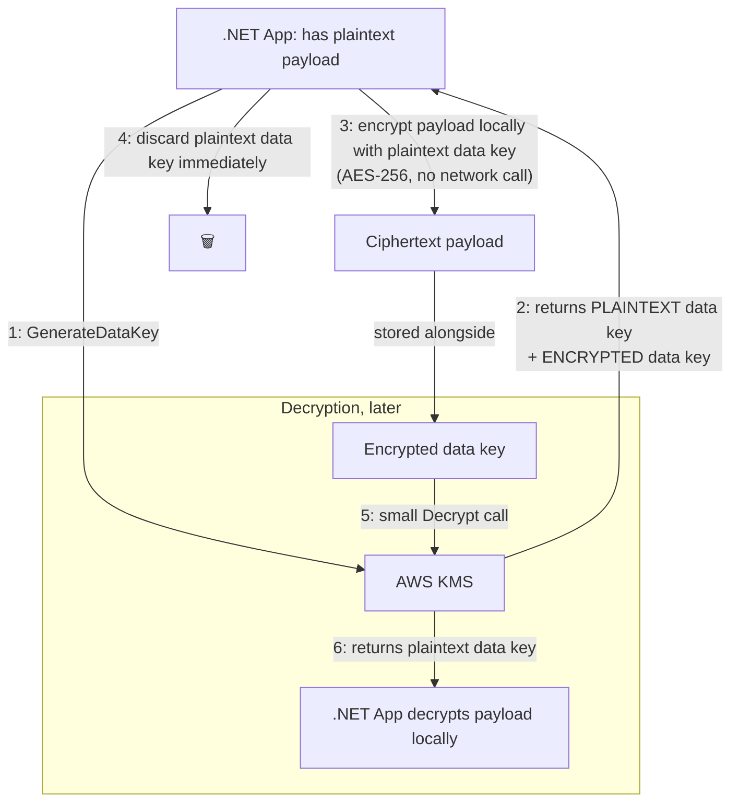
```mermaid
flowchart TB
    A[".NET App: has plaintext payload"] -->|"1: GenerateDataKey"| KMS["AWS KMS"]
    KMS -->|"2: returns PLAINTEXT data key<br/>+ ENCRYPTED data key"| A
    A -->|"3: encrypt payload locally with plaintext data key<br/>(AES-256, no network call)"| C["Ciphertext payload"]
    A -->|"4: discard plaintext data key immediately"| X["🗑"]
    C -->|"stored alongside"| E["Encrypted data key"]
    subgraph Later["Decryption, later"]
        E -->|"5: small Decrypt call"| KMS
        KMS -->|"6: returns plaintext data key"| D[".NET App decrypts payload locally"]
    end
```

**Full Security Architecture — Layered Defense**

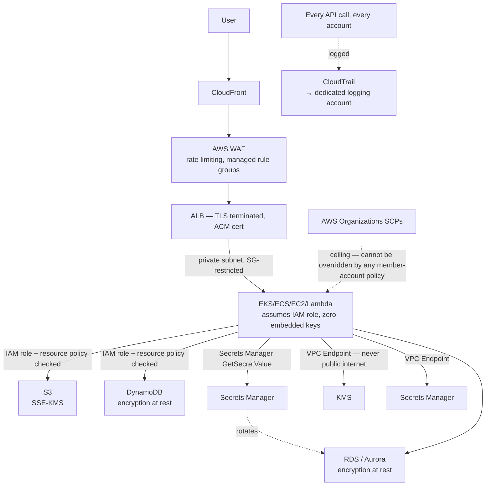
```mermaid
graph TB
    U[User] --> CF[CloudFront]
    CF --> WAF[AWS WAF<br/>rate limiting, managed rule groups]
    WAF --> ALB[ALB — TLS terminated, ACM cert]
    ALB -->|"private subnet, SG-restricted"| Compute["EKS/ECS/EC2/Lambda<br/>— assumes IAM role, zero embedded keys"]
    Compute -->|"IAM role + resource policy checked"| S3["S3<br/>SSE-KMS"]
    Compute -->|"IAM role + resource policy checked"| DDB["DynamoDB<br/>encryption at rest"]
    Compute -->|"Secrets Manager GetSecretValue"| SM["Secrets Manager"]
    SM -.->|"rotates"| RDS["RDS / Aurora<br/>encryption at rest"]
    Compute --> RDS
    Compute -->|"VPC Endpoint — never public internet"| KMSsvc["KMS"]
    Compute -->|"VPC Endpoint"| SMsvc["Secrets Manager"]
    All["Every API call, every account"] -.->|"logged"| CT["CloudTrail<br/>→ dedicated logging account"]
    Org["AWS Organizations SCPs"] -.->|"ceiling — cannot be overridden by any member-account policy"| Compute
```

**Step 2: Propose High-Level Design and Get Buy-In**

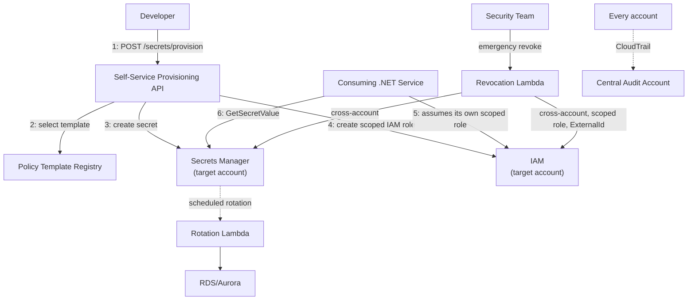
```mermaid
graph TB
    Dev[Developer] -->|"1: POST /secrets/provision"| API[Self-Service Provisioning API]
    API -->|"2: select template"| Reg[Policy Template Registry]
    API -->|"3: create secret"| SM["Secrets Manager<br/>(target account)"]
    API -->|"4: create scoped IAM role"| IAM["IAM<br/>(target account)"]
    SM -.->|"scheduled rotation"| RotLambda["Rotation Lambda"]
    RotLambda --> RDS["RDS/Aurora"]
    Svc["Consuming .NET Service"] -->|"5: assumes its own scoped role"| IAM
    Svc -->|"6: GetSecretValue"| SM
    Sec[Security Team] -->|"emergency revoke"| RevLambda["Revocation Lambda"]
    RevLambda -->|"cross-account, scoped role, ExternalId"| IAM
    RevLambda -->|"cross-account"| SM
    All[Every account] -.->|"CloudTrail"| Audit["Central Audit Account"]
```

**13. Low-Level Design — Multi-Tenant Credential-Isolation Service**

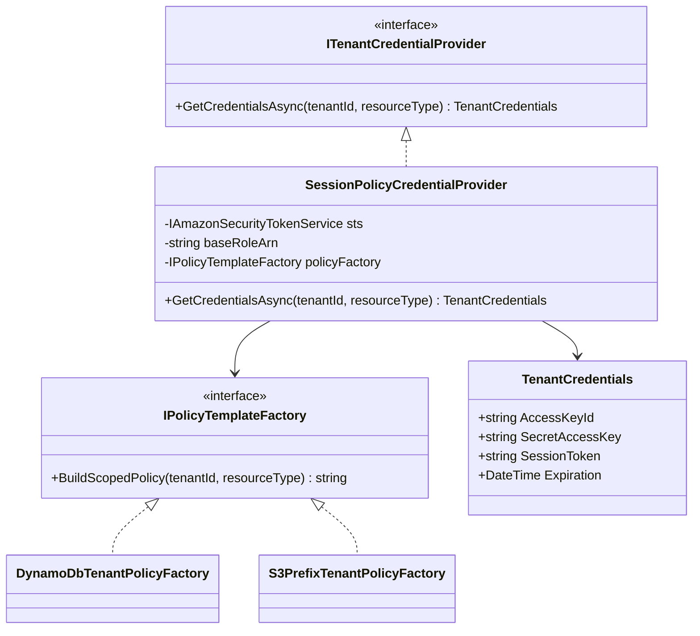
```mermaid
classDiagram
    class ITenantCredentialProvider {
        <<interface>>
        +GetCredentialsAsync(tenantId, resourceType) TenantCredentials
    }
    class SessionPolicyCredentialProvider {
        -IAmazonSecurityTokenService sts
        -string baseRoleArn
        -IPolicyTemplateFactory policyFactory
        +GetCredentialsAsync(tenantId, resourceType) TenantCredentials
    }
    class IPolicyTemplateFactory {
        <<interface>>
        +BuildScopedPolicy(tenantId, resourceType) string
    }
    class DynamoDbTenantPolicyFactory
    class S3PrefixTenantPolicyFactory
    class TenantCredentials {
        +string AccessKeyId
        +string SecretAccessKey
        +string SessionToken
        +DateTime Expiration
    }

    ITenantCredentialProvider <|.. SessionPolicyCredentialProvider
    SessionPolicyCredentialProvider --> IPolicyTemplateFactory
    IPolicyTemplateFactory <|.. DynamoDbTenantPolicyFactory
    IPolicyTemplateFactory <|.. S3PrefixTenantPolicyFactory
    SessionPolicyCredentialProvider --> TenantCredentials
```

**13. Low-Level Design — Multi-Tenant Credential-Isolation Service**

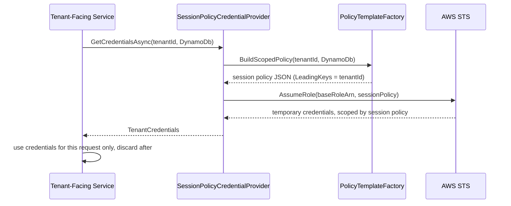
```mermaid
sequenceDiagram
    participant Svc as Tenant-Facing Service
    participant Provider as SessionPolicyCredentialProvider
    participant Factory as PolicyTemplateFactory
    participant STS as AWS STS

    Svc->>Provider: GetCredentialsAsync(tenantId, DynamoDb)
    Provider->>Factory: BuildScopedPolicy(tenantId, DynamoDb)
    Factory-->>Provider: session policy JSON (LeadingKeys = tenantId)
    Provider->>STS: AssumeRole(baseRoleArn, sessionPolicy)
    STS-->>Provider: temporary credentials, scoped by session policy
    Provider-->>Svc: TenantCredentials
    Svc->>Svc: use credentials for this request only, discard after
```

### Module 59 — AWS: Storage — S3 Storage Classes & Consistency, EBS, EFS & Durability Trade-offs
*Source: `03-Storage-S3-EBS-EFS.md`*

**Flow A — Static SPA Hosting**

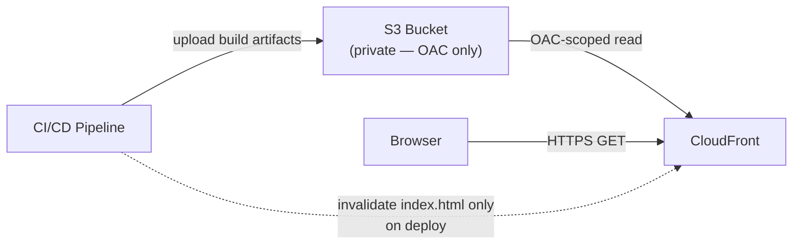
```mermaid
flowchart LR
    Dev["CI/CD Pipeline"] -->|"upload build artifacts"| S3A["S3 Bucket<br/>(private — OAC only)"]
    S3A -->|"OAC-scoped read"| CF["CloudFront"]
    User[Browser] -->|"HTTPS GET"| CF
    Dev -.->|"invalidate index.html only<br/>on deploy"| CF
```

**Flow B — Direct Browser Upload via Pre-Signed URL**

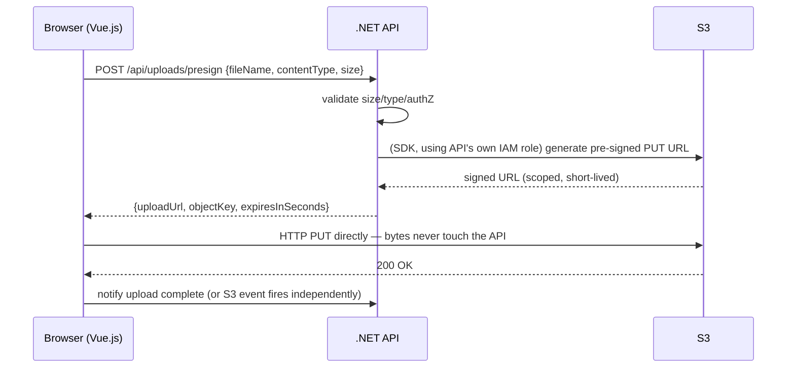
```mermaid
sequenceDiagram
    participant B as Browser (Vue.js)
    participant API as .NET API
    participant S3 as S3

    B->>API: POST /api/uploads/presign {fileName, contentType, size}
    API->>API: validate size/type/authZ
    API->>S3: (SDK, using API's own IAM role) generate pre-signed PUT URL
    S3-->>API: signed URL (scoped, short-lived)
    API-->>B: {uploadUrl, objectKey, expiresInSeconds}
    B->>S3: HTTP PUT directly — bytes never touch the API
    S3-->>B: 200 OK
    B->>API: notify upload complete (or S3 event fires independently)
```

**EBS AZ-Scoping — Why It Forces a Real Second Instance for Multi-AZ**

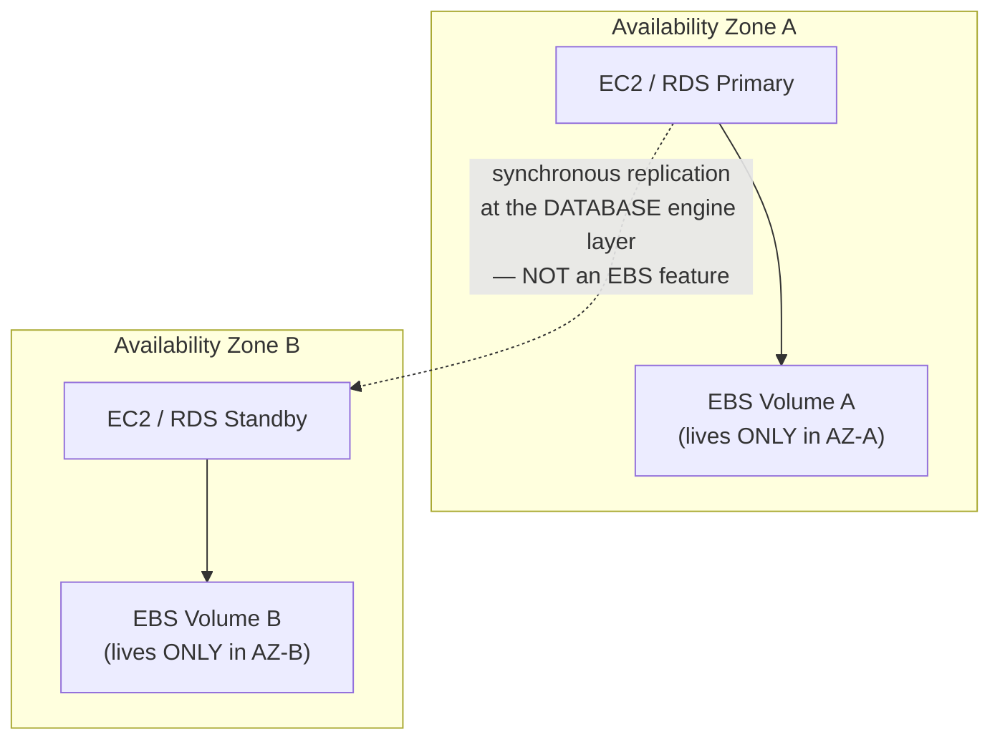
```mermaid
graph TB
    subgraph AZa["Availability Zone A"]
        EC2a["EC2 / RDS Primary"] --> EBSa["EBS Volume A<br/>(lives ONLY in AZ-A)"]
    end
    subgraph AZb["Availability Zone B"]
        EC2b["EC2 / RDS Standby"] --> EBSb["EBS Volume B<br/>(lives ONLY in AZ-B)"]
    end
    EC2a -.->|"synchronous replication<br/>at the DATABASE engine layer<br/>— NOT an EBS feature"| EC2b
```

**Step 2: Propose High-Level Design and Get Buy-In**

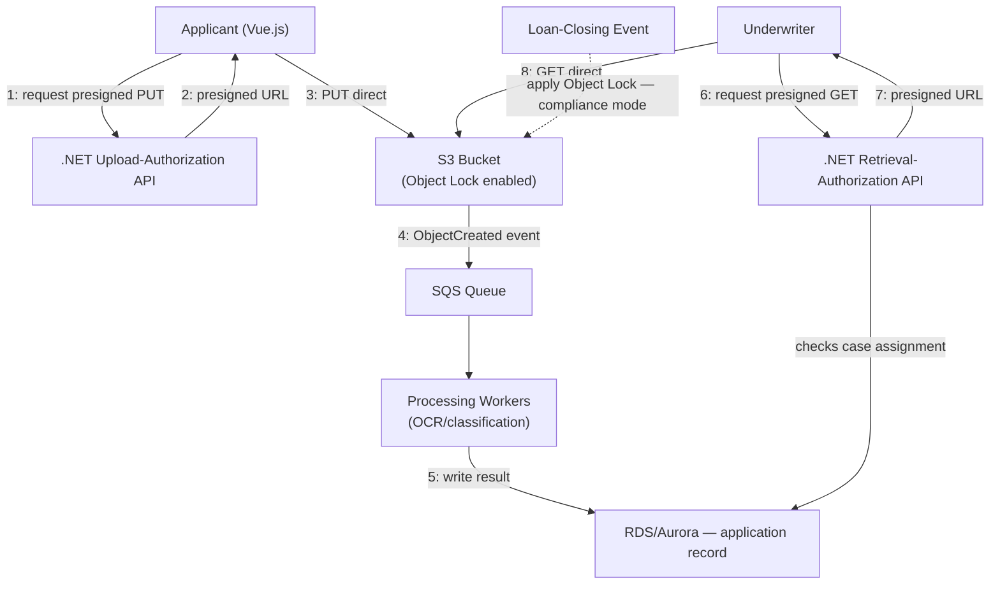
```mermaid
graph TB
    App["Applicant (Vue.js)"] -->|"1: request presigned PUT"| UpAPI[".NET Upload-Authorization API"]
    UpAPI -->|"2: presigned URL"| App
    App -->|"3: PUT direct"| S3["S3 Bucket<br/>(Object Lock enabled)"]
    S3 -->|"4: ObjectCreated event"| SQS["SQS Queue"]
    SQS --> Worker["Processing Workers<br/>(OCR/classification)"]
    Worker -->|"5: write result"| DB["RDS/Aurora — application record"]
    UW["Underwriter"] -->|"6: request presigned GET"| RetAPI[".NET Retrieval-Authorization API"]
    RetAPI -->|"checks case assignment"| DB
    RetAPI -->|"7: presigned URL"| UW
    UW -->|"8: GET direct"| S3
    Close["Loan-Closing Event"] -.->|"apply Object Lock — compliance mode"| S3
```

**13. Low-Level Design — Pre-Signed URL Issuance Service**

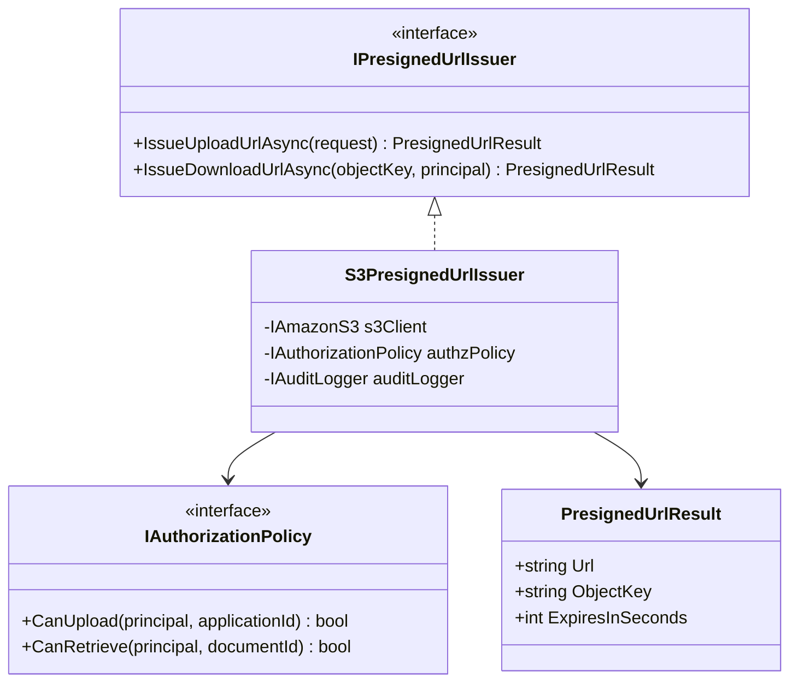
```mermaid
classDiagram
    class IPresignedUrlIssuer {
        <<interface>>
        +IssueUploadUrlAsync(request) PresignedUrlResult
        +IssueDownloadUrlAsync(objectKey, principal) PresignedUrlResult
    }
    class S3PresignedUrlIssuer {
        -IAmazonS3 s3Client
        -IAuthorizationPolicy authzPolicy
        -IAuditLogger auditLogger
    }
    class IAuthorizationPolicy {
        <<interface>>
        +CanUpload(principal, applicationId) bool
        +CanRetrieve(principal, documentId) bool
    }
    class PresignedUrlResult {
        +string Url
        +string ObjectKey
        +int ExpiresInSeconds
    }

    IPresignedUrlIssuer <|.. S3PresignedUrlIssuer
    S3PresignedUrlIssuer --> IAuthorizationPolicy
    S3PresignedUrlIssuer --> PresignedUrlResult
```

### Module 60 — AWS: Databases — RDS Multi-AZ & Read Replicas, Aurora Internals & DynamoDB Integration
*Source: `04-Databases-RDS-Aurora-DynamoDB.md`*

**3.1 SQL Server on RDS — Multi-AZ Topology and the Connectivity Path**

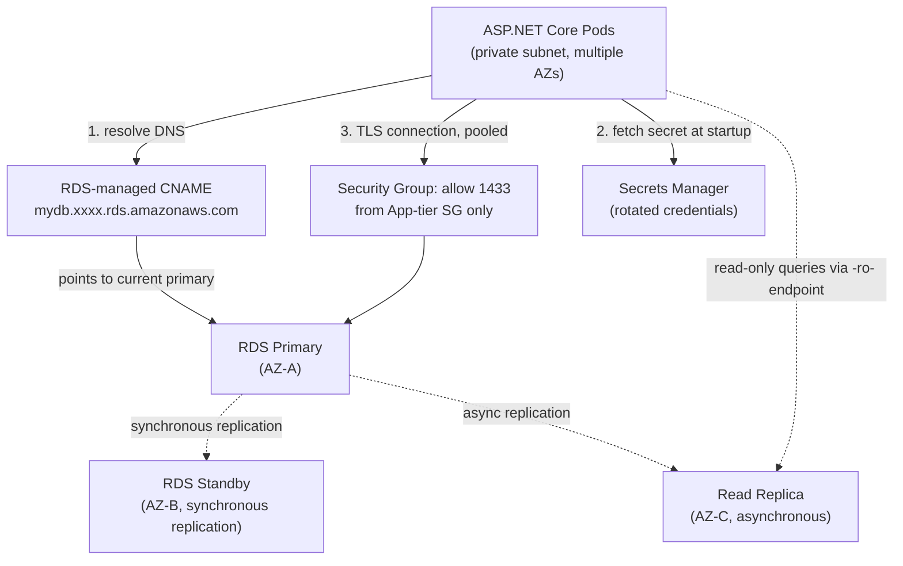
```mermaid
graph TB
    App["ASP.NET Core Pods<br/>(private subnet, multiple AZs)"]
    SG["Security Group: allow 1433<br/>from App-tier SG only"]
    Primary["RDS Primary<br/>(AZ-A)"]
    Standby["RDS Standby<br/>(AZ-B, synchronous replication)"]
    Replica["Read Replica<br/>(AZ-C, asynchronous)"]
    DNS["RDS-managed CNAME<br/>mydb.xxxx.rds.amazonaws.com"]
    SM["Secrets Manager<br/>(rotated credentials)"]

    App -->|"1. resolve DNS"| DNS
    DNS -->|"points to current primary"| Primary
    App -->|"2. fetch secret at startup"| SM
    App -->|"3. TLS connection, pooled"| SG
    SG --> Primary
    Primary -.->|"synchronous replication"| Standby
    Primary -.->|"async replication"| Replica
    App -.->|"read-only queries via -ro- endpoint"| Replica
```

**3.2 Failover Sequence — What the Application Actually Observes**

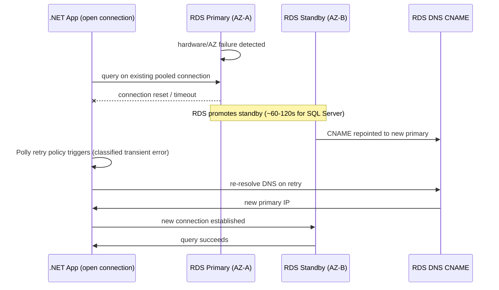
```mermaid
sequenceDiagram
    participant App as .NET App (open connection)
    participant Primary as RDS Primary (AZ-A)
    participant Standby as RDS Standby (AZ-B)
    participant DNS as RDS DNS CNAME

    Primary->>Primary: hardware/AZ failure detected
    App->>Primary: query on existing pooled connection
    Primary--xApp: connection reset / timeout
    Note over Primary,Standby: RDS promotes standby (~60-120s for SQL Server)
    Standby->>DNS: CNAME repointed to new primary
    App->>App: Polly retry policy triggers (classified transient error)
    App->>DNS: re-resolve DNS on retry
    DNS->>App: new primary IP
    App->>Standby: new connection established
    Standby->>App: query succeeds
```

**3.3 Aurora Storage-Layer Replication (Why Failover Is Faster)**

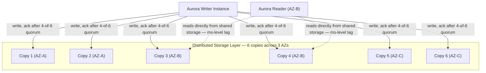
```mermaid
graph TB
    Writer["Aurora Writer Instance"]
    R1["Aurora Reader (AZ-B)"]
    subgraph "Distributed Storage Layer — 6 copies across 3 AZs"
        S1["Copy 1 (AZ-A)"]
        S2["Copy 2 (AZ-A)"]
        S3["Copy 3 (AZ-B)"]
        S4["Copy 4 (AZ-B)"]
        S5["Copy 5 (AZ-C)"]
        S6["Copy 6 (AZ-C)"]
    end
    Writer -->|"write, ack after 4-of-6 quorum"| S1 & S2 & S3 & S4 & S5 & S6
    R1 -.->|"reads directly from shared storage — ms-level lag"| S3 & S4
```

**3.4 ElastiCache Cache-Aside Flow**

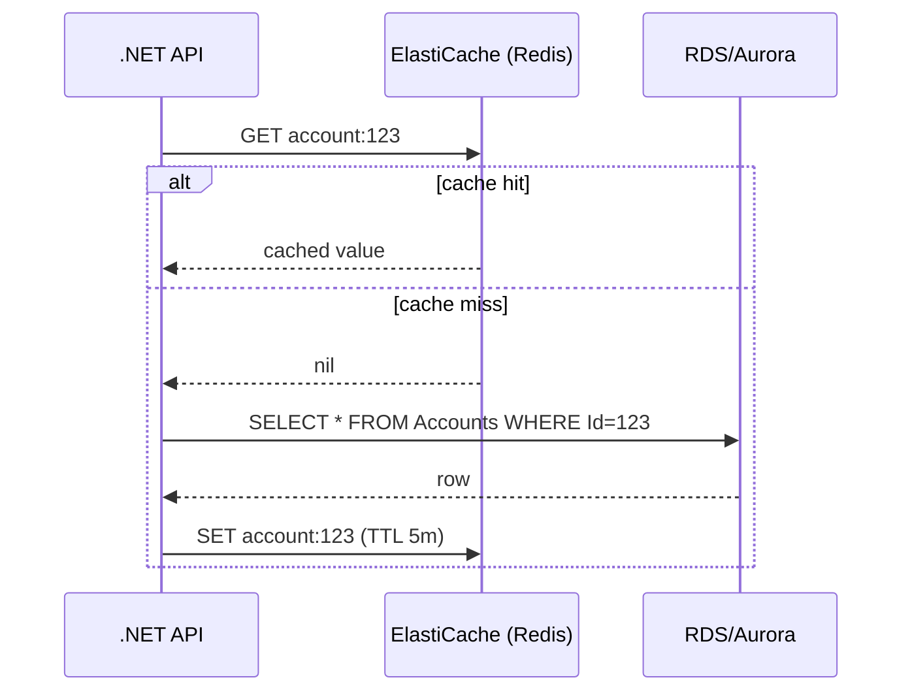
```mermaid
sequenceDiagram
    participant App as .NET API
    participant Cache as ElastiCache (Redis)
    participant DB as RDS/Aurora

    App->>Cache: GET account:123
    alt cache hit
        Cache-->>App: cached value
    else cache miss
        Cache-->>App: nil
        App->>DB: SELECT * FROM Accounts WHERE Id=123
        DB-->>App: row
        App->>Cache: SET account:123 (TTL 5m)
    end
```

### Module 61 — AWS: Serverless — Lambda Cold Starts & Concurrency, API Gateway & Step Functions
*Source: `05-Serverless-Lambda-APIGateway-StepFunctions.md`*

**Lambda Cold Start vs. Warm Start — the Init/Invoke Boundary**

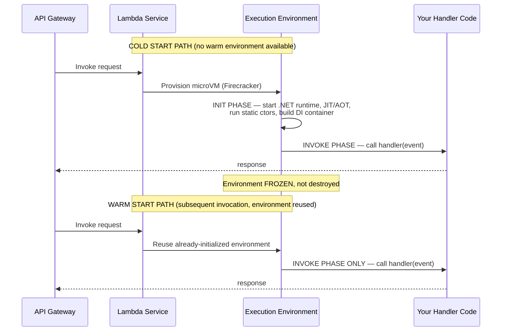
```mermaid
sequenceDiagram
    participant APIGW as API Gateway
    participant Lambda as Lambda Service
    participant Env as Execution Environment
    participant Handler as Your Handler Code

    Note over Lambda,Env: COLD START PATH (no warm environment available)
    APIGW->>Lambda: Invoke request
    Lambda->>Env: Provision microVM (Firecracker)
    Env->>Env: INIT PHASE — start .NET runtime, JIT/AOT,<br/>run static ctors, build DI container
    Env->>Handler: INVOKE PHASE — call handler(event)
    Handler-->>APIGW: response
    Note over Env: Environment FROZEN, not destroyed

    Note over Lambda,Env: WARM START PATH (subsequent invocation, environment reused)
    APIGW->>Lambda: Invoke request
    Lambda->>Env: Reuse already-initialized environment
    Env->>Handler: INVOKE PHASE ONLY — call handler(event)
    Handler-->>APIGW: response
```

**API Gateway → Lambda → RDS Proxy → RDS — Connection Fan-In**

```mermaid
graph TB
    Client[Client] --> APIGW[API Gateway<br/>HTTP API]
    APIGW -->|"proxy integration"| L1[Lambda Env 1]
    APIGW --> L2[Lambda Env 2]
    APIGW --> L3["Lambda Env N<br/>(up to concurrency limit)"]
    L1 --> Proxy[RDS Proxy<br/>small warm connection pool]
    L2 --> Proxy
    L3 --> Proxy
    Proxy -->|"few, reused,<br/>multiplexed connections"| RDS[(RDS SQL Server<br/>max_connections ceiling)]
```

**Step Functions Order-Processing Saga (Happy Path + Compensation)**

```mermaid
graph TB
    Start([Start]) --> Validate[ValidateOrder]
    Validate --> Charge[ChargePayment]
    Charge -->|success| Reserve[ReserveInventory]
    Charge -->|Catch: fail| Failed1[Failed — nothing to compensate]
    Reserve -->|success| Ship[ArrangeShipping]
    Reserve -->|Catch: fail| RefundP[RefundPayment<br/>compensating action]
    Ship -->|success| Notify[SendNotification]
    Ship -->|Catch: fail| ReleaseAndRefund[ReleaseInventory + RefundPayment<br/>compensating actions, in reverse order]
    Notify --> Success([Success])
    RefundP --> Failed2([Failed])
    ReleaseAndRefund --> Failed3([Failed])
```

**Step 2: Propose High-Level Design and Get Buy-In**

```mermaid
graph LR
    Storefront[Storefront Backend] --> APIGW[API Gateway HTTP API]
    APIGW --> Intake[Order-Intake Lambda]
    Intake --> SFN[Step Functions<br/>Standard Workflow]
    Intake --> OrdersTable[(DynamoDB Orders Table<br/>status projection)]
    SFN --> ChargeFn[ChargePayment Lambda]
    SFN --> ReserveFn[ReserveInventory Lambda]
    SFN --> ShipFn[ArrangeShipping Lambda]
    SFN --> NotifyFn[SendNotification Lambda]
    SFN -.->|"high-value orders"| ReviewWait["WaitForFraudReview<br/>(task token)"]
    ReviewWait -.-> FraudTool[Internal Fraud-Review Tool]
    ChargeFn --> OrdersTable
    ReserveFn --> OrdersTable
    ShipFn --> OrdersTable
    NotifyFn --> SES[Amazon SES]
```

### Module 62 — AWS: Messaging & Event-Driven Architecture — SQS, SNS, EventBridge & Kinesis
*Source: `06-Messaging-SQS-SNS-EventBridge-Kinesis.md`*

**SQS Standard Queue — Visibility Timeout Mechanics**

```mermaid
sequenceDiagram
    participant P as Producer
    participant Q as SQS Queue
    participant C as Consumer

    P->>Q: SendMessage
    C->>Q: ReceiveMessage
    Q-->>C: message (now INVISIBLE to other consumers)
    Note over Q: Visibility timeout window starts

    alt Consumer finishes in time
        C->>Q: DeleteMessage
        Note over Q: Message permanently removed
    else Consumer crashes or times out
        Note over Q: Visibility timeout expires
        Q->>Q: Message becomes VISIBLE again
        Note over Q: Redelivered to next ReceiveMessage call
    end
```

**SNS Fan-Out to Per-Team SQS Queues**

```mermaid
graph LR
    Producer[Order Service] -->|Publish| Topic[SNS Topic:<br/>OrderCreated]
    Topic --> PayQ[SQS: PaymentQueue]
    Topic --> InvQ[SQS: InventoryQueue]
    Topic --> AnalyticsQ[SQS: AnalyticsQueue]
    PayQ --> PayConsumer[Payment Service]
    InvQ --> InvConsumer[Inventory Service]
    AnalyticsQ --> AnalyticsConsumer[Analytics Service]
```

**Kinesis Shards, Partition Keys, and Ordering**

```mermaid
graph TB
    P1[Producer] -->|"PutRecord(key=CustomerA)"| Hash{Hash Partition Key}
    P2[Producer] -->|"PutRecord(key=CustomerB)"| Hash
    Hash -->|hash range 1| S1["Shard 1<br/>(ordered within shard)"]
    Hash -->|hash range 2| S2["Shard 2<br/>(ordered within shard)"]
    S1 --> KCL1[Consumer App 1 — KCL]
    S2 --> KCL1
    S1 --> KCL2["Consumer App 2 — KCL<br/>(independent, replayable position)"]
    S2 --> KCL2
```

**Outbox Pattern — Atomic DB Write + Reliable Publish**

```mermaid
sequenceDiagram
    participant App as Order Service
    participant DB as SQL Server (RDS)
    participant Outbox as Outbox Table
    participant Poller as Outbox Poller
    participant SNS as SNS Topic

    App->>DB: BEGIN TRANSACTION
    App->>DB: INSERT Orders row
    App->>Outbox: INSERT OutboxMessage row
    App->>DB: COMMIT (atomic — both rows or neither)

    loop Poll cycle
        Poller->>Outbox: SELECT unpublished messages
        Poller->>SNS: Publish
        SNS-->>Poller: success
        Poller->>Outbox: mark PublishedAt
    end
```

**Step 2: Propose High-Level Design and Get Buy-In**

```mermaid
graph TB
    Sources[Order/Payment/Shipping Services] -->|Publish with channel attrs| Topic[SNS Topic: DomainEvents]
    Topic -->|filter: channels contains email| EmailQ[SQS EmailQueue]
    Topic -->|filter: channels contains sms| SmsQ[SQS SmsQueue]
    Topic -->|filter: channels contains push| PushQ[SQS PushQueue]
    EmailQ --> EmailWorker[Email Worker] --> SES[Amazon SES]
    SmsQ --> SmsWorker["SMS Worker<br/>(rate-limited consumer)"] --> SmsProvider[SMS Gateway]
    PushQ --> PushWorker[Push Worker] --> APNs/FCM[APNs / FCM]
    EmailWorker --> History[(DynamoDB NotificationHistory)]
    SmsWorker --> History
    PushWorker --> History
```

### Module 63 — AWS: Containers & Microservices — ECS, EKS, Fargate, App Mesh & Service Discovery
*Source: `07-Containers-Microservices-ECS-EKS-Fargate.md`*

**End-to-end request flow: User → Route 53 → CloudFront → ALB → EKS Ingress → Service → Pod → .NET API → RDS**

```mermaid
sequenceDiagram
    participant U as User Browser
    participant R53 as Route 53
    participant CF as CloudFront
    participant ALB as ALB (via AWS LB Controller)
    participant SVC as K8s Service (ClusterIP)
    participant POD as Pod (.NET API, IP-mode target)
    participant RDS as RDS SQL Server (private subnet)

    U->>R53: DNS query api.example.com
    R53-->>U: CloudFront distribution domain (CNAME/ALIAS)
    U->>CF: HTTPS request (TLS terminated at edge, ACM cert)
    CF->>ALB: Forward to origin (re-encrypted TLS, ALB's own ACM cert)
    Note over ALB: Ingress object reconciled into this ALB<br/>by the AWS Load Balancer Controller
    ALB->>POD: IP-mode target — traffic sent DIRECTLY to Pod IP:port<br/>(no kube-proxy hop; readiness-probe-gated)
    Note over POD: ASP.NET Core middleware pipeline:<br/>AuthN (JWT) → AuthZ → Controller
    POD->>RDS: EF Core query over TLS, port 1433,<br/>via IRSA-scoped Secrets Manager credential
    RDS-->>POD: Result set
    POD-->>ALB: 200 OK + JSON
    ALB-->>CF: Response
    CF-->>U: Response (cached per Cache-Control if applicable)
```

**Component topology — namespace, node groups, and the two IAM-scoped fan-out paths**

```mermaid
graph TB
    subgraph "EKS Cluster (control plane — AWS managed, 3 AZs)"
        ING[Ingress: AWS LB Controller]
        subgraph "Namespace: order-service"
            SVC1[Service: order-api]
            POD1[Pod: order-api<br/>ServiceAccount → IRSA/Pod Identity role]
        end
    end
    ING --> SVC1 --> POD1
    POD1 -->|"SG rule: port 1433, IAM: rds-db:connect"| RDS[(RDS SQL Server<br/>private subnet)]
    POD1 -->|"SG rule: port 6379"| REDIS[(ElastiCache Redis)]
    POD1 -->|"VPC Gateway Endpoint, IAM: s3:GetObject"| S3[(S3 bucket)]
    POD1 -->|"VPC Interface Endpoint, IAM: sqs:SendMessage"| SQS[SQS Queue]
    SQS --> POD2[Pod: fulfillment-service<br/>separate ServiceAccount/role]
    POD1 -->|"IAM: sns:Publish"| SNS[SNS Topic]
    SNS --> POD3[Pod: notification-service]
```

**ECS task/service topology (Fargate launch type)**

```mermaid
graph LR
    ALB2[ALB] --> TG[Target Group]
    TG --> T1[ECS Task 1<br/>Fargate microVM]
    TG --> T2[ECS Task 2<br/>Fargate microVM]
    T1 -.->|"Cloud Map DNS: order.internal"| T3[ECS Task: fulfillment<br/>separate Service]
    CW[CloudWatch] -.->|metrics/logs| T1
    CW -.-> T2
    ECR[(ECR Repository)] -.->|"image pull, execution role"| T1
    ECR -.-> T2
```

**CI/CD containerization pipeline**

```mermaid
graph LR
    DEV[Developer] --> GIT[Git PR/merge]
    GIT --> CI[CI: build+test]
    CI --> DOCKER[docker build<br/>multi-stage]
    DOCKER --> ECRPUSH[Push to ECR<br/>tag = git SHA]
    ECRPUSH --> SCAN{Image scan<br/>Critical/High CVE?}
    SCAN -->|fail| BLOCK[Block promotion]
    SCAN -->|pass| CD[CD: update Service/Deployment<br/>to new image tag]
    CD --> STRATEGY{Deployment strategy}
    STRATEGY -->|rolling| ROLL[Native rolling update]
    STRATEGY -->|canary| ARGO[Argo Rollouts:<br/>weighted shift + auto-rollback]
```

**Step 4 — Wrap-Up**

```mermaid
graph TB
    R53[Route 53] --> ALBGEN[ALB — general cluster]
    R53 --> ALBPCI[ALB — pci cluster]
    ALBGEN --> GENSVC[ECS Fargate Services<br/>rolling deploy]
    ALBPCI --> PCISVC[ECS Fargate Services<br/>CodeDeploy blue/green]
    GENSVC --> GENRDS[(RDS — general)]
    PCISVC --> PCIRDS[(RDS — PCI, isolated subnet)]
    CB[CodeBuild] --> ECRR[(ECR + enhanced scan gate)]
    ECRR --> GENSVC
    ECRR --> PCISVC
```

**13. Low-Level Design — Canary Deployment Controller Decision Logic**

```mermaid
sequenceDiagram
    participant Ctrl as CanaryController
    participant Metrics as IMetricsProvider
    participant Strat as ICanaryDecisionStrategy
    participant Argo as Argo Rollouts (traffic control)

    loop every evaluation window
        Ctrl->>Metrics: GetErrorRate/P99(stable), GetErrorRate/P99(canary)
        Metrics-->>Ctrl: metric samples
        Ctrl->>Strat: Evaluate(stable, canary)
        Strat-->>Ctrl: Decision (Promote/Hold/Rollback)
        alt Rollback, N consecutive bad windows reached
            Ctrl->>Argo: Abort rollout, shift 100% to stable
        else Promote, all windows passed
            Ctrl->>Argo: Shift traffic to next canary step
        else Hold
            Ctrl->>Ctrl: wait, re-evaluate next window
        end
    end
```

### Module 64 — AWS: Observability, Cost & the Well-Architected Framework — CloudWatch, X-Ray & Multi-Region DR
*Source: `08-Observability-Cost-WellArchitectedFramework.md`*

**2.5 CloudFormation — Infrastructure as Versioned, Reviewable Text**

```mermaid
graph TB
    CFN[CloudFormation Stack] --> VPC[VPC + Subnets]
    CFN --> SG[Security Groups]
    CFN --> ALB[Application Load Balancer]
    CFN --> EKS[EKS Cluster / ECS Service]
    CFN --> RDS[RDS Instance]
    CFN --> S3B[S3 Buckets]
    CFN --> IAMR[IAM Roles/Policies]
    VPC --> SG
    SG --> ALB
    VPC --> EKS
    VPC --> RDS
    IAMR --> EKS
    IAMR --> RDS
```

**Observability Data Flow**

```mermaid
graph LR
    App[".NET App<br/>(EKS/ECS/Lambda)"] -->|structured logs, stdout| FluentBit[Fluent Bit / CW Agent]
    App -->|OTel traces| ADOT[ADOT Collector]
    FluentBit --> CWL[CloudWatch Logs]
    ADOT --> XRay[X-Ray]
    CWL -->|EMF extraction| CWM[CloudWatch Metrics]
    CWM --> Alarms[CloudWatch Alarms]
    CWL --> Insights[Logs Insights queries]
    XRay --> ServiceMap[Service Map]
    Alarms --> SNS_Notify[SNS → PagerDuty/Slack]
    APICalls[Every AWS API call] --> CloudTrail
    CloudTrail --> S3Archive[S3 — immutable, log-file-validated]
    CloudTrail --> CWL
```

**CloudFormation Stack Composition**

```mermaid
graph TB
    subgraph "Network Stack (exports VpcId, SubnetIds, SgIds)"
        VPC2[VPC + Public/Private Subnets]
    end
    subgraph "Data Stack (imports network, exports DbEndpoint)"
        RDS2[RDS SQL Server Multi-AZ]
        Cache2[ElastiCache Redis]
    end
    subgraph "App Stack (imports network + data exports)"
        EKS2[EKS Cluster]
        ALB2[ALB]
    end
    VPC2 -.export/import.-> RDS2
    VPC2 -.export/import.-> EKS2
    RDS2 -.export/import.-> EKS2
```

**The Complete Reference Architecture**

```mermaid
graph TB
    User((User)) --> R53[Route 53]
    R53 --> CF[CloudFront]
    CF --> WAF[AWS WAF]
    WAF --> APIGW[API Gateway]
    APIGW --> ALB3[ALB]
    ALB3 --> EKS3["EKS — .NET Microservices"]
    EKS3 --> RDS3[RDS SQL Server<br/>Multi-AZ]
    EKS3 --> Cache3[ElastiCache Redis]
    EKS3 --> SQS3[SQS]
    SQS3 --> Lambda3[Lambda — async processors]
    Lambda3 --> S3_3[S3]
    EKS3 -.notifications.-> SNS3[SNS]
    EKS3 -.long-running workflows.-> SF3[Step Functions]
    EKS3 -.IAM/KMS.-> Sec3["IAM Roles + KMS<br/>(every arrow above is IAM-scoped and encrypted in transit/at rest)"]
    EKS3 -.emits.-> Obs3["CloudWatch + X-Ray + CloudTrail<br/>(this module)"]
    CFN3[CloudFormation] -.provisions everything above.-> EKS3
    ECR3[ECR] --> EKS3

    style Sec3 fill:#333,color:#fff
    style Obs3 fill:#333,color:#fff
```

**Flagship 1 — Payment Platform**

```mermaid
graph LR
    Client --> API[Payment API]
    API --> IdemStore[(DynamoDB<br/>Idempotency Store)]
    API --> SF[Step Functions<br/>Payment Orchestrator]
    SF --> Adapter[Processor Adapter<br/>Lambda]
    Adapter --> External[External Processor<br/>Stripe/Adyen]
    SF --> Ledger[(Aurora PostgreSQL<br/>Ledger — append-only)]
    Ledger --> SNS4[SNS: PaymentSucceeded/Failed]
    SNS4 --> Downstream[Order Fulfillment, Notifications]
```
