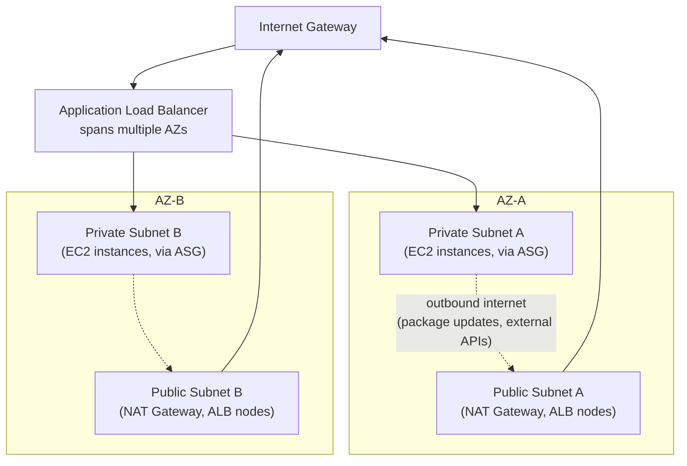
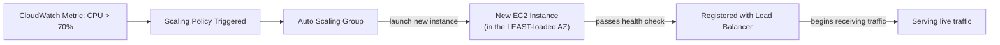

# Module 57 — AWS: Compute & Networking Fundamentals — EC2, VPC, Load Balancing & Auto Scaling

> Domain: AWS | Level: Beginner → Expert | Prerequisite: [[../14-System-Design/01-System-Design-Fundamentals]] §2 (load balancing/scalability building blocks, now expressed via concrete AWS services), [[../17-Microservices/02-Resilience-Observability-Sidecar-Patterns]] (resilience patterns, now applied at the infrastructure layer)

---

## 1. Fundamentals

### Why does a Principal Engineer need AWS networking/compute depth beyond "know how to launch an EC2 instance"?
Nearly every architectural decision this course has covered so far (service decomposition, resilience patterns, data replication, event-driven messaging) ultimately runs on top of concrete cloud infrastructure, and the specific way that infrastructure is networked and provisioned determines real failure modes, security boundaries, and cost structures that abstract architecture diagrams don't capture — a VPC's subnet design directly determines blast radius during a security incident; an Auto Scaling Group's configuration directly determines whether a traffic spike is absorbed gracefully or causes a cascading outage; a Load Balancer's health-check configuration directly determines whether a genuinely unhealthy instance is removed from rotation before it damages user experience.

### Why does this matter?
Because a Principal Engineer is expected to make and defend concrete infrastructure design decisions (VPC topology, subnet segmentation, load-balancer type, Auto Scaling policy) with the same rigor this course has applied to application-level architecture — these decisions have long-lived, expensive-to-reverse consequences (Module 49's "hard to reverse" risk category applies directly to foundational network topology decisions made early in a system's life).

### When does this matter?
Any system deployed on AWS — understanding these fundamentals is the prerequisite for correctly reasoning about every subsequent AWS-specific topic (IAM, security groups, the later dedicated Security/IAM modules) and for diagnosing real production incidents involving networking, scaling, or availability.

### How does it work (30,000-ft view)?
```
VPC: your own isolated virtual network within AWS, divided into Subnets (public: has a route to
     an Internet Gateway; private: does not) across multiple Availability Zones (AZs) for resilience
EC2: virtual machines (instances), the fundamental compute building block, launched INTO a subnet
Load Balancer: distributes traffic across multiple EC2 instances (or other targets) across AZs,
     with health checks removing unhealthy targets from rotation automatically
Auto Scaling Group (ASG): automatically adds/removes EC2 instances based on demand (metrics-driven
     scaling policies), always spanning multiple AZs for resilience
```

---

## 2. Deep Dive

### 2.1 VPC and Subnets — the Foundational Network Boundary
A Virtual Private Cloud (VPC) is a logically isolated network within AWS, with its own IP address range (CIDR block) — every other resource (EC2 instances, load balancers, databases) is launched **within** a VPC, and the VPC's subnet structure is the primary mechanism for network-level security segmentation. A **public subnet** has a route table entry directing internet-bound traffic to an **Internet Gateway**, allowing resources within it to be directly reachable from (and reach) the public internet; a **private subnet** has no such route, meaning resources within it cannot be directly reached from the internet and can only reach the internet outbound (if needed, for package updates or external API calls) via a **NAT Gateway** sitting in a public subnet — this public/private subnet split is the foundational implementation of the principle "only expose what genuinely needs to be internet-facing" (directly Module 28's security-domain least-privilege principle, later dedicated module, applied at the network-topology level).

### 2.2 Availability Zones and Multi-AZ Design — the Foundational Resilience Unit
An AWS Region contains multiple physically-separate **Availability Zones (AZs)** — independent data centers with their own power, cooling, and networking, connected via low-latency links, but engineered to fail independently of one another (an AZ-level outage — a power failure, a fire — should not affect other AZs in the same Region). Every resilient AWS architecture spans **at least two AZs** (subnets are created per-AZ, so a VPC's public/private subnet pairs are typically replicated across each AZ used), because a single-AZ deployment inherits that AZ's entire failure domain as the whole system's availability ceiling — directly Module 37's redundancy-eliminates-single-points-of-failure principle, now expressed as AWS's specific, concrete unit of independent failure.

### 2.3 EC2 — the Fundamental Compute Building Block, and Its Boundaries
An EC2 instance is a virtual machine launched into a specific subnet (and therefore a specific AZ), with a chosen instance type (determining vCPU/memory/network performance characteristics) — critically, an EC2 instance is inherently a **single point of failure on its own**: it can be terminated by a hardware failure, and even AWS's own instance-level SLA doesn't guarantee any single instance's continuous availability, meaning any production workload with an actual availability requirement must run **multiple** instances across **multiple AZs**, never depend on a single instance's uptime — the direct, concrete reason Load Balancers and Auto Scaling Groups (§2.4, §2.5) are not optional conveniences but foundational requirements for any real production EC2-based workload.

### 2.4 Load Balancers — Distributing Traffic and Enforcing Health
An Application Load Balancer (ALB, operating at Layer 7/HTTP) or Network Load Balancer (NLB, operating at Layer 4/TCP, for extreme throughput or non-HTTP protocols) distributes incoming traffic across a registered set of targets (EC2 instances, or other compute targets) spanning multiple AZs, and — critically — performs **health checks** against each target, automatically removing an unhealthy target from rotation until it passes health checks again. The health-check configuration (the specific endpoint checked, the failure threshold before marking unhealthy, the check interval) directly determines how quickly a genuinely failing instance is removed from serving live traffic — a too-lenient health check (checking only "is the process running," not "can this instance actually serve a real request correctly") can leave a degraded-but-technically-alive instance serving broken responses to users for longer than necessary, directly Module 14's health-check-design discipline (liveness vs. readiness distinction) now expressed at the AWS load-balancer configuration layer.

### 2.5 Auto Scaling Groups — Elastic Capacity Matched to Demand
An Auto Scaling Group (ASG) maintains a desired number of EC2 instances (within a configured minimum/maximum range), automatically launching new instances when a scaling policy's trigger condition is met (a CPU-utilization threshold, a custom CloudWatch metric, a scheduled time-based policy) and terminating instances when demand decreases — always launching new instances across the ASG's configured AZs to maintain multi-AZ resilience automatically as it scales. This directly implements Module 37 §9's elastic-scaling principle concretely: rather than provisioning for peak load permanently (wasteful, expensive) or provisioning only for average load (causing outages during spikes), an ASG matches actual running capacity to actual, current demand — but the scaling policy's **responsiveness** (how quickly it reacts to a demand spike, and how long a newly-launched instance takes to become healthy and start serving traffic) must be tuned against the workload's actual traffic-spike characteristics, since a slow-to-react ASG facing a sudden, sharp spike can still experience a period of overload before new capacity comes online.

### 2.6 Security Groups — Stateful, Instance-Level Firewalls
A Security Group acts as a virtual, stateful firewall attached to an EC2 instance (or other resource), controlling inbound and outbound traffic via allow-list rules (there is no explicit "deny" rule type — everything not explicitly allowed is implicitly denied) — "stateful" meaning a security group automatically allows return traffic for an already-permitted inbound/outbound connection without needing a separate explicit rule for the response direction. This is the instance-level complement to the VPC/subnet-level network segmentation (§2.1) — a defense-in-depth layer directly analogous to Module 50 §8's sidecar-enforced mTLS discussion: network topology alone (which subnet an instance sits in) shouldn't be the only access-control mechanism, since a security group provides a second, independently-configured, instance-specific layer of enforcement.

## 3. Visual Architecture

### Multi-AZ VPC Topology


### Auto Scaling Group Reacting to Demand


## 4. Production Example
**Scenario**: An e-commerce platform's checkout service ran on an Auto Scaling Group with a CPU-utilization-based scaling policy (scale out when average CPU exceeds 70%), fronted by an Application Load Balancer with a health check hitting a lightweight `/health` endpoint that simply confirmed the process was running and could accept connections, without checking any actual downstream dependency (database connectivity, payment-gateway reachability). During a flash-sale event, traffic surged dramatically within a two-minute window — the ASG's scaling policy correctly triggered and began launching new instances, but each new instance took approximately 90 seconds to complete its application startup (JIT warm-up, connection-pool initialization, cache pre-loading) before it could actually serve requests correctly, even though it began passing the lightweight health check (and therefore began receiving live traffic from the load balancer) almost immediately after the process started, well before it was actually ready to handle real checkout requests correctly. **Investigation**: during the scale-out window, a meaningful percentage of checkout requests failed or timed out — not because the platform lacked sufficient *eventual* capacity (the ASG did scale out appropriately, and total instance count was sufficient within a few minutes), but because newly-launched instances were being routed live production traffic **before they were actually ready**, causing failed requests specifically during each new instance's 90-second warm-up window — this pattern repeated for every new instance the ASG launched throughout the sale, compounding into a meaningfully elevated overall error rate despite the underlying capacity ultimately being adequate. **Root cause**: the health check validated only "is the process alive," not "is this instance actually ready to correctly serve a checkout request" — directly Module 14's liveness-vs-readiness distinction, applied here at the AWS load-balancer level, where a liveness-only check was used in a context requiring a readiness check. **Fix**: implemented a proper `/ready` health-check endpoint that verified actual downstream dependency connectivity and confirmed internal cache/connection-pool warm-up completion before returning healthy, and configured the ALB's health check to use this readiness endpoint (with an appropriately tuned check interval/threshold) rather than the original liveness-only endpoint — new instances now remain out of the load balancer's active rotation until they are genuinely ready to serve correct responses, eliminating the warm-up-window failure pattern entirely in subsequent scaling events. **Lesson**: this is a direct, concrete AWS-infrastructure-layer instance of Module 14's liveness/readiness distinction — a lesson easy to internalize abstractly but easy to miss when actually configuring a specific AWS load balancer's health-check target, precisely because a liveness-only check "looks correct" in isolation (the instance genuinely is alive) without the reviewer explicitly asking "alive to do what, specifically, and is that actually sufficient for this instance to correctly serve production traffic right now?"

## 5. Best Practices
- Always design VPC subnet structure around the principle of minimal internet exposure — only genuinely internet-facing resources (load balancers, NAT gateways) belong in public subnets; application/data-tier resources belong in private subnets.
- Always deploy production workloads across at least two Availability Zones — never depend on a single AZ's (or a single instance's) availability for any workload with a real uptime requirement.
- Configure load-balancer health checks to validate actual readiness (dependency connectivity, warm-up completion), not just process liveness, especially for any workload where new-instance warm-up time is non-trivial (§4).
- Tune Auto Scaling policies' responsiveness (trigger thresholds, cooldown periods) against the workload's actual, observed traffic-spike characteristics, not a generic default assumption.
- Use Security Groups as a defense-in-depth layer alongside subnet segmentation, never relying on network topology alone as the sole access-control mechanism.

## 6. Anti-patterns
- Deploying any production workload to a single Availability Zone or relying on a single EC2 instance's uptime, inheriting that single failure domain as the whole system's availability ceiling.
- Placing application or data-tier resources directly in a public subnet when they have no genuine need for direct internet reachability, unnecessarily expanding the attack surface.
- Using a liveness-only health check where a readiness check is actually needed, routing live traffic to instances that are alive but not yet correctly able to serve requests (§4).
- Configuring an Auto Scaling policy without considering actual instance warm-up time, assuming "the ASG scaled out" is equivalent to "the system now has adequate, correctly-functioning capacity."
- Treating Security Groups as an afterthought rather than a deliberate, reviewed access-control layer independent of subnet placement.

---

## 10. Interview Questions

### Basic (10)
1. **Q: What is a VPC?** **A:** A logically isolated virtual network within AWS with its own IP address range, containing every other resource an application uses.
2. **Q: What is the difference between a public and private subnet?** **A:** A public subnet has a route to an Internet Gateway; a private subnet does not, and reaches the internet outbound (if needed) only via a NAT Gateway.
3. **Q: What is an Availability Zone?** **A:** A physically separate, independently-failing data center within an AWS Region.
4. **Q: Why should production workloads span multiple AZs?** **A:** To avoid inheriting a single AZ's entire failure domain as the whole system's availability ceiling.
5. **Q: What does a Load Balancer's health check do?** **A:** Periodically checks each registered target's health, automatically removing unhealthy targets from traffic rotation.
6. **Q: What does an Auto Scaling Group do?** **A:** Automatically adds or removes EC2 instances to match a configured desired capacity based on demand-driven scaling policies.
7. **Q: What is a Security Group?** **A:** A stateful, instance-level virtual firewall controlling inbound/outbound traffic via allow-list rules.
8. **Q: What does "stateful" mean for a Security Group?** **A:** Return traffic for an already-permitted connection is automatically allowed without needing a separate explicit rule.
9. **Q: Why is a single EC2 instance considered inherently a single point of failure?** **A:** It can be terminated by a hardware failure, and no single-instance-level SLA guarantees continuous availability.
10. **Q: What is the difference between an Application Load Balancer and a Network Load Balancer?** **A:** ALB operates at Layer 7 (HTTP); NLB operates at Layer 4 (TCP), typically for extreme throughput or non-HTTP protocols.

### Intermediate (10)
1. **Q: Why does the public/private subnet split directly implement a least-privilege network design principle?** **A:** Only resources with a genuine need for direct internet reachability (load balancers, NAT gateways) are placed where they're internet-facing; application/data resources are isolated in private subnets, unnecessarily minimizing exposed attack surface.
2. **Q: Why does a liveness-only health check risk routing traffic to an instance that isn't actually ready to serve correct responses?** **A:** It only confirms the process is running and can accept connections, not that its dependencies are reachable or its internal warm-up (cache loading, connection-pool initialization) has completed — an instance can be "alive" while still unable to correctly handle a real request (§4).
3. **Q: Why must Auto Scaling policy responsiveness be tuned against actual instance warm-up time, not just the scaling trigger threshold?** **A:** Even if the ASG correctly and promptly launches new instances, those instances remain effectively unavailable to genuinely help during their warm-up window — if warm-up time is non-trivial relative to the traffic spike's duration, capacity "existing" doesn't mean capacity is actually serving requests correctly yet (§4).
4. **Q: Why is NAT Gateway throughput/cost a genuine capacity-planning concern rather than a negligible detail?** **A:** All private-subnet outbound traffic passes through it; a workload with high-volume external API calls or package-update traffic can encounter real bandwidth constraints and cost implications that scale with that volume.
5. **Q: Why can an ASG's maximum instance count be silently capped by a subnet's IP address space, independent of the ASG's own configured maximum?** **A:** Each EC2 instance requires an IP address from its subnet's CIDR block — if the subnet's available address space is smaller than the ASG's configured maximum instance count, the ASG will hit a hard, silent scaling ceiling once the subnet's IPs are exhausted, regardless of the ASG's own configuration.
6. **Q: Why should Security Group rules never be broadly opened (`0.0.0.0/0`) without explicit justification?** **A:** This directly expands the instance's exposed attack surface to the entire internet, defeating the purpose of a deliberately-scoped, least-privilege access-control layer.
7. **Q: Why does compromising a public-facing bastion host not automatically grant an attacker access to private-subnet resources?** **A:** Private subnets have no direct route from the internet, and Security Groups provide an additional, independent access-control layer — an attacker needs a further, separate compromise of the specific network path and permissions to reach private resources, limiting lateral-movement blast radius.
8. **Q: Why must Load Balancer target-group capacity scale in lockstep with an ASG's maximum instance count?** **A:** If the target group or its underlying subnet's IP capacity can't accommodate the ASG's full configured maximum, the ASG will be unable to actually reach that maximum in practice, regardless of its own configuration allowing it.
9. **Q: Why should AWS service quotas be proactively verified and increased ahead of anticipated need, rather than reactively during an actual traffic spike?** **A:** Quota increase requests aren't always instantaneous, and discovering an insufficient quota during an actual spike means the system cannot scale further exactly when it most needs to, turning a preventable planning gap into a live incident.
10. **Q: Why is the ALB health-check configuration (specific endpoint, threshold, interval) as consequential a design decision as the load balancer's existence itself?** **A:** A load balancer with a poorly-configured health check can still route traffic to genuinely broken instances (too lenient) or prematurely evict genuinely healthy instances (too strict/too sensitive), meaning the health-check configuration itself directly determines the load balancer's actual practical effectiveness, not just its presence.

### Advanced (10)
1. **Q: Diagnose the §4 incident from first principles, and design the specific pre-production load-testing practice that would have caught the liveness-vs-readiness health-check gap before a live flash-sale event exposed it.**
   **A:** Root cause: the health check validated a proxy for readiness (process liveness) rather than actual readiness (dependency connectivity + warm-up completion), a gap invisible under steady-state, already-scaled load where no new instances are actively warming up. Safeguard: a pre-production load test that specifically simulates a **sharp, sudden scale-out event** (not just sustained high load on already-stable instances) — deliberately triggering new-instance launches under load and measuring the actual error rate **during** each new instance's warm-up window specifically — would have surfaced the gap directly, since steady-state load testing alone never exercises the specific failure window (the interval between a new instance passing a liveness check and it actually being ready) that only manifests during active scaling events.
2. **Q: A team argues that since their Auto Scaling Group's minimum instance count is already provisioned generously for typical peak load, they don't need to worry about warm-up-time-related failures during scaling events, since scaling out should rarely be triggered at all. Evaluate this as a Principal Engineer.**
   **A:** Push back — "generously provisioned for typical peak" doesn't protect against atypical, sharper-than-typical spikes (a flash sale, a viral event, an unexpected traffic surge) precisely because those are, by definition, the scenarios where the minimum-provisioned capacity is insufficient and scaling actually gets triggered — the warm-up-window failure mode (§4) is specifically a risk during exactly these atypical, harder-to-predict events, meaning "we rarely scale" is not a reason to neglect making scaling events themselves safe when they do occur, but rather underscores that scaling-event correctness should be verified proactively (Advanced Q1) since it may not be exercised often enough in normal operation to be caught by incidental observation.
3. **Q: Design a strategy for choosing an appropriate CIDR block size for a VPC and its subnets, given the trade-off between address-space generosity and unnecessary IP-space waste, avoiding both the under-provisioning risk (§9) and needless over-allocation.**
   **A:** Size subnet CIDR blocks based on a realistic, documented projection of maximum expected resource count per subnet (accounting for the specific ASG's configured maximum instance count, Advanced Q1's scaling-event headroom, and any other resources sharing that subnet), with meaningful headroom (a common practice: provision roughly double the currently-anticipated maximum) rather than either the minimal size that exactly fits today's known need (risking the exact silent-ceiling trap in §9) or an unnecessarily oversized allocation that wastes VPC-wide address space needed for other subnets — the decision should be an explicit, documented capacity calculation tied to the specific ASG/workload's actual projected scale, not a default, uniform subnet-size choice applied without considering each subnet's actual anticipated resource count.
4. **Q: Explain why deploying across multiple AZs protects against AZ-level failures but does not, by itself, protect against a Region-level failure, and design the architectural response for a workload requiring resilience against the latter.**
   **A:** Multi-AZ deployment addresses failures scoped to a single AZ's independent failure domain (§2.2) but a Region-level event (a rare, but real, broader outage affecting an entire Region) would affect every AZ within that Region simultaneously, since AZs share the Region's broader infrastructure/network backbone at some level — resilience against Region-level failure requires **multi-Region** architecture (replicating the workload's infrastructure and data across geographically separate AWS Regions, with a mechanism — DNS failover, global load balancing — to redirect traffic to a healthy Region if one becomes unavailable), a significantly more complex and costly architecture that should only be pursued when the workload's actual business-continuity requirements genuinely justify that cost, directly Module 37's general "match resilience investment to actual business requirement, don't over-engineer beyond genuine need" principle.
5. **Q: A Principal Engineer discovers that an existing production VPC has all application and database resources deployed in public subnets "because it was simpler to set up initially and it's been working fine." Evaluate the risk and design a remediation plan.**
   **A:** This is a significant, latent security risk (§8) — every resource in a public subnet is potentially directly reachable from the internet, relying entirely on Security Group rules as the sole access-control layer with no network-topology-level defense-in-depth at all; "it's been working fine" reflects the same latent-risk-with-no-visible-symptom-until-exploited pattern this course has repeatedly flagged (Module 54 §Advanced Q8's under-replicated-partition discussion, Module 56 §4's durability gap) — remediation: a carefully-planned, incremental migration (directly Module 49's Strangler Fig philosophy applied to network topology) moving database and internal-application resources into newly-created private subnets one component at a time, verifying connectivity/functionality at each step, rather than a risky, all-at-once network-topology change to already-live production infrastructure.
6. **Q: Design an approach for validating that Security Group rules across an organization's AWS accounts remain least-privilege over time, given that rules tend to accumulate permissively (a rule added for a specific, temporary debugging need that's never removed) rather than being pruned back proactively.**
   **A:** Implement a periodic, automated Security Group audit (many cloud security posture management tools, and AWS's own IAM Access Analyzer/Security Hub, support this) that flags overly broad rules (`0.0.0.0/0` inbound on non-load-balancer resources, unused rules with no matching traffic observed over a defined period) for explicit review and justification or removal — directly the same "convert an easy-to-accumulate, hard-to-notice risk into a standing, automated governance check" pattern this course applies recurrently (Module 49 §Advanced Q10, Module 51 §Advanced Q10), now applied to Security Group rule hygiene specifically, since manual, ad hoc review rarely catches gradual, incremental permissiveness creep.
7. **Q: Explain the trade-off between an Application Load Balancer's Layer-7 (HTTP-aware) routing capabilities and a Network Load Balancer's Layer-4 raw-throughput/latency characteristics, and design a decision framework for choosing between them for a given workload.**
   **A:** ALB's Layer-7 awareness enables HTTP-specific routing features (path-based routing, host-based routing, more sophisticated health checks validating actual HTTP response content) at a modest additional processing overhead compared to NLB's simpler, lower-latency Layer-4 packet forwarding — choose ALB when the workload is HTTP/HTTPS-based and benefits from content-aware routing or more sophisticated health checking (§4's readiness-check improvement is itself an ALB-specific capability); choose NLB when the workload requires extreme throughput/low latency, needs to preserve the client's source IP end-to-end without Layer-7 processing, or uses a non-HTTP protocol (raw TCP, UDP) that ALB doesn't support — the decision hinges on whether the workload's actual protocol and routing needs require Layer-7 awareness, not a default preference for either type.
8. **Q: A workload's Auto Scaling Group is configured with a scale-in policy that terminates instances aggressively during traffic lulls to minimize cost, but the team observes this occasionally terminates an instance that was mid-processing a long-running request, causing that request to fail. Diagnose and propose a fix.**
   **A:** This is a connection-draining/graceful-termination gap — AWS's Auto Scaling and Load Balancer integration supports **connection draining** (a configurable grace period during which an instance selected for termination stops receiving *new* connections but is allowed to finish processing its *existing*, in-flight requests before actual termination) — the fix is ensuring connection draining is enabled with a grace period tuned to comfortably exceed the workload's realistic maximum request-processing duration, directly Module 50's graceful-degradation philosophy applied to instance termination specifically: don't abruptly kill something that's actively, legitimately mid-work, give it a bounded window to finish first.
9. **Q: Critique the following claim: "Since our Auto Scaling Group spans multiple AZs, our workload is fully resilient to any infrastructure failure."**
   **A:** Multi-AZ ASG deployment protects specifically against AZ-level infrastructure failures (§2.2) — it does not protect against a Region-level failure (Advanced Q4), an application-level bug affecting every instance identically regardless of which AZ they're in, a downstream dependency (a database, an external API) that isn't itself similarly multi-AZ/resilient and becomes a single point of failure the ASG's own resilience doesn't extend to, or a bad deployment rolled out uniformly to every instance in the ASG simultaneously (a distinct risk Module 51's canary-deployment discipline specifically addresses, not something multi-AZ infrastructure resilience alone solves) — the claim conflates "resilient to this specific, addressed failure category" with "resilient to any infrastructure failure whatsoever," an overgeneralization that could leave the team unprepared for these other, genuinely distinct failure categories.
10. **Q: As a Principal Engineer establishing AWS infrastructure standards for an organization running many workloads, design the specific set of standing architectural reviews and automated checks (synthesizing this entire module) you would require for every new production workload, and justify each.**
    **A:** (1) Mandatory multi-AZ deployment verification for every production ASG/Load Balancer configuration (§2.2) — necessary because single-AZ deployment silently inherits an unnecessary, avoidable failure-domain risk. (2) Mandatory readiness-based (not liveness-only) health-check review for every load-balanced workload with non-trivial instance warm-up time (Advanced Q1) — necessary because this gap is invisible until an actual scaling event under load exposes it. (3) Documented CIDR-block/IP-capacity-vs-ASG-maximum-instance-count reconciliation for every VPC subnet (Advanced Q3) — necessary because this is an easy-to-overlook, independently-configured-settings mismatch with a silent failure mode. (4) Periodic, automated Security Group rule audits flagging overly-broad or unused rules (Advanced Q6) — necessary because permissive rules accumulate gradually and are rarely caught by ad hoc manual review alone. Each standard targets a distinct, concrete failure mode this module identified through specific incidents or reasoning, directly extending this course's recurring governance-gate pattern into AWS infrastructure-specific operational practice.

---

## 11. Coding Exercises

*(AWS infrastructure exercises are primarily configuration/IaC in nature — this module includes representative Infrastructure-as-Code demonstrating the key patterns.)*

### Easy — Public/private subnet split (§2.1)
```hcl
resource "aws_subnet" "public_a" {
  vpc_id                  = aws_vpc.main.id
  cidr_block               = "10.0.1.0/24"
  availability_zone        = "us-east-1a"
  map_public_ip_on_launch  = true   # public: instances get a public IP
}

resource "aws_subnet" "private_a" {
  vpc_id            = aws_vpc.main.id
  cidr_block        = "10.0.11.0/24"  # SEPARATE, non-overlapping CIDR range
  availability_zone = "us-east-1a"
  # NO map_public_ip_on_launch -- private: no direct internet reachability
}

resource "aws_route" "private_nat" {
  route_table_id         = aws_route_table.private.id
  destination_cidr_block = "0.0.0.0/0"
  nat_gateway_id          = aws_nat_gateway.main.id  # OUTBOUND only, via NAT -- not a direct internet route
}
```

### Medium — Readiness-based ALB health check (§2.4, §4's actual fix)
```hcl
resource "aws_lb_target_group" "checkout" {
  name     = "checkout-tg"
  port     = 80
  protocol = "HTTP"
  vpc_id   = aws_vpc.main.id

  health_check {
    path                = "/ready"     # READINESS endpoint -- checks DB/cache connectivity, NOT just "/health" liveness
    interval             = 10
    healthy_threshold    = 2
    unhealthy_threshold   = 3
    timeout              = 5
    matcher              = "200"
  }
}
```
```csharp
[HttpGet("/ready")]
public async Task<IActionResult> Ready()
{
    // Genuine readiness -- NOT just "is this process alive" (§4's original, insufficient check)
    if (!await _dbConnectionPool.CanConnectAsync()) return StatusCode(503);
    if (!_cacheWarmupComplete) return StatusCode(503);
    if (!await _paymentGatewayClient.IsReachableAsync()) return StatusCode(503);
    return Ok();
}
```

### Hard — Auto Scaling policy with connection draining (§Advanced Q8)
```hcl
resource "aws_autoscaling_group" "checkout" {
  min_size            = 4
  max_size            = 20
  vpc_zone_identifier   = [aws_subnet.private_a.id, aws_subnet.private_b.id]  # multi-AZ, ALWAYS
  target_group_arns    = [aws_lb_target_group.checkout.arn]
  health_check_type    = "ELB"          # use the ALB's readiness check, NOT just EC2 status checks
  health_check_grace_period = 120        # matches realistic instance warm-up time (§4's lesson)

  instance_refresh {
    strategy = "Rolling"
    preferences {
      instance_warmup        = 120
      min_healthy_percentage  = 90
    }
  }
}

resource "aws_lb_target_group" "checkout" {
  # ... (as above) ...
  deregistration_delay = 60  # CONNECTION DRAINING: 60s grace period before terminating a
                               # deregistering instance, letting in-flight requests finish (§Advanced Q8)
}
```

### Expert — Security Group least-privilege configuration with defense-in-depth (§2.6, §Advanced Q6)
```hcl
resource "aws_security_group" "checkout_app" {
  vpc_id = aws_vpc.main.id

  ingress {
    description      = "ALB to app instances ONLY -- NOT 0.0.0.0/0"
    from_port        = 80
    to_port          = 80
    protocol         = "tcp"
    security_groups  = [aws_security_group.alb.id]  # scoped to the ALB's OWN security group, not a broad CIDR
  }

  egress {
    description      = "Outbound to RDS ONLY, on the DB port -- not unrestricted egress"
    from_port        = 5432
    to_port          = 5432
    protocol         = "tcp"
    security_groups  = [aws_security_group.database.id]
  }
  # NO broad 0.0.0.0/0 rules in either direction -- defense-in-depth alongside the
  # private-subnet placement (§2.1), NOT relying on subnet placement alone (§8).
}
```
**Discussion**: scoping both ingress and egress to specific security-group references (rather than broad CIDR ranges) directly implements Advanced Q6's least-privilege audit target — an automated Security Group audit checking for `0.0.0.0/0` rules would find none here, and the security-group-to-security-group reference pattern means access is tied to a resource's actual role (being the ALB, being the database) rather than a potentially-overbroad IP range that could inadvertently include unintended sources.

---

## 12–17. System Design / LLD / Debugging / Decision / Case Study / Principal

*(§4's incident, the four §11 exercises, and the Advanced-tier Q&A — especially Advanced Q1's scaling-event load-testing safeguard, Advanced Q5's public-subnet remediation plan, and Advanced Q10's synthesized governance checklist — collectively constitute this module's system-design, debugging, and Principal-Engineer-level content.)*

## 18. Revision
**Key takeaways**: VPC subnet design (public vs. private) is the foundational network-security-segmentation decision, directly implementing least-privilege at the topology level; every production workload should span multiple Availability Zones, since a single-AZ or single-instance deployment inherits an unnecessary, avoidable failure domain. Load Balancer health checks must validate genuine readiness, not just process liveness, especially for workloads with non-trivial instance warm-up time — a gap that's invisible under steady-state load and only manifests during active scaling events (§4). Auto Scaling Group configuration (trigger thresholds, cooldowns, connection draining) must be tuned against the workload's actual traffic-spike and processing-duration characteristics. Security Groups provide a necessary, independently-configured defense-in-depth layer alongside subnet segmentation — neither substitutes for the other. Several settings across this domain (subnet IP capacity vs. ASG maximum, queue durability vs. message persistence in the prior module) share a recurring pattern: independently-configured settings that must be reasoned about together, since satisfying one alone creates a false sense of a guarantee the other setting actually determines.

---

**Next**: Continuing to Module 58 — AWS: Storage & Databases (S3, RDS, DynamoDB integration patterns) and Serverless Compute (Lambda, API Gateway), continuing the `21-AWS` domain.
