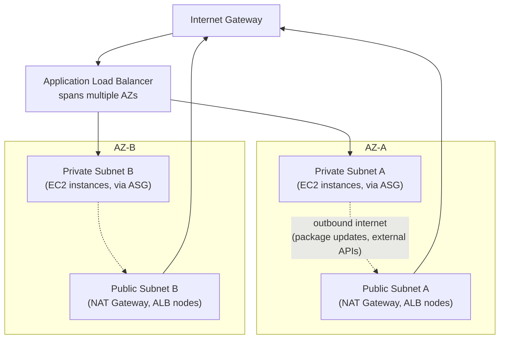
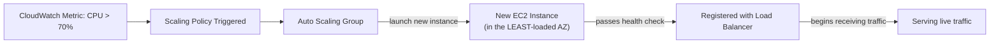
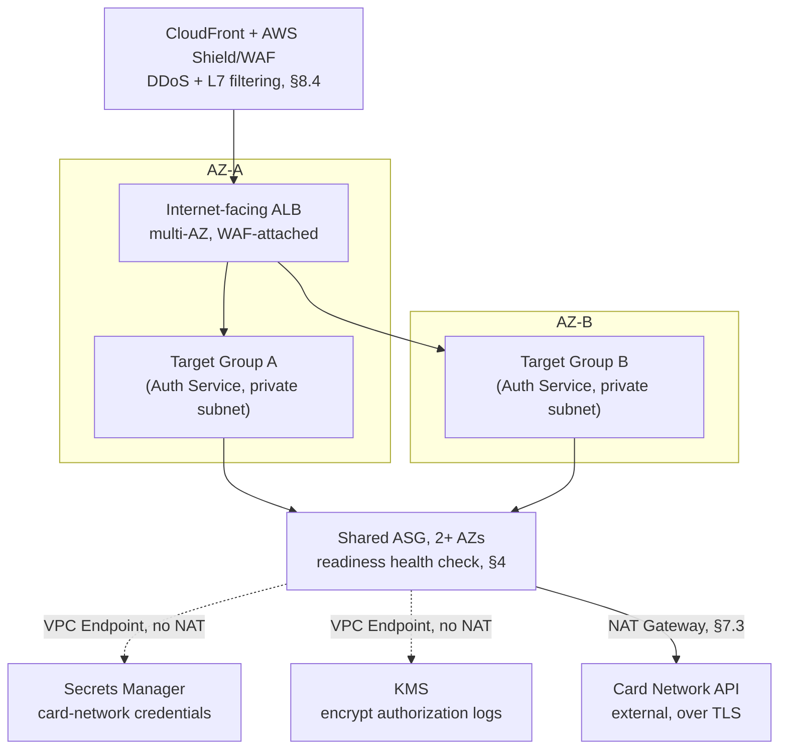
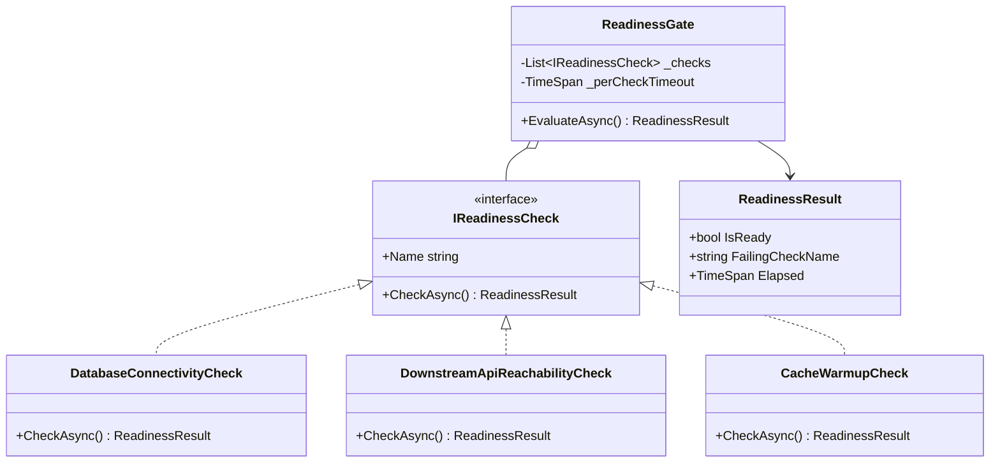
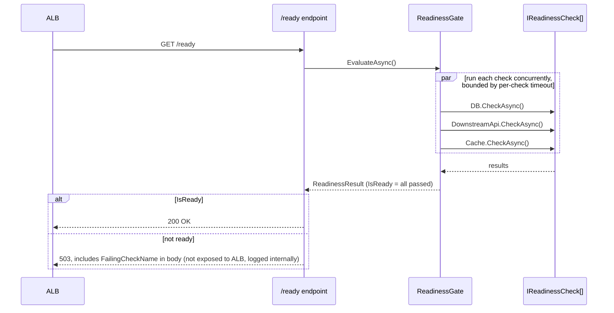

# Module 57 — AWS: Compute & Networking Fundamentals — EC2, VPC, Load Balancing & Auto Scaling

> Domain: AWS | Level: Beginner → Expert | Prerequisite: [[../14-System-Design/01-System-Design-Fundamentals]] (load balancing/scalability building blocks, now expressed via concrete AWS services), [[../17-Microservices/02-Resilience-Observability-Sidecar-Patterns]] (resilience patterns, now applied at the infrastructure layer)

---

## 1. Fundamentals

### Why does a Principal Engineer need AWS networking/compute depth beyond "know how to launch an EC2 instance"?
Nearly every architectural decision this course has covered so far (service decomposition, resilience patterns, data replication, event-driven messaging) ultimately runs on top of concrete cloud infrastructure, and the specific way that infrastructure is networked and provisioned determines real failure modes, security boundaries, and cost structures that abstract architecture diagrams don't capture — a VPC's subnet design directly determines blast radius during a security incident; an Auto Scaling Group's configuration directly determines whether a traffic spike is absorbed gracefully or causes a cascading outage; a Load Balancer's health-check configuration directly determines whether a genuinely unhealthy instance is removed from rotation before it damages user experience.

### Why does this matter?
Because a Principal Engineer is expected to make and defend concrete infrastructure design decisions (VPC topology, subnet segmentation, load-balancer type, Auto Scaling policy) with the same rigor this course has applied to application-level architecture — these decisions have long-lived, expensive-to-reverse consequences (the "hard to reverse" risk category applies directly to foundational network topology decisions made early in a system's life).

### When does this matter?
Any system deployed on AWS — understanding these fundamentals is the prerequisite for correctly reasoning about every subsequent AWS-specific topic (IAM, security groups, the later dedicated Security/IAM modules) and for diagnosing real production incidents involving networking, scaling, or availability.

### How does it work (30,000-ft view)?
```
VPC: your own isolated virtual network within AWS, divided into Subnets (public: has a route to
 an Internet Gateway; private: does not) across multiple Availability Zones (AZs) for resilience
EC2: virtual machines (instances), the fundamental compute building block, launched INTO a subnet
Load Balancer: distributes traffic across multiple EC2 instances (or other targets) across AZs,
 with health checks removing unhealthy targets from rotation automatically
Auto Scaling Group (ASG): automatically adds/removes EC2 instances based on demand (metrics-driven
 scaling policies), always spanning multiple AZs for resilience
```

---

## 2. Deep Dive

### 2.1 VPC and Subnets — the Foundational Network Boundary
A Virtual Private Cloud (VPC) is a logically isolated network within AWS, with its own IP address range (CIDR block) — every other resource (EC2 instances, load balancers, databases) is launched **within** a VPC, and the VPC's subnet structure is the primary mechanism for network-level security segmentation. A **public subnet** has a route table entry directing internet-bound traffic to an **Internet Gateway**, allowing resources within it to be directly reachable from (and reach) the public internet; a **private subnet** has no such route, meaning resources within it cannot be directly reached from the internet and can only reach the internet outbound (if needed, for package updates or external API calls) via a **NAT Gateway** sitting in a public subnet — this public/private subnet split is the foundational implementation of the principle "only expose what genuinely needs to be internet-facing" (directly the security-domain least-privilege principle, later dedicated module, applied at the network-topology level).

### 2.2 Availability Zones and Multi-AZ Design — the Foundational Resilience Unit
An AWS Region contains multiple physically-separate **Availability Zones (AZs)** — independent data centers with their own power, cooling, and networking, connected via low-latency links, but engineered to fail independently of one another (an AZ-level outage — a power failure, a fire — should not affect other AZs in the same Region). Every resilient AWS architecture spans **at least two AZs** (subnets are created per-AZ, so a VPC's public/private subnet pairs are typically replicated across each AZ used), because a single-AZ deployment inherits that AZ's entire failure domain as the whole system's availability ceiling — directly the redundancy-eliminates-single-points-of-failure principle, now expressed as AWS's specific, concrete unit of independent failure.

### 2.3 EC2 — the Fundamental Compute Building Block, and Its Boundaries
An EC2 instance is a virtual machine launched into a specific subnet (and therefore a specific AZ), with a chosen instance type (determining vCPU/memory/network performance characteristics) — critically, an EC2 instance is inherently a **single point of failure on its own**: it can be terminated by a hardware failure, and even AWS's own instance-level SLA doesn't guarantee any single instance's continuous availability, meaning any production workload with an actual availability requirement must run **multiple** instances across **multiple AZs**, never depend on a single instance's uptime — the direct, concrete reason Load Balancers and Auto Scaling Groups are not optional conveniences but foundational requirements for any real production EC2-based workload.

### 2.4 Load Balancers — Distributing Traffic and Enforcing Health
An Application Load Balancer (ALB, operating at Layer 7/HTTP) or Network Load Balancer (NLB, operating at Layer 4/TCP, for extreme throughput or non-HTTP protocols) distributes incoming traffic across a registered set of targets (EC2 instances, or other compute targets) spanning multiple AZs, and — critically — performs **health checks** against each target, automatically removing an unhealthy target from rotation until it passes health checks again. The health-check configuration (the specific endpoint checked, the failure threshold before marking unhealthy, the check interval) directly determines how quickly a genuinely failing instance is removed from serving live traffic — a too-lenient health check (checking only "is the process running," not "can this instance actually serve a real request correctly") can leave a degraded-but-technically-alive instance serving broken responses to users for longer than necessary, directly the health-check-design discipline (liveness vs. readiness distinction) now expressed at the AWS load-balancer configuration layer.

### 2.5 Auto Scaling Groups — Elastic Capacity Matched to Demand
An Auto Scaling Group (ASG) maintains a desired number of EC2 instances (within a configured minimum/maximum range), automatically launching new instances when a scaling policy's trigger condition is met (a CPU-utilization threshold, a custom CloudWatch metric, a scheduled time-based policy) and terminating instances when demand decreases — always launching new instances across the ASG's configured AZs to maintain multi-AZ resilience automatically as it scales. This directly implements the elastic-scaling principle concretely: rather than provisioning for peak load permanently (wasteful, expensive) or provisioning only for average load (causing outages during spikes), an ASG matches actual running capacity to actual, current demand — but the scaling policy's **responsiveness** (how quickly it reacts to a demand spike, and how long a newly-launched instance takes to become healthy and start serving traffic) must be tuned against the workload's actual traffic-spike characteristics, since a slow-to-react ASG facing a sudden, sharp spike can still experience a period of overload before new capacity comes online.

### 2.6 Security Groups — Stateful, Instance-Level Firewalls
A Security Group acts as a virtual, stateful firewall attached to an EC2 instance (or other resource), controlling inbound and outbound traffic via allow-list rules (there is no explicit "deny" rule type — everything not explicitly allowed is implicitly denied) — "stateful" meaning a security group automatically allows return traffic for an already-permitted inbound/outbound connection without needing a separate explicit rule for the response direction. This is the instance-level complement to the VPC/subnet-level network segmentation — a defense-in-depth layer directly analogous to the sidecar-enforced mTLS discussion: network topology alone (which subnet an instance sits in) shouldn't be the only access-control mechanism, since a security group provides a second, independently-configured, instance-specific layer of enforcement.

## 3. Visual Architecture

### Multi-AZ VPC Topology

```mermaid
graph TB
 IGW[Internet Gateway] --> ALB[Application Load Balancer<br/>spans multiple AZs]
 subgraph "AZ-A"
 PubA["Public Subnet A<br/>(NAT Gateway, ALB nodes)"]
 PrivA["Private Subnet A<br/>(EC2 instances, via ASG)"]
 end
 subgraph "AZ-B"
 PubB["Public Subnet B<br/>(NAT Gateway, ALB nodes)"]
 PrivB["Private Subnet B<br/>(EC2 instances, via ASG)"]
 end
 ALB --> PrivA
 ALB --> PrivB
 PrivA -.->|"outbound internet<br/>(package updates, external APIs)"| PubA
 PrivB -.-> PubB
 PubA --> IGW
 PubB --> IGW
```

### Auto Scaling Group Reacting to Demand

```mermaid
graph LR
 CW[CloudWatch Metric: CPU > 70%] --> Policy[Scaling Policy Triggered]
 Policy --> ASG[Auto Scaling Group]
 ASG -->|"launch new instance"| NewInst["New EC2 Instance<br/>(in the LEAST-loaded AZ)"]
 NewInst -->|"passes health check"| ALB2[Registered with Load Balancer]
 ALB2 -->|"begins receiving traffic"| Serving[Serving live traffic]
```

## 4. Production Example
**Scenario**: An e-commerce platform's checkout service ran on an Auto Scaling Group with a CPU-utilization-based scaling policy (scale out when average CPU exceeds 70%), fronted by an Application Load Balancer with a health check hitting a lightweight `/health` endpoint that simply confirmed the process was running and could accept connections, without checking any actual downstream dependency (database connectivity, payment-gateway reachability). During a flash-sale event, traffic surged dramatically within a two-minute window — the ASG's scaling policy correctly triggered and began launching new instances, but each new instance took approximately 90 seconds to complete its application startup (JIT warm-up, connection-pool initialization, cache pre-loading) before it could actually serve requests correctly, even though it began passing the lightweight health check (and therefore began receiving live traffic from the load balancer) almost immediately after the process started, well before it was actually ready to handle real checkout requests correctly. **Investigation**: during the scale-out window, a meaningful percentage of checkout requests failed or timed out — not because the platform lacked sufficient *eventual* capacity (the ASG did scale out appropriately, and total instance count was sufficient within a few minutes), but because newly-launched instances were being routed live production traffic **before they were actually ready**, causing failed requests specifically during each new instance's 90-second warm-up window — this pattern repeated for every new instance the ASG launched throughout the sale, compounding into a meaningfully elevated overall error rate despite the underlying capacity ultimately being adequate. **Root cause**: the health check validated only "is the process alive," not "is this instance actually ready to correctly serve a checkout request" — directly the liveness-vs-readiness distinction, applied here at the AWS load-balancer level, where a liveness-only check was used in a context requiring a readiness check. **Fix**: implemented a proper `/ready` health-check endpoint that verified actual downstream dependency connectivity and confirmed internal cache/connection-pool warm-up completion before returning healthy, and configured the ALB's health check to use this readiness endpoint (with an appropriately tuned check interval/threshold) rather than the original liveness-only endpoint — new instances now remain out of the load balancer's active rotation until they are genuinely ready to serve correct responses, eliminating the warm-up-window failure pattern entirely in subsequent scaling events. **Lesson**: this is a direct, concrete AWS-infrastructure-layer instance of the liveness/readiness distinction — a lesson easy to internalize abstractly but easy to miss when actually configuring a specific AWS load balancer's health-check target, precisely because a liveness-only check "looks correct" in isolation (the instance genuinely is alive) without the reviewer explicitly asking "alive to do what, specifically, and is that actually sufficient for this instance to correctly serve production traffic right now?"
## 10. Interview Questions

### Basic (10)
1. **Q: What is a VPC?** **A:** A logically isolated virtual network within AWS with its own IP address range, containing every other resource an application uses.
2. **Q: What is the difference between a public and private subnet?** **A:** A public subnet has a route to an Internet Gateway; a private subnet does not, and reaches the internet outbound (if needed) only via a NAT Gateway.
3. **Q: What is an Availability Zone?** **A:** A physically separate, independently-failing data center within an AWS Region.
4. **Q: Why should production workloads span multiple AZs?** **A:** To avoid inheriting a single AZ's entire failure domain as the whole system's availability ceiling.
5. **Q: What does a Load Balancer's health check do?** **A:** Periodically checks each registered target's health, automatically removing unhealthy targets from traffic rotation.
6. **Q: What does an Auto Scaling Group do?** **A:** Automatically adds or removes EC2 instances to match a configured desired capacity based on demand-driven scaling policies.
7. **Q: What is a Security Group?** **A:** A stateful, instance-level virtual firewall controlling inbound/outbound traffic via allow-list rules.
8. **Q: What does "stateful" mean for a Security Group?** **A:** Return traffic for an already-permitted connection is automatically allowed without needing a separate explicit rule.
9. **Q: Why is a single EC2 instance considered inherently a single point of failure?** **A:** It can be terminated by a hardware failure, and no single-instance-level SLA guarantees continuous availability.
10. **Q: What is the difference between an Application Load Balancer and a Network Load Balancer?** **A:** ALB operates at Layer 7 (HTTP); NLB operates at Layer 4 (TCP), typically for extreme throughput or non-HTTP protocols.

### Intermediate (10)
1. **Q: Why does the public/private subnet split directly implement a least-privilege network design principle?** **A:** Only resources with a genuine need for direct internet reachability (load balancers, NAT gateways) are placed where they're internet-facing; application/data resources are isolated in private subnets, unnecessarily minimizing exposed attack surface.
2. **Q: Why does a liveness-only health check risk routing traffic to an instance that isn't actually ready to serve correct responses?** **A:** It only confirms the process is running and can accept connections, not that its dependencies are reachable or its internal warm-up (cache loading, connection-pool initialization) has completed — an instance can be "alive" while still unable to correctly handle a real request.
3. **Q: Why must Auto Scaling policy responsiveness be tuned against actual instance warm-up time, not just the scaling trigger threshold?** **A:** Even if the ASG correctly and promptly launches new instances, those instances remain effectively unavailable to genuinely help during their warm-up window — if warm-up time is non-trivial relative to the traffic spike's duration, capacity "existing" doesn't mean capacity is actually serving requests correctly yet.
4. **Q: Why is NAT Gateway throughput/cost a genuine capacity-planning concern rather than a negligible detail?** **A:** All private-subnet outbound traffic passes through it; a workload with high-volume external API calls or package-update traffic can encounter real bandwidth constraints and cost implications that scale with that volume.
5. **Q: Why can an ASG's maximum instance count be silently capped by a subnet's IP address space, independent of the ASG's own configured maximum?** **A:** Each EC2 instance requires an IP address from its subnet's CIDR block — if the subnet's available address space is smaller than the ASG's configured maximum instance count, the ASG will hit a hard, silent scaling ceiling once the subnet's IPs are exhausted, regardless of the ASG's own configuration.
6. **Q: Why should Security Group rules never be broadly opened (`0.0.0.0/0`) without explicit justification?** **A:** This directly expands the instance's exposed attack surface to the entire internet, defeating the purpose of a deliberately-scoped, least-privilege access-control layer.
7. **Q: Why does compromising a public-facing bastion host not automatically grant an attacker access to private-subnet resources?** **A:** Private subnets have no direct route from the internet, and Security Groups provide an additional, independent access-control layer — an attacker needs a further, separate compromise of the specific network path and permissions to reach private resources, limiting lateral-movement blast radius.
8. **Q: Why must Load Balancer target-group capacity scale in lockstep with an ASG's maximum instance count?** **A:** If the target group or its underlying subnet's IP capacity can't accommodate the ASG's full configured maximum, the ASG will be unable to actually reach that maximum in practice, regardless of its own configuration allowing it.
9. **Q: Why should AWS service quotas be proactively verified and increased ahead of anticipated need, rather than reactively during an actual traffic spike?** **A:** Quota increase requests aren't always instantaneous, and discovering an insufficient quota during an actual spike means the system cannot scale further exactly when it most needs to, turning a preventable planning gap into a live incident.
10. **Q: Why is the ALB health-check configuration (specific endpoint, threshold, interval) as consequential a design decision as the load balancer's existence itself?** **A:** A load balancer with a poorly-configured health check can still route traffic to genuinely broken instances (too lenient) or prematurely evict genuinely healthy instances (too strict/too sensitive), meaning the health-check configuration itself directly determines the load balancer's actual practical effectiveness, not just its presence.

### Advanced (10)
1. **Q: Diagnose the incident from first principles, and design the specific pre-production load-testing practice that would have caught the liveness-vs-readiness health-check gap before a live flash-sale event exposed it.**
 **A:** Root cause: the health check validated a proxy for readiness (process liveness) rather than actual readiness (dependency connectivity + warm-up completion), a gap invisible under steady-state, already-scaled load where no new instances are actively warming up. Safeguard: a pre-production load test that specifically simulates a **sharp, sudden scale-out event** (not just sustained high load on already-stable instances) — deliberately triggering new-instance launches under load and measuring the actual error rate **during** each new instance's warm-up window specifically — would have surfaced the gap directly, since steady-state load testing alone never exercises the specific failure window (the interval between a new instance passing a liveness check and it actually being ready) that only manifests during active scaling events.
2. **Q: A team argues that since their Auto Scaling Group's minimum instance count is already provisioned generously for typical peak load, they don't need to worry about warm-up-time-related failures during scaling events, since scaling out should rarely be triggered at all. Evaluate this as a Principal Engineer.**
 **A:** Push back — "generously provisioned for typical peak" doesn't protect against atypical, sharper-than-typical spikes (a flash sale, a viral event, an unexpected traffic surge) precisely because those are, by definition, the scenarios where the minimum-provisioned capacity is insufficient and scaling actually gets triggered — the warm-up-window failure mode is specifically a risk during exactly these atypical, harder-to-predict events, meaning "we rarely scale" is not a reason to neglect making scaling events themselves safe when they do occur, but rather underscores that scaling-event correctness should be verified proactively (Advanced Q1) since it may not be exercised often enough in normal operation to be caught by incidental observation.
3. **Q: Design a strategy for choosing an appropriate CIDR block size for a VPC and its subnets, given the trade-off between address-space generosity and unnecessary IP-space waste, avoiding both the under-provisioning risk and needless over-allocation.**
 **A:** Size subnet CIDR blocks based on a realistic, documented projection of maximum expected resource count per subnet (accounting for the specific ASG's configured maximum instance count, Advanced Q1's scaling-event headroom, and any other resources sharing that subnet), with meaningful headroom (a common practice: provision roughly double the currently-anticipated maximum) rather than either the minimal size that exactly fits today's known need (risking the exact silent-ceiling trap) or an unnecessarily oversized allocation that wastes VPC-wide address space needed for other subnets — the decision should be an explicit, documented capacity calculation tied to the specific ASG/workload's actual projected scale, not a default, uniform subnet-size choice applied without considering each subnet's actual anticipated resource count.
4. **Q: Explain why deploying across multiple AZs protects against AZ-level failures but does not, by itself, protect against a Region-level failure, and design the architectural response for a workload requiring resilience against the latter.**
 **A:** Multi-AZ deployment addresses failures scoped to a single AZ's independent failure domain but a Region-level event (a rare, but real, broader outage affecting an entire Region) would affect every AZ within that Region simultaneously, since AZs share the Region's broader infrastructure/network backbone at some level — resilience against Region-level failure requires **multi-Region** architecture (replicating the workload's infrastructure and data across geographically separate AWS Regions, with a mechanism — DNS failover, global load balancing — to redirect traffic to a healthy Region if one becomes unavailable), a significantly more complex and costly architecture that should only be pursued when the workload's actual business-continuity requirements genuinely justify that cost, directly the general "match resilience investment to actual business requirement, don't over-engineer beyond genuine need" principle.
5. **Q: A Principal Engineer discovers that an existing production VPC has all application and database resources deployed in public subnets "because it was simpler to set up initially and it's been working fine." Evaluate the risk and design a remediation plan.**
 **A:** This is a significant, latent security risk — every resource in a public subnet is potentially directly reachable from the internet, relying entirely on Security Group rules as the sole access-control layer with no network-topology-level defense-in-depth at all; "it's been working fine" reflects the same latent-risk-with-no-visible-symptom-until-exploited pattern this course has repeatedly flagged (§Advanced Q8's under-replicated-partition discussion, the durability gap) — remediation: a carefully-planned, incremental migration (directly the Strangler Fig philosophy applied to network topology) moving database and internal-application resources into newly-created private subnets one component at a time, verifying connectivity/functionality at each step, rather than a risky, all-at-once network-topology change to already-live production infrastructure.
6. **Q: Design an approach for validating that Security Group rules across an organization's AWS accounts remain least-privilege over time, given that rules tend to accumulate permissively (a rule added for a specific, temporary debugging need that's never removed) rather than being pruned back proactively.**
 **A:** Implement a periodic, automated Security Group audit (many cloud security posture management tools, and AWS's own IAM Access Analyzer/Security Hub, support this) that flags overly broad rules (`0.0.0.0/0` inbound on non-load-balancer resources, unused rules with no matching traffic observed over a defined period) for explicit review and justification or removal — directly the same "convert an easy-to-accumulate, hard-to-notice risk into a standing, automated governance check" pattern this course applies recurrently, now applied to Security Group rule hygiene specifically, since manual, ad hoc review rarely catches gradual, incremental permissiveness creep.
7. **Q: Explain the trade-off between an Application Load Balancer's Layer-7 (HTTP-aware) routing capabilities and a Network Load Balancer's Layer-4 raw-throughput/latency characteristics, and design a decision framework for choosing between them for a given workload.**
 **A:** ALB's Layer-7 awareness enables HTTP-specific routing features (path-based routing, host-based routing, more sophisticated health checks validating actual HTTP response content) at a modest additional processing overhead compared to NLB's simpler, lower-latency Layer-4 packet forwarding — choose ALB when the workload is HTTP/HTTPS-based and benefits from content-aware routing or more sophisticated health checking (the readiness-check improvement is itself an ALB-specific capability); choose NLB when the workload requires extreme throughput/low latency, needs to preserve the client's source IP end-to-end without Layer-7 processing, or uses a non-HTTP protocol (raw TCP, UDP) that ALB doesn't support — the decision hinges on whether the workload's actual protocol and routing needs require Layer-7 awareness, not a default preference for either type.
8. **Q: A workload's Auto Scaling Group is configured with a scale-in policy that terminates instances aggressively during traffic lulls to minimize cost, but the team observes this occasionally terminates an instance that was mid-processing a long-running request, causing that request to fail. Diagnose and propose a fix.**
 **A:** This is a connection-draining/graceful-termination gap — AWS's Auto Scaling and Load Balancer integration supports **connection draining** (a configurable grace period during which an instance selected for termination stops receiving *new* connections but is allowed to finish processing its *existing*, in-flight requests before actual termination) — the fix is ensuring connection draining is enabled with a grace period tuned to comfortably exceed the workload's realistic maximum request-processing duration, directly the graceful-degradation philosophy applied to instance termination specifically: don't abruptly kill something that's actively, legitimately mid-work, give it a bounded window to finish first.
9. **Q: Critique the following claim: "Since our Auto Scaling Group spans multiple AZs, our workload is fully resilient to any infrastructure failure."**
 **A:** Multi-AZ ASG deployment protects specifically against AZ-level infrastructure failures — it does not protect against a Region-level failure (Advanced Q4), an application-level bug affecting every instance identically regardless of which AZ they're in, a downstream dependency (a database, an external API) that isn't itself similarly multi-AZ/resilient and becomes a single point of failure the ASG's own resilience doesn't extend to, or a bad deployment rolled out uniformly to every instance in the ASG simultaneously (a distinct risk the canary-deployment discipline specifically addresses, not something multi-AZ infrastructure resilience alone solves) — the claim conflates "resilient to this specific, addressed failure category" with "resilient to any infrastructure failure whatsoever," an overgeneralization that could leave the team unprepared for these other, genuinely distinct failure categories.
10. **Q: As a Principal Engineer establishing AWS infrastructure standards for an organization running many workloads, design the specific set of standing architectural reviews and automated checks (synthesizing this entire module) you would require for every new production workload, and justify each.**
 **A:** (1) Mandatory multi-AZ deployment verification for every production ASG/Load Balancer configuration — necessary because single-AZ deployment silently inherits an unnecessary, avoidable failure-domain risk. (2) Mandatory readiness-based (not liveness-only) health-check review for every load-balanced workload with non-trivial instance warm-up time (Advanced Q1) — necessary because this gap is invisible until an actual scaling event under load exposes it. (3) Documented CIDR-block/IP-capacity-vs-ASG-maximum-instance-count reconciliation for every VPC subnet (Advanced Q3) — necessary because this is an easy-to-overlook, independently-configured-settings mismatch with a silent failure mode. (4) Periodic, automated Security Group rule audits flagging overly-broad or unused rules (Advanced Q6) — necessary because permissive rules accumulate gradually and are rarely caught by ad hoc manual review alone. Each standard targets a distinct, concrete failure mode this module identified through specific incidents or reasoning, directly extending this course's recurring governance-gate pattern into AWS infrastructure-specific operational practice.

### Expert (10)
1. **Q: A payments platform's ALB idle timeout is 60 seconds (default) and its backend Kestrel server's keep-alive timeout is also 60 seconds. Under sustained load, a small but persistent rate of client-visible 502s occurs. Diagnose from first principles.**
 **A:** This is §7.2's timeout race condition: with both timeouts set to exactly the same value, there is no guaranteed ordering between "the ALB decides the connection is idle and reuses/closes it" and "the backend independently decides the same" — under load, jitter in exactly when each side's timer fires means the backend occasionally closes a pooled connection microseconds before the ALB attempts to reuse it, producing a 502 the client sees as a real failure even though no actual application error occurred. Fix: set the backend's keep-alive timeout to a value strictly greater than the ALB's idle timeout (e.g., backend 65s vs. ALB 60s, with the same principle applying to any reverse-proxy-to-backend timeout pairing, including an internal ALB-to-ALB or NLB-to-target-group chain) — the invariant is "the component closer to the client should always time out first," never equal or reversed.
2. **Q: Design the subnet and NAT strategy for a workload that makes very high-volume outbound calls to a single third-party payment-processor API host, given §7.3's per-destination NAT Gateway connection limit.**
 **A:** First, determine whether the traffic is genuinely destined for an AWS service reachable via a VPC Endpoint (§8.3) — if so, route it off the NAT Gateway entirely, which fully sidesteps the limit for that traffic class. For genuinely external (non-AWS) traffic like a third-party payment processor, the per-destination-IP/port ceiling (55,000 simultaneous connections) is specifically per NAT Gateway per destination — provisioning additional NAT Gateways and explicitly distributing outbound traffic to that specific destination across them (via application-level connection-pool sharding or multiple route tables directing different subnet segments to different NAT Gateways) raises the effective ceiling; the deeper fix, where feasible, is connection reuse/pooling on the application side (HTTP keep-alive to the payment processor) to reduce the *number* of concurrent connections needed for a given request volume in the first place, rather than only scaling NAT capacity to match an avoidably connection-heavy calling pattern.
3. **Q: A workload runs on ECS Fargate tasks using `awsvpc` networking mode inside a /24 private subnet (251 usable IPs after AWS reservations). The team is surprised the ASG-equivalent (ECS Service auto scaling) cannot scale past roughly 245 tasks even though CPU/memory-based autoscaling policy has no such cap configured. Diagnose.**
 **A:** This is §7.5's ENI/IP-exhaustion ceiling manifesting specifically for `awsvpc` networking: unlike EC2 instances (where many containers can share one instance's single IP via bridge networking), `awsvpc` mode gives **each task its own ENI and private IP** from the subnet — so task count is capped by subnet IP capacity, not just by the ECS service's own configured maximum, exactly mirroring the EC2/ASG subnet-CIDR-vs-max-instance-count trap from §Advanced Q3/Q5 but at the task level instead of the instance level. Fix: either size the subnet with real headroom for the actual maximum task count expected (accounting for this being *tasks*, not instances), or move latency-tolerant, high-density workloads to `bridge`/host networking mode where IP consumption doesn't scale 1:1 with task count, trading away per-task security-group granularity to regain IP-address headroom.
4. **Q: Compare Route 53 failover routing and AWS Global Accelerator for a trading platform's multi-region DR strategy, and justify a specific recommendation given the platform's RTO requirement is under 30 seconds.**
 **A:** Route 53 failover relies on DNS: clients (and any intermediate resolvers/caches) must actually observe the DNS record change, which is bounded by the record's TTL plus real-world resolver caching behavior that doesn't always honor TTL precisely — practically, this can mean minutes, not seconds, before all clients have failed over, which is incompatible with a sub-30-second RTO. Global Accelerator uses static anycast IP addresses and reroutes at the AWS network layer based on health checks, with failover typically completing in tens of seconds and, critically, **without depending on client-side DNS cache behavior at all** since the client-facing IP never changes. For the stated sub-30-second RTO, Global Accelerator is the justified choice despite its higher cost — Route 53 failover alone cannot structurally meet that RTO regardless of how well-tuned its health checks are, because the bottleneck is DNS propagation, a layer Global Accelerator bypasses entirely.
5. **Q: A Principal Engineer is asked to choose a DR strategy (backup-and-restore, pilot light, warm standby, active-active) for a regulatory-reporting batch pipeline (nightly, RPO of 24 hours is acceptable, RTO of 8 hours is acceptable) versus a real-time payment-authorization service (RPO near-zero, RTO under 1 minute). Justify two different answers.**
 **A:** The regulatory-reporting pipeline's generous RTO/RPO (24h/8h) means backup-and-restore or, at most, pilot light is fully sufficient and clearly the correct cost-optimized choice — paying for warm standby or active-active capacity that sits mostly idle for a workload that can tolerate an 8-hour recovery window is not disciplined engineering judgment, it's over-engineering against a requirement the business never actually stated (§Advanced Q4's over-engineering caution generalized to DR spend). The payment-authorization service's near-zero RPO/sub-minute RTO structurally requires active-active — no lesser strategy can meet a sub-minute RTO, since even warm standby requires a promotion step with non-trivial latency, and a pilot-light/backup-restore strategy's recovery time is measured in many minutes to hours at best. The general principle: DR strategy is a direct, traceable function of the business-stated RTO/RPO for **that specific workload**, not a uniform organizational default applied identically regardless of what each individual workload actually needs.
6. **Q: A Spot-Instance-heavy ASG serving a latency-sensitive read API experiences periodic, correlated micro-outages where request error rate spikes for roughly 30–60 seconds every few hours, correlated with instance-count dips in CloudWatch. Diagnose and propose the architecture fix.**
 **A:** This is Spot Instance interruption (§9.4) manifesting as user-visible impact — AWS reclaims Spot capacity with only a two-minute warning, and if the ASG's Spot proportion is high and the interruption isn't handled gracefully (no connection draining configured, no proactive rebalancing response, insufficient On-Demand floor to absorb the gap), the reclaimed capacity's in-flight requests fail and the temporary capacity dip causes elevated latency/errors on the remaining instances until replacement capacity comes online. Fix: this workload was misclassified — a latency-sensitive, user-facing read API is exactly the case §9.4 flags as inappropriate for a high Spot proportion; the architecture fix is reducing the Spot proportion to genuinely burst/non-critical capacity only, ensuring a guaranteed On-Demand (or Reserved) floor sized to the workload's real baseline traffic, and separately configuring **Capacity Rebalancing** (ASG proactively replaces an instance flagged for interruption via AWS's rebalance-recommendation signal, ahead of the hard two-minute reclaim, rather than reacting only after the instance is already gone) with connection draining enabled so in-flight requests on a soon-to-be-reclaimed instance still finish gracefully.
7. **Q: Design a NACL-plus-Security-Group defense-in-depth strategy for a subnet hosting a service that processes card-payment data (PCI-DSS-relevant), explaining specifically what each layer catches that the other doesn't.**
 **A:** The Security Group (stateful, per-instance/service, allow-list only) is the primary, fine-grained control — scoped per §8.2 to exactly the specific source security groups and ports each service genuinely needs, with no `0.0.0.0/0` rules. The NACL (stateless, subnet-wide, supports explicit Deny, evaluated in numbered rule order) is layered on top specifically to catch two things the Security Group model structurally cannot: (1) an explicit, subnet-wide block of known-bad or explicitly out-of-scope CIDR ranges that should never reach this subnet regardless of what any individual Security Group permits, providing a genuinely independent layer that survives even a fully-compromised or misconfigured Security Group; and (2) — because NACLs are stateless — an explicit, auditable statement of exactly which response traffic is expected to leave the subnet, which can surface unexpected outbound flows (a compromised instance attempting exfiltration to an unexpected destination) that a stateful Security Group's automatic return-traffic allowance would never separately flag. Neither layer substitutes for the other; the combination is what "defense-in-depth" concretely means at the network layer for data actually in PCI scope.
8. **Q: A cost-optimization review finds that cross-AZ data transfer charges are the single largest line item in a microservices platform's AWS network bill. Diagnose the likely architectural cause and propose remediation without sacrificing multi-AZ resilience.**
 **A:** The likely cause is §7.1's cross-AZ tax compounding at high inter-service call volume: with services deployed evenly across AZs and no AZ-awareness in service-to-service routing, a majority of calls between chatty, frequently-communicating services statistically cross AZ boundaries, each incurring the per-GB charge. Remediation must not simply consolidate everything into one AZ (this directly reintroduces the single-AZ failure-domain risk §2.2/§6 exists to prevent) — instead, the correct fix is **topology-aware routing** for the specific highest-volume service-to-service call paths (many service meshes, and Application Load Balancer/Route 53 configurations, support AZ-affinity or "keep traffic in the calling AZ when a healthy target exists there" routing), which reduces cross-AZ traffic *for the common case* while still allowing cross-AZ failover when the local AZ's target is unhealthy — preserving full multi-AZ resilience for the failure scenario while eliminating the cross-AZ tax for the (much more common) steady-state scenario.
9. **Q: Critique the following claim from a team migrating to Fargate: "Since Fargate is serverless, we no longer need to think about subnet sizing or IP capacity planning."**
 **A:** False, and a specific instance of §Expert Q3's `awsvpc` IP-per-task behavior — "serverless" here refers to not managing the underlying EC2 host, not to any exemption from VPC networking fundamentals; Fargate tasks in `awsvpc` mode still consume a private IP per task from the subnet's CIDR block exactly as EC2 instances do, meaning subnet sizing, the same CIDR-vs-maximum-scale reconciliation discipline (§Advanced Q3), and even NAT Gateway/VPC Endpoint routing decisions (§7.3/§8.3) all still fully apply — the operational burden Fargate removes is EC2 host patching/AMI management and instance-level Auto Scaling Group mechanics, not VPC-level network architecture, which remains exactly as consequential a design surface as it is for EC2-based compute.
10. **Q: As a Principal Engineer, you must decide whether a new, business-critical trading-order-entry service should be deployed active-active across two Regions from day one, or launched single-Region with a documented, staged path to active-active later. Walk through the decision.**
 **A:** Interrogate the actual, current business requirement first, not the theoretically-ideal architecture: what RTO/RPO has the business genuinely committed to today, what regulatory requirement (if any — some financial-services regulators mandate specific DR postures for certain systems) applies, and what the realistic time-to-market cost of active-active's added complexity (data-replication conflict resolution across Regions, doubled operational surface, cross-region consistency trade-offs directly from the CRDT/distributed-systems modules) is against the business's actual launch timeline pressure. If the near-zero-RTO requirement is genuinely present today (a live trading system, §Expert Q5's second case), active-active is justified from day one despite the cost. If the honest answer is "we want this eventually but the business need is not yet proven and launch speed matters more right now," the disciplined choice is single-Region with multi-AZ HA (§9.1–9.3) plus an explicitly documented, concrete migration path to warm-standby-then-active-active as the system's actual criticality and traffic justify it — the anti-pattern a Principal Engineer must resist in either direction is either over-engineering DR spend against a requirement nobody has actually committed to, or under-engineering it via silent scope-creep where "we'll add multi-region later" never gets prioritized once the system is live and migrating becomes riskier than building it in from the start.

---

## 11. Coding Exercises

*(AWS infrastructure exercises are primarily configuration/IaC in nature — this module includes representative Infrastructure-as-Code demonstrating the key patterns.)*

### Easy — Public/private subnet split
```hcl
resource "aws_subnet" "public_a" {
  vpc_id = aws_vpc.main.id
  cidr_block = "10.0.1.0/24"
  availability_zone = "us-east-1a"
  map_public_ip_on_launch = true # public: instances get a public IP
}

resource "aws_subnet" "private_a" {
  vpc_id = aws_vpc.main.id
  cidr_block = "10.0.11.0/24" # SEPARATE, non-overlapping CIDR range
  availability_zone = "us-east-1a"
  # NO map_public_ip_on_launch -- private: no direct internet reachability
}

resource "aws_route" "private_nat" {
  route_table_id = aws_route_table.private.id
  destination_cidr_block = "0.0.0.0/0"
  nat_gateway_id = aws_nat_gateway.main.id # OUTBOUND only, via NAT -- not a direct internet route
}
```

### Medium — Readiness-based ALB health check
```hcl
resource "aws_lb_target_group" "checkout" {
  name = "checkout-tg"
  port = 80
  protocol = "HTTP"
  vpc_id = aws_vpc.main.id

  health_check {
    path = "/ready" # READINESS endpoint -- checks DB/cache connectivity, NOT just "/health" liveness
    interval = 10
    healthy_threshold = 2
    unhealthy_threshold = 3
    timeout = 5
    matcher = "200"
  }
}
```
```csharp
[HttpGet("/ready")]
public async Task<IActionResult> Ready
{
    // Genuine readiness -- NOT just "is this process alive" (the original, insufficient check)
    if (!await _dbConnectionPool.CanConnectAsync) return StatusCode(503);
    if (!_cacheWarmupComplete) return StatusCode(503);
    if (!await _paymentGatewayClient.IsReachableAsync) return StatusCode(503);
    return Ok;
}
```

### Hard — Auto Scaling policy with connection draining (§Advanced Q8)
```hcl
resource "aws_autoscaling_group" "checkout" {
  min_size = 4
  max_size = 20
  vpc_zone_identifier = [aws_subnet.private_a.id, aws_subnet.private_b.id] # multi-AZ, ALWAYS
  target_group_arns = [aws_lb_target_group.checkout.arn]
  health_check_type = "ELB" # use the ALB's readiness check, NOT just EC2 status checks
  health_check_grace_period = 120 # matches realistic instance warm-up time (the lesson)

  instance_refresh {
    strategy = "Rolling"
    preferences {
      instance_warmup = 120
      min_healthy_percentage = 90
    }
  }
}

resource "aws_lb_target_group" "checkout" {
  #... (as above)...
    deregistration_delay = 60 # CONNECTION DRAINING: 60s grace period before terminating a
  # deregistering instance, letting in-flight requests finish (§Advanced Q8)
}
```

### Expert — Security Group least-privilege configuration with defense-in-depth (§Advanced Q6)
```hcl
resource "aws_security_group" "checkout_app" {
  vpc_id = aws_vpc.main.id

  ingress {
    description = "ALB to app instances ONLY -- NOT 0.0.0.0/0"
    from_port = 80
    to_port = 80
    protocol = "tcp"
    security_groups = [aws_security_group.alb.id] # scoped to the ALB's OWN security group, not a broad CIDR
  }

  egress {
    description = "Outbound to RDS ONLY, on the DB port -- not unrestricted egress"
    from_port = 5432
    to_port = 5432
    protocol = "tcp"
    security_groups = [aws_security_group.database.id]
  }
  # NO broad 0.0.0.0/0 rules in either direction -- defense-in-depth alongside the
  # private-subnet placement, NOT relying on subnet placement alone.
  }
```
**Discussion**: scoping both ingress and egress to specific security-group references (rather than broad CIDR ranges) directly implements Advanced Q6's least-privilege audit target — an automated Security Group audit checking for `0.0.0.0/0` rules would find none here, and the security-group-to-security-group reference pattern means access is tied to a resource's actual role (being the ALB, being the database) rather than a potentially-overbroad IP range that could inadvertently include unintended sources.

---

## 12. System Design

### Scenario: Design the Network/Compute Foundation for a Real-Time Card-Authorization Gateway
A payments company needs the AWS network and compute foundation for a card-authorization gateway sitting between merchant point-of-sale integrations and a card network — this section designs the infrastructure layer specifically (application-level authorization logic is out of scope; it's covered by the sibling System Design domain's payment-system modules).

**Functional requirements**: accept inbound authorization requests over HTTPS from merchant integrations; forward to an internal authorization service; return an approve/decline response; support blue/green deployment of the authorization service without downtime.

**Non-functional requirements**: p99 added-latency budget from the network/LB layer of under 15ms (the card network's own end-to-end SLA leaves little room, so the infrastructure layer must be a negligible contributor); 99.99% availability; PCI-DSS-relevant network segmentation; ability to absorb a 5x traffic surge (a large merchant's flash promotion) within 60 seconds without added error rate.

**Architecture**:

```mermaid
graph TB
 CF[CloudFront + AWS Shield/WAF<br/>DDoS + L7 filtering, §8.4] --> ALB[Internet-facing ALB<br/>multi-AZ, WAF-attached]
 subgraph "AZ-A"
 ALB --> TGA["Target Group A<br/>(Auth Service, private subnet)"]
 end
 subgraph "AZ-B"
 ALB --> TGB["Target Group B<br/>(Auth Service, private subnet)"]
 end
 TGA --> ASG[Shared ASG, 2+ AZs<br/>readiness health check, §4]
 TGB --> ASG
 ASG -.->|"VPC Endpoint, no NAT"| SM[Secrets Manager<br/>card-network credentials]
 ASG -.->|"VPC Endpoint, no NAT"| KMS[KMS<br/>encrypt authorization logs]
 ASG -->|"NAT Gateway, §7.3"| CardNetwork[Card Network API<br/>external, over TLS]
```

**Component rationale**: CloudFront + WAF absorbs volumetric/L7 attack traffic before it reaches the ALB, keeping the ALB's own capacity dedicated to genuine traffic (§8.4). The ALB is chosen over an NLB specifically because Layer-7 readiness health checks (§2.4/§4) and path-based routing (supporting a `/v2` blue/green cutover without a separate load balancer) are needed; a pure-throughput NLB would forfeit both. The ASG spans two AZs with a readiness-based health check (§4's lesson, non-negotiable for a workload where a not-yet-ready instance receiving live authorization traffic means real financial-transaction failures). VPC Endpoints (§8.3) route Secrets Manager and KMS traffic without touching the internet or NAT Gateway, both for the security posture (card-network credentials never transit a NAT path) and to keep NAT Gateway capacity (§7.3) reserved for the genuinely-external card-network API calls.

**Scaling and failure handling**: predictive scaling (§7.4) pre-scales ahead of known merchant-promotion traffic windows where the schedule is known in advance; a warm pool (§7.4) absorbs the unpredictable 5x-surge requirement within the 60-second budget by removing instance-boot time from the critical path, leaving only application warm-up (validated via the readiness check before any instance receives live traffic). NAT Gateway is provisioned per-AZ with headroom against §7.3's connection-tracking ceiling, sized against the card-network API's expected peak concurrent-connection count specifically.

**Monitoring**: CloudWatch alarms on ALB p99 target-response-time (isolating network/LB-layer latency from authorization-service processing time), 5xx rate split by target-group AZ (to catch an AZ-specific degradation the aggregate metric would mask), NAT Gateway `ErrorPortAllocation` metric (the concrete signal for §7.3's connection-tracking exhaustion), and ASG `GroupInServiceInstances` vs. `GroupDesiredCapacity` divergence (a scaling-lag signal ahead of it becoming a user-visible error-rate spike).

**Trade-offs**: choosing ALB over NLB accepts a small additional per-request latency versus NLB's raw Layer-4 forwarding — accepted because the 15ms budget has headroom and the readiness-check/routing capability is a correctness requirement, not a nice-to-have, for this workload specifically. Choosing VPC Endpoints over routing AWS-service traffic through the NAT Gateway adds a small additional monthly cost per endpoint — accepted because it removes both a security exposure (credentials transiting a NAT path) and a NAT Gateway capacity constraint that would otherwise have to be separately sized and monitored.

## 13. Low-Level Design

### Scope: an internal "Instance Readiness Gate" library used by the authorization-service's health endpoint
Rather than each service reimplementing its own readiness logic ad hoc (risking exactly the liveness-only gap from §4's incident), a shared internal library standardizes readiness checking across every service behind an ALB.

**Class diagram**:

```mermaid
classDiagram
 class IReadinessCheck {
 <<interface>>
 +CheckAsync() ReadinessResult
 +Name string
 }
 class DatabaseConnectivityCheck {
 +CheckAsync() ReadinessResult
 }
 class DownstreamApiReachabilityCheck {
 +CheckAsync() ReadinessResult
 }
 class CacheWarmupCheck {
 +CheckAsync() ReadinessResult
 }
 class ReadinessGate {
 -List~IReadinessCheck~ _checks
 -TimeSpan _perCheckTimeout
 +EvaluateAsync() ReadinessResult
 }
 class ReadinessResult {
 +bool IsReady
 +string FailingCheckName
 +TimeSpan Elapsed
 }
 IReadinessCheck <|.. DatabaseConnectivityCheck
 IReadinessCheck <|.. DownstreamApiReachabilityCheck
 IReadinessCheck <|.. CacheWarmupCheck
 ReadinessGate o-- IReadinessCheck
 ReadinessGate --> ReadinessResult
```

**Sequence diagram — ALB health check hitting `/ready`**:

```mermaid
sequenceDiagram
 participant ALB
 participant Endpoint as /ready endpoint
 participant Gate as ReadinessGate
 participant Checks as IReadinessCheck[]
 ALB->>Endpoint: GET /ready
 Endpoint->>Gate: EvaluateAsync()
 par run each check concurrently, bounded by per-check timeout
 Gate->>Checks: DB.CheckAsync()
 Gate->>Checks: DownstreamApi.CheckAsync()
 Gate->>Checks: Cache.CheckAsync()
 end
 Checks-->>Gate: results
 Gate-->>Endpoint: ReadinessResult (IsReady = all passed)
 alt IsReady
 Endpoint-->>ALB: 200 OK
 else not ready
 Endpoint-->>ALB: 503, includes FailingCheckName in body (not exposed to ALB, logged internally)
 end
```

**Design patterns used**: **Strategy** (`IReadinessCheck` — each dependency's readiness logic is an interchangeable strategy, new checks added without modifying `ReadinessGate`); **Composite**-like aggregation (`ReadinessGate` combines many checks into a single pass/fail result); **Template Method** implicitly in the base timeout/error-handling wrapper each concrete check runs inside, so an individual check's own logic stays focused only on its specific readiness question.

**SOLID mapping**: **SRP** — each `IReadinessCheck` implementation knows only its own dependency, not the aggregation policy; `ReadinessGate` knows only aggregation, not any specific dependency's check logic. **OCP** — a new dependency (e.g., adding a card-network reachability check) is a new class implementing `IReadinessCheck`, registered via DI, with zero modification to `ReadinessGate` itself. **LSP** — any `IReadinessCheck` implementation is substitutable without the gate needing to know its concrete type. **ISP** — the interface exposes only `CheckAsync`/`Name`, nothing a concrete check doesn't need. **DIP** — `ReadinessGate` depends on the `IReadinessCheck` abstraction, not concrete check classes, injected via the DI container at startup.

**Extensibility**: a new microservice with different dependencies composes its own set of `IReadinessCheck` implementations without touching `ReadinessGate`'s code — directly preventing a repeat of §4's incident pattern by making "define what readiness actually means for this service's real dependencies" the only thing a team building a new service has to do, with the aggregation, timeout, and ALB-response-shaping logic already correct by construction.

**Concurrency/thread safety**: checks run concurrently (`Task.WhenAll`) with a per-check timeout so one slow dependency check doesn't block the others or blow the ALB's own health-check timeout budget; `ReadinessGate` itself is stateless per invocation (no shared mutable state across concurrent `/ready` calls from the ALB's health-check poller), so no locking is required — each `EvaluateAsync()` call is independent.

## 14. Production Debugging

**Incident**: A trading-adjacent settlement-file-upload service, running behind an ALB with a correctly-configured readiness check (no repeat of §4's issue), began experiencing a slow but steady rise in p99 latency over several weeks with no corresponding deployment or traffic-volume change, eventually crossing an alerting threshold.

**Investigation**: CloudWatch's `TargetResponseTime` metric showed the increase was occurring specifically at the ALB layer, not inside the application (application-level APM tracing showed stable internal processing time) — narrowing further, the `ActiveConnectionCount` and `NewConnectionCount` metrics on the target group showed a growing number of long-lived, idle-looking connections accumulating over time rather than being cleanly recycled. Correlating against the ASG's own instance-refresh history revealed the service had recently been changed to use significantly larger request/response payloads (uploading larger settlement files), and separately, a recent framework upgrade had silently changed the backend's default keep-alive timeout to a much larger value than the ALB's 60-second idle timeout.

**Tools**: CloudWatch target-group metrics (`TargetResponseTime`, `ActiveConnectionCount`), VPC Flow Logs (confirming no unusual network-layer packet loss or retransmission), and `netstat`/`ss` on individual instances via SSM Session Manager (§8.5) — no bastion host or SSH access needed — showing an abnormally high count of connections in `ESTABLISHED` state that the application itself had no active request against, consistent with connections the backend was holding open far longer than the ALB expected them to be reused within.

**Root cause**: this was the inverse-direction case of §7.2/§Expert Q1's timeout mismatch — here, the backend's keep-alive timeout was **much longer** than the ALB's idle timeout, so rather than premature 502s, the ALB was periodically closing connections from its side that the backend still considered valid and kept resources allocated for, and — combined with the larger payload sizes increasing per-connection buffer memory — the accumulation of these backend-side stale, ALB-already-closed connections was gradually increasing connection-pool contention and effective processing latency as the backend's connection table filled with dead weight.

**Fix**: explicitly set the backend's keep-alive timeout to a value just above the ALB's idle timeout (not an arbitrarily large default introduced by the framework upgrade), restoring the correct "client-facing component times out first" invariant from §Expert Q1, and added an explicit CloudWatch alarm on target-group `ActiveConnectionCount` trending upward without a corresponding traffic-volume increase — a leading indicator that would catch this specific pattern (connection accumulation independent of load) before it degrades into a latency incident again.

**Prevention**: added the ALB-idle-timeout-vs-backend-keep-alive-timeout reconciliation check (§7.2) to the same production-readiness review checklist as the multi-AZ and readiness-check gates from §Advanced Q10 — treating framework/runtime upgrades as a trigger for re-verifying this specific pairing, since the incident's actual root cause was a *dependency* (framework default) change, not an application-code change, meaning it wouldn't have been caught by an application-code-focused review alone.

## 15. Architecture Decision

**Decision**: choose the compute layer for a new, latency-sensitive payment-authorization service — EC2 + ASG, ECS Fargate, or Lambda.

| Option | Advantages | Disadvantages | Cost | Complexity | Scalability |
|---|---|---|---|---|---|
| **EC2 + ASG** (this module's default) | Full control over instance type/networking/OS; predictable warm-up behavior once tuned (§4); mature tooling (SSM, CloudWatch, warm pools) | Team owns AMI patching, OS-level security, instance lifecycle | Lowest per-vCPU-hour with Reserved/Savings Plans at steady, predictable load; wasted spend if over-provisioned | Highest — full infrastructure ownership | Fully controllable (§9.1–9.4) but requires the team to design it correctly |
| **ECS Fargate** | No host management; still full `awsvpc` networking control (§Expert Q3); faster to provision new services | Per-task IP consumption (§Expert Q3/Q9) requires the same subnet-capacity discipline as EC2; less granular instance-type tuning; cold-start latency for new tasks not fully eliminated | Higher per-vCPU-hour than EC2 at steady load, but no idle-capacity waste for spiky workloads | Medium — no host ops, but task/service definitions and networking still owned | Good; scales at task granularity, same VPC-IP-capacity ceiling as EC2 applies |
| **Lambda** | Zero infrastructure management; scales near-instantaneously to very high concurrency; pay-per-invocation | Cold-start latency (can be materially worse than a warm-pooled EC2/Fargate instance for a p99-under-15ms requirement); 15-minute max execution; VPC-attached Lambda has its own ENI-ish cold-start and IP-consumption characteristics | Cheapest at low/spiky volume; can exceed EC2/Fargate cost at sustained high, steady volume | Lowest infra complexity, but requires re-architecting around Lambda's execution model | Excellent for spiky/unpredictable load; less naturally suited to a service wanting persistent, tuned connection pools (DB, card-network TLS sessions) |

**Recommendation**: EC2 + ASG for the payment-authorization service specifically, because (1) the sub-15ms p99 latency budget from §12 leaves no room for Lambda's cold-start variance on a security-relevant, VPC-attached function; (2) the service benefits from long-lived, pre-warmed connection pools (to the card network, to the database) that persist naturally across EC2-instance-hosted requests but would need to be re-established per-cold-start under Lambda; (3) the team already owns the operational maturity (warm pools, readiness checks, SSM access) this module builds toward, so EC2's higher operational-ownership cost is not new incremental burden. ECS Fargate would be the reasonable second choice if the team's priority shifted toward minimizing host-management overhead at a modest cost/latency premium; Lambda would be the correct choice for a **different** component of the same platform — e.g., asynchronous settlement-file processing or notification dispatch, where spiky, infrequent invocation and no persistent-connection requirement make its trade-offs favorable instead.

## 17. Principal Engineer Perspective

**Business impact**: the network/compute foundation is invisible when it works and catastrophic when it doesn't — every incident in this module (the readiness-check gap, the timeout-mismatch latency creep) translated directly into failed or slow financial transactions, meaning the business cost of getting this layer wrong is measured in real transaction failures and, at a payments company specifically, potential card-network SLA penalties or merchant trust erosion, not just an internal engineering inconvenience.

**Engineering trade-offs**: nearly every decision in this module is a trade-off with no universally "correct" answer — ALB vs. NLB (§15), Spot vs. On-Demand proportion (§9.4), DR posture cost vs. RTO/RPO (§9.3/§Expert Q5), cross-AZ resilience vs. cross-AZ cost (§7.1/§Expert Q8). A Principal Engineer's job is not to memorize a single "best practice" answer to each but to correctly map the workload's actual, specific requirements onto the right point on each trade-off curve — and to be able to articulate *why*, concretely, when challenged, rather than defaulting to whichever option is currently fashionable.

**Technical leadership and cross-team communication**: the readiness-check incident (§4) and the timeout-mismatch incident (§14) both share a root cause pattern — a setting that "looks correct in isolation" but is actually only correct in combination with another, independently-owned setting (the ALB's timeout, owned by platform/infra; the backend's keep-alive timeout, owned by the application team). A Principal Engineer's cross-team responsibility is making these cross-boundary invariants **explicit and discoverable** (a documented pairing rule, an automated check) rather than tribal knowledge that lives only in the head of whoever debugged the last incident — this is precisely why §14's prevention step targets the *review checklist*, not just the specific fix.

**Architecture governance**: the automated-gate pattern recurring throughout this module (Security Group audits §8.2, NACL/SG defense-in-depth §Expert Q7, the readiness/multi-AZ/timeout-pairing checklist) reflects a deliberate governance philosophy: any control whose correctness depends on an individual remembering to do something manually, under deadline pressure, will eventually fail — the Principal Engineer's job is converting each such control into a structural, pipeline-enforced gate wherever the cost of doing so is justified by the blast radius of getting it wrong.

**Cost optimization**: §7.1's cross-AZ transfer tax, §9.4's Spot/On-Demand mix, and §9.3's DR-posture-vs-RTO/RPO calibration are all cases where the naive "maximize resilience/performance" answer is measurably more expensive than the requirement actually justifies — a Principal Engineer is expected to quantify these trade-offs in real dollar terms (this module's NAT Gateway, cross-AZ, and Global Accelerator cost discussions) and make the business case explicitly, not simply default to the most conservative (and most expensive) option to avoid the harder conversation.

**Risk analysis and long-term maintainability**: the ENI/IP-exhaustion ceiling (§7.5/§Expert Q3/Q9) is a textbook example of a risk that's invisible at small scale and only manifests as the system grows — a Principal Engineer reviewing a new service's design should proactively ask "at 10x today's scale, does this specific setting silently become a ceiling?" for every capacity-adjacent configuration (subnet CIDR, NAT connection limits, KMS/Secrets Manager rate limits from the sibling module), treating capacity-planning reconciliation as a standing design-review question rather than something discovered only after it's already caused an incident.

## 18. Revision
**Key takeaways**: VPC subnet design (public vs. private) is the foundational network-security-segmentation decision, directly implementing least-privilege at the topology level; every production workload should span multiple Availability Zones, since a single-AZ or single-instance deployment inherits an unnecessary, avoidable failure domain. Load Balancer health checks must validate genuine readiness, not just process liveness, especially for workloads with non-trivial instance warm-up time — a gap that's invisible under steady-state load and only manifests during active scaling events. Auto Scaling Group configuration (trigger thresholds, cooldowns, connection draining) must be tuned against the workload's actual traffic-spike and processing-duration characteristics. Security Groups provide a necessary, independently-configured defense-in-depth layer alongside subnet segmentation — neither substitutes for the other. Several settings across this domain (subnet IP capacity vs. ASG maximum, queue durability vs. message persistence in the prior module) share a recurring pattern: independently-configured settings that must be reasoned about together, since satisfying one alone creates a false sense of a guarantee the other setting actually determines.

---

**Next**: Continuing to Module 58 — AWS: Storage & Databases (S3, RDS, DynamoDB integration patterns) and Serverless Compute (Lambda, API Gateway), continuing the `21-AWS` domain.
