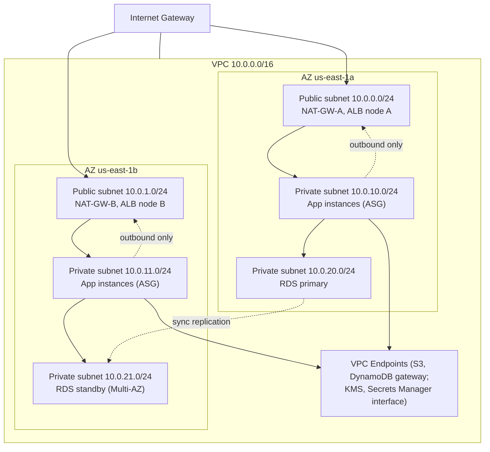
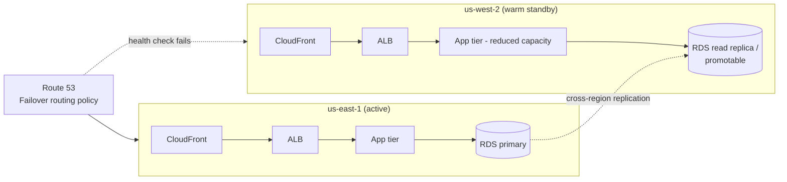
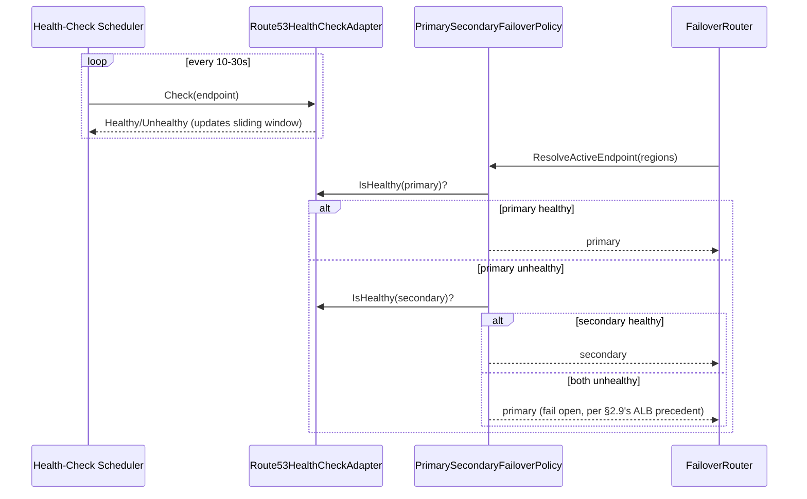

# Module 57 — AWS: Compute & Networking Fundamentals — EC2, VPC, Load Balancing & Auto Scaling

> Domain: AWS | Level: Beginner → Expert | Prerequisite: [[../14-System-Design/01-System-Design-Fundamentals]] (load balancing/scalability building blocks, now expressed via concrete AWS services), [[../17-Microservices/02-Resilience-Observability-Sidecar-Patterns]] (resilience patterns, now applied at the infrastructure layer)

---

## 1. Fundamentals

### What problem does this module solve?
Every AWS service this domain will cover — RDS, DynamoDB, ElastiCache, SQS, Lambda, EKS — is reachable only through a network topology someone designed, and runs only on compute someone provisioned and sized. A Principal Engineer who can recite "use RDS for relational data" but cannot explain which subnet the RDS instance lives in, which security group allows the application to reach it, or what happens to in-flight connections when an Auto Scaling Group replaces the instance serving them, has memorized vocabulary without owning the failure modes. This module is the foundation the other seven AWS modules build on: it is the only module in the domain that is a genuine prerequisite for all the others, because IAM boundaries (Module 58), storage (Module 59), databases (Module 60), serverless (Module 61), messaging (Module 62), and containers (Module 63) are all *placed* inside the VPC/subnet/security-group topology this module defines, and all *reached* through the load-balancing and DNS layer this module defines.

### Why does this matter at the Principal Engineer / Architect level?
Because network topology and compute-platform choice are two of the most expensive-to-reverse decisions in a system's life. A VPC's CIDR block, once chosen too small, cannot be resized without either adding a second, non-contiguous CIDR (messy, but supported since 2017) or re-architecting; a monolith wired directly to EC2 instances by IP is a multi-quarter migration away from sitting behind a load balancer; a team that picked EKS for a three-person team's CRUD service is now paying the operational tax of Kubernetes for the life of that service. Interviewers at this level are not testing whether you know what a VPC is — they are testing whether you have internalized that *these are the decisions with the longest half-life*, and whether you can defend a specific choice with numbers, not vibes.

### When does this matter?
On every AWS-hosted system, from day one. Unlike, say, a specific messaging pattern that only matters once you have an asynchronous workflow, network topology and compute placement are unavoidable — there is no AWS-hosted .NET application that does not have a VPC, subnets, and a compute layer, whether or not the team designing it ever thought about them explicitly. Systems that didn't think about them explicitly are exactly the ones that end up with public RDS instances, security groups with `0.0.0.0/0` on port 1433, and NAT Gateway bills nobody budgeted for.

### How it works — 30,000-foot view
```
Region (e.g. us-east-1)
 └─ VPC (10.0.0.0/16 — your isolated network, ~65,536 IPs)
     ├─ AZ us-east-1a
     │   ├─ Public subnet  10.0.0.0/24  (route → Internet Gateway)
     │   └─ Private subnet 10.0.10.0/24 (route → NAT Gateway, in the public subnet)
     └─ AZ us-east-1b
         ├─ Public subnet  10.0.1.0/24
         └─ Private subnet 10.0.11.0/24

Public subnets:  NAT Gateways, the internet-facing Load Balancer's nodes, bastion hosts (if used)
Private subnets: EC2 instances / EKS nodes / ECS tasks / RDS instances — nothing here has a public IP
Load Balancer:   spans both AZs, terminates TLS, health-checks targets, routes to the private subnets
Auto Scaling Group: maintains N healthy instances across both private subnets, replacing failures
```
This shape — two-tier subnetting (public/private) replicated across at least two AZs, fronted by a load balancer, backed by an Auto Scaling Group — is the load-bearing pattern underneath the large majority of production AWS architectures a Principal Engineer will be asked to defend in an interview, and it recurs, essentially unchanged, whether the compute layer turns out to be EC2, ECS, or EKS.

---

## 2. Deep Dive

### 2.1 The Master Request Journey — how a single HTTPS request actually travels

This is the walkthrough every subsequent module in this domain assumes you already own cold. Trace `GET https://api.acmebank.com/v1/accounts/{id}/transactions` from a browser to a .NET API and back.

**Hop 0 — DNS resolution (Route 53).** The browser has no idea what `api.acmebank.com` is; it asks a recursive resolver, which — following the domain's NS records at the registrar — ends up asking Route 53, the authoritative name server for the `acmebank.com` hosted zone. Route 53 holds an **alias record** (AWS's zone-apex-capable, free-to-query extension of a CNAME) for `api.acmebank.com` pointing at the CloudFront distribution's domain name (`d123abc.cloudfront.net`). If this were a **failover routing policy**, Route 53 would first consult its own health checks (HTTP checks against a `/health` endpoint on each region's endpoint, run from multiple AWS locations every 10–30 seconds) and return only healthy targets — this is the mechanism, not CloudFront and not the load balancer, that redirects DNS answers away from a dead region. The resolved IP is one of CloudFront's anycast edge IPs; DNS TTL (typically 60s for alias records to CloudFront) bounds how quickly a failover propagates to *new* lookups — clients holding an already-resolved IP in their OS cache won't see the change until TTL expiry, which is the concrete reason DNS failover has a floor on recovery time no matter how fast the health check fires.

**Hop 1 — CloudFront (the CDN edge).** The client's TLS handshake terminates at the nearest CloudFront edge location (there are 600+ globally; "nearest" is anycast + latency-based routing, not geography alone). CloudFront presents an ACM certificate for `api.acmebank.com` (custom domain names on CloudFront require ACM certs provisioned in `us-east-1` specifically, regardless of where the distribution's origin lives — a common gotcha). For a POST/dynamic API endpoint like this one, CloudFront's cache behavior is typically configured to **not cache** (cache policy = `CachingDisabled`, or TTL = 0) and simply forward the request onward — CloudFront's value here isn't caching this particular response, it's TLS offload at the edge, DDoS absorption (AWS Shield Standard is automatically attached), and a single place to attach WAF.

**Hop 2 — WAF.** A Web ACL attached to the CloudFront distribution evaluates the request against a rule set before it's allowed further: AWS Managed Rules (SQLi, XSS, known bad IPs), rate-based rules (e.g., block an IP exceeding 2,000 requests/5 min — the classic brute-force/credential-stuffing defense on an `/accounts` endpoint), and custom rules (e.g., geo-restriction if the product is only licensed in certain jurisdictions — directly relevant for a regulated fintech product with data-residency constraints). A blocked request never reaches the origin; this is the outermost security boundary in the entire path.

**Hop 3 — API Gateway or ALB (the origin).** CloudFront forwards the request to its configured origin, which is either a public Application Load Balancer or (for a "serverless-first" API) API Gateway. Say it's an ALB: the ALB's listener on port 443 holds the *actual* customer-facing ACM certificate (a second TLS termination point — CloudFront-to-origin can itself be re-encrypted, which it is here, so there are two independent TLS hops, not one long tunnel). The ALB is itself just a fleet of managed nodes AWS runs *in your VPC's public subnets*, spanning every AZ you've enabled — this is why an ALB's DNS name resolves to multiple IPs, one set per AZ, and why "the load balancer" is never a single point of failure the way a single NLB-fronted appliance historically was. The ALB evaluates **listener rules** (path-based: `/v1/*` → target group `accounts-api-tg`; host-based; header-based for canary routing) and forwards to a target in the matched target group.

**Hop 4 — the network boundary crossed.** This is the step people gloss over and interviewers probe hardest. The ALB's nodes live in **public subnets**; the target (an EC2 instance, an ECS task's ENI, or an EKS pod via the AWS Load Balancer Controller) lives in a **private subnet**. Traffic from the ALB to the target crosses that public→private boundary entirely inside the VPC — it never touches the Internet Gateway, never gets a public IP, and is governed by two independent things: the **route table** (does the private subnet even have a path back, and is one needed — no, because this is intra-VPC traffic, route tables only matter for traffic leaving the subnet's local CIDR) and the **security group** attached to the target, which must explicitly allow inbound traffic **from the ALB's security group** on the application port (not from `0.0.0.0/0` — the ALB's own security group is itself locked to 443 from the internet, and the target's security group is locked to the ALB's security group specifically, a two-hop least-privilege chain).

**Hop 5 — authentication and authorization.** Two distinct things happen, often confused: **authentication** (who is this?) is typically a JWT validated by the .NET API itself (ASP.NET Core's `AddJwtBearer` middleware, validating a token issued by Cognito, Auth0, or an internal STS against a cached JWKS) — API Gateway *can* do this at the edge via a Lambda authorizer or native JWT authorizer, ALB cannot natively validate arbitrary JWTs (ALB only natively integrates with Cognito/OIDC for its own authenticate-oidc action). **Authorization** (can this identity do this?) is application logic — for `GET /v1/accounts/{id}/transactions`, the .NET API must confirm the authenticated principal owns account `{id}`, which is a data check against the caller's claims, not a network-layer concern at all. Conflating the two — assuming "the request got past the load balancer, so it's authorized" — is a real defect class; see the tenant-isolation discussion in §2.13 and Module 58.

**Hop 6 — the application, and the database hop.** The .NET API (running on EC2/ECS/EKS — this module's compute layer) executes its handler, which opens a connection to RDS SQL Server over the same private-subnet network (full connectivity mechanics — connection strings, IAM auth options, pooling, retry — are Module 60's job, deliberately not duplicated here). The response retraces the same path outward: private subnet → ALB → CloudFront (uncached, passed straight through) → client, with CloudFront and the ALB both emitting access logs (to S3 and to S3/CloudWatch respectively) and CloudWatch metrics (request count, latency percentiles, 4xx/5xx counts) at every hop — the observability seam Module 64 builds on.

The discriminating question here — the one that separates a Staff answer from a Senior one — is: **"At which of these six hops would a request actually be rejected for each of the following: DDoS traffic, a SQL injection attempt, an expired JWT, a request for someone else's account, a target that's failed its health check?"** A Senior answer says "the load balancer/WAF handles security." A Staff answer maps each threat to its specific enforcement point: DDoS → Shield/WAF rate-based rules at Hop 2; SQLi → WAF managed rules at Hop 2 (defense-in-depth, not a substitute for parameterized queries at Hop 6); expired JWT → the .NET middleware at Hop 6 (or a Lambda authorizer if using API Gateway, moving the rejection earlier and cheaper); cross-tenant access → **only** application logic at Hop 6, because nothing upstream of the app has the data needed to know account `{id}` doesn't belong to this caller; unhealthy target → the ALB's health checker, continuously, independent of any single request (§2.9).

### 2.2 VPC and CIDR — the network you actually own

A VPC is a logically isolated, software-defined network within an AWS Region, defined by an IPv4 CIDR block you choose at creation (e.g., `10.0.0.0/16`, giving 65,536 addresses; AWS reserves the first four and the last address of every subnet, so a `/24` subnet's usable count is 251, not 256). The CIDR choice is one of the genuinely hard-to-reverse decisions in this domain: it must not overlap with any network you'll ever need to peer with or connect over VPN/Direct Connect (on-premises ranges, other VPCs, a future acquisition's network) — picking `10.0.0.0/16` when your corporate network already uses `10.0.0.0/8` is the kind of mistake that surfaces eighteen months later as "we need VPC peering but the CIDRs collide," at which point the fix is a new VPC and a live migration, not a resize. AWS's guidance (and good practice for anyone expecting to grow) is to pick a CIDR block deliberately smaller than the whole private range you're entitled to and leave room in the numbering scheme for sibling VPCs (e.g., `10.0.0.0/16` for prod, `10.1.0.0/16` for staging, `10.2.0.0/16` for a future region) rather than fill `10.0.0.0/8` unplanned.

A **subnet** is a subdivision of the VPC's CIDR, and — critically — a subnet lives in exactly one Availability Zone; it cannot span AZs. This is why resilient designs always provision matched pairs of subnets, one per AZ, for every tier (public-A/public-B, private-A/private-B), never a single subnet shared across AZs (impossible) nor a single-AZ deployment (fragile).

### 2.3 Public vs. private subnets — defined by route tables, not by naming

The distinction between "public" and "private" is not a subnet property AWS enforces directly — it is entirely a consequence of what the subnet's **route table** points to. A subnet is "public" if its route table has a route for `0.0.0.0/0` (or the relevant slice of internet-bound traffic) targeting an **Internet Gateway** (IGW) — a horizontally-scaled, AWS-managed, highly available gateway attached once per VPC, providing bidirectional NAT for instances that also hold a public IP. A subnet is "private" if it has no such route — its `0.0.0.0/0` route (if it needs outbound internet access at all, e.g., to call an external payment processor's API or download OS patches) instead targets a **NAT Gateway**, which lives in a *public* subnet, holds its own Elastic IP, and performs source-NAT so outbound traffic appears to originate from the NAT Gateway's public IP — critically, a NAT Gateway allows **outbound-initiated** traffic to return, but nothing on the internet can initiate a connection *into* a private subnet through it. This asymmetry is the entire security value of the public/private split: your RDS instance, EKS nodes, and application servers should never need to accept an inbound connection from the raw internet, so they belong in private subnets, full stop.

**A NAT Gateway is charged per-hour it exists *and* per-GB it processes** — this is the single most common AWS networking cost surprise a Principal Engineer is expected to know cold: a private-subnet fleet doing high-volume outbound calls (e.g., pulling large files from a third-party API, or — worse — accidentally routing S3/DynamoDB traffic through it) can produce a NAT Gateway bill that dwarfs the compute bill it's supporting. The fix, covered in §2.5, is VPC endpoints for AWS-service traffic, which bypass the NAT Gateway (and its per-GB charge) entirely.

### 2.4 Security Groups vs. Network ACLs — two enforcement layers, deliberately redundant

A **Security Group (SG)** is a stateful, instance/ENI-attached virtual firewall: you write only **allow** rules (there's no explicit deny), and "stateful" means a rule permitting inbound traffic on port 443 automatically permits the corresponding return traffic outbound, with no matching outbound rule needed. SGs are evaluated per-instance and can reference *other security groups* as a source/destination — this is the mechanism behind the "ALB's SG → app's SG" chain in §2.1's Hop 4: the app tier's inbound rule says "allow port 8080 from `sg-alb-xxxx`," which means any instance ever attached to that ALB security group is allowed in, regardless of its IP — far more maintainable than IP-based rules in an environment where instances are constantly replaced by Auto Scaling.

A **Network ACL (NACL)** is stateless and subnet-attached (every instance in the subnet is subject to it): you write both allow *and* explicit deny rules, evaluated in numbered order, and — being stateless — a NACL permitting inbound traffic does **not** automatically permit the outbound response; you must write a matching rule for ephemeral return ports (typically 1024–65535) explicitly. NACLs are coarser and easy to misconfigure (the classic mistake: allowing inbound 443 but forgetting the outbound ephemeral-port rule, silently breaking every connection) which is why the default NACL allows everything and most teams leave it that way, reserving custom NACLs for a specific, narrow purpose: subnet-wide **explicit denies** that SGs cannot express — e.g., "block this specific IP range at the subnet boundary regardless of what any instance's security group says," useful for blocking a known-bad range or a compromised host during an incident without touching every SG. The Principal Engineer framing: SGs are your day-to-day least-privilege mechanism (instance-granularity, allow-only, easy to reason about); NACLs are a blunt, subnet-wide backstop you reach for rarely, and defense-in-depth means both layers exist simultaneously rather than one substituting for the other.

### 2.5 VPC Endpoints — private connectivity to AWS services without a NAT Gateway or the internet

A VPC endpoint lets resources in a private subnet reach an AWS service without traversing the Internet Gateway or a NAT Gateway at all. There are two kinds, and confusing them is a common interview stumble: a **Gateway endpoint** (only S3 and DynamoDB) is a route-table entry — free, and implemented by adding a target in the subnet's route table pointing at the endpoint, so traffic to `s3.amazonaws.com`'s IP ranges stays on AWS's private backbone. An **Interface endpoint** (everything else — SQS, SNS, KMS, Secrets Manager, ECR, CloudWatch Logs, Kinesis, Step Functions, and dozens more) provisions an actual ENI with a private IP *inside your subnet*, backed by AWS PrivateLink, and costs an hourly fee plus per-GB data processing (cheaper than the equivalent NAT Gateway processing charge for high-volume traffic, and — critically for a regulated fintech workload — the traffic never traverses the public internet, which is frequently a hard compliance requirement, not merely a cost optimization). The Principal Engineer default for any VPC with private-subnet workloads calling AWS services: Gateway endpoints for S3/DynamoDB (free, no reason not to), Interface endpoints for whichever other services are called at meaningful volume or where private connectivity is a compliance requirement (Secrets Manager and KMS are common first candidates, since literally every private-subnet workload calls them).

### 2.6 Availability Zones, Regions, and cross-region basics

An AWS Region (e.g. `us-east-1`) is a fully independent geographic area containing multiple **Availability Zones** — physically separate data centers with independent power, cooling, and networking, interconnected by low-latency, high-bandwidth private links, engineered so that a failure in one AZ (power loss, fire, a bad deploy that takes down a whole facility's network gear) does not propagate to another. A VPC spans an entire Region and provisions subnets *per AZ*; "multi-AZ" is not an optional extra for a production workload, it is the minimum bar — a single-AZ deployment inherits that AZ's outage as the system's own outage, full stop, no matter how well everything else is designed. Typical production designs use 2–3 AZs (a Region typically offers 3–6; more than 3 rarely buys additional resilience but does add cost/complexity, particularly for anything requiring synchronous replication).

**Cross-region** is a different, larger decision: two Regions are independent failure domains at a much coarser grain (an entire Region going unavailable is rare but has happened), and cross-region designs exist for two distinct reasons that are often conflated — **disaster recovery** (a second region sits mostly idle, ready to take over — pilot-light or warm-standby patterns, §2.13/Module 64) versus **latency** (serving European users from `eu-west-1` rather than `us-east-1` because 100ms+ of transatlantic RTT is unacceptable for the product). Cross-region designs introduce real new problems this module only flags and Module 60/Module 64 go deep on: data replication lag, which region is authoritative for writes, and — for a regulated fintech workload — data-residency law that can make "just replicate to another region" outright illegal for certain data classes (EU customer PII typically cannot leave the EU, full stop, regardless of the latency or DR benefit of doing so).

### 2.7 EC2 — the foundational compute primitive, applied end-to-end

**What problem does it solve?** EC2 provides a virtual machine with full OS-level control — you choose the AMI (OS image), instance type (vCPU/memory/network/storage-throughput profile, from `t3.micro` burstable-credit instances to `c7g.16xlarge` compute-optimized Graviton instances), and you are responsible for everything above the hypervisor: OS patching, the .NET runtime, the application process, log shipping, and health monitoring. It is the least abstracted, most flexible, and highest-operational-burden compute option AWS offers.

**When to use it.** When you need OS-level control a managed service won't give you (a specific kernel module, licensing that requires dedicated tenancy, a legacy Windows Server workload that isn't containerized and isn't worth the rewrite yet), or as the underlying node fleet beneath ECS/EKS (self-managed node groups) when Fargate's per-task pricing or constraints don't fit. **When not to use it** directly for application hosting in a greenfield .NET microservices design: if the team is already comfortable with containers, ECS or EKS on Fargate removes the OS-patching and capacity-management burden entirely for a modest premium, and for genuinely spiky or intermittent workloads, Lambda removes it entirely at zero idle cost. Reaching for raw EC2 by default, in 2026, for a new stateless .NET API is usually a sign the team hasn't examined the alternatives — not automatically wrong, but it should be a *deliberate*, defended choice ("we need GPU instance types Fargate doesn't expose," "we run a licensed COTS package that requires host-level access"), not a default.

**Internals, briefly.** An EC2 instance is a guest on the Nitro hypervisor (current-generation AWS instances), with Nitro cards handling networking, storage, and security virtualization in dedicated hardware rather than stealing host CPU — the practical consequence is that modern EC2 instance network/EBS throughput is close to bare-metal, not the noisy-neighbor-degraded performance of a decade ago. Instance store (if the instance type has it) is physically-attached, ephemeral, high-IOPS disk that is **lost on stop/terminate and on most underlying hardware failures** — a fact that has burned teams who assumed "disk" meant "durable" (EBS volumes, by contrast, are network-attached, durable, and survive instance stop/start, though not necessarily instance *termination* unless `DeleteOnTermination` is set to false).

**Scalability characteristics.** An individual instance scales only vertically (resize to a bigger instance type, which requires a stop/start and therefore brief downtime unless the workload is already horizontally distributed) — horizontal scaling is entirely the Auto Scaling Group's job (§2.8), not a property of EC2 itself.

**Availability characteristics and failure modes.** A single EC2 instance has **no availability guarantee** worth relying on for a production workload — AWS's own EC2 SLA is a *service-level* commitment (region-wide availability across a large instance fleet), not a promise about any individual instance's uptime, and instances do fail: underlying hardware faults, AZ-level events, or (rarer but real) an instance simply becoming unresponsive under load. The only correct response, cemented as the reason ASGs and load balancers exist rather than being "nice to have," is: never depend on a single instance, always run N≥2 across N≥2 AZs, and let the ASG's health-check-driven replacement (§2.8) and the load balancer's health-check-driven traffic removal (§2.9) handle individual-instance failure automatically.

**Security considerations, and how a .NET app authenticates to AWS from EC2.** An EC2 instance should never have long-lived AWS access keys baked into `appsettings.json` or environment variables — the correct mechanism is an **IAM Instance Profile**: an IAM role attached to the instance, whose temporary credentials are fetched by the AWS SDK for .NET automatically via the Instance Metadata Service (IMDSv2, token-based, session-oriented — IMDSv1's tokenless GET requests are the mechanism behind the 2019 Capital One breach via SSRF, which is why IMDSv2 should be enforced, not merely available, on every instance: `aws ec2 modify-instance-metadata-options --http-tokens required`). The SDK's default credential chain (`DefaultAWSCredentialsIdentityResolver` / the `AWSSDK.Extensions.NETCore.Setup` package's `AddDefaultAWSOptions`) finds these automatically — an ASP.NET Core app calling `services.AddAWSService<IAmazonS3>()` needs zero explicit credential configuration in production, only an IAM role attached to the instance with exactly the permissions it needs (least privilege, itemized per-service — Module 58's job to detail fully).

**Network path from a .NET app's perspective.** An outbound call from the app (e.g., to S3) leaves the instance's ENI in its private subnet, and — per §2.5 — should route via a VPC Gateway endpoint rather than a NAT Gateway wherever the target is S3/DynamoDB. An inbound request (per §2.1) arrives only from the load balancer's security group, never directly from the internet.

**IAM permissions required, common production mistakes, cost.** At minimum: the instance profile's role needs whatever service permissions the app itself calls (S3 GetObject/PutObject on a specific bucket ARN, not `s3:*` on `*`), plus (operationally) `ssm:UpdateInstanceInformation` and related SSM permissions if using Systems Manager Session Manager for shell access instead of SSH (the modern, bastion-host-free, fully-audited-via-CloudTrail approach — a Principal Engineer default over opening port 22 at all). Common production mistakes: security groups with `0.0.0.0/0` on SSH/RDP ports (still shockingly common), instances in public subnets that don't need to be, forgetting `DeleteOnTermination` semantics and orphaning EBS volumes that quietly accrue cost, and over-provisioning instance size "to be safe" rather than right-sizing against actual CloudWatch CPU/memory data (memory isn't even a default EC2 metric — the CloudWatch agent must be installed to get it, a frequently-missed step). Cost: billed per-second (Linux) or per-hour-rounded (some Windows licensing scenarios), by instance type, plus separate EBS and data-transfer charges; Savings Plans / Reserved Instances trade commitment for 30–70% discounts on steady-state baseline capacity, with Spot Instances offering up to 90% off for interruptible workloads (a batch job, not a stateful API server, unless the ASG is explicitly designed to absorb Spot interruption via diversified instance pools and quick replacement).

**Alternatives, and when a Principal Engineer picks them instead:** ECS/EKS when the workload is already containerized and the team wants orchestration without owning OS patching (Fargate) or wants Kubernetes-standard tooling (EKS); Lambda when the workload is genuinely event-driven/intermittent and sub-15-minute execution is sufficient; Elastic Beanstalk when the team explicitly wants to trade control for simplicity and isn't going to outgrow it soon (§2.12).

### 2.8 Auto Scaling Groups — matching capacity to demand, and to failure

An ASG owns a **launch template** (AMI, instance type, user data, IAM instance profile, security groups), a set of target subnets (always ≥2 AZs for resilience), and a min/max/desired capacity. It does two distinct jobs that are easy to conflate: **replacing failed instances** (an instance failing its health check — either the EC2 status check or, if configured, the attached ALB target group's health check — is terminated and replaced, maintaining desired capacity regardless of demand) and **scaling with demand** (target-tracking policies, e.g. "keep average CPU at 60%," step-scaling policies for more nuanced multi-threshold reactions, and scheduled policies for predictable patterns like a market-open trading-volume surge). New instances are launched **balanced across the ASG's configured AZs**, not concentrated in one — this is automatic and is the mechanism by which "multi-AZ" stays true even as the fleet churns.

**The responsiveness problem, concretely.** A CloudWatch alarm evaluating a metric over, say, three consecutive 1-minute periods before triggering a scale-out policy, followed by a new EC2 instance's boot time (tens of seconds to a few minutes depending on AMI/user-data complexity) plus the time to pass its first health check and warm up (JIT compilation for a .NET app, connection pool establishment) — realistically 3–6 minutes end-to-end from "load starts spiking" to "new capacity is actually serving traffic." A traffic spike that ramps in under a minute (a flash-sale launch, a viral social post) will *outrun* this reaction time no matter how aggressive the scaling policy, which is why the Principal Engineer answer to "how do you handle a 10x spike" is never solely "Auto Scaling handles it" — it's some combination of **pre-scaling** for known events (a scheduled scale-out ahead of a product launch), **headroom** (running at, say, 50% average utilization rather than 90%, so there's slack to absorb a spike during the reaction window), and **load shedding / rate limiting** at the edge (WAF rate-based rules, or 429s from the API itself) so the system degrades gracefully rather than falling over entirely while capacity catches up.

### 2.9 Elastic Load Balancing — ALB vs. NLB, and exactly what happens on target failure

**Application Load Balancer (ALB)** operates at Layer 7 (HTTP/HTTPS/gRPC as of newer AWS support, WebSockets), understands request content, and routes on path, host header, HTTP method, or custom header — the natural fit for a REST API or a set of microservices sharing one public entry point, path-routed to different target groups. **Network Load Balancer (NLB)** operates at Layer 4 (TCP/UDP/TLS passthrough), is content-blind, and exists for two things ALB cannot do well: extreme throughput/ultra-low-latency (millions of requests per second, single-digit-millisecond added latency, because there's no content inspection) and non-HTTP protocols (raw TCP services, or preserving the client's source IP end-to-end via TLS passthrough rather than ALB's X-Forwarded-For header approach). NLB also uniquely supports a **static IP per AZ** (or a Bring-Your-Own-IP) — relevant when a downstream partner requires IP allowlisting, which an ALB's dynamically-assigned, DNS-resolved IPs cannot satisfy.

**Health checks and target failure — the exact mechanics.** Each target group defines a health-check path (e.g. `/healthz`), interval (default 30s, as low as 5s), timeout, and healthy/unhealthy thresholds (e.g., 2 consecutive successes to mark healthy, 2 consecutive failures to mark unhealthy). The moment a target crosses the unhealthy threshold: the ALB stops routing **new** requests to it immediately, while respecting the target group's **deregistration delay** (default 300s) for any connections already in flight — the ALB completes in-flight requests (up to the delay window) rather than abruptly severing them, then removes the target from rotation entirely. Traffic that would have gone to the failed target is redistributed across the remaining healthy targets in the same target group (round-robin, or least-outstanding-requests algorithm if configured) — if this drives the remaining healthy targets over capacity, that's the ASG's job to correct (§2.8), not the load balancer's; the ALB only ever routes among *currently healthy* targets, it does not create capacity. If **all** targets in a target group go unhealthy simultaneously (a genuine outage, not a rolling one), the ALB's documented fallback behavior is to route to all targets anyway (on the theory that "return traffic and let it fail" beats "guarantee 100% failure by refusing to route at all") — an important, frequently-unknown detail worth stating explicitly in an interview.

**The health-check-design discipline.** A health check hitting a trivial "is the process alive" endpoint (**liveness**) will mark an instance healthy even though its database connection pool is exhausted and every real request is failing (it is alive, just useless) — the check needs to reflect actual **readiness** (can this instance serve a real request right now), typically by having `/healthz` verify a live DB connection and any other critical dependency, without being so heavy that the health check itself becomes a load-bearing hot path (health checks running every 5–30 seconds against every instance are not the place for an expensive query).

### 2.10 API Gateway vs. ALB vs. NLB vs. CloudFront — forcing the actual choice

| | API Gateway | ALB | NLB | CloudFront |
|---|---|---|---|---|
| OSI layer | 7 (API-aware) | 7 (HTTP-aware) | 4 (TCP/UDP-aware only) | 7, at the edge |
| Native auth | IAM, Cognito, Lambda authorizer, JWT authorizer — built in | Cognito/OIDC via `authenticate-oidc` action only | None (pass-through) | Signed URLs/cookies, or delegates to origin |
| Rate limiting | Native, per-API-key/per-client throttling & usage plans | None native (WAF rate-based rules, attached separately) | None | WAF rate-based rules |
| TLS | Terminates | Terminates (or passes through with a target-group config) | Terminates *or* passes through end-to-end | Terminates at edge |
| WebSockets | Yes (a distinct API type) | Yes | Yes (it's just TCP) | No (edge caching doesn't suit persistent connections) |
| gRPC | No native support | Yes (HTTP/2) | Yes (raw TCP) | No |
| Best for | Public APIs needing built-in auth/throttling/usage plans/request transformation, Lambda-backed APIs | Public or internal HTTP microservices, path-based routing | Extreme throughput, non-HTTP protocols, static-IP requirements | Public content/APIs needing edge caching, DDoS absorption, global latency reduction |
| Cost model | Per-million-requests + data transfer | Per-hour + per-LCU (load balancer capacity unit) | Per-hour + per-NLCU | Per-request + data transfer, often *reduces* origin cost via caching |

Forced scenarios, with the reasoning a weak answer skips:

- **"Vue.js frontend + .NET APIs."** ALB (or API Gateway if you want native per-client throttling/usage plans and are comfortable with its request/response transformation model) fronting the .NET services directly, with CloudFront in front of *both* the static Vue.js bundle (served from S3, per Module 59) and the API path, using path-based CloudFront behaviors (`/` → S3 origin, `/api/*` → ALB origin) so the whole application shares one domain and one TLS certificate. A weak answer puts API Gateway in front "because it's an API" without asking whether the built-in throttling/usage-plan features are actually needed — if they aren't, ALB is materially cheaper at any real request volume and has one less moving part.
- **"Microservices, internal service-to-service."** An **internal** ALB (no public IP, resolvable only within the VPC/peered VPCs) per service or per service-mesh boundary, not API Gateway — API Gateway's per-request pricing and added latency are justified for the public-facing edge where its auth/throttling features earn their keep, not for high-volume east-west traffic between trusted internal services, where a service mesh (Module 63) or a plain internal ALB/NLB is both cheaper and lower-latency.
- **"High-throughput TCP workload"** (e.g., a FIX protocol market-data feed handler, or a custom binary trading protocol). NLB — content-blind, Layer 4, millions of requests/sec, single-digit-ms latency, exactly the profile ALB and API Gateway are not optimized for.
- **"Public REST API."** ALB or API Gateway, and the deciding question is whether you need API Gateway's native usage plans/API keys/request validation/request transformation — if yes, API Gateway (and it composes naturally with Lambda, Module 61); if the backend is a long-running container fleet and you don't need those specific features, a public ALB is simpler and cheaper.
- **"Internal service-to-service communication."** Same answer as the microservices case — internal ALB/NLB, or a service mesh's sidecar-to-sidecar path once you're on EKS/ECS with App Mesh (Module 63) — API Gateway is very rarely the right tool for east-west traffic.

### 2.11 CloudFront + Route 53 — DNS, TLS, caching, and failover in detail

**DNS records.** Route 53 supports standard record types (A, AAAA, CNAME, MX, TXT) plus AWS-specific **alias records**, which behave like a CNAME but are usable at the zone apex (`acmebank.com` itself, which plain CNAMEs cannot do per the DNS spec) and are resolved server-side by Route 53 at query time with no extra client-visible lookup — the default choice for pointing a domain at CloudFront, an ALB, or S3 website hosting. **Routing policies** beyond simple A-record resolution: **latency-based** (route each resolver to whichever region's endpoint has the lowest measured latency from that resolver's location), **geolocation** (route by the requester's geographic location — relevant for data-residency-driven regional routing), **weighted** (canary/blue-green traffic splitting at the DNS layer), and **failover** (primary/secondary, driven by health checks) — the mechanism referenced in §2.1's Hop 0.

**TLS/certificates.** ACM (AWS Certificate Manager) issues and auto-renews certificates for free when attached to CloudFront, ALB, or API Gateway — the only catch worth remembering cold: a certificate used by CloudFront **must be requested in `us-east-1`**, regardless of which region the distribution's origin lives in, because CloudFront is a global service backed by that region's ACM.

**CDN caching, origin, and invalidation.** CloudFront caches based on a **cache policy** (which parts of the request — query strings, headers, cookies — vary the cache key) and a **origin request policy** (what's forwarded to the origin for a cache miss). Static assets (the Vue.js bundle, images) typically get long TTLs and cache-busted filenames (content-hashed, so a new deploy is a new URL, never requiring invalidation); dynamic API responses typically disable caching entirely (as in §2.1) or use short, carefully-scoped TTLs for genuinely cacheable-but-frequently-changing data. **Invalidation** (`CreateInvalidation`) force-expires cached objects immediately but costs per path pattern beyond a monthly free allowance and takes time to propagate globally — it's an operational escape hatch for "we shipped something wrong and need it gone now," not a routine deployment step; the content-hashed-filename approach avoids ever needing it for normal releases.

**Origin failover and health checks.** CloudFront supports an **origin group** (primary + secondary origin) that fails over automatically on 5xx responses or connection failure from the primary — a second, faster-reacting failover layer than Route 53's DNS-level failover, useful when the two origins are, e.g., two regional ALBs, giving CloudFront itself (rather than DNS TTL expiry) the job of routing around a dead region for requests already resolved to that distribution.

### 2.12 Elastic Beanstalk — an honest assessment

Elastic Beanstalk is a PaaS wrapper that provisions and wires together EC2/ASG/ALB/RDS (optionally) from an uploaded application bundle, trading control for a much shorter path to "deployed." **When it's genuinely the right call:** a small team without dedicated platform/DevOps capacity, a straightforward .NET web app with no unusual infrastructure needs, where the team's opportunity cost of hand-rolling CloudFormation/Terraform for a VPC+ASG+ALB stack outweighs the constraints Beanstalk imposes. **When it isn't:** essentially every scenario this course otherwise trains for — a microservices architecture (Beanstalk models one application environment, not a fleet of independently-deployed services), fine-grained control over the underlying infrastructure (Beanstalk's abstractions leak the moment you need a non-default VPC topology or an unusual scaling policy), or a team that already owns EKS/ECS expertise elsewhere in the org (introducing a third compute paradigm has a real cost). A Principal Engineer's honest position: Beanstalk is a legitimate on-ramp for small teams and simple apps, and a red flag if proposed for a system this course's architectures actually target (multi-service, high-scale, compliance-heavy) — know it exists and what it trades away, but expect to justify *not* using it more often than justifying using it.

### 2.13 The Master Compute Decision Framework — EC2 vs. ECS vs. EKS vs. Lambda vs. Elastic Beanstalk

| | EC2 (self-managed) | ECS | EKS | Lambda | Elastic Beanstalk |
|---|---|---|---|---|---|
| Best use case | OS-level control, licensing constraints, GPU/specialized hardware, self-managed node groups under ECS/EKS | Containerized microservices, AWS-native orchestration, teams without Kubernetes expertise | Containerized microservices needing Kubernetes-standard APIs, multi-cloud portability, complex scheduling | Event-driven, intermittent, sub-15-min workloads; zero idle cost | Small teams, simple web apps, minimal platform investment |
| Scalability | Manual/ASG-driven | Native service auto scaling + Cluster/Fargate capacity | Native HPA + Cluster Autoscaler/Karpenter | Automatic, per-invocation, near-infinite within concurrency limits | ASG-backed, same ceiling as EC2 |
| Operational complexity | High (you own the OS) | Medium (AWS owns orchestration) | High (you own cluster upgrades, add-ons, RBAC, networking) — mitigated but not eliminated by managed control plane | Low (no servers at all) | Low (deliberately abstracted) |
| Cost model | Per-instance-hour/second, steady-state-friendly with RIs/Savings Plans | Per-underlying-EC2 or per-Fargate-vCPU/memory-second | Per-node (EC2 or Fargate) + $0.10/hr per cluster control plane | Per-invocation + GB-second, zero cost at zero traffic | Same as EC2, plus zero extra Beanstalk fee |
| Team skill required | General ops/Linux/Windows admin | Moderate — AWS-specific but approachable | High — Kubernetes is its own discipline | Low-to-moderate — function-level thinking, cold-start awareness | Low |
| Deployment | Manual/scripted, or via CodeDeploy | Rolling, blue/green (via CodeDeploy), canary (via weighted target groups) | Rolling, blue/green, canary — full Kubernetes deployment-strategy toolbox | Versioned, weighted-alias traffic shifting | Managed rolling/blue-green via environment swap |
| Cold starts | N/A (always warm) | N/A (tasks stay running) | N/A | Yes — real, and .NET's JIT/assembly-load historically made it worse than Go/Node until AOT-compiled/Native AOT Lambda support closed much of the gap |
| Long-running workloads | Ideal | Ideal | Ideal | Poor fit (15-min hard execution limit) |
| Event-driven workloads | Requires bolting on SQS/polling | Workable via Fargate-backed event consumers | Workable | Ideal — native integration with SQS/SNS/EventBridge/S3 events |

**Forcing the named scenarios — including the weak answer and its demolition:**

- **"Choose between ECS and EKS."** *Weak answer:* "EKS is better because Kubernetes is the industry standard." *Demolition:* "Industry standard" is not a requirement — it's a proxy for a requirement (portability, hiring pool, ecosystem tooling) that needs to be named explicitly and weighed against EKS's real cost: a genuinely higher operational floor (cluster upgrades, add-on management, RBAC, CNI/networking configuration) that a three-person platform team will feel every quarter. *Defensible answer:* choose EKS when there's a concrete portability requirement (genuine multi-cloud, or an existing large Kubernetes investment/skillset elsewhere in the org making the marginal cost near-zero) or a scheduling need Kubernetes' richer primitives (custom schedulers, operators, CRDs) genuinely solve better than ECS's simpler model; choose ECS when the team is AWS-only, wants the lower operational floor, and doesn't have an existing Kubernetes skillset to amortize — full depth of this comparison, including Fargate for both, lives in Module 63.
- **"Choose between ECS and Lambda."** *Weak answer:* "Lambda is serverless so it's always better." *Demolition:* Lambda's 15-minute execution ceiling, cold-start latency (materially worse for a cold .NET runtime than a warm ECS task), and per-invocation pricing that becomes *more* expensive than a steady-state container fleet once request volume is high and sustained, are all real costs "serverless" glosses over. *Defensible answer:* Lambda for genuinely spiky/intermittent/event-driven workloads (a nightly batch trigger, an S3-upload-triggered image processor, a low-volume webhook receiver) where idle cost matters more than per-request cost at scale; ECS for sustained, high-throughput, latency-sensitive request-response services (a core trading API taking thousands of RPS around the clock) where a warm, steady-state fleet is cheaper and faster per request than paying Lambda's per-invocation premium at that volume.
- **"Choose between EC2 and ECS."** *Weak answer:* "ECS is basically EC2 with extra steps." *Demolition:* this ignores that ECS (especially on Fargate) removes OS patching, AMI management, and capacity-per-instance bin-packing entirely — real, ongoing operational toil, not a cosmetic layer. *Defensible answer:* raw EC2 only when something specific about the workload needs host-level control ECS's task abstraction doesn't expose (a licensed package requiring dedicated tenancy, specialized hardware/GPU types ECS doesn't support well, or a genuinely non-containerized legacy app not worth containerizing yet); ECS as the default for anything containerized, because it removes a whole category of operational burden for a modest premium.
- **"Choose between Lambda and Step Functions."** *Weak answer:* "They're interchangeable — Step Functions is just Lambda with extra steps (the same trap as above, applied wrong)." *Demolition:* Step Functions isn't a compute service at all — it's an **orchestrator**; comparing it to Lambda is a category error unless the real question is "should this multi-step workflow be Lambda functions chained together in application code, or a Step Functions state machine." *Defensible answer:* application-code chaining is fine for two or three tightly-coupled steps with no need for visual audit trails, per-step retry/timeout policies, or long-running human-approval waits; Step Functions earns its keep the moment the workflow has several steps with independent failure/retry/compensation semantics, needs to run for hours/days (a Standard Step Functions execution can run up to a year), or needs a first-class, auditable execution history — genuinely important for a regulated financial workflow (loan approval, trade settlement) where "show me exactly what happened to this order and when" is a real, recurring support/compliance request. Full depth: Module 61.

### 2.14 Capacity Estimation — the method every scenario in this domain reuses

Given a stated user base and behavior, derive load numbers with arithmetic shown, not guessed:

**Worked example.** 10,000,000 registered users; 1,000,000 daily active users (DAU); 10 requests per active user per day.
- **Average RPS** = (1,000,000 users × 10 requests) / 86,400 seconds/day ≈ 10,000,000 / 86,400 ≈ **~116 RPS** average.
- **Peak RPS.** Traffic is never flat — a typical peak-to-average ratio for a consumer-facing product is 3–5x (concentrated around business hours or a specific trigger, e.g., market open for a trading app). At a conservative 4x: **~464 RPS** peak. (For a product with a sharper peak — a flash sale, a market-open spike for a trading platform — the ratio can be 10x or more; state the assumption explicitly rather than defaulting to 4x blindly, since this single number drives every downstream sizing decision.)
- **Storage**, assuming each request writes on average one 2 KB record: 10,000,000 requests/day × 2 KB ≈ 20 GB/day ≈ **~7.3 TB/year** — informing the database/storage-tier decision (Module 59/60) and whether a lifecycle/archival policy is needed from day one rather than retrofitted.
- **Database traffic**, assuming a 5:1 read:write ratio typical of most APIs: of the ~464 peak RPS, roughly 387 are reads and 77 are writes — informing read-replica count (Module 60): a single primary handling ~77 writes/sec is comfortably within RDS SQL Server's steady-state capability, while ~387 reads/sec might be split across 2–3 read replicas depending on query cost, not raw count alone.
- **Cache sizing**, assuming an 80/20 access pattern (20% of records receive 80% of reads — a reasonable default absent better data) and each cached record averaging 2 KB: caching the hottest 20% of a 10M-record working set (2M records × 2 KB ≈ 4 GB) comfortably fits a single moderately-sized ElastiCache node, with the *actual* right-sizing driven by measured hit-rate data post-launch, not the back-of-envelope number alone.
- **Number of compute instances**, assuming each instance/task safely handles ~200 concurrent requests at acceptable latency (a number that must come from load testing a real handler, not assumed): 464 peak RPS at, say, ~50ms average handler latency implies roughly 464 × 0.05 ≈ 23 concurrent in-flight requests at any instant — comfortably one or two instances' worth of headroom, illustrating that for many real systems the *steady-state* compute need is modest and it's tail-latency and failure-tolerance (never fewer than 2 instances across 2 AZs, regardless of how low the math says you could go) that actually sets the floor, not raw throughput.

This method — active users × actions/day → average RPS → apply a stated peak ratio → peak RPS → derive storage/bandwidth/cache/instance-count from there, with every assumption stated explicitly — is reused without re-derivation by every System Design section in this domain and in `14-System-Design/`.

---

## 3. Visual Architecture

### 3.1 The master request-journey sequence
```mermaid
sequenceDiagram
    participant U as User Browser
    participant R53 as Route 53
    participant CF as CloudFront
    participant WAF as AWS WAF
    participant ALB as ALB (public subnet)
    participant APP as .NET API (private subnet)
    participant DB as RDS SQL Server

    U->>R53: DNS query: api.acmebank.com
    R53-->>U: Alias → CloudFront edge IP (health-check verified)
    U->>CF: TLS handshake + HTTPS GET /v1/accounts/{id}/transactions
    CF->>WAF: Evaluate Web ACL rules
    WAF-->>CF: Allow (no rule matched)
    CF->>ALB: Forward (re-encrypted TLS, CachingDisabled policy)
    ALB->>ALB: Listener rule match: /v1/* → accounts-api-tg
    ALB->>APP: Forward to healthy target (SG: alb-sg → app-sg)
    APP->>APP: Validate JWT (Hop 5 authN); check account ownership (authZ)
    APP->>DB: Query transactions (private subnet, SG: app-sg → db-sg)
    DB-->>APP: Result set
    APP-->>ALB: 200 OK + JSON
    ALB-->>CF: 200 OK
    CF-->>U: 200 OK (access logged to S3, metrics to CloudWatch)
```

### 3.2 Multi-AZ VPC topology (component view)

```mermaid
graph TB
    IGW[Internet Gateway] --- VPC
    subgraph VPC["VPC 10.0.0.0/16"]
        subgraph AZA["AZ us-east-1a"]
            PubA["Public subnet 10.0.0.0/24<br/>NAT-GW-A, ALB node A"]
            PrivA["Private subnet 10.0.10.0/24<br/>App instances (ASG)"]
            DataA["Private subnet 10.0.20.0/24<br/>RDS primary"]
        end
        subgraph AZB["AZ us-east-1b"]
            PubB["Public subnet 10.0.1.0/24<br/>NAT-GW-B, ALB node B"]
            PrivB["Private subnet 10.0.11.0/24<br/>App instances (ASG)"]
            DataB["Private subnet 10.0.21.0/24<br/>RDS standby (Multi-AZ)"]
        end
        EP["VPC Endpoints (S3, DynamoDB gateway;<br/>KMS, Secrets Manager interface)"]
    end
    IGW --> PubA
    IGW --> PubB
    PubA --> PrivA
    PubB --> PrivB
    PrivA -.->|outbound only| PubA
    PrivB -.->|outbound only| PubB
    PrivA --> EP
    PrivB --> EP
    PrivA --> DataA
    PrivB --> DataB
    DataA -. sync replication .-> DataB
```

### 3.3 Deployment topology — cross-region DR posture

```mermaid
graph LR
    R53[Route 53<br/>Failover routing policy] --> Primary
    R53 -.->|health check fails| Secondary
    subgraph Primary["us-east-1 (active)"]
        CF1[CloudFront] --> ALB1[ALB] --> APP1[App tier] --> DB1[(RDS primary)]
    end
    subgraph Secondary["us-west-2 (warm standby)"]
        CF2[CloudFront] --> ALB2[ALB] --> APP2[App tier - reduced capacity] --> DB2[(RDS read replica /<br/>promotable)]
    end
    DB1 -. cross-region replication .-> DB2
```

---

## 4. Production Example

**Problem.** A payments-adjacent .NET platform's private-subnet fleet began an unplanned, steadily climbing AWS bill increase — $40K in one month with no corresponding traffic growth in the product metrics dashboard. Finance flagged it before engineering noticed.

**Architecture (as it actually was).** Every service in the private subnets called S3 (for statement PDFs) and DynamoDB (for a session cache) over the default route: private subnet → NAT Gateway → Internet Gateway → S3/DynamoDB's public endpoints, because no VPC Gateway endpoints had ever been provisioned — an omission from the original CloudFormation template that nobody had revisited as traffic grew.

**Investigation.** Cost Explorer, filtered to the NAT Gateway's line item, showed the *data processing* charge (billed per GB, separate from the flat hourly charge) dwarfing everything else — cross-referencing CloudWatch's `BytesOutToDestination` metric on the NAT Gateway against S3/DynamoDB access logs confirmed the bulk of it was statement-PDF downloads and session-cache reads/writes, both AWS-native traffic that never needed to leave AWS's network in the first place.

**Fix.** Added a Gateway endpoint for S3 and a Gateway endpoint for DynamoDB to the relevant route tables (a route-table-level change, zero application code changes, zero downtime) — S3/DynamoDB traffic began flowing over AWS's private backbone immediately, and the NAT Gateway's data-processing charge dropped by roughly 90% the following billing cycle, with the small residual being genuine third-party outbound calls (an external payment processor's API) that legitimately need the NAT Gateway.

**Trade-offs.** Gateway endpoints for S3/DynamoDB are free and have essentially no downside — this is a case where the "trade-off" is really "there wasn't one, this should have been in the original template." The broader lesson generalizes: any AWS-native service call from a private subnet is a candidate for a VPC endpoint, and the cost model (NAT Gateway's uncapped per-GB charge vs. an interface endpoint's flat hourly fee) means the endpoint becomes cheaper the moment volume is more than trivial.

**Lessons learned.** (1) NAT Gateway cost is proportional to *data volume*, not request count — a small number of large transfers (PDF downloads) can dominate the bill just as easily as a large number of small ones. (2) This class of cost defect is invisible in application metrics (latency and error rates looked fine throughout) and only surfaces in AWS Cost Explorer/CloudWatch billing metrics — cost observability needs to be a first-class, routinely-reviewed signal (Module 64), not something discovered by Finance. (3) VPC endpoints for S3/DynamoDB should be a template default, not an opt-in afterthought, on every VPC provisioned from day one.

---

## 11. Coding Exercises

**Easy — exponential backoff with jitter for an AWS SDK call.**
*Problem:* A .NET service calling an AWS API (any service) via the SDK occasionally hits a `ThrottlingException`. Implement a retry wrapper with exponential backoff and full jitter.
*Solution:*
```csharp
public static async Task<T> WithBackoffAsync<T>(Func<Task<T>> action, int maxAttempts = 5)
{
    var rng = Random.Shared;
    for (var attempt = 0; ; attempt++)
    {
        try { return await action(); }
        catch (AmazonServiceException ex) when (ex.StatusCode == HttpStatusCode.TooManyRequests
                                                  && attempt < maxAttempts - 1)
        {
            var baseDelayMs = Math.Min(1000 * Math.Pow(2, attempt), 20_000);
            var jitteredMs = rng.NextDouble() * baseDelayMs; // full jitter, not baseDelay ± jitter
            await Task.Delay(TimeSpan.FromMilliseconds(jitteredMs));
        }
    }
}
```
*Complexity:* O(maxAttempts) worst-case latency, bounded by the capped exponential ceiling; O(1) space. *Optimized:* the AWS SDK for .NET already implements this internally per-service (configurable via `ClientConfig.RetryMode = RequestRetryMode.Adaptive`, which additionally rate-limits the client's own request rate based on observed throttling) — the exercise is valuable for understanding the mechanism, but production code should generally prefer the SDK's built-in adaptive retry over hand-rolled logic, reserving custom wrappers for non-SDK HTTP calls (e.g., to a partner payment API) that don't have this built in.

**Medium — CIDR subnet-allocation validator.**
*Problem:* Given a VPC CIDR and a list of proposed subnet CIDRs, validate that (a) every subnet is fully contained within the VPC CIDR and (b) no two subnets overlap.
*Solution:* Parse each CIDR into a (network address, prefix length) pair; containment is `(subnetNetwork & vpcMask) == vpcNetwork` and `subnetPrefixLength >= vpcPrefixLength`; pairwise overlap is checked by comparing address ranges `[network, network + 2^(32-prefix) - 1]` for intersection.
*Complexity:* O(n²) for pairwise overlap checks across n subnets (fine for realistic subnet counts, tens not millions); O(n log n) achievable by sorting subnets by start address and checking only adjacent pairs. *Optimized:* the O(n log n) sorted-sweep version is the one to present in an interview when asked to optimize.

**Hard — a genuinely readiness-aware ALB health-check endpoint.**
*Problem:* Implement `/healthz` for an ASP.NET Core API such that it reflects true readiness (DB connectivity, not just process liveness) without becoming a load-bearing hot path itself.
*Solution:* Use ASP.NET Core's `HealthChecks` middleware with a `SqlConnection`-based check that runs a trivial `SELECT 1` against a pooled connection (reusing the app's existing connection pool, not opening a fresh connection per check) with its own short timeout (e.g., 2s) distinct from normal request timeouts, and cache the last result for a few seconds so a health check storm (the ALB polling every 5–30s against every instance) doesn't itself become meaningful load:
```csharp
builder.Services.AddHealthChecks()
    .AddSqlServer(connectionString, healthQuery: "SELECT 1", timeout: TimeSpan.FromSeconds(2))
    .ForwardToPrometheus(); // or equivalent CloudWatch EMF export
app.MapHealthChecks("/healthz", new HealthCheckOptions
{
    ResponseWriter = async (ctx, report) => { /* minimal JSON, no heavy serialization */ }
});
```
*Complexity:* O(1) per check (a single trivial query); the design cost is choosing a check cheap enough to run frequently but meaningful enough to catch real unreadiness. *Optimized:* separate liveness (`/healthz/live` — process is up, no dependency checks, used by the ASG/orchestrator to decide "restart this instance") from readiness (`/healthz/ready` — dependency-aware, used by the ALB to decide "route traffic here") rather than conflating both into one endpoint, matching the Kubernetes liveness/readiness split (Module 63) even outside Kubernetes.

**Expert — simulate Route 53 failover decision logic.**
*Problem:* Given a list of regional endpoints, each with a rolling window of the last N health-check results, and a configured failure threshold, implement the decision logic Route 53 uses to decide which endpoint(s) to return for a failover-routing-policy query — including the "don't fail over on a single blip" debounce behavior.
*Solution:* Model each endpoint's health as a sliding window of booleans; an endpoint is "healthy" only once it has accumulated `healthyThreshold` consecutive successes, and "unhealthy" only after `unhealthyThreshold` consecutive failures (asymmetric thresholds are realistic — AWS defaults to 3 consecutive failures to mark unhealthy) — the primary is returned unless unhealthy, in which case the secondary is returned if healthy, else (both unhealthy) return the primary anyway (same "prefer trying over guaranteed failure" logic as the ALB's all-targets-unhealthy fallback in §2.9).
*Complexity:* O(1) per health-check update with a fixed-size sliding window (a ring buffer); O(1) per routing decision. *Optimized:* this is essentially a debounced state machine — the interesting design discussion is choosing threshold values that balance false-positive failover (flapping on transient network blips, which then interacts badly with client-side DNS caching per §2.1) against slow, real detection, not algorithmic complexity.

---

## 12. System Design

### Step 1 — Understand the Problem and Establish Design Scope

**Q (interviewer):** "Design the network and edge architecture for a public-facing .NET API platform for a retail banking app — mobile and web clients need account balance and transaction history."
**A (candidate):** "A few clarifying questions first. Is this single-region or do we need multi-region from day one?"
**Q:** "Single region for now, but the business wants a credible DR story — RTO/RPO matter to the regulator."
**A:** "Understood — I'll design single-region active with a documented warm-standby DR posture, not active-active, since that's a materially different (and more expensive) design. Is all traffic authenticated, or is there a public unauthenticated surface — e.g., marketing content?"
**Q:** "Marketing pages are public and static; everything under `/v1/*` requires authentication."
**A:** "Good — that splits cleanly into a CloudFront-cached static origin (S3) and an uncached dynamic API origin (ALB), which changes the caching strategy per path. Is anything delegated to a third party — the actual core banking ledger, say, or is that in scope?"
**Q:** "The ledger of record is an existing mainframe/core-banking system reached via a partner API; this platform is a read-optimized façade plus lightweight write operations (e.g., initiating a transfer) that get forwarded to it."
**A:** "That materially narrows scope — this platform doesn't own transactional integrity for the ledger itself, it owns availability, latency, and correct authorization of the façade. Multi-currency?"
**Q:** "USD only for now."
**A:** "Then I'll scope out currency-conversion and multi-currency ledger concerns entirely."

**Functional requirements:**
- Authenticated REST API: account summary, transaction history (paginated), transfer initiation (forwarded to the core-banking partner API).
- Public static marketing site on the same domain.
- Mobile + web clients (no native app store constraints affecting this layer).

**Non-functional requirements:**
- 99.95%+ availability for the API surface (translates to well under 4.5 hours of downtime/year — Module 64's Well-Architected pillar goes deeper on the specific multi-AZ/multi-region math this implies).
- P99 API latency under 500ms for transaction history reads.
- Documented DR posture with a defined RTO/RPO acceptable to the regulator (commonly RTO measured in single-digit hours, RPO near-zero for financial transaction data — the exact figures are a business/compliance decision this design must support, not invent).
- All traffic encrypted in transit; WAF-protected; auditable (every request traceable — CloudTrail/access logs, Module 64).

**Capacity estimation** (reusing §2.14's method): 5,000,000 registered account holders; 800,000 DAU; 15 requests/user/day (checking balance is a frequent, low-friction action) → average RPS = (800,000 × 15) / 86,400 ≈ **~139 RPS**; assume a sharper peak ratio than a generic consumer app — banking apps cluster around morning check-ins and paydays, take 6x → **~833 RPS** peak. At ~40ms average handler latency for a cached-balance read, that's roughly 833 × 0.04 ≈ 33 concurrent in-flight requests at peak — modest, meaning **the actual hard problem here is not raw throughput.**

**What the numbers imply.** 833 RPS peak is a solved problem for a two-to-four-instance ALB-fronted ASG — this is not a scale problem in the "millions of RPS" sense. The genuine hard problem, given the stated non-functional requirements, is **availability and auditability under regulatory constraints**, not throughput: getting from "works" to "99.95%+ with a defensible DR story and a complete audit trail for every financial-data access" is where the design effort actually goes, and is exactly the kind of framing that separates a Staff-level answer (which states this explicitly) from a Senior one (which jumps straight to drawing boxes).

### Step 2 — Propose High-Level Design and Get Buy-In

**Core flows, treated separately:** (1) **read path** — balance/transaction-history queries, cacheable at the edge for short windows, latency-sensitive; (2) **write path** — transfer initiation, never cached, must be forwarded reliably (with idempotency, since retries are expected) to the core-banking partner API.

**Component glossary:**
- **Route 53** — authoritative DNS for `bank.acmebank.com`; holds a failover routing policy pointing at the primary region's CloudFront distribution, with the DR region as secondary.
- **CloudFront** — single distribution, two cache behaviors: `/` (static marketing + Vue.js SPA shell, cached, S3 origin) and `/v1/*` (API, `CachingDisabled`, ALB origin).
- **WAF Web ACL** — attached to the CloudFront distribution; AWS Managed Rules + a rate-based rule on `/v1/auth/*` specifically (the brute-force-sensitive surface).
- **ALB** (public subnets, both AZs) — TLS termination (ACM cert), path-based listener rules routing to one of several target groups (one per bounded-context service, e.g., `accounts-api-tg`, `transfers-api-tg`).
- **ASG-backed EC2 fleet** (private subnets, both AZs) — the .NET API services; this module's compute layer (an EKS/ECS variant of the same shape is Module 63's job).
- **RDS SQL Server, Multi-AZ** (private data subnets) — the façade's own read-optimized store (a local cache/projection of relevant ledger data, not the ledger of record itself) — full depth Module 60.
- **Core-banking partner API** — external system of record, reached over a private connection (Direct Connect or a VPN, not the public internet, for a regulated partner integration) from the private subnet.
- **Secrets Manager** — the partner API's credentials and the RDS connection secret, never in config files (Module 58).
- **CloudWatch + CloudTrail** — metrics/logs/alarms and the immutable audit trail respectively (Module 64).

**End-to-end operational walkthrough (numbered):** (1) client resolves `bank.acmebank.com` via Route 53; (2) TLS handshake completes at the nearest CloudFront edge; (3) WAF evaluates the request; (4) CloudFront routes by path — static asset request served from cache or S3 origin, API request forwarded uncached to the ALB; (5) ALB terminates its own TLS hop and matches a listener rule to the correct target group; (6) the target group's healthy instance receives the request in its private subnet; (7) the .NET API validates the JWT and the caller's claim to the requested account; (8) for a read, the API queries the local RDS façade store; for a write (transfer), the API calls the core-banking partner API over the private connection, using an idempotency key (§2.13/Module 61's idempotency discussion) so a client retry doesn't double-submit; (9) response retraces the path, logged at every hop.

**REST API design (representative endpoints):**

| Method | Path | Request | Response |
|---|---|---|---|
| GET | `/v1/accounts/{accountId}/summary` | — (JWT in `Authorization` header) | `{ accountId, balance, currency, asOf }` |
| GET | `/v1/accounts/{accountId}/transactions?cursor={cursor}&limit={n}` | Query params `cursor` (opaque pagination token), `limit` (default 25, max 100) | `{ transactions: [...], nextCursor }` |
| POST | `/v1/transfers` | `{ fromAccountId, toAccountId, amountMinorUnits, currency }` + header `Idempotency-Key: {client-generated-guid}` | `201 { transferId, status: "PENDING" }` |

**Data model (façade store, not the ledger of record):**

| Table | Column | Type | Description |
|---|---|---|---|
| `AccountBalanceCache` | `AccountId` | `UNIQUEIDENTIFIER` (PK) | Local account identifier |
| | `BalanceMinorUnits` | `BIGINT` | Balance in cents, never a floating type — see Module 60's rationale for this pattern |
| | `AsOfUtc` | `DATETIME2` | Last sync timestamp from the core-banking system |
| `TransferRequest` | `TransferId` | `UNIQUEIDENTIFIER` (PK) | Generated by this façade |
| | `IdempotencyKey` | `NVARCHAR(64)` (unique index) | Client-supplied; enforces exactly-once submission |
| | `Status` | `NVARCHAR(20)` | `PENDING → SUBMITTED → CONFIRMED \| REJECTED` |

**Why a boring relational store here, not DynamoDB:** the façade's data is small, relational (accounts, transfers, their relationships), needs ACID guarantees for the idempotency-key uniqueness constraint, and the team already has deep SQL Server operational experience — a case where "use DynamoDB for scale" would be solving a problem this system doesn't have (§2.14 already showed the actual throughput is modest) at the cost of giving up transactional guarantees the write path genuinely needs.

**Third-party integration boundary:** the core-banking partner API is reached over Direct Connect or a site-to-site VPN terminating in the VPC (never over the public internet, both for latency and — more importantly for a regulated integration — because the partner contract likely mandates private connectivity), with credentials in Secrets Manager and rotated on a schedule (Module 58).

### Step 3 — Design Deep Dive

**Failure handling.** If the core-banking partner API is unreachable or slow, the transfer-initiation path must not hang the calling thread indefinitely or cascade into thread-pool starvation across the whole service — a circuit breaker (Polly, in .NET) around the partner-API `HttpClient` trips after a threshold of failures, returning a fast `503` with a `Retry-After` header rather than a slow timeout, and the transfer is recorded as `PENDING` in the façade store either way so a retry (using the same idempotency key) is safe and cheap.

**Idempotency, worked through two scenarios.** *Scenario 1 — double submit:* a mobile client's request times out client-side (but actually succeeded server-side) and the user taps "Transfer" again; the second request carries the same `Idempotency-Key` header, the API finds the existing `TransferRequest` row by that key's unique index, and returns the original `201`/`202` response rather than creating a second transfer — this is the entire exactly-once story for this endpoint, and it lives entirely at the application/data layer, not the network layer. *Scenario 2 — response lost after the partner API succeeded:* the façade calls the partner API, the partner API processes the transfer and would return success, but the response is lost to a network blip before the façade receives it; the façade's own retry (to the partner API, not from the client) must itself be idempotent from the partner's perspective — this requires the partner API to support an idempotency key of its own on its ingestion endpoint, which is a contractual requirement to negotiate with the partner integration team, not something this platform can guarantee unilaterally — an honest limitation worth stating explicitly rather than glossing over.

**Consistency.** The façade's `AccountBalanceCache` is deliberately a read-replica-like projection of the core-banking system's truth, refreshed on a lag (seconds to low minutes, depending on the partner's own sync mechanism) — this platform is **eventually consistent by design** for balance reads, and that must be surfaced to the client (`asOf` timestamp in the response) rather than presented as real-time truth; the transfer-initiation *write* path, by contrast, is synchronous and must reflect the partner API's actual accepted/rejected outcome before returning success to the client — mixing these two consistency models within one API surface, and being explicit about which endpoints carry which guarantee, is exactly the kind of distinction a Staff-level design review probes for.

**Security.** WAF at the edge (network-layer threats), JWT validation + per-account authorization at the app layer (Hop 5/§2.1), Secrets Manager for the partner API credentials (never environment variables in the ASG launch template), private-subnet placement for everything except the ALB, and — since this is regulated financial data — CloudTrail logging every AWS API call (who provisioned/modified what) as a distinct audit trail from the application's own request logs (who accessed which customer's data), because "we can prove what happened to the infrastructure" and "we can prove what happened to a specific customer's data" are two different compliance questions with two different log sources.

### Step 4 — Wrap-Up

**Not covered here, and the natural next questions:** the specific CloudWatch alarms and dashboards this platform needs (Module 64); a full multi-region active-active redesign if the business later requires it (a materially different, more expensive design than the warm-standby posture scoped here); additional partner integrations (a card-network integration, say) and how their distinct compliance/connectivity requirements would be layered in; the detailed RDS Multi-AZ/read-replica mechanics underneath `AccountBalanceCache` (Module 60); and the containerized (ECS/EKS) variant of this same compute layer (Module 63).

**Closing summary diagram:** see §3.3 for the cross-region DR posture this design assumes, and §3.2 for the single-region VPC topology it's built on.

**References:**
1. AWS Well-Architected Framework — Reliability Pillar, https://docs.aws.amazon.com/wellarchitected/latest/reliability-pillar/
2. AWS documentation — Application Load Balancer target health checks
3. AWS documentation — Route 53 routing policies and health checks
4. AWS documentation — VPC endpoints (Gateway vs. Interface)
5. Alex Xu, *System Design Interview*, Vol. 1 & 2 — load balancing and payment-system chapters (structural reference for this section's four-step format, per this program's A7 standard)
6. Polly (.NET resilience library) documentation — circuit breaker and retry policies

---

## 13. Low-Level Design

**Requirements.** Model the configuration and decision logic behind a multi-region ALB + Route 53 failover setup, in a form that's testable without actually provisioning AWS resources.

**Class diagram (conceptual):**
```
IHealthCheckProvider ──implements──> Route53HealthCheckAdapter
IFailoverPolicy ──implements──> PrimarySecondaryFailoverPolicy
RegionEndpoint { Name, IsPrimary, HealthCheckProvider }
FailoverRouter { List<RegionEndpoint>, IFailoverPolicy } → ResolveActiveEndpoint()
```

**Sequence diagram:**

```mermaid
sequenceDiagram
    participant Clock as Health-Check Scheduler
    participant HC as Route53HealthCheckAdapter
    participant Policy as PrimarySecondaryFailoverPolicy
    participant Router as FailoverRouter

    loop every 10-30s
        Clock->>HC: Check(endpoint)
        HC-->>Clock: Healthy/Unhealthy (updates sliding window)
    end
    Router->>Policy: ResolveActiveEndpoint(regions)
    Policy->>HC: IsHealthy(primary)?
    alt primary healthy
        Policy-->>Router: primary
    else primary unhealthy
        Policy->>HC: IsHealthy(secondary)?
        alt secondary healthy
            Policy-->>Router: secondary
        else both unhealthy
            Policy-->>Router: primary (fail open, per §2.9's ALB precedent)
        end
    end
```

**Design patterns used:** Strategy (`IFailoverPolicy` — swappable for weighted or geolocation routing without touching the router), Adapter (`Route53HealthCheckAdapter` wraps the real AWS health-check API behind a testable interface), Null Object avoided deliberately (an unhealthy-with-no-fallback state must be explicit, not silently defaulted).

**SOLID mapping:** SRP — `FailoverRouter` only resolves an endpoint, it does not perform health checks itself; OCP — new routing policies (weighted, geolocation) are added by implementing `IFailoverPolicy`, not by modifying the router; DIP — `FailoverRouter` depends on the `IFailoverPolicy`/`IHealthCheckProvider` abstractions, not on the concrete Route 53 SDK calls, enabling the sequence above to be fully unit-tested with fake health-check providers.

**Extensibility.** A weighted-canary policy (route X% of traffic to a new region during a gradual migration) implements the same `IFailoverPolicy` interface, requiring no router changes — directly mirroring how Route 53's own weighted routing policy is a peer of, not a special case of, failover routing.

**Concurrency/thread safety.** The sliding health-check window (§Coding Exercises, Expert) is mutated by a background scheduler and read by request-handling logic concurrently; a lock-free ring buffer (or a simple `lock` given the low update frequency — every 10–30s, not per-request) avoids the actual production failure mode this must avoid: a torn read returning a nonsensical partial state during a genuine failover event, which is precisely the moment correctness matters most.

---

## 14. Production Debugging

**Incident: ALB targets flapping healthy/unhealthy under load, causing intermittent 502s.**

**Symptoms.** CloudWatch's `UnHealthyHostCount` metric for a target group oscillates between 0 and 2 (of 4 targets) every few minutes during peak load; client-visible error rate shows periodic 502 spikes correlated with the flapping, not a clean outage.

**Root cause.** The health-check endpoint (`/healthz`) was implemented as a "true readiness" check (per §2.9's discipline) that queried the database — correctly designed in principle, but the query itself was a non-trivial `SELECT COUNT(*)` against a large table rather than a trivial `SELECT 1`, and under peak load, connection-pool contention pushed the health check's own query latency past its configured 2-second timeout intermittently — the health check was failing not because the instance was actually unhealthy, but because the health check itself was expensive enough to be a casualty of the same load it was trying to detect.

**Investigation.** CloudWatch Container/EC2 Insights showed CPU and memory nominal throughout (ruling out resource exhaustion); RDS Performance Insights showed the health-check query itself among the top wait-time consumers during the flapping windows — the smoking gun, once cross-referenced against the ALB's `TargetResponseTime` metric specifically for the health-check path (visible in the ALB access logs by filtering on the health-check request pattern).

**Fix.** Replaced the readiness query with a trivial `SELECT 1` against an already-open pooled connection (no table scan, no lock contention), separated liveness from readiness per §Coding Exercises (Hard), and raised the unhealthy-threshold slightly (from 2 to 3 consecutive failures) to add a small debounce margin against genuine transient blips without meaningfully slowing real-failure detection.

**Prevention.** Health-check endpoints must be load-tested under the same peak conditions as the application itself — a health check that behaves correctly at idle and degrades under exactly the load conditions it exists to detect is a self-defeating design, and this class of defect is easy to miss in code review because the endpoint "looks correct" in isolation; the fix belongs in a load-testing checklist (Module 64), not just a one-off patch.

---

## 15. Architecture Decision

**Decision: single-region vs. multi-region active-active vs. multi-region active-passive (warm standby), for a payments-adjacent .NET platform.**

| | Single-region | Active-passive (warm standby) | Active-active |
|---|---|---|---|
| Advantages | Simplest to build/operate/reason about; cheapest | Credible DR story without doubling steady-state cost; simpler consistency model than active-active (one authoritative region at a time) | Best possible availability and latency (serve from the nearest region); no "failover" event at all during a regional issue |
| Disadvantages | An entire-region event is a full outage; fails the stated 99.95%+/regulator-facing DR requirement outright | Failover isn't instant (DNS TTL + promotion time, realistically minutes, not zero); standby region's data lag is a real RPO to defend | Genuinely hard: bidirectional data replication, conflict resolution, and cross-region consistency become first-class, permanent design problems, not an edge case |
| Cost | Lowest | Moderate — standby region runs reduced capacity, not zero, to be promotable quickly | Highest — full capacity in every region, indefinitely |
| Complexity | Lowest | Moderate | Highest |
| Maintainability | Highest | Moderate — DR runbooks/game-days must be exercised regularly or the "credible" story rots | Lowest — every schema change, every data-model decision must consider cross-region replication semantics forever |
| Performance | Best (no replication overhead) | Same as single-region for the active path | Best global latency, at the cost of the consistency complexity above |
| Scalability | Bounded by one region's ceiling (rarely the real constraint) | Same | Best — load spread across regions |
| Operational overhead | Lowest | Real but bounded — periodic failover drills, replication monitoring | Highest — ongoing, permanent |

**Recommendation: active-passive (warm standby).** Given this module's §12 scenario (99.95%+ availability, a regulator-facing but not sub-minute RTO requirement, USD-only/single-jurisdiction scope), active-active's permanent multi-region-consistency tax buys availability and latency this specific system doesn't need (there's no stated multi-region user base to serve with lower latency) while single-region fails the DR requirement outright. Warm standby is the honest middle: it costs meaningfully more than single-region (a second region's reduced-but-real capacity, plus replication infrastructure) but avoids active-active's permanent architectural complexity tax, and its RTO (region promotion, realistically low-single-digit minutes to low-single-digit hours depending on how "warm" the standby is kept) is a number that can be engineered to satisfy a stated regulatory RTO rather than needing to be nearly zero. The trigger to revisit this decision: a genuine multi-region user base (international expansion) or a regulatory RTO tightening to near-zero — either would justify paying active-active's tax.

---

## 17. Principal Engineer Perspective

**Business impact.** Network topology and compute-platform choices are invisible to the business right up until they aren't — a CIDR block chosen too small blocks a future acquisition's network integration; an under-provisioned NAT Gateway data-processing budget shows up as a surprise line item Finance escalates (§4); a single-AZ deployment turns an ordinary AZ maintenance event into a customer-facing outage a regulator asks about. Part of this role's job is translating "we should spend engineering time on VPC hygiene" into terms a non-technical stakeholder will fund — not "best practice," but "this is the difference between a routine AZ event being invisible to customers versus a P1 incident with a regulator-facing writeup."

**Engineering trade-offs and technical leadership.** Every comparison table in this module (§2.10, §2.13) is a tool for a specific conversation: a team proposing EKS for a three-person-owned CRUD service needs to hear the operational-floor cost stated plainly, in public, before the decision is made — not discovered eighteen months later when nobody on the team can safely perform a cluster upgrade. A Principal Engineer's job in these reviews is less "know the right answer" and more "make sure the trade-off actually gets named and weighed," since most bad infrastructure decisions in practice are not wrong answers to a considered question, they're unconsidered defaults.

**Cross-team communication and architecture governance.** VPC/subnet/security-group design sits at the boundary between a platform/network team and application teams, and the failure mode when that boundary is unclear is predictable: either the network team becomes an approval bottleneck for every new security-group rule (slowing every team down) or application teams get broad IAM/security-group self-service and the least-privilege discipline erodes team by team. The durable fix is a golden-path template (a CloudFormation/Terraform module, Module 20/25's territory) that encodes the org's default VPC/subnet/SG shape so most teams never need a bespoke network review at all, reserving human review for genuine exceptions.

**Cost optimization.** NAT Gateway data-processing charges (§4) and over-provisioned EC2 instance sizes chosen "to be safe" rather than from measured CloudWatch data are the two most common, most avoidable sources of AWS overspend at this layer — both are cheap to catch with a routine cost-review cadence and expensive to let compound silently for a year.

**Risk analysis and long-term maintainability.** The riskiest artifact in this entire module is the VPC CIDR block, precisely because it's the one decision genuinely difficult to reverse after the fact (§2.2) — a Principal Engineer reviewing a new VPC proposal should treat CIDR sizing and non-overlap with any conceivable future-peered network as a harder gate than almost anything else in the design, because everything else in this domain (subnets, security groups, even compute platform choice) can be changed later with only moderate pain, and this one largely cannot.
