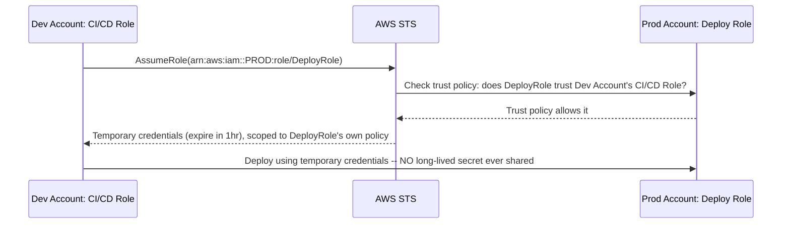
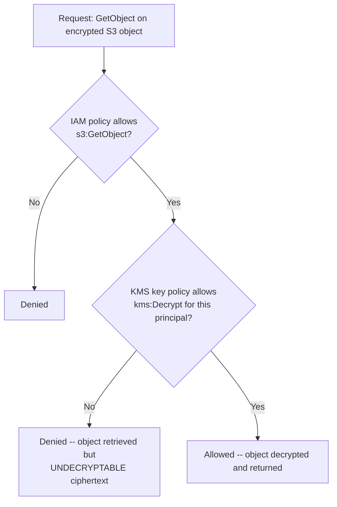

# Module 58 — AWS: IAM & Security — Roles, Policies, KMS, Secrets Manager & Cross-Account Access

> Domain: AWS | Level: Beginner → Expert | Prerequisite: [[01-Compute-Networking-VPC-LoadBalancing-AutoScaling]] §2.6, §8 (Security Groups as network-layer least-privilege; this module covers the identity-layer complement), [[../16-Distributed-Systems/01-Consensus-Consistency-Distributed-Transactions]] (trust boundaries in distributed systems, now expressed as AWS account/role boundaries)

---

## 1. Fundamentals

### Why does a Principal Engineer need IAM depth beyond "attach a policy and move on"?
IAM is the single control plane that determines whether every other AWS service — compute, storage, databases, messaging — is actually secure or is a well-networked, well-scaled, entirely-exposed system: a perfectly designed VPC (Module 57 §2.1) with a permissive IAM role attached to an EC2 instance can still leak an entire account's data, because network segmentation only controls *where* a request can come from, while IAM controls *what a request is allowed to do once it's authenticated* — a distinct, independent axis of control that a Principal Engineer must reason about with equal rigor.

### Why does this matter?
Because IAM misconfiguration is the most common root cause of real-world cloud security incidents (overly broad roles, long-lived credentials, unscoped trust policies) — a Principal Engineer is expected to design an organization's IAM model (role structure, permission boundaries, cross-account trust) as deliberately as its network topology, and to be the person who catches "this policy is more permissive than the workload actually needs" during a design or code review, not after an incident.

### When does this matter?
Any time a workload needs to call another AWS service (an EC2 instance reading from S3, a Lambda function writing to DynamoDB), any time human operators need console/CLI access, and any time two AWS accounts (a dev account and a prod account, or two different teams' accounts) need to interact — which, in any real organization running more than a toy workload, is effectively always.

### How does it work (30,000-ft view)?
```
IAM Policy: a JSON document listing allowed/denied actions on specific resources (the "what")
IAM Role: an identity that AWS resources (EC2, Lambda) or trusted principals (users, other
     accounts) can ASSUME to temporarily gain a policy's permissions — no long-lived credentials
IAM User: a long-lived, named identity with its own credentials -- avoid for workloads, minimize
     for humans (prefer federated/SSO access assuming a role)
KMS: managed encryption-key service -- encrypts data at rest, with fine-grained key-usage policies
Secrets Manager: managed storage for credentials/API keys, with automatic rotation
Trust Policy: attached to a Role, defines WHO is allowed to assume it (a service, an account, a user)
```

---

## 2. Deep Dive

### 2.1 The Policy/Role/Trust-Policy Triangle — the Foundational IAM Model
Every IAM permission decision rests on three distinct documents that are easy to conflate: an **identity-based policy** (attached to a user, role, or group) defines what actions that identity is allowed to take on which resources; a **resource-based policy** (attached to the resource itself — an S3 bucket policy, a KMS key policy) defines who is allowed to access that specific resource, evaluated independently and *in addition to* identity-based policies; and a **trust policy** (attached only to roles) defines who is allowed to **assume** the role in the first place, a distinct question from what the role can do once assumed. A request is only permitted if the identity-based policy allows it (or a resource-based policy independently grants it), and — critically — an explicit **Deny** in any applicable policy always overrides any Allow, regardless of where that Deny appears (directly analogous to Module 57 §2.6's Security-Group implicit-deny model, but IAM's explicit-deny-wins rule is a distinct, additional mechanism, not the same rule).

### 2.2 IAM Roles and Temporary Credentials — Eliminating Long-Lived Secrets
A Role has no credentials of its own; instead, a trusted principal (an EC2 instance via an **instance profile**, a Lambda function via its **execution role**, a human federating through SSO, or another AWS account) **assumes** the role via the AWS Security Token Service (STS), receiving short-lived, automatically-expiring temporary credentials — this is the single most consequential IAM design decision available: a workload using a role-based instance profile never has a static access key sitting in code, a config file, or an environment variable that could leak, be committed to a repository, or persist indefinitely, whereas a long-lived IAM User access key is a standing secret that (per Module 28's least-privilege-over-time discussion) must be actively rotated, monitored, and eventually still represents an unbounded-lifetime credential exposure risk that a temporary, auto-expiring role credential structurally cannot.

### 2.3 Least Privilege in Practice — Permission Boundaries and Scoped Policies
Least privilege means a policy should grant exactly the specific actions on exactly the specific resources a workload genuinely needs — not `s3:*` on `*` when a Lambda function only ever needs `s3:GetObject` on one specific bucket prefix — and AWS provides **Permission Boundaries** (a policy that caps the *maximum* permissions an IAM entity can ever have, even if its own identity-based policy is broader) as a governance mechanism specifically for organizations that let individual teams create their own roles: the permission boundary is the organization's non-negotiable ceiling, while the team's own policy operates within it, directly Module 51's team-topology discussion (decentralized ownership needs centralized guardrails) now expressed as an IAM-specific control.

### 2.4 Cross-Account Access — Trust Without Shared Credentials
When Account A needs to access a resource in Account B (a common pattern in any organization with separate dev/staging/prod accounts, per the multi-account isolation strategy Module 64 will cover), the mechanism is a role in Account B with a trust policy explicitly naming Account A (or a specific role within it) as a trusted principal — Account A's principal then calls STS `AssumeRole` targeting that role's ARN, receiving temporary credentials scoped to exactly what Account B's role permits, with **no shared long-lived credentials ever crossing the account boundary** — this is the AWS-native implementation of the trust-boundary-without-shared-secrets principle, directly extending Module 47's distributed-trust discussion (consensus/trust between independent nodes) to the account-boundary level, and is why a well-designed multi-account structure never requires literally sharing an IAM User's access key between teams or environments.

### 2.5 KMS — Encryption Key Management as a First-Class, Access-Controlled Resource
AWS Key Management Service (KMS) manages encryption keys used to encrypt data at rest across nearly every AWS service (S3, EBS, RDS, DynamoDB) — critically, a KMS key has its **own** resource-based policy (a **key policy**) independent of the IAM policies governing the data it encrypts, meaning access to *decrypt* data genuinely requires **both** permission on the underlying resource (e.g., `s3:GetObject`) **and** permission to use the specific KMS key that encrypted it (`kms:Decrypt`) — a deliberate two-factor access-control design: compromising IAM permissions on a resource alone doesn't grant the ability to decrypt it if the attacker doesn't separately hold KMS key-usage permission, a genuine defense-in-depth layer, not a redundant one.

### 2.6 Secrets Manager — Eliminating Hardcoded Credentials Structurally
Secrets Manager stores credentials (database passwords, third-party API keys) with fine-grained IAM-controlled access and **automatic rotation** (a Lambda function Secrets Manager itself invokes on a schedule to rotate the credential and update it at the source, e.g., an RDS database's actual password) — the structural benefit mirrors §2.2's role-based-credentials principle: an application retrieves the current secret value at runtime via an IAM-permitted API call rather than the secret being hardcoded or manually distributed, meaning a compromised credential has a bounded lifetime (until the next automatic rotation) rather than persisting indefinitely, and a credential rotation event requires zero application code changes or redeployment, since the application always fetches the *current* value at runtime.

---

## 3. Visual Architecture

### Cross-Account Role Assumption


### KMS Two-Factor Access Control


## 4. Production Example
**Scenario**: A platform team provisioned a shared EC2 instance role used by several backend services, and — to "unblock development quickly" during an early sprint — attached the AWS-managed `AmazonS3FullAccess` policy to that role (granting `s3:*` on every bucket in the account) rather than scoping it to the two specific buckets the services actually needed, with an internal note to "tighten this before production" that was never followed up on. Eighteen months later, one of the services running under that role had an unrelated server-side request forgery (SSRF) vulnerability in a feature that fetched user-supplied URLs — an attacker exploited it to reach the EC2 instance metadata service, retrieve the instance role's temporary credentials, and then used those credentials directly against the AWS API. **Investigation**: because the role held `s3:*` on every bucket, the credentials obtained via the SSRF vulnerability granted the attacker read/write/delete access not just to the two buckets the vulnerable service actually used, but to **every other bucket in the account**, including buckets used by entirely unrelated services and teams that had nothing to do with the vulnerable application — the SSRF vulnerability itself was the initial entry point, but the IAM over-permissioning is what turned a single service's vulnerability into an account-wide data-exposure incident. **Root cause**: the role's permissions were scoped to "everything this AWS-managed policy happens to cover" rather than "exactly what this specific set of services needs," and the "tighten before production" follow-up — a manual, easy-to-deprioritize task with no enforcement mechanism — never actually happened, directly Module 56 §Advanced Q6's permissive-rule-accumulation pattern, now realized as an actual incident rather than a hypothetical risk. **Fix**: replaced the shared, overly broad role with per-service roles, each scoped via a custom policy to exactly the specific bucket ARNs and specific S3 actions (`GetObject`, `PutObject` on specific prefixes — never `s3:*`) that service genuinely required, and implemented an automated IAM Access Analyzer check (§Advanced Q6 pattern) that flags any policy granting a wildcard action or wildcard resource for mandatory review before it can be attached in production. **Lesson**: "unblock development quickly, tighten later" is a recurring, plausible-sounding justification for exactly the kind of IAM over-permissioning that turns an unrelated, contained vulnerability into an account-wide incident — the fix must be structural (an automated gate that blocks overly broad policies) rather than a manual follow-up task, precisely because manual follow-ups on already-working, invisible-cost permissions are the least reliably-executed kind of technical debt.

## 5. Best Practices
- Always prefer IAM Roles with temporary, auto-expiring credentials over IAM User long-lived access keys for any workload — never embed static credentials in code or configuration.
- Scope every policy to the specific actions and specific resource ARNs a workload genuinely needs — never attach broad AWS-managed policies (`*FullAccess`) as a "temporary" measure without an enforced follow-up.
- Use cross-account role assumption (§2.4) for any multi-account access pattern — never share a long-lived credential across an account boundary.
- Store all application secrets (database credentials, API keys) in Secrets Manager with automatic rotation enabled, never hardcoded or manually distributed.
- Apply Permission Boundaries (§2.3) in any organization where individual teams can create their own IAM roles, establishing a non-negotiable maximum-permission ceiling.

## 6. Anti-patterns
- Attaching a broad, wildcard-scoped policy (`s3:*` on `*`) "to unblock development quickly" with an informal, unenforced intent to tighten it later (§4).
- Embedding long-lived IAM User access keys in application code, configuration files, or environment variables rather than using role-based temporary credentials.
- Sharing a single IAM User's credentials across multiple team members or across an account boundary, rather than using per-principal role assumption.
- Granting KMS key-usage permission as broadly as the underlying resource's IAM policy, treating the two-factor design (§2.5) as redundant rather than an intentional additional control.
- Hardcoding database passwords or API keys directly in source code or unencrypted configuration rather than retrieving them from Secrets Manager at runtime.

---

## 10. Interview Questions

### Basic (10)
1. **Q: What is the difference between an IAM Policy and an IAM Role?** **A:** A Policy is a document defining allowed/denied actions on resources; a Role is an assumable identity that a policy is attached to, granting temporary credentials to whoever assumes it.
2. **Q: Why are IAM Roles generally preferred over IAM Users for workloads?** **A:** Roles provide short-lived, auto-expiring temporary credentials via STS, eliminating the standing-secret exposure risk of a long-lived IAM User access key.
3. **Q: What is a trust policy?** **A:** A policy attached to a role defining who is allowed to assume it — a distinct question from what the role can do once assumed.
4. **Q: What happens when an explicit Deny and an Allow both apply to the same request?** **A:** The explicit Deny always wins, regardless of which policy it appears in.
5. **Q: What does KMS do?** **A:** Manages encryption keys used to encrypt data at rest across AWS services, with its own independent access-control policy.
6. **Q: What does Secrets Manager provide beyond simply storing a secret value?** **A:** Fine-grained IAM-controlled access and automatic, scheduled credential rotation.
7. **Q: What is a Permission Boundary?** **A:** A policy that caps the maximum permissions an IAM entity can ever have, regardless of its own identity-based policy.
8. **Q: What is cross-account role assumption?** **A:** A mechanism where a role in Account B trusts a principal in Account A, allowing Account A to call STS AssumeRole to get temporary credentials scoped to that role, without sharing long-lived credentials.
9. **Q: What is envelope encryption?** **A:** A pattern where KMS encrypts a local data key once, which is then used to encrypt/decrypt data locally without a KMS API call per operation.
10. **Q: Why does decrypting KMS-encrypted data require two separate permission checks?** **A:** Permission on the underlying resource (e.g., `s3:GetObject`) and separately, `kms:Decrypt` permission on the specific KMS key — a deliberate two-factor design.

### Intermediate (10)
1. **Q: Why does an EC2 instance profile role structurally eliminate a class of credential-leak risk that a hardcoded IAM User access key does not?** **A:** The instance profile never places static credentials in code, config, or environment variables; temporary credentials are fetched at runtime via the instance metadata service and auto-expire, so there's no standing secret to leak from a repository or log file.
2. **Q: Why is "attach a broad AWS-managed policy now, tighten it before production" a risky pattern even when the intent is genuine?** **A:** It relies on a manual, unenforced follow-up task that's easy to deprioritize once the workload is "working fine" — without a structural gate (an automated policy-linting check), the broad permission can persist indefinitely and turn an unrelated future vulnerability into a much larger-blast-radius incident (§4).
3. **Q: Why does KMS's separate key policy provide genuine defense-in-depth rather than being redundant with the underlying resource's IAM policy?** **A:** A compromise that grants IAM access to the resource (e.g., via an application vulnerability) doesn't automatically grant KMS decrypt permission if that's independently and more tightly scoped, meaning an attacker with resource-level access alone still cannot decrypt the actual sensitive content.
4. **Q: Why should Secrets Manager retrievals be cached rather than called on every request?** **A:** Each call is a network round-trip with a latency cost and counts against Secrets Manager's API rate limits — caching the secret in memory until rotation-driven invalidation avoids both the unnecessary latency and the risk of hitting rate limits under load.
5. **Q: Why is a Service Control Policy's explicit Deny a stronger governance mechanism than simply asking account administrators to follow a permission policy?** **A:** An SCP's explicit Deny cannot be overridden by any more-permissive identity-based policy within the account, making it a genuinely non-bypassable organizational rule rather than a convention individual administrators could (even accidentally) circumvent.
6. **Q: Why does cross-account role assumption avoid the risks of sharing a long-lived credential across an account boundary?** **A:** The accessing account never receives a standing secret — it receives short-lived, auto-expiring temporary credentials scoped to exactly what the trusted role permits, so there's no persistent credential that could leak or need manual rotation across the boundary.
7. **Q: Why are Permission Boundaries specifically useful in an organization where individual teams can create their own IAM roles?** **A:** They establish a centrally-enforced maximum-permission ceiling that a team's self-authored policy cannot exceed, reconciling decentralized role creation with centralized security governance.
8. **Q: Why can a database-password rotation via Secrets Manager happen with zero application code changes or redeployment?** **A:** The application always retrieves the current secret value at runtime via an IAM-permitted API call rather than having the value baked into its deployed configuration, so a new rotated value is picked up transparently on the next retrieval.
9. **Q: Why does the §4 incident's blast radius specifically stem from IAM scope rather than the SSRF vulnerability itself?** **A:** The SSRF vulnerability was the entry point, but it only granted access to whatever the compromised role's own permissions covered — because that role held account-wide `s3:*`, an otherwise-contained single-service vulnerability became an account-wide data-exposure incident; a properly-scoped role would have limited the same vulnerability's impact to just the two buckets that service actually used.
10. **Q: Why is envelope encryption preferred over calling KMS `Decrypt` directly for every individual data operation in a high-throughput workload?** **A:** Direct per-operation KMS calls introduce both per-call latency and exposure to KMS API rate limits at high volume; envelope encryption performs the KMS call once per data key (used to encrypt/decrypt many records locally), avoiding both costs while preserving KMS-managed key security.

### Advanced (10)
1. **Q: Diagnose the §4 incident from first principles, and design the specific automated control that would have prevented the broad policy from ever reaching production, independent of any individual's follow-up diligence.**
   **A:** Root cause: a wildcard-scoped policy (`s3:*` on `*`) was attached with only an informal, unenforced intent to narrow it later. Structural fix: an IAM Access Analyzer / policy-linting check integrated into the deployment pipeline that blocks any policy containing a wildcard action or wildcard resource ARN from being attached in a production account without an explicit, reviewed exception — converting a reliance on individual follow-through into a non-bypassable gate, directly Module 56 §Advanced Q6's automated-governance pattern applied to IAM specifically.
2. **Q: A team argues that since their workload runs entirely within a single, private VPC subnet (Module 57 §2.1) with no direct internet exposure, IAM policy scoping for that workload's role is less critical. Evaluate this as a Principal Engineer.**
   **A:** Push back — network isolation and IAM scope are independent control axes (§1); a vulnerability reachable *from within* the private network (a compromised dependency, an internal SSRF as in §4, a misconfigured internal service accessible to other internally-compromised systems) still exploits whatever the role's IAM permissions allow, entirely independent of network reachability from the internet — network isolation reduces the *likelihood* of external compromise reaching the workload, but does not reduce the *blast radius* if the workload (or something with access to it) is compromised by any means, so IAM scoping remains necessary regardless of network exposure.
3. **Q: Design the specific cross-account IAM structure for an organization with separate dev, staging, and production AWS accounts, where a CI/CD pipeline running in a dedicated "tooling" account needs to deploy to all three.**
   **A:** Create a deploy role in each of dev/staging/prod with a trust policy naming the tooling account's specific CI/CD role as the only trusted principal (never a broad "trust the entire tooling account"), each deploy role's own policy scoped to exactly the deployment actions needed in that environment (and progressively tighter as accounts move toward production — e.g., the prod deploy role might require an additional MFA or approval-gated condition the dev role doesn't), with the CI/CD pipeline calling `AssumeRole` targeting the appropriate environment-specific role per deployment stage — no shared credentials, and each environment's blast radius is contained to that environment's own explicitly-scoped role.
4. **Q: Explain why KMS's per-call rate limits and envelope encryption (§7) represent the same category of trade-off as Module 57 §9's Auto Scaling Group / subnet IP-capacity mismatch, and generalize the underlying principle.**
   **A:** Both are cases where a security or resilience mechanism (KMS encryption, multi-AZ ASG scaling) has an independently-configured capacity ceiling (KMS API rate limits, subnet CIDR size) that isn't automatically reconciled with the primary mechanism's own configured scale (a high-throughput encryption workload, an ASG's maximum instance count) — the generalized principle: any AWS service composed of multiple independently-scaling dimensions requires an explicit capacity-planning exercise reconciling all of them together, since satisfying one dimension's configuration doesn't guarantee the system's actual achievable capacity is bounded only by that dimension.
5. **Q: A security team wants to enforce that no IAM User access keys can ever be created in any account across the organization, but individual account administrators currently have the IAM permissions to create them. Design the enforcement mechanism.**
   **A:** Apply a Service Control Policy (§8) at the AWS Organizations root or relevant organizational unit with an explicit Deny on `iam:CreateAccessKey` — because SCPs set the maximum *possible* permission ceiling for every account/role beneath them in the organization hierarchy and an explicit Deny always wins (§2.1), no identity-based policy within any affected account — including a full account administrator's own policy — can override this restriction, making it a genuinely organization-wide, non-bypassable rule rather than a convention that depends on every administrator individually complying.
6. **Q: Critique the following claim: "Since our KMS key policy is scoped correctly, our data is protected even if our application's IAM role is over-permissioned."**
   **A:** Partially true but dangerously incomplete — a correctly-scoped KMS key policy does prevent decryption by a principal that doesn't hold `kms:Decrypt` on that specific key (§2.5), but an over-permissioned IAM role can still cause damage entirely independent of encryption: deleting, overwriting, or exfiltrating still-encrypted ciphertext (denial of availability/integrity even without confidentiality breach), or accessing entirely different, unencrypted resources the same over-broad role also happens to cover (as in §4, where the exposed role's `s3:*` covered many buckets beyond the vulnerable service's own) — KMS scoping is a necessary defense-in-depth layer for confidentiality specifically, not a substitute for correctly-scoped IAM policies addressing the full range of impact.
7. **Q: Design the specific automatic-rotation testing practice needed to ensure a Secrets Manager rotation Lambda doesn't silently break application connectivity when it fires.**
   **A:** Rotation should be tested in a non-production environment on the same schedule/mechanism as production, with an automated post-rotation connectivity check (the application, or a synthetic canary, actually attempting to use the newly-rotated credential immediately after rotation completes) — because a rotation Lambda that updates the credential at the source (e.g., the RDS password) but has a bug preventing it from correctly completing the multi-step rotation protocol (AWS's rotation Lambdas use a create/set/test/finish four-step process specifically to avoid this) can leave the application unable to connect with either the old or new credential, a failure mode invisible until the next rotation actually fires in production without this safeguard.
8. **Q: A Principal Engineer is asked to justify the additional operational complexity of per-service IAM roles (as adopted in §4's fix) versus a smaller number of broader, shared roles that are simpler to manage. Make the case.**
   **A:** The operational complexity of maintaining more, more-narrowly-scoped roles is a bounded, predictable, ongoing cost (slightly more IaC/role definitions to maintain); the risk of a shared, broader role is an unbounded, tail-risk cost realized exactly when least convenient — a single vulnerability in any one service sharing the broad role inherits that role's *entire* permission set as its blast radius (§4), meaning the "simpler to manage" argument optimizes for day-to-day convenience while accepting a disproportionate, low-probability-but-high-severity incident risk — for any workload handling genuinely sensitive data or with meaningfully-sized blast radius if compromised, the bounded ongoing cost is the correct trade-off, directly the same reasoning as Module 49's service-decomposition blast-radius argument, now applied to IAM role granularity specifically.
9. **Q: Explain why "our IAM policies pass a manual security review before every production deployment" is a weaker safeguard than "our deployment pipeline automatically blocks overly broad policies," even if the manual review is conducted diligently.**
   **A:** Manual review's reliability depends on the reviewer's available time, attention, and consistency across every single review — under deadline pressure (exactly the condition described in §4, "unblock development quickly") a manual review is the control most likely to be rushed or skipped, whereas an automated pipeline gate applies the identical check with the identical rigor on every single deployment regardless of time pressure, team, or reviewer — directly Module 51's testing-strategy discussion (automated checks catch what inconsistent manual process eventually misses) applied to security review specifically.
10. **Q: As a Principal Engineer establishing IAM standards for an organization, design the specific set of standing architectural reviews and automated checks (synthesizing this entire module) you would require for every new AWS account and workload.**
    **A:** (1) Mandatory automated policy-linting blocking wildcard action/resource policies in production without an explicit, reviewed exception (Advanced Q1) — necessary because manual follow-up on "tighten this later" is unreliable. (2) Mandatory Permission Boundaries applied to any role a non-central team can create (§2.3) — necessary to reconcile decentralized role creation with centralized governance at scale (§9). (3) Organization-wide Service Control Policies enforcing non-negotiable rules (no IAM User access keys, mandatory MFA for human console access) (Advanced Q5) — necessary because these must be genuinely non-bypassable, not convention-dependent. (4) Mandatory per-service (not shared) IAM roles for any workload handling sensitive data or with meaningful blast radius if compromised (Advanced Q8) — necessary to bound incident blast radius to the actually-vulnerable component. (5) Automated post-rotation connectivity verification for every Secrets Manager rotation configuration (Advanced Q7) — necessary because rotation failures are otherwise invisible until the next scheduled rotation fires in production. Each standard targets a distinct, concrete failure mode this module identified through specific incidents or reasoning, directly extending the governance-gate pattern established in Modules 56-57 into the IAM/identity layer specifically.

---

## 11. Coding Exercises

*(IAM/security exercises are primarily policy/IaC configuration — this module includes representative Infrastructure-as-Code demonstrating the key patterns.)*

### Easy — Scoped, least-privilege S3 policy (§2.3, the §4 fix)
```json
{
  "Version": "2012-10-17",
  "Statement": [
    {
      "Effect": "Allow",
      "Action": ["s3:GetObject", "s3:PutObject"],
      "Resource": "arn:aws:s3:::checkout-orders-bucket/orders/*"
    }
  ]
}
```
```hcl
# NOT this -- the §4 anti-pattern:
# resource "aws_iam_role_policy_attachment" "bad" {
#   policy_arn = "arn:aws:iam::aws:policy/AmazonS3FullAccess"  # s3:* on EVERY bucket
# }
```

### Medium — Cross-account role with scoped trust policy (§2.4, §Advanced Q3)
```json
{
  "Version": "2012-10-17",
  "Statement": [
    {
      "Effect": "Allow",
      "Principal": {
        "AWS": "arn:aws:iam::111111111111:role/CICD-Pipeline-Role"
      },
      "Action": "sts:AssumeRole",
      "Condition": {
        "StringEquals": { "sts:ExternalId": "prod-deploy-2026" }
      }
    }
  ]
}
```
```csharp
var stsClient = new AmazonSecurityTokenServiceClient();
var response = await stsClient.AssumeRoleAsync(new AssumeRoleRequest
{
    RoleArn = "arn:aws:iam::222222222222:role/ProdDeployRole",
    RoleSessionName = "cicd-deploy-session",
    ExternalId = "prod-deploy-2026",
    DurationSeconds = 900   // short-lived -- only as long as the deploy actually needs
});
// response.Credentials -- temporary, auto-expiring -- NEVER a long-lived shared secret
```

### Hard — Secrets Manager retrieval with in-memory caching (§7)
```csharp
public class CachedSecretProvider
{
    private readonly IAmazonSecretsManager _client;
    private readonly ConcurrentDictionary<string, (string Value, DateTime ExpiresAt)> _cache = new();

    public async Task<string> GetSecretAsync(string secretName)
    {
        if (_cache.TryGetValue(secretName, out var cached) && cached.ExpiresAt > DateTime.UtcNow)
            return cached.Value;   // avoid a Secrets Manager API call on every request (§7)

        var response = await _client.GetSecretValueAsync(new GetSecretValueRequest { SecretId = secretName });
        // Cache for a bounded window -- short enough to pick up rotation reasonably promptly,
        // long enough to avoid hammering the Secrets Manager API under load.
        _cache[secretName] = (response.SecretString, DateTime.UtcNow.AddMinutes(5));
        return response.SecretString;
    }
}
```

### Expert — Envelope encryption with KMS (§2.5, §7, §Advanced Q4)
```csharp
public class EnvelopeEncryptionService
{
    private readonly IAmazonKeyManagementService _kms;
    private const string KmsKeyId = "arn:aws:kms:us-east-1:222222222222:key/order-data-key";

    public async Task<(byte[] Ciphertext, byte[] EncryptedDataKey)> EncryptAsync(byte[] plaintext)
    {
        // ONE KMS call generates a local data key -- NOT a KMS call per record (§7's rate-limit lesson)
        var dataKeyResponse = await _kms.GenerateDataKeyAsync(new GenerateDataKeyRequest
        {
            KeyId = KmsKeyId,
            KeySpec = DataKeySpec.AES_256
        });

        using var aes = Aes.Create();
        aes.Key = dataKeyResponse.Plaintext.ToArray();   // used LOCALLY, never sent back to KMS
        // ... encrypt plaintext locally with aes.Key ...
        byte[] ciphertext = EncryptLocally(plaintext, aes.Key);

        return (ciphertext, dataKeyResponse.CiphertextBlob.ToArray());  // store the ENCRYPTED data key alongside the ciphertext
    }

    public async Task<byte[]> DecryptAsync(byte[] ciphertext, byte[] encryptedDataKey)
    {
        // Only THIS call requires kms:Decrypt permission on the key (§2.5's two-factor check)
        var decryptResponse = await _kms.DecryptAsync(new DecryptRequest
        {
            CiphertextBlob = new MemoryStream(encryptedDataKey)
        });
        return DecryptLocally(ciphertext, decryptResponse.Plaintext.ToArray());
    }
}
```
**Discussion**: the data key is used locally for the actual bulk encryption/decryption work, and only the (small) encrypted data key itself requires a KMS API call to unwrap — this is what makes envelope encryption scale to high-throughput workloads without hitting KMS's per-call rate limits, while still requiring `kms:Decrypt` permission on the master key (§2.5's two-factor access control) for anyone attempting to actually recover the data.

---

## 12–17. System Design / LLD / Debugging / Decision / Case Study / Principal

*(§4's incident, the four §11 exercises, and the Advanced-tier Q&A — especially Advanced Q1's automated policy-linting gate, Advanced Q3's cross-account deploy structure, and Advanced Q10's synthesized governance checklist — collectively constitute this module's system-design, debugging, and Principal-Engineer-level content.)*

## 18. Revision
**Key takeaways**: IAM's Policy/Role/Trust-Policy triangle (§2.1) is the identity-layer complement to Module 57's network-layer Security Groups — both are necessary, neither substitutes for the other. Role-based temporary credentials (§2.2) structurally eliminate the standing-secret exposure risk of long-lived IAM User access keys, and should be the default for every workload. Least privilege must be enforced structurally (automated policy-linting, Permission Boundaries) rather than relying on manual follow-through, since "tighten this later" is a plausible-sounding intent that reliably fails under deadline pressure (§4). KMS's independent key policy and Secrets Manager's automatic rotation both provide genuine, non-redundant defense-in-depth layers beyond resource-level IAM policy alone. Cross-account access should always use role assumption via STS, never shared long-lived credentials. The same "independently-configured settings/capacity dimensions must be reconciled together" pattern from Module 57 §9 recurs here with KMS/Secrets Manager API rate limits versus actual workload throughput (§7) — a theme worth carrying forward into every subsequent AWS module.

---

**Next**: Continuing to Module 59 — AWS: Storage (S3 storage classes/consistency, EBS, EFS, durability trade-offs), continuing the `21-AWS` domain.
