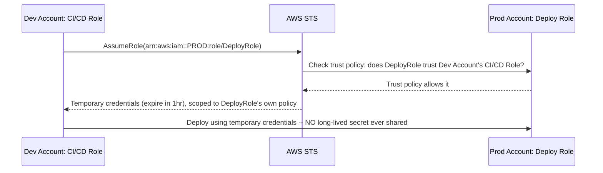
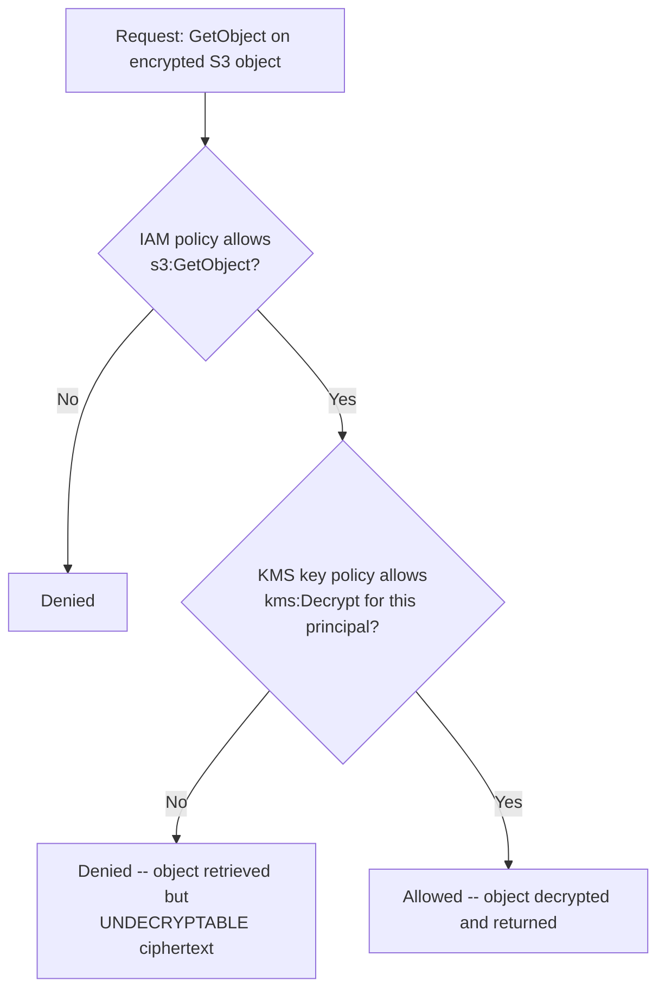
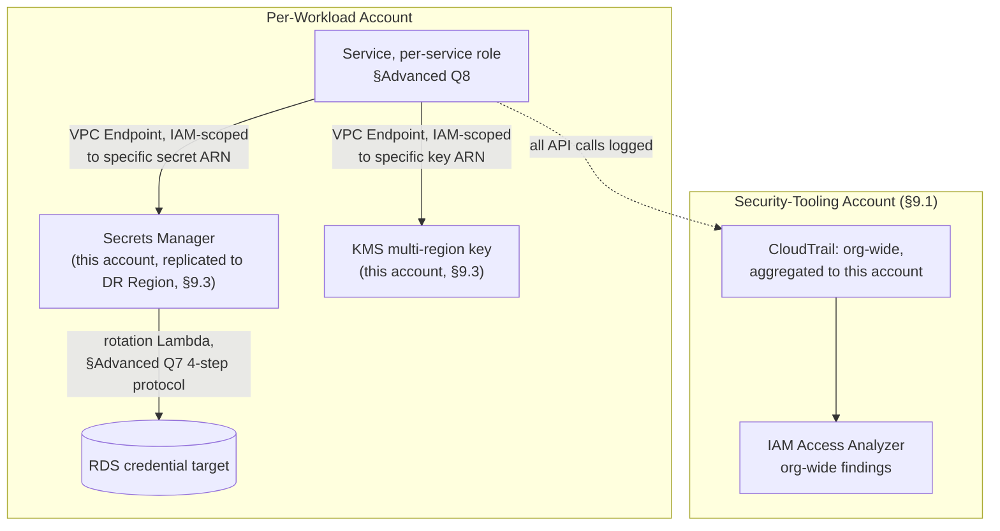
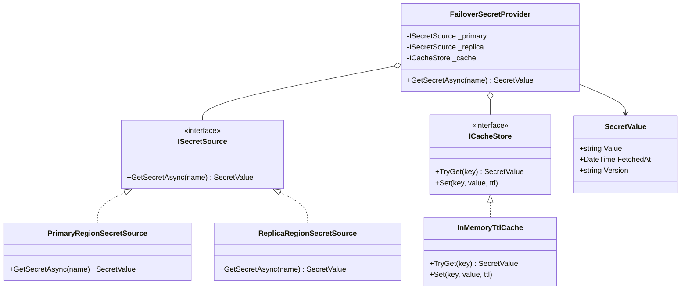
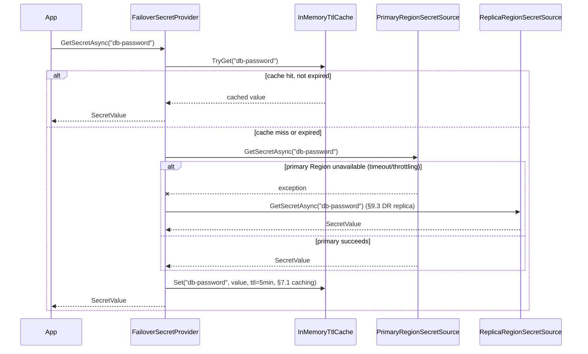

# Module 58 — AWS: IAM & Security — Roles, Policies, KMS, Secrets Manager & Cross-Account Access

> Domain: AWS | Level: Beginner → Expert | Prerequisite: [[01-Compute-Networking-VPC-LoadBalancing-AutoScaling]], (Security Groups as network-layer least-privilege; this module covers the identity-layer complement), [[../16-Distributed-Systems/01-Consensus-Consistency-Distributed-Transactions]] (trust boundaries in distributed systems, now expressed as AWS account/role boundaries)

---

## 1. Fundamentals

### Why does a Principal Engineer need IAM depth beyond "attach a policy and move on"?
IAM is the single control plane that determines whether every other AWS service — compute, storage, databases, messaging — is actually secure or is a well-networked, well-scaled, entirely-exposed system: a perfectly designed VPC with a permissive IAM role attached to an EC2 instance can still leak an entire account's data, because network segmentation only controls *where* a request can come from, while IAM controls *what a request is allowed to do once it's authenticated* — a distinct, independent axis of control that a Principal Engineer must reason about with equal rigor.

### Why does this matter?
Because IAM misconfiguration is the most common root cause of real-world cloud security incidents (overly broad roles, long-lived credentials, unscoped trust policies) — a Principal Engineer is expected to design an organization's IAM model (role structure, permission boundaries, cross-account trust) as deliberately as its network topology, and to be the person who catches "this policy is more permissive than the workload actually needs" during a design or code review, not after an incident.

### When does this matter?
Any time a workload needs to call another AWS service (an EC2 instance reading from S3, a Lambda function writing to DynamoDB), any time human operators need console/CLI access, and any time two AWS accounts (a dev account and a prod account, or two different teams' accounts) need to interact — which, in any real organization running more than a toy workload, is effectively always.

### How does it work (30,000-ft view)?
```
IAM Policy: a JSON document listing allowed/denied actions on specific resources (the "what")
IAM Role: an identity that AWS resources (EC2, Lambda) or trusted principals (users, other
 accounts) can ASSUME to temporarily gain a policy's permissions — no long-lived credentials
IAM User: a long-lived, named identity with its own credentials -- avoid for workloads, minimize
 for humans (prefer federated/SSO access assuming a role)
KMS: managed encryption-key service -- encrypts data at rest, with fine-grained key-usage policies
Secrets Manager: managed storage for credentials/API keys, with automatic rotation
Trust Policy: attached to a Role, defines WHO is allowed to assume it (a service, an account, a user)
```

---

## 2. Deep Dive

### 2.1 The Policy/Role/Trust-Policy Triangle — the Foundational IAM Model
Every IAM permission decision rests on three distinct documents that are easy to conflate: an **identity-based policy** (attached to a user, role, or group) defines what actions that identity is allowed to take on which resources; a **resource-based policy** (attached to the resource itself — an S3 bucket policy, a KMS key policy) defines who is allowed to access that specific resource, evaluated independently and *in addition to* identity-based policies; and a **trust policy** (attached only to roles) defines who is allowed to **assume** the role in the first place, a distinct question from what the role can do once assumed. A request is only permitted if the identity-based policy allows it (or a resource-based policy independently grants it), and — critically — an explicit **Deny** in any applicable policy always overrides any Allow, regardless of where that Deny appears (directly analogous to the Security-Group implicit-deny model, but IAM's explicit-deny-wins rule is a distinct, additional mechanism, not the same rule).

### 2.2 IAM Roles and Temporary Credentials — Eliminating Long-Lived Secrets
A Role has no credentials of its own; instead, a trusted principal (an EC2 instance via an **instance profile**, a Lambda function via its **execution role**, a human federating through SSO, or another AWS account) **assumes** the role via the AWS Security Token Service (STS), receiving short-lived, automatically-expiring temporary credentials — this is the single most consequential IAM design decision available: a workload using a role-based instance profile never has a static access key sitting in code, a config file, or an environment variable that could leak, be committed to a repository, or persist indefinitely, whereas a long-lived IAM User access key is a standing secret that (per the least-privilege-over-time discussion) must be actively rotated, monitored, and eventually still represents an unbounded-lifetime credential exposure risk that a temporary, auto-expiring role credential structurally cannot.

### 2.3 Least Privilege in Practice — Permission Boundaries and Scoped Policies
Least privilege means a policy should grant exactly the specific actions on exactly the specific resources a workload genuinely needs — not `s3:*` on `*` when a Lambda function only ever needs `s3:GetObject` on one specific bucket prefix — and AWS provides **Permission Boundaries** (a policy that caps the *maximum* permissions an IAM entity can ever have, even if its own identity-based policy is broader) as a governance mechanism specifically for organizations that let individual teams create their own roles: the permission boundary is the organization's non-negotiable ceiling, while the team's own policy operates within it, directly the team-topology discussion (decentralized ownership needs centralized guardrails) now expressed as an IAM-specific control.

### 2.4 Cross-Account Access — Trust Without Shared Credentials
When Account A needs to access a resource in Account B (a common pattern in any organization with separate dev/staging/prod accounts, per the multi-account isolation strategy will cover), the mechanism is a role in Account B with a trust policy explicitly naming Account A (or a specific role within it) as a trusted principal — Account A's principal then calls STS `AssumeRole` targeting that role's ARN, receiving temporary credentials scoped to exactly what Account B's role permits, with **no shared long-lived credentials ever crossing the account boundary** — this is the AWS-native implementation of the trust-boundary-without-shared-secrets principle, directly extending the distributed-trust discussion (consensus/trust between independent nodes) to the account-boundary level, and is why a well-designed multi-account structure never requires literally sharing an IAM User's access key between teams or environments.

### 2.5 KMS — Encryption Key Management as a First-Class, Access-Controlled Resource
AWS Key Management Service (KMS) manages encryption keys used to encrypt data at rest across nearly every AWS service (S3, EBS, RDS, DynamoDB) — critically, a KMS key has its **own** resource-based policy (a **key policy**) independent of the IAM policies governing the data it encrypts, meaning access to *decrypt* data genuinely requires **both** permission on the underlying resource (e.g., `s3:GetObject`) **and** permission to use the specific KMS key that encrypted it (`kms:Decrypt`) — a deliberate two-factor access-control design: compromising IAM permissions on a resource alone doesn't grant the ability to decrypt it if the attacker doesn't separately hold KMS key-usage permission, a genuine defense-in-depth layer, not a redundant one.

### 2.6 Secrets Manager — Eliminating Hardcoded Credentials Structurally
Secrets Manager stores credentials (database passwords, third-party API keys) with fine-grained IAM-controlled access and **automatic rotation** (a Lambda function Secrets Manager itself invokes on a schedule to rotate the credential and update it at the source, e.g., an RDS database's actual password) — the structural benefit mirrors the role-based-credentials principle: an application retrieves the current secret value at runtime via an IAM-permitted API call rather than the secret being hardcoded or manually distributed, meaning a compromised credential has a bounded lifetime (until the next automatic rotation) rather than persisting indefinitely, and a credential rotation event requires zero application code changes or redeployment, since the application always fetches the *current* value at runtime.

---

## 3. Visual Architecture

### Cross-Account Role Assumption

```mermaid
sequenceDiagram
 participant DevAcct as Dev Account: CI/CD Role
 participant STS as AWS STS
 participant ProdAcct as Prod Account: Deploy Role
 DevAcct->>STS: AssumeRole(arn:aws:iam::PROD:role/DeployRole)
 STS->>ProdAcct: Check trust policy: does DeployRole trust Dev Account's CI/CD Role?
 ProdAcct-->>STS: Trust policy allows it
 STS-->>DevAcct: Temporary credentials (expire in 1hr), scoped to DeployRole's own policy
 DevAcct->>ProdAcct: Deploy using temporary credentials -- NO long-lived secret ever shared
```

### KMS Two-Factor Access Control

```mermaid
graph TB
 Req[Request: GetObject on encrypted S3 object] --> IAMCheck{"IAM policy allows<br/>s3:GetObject?"}
 IAMCheck -->|No| Deny1[Denied]
 IAMCheck -->|Yes| KMSCheck{"KMS key policy allows<br/>kms:Decrypt for this principal?"}
 KMSCheck -->|No| Deny2["Denied -- object retrieved but<br/>UNDECRYPTABLE ciphertext"]
 KMSCheck -->|Yes| Allow[Allowed -- object decrypted and returned]
```

## 4. Production Example
**Scenario**: A platform team provisioned a shared EC2 instance role used by several backend services, and — to "unblock development quickly" during an early sprint — attached the AWS-managed `AmazonS3FullAccess` policy to that role (granting `s3:*` on every bucket in the account) rather than scoping it to the two specific buckets the services actually needed, with an internal note to "tighten this before production" that was never followed up on. Eighteen months later, one of the services running under that role had an unrelated server-side request forgery (SSRF) vulnerability in a feature that fetched user-supplied URLs — an attacker exploited it to reach the EC2 instance metadata service, retrieve the instance role's temporary credentials, and then used those credentials directly against the AWS API. **Investigation**: because the role held `s3:*` on every bucket, the credentials obtained via the SSRF vulnerability granted the attacker read/write/delete access not just to the two buckets the vulnerable service actually used, but to **every other bucket in the account**, including buckets used by entirely unrelated services and teams that had nothing to do with the vulnerable application — the SSRF vulnerability itself was the initial entry point, but the IAM over-permissioning is what turned a single service's vulnerability into an account-wide data-exposure incident. **Root cause**: the role's permissions were scoped to "everything this AWS-managed policy happens to cover" rather than "exactly what this specific set of services needs," and the "tighten before production" follow-up — a manual, easy-to-deprioritize task with no enforcement mechanism — never actually happened, directly §Advanced Q6's permissive-rule-accumulation pattern, now realized as an actual incident rather than a hypothetical risk. **Fix**: replaced the shared, overly broad role with per-service roles, each scoped via a custom policy to exactly the specific bucket ARNs and specific S3 actions (`GetObject`, `PutObject` on specific prefixes — never `s3:*`) that service genuinely required, and implemented an automated IAM Access Analyzer check (§Advanced Q6 pattern) that flags any policy granting a wildcard action or wildcard resource for mandatory review before it can be attached in production. **Lesson**: "unblock development quickly, tighten later" is a recurring, plausible-sounding justification for exactly the kind of IAM over-permissioning that turns an unrelated, contained vulnerability into an account-wide incident — the fix must be structural (an automated gate that blocks overly broad policies) rather than a manual follow-up task, precisely because manual follow-ups on already-working, invisible-cost permissions are the least reliably-executed kind of technical debt.

## 5. Best Practices
- Always prefer IAM Roles with temporary, auto-expiring credentials over IAM User long-lived access keys for any workload — never embed static credentials in code or configuration.
- Scope every policy to the specific actions and specific resource ARNs a workload genuinely needs — never attach broad AWS-managed policies (`*FullAccess`) as a "temporary" measure without an enforced follow-up.
- Use cross-account role assumption for any multi-account access pattern — never share a long-lived credential across an account boundary.
- Store all application secrets (database credentials, API keys) in Secrets Manager with automatic rotation enabled, never hardcoded or manually distributed.
- Apply Permission Boundaries in any organization where individual teams can create their own IAM roles, establishing a non-negotiable maximum-permission ceiling.

## 6. Anti-patterns
- Attaching a broad, wildcard-scoped policy (`s3:*` on `*`) "to unblock development quickly" with an informal, unenforced intent to tighten it later.
- Embedding long-lived IAM User access keys in application code, configuration files, or environment variables rather than using role-based temporary credentials.
- Sharing a single IAM User's credentials across multiple team members or across an account boundary, rather than using per-principal role assumption.
- Granting KMS key-usage permission as broadly as the underlying resource's IAM policy, treating the two-factor design as redundant rather than an intentional additional control.
- Hardcoding database passwords or API keys directly in source code or unencrypted configuration rather than retrieving them from Secrets Manager at runtime.

---

## 7. Performance Engineering

### 7.1 STS AssumeRole Latency and Credential Caching
Every `AssumeRole` call is a network round-trip to STS (typically tens of milliseconds, but a real, non-zero cost) — calling it on the hot path of every request (rather than once per credential lifetime) adds avoidable latency and risks hitting STS's account-level rate limits under load. The AWS SDK's default credential providers (the instance-profile credential provider, the container-credential provider) already cache the temporary credentials they receive and only refresh shortly before expiry — a Principal Engineer reviewing a service's AWS-client configuration should verify it's using these SDK-managed, auto-refreshing credential providers rather than a custom implementation that naively calls `AssumeRole` per request, a mistake that's easy to introduce when a developer manually wires up cross-account access without realizing the SDK already solves the caching problem.

### 7.2 KMS API Call Cost and Rate Limits — Why Envelope Encryption Is a Performance Requirement, Not Just a Cost Optimization
KMS enforces account- and Region-level request-per-second quotas on cryptographic operations (`Decrypt`, `GenerateDataKey`, `Encrypt`) that, while raisable via a quota-increase request, are a real, hard ceiling at any given point in time — a workload that calls `kms:Decrypt` directly per-record at high transaction volume (a payment-processing pipeline decrypting individual card tokens one at a time) can hit `ThrottlingException` under peak load, turning a security control into an availability bottleneck. §2.6/§10 Basic Q9's envelope-encryption pattern is therefore not merely a cost optimization — it's a load-bearing performance requirement: one `GenerateDataKey` call per batch of records (or per session/connection) followed by unlimited local AES operations against the unwrapped data key keeps KMS call volume decoupled from actual transaction volume, which is the only way a KMS-encrypted high-throughput pipeline avoids becoming throttling-limited by its own encryption layer.

### 7.3 Secrets Manager Rotation Lambda Cold Starts and Rotation-Window Risk
A Secrets Manager rotation Lambda that isn't invoked frequently (rotation typically runs on a schedule of days, not minutes) experiences a cold start on every invocation — for most secrets this added latency (low hundreds of milliseconds) is immaterial against a rotation window measured in seconds-to-minutes, but for a **high-criticality** secret (a production database's master credential) where the rotation Lambda's four-step create/set/test/finish protocol (§Advanced Q7) must complete within a bounded window to avoid holding a lock or a connection-pool disruption longer than necessary, cold-start latency is a genuine, measurable contributor to that window's length — mitigated via provisioned concurrency on the rotation Lambda for the highest-criticality secrets specifically, not applied uniformly (provisioned concurrency has a standing cost, so it should be reserved for secrets where rotation-window latency is genuinely consequential).

### 7.4 IAM Policy Evaluation at Scale — Policy Size and Attachment Limits
IAM enforces hard size limits on policy documents (6,144 characters for a managed policy) and a limit on the number of managed policies attachable to a single role (10 by default, raisable) — an organization that grows its permission model by continuously appending new statements to a shared policy rather than periodically consolidating and pruning will eventually hit these limits, typically discovered at the worst possible time (mid-incident, when an on-call engineer needs to attach one more permission to unblock a fix and cannot). This is a distinct, purely mechanical scaling constraint from least-privilege design (§8.1) — a Principal Engineer should treat policy-size/attachment-count headroom as its own standing capacity metric to monitor for any IAM entity accumulating permissions over time, the identity-layer analogue to the sibling module's subnet-CIDR-capacity monitoring discipline.

### 7.5 Credential Refresh Blind Spot — Long-Running Processes and Stale SDK Clients
A long-running process (a batch job, a persistent worker) that constructs an AWS SDK client once at startup generally still benefits from the SDK's automatic credential refresh (the credential provider, not the client itself, holds the refreshing logic) — but a process that captures credentials **once** into its own variables (rather than letting the SDK's credential provider chain be consulted on each call) will silently begin failing with `ExpiredTokenException` once the captured temporary credentials' lifetime elapses, a failure mode that only manifests after the credential's TTL (commonly one hour) has passed, meaning it's invisible in a short-lived test or a quick manual verification and only surfaces in genuine long-running production usage — the fix is always to let the SDK's own credential-provider chain manage refresh rather than manually extracting and caching credential values outside of it.

---

## 8. Security

### 8.1 Designing Least-Privilege Policies in Practice — Access Advisor and Access Analyzer
Writing a least-privilege policy from a blank page for a non-trivial workload is impractical — the practical methodology is **iterative, evidence-based scoping**: start with a broader policy during initial development, then use **IAM Access Advisor** (shows which services/actions a role has *actually* used, by timestamp, over the last 400 days) to identify and remove genuinely unused permissions, and use **IAM Access Analyzer's policy generation** feature (which synthesizes a minimal policy from a role's actual CloudTrail activity over an observed window) to generate a draft least-privilege policy directly from real usage rather than manual guesswork — this converts least-privilege design from an error-prone manual exercise (guessing what a workload "should" need) into an evidence-based one (observing what it actually does), materially reducing the risk of either under-scoping (breaking the workload) or over-scoping (repeating §4's incident pattern).

### 8.2 The Confused Deputy Problem and `sts:ExternalId`
When Account A grants Account B's role permission to assume a role in Account A (a common third-party-integration pattern — a SaaS vendor's account needs to access resources in your account), a **confused deputy** risk arises if Account B's role ARN is reused across multiple, unrelated customers of that vendor: a malicious actor who knows another customer's Account-A role ARN could potentially trick the vendor's shared service (Account B) into assuming *that* customer's role instead of their own, if the trust policy alone is the only check. The mitigation is the **`sts:ExternalId`** condition on the trust policy — a shared secret, known only to Account A and the specific vendor relationship, that must be passed on every `AssumeRole` call and validated against the trust policy's condition, ensuring Account B's service can only assume the intended customer's role even if it's mistakenly instructed to target a different one — this is precisely why the Medium coding exercise in §11 includes an `ExternalId` condition, not as boilerplate but as the specific defense against this named, well-documented cross-account risk class.

### 8.3 `iam:PassRole` and `iam:CreatePolicyVersion` as Privilege-Escalation Vectors
Two IAM permissions are disproportionately dangerous when granted alongside broader account access, because they enable **privilege escalation** rather than direct resource access: `iam:PassRole` lets a principal attach an existing IAM role to a resource they create (an EC2 instance, a Lambda function) — if that principal can also create compute resources and pass an over-privileged role to it, they've effectively gained that role's entire permission set without ever being directly granted it; `iam:CreatePolicyVersion` (or `iam:PutRolePolicy` on a role they can also assume) lets a principal **rewrite their own permissions**, entirely bypassing whatever narrower policy they were originally granted. A least-privilege review must explicitly check for these two specific permission combinations — they are not caught by a naive "does this policy grant `s3:*`" scan, since the risk is combinatorial (permission X plus permission Y together), which is exactly why AWS's own IAM Access Analyzer includes dedicated "privilege escalation" finding types distinct from its basic overly-broad-policy findings.

### 8.4 Policy Evaluation Precedence — Reconciling SCPs, Permission Boundaries, Resource Policies, and Identity Policies
A request is only permitted if it passes **every** applicable layer, evaluated independently: an **SCP** (org-wide ceiling, can only restrict, never grant), a **Permission Boundary** (entity-level ceiling, can only restrict, never grant), an **identity-based policy** (must explicitly Allow), and, if the resource has one, a **resource-based policy** (can independently grant access in some cases, e.g., cross-account S3 bucket policies, but is still itself subject to the SCP/boundary ceilings) — and an explicit **Deny** anywhere in any of these layers overrides any Allow anywhere else (§2.1). A common design mistake is assuming a Permission Boundary or SCP "grants" the permissions it lists — it does not; it only caps what the identity-based policy can *additionally* grant, meaning a role with a generous Permission Boundary but a narrow identity-based policy still only has the narrow policy's actual permissions, a frequent source of "why can't this role do X even though the boundary allows it" confusion during incident response.

### 8.5 KMS Key Policy vs. IAM Policy — Which One Actually Governs Access
Per §2.5, KMS access requires both an IAM allow (on `kms:Decrypt`/`kms:Encrypt`/etc.) **and** the KMS key's own key policy allowing that principal — but the key policy has an additional wrinkle worth being precise about: a key policy that does **not** include the statement `"Effect": "Allow", "Principal": {"AWS": "arn:aws:iam::ACCOUNT:root"}, "Action": "kms:*"` (delegating authority to IAM) means IAM policies **cannot** grant access to that key at all, regardless of how permissive they are — the key policy is the actual root of trust for that key, and IAM policies only operate within whatever authority the key policy has delegated to the account. This is a frequent point of confusion during a security review: a role with a seemingly correct, scoped IAM policy granting `kms:Decrypt` can still be denied if the specific key's own key policy hasn't delegated evaluation authority to IAM for that principal — the key policy, not the IAM policy, is the actual final authority.

---

## 9. Scalability

### 9.1 AWS Organizations and the Multi-Account Landing Zone
As an organization grows beyond a handful of workloads, a single-account model becomes both an operational and a security scaling bottleneck (§8.4's blast-radius reasoning applies at the account level too — one over-permissioned role in a single account has organization-wide reach) — **AWS Organizations** with a deliberate multi-account structure (separate accounts per environment — dev/staging/prod — and often per major workload or team) is the standard scaling answer, with **Service Control Policies** (§Advanced Q5) providing centrally-enforced, non-bypassable guardrails across every account, and dedicated accounts for shared concerns (a logging/audit account, a security-tooling account) that individual workload teams don't have direct access to modify. A **Landing Zone** (AWS Control Tower, or an organization's own equivalent) automates the consistent provisioning of this structure — baseline SCPs, centralized CloudTrail logging, a standard account-vending process — so that account sprawl doesn't also mean *inconsistent* security posture sprawl.

### 9.2 IAM Identity Center — Scaling Human Access Beyond IAM Users
§5/§6 already establish IAM Users as an anti-pattern for workloads; the same reasoning applies, at organizational scale, to human access: managing individual IAM Users (and their passwords, MFA devices, access keys) per person across a multi-account organization doesn't scale operationally and multiplies standing-credential risk across every account. **IAM Identity Center** (successor to AWS SSO) centralizes human identity in one place (federated from a corporate identity provider — Okta, Azure AD, or AWS's own built-in directory), with **permission sets** mapped to roles in each target account — a person authenticates once, federates into the specific account/role combination they're authorized for, and never holds a standing IAM User credential in any individual account at all, directly extending the role-based-temporary-credential principle (§2.2) from workloads to humans, at organizational scale.

### 9.3 KMS Multi-Region Keys and Secrets Manager Cross-Region Replication
A multi-region architecture (the sibling module's §9.2) needs its encryption and secrets layer to be multi-region too, or it becomes the single-region bottleneck that defeats the rest of the DR design: **KMS multi-region keys** create a primary key and cryptographically-linked replica keys in other Regions (sharing the same key material, so ciphertext encrypted under the primary can be decrypted using a replica in a failover Region without re-encrypting all existing data), and **Secrets Manager's cross-region replication** maintains a read replica of a secret in a second Region, kept in sync automatically. Both must be deliberately provisioned as part of the DR design (§9.3 of the sibling module) — a common gap is a fully multi-region compute/data architecture that still points at a single-Region KMS key or Secrets Manager secret, silently reintroducing a single-Region dependency into an otherwise multi-region design.

### 9.4 Account and Role-Count Quotas at Scale
IAM enforces per-account quotas (roles per account, default 1,000, raisable; policies per account) that a rapidly-growing organization provisioning many fine-grained, per-service roles (§Advanced Q8's per-service-role recommendation, applied at scale) can genuinely approach — this is a direct tension worth naming explicitly: the same per-service-role granularity that minimizes blast radius (§Advanced Q8) also increases the total role count, and an organization scaling this pattern across hundreds of microservices across multiple accounts should proactively track role-count headroom per account (and request quota increases ahead of need, mirroring the sibling module's service-quota discussion) rather than treat "we ran out of role capacity" as a surprise blocking a new service launch.

---

## 10. Interview Questions

### Basic (10)
1. **Q: What is the difference between an IAM Policy and an IAM Role?** **A:** A Policy is a document defining allowed/denied actions on resources; a Role is an assumable identity that a policy is attached to, granting temporary credentials to whoever assumes it.
2. **Q: Why are IAM Roles generally preferred over IAM Users for workloads?** **A:** Roles provide short-lived, auto-expiring temporary credentials via STS, eliminating the standing-secret exposure risk of a long-lived IAM User access key.
3. **Q: What is a trust policy?** **A:** A policy attached to a role defining who is allowed to assume it — a distinct question from what the role can do once assumed.
4. **Q: What happens when an explicit Deny and an Allow both apply to the same request?** **A:** The explicit Deny always wins, regardless of which policy it appears in.
5. **Q: What does KMS do?** **A:** Manages encryption keys used to encrypt data at rest across AWS services, with its own independent access-control policy.
6. **Q: What does Secrets Manager provide beyond simply storing a secret value?** **A:** Fine-grained IAM-controlled access and automatic, scheduled credential rotation.
7. **Q: What is a Permission Boundary?** **A:** A policy that caps the maximum permissions an IAM entity can ever have, regardless of its own identity-based policy.
8. **Q: What is cross-account role assumption?** **A:** A mechanism where a role in Account B trusts a principal in Account A, allowing Account A to call STS AssumeRole to get temporary credentials scoped to that role, without sharing long-lived credentials.
9. **Q: What is envelope encryption?** **A:** A pattern where KMS encrypts a local data key once, which is then used to encrypt/decrypt data locally without a KMS API call per operation.
10. **Q: Why does decrypting KMS-encrypted data require two separate permission checks?** **A:** Permission on the underlying resource (e.g., `s3:GetObject`) and separately, `kms:Decrypt` permission on the specific KMS key — a deliberate two-factor design.

### Intermediate (10)
1. **Q: Why does an EC2 instance profile role structurally eliminate a class of credential-leak risk that a hardcoded IAM User access key does not?** **A:** The instance profile never places static credentials in code, config, or environment variables; temporary credentials are fetched at runtime via the instance metadata service and auto-expire, so there's no standing secret to leak from a repository or log file.
2. **Q: Why is "attach a broad AWS-managed policy now, tighten it before production" a risky pattern even when the intent is genuine?** **A:** It relies on a manual, unenforced follow-up task that's easy to deprioritize once the workload is "working fine" — without a structural gate (an automated policy-linting check), the broad permission can persist indefinitely and turn an unrelated future vulnerability into a much larger-blast-radius incident.
3. **Q: Why does KMS's separate key policy provide genuine defense-in-depth rather than being redundant with the underlying resource's IAM policy?** **A:** A compromise that grants IAM access to the resource (e.g., via an application vulnerability) doesn't automatically grant KMS decrypt permission if that's independently and more tightly scoped, meaning an attacker with resource-level access alone still cannot decrypt the actual sensitive content.
4. **Q: Why should Secrets Manager retrievals be cached rather than called on every request?** **A:** Each call is a network round-trip with a latency cost and counts against Secrets Manager's API rate limits — caching the secret in memory until rotation-driven invalidation avoids both the unnecessary latency and the risk of hitting rate limits under load.
5. **Q: Why is a Service Control Policy's explicit Deny a stronger governance mechanism than simply asking account administrators to follow a permission policy?** **A:** An SCP's explicit Deny cannot be overridden by any more-permissive identity-based policy within the account, making it a genuinely non-bypassable organizational rule rather than a convention individual administrators could (even accidentally) circumvent.
6. **Q: Why does cross-account role assumption avoid the risks of sharing a long-lived credential across an account boundary?** **A:** The accessing account never receives a standing secret — it receives short-lived, auto-expiring temporary credentials scoped to exactly what the trusted role permits, so there's no persistent credential that could leak or need manual rotation across the boundary.
7. **Q: Why are Permission Boundaries specifically useful in an organization where individual teams can create their own IAM roles?** **A:** They establish a centrally-enforced maximum-permission ceiling that a team's self-authored policy cannot exceed, reconciling decentralized role creation with centralized security governance.
8. **Q: Why can a database-password rotation via Secrets Manager happen with zero application code changes or redeployment?** **A:** The application always retrieves the current secret value at runtime via an IAM-permitted API call rather than having the value baked into its deployed configuration, so a new rotated value is picked up transparently on the next retrieval.
9. **Q: Why does the incident's blast radius specifically stem from IAM scope rather than the SSRF vulnerability itself?** **A:** The SSRF vulnerability was the entry point, but it only granted access to whatever the compromised role's own permissions covered — because that role held account-wide `s3:*`, an otherwise-contained single-service vulnerability became an account-wide data-exposure incident; a properly-scoped role would have limited the same vulnerability's impact to just the two buckets that service actually used.
10. **Q: Why is envelope encryption preferred over calling KMS `Decrypt` directly for every individual data operation in a high-throughput workload?** **A:** Direct per-operation KMS calls introduce both per-call latency and exposure to KMS API rate limits at high volume; envelope encryption performs the KMS call once per data key (used to encrypt/decrypt many records locally), avoiding both costs while preserving KMS-managed key security.

### Advanced (10)
1. **Q: Diagnose the incident from first principles, and design the specific automated control that would have prevented the broad policy from ever reaching production, independent of any individual's follow-up diligence.**
 **A:** Root cause: a wildcard-scoped policy (`s3:*` on `*`) was attached with only an informal, unenforced intent to narrow it later. Structural fix: an IAM Access Analyzer / policy-linting check integrated into the deployment pipeline that blocks any policy containing a wildcard action or wildcard resource ARN from being attached in a production account without an explicit, reviewed exception — converting a reliance on individual follow-through into a non-bypassable gate, directly §Advanced Q6's automated-governance pattern applied to IAM specifically.
2. **Q: A team argues that since their workload runs entirely within a single, private VPC subnet with no direct internet exposure, IAM policy scoping for that workload's role is less critical. Evaluate this as a Principal Engineer.**
 **A:** Push back — network isolation and IAM scope are independent control axes; a vulnerability reachable *from within* the private network (a compromised dependency, an internal SSRF as, a misconfigured internal service accessible to other internally-compromised systems) still exploits whatever the role's IAM permissions allow, entirely independent of network reachability from the internet — network isolation reduces the *likelihood* of external compromise reaching the workload, but does not reduce the *blast radius* if the workload (or something with access to it) is compromised by any means, so IAM scoping remains necessary regardless of network exposure.
3. **Q: Design the specific cross-account IAM structure for an organization with separate dev, staging, and production AWS accounts, where a CI/CD pipeline running in a dedicated "tooling" account needs to deploy to all three.**
 **A:** Create a deploy role in each of dev/staging/prod with a trust policy naming the tooling account's specific CI/CD role as the only trusted principal (never a broad "trust the entire tooling account"), each deploy role's own policy scoped to exactly the deployment actions needed in that environment (and progressively tighter as accounts move toward production — e.g., the prod deploy role might require an additional MFA or approval-gated condition the dev role doesn't), with the CI/CD pipeline calling `AssumeRole` targeting the appropriate environment-specific role per deployment stage — no shared credentials, and each environment's blast radius is contained to that environment's own explicitly-scoped role.
4. **Q: Explain why KMS's per-call rate limits and envelope encryption represent the same category of trade-off as the Auto Scaling Group / subnet IP-capacity mismatch, and generalize the underlying principle.**
 **A:** Both are cases where a security or resilience mechanism (KMS encryption, multi-AZ ASG scaling) has an independently-configured capacity ceiling (KMS API rate limits, subnet CIDR size) that isn't automatically reconciled with the primary mechanism's own configured scale (a high-throughput encryption workload, an ASG's maximum instance count) — the generalized principle: any AWS service composed of multiple independently-scaling dimensions requires an explicit capacity-planning exercise reconciling all of them together, since satisfying one dimension's configuration doesn't guarantee the system's actual achievable capacity is bounded only by that dimension.
5. **Q: A security team wants to enforce that no IAM User access keys can ever be created in any account across the organization, but individual account administrators currently have the IAM permissions to create them. Design the enforcement mechanism.**
 **A:** Apply a Service Control Policy at the AWS Organizations root or relevant organizational unit with an explicit Deny on `iam:CreateAccessKey` — because SCPs set the maximum *possible* permission ceiling for every account/role beneath them in the organization hierarchy and an explicit Deny always wins, no identity-based policy within any affected account — including a full account administrator's own policy — can override this restriction, making it a genuinely organization-wide, non-bypassable rule rather than a convention that depends on every administrator individually complying.
6. **Q: Critique the following claim: "Since our KMS key policy is scoped correctly, our data is protected even if our application's IAM role is over-permissioned."**
 **A:** Partially true but dangerously incomplete — a correctly-scoped KMS key policy does prevent decryption by a principal that doesn't hold `kms:Decrypt` on that specific key, but an over-permissioned IAM role can still cause damage entirely independent of encryption: deleting, overwriting, or exfiltrating still-encrypted ciphertext (denial of availability/integrity even without confidentiality breach), or accessing entirely different, unencrypted resources the same over-broad role also happens to cover (as, where the exposed role's `s3:*` covered many buckets beyond the vulnerable service's own) — KMS scoping is a necessary defense-in-depth layer for confidentiality specifically, not a substitute for correctly-scoped IAM policies addressing the full range of impact.
7. **Q: Design the specific automatic-rotation testing practice needed to ensure a Secrets Manager rotation Lambda doesn't silently break application connectivity when it fires.**
 **A:** Rotation should be tested in a non-production environment on the same schedule/mechanism as production, with an automated post-rotation connectivity check (the application, or a synthetic canary, actually attempting to use the newly-rotated credential immediately after rotation completes) — because a rotation Lambda that updates the credential at the source (e.g., the RDS password) but has a bug preventing it from correctly completing the multi-step rotation protocol (AWS's rotation Lambdas use a create/set/test/finish four-step process specifically to avoid this) can leave the application unable to connect with either the old or new credential, a failure mode invisible until the next rotation actually fires in production without this safeguard.
8. **Q: A Principal Engineer is asked to justify the additional operational complexity of per-service IAM roles (as adopted in the fix) versus a smaller number of broader, shared roles that are simpler to manage. Make the case.**
 **A:** The operational complexity of maintaining more, more-narrowly-scoped roles is a bounded, predictable, ongoing cost (slightly more IaC/role definitions to maintain); the risk of a shared, broader role is an unbounded, tail-risk cost realized exactly when least convenient — a single vulnerability in any one service sharing the broad role inherits that role's *entire* permission set as its blast radius, meaning the "simpler to manage" argument optimizes for day-to-day convenience while accepting a disproportionate, low-probability-but-high-severity incident risk — for any workload handling genuinely sensitive data or with meaningfully-sized blast radius if compromised, the bounded ongoing cost is the correct trade-off, directly the same reasoning as the service-decomposition blast-radius argument, now applied to IAM role granularity specifically.
9. **Q: Explain why "our IAM policies pass a manual security review before every production deployment" is a weaker safeguard than "our deployment pipeline automatically blocks overly broad policies," even if the manual review is conducted diligently.**
 **A:** Manual review's reliability depends on the reviewer's available time, attention, and consistency across every single review — under deadline pressure (exactly the condition described, "unblock development quickly") a manual review is the control most likely to be rushed or skipped, whereas an automated pipeline gate applies the identical check with the identical rigor on every single deployment regardless of time pressure, team, or reviewer — directly the testing-strategy discussion (automated checks catch what inconsistent manual process eventually misses) applied to security review specifically.
10. **Q: As a Principal Engineer establishing IAM standards for an organization, design the specific set of standing architectural reviews and automated checks (synthesizing this entire module) you would require for every new AWS account and workload.**
 **A:** (1) Mandatory automated policy-linting blocking wildcard action/resource policies in production without an explicit, reviewed exception (Advanced Q1) — necessary because manual follow-up on "tighten this later" is unreliable. (2) Mandatory Permission Boundaries applied to any role a non-central team can create — necessary to reconcile decentralized role creation with centralized governance at scale. (3) Organization-wide Service Control Policies enforcing non-negotiable rules (no IAM User access keys, mandatory MFA for human console access) (Advanced Q5) — necessary because these must be genuinely non-bypassable, not convention-dependent. (4) Mandatory per-service (not shared) IAM roles for any workload handling sensitive data or with meaningful blast radius if compromised (Advanced Q8) — necessary to bound incident blast radius to the actually-vulnerable component. (5) Automated post-rotation connectivity verification for every Secrets Manager rotation configuration (Advanced Q7) — necessary because rotation failures are otherwise invisible until the next scheduled rotation fires in production. Each standard targets a distinct, concrete failure mode this module identified through specific incidents or reasoning, directly extending the governance-gate pattern established in Modules 56-57 into the IAM/identity layer specifically.

### Expert (10)
1. **Q: A third-party fraud-scoring vendor asks your organization for an IAM role they can assume to pull transaction data from your account. Design the trust policy and explain the specific attack it must defend against.**
 **A:** The trust policy must name the vendor's specific account/role ARN as the trusted principal **and** include an `sts:ExternalId` condition set to a unique, per-relationship secret value known only to your organization and this specific vendor relationship (§8.2) — the specific attack this defends against is the confused-deputy problem: if the vendor's service is multi-tenant (the same vendor account/role assumes into many different customers' accounts), an attacker who discovers another customer's role ARN could attempt to get the vendor's shared service to assume *that* victim's role instead of the attacker's own, and without an ExternalId check, the trust policy alone (which only checks "is the caller the vendor's account") cannot distinguish a legitimate request from this substitution attack — the ExternalId, verified against the trust policy's condition, ensures only requests genuinely intended for your specific relationship succeed, even against a compromised or careless multi-tenant vendor service.
2. **Q: A penetration test finds that a developer role, scoped with what appears to be a reasonably narrow policy (no direct `s3:*`, no `iam:*` wildcard), can nonetheless escalate to full administrator access. The policy grants `iam:PassRole` and `lambda:CreateFunction` with no further restriction. Explain the attack path.**
 **A:** This is §8.3's `iam:PassRole` privilege-escalation vector: the developer role can create a new Lambda function (`lambda:CreateFunction`) and, via `iam:PassRole`, attach *any* existing IAM role to that function's execution role — including an administrator-privileged role that exists elsewhere in the account, as long as no `iam:PassRole` resource restriction (e.g., scoping which specific role ARNs can be passed) or condition prevents it. The attacker writes a Lambda function whose code simply performs privileged actions, deploys it with the admin role passed in, and invokes it — gaining the admin role's full permission set despite never being directly granted `iam:*` or any admin-equivalent policy themselves. The fix: scope `iam:PassRole` with an explicit `Resource` restriction to only the specific, non-privileged role ARNs this developer role is legitimately meant to pass (e.g., only a pre-approved "lambda-execution-role" ARN, never a wildcard `*`), which is exactly the kind of combinatorial risk a naive "does this grant a wildcard action" policy scan misses.
3. **Q: A role has a Permission Boundary granting up to `s3:*` and `dynamodb:*`, but its identity-based policy only grants `s3:GetObject`. An engineer is confused why the role still cannot call `dynamodb:GetItem`. Explain, using precise policy-evaluation-order reasoning.**
 **A:** §8.4's precedence rule: a Permission Boundary is a **ceiling**, never a **grant** — it defines the maximum the identity-based policy is *allowed* to grant, but the actual permission the role has is still determined entirely by what the identity-based policy itself explicitly allows. Since the identity-based policy here only grants `s3:GetObject`, the role can call `s3:GetObject` (permitted by both the policy and within the boundary's ceiling) but cannot call `dynamodb:GetItem` — even though the boundary's ceiling technically permits `dynamodb:*` — because the identity-based policy never actually granted it. The boundary and the identity-based policy must **both** independently allow an action for it to succeed; the boundary being generous doesn't compensate for the identity-based policy being narrow.
4. **Q: A team reports that even after correctly configuring an IAM policy granting `kms:Decrypt` on a specific KMS key ARN, a Lambda function still receives `AccessDeniedException` when calling Decrypt. Walk through the full diagnostic path.**
 **A:** Following §8.5: first verify the identity-based policy is actually attached to the Lambda's execution role (not just written, but attached) and correctly scoped to the specific key ARN, not a mismatched one. If that's confirmed correct, the next and most commonly missed step is the **key policy** itself — specifically checking whether the key policy includes the statement delegating authority to IAM (the `"Principal": {"AWS": "...:root"}, "Action": "kms:*"` statement) for this account; if that delegation statement is missing or was removed (sometimes done overzealously during a security-hardening pass without understanding its role), then IAM policies have **no authority at all** over that key regardless of how correctly they're scoped, and the key policy itself must be directly amended to add an explicit Allow statement for the specific principal, since IAM can't help at all in that state — the two systems don't merge trust; the key policy is a gate IAM policies operate behind, not the other way around.
5. **Q: Design the KMS and Secrets Manager architecture for an active-active, two-Region payment-authorization platform (the sibling module's §9.2/§Expert Q5 scenario), addressing what happens to already-encrypted data during a Region failover.**
 **A:** Provision a KMS multi-region key (§9.3) with the primary in the platform's primary Region and a replica in the DR Region — because both share the same underlying key material, ciphertext encrypted under the primary key **before** failover remains decryptable using the replica key **after** failover, with no re-encryption of existing data required; new writes after failover use the replica key going forward. Secrets Manager cross-region replication keeps the DR Region's copy of every credential (database passwords, card-network API keys) in sync automatically, so a service failing over to the DR Region can retrieve working secrets immediately rather than discovering, mid-incident, that the DR Region's Secrets Manager is empty or stale. The critical failure mode this design must explicitly avoid: provisioning full compute/data multi-region failover (the sibling module's §9.2) while leaving KMS/Secrets Manager single-Region — this silently reintroduces exactly the single-Region dependency the rest of the DR investment was meant to eliminate, and would only be discovered during an actual failover, the worst possible time.
6. **Q: A security audit flags that a batch-processing Lambda, invoked roughly once per hour and running for up to 10 minutes, occasionally fails mid-run with `ExpiredTokenException` calling DynamoDB, despite using the standard AWS SDK and a correctly-scoped IAM role. Diagnose.**
 **A:** This is §7.5's stale-credential-capture pattern, manifesting specifically because the run duration (up to 10 minutes) is long enough to risk crossing a credential refresh boundary if credentials were captured once rather than sourced from the SDK's live credential-provider chain on each call — likely cause: the code constructs the DynamoDB client correctly (which would normally auto-refresh via the provider chain) but somewhere extracts and caches the actual `AccessKeyId`/`SecretAccessKey`/`SessionToken` values into local variables or a custom wrapper at function-start, then reuses those captured values directly for the client's lifetime instead of letting the SDK's provider chain re-resolve them per call — the values captured at function-start expire mid-run for a sufficiently long execution. Fix: audit the client-construction code for any manual credential extraction and remove it, always constructing clients via the SDK's default credential-provider-chain resolution rather than manually passing extracted static credential values, restoring the SDK's built-in auto-refresh behavior.
7. **Q: An organization scaling to 400 microservices, each with its own least-privilege IAM role (§Advanced Q8's recommendation applied broadly), begins hitting IAM role-count friction. A junior engineer proposes reverting to fewer, broader shared roles to solve it. Evaluate as a Principal Engineer.**
 **A:** Reverting to shared roles reintroduces exactly the blast-radius risk §Advanced Q8 argued against, to solve what is actually a distinct, separately-solvable problem: §9.4's role-count *quota* limit, not a fundamental limit on role granularity itself. The correct response is requesting a quota increase for roles-per-account (a standard, grantable AWS service-quota increase, not a hard ceiling) combined — if the organization is nearing genuinely large numbers — with the multi-account structure from §9.1, where splitting workloads across more accounts naturally distributes role count rather than concentrating it in one account's quota. Trading away blast-radius isolation to solve a quota-management problem is optimizing the wrong variable; the quota is the cheaper, more correct thing to scale.
8. **Q: Critique the following claim: "Our organization uses IAM Identity Center exclusively for human access, with zero IAM Users remaining, so our human-access attack surface is fully addressed."**
 **A:** Materially improved, but incomplete — IAM Identity Center (§9.2) eliminates the standing-IAM-User-credential risk for humans, which is the largest and most common gap, but doesn't by itself guarantee the **permission sets** granted per account/role via Identity Center are themselves least-privilege (§8.1's Access Advisor/Access Analyzer discipline still applies to Identity Center permission sets exactly as it does to any role), doesn't address privilege-escalation vectors within a granted permission set (§8.3's PassRole/CreatePolicyVersion risks apply regardless of how a human authenticated), and doesn't address the corporate identity provider itself becoming a single point of compromise (if the federated IdP — Okta, Azure AD — is compromised, an attacker inherits federated access to every account/role that IdP can assume into, a new, concentrated risk surface that a fragmented-per-account-IAM-User model didn't have in quite the same form) — Identity Center should be evaluated as solving the standing-credential problem specifically, with its own new risks (IdP compromise blast radius, permission-set scoping discipline) still requiring separate, deliberate attention.
9. **Q: Design a "break-glass" emergency-access procedure for a production account where IAM Identity Center is the standard access path, addressing what happens if the IdP itself is unavailable during an incident.**
 **A:** A break-glass mechanism must not depend on the same system it's meant to provide a fallback for — a dedicated, tightly-controlled IAM User (or a small set of them) with MFA enforced, stored credentials sealed in a physically or procedurally access-controlled location (a secrets vault requiring dual authorization to retrieve, or a sealed physical envelope with mandatory post-use rotation), scoped to a role with genuinely broad emergency permissions but with **mandatory, automatic CloudTrail alerting** the moment those credentials are used (since their use should be rare enough that any use at all warrants immediate review) — this is a deliberate, narrow exception to the "no standing IAM User credentials" principle (§2.2/§9.2), justified specifically because the emergency scenario it exists for (the standard access path, Identity Center, is itself unavailable) is precisely the scenario where depending on that same standard path would be circular and leave the organization with no recovery path at all.
10. **Q: As a Principal Engineer synthesizing this entire module for a payments organization's IAM standard, rank the five governance controls from §Advanced Q10 plus this section's additions by which would most reduce actual incident blast radius if only one could be implemented immediately, and justify the ranking.**
 **A:** (1) Automated policy-linting blocking wildcard actions/resources (Advanced Q1) — ranked first because it directly prevents the single highest-realized-probability incident pattern in this module's own Production Example, and is a one-time pipeline investment covering every future deployment. (2) Privilege-escalation-specific scanning for `iam:PassRole`/`iam:CreatePolicyVersion` combinations (§8.3/§Expert Q2) — ranked second because these are structurally invisible to the first control (a narrow-looking policy can still enable full escalation) and represent a qualitatively worse outcome (full account compromise, not just broad-but-bounded resource access) than a merely-overbroad policy. (3) Per-service role isolation (Advanced Q8) — ranked third because it bounds blast radius *after* a compromise occurs, a valuable but strictly weaker guarantee than the first two controls, which aim to prevent the compromise's permission scope from being large in the first place. (4) Organization-wide SCPs for non-negotiable rules (Advanced Q5) — ranked fourth, valuable as a backstop but narrower in scope (a fixed rule set) than the first two, more broadly applicable automated checks. (5) Post-rotation connectivity verification (Advanced Q7) — ranked last of the five not because it's unimportant, but because its failure mode (an availability incident from a broken rotation) is less severe than a security-blast-radius incident, the ranking criterion this question specifically asked for.

---

## 11. Coding Exercises

*(IAM/security exercises are primarily policy/IaC configuration — this module includes representative Infrastructure-as-Code demonstrating the key patterns.)*

### Easy — Scoped, least-privilege S3 policy (the fix)
```json
{
  "Version": "2012-10-17",
    "Statement": [
    {
      "Effect": "Allow",
        "Action": ["s3:GetObject", "s3:PutObject"],
        "Resource": "arn:aws:s3:::checkout-orders-bucket/orders/*"
    }
  ]
}
```
```hcl
# NOT this -- the anti-pattern:
  # resource "aws_iam_role_policy_attachment" "bad" {
  # policy_arn = "arn:aws:iam::aws:policy/AmazonS3FullAccess" # s3:* on EVERY bucket
  # }
```

### Medium — Cross-account role with scoped trust policy (§Advanced Q3)
```json
{
  "Version": "2012-10-17",
    "Statement": [
    {
      "Effect": "Allow",
        "Principal": {
        "AWS": "arn:aws:iam::111111111111:role/CICD-Pipeline-Role"
      },
      "Action": "sts:AssumeRole",
        "Condition": {
        "StringEquals": { "sts:ExternalId": "prod-deploy-2026" }
      }
    }
  ]
}
```
```csharp
var stsClient = new AmazonSecurityTokenServiceClient;
var response = await stsClient.AssumeRoleAsync(new AssumeRoleRequest
    {
        RoleArn = "arn:aws:iam::222222222222:role/ProdDeployRole",
            RoleSessionName = "cicd-deploy-session",
            ExternalId = "prod-deploy-2026",
            DurationSeconds = 900 // short-lived -- only as long as the deploy actually needs
});
// response.Credentials -- temporary, auto-expiring -- NEVER a long-lived shared secret
```

### Hard — Secrets Manager retrieval with in-memory caching
```csharp
public class CachedSecretProvider
{
    private readonly IAmazonSecretsManager _client;
    private readonly ConcurrentDictionary<string, (string Value, DateTime ExpiresAt)> _cache = new;

    public async Task<string> GetSecretAsync(string secretName)
    {
        if (_cache.TryGetValue(secretName, out var cached) && cached.ExpiresAt > DateTime.UtcNow)
            return cached.Value; // avoid a Secrets Manager API call on every request

        var response = await _client.GetSecretValueAsync(new GetSecretValueRequest { SecretId = secretName });
        // Cache for a bounded window -- short enough to pick up rotation reasonably promptly
        // long enough to avoid hammering the Secrets Manager API under load.
        _cache[secretName] = (response.SecretString, DateTime.UtcNow.AddMinutes(5));
        return response.SecretString;
    }
}
```

### Expert — Envelope encryption with KMS
```csharp
public class EnvelopeEncryptionService
{
    private readonly IAmazonKeyManagementService _kms;
    private const string KmsKeyId = "arn:aws:kms:us-east-1:222222222222:key/order-data-key";

    public async Task<(byte[] Ciphertext, byte[] EncryptedDataKey)> EncryptAsync(byte[] plaintext)
    {
        // ONE KMS call generates a local data key -- NOT a KMS call per record (the rate-limit lesson)
        var dataKeyResponse = await _kms.GenerateDataKeyAsync(new GenerateDataKeyRequest
            {
                KeyId = KmsKeyId,
                    KeySpec = DataKeySpec.AES_256
        });

        using var aes = Aes.Create;
        aes.Key = dataKeyResponse.Plaintext.ToArray; // used LOCALLY, never sent back to KMS
        //... encrypt plaintext locally with aes.Key...
        byte[] ciphertext = EncryptLocally(plaintext, aes.Key);

        return (ciphertext, dataKeyResponse.CiphertextBlob.ToArray); // store the ENCRYPTED data key alongside the ciphertext
    }

    public async Task<byte[]> DecryptAsync(byte[] ciphertext, byte[] encryptedDataKey)
    {
        // Only THIS call requires kms:Decrypt permission on the key (the two-factor check)
        var decryptResponse = await _kms.DecryptAsync(new DecryptRequest
            {
                CiphertextBlob = new MemoryStream(encryptedDataKey)
        });
        return DecryptLocally(ciphertext, decryptResponse.Plaintext.ToArray);
    }
}
```
**Discussion**: the data key is used locally for the actual bulk encryption/decryption work, and only the (small) encrypted data key itself requires a KMS API call to unwrap — this is what makes envelope encryption scale to high-throughput workloads without hitting KMS's per-call rate limits, while still requiring `kms:Decrypt` permission on the master key (the two-factor access control) for anyone attempting to actually recover the data.

---

## 12. System Design

### Scenario: Design a Centralized Secrets & Key-Management Platform for a Multi-Account Payments Organization
A payments organization running ~200 microservices across a dozen AWS accounts (§9.1's landing-zone structure) needs a standardized, centrally-governed way for every service to retrieve credentials and perform encryption, rather than each team independently wiring up Secrets Manager/KMS access with inconsistent scoping discipline.

**Functional requirements**: any service can retrieve its own secrets via a standard SDK call; secrets rotate automatically with zero application downtime; encryption of sensitive fields (card tokens, account numbers) uses envelope encryption (§7.2) with centrally-managed keys; a security team can audit exactly which principal accessed which secret/key and when, across every account.

**Non-functional requirements**: secret-retrieval added latency under 10ms at p99 (via caching, §7.1); rotation must never cause a connectivity gap (§Advanced Q7); the platform must survive a single Region's KMS/Secrets Manager unavailability (§9.3); no service's IAM role should ever be broader than that service's own secrets/keys (§Advanced Q8/Q10).

**Architecture**:

```mermaid
graph TB
 subgraph "Security-Tooling Account (§9.1)"
 CT[CloudTrail: org-wide,<br/>aggregated to this account]
 Analyzer[IAM Access Analyzer<br/>org-wide findings]
 end
 subgraph "Per-Workload Account"
 Svc[Service, per-service role<br/>§Advanced Q8]
 SM["Secrets Manager<br/>(this account, replicated to DR Region, §9.3)"]
 KMSKey["KMS multi-region key<br/>(this account, §9.3)"]
 Svc -->|"VPC Endpoint, IAM-scoped<br/>to specific secret ARN"| SM
 Svc -->|"VPC Endpoint, IAM-scoped<br/>to specific key ARN"| KMSKey
 SM -->|"rotation Lambda,<br/>§Advanced Q7 4-step protocol"| DB[(RDS credential target)]
 end
 Svc -.->|"all API calls logged"| CT
 CT --> Analyzer
```

**Component rationale**: secrets and keys live in each workload's own account (not a single shared "vault" account) so that per-service IAM scoping (§Advanced Q8) naturally applies within each account's own boundary, and a compromise in one account's service cannot reach another account's secrets even in principle — this deliberately trades the operational simplicity of one central secrets store for the blast-radius containment §Expert Q10 ranks as the highest-priority control. CloudTrail is centrally aggregated to a dedicated security-tooling account (§9.1) that workload teams don't have write access to, so audit logs remain trustworthy even if a workload account is compromised. VPC Endpoints (the sibling module's §8.3) keep all secret/key retrieval traffic off the internet and NAT path.

**Data model / access pattern**: each service's IAM role is scoped (via the §8.1 Access-Advisor-driven methodology) to exactly its own secret ARNs and key ARNs — never account-wide `secretsmanager:*`/`kms:*` — enforced by the same automated policy-linting gate (§Advanced Q1) that blocks wildcard-resource policies from reaching production.

**Failure handling**: if the primary Region's Secrets Manager/KMS becomes unavailable, services fail over to the DR-Region replica secret/key (§9.3) — this requires the failover logic to be built into the shared internal SDK wrapper every service uses (not left to each team to individually implement), so the failover behavior is consistent and testable once rather than 200 times.

**Monitoring**: CloudTrail-driven alerting on any `AssumeRole`, `GetSecretValue`, or `Decrypt` call from an unexpected source (a new geography, an unusual calling service) feeding the security-tooling account's detection tooling; rotation-Lambda failure alarms (§Advanced Q7's post-rotation connectivity check) per secret; and a standing dashboard of role-count-vs-quota headroom per account (§9.4).

**Trade-offs**: per-account (rather than centralized) secrets storage adds minor operational overhead (the DR-replication and rotation configuration is duplicated per account rather than configured once) in exchange for blast-radius containment that a Principal Engineer at a payments organization should judge as the correct trade — a single shared "vault" account, if compromised or misconfigured, would expose every workload simultaneously, exactly the failure mode this module's Production Example demonstrated at the single-role level, now avoided at the account-architecture level.

## 13. Low-Level Design

### Scope: an internal "SecretProvider" library standardizing caching, rotation-awareness, and cross-region failover
Mirrors the sibling module's readiness-gate library pattern — a shared internal library so every one of the 200 services in §12 gets correct caching (§7.1) and failover (§9.3) behavior by construction, rather than each team reimplementing it with varying correctness.

**Class diagram**:

```mermaid
classDiagram
 class ISecretSource {
 <<interface>>
 +GetSecretAsync(name) SecretValue
 }
 class PrimaryRegionSecretSource {
 +GetSecretAsync(name) SecretValue
 }
 class ReplicaRegionSecretSource {
 +GetSecretAsync(name) SecretValue
 }
 class FailoverSecretProvider {
 -ISecretSource _primary
 -ISecretSource _replica
 -ICacheStore _cache
 +GetSecretAsync(name) SecretValue
 }
 class ICacheStore {
 <<interface>>
 +TryGet(key) SecretValue
 +Set(key, value, ttl)
 }
 class InMemoryTtlCache {
 +TryGet(key) SecretValue
 +Set(key, value, ttl)
 }
 class SecretValue {
 +string Value
 +DateTime FetchedAt
 +string Version
 }
 ISecretSource <|.. PrimaryRegionSecretSource
 ISecretSource <|.. ReplicaRegionSecretSource
 ICacheStore <|.. InMemoryTtlCache
 FailoverSecretProvider o-- ISecretSource
 FailoverSecretProvider o-- ICacheStore
 FailoverSecretProvider --> SecretValue
```

**Sequence diagram — a request during a primary-Region KMS/Secrets Manager outage**:

```mermaid
sequenceDiagram
 participant App
 participant Provider as FailoverSecretProvider
 participant Cache as InMemoryTtlCache
 participant Primary as PrimaryRegionSecretSource
 participant Replica as ReplicaRegionSecretSource
 App->>Provider: GetSecretAsync("db-password")
 Provider->>Cache: TryGet("db-password")
 alt cache hit, not expired
 Cache-->>Provider: cached value
 Provider-->>App: SecretValue
 else cache miss or expired
 Provider->>Primary: GetSecretAsync("db-password")
 alt primary Region unavailable (timeout/throttling)
 Primary--xProvider: exception
 Provider->>Replica: GetSecretAsync("db-password") (§9.3 DR replica)
 Replica-->>Provider: SecretValue
 else primary succeeds
 Primary-->>Provider: SecretValue
 end
 Provider->>Cache: Set("db-password", value, ttl=5min, §7.1 caching)
 Provider-->>App: SecretValue
 end
```

**Design patterns used**: **Strategy** (`ISecretSource` — primary vs. replica region are interchangeable strategies); **Decorator**-like layering (`FailoverSecretProvider` wraps the underlying sources with caching and failover behavior without either source needing to know about it); **Circuit-Breaker**-adjacent behavior in the primary-to-replica fallback (a production version would track consecutive primary failures and trip to preferring the replica temporarily, rather than retrying the failed primary on every single call, directly reusing the resilience-pattern module's circuit-breaker discussion).

**SOLID mapping**: **SRP** — `InMemoryTtlCache` only knows caching, `PrimaryRegionSecretSource`/`ReplicaRegionSecretSource` only know how to reach their specific Region's Secrets Manager endpoint, `FailoverSecretProvider` only knows the orchestration policy. **OCP** — adding a third Region, or swapping the cache for a distributed cache (Redis, for multi-instance cache coherency), requires a new class implementing the existing interface, not a change to `FailoverSecretProvider`'s logic. **DIP** — `FailoverSecretProvider` depends on `ISecretSource`/`ICacheStore` abstractions, injected via DI, never constructing AWS SDK clients directly itself.

**Extensibility**: a service needing envelope encryption (§7.2) composes a parallel `IKeySource`/`EnvelopeEncryptionProvider` following the identical pattern, so a developer who's learned this library's shape for secrets already understands the equivalent for keys — a deliberate consistency choice reducing the chance a team implements KMS access incorrectly out of unfamiliarity.

**Concurrency/thread safety**: `InMemoryTtlCache` must be a thread-safe structure (`ConcurrentDictionary`, as in §11's Hard exercise) since multiple concurrent requests may call `GetSecretAsync` simultaneously — a naive non-thread-safe cache risks either a race causing a redundant Secrets Manager call (a performance issue, not a correctness one, if handled as "worst case, fetch twice") or, if implemented carelessly with check-then-act logic, a genuine race condition; the safe pattern uses `GetOrAdd`-style atomic cache operations rather than a separate `TryGet`-then-`Set` sequence that has a window between the two calls.

## 14. Production Debugging

**Incident**: a production database's master credential, managed by Secrets Manager with automatic 30-day rotation, rotated successfully according to Secrets Manager's own console (status: "rotation succeeded") — but roughly six minutes later, every service instance using that credential began failing to connect with authentication errors, and connectivity did not recover until instances were manually restarted.

**Investigation**: CloudTrail showed the rotation Lambda completed its full create/set/test/finish cycle without error, and the RDS instance's actual password had, in fact, changed to the new value at the expected time — so the rotation itself was not the bug. Application logs across every affected instance showed the same pattern: successful connections using a cached credential, then a wave of authentication failures beginning almost simultaneously across all instances roughly six minutes after rotation completed, correlating suspiciously closely with §11's Hard exercise's 5-minute cache TTL.

**Root cause**: this was §7.5's stale-credential-capture pattern, but at the *secret value* layer rather than the *AWS credential* layer — the application's `CachedSecretProvider` correctly cached the database password for 5 minutes (avoiding hammering Secrets Manager, §Intermediate Q4 of §10), but every instance had started its cache window at a slightly different time, and rotation had changed the actual database password **before** each instance's individual 5-minute cache expired — meaning every instance was, for up to 5 minutes after rotation, presenting the **old, now-invalid** password to RDS, which correctly rejected it. Compounding this: RDS itself, mid-rotation, briefly required the **new** password only (a bounded window where the old password stops working before every consuming service has refreshed), and the application had no fallback/retry logic to re-fetch a fresh secret value on an authentication failure specifically — it treated an auth failure as a fatal, unretryable error, requiring a full instance restart to force a cache refresh.

**Tools**: CloudTrail (confirming rotation Lambda success, ruling out a rotation-Lambda bug), RDS event logs (confirming the exact timestamp the password changed at the source), and application-log timestamp correlation across instances (revealing the cache-TTL-driven staggered failure pattern rather than a simultaneous one, the key clue distinguishing "rotation broke something" from "our caching strategy has a gap around rotation events specifically").

**Fix**: added explicit **auth-failure-triggered cache invalidation** — on any database authentication failure specifically (distinguished from other connection error types), the `CachedSecretProvider` immediately invalidates its cached value and re-fetches from Secrets Manager before the next connection attempt, rather than waiting out the remaining TTL or requiring a manual restart; this converts the failure mode from "up to 5 minutes of downtime per instance, requiring manual intervention" to "a single failed connection attempt, then automatic, immediate self-healing on the very next attempt."

**Prevention**: added this specific test to the rotation-testing practice from §10 Advanced Q7 — a synthetic test that rotates a secret in a non-production environment and specifically verifies that **every consuming service** (not just a single synthetic canary connection) recovers within one retry cycle, not just "eventually, once each instance's independent cache TTL happens to expire" — because the original gap was invisible in a single-instance synthetic canary test (which naturally re-fetches promptly) and only manifested at real production fleet scale with many staggered, independent cache windows.

## 15. Architecture Decision

**Decision**: choose the credential-storage mechanism for a new service's third-party API keys (a card-network integration credential) — Secrets Manager, Systems Manager Parameter Store (SecureString), or a self-hosted HashiCorp Vault.

| Option | Advantages | Disadvantages | Cost | Complexity | Maintainability |
|---|---|---|---|---|---|
| **Secrets Manager** (this module's default) | Native automatic rotation (§2.6); native cross-region replication (§9.3); fine-grained resource-based policies per secret | Per-secret monthly cost, plus per-API-call cost at very high retrieval volume without caching | Moderate, predictable | Low — fully managed | High — AWS manages the rotation infrastructure itself |
| **Parameter Store (SecureString)** | No per-secret monthly charge (Standard tier); KMS-encrypted; simpler for static, rarely-changing values | No native automatic rotation (must be built separately, e.g., via a custom Lambda + EventBridge schedule); coarser IAM path-based access patterns rather than per-secret resource policies | Lowest | Low for storage, but rotation must be self-built, adding real complexity back | Lower for anything needing rotation — the team owns that logic |
| **Self-hosted HashiCorp Vault** | Cloud-agnostic (relevant if the sibling Azure module's multi-cloud comparison applies); very granular dynamic-secret capabilities (generates short-lived DB credentials on demand, narrower than Secrets Manager's rotate-a-static-value model) | The team now owns Vault's own availability, patching, and security — becoming responsible for securing the secrets-management system itself | Highest — compute, storage, and operational engineering time to run and secure it | Highest — a genuinely new distributed system to operate | Requires dedicated ongoing platform-team ownership |

**Recommendation**: Secrets Manager for this (and the general AWS-native) case, because the card-network credential genuinely needs rotation (a compliance-relevant credential should not be static indefinitely) and the team has no existing multi-cloud requirement that would justify Vault's added operational burden — Parameter Store would be the reasonable choice only for a genuinely static, low-sensitivity configuration value that doesn't need rotation at all (an environment name, a feature flag), not for a rotatable credential. Vault becomes the justified choice specifically when an organization has a genuine multi-cloud or on-premises-plus-cloud footprint where a single, cloud-agnostic secrets layer measurably reduces operational fragmentation — absent that requirement, self-hosting a secrets-management system to avoid Secrets Manager's modest per-secret cost is optimizing the wrong variable, trading a small, predictable managed-service cost for the team taking on ownership of a new, security-critical distributed system.

## 17. Principal Engineer Perspective

**Business impact**: every incident and near-incident in this module — the over-permissioned-role data-exposure risk (§4), the rotation-cache staleness incident (§14) — translates directly into either a security breach with regulatory and reputational cost (PCI-DSS/SOX-relevant at a payments organization, per this repo's standing FinTech lens) or an availability incident with direct transaction-processing impact; IAM and secrets-management design is not "plumbing," it's a direct determinant of both the organization's regulatory posture and its production reliability.

**Engineering trade-offs**: the recurring tension throughout this module is granularity versus operational overhead — per-service roles (§Advanced Q8) versus role-count quotas (§9.4/§Expert Q7), per-account secrets (§12) versus a simpler centralized vault, Secrets Manager's managed rotation versus Vault's operational ownership (§15) — a Principal Engineer's job is holding the line on the side of the trade-off that bounds blast radius (per-service, per-account isolation) even when it's operationally less convenient, because the module's own Production Example demonstrates concretely what the "simpler, shared" alternative costs when it fails.

**Technical leadership and cross-team communication**: the confused-deputy risk (§8.2), the PassRole escalation vector (§8.3), and the key-policy-vs-IAM-policy precedence confusion (§8.5/§Expert Q4) are all cases where the *correct* mental model is genuinely non-obvious and easy for even a competent engineer to get subtly wrong — a Principal Engineer's responsibility is making these specific, named failure patterns part of the organization's shared vocabulary (via design-review checklists, onboarding material, and post-incident write-ups that name the pattern explicitly, as this module does), rather than each team rediscovering them independently through their own incidents.

**Architecture governance and cost optimization**: the automated-gate philosophy (§Advanced Q1, §Expert Q10's ranked list) reflects the same governance discipline as the sibling networking module — every control whose correctness depends on manual diligence under deadline pressure should be converted to a structural, pipeline-enforced check wherever the risk justifies the investment; §15's Vault-vs-Secrets-Manager analysis is the concrete example of resisting the opposite failure mode — over-engineering a bespoke, self-operated system when a managed service already meets the actual requirement at lower total cost and risk.

**Risk analysis and long-term maintainability**: §7.4/§9.4's policy-size and role-count quota discussion is this module's version of the sibling module's ENI/IP-exhaustion lesson — a capacity ceiling that's invisible at small scale and becomes a real operational blocker only once the organization has scaled far enough that revisiting the underlying architecture (not just requesting a quota increase) becomes genuinely expensive; a Principal Engineer should treat "will this scale to 10x the current number of services/accounts/secrets" as a standing question for every IAM and secrets-management design decision, not a concern deferred until it's already a blocker.

## 18. Revision
**Key takeaways**: IAM's Policy/Role/Trust-Policy triangle is the identity-layer complement to the network-layer Security Groups — both are necessary, neither substitutes for the other. Role-based temporary credentials structurally eliminate the standing-secret exposure risk of long-lived IAM User access keys, and should be the default for every workload. Least privilege must be enforced structurally (automated policy-linting, Permission Boundaries) rather than relying on manual follow-through, since "tighten this later" is a plausible-sounding intent that reliably fails under deadline pressure. KMS's independent key policy and Secrets Manager's automatic rotation both provide genuine, non-redundant defense-in-depth layers beyond resource-level IAM policy alone. Cross-account access should always use role assumption via STS, never shared long-lived credentials. The same "independently-configured settings/capacity dimensions must be reconciled together" pattern recurs here with KMS/Secrets Manager API rate limits versus actual workload throughput — a theme worth carrying forward into every subsequent AWS module.

---

**Next**: Continuing to Module 59 — AWS: Storage (S3 storage classes/consistency, EBS, EFS, durability trade-offs), continuing the `21-AWS` domain.
