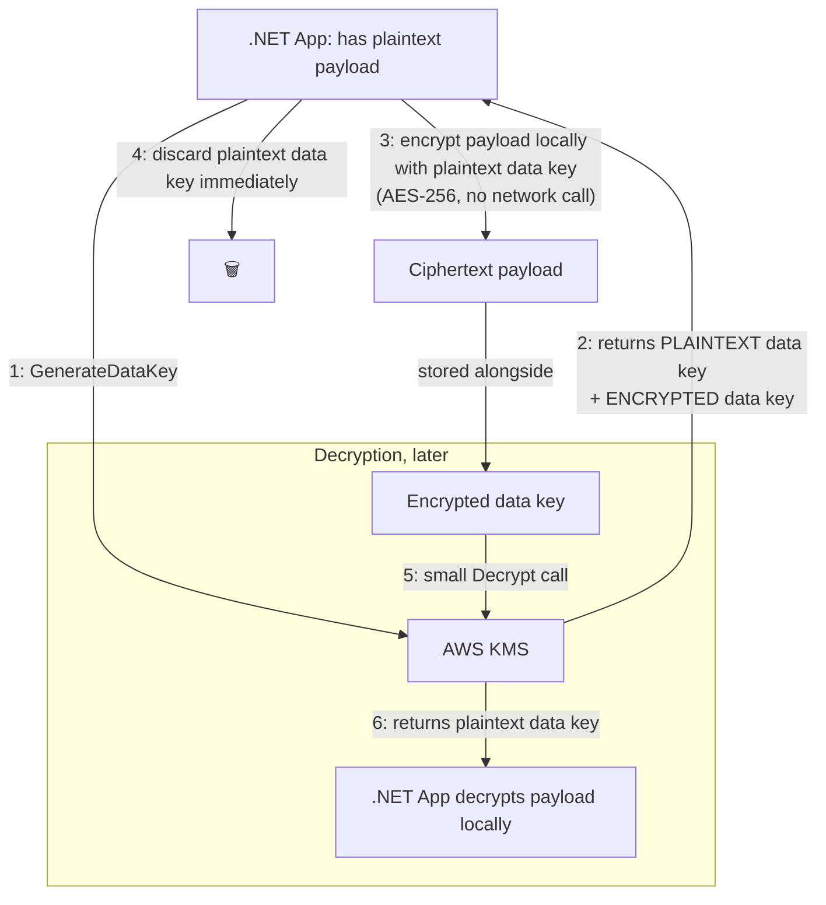
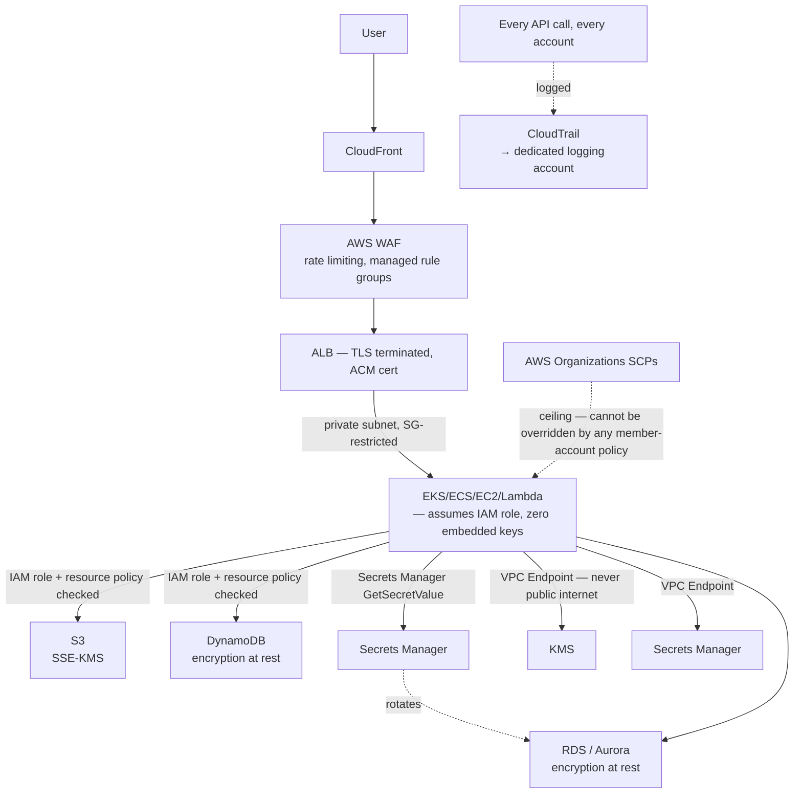
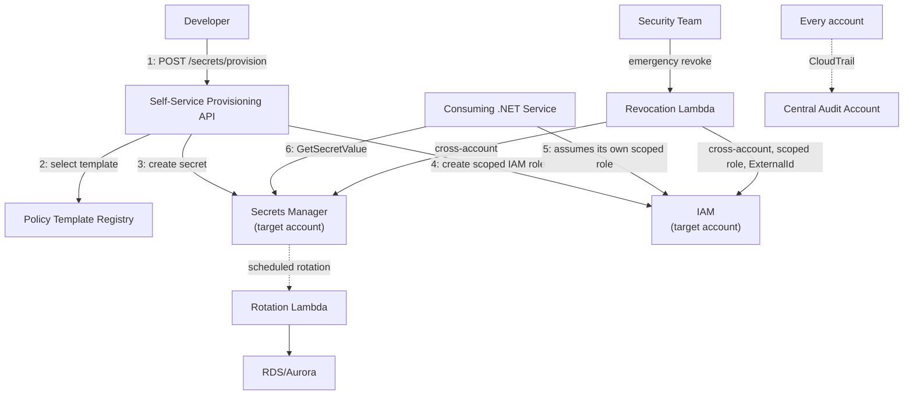
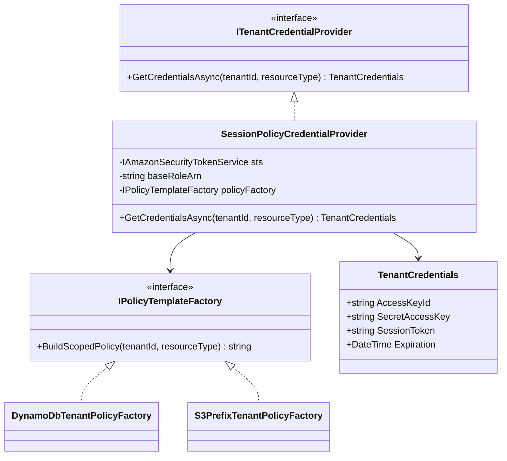
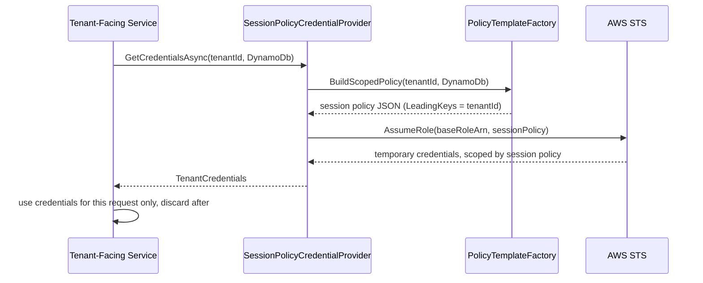

# Module 58 — AWS: IAM & Security — Roles, Policies, KMS, Secrets Manager & Cross-Account Access

> Domain: AWS | Level: Beginner → Expert | Prerequisite: [[01-Compute-Networking-VPC-LoadBalancing-AutoScaling]], (Security Groups as network-layer least-privilege; this module covers the identity-layer complement), [[../16-Distributed-Systems/01-Consensus-Consistency-Distributed-Transactions]] (trust boundaries in distributed systems, now expressed as AWS account/role boundaries)

---

## 1. Fundamentals

### What problem does IAM solve?
Every AWS API call — "launch this EC2 instance," "read this S3 object," "write this DynamoDB item" — needs an answer to two separate questions before AWS will execute it: **who is asking** (authentication) and **are they allowed to do this specific thing to this specific resource** (authorization). IAM is AWS's answer to both, and it is not optional plumbing bolted onto the "real" system — in a cloud account, IAM **is** the perimeter. There is no network firewall standing between an authenticated, authorized principal and the AWS control plane the way there might be between a browser and an on-prem data center; the identity check is the only check. A Principal Engineer who treats IAM as background configuration rather than as the primary security control has misunderstood what "cloud security" means.

### Why does this matter?
Because the blast radius of an IAM mistake is categorically different from an application bug. A SQL injection vulnerability compromises one application's data. An overly broad IAM policy attached to one Lambda function can, depending on what it grants, compromise every S3 bucket in the account, every secret in Secrets Manager, or the ability to spin up infrastructure and exfiltrate data to an attacker-controlled destination. Every real incident retrospective at a bank or payments company that involves a "cloud breach" traces back to an identity boundary that was wider than it needed to be — not a network boundary that was crossed. This is also precisely why financial-services interview panels (Visa, JPMorgan, Stripe) spend disproportionate interview time on IAM relative to its apparent conceptual simplicity: it's simple to explain and extraordinarily easy to get wrong in a way that doesn't fail any test.

### When should you reach for the concepts in this module?
Constantly, by default — every single resource this course discusses (EC2, RDS, Lambda, S3, EKS) is reachable only through an IAM decision, so "when do I use IAM" is really "how do I model this specific access pattern correctly," never "should I use IAM." The genuinely open design decisions are: role-per-service vs. shared roles, customer-managed KMS keys vs. AWS-managed, and Secrets Manager vs. Parameter Store vs. IAM database authentication — each covered below with an explicit decision framework.

### When should you NOT reach for a given mechanism?
- Don't create IAM **users** with long-lived access keys for anything that runs inside AWS (EC2/ECS/EKS/Lambda) — a role is always available and never needs a rotated static secret. IAM users with access keys are for the narrow case of a human or an external, non-AWS system that genuinely cannot assume a role.
- Don't reach for a customer-managed KMS key when the default AWS-managed key satisfies the actual compliance requirement — customer-managed keys have a real per-key monthly cost and an operational key-policy burden; that cost is worth paying for regulatory need-to-control-your-own-key requirements (common in banking), not by default.
- Don't reach for Secrets Manager's automatic rotation machinery for a secret nothing can safely rotate without app-level coordination — building rotation Lambdas for secrets whose consumers cache them without a refresh path creates outages at rotation time, not security.

### How does it work — 30,000-ft view
```
Principal (IAM User / IAM Role / Federated Identity)
     │  makes an API call, SigV4-signs the request with temporary or long-lived credentials
     ▼
AWS STS / IAM Policy Evaluation Engine
     │  evaluates: Identity-based policies (attached to the principal)
     │           ∩ Resource-based policies (attached to the resource, if any)
     │           ∩ Permissions boundaries (if set)
     │           ∩ Service Control Policies (Organizations-level ceiling)
     │           ∩ Session policies (if assumed via AssumeRole with a session policy)
     │  → explicit Deny anywhere wins; otherwise needs an explicit Allow; default is implicit Deny
     ▼
Allowed → the underlying service (S3, DynamoDB, KMS, ...) executes the action
Denied  → AccessDenied, logged to CloudTrail either way
```
Every one of the AND-ed policy types above is a real exam question in disguise: "your Lambda's execution role allows `s3:GetObject` on the bucket, but the call still fails — why?" is almost always a resource-based bucket policy with an explicit `Deny`, a Service Control Policy ceiling the account admin forgot about, or a KMS key policy that doesn't grant the caller `kms:Decrypt` (S3 SSE-KMS objects need **both** S3 permission and KMS permission — the single most common "why is this AccessDenied" production incident with encrypted buckets).

---

## 2. Deep Dive

### 2.1 The IAM Core Model — Principals, Policies, and the Evaluation Logic
An IAM **principal** is anything that can make an authenticated request: an IAM user, an IAM role (assumed, never logged into directly), or a federated identity (SAML/OIDC-federated corporate user, or in EKS's case, a Kubernetes service account federated via OIDC — see §2.5). A **policy** is a JSON document with `Effect` (Allow/Deny), `Action` (the API calls it covers, e.g. `dynamodb:GetItem`), `Resource` (the ARN(s) it applies to), and optionally `Condition` (context-dependent restrictions — source IP, MFA presence, request time, tag values). Policies attach in two fundamentally different places, and conflating them is the single most common IAM misunderstanding at the mid-level-to-senior boundary:

- **Identity-based policies** attach to the principal (a role's permission policy) and answer "what can this identity do."
- **Resource-based policies** attach to the resource itself (an S3 bucket policy, an SQS queue policy, a KMS key policy) and answer "who can act on this resource" — critically, a resource-based policy can grant access to a principal in a **different AWS account**, which is the actual mechanism behind every cross-account access pattern in this module.

The evaluation logic that decides the final Allow/Deny is not "most specific policy wins" (a common wrong mental model carried over from network ACLs) — it's a strict, ordered AND: **an explicit Deny anywhere (identity policy, resource policy, permissions boundary, SCP, session policy) always wins**, and absent any explicit Deny, the request is allowed only if **at least one** applicable policy contains an explicit Allow. There is no implicit Allow; an IAM principal with zero attached policies can do nothing. This is why the honest failure-mode statement for this whole model is: **IAM makes over-permissioning easy to create and hard to detect** — a policy with `"Action": "s3:*", "Resource": "*"` passes every functional test the team runs, because it's a superset of what's needed; nothing in the request path tells you it's too broad. Detecting that requires a separate discipline (IAM Access Analyzer, least-privilege policy generation from CloudTrail activity, periodic access review) layered on top of IAM itself — IAM enforces what you tell it to enforce; it does not tell you what you should have told it.

### 2.2 AssumeRole, STS, and Trust Policies — the Mechanism Behind Every "Role"
An IAM **role** has no long-term credentials of its own. Instead, a role has a **trust policy** (a resource-based policy on the role itself) naming which principals are allowed to call `sts:AssumeRole` against it. When a permitted principal calls AssumeRole, AWS Security Token Service (STS) returns **temporary credentials** (access key, secret key, and session token) valid for a bounded window (15 minutes to 12 hours, role-configurable) — the role's **permission policy** (a normal identity-based policy, separate from the trust policy) then governs what those temporary credentials can actually do. This two-policy structure — trust policy answers "who can become this role," permission policy answers "what can this role do" — is the exact mechanism behind:
- An EC2 instance profile (the EC2 service itself assumes the role on the instance's behalf and refreshes credentials automatically via the instance metadata service).
- An ECS task role (the ECS agent assumes the role for the task).
- Lambda's execution role (the Lambda service assumes it before invoking your code).
- EKS's IRSA / Pod Identity (the trust policy is federated to the cluster's OIDC provider or the EKS Pod Identity agent — see §2.5).
- Cross-account access (Account B's role trusts Account A's principal ARN, so a principal in Account A can assume a role that only exists in Account B — this is how a central security-tooling account reads logs across every workload account in a landing zone without any long-lived cross-account credential existing anywhere).

**Cross-account confused-deputy protection.** When a trust policy grants access to a *third party* (a SaaS vendor's AWS account, for instance, needing to assume a role in yours to perform an integration), a bare `Principal` trust is unsafe: any customer of that same vendor could, in principle, ask the vendor to assume *your* role if they can guess or obtain your role's ARN and the vendor's own account trusts them too (the "confused deputy" problem — the vendor is tricked into using its legitimate access on the wrong customer's behalf). AWS's documented fix is an `sts:ExternalId` condition in the trust policy: the vendor is issued a unique external ID for your specific integration, and the trust policy requires that exact value on every AssumeRole call. This is a real interview discriminator — engineers who have only used AssumeRole for same-account service roles have usually never needed to reason about it, and "how do you prevent a confused-deputy attack in cross-account role trust" separates people who have actually designed a multi-tenant or partner-integration AWS architecture from people who haven't.

### 2.3 Least Privilege as a Design Discipline, Not a Slogan
"Least privilege" is stated in every AWS whitepaper and violated in most production accounts, because the naive version — granting exactly the actions and resources a piece of code touches at the moment it's written — decays the instant the code changes and nobody remembers to *shrink* the policy back down when a feature is removed. The discipline that actually holds up in production has three concrete components, and an interview answer that names all three (rather than just "grant minimal permissions") is what separates a Staff-level answer from a mid-level one:

1. **Resource-level scoping, not just action-level scoping.** `"Action": "dynamodb:GetItem", "Resource": "*"` is *action*-least-privilege but not *resource*-least-privilege — it lets the caller read every table in the account, not just its own. The real policy names the specific table ARN (and, for a multi-tenant table, a `dynamodb:LeadingKeys` condition scoping it to the caller's own partition-key prefix — see §2.9).
2. **Condition keys as the actual enforcement layer**, not resource ARNs alone — `aws:RequestedRegion`, `aws:SourceVpce` (restricting an API call to only be honored when it arrives via a specific VPC endpoint — see Module 57 §2 for the endpoint mechanics), `s3:x-amz-server-side-encryption` (refusing an upload that isn't encrypted the way you require) turn a policy from "this identity can touch this resource" into "this identity can touch this resource **only under these circumstances**," which is where most of least privilege's real value lives.
3. **A closed-loop review process**, because a policy that was minimal on the day it was written is not still minimal a year later without someone re-deriving it. IAM Access Analyzer's *unused access* findings (which permissions granted were never actually exercised, per CloudTrail) and *external access* findings (which resources are reachable from outside the account boundary) are the concrete tools; the organizational discipline (§17) is making someone's job to act on those findings on a schedule, not just to run the tool once during an audit.

The concrete failure mode to be honest about: **a policy that is a superset of what's needed produces zero symptoms.** Every functional test passes; every legitimate call succeeds. The only way this surfaces is a deliberate, separate detection pass — which is exactly why "how would you know if your IAM policies were too broad, today, in production" is the discriminating question for this topic (worked fully in §2.12).

### 2.4 Workload Identity — How a .NET Application Actually Gets AWS Credentials
This is the mechanism a Principal Engineer must be able to draw from memory, because "where do your application's AWS credentials come from" is asked in nearly every cloud-architecture interview and a shocking fraction of candidates answer "an access key in the config file" — the answer that immediately fails a fintech panel.

**The AWS SDK for .NET's default credential chain**, used whenever your code does `new AmazonS3Client()` (or, correctly, when you resolve `IAmazonS3` via DI without explicitly constructing credentials), searches in this order:
1. Explicit credentials passed in code (almost never correct in production — this is the "hardcoded key" anti-pattern).
2. Environment variables (`AWS_ACCESS_KEY_ID` / `AWS_SECRET_ACCESS_KEY`) — used in local development, sourced from a developer's own `aws configure` profile, never checked into source control.
3. The shared credentials/config file (`~/.aws/credentials`) — local development again.
4. **Container credentials** — if running in ECS, the SDK queries the ECS Task Metadata endpoint, which vends temporary credentials for the **task role** (the AssumeRole from §2.2, performed transparently by the ECS agent).
5. **Instance profile credentials** — if running on a bare EC2 instance, the SDK queries the EC2 Instance Metadata Service (IMDSv2, token-based — IMDSv1's tokenless version is the historical SSRF-to-credential-theft vector; production accounts should have IMDSv2 enforced via `HttpTokens: required` at the launch-template level), which vends the instance profile role's temporary credentials.
6. **Pod identity (EKS)** — the SDK reads a projected, auto-rotated service-account token from a well-known file path, presents it to STS via `AssumeRoleWithWebIdentity`, and STS validates it against the cluster's OIDC provider (IRSA) or the EKS Pod Identity Agent validates and vends credentials directly (Pod Identity, the newer, simpler mechanism that removes the need to hand-wire an OIDC federated trust policy per role) — see Module 63 (`07-Containers...`) §2 for the full EKS-side wiring; this module owns the fact that **the code never changes** — the same `new AmazonS3Client()` call resolves credentials correctly whether it's running locally, on EC2, in ECS, or in an EKS pod, because the credential chain, not the application, is environment-aware.
7. **Lambda's execution role** — injected via environment variables the Lambda service itself populates and refreshes for the life of the execution environment.

The unifying principle across every one of these: **no access key is ever written to disk, checked into source control, or embedded in a container image**, and every credential handed to the running workload is temporary and automatically rotated by the underlying service. An ASP.NET Core `Startup`/`Program.cs` that registers AWS clients correctly does nothing more than:
```csharp
builder.Services.AddDefaultAWSOptions(builder.Configuration.GetAWSOptions());
builder.Services.AddAWSService<IAmazonS3>();
builder.Services.AddAWSService<IAmazonDynamoDB>();
builder.Services.AddAWSService<IAmazonSecretsManager>();
```
— no `AccessKey`/`SecretKey` anywhere in `appsettings.json`. If you ever see either of those keys in an ASP.NET Core configuration file for a service running on AWS compute, that is the interview red flag to raise unprompted.

### 2.5 KMS — Envelope Encryption, and Why You Never Encrypt the Payload Directly
AWS Key Management Service (KMS) manages **keys**, and the mechanical detail every candidate should know cold: **KMS itself is never used to encrypt your actual data directly for anything beyond 4 KB.** The `Encrypt` API call sends plaintext to KMS and gets ciphertext back — but it caps at 4 KB and, more importantly, every encryption operation is a network call to a regional, rate-limited API (KMS has a request-per-second quota, and it is a **shared, account-level quota** — this is a genuine production failure mode: a batch job that calls `kms:Decrypt` once per record in a million-record job can throttle itself, and every other service in the account sharing that KMS key, during a burst). The fix is **envelope encryption**, and the reasoning matters more than the term:

1. Your application asks KMS to `GenerateDataKey` — KMS returns a **plaintext data key** (a random AES-256 key) and the **same key, encrypted under your KMS key** (the "encrypted data key" or "envelope").
2. Your application encrypts the actual payload **locally, in memory, using the plaintext data key** — no size limit, no network round-trip, no KMS request-per-second pressure, because this step never touches KMS.
3. Your application discards the plaintext data key immediately and stores **only the ciphertext payload plus the encrypted data key** alongside it.
4. To decrypt later, your application sends the small encrypted data key back to KMS's `Decrypt` API (one small, fast call — this is the only step that touches the network/KMS quota), gets the plaintext data key back, and decrypts the payload locally.

This is exactly why S3 SSE-KMS, EBS encryption, and RDS encryption-at-rest all use this pattern under the hood rather than calling KMS per byte — and it's why a candidate who can explain step 2 ("why not just call KMS Encrypt on the payload directly") as a **quota and latency** answer, not a "KMS doesn't support big payloads" hand-wave, is demonstrating real understanding.

**Key policies vs. IAM policies**: every KMS key has its own resource-based **key policy** in addition to whatever IAM identity policies exist — and, unlike most AWS resources, **the key policy is checked in addition to, not instead of, IAM**, meaning a caller needs both an IAM policy allowing `kms:Decrypt` *and* the key policy naming that caller (directly or via an IAM policy delegation statement `"Enable IAM User Permissions"`) or the call fails. This is the concrete, mechanical reason for the single most common KMS-adjacent production incident: "my Lambda's IAM role has `kms:Decrypt`, why is `S3::GetObject` on an SSE-KMS-encrypted object still failing?" — because reading an SSE-KMS object needs `s3:GetObject` (S3 policy) **and** `kms:Decrypt` (both IAM identity policy **and** the key's own key policy) — three separate authorization checks, not one, all of which fintech-panel interviewers expect you to enumerate without prompting.

**Customer-managed vs. AWS-managed keys.** AWS-managed keys (the ones with `aws/s3`, `aws/rds` aliases) cost nothing extra, rotate automatically, and are the right default for most workloads. Customer-managed keys (CMKs) cost a small monthly fee per key plus per-API-call pricing, but grant you: a key policy you fully control (so you can restrict decryption to a specific role, deny it to root, or grant cross-account access explicitly), auditable key usage in CloudTrail scoped to *your* key rather than an AWS-managed one, the ability to disable or schedule deletion of the key yourself (instantly revoking access to everything encrypted under it — a real "kill switch" a bank's incident-response runbook may require), and, in regulated contexts, satisfying a "customer holds the encryption key" compliance requirement that an AWS-managed key structurally cannot satisfy no matter how it's configured. The decision is genuinely a compliance-driven one, not a technical-capability one — technically, both encrypt equally well.

### 2.6 Secrets Manager vs. Parameter Store vs. IAM Database Authentication — the Real Decision Framework
These three solve overlapping problems and are frequently conflated; a Principal Engineer needs the actual axes of comparison, not a preference:

| | Secrets Manager | Parameter Store (SecureString) | IAM Database Authentication |
|---|---|---|---|
| **What it stores** | Any secret (DB creds, API keys, arbitrary JSON) | Any string, including secrets (KMS-encrypted `SecureString` type) | Nothing — there is no stored password at all |
| **Automatic rotation** | Built-in rotation scheduling + AWS-provided Lambda rotation templates for RDS/Aurora/DocumentDB | No native rotation; you build your own | N/A — short-lived auth tokens replace the concept of rotation entirely |
| **Cost** | Per-secret monthly charge + per-API-call | Standard tier free; Advanced tier has a small per-parameter charge | Free (an IAM/STS mechanism, not a stored-secret service) |
| **Cross-account sharing** | Native resource policies for cross-account access | More limited; typically one parameter store per account | N/A |
| **Size limit** | Up to 64 KB | 4 KB (Standard) / 8 KB (Advanced) | N/A |
| **When it's the right answer** | Any credential that needs rotation (DB passwords), or a secret shared across accounts/teams with its own access policy | Non-credential configuration that happens to be sensitive (a feature-flag value, an internal endpoint), or credentials in a cost-sensitive environment where you'll roll your own rotation | Any RDS/Aurora engine that supports it (MySQL, PostgreSQL) where you want to eliminate the password entirely rather than rotate it — see Module 60 (`04-Databases...`) for the full RDS-side flow |

**The honest trade-off on IAM database authentication specifically**, because it's the answer engineers reach for reflexively without knowing its real limits: it issues a short-lived (15-minute) auth token instead of a password, generated by calling `RDS.GenerateAuthToken` (backed by the same SigV4 signing as every other AWS API call) — genuinely eliminating "where is the DB password stored" as a question. But it is **not free of trade-offs**: it caps at a low number of connections-per-second authenticating this way (a real throughput ceiling under connection-storm conditions), it isn't supported for SQL Server RDS at all as of this writing (only MySQL and PostgreSQL engines), and it still requires the application to fetch a fresh token before each new physical connection is opened, which interacts with connection-pooling behavior (a pooled connection doesn't re-authenticate per logical use, so the *token*, not the *connection*, is what's short-lived — get this distinction right or you'll design a system that tries to refresh tokens on every query). For SQL Server RDS specifically (the user's actual stated stack), **Secrets Manager is the only viable answer of the three**, which is exactly why Module 60's .NET-to-SQL-Server-on-RDS flow is built around Secrets Manager, not IAM auth.

### 2.7 Full Security Architecture for a Production .NET-on-AWS System
Pulling every mechanism above into one coherent design — this is the shape a Principal Engineer should be able to draw and narrate end-to-end in an interview whiteboard:

- **Perimeter**: CloudFront + AWS WAF in front of everything internet-facing (rate-based rules, managed rule groups for SQLi/XSS/OWASP Top 10 — see Module 64 for the observability/alerting half of WAF).
- **Transport**: TLS 1.2+ terminated at the load balancer (ACM-issued/managed certificates, auto-renewed — no certificate-expiry pager duty), and — for anything crossing a trust boundary the organization considers sensitive (service-to-service inside a VPC, not just edge-to-origin) — TLS all the way to the compute target, not just edge-terminated.
- **AuthN/AuthZ at the application layer**: OAuth2/OIDC/JWT for end-user identity (full mechanics in [[../41-OAuth2-OIDC-JWT-PKCE/01-OAuth2-OIDC-JWT-Fundamentals-Flows-PKCE]] — not re-derived here; this module's concern is the *infrastructure* identity layer beneath the application's own authN, not user authN itself).
- **Workload identity**: every compute target (EC2/ECS/EKS/Lambda) uses the role mechanism from §2.2/§2.4 exclusively — zero embedded credentials anywhere in the fleet.
- **Data at rest**: KMS-backed encryption on every data store (S3 SSE-KMS, RDS/Aurora encryption at rest, DynamoDB encryption at rest, EBS encryption) — customer-managed keys where compliance requires them (§2.5).
- **Data in transit internally**: security groups (Module 57 §2.6) as the network-layer boundary; for a service mesh deployment (EKS + App Mesh/Istio, Module 63), mutual TLS between pods as the identity-layer complement — network segmentation alone is not treated as sufficient for anything crossing a tenant or compliance boundary.
- **Secrets**: Secrets Manager for anything rotatable (§2.6), never in environment variables baked into a container image (environment variables are visible to anything with `ecs:DescribeTaskDefinition`/`describe-pod` access and to anyone who can read a crash dump — a secret injected at runtime from Secrets Manager, held only in process memory, is a materially smaller blast radius).
- **Network egress control**: private subnets by default for anything that doesn't need to be internet-reachable (Module 57 §2.1), VPC endpoints for AWS-service traffic so it never traverses the public internet even outbound (also closes a data-exfiltration path — an attacker with code-execution inside a private-subnet workload cannot exfiltrate to an arbitrary internet destination if there's no NAT Gateway route and no public subnet path, only VPC-endpoint-reachable AWS services).
- **Audit**: CloudTrail capturing every API call organization-wide, delivered to a dedicated, access-restricted logging account (so a compromised workload account can't tamper with its own audit trail) — full depth in Module 64.
- **Governance ceiling**: Service Control Policies at the AWS Organizations level enforcing account-wide non-negotiables (region restrictions for data residency, denying the ability to disable CloudTrail, denying public S3 bucket creation) — the "ceiling" that no identity policy inside a member account, however permissive, can punch through.

### 2.8 Tenant Isolation — "How Would You Prevent Tenant A From Accessing Tenant B's Data?"
This is the module's own discriminating question — the one most likely to separate a Staff answer from a Senior one, because a Senior answer stops at "we check the tenant ID in the WHERE clause," and a Staff answer names the actual defense-in-depth spectrum and its blast-radius trade-offs:

1. **Application-layer filtering only** (a `WHERE TenantId = @tenantId` on every query). The weakest answer: it's a single line of application code away from a cross-tenant data leak, and that line is trivially forgotten in a new endpoint six months later. No fintech panel accepts this as a complete answer.
2. **Database-enforced row-level security** (PostgreSQL RLS, or a SQL Server security predicate via `CREATE SECURITY POLICY`) — the database itself refuses to return rows outside the current session's tenant context, so even a forgotten `WHERE` clause fails closed rather than leaking. Materially stronger than (1) because the enforcement point moves from "every developer, every time" to "the schema, once."
3. **IAM-condition-scoped access at the data-store layer** — for DynamoDB specifically, a `dynamodb:LeadingKeys` condition on the IAM policy tying the caller's session (via a temporary credential vended per-tenant, e.g. via Cognito Identity Pools or a per-tenant AssumeRole) to only the partition-key prefix matching that tenant; the AWS API itself refuses the request before it reaches application code. This is the strongest single-account answer for a key-value store, because the isolation is enforced by AWS's own authorization layer, not your application's.
4. **Separate encryption keys per tenant** (§2.5's customer-managed KMS keys, one per tenant or per tenant tier) — this doesn't prevent a *logical* query from crossing tenants by itself, but it bounds the blast radius of a *storage-layer* compromise (a stolen backup or snapshot is useless without the tenant-specific key) and satisfies a "cryptographic tenant isolation" compliance requirement some enterprise fintech customers contractually require.
5. **Separate schemas, databases, or full AWS accounts per tenant** — the strongest isolation, at real operational cost (schema-per-tenant multiplies migration/backup/monitoring work; account-per-tenant is the strongest boundary AWS offers at all — a separate account has its own IAM root, its own resource limits, its own blast radius entirely — but multiplies infrastructure cost and cross-account tooling complexity). This tier is usually reserved for the largest, most compliance-sensitive tenants (a single enterprise banking customer demanding its own account) rather than applied uniformly.

The honest, complete answer names the layer(s) actually in use for the tenant sizes/compliance tiers involved, not a single mechanism in isolation — a real system typically combines (2) or (3) for the median tenant with (5) available as an escape hatch for the tenant(s) whose contract requires it.

### 2.9 What This Model Cannot Do, and Which Failures Have No Detector
Being honest about IAM's limits is itself an interview signal:
- **IAM cannot detect that a policy is too broad** — as established in §2.3, a superset policy produces zero symptoms; only a separate, deliberately-run detection process (Access Analyzer, periodic access review, CloudTrail-driven least-privilege regeneration) surfaces it, and none of that runs unless someone owns it as a recurring job.
- **IAM cannot protect against a compromised credential with legitimately-granted permissions** — if an attacker obtains a valid temporary credential (a stolen session token, a leaked instance-metadata response via SSRF against IMDSv1), IAM enforces exactly the permissions that credential legitimately holds; the only mitigations are reducing the blast radius those permissions carry (least privilege, again) and detecting anomalous *usage* of a legitimate credential (unusual API call patterns, GuardDuty-style behavioral detection — outside this module's scope, touched in Module 64's observability material) rather than anything IAM itself provides.
- **A resource-based policy misconfiguration can silently grant public access** — an S3 bucket policy or an SNS topic policy with an overly broad `Principal: "*"` and no compensating condition is functionally public, and nothing in IAM itself flags this as different from any other resource policy; this is specifically what AWS's account-level "S3 Block Public Access" setting and Organizations-level SCPs exist to backstop, because IAM's own model treats "public" as just another principal value, not a special, alarming case.
- **Trust-policy sprawl across a multi-account organization becomes its own audit problem** — every cross-account trust relationship (§2.2) is a standing door between accounts; a landing zone with hundreds of roles trusting dozens of other accounts, accumulated over years, is genuinely difficult to reason about in aggregate, and "list every account that can reach into this one, transitively" is a harder question than IAM's per-resource model was designed to answer cheaply.

---

## 3. Visual Architecture

### AssumeRole / STS Flow (the mechanism behind every "role")
```mermaid
sequenceDiagram
    participant App as .NET App (EC2/ECS/EKS/Lambda)
    participant Meta as Credential Source<br/>(Instance Metadata / Task Metadata / Pod Identity Agent)
    participant STS as AWS STS
    participant Svc as Target Service (S3 / DynamoDB / KMS)

    App->>Meta: Request credentials (AWS SDK default chain)
    Meta->>STS: AssumeRole (trust policy checked)
    STS-->>Meta: Temporary credentials (AccessKey, SecretKey, SessionToken, TTL)
    Meta-->>App: Cached temporary credentials
    App->>Svc: SigV4-signed API call using temp credentials
    Svc->>Svc: Evaluate identity policy ∩ resource policy ∩ SCP ∩ session policy
    Svc-->>App: Allow (200) or Deny (403 AccessDenied)
    Note over App,Svc: Credentials auto-refresh before TTL expiry;<br/>no long-lived secret ever touches disk
```

### Envelope Encryption (KMS)

```mermaid
flowchart TB
    A[".NET App: has plaintext payload"] -->|"1: GenerateDataKey"| KMS["AWS KMS"]
    KMS -->|"2: returns PLAINTEXT data key<br/>+ ENCRYPTED data key"| A
    A -->|"3: encrypt payload locally with plaintext data key<br/>(AES-256, no network call)"| C["Ciphertext payload"]
    A -->|"4: discard plaintext data key immediately"| X["🗑"]
    C -->|"stored alongside"| E["Encrypted data key"]
    subgraph Later["Decryption, later"]
        E -->|"5: small Decrypt call"| KMS
        KMS -->|"6: returns plaintext data key"| D[".NET App decrypts payload locally"]
    end
```

### Full Security Architecture — Layered Defense

```mermaid
graph TB
    U[User] --> CF[CloudFront]
    CF --> WAF[AWS WAF<br/>rate limiting, managed rule groups]
    WAF --> ALB[ALB — TLS terminated, ACM cert]
    ALB -->|"private subnet, SG-restricted"| Compute["EKS/ECS/EC2/Lambda<br/>— assumes IAM role, zero embedded keys"]
    Compute -->|"IAM role + resource policy checked"| S3["S3<br/>SSE-KMS"]
    Compute -->|"IAM role + resource policy checked"| DDB["DynamoDB<br/>encryption at rest"]
    Compute -->|"Secrets Manager GetSecretValue"| SM["Secrets Manager"]
    SM -.->|"rotates"| RDS["RDS / Aurora<br/>encryption at rest"]
    Compute --> RDS
    Compute -->|"VPC Endpoint — never public internet"| KMSsvc["KMS"]
    Compute -->|"VPC Endpoint"| SMsvc["Secrets Manager"]
    All["Every API call, every account"] -.->|"logged"| CT["CloudTrail<br/>→ dedicated logging account"]
    Org["AWS Organizations SCPs"] -.->|"ceiling — cannot be overridden by any member-account policy"| Compute
```

---

## 4. Production Example

**Problem.** A payments-adjacent fintech (the scenario style this course targets) inherited a service fleet where every service's `appsettings.json` contained a long-lived IAM user's access key and secret key, checked into a private Git repository, because the fleet predated the team's adoption of IAM roles. A routine dependency-scanning tool flagged that the repository (private, but with broader read access than the security team assumed — a contractor's account had clone access from an earlier engagement that was never revoked) represented a live credential-exposure risk, and the incident-response process had to be executed **before** any evidence of actual misuse, purely on the exposure.

**Architecture (before).** Every ECS task read `AWS_ACCESS_KEY_ID`/`AWS_SECRET_ACCESS_KEY` from `appsettings.json`, baked into the container image at build time. The single IAM user's policy had accreted `s3:*`, `dynamodb:*`, and `secretsmanager:GetSecretValue` on `Resource: "*"` over eighteen months of "just add what's needed to unblock this ticket" changes, because no one owned periodically shrinking it back down (§2.3's exact failure mode).

**Implementation (the fix).**
1. Rotated the exposed access key immediately (this is always step one, before any redesign — assume compromise, not just exposure).
2. Created one IAM role per ECS service (task role), each scoped to the specific table/bucket ARNs and specific actions that service's own CloudTrail history over the prior 90 days actually showed it using — IAM Access Analyzer's policy-generation-from-CloudTrail feature did the first-draft narrowing.
3. Updated each service's task definition to use its task role; removed every `AWS_ACCESS_KEY_ID`/`AWS_SECRET_ACCESS_KEY` entry from `appsettings.json` and from the container image build — the AWS SDK for .NET's default credential chain (§2.4) required zero code changes, only configuration removal.
4. Deleted the original IAM user entirely once every service was confirmed migrated (staged over two weeks, one service at a time, each verified via CloudTrail showing successful calls under the new role before cutting the old key's last remaining permission).
5. Added a scheduled (monthly) IAM Access Analyzer unused-access review as a standing operational task, owned by the platform team, specifically so policy sprawl couldn't silently re-accrete the same way over the next eighteen months.

**Trade-offs.** The per-service task-role migration took real calendar time (two weeks of staged cutover, one service at a time, to keep rollback cheap) versus a faster but riskier "flip everything at once" approach; the team judged the staged approach correct given production payment-processing traffic was live throughout.

**Lessons learned.** The root cause was never "someone leaked a key" — the key's *existence* as a long-lived, broadly-scoped credential was the actual vulnerability; the leak was just the trigger that forced fixing a design that should never have existed. The recurring finding worth naming explicitly, because it will recur in Modules 60/63's own incidents: **a policy that is a superset of what's needed produces no symptom until something forces an audit** — least privilege has to be a scheduled, owned process, not a one-time cleanup.

---

## 11. Coding Exercises

### Easy
**Problem.** Write a least-privilege IAM policy JSON granting a specific Lambda function read-only access to a single DynamoDB table's items, and explain concretely why a `"Resource": "*"` version of the same policy is wrong even though it "still works."

**Solution.**
```json
{
  "Version": "2012-10-17",
  "Statement": [
    {
      "Effect": "Allow",
      "Action": ["dynamodb:GetItem", "dynamodb:Query"],
      "Resource": "arn:aws:dynamodb:us-east-1:123456789012:table/Orders"
    }
  ]
}
```
**Why the `Resource: "*"` version is wrong:** it functionally passes every test (the Lambda can still read `Orders`), but it also grants read access to every other DynamoDB table that exists in the account today **and any table created in the future** — a second team's table, created eighteen months from now with no relation to this Lambda, is silently readable by it. The blast radius of a compromised Lambda execution role is the entire account's DynamoDB estate instead of one table.

**"Complexity"** (adapted for IAM: policy surface area, not algorithmic complexity): O(1) resources granted vs. O(n) resources in the account — the gap between those two is exactly the unnecessary blast radius.

### Medium
**Problem.** Implement envelope encryption for a payload using the AWS SDK for .NET's KMS client, matching the §2.5 mechanism exactly (generate data key, encrypt locally, discard plaintext key, decrypt later).

**Solution.**
```csharp
public class EnvelopeEncryptionService
{
    private readonly IAmazonKeyManagementService _kms;
    private readonly string _kmsKeyId;

    public EnvelopeEncryptionService(IAmazonKeyManagementService kms, string kmsKeyId)
    {
        _kms = kms;
        _kmsKeyId = kmsKeyId;
    }

    public async Task<(byte[] ciphertext, byte[] encryptedDataKey)> EncryptAsync(byte[] plaintext)
    {
        var dataKeyResponse = await _kms.GenerateDataKeyAsync(new GenerateDataKeyRequest
        {
            KeyId = _kmsKeyId,
            KeySpec = DataKeySpec.AES_256
        });

        using var aes = Aes.Create();
        aes.Key = dataKeyResponse.Plaintext.ToArray();
        aes.GenerateIV();
        using var encryptor = aes.CreateEncryptor();
        var ciphertext = encryptor.TransformFinalBlock(plaintext, 0, plaintext.Length);

        Array.Clear(dataKeyResponse.Plaintext.ToArray(), 0, dataKeyResponse.Plaintext.ToArray().Length); // discard plaintext key material
        return (aes.IV.Concat(ciphertext).ToArray(), dataKeyResponse.CiphertextBlob.ToArray());
    }

    public async Task<byte[]> DecryptAsync(byte[] ivAndCiphertext, byte[] encryptedDataKey)
    {
        var decryptResponse = await _kms.DecryptAsync(new DecryptRequest
        {
            CiphertextBlob = new MemoryStream(encryptedDataKey)
        });

        using var aes = Aes.Create();
        aes.Key = decryptResponse.Plaintext.ToArray();
        aes.IV = ivAndCiphertext.Take(16).ToArray();
        using var decryptor = aes.CreateDecryptor();
        return decryptor.TransformFinalBlock(ivAndCiphertext.Skip(16).ToArray(), 0, ivAndCiphertext.Length - 16);
    }
}
```
**Time complexity:** O(n) in payload size for the local AES step; O(1) KMS network calls per encrypt/decrypt operation (the entire point of envelope encryption). **Space complexity:** O(n) for the ciphertext buffer.

**Optimized solution:** for high-throughput encryption of many small payloads, cache the plaintext data key in memory for a bounded TTL (e.g., 5 minutes) and reuse it across multiple payloads rather than calling `GenerateDataKey` per payload — reduces KMS request volume by orders of magnitude at the cost of a larger blast radius if the process memory is compromised during that TTL window (a real, explicit trade-off to state in an interview, not a free optimization).

### Hard
**Problem.** Implement a credential-caching wrapper around `AssumeRole` that automatically refreshes before expiry, safe for concurrent use by multiple threads issuing AWS calls simultaneously.

**Solution.**
```csharp
public class RefreshingRoleCredentials
{
    private readonly IAmazonSecurityTokenService _sts;
    private readonly string _roleArn;
    private readonly SemaphoreSlim _refreshLock = new(1, 1);
    private Credentials _current;
    private DateTime _refreshAt;

    public RefreshingRoleCredentials(IAmazonSecurityTokenService sts, string roleArn)
    {
        _sts = sts;
        _roleArn = roleArn;
    }

    public async Task<Credentials> GetCredentialsAsync()
    {
        if (_current != null && DateTime.UtcNow < _refreshAt)
            return _current; // fast path — no lock needed for the common case

        await _refreshLock.WaitAsync();
        try
        {
            if (_current != null && DateTime.UtcNow < _refreshAt)
                return _current; // re-check: another thread may have refreshed while we waited

            var response = await _sts.AssumeRoleAsync(new AssumeRoleRequest
            {
                RoleArn = _roleArn,
                RoleSessionName = $"dotnet-app-{Guid.NewGuid():N}",
                DurationSeconds = 3600
            });
            _current = response.Credentials;
            _refreshAt = _current.Expiration.AddMinutes(-5); // refresh 5 minutes before actual expiry
            return _current;
        }
        finally
        {
            _refreshLock.Release();
        }
    }
}
```
**Time complexity:** O(1) amortized — the double-checked-locking pattern means only one thread ever pays the AssumeRole network cost per refresh window; every other concurrent caller either takes the fast path or waits briefly on the lock. **Space complexity:** O(1) — a single cached credential set. **Optimized solution:** this is essentially what the AWS SDK's own `AssumeRoleAWSCredentials` provider does internally — in production, prefer the SDK's built-in credential provider over hand-rolling this, and reserve a hand-rolled version for cases needing custom refresh-window tuning or telemetry on refresh events.

### Expert
**Problem.** Design a cross-account role-assumption chain for a central security-tooling account that needs read-only CloudTrail/Config access across every workload account in a 40-account AWS Organizations landing zone, with confused-deputy protection, and explain what happens if one workload account's trust policy is misconfigured.

**Solution (design, not code).** Each of the 40 workload accounts has an `OrgSecurityReadOnly` role whose trust policy names the central security account's specific automation-role ARN as the only allowed principal, **plus** an `sts:ExternalId` condition set to a per-organization (not per-account) secret value distributed only to the central account's automation — this closes the confused-deputy path even though, unlike the third-party-vendor case in §2.2, every account here is within the same organization, because it still prevents a *different*, less-trusted automation role that might exist in the central account from opportunistically assuming a role it wasn't specifically built to use. The role's permission policy grants exactly `cloudtrail:LookupEvents`, `cloudtrail:GetTrailStatus`, `config:Get*`, `config:Describe*` and nothing else — no write access, no access to any other service, enforced additionally by a Service Control Policy at the Organizations root that caps what **any** role in a workload account can grant to a principal outside the organization, as a ceiling independent of what any individual account administrator configures.

**What happens if one workload account's trust policy is misconfigured** (e.g., an engineer widens the `Principal` to `"*"` while debugging, intending to narrow it back later): every AWS principal in the *world* could now call `AssumeRole` against that one account's role — but the permission policy still caps the resulting session to the same narrow read-only CloudTrail/Config actions, so the practical exposure is "anyone can read this one account's CloudTrail history and Config data," not "anyone can do anything in this account." This is precisely why defense-in-depth matters here: the trust-policy mistake is real and should be caught (Access Analyzer's *external access* finding flags a `Principal: "*"` trust policy immediately), but the permission-policy scoping is what keeps a single misconfiguration from being catastrophic rather than merely bad. **Time/space complexity reframed as operational complexity:** the design is O(1) roles per account (not O(n) — one role per account regardless of organization size) and O(1) central automation identity, which is what makes it scale to 40 accounts or 400 without per-account bespoke configuration beyond the templated role.

---

## 12. System Design — Centralized Secrets & Credential Management Platform for a Multi-Account Fintech Organization

### Step 1: Understand the Problem and Establish Design Scope

**Q&A dialogue:**
> **Candidate:** How many AWS accounts and applications does this platform need to serve, and are we designing the secret store itself or a governance layer on top of AWS's own primitives?
> **Interviewer:** 60 AWS accounts across three business units, roughly 400 distinct services, and yes — you're designing the governance and self-service layer on top of Secrets Manager/KMS/IAM, not reinventing secret storage.
> **Candidate:** Is cross-region disaster recovery in scope, and does any regulator require secrets to stay within a specific geography?
> **Interviewer:** Single-region for now (us-east-1), but assume a regulator could require EU-resident secrets to never leave `eu-west-1` within the next 18 months — design so that's an incremental change, not a rewrite.
> **Candidate:** Who rotates secrets — is human-in-the-loop rotation acceptable, or must everything be fully automated?
> **Candidate:** What's an acceptable time-to-provision for a new service's first secret — is this a self-service developer flow or a ticket to a platform team?
> **Interviewer:** Self-service is the goal; today it's a ticket with a 2-day SLA, and that's the problem we're solving.

**Functional requirements:**
- A service team can request and provision a new secret (DB credential, third-party API key) via a self-service API/CLI/Terraform module without filing a ticket.
- Secrets rotate automatically on a defined schedule for every secret type that supports it (RDS/Aurora credentials at minimum).
- Every secret access is attributable to a specific calling service/role, not a shared credential.
- Central security team can audit, and instantly revoke, any secret across any of the 60 accounts.

**Non-functional requirements:**
- No secret ever exists in plaintext outside of KMS-decrypted, in-memory application state.
- Secret retrieval latency must not materially affect application cold-start (target: p99 under 200ms for a cached retrieval, under 2s for an uncached one).
- The platform itself must not become a single point of failure for the 400 services depending on it — a regional Secrets Manager outage should degrade gracefully (cached credentials continue working) rather than taking down every dependent service simultaneously.
- Full audit trail retained for 7 years (a realistic financial-services regulatory retention requirement).

**Back-of-the-envelope estimation:**
- 400 services × ~3 secrets/service average (DB credential, one or two third-party API keys) ≈ 1,200 secrets.
- Assume each service fetches its secrets once at startup and caches for its process lifetime, refreshing only on scheduled rotation (not per-request) — at ~50 deployments/day fleet-wide (rolling deploys across 400 services) × 3 secrets fetched per deploy ≈ 150 GetSecretValue calls/day from normal operation, plus rotation-triggered refetches. This is nowhere near Secrets Manager's API throughput ceiling — **the design driver here is not throughput, it's governance, attribution, and blast-radius containment**, not scale. A design that spent its effort on horizontal scaling of secret retrieval would be solving the wrong problem; the actual hard problem is making self-service provisioning safe by default (so a developer's 2-minute self-service request produces a correctly-scoped, correctly-rotating secret without a human security reviewer in the loop for the common case).

### Step 2: Propose High-Level Design and Get Buy-In

**Core flows, treated separately:** (a) secret provisioning (a developer requests a new secret), (b) secret consumption (a running service fetches a secret it already has access to), (c) rotation (automatic, scheduled), (d) revocation (security-team-triggered, emergency).

**Component glossary:**
- **Self-service provisioning API** — a thin internal service (itself running on ECS, in the platform account) that accepts a structured request (`{serviceName, secretType, targetAccount}`) and, rather than creating the secret with broad permissions, generates the exact least-privilege IAM policy (§2.3) template for that secret type and creates both the Secrets Manager secret and the consuming service's scoped IAM role/policy in one transaction.
- **Policy template registry** — a versioned set of IAM policy templates per secret type (RDS-credential template, third-party-API-key template), so a developer never hand-writes a policy; they select a type and the platform generates the least-privilege statement.
- **Central audit account** — CloudTrail from all 60 accounts aggregated here (Module 64 owns the mechanics); this platform's provisioning/revocation actions are themselves logged here too.
- **Emergency revocation Lambda** — invoked by the security team, immediately disables a secret's IAM policy statements account-wide and rotates it, callable across any of the 60 accounts via the cross-account role chain from the Expert coding exercise above.

**Architecture diagram:**

```mermaid
graph TB
    Dev[Developer] -->|"1: POST /secrets/provision"| API[Self-Service Provisioning API]
    API -->|"2: select template"| Reg[Policy Template Registry]
    API -->|"3: create secret"| SM["Secrets Manager<br/>(target account)"]
    API -->|"4: create scoped IAM role"| IAM["IAM<br/>(target account)"]
    SM -.->|"scheduled rotation"| RotLambda["Rotation Lambda"]
    RotLambda --> RDS["RDS/Aurora"]
    Svc["Consuming .NET Service"] -->|"5: assumes its own scoped role"| IAM
    Svc -->|"6: GetSecretValue"| SM
    Sec[Security Team] -->|"emergency revoke"| RevLambda["Revocation Lambda"]
    RevLambda -->|"cross-account, scoped role, ExternalId"| IAM
    RevLambda -->|"cross-account"| SM
    All[Every account] -.->|"CloudTrail"| Audit["Central Audit Account"]
```

**End-to-end walkthrough (provisioning):** ① developer calls the provisioning API naming a service and secret type → ② API resolves the correct least-privilege policy template → ③ API creates the Secrets Manager secret in the target account with a generated initial value (for a DB credential type, coordinating with the target RDS instance's master credential to set the app user's password) → ④ API creates (or updates) the consuming service's IAM role, attaching a policy scoped to exactly that one secret's ARN → ⑤ the developer's deployment pipeline references the role ARN in its task definition — no secret value ever passes through the developer's hands or the provisioning API's logs.

**REST API design:**
| Endpoint | Method | Request fields | Response fields |
|---|---|---|---|
| `/secrets/provision` | POST | `serviceName` (string), `secretType` (enum: `RdsCredential`, `ThirdPartyApiKey`), `targetAccountId` (string), `targetResourceArn` (string, e.g. the RDS instance ARN) | `secretArn`, `roleArn`, `rotationEnabled` (bool) |
| `/secrets/{secretArn}/rotate` | POST | — (triggers immediate out-of-cycle rotation) | `rotationStatus` |
| `/secrets/{secretArn}/revoke` | POST | `reason` (string, required — written to audit log) | `revokedAt` |
| `/secrets` | GET | `serviceName` (query filter) | list of `{secretArn, secretType, lastRotated, consumingRoleArn}` |

**Data model:**
| Table: `SecretRegistry` | Type | Description |
|---|---|---|
| `SecretArn` (PK) | string | Full ARN, globally unique |
| `ServiceName` | string | Owning service, for attribution and audit |
| `SecretType` | enum | Drives which policy template and rotation Lambda apply |
| `TargetAccountId` | string | Which of the 60 accounts holds the actual secret |
| `ConsumingRoleArn` | string | The one IAM role permitted to read this secret |
| `Status` | enum | `ACTIVE → ROTATING → ACTIVE` \| `REVOKED` |
| `LastRotatedAt` | timestamp | Drives rotation-overdue alerting (Module 64) |

Rationale for a **separate registry table** rather than relying solely on Secrets Manager's own tagging: cross-account queries ("list every secret this service owns, across all accounts it's deployed to") are painful against 60 independent Secrets Manager instances but trivial against one central DynamoDB table — the registry is metadata, not the secret value itself, so it carries no sensitive data and can be broadly readable for audit/dashboard purposes without itself being a credential-exposure risk.

### Step 3: Design Deep Dive

**Provisioning failure and partial-state handling.** Step ③/④ above (create secret, then create role) is not atomic across two separate AWS API calls in two different services — if role creation fails after secret creation succeeds, the platform must not leave an orphaned secret with no consumer. The provisioning API wraps both calls in a saga-style compensating flow (see [[../36-Saga]] for the general pattern): on role-creation failure, it deletes the just-created secret before returning an error, so a retry starts from a clean state rather than accumulating orphaned resources across failed attempts.

**Rotation deep dive.** For RDS/Aurora credential types, the platform uses AWS's own Secrets-Manager-provided rotation Lambda templates (single-user rotation: the Lambda logs in with the *current* password, sets a *new* password, and updates the secret — four-step AWS-documented state machine: createSecret → setSecret → testSecret → finishSecret, each step idempotent and individually retryable, which matters because a rotation Lambda that fails partway through must be safely re-invocable rather than corrupting the credential state). Rotation is scheduled every 30 days by default, configurable per secret type, and — critically — rotation failure triggers a CloudWatch alarm (Module 64) rather than silently leaving a stale-but-still-valid credential in place, because in this design a failed rotation is a signal something changed in the target database (a permissions change, a network path failure) that also threatens normal application connectivity.

**Emergency revocation.** The revocation Lambda (invoked cross-account via the Expert exercise's role chain) does two things atomically in sequence: immediately attaches an explicit `Deny` statement to the consuming role's policy (§2.1's rule that explicit Deny always wins — faster and safer than trying to delete/recreate the role, which could race with an in-flight AssumeRole), then triggers an out-of-cycle rotation so the underlying credential value itself is also invalidated, not just the IAM path to it — defense in depth again: even a credential cached somewhere outside the IAM boundary (a compromised process's memory) stops working once rotation completes.

**Consistency.** The `SecretRegistry` table is the system's own metadata and tolerates eventual consistency for read paths (a dashboard showing "last rotated 3 minutes ago" a few seconds stale is not a correctness problem); the actual secret value in Secrets Manager and the IAM policy state are both strongly consistent within their respective account (IAM changes propagate within seconds but are not instantaneous globally — a real, stated caveat: a just-revoked role may still succeed on a request that was already in flight when the Deny was attached, which is why revocation is paired with rotation rather than relying on the IAM change alone).

**Security.** The provisioning API itself is the platform's highest-value target — it holds a role capable of creating IAM roles and secrets across 60 accounts — so it runs with its own tightly-scoped role (able to create secrets/roles matching only the registered policy templates, not arbitrary IAM actions), all its actions are logged to the central audit account, and access to invoke it at all requires the caller's own SSO-federated identity plus an approved change-ticket reference for anything outside a pre-approved template (an explicit break-glass path exists for genuine emergencies, itself fully audited).

### Step 4: Wrap-Up

**Not covered here, natural follow-ups:** monitoring metrics that matter for this platform specifically (rotation-failure rate, time-to-provision p99, count of standing cross-account trust relationships as a sprawl metric — Module 64 owns the general CloudWatch/alerting treatment); the EU-data-residency extension sketched in Step 1 (would add a region field to the registry and a per-region provisioning API deployment, with the central registry itself needing to become region-partitioned rather than global — a genuine follow-up design question, not solved here); integrating a human approval step for secret types above a defined sensitivity tier (a hybrid self-service/ticket model rather than pure self-service for the highest-risk secret types); a closing summary diagram would show the same four core flows (provision/consume/rotate/revoke) as one unified state machine per secret, which is the mental model that scales from 1,200 secrets to 12,000 without a redesign.

**References:**
1. AWS Identity and Access Management User Guide — Policy Evaluation Logic.
2. AWS Security Token Service API Reference — AssumeRole, AssumeRoleWithWebIdentity.
3. AWS KMS Developer Guide — Concepts: Envelope Encryption, Data Keys.
4. AWS Secrets Manager User Guide — Rotating secrets, rotation function templates for Amazon RDS.
5. AWS IAM Access Analyzer documentation — unused access and external access findings.
6. AWS Prescriptive Guidance — Security reference architecture for multi-account environments.
7. AWS Well-Architected Framework — Security Pillar.

---

## 13. Low-Level Design — Multi-Tenant Credential-Isolation Service

**Requirements:** given a tenant ID and a requested resource type, issue temporary, tenant-scoped AWS credentials that can only reach that tenant's own data, without provisioning a standing IAM role per tenant (impractical at thousands of tenants).

**Class diagram (conceptual):**

```mermaid
classDiagram
    class ITenantCredentialProvider {
        <<interface>>
        +GetCredentialsAsync(tenantId, resourceType) TenantCredentials
    }
    class SessionPolicyCredentialProvider {
        -IAmazonSecurityTokenService sts
        -string baseRoleArn
        -IPolicyTemplateFactory policyFactory
        +GetCredentialsAsync(tenantId, resourceType) TenantCredentials
    }
    class IPolicyTemplateFactory {
        <<interface>>
        +BuildScopedPolicy(tenantId, resourceType) string
    }
    class DynamoDbTenantPolicyFactory
    class S3PrefixTenantPolicyFactory
    class TenantCredentials {
        +string AccessKeyId
        +string SecretAccessKey
        +string SessionToken
        +DateTime Expiration
    }

    ITenantCredentialProvider <|.. SessionPolicyCredentialProvider
    SessionPolicyCredentialProvider --> IPolicyTemplateFactory
    IPolicyTemplateFactory <|.. DynamoDbTenantPolicyFactory
    IPolicyTemplateFactory <|.. S3PrefixTenantPolicyFactory
    SessionPolicyCredentialProvider --> TenantCredentials
```

**Sequence diagram:**

```mermaid
sequenceDiagram
    participant Svc as Tenant-Facing Service
    participant Provider as SessionPolicyCredentialProvider
    participant Factory as PolicyTemplateFactory
    participant STS as AWS STS

    Svc->>Provider: GetCredentialsAsync(tenantId, DynamoDb)
    Provider->>Factory: BuildScopedPolicy(tenantId, DynamoDb)
    Factory-->>Provider: session policy JSON (LeadingKeys = tenantId)
    Provider->>STS: AssumeRole(baseRoleArn, sessionPolicy)
    STS-->>Provider: temporary credentials, scoped by session policy
    Provider-->>Svc: TenantCredentials
    Svc->>Svc: use credentials for this request only, discard after
```

**Design patterns used:** Strategy (`IPolicyTemplateFactory` implementations per resource type), Factory Method (constructing the scoped policy), Decorator-shaped caching wrapper (analogous to the Hard coding exercise above, applied per-tenant instead of per-role).

**SOLID mapping:** Single Responsibility — the credential provider only assembles and requests credentials, policy construction is a separate factory; Open/Closed — a new resource type (S3, RDS) is added via a new `IPolicyTemplateFactory` implementation, no change to `SessionPolicyCredentialProvider`; Liskov — any `IPolicyTemplateFactory` is substitutable; Interface Segregation — `ITenantCredentialProvider` exposes exactly one method callers need; Dependency Inversion — the service depends on the interface, not the concrete STS client.

**Extensibility:** a new resource type or a tenant-tier-specific policy variant (e.g., a premium tenant tier permitted broader read access to shared reference data) is a new factory implementation, not a change to the core provider.

**Concurrency/thread safety:** session-policy-scoped credentials from a single `AssumeRole` call are request-scoped and never shared across tenants or threads — unlike the Hard coding exercise's long-lived cached role credentials, these are deliberately **not** cached beyond a single logical request, because caching a tenant-scoped credential risks it being reused for a different tenant's request under load if the caching key is implemented incorrectly; the safer default is to accept the AssumeRole latency per request (or cache per-tenant with the tenant ID as an explicit, tested cache key) rather than share a single cached credential across the pool.

---

## 14. Production Debugging

**Incident.** Three weeks after a routine KMS key-policy update (intended to add a new consuming team's role to an existing customer-managed key), a separate, unrelated batch-processing service in another account began failing every `s3:GetObject` call against SSE-KMS-encrypted objects with `AccessDeniedException`, despite its IAM role's permissions being unchanged.

**Investigation.** CloudTrail showed the batch service's `GetObject` calls succeeding at the S3 layer (an `s3:GetObject` authorization event with `Allow`) immediately followed by a `kms:Decrypt` **Deny** event — pointing squarely at the key policy, not the IAM role, exactly matching §2.6's "S3 needs both S3 permission and KMS permission" mechanic. Diffing the key policy's version history (via CloudTrail's `PutKeyPolicy` events) against the incident's start time showed the "routine update" three weeks earlier had **replaced** the key policy document wholesale (a full `PutKeyPolicy` call with a hand-edited JSON file) rather than appending a new statement — and the replacement JSON, copied from an internal wiki example, omitted a statement present in the original policy that granted decrypt access to the batch service's role. The batch service kept working for three weeks purely because it didn't touch that bucket until its next scheduled monthly run — a textbook case of a change with delayed, hard-to-attribute blast radius.

**Tools.** CloudTrail event history filtered to `PutKeyPolicy`/`GetKeyPolicy` events on the specific key; IAM Policy Simulator to confirm the current key policy denied the batch role's `kms:Decrypt` before making any live change; AWS Config's resource-configuration-history timeline for the KMS key, corroborating the exact policy diff.

**Fix.** Restored the missing statement, then — as the structural fix, not just the incident fix — moved all key-policy changes to a reviewed Infrastructure-as-Code pipeline (Module 71/CloudFormation, Module 64) where a change is a diff against the previous version by construction, rather than a manually-edited full-document replacement via the console or a one-off script, making an accidental statement omission visible in code review before it ships.

**Prevention.** Added a CloudWatch alarm on `kms:Decrypt` Deny events aggregated by key, so the *next* similar mistake surfaces within minutes rather than three weeks later on the next monthly batch run — closing exactly the kind of delayed-blast-radius gap this incident exposed.

---

## 15. Architecture Decision — Secrets Manager vs. Parameter Store vs. IAM Database Authentication for RDS Credentials

| Criterion | Secrets Manager | Parameter Store (SecureString) | IAM Database Authentication |
|---|---|---|---|
| Advantages | Native rotation Lambda templates; per-secret resource policies for cross-account sharing; purpose-built for credentials | Free at Standard tier; simple; fine for low-sensitivity config | No stored password at all — eliminates an entire class of leak |
| Disadvantages | Per-secret + per-API-call cost | No native rotation; DIY | Not supported for SQL Server; token-refresh-per-connection nuance; lower connections/sec ceiling |
| Cost | Moderate, scales with secret count | Low/free | Free, but indirect cost in engineering the token-refresh logic |
| Complexity | Low — AWS manages rotation state machine | Medium — you own rotation | Medium-high — you own token lifecycle and connection-pool interaction |
| Maintainability | High — declarative rotation schedule | Medium | Medium — a subtler failure mode (silent token expiry under pool reuse) if implemented carelessly |
| Performance | Sub-second GetSecretValue, cacheable | Sub-second GetParameter, cacheable | Token generation is a local SigV4 computation (fast), but a real connections/sec ceiling exists |
| Scalability | Scales to the org's full secret count without redesign | Same | Scales in principal but capped by the auth-token rate limit under connection-storm conditions |
| Operational overhead | Low once configured | Medium (manual rotation process) | Medium — requires engineering discipline around refresh timing |

**Recommendation:** Secrets Manager for the user's actual stated stack (SQL Server on RDS), because IAM database authentication is **not available for SQL Server** at all, making it a non-option rather than a close second — and Secrets Manager's native rotation directly closes the "who rotates the DB password" gap that Parameter Store leaves as homework. For MySQL/PostgreSQL-backed services elsewhere in a broader estate, IAM database authentication becomes a legitimate alternative worth the added engineering care specifically to eliminate the password-as-a-secret question entirely — but it is a deliberate trade of "no stored secret" against "you now own token-lifecycle correctness," not a strictly-better option.

---

## 17. Principal Engineer Perspective

**Business impact.** An IAM incident at a bank or payments company is not measured in engineering-hours-to-fix; it's measured in regulatory-disclosure obligations, customer-trust damage, and — for a confirmed cross-tenant data exposure — potential contractual liability to enterprise customers whose agreements specify isolation guarantees. A Principal Engineer sizing the investment in IAM hygiene (Access Analyzer reviews, role-per-service migrations, key-policy change controls) is sizing it against that tail risk, not against the visible engineering cost of "just add the permission and move on" — the asymmetry is the entire argument for taking least privilege seriously.

**Engineering trade-offs.** Least privilege has a genuine, recurring engineering tax: narrower policies mean more frequent "why is this AccessDenied" tickets during development, more policy statements to maintain per service, and slower initial provisioning unless the self-service platform in §12 exists to absorb that cost centrally. The Principal Engineer's job is recognizing that this tax is worth paying and — more specifically — **building the tooling that makes the secure path also the easy path** (the self-service provisioning platform, the policy-template registry), because a security control that's harder to use than the insecure alternative loses to developer velocity every time, quietly, one "just widen it for now" exception at a time.

**Technical leadership and cross-team communication.** IAM design decisions are inherently cross-team — a role boundary decided by one team constrains what every consuming team can do, and a key-policy change (as in §14's incident) can silently break a service owned by a team that was never consulted. This is why the mature version of this discipline treats IAM/KMS changes to shared resources as reviewed, code-reviewed infrastructure changes (§14's structural fix) rather than console-driven, unilateral edits — the review isn't bureaucracy for its own sake, it's the mechanism that catches a missing statement before it ships instead of three weeks after.

**Architecture governance.** Service Control Policies at the Organizations level (§2.7) are the concrete mechanism by which a central platform/security team enforces non-negotiables without needing to review every individual team's IAM policy — a governance model that scales because it constrains the *ceiling*, leaving teams free to self-serve within it (directly connecting back to §12's self-service platform design).

**Cost optimization.** Customer-managed KMS keys and Secrets Manager both carry real per-unit costs that scale with the number of keys/secrets provisioned — at a large fintech's scale (thousands of secrets, hundreds of keys), the difference between "one shared customer-managed key per environment" and "one key per service" is a material line item, and the Principal Engineer's job is matching key granularity to the actual compliance requirement (§2.5) rather than defaulting to maximal granularity out of an abundance of caution that isn't actually required anywhere in the organization's regulatory obligations.

**Risk analysis and long-term maintainability.** The single biggest long-term risk this module's material presents is policy sprawl — permissions granted under time pressure that are never revisited (§2.3, §14). The maintainable answer is never "write perfect policies the first time" (unrealistic under real delivery pressure); it's building the recurring review process (§2.3's Access Analyzer cadence) into the organization's standing operating rhythm, the same way a bank runs a recurring access recertification process for human user accounts — IAM policies for workload identities deserve the same discipline, and most organizations under-invest here precisely because workload identities don't show up on the same compliance checklists human accounts do.
