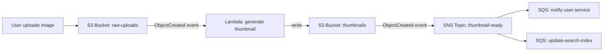
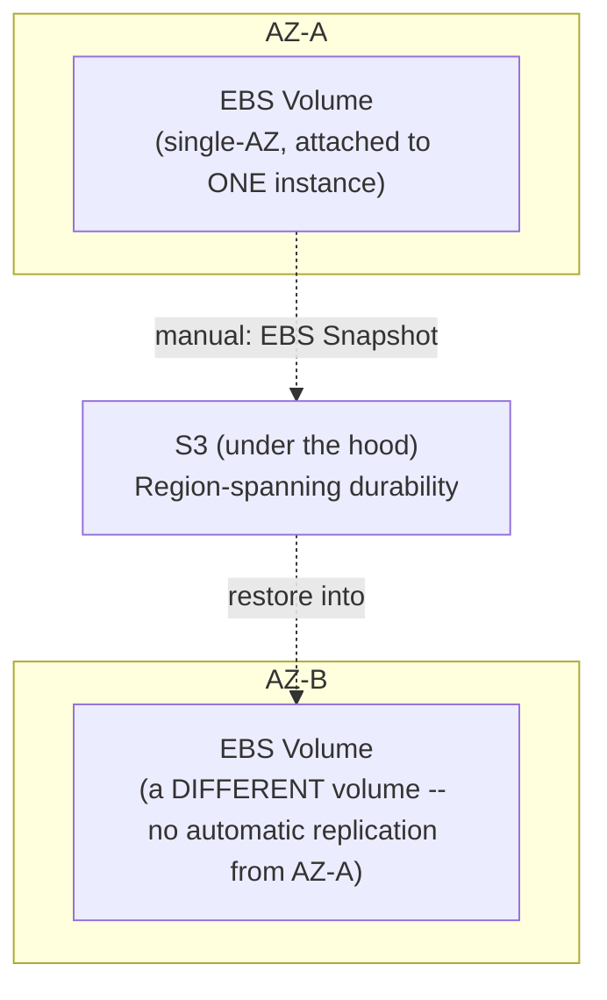

# Module 59 — AWS: Storage — S3 Storage Classes & Consistency, EBS, EFS & Durability Trade-offs

> Domain: AWS | Level: Beginner → Expert | Prerequisite: [[02-IAM-Security-KMS-SecretsManager]] §2.5, §2.1 (KMS encryption and resource-based bucket policies apply directly to S3), [[../18-Event-Driven-Architecture/01-EDA-Fundamentals-Choreography-vs-Orchestration]] (S3 event notifications are a concrete pub/sub mechanism)

---

## 1. Fundamentals

### Why does a Principal Engineer need storage depth beyond "S3 is a bucket, EBS is a disk"?
Storage is where durability and availability guarantees are actually made or broken — every other layer this course has covered (compute, networking, IAM) can be flawlessly designed while the underlying storage choice silently fails to meet the workload's actual durability requirement (an EBS volume pinned to a single AZ backing a "highly available" service, or object storage used for a workload that actually needs POSIX file-locking semantics) — a Principal Engineer must be able to map a workload's actual access pattern and durability/availability requirement to the correct storage service and configuration, not default to "S3 for everything" or "attach an EBS volume" without justification.

### Why does this matter?
Because storage decisions are often the hardest to reverse of any infrastructure choice this course has covered (Module 49's "hard to reverse" category applies acutely here) — migrating from the wrong storage service after a workload is live and has accumulated data is a substantially riskier and more expensive undertaking than choosing correctly at design time, and a Principal Engineer is expected to have internalized the specific trade-offs (durability numbers, consistency model, access pattern fit) well enough to make that choice correctly the first time.

### When does this matter?
Any time an application needs to persist data beyond a single process's memory or a single request's lifetime — which, for anything beyond the most trivial stateless service, is effectively every production workload; and specifically whenever choosing between object storage (S3), block storage (EBS), and file storage (EFS) for a given component.

### How does it work (30,000-ft view)?
```
S3: object storage -- durable, effectively infinitely scalable, accessed via HTTP API (not a
    filesystem), strongly consistent since Dec 2020, ideal for unstructured data/blobs/backups
EBS: block storage -- a virtual disk attached to EXACTLY ONE EC2 instance at a time (per AZ),
     ideal for a database's data files or anything needing low-latency, POSIX block-device access
EFS: file storage -- a shared, POSIX-compliant filesystem mountable by MANY EC2 instances
     simultaneously across multiple AZs, ideal for shared file access across a fleet
```

---

## 2. Deep Dive

### 2.1 S3 — Object Storage, Durability, and the Consistency Model
S3 stores objects (arbitrary binary blobs, from a few bytes to terabytes) within buckets, addressed by key, with **11 nines (99.999999999%) of annual durability** for a given object — achieved by redundantly storing every object across multiple devices spanning multiple Availability Zones within a Region automatically, meaning S3's durability guarantee is structurally an inherent property of the service, not something the workload needs to separately engineer (a sharp contrast to §2.2's EBS, where multi-AZ durability requires deliberate, explicit replication design). Since December 2020, S3 provides **strong read-after-write consistency** for all operations (a write is immediately visible to any subsequent read, including overwrites and deletes) — this closed a historically significant gap (S3 was previously only *eventually* consistent for overwrite/delete operations), and a Principal Engineer with older AWS experience should explicitly update any mental model or documentation still describing S3 as eventually consistent, since designing unnecessary application-level workarounds for a consistency gap that no longer exists is itself a real, observed anti-pattern in older codebases.

### 2.2 EBS — Block Storage, AZ-Pinning, and Snapshot-Based Durability
An EBS volume is a virtual block device attached to exactly one EC2 instance at a time, and — critically, unlike S3 — an EBS volume exists **within a single specific Availability Zone** and cannot be directly attached to an instance in a different AZ; its durability comes from within-AZ replication (protecting against a single underlying disk failure) but **does not** protect against an entire AZ becoming unavailable, meaning EBS's durability characteristics are AZ-scoped, not Region-scoped like S3's. Cross-AZ (and cross-Region) durability for EBS-backed data requires deliberately taking **EBS Snapshots** (incremental, stored in S3 under the hood, and therefore inheriting S3's Region-spanning durability) — a workload relying solely on a single EBS volume's own replication, with no snapshot strategy, has implicitly accepted single-AZ data-durability risk, directly echoing Module 57 §2.2's single-AZ compute risk but now at the data-persistence layer, which is a substantially higher-stakes place for that same risk to go unnoticed.

### 2.3 EFS — Shared, Elastic File Storage Across a Fleet
EFS provides a POSIX-compliant, NFS-accessible filesystem that can be mounted concurrently by many EC2 instances (or Lambda functions, or containers) across multiple AZs simultaneously — the key differentiator from both S3 (which has no filesystem semantics — no directory locking, no POSIX file permissions in the traditional sense, no partial-file in-place writes) and EBS (which is fundamentally single-instance-attached) is that EFS is the correct choice specifically when multiple compute instances genuinely need **concurrent, shared, filesystem-semantic access to the same data** (a shared configuration directory, a content-management system's shared media library actively written to by multiple app servers) — using EFS when S3 would suffice introduces unnecessary cost and complexity, but using S3 for a workload that genuinely needs POSIX file-locking or in-place partial-file writes is a functional mismatch, not just a suboptimal choice.

### 2.4 S3 Storage Classes — Matching Cost to Actual Access Pattern
S3 offers multiple storage classes with identical underlying 11-nines durability but different availability SLAs, retrieval latency, and cost structures: **S3 Standard** (frequent access, millisecond retrieval), **S3 Infrequent Access (IA)** (lower per-GB storage cost, higher per-retrieval cost, millisecond retrieval — for data accessed less than monthly), **S3 Glacier** tiers (substantially lower storage cost, but retrieval takes minutes to hours depending on the specific Glacier tier chosen, for genuine archival data) — **S3 Intelligent-Tiering** automatically moves objects between access tiers based on observed access patterns, removing the need to manually predict and configure the correct tier upfront. The core discipline is matching the storage class to the *actual*, *honest* access pattern — a common, costly mistake is defaulting everything to S3 Standard indefinitely regardless of how infrequently it's actually accessed, silently overpaying at scale for storage that could be correctly reclassified with zero functional impact.

### 2.5 S3 Event Notifications — Object Storage as an Event Source
S3 can emit an event notification (to SQS, SNS, EventBridge, or directly invoke a Lambda function) whenever an object is created, deleted, or restored — this is a direct, concrete implementation of Module 52's event-driven architecture principles at the storage layer: rather than a separate service needing to poll S3 to detect new objects, S3 itself becomes an event **producer** in a choreography-style pipeline (Module 52 §2.2) — for example, an image-upload-to-S3 triggering a Lambda function that generates thumbnails, which in turn emits its own completion event. This pattern directly extends this course's EDA material (Modules 52-56) into a genuinely AWS-native mechanism, and is frequently the correct default over building custom polling logic to detect new files.

### 2.6 EBS Volume Types and Provisioned IOPS — Matching Performance to Workload
EBS offers multiple volume types trading cost against IOPS/throughput characteristics: **gp3** (general-purpose SSD, baseline performance with independently-configurable IOPS/throughput, the correct default for most workloads), **io2/io2 Block Express** (provisioned IOPS SSD, for latency-sensitive, high-IOPS workloads like a transactional database under heavy load), and **st1/sc1** (throughput-optimized/cold HDD, for large, sequential-access, infrequently-accessed workloads like log processing or backups) — choosing the wrong volume type for a workload's actual I/O pattern (e.g., a cold-HDD-tier volume backing a latency-sensitive OLTP database) manifests as a real, measurable performance ceiling, not a subtle theoretical gap, and is a recurring, concrete Principal-Engineer-level diagnostic question: "is the observed latency problem actually a compute/query problem, or is it an EBS volume-type mismatch?"

---

## 3. Visual Architecture

### S3 as an Event-Driven Pipeline Trigger (§2.5)


### EBS AZ-Pinning vs. S3 Region-Spanning Durability


## 4. Production Example
**Scenario**: A media-processing platform stored user-uploaded video files directly on an EBS volume attached to a single "processing" EC2 instance (chosen originally because the processing pipeline needed fast, low-latency local file access during transcoding), with the assumption — never explicitly validated — that the nightly EBS Snapshot schedule provided adequate durability, and no separate copy of the raw uploaded files existed anywhere else. During a routine AZ maintenance event that AWS scheduled with advance notice, the team performed an instance restart as part of standard patching, and — due to an unrelated EBS subsystem issue affecting that specific AZ during the maintenance window — a volume experienced a rare failure and had to be restored from its most recent snapshot, which was **19 hours old** at the time of failure. **Investigation**: video files uploaded within that 19-hour window (a meaningful volume, given the platform's usage pattern) were permanently lost — the EBS volume was in fact appropriately durable in the *typical* case (11-nines-equivalent within-AZ durability), but the team's actual durability posture was bounded not by EBS's own reliability, but by the nightly snapshot cadence, a detail no one had explicitly reasoned through when the original architecture was designed under time pressure to "get transcoding working fast." **Root cause**: conflating "EBS is durable" (true, within its AZ-scoped design) with "our data is durable regardless of snapshot frequency" (false) — directly Module 57 §9's pattern of independently-configured settings creating a false sense of a guarantee neither setting alone actually provides: EBS's own durability and the snapshot schedule's recency are two genuinely separate parameters, and the team's actual data-loss exposure window was determined by the *weaker* of the two, not the stronger. **Fix**: redesigned the upload pipeline so the original, authoritative copy of every uploaded file lands directly in S3 first (inheriting S3's Region-spanning, snapshot-independent 11-nines durability immediately upon upload, per §2.1), with the EBS-backed processing instance treated as a disposable, replaceable **working copy** downloaded from S3 for transcoding — the EBS volume's own durability/snapshot cadence becomes irrelevant to data-loss risk, since S3 is now the system of record. **Lesson**: this is the general principle of choosing which storage tier holds the **authoritative** copy of data versus which tier holds a disposable **working** copy — a decision that should be made deliberately and explicitly during initial design, not an implicit byproduct of "wherever it was easiest to get the pipeline initially working."

## 5. Best Practices
- Treat S3 as the default choice for the authoritative copy of unstructured data (uploads, backups, generated artifacts) given its Region-spanning, snapshot-independent 11-nines durability — use EBS/local disk only for working copies or genuinely latency-sensitive local access (§4).
- Explicitly reason about EBS's AZ-scoped durability separately from its own reliability — an EBS volume with no snapshot strategy has implicitly accepted single-AZ data-loss risk regardless of EBS's own high within-AZ durability.
- Choose EFS specifically when multiple compute instances genuinely need concurrent, POSIX-semantic shared file access — not as a default "shared storage" choice when S3 would functionally suffice.
- Actively match S3 storage classes (or use Intelligent-Tiering) to actual, observed access patterns rather than defaulting everything to S3 Standard indefinitely.
- Choose EBS volume type (gp3/io2/st1) based on the workload's actual measured I/O pattern (random low-latency vs. sequential throughput), not a default choice made without profiling.

## 6. Anti-patterns
- Storing the sole, authoritative copy of important data on a single-AZ EBS volume with only a periodic snapshot as the durability backstop, without explicitly reasoning about the resulting data-loss exposure window (§4).
- Assuming S3 is still only eventually consistent for overwrites/deletes and building unnecessary application-level workarounds for a consistency gap that was closed in December 2020 (§2.1).
- Defaulting all S3 objects to S3 Standard indefinitely regardless of actual access frequency, silently overpaying at scale.
- Using EFS as a default "shared storage" solution when S3 (with its simpler, cheaper, more scalable object model) would functionally suffice for the actual access pattern.
- Attaching a cold-HDD-tier (st1/sc1) EBS volume to a latency-sensitive, random-I/O workload like a transactional database, then investigating application-level causes for a performance ceiling that's actually a volume-type mismatch.

---

## 10. Interview Questions

### Basic (10)
1. **Q: What is the fundamental difference between S3, EBS, and EFS?** **A:** S3 is object storage accessed via HTTP API with no filesystem semantics; EBS is block storage attached to exactly one EC2 instance at a time within a single AZ; EFS is a shared, POSIX-compliant filesystem mountable by many instances across multiple AZs simultaneously.
2. **Q: What is S3's durability guarantee?** **A:** 11 nines (99.999999999%) annual durability per object, achieved via automatic redundant storage across multiple AZs within a Region.
3. **Q: Is S3 eventually consistent or strongly consistent?** **A:** Strongly consistent for all operations (including overwrites and deletes) since December 2020.
4. **Q: Why is an EBS volume's durability considered AZ-scoped rather than Region-scoped?** **A:** An EBS volume exists within a single specific Availability Zone and its replication protects against a single disk failure, not an entire AZ becoming unavailable.
5. **Q: How does an EBS volume achieve Region-spanning durability?** **A:** Via EBS Snapshots, which are stored in S3 under the hood and therefore inherit S3's Region-spanning durability.
6. **Q: When is EFS the correct storage choice over S3?** **A:** When multiple compute instances need concurrent, POSIX-semantic (filesystem-level) shared access to the same data — file locking, in-place partial writes, directory structures.
7. **Q: What does S3 Intelligent-Tiering do?** **A:** Automatically moves objects between access tiers based on observed access patterns, removing the need to manually predict and configure the correct storage class upfront.
8. **Q: What is an S3 event notification?** **A:** An event S3 can emit (to SQS, SNS, EventBridge, or Lambda) whenever an object is created, deleted, or restored, making S3 itself an event producer.
9. **Q: What is the difference between gp3 and io2 EBS volume types?** **A:** gp3 is general-purpose SSD with independently-configurable baseline IOPS/throughput; io2 is provisioned IOPS SSD for latency-sensitive, high-IOPS workloads.
10. **Q: What does S3 Block Public Access do?** **A:** A blanket account/bucket-level override that prevents public access regardless of any individual bucket policy or ACL misconfiguration.

### Intermediate (10)
1. **Q: Why can "our data is on EBS, which is highly durable" still leave a workload with a meaningful data-loss exposure window?** **A:** EBS's own high durability is scoped to protecting against a single-disk failure within its AZ; the actual Region-spanning, AZ-failure-resilient durability comes only from snapshots, so the real exposure window is bounded by snapshot recency, not EBS's own reliability (§4).
2. **Q: Why is treating S3 as the authoritative data store and EBS as a disposable working copy (§4's fix) a generally sound default architecture?** **A:** It offloads the durability/replication burden onto a service (S3) engineered for Region-spanning 11-nines durability automatically, while using EBS only for its genuine strength (low-latency local block access) without depending on it for long-term data safety.
3. **Q: Why might an organization still be building unnecessary eventual-consistency workarounds for S3 today, and why is this a real anti-pattern?** **A:** Older AWS documentation, tutorials, or team institutional knowledge predating December 2020 described S3 as eventually consistent for overwrites/deletes; carrying that outdated model forward into new designs adds unnecessary application-level complexity (retry-and-reconcile logic) for a consistency gap that no longer exists (§2.1, §6).
4. **Q: Why does defaulting all S3 objects to S3 Standard indefinitely represent a real, quantifiable cost mistake rather than just a minor inefficiency?** **A:** S3 IA and Glacier tiers offer substantially lower per-GB storage cost for infrequently-accessed data with identical underlying durability; at meaningful data volumes, failing to reclassify rarely-accessed objects compounds into materially higher storage spend with zero functional benefit.
5. **Q: Why is EBS volume-type selection a legitimate first diagnostic hypothesis for an unexplained database latency problem?** **A:** A volume type mismatched to the workload's actual I/O pattern (e.g., cold-HDD-tier backing a random-I/O OLTP workload) imposes a real, measurable throughput/IOPS ceiling independent of query design or compute sizing — ruling this out (or in) early avoids misdirected investigation into application-level causes.
6. **Q: Why must both a workload's provisioned EBS IOPS/throughput and its EC2 instance type's own EBS bandwidth limit be checked together when diagnosing a storage performance ceiling?** **A:** They are independently-configured capacity dimensions — a well-provisioned volume attached to an instance type with an inadequate EBS-optimized bandwidth ceiling (or vice versa) will still hit a real performance ceiling, since satisfying one limit doesn't guarantee the other is also sufficient.
7. **Q: Why is S3's event-notification capability (§2.5) a meaningfully different architecture than a separate service polling S3 for new objects?** **A:** S3 becomes a genuine event producer in a choreography-style pipeline, eliminating polling latency/overhead and the operational burden of building and maintaining custom polling logic, directly leveraging the EDA principles from Modules 52-56 at the storage layer.
8. **Q: Why should EBS volume encryption be enabled at creation time rather than as a later remediation?** **A:** Encrypting an existing unencrypted volume isn't an in-place operation — it requires creating a new encrypted volume and migrating data onto it, making "enable by default at creation" substantially cheaper and lower-risk than remediating an already-provisioned unencrypted fleet later.
9. **Q: Why does EFS's default "Bursting" throughput mode create a scalability risk that S3 generally does not present?** **A:** Bursting throughput is tied to the filesystem's total stored size, meaning a smaller but genuinely high-throughput workload can hit a real throughput ceiling that has nothing to do with request volume or data importance, unlike S3's essentially limitless, account-level-ceiling-free scaling.
10. **Q: Why is S3 Block Public Access described as analogous to Module 58's Service Control Policy pattern?** **A:** Both provide a genuinely non-bypassable override that prevents a specific class of misconfiguration (public S3 exposure; overly-permissive IAM policy) regardless of what any individual, more-permissive policy at a lower level might otherwise allow.

### Advanced (10)
1. **Q: Diagnose the §4 incident from first principles, and design the specific pre-production architecture review question that would have caught the durability gap before the AZ maintenance event exposed it.**
   **A:** Root cause: the team implicitly treated "EBS is durable" and "our data is durable" as equivalent, without explicitly identifying which specific mechanism (EBS's own within-AZ replication, versus the nightly snapshot) actually bounded their real data-loss exposure window, and never explicitly computed that window's size. Safeguard: a standing architecture-review question — "for this data, what is our actual maximum data-loss window if the primary storage tier fails right now, and does that number match our actual business tolerance?" — forces an explicit computation (here, up to 24 hours given nightly snapshots) rather than an implicit assumption of "EBS is durable, so we're fine," directly surfacing the gap during design rather than during an actual failure.
2. **Q: A team argues that since S3 achieved strong read-after-write consistency in 2020, they no longer need to think carefully about consistency at all when using S3 in a multi-writer, multi-reader pipeline. Evaluate this claim as a Principal Engineer.**
   **A:** Push back — strong consistency for *individual object reads/writes* (a `GetObject` immediately reflecting the latest `PutObject`) is a real and valuable guarantee, but it does not provide cross-object or cross-operation atomicity: a pipeline reading multiple related objects (e.g., a manifest file plus the objects it references) can still observe a manifest updated to reference a new object before that object's own write has been initiated by a separate writer, if the writes aren't sequenced/coordinated at the application level — S3's consistency guarantee is per-object, not a substitute for application-level coordination across logically related writes, directly Module 47's distributed-consistency-model discussion (know precisely what guarantee you actually have, not the guarantee's name).
3. **Q: Design the specific migration strategy for moving an existing production workload's authoritative data from a single-AZ EBS volume (as in §4's original architecture) to an S3-authoritative model, without downtime and without a data-loss window during the migration itself.**
   **A:** Directly apply Module 49's Strangler Fig philosophy at the storage layer: (1) modify the write path to dual-write every new object to both the existing EBS volume and S3 simultaneously, verifying successful S3 writes before considering a write complete; (2) run a backfill job copying all existing historical EBS-resident data into S3, verified via checksum comparison; (3) once backfill is confirmed complete and dual-writes have been running successfully for a validated period, switch the read path to source from S3 as authoritative; (4) only then decommission the EBS volume's role as authoritative storage (retaining it, if still useful, purely as a disposable local working-copy cache) — each step is independently verifiable and reversible, avoiding a risky, irreversible all-at-once cutover.
4. **Q: Explain why "S3 storage class is just a cost-optimization knob with no functional impact" is an incomplete characterization, and identify the functional dimension it omits.**
   **A:** Storage class also affects **retrieval latency and availability SLA**, not just cost — Glacier-tier objects require an explicit, minutes-to-hours restore operation before they're readable at all (unlike S3 Standard/IA's millisecond retrieval), meaning a workload that might need ad hoc, low-latency access to archived data (not just scheduled batch access) choosing Glacier purely for cost savings has introduced a genuine functional constraint, not merely a cost trade-off — the storage-class decision must weigh actual required retrieval latency alongside cost, not cost alone.
5. **Q: A workload's EFS filesystem is experiencing throughput-related performance degradation despite low total stored data size. Diagnose the likely cause and the remediation options.**
   **A:** Likely cause: default Bursting throughput mode ties available throughput to total filesystem size (§9) — a small filesystem has a correspondingly small baseline throughput allocation regardless of how much *read/write activity* the workload actually generates, meaning "the data is small" doesn't imply "the throughput need is small." Remediation: switch to Provisioned Throughput mode (explicitly paying for a specific throughput level independent of stored size) or Elastic Throughput mode (automatically scales with actual instantaneous demand) — the correct choice depends on whether the workload's throughput need is predictable/steady (favoring Provisioned, for cost predictability) or genuinely variable (favoring Elastic).
6. **Q: Critique the following claim: "Since we enabled S3 Block Public Access at the account level, we no longer need to review individual bucket policies for overly permissive access."**
   **A:** Incomplete — S3 Block Public Access specifically prevents *public* (unauthenticated, internet-wide) access; it does not prevent an overly-broad bucket policy or IAM policy that grants access to, say, every authenticated AWS principal in the account, or to an unintended cross-account principal, or an overly-broad IAM role (Module 58 §4's exact pattern) that happens to include S3 permissions — Block Public Access closes one specific, severe exposure category, but doesn't substitute for the broader least-privilege policy review discipline established in Module 58.
7. **Q: Design an approach for validating that an organization's EBS Snapshot schedule actually satisfies each workload's real business-driven Recovery Point Objective (RPO), rather than relying on a uniform, default snapshot cadence applied without differentiation.**
   **A:** Classify workloads by their actual, documented RPO requirement (a workload where losing up to 24 hours of data is genuinely acceptable versus one requiring near-zero data loss), and explicitly configure snapshot frequency (or, for near-zero-RPO workloads, augment or replace snapshot-based durability with continuous replication to a different AZ/Region, or with the §4-style S3-authoritative pattern) per workload's actual requirement rather than a single default schedule applied uniformly — directly extending Advanced Q1's "explicitly compute and compare against actual tolerance" discipline into a standing, per-workload classification and review practice.
8. **Q: A team proposes storing session state for a horizontally-scaled web application on EFS, reasoning that "it's shared storage accessible from every instance, so it solves our session-affinity problem." Evaluate this design as a Principal Engineer.**
   **A:** Functionally workable but likely a poor fit relative to alternatives — EFS introduces real network-filesystem latency per read/write (materially higher than an in-memory or purpose-built session store like Redis/DynamoDB, both already covered in this course's data-layer modules) for a workload (session state) that's typically small, high-frequency, and latency-sensitive; EFS's genuine strength is POSIX filesystem semantics for larger, less latency-sensitive shared data (§2.3) — a Principal Engineer should redirect this design toward Redis (Module 25) or DynamoDB (Module 27), both purpose-built for exactly this access pattern, reserving EFS for workloads that actually need filesystem semantics.
9. **Q: Explain why the choice of which storage tier holds the "authoritative" copy of data versus a "working" copy (§4's core lesson) generalizes beyond the specific S3-vs-EBS scenario, and give one other concrete example from elsewhere in this course where the same distinction applies.**
   **A:** The general principle: any system with multiple storage/cache layers must have an explicit, deliberate answer to "which layer is the source of truth if all others are lost or become inconsistent," since an implicit answer (whichever layer was easiest to write to first) tends to default to the layer with the weakest actual durability guarantee. A concrete parallel: Module 25/26's Redis caching-pattern discussion — a cache-aside pattern explicitly treats Redis as a disposable, reconstructable working copy with the backing database as authoritative, the same distinction §4 establishes between EBS (working copy) and S3 (authoritative).
10. **Q: As a Principal Engineer establishing storage standards for an organization, design the specific set of standing architectural reviews and automated checks (synthesizing this entire module) you would require for every new workload's storage design.**
    **A:** (1) Mandatory explicit RPO computation and snapshot-cadence validation for any EBS-authoritative data (Advanced Q7) — necessary because the actual data-loss exposure window is otherwise an implicit, unverified assumption (§4). (2) Mandatory S3 Block Public Access enabled by default on every bucket, with an explicit, reviewed exception process for genuinely public buckets (§8) — necessary as a non-bypassable baseline regardless of individual bucket-policy correctness. (3) Mandatory storage-class review (or Intelligent-Tiering enablement) for any S3 workload with non-trivial data volume (§2.4) — necessary because storage-class drift toward unnecessary Standard-tier cost is easy to overlook and compounds at scale. (4) Mandatory justification review for any new EFS adoption, confirming a genuine POSIX-shared-access requirement rather than a default "shared storage" choice (Advanced Q8) — necessary because EFS is frequently reached for by default when a purpose-built alternative (S3, Redis, DynamoDB) fits the actual access pattern better and cheaper. Each standard targets a distinct, concrete failure or cost-inefficiency mode this module identified, directly extending the governance-gate pattern established in Modules 57-58 into the storage layer specifically.

---

## 11. Coding Exercises

### Easy — S3 upload with explicit storage class (§2.4)
```csharp
var putRequest = new PutObjectRequest
{
    BucketName = "user-uploads",
    Key = $"uploads/{userId}/{fileName}",
    FilePath = localFilePath,
    StorageClass = S3StorageClass.Standard,   // hot path: recently uploaded, frequently accessed
    ServerSideEncryptionMethod = ServerSideEncryptionMethod.AWSKMS,
    ServerSideEncryptionKeyManagementServiceKeyId = kmsKeyId   // Module 58 §2.5 -- encryption at rest
};
await s3Client.PutObjectAsync(putRequest);
```

### Medium — Lifecycle rule transitioning storage class automatically (§2.4, §6)
```json
{
  "Rules": [
    {
      "ID": "transition-old-uploads-to-ia-then-glacier",
      "Status": "Enabled",
      "Filter": { "Prefix": "uploads/" },
      "Transitions": [
        { "Days": 30, "StorageClass": "STANDARD_IA" },
        { "Days": 90, "StorageClass": "GLACIER" }
      ]
    }
  ]
}
```

### Hard — S3-authoritative upload with EBS as disposable working copy (§4's fix)
```csharp
public class VideoUploadPipeline
{
    public async Task<string> HandleUploadAsync(Stream videoStream, string fileName)
    {
        // 1. Authoritative copy lands in S3 FIRST -- inherits 11-nines, Region-spanning durability immediately.
        var s3Key = $"raw-uploads/{Guid.NewGuid()}/{fileName}";
        await _s3Client.PutObjectAsync(new PutObjectRequest
        {
            BucketName = "raw-uploads-authoritative",
            Key = s3Key,
            InputStream = videoStream
        });

        // 2. Only AFTER the authoritative copy is durably stored, download a DISPOSABLE
        //    working copy to local/EBS storage for low-latency transcoding.
        var localWorkingPath = Path.Combine("/mnt/ebs-scratch", fileName);
        await DownloadToLocalAsync(s3Key, localWorkingPath);

        // 3. If the transcoding instance or its EBS volume is lost mid-processing,
        //    the authoritative S3 copy is untouched -- simply re-run from step 2 on a new instance.
        return s3Key;
    }
}
```

### Expert — S3 event-driven pipeline with EventBridge fan-out (§2.5, §Visual Architecture)
```json
{
  "source": ["aws.s3"],
  "detail-type": ["Object Created"],
  "detail": {
    "bucket": { "name": ["raw-uploads-authoritative"] }
  }
}
```
```csharp
[LambdaFunction]
public async Task HandleS3Event(EventBridgeEvent<S3ObjectCreatedDetail> evt)
{
    var bucket = evt.Detail.Bucket.Name;
    var key = evt.Detail.Object.Key;

    // Generate thumbnail -- writes to a SEPARATE bucket, which itself emits its own event (§Visual Architecture)
    var thumbnail = await GenerateThumbnailAsync(bucket, key);
    await _s3Client.PutObjectAsync(new PutObjectRequest
    {
        BucketName = "thumbnails",
        Key = key,
        InputStream = thumbnail
    });
    // No polling anywhere in this pipeline -- every stage is triggered purely by the
    // preceding stage's S3 write, directly the choreography pattern from Module 52 §2.2.
}
```
**Discussion**: chaining S3 buckets via event notifications (upload → thumbnail bucket → downstream notify/search-index consumers) builds a fully event-driven pipeline with no custom polling infrastructure anywhere — each stage's only responsibility is to correctly process its own input and write its own output, with S3 itself handling the "notify the next stage" responsibility natively, directly reusing the choreography-vs-orchestration trade-offs Module 52 already established (this remains choreography — no central orchestrator — so the same debuggability trade-offs Module 52 identified apply here too).

---

## 12–17. System Design / LLD / Debugging / Decision / Case Study / Principal

*(§4's incident, the four §11 exercises, and the Advanced-tier Q&A — especially Advanced Q1's explicit-RPO review question, Advanced Q3's zero-downtime storage migration strategy, and Advanced Q10's synthesized governance checklist — collectively constitute this module's system-design, debugging, and Principal-Engineer-level content.)*

## 18. Revision
**Key takeaways**: S3, EBS, and EFS solve genuinely distinct problems (object storage with Region-spanning durability; single-instance block storage; multi-instance shared filesystem) and should be chosen based on actual access-pattern fit, not habit or convenience. S3 has been strongly consistent since December 2020 — outdated eventual-consistency workarounds are themselves an anti-pattern to actively remove. EBS's durability is AZ-scoped; genuine Region-spanning durability requires an explicit snapshot (or S3-authoritative) strategy, and the real data-loss exposure window is bounded by the *weaker* of EBS's own reliability and the snapshot cadence, not EBS's reliability alone (§4). Every workload's storage design should make an explicit, deliberate choice about which tier holds the authoritative copy versus a disposable working copy — this distinction generalizes well beyond storage into caching architecture broadly (Advanced Q9). S3 event notifications extend this course's event-driven-architecture material (Modules 52-56) directly into the storage layer, and should be the default over custom polling logic. As with Modules 57-58, several independently-configured capacity/performance dimensions (EBS volume IOPS vs. instance EBS bandwidth; EFS throughput mode vs. filesystem size) must be reconciled together rather than assumed to compose automatically.

---

**Next**: Continuing to Module 60 — AWS: Databases (RDS Multi-AZ/read replicas, Aurora internals, DynamoDB integration, when to pick which), continuing the `21-AWS` domain.
